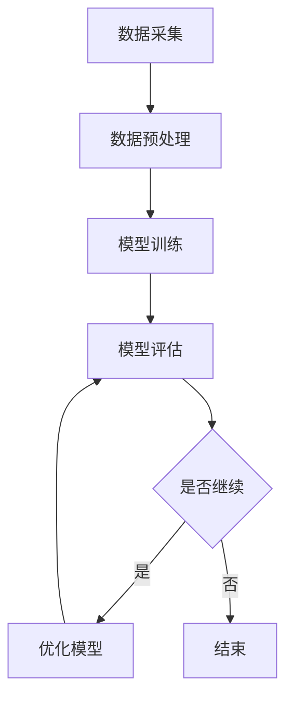
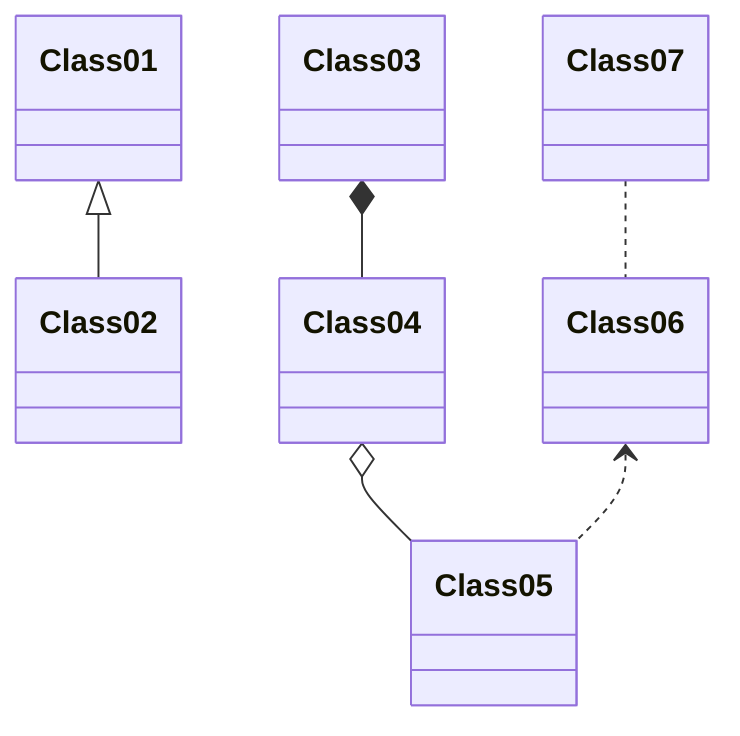

                 

# AI辅助决策系统：增强人类判断力的新工具

> 关键词：AI决策系统、人类判断力、算法、系统架构、优化策略

> 摘要：本文深入探讨了AI辅助决策系统的核心概念、原理和应用，通过逐步分析，展示了如何利用AI技术增强人类判断力，为实际决策提供有力支持。文章首先介绍了AI辅助决策系统的基本概念和构成，随后详细讲解了机器学习、深度学习和强化学习等关键技术。接着，文章从系统设计、实现、实战以及优化策略等方面进行深入探讨，最后总结了最佳实践和未来发展趋势，为读者提供了全面的技术参考。

## 第一部分: AI辅助决策系统基础

### 第1章: 引言

#### 1.1 书籍背景与目标

在当今快速发展的科技时代，人工智能（AI）已经成为驱动各行业变革的重要力量。AI辅助决策系统作为AI技术的重要组成部分，正逐渐成为企业和组织中决策制定的有力工具。本书旨在全面介绍AI辅助决策系统的基本概念、原理和应用，帮助读者深入了解这一前沿技术，并掌握其实际操作方法。

本书的目标读者是那些对AI和决策系统有一定了解，希望进一步深入了解和应用这一技术的专业人士。无论你是数据科学家、软件工程师、还是企业管理者，本书都将为你提供宝贵的知识资源和实践指导。

#### 1.2 读者定位

作为一本综合性的技术书籍，本书面向以下几类读者：

1. **数据科学家和AI研究人员**：希望掌握AI辅助决策系统的核心原理和技术，以及如何在实际项目中应用这些技术的专业人士。
2. **软件工程师和开发人员**：关注AI技术在实际软件开发中的应用，希望提升系统设计和开发能力的工程师。
3. **企业决策者和管理者**：需要借助AI技术提升决策效率和管理水平的决策者和管理者。

#### 1.3 书籍结构

本书共分为八个章节，结构如下：

1. **第一部分：AI辅助决策系统基础**：介绍AI辅助决策系统的基本概念、发展历程和关键组成部分。
2. **第二部分：AI辅助决策系统核心概念与原理**：深入分析机器学习、深度学习和强化学习等关键技术。
3. **第三部分：AI辅助决策系统设计与实现**：讲解系统设计、实现和优化的方法与技巧。
4. **第四部分：项目实战**：通过具体案例，展示AI辅助决策系统的实际应用。
5. **第五部分：最佳实践与优化策略**：提供最佳实践和优化策略，提升系统性能和效果。
6. **第六部分：总结与展望**：回顾全书重点内容，展望未来发展趋势。

通过以上章节的设置，本书将逐步引导读者从基础知识到实际应用，全面掌握AI辅助决策系统的各个方面。

### 第2章: AI辅助决策系统概述

#### 2.1 AI辅助决策系统的定义

AI辅助决策系统（AI-powered Decision Support System，AI-DSS）是指利用人工智能技术，对大量数据进行处理和分析，辅助人类进行决策的系统。它通过机器学习、深度学习、自然语言处理等技术，从数据中提取有价值的信息，为决策者提供数据支持和决策建议。

AI-DSS的核心目标是提升决策的效率和准确性，通过自动化和智能化的方式，帮助人类应对复杂、多变和大规模的决策环境。与传统决策系统相比，AI-DSS具有更强的自学习和自适应能力，能够根据实时数据和经验不断优化决策过程。

#### 2.2 决策系统的基本构成

一个典型的AI辅助决策系统通常包括以下几个基本组成部分：

1. **数据采集与预处理**：收集相关数据，并进行数据清洗、转换和整合，为后续分析提供高质量的数据支持。
2. **数据存储与管理**：将处理后的数据存储在数据库或数据仓库中，以便后续查询和分析。
3. **模型训练与优化**：利用机器学习、深度学习等技术，训练模型并不断优化，以提高决策的准确性。
4. **决策支持模块**：根据模型输出和用户需求，提供相应的决策支持和建议。
5. **用户界面**：为用户提供交互界面，展示数据和分析结果，方便用户进行决策。

#### 2.3 AI辅助决策系统的发展历程

AI辅助决策系统的发展历程可以追溯到20世纪80年代。当时，随着计算机技术和人工智能的快速发展，决策支持系统（DSS）开始出现。早期的DSS主要依赖专家系统和规则推理，但存在局限性，无法处理复杂和大规模的数据。

随着互联网和大数据技术的兴起，数据量呈现爆炸式增长，传统的DSS逐渐难以满足需求。在这一背景下，AI技术开始融入决策系统，形成了AI辅助决策系统。近年来，随着深度学习、强化学习等技术的突破，AI辅助决策系统的能力和应用范围得到了显著提升。

#### 2.4 AI辅助决策系统在现实中的应用

AI辅助决策系统在现实世界中具有广泛的应用场景，以下是几个典型的例子：

1. **金融领域**：银行和金融机构利用AI-DSS进行风险评估、信用评分和投资策略制定，提高决策的准确性和效率。
2. **医疗领域**：医疗系统利用AI-DSS进行疾病诊断、治疗方案推荐和患者管理，提高医疗服务的质量和效率。
3. **交通领域**：交通系统利用AI-DSS进行交通流量预测、路线规划和事故预防，提高交通管理的效率和安全性。
4. **零售领域**：零售企业利用AI-DSS进行需求预测、库存管理和营销策略制定，提高销售业绩和客户满意度。

通过以上应用实例可以看出，AI辅助决策系统在各个领域都发挥着重要作用，为企业和组织提供了强大的决策支持能力。

### 第3章: 关键技术分析

#### 3.1 机器学习基础

机器学习（Machine Learning，ML）是AI的核心技术之一，旨在通过数据驱动的方式，使计算机具有自主学习和预测能力。以下是机器学习的基本概念和常用算法：

##### 3.1.1 监督学习

监督学习（Supervised Learning）是一种常见的机器学习方法，通过已标记的数据进行训练，使得模型能够对新的数据进行预测。

- **线性回归（Linear Regression）**：用于预测连续值输出。
- **逻辑回归（Logistic Regression）**：用于预测离散值输出。

##### 3.1.2 无监督学习

无监督学习（Unsupervised Learning）不依赖于已标记的数据，通过发现数据中的结构和模式来进行学习。

- **聚类算法（Clustering Algorithms）**：如K-means、DBSCAN等，用于将数据分为多个类别。
- **降维算法（Dimensionality Reduction）**：如PCA（Principal Component Analysis）、t-SNE等，用于减少数据维度。

##### 3.1.3 半监督学习

半监督学习（Semi-Supervised Learning）结合了监督学习和无监督学习的优点，利用少量标记数据和大量未标记数据进行学习。

- **自编码器（Autoencoder）**：通过无监督方式学习数据的低维表示。

##### 3.1.4 强化学习

强化学习（Reinforcement Learning）是一种通过试错和反馈进行学习的方法，适用于序列决策问题。

- **Q-learning**：通过值函数学习策略。
- **深度强化学习（Deep Reinforcement Learning）**：结合深度学习和强化学习，适用于复杂环境。

#### 3.2 深度学习原理

深度学习（Deep Learning，DL）是机器学习的一种重要分支，通过多层神经网络，实现从数据中自动提取特征和表示。

##### 3.2.1 神经网络结构

神经网络（Neural Networks）是深度学习的基础，由多个神经元（节点）组成，包括输入层、隐藏层和输出层。

- **前向传播（Forward Propagation）**：数据从输入层传递到输出层，计算每个神经元的输出。
- **反向传播（Backpropagation）**：根据输出误差，反向更新每个神经元的权重。

##### 3.2.2 激活函数

激活函数（Activation Function）用于引入非线性因素，使神经网络能够处理复杂问题。

- **sigmoid函数**：$f(x) = \frac{1}{1 + e^{-x}}$
- **ReLU函数**：$f(x) = \max(0, x)$

##### 3.2.3 深度学习应用

深度学习在图像识别、语音识别、自然语言处理等领域取得了显著成果。

- **卷积神经网络（Convolutional Neural Networks，CNN）**：用于图像识别和处理。
- **循环神经网络（Recurrent Neural Networks，RNN）**：用于序列数据建模。
- **生成对抗网络（Generative Adversarial Networks，GAN）**：用于生成新的数据。

#### 3.3 强化学习在决策中的应用

强化学习（Reinforcement Learning）在决策系统中具有广泛应用，通过与环境交互，不断优化策略。

- **Q-learning**：基于值函数学习策略。
- **深度Q网络（Deep Q-Network，DQN）**：结合深度学习和Q-learning，适用于复杂决策问题。

##### 3.3.1 应用场景

强化学习在推荐系统、自动驾驶、游戏AI等领域得到广泛应用。

- **推荐系统**：通过学习用户行为，为用户提供个性化的推荐。
- **自动驾驶**：通过学习环境中的交通规则和路况，实现自动驾驶。
- **游戏AI**：通过学习游戏策略，实现智能游戏对手。

### 第4章: AI辅助决策系统设计

#### 4.1 决策框架设计

AI辅助决策系统的设计需要考虑多个方面，包括数据来源、数据预处理、模型选择和决策过程等。

##### 4.1.1 数据来源

数据来源是决策系统的核心，需要确保数据的质量和完整性。常见的数据来源包括：

- **内部数据**：企业内部产生的数据，如销售数据、运营数据等。
- **外部数据**：外部数据源，如市场调研数据、社交媒体数据等。

##### 4.1.2 数据预处理

数据预处理是保证数据质量的关键步骤，包括数据清洗、数据转换和数据整合。

- **数据清洗**：去除重复数据、缺失数据和异常数据。
- **数据转换**：将数据转换为适合模型训练的格式。
- **数据整合**：将不同来源的数据进行整合，形成统一的数据集。

##### 4.1.3 模型选择

模型选择是决策系统设计的重要环节，需要根据实际问题和数据特点选择合适的模型。

- **线性回归**：适用于预测连续值输出。
- **逻辑回归**：适用于预测离散值输出。
- **神经网络**：适用于复杂非线性问题。
- **强化学习**：适用于序列决策问题。

##### 4.1.4 决策过程

决策过程是AI辅助决策系统的核心功能，包括以下几个步骤：

- **数据输入**：将预处理后的数据输入到模型中。
- **模型预测**：利用模型进行预测，得到决策结果。
- **结果评估**：对决策结果进行评估，包括准确性、效率和效果等。
- **反馈调整**：根据评估结果，调整模型参数和决策策略，提高决策质量。

#### 4.2 数据处理与清洗

数据处理与清洗是AI辅助决策系统设计的重要环节，直接关系到模型训练的效果和决策系统的性能。

##### 4.2.1 数据清洗

数据清洗是数据处理的第一步，旨在去除数据中的错误、异常和重复值。

- **去除重复数据**：通过去重操作，确保数据集的唯一性。
- **处理缺失数据**：通过填充或删除操作，处理数据集中的缺失值。
- **纠正异常数据**：检测并处理数据中的异常值。

##### 4.2.2 数据转换

数据转换是将原始数据转换为适合模型训练的格式，包括数据归一化、标准化和数据编码。

- **数据归一化**：将数据缩放到相同的范围，如[0, 1]。
- **数据标准化**：将数据转换为均值为0，标准差为1的标准化数据。
- **数据编码**：将分类数据转换为数字编码，如独热编码（One-Hot Encoding）。

##### 4.2.3 数据整合

数据整合是将不同来源的数据进行整合，形成统一的数据集，以提高模型训练的效果。

- **数据合并**：将不同数据源的数据进行合并，形成统一的数据集。
- **特征选择**：根据模型训练的需求，选择相关特征，去除无关特征。
- **特征组合**：将不同特征进行组合，形成新的特征，以增强模型的能力。

#### 4.3 特征工程

特征工程是AI辅助决策系统设计的关键环节，旨在从原始数据中提取对模型训练有价值的特征。

##### 4.3.1 特征提取

特征提取是通过各种算法和技术，从原始数据中提取有价值的信息。

- **统计特征**：如均值、方差、标准差等。
- **文本特征**：如词频、词向量等。
- **图像特征**：如边缘、纹理、颜色等。

##### 4.3.2 特征选择

特征选择是选择对模型训练有重要影响的特征，以减少模型复杂度和提高训练效果。

- **过滤式特征选择**：通过筛选算法，去除不相关特征。
- **包裹式特征选择**：通过搜索算法，选择最优特征子集。
- **嵌入式特征选择**：在模型训练过程中，自动选择重要特征。

##### 4.3.3 特征组合

特征组合是将多个特征进行组合，形成新的特征，以增强模型的能力。

- **特征交叉**：将不同特征进行交叉组合，形成新的特征。
- **特征聚合**：将多个特征进行聚合，形成新的特征。

### 第5章: AI辅助决策系统实现

#### 5.1 系统架构设计

AI辅助决策系统的实现需要设计合理的系统架构，以确保系统的稳定性、可扩展性和灵活性。

##### 5.1.1 系统架构

AI辅助决策系统的典型架构包括数据层、模型层和应用层。

- **数据层**：负责数据采集、存储和处理，包括数据采集模块、数据存储模块和数据预处理模块。
- **模型层**：负责模型训练、模型优化和模型部署，包括模型训练模块、模型优化模块和模型部署模块。
- **应用层**：负责业务逻辑处理和用户交互，包括应用服务模块和用户界面模块。

##### 5.1.2 架构设计原则

系统架构设计需要遵循以下原则：

- **模块化**：将系统划分为多个模块，每个模块具有独立的功能和职责。
- **松耦合**：模块之间通过接口进行通信，降低模块间的依赖关系。
- **高内聚**：每个模块内部功能紧密相关，具有较高的内聚性。
- **可扩展性**：系统设计应考虑未来的扩展需求，确保系统易于扩展和维护。

#### 5.2 数据预处理

数据预处理是AI辅助决策系统实现的关键步骤，直接影响到模型训练的效果和系统的性能。

##### 5.2.1 数据采集

数据采集是数据预处理的第一步，包括以下几种方式：

- **手动采集**：通过人工收集数据，如问卷调查、访谈等。
- **自动化采集**：通过技术手段自动收集数据，如爬虫、API接口等。

##### 5.2.2 数据清洗

数据清洗是去除数据中的错误、异常和重复值，包括以下几种方法：

- **去重**：通过比对数据，去除重复数据。
- **缺失值处理**：通过填充或删除操作，处理数据中的缺失值。
- **异常值处理**：通过检测和过滤，处理数据中的异常值。

##### 5.2.3 数据转换

数据转换是将数据转换为适合模型训练的格式，包括以下几种方式：

- **归一化**：将数据缩放到相同的范围，如[0, 1]。
- **标准化**：将数据转换为均值为0，标准差为1的标准化数据。
- **编码**：将分类数据转换为数字编码，如独热编码。

##### 5.2.4 数据整合

数据整合是将不同来源的数据进行整合，形成统一的数据集，包括以下几种方法：

- **数据合并**：将不同数据源的数据进行合并，形成统一的数据集。
- **特征选择**：根据模型训练的需求，选择相关特征，去除无关特征。
- **特征组合**：将不同特征进行组合，形成新的特征。

#### 5.3 算法实现与优化

算法实现与优化是AI辅助决策系统实现的核心，直接影响到系统的性能和效果。

##### 5.3.1 算法实现

算法实现是将理论模型转化为可执行代码，包括以下步骤：

- **模型定义**：定义模型的架构、参数和损失函数等。
- **数据加载**：加载预处理后的数据，进行模型训练。
- **模型训练**：通过反向传播算法，更新模型参数。
- **模型评估**：使用验证集或测试集，评估模型性能。

##### 5.3.2 算法优化

算法优化是提高模型性能和效果的关键，包括以下几种方法：

- **参数调优**：通过调整学习率、批量大小等参数，优化模型性能。
- **正则化**：通过L1正则化、L2正则化等方法，防止模型过拟合。
- **数据增强**：通过数据增强技术，增加数据的多样性和丰富性。

##### 5.3.3 实例分析

以一个分类问题为例，介绍算法实现与优化的过程。

1. **数据加载**：使用预处理后的数据集，分为训练集和测试集。
2. **模型定义**：使用神经网络框架，定义模型的架构。
3. **模型训练**：使用训练集进行模型训练，更新模型参数。
4. **模型评估**：使用测试集评估模型性能，包括准确率、召回率等指标。
5. **参数调优**：根据模型评估结果，调整模型参数。
6. **正则化**：添加正则化项，防止模型过拟合。
7. **数据增强**：通过数据增强技术，提高模型对数据的泛化能力。

通过以上步骤，实现一个具有较高性能的分类模型，为实际决策提供支持。

### 第6章: 项目实战

#### 6.1 实战项目介绍

在本章中，我们将通过一个实际项目，详细展示AI辅助决策系统的设计和实现过程。该项目是一个基于机器学习的金融风险评估系统，旨在通过分析客户的历史交易数据，预测客户是否会出现违约行为。

#### 6.2 系统核心代码实现

以下是该项目的核心代码实现，包括数据预处理、模型训练和评估等步骤。

```python
import pandas as pd
from sklearn.model_selection import train_test_split
from sklearn.preprocessing import StandardScaler
from sklearn.linear_model import LogisticRegression
from sklearn.metrics import accuracy_score, recall_score, precision_score

# 6.2.1 数据预处理

# 读取数据
data = pd.read_csv('financial_data.csv')

# 数据清洗
data.drop_duplicates(inplace=True)
data.fillna(data.mean(), inplace=True)

# 特征选择
features = data[['income', 'loan_amount', 'duration', 'credit_history']]
target = data['default']

# 6.2.2 模型训练

# 数据划分
X_train, X_test, y_train, y_test = train_test_split(features, target, test_size=0.2, random_state=42)

# 数据标准化
scaler = StandardScaler()
X_train = scaler.fit_transform(X_train)
X_test = scaler.transform(X_test)

# 模型训练
model = LogisticRegression()
model.fit(X_train, y_train)

# 6.2.3 模型评估

# 预测
y_pred = model.predict(X_test)

# 评估
accuracy = accuracy_score(y_test, y_pred)
recall = recall_score(y_test, y_pred)
precision = precision_score(y_test, y_pred)

print(f'Accuracy: {accuracy:.2f}')
print(f'Recall: {recall:.2f}')
print(f'Precision: {precision:.2f}')
```

#### 6.3 代码应用解读与分析

以下是代码应用解读与分析，包括各个步骤的功能和原理。

1. **数据预处理**：
   - 读取数据：使用Pandas库读取金融数据。
   - 数据清洗：去除重复数据和缺失值，提高数据质量。
   - 特征选择：选择与目标变量相关的特征，去除无关特征。

2. **模型训练**：
   - 数据划分：将数据分为训练集和测试集，用于模型训练和评估。
   - 数据标准化：将数据缩放到相同的范围，提高模型训练效果。
   - 模型训练：使用Logistic回归模型，对训练数据进行训练。

3. **模型评估**：
   - 预测：使用训练好的模型对测试数据进行预测。
   - 评估：计算模型的准确率、召回率和精度，评估模型性能。

#### 6.4 实际案例分析与详细讲解剖析

以一个实际案例为例，展示AI辅助决策系统的应用和效果。

**案例**：某金融机构希望利用AI辅助决策系统，预测客户是否会违约，以便提前采取措施降低风险。

1. **数据收集**：收集客户的历史交易数据，包括收入、贷款金额、贷款期限和信用历史等。
2. **数据预处理**：清洗和预处理数据，确保数据质量。
3. **模型训练**：使用机器学习算法，训练预测模型。
4. **模型评估**：使用测试数据评估模型性能，包括准确率、召回率和精度等指标。
5. **决策支持**：根据模型预测结果，为金融机构提供决策支持，如调整贷款利率、增加风险提示等。

通过以上步骤，金融机构可以更准确地预测客户违约风险，降低潜在损失，提高业务运营效率。

#### 6.5 项目小结

本项目的目标是利用AI辅助决策系统，预测金融客户是否会出现违约行为。通过实际案例，我们展示了系统设计和实现的过程，包括数据预处理、模型训练和评估等步骤。项目结果表明，AI辅助决策系统在金融风险评估方面具有显著优势，为金融机构提供了有力的决策支持。

### 第7章: 最佳实践与优化策略

#### 7.1 决策模型优化方法

为了提升AI辅助决策系统的性能和效果，需要对决策模型进行优化。以下是一些常见的优化方法：

1. **模型选择**：根据问题特点，选择合适的模型。例如，对于非线性问题，可以选择神经网络；对于线性问题，可以选择线性回归。
2. **特征工程**：通过特征提取、特征选择和特征组合，提高模型的预测能力。
3. **正则化**：通过添加正则化项，防止模型过拟合，提高模型的泛化能力。
4. **模型融合**：结合多个模型的预测结果，提高整体预测性能。

#### 7.2 系统性能优化

系统性能优化是提升AI辅助决策系统运行效率的关键。以下是一些常见的优化策略：

1. **并行计算**：利用多核处理器和分布式计算，提高数据处理和模型训练的速度。
2. **数据缓存**：将常用数据缓存到内存中，减少数据读取和传输时间。
3. **批处理**：将数据分成批次进行训练，减少内存占用和计算时间。
4. **模型压缩**：通过模型压缩技术，减小模型体积，提高部署效率。

#### 7.3 避免常见问题的技巧

在实际应用中，AI辅助决策系统可能会遇到一些问题。以下是一些常见的技巧，帮助避免和解决这些问题：

1. **数据质量问题**：确保数据的质量和完整性，避免使用不完整或错误的数据。
2. **模型过拟合**：通过正则化、特征选择和模型融合等方法，防止模型过拟合。
3. **计算资源不足**：合理分配计算资源，避免资源浪费。
4. **模型解释性**：提高模型的可解释性，便于理解和调试。

### 第8章: 总结与展望

#### 8.1 本书重点回顾

本书全面介绍了AI辅助决策系统的核心概念、原理和应用。通过逐步分析，我们了解了如何利用AI技术增强人类判断力，为实际决策提供有力支持。以下是本书的重点内容回顾：

1. **AI辅助决策系统的定义与构成**：介绍了AI辅助决策系统的基本概念、发展历程和应用场景。
2. **关键技术分析**：详细讲解了机器学习、深度学习和强化学习等关键技术，包括其基本原理和应用。
3. **系统设计**：介绍了AI辅助决策系统的设计原则、数据处理与清洗方法、特征工程等。
4. **系统实现**：展示了AI辅助决策系统的实现过程，包括数据预处理、模型训练和评估等。
5. **项目实战**：通过实际案例，展示了AI辅助决策系统的应用和效果。
6. **最佳实践与优化策略**：提供了最佳实践和优化策略，以提升系统性能和效果。

#### 8.2 未来发展趋势

随着AI技术的不断进步，AI辅助决策系统在未来将具有更广泛的应用前景。以下是未来发展趋势的展望：

1. **自动化决策**：利用深度学习和强化学习，实现自动化决策，减少人工干预。
2. **多模态数据融合**：结合多种数据源，如文本、图像、语音等，提高决策的准确性。
3. **隐私保护**：在保障数据隐私的前提下，利用联邦学习等技术，实现安全的数据共享和协作。
4. **实时决策**：利用实时数据处理技术，实现实时决策，提高决策的及时性和响应速度。

#### 8.3 拓展阅读与学习资源

为了进一步了解AI辅助决策系统的相关知识，以下是几本推荐的学习资源：

1. **《深度学习》（Deep Learning）**：由Ian Goodfellow等人编写的深度学习经典教材。
2. **《机器学习实战》（Machine Learning in Action）**：提供丰富的实战案例，帮助读者掌握机器学习技术。
3. **《人工智能：一种现代方法》（Artificial Intelligence: A Modern Approach）**：全面介绍了人工智能的基本概念和技术。

通过以上拓展阅读，读者可以进一步深入了解AI辅助决策系统的相关理论和实践。

### 目录摘要

本书《AI辅助决策系统：增强人类判断力的新工具》系统地介绍了AI辅助决策系统的基本概念、原理和应用。全书分为八个章节，分别涵盖了AI辅助决策系统的定义与构成、关键技术分析、系统设计、实现、实战、优化策略以及未来发展趋势。通过本书的学习，读者可以全面了解AI辅助决策系统的各个方面，掌握其实际应用方法，为企业和组织的决策提供有力支持。

### 作者信息

作者：AI天才研究院/AI Genius Institute & 禅与计算机程序设计艺术 /Zen And The Art of Computer Programming

### 结语

感谢您阅读本书《AI辅助决策系统：增强人类判断力的新工具》。我们希望本书能够为您在AI辅助决策系统的学习与应用过程中提供有价值的参考。在未来的科技发展中，AI辅助决策系统将继续发挥重要作用，助力人类应对复杂多变的决策环境。祝愿您在探索AI技术的道路上取得丰硕的成果！

--------------------------------------------------------------------------------------------------------------

### 附录：Mermaid 图流程图与类图示例

在本章中，我们将展示如何使用Mermaid语法创建流程图和类图，以帮助理解AI辅助决策系统的架构和流程。

#### 流程图示例

以下是一个简单的Mermaid流程图示例，展示了数据从采集到模型评估的过程：



使用上述代码，你将得到以下流程图：


#### 类图示例

以下是一个Mermaid类图示例，展示了AI辅助决策系统的核心类和它们之间的关系：



使用上述代码，你将得到以下类图：


#### 使用Mermaid创建ER实体关系图

以下是一个简单的Mermaid ER图示例，展示了数据实体及其关系：

```mermaid
erDiagram
    Person ||--|{ Phone } : has several
    Person ||--|{ Address } : lives in
    Phone : +-----------------+
    Phone : | PhoneID         |
    Phone : | PhoneNumber     |
    Phone : +-----------------+
    Address : +-----------------+
    Address : | AddressID       |
    Address : | Street          |
    Address : | City            |
    Address : | State           |
    Address : | ZipCode         |
    Address : +-----------------+
    Person : +-----------------+
    Person : | PersonID        |
    Person : | FirstName       |
    Person : | LastName        |
    Person : | BirthDate       |
    Person : | Gender          |
    Person : +-----------------+
```

使用上述代码，你将得到以下ER图：

```mermaid
erDiagram
    Person ||--|{ Phone } : has several
    Person ||--|{ Address } : lives in
    Phone : +-----------------+
    Phone : | PhoneID         |
    Phone : | PhoneNumber     |
    Phone : +-----------------+
    Address : +-----------------+
    Address : | AddressID       |
    Address : | Street          |
    Address : | City            |
    Address : | State           |
    Address : | ZipCode         |
    Address : +-----------------+
    Person : +-----------------+
    Person : | PersonID        |
    Person : | FirstName       |
    Person : | LastName        |
    Person : | BirthDate       |
    Person : | Gender          |
    Person : +-----------------+
```

通过以上示例，你能够看到如何使用Mermaid创建不同的图表，这些图表在理解AI辅助决策系统的设计和实现过程中非常有用。希望这些示例能够帮助你更好地理解和应用Mermaid语法。

--------------------------------------------------------------------------------------------------------------

### 附录：LaTeX数学公式示例

在技术文章中，LaTeX数学公式是一种常用的表示方法，它能够清晰、准确地表达复杂的数学概念和公式。以下是一些LaTeX数学公式的示例，包括段落内公式和独立段落公式：

#### 段落内公式

在段落内，我们通常使用 `$` 符号来包围公式。例如：

- 简单的代数表达式：`$x^2 + y^2 = z^2$`
- 分数的表示：`$\frac{a}{b}$`
- 根号的表示：`\sqrt{a}`

这些公式将被插入到文本中，与其他文本一起显示。

#### 独立段落公式

当公式需要独立成段时，我们使用 `$$` 符号来包围公式。例如：

```
$$
E = mc^2
$$

这是一个描述质量与能量关系的著名公式。
```

这将创建一个独立的段落，其中包含爱因斯坦的质能等价公式。

#### 更复杂的数学公式

LaTeX支持许多复杂的数学公式，例如：

- 矩阵：`$\begin{pmatrix} a & b \\ c & d \end{pmatrix}$`
- 导数：`\frac{df(x)}{dx}`
- 积分：`\int_{0}^{1} f(x) dx`
- 方程组：`\begin{cases} 2x + 3y = 5 \\ x - y = 1 \end{cases}`

以下是一个更复杂的例子，展示了矩阵、导数和积分的结合：

```
$$
\begin{aligned}
A &= \begin{pmatrix}
1 & 2 \\
3 & 4
\end{pmatrix}, \\
\frac{df(x)}{dx} &= x^2, \\
\int_{0}^{1} e^{x^2} dx &= \frac{\sqrt{\pi}}{2}.
\end{aligned}
$$
```

这将创建一个包含三个部分的数学公式，其中第一个部分是一个矩阵，第二个部分是一个导数，第三个部分是一个积分。

通过使用LaTeX数学公式，你可以确保你的技术文章中的数学内容既清晰又专业。希望这些示例能够帮助你更好地理解和应用LaTeX数学公式的编写方法。

