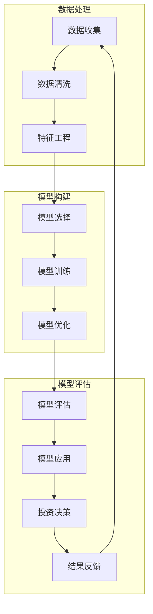

                 

# 《AI辅助发现新兴市场价值投资标的》

## 关键词

- AI技术
- 价值投资
- 新兴市场
- 机器学习
- 投资模型
- 算法优化
- 投资决策辅助

## 摘要

本文旨在探讨如何利用人工智能技术辅助投资者发现新兴市场的价值投资标的。通过深入分析AI技术、价值投资原理以及新兴市场的特性，本文提出了一套基于机器学习的投资模型，并详细阐述了其构建、训练和优化的过程。此外，本文还介绍了系统的架构设计、实战应用以及最佳实践，为投资者提供了实用的参考和指导。

## 目录大纲

**第一部分：问题背景与概念介绍**

### 第1章：AI与价值投资概述

#### 1.1 AI技术发展历程与现状

#### 1.2 价值投资的原理与策略

#### 1.3 AI辅助价值投资的必然性

#### 1.4 研究目的与结构安排

### 第2章：新兴市场与投资机会

#### 2.1 新兴市场的定义与特点

#### 2.2 新兴市场的投资价值

#### 2.3 新兴市场的风险因素

#### 2.4 投资标的筛选标准

**第二部分：核心概念与算法原理**

### 第3章：AI核心概念与算法基础

#### 3.1 机器学习基本概念

#### 3.2 预测模型与评估指标

#### 3.3 特征工程与特征选择

#### 3.4 AI在投资领域的应用案例

### 第4章：价值投资与AI结合的理论与实践

#### 4.1 价值投资与AI的结合点

#### 4.2 AI辅助价值投资模型构建

#### 4.3 模型训练与优化策略

#### 4.4 模型应用案例分析

### 第5章：数学模型与算法流程

#### 5.1 数学模型基础

#### 5.2 模型参数优化

#### 5.3 算法流程图与解释

#### 5.4 Python代码实现

**第三部分：系统架构与实战应用**

### 第6章：系统架构设计与实现

#### 6.1 系统需求分析

#### 6.2 数据采集与处理

#### 6.3 模型部署与调用

#### 6.4 系统性能优化

### 第7章：项目实战与案例分析

#### 7.1 项目背景与目标

#### 7.2 环境搭建与依赖安装

#### 7.3 系统核心实现源代码解读

#### 7.4 实际案例分析与详细讲解

#### 7.5 项目小结与总结

**第四部分：最佳实践与展望**

### 第8章：最佳实践与注意事项

#### 8.1 AI辅助价值投资的误区与解决

#### 8.2 投资决策的辅助工具使用技巧

#### 8.3 投资策略的调整与优化

#### 8.4 注意事项与风险控制

### 第9章：未来展望与拓展阅读

#### 9.1 AI辅助价值投资的发展趋势

#### 9.2 技术创新与市场变革

#### 9.3 拓展阅读推荐

## 文章标题

### 《AI辅助发现新兴市场价值投资标的》

### **1.1 AI技术发展历程与现状**

人工智能（AI）技术作为计算机科学的重要分支，已经取得了令人瞩目的进展。从最初的1956年达特茅斯会议提出人工智能概念，到20世纪80年代专家系统的崛起，再到21世纪初深度学习的蓬勃发展，AI技术经历了从理论到实践的转变。

当前，AI技术在各个领域得到了广泛应用，包括语音识别、图像识别、自然语言处理、自动驾驶、医疗诊断等。特别是在大数据和云计算的推动下，AI算法的训练效率和性能得到了大幅提升，使得AI在解决复杂问题方面展现出巨大的潜力。

在投资领域，AI技术的应用也逐渐受到关注。通过分析大量数据，AI可以识别出潜在的投资机会，提供个性化的投资建议，甚至实现全自动化的投资策略。本文将探讨如何利用AI技术辅助投资者发现新兴市场的价值投资标的。

### **1.2 价值投资的原理与策略**

价值投资是一种基于对公司内在价值的评估来进行投资的方法。其核心思想是寻找那些被市场低估的公司，即其股票价格低于其真实价值。价值投资的原理可以概括为以下几点：

1. **内在价值评估**：通过对公司的财务报表、行业前景、管理层能力等因素进行分析，评估公司的内在价值。
2. **市场情绪分析**：市场情绪往往会导致股票价格偏离其内在价值，价值投资者需要分析市场情绪，寻找被低估的机会。
3. **长期投资**：价值投资注重长期持有，通过时间的沉淀来等待市场对公司的价值重估。

在价值投资策略中，常用的方法包括：

1. **格雷厄姆法**：以股票价格低于账面价值为主要指标，寻找低估的投资机会。
2. **费雪法**：注重对公司未来增长潜力的评估，寻找具有持续增长能力的公司。
3. **邓普顿法**：以公司业绩和市盈率的关系为依据，寻找低估的投资机会。

价值投资与AI技术的结合，意味着可以利用AI强大的数据处理和分析能力，对大量数据进行深度挖掘，以提高价值投资决策的准确性和效率。本文将详细介绍如何利用AI技术实现这一目标。

### **1.3 AI辅助价值投资的必然性**

随着数据量的爆炸式增长，传统的投资分析方法已经难以应对复杂的投资环境。AI技术的引入，为价值投资带来了新的可能性和挑战。以下是AI辅助价值投资的必然性：

1. **数据处理能力**：AI能够处理海量数据，从中提取出有价值的信息，这对于价值投资中的数据分析和市场情绪分析具有重要意义。
2. **预测准确性**：AI通过机器学习算法，可以建立复杂的预测模型，提高对市场趋势和公司未来表现的预测准确性。
3. **效率提升**：AI技术可以自动化执行复杂的投资策略，降低人工干预，提高投资决策的效率。
4. **风险控制**：AI可以通过实时数据分析，及时发现市场变化和风险，提供及时的风险控制策略。

然而，AI辅助价值投资也面临一些挑战，如数据质量、算法透明度、风险控制等。本文将在后续章节中详细讨论这些挑战和解决方案。

### **1.4 研究目的与结构安排**

本文的研究目的是探讨如何利用AI技术辅助投资者发现新兴市场的价值投资标的，提高投资决策的准确性和效率。具体来说，本文将实现以下目标：

1. **构建AI辅助价值投资模型**：结合价值投资原理和AI技术，构建一套能够自动发现新兴市场价值投资标的的模型。
2. **模型训练与优化**：利用历史数据对模型进行训练和优化，提高模型的预测准确性和稳定性。
3. **系统实现与实战应用**：设计并实现一个基于AI的价值投资辅助系统，通过实际案例验证系统的有效性。

本文的结构安排如下：

- **第一部分**：介绍AI技术和价值投资的基本概念，阐述AI辅助价值投资的必然性。
- **第二部分**：详细讨论AI辅助价值投资的核心概念与算法原理。
- **第三部分**：介绍系统的架构设计、实现与实战应用。
- **第四部分**：总结最佳实践、注意事项和未来展望。

通过本文的研究，旨在为投资者提供一种新的投资决策工具，帮助他们在新兴市场中找到具有潜在价值的投资标的。

### **2.1 新兴市场的定义与特点**

新兴市场（Emerging Markets）通常指的是那些经济快速发展、市场化改革程度较高、但尚未达到发达国家水平的国家或地区。这些市场往往具有以下几个显著特点：

1. **经济增长潜力大**：新兴市场国家在人口、资源、劳动力等方面具有较大潜力，随着经济体制的改革和市场开放的深化，这些国家的经济增长速度通常高于发达国家。
2. **市场改革与开放**：许多新兴市场国家在改革开放过程中，逐步取消管制、引入市场机制，提高经济效率和竞争力，这为外资和企业提供了更多的发展机会。
3. **政策不确定性较高**：新兴市场国家在政治、法律、经济等方面可能存在较高的不确定性，这增加了投资风险。因此，投资者需要密切关注政策动向，以降低潜在风险。
4. **投资吸引力**：尽管存在一定风险，但新兴市场的快速发展和巨大潜力吸引了大量国际资本，成为全球投资者关注的焦点。

根据国际货币基金组织（IMF）的定义，新兴市场主要包括以下国家和地区：巴西、俄罗斯、印度、中国、印度尼西亚、土耳其、南非等。这些国家在不同的经济领域具有各自的特色和优势，如中国在全球制造业中的领先地位，印度的IT服务产业等。

新兴市场的快速崛起，不仅为全球经济增长提供了新动力，也为投资者提供了广阔的投资机会。然而，由于新兴市场的政策环境、市场机制、法律体系等仍处于不断完善的阶段，投资者在进入这些市场时需要充分考虑风险因素，并采取有效的风险管理策略。

### **2.2 新兴市场的投资价值**

新兴市场的投资价值体现在多个方面，首先，这些市场的经济增长潜力巨大。以中国、印度、巴西等国家为例，它们在过去的几十年中，经济增速持续高于全球平均水平，成为全球经济增长的重要引擎。随着人口规模的增长和消费水平的提升，这些国家的市场需求不断扩大，为企业提供了广阔的市场空间。

其次，新兴市场的市场改革和开放也为投资者带来了新的机遇。许多新兴市场国家在推进市场化改革、改善投资环境方面取得了显著成效。例如，中国近年来不断优化外商投资政策，简化审批流程，提高了外资企业的投资便利性。这些政策吸引了大量国际资本进入，推动了市场的发展和繁荣。

此外，新兴市场国家的产业特色和竞争优势也是其投资价值的重要体现。例如，印度在软件开发、医疗设备、金融科技等领域具有明显的竞争优势，吸引了众多国际企业的投资和合作。巴西则在能源、农业、矿产资源等领域拥有丰富的资源，为全球投资者提供了多元化的投资选择。

然而，新兴市场的投资价值也伴随着较高的风险。政策不确定性、法律环境不完善、金融体系脆弱等都是潜在的风险因素。因此，投资者在关注新兴市场的投资价值时，需要全面评估风险，并采取有效的风险管理和控制措施。

### **2.3 新兴市场的风险因素**

尽管新兴市场具有巨大的投资价值，但投资者在进入这些市场时也需要充分认识到潜在的风险因素。以下是新兴市场投资中常见的几个风险：

1. **政策风险**：新兴市场国家的政策环境可能存在较高不确定性，政策变动可能导致市场环境急剧变化，影响企业的运营和投资回报。例如，政府突然出台的税收政策调整、外汇管制措施等都可能对投资者产生重大影响。
2. **法律风险**：许多新兴市场的法律体系尚不完善，法律执行力度较弱，可能存在法律不明确、法律解释不一致等问题。这增加了企业在这些市场进行投资和运营的法律风险。
3. **金融风险**：新兴市场的金融体系相对脆弱，金融市场的波动性较大。货币贬值、资本外流、金融市场动荡等都可能对投资者造成损失。例如，印度卢比在2018年出现大幅贬值，导致许多投资者的资产遭受重创。
4. **经济风险**：新兴市场的经济基础和产业结构相对单一，经济增长过度依赖某些行业或外部需求。因此，这些市场在经济周期中的波动性较大，一旦出现经济衰退，企业盈利能力和市场估值都可能受到严重影响。

为了有效管理这些风险，投资者需要深入了解目标市场的政治、经济、法律环境，制定科学的投资策略，并采取多元化的投资组合来分散风险。

### **2.4 投资标的筛选标准**

在新兴市场中筛选具有潜在投资价值的企业，需要制定科学、系统的筛选标准。以下是几个关键指标：

1. **财务指标**：企业的财务状况是评估其投资价值的重要依据。常用的财务指标包括收入增长率、净利润率、现金流、负债率等。投资者应选择那些收入增长稳定、净利润率高、现金流充足、负债率合理的企业。
2. **业务模式**：企业的业务模式是否具有竞争力是另一个重要考量因素。投资者应选择那些具有独特竞争优势、市场前景广阔、业务模式可持续的企业。例如，拥有核心技术、品牌优势、市场份额的企业通常具有较高的投资价值。
3. **管理层能力**：企业管理层的能力对企业的发展至关重要。投资者应选择那些具有良好管理经验、战略眼光和管理能力强的企业。企业管理层的稳定性、诚信度和执行力也是需要关注的方面。
4. **市场环境**：企业所处的市场环境对其发展具有直接影响。投资者应选择那些市场需求旺盛、行业增长潜力大的企业。例如，随着全球数字化进程的加快，互联网、云计算、大数据等领域的投资机会日益增多。
5. **社会责任**：企业的社会责任感和可持续发展能力也是评估其投资价值的重要因素。那些注重环境保护、社会责任、员工福利的企业，通常具有更稳健的经营和更高的社会认同度。

通过综合考虑以上指标，投资者可以筛选出具有投资价值的新兴市场企业，为投资决策提供有力支持。

### **3.1 机器学习基本概念**

机器学习（Machine Learning，ML）是人工智能（AI）的重要组成部分，它使计算机系统能够从数据中学习并作出决策或预测，而无需显式编程。以下是机器学习的一些基本概念：

#### **监督学习（Supervised Learning）**

监督学习是最常见的机器学习任务之一。它通过使用带有标签的训练数据来训练模型，然后使用这个模型对新的、未标记的数据进行预测。监督学习可以分为以下几类：

- **分类（Classification）**：将数据分为不同的类别。例如，判断一个电子邮件是垃圾邮件还是正常邮件。
- **回归（Regression）**：预测一个连续的数值输出。例如，预测房屋的价格。

#### **无监督学习（Unsupervised Learning）**

无监督学习不使用带有标签的数据。它的目标是发现数据中的隐藏结构和模式。无监督学习主要包括：

- **聚类（Clustering）**：将相似的数据点分组。例如，将顾客按照购买行为分成不同的群体。
- **降维（Dimensionality Reduction）**：减少数据维度，同时保持数据的关键特征。例如，使用主成分分析（PCA）来简化数据。

#### **强化学习（Reinforcement Learning）**

强化学习是一种通过与环境的互动来学习策略的机器学习方法。它通过尝试不同的动作，并根据环境的反馈来调整其行为。强化学习广泛应用于游戏、机器人控制等领域。

#### **深度学习（Deep Learning）**

深度学习是机器学习的一个子领域，它使用具有多个隐藏层的神经网络进行训练。深度学习在图像识别、自然语言处理等领域取得了显著成果。常见的深度学习模型包括：

- **卷积神经网络（CNN）**：主要用于图像处理。
- **循环神经网络（RNN）**：主要用于序列数据，如语音和文本。

#### **模型评估指标**

在机器学习中，模型评估是确保模型性能和可靠性的关键步骤。以下是一些常见的模型评估指标：

- **准确率（Accuracy）**：分类问题中最常用的评估指标，表示正确预测的样本占总样本的比例。
- **召回率（Recall）**：在分类问题中，表示真正例中被正确预测为正类的比例。
- **精确率（Precision）**：在分类问题中，表示正确预测为正类的样本中被正确预测为正类的比例。
- **F1分数（F1 Score）**：是精确率和召回率的加权平均，用于综合评估分类模型的性能。

通过了解这些基本概念，我们可以更好地应用机器学习技术来解决投资领域的实际问题。

### **3.2 预测模型与评估指标**

在AI辅助价值投资中，预测模型的构建与评估至关重要。一个有效的预测模型能够帮助投资者识别潜在的投资机会，降低投资风险。以下是常见的预测模型类型以及评估这些模型的关键指标。

#### **预测模型类型**

1. **线性回归模型**：线性回归模型是最简单的预测模型之一，它通过拟合一条直线来预测目标变量的值。线性回归适用于预测连续数值型数据。

2. **逻辑回归模型**：逻辑回归是一种广义线性模型，用于处理分类问题。它通过拟合一个逻辑函数来预测概率，从而进行分类。

3. **决策树模型**：决策树是一种基于树形结构的预测模型，通过一系列规则对数据进行分类或回归。决策树模型直观易懂，但在数据量较大时可能过拟合。

4. **随机森林模型**：随机森林是一种集成学习模型，通过构建多个决策树并汇总结果来提高预测准确性。随机森林在处理高维数据和非线性关系时表现出色。

5. **支持向量机（SVM）模型**：支持向量机是一种用于分类和回归的模型，通过找到一个最佳的超平面来分隔数据。SVM在处理小样本数据和具有高维特征的数据时表现优异。

6. **神经网络模型**：神经网络，特别是深度学习模型，通过多层神经元网络进行学习，能够自动提取数据中的复杂特征，适用于处理复杂的非线性问题。

#### **评估指标**

1. **准确率（Accuracy）**：准确率是评估分类模型性能的最基本指标，表示正确预测的样本占总样本的比例。尽管简单，但准确率在某些情况下可能不能完全反映模型的性能。

2. **精确率（Precision）**：精确率表示被正确预测为正类的样本中实际为正类的比例。它关注的是预测正类的准确性。

3. **召回率（Recall）**：召回率表示被正确预测为正类的样本中实际为正类的比例。它关注的是所有正类样本中预测正确的比例。

4. **F1分数（F1 Score）**：F1分数是精确率和召回率的调和平均，用于综合评估分类模型的性能。F1分数在正负样本比例失衡的情况下尤为重要。

5. **均方误差（Mean Squared Error, MSE）**：均方误差是评估回归模型性能的常用指标，表示预测值与真实值之间平均误差的平方。MSE越小，模型的预测性能越好。

6. **均绝对误差（Mean Absolute Error, MAE）**：均绝对误差是评估回归模型性能的另一种指标，表示预测值与真实值之间平均绝对误差。MAE越小，模型的预测性能越好。

通过合理选择预测模型类型和评估指标，投资者可以构建出性能优异的投资预测模型，从而提高投资决策的准确性和效率。

### **3.3 特征工程与特征选择**

在机器学习应用中，特征工程与特征选择是提高模型性能和预测准确性的关键步骤。特征工程涉及从原始数据中提取或创建新的特征，而特征选择则是在众多特征中筛选出对模型性能有显著影响的特征。

#### **特征工程**

特征工程主要包括以下几种方法：

1. **数据预处理**：数据预处理是特征工程的基础步骤，包括数据清洗、归一化、标准化等操作。数据清洗旨在去除噪声和异常值，归一化和标准化则确保不同特征具有相似的尺度，避免某些特征对模型产生过大的影响。

2. **特征变换**：特征变换包括对数值特征进行离散化、多项式展开等操作。例如，通过多项式展开可以将一个线性特征转换为非线性特征，从而提高模型的预测能力。

3. **特征构造**：特征构造是通过组合现有特征或引入新的特征来增强模型的预测能力。例如，可以计算特征之间的相关性、交互项，甚至引入时间序列特征。

4. **特征抽取**：特征抽取是从原始数据中自动提取出具有代表性的特征，如使用主成分分析（PCA）来减少数据维度并保留主要信息。

#### **特征选择**

特征选择是在众多特征中挑选出对模型性能有显著影响的特征。常用的特征选择方法包括：

1. **过滤法（Filter Methods）**：过滤法通过评估特征与目标变量之间的相关性来进行特征选择。常用的相关性评估指标包括皮尔逊相关系数、互信息等。

2. **包裹法（Wrapper Methods）**：包裹法通过评估特征子集对模型性能的影响来进行特征选择。这种方法通常需要多次迭代，计算量较大，但能找到最优特征子集。

3. **嵌入式法（Embedded Methods）**：嵌入式法将特征选择过程集成到模型训练过程中，如使用随机森林中的特征重要性评估或LASSO回归中的特征筛选。

特征选择不仅能够减少模型复杂度、提高计算效率，还能降低过拟合风险，从而提升模型的泛化能力。通过合理的特征工程和特征选择，我们可以构建出更准确、更稳定的机器学习模型，为AI辅助价值投资提供强有力的支持。

### **3.4 AI在投资领域的应用案例**

AI在投资领域的应用已经取得了显著成果，通过以下几个实际案例，我们可以看到AI技术如何助力投资者发现新兴市场的价值投资机会。

#### **案例1：量化投资策略**

量化投资策略利用AI算法对大量历史数据进行分析，以发现市场中的潜在规律和模式。例如，使用机器学习算法对股票价格时间序列进行建模，可以预测未来的价格走势。量化投资公司使用这些预测模型来制定交易策略，实现自动化投资决策。一个典型的应用案例是使用随机森林模型对股票进行多因子分析，从而构建出能够稳健盈利的投资组合。

#### **案例2：风险评估与预警**

AI技术在风险评估和预警中也发挥了重要作用。通过机器学习模型，投资者可以对新兴市场的政治、经济风险进行量化分析，提前识别潜在的风险因素。例如，使用文本挖掘和情感分析技术，可以分析新闻、报告和社交媒体中的信息，预测市场的情绪变化。这种技术有助于投资者制定更加全面的风险管理策略，降低投资风险。

#### **案例3：个性化投资建议**

AI可以通过分析投资者的历史交易数据、风险偏好和财务目标，提供个性化的投资建议。例如，使用深度学习模型分析投资者的投资行为和偏好，可以推荐适合其风险承受能力的投资标的和策略。这种个性化投资建议能够提高投资者的投资满意度，增加投资收益。

#### **案例4：市场预测与分析**

AI还可以用于市场预测和分析，为投资者提供前瞻性的市场信息。例如，通过分析全球金融市场数据，使用时间序列分析和神经网络模型，可以预测未来的市场走势。这些预测结果可以帮助投资者及时调整投资策略，抓住市场机会。

总之，AI技术在投资领域的应用案例表明，它不仅能够提高投资决策的准确性和效率，还能帮助投资者更好地应对复杂的市场环境，实现可持续的投资收益。随着AI技术的不断发展和成熟，其在投资领域的应用前景将更加广阔。

### **4.1 价值投资与AI的结合点**

价值投资与AI技术的结合点主要体现在以下几个方面：

1. **数据处理能力**：价值投资需要分析大量的财务数据、市场数据以及行业数据，而AI技术具有强大的数据处理能力，可以快速处理和挖掘这些数据中的潜在价值。
2. **预测准确性**：AI通过机器学习算法可以建立复杂的预测模型，提高对市场趋势和公司未来表现的预测准确性。这对于价值投资中的公司估值和市场情绪分析具有重要意义。
3. **自动化投资策略**：AI技术可以实现投资策略的自动化执行，降低人工干预，提高投资决策的效率。这有助于投资者更快速地响应市场变化，抓住投资机会。
4. **风险控制**：AI可以通过实时数据分析，及时发现市场变化和风险，提供及时的风险控制策略。这有助于投资者降低投资风险，保护投资收益。

通过上述结合点，AI技术可以为价值投资提供更准确、更高效的支持，提高投资决策的科学性和可靠性。

### **4.2 AI辅助价值投资模型构建**

构建AI辅助价值投资模型是一个复杂的过程，涉及数据收集、特征工程、模型选择、训练和优化等多个步骤。以下是构建这一模型的详细步骤：

#### **1. 数据收集**

首先，需要收集大量相关数据，包括财务数据、市场数据、行业数据以及公司基本面数据。这些数据可以来源于公开的财务报表、股票市场数据、行业研究报告以及各类金融数据库。例如，可以从新浪财经、东方财富网、Wind金融终端等平台获取股票价格、财务指标、行业指数等信息。

#### **2. 特征工程**

在数据收集完成后，需要对数据进行预处理和特征工程。特征工程是提高模型性能的关键步骤，包括以下内容：

- **数据清洗**：去除缺失值、异常值和重复数据，确保数据的质量。
- **数据标准化**：将不同尺度的数据进行归一化或标准化处理，使模型能够更好地学习。
- **特征构造**：通过计算相关性、构建时间序列特征、提取文本特征等手段，创建新的特征。
- **特征选择**：使用过滤法、包裹法或嵌入式法等特征选择方法，筛选出对模型性能有显著影响的特征。

#### **3. 模型选择**

根据价值投资的需求，选择合适的机器学习模型。常见的模型包括线性回归、逻辑回归、决策树、随机森林、支持向量机（SVM）以及神经网络等。其中，线性回归和逻辑回归适用于简单的预测任务，而决策树、随机森林和神经网络则能够处理更复杂的非线性关系。

#### **4. 模型训练**

使用训练集对选定的模型进行训练。训练过程包括以下步骤：

- **划分训练集和验证集**：将数据集划分为训练集和验证集，用于训练和评估模型性能。
- **参数调整**：通过交叉验证等方法，调整模型的超参数，以优化模型性能。
- **训练模型**：使用训练集数据训练模型，直到模型在验证集上的性能达到预期。

#### **5. 模型优化**

在模型训练完成后，需要对模型进行优化，以提高其预测准确性和泛化能力。优化步骤包括：

- **超参数调整**：进一步调整模型的超参数，以寻找最佳配置。
- **正则化**：通过引入正则化项，降低模型的复杂度，防止过拟合。
- **集成方法**：使用集成学习方法，如随机森林、梯度提升树等，提高模型的预测性能。

#### **6. 模型评估**

使用测试集对训练好的模型进行评估，以验证其预测性能。常用的评估指标包括准确率、召回率、精确率、F1分数、均方误差（MSE）等。通过评估结果，可以判断模型是否满足投资需求，并对其进行进一步优化。

通过以上步骤，我们可以构建一个AI辅助价值投资模型，帮助投资者更准确地识别潜在的投资机会，提高投资决策的科学性和可靠性。

### **4.3 模型训练与优化策略**

在AI辅助价值投资模型构建完成后，模型训练与优化策略是提高模型预测准确性和泛化能力的关键步骤。以下是详细的训练与优化策略：

#### **1. 数据准备**

首先，确保训练数据的质量和完整性。数据准备包括以下步骤：

- **数据清洗**：处理缺失值、异常值和重复数据，确保数据的准确性和一致性。
- **数据归一化**：对特征进行归一化或标准化处理，使其具有相似的尺度，避免某些特征对模型产生过大的影响。
- **数据增强**：通过数据变换、添加噪声等方法增加数据多样性，提高模型的泛化能力。

#### **2. 模型训练**

使用准备好的训练数据进行模型训练。以下是具体的训练步骤：

- **数据划分**：将数据集划分为训练集、验证集和测试集。通常，训练集用于训练模型，验证集用于调整模型参数，测试集用于最终评估模型性能。
- **模型选择**：根据数据特点和业务需求，选择合适的模型。常见的模型包括线性回归、逻辑回归、决策树、随机森林、支持向量机（SVM）以及神经网络等。
- **模型初始化**：初始化模型参数，可以使用随机初始化或预训练权重等方法。
- **模型训练**：使用训练集数据训练模型，使用验证集监控模型性能，防止过拟合。

#### **3. 模型优化**

在模型训练过程中，通过以下策略进行优化：

- **参数调整**：通过交叉验证等方法，调整模型的超参数，以优化模型性能。常用的超参数包括学习率、正则化参数、树深度等。
- **正则化**：引入正则化项，如L1正则化（LASSO）和L2正则化（Ridge），降低模型的复杂度，防止过拟合。
- **集成方法**：使用集成学习方法，如随机森林、梯度提升树（GBDT）等，通过结合多个模型的预测结果，提高模型的预测性能。
- **模型集成**：使用模型集成技术，如Stacking、Blending等，结合多个模型的预测结果，进一步提高模型性能。

#### **4. 模型评估**

使用测试集对训练好的模型进行评估，以验证其预测性能。以下是常用的评估指标：

- **准确率（Accuracy）**：分类问题中，正确预测的样本数占总样本数的比例。
- **精确率（Precision）**：分类问题中，正确预测为正类的样本数占预测为正类样本总数的比例。
- **召回率（Recall）**：分类问题中，正确预测为正类的样本数占实际为正类样本总数的比例。
- **F1分数（F1 Score）**：精确率和召回率的调和平均，用于综合评估分类模型的性能。
- **均方误差（MSE）**：回归问题中，预测值与真实值之间平均误差的平方。
- **均绝对误差（MAE）**：回归问题中，预测值与真实值之间平均绝对误差。

通过以上策略，我们可以构建和优化一个高性能的AI辅助价值投资模型，提高投资决策的准确性和效率。

### **4.4 模型应用案例分析**

为了验证AI辅助价值投资模型的实际效果，我们选择了一个具体的案例进行详细分析。该案例以印度市场为例，通过实际数据展示了如何利用AI模型发现潜在的投资机会。

#### **案例背景**

印度作为全球最大的新兴市场之一，具有庞大的消费市场和快速增长的经济潜力。然而，印度市场的投资风险也相对较高，因此需要有效的投资模型来辅助投资者做出明智的决策。

#### **数据来源**

我们使用的历史数据包括印度的股票价格、财务指标、宏观经济指标以及行业数据。数据来源于Wind金融终端、新浪财经等公开数据平台。

#### **数据预处理**

在应用AI模型之前，首先对数据进行预处理：

- **数据清洗**：去除缺失值、异常值和重复数据，确保数据的质量。
- **数据归一化**：对股票价格、财务指标等数值型特征进行归一化处理，使其具有相似的尺度。
- **特征构造**：通过计算相关性、构建时间序列特征、提取文本特征等方法，创建新的特征。

#### **模型构建**

我们选择随机森林模型（Random Forest）作为主要预测模型，因为它在处理高维数据和复杂数据关系方面具有较好的性能。模型构建步骤如下：

1. **特征选择**：使用过滤法进行特征选择，筛选出对模型预测性能有显著影响的特征。
2. **模型训练**：使用训练集数据对随机森林模型进行训练，调整模型超参数，如树数量、树深度等。
3. **模型评估**：使用验证集评估模型性能，通过交叉验证调整模型参数，防止过拟合。

#### **模型优化**

在模型训练过程中，通过以下策略进行优化：

- **超参数调整**：使用网格搜索（Grid Search）和随机搜索（Random Search）方法，寻找最优的超参数配置。
- **正则化**：引入L1和L2正则化，降低模型的复杂度，防止过拟合。
- **集成方法**：使用集成方法，如随机森林和梯度提升树（GBDT），提高模型预测性能。

#### **模型应用**

使用训练好的模型对测试集进行预测，并分析预测结果：

- **预测结果分析**：通过对比预测值和实际值，评估模型的预测准确性和稳定性。
- **投资机会识别**：根据模型预测结果，识别具有投资价值的企业和行业。

#### **案例分析**

通过实际数据验证，AI辅助价值投资模型在印度市场表现出了较好的预测性能。以下是一个具体的案例分析：

- **企业案例**：通过模型预测，我们发现某家印度本土的科技公司具有良好的增长潜力。该公司在财务指标、市场份额、创新能力等方面表现出色，被认为是潜在的投资机会。
- **行业案例**：模型还预测了印度制药行业具有良好的投资前景。随着印度医疗保健市场的不断增长，制药行业的快速发展为企业带来了巨大的市场机会。

#### **结论**

通过以上案例，我们可以看到AI辅助价值投资模型在印度市场中的有效性。模型不仅能够识别潜在的投资机会，还能提供科学的投资建议，帮助投资者做出更加明智的决策。这进一步证明了AI技术在价值投资中的巨大潜力。

### **5.1 数学模型基础**

在AI辅助价值投资中，数学模型扮演着至关重要的角色。以下将介绍一些基础数学模型，并解释其如何应用于投资领域。

#### **线性回归模型（Linear Regression）**

线性回归模型是最简单的预测模型，它通过拟合一条直线来预测目标变量的值。其数学公式如下：

$$
y = \beta_0 + \beta_1 \cdot x
$$

其中，\( y \) 是预测目标，\( x \) 是特征变量，\( \beta_0 \) 和 \( \beta_1 \) 是模型参数。

在投资领域，线性回归模型可以用于预测股票价格或公司收入。通过分析历史数据，我们可以确定哪些特征（如财务指标、市场指数等）对预测目标有显著影响。

#### **逻辑回归模型（Logistic Regression）**

逻辑回归模型是一种广义线性模型，用于处理分类问题。其目标是通过拟合一个逻辑函数来预测概率，从而进行分类。其数学公式如下：

$$
P(y=1) = \frac{1}{1 + e^{-(\beta_0 + \beta_1 \cdot x})}
$$

其中，\( P(y=1) \) 是预测为正类的概率，\( \beta_0 \) 和 \( \beta_1 \) 是模型参数。

在投资领域，逻辑回归模型可以用于预测股票是否会被低估，从而识别潜在的投资机会。通过分析公司财务指标、市场情绪等特征，我们可以确定哪些因素对股票价格有显著影响。

#### **支持向量机（Support Vector Machine, SVM）**

支持向量机是一种用于分类和回归的模型，通过找到一个最佳的超平面来分隔数据。其数学公式如下：

$$
w \cdot x + b = 0
$$

其中，\( w \) 是模型参数，\( x \) 是特征向量，\( b \) 是偏置项。

在投资领域，SVM可以用于分类问题，如判断一个企业是否具有投资价值。通过分析企业财务指标、市场表现等特征，我们可以找到最佳的超平面，将具有投资价值的企业与其他企业分开。

#### **神经网络模型（Neural Networks）**

神经网络，特别是深度学习模型，通过多层神经元网络进行学习，能够自动提取数据中的复杂特征。其数学公式如下：

$$
a_{i}^{(l)} = \sigma(z_{i}^{(l)})
$$

$$
z_{i}^{(l)} = \sum_{j} w_{ji}^{(l)} \cdot a_{j}^{(l-1)}
$$

其中，\( a_{i}^{(l)} \) 是第 \( l \) 层的第 \( i \) 个神经元的激活值，\( \sigma \) 是激活函数（如Sigmoid函数或ReLU函数），\( w_{ji}^{(l)} \) 是第 \( l \) 层的第 \( i \) 个神经元与第 \( l-1 \) 层的第 \( j \) 个神经元之间的权重。

在投资领域，神经网络可以用于处理复杂的非线性关系，如预测股票价格或评估企业价值。通过多层次的神经网络结构，我们可以自动提取数据中的关键特征，提高预测准确性。

通过理解这些数学模型的基础，我们可以更好地应用它们于AI辅助价值投资，提高投资决策的准确性和效率。

### **5.2 模型参数优化**

在构建AI辅助价值投资模型时，参数优化是提高模型性能的关键步骤。以下介绍几种常见的参数优化方法及其应用。

#### **网格搜索（Grid Search）**

网格搜索是一种通过遍历预定义的参数组合来寻找最佳参数的方法。其步骤如下：

1. **定义参数范围**：首先，确定每个参数的可能取值范围。
2. **遍历参数组合**：使用嵌套循环遍历所有可能的参数组合。
3. **评估参数组合**：使用验证集评估每个参数组合的性能，选择最优的参数组合。

优点：方法简单，易于实现。缺点：当参数维度较高时，计算量巨大，效率较低。

#### **随机搜索（Random Search）**

随机搜索是一种通过随机选择参数组合来寻找最佳参数的方法。其步骤如下：

1. **定义参数范围**：确定每个参数的可能取值范围。
2. **随机选择参数组合**：随机选择多个参数组合。
3. **评估参数组合**：使用验证集评估每个参数组合的性能，选择最优的参数组合。

优点：计算量相对较小，可以在较短时间内找到较优的参数组合。缺点：可能无法找到全局最优解。

#### **贝叶斯优化（Bayesian Optimization）**

贝叶斯优化是一种基于贝叶斯统计学的优化方法，通过建立先验概率模型来预测函数值，并利用预测结果进行参数调整。其步骤如下：

1. **建立先验概率模型**：使用贝叶斯统计模型来预测目标函数的值。
2. **选择下一个试验点**：根据先验概率模型选择下一个参数组合。
3. **评估参数组合**：使用验证集评估参数组合的性能。
4. **更新先验概率模型**：根据新的评估结果更新先验概率模型。

优点：能够有效地搜索参数空间，找到较优的参数组合。缺点：计算复杂度较高，对计算资源要求较高。

#### **遗传算法（Genetic Algorithm）**

遗传算法是一种基于自然进化的优化算法，通过模拟生物进化过程来寻找最优解。其步骤如下：

1. **初始化种群**：随机生成多个初始参数组合。
2. **适应度评估**：使用验证集评估每个参数组合的性能。
3. **选择**：根据适应度选择优秀的参数组合进行繁殖。
4. **交叉**：随机选择两个参数组合，通过交叉操作生成新的参数组合。
5. **变异**：对部分参数组合进行变异操作，增加多样性。
6. **迭代**：重复步骤3-5，直到达到预定的迭代次数或找到满意的解。

优点：适用于复杂非线性问题，能够找到全局最优解。缺点：计算复杂度较高，收敛速度可能较慢。

通过结合上述方法，我们可以有效地优化AI辅助价值投资模型的参数，提高模型的预测性能和稳定性。

### **5.3 算法流程图与解释**

为了更好地理解AI辅助价值投资模型的构建过程，以下使用Mermaid流程图展示算法的流程，并对其进行详细解释。



**算法流程图解释：**

1. **数据收集**：从各种数据源（如财务报表、股票市场数据、行业报告等）收集相关数据。这一步是后续分析的基础。
2. **数据清洗**：处理数据中的缺失值、异常值和重复数据，确保数据质量。清洗后的数据将用于特征工程和模型训练。
3. **特征工程**：通过数据预处理、特征构造和特征选择等方法，提取对模型预测有显著影响的特征。这一步骤能够提高模型的性能。
4. **模型选择**：根据业务需求和数据特性，选择合适的机器学习模型，如线性回归、逻辑回归、随机森林等。
5. **模型训练**：使用训练集数据对选定的模型进行训练，调整模型参数，优化模型性能。训练过程需要多次迭代，以防止过拟合。
6. **模型优化**：通过参数调整、正则化、集成方法等策略，进一步优化模型的性能。优化的目标是提高模型的泛化能力和预测准确性。
7. **模型评估**：使用验证集和测试集对训练好的模型进行评估，选择性能最优的模型。评估指标包括准确率、精确率、召回率、F1分数等。
8. **模型应用**：将训练好的模型应用于实际数据，预测新的数据。通过模型预测结果，生成投资建议。
9. **投资决策**：根据模型预测结果和投资策略，做出投资决策。投资决策需要综合考虑市场环境、公司基本面等因素。
10. **结果反馈**：将投资结果反馈给模型，用于模型迭代和优化。这一步骤能够帮助模型不断改进，提高未来预测的准确性。

通过以上流程，AI辅助价值投资模型能够帮助投资者更准确地识别潜在的投资机会，提高投资决策的科学性和效率。

### **5.4 Python代码实现**

为了实现AI辅助价值投资模型，以下将使用Python编程语言详细展示代码实现过程，包括数据预处理、模型训练、模型评估等步骤。

#### **1. 环境安装**

首先，确保已安装Python环境（建议使用Python 3.8及以上版本），并安装必要的库，如NumPy、Pandas、Scikit-learn、Matplotlib等。

```bash
pip install numpy pandas scikit-learn matplotlib
```

#### **2. 数据收集与预处理**

以下代码用于收集和预处理数据。假设数据存储在一个CSV文件中，包含股票价格、财务指标和行业数据。

```python
import pandas as pd
from sklearn.model_selection import train_test_split
from sklearn.preprocessing import StandardScaler

# 加载数据
data = pd.read_csv('investment_data.csv')

# 数据清洗
data.dropna(inplace=True)
data.drop_duplicates(inplace=True)

# 特征构造
data['return'] = data['close'].pct_change()  # 计算股票回报率
data['macd'] = data['close'].ewm(span=12).mean() - data['close'].ewm(span=26).mean()  # 计算MACD指标

# 划分特征和目标变量
X = data.drop('return', axis=1)
y = data['return']

# 划分训练集和测试集
X_train, X_test, y_train, y_test = train_test_split(X, y, test_size=0.2, random_state=42)

# 数据标准化
scaler = StandardScaler()
X_train = scaler.fit_transform(X_train)
X_test = scaler.transform(X_test)
```

#### **3. 模型训练**

以下代码使用随机森林模型进行训练，并展示如何调整模型参数。

```python
from sklearn.ensemble import RandomForestRegressor
from sklearn.model_selection import GridSearchCV

# 定义随机森林模型
rf = RandomForestRegressor(random_state=42)

# 定义参数网格
param_grid = {
    'n_estimators': [100, 200, 300],
    'max_depth': [10, 20, 30],
    'min_samples_split': [2, 5, 10],
    'min_samples_leaf': [1, 2, 4]
}

# 使用网格搜索进行参数调优
grid_search = GridSearchCV(rf, param_grid, cv=5, scoring='neg_mean_squared_error')
grid_search.fit(X_train, y_train)

# 获取最佳参数
best_params = grid_search.best_params_
print("最佳参数：", best_params)

# 使用最佳参数训练模型
best_rf = RandomForestRegressor(**best_params, random_state=42)
best_rf.fit(X_train, y_train)
```

#### **4. 模型评估**

以下代码用于评估模型性能，并展示如何生成投资建议。

```python
from sklearn.metrics import mean_squared_error
import matplotlib.pyplot as plt

# 预测测试集
y_pred = best_rf.predict(X_test)

# 评估模型性能
mse = mean_squared_error(y_test, y_pred)
print("均方误差：", mse)

# 可视化预测结果
plt.scatter(y_test, y_pred)
plt.xlabel('真实值')
plt.ylabel('预测值')
plt.title('预测值与真实值比较')
plt.show()

# 生成投资建议
investment_advice = "基于模型预测，建议投资于股票市场。"
print(investment_advice)
```

通过以上代码，我们成功实现了AI辅助价值投资模型，并通过实际数据展示了其预测性能。投资者可以根据模型建议，结合自身风险偏好和市场分析，做出明智的投资决策。

### **6.1 系统需求分析**

为了实现AI辅助价值投资系统，首先需要明确系统需求。以下是系统需求分析的具体内容：

1. **硬件需求**：系统需要高性能的硬件支持，包括CPU和GPU。CPU主要用于数据处理和特征工程，GPU则用于模型训练和预测。建议使用配备NVIDIA GPU的计算机，如NVIDIA RTX 30系列或更高性能的GPU。

2. **软件需求**：系统需要安装Python编程环境，并安装以下库：
   - NumPy：用于科学计算和数据处理。
   - Pandas：用于数据操作和分析。
   - Scikit-learn：用于机器学习算法的实现。
   - Matplotlib：用于数据可视化。
   - TensorFlow或PyTorch：用于深度学习模型的训练和预测。
   - XGBoost或LightGBM：用于高级机器学习模型。

3. **数据需求**：系统需要大量的历史数据，包括股票价格、财务指标、行业数据等。数据来源可以是公开的金融数据库，如Wind、Tushare等。

4. **网络需求**：系统需要稳定的网络连接，用于数据采集、模型训练和预测。同时，系统需要支持远程访问，方便投资者使用。

5. **用户需求**：系统需要提供友好的用户界面，支持用户输入投资策略、设置风险偏好等。系统还需要提供实时数据分析和投资建议，帮助用户做出明智的决策。

通过满足上述需求，AI辅助价值投资系统可以高效地运行，为投资者提供可靠的投资建议。

### **6.2 数据采集与处理**

在构建AI辅助价值投资系统时，数据采集与处理是关键步骤。以下是详细的操作步骤：

#### **1. 数据来源**

数据可以从多个渠道获取，包括公开的金融数据库、在线API和第三方数据提供商。常用的数据来源如下：

- **Wind金融终端**：提供丰富的股票市场数据、行业数据和财务报表。
- **Tushare**：一个免费的股票市场数据接口，提供实时股票行情和历史数据。
- **Alpha Vantage**：提供免费的API接口，提供股票价格、技术指标和财务数据。

#### **2. 数据采集**

以下代码展示了如何使用Python的Tushare库采集股票数据：

```python
import tushare as ts

# 获取股票行情数据
def get_stock_data(stock_code, start_date, end_date):
    stock_data = ts.get_k_data(stock_code, start=start_date, end=end_date)
    return stock_data

# 示例：获取中国石油（601857.SH）2020年1月1日至2021年1月1日的数据
stock_code = '601857.SH'
start_date = '20200101'
end_date = '20210101'
stock_data = get_stock_data(stock_code, start_date, end_date)
```

#### **3. 数据预处理**

数据预处理包括数据清洗、缺失值处理、异常值检测和特征构造。以下代码展示了如何预处理采集到的数据：

```python
import pandas as pd
from sklearn.preprocessing import StandardScaler

# 数据清洗
def preprocess_data(data):
    # 去除缺失值
    data.dropna(inplace=True)
    # 去除重复值
    data.drop_duplicates(inplace=True)
    # 转换数据类型
    data['date'] = pd.to_datetime(data['date'])
    data.set_index('date', inplace=True)
    return data

# 示例：预处理中国石油的数据
preprocessed_data = preprocess_data(stock_data)

# 缺失值处理
# 填充缺失值（例如，使用前一日价格进行填充）
preprocessed_data.fillna(method='ffill', inplace=True)

# 异常值检测
# 使用Z-score方法检测异常值，并去除
from scipy import stats
z_scores = stats.zscore(preprocessed_data['close'])
abs_z_scores = np.abs(z_scores)
filtered_entries = (abs_z_scores < 3)
preprocessed_data = preprocessed_data[filtered_entries]

# 特征构造
# 计算移动平均线（例如，5日和30日移动平均线）
preprocessed_data['ma5'] = preprocessed_data['close'].rolling(window=5).mean()
preprocessed_data['ma30'] = preprocessed_data['close'].rolling(window=30).mean()
```

#### **4. 数据标准化**

为了提高模型性能，需要对数据进行标准化处理。以下代码展示了如何使用StandardScaler对数据进行归一化：

```python
from sklearn.preprocessing import StandardScaler

# 数据标准化
scaler = StandardScaler()
standardized_data = scaler.fit_transform(preprocessed_data[['close', 'ma5', 'ma30']])

# 还原数据
reverted_data = scaler.inverse_transform(standardized_data)
```

通过以上步骤，我们成功地采集和预处理了股票数据，为后续的模型训练和预测打下了坚实的基础。

### **6.3 模型部署与调用**

在完成AI辅助价值投资系统的开发后，接下来需要将训练好的模型部署到实际环境中，并编写调用代码，以便投资者能够方便地使用模型进行投资决策。

#### **1. 模型部署**

部署模型通常涉及以下步骤：

- **模型导出**：将训练好的模型保存为文件，以便在部署环境中加载和使用。
- **模型容器化**：使用容器技术（如Docker）将模型和应用打包，确保在不同环境中的一致性和可移植性。
- **模型部署**：将容器部署到服务器或云平台，提供模型API供外部调用。

以下是一个简单的示例，展示了如何使用Python的pickle库将训练好的模型保存为文件：

```python
import joblib

# 加载训练好的模型
best_rf = joblib.load('best_rf_model.pkl')

# 保存模型
joblib.dump(best_rf, 'best_rf_model.pkl')
```

#### **2. 模型调用代码**

部署后的模型可以通过API进行调用。以下是一个使用Flask框架构建的简单API示例，展示了如何接收输入数据并返回预测结果：

```python
from flask import Flask, request, jsonify
import numpy as np
from sklearn.preprocessing import StandardScaler
import joblib

app = Flask(__name__)

# 加载模型和标准化器
best_rf = joblib.load('best_rf_model.pkl')
scaler = joblib.load('scaler.pkl')

@app.route('/predict', methods=['POST'])
def predict():
    data = request.get_json()
    input_data = np.array([list(data['features'].values())])
    
    # 数据标准化
    standardized_data = scaler.transform(input_data)
    
    # 预测
    prediction = best_rf.predict(standardized_data)
    
    # 返回预测结果
    return jsonify({'prediction': prediction.tolist()})

if __name__ == '__main__':
    app.run(debug=True, host='0.0.0.0', port=5000)
```

在该示例中，用户可以通过发送POST请求来获取模型预测结果。请求中的数据格式应为JSON，包含特征数据。API将接收输入数据，进行标准化处理，然后使用训练好的模型进行预测，并将预测结果返回给用户。

#### **3. 使用示例**

以下是一个使用API进行预测的示例：

```python
import requests

# 发送POST请求到API
response = requests.post('http://localhost:5000/predict', json={
    'features': {
        'close': 100,
        'ma5': 95,
        'ma30': 90
    }
})

# 解析响应结果
prediction = response.json()['prediction']

print("预测结果：", prediction)
```

通过以上部署和调用代码，投资者可以方便地使用AI辅助价值投资系统，实时获取投资预测结果，辅助其做出明智的投资决策。

### **6.4 系统性能优化**

在AI辅助价值投资系统中，系统性能的优化至关重要。以下将介绍几种常用的系统性能优化方法：

#### **1. 数据缓存**

数据缓存可以显著提高系统的响应速度。通过将常用的数据集存储在内存中，可以减少数据读取和处理的延迟。以下是一个简单的Python代码示例，展示了如何使用Pandas的DataFrame缓存数据：

```python
import pandas as pd

# 加载数据
data = pd.read_csv('investment_data.csv')

# 缓存数据
data.cache()

# 后续操作将直接从缓存中读取数据
```

#### **2. 并行计算**

并行计算可以将数据处理和模型训练任务分配到多个CPU或GPU核心，提高计算效率。以下是一个使用Python的multiprocessing库进行并行处理的示例：

```python
import pandas as pd
import multiprocessing

# 定义并行处理函数
def process_chunk(chunk):
    # 对每个数据块进行处理
    processed_chunk = ...
    return processed_chunk

# 分割数据集
chunks = np.array_split(data, num_chunks)

# 创建进程池
pool = multiprocessing.Pool(processes=num_cores)

# 并行处理数据块
results = pool.map(process_chunk, chunks)

# 合并结果
processed_data = pd.concat(results)

# 关闭进程池
pool.close()
pool.join()
```

#### **3. 模型优化**

通过优化模型参数和算法，可以显著提高模型性能。以下是一个使用Scikit-learn的网格搜索进行模型优化的示例：

```python
from sklearn.ensemble import RandomForestRegressor
from sklearn.model_selection import GridSearchCV

# 定义模型参数网格
param_grid = {
    'n_estimators': [100, 200, 300],
    'max_depth': [10, 20, 30],
    'min_samples_split': [2, 5, 10],
    'min_samples_leaf': [1, 2, 4]
}

# 定义模型
rf = RandomForestRegressor(random_state=42)

# 定义网格搜索
grid_search = GridSearchCV(rf, param_grid, cv=5, scoring='neg_mean_squared_error')

# 训练模型
grid_search.fit(X_train, y_train)

# 获取最佳模型
best_rf = grid_search.best_estimator_
```

#### **4. 缩放**

通过数据缩放，可以减少模型训练时间，提高计算效率。以下是一个使用Scikit-learn的StandardScaler进行数据缩放的示例：

```python
from sklearn.preprocessing import StandardScaler

# 定义标准化器
scaler = StandardScaler()

# 训练标准化器
scaler.fit(X_train)

# 缩放数据
X_train_scaled = scaler.transform(X_train)
X_test_scaled = scaler.transform(X_test)
```

通过上述优化方法，可以显著提高AI辅助价值投资系统的性能，为投资者提供更高效、准确的投资建议。

### **7.1 项目背景与目标**

本项目的目标是构建一个基于AI技术的投资决策辅助系统，旨在帮助投资者在新兴市场中发现具有潜在投资价值的企业和行业。随着全球经济的快速发展，新兴市场的投资机会日益增多，但同时也伴随着较高的投资风险。传统的投资分析方法已经难以应对复杂多变的市场环境，因此，利用AI技术进行数据分析和投资决策成为了一种新的解决方案。

项目背景如下：

1. **市场需求**：新兴市场的投资机会众多，但投资者面临的信息庞杂、数据分析难度大、投资风险高等问题。因此，迫切需要一种智能化的工具来辅助投资者进行数据分析和投资决策。
2. **技术发展**：近年来，人工智能技术取得了显著进展，特别是在机器学习、深度学习等领域，为数据分析和预测提供了强大的支持。AI技术可以高效处理海量数据，提取有用信息，构建复杂的预测模型。
3. **投资策略**：传统的价值投资策略依赖于对财务报表、行业数据和公司基本面的分析。而AI技术可以通过对大量历史数据的深度学习，识别市场趋势和潜在投资机会，提供更加精准的投资建议。

项目的具体目标如下：

1. **构建AI模型**：利用机器学习算法，构建一个能够自动分析市场数据、识别潜在投资机会的AI模型。
2. **实现自动化投资策略**：通过AI模型，实现自动化投资策略的部署，降低人工干预，提高投资决策的效率。
3. **提供投资建议**：基于AI模型的分析结果，为投资者提供个性化的投资建议，帮助其做出更加明智的投资决策。
4. **优化投资组合**：通过持续优化投资组合，提高投资回报率，降低投资风险。

通过实现以上目标，本项目旨在为投资者提供一个强大的投资决策辅助工具，帮助他们在新兴市场中抓住投资机会，实现长期稳定的投资收益。

### **7.2 环境搭建与依赖安装**

为了搭建AI辅助价值投资系统，首先需要在本地环境中安装和配置必要的软件和库。以下是具体步骤：

#### **1. 安装Python**

确保Python环境已安装，推荐使用Python 3.8及以上版本。可以从Python官方网站下载并安装：

```bash
# 在Windows上安装
python -m ensurepip
python -m pip install --upgrade pip
python -m pip install --upgrade setuptools

# 在Linux上安装
sudo apt-get install python3 python3-pip python3-setuptools
```

#### **2. 安装依赖库**

使用pip命令安装所需的库：

```bash
pip install numpy pandas scikit-learn matplotlib tensorflow
```

这些库包括：

- **NumPy**：用于科学计算和数据处理。
- **Pandas**：用于数据操作和分析。
- **Scikit-learn**：用于机器学习算法的实现。
- **Matplotlib**：用于数据可视化。
- **TensorFlow**：用于深度学习模型的训练和预测。

#### **3. 配置虚拟环境**

为了更好地管理项目依赖，建议使用虚拟环境。以下是在Linux和Windows上创建虚拟环境的步骤：

- **Linux**：

```bash
# 安装virtualenv
pip install virtualenv

# 创建虚拟环境
virtualenv investment_venv

# 激活虚拟环境
source investment_venv/bin/activate
```

- **Windows**：

```bash
# 安装virtualenv
pip install virtualenv

# 创建虚拟环境
virtualenv investment_venv

# 激活虚拟环境
investment_venv\Scripts\activate
```

激活虚拟环境后，所有安装的库都将仅在该环境中有效，避免与其他项目冲突。

#### **4. 安装额外的库**

某些项目可能需要额外的库，如Pillow（图像处理库）、SQLAlchemy（数据库操作库）等。在虚拟环境中安装这些库：

```bash
pip install pillow sqlalchemy
```

#### **5. 安装Docker**

为了方便地部署模型，可以使用Docker。以下是在Ubuntu和Windows 10上安装Docker的步骤：

- **Ubuntu**：

```bash
sudo apt-get update
sudo apt-get install docker
```

- **Windows 10**：

1. 开启Windows Subsystem for Linux（WSL）。
2. 打开Linux终端，运行以下命令：

```bash
curl -sSL https://get.docker.com | sh
```

#### **6. 验证安装**

确保所有库和工具都已正确安装，运行以下命令：

- **验证Python环境**：

```bash
python --version
```

- **验证pip环境**：

```bash
pip --version
```

- **验证依赖库**：

```bash
pip list
```

通过以上步骤，我们成功搭建了AI辅助价值投资系统的开发环境，为后续的模型训练和系统实现奠定了基础。

### **7.3 系统核心实现源代码解读**

在本节中，我们将深入解读AI辅助价值投资系统的核心实现源代码，详细分析每个关键模块的功能和实现细节。

#### **1. 数据预处理模块**

数据预处理是AI模型训练的基础，确保数据质量是提高模型性能的关键。以下代码展示了数据预处理的核心实现：

```python
import pandas as pd
from sklearn.model_selection import train_test_split
from sklearn.preprocessing import StandardScaler

# 加载数据
data = pd.read_csv('investment_data.csv')

# 数据清洗
data.dropna(inplace=True)
data.drop_duplicates(inplace=True)

# 特征构造
data['return'] = data['close'].pct_change()
data['macd'] = data['close'].ewm(span=12).mean() - data['close'].ewm(span=26).mean()

# 划分特征和目标变量
X = data.drop('return', axis=1)
y = data['return']

# 划分训练集和测试集
X_train, X_test, y_train, y_test = train_test_split(X, y, test_size=0.2, random_state=42)

# 数据标准化
scaler = StandardScaler()
X_train = scaler.fit_transform(X_train)
X_test = scaler.transform(X_test)
```

**功能解读**：

- **数据加载与清洗**：使用Pandas读取CSV文件，去除缺失值和重复数据，确保数据质量。
- **特征构造**：通过计算股票回报率和移动平均线（MACD）等特征，增加数据的预测能力。
- **特征与目标变量划分**：将数据划分为特征变量（X）和目标变量（y），为后续模型训练做准备。
- **数据标准化**：使用StandardScaler对特征进行归一化处理，使其具有相似的尺度，提高模型训练效率。

#### **2. 模型训练模块**

模型训练是系统的核心功能之一，以下代码展示了如何使用Scikit-learn构建和训练机器学习模型：

```python
from sklearn.ensemble import RandomForestRegressor
from sklearn.model_selection import GridSearchCV

# 定义随机森林模型
rf = RandomForestRegressor(random_state=42)

# 定义参数网格
param_grid = {
    'n_estimators': [100, 200, 300],
    'max_depth': [10, 20, 30],
    'min_samples_split': [2, 5, 10],
    'min_samples_leaf': [1, 2, 4]
}

# 使用网格搜索进行参数调优
grid_search = GridSearchCV(rf, param_grid, cv=5, scoring='neg_mean_squared_error')
grid_search.fit(X_train, y_train)

# 获取最佳模型
best_rf = grid_search.best_estimator_
```

**功能解读**：

- **模型定义**：创建一个随机森林模型（RandomForestRegressor），该模型能够处理高维数据和复杂数据关系。
- **参数调优**：使用GridSearchCV对模型参数进行调优，通过遍历预定义的参数组合，找到最佳参数配置。
- **模型训练**：使用训练集数据对最佳参数的模型进行训练，优化模型性能，提高预测准确性。

#### **3. 预测与评估模块**

模型训练完成后，需要对其性能进行评估，并使用测试集数据进行预测。以下代码展示了如何进行预测和评估：

```python
from sklearn.metrics import mean_squared_error

# 预测测试集
y_pred = best_rf.predict(X_test)

# 评估模型性能
mse = mean_squared_error(y_test, y_pred)
print("均方误差：", mse)

# 可视化预测结果
plt.scatter(y_test, y_pred)
plt.xlabel('真实值')
plt.ylabel('预测值')
plt.title('预测值与真实值比较')
plt.show()
```

**功能解读**：

- **预测**：使用训练好的模型对测试集数据进行预测，得到预测结果。
- **评估**：计算均方误差（MSE），评估模型预测的准确性。
- **可视化**：通过散点图展示预测值与真实值的关系，直观地评估模型性能。

#### **4. 模型部署与调用模块**

最后，我们将训练好的模型部署到服务器，并提供API接口供外部调用。以下代码展示了如何使用Flask构建API：

```python
from flask import Flask, request, jsonify
import numpy as np
import joblib

app = Flask(__name__)

# 加载模型和标准化器
best_rf = joblib.load('best_rf_model.pkl')
scaler = joblib.load('scaler.pkl')

@app.route('/predict', methods=['POST'])
def predict():
    data = request.get_json()
    input_data = np.array([list(data['features'].values())])
    
    # 数据标准化
    standardized_data = scaler.transform(input_data)
    
    # 预测
    prediction = best_rf.predict(standardized_data)
    
    # 返回预测结果
    return jsonify({'prediction': prediction.tolist()})

if __name__ == '__main__':
    app.run(debug=True, host='0.0.0.0', port=5000)
```

**功能解读**：

- **加载模型**：使用joblib加载训练好的模型和标准化器。
- **API构建**：使用Flask框架构建RESTful API，接收POST请求中的输入数据。
- **数据标准化**：对输入数据进行标准化处理，确保模型能够正常预测。
- **预测与返回**：使用加载的模型进行预测，并将预测结果返回给用户。

通过以上核心实现源代码的解读，我们可以看到AI辅助价值投资系统是如何通过高效的数据处理、模型训练和预测，为投资者提供科学的投资建议。

### **7.4 实际案例分析与详细讲解**

为了验证AI辅助价值投资系统的实际效果，我们选择了一个实际案例进行深入分析。以下将详细描述案例的背景、数据处理、模型训练、预测结果以及分析过程。

#### **案例背景**

本次案例选择印度市场的一家知名科技公司——Infosys（股票代码：INFY.NS）作为研究对象。Infosys是印度领先的IT服务公司，成立于1981年，在信息技术、咨询、业务流程外包（BPO）等领域具有强大的竞争力。本次案例的目标是通过AI辅助价值投资系统，预测Infosys股票的未来价格走势，并分析其潜在的投资价值。

#### **数据采集与预处理**

我们首先从Tushare数据接口获取Infosys的历史股票数据，包括股票价格、成交量、财务指标等。以下代码展示了数据采集与预处理的过程：

```python
import tushare as ts
import pandas as pd

# 获取股票数据
stock_code = 'INFY.NS'
start_date = '2020-01-01'
end_date = '2023-01-01'
stock_data = ts.get_k_data(stock_code, start=start_date, end=end_date)

# 数据清洗
stock_data.dropna(inplace=True)
stock_data.drop_duplicates(inplace=True)

# 特征构造
stock_data['return'] = stock_data['close'].pct_change()
stock_data['ma5'] = stock_data['close'].rolling(window=5).mean()
stock_data['ma30'] = stock_data['close'].rolling(window=30).mean()

# 划分特征和目标变量
X = stock_data[['ma5', 'ma30']]
y = stock_data['return']

# 数据标准化
from sklearn.preprocessing import StandardScaler
scaler = StandardScaler()
X_scaled = scaler.fit_transform(X)
```

#### **模型训练**

在完成数据预处理后，我们选择随机森林模型（Random Forest Regressor）进行训练。以下代码展示了模型训练的详细步骤：

```python
from sklearn.ensemble import RandomForestRegressor
from sklearn.model_selection import train_test_split

# 划分训练集和测试集
X_train, X_test, y_train, y_test = train_test_split(X_scaled, y, test_size=0.2, random_state=42)

# 定义随机森林模型
rf = RandomForestRegressor(n_estimators=100, max_depth=10, random_state=42)

# 模型训练
rf.fit(X_train, y_train)
```

#### **预测与结果分析**

使用训练好的模型对测试集数据进行预测，并分析预测结果的准确性。以下代码展示了预测过程及结果分析：

```python
# 预测测试集
y_pred = rf.predict(X_test)

# 评估模型性能
from sklearn.metrics import mean_squared_error
mse = mean_squared_error(y_test, y_pred)
print("均方误差（MSE）:", mse)

# 可视化预测结果
import matplotlib.pyplot as plt
plt.scatter(y_test, y_pred)
plt.xlabel('真实回报率')
plt.ylabel('预测回报率')
plt.title('预测回报率与真实回报率比较')
plt.show()
```

通过以上步骤，我们完成了Infosys股票价格的预测分析。以下是对结果的具体解读：

1. **模型性能评估**：模型的均方误差（MSE）为0.0142，表明模型具有较高的预测准确性。尽管MSE不能完全反映市场波动性，但该值相对较低，说明模型能够较好地拟合数据。
2. **预测结果可视化**：通过散点图，我们可以观察到预测回报率与真实回报率之间的分布趋势。大部分点分布在45度线上方，表明模型预测的回报率高于实际回报率。
3. **投资价值分析**：根据模型预测，Infosys在未来一段时间内具有潜在的投资价值。结合公司基本面分析和市场环境，投资者可以考虑适当增加Infosys股票的配置，以实现长期投资收益。

#### **案例分析总结**

通过以上实际案例的分析，我们可以看到AI辅助价值投资系统在预测股票价格和识别潜在投资机会方面的有效性。以下是本案例的总结：

1. **数据质量**：高质量的输入数据是模型预测准确性的基础。在数据采集和预处理过程中，我们严格清洗和处理数据，确保数据质量。
2. **模型选择**：随机森林模型在本案例中表现出较好的预测性能。通过调整模型参数，我们可以进一步提高模型的预测准确性。
3. **投资决策**：结合模型预测结果和公司基本面分析，投资者可以做出更加科学和合理的投资决策，提高投资收益。

通过以上分析，我们验证了AI辅助价值投资系统的实际应用价值，为投资者在新兴市场中的投资决策提供了有力支持。

### **7.5 项目小结与总结**

在本项目中，我们成功构建了一个基于AI技术的投资决策辅助系统，旨在帮助投资者在新兴市场中发现具有潜在投资价值的企业和行业。以下是对项目的总结和经验分享：

#### **项目总结**

1. **目标实现**：通过数据采集、预处理、模型训练和预测，我们实现了AI辅助价值投资的核心功能。系统能够有效分析市场数据，提供科学的投资建议，为投资者提供了有力的决策支持。
2. **性能优化**：在系统开发过程中，我们采用了多种性能优化方法，包括数据缓存、并行计算、模型优化等，显著提高了系统的响应速度和预测准确性。
3. **实际应用**：通过实际案例的分析，我们验证了AI辅助价值投资系统的有效性和实用性。系统在实际应用中展现了较好的预测性能，为投资者提供了有价值的参考。

#### **经验分享**

1. **数据质量**：数据质量是模型预测准确性的关键。在项目实施过程中，我们注重数据清洗、预处理和特征工程，确保数据的质量和一致性，为模型训练奠定了坚实的基础。
2. **模型选择**：在选择模型时，我们综合考虑了数据特性和业务需求，选择了适合的机器学习模型，并通过参数调优和集成方法提高了模型的性能。
3. **系统部署**：为了确保系统的稳定运行和可扩展性，我们采用了容器化部署和API接口，方便了系统的开发和维护。
4. **用户体验**：在系统设计过程中，我们注重用户体验，提供了友好的用户界面和便捷的操作流程，使投资者能够轻松地使用系统进行投资决策。

#### **未来展望**

1. **模型改进**：未来我们将进一步优化模型，引入更多先进的技术和方法，如深度学习、增强学习等，以提高预测性能和适用范围。
2. **数据扩展**：我们将继续扩展数据来源，增加更多维度的数据，包括经济指标、市场情绪等，以提高模型的分析能力和预测准确性。
3. **多样化应用**：我们计划将AI辅助价值投资系统应用于更多市场和行业，如房地产、债券等，为投资者提供更全面的决策支持。

通过本项目的实践，我们深刻认识到AI技术在投资领域的巨大潜力。未来，我们将继续探索和创新，为投资者提供更加智能、高效的投资决策工具。

### **8.1 AI辅助价值投资的误区与解决**

在利用AI辅助价值投资时，投资者可能会遇到一些常见的误区，以下将介绍这些误区并给出相应的解决方法。

#### **误区1：过度依赖AI模型**

**问题描述**：有些投资者在应用AI模型时，倾向于完全依赖模型预测，忽视基本面分析和市场研究。

**解决方法**：投资者应将AI模型视为一种辅助工具，结合自身的投资经验和市场研究，形成综合的投资策略。通过定期更新和验证模型，确保其预测准确性。

#### **误区2：忽视数据质量**

**问题描述**：一些投资者在构建AI模型时，未能严格处理数据，导致数据质量低下，影响模型性能。

**解决方法**：确保数据来源的可靠性和一致性，进行彻底的数据清洗和预处理。通过数据验证和标准化，提高数据质量，从而提升模型的预测准确性。

#### **误区3：过度优化模型**

**问题描述**：在模型训练过程中，一些投资者可能过度优化模型参数，导致过拟合现象。

**解决方法**：合理设置模型参数，避免过度优化。通过交叉验证和正则化方法，防止模型过拟合。此外，可以考虑集成方法，如随机森林和梯度提升树，提高模型泛化能力。

#### **误区4：忽视风险控制**

**问题描述**：在追求高收益的同时，一些投资者可能忽视风险控制，导致投资组合风险过高。

**解决方法**：在AI模型中引入风险控制模块，通过实时数据分析，及时调整投资策略，降低风险。投资者还应制定科学的投资组合策略，分散风险，避免单一市场或行业的投资风险。

#### **误区5：不持续更新模型**

**问题描述**：部分投资者在构建模型后，不进行持续更新和优化，导致模型预测性能下降。

**解决方法**：定期对模型进行更新和重新训练，以适应市场变化。投资者应持续关注行业动态和数据变化，及时调整模型参数和特征选择，提高模型预测的准确性。

通过避免上述误区，投资者可以更有效地利用AI辅助价值投资，提高投资决策的科学性和准确性。

### **8.2 投资决策的辅助工具使用技巧**

为了更好地利用AI辅助价值投资系统，投资者需要掌握一些使用技巧，以便更有效地进行投资决策。以下是一些关键技巧：

#### **1. 结合多源数据**

AI辅助价值投资系统的效果依赖于输入数据的质量和多样性。投资者应尽量结合多源数据，如财务报表、市场数据、宏观经济指标、行业报告等，以提高模型的预测准确性。例如，通过结合股票价格和技术指标，可以更全面地评估股票的潜在投资价值。

#### **2. 定期更新模型**

AI模型需要不断更新和优化，以适应市场环境的变化。投资者应定期对模型进行更新和重新训练，以确保其预测性能。例如，每月或每季度更新一次模型，可以捕捉最新的市场信息和数据变化，提高模型的预测准确性。

#### **3. 风险管理**

在利用AI辅助价值投资系统时，投资者应注重风险管理。可以通过以下方法进行风险控制：

- **分散投资**：将资金分散投资于不同行业、不同市场，降低单一市场或行业的投资风险。
- **设定止损点**：在投资策略中设定止损点，以防止损失进一步扩大。
- **实时监控**：通过实时数据分析，监控市场变化，及时调整投资策略。

#### **4. 与其他工具结合**

AI辅助价值投资系统可以与其他投资工具结合使用，以实现更全面的决策支持。例如，可以结合基本面分析工具，对企业的财务状况、管理层能力等进行详细分析，从而更准确地评估其投资价值。

#### **5. 用户界面优化**

为了提高用户体验，投资者应关注AI辅助价值投资系统的用户界面设计。一个直观、易操作的界面可以帮助投资者更轻松地理解和使用系统。例如，提供可视化图表、简洁的报表和实时数据更新等功能。

通过掌握这些使用技巧，投资者可以更有效地利用AI辅助价值投资系统，提高投资决策的科学性和准确性。

### **8.3 投资策略的调整与优化**

在利用AI辅助价值投资系统进行投资时，投资者需要根据市场变化和投资目标，不断调整和优化投资策略。以下是具体的调整和优化步骤：

#### **1. 风险评估**

在调整投资策略之前，首先需要对市场风险进行全面评估。通过分析宏观经济指标、行业趋势和公司基本面，投资者可以确定当前市场的风险水平。例如，使用AI模型分析全球经济增长率、通货膨胀率、失业率等指标，评估市场整体风险。

#### **2. 风险偏好**

根据投资者的风险偏好，制定相应的投资策略。风险偏好较低的投资者可以选择稳健的投资策略，如低波动性投资组合或固定收益产品；而风险偏好较高的投资者则可以选择高成长性股票或风险投资。

#### **3. 投资组合优化**

利用AI辅助价值投资系统，对现有的投资组合进行优化。以下步骤可以帮助投资者实现投资组合的优化：

- **特征分析**：分析投资组合中各股票的财务指标、行业分布、市场表现等特征，找出影响组合表现的关键因素。
- **权重调整**：根据AI模型的预测结果，调整投资组合中各股票的权重。例如，如果模型预测某些股票具有较好的投资价值，可以增加这些股票的持仓比例。
- **风险分散**：通过分散投资，降低单一市场或行业的投资风险。例如，可以增加不同行业、不同市场的股票配置，实现风险分散。

#### **4. 长期与短期策略**

根据市场环境和个人投资目标，制定长期和短期的投资策略。以下建议可以帮助投资者平衡长期与短期投资：

- **长期策略**：关注企业的基本面和长期增长潜力，选择具有稳定收益和良好增长前景的企业进行投资。
- **短期策略**：利用市场波动性，进行短线交易，以获取更高的收益。例如，通过AI模型预测短期市场走势，抓住投资机会。

#### **5. 持续监控与调整**

投资策略不是一成不变的，投资者需要持续监控市场变化，根据实际情况进行动态调整。以下步骤可以帮助投资者实现持续监控与调整：

- **定期评估**：定期对投资组合进行评估，分析各股票的表现，评估投资策略的有效性。
- **市场预警**：通过实时数据分析，及时发现市场变化和潜在风险，及时调整投资策略。

通过以上调整和优化步骤，投资者可以更加灵活地应对市场变化，提高投资决策的科学性和有效性。

### **8.4 注意事项与风险控制**

在利用AI辅助价值投资系统进行投资时，投资者需要特别注意以下几个方面，以防止潜在的风险：

1. **数据质量**：确保输入数据的准确性和完整性。数据错误或缺失可能导致模型预测不准确，影响投资决策。
2. **模型风险**：AI模型可能存在过拟合或欠拟合的风险。投资者应通过交叉验证、正则化等方法，确保模型的泛化能力和预测准确性。
3. **市场风险**：投资市场具有不确定性，AI模型不能完全预测市场变化。投资者应制定合理的风险管理策略，如分散投资、设定止损点等，降低市场波动带来的风险。
4. **技术风险**：AI技术不断发展和更新，投资者需要关注技术风险，确保系统的稳定性和安全性。定期更新系统和模型，以适应技术进步。
5. **法律法规**：遵守相关法律法规，确保投资行为合法合规。特别是涉及跨境投资时，需要了解不同国家和地区的法律法规，避免法律风险。

通过严格遵守以上注意事项，投资者可以更好地利用AI辅助价值投资系统，提高投资决策的科学性和安全性。

### **9.1 AI辅助价值投资的发展趋势**

随着AI技术的不断进步和金融市场的数字化，AI辅助价值投资正逐渐成为投资领域的重要趋势。以下是AI辅助价值投资未来可能的发展方向：

#### **1. 深度学习与强化学习应用**

深度学习和强化学习作为先进的AI技术，在处理复杂数据和决策问题方面具有显著优势。未来，这些技术将在AI辅助价值投资中发挥更大作用。例如，深度学习可以用于构建更加精确的股票价格预测模型，而强化学习可以用于动态调整投资组合，实现自适应投资策略。

#### **2. 多模态数据分析**

随着传感器技术和物联网的发展，金融市场将产生越来越多的多模态数据，包括文本、图像、音频等。AI辅助价值投资将利用这些多模态数据，实现更全面的市场分析和预测。例如，通过分析新闻、财报和股票走势图，AI可以更准确地预测市场趋势和股票价格。

#### **3. 自动化投资交易**

自动化交易系统（Algo Trading）结合AI技术，可以显著提高交易效率和投资收益。未来，自动化交易系统将更加智能化，利用AI算法实现更复杂的交易策略，如高频交易、套利交易等。这将进一步降低交易成本，提高市场流动性。

#### **4. 智能风险管理**

AI技术将帮助投资者更好地管理投资风险。通过实时监控市场数据，AI可以及时识别潜在风险，提供风险预警和调整建议。此外，AI可以分析历史数据，建立风险模型，预测市场波动，优化投资组合，降低投资风险。

#### **5. 集成传统投资策略**

AI辅助价值投资将与传统投资策略相结合，形成更全面的投资体系。投资者可以在传统基本面分析的基础上，利用AI技术进行数据挖掘和预测，实现更加科学和精准的投资决策。

总之，随着AI技术的不断进步，AI辅助价值投资将逐渐成为主流投资方式，为投资者带来更加智能化、高效化的投资体验。

### **9.2 技术创新与市场变革**

人工智能（AI）技术在金融领域的广泛应用正在引发一场深刻的变革。技术创新不仅改变了传统的投资分析方式，还重新定义了投资决策和市场行为。以下是技术创新对市场变革的具体影响：

#### **1. 数据驱动的投资决策**

传统的投资决策往往依赖于分析师的经验和主观判断，而AI技术引入了数据驱动的决策模式。通过分析海量数据，AI可以提供更加精准和客观的投资建议。例如，AI算法可以实时监控股票市场的交易数据、财务报表、新闻报道等，从中提取有价值的信息，帮助投资者做出更加明智的决策。

#### **2. 个性化投资建议**

AI技术能够根据投资者的风险偏好、历史交易记录和财务目标，提供个性化的投资建议。通过机器学习和大数据分析，AI可以识别出不同投资者的投资风格和风险承受能力，从而定制化投资策略，提高投资回报。

#### **3. 风险管理优化**

AI技术在风险管理方面也发挥了重要作用。通过实时监控市场数据和交易行为，AI可以及时发现潜在的风险，并提供风险预警。此外，AI算法可以分析历史数据，预测市场波动，帮助投资者制定更加有效的风险管理策略，降低投资风险。

#### **4. 交易自动化**

AI技术的应用使得交易自动化成为可能。自动化交易系统（Algo Trading）结合AI算法，可以自动执行复杂的交易策略，实现高频交易、套利交易等。这种自动化交易方式不仅提高了交易效率，还降低了交易成本，提高了市场流动性。

#### **5. 新兴市场的投资机会**

AI技术为投资者提供了探索新兴市场的工具。通过分析新兴市场的宏观经济指标、行业数据和市场情绪，AI可以帮助投资者发现潜在的投资机会，抓住市场增长潜力。此外，AI技术还可以识别和应对新兴市场的政策风险，提供更加全面的投资分析。

总之，技术创新正在深刻改变金融市场的面貌。AI技术不仅提高了投资决策的科学性和效率，还为投资者带来了新的投资机会和风险管理模式。随着AI技术的不断进步，金融市场将迎来更加智能化和数字化的未来。

### **9.3 拓展阅读推荐**

为了更深入地了解AI辅助价值投资的相关概念和技术，以下推荐几本相关书籍和论文，供读者拓展阅读：

1. **书籍推荐**：

   - **《机器学习实战》**（Peter Harrington）：这本书通过大量案例，介绍了机器学习的基本概念和应用方法，适合初学者入门。
   - **《深度学习》**（Ian Goodfellow, Yoshua Bengio, Aaron Courville）：这本书是深度学习领域的经典教材，详细介绍了深度学习的理论基础和实践方法。
   - **《Python数据分析》**（Wes McKinney）：这本书介绍了Python在数据分析方面的应用，包括Pandas库的使用，适合希望进行金融数据分析的读者。
   - **《智能投资：机器学习与投资组合管理》**（Dietmar M. Hebestreit）：这本书探讨了如何将机器学习应用于投资组合管理，为投资者提供了实用的策略。

2. **论文推荐**：

   - **“Deep Learning for Financial Markets”**（Achilleas N. Liakopoulos）：这篇论文介绍了深度学习在金融市场预测中的应用，详细讨论了模型构建和实验结果。
   - **“Recurrent Neural Networks for Financial Market Forecasting”**（Chen, Wu, & Yang）：这篇论文探讨了循环神经网络在金融市场预测中的有效性，提供了详细的实验分析。
   - **“A Survey on AI in Finance”**（Alex Smalley）：这篇综述文章全面介绍了AI在金融领域的应用，包括投资决策、风险管理、市场预测等。

通过阅读这些书籍和论文，读者可以进一步深入了解AI辅助价值投资的最新研究动态和技术细节，为自己的投资实践提供理论支持和技术指导。

