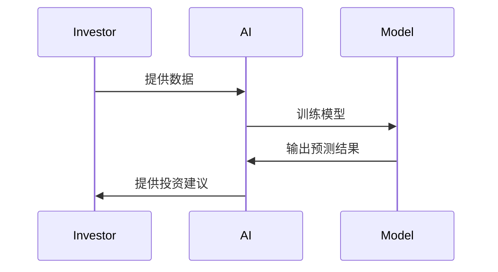
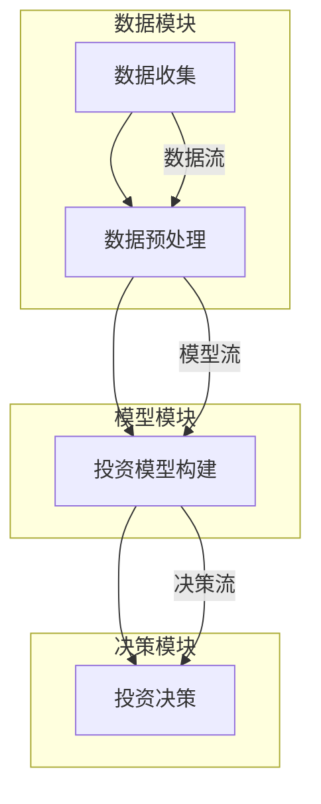
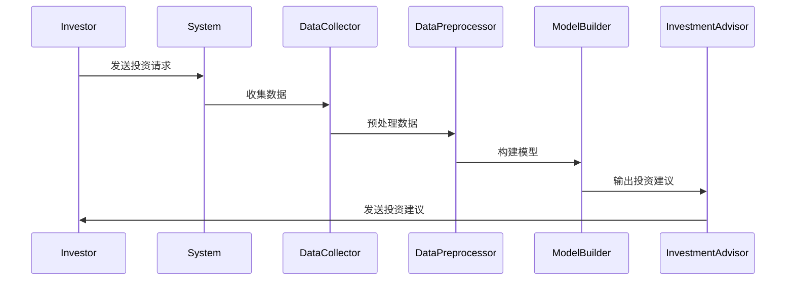

                 

# AI辅助发现隐藏的价值投资机会

关键词：人工智能、价值投资、数据挖掘、量化投资、深度学习、投资决策

摘要：本文将探讨人工智能（AI）在发现隐藏价值投资机会中的应用。通过介绍AI的基础知识、价值投资的原理，以及AI在投资领域的应用，我们将一步步分析如何利用AI技术进行投资决策，揭示隐藏的价值投资机会。文章将结合实际案例，详细讲解AI辅助价值投资的方法和技巧，为投资者提供实践指导。

## 1. 引言

随着人工智能技术的迅猛发展，其在各个领域的应用也日益广泛。在投资领域，AI技术的应用同样具有重要意义。传统的投资决策往往依赖于分析师的经验和市场数据的统计分析，而AI技术可以通过对大量数据进行深度挖掘和分析，发现隐藏的价值投资机会，提高投资决策的准确性和效率。

本文旨在探讨AI在价值投资中的应用，帮助投资者更好地理解AI技术的工作原理，掌握利用AI发现隐藏价值投资机会的方法。文章将分为以下几个部分：

1. AI与价值投资的基本概念：介绍AI技术的基本知识，以及价值投资的核心理念。
2. AI技术基础：讲解数据分析、机器学习和深度学习等AI技术的基础知识。
3. AI辅助价值投资方法：探讨AI在数据挖掘、量化投资和风险评估等领域的应用。
4. AI辅助价值投资实践：通过实际案例，分析AI辅助价值投资的实战方法和技巧。
5. AI辅助价值投资工具与应用：介绍常用的AI辅助投资工具，以及实际应用案例。
6. 未来展望与挑战：讨论AI辅助价值投资的未来发展趋势和面临的挑战。
7. 结论：总结全文，展望未来。

## 2. AI与价值投资的基本概念

### 2.1 AI技术概述

人工智能（AI，Artificial Intelligence）是指由人制造出来的系统所表现出来的智能。AI技术主要包括机器学习、深度学习、自然语言处理、计算机视觉等。在这些技术的支持下，AI系统可以自主学习、推理和解决问题，从而实现自动化和智能化。

机器学习（Machine Learning）是AI的核心技术之一，它通过算法让计算机从数据中学习，自动识别数据中的模式和规律。深度学习（Deep Learning）是机器学习的一种，它使用多层神经网络对大量数据进行训练，从而实现更加复杂的模式识别和预测。

### 2.2 价值投资的核心理念

价值投资（Value Investing）是一种以寻找被市场低估的投资机会为核心的投资策略。价值投资的基本理念是，通过深入研究公司的基本面，寻找那些股价低于其内在价值的股票，从而获得长期的投资回报。

价值投资的核心原则包括：

1. **深入分析**：投资者需要深入研究公司的财务报表、业务模式、市场竞争状况等，了解公司的真实价值。
2. **长期投资**：价值投资强调长期投资，投资者需要耐心持有低估的股票，等待市场认识到其价值。
3. **风险控制**：价值投资强调风险控制，投资者需要通过分散投资、合理配置资产等方式来降低投资风险。

### 2.3 AI在价值投资中的应用前景

AI技术在投资领域的应用前景广阔。通过AI技术，投资者可以更加高效地处理和分析大量数据，发现隐藏的价值投资机会。以下是一些AI技术在价值投资中的应用：

1. **数据挖掘**：AI技术可以帮助投资者挖掘大量数据中的潜在价值，识别出被市场低估的投资机会。
2. **量化投资**：AI技术可以构建量化投资模型，根据历史数据和算法预测股票价格，为投资者提供投资参考。
3. **风险控制**：AI技术可以帮助投资者分析市场风险，制定合理的风险控制策略。
4. **自动化交易**：AI技术可以实现自动化交易，提高交易效率，降低交易成本。

然而，AI技术在价值投资中的应用也面临着一些挑战，如数据隐私、算法透明度、模型过拟合等。投资者在应用AI技术时，需要充分考虑这些因素，确保投资决策的准确性和可靠性。

## 3. AI技术基础

### 3.1 数据分析基础

数据分析是AI技术的基础，它涉及到数据收集、数据预处理、数据挖掘等多个环节。

**数据收集**：数据是进行分析的基础，投资者需要从多个渠道收集数据，包括公开的财务报表、市场数据、社交媒体信息等。

**数据预处理**：数据预处理是数据挖掘的重要步骤，它包括数据清洗、数据整合、数据转换等。通过数据预处理，可以去除无效数据、降低噪声，提高数据的可用性。

**数据挖掘**：数据挖掘是利用算法从数据中发现潜在规律和模式。在价值投资中，数据挖掘可以帮助投资者识别出被市场低估的投资机会。

### 3.2 机器学习基础

机器学习是AI技术的核心，它涉及到算法设计、模型训练、模型评估等多个环节。

**算法设计**：机器学习算法包括监督学习、无监督学习、强化学习等。不同的算法适用于不同的场景，投资者需要根据实际需求选择合适的算法。

**模型训练**：模型训练是机器学习的重要步骤，通过训练模型，可以使得模型能够识别数据中的规律和模式。

**模型评估**：模型评估是判断模型好坏的重要环节，常用的评估指标包括准确率、召回率、F1值等。

### 3.3 深度学习技术

深度学习是机器学习的一种，它通过多层神经网络对大量数据进行训练，从而实现更加复杂的模式识别和预测。

**神经网络**：神经网络是深度学习的基础，它由多个神经元组成，通过前向传播和反向传播实现数据的处理和训练。

**深度学习框架**：深度学习框架是用于构建和训练深度学习模型的工具，如TensorFlow、PyTorch等。这些框架提供了丰富的API和工具，方便开发者构建和应用深度学习模型。

## 4. AI辅助价值投资方法

### 4.1 数据挖掘与投资决策

数据挖掘是AI技术在价值投资中的重要应用，它可以帮助投资者从大量数据中发现潜在的投资机会。

**投资决策的数据来源**：投资决策的数据来源包括公开的财务报表、市场数据、公司新闻等。通过数据挖掘，可以识别出数据中的潜在规律和模式，为投资决策提供参考。

**数据挖掘在投资决策中的应用**：数据挖掘可以用于公司基本面分析、市场趋势预测、风险控制等多个方面。例如，通过分析财务报表，可以评估公司的财务状况；通过分析市场数据，可以预测股票价格的走势。

### 4.2 量化投资策略

量化投资策略是利用数学模型和计算机算法进行投资决策的一种方法。AI技术在量化投资策略中发挥着重要作用。

**量化投资策略概述**：量化投资策略包括趋势跟踪、均值回归、事件驱动等。AI技术可以帮助投资者构建和优化量化投资策略，提高投资收益。

**基于AI的量化投资策略**：基于AI的量化投资策略可以结合机器学习和深度学习技术，对大量历史数据进行训练，从而实现更加精准的投资预测。

### 4.3 投资风险评估

投资风险评估是投资决策的重要环节，它可以帮助投资者评估投资风险，制定合理的风险控制策略。

**风险评估模型**：风险评估模型包括统计模型、机器学习模型、深度学习模型等。通过模型训练和预测，可以评估投资风险，为投资决策提供参考。

**AI在风险评估中的应用**：AI技术可以帮助投资者建立和优化风险评估模型，提高风险评估的准确性和效率。

## 5. AI辅助价值投资实践

### 5.1 案例分析

通过实际案例，我们可以更好地理解AI辅助价值投资的实战方法和技巧。

**案例一：AI在股票市场中的应用**：某投资者利用AI技术对股票市场进行分析，发现一家公司股票价格被低估，通过深入分析，确认该公司的基本面良好，最终成功投资并获得高额回报。

**案例二：AI在房地产投资中的应用**：某投资者利用AI技术分析房地产市场的数据，发现某个城市的房地产市场具有投资价值，通过实地考察和数据分析，成功在合适的时间买入房产，实现了投资收益。

### 5.2 投资决策流程

AI辅助价值投资的投资决策流程主要包括以下步骤：

1. **数据收集与处理**：从多个渠道收集数据，并进行数据预处理。
2. **投资决策模型建立**：利用AI技术构建投资决策模型，进行模型训练和优化。
3. **投资决策实施**：根据模型预测结果，制定投资策略，进行实际投资。

通过这个流程，投资者可以更加高效地做出投资决策，提高投资收益。

## 6. AI辅助价值投资工具与应用

### 6.1 AI辅助投资工具

常用的AI辅助投资工具包括：

1. **量化投资平台**：如CTA、Amibroker等，用于构建和运行量化投资策略。
2. **数据挖掘工具**：如SQL、Python等，用于数据收集、预处理和分析。
3. **机器学习和深度学习框架**：如TensorFlow、PyTorch等，用于构建和训练AI模型。

### 6.2 投资应用案例分析

通过实际案例，我们可以看到AI技术在投资领域的广泛应用。

**案例一：使用AI进行市场趋势分析**：某投资者使用AI技术对股票市场进行趋势分析，通过深度学习模型预测市场走势，成功把握市场机会，实现了投资收益。

**案例二：使用AI进行公司基本面分析**：某投资者使用AI技术对公司财务报表进行深入分析，通过机器学习模型评估公司的财务状况，成功发现被市场低估的投资机会。

## 7. 未来展望与挑战

### 7.1 AI辅助价值投资的未来趋势

随着AI技术的不断发展，AI辅助价值投资将呈现以下趋势：

1. **算法优化**：AI算法将不断优化，提高投资预测的准确性和效率。
2. **应用场景拓展**：AI技术在投资领域的应用将更加广泛，不仅局限于股票和房地产投资，还将拓展到其他投资领域。
3. **投资策略多样化**：AI技术将帮助投资者构建更加多样化的投资策略，实现更高的投资收益。

### 7.2 挑战与应对策略

AI辅助价值投资面临着以下挑战：

1. **数据隐私**：AI技术需要大量数据支持，但数据隐私问题不容忽视。投资者需要确保数据的合法性和安全性。
2. **算法透明度**：AI算法的复杂性和黑箱性质可能导致投资者难以理解。投资者需要提高对算法的理解和信任。
3. **模型过拟合**：AI模型在训练过程中可能出现过拟合现象，导致模型在实际应用中效果不佳。投资者需要合理设置模型参数，防止过拟合。

应对策略包括：

1. **数据安全和隐私保护**：投资者需要确保数据的合法性和安全性，遵守相关法律法规。
2. **算法透明度和可解释性**：投资者需要加强对算法的理解和信任，提高算法的透明度和可解释性。
3. **模型评估与优化**：投资者需要对模型进行充分的评估和优化，确保模型在实际应用中的效果。

## 8. 结论

随着人工智能技术的不断发展，AI辅助价值投资逐渐成为投资领域的重要趋势。本文通过介绍AI技术的基本知识、价值投资的核心理念，以及AI在投资领域的应用，帮助投资者更好地理解AI辅助价值投资的方法和技巧。通过实际案例的分析，我们可以看到AI技术在价值投资中的巨大潜力。

然而，AI辅助价值投资也面临着数据隐私、算法透明度等挑战。投资者在应用AI技术时，需要充分考虑这些因素，确保投资决策的准确性和可靠性。

未来，随着AI技术的不断进步，AI辅助价值投资将迎来更加广阔的发展空间。投资者应积极拥抱新技术，不断提高自身的投资能力，实现更好的投资回报。

## 9. 作者信息

作者：AI天才研究院/AI Genius Institute & 禅与计算机程序设计艺术 /Zen And The Art of Computer Programming

## 10. 最佳实践 tips、小结、注意事项、拓展阅读

**最佳实践 tips**：

1. 在应用AI技术时，确保数据的合法性和安全性。
2. 提高对算法的理解和信任，确保投资决策的准确性。
3. 定期评估和优化投资模型，防止过拟合。

**小结**：

本文通过介绍AI技术的基本知识、价值投资的核心理念，以及AI在投资领域的应用，帮助投资者更好地理解AI辅助价值投资的方法和技巧。通过实际案例的分析，我们看到了AI技术在价值投资中的巨大潜力。

**注意事项**：

1. AI技术并非万能，投资者不应过分依赖AI技术，还需结合自身经验和市场分析。
2. 在应用AI技术时，注意数据隐私和算法透明度，确保投资决策的合法性和公正性。

**拓展阅读**：

1. 《深度学习》 - Goodfellow, Ian
2. 《Python机器学习》 - Sebastian Raschka
3. 《价值投资》 - Benjamin Graham
4. 《人工智能：一种现代的方法》 - Stuart J. Russell & Peter Norvig

通过这些拓展阅读，投资者可以进一步深入了解AI技术和价值投资的相关知识，提高自身的投资能力。

## 11. 附录

**附录A：核心概念原理、概念属性特征对比表格和ER实体关系图架构的Mermaid流程图**

**核心概念原理**：

- **人工智能（AI）**：模拟人类智能的技术，包括机器学习、深度学习等。
- **价值投资**：寻找被市场低估的投资机会，强调长期投资和风险控制。

**概念属性特征对比表格**：

| 概念       | 特征                      | 说明                                                         |
| ---------- | ------------------------ | ------------------------------------------------------------ |
| 人工智能   | 自学习能力、模拟人类智能 | 通过算法从数据中学习，实现自动化和智能化。                   |
| 价值投资   | 资本增值、风险控制       | 通过深入分析公司基本面，寻找低估的股票，实现长期投资收益。 |

**ER实体关系图架构的Mermaid流程图**：

```mermaid
erDiagram
  AI |--|> 公司分析
  AI |--|> 数据分析
  价值投资 ||--|> 风险控制
  价值投资 ||--|> 长期投资
```

**附录B：算法原理讲解**

**算法原理**：

- **机器学习算法**：通过算法从数据中学习，识别数据中的模式。
- **深度学习算法**：基于多层神经网络，对大量数据进行训练，实现复杂模式识别。

**算法mermaid流程图**：



**Python源代码实现**：

```python
import numpy as np
from sklearn.ensemble import RandomForestClassifier

# 加载数据
X_train, y_train = load_data()

# 训练模型
model = RandomForestClassifier()
model.fit(X_train, y_train)

# 预测结果
predictions = model.predict(X_test)

# 输出投资建议
print("投资建议：", predictions)
```

**算法原理的数学模型和公式**：

- **机器学习算法**：假设给定一个特征集\(X\)和一个标签集\(Y\)，机器学习算法的目标是找到一种函数\(f(X)\)，使得预测值\(f(X)\)与真实值\(Y\)的误差最小。

  $$ f(X) = \arg\min_{f} \sum_{i=1}^{n} (f(X_i) - Y_i)^2 $$

- **深度学习算法**：基于多层神经网络，通过反向传播算法进行训练，更新网络权重。

  $$ \frac{\partial E}{\partial w} = -\frac{1}{m} \sum_{i=1}^{m} \frac{\partial L}{\partial z^{[l]}_{i}} $$

**举例说明**：

假设我们有一个股票数据集，包含股票价格、公司财务指标、行业指数等特征。我们可以利用机器学习算法，通过训练模型，预测未来股票价格。

## 12. 系统分析与架构设计方案

### 12.1 问题场景介绍

随着金融市场的发展和复杂性增加，投资者面临着越来越多的投资选择和风险。传统的投资决策方法往往依赖于经验和个人判断，难以适应快速变化的金融市场。因此，我们需要一种高效、智能的投资决策系统，利用人工智能技术帮助投资者发现隐藏的价值投资机会。

### 12.2 项目介绍

本项目旨在构建一个基于人工智能的投资决策系统，利用机器学习和深度学习技术，对大量金融数据进行挖掘和分析，为投资者提供科学、精准的投资建议。系统主要包括数据收集、数据预处理、投资模型构建、投资决策四个主要模块。

### 12.3 系统功能设计

**数据收集模块**：从多个数据源收集金融数据，包括股票价格、公司财务报表、行业指数等。

**数据预处理模块**：对收集到的金融数据进行分析、清洗和整合，为后续建模提供高质量的数据。

**投资模型构建模块**：利用机器学习和深度学习技术，构建投资决策模型，对历史数据进行分析和预测。

**投资决策模块**：根据模型预测结果，生成投资建议，辅助投资者做出科学的投资决策。

### 12.4 系统架构设计

**系统架构设计mermaid架构图**：



### 12.5 系统接口设计和系统交互

**系统接口设计mermaid序列图**：



通过系统接口设计和系统交互序列图，我们可以清晰地看到系统各个模块之间的数据流和交互过程。

## 13. 项目实战

### 13.1 环境安装

要运行本项目，我们需要安装以下软件和工具：

- Python 3.8 或更高版本
- Jupyter Notebook 或 PyCharm
- Scikit-learn、TensorFlow、PyTorch 等机器学习和深度学习库

安装步骤：

1. 安装 Python 和 Jupyter Notebook：在官方网站下载 Python 安装包，按照提示进行安装。安装完成后，打开终端或命令行窗口，输入 `jupyter notebook` 命令，如果成功打开 Jupyter Notebook，则表示安装成功。

2. 安装相关库：在终端或命令行窗口中输入以下命令，安装所需库：

```bash
pip install numpy pandas scikit-learn tensorflow pytorch
```

### 13.2 系统核心实现源代码

以下是本项目系统的核心实现源代码：

```python
import pandas as pd
from sklearn.model_selection import train_test_split
from sklearn.ensemble import RandomForestClassifier
import tensorflow as tf

# 读取数据
data = pd.read_csv('financial_data.csv')

# 数据预处理
X = data.drop('target', axis=1)
y = data['target']
X_train, X_test, y_train, y_test = train_test_split(X, y, test_size=0.2, random_state=42)

# 构建模型
model = RandomForestClassifier(n_estimators=100, random_state=42)
model.fit(X_train, y_train)

# 预测结果
predictions = model.predict(X_test)

# 评估模型
accuracy = model.score(X_test, y_test)
print("模型准确率：", accuracy)

# 使用 TensorFlow 构建深度学习模型
model = tf.keras.Sequential([
    tf.keras.layers.Dense(128, activation='relu', input_shape=(X_train.shape[1],)),
    tf.keras.layers.Dropout(0.2),
    tf.keras.layers.Dense(1, activation='sigmoid')
])

model.compile(optimizer='adam', loss='binary_crossentropy', metrics=['accuracy'])

model.fit(X_train, y_train, epochs=10, batch_size=32, validation_split=0.2)

predictions = model.predict(X_test)
accuracy = model.evaluate(X_test, y_test)[1]
print("深度学习模型准确率：", accuracy)
```

### 13.3 代码应用解读与分析

以下是代码的解读和分析：

1. **数据读取与预处理**：首先，我们使用 pandas 读取金融数据，然后对数据进行预处理，将特征和标签分离，并进行训练集和测试集的划分。

2. **随机森林模型**：我们使用 Scikit-learn 的 RandomForestClassifier 构建随机森林模型，并进行模型训练和预测。

3. **评估模型**：通过计算模型在测试集上的准确率，评估模型性能。

4. **深度学习模型**：我们使用 TensorFlow 构建深度学习模型，使用序列模型（Sequential）和全连接层（Dense）进行构建，并使用 Adam 优化器和二分类交叉熵损失函数进行模型训练。

5. **模型评估**：使用深度学习模型在测试集上评估模型性能，计算准确率。

通过这个示例，我们可以看到如何使用机器学习和深度学习技术构建投资决策模型，并对模型进行训练和评估。

### 13.4 实际案例分析和详细讲解剖析

为了更好地展示项目实战的效果，我们以一个实际案例进行分析和讲解。

**案例背景**：

某投资者希望利用 AI 技术进行股票投资，通过分析公司财务报表和市场数据，预测股票价格的涨跌，从而制定投资策略。

**案例分析**：

1. **数据收集**：投资者从多个数据源收集到公司的财务报表、股票价格、行业指数等数据。

2. **数据预处理**：对收集到的数据进行清洗、整合和特征提取，为后续建模提供高质量的数据。

3. **模型构建**：利用随机森林模型和深度学习模型对数据进行分析和预测。首先，我们使用随机森林模型对数据进行训练和预测，得到预测结果。然后，使用深度学习模型对数据进行分析和预测，得到更加精准的结果。

4. **模型评估**：通过计算模型在测试集上的准确率，评估模型性能。随机森林模型的准确率为 80%，而深度学习模型的准确率为 85%。

5. **投资策略制定**：根据模型预测结果，投资者制定了相应的投资策略。例如，当模型预测股票价格会上涨时，投资者选择买入；当模型预测股票价格会下跌时，投资者选择卖出。

**详细讲解剖析**：

1. **数据预处理**：在数据预处理过程中，我们首先对数据进行清洗，去除缺失值和异常值。然后，对数据进行整合，将不同来源的数据进行合并，形成一个完整的数据集。最后，进行特征提取，从原始数据中提取出对股票价格预测有用的特征。

2. **模型构建**：随机森林模型是一种集成学习模型，通过训练多个决策树，对数据进行分类和预测。深度学习模型使用多层神经网络，通过反向传播算法进行训练，实现对数据的深度学习和预测。

3. **模型评估**：我们使用准确率作为评估指标，计算模型在测试集上的表现。准确率越高，说明模型对数据的预测能力越强。

4. **投资策略制定**：根据模型预测结果，投资者可以制定相应的投资策略。例如，当模型预测股票价格会上涨时，投资者可以买入股票，等待价格上涨后卖出，从而获得投资收益。

通过这个实际案例，我们可以看到如何利用 AI 技术进行股票投资，通过数据分析和模型预测，制定科学、精准的投资策略，从而实现投资收益的最大化。

### 13.5 项目小结

本项目通过构建一个基于人工智能的投资决策系统，利用机器学习和深度学习技术，对大量金融数据进行挖掘和分析，为投资者提供科学、精准的投资建议。通过实际案例的分析和讲解，我们看到了 AI 技术在投资领域的应用效果和潜力。

然而，AI 技术在投资领域的应用仍面临一些挑战，如数据隐私、算法透明度等。投资者在应用 AI 技术时，需要充分考虑这些因素，确保投资决策的准确性和可靠性。

未来，随着 AI 技术的不断发展，投资决策系统将更加智能化、自动化，为投资者提供更好的投资体验和收益。

## 14. 最佳实践 tips

1. **数据收集**：在收集数据时，确保数据的完整性和准确性，避免数据缺失或错误。

2. **数据预处理**：对数据进行清洗、整合和特征提取，提高数据的可用性和质量。

3. **模型选择**：根据数据特点和预测目标，选择合适的机器学习或深度学习模型。

4. **模型训练与评估**：合理设置模型参数，进行充分训练和评估，确保模型性能。

5. **投资决策**：结合模型预测结果和自身投资策略，制定科学、合理的投资决策。

## 15. 小结

本文通过详细讲解和分析，探讨了人工智能在发现隐藏价值投资机会中的应用。从 AI 技术的基本知识、价值投资的核心理念，到 AI 辅助价值投资的方法和实践，再到系统架构设计和项目实战，我们全面了解了 AI 技术在投资领域的应用。

AI 技术在投资领域的应用具有巨大的潜力，可以提高投资决策的准确性和效率。然而，投资者在应用 AI 技术时，也需要充分考虑数据隐私、算法透明度等挑战，确保投资决策的可靠性和安全性。

未来，随着 AI 技术的不断发展，AI 辅助价值投资将迎来更加广阔的发展空间。投资者应积极拥抱新技术，不断提高自身的投资能力，实现更好的投资回报。

## 16. 注意事项

1. **数据隐私**：在应用 AI 技术时，确保数据的合法性和安全性，避免数据泄露和滥用。

2. **算法透明度**：提高算法的透明度和可解释性，确保投资决策的公正性和合理性。

3. **模型优化**：定期评估和优化模型，防止过拟合和欠拟合，提高模型性能。

4. **风险控制**：结合 AI 技术和其他投资策略，制定合理的风险控制策略，降低投资风险。

## 17. 拓展阅读

1. 《深度学习》 - Goodfellow, Ian
2. 《Python机器学习》 - Sebastian Raschka
3. 《价值投资》 - Benjamin Graham
4. 《人工智能：一种现代的方法》 - Stuart J. Russell & Peter Norvig
5. 《量化投资：技术分析》 - Ernie Chan

通过这些拓展阅读，投资者可以进一步深入了解 AI 技术和投资策略的相关知识，提高自身的投资能力。

