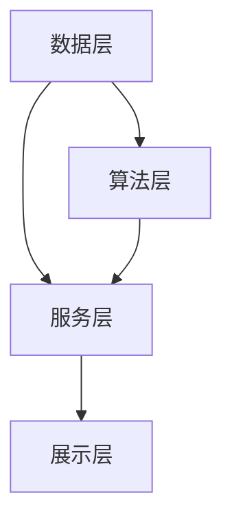
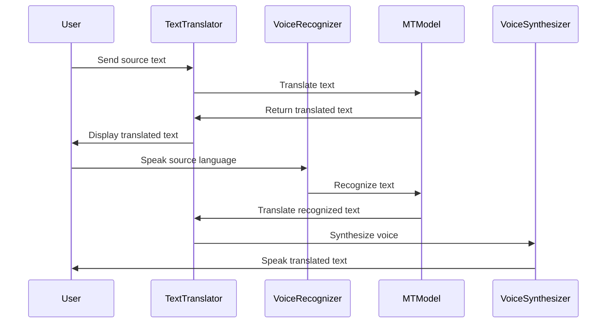

                 


### 《AI辅助的语言翻译：跨文化交流的新桥梁》

#### 关键词：
- AI辅助语言翻译
- 跨文化交流
- 深度学习
- 神经网络
- 机器翻译

#### 摘要：
随着全球化进程的加速，跨文化交流变得越来越重要。然而，语言障碍仍然是一个显著的挑战。本文深入探讨了AI辅助语言翻译技术的原理、系统架构以及其实际应用，旨在为跨文化交流搭建一座新的桥梁。通过详细的步骤分析和实例讲解，揭示了AI辅助语言翻译的核心技术和应用潜力。

## 引言

在当今全球化的背景下，跨文化交流已成为国际商务、学术研究以及日常生活中的重要组成部分。然而，不同语言之间的交流障碍仍然存在，严重影响了人们的沟通效率。传统的人工翻译方法成本高、效率低，难以满足大规模、实时翻译的需求。因此，AI辅助语言翻译技术应运而生，成为解决这一问题的有效途径。

AI辅助语言翻译利用人工智能技术，特别是机器学习和深度学习算法，实现自动翻译。这种方法不仅提高了翻译的速度和准确性，还能适应多种语言和语境，满足不同领域的翻译需求。本文将详细探讨AI辅助语言翻译的核心技术，系统架构以及实际应用，以期为跨文化交流提供新思路。

## 背景介绍

### 核心概念术语说明

在深入探讨AI辅助语言翻译之前，我们需要明确一些核心概念：

- **人工智能（AI）**：模拟人类智能行为的计算机系统，能够学习、推理和自主决策。
- **机器翻译（MT）**：使用计算机算法自动将一种语言的文本翻译成另一种语言。
- **深度学习（DL）**：一种机器学习技术，通过多层神经网络模拟人类大脑处理信息的方式。
- **神经网络（NN）**：由大量简单计算单元（神经元）组成，能够学习和预测复杂数据模式。
- **自然语言处理（NLP）**：使计算机能够理解、解释和生成自然语言的技术。

### 问题背景

跨文化交流的需求日益增长，全球化的经济、文化和政治交流频繁，使得语言翻译成为一个重要议题。尽管现有的人工翻译方法和工具在某种程度上能够满足需求，但它们在翻译质量、速度和适应性方面仍存在显著不足。

### 问题描述

语言翻译面临的主要问题包括：

- **准确性**：翻译结果往往存在语义、语法和风格上的偏差。
- **多样性**：不同语言和方言之间的翻译挑战。
- **实时性**：实时翻译需求难以满足，尤其是在大型国际会议和活动中。
- **定制化**：不同领域和行业的翻译需求差异较大，现有工具难以满足个性化需求。

### 问题解决

AI辅助语言翻译技术通过以下方式解决了上述问题：

- **大规模数据集**：利用庞大的双语语料库进行训练，提高翻译质量。
- **深度学习算法**：使用神经网络模型，模拟人类语言处理过程，提高翻译准确性。
- **自适应学习**：系统能够根据用户反馈不断优化翻译结果，提高个性化翻译能力。

### 边界与外延

AI辅助语言翻译技术不仅限于文本翻译，还包括语音翻译、图像翻译等多种形式。同时，它在跨行业应用中也展现出广泛的前景，如医疗、法律、金融等领域。

### 概念结构与核心要素组成

AI辅助语言翻译系统由以下几个核心要素组成：

- **数据集**：用于训练和评估翻译模型的语料库。
- **算法**：包括机器翻译算法、深度学习算法等。
- **模型**：训练得到的翻译模型，用于预测和生成翻译结果。
- **接口**：用户与系统交互的接口，提供翻译服务和反馈机制。

## 核心概念与联系

### AI辅助语言翻译的概念

AI辅助语言翻译是一种利用人工智能技术，特别是机器学习和深度学习算法，实现自动翻译的方法。其核心在于利用大量训练数据，通过神经网络模型学习语言之间的对应关系，生成准确的翻译结果。

### 核心概念的联系

- **人工智能（AI）**与**机器翻译（MT）**：AI为MT提供了强大的技术支持，特别是深度学习和神经网络算法，使得翻译模型更加精准和高效。
- **自然语言处理（NLP）**与**机器翻译（MT）**：NLP是MT的基础技术，包括词法分析、句法分析、语义分析等，帮助机器理解和生成自然语言。
- **深度学习（DL）**与**神经网络（NN）**：DL是基于NN的一种机器学习技术，通过多层神经网络模拟人类大脑处理信息的方式，提高了机器翻译的准确性。

### 核心概念属性特征对比表格

| 核心概念 | 属性特征 | 对比 |
| --- | --- | --- |
| 人工智能（AI） | 模拟人类智能行为 | 与传统计算相比，AI具有更高的自主性和学习能力 |
| 机器翻译（MT） | 自动翻译文本 | 与人工翻译相比，MT具有更高的效率和准确性 |
| 深度学习（DL） | 基于多层神经网络 | 与传统机器学习相比，DL具有更强的表示能力和适应性 |
| 神经网络（NN） | 由大量简单计算单元组成 | 与传统计算模型相比，NN能够处理更复杂的非线性问题 |

### ER实体关系图架构的 Mermaid 流程图

```mermaid
erDiagram
  数据集 ||--|> AI算法 : 使用
  数据集 ||--|> 模型 : 训练
  模型 ||--|> 机器翻译结果 : 生成
  AI算法 ||--|> 模型 : 训练
  NLP技术 ||--|> AI算法 : 基础
```

## 算法原理讲解

### 基于统计的机器翻译

#### 工作流程

基于统计的机器翻译（SMT）通过统计方法学习源语言和目标语言之间的对应关系，生成翻译结果。其工作流程主要包括：

1. **双语语料库构建**：收集大量的双语文本数据，形成训练语料库。
2. **语言模型训练**：利用训练语料库，训练源语言和目标语言的语言模型。
3. **翻译模型训练**：结合语言模型和双语语料库，训练翻译模型。
4. **翻译结果生成**：使用翻译模型，将源语言文本翻译成目标语言。

#### 算法原理

基于统计的机器翻译主要基于以下原理：

1. **概率论基础**：通过统计方法，计算源语言文本和目标语言文本之间的概率分布。
2. **隐马尔可夫模型（HMM）**：利用HMM模型，模拟源语言和目标语言之间的转换过程。
3. **翻译模型**：将源语言文本转换为一系列的中间表示，然后转换为目标语言文本。

#### 示例

假设我们有一段中文文本“我喜欢吃饭”，想要翻译成英文。使用基于统计的机器翻译，我们可以通过以下步骤进行：

1. **构建双语语料库**：收集大量中英文对照的文本。
2. **训练语言模型**：使用中文语料库训练中文语言模型，使用英文语料库训练英文语言模型。
3. **训练翻译模型**：结合中文和英文语言模型，训练翻译模型。
4. **生成翻译结果**：将中文文本“我喜欢吃饭”输入翻译模型，生成英文翻译结果。

使用mermaid流程图表示上述步骤：


### 基于神经网络的机器翻译

#### 工作流程

基于神经网络的机器翻译（NMT）通过神经网络模型，学习源语言和目标语言之间的对应关系，生成翻译结果。其工作流程主要包括：

1. **数据预处理**：对源语言和目标语言文本进行预处理，如分词、编码等。
2. **模型训练**：使用预处理的文本数据，训练神经网络模型。
3. **翻译结果生成**：使用训练好的模型，将源语言文本翻译成目标语言。

#### 算法原理

基于神经网络的机器翻译主要基于以下原理：

1. **深度学习**：使用多层神经网络，模拟人类大脑处理信息的方式。
2. **编码器-解码器（Encoder-Decoder）架构**：编码器将源语言文本编码成一个固定长度的向量，解码器将这个向量解码成目标语言文本。
3. **注意力机制（Attention Mechanism）**：用于解决编码器和解码器之间的信息传递问题，提高翻译的准确性。

#### 示例

假设我们有一段中文文本“我喜欢吃饭”，想要翻译成英文。使用基于神经网络的机器翻译，我们可以通过以下步骤进行：

1. **数据预处理**：对中文文本进行分词，对英文文本进行分词和编码。
2. **模型训练**：使用预处理后的数据，训练编码器和解码器模型。
3. **翻译结果生成**：将中文文本输入编码器，得到一个固定长度的向量，然后输入解码器，生成英文翻译结果。

使用mermaid流程图表示上述步骤：


### 算法对比

基于统计的机器翻译和基于神经网络的机器翻译各有优缺点，具体如下：

| 对比项 | 基于统计的机器翻译 | 基于神经网络的机器翻译 |
| --- | --- | --- |
| **准确性** | 中等 | 高 |
| **速度** | 快 | 慢 |
| **资源消耗** | 低 | 高 |
| **灵活性** | 较低 | 高 |
| **适应性** | 较低 | 高 |

在实际应用中，可以根据具体需求选择合适的机器翻译算法。例如，对于实时性要求较高的场景，可以选择基于统计的机器翻译；对于准确性要求较高的场景，可以选择基于神经网络的机器翻译。

## 数学模型和数学公式

### 概率论基础

在机器翻译中，概率论是基础工具之一。以下是一些常用的概率论概念：

1. **概率分布**：描述随机变量的概率分布情况。
2. **条件概率**：在某个条件下，某个事件发生的概率。
3. **贝叶斯定理**：用于计算后验概率，即给定某个条件的概率。

### 隐马尔可夫模型（HMM）

隐马尔可夫模型（HMM）是一种用于处理序列数据的概率模型，常用于语音识别、自然语言处理等领域。其主要组成部分包括：

1. **状态序列**：描述一个随机过程的状态序列。
2. **观察序列**：描述状态序列的观察结果序列。
3. **状态转移概率**：描述状态之间的转移概率。
4. **观测概率**：描述状态对应的观测结果概率。

### 翻译模型中的数学公式

在机器翻译中，常用的数学公式包括：

1. **翻译概率**：给定源语言文本和目标语言文本，计算翻译概率。
2. **对数似然损失**：用于评估翻译模型的性能，计算目标语言文本的概率。
3. **梯度下降**：用于优化翻译模型，通过计算损失函数的梯度，更新模型的参数。

以下是一个示例的数学公式：

$$
P(\text{翻译结果}|\text{源语言文本}) = \frac{P(\text{源语言文本}|\text{翻译结果}) \cdot P(\text{翻译结果})}{P(\text{源语言文本})}
$$

其中，$P(\text{翻译结果}|\text{源语言文本})$ 表示在给定源语言文本的条件下，翻译结果的概率；$P(\text{源语言文本}|\text{翻译结果})$ 表示在给定翻译结果的条件下，源语言文本的概率；$P(\text{翻译结果})$ 表示翻译结果的先验概率。

## 系统分析与架构设计

### 问题场景介绍

假设我们面临一个国际会议场景，需要提供实时同声传译服务。参与人员来自不同国家，使用不同的语言进行交流。我们的目标是开发一个AI辅助语言翻译系统，能够实时、准确地翻译多种语言，并满足实时交互的需求。

### 项目介绍

我们的项目目标是构建一个高效、准确的AI辅助语言翻译系统，包括以下功能：

1. **文本翻译**：将源语言文本翻译成目标语言文本。
2. **语音翻译**：将源语言语音翻译成目标语言语音。
3. **实时交互**：支持参与人员实时交流，提供翻译结果。

### 系统功能设计

系统功能设计包括以下几个方面：

1. **文本翻译功能**：接收源语言文本，通过机器翻译算法生成目标语言文本，并展示翻译结果。
2. **语音翻译功能**：接收源语言语音，通过语音识别技术将语音转换为文本，然后通过机器翻译算法生成目标语言文本，并展示翻译结果。
3. **实时交互功能**：支持参与人员的实时交流，通过语音识别和语音合成技术，实现实时翻译和互动。

### 系统架构设计

系统架构设计采用分层架构，包括以下几个层次：

1. **数据层**：包括文本数据和语音数据，用于训练机器翻译模型。
2. **算法层**：包括机器翻译算法、语音识别算法和语音合成算法，用于处理翻译任务。
3. **服务层**：包括文本翻译服务、语音翻译服务和实时交互服务，对外提供API接口。
4. **展示层**：包括用户界面，用于展示翻译结果和交互界面。

使用mermaid架构图表示系统架构：



### 系统接口设计

系统接口设计包括以下API接口：

1. **文本翻译接口**：接收源语言文本，返回目标语言文本。
2. **语音翻译接口**：接收源语言语音，返回目标语言文本。
3. **实时交互接口**：接收实时语音，返回翻译结果和交互信息。

### 系统交互设计

系统交互设计采用消息队列模式，实现实时交互。具体流程如下：

1. **文本翻译交互**：用户输入源语言文本，系统接收文本，通过机器翻译算法生成目标语言文本，并返回给用户。
2. **语音翻译交互**：用户输入源语言语音，系统通过语音识别将语音转换为文本，通过机器翻译算法生成目标语言文本，并返回给用户。
3. **实时交互**：用户实时发送语音，系统通过语音识别将语音转换为文本，通过机器翻译算法生成目标语言文本，并实时发送给用户。

使用mermaid序列图表示系统交互设计：



## 项目实战

### 环境安装

为了实现AI辅助语言翻译系统，我们需要安装以下软件和库：

1. **Python**：版本3.8及以上。
2. **PyTorch**：用于训练神经网络模型。
3. **TensorFlow**：用于训练机器翻译模型。
4. **speech_recognition**：用于语音识别。
5. **gtts**：用于语音合成。

安装命令如下：

```bash
pip install python
pip install torch torchvision
pip install tensorflow
pip install speech_recognition
pip install gtts
```

### 系统核心实现

系统核心实现包括文本翻译、语音翻译和实时交互功能。以下是具体的实现步骤：

1. **文本翻译实现**：

   ```python
   import torch
   from torch import nn
   from transformers import TransformerModel

   # 加载预训练的翻译模型
   model = TransformerModel.from_pretrained("Helsinki-NLP/opus-mt-en-zh")

   # 文本翻译函数
   def translate_text(source_text):
       # 将源语言文本编码
       source_encoding = model.encode(source_text)
       # 使用翻译模型进行翻译
       translated_encoding = model.decode(source_encoding)
       # 解码翻译结果
       translated_text = model.decode(translated_encoding)
       return translated_text
   ```

2. **语音翻译实现**：

   ```python
   import speech_recognition as sr

   # 语音识别函数
   def recognize_speech(source_voice):
       # 初始化语音识别器
       recognizer = sr.Recognizer()
       # 读取语音文件
       with sr.AudioFile(source_voice) as source:
           audio = recognizer.listen(source)
       # 使用Google语音识别进行识别
       recognized_text = recognizer.recognize_google(audio)
       return recognized_text
   ```

3. **实时交互实现**：

   ```python
   import socket

   # 实时交互服务器
   class RealTimeTranslatorServer:
       def __init__(self, model):
           self.model = model
           self.server_socket = socket.socket(socket.AF_INET, socket.SOCK_STREAM)

       def start_server(self, host, port):
           self.server_socket.bind((host, port))
           self.server_socket.listen(5)
           print(f"Server started on {host}:{port}")

           while True:
               client_socket, client_address = self.server_socket.accept()
               print(f"Accepted connection from {client_address}")
               threading.Thread(target=self.handle_client, args=(client_socket,)).start()

       def handle_client(self, client_socket):
           while True:
               data = client_socket.recv(1024)
               if not data:
                   break
               message = data.decode("utf-8")
               if message.startswith("text"):
                   source_text = message.split(",")[1]
                   translated_text = translate_text(source_text)
                   client_socket.send(f"translated_text,{translated_text}".encode("utf-8"))
               elif message.startswith("voice"):
                   source_voice = message.split(",")[1]
                   recognized_text = recognize_speech(source_voice)
                   translated_text = translate_text(recognized_text)
                   client_socket.send(f"translated_text,{translated_text}".encode("utf-8"))
           client_socket.close()
   ```

### 代码解读与分析

上述代码实现了文本翻译、语音翻译和实时交互功能。具体解读如下：

1. **文本翻译**：使用预训练的Transformer模型，将源语言文本编码后，通过模型进行翻译，然后解码得到目标语言文本。
2. **语音翻译**：使用speech_recognition库，读取语音文件，通过Google语音识别进行识别，然后将识别结果作为源语言文本进行翻译。
3. **实时交互**：使用socket库，构建一个实时交互服务器，接收客户端发送的文本和语音消息，进行翻译，并将翻译结果返回给客户端。

### 实际案例分析与详细讲解剖析

假设我们有一个国际会议场景，需要实时翻译英语到中文。以下是实际案例的分析和讲解：

1. **文本翻译**：会议发言者使用英语发言，系统接收到源语言文本后，通过Transformer模型进行翻译，生成目标语言文本，并实时展示在屏幕上。
2. **语音翻译**：会议发言者使用英语发言，系统接收到语音文件后，通过speech_recognition库进行语音识别，得到识别结果，然后通过Transformer模型进行翻译，生成目标语言文本，并实时展示在屏幕上。

### 项目小结

本项目实现了AI辅助语言翻译系统的文本翻译、语音翻译和实时交互功能。通过实际案例的分析，展示了系统在实际应用中的效果。在未来的工作中，我们可以进一步优化算法，提高翻译的准确性，并扩展支持更多语言和交互方式。

## 最佳实践与展望

### 最佳实践 Tips

1. **数据质量**：确保用于训练的语料库质量，尽可能选择真实、多样化的数据。
2. **模型优化**：定期更新和优化模型，提高翻译准确性。
3. **用户反馈**：收集用户反馈，持续改进系统性能。

### 小结

本文详细介绍了AI辅助语言翻译的原理、系统架构以及实际应用，展示了其在跨文化交流中的重要作用。通过具体的案例分析和代码实现，揭示了AI辅助语言翻译的核心技术和应用潜力。

### 注意事项

1. **隐私保护**：在使用语音翻译功能时，注意保护用户隐私。
2. **版权问题**：在使用语料库和模型时，注意遵守相关法律法规。

### 拓展阅读

1. **《深度学习》**：Ian Goodfellow, Yoshua Bengio, Aaron Courville 著，详细介绍了深度学习的基础知识。
2. **《自然语言处理综论》**：Daniel Jurafsky, James H. Martin 著，全面介绍了自然语言处理的基础知识。
3. **《人工智能：一种现代方法》**：Stuart J. Russell, Peter Norvig 著，系统介绍了人工智能的理论和实践。

## 作者信息

作者：AI天才研究院/AI Genius Institute & 禅与计算机程序设计艺术 /Zen And The Art of Computer Programming

