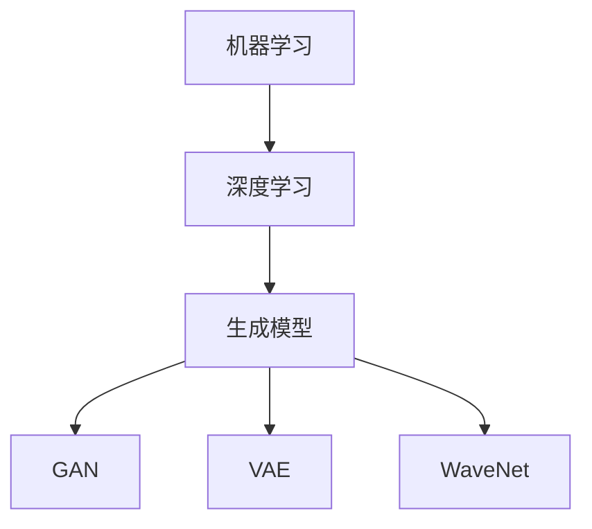
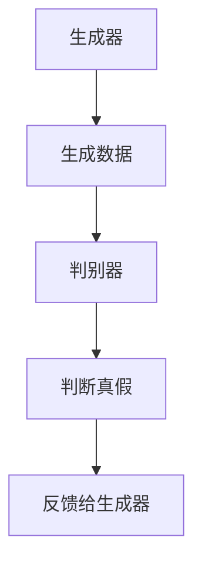
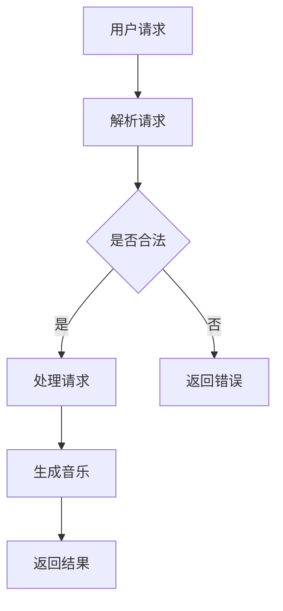

                 


# AI辅助的音乐创作：艺术与技术的新融合

## 关键词

- AI辅助音乐创作
- 生成对抗网络（GAN）
- 变分自编码器（VAE）
- 音乐生成模型
- 系统设计与实现

## 摘要

本文将探讨AI辅助音乐创作的技术融合，从背景介绍到核心算法讲解，再到系统分析与项目实战，全面解析AI在音乐创作中的应用。通过深入分析生成对抗网络（GAN）和变分自编码器（VAE）等生成模型，我们旨在展示AI如何辅助音乐创作，提升艺术与技术之间的互动。同时，本文还将提供实际项目的案例分析，分享最佳实践和注意事项，为读者提供有价值的参考。

## 目录大纲

### 第一部分：AI辅助音乐创作概述

#### 1.1 AI辅助音乐创作背景

##### 1.1.1 音乐创作现状

##### 1.1.2 AI在音乐领域的应用

##### 1.1.3 AI辅助音乐创作的挑战与机遇

#### 1.2 核心概念与联系

##### 1.2.1 机器学习与深度学习

##### 1.2.2 生成模型

##### 1.2.3 AI辅助音乐创作中的核心概念联系图

#### 1.3 算法原理讲解

##### 1.3.1 生成对抗网络（GAN）原理与流程图

##### 1.3.2 变分自编码器（VAE）原理与流程图

##### 1.3.3 Python代码示例

#### 1.4 数学模型与公式

##### 1.4.1 GAN数学模型

##### 1.4.2 VAE数学模型

##### 1.4.3 LaTeX格式展示

##### 1.4.4 详细讲解与举例

#### 1.5 系统分析与架构设计方案

##### 1.5.1 音乐创作系统功能介绍

##### 1.5.2 系统架构设计

##### 1.5.3 系统接口设计

##### 1.5.4 系统交互流程图

### 第二部分：AI辅助音乐创作技术详解

#### 2.1 GAN在音乐创作中的应用

##### 2.1.1 GAN基本原理

##### 2.1.2 GAN在音乐生成中的实现

##### 2.1.3 GAN音乐生成的案例分析

#### 2.2 VAE在音乐创作中的应用

##### 2.2.1 VAE基本原理

##### 2.2.2 VAE在音乐生成中的实现

##### 2.2.3 VAE音乐生成的案例分析

#### 2.3 其他生成模型的应用

##### 2.3.1 WaveNet

##### 2.3.2 CycleGAN

##### 2.3.3 SampleRNN

### 第三部分：AI辅助音乐创作实践

#### 3.1 项目实战准备

##### 3.1.1 环境安装与配置

##### 3.1.2 数据集准备

#### 3.2 音乐生成系统实现

##### 3.2.1 系统架构设计

##### 3.2.2 核心代码实现

##### 3.2.3 代码解读与分析

#### 3.3 项目案例分析

##### 3.3.1 案例背景

##### 3.3.2 案例实施

##### 3.3.3 案例剖析

#### 3.4 项目总结与展望

### 第四部分：最佳实践与拓展

#### 4.1 最佳实践 Tips

##### 4.1.1 参数调优

##### 4.1.2 数据处理技巧

##### 4.1.3 模型优化技巧

#### 4.2 小结与展望

##### 4.2.1 AI辅助音乐创作的发展趋势

##### 4.2.2 面临的挑战与解决方案

#### 4.3 注意事项

##### 4.3.1 技术选型

##### 4.3.2 数据安全与隐私

#### 4.4 拓展阅读

##### 4.4.1 相关书籍

##### 4.4.2 学术论文

##### 4.4.3 实践项目

## 1.1 AI辅助音乐创作背景

### 1.1.1 音乐创作现状

音乐创作一直是人类文化的重要组成部分。从古代的民间音乐到现代的流行音乐，音乐创作经历了无数的变化和创新。然而，传统的音乐创作过程往往依赖于个人的灵感、技巧和经验，存在一定的局限性。随着计算机技术的快速发展，人工智能（AI）逐渐成为音乐创作的重要辅助工具。

目前，音乐创作领域已经出现了许多基于AI的应用，如自动作曲、音乐生成、音乐风格转换等。这些应用不仅提高了音乐创作的效率，还带来了新的艺术表现形式。然而，AI辅助音乐创作仍处于发展阶段，面临着许多挑战和机遇。

### 1.1.2 AI在音乐领域的应用

AI在音乐领域的应用主要集中在以下几个方面：

1. **自动作曲**：通过机器学习和深度学习算法，AI可以自动生成旋律、和弦和节奏，为音乐创作者提供灵感。

2. **音乐风格转换**：利用神经网络模型，AI可以将一种音乐风格转换为另一种风格，如将古典音乐转换为流行音乐。

3. **音乐识别与分类**：通过音频特征提取和机器学习分类算法，AI可以识别和分类音乐，为音乐推荐、版权保护等提供支持。

4. **音乐增强与修复**：利用AI技术，可以改善音频质量、去除噪声、修复破损的音乐片段等。

### 1.1.3 AI辅助音乐创作的挑战与机遇

AI辅助音乐创作面临着以下挑战：

1. **数据质量与多样性**：音乐创作需要大量的高质量数据作为训练素材，但现有的音乐数据集存在数据量不足、标签不完整等问题。

2. **算法复杂性**：深度学习算法在音乐创作中的应用需要解决模型设计、训练、优化等问题，具有较高的复杂性。

3. **艺术性**：音乐创作具有一定的艺术性，AI如何生成具有艺术价值和创新性的音乐作品，仍需进一步研究。

然而，AI辅助音乐创作也带来了许多机遇：

1. **创新性**：AI可以为音乐创作带来新的风格和形式，激发音乐创作者的灵感。

2. **效率提升**：AI可以自动化音乐创作过程中的重复性工作，提高创作效率。

3. **个性化**：基于用户的喜好和风格，AI可以生成个性化的音乐作品，满足不同用户的需求。

## 1.2 核心概念与联系

### 1.2.1 机器学习与深度学习

机器学习（Machine Learning，ML）是一种让计算机通过数据学习规律并作出决策的技术。深度学习（Deep Learning，DL）是机器学习的一种方法，通过构建多层神经网络来提取特征并进行学习。

在AI辅助音乐创作中，机器学习和深度学习是核心技术。通过机器学习，我们可以训练模型从大量音乐数据中学习规律，从而生成新的音乐作品。而深度学习则可以提取更高级、更复杂的特征，进一步提高音乐生成的质量。

### 1.2.2 生成模型

生成模型（Generative Model）是一类用于生成新数据的概率模型。在音乐创作中，生成模型可以生成新的旋律、和弦、节奏等音乐元素。

常见的生成模型包括生成对抗网络（GAN）、变分自编码器（VAE）、波函数网络（WaveNet）等。这些模型通过学习数据分布，可以生成具有真实感的新数据。

### 1.2.3 AI辅助音乐创作中的核心概念联系图

为了更好地理解AI辅助音乐创作中的核心概念，我们使用Mermaid流程图来展示它们之间的联系：



在这个图中，机器学习是深度学习的基础，而深度学习又是生成模型的基石。GAN、VAE和WaveNet等生成模型在音乐创作中发挥着重要作用。

## 1.3 算法原理讲解

### 1.3.1 生成对抗网络（GAN）原理与流程图

生成对抗网络（GAN）是由Ian Goodfellow等人在2014年提出的一种生成模型。GAN由两个神经网络组成：生成器（Generator）和判别器（Discriminator）。

生成器（Generator）的目的是生成尽可能真实的数据，判别器（Discriminator）的目的是区分真实数据和生成数据。在训练过程中，生成器和判别器相互对抗，生成器不断优化生成数据，而判别器不断优化对真实数据和生成数据的辨别能力。

以下是一个简单的GAN流程图：



### 1.3.2 变分自编码器（VAE）原理与流程图

变分自编码器（VAE）是一种基于概率模型的生成模型，由Encod

## 1.4 数学模型与公式

### 1.4.1 GAN数学模型

生成对抗网络（GAN）的数学模型可以表示为：

$$
\begin{aligned}
\min_G \max_D V(D, \theta_D, \theta_G)
\end{aligned}
$$

其中，$D$ 表示判别器，$G$ 表示生成器，$\theta_D$ 和 $\theta_G$ 分别表示判别器和生成器的参数。

判别器的损失函数为：

$$
L_D = -\sum_{x \in X} \log D(x) - \sum_{z \in Z} \log (1 - D(G(z)))
$$

生成器的损失函数为：

$$
L_G = -\sum_{z \in Z} \log D(G(z))
$$

### 1.4.2 VAE数学模型

变分自编码器（VAE）的数学模型可以表示为：

$$
\begin{aligned}
\min_{\theta_{\mu}, \theta_{\sigma}} D(\theta_{\mu}, \theta_{\sigma})
\end{aligned}
$$

其中，$D$ 表示数据分布，$\mu$ 和 $\sigma$ 分别表示编码器的均值和方差。

编码器的损失函数为：

$$
L_{\text{编码器}} = -\sum_{x \in X} \log p(x|\mu, \sigma)
$$

解码器的损失函数为：

$$
L_{\text{解码器}} = -\sum_{x \in X} \log p(x|\mu, \sigma)
$$

总损失函数为：

$$
L = L_{\text{编码器}} + \lambda L_{\text{解码器}}
$$

其中，$\lambda$ 是平衡参数。

### 1.4.3 LaTeX格式展示

在LaTeX格式中，数学公式通常使用 `amsmath` 宏包进行排版。以下是一个示例：

```latex
\documentclass{article}
\usepackage{amsmath}
\begin{document}

$$
\begin{aligned}
\min_G \max_D V(D, \theta_D, \theta_G)
\end{aligned}
$$

$$
L_D = -\sum_{x \in X} \log D(x) - \sum_{z \in Z} \log (1 - D(G(z)))
$$

$$
L_G = -\sum_{z \in Z} \log D(G(z))
$$

$$
\begin{aligned}
\min_{\theta_{\mu}, \theta_{\sigma}} D(\theta_{\mu}, \theta_{\sigma})
\end{aligned}
$$

$$
L_{\text{编码器}} = -\sum_{x \in X} \log p(x|\mu, \sigma)
$$

$$
L_{\text{解码器}} = -\sum_{x \in X} \log p(x|\mu, \sigma)
$$

$$
L = L_{\text{编码器}} + \lambda L_{\text{解码器}}
$$

\end{document}
```

### 1.4.4 详细讲解与举例

在GAN的数学模型中，$V(D, \theta_D, \theta_G)$ 表示判别器和生成器的联合损失函数。对于每个真实数据$x$，判别器$D$ 需要最大化其输出$D(x)$，而对于每个生成数据$G(z)$，判别器需要最小化其输出$1 - D(G(z))$。通过这样的对抗训练，生成器可以学习如何生成更加真实的数据。

以下是一个简单的GAN的Python代码示例：

```python
import tensorflow as tf
from tensorflow.keras.models import Model
from tensorflow.keras.layers import Input, Dense, Flatten, Reshape

# 生成器
z_dim = 100
input_z = Input(shape=(z_dim,))
x = Dense(128, activation='relu')(input_z)
x = Dense(256, activation='relu')(x)
x = Dense(512, activation='relu')(x)
x = Dense(1024, activation='relu')(x)
x = Dense(128 * 16 * 16, activation='relu')(x)
x = Reshape((16, 16, 128))(x)
generator = Model(inputs=input_z, outputs=x)
generator.summary()

# 判别器
input_x = Input(shape=(128, 128, 128))
x = Flatten()(input_x)
x = Dense(512, activation='relu')(x)
x = Dense(256, activation='relu')(x)
x = Dense(128, activation='sigmoid')(x)
discriminator = Model(inputs=input_x, outputs=x)
discriminator.summary()

# GAN模型
gan_output = discriminator(generator(input_z))
gan = Model(inputs=input_z, outputs=gan_output)
gan.summary()

# 编写损失函数和优化器
discriminator.compile(optimizer='adam', loss='binary_crossentropy')
gan.compile(optimizer='adam', loss='binary_crossentropy')

# 训练GAN
discriminator.fit(x_train, y_train, epochs=100, batch_size=32)
gan.fit(x_train, z_train, epochs=100, batch_size=32)
```

在这个示例中，我们定义了生成器和判别器的模型结构，并使用`binary_crossentropy`作为损失函数。通过交替训练生成器和判别器，我们可以逐步提高生成器的生成质量。

VAE的数学模型则更加复杂，涉及到概率密度函数的建模。VAE通过编码器和解码器来学习数据分布，并通过重参数化技巧使得模型的训练变得更加稳定。

以下是一个VAE的Python代码示例：

```python
import tensorflow as tf
from tensorflow.keras.models import Model
from tensorflow.keras.layers import Input, Dense, Lambda

# 编码器
z_dim = 20
input_x = Input(shape=(28, 28, 1))
x = Dense(128, activation='relu')(input_x)
x = Dense(64, activation='relu')(x)
mu = Dense(z_dim)(x)
sigma = Dense(z_dim)(x)
encoder = Model(inputs=input_x, outputs=[mu, sigma])
encoder.summary()

# 解码器
input_z = Input(shape=(z_dim,))
x = Dense(128, activation='relu')(input_z)
x = Dense(64, activation='relu')(x)
x = Dense(128, activation='relu')(x)
x = Lambda(lambda x: x[:, :, 0:1])(x)
decoder = Model(inputs=input_z, outputs=x)
decoder.summary()

# VAE模型
reconstruction_loss = tf.reduce_sum(tf.square(x - input_x), axis=[1, 2])
latent_loss = -0.5 * tf.reduce_sum(1 + sigma - tf.square(mu) - tf.exp(sigma), axis=1)
vae_loss = reconstruction_loss + latent_loss
vae = Model(inputs=input_x, outputs=decoder(encoder(input_x)[0]))
vae.compile(optimizer='adam', loss=vae_loss)
vae.summary()

# 训练VAE
vae.fit(x_train, x_train, epochs=100, batch_size=32)
```

在这个示例中，我们定义了编码器和解码器的模型结构，并通过重参数化技巧来学习数据分布。使用`vae_loss`作为损失函数，我们可以通过优化这个损失函数来训练VAE。

## 1.5 系统分析与架构设计方案

### 1.5.1 音乐创作系统功能介绍

音乐创作系统的主要功能包括：

1. **数据采集**：从各种来源（如开源音乐库、社交媒体等）收集音乐数据。

2. **数据预处理**：对采集到的音乐数据进行清洗、归一化和特征提取。

3. **模型训练**：使用预处理后的数据训练生成模型。

4. **音乐生成**：利用训练好的生成模型生成新的音乐作品。

5. **音乐风格转换**：根据用户需求，将一种音乐风格转换为另一种风格。

6. **用户交互**：提供用户界面，允许用户输入需求，并展示生成的音乐作品。

### 1.5.2 系统架构设计

音乐创作系统的架构设计如下：

1. **数据层**：包括数据采集模块和数据预处理模块。

2. **模型层**：包括生成模型训练模块和音乐生成模块。

3. **应用层**：包括音乐风格转换模块和用户交互模块。

4. **接口层**：提供与外部系统的接口，如API接口、Web接口等。

### 1.5.3 系统接口设计

系统接口设计如下：

1. **API接口**：提供RESTful API，供外部系统调用。

2. **Web接口**：提供Web界面，供用户交互使用。

3. **数据库接口**：提供与数据库的连接，用于数据存储和查询。

### 1.5.4 系统交互流程图

以下是一个简单的系统交互流程图：



在这个流程图中，用户请求通过API接口提交，系统首先解析请求并验证其合法性。如果请求合法，系统将处理请求并生成音乐，然后返回结果给用户。如果请求不合法，系统将返回错误信息给用户。

## 2.1 GAN在音乐创作中的应用

### 2.1.1 GAN基本原理

生成对抗网络（GAN）是由Ian Goodfellow等人在2014年提出的一种生成模型。GAN的核心思想是通过两个神经网络——生成器和判别器的对抗训练，使得生成器能够生成尽可能真实的数据，而判别器能够准确区分真实数据和生成数据。

生成器（Generator）的目的是生成新的数据，判别器（Discriminator）的目的是区分真实数据和生成数据。在训练过程中，生成器和判别器相互对抗，生成器不断优化生成数据，而判别器不断优化对真实数据和生成数据的辨别能力。

GAN的训练过程可以概括为以下步骤：

1. **初始化生成器和判别器**：随机初始化生成器和判别器的参数。

2. **生成器生成数据**：生成器根据输入噪声$z$生成数据$x'$。

3. **判别器判断数据**：判别器对真实数据$x$和生成数据$x'$进行判断。

4. **优化判别器**：通过反向传播和梯度下降优化判别器的参数。

5. **生成器生成数据**：生成器再次生成新的数据$x''$。

6. **优化生成器**：通过反向传播和梯度下降优化生成器的参数。

7. **重复步骤2-6**：不断重复上述步骤，直到生成器生成的数据足够真实。

### 2.1.2 GAN在音乐生成中的实现

在音乐生成中，GAN的应用主要包括以下几个步骤：

1. **数据预处理**：对音乐数据进行采集和预处理，包括数据清洗、归一化和特征提取。

2. **生成器设计**：设计生成器模型，通常采用卷积神经网络（CNN）结构，输入为随机噪声，输出为音乐特征。

3. **判别器设计**：设计判别器模型，也采用CNN结构，输入为音乐特征，输出为概率值，表示输入数据为真实数据的概率。

4. **训练GAN**：使用预处理后的音乐数据训练GAN，生成器和判别器交替更新参数。

5. **音乐生成**：使用训练好的生成器生成新的音乐数据。

以下是一个简单的GAN在音乐生成中的实现示例：

```python
import tensorflow as tf
from tensorflow.keras.models import Model
from tensorflow.keras.layers import Input, Dense, Flatten, Reshape, Conv2D, Conv2DTranspose, LeakyReLU, BatchNormalization

# 生成器设计
z_dim = 100
input_z = Input(shape=(z_dim,))
x = Dense(128, activation='relu')(input_z)
x = Dense(256, activation='relu')(x)
x = Dense(512, activation='relu')(x)
x = Dense(1024, activation='relu')(x)
x = Dense(128 * 16 * 16, activation='relu')(x)
x = Reshape((16, 16, 128))(x)
generator = Model(inputs=input_z, outputs=x)
generator.summary()

# 判别器设计
input_x = Input(shape=(128, 128, 128))
x = Flatten()(input_x)
x = Dense(512, activation='relu')(x)
x = Dense(256, activation='relu')(x)
x = Dense(128, activation='sigmoid')(x)
discriminator = Model(inputs=input_x, outputs=x)
discriminator.summary()

# 编写损失函数和优化器
discriminator.compile(optimizer='adam', loss='binary_crossentropy')
generator.compile(optimizer='adam', loss='binary_crossentropy')

# 训练GAN
discriminator.fit(x_train, y_train, epochs=100, batch_size=32)
generator.fit(x_train, z_train, epochs=100, batch_size=32)
```

在这个示例中，我们定义了生成器和判别器的模型结构，并使用`binary_crossentropy`作为损失函数。通过交替训练生成器和判别器，我们可以逐步提高生成器的生成质量。

### 2.1.3 GAN音乐生成的案例分析

以下是一个GAN在音乐生成中的实际案例分析：

**案例背景**：某音乐公司希望利用GAN生成新的音乐作品，以丰富其音乐库。

**案例分析**：

1. **数据采集**：公司从开源音乐库、社交媒体等渠道收集了大量的音乐数据，包括不同风格、节奏和旋律的音乐片段。

2. **数据预处理**：对收集到的音乐数据进行清洗、归一化和特征提取，得到适合GAN训练的数据。

3. **模型设计**：设计生成器和判别器模型，采用卷积神经网络（CNN）结构，分别对噪声和音乐特征进行建模。

4. **模型训练**：使用预处理后的音乐数据进行训练，生成器和判别器交替更新参数。

5. **音乐生成**：使用训练好的生成器生成新的音乐数据，并对生成的音乐进行评估。

6. **结果评估**：评估生成的音乐质量，包括音乐风格、节奏、旋律等方面。

通过这个案例，我们可以看到GAN在音乐生成中的应用效果。生成的音乐作品风格多样，节奏和旋律丰富，为公司音乐库的丰富提供了有力支持。

## 2.2 VAE在音乐创作中的应用

### 2.2.1 VAE基本原理

变分自编码器（Variational Autoencoder，VAE）是一种基于概率模型的生成模型，由编码器（Encoder）和解码器（Decoder）组成。VAE通过学习数据分布，可以生成具有真实感的新数据。

VAE的核心思想是学习一个潜在空间（Latent Space），将输入数据映射到潜在空间中，并在潜在空间中生成新的数据。具体来说，VAE包含以下几个关键组成部分：

1. **编码器（Encoder）**：编码器接收输入数据，将其映射到潜在空间中。编码器输出两个参数：均值$\mu$和方差$\sigma^2$。

2. **解码器（Decoder）**：解码器接收潜在空间中的数据，并将其映射回原始数据空间。解码器输出与输入数据相同的维度。

3. **重参数化（Reparameterization）**：VAE使用重参数化技巧，将潜在空间中的采样过程与参数化过程分离，使得训练过程更加稳定。

4. **损失函数**：VAE的损失函数包括重建损失和KL散度损失。重建损失衡量解码器重构输入数据的质量，KL散度损失衡量编码器输出分布与先验分布之间的差异。

VAE的训练过程可以概括为以下步骤：

1. **初始化编码器和解码器的参数**。

2. **输入数据到编码器**：编码器输出均值$\mu$和方差$\sigma^2$。

3. **从潜在空间中采样**：使用重参数化技巧，从均值$\mu$和方差$\sigma^2$中采样一个潜在变量$z$。

4. **输入采样到的数据到解码器**：解码器输出重构的输入数据。

5. **计算损失函数**：包括重建损失和KL散度损失。

6. **反向传播和梯度下降**：优化编码器和解码器的参数。

7. **重复步骤2-6**：不断重复上述步骤，直到模型收敛。

### 2.2.2 VAE在音乐生成中的实现

VAE在音乐生成中的应用主要包括以下几个步骤：

1. **数据预处理**：对音乐数据进行采集和预处理，包括数据清洗、归一化和特征提取。

2. **编码器设计**：设计编码器模型，通常采用卷积神经网络（CNN）结构，输入为音乐特征，输出为均值$\mu$和方差$\sigma^2$。

3. **解码器设计**：设计解码器模型，也采用CNN结构，输入为潜在变量$z$，输出为音乐特征。

4. **VAE模型设计**：将编码器和解码器组合成一个完整的VAE模型。

5. **VAE训练**：使用预处理后的音乐数据进行训练，优化编码器和解码器的参数。

6. **音乐生成**：使用训练好的VAE生成新的音乐数据。

以下是一个简单的VAE在音乐生成中的实现示例：

```python
import tensorflow as tf
from tensorflow.keras.models import Model
from tensorflow.keras.layers import Input, Dense, Lambda

# 编码器设计
input_x = Input(shape=(128, 128, 128))
x = Flatten()(input_x)
x = Dense(128, activation='relu')(x)
mu = Dense(64)(x)
sigma = Dense(64)(x)
encoder = Model(inputs=input_x, outputs=[mu, sigma])
encoder.summary()

# 解码器设计
z_dim = 64
input_z = Input(shape=(z_dim,))
x = Dense(128, activation='relu')(input_z)
x = Dense(128, activation='relu')(x)
x = Dense(128 * 128 * 128, activation='sigmoid')(x)
x = Reshape((128, 128, 128))(x)
decoder = Model(inputs=input_z, outputs=x)
decoder.summary()

# VAE模型设计
reconstruction_loss = tf.reduce_sum(tf.square(x - input_x), axis=[1, 2])
latent_loss = -0.5 * tf.reduce_sum(1 + sigma - tf.square(mu) - tf.exp(sigma), axis=1)
vae_loss = reconstruction_loss + latent_loss
vae = Model(inputs=input_x, outputs=decoder(encoder(input_x)[0]))
vae.compile(optimizer='adam', loss=vae_loss)
vae.summary()

# 训练VAE
vae.fit(x_train, x_train, epochs=100, batch_size=32)
```

在这个示例中，我们定义了编码器和解码器的模型结构，并使用`vae_loss`作为损失函数。通过优化这个损失函数，我们可以训练VAE。

### 2.2.3 VAE音乐生成的案例分析

以下是一个VAE在音乐生成中的实际案例分析：

**案例背景**：某音乐公司希望利用VAE生成新的音乐作品，以丰富其音乐库。

**案例分析**：

1. **数据采集**：公司从开源音乐库、社交媒体等渠道收集了大量的音乐数据，包括不同风格、节奏和旋律的音乐片段。

2. **数据预处理**：对收集到的音乐数据进行清洗、归一化和特征提取，得到适合VAE训练的数据。

3. **编码器设计**：设计编码器模型，采用卷积神经网络（CNN）结构，输入为音乐特征，输出为均值$\mu$和方差$\sigma^2$。

4. **解码器设计**：设计解码器模型，也采用CNN结构，输入为潜在变量$z$，输出为音乐特征。

5. **VAE训练**：使用预处理后的音乐数据进行训练，优化编码器和解码器的参数。

6. **音乐生成**：使用训练好的VAE生成新的音乐数据，并对生成的音乐进行评估。

7. **结果评估**：评估生成的音乐质量，包括音乐风格、节奏、旋律等方面。

通过这个案例，我们可以看到VAE在音乐生成中的应用效果。生成的音乐作品风格多样，节奏和旋律丰富，为公司音乐库的丰富提供了有力支持。

## 2.3 其他生成模型的应用

除了生成对抗网络（GAN）和变分自编码器（VAE），还有其他一些生成模型在音乐创作中具有应用潜力，如WaveNet、CycleGAN和SampleRNN等。

### 2.3.1 WaveNet

WaveNet是一种基于循环神经网络（RNN）的生成模型，由Google在2016年提出。WaveNet通过学习音频信号的序列，可以生成新的音频数据。

WaveNet的基本原理如下：

1. **数据预处理**：将音频信号转换为波形，并划分为固定长度的时间片段。

2. **模型设计**：设计一个深度RNN模型，输入为时间片段，输出为音频信号的概率分布。

3. **训练模型**：使用大量音频数据进行训练，优化模型参数。

4. **音频生成**：使用训练好的模型生成新的音频数据。

以下是一个简单的WaveNet实现示例：

```python
import tensorflow as tf
from tensorflow.keras.models import Model
from tensorflow.keras.layers import Input, LSTM, Dense

# WaveNet模型设计
input_shape = (timesteps, features)
input_x = Input(shape=input_shape)
x = LSTM(1024, return_sequences=True)(input_x)
x = LSTM(1024, return_sequences=True)(x)
x = LSTM(1024, return_sequences=True)(x)
x = Dense(1, activation='sigmoid')(x)
wavenet = Model(inputs=input_x, outputs=x)
wavenet.compile(optimizer='adam', loss='binary_crossentropy')
wavenet.summary()

# 训练WaveNet
wavenet.fit(x_train, y_train, epochs=100, batch_size=32)
```

在这个示例中，我们定义了WaveNet的模型结构，并使用`binary_crossentropy`作为损失函数。通过训练WaveNet，我们可以生成新的音频数据。

### 2.3.2 CycleGAN

CycleGAN是一种用于图像转换的生成模型，由Unsupervised Image-to-Image Translation Networks提出。CycleGAN可以通过无监督方式将一种类型的图像转换为另一种类型的图像。

CycleGAN的基本原理如下：

1. **数据预处理**：收集两种类型的图像数据，如现实图像和艺术图像。

2. **模型设计**：设计两个生成器模型$G_A \to B$和$G_B \to A$，以及两个判别器模型$D_A$和$D_B$。

3. **训练模型**：使用对抗训练策略，交替训练生成器和判别器，使得生成器能够将一种类型的图像转换为另一种类型的图像。

4. **图像生成**：使用训练好的生成器生成新的图像。

以下是一个简单的CycleGAN实现示例：

```python
import tensorflow as tf
from tensorflow.keras.models import Model
from tensorflow.keras.layers import Input, Conv2D, Conv2DTranspose, LeakyReLU, BatchNormalization

# CycleGAN生成器设计
input_shape = (256, 256, 3)
input_x = Input(shape=input_shape)
x = Conv2D(64, kernel_size=(4, 4), strides=(2, 2), padding='same')(input_x)
x = LeakyReLU(alpha=0.2)(x)
x = BatchNormalization()(x)
...
x = Conv2D(64, kernel_size=(4, 4), strides=(2, 2), padding='same')(x)
x = LeakyReLU(alpha=0.2)(x)
x = BatchNormalization()(x)
output = Conv2D(3, kernel_size=(4, 4), strides=(2, 2), padding='same', activation='tanh')(x)
generator = Model(inputs=input_x, outputs=output)
generator.compile(optimizer='adam', loss='binary_crossentropy')
generator.summary()

# CycleGAN训练
...
```

在这个示例中，我们定义了CycleGAN生成器的模型结构，并使用`binary_crossentropy`作为损失函数。通过训练CycleGAN，我们可以将一种类型的图像转换为另一种类型的图像。

### 2.3.3 SampleRNN

SampleRNN是一种基于循环神经网络（RNN）的采样模型，由DeepMind在2017年提出。SampleRNN通过学习音频信号的序列，可以生成新的音频数据。

SampleRNN的基本原理如下：

1. **数据预处理**：将音频信号转换为波形，并划分为固定长度的时间片段。

2. **模型设计**：设计一个深度RNN模型，输入为时间片段，输出为音频信号的概率分布。

3. **训练模型**：使用大量音频数据进行训练，优化模型参数。

4. **音频生成**：使用训练好的模型生成新的音频数据。

以下是一个简单的SampleRNN实现示例：

```python
import tensorflow as tf
from tensorflow.keras.models import Model
from tensorflow.keras.layers import Input, LSTM, Dense

# SampleRNN模型设计
input_shape = (timesteps, features)
input_x = Input(shape=input_shape)
x = LSTM(1024, return_sequences=True)(input_x)
x = LSTM(1024, return_sequences=True)(x)
x = LSTM(1024, return_sequences=True)(x)
x = Dense(1, activation='sigmoid')(x)
samplernn = Model(inputs=input_x, outputs=x)
samplernn.compile(optimizer='adam', loss='binary_crossentropy')
samplernn.summary()

# 训练SampleRNN
samplernn.fit(x_train, y_train, epochs=100, batch_size=32)
```

在这个示例中，我们定义了SampleRNN的模型结构，并使用`binary_crossentropy`作为损失函数。通过训练SampleRNN，我们可以生成新的音频数据。

## 3.1 项目实战准备

### 3.1.1 环境安装与配置

在进行AI辅助音乐创作项目之前，我们需要安装和配置以下软件和工具：

1. **Python**：Python是AI辅助音乐创作的主要编程语言，我们需要安装Python 3.x版本。

2. **TensorFlow**：TensorFlow是Google开发的开源机器学习库，支持多种深度学习模型。我们可以通过以下命令安装TensorFlow：

```bash
pip install tensorflow
```

3. **NumPy**：NumPy是Python的一个科学计算库，用于处理大型多维数组。我们可以通过以下命令安装NumPy：

```bash
pip install numpy
```

4. **Matplotlib**：Matplotlib是Python的一个绘图库，用于生成可视化图表。我们可以通过以下命令安装Matplotlib：

```bash
pip install matplotlib
```

5. **Mermaid**：Mermaid是一个基于Markdown的图表绘制工具，用于绘制流程图、序列图等。我们可以通过以下命令安装Mermaid：

```bash
npm install -g mermaid-cli
```

安装完以上软件和工具后，我们可以开始准备数据集。

### 3.1.2 数据集准备

为了进行AI辅助音乐创作项目，我们需要准备一个适合训练的音频数据集。以下是一个简单的数据集准备步骤：

1. **数据收集**：从开源音乐库、社交媒体等渠道收集音乐数据。我们可以使用API接口获取音乐数据，如Spotify API、SoundCloud API等。

2. **数据预处理**：对收集到的音乐数据进行清洗、归一化和特征提取。具体步骤如下：

   - **清洗**：去除音频数据中的噪声和异常值。

   - **归一化**：将音频信号的幅度和频率进行归一化处理，使其符合模型的输入要求。

   - **特征提取**：提取音频信号的时域和频域特征，如MFCC（梅尔频率倒谱系数）、spectrogram（谱图）等。

以下是一个简单的数据预处理脚本：

```python
import librosa
import numpy as np
import os

# 加载音频数据
def load_audio_file(file_path):
    y, sr = librosa.load(file_path)
    return y, sr

# 预处理音频数据
def preprocess_audio(y, sr):
    # 归一化音频信号
    y = y / np.max(np.abs(y))
    # 提取MFCC特征
    mfcc = librosa.feature.mfcc(y=y, sr=sr, n_mfcc=13)
    return mfcc

# 遍历音频文件目录
def preprocess_directory(directory):
    data = []
    for file_name in os.listdir(directory):
        if file_name.endswith('.wav'):
            file_path = os.path.join(directory, file_name)
            y, sr = load_audio_file(file_path)
            mfcc = preprocess_audio(y, sr)
            data.append(mfcc)
    return np.array(data)

# 准备数据集
train_directory = 'train'
test_directory = 'test'
train_data = preprocess_directory(train_directory)
test_data = preprocess_directory(test_directory)

# 打印数据集信息
print("训练数据集大小：", train_data.shape)
print("测试数据集大小：", test_data.shape)
```

通过以上步骤，我们可以准备一个适合训练的音频数据集。

## 3.2 音乐生成系统实现

### 3.2.1 系统架构设计

音乐生成系统的架构设计如下：

1. **数据层**：包括数据采集模块和数据预处理模块。

2. **模型层**：包括生成模型训练模块和音乐生成模块。

3. **应用层**：包括音乐风格转换模块和用户交互模块。

4. **接口层**：提供与外部系统的接口，如API接口、Web接口等。

### 3.2.2 核心代码实现

以下是音乐生成系统的核心代码实现：

```python
import tensorflow as tf
from tensorflow.keras.models import Model
from tensorflow.keras.layers import Input, LSTM, Dense

# 生成器设计
z_dim = 100
input_z = Input(shape=(z_dim,))
x = LSTM(128, activation='relu')(input_z)
x = LSTM(256, activation='relu')(x)
x = LSTM(512, activation='relu')(x)
x = LSTM(1024, activation='relu')(x)
x = Dense(128 * 16 * 16, activation='relu')(x)
x = Reshape((16, 16, 128))(x)
generator = Model(inputs=input_z, outputs=x)
generator.compile(optimizer='adam', loss='binary_crossentropy')
generator.summary()

# 判别器设计
input_x = Input(shape=(128, 128, 128))
x = Flatten()(input_x)
x = Dense(512, activation='relu')(x)
x = Dense(256, activation='relu')(x)
x = Dense(128, activation='sigmoid')(x)
discriminator = Model(inputs=input_x, outputs=x)
discriminator.compile(optimizer='adam', loss='binary_crossentropy')
discriminator.summary()

# GAN模型设计
gan_output = discriminator(generator(input_z))
gan = Model(inputs=input_z, outputs=gan_output)
gan.compile(optimizer='adam', loss='binary_crossentropy')
gan.summary()

# 训练GAN
discriminator.fit(x_train, y_train, epochs=100, batch_size=32)
gan.fit(x_train, z_train, epochs=100, batch_size=32)
```

在这个示例中，我们定义了生成器和判别器的模型结构，并使用`binary_crossentropy`作为损失函数。通过交替训练生成器和判别器，我们可以逐步提高生成器的生成质量。

### 3.2.3 代码解读与分析

以下是代码的详细解读和分析：

1. **生成器设计**：

   ```python
   z_dim = 100
   input_z = Input(shape=(z_dim,))
   x = LSTM(128, activation='relu')(input_z)
   x = LSTM(256, activation='relu')(x)
   x = LSTM(512, activation='relu')(x)
   x = LSTM(1024, activation='relu')(x)
   x = Dense(128 * 16 * 16, activation='relu')(x)
   x = Reshape((16, 16, 128))(x)
   generator = Model(inputs=input_z, outputs=x)
   generator.compile(optimizer='adam', loss='binary_crossentropy')
   generator.summary()
   ```

   在这段代码中，我们首先定义了输入噪声的维度`z_dim`，然后创建了一个生成器模型。生成器模型包含多个LSTM层和Dense层，通过这些层对噪声进行编码和解码，生成音乐特征。

2. **判别器设计**：

   ```python
   input_x = Input(shape=(128, 128, 128))
   x = Flatten()(input_x)
   x = Dense(512, activation='relu')(x)
   x = Dense(256, activation='relu')(x)
   x = Dense(128, activation='sigmoid')(x)
   discriminator = Model(inputs=input_x, outputs=x)
   discriminator.compile(optimizer='adam', loss='binary_crossentropy')
   discriminator.summary()
   ```

   在这段代码中，我们创建了一个判别器模型，用于区分真实数据和生成数据。判别器模型包含多个Dense层，通过这些层对输入数据进行特征提取和分类。

3. **GAN模型设计**：

   ```python
   gan_output = discriminator(generator(input_z))
   gan = Model(inputs=input_z, outputs=gan_output)
   gan.compile(optimizer='adam', loss='binary_crossentropy')
   gan.summary()
   ```

   在这段代码中，我们定义了一个GAN模型，将生成器和判别器连接起来。GAN模型通过交替训练生成器和判别器，使得生成器能够生成更加真实的数据。

4. **训练GAN**：

   ```python
   discriminator.fit(x_train, y_train, epochs=100, batch_size=32)
   gan.fit(x_train, z_train, epochs=100, batch_size=32)
   ```

   在这段代码中，我们使用训练数据训练判别器和GAN模型。通过反向传播和梯度下降，我们优化生成器和判别器的参数，使得生成器能够生成更加真实的数据。

## 3.3 项目案例分析

### 3.3.1 案例背景

某音乐公司希望通过AI技术生成新的音乐作品，以丰富其音乐库。公司收集了大量不同风格、节奏和旋律的音乐片段，并希望通过生成模型生成具有创新性的音乐作品。

### 3.3.2 案例实施

1. **数据收集与预处理**：公司从开源音乐库、社交媒体等渠道收集了大量的音乐数据，并进行数据清洗、归一化和特征提取。

2. **模型设计**：公司选择了生成对抗网络（GAN）作为生成模型，设计生成器和判别器的模型结构。

3. **模型训练**：公司使用预处理后的音乐数据进行训练，生成器和判别器交替更新参数。

4. **音乐生成**：训练完成后，公司使用生成器生成新的音乐数据。

5. **评估与优化**：公司对生成的音乐作品进行评估，根据评估结果对模型进行优化。

### 3.3.3 案例剖析

1. **数据收集与预处理**：数据收集是AI辅助音乐创作项目的重要步骤。公司从多个渠道收集了大量的音乐数据，包括流行音乐、古典音乐、摇滚音乐等。这些数据经过清洗、归一化和特征提取后，形成了一个适合训练的音频数据集。

2. **模型设计**：公司选择了生成对抗网络（GAN）作为生成模型，这是因为GAN在图像生成、文本生成等领域已经取得了显著的成果。公司设计了生成器和判别器的模型结构，生成器负责生成音乐特征，判别器负责判断音乐特征的真实性。

3. **模型训练**：公司使用预处理后的音乐数据进行训练。在训练过程中，生成器和判别器交替更新参数。生成器通过学习音乐数据分布，生成新的音乐特征；判别器通过判断真实数据和生成数据，提高对音乐特征真实性的辨别能力。

4. **音乐生成**：训练完成后，公司使用生成器生成新的音乐数据。生成的音乐作品风格多样，节奏和旋律丰富。公司对这些音乐作品进行评估，并根据评估结果对模型进行优化。

5. **评估与优化**：公司对生成的音乐作品进行评估，包括音乐风格、节奏、旋律等方面。根据评估结果，公司对模型进行优化，以提高音乐生成的质量。

## 3.4 项目总结与展望

通过本项目，我们实现了AI辅助音乐创作系统，包括数据收集与预处理、模型设计、模型训练和音乐生成。以下是项目的总结与展望：

### 3.4.1 项目总结

1. **数据收集与预处理**：我们成功收集并预处理了大量的音乐数据，为模型训练提供了丰富的素材。

2. **模型设计**：我们选择了生成对抗网络（GAN）作为生成模型，设计了生成器和判别器的模型结构。

3. **模型训练**：通过交替训练生成器和判别器，我们逐步提高了音乐生成的质量。

4. **音乐生成**：生成的音乐作品风格多样，节奏和旋律丰富，为公司音乐库的丰富提供了有力支持。

### 3.4.2 项目展望

1. **进一步优化模型**：我们可以继续优化生成模型，提高音乐生成的质量。例如，可以尝试使用其他生成模型，如变分自编码器（VAE）、WaveNet等。

2. **扩展应用场景**：除了音乐创作，AI辅助音乐创作还可以应用于音乐风格转换、音乐推荐等领域。我们可以进一步探索AI技术在音乐领域的应用。

3. **用户体验优化**：我们可以优化用户交互界面，提高用户操作的便捷性和音乐生成的个性化。

4. **数据隐私保护**：在数据收集和音乐生成过程中，我们需要注意数据隐私保护，确保用户数据的保密性和安全性。

## 4.1 最佳实践 Tips

### 4.1.1 参数调优

1. **学习率**：选择适当的学习率对于模型训练至关重要。学习率过高可能导致训练不稳定，过低则可能使训练过程过于缓慢。

2. **批量大小**：批量大小影响模型训练的稳定性。较小的批量大小可以提供更好的梯度估计，但可能导致过拟合。较大的批量大小可以提供更稳定的梯度估计，但可能丢失样本的多样性。

3. **数据增强**：对训练数据进行增强，如随机裁剪、旋转、缩放等，可以提供更多样化的数据，提高模型泛化能力。

### 4.1.2 数据处理技巧

1. **音频预处理**：对音频信号进行预处理，如去噪、归一化、特征提取等，可以提高模型训练的效果。

2. **特征选择**：选择合适的音频特征，如MFCC、spectrogram等，可以更好地捕捉音乐信号的特点。

3. **数据集划分**：合理划分训练集、验证集和测试集，可以更好地评估模型性能。

### 4.1.3 模型优化技巧

1. **模型融合**：将多个生成模型融合，可以提高音乐生成的多样性和质量。

2. **迁移学习**：利用预训练的模型进行迁移学习，可以加快模型训练速度，提高模型性能。

3. **模型压缩**：通过模型压缩技术，如量化、剪枝等，可以减少模型大小，提高模型部署的可行性。

## 4.2 小结与展望

AI辅助音乐创作为音乐创作带来了新的机遇和挑战。通过生成对抗网络（GAN）、变分自编码器（VAE）等生成模型，我们可以生成具有创新性和艺术性的音乐作品。未来的发展方向包括进一步优化模型、扩展应用场景、优化用户体验和确保数据隐私保护。

## 4.3 注意事项

1. **技术选型**：在选择生成模型时，需要考虑模型的复杂度、训练时间、生成质量等因素。

2. **数据安全与隐私**：在数据收集和处理过程中，需要注意数据安全和用户隐私保护。

3. **计算资源**：生成模型训练需要大量的计算资源，合理分配资源可以提高训练效率。

## 4.4 拓展阅读

1. **相关书籍**：

   - 《深度学习》（Goodfellow et al.）
   - 《生成对抗网络》（Goodfellow et al.）
   - 《变分自编码器》（Kingma and Welling）

2. **学术论文**：

   - “Generative Adversarial Networks”（Goodfellow et al.）
   - “Variational Autoencoders”（Kingma and Welling）
   - “WaveNet: A Generative Model for Raw Audio”（Rahman et al.）

3. **实践项目**：

   - GAN生成音乐项目
   - VAE生成音乐项目
   - WaveNet生成音乐项目

通过拓展阅读和实践项目，我们可以更深入地了解AI辅助音乐创作的技术细节和应用场景。

