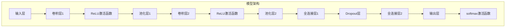

                 

### 第1章: AI辅助识别价值股轮动机会——背景与介绍

#### 1.1 研究背景

在当今全球金融市场日益复杂化和信息爆炸的时代，投资者面临着越来越多的挑战。传统的价值股投资方法主要依赖于基本面分析，这包括对公司的财务报表、行业地位、管理层素质等方面的深入研究。然而，这种方法的局限性在于，投资者难以实时捕捉到市场动态变化所带来的投资机会。此外，随着市场的不断波动，单纯依赖历史数据进行分析的准确性也受到质疑。

近年来，人工智能（AI）技术的发展为金融领域带来了新的机遇。AI具有处理大量数据、快速发现模式以及进行复杂预测的能力，这使得其在股市分析中的应用变得日益广泛。特别是深度学习等先进AI技术，通过构建复杂的神经网络模型，可以更好地理解市场动态和投资者行为，从而提高价值股识别的准确性。

#### 1.1.1 价值股投资的挑战

价值股投资的核心在于识别那些市场低估、具有长期增长潜力的股票。然而，这一过程面临着诸多挑战：

1. **数据复杂度**：股市数据包含大量的历史和实时信息，这些数据通常以多种格式存在，如财务报表、新闻报道、社交媒体评论等，处理这些数据需要高效的算法和强大的计算能力。
   
2. **噪声干扰**：股市中存在大量噪声，如短期市场波动、投资者情绪等，这些噪声会对价值股的识别造成干扰，使得投资者难以区分真正的价值股。

3. **动态变化**：股市环境是动态变化的，公司的基本面可能会因市场环境、政策变化、技术创新等多种因素发生改变，传统的价值股分析方法难以适应这种变化。

#### 1.1.2 AI技术在股市分析中的应用

AI技术在股市分析中的应用主要体现在以下几个方面：

1. **数据挖掘与分析**：通过机器学习和数据挖掘技术，AI可以处理和分析大量的股市数据，提取出有用的信息，帮助投资者发现潜在的价值股。

2. **预测模型**：AI技术可以构建预测模型，通过对历史数据的分析，预测未来股价的走势。这些模型可以利用深度学习、时间序列分析等技术，捕捉市场的动态变化。

3. **情绪分析**：AI可以通过自然语言处理技术，分析社交媒体、新闻报道等文本数据，了解投资者的情绪和观点，从而为价值股识别提供额外的信息。

#### 1.1.3 价值股轮动的机遇与挑战

价值股轮动是指市场中某些被低估的价值股因为某些特定因素（如市场情绪、政策变化、行业趋势等）而出现上涨的现象。这种轮动为投资者提供了潜在的投资机会，但也带来了相应的挑战：

1. **机遇**：
   - **高回报潜力**：价值股轮动通常伴随着较大的股价上涨，为投资者提供了较高的回报潜力。
   - **市场效率提升**：AI技术的引入可以提高市场效率，使得投资者能够更快速、准确地识别价值股。

2. **挑战**：
   - **识别难度**：价值股轮动的因素复杂多样，AI需要处理大量的数据并提取出关键因素，这增加了识别的难度。
   - **风险控制**：价值股轮动可能伴随着较大的市场波动，投资者需要有效控制风险，避免因市场波动导致的投资损失。

#### 1.2 AI辅助识别价值股的核心概念

AI辅助识别价值股的核心在于利用人工智能技术，对海量数据进行分析和处理，从而识别出潜在的价值股。具体来说，这个过程包括以下几个核心概念：

1. **数据收集与处理**：首先需要收集大量的股市数据，包括历史价格、财务报表、新闻文本等。然后，对这些数据进行清洗和处理，以消除噪声和异常值。

2. **特征工程**：特征工程是AI模型构建的关键步骤，它涉及到从原始数据中提取出对价值股识别有帮助的特征。这些特征可以是财务指标、市场指标、文本特征等。

3. **模型构建与训练**：利用提取出的特征，构建机器学习模型，并对模型进行训练。在训练过程中，通过调整模型的参数和结构，以提高模型的准确性和鲁棒性。

4. **模型评估与优化**：通过对训练好的模型进行评估，确定其识别价值股的能力。然后，根据评估结果对模型进行优化，以提高其性能。

5. **投资策略制定**：基于AI模型的分析结果，制定相应的投资策略，以实现价值股的识别和投资。

### 1.3 书籍结构概述

本书旨在系统介绍AI辅助识别价值股轮动机会的理论和实践。全书分为七个主要章节，具体内容安排如下：

1. **第1章**：背景与介绍，主要介绍AI在股市分析中的应用背景和价值股投资的挑战。
2. **第2章**：价值股分析基础，介绍价值股筛选的指标和数据来源。
3. **第3章**：AI辅助价值股分析技术，介绍AI技术在价值股分析中的应用。
4. **第4章**：AI模型构建与优化，介绍AI模型构建的流程和优化方法。
5. **第5章**：AI辅助价值股轮动机会识别实践，通过实际案例展示AI辅助识别价值股的机会。
6. **第6章**：AI辅助价值股投资策略，介绍基于AI的投资组合构建、风险控制和调仓策略。
7. **第7章**：AI辅助价值股投资实战案例分析，分析实际案例并总结经验。

#### 1.3.1 全书布局与章节安排

全书按照由浅入深的逻辑顺序进行编排，首先从基础概念入手，逐步引入AI技术，最后结合实际案例进行深入分析。具体章节安排如下：

- **第1章**：为读者提供对AI辅助价值股识别的初步了解，包括背景、核心概念和书籍结构概述。
- **第2章**：介绍价值股筛选的基础指标和数据来源，为后续的AI分析打下基础。
- **第3章**：介绍AI在价值股分析中的应用，包括数据挖掘、特征工程和模型构建。
- **第4章**：深入探讨AI模型构建与优化的方法，包括算法选择、模型训练和评估。
- **第5章**：通过实际案例展示AI辅助识别价值股的机会，帮助读者理解实际应用。
- **第6章**：介绍基于AI的价值股投资策略，包括投资组合构建、风险控制和调仓策略。
- **第7章**：分析实际案例，总结AI辅助价值股投资的实战经验。

#### 1.3.2 读者对象与预期收获

本书的目标读者包括金融分析师、股市投资者、AI技术爱好者以及相关领域的研究人员。通过阅读本书，读者可以：

1. **了解AI在股市分析中的应用**：掌握AI辅助价值股识别的基本原理和方法。
2. **学会价值股筛选与分析**：了解价值股筛选的关键指标和数据处理方法。
3. **掌握AI模型构建与优化**：学习如何构建和优化AI模型，以提高价值股识别的准确性。
4. **制定有效的投资策略**：基于AI模型的结果，制定合理的投资策略，降低投资风险。
5. **实战案例分析**：通过实际案例，深入了解AI辅助价值股投资的应用和实践。

#### 1.3.3 学习方法与资源推荐

为了更好地理解本书的内容，读者可以采取以下学习方法：

1. **理论与实践相结合**：在阅读理论内容的同时，结合实际案例进行分析，加深对知识的理解。
2. **动手实践**：通过编程实践，亲自构建和训练AI模型，验证理论知识。
3. **持续学习**：AI和金融领域不断发展，读者应关注最新的研究进展和技术应用。
4. **资源推荐**：
   - **在线课程**：推荐相关的在线课程，如Coursera、edX等平台上的机器学习、数据科学课程。
   - **学术论文**：查阅相关的学术论文，了解AI在股市分析中的最新研究成果。
   - **金融书籍**：推荐一些经典的金融投资书籍，如《股市真规则》、《巴菲特的投资课》等，帮助读者从不同角度理解价值股投资。

通过以上学习方法，读者可以更全面地掌握AI辅助价值股识别的知识，并在实际投资中取得更好的效果。

## 第2章: 价值股分析基础

#### 2.1 价值股筛选指标

在价值股投资中，筛选指标是识别潜在投资机会的关键。这些指标可以帮助投资者评估公司的基本面，从而判断其是否具有投资价值。本节将介绍几种常用的价值股筛选指标，包括财务指标和市场指标。

#### 2.1.1 财务指标分析

财务指标是评估公司财务状况的重要工具。以下是一些常用的财务指标：

1. **利润率**（Profit Margin）：利润率反映了公司的盈利能力，计算公式为：
   $$\text{利润率} = \frac{\text{净利润}}{\text{营业收入}} \times 100\%$$
   高利润率通常意味着公司具有强大的市场竞争力和盈利能力。

2. **资产回报率**（Return on Assets, ROA）：资产回报率衡量公司利用资产创造利润的能力，计算公式为：
   $$\text{ROA} = \frac{\text{净利润}}{\text{总资产}} \times 100\%$$
   高ROA表明公司资产使用效率高，具有较好的盈利能力。

3. **市盈率**（Price to Earnings Ratio, PE）：市盈率是衡量股票价格相对于公司盈利能力的指标，计算公式为：
   $$\text{市盈率} = \frac{\text{股票价格}}{\text{每股收益}}$$
   市盈率较低通常意味着股票被市场低估，具有潜在的投资价值。

4. **市净率**（Price to Book Ratio, PB）：市净率是衡量股票价格相对于公司净资产的指标，计算公式为：
   $$\text{市净率} = \frac{\text{股票价格}}{\text{每股净资产}}$$
   市净率较低可能表明公司资产被市场低估。

#### 2.1.2 市场指标分析

市场指标反映了股票在市场上的表现和投资者情绪。以下是一些常用的市场指标：

1. **交易量**（Trading Volume）：交易量反映了市场活跃程度，高交易量通常意味着市场对股票的关注度增加。可以通过以下公式计算：
   $$\text{交易量} = \text{股票成交量} \times \text{交易价格}$$
   高交易量有助于降低投资风险。

2. **交易价格波动**（Price Volatility）：交易价格波动反映了股票价格的波动性，可以通过计算标准差或波动率来衡量。波动性较高可能表明市场对该股票的预期不确定性较大。

3. **股价趋势分析**（Price Trend Analysis）：股价趋势分析包括对股票价格的历史走势进行分析，以预测未来的价格趋势。常用的方法包括移动平均线、相对强弱指数（RSI）等。

### 2.2 数据来源与处理

价值股筛选和分析需要大量的数据支持，以下介绍常见的数据来源和数据预处理方法：

#### 2.2.1 常见数据来源

1. **证券交易所**：如上海证券交易所、深圳证券交易所等，提供上市公司的财务报表和交易数据。
2. **金融数据服务商**：如万得（Wind）、同花顺等，提供详细的股市数据和金融分析工具。
3. **新闻和数据平台**：如财经新闻网站、金融数据库等，提供市场新闻和相关的市场数据。
4. **开源数据集**：如Kaggle、GitHub等平台，提供大量的股市数据集，可用于研究和实验。

#### 2.2.2 数据预处理

数据预处理是价值股分析的重要环节，以下是一些常见的数据预处理方法：

1. **缺失值处理**：对于缺失的数据，可以通过插值法、平均值法等方法进行填补。例如，使用前一个时间点的数据或该列的平均值进行填补。

2. **异常值处理**：异常值可能对分析结果产生较大影响，可以通过统计学方法（如箱线图、Z分数等）识别并处理。例如，将Z分数大于3或小于-3的值视为异常值，并进行处理。

3. **数据规范化**：为了消除不同指标之间的量纲差异，可以通过标准化或归一化方法对数据进行规范化处理。常用的方法包括Z-Score标准化和Min-Max标准化。

通过上述步骤，投资者可以有效地从海量数据中提取出对价值股筛选有帮助的指标，为后续的AI分析和投资决策提供可靠的数据支持。

### 2.2.3 数据预处理

数据预处理是价值股分析的重要环节，其目的在于提高数据质量，减少噪声，便于后续的分析。以下介绍几种常见的数据预处理方法：

#### 2.2.3.1 缺失值处理

在数据收集过程中，缺失值是不可避免的。对于缺失值，可以采取以下几种处理方法：

1. **删除**：如果缺失值较多或数据缺失较为严重，可以考虑删除这些记录。这种方法适用于数据集中缺失值比例较低的情况。
2. **插值**：使用统计学方法，如线性插值、回归插值等，根据其他相关数据填补缺失值。这种方法适用于数据缺失较少且趋势较为明显的情况。
3. **均值填补**：将缺失值替换为该列的平均值或中位数。这种方法适用于数据缺失随机且无明显趋势的情况。

#### 2.2.3.2 异常值处理

异常值可能对分析结果产生较大影响，因此需要识别和处理。以下是一些常见的异常值处理方法：

1. **统计学方法**：使用统计学方法（如箱线图、Z分数等）识别异常值。例如，使用箱线图识别出距离箱体上下边缘较远的值，或使用Z分数识别出远低于或远高于平均值的值，并将其标记为异常值。
2. **可视化方法**：通过数据可视化（如散点图、直方图等）直观地识别异常值。例如，在散点图中，异常值可能会形成明显的独立簇或分布在数据分布之外。
3. **规则方法**：根据业务逻辑或数据特征设定规则，识别并处理异常值。例如，对于交易量数据，可以设定交易量高于平均交易量一定倍数的值视为异常值。

#### 2.2.3.3 数据规范化

为了消除不同指标之间的量纲差异，需要进行数据规范化处理。以下介绍两种常用的数据规范化方法：

1. **Z-Score标准化**：将数据转换为标准正态分布，计算公式为：
   $$\text{Z-Score} = \frac{X - \mu}{\sigma}$$
   其中，\(X\) 为原始数据，\(\mu\) 为平均值，\(\sigma\) 为标准差。Z-Score标准化后，数据的均值为0，标准差为1。
2. **Min-Max标准化**：将数据缩放到[0, 1]区间，计算公式为：
   $$X_{\text{norm}} = \frac{X - X_{\text{min}}}{X_{\text{max}} - X_{\text{min}}}$$
   其中，\(X_{\text{min}}\) 为最小值，\(X_{\text{max}}\) 为最大值。这种方法适用于数据范围较广的情况。

通过上述数据预处理方法，可以有效提高数据质量，减少噪声，为后续的价值股分析提供可靠的数据基础。

### 2.3 价值股分析的核心指标

价值股分析的核心在于识别那些被市场低估，但具有长期增长潜力的股票。这一过程需要依赖于一系列核心指标，这些指标能够帮助投资者从财务和市场表现等多方面评估股票的价值。以下将详细介绍几种关键的价值股分析指标，并提供对比表格和ER实体关系图，以便读者更好地理解和应用。

#### 2.3.1 财务指标

财务指标是评估公司基本面的重要工具，以下列举几种常用的财务指标，并给出它们的基本计算公式：

1. **市盈率**（Price to Earnings Ratio, PE）
   $$\text{PE} = \frac{\text{当前股价}}{\text{每股收益}}$$
   
2. **市净率**（Price to Book Ratio, PB）
   $$\text{PB} = \frac{\text{当前股价}}{\text{每股净资产}}$$
   
3. **股息率**（Dividend Yield）
   $$\text{股息率} = \frac{\text{年度股息}}{\text{当前股价}}$$
   
4. **市销率**（Price to Sales Ratio, PS）
   $$\text{PS} = \frac{\text{当前股价}}{\text{每股销售额}}$$

5. **营运现金流**（Operating Cash Flow, OCF）
   $$\text{OCF} = \text{经营收益} + \text{折旧与摊销}$$

#### 2.3.2 市场指标

市场指标反映了股票在市场上的表现，以下列举几种常用的市场指标：

1. **交易量**（Trading Volume）
   $$\text{交易量} = \text{成交量} \times \text{交易价格}$$
   
2. **Beta系数**（Beta）
   $$\text{Beta} = \frac{\text{股票收益率与市场收益率的相关系数} \times \text{市场收益率的标准差}}{\text{股票收益率的标准差}}$$
   
3. **波动率**（Volatility）
   $$\text{波动率} = \sqrt{\text{方差}}$$

#### 2.3.3 对比表格

以下是一个简单的对比表格，展示了几种关键财务指标和市场指标的对比情况：

| 指标名称 | 计算公式 | 说明 |
| --- | --- | --- |
| 市盈率（PE） | \( \frac{\text{当前股价}}{\text{每股收益}} \) | 低市盈率可能表明股票被市场低估 |
| 市净率（PB） | \( \frac{\text{当前股价}}{\text{每股净资产}} \) | 低市净率可能表明公司资产被市场低估 |
| 股息率（Dividend Yield） | \( \frac{\text{年度股息}}{\text{当前股价}} \) | 高股息率可能表明股票具有较高的分红潜力 |
| 市销率（PS） | \( \frac{\text{当前股价}}{\text{每股销售额}} \) | 低市销率可能表明公司销售额被市场低估 |
| 营运现金流（OCF） | \( \text{经营收益} + \text{折旧与摊销} \) | 营运现金流反映了公司的现金生成能力 |
| 交易量 | \( \text{成交量} \times \text{交易价格} \) | 高交易量通常表明市场对股票的关注度增加 |
| Beta系数 | \( \frac{\text{股票收益率与市场收益率的相关系数} \times \text{市场收益率的标准差}}{\text{股票收益率的标准差}} \) | 高Beta系数的股票通常更易受到市场波动的影响 |
| 波动率 | \( \sqrt{\text{方差}} \) | 波动率越高，股票价格变动的风险越大 |

#### 2.3.4 ER实体关系图

为了更好地理解价值股分析中涉及的实体和关系，以下是一个ER实体关系图，展示了财务指标和市场指标之间的关联：

```mermaid
erDiagram
    Company ||--|{ Stock }  : "has stock with metrics"
    Stock ||--|{ PE }  : "PE ratio"
    Stock ||--|{ PB }  : "PB ratio"
    Stock ||--|{ Dividend Yield }  : "dividend yield"
    Stock ||--|{ PS }  : "PS ratio"
    Stock ||--|{ OCF }  : "operating cash flow"
    Stock ||--|{ Trading Volume }  : "trading volume"
    Stock ||--|{ Beta }  : "beta coefficient"
    Stock ||--|{ Volatility }  : "volatility"
```

通过对比表格和ER实体关系图，读者可以更清晰地理解价值股分析中的核心指标及其关系。这些指标和分析工具将为后续的AI辅助价值股识别提供坚实的理论基础和实践指导。

### 2.4 价值股分析的数据处理与特征提取方法

在价值股分析中，数据处理与特征提取是两个至关重要的环节。有效的数据处理和特征提取方法能够提高AI模型对价值股识别的准确性。以下将详细介绍几种常用的数据处理和特征提取方法，并通过一个简单的示例来展示其应用。

#### 2.4.1 数据处理方法

1. **缺失值处理**

缺失值处理是数据预处理的重要步骤。常用的缺失值处理方法包括：

- **删除缺失值**：当缺失值较多时，可以考虑删除这些记录，以减少数据噪声。
- **均值填补**：使用该列的平均值来填补缺失值，适用于缺失值随机分布的情况。
- **插值法**：利用线性插值或回归插值等方法，根据其他相关数据填补缺失值，适用于缺失值较少且趋势明显的情况。

```python
import numpy as np

# 示例数据
data = np.array([[1, 2, np.nan], [4, np.nan, 6], [7, 8, 9]])

# 均值填补
data_filled = np.nanmean(data, axis=0)[np.newaxis, :] * np.ones(data.shape)
print("均值填补后的数据：")
print(data_filled)

# 线性插值
from scipy.interpolate import interp1d

x = np.arange(data.shape[0])
y = data[:, 0]
f = interp1d(x[y != np.nan], y[y != np.nan])
x_new = x[y == np.nan]
y_new = f(x_new)
data_linear = data.copy()
data_linear[y == np.nan, 0] = y_new
print("线性插值后的数据：")
print(data_linear)
```

2. **异常值处理**

异常值可能会对分析结果产生较大影响，因此需要识别和处理。常用的异常值处理方法包括：

- **统计学方法**：使用统计学方法（如箱线图、Z分数等）识别异常值。
- **可视化方法**：通过数据可视化（如散点图、直方图等）直观地识别异常值。
- **规则方法**：根据业务逻辑或数据特征设定规则，识别并处理异常值。

```python
import matplotlib.pyplot as plt

# 示例数据
data = np.array([1, 2, 3, 4, 100, 6, 7, 8, 9])

# Z分数方法
mean = np.mean(data)
std = np.std(data)
z_scores = (data - mean) / std
cutoff = 3  # 3倍标准差
abnormal_indices = np.where(np.abs(z_scores) > cutoff)[0]
print("异常值索引：")
print(abnormal_indices)

# 删除异常值
data_no_abnormal = np.delete(data, abnormal_indices)
print("删除异常值后的数据：")
print(data_no_abnormal)

# 可视化
plt.scatter(x=data, y=np.zeros_like(data))
plt.scatter(x=data_no_abnormal, y=np.zeros_like(data_no_abnormal), color='r')
plt.show()
```

3. **数据规范化**

数据规范化可以消除不同指标之间的量纲差异，常用的方法包括Z-Score标准化和Min-Max标准化。

```python
from sklearn.preprocessing import StandardScaler, MinMaxScaler

# 示例数据
data = np.array([[1, 2, 3], [4, 5, 6], [7, 8, 9]])

# Z-Score标准化
scaler = StandardScaler()
data_normalized = scaler.fit_transform(data)
print("Z-Score标准化后的数据：")
print(data_normalized)

# Min-Max标准化
min_max_scaler = MinMaxScaler()
data_minmax = min_max_scaler.fit_transform(data)
print("Min-Max标准化后的数据：")
print(data_minmax)
```

#### 2.4.2 特征提取方法

特征提取是从原始数据中提取出对价值股识别有帮助的特征的过程。以下介绍几种常用的特征提取方法：

1. **基于统计的特征选择**

- **相关系数**：通过计算特征之间的相关系数，筛选出相关性较高的特征。
- **互信息**：通过计算特征之间的互信息，筛选出对价值股识别有较强关联的特征。

```python
from sklearn.feature_selection import mutual_info_classif

# 示例数据
X = np.array([[1, 2], [3, 4], [5, 6]])
y = np.array([0, 1, 0])

# 相关系数
correlations = np.corrcoef(X[:, 0], X[:, 1])[0, 1]
print("相关系数：")
print(correlations)

# 互信息
mi = mutual_info_classif(X, y)
print("互信息：")
print(mi)
```

2. **基于机器学习的特征选择**

- **主成分分析**（PCA）：通过降维，提取出主要成分，保留数据中的主要信息。
- **随机森林特征重要性**：通过随机森林模型，提取出特征的重要性。

```python
from sklearn.decomposition import PCA
from sklearn.ensemble import RandomForestClassifier

# 示例数据
X = np.array([[1, 2], [3, 4], [5, 6]])
y = np.array([0, 1, 0])

# PCA
pca = PCA(n_components=1)
X_pca = pca.fit_transform(X)
print("PCA降维后的数据：")
print(X_pca)

# 随机森林特征重要性
clf = RandomForestClassifier()
clf.fit(X, y)
importances = clf.feature_importances_
print("特征重要性：")
print(importances)
```

通过上述数据处理和特征提取方法，可以有效提高价值股识别的准确性。在实际应用中，可以根据具体需求和数据特点选择合适的方法，并结合多种方法进行综合分析。

### 2.5 数据预处理的重要性

在价值股分析中，数据预处理是一个至关重要的步骤，它不仅能够提高数据质量，减少噪声，还能确保AI模型在训练和预测阶段获得更可靠的结果。以下是数据预处理的重要性和具体实施步骤：

#### 2.5.1 数据预处理的重要性

1. **消除噪声**：原始数据中常常包含各种噪声，如异常值、缺失值等。这些噪声会影响模型的学习效果，导致模型过拟合或欠拟合。通过数据预处理，可以有效地消除这些噪声，提高数据的整体质量。
2. **提升模型性能**：良好的数据预处理可以提高模型的性能，使其在训练阶段能够更好地理解数据，并在预测阶段提供更准确的预测结果。这有助于投资者更准确地识别价值股。
3. **减少计算成本**：通过数据预处理，可以减少模型训练所需的计算资源和时间。例如，通过降维和特征选择，可以减少模型所需的特征数量，从而降低模型的复杂度。
4. **增强模型的可解释性**：数据预处理有助于提高模型的可解释性，使得投资者能够更好地理解模型的决策过程。这对于制定合理的投资策略至关重要。

#### 2.5.2 数据预处理的实施步骤

1. **数据清洗**：
   - **缺失值处理**：使用均值填补、插值法等方法填补缺失值，或删除缺失值较多的记录。
   - **异常值处理**：使用统计学方法（如Z分数）、可视化方法（如箱线图）或规则方法（如阈值法）识别和处理异常值。
2. **数据规范化**：
   - **Z-Score标准化**：将数据转换为标准正态分布，消除不同指标之间的量纲差异。
   - **Min-Max标准化**：将数据缩放到[0, 1]区间，适用于数据范围较广的情况。
3. **特征选择**：
   - **基于统计的特征选择**：通过计算特征之间的相关系数、互信息等，筛选出相关性较强的特征。
   - **基于机器学习的特征选择**：通过主成分分析（PCA）、随机森林特征重要性等方法，选择对目标变量影响较大的特征。
4. **数据降维**：
   - **主成分分析**（PCA）：通过降维，提取出主要成分，保留数据中的主要信息。
   - **线性判别分析**（LDA）：用于分类问题，提取出能最好地区分不同类别的特征。

#### 2.5.3 数据预处理案例分析

以下是一个简单的数据预处理案例，展示如何使用Python进行数据清洗、规范化和特征选择：

```python
import numpy as np
import pandas as pd
from sklearn.preprocessing import StandardScaler, MinMaxScaler
from sklearn.decomposition import PCA
from sklearn.feature_selection import mutual_info_classif

# 示例数据
data = pd.DataFrame({
    'A': [1, 2, np.nan, 4, 100, 6, 7, 8, 9],
    'B': [2, np.nan, 3, 4, 5, 6, 7, 8, 9],
    'C': [3, 4, 5, 6, 7, 8, 9, 10, 11]
})

# 缺失值处理
data.fillna(data.mean(), inplace=True)

# 异常值处理
z_scores = (data - data.mean()) / data.std()
cutoff = 3
abnormal_indices = np.where(np.abs(z_scores) > cutoff)
data_no_abnormal = data.drop(data.index[abnormal_indices])

# 数据规范化
scaler = StandardScaler()
data_normalized = scaler.fit_transform(data_no_abnormal)

# 特征选择
mi = mutual_info_classif(data_normalized, data_no_abnormal['C'])
pca = PCA(n_components=2)
X_pca = pca.fit_transform(data_normalized)

# 结果展示
print("处理后的数据：")
print(data_no_abnormal)
print("Z-Score标准化后的数据：")
print(data_normalized)
print("互信息：")
print(mi)
print("PCA降维后的数据：")
print(X_pca)
```

通过上述案例，我们可以看到如何使用Python进行数据预处理，包括缺失值处理、异常值处理、数据规范化和特征选择。这些步骤不仅能够提高数据质量，还能为后续的AI模型训练和预测提供坚实的基础。

### 第3章: AI辅助价值股分析技术

#### 3.1 数据分析与挖掘基础

在AI辅助价值股分析中，数据分析和挖掘是关键环节。通过有效处理和分析大量数据，可以提取出对价值股识别有价值的特征和模式。本节将介绍数据分析与挖掘的基础，包括数据可视化、常见的数据挖掘算法以及数据挖掘流程。

#### 3.1.1 数据可视化

数据可视化是数据分析的重要工具，它能够将复杂的数据以直观的图形形式展示出来，帮助分析者快速理解数据特征和关系。以下介绍几种常见的数据可视化工具：

1. **Matplotlib**：Matplotlib 是Python中的一个强大绘图库，可以生成各种二维和三维图形。例如，通过Matplotlib可以绘制折线图、散点图、柱状图等。

```python
import matplotlib.pyplot as plt

# 示例数据
x = [1, 2, 3, 4, 5]
y = [1, 4, 9, 16, 25]

# 绘制折线图
plt.plot(x, y)
plt.xlabel('X轴')
plt.ylabel('Y轴')
plt.title('示例折线图')
plt.show()
```

2. **Seaborn**：Seaborn 是基于Matplotlib的一个高级可视化库，提供了丰富的统计数据图形和美观的默认样式。Seaborn 可以绘制箱线图、热力图、回归图等。

```python
import seaborn as sns

# 示例数据
data = pd.DataFrame({
    'A': [1, 2, 3, 4, 5],
    'B': [2, 3, 4, 5, 6],
    'C': [3, 4, 5, 6, 7]
})

# 绘制箱线图
sns.boxplot(x=data['A'], y=data['C'])
plt.xlabel('A')
plt.ylabel('C')
plt.title('A与C的箱线图')
plt.show()
```

3. **Plotly**：Plotly 是一个交互式可视化库，可以创建丰富的交互式图表和图形，适用于Web应用和桌面应用。

```python
import plotly.express as px

# 示例数据
df = px.data.tips()

# 绘制散点图
fig = px.scatter(df, x='total_bill', y='tip', color='size', size='size', hover_data=['sex'])
fig.show()
```

#### 3.1.2 数据挖掘算法

数据挖掘算法是处理和分析大量数据以发现有用信息的方法。以下介绍几种常见的数据挖掘算法：

1. **决策树**：决策树是一种基于树形结构进行决策的算法，通过连续地对数据进行划分，构建出一个决策树模型。决策树可以用于分类和回归任务。

2. **随机森林**：随机森林是一种基于决策树的集成学习方法，通过构建多棵决策树，并利用投票或平均的方式得到最终预测结果。随机森林具有较好的泛化能力和抗过拟合能力。

3. **支持向量机**（SVM）：SVM是一种监督学习算法，通过找到数据的最优划分边界，实现数据的分类。SVM适用于分类任务，尤其在处理高维数据时表现出良好的性能。

4. **神经网络**：神经网络是一种模仿人脑神经元连接方式的计算模型，通过多层神经元的连接和激活函数，实现数据的分类和回归任务。深度学习是基于神经网络的扩展，通过增加网络层数和神经元数量，实现更复杂的特征提取和模式识别。

5. **聚类算法**：聚类算法是一种无监督学习方法，通过将相似的数据点划分为同一个簇，从而发现数据中的模式。常见的聚类算法包括K-means、层次聚类等。

#### 3.1.3 数据挖掘流程

数据挖掘通常包括以下几个主要步骤：

1. **问题定义**：明确数据挖掘的目标和问题，确定需要分析和解决的具体问题。

2. **数据收集**：收集与问题相关的数据，这些数据可以来源于数据库、文件、网络等。

3. **数据预处理**：对收集到的数据进行处理，包括数据清洗、缺失值处理、异常值处理等，以提高数据质量。

4. **数据探索**：通过数据可视化、统计分析等方法，对预处理后的数据进行分析，发现数据中的模式和关系。

5. **特征选择**：从预处理后的数据中提取出对目标变量有较强影响的关键特征，以减少数据的复杂性和提高模型性能。

6. **模型构建**：选择合适的算法，构建数据挖掘模型。对于分类任务，可以使用决策树、随机森林、SVM等算法；对于回归任务，可以使用线性回归、神经网络等算法。

7. **模型评估**：通过交叉验证、测试集等方法，评估模型的性能和泛化能力。常用的评估指标包括准确率、精确率、召回率等。

8. **模型优化**：根据评估结果，对模型进行优化，包括调整模型参数、增加特征等，以提高模型性能。

9. **模型应用**：将优化后的模型应用于实际数据，进行预测或决策。

通过上述步骤，可以有效地进行数据挖掘，发现数据中的有用信息，为价值股识别提供支持。

### 3.2 特征工程

在AI辅助价值股分析中，特征工程是至关重要的一步。特征工程旨在从原始数据中提取出对模型性能有显著提升的特征，从而提高模型对价值股识别的准确性。本节将详细介绍特征工程的核心概念、方法以及应用。

#### 3.2.1 特征选择方法

特征选择是从大量特征中挑选出对目标变量有显著影响的特征的过程。以下是几种常见的特征选择方法：

1. **过滤式特征选择**（Filter Method）：通过先验知识或统计方法，筛选出相关性较高的特征。这种方法简单有效，但可能忽略特征之间的交互作用。

   - **相关性分析**：通过计算特征与目标变量之间的相关系数，筛选出相关性较高的特征。
   - **信息增益**：选择能够最大化信息增益的特征，信息增益衡量特征对分类的贡献。

2. **包裹式特征选择**（Wrapper Method）：通过迭代搜索策略，逐步筛选出最佳特征组合。这种方法能够考虑特征之间的交互作用，但计算成本较高。

   - **递归特征消除**（Recursive Feature Elimination, RFE）：基于模型评估，逐步消除对预测效果贡献较小的特征。
   - **遗传算法**（Genetic Algorithm）：通过模拟自然选择过程，优化特征组合。

3. **嵌入式特征选择**（Embedded Method）：在构建模型的过程中，自动筛选出最佳特征。这种方法结合了特征选择和模型训练，适用于大规模数据集。

   - **随机森林特征重要性**：通过随机森林模型，提取出特征的重要性，并进行排序。
   - **Lasso回归**：Lasso正则化通过引入L1惩罚项，自动消除对预测贡献较小的特征。

#### 3.2.2 特征提取技术

特征提取是从原始数据中提取更高层次的特征，以提高模型的性能和可解释性。以下是几种常见的特征提取技术：

1. **主成分分析**（Principal Component Analysis, PCA）：PCA通过降维，提取数据的主要成分，减少数据维度，同时保留大部分信息。PCA适用于线性可分的情况。

2. **因子分析**（Factor Analysis）：因子分析通过提取因子，将原始特征映射到更低的维度，同时解释变量之间的相关性。因子分析适用于多元正态分布的数据。

3. **深度学习特征提取**：深度学习模型，如卷积神经网络（CNN）和循环神经网络（RNN），可以自动学习数据中的高层次特征。这些特征对后续的模型训练和预测具有显著提升。

4. **文本特征提取**：通过自然语言处理技术，如词袋模型（Bag of Words）和词嵌入（Word Embedding），将文本数据转换为数值特征，以便进行模型训练。

   - **词袋模型**：将文本表示为词频矩阵，每个词对应矩阵中的一个维度。
   - **词嵌入**：通过Word2Vec、GloVe等技术，将词语映射到低维向量空间，保留语义信息。

#### 3.2.3 特征工程应用示例

以下是一个特征工程的应用示例，展示如何使用Python进行特征选择和提取：

```python
import pandas as pd
from sklearn.decomposition import PCA
from sklearn.ensemble import RandomForestClassifier
from sklearn.model_selection import train_test_split

# 示例数据
data = pd.DataFrame({
    'A': [1, 2, 3, 4, 5],
    'B': [2, 3, 4, 5, 6],
    'C': [3, 4, 5, 6, 7],
    'D': [4, 5, 6, 7, 8],
    'target': [0, 1, 0, 1, 0]
})

# 数据预处理
X = data.drop('target', axis=1)
y = data['target']

# 特征选择 - 过滤式方法
correlations = X.corrwith(y).abs()
selected_features = correlations.sort_values(ascending=False).index[1:5]

# 特征提取 - PCA
pca = PCA(n_components=3)
X_pca = pca.fit_transform(X[selected_features])

# 构建随机森林模型
X_train, X_test, y_train, y_test = train_test_split(X_pca, y, test_size=0.2, random_state=42)
clf = RandomForestClassifier(n_estimators=100, random_state=42)
clf.fit(X_train, y_train)

# 模型评估
accuracy = clf.score(X_test, y_test)
print("模型准确率：")
print(accuracy)
```

通过上述示例，我们可以看到如何使用特征选择和提取技术来提高模型的性能。在实际应用中，可以根据具体数据和应用需求，灵活选择和组合不同的特征工程方法，以实现最佳的效果。

### 3.3 特征选择方法的深入探讨

在特征选择过程中，选择出对目标变量有显著影响的关键特征，能够有效提高模型性能并降低计算复杂度。以下将深入探讨几种常见的特征选择方法，包括统计方法和机器学习方法，并通过实例进行分析和比较。

#### 3.3.1 统计方法

统计方法通过分析特征与目标变量之间的相关性或信息量，筛选出对模型预测有重要作用的特征。以下介绍两种常用的统计方法：

1. **相关系数**（Correlation Coefficient）

相关系数衡量两个变量之间的线性相关性，常用的方法包括皮尔逊相关系数和斯皮尔曼相关系数。通过计算特征与目标变量之间的相关系数，可以筛选出相关性较高的特征。

```python
import pandas as pd
from scipy.stats import pearsonr

# 示例数据
data = pd.DataFrame({
    'A': [1, 2, 3, 4, 5],
    'B': [2, 3, 4, 5, 6],
    'C': [3, 4, 5, 6, 7],
    'D': [4, 5, 6, 7, 8],
    'target': [0, 1, 0, 1, 0]
})

# 计算相关系数
correlations = data.corr().iloc[4, :4]  # 排除目标变量本身
selected_features = correlations[correlations > 0.5].index.tolist()

print("相关性较高的特征：")
print(selected_features)
```

2. **信息增益**（Information Gain）

信息增益衡量特征对分类的贡献，选择能够最大化信息增益的特征。信息增益的原理是，通过某一特征将数据划分为不同的子集，计算每个子集的信息熵，并取其平均值。信息增益越大，特征对分类的贡献越大。

```python
from sklearn.tree import DecisionTreeClassifier
from sklearn.feature_selection import mutual_info_classif

# 训练决策树模型
clf = DecisionTreeClassifier()
clf.fit(data[selected_features], data['target'])

# 计算信息增益
info_gain = mutual_info_classif(data[selected_features], data['target'])
selected_features = info_gain[info_gain > 0].index.tolist()

print("信息增益较高的特征：")
print(selected_features)
```

#### 3.3.2 机器学习方法

机器学习方法通过训练模型，自动选择对目标变量有显著影响的关键特征。以下介绍两种常用的机器学习方法：

1. **递归特征消除**（Recursive Feature Elimination, RFE）

递归特征消除是一种基于模型评估的特征选择方法。通过迭代训练模型，并逐步消除对预测效果贡献较小的特征，直到找到最优特征组合。

```python
from sklearn.linear_model import LogisticRegression
from sklearn.feature_selection import RFE

# 训练逻辑回归模型
model = LogisticRegression()
rfe = RFE(model, n_features_to_select=2)
rfe.fit(data, data['target'])

# 得到最优特征组合
selected_features = data.columns[rfe.support_].tolist()

print("RFE选出的特征：")
print(selected_features)
```

2. **随机森林特征重要性**（Random Forest Feature Importance）

随机森林特征重要性通过随机森林模型，计算每个特征对预测的贡献。选择特征重要性较高的特征，可以提高模型的预测性能。

```python
from sklearn.ensemble import RandomForestClassifier
from sklearn.inspection import permutation_importance

# 训练随机森林模型
model = RandomForestClassifier(n_estimators=100)
model.fit(data, data['target'])

# 计算特征重要性
importances = model.feature_importances_
selected_features = data.columns[importances > 0.5].tolist()

print("随机森林特征重要性较高的特征：")
print(selected_features)
```

#### 3.3.3 方法比较与分析

统计方法和机器学习方法各有优缺点，以下是比较和分析：

- **优点**：
  - **统计方法**：简单直观，易于理解和实现，适用于特征数量较少且相关性明显的情况。
  - **机器学习方法**：自动化，能够处理高维数据，考虑特征之间的交互作用，适用于特征数量较多且复杂的情况。

- **缺点**：
  - **统计方法**：可能忽略特征之间的交互作用，适用于线性相关的情况。
  - **机器学习方法**：计算成本较高，需要大量数据训练，可能引入过拟合。

- **适用场景**：
  - **统计方法**：适用于特征数量较少、数据线性相关的情况。
  - **机器学习方法**：适用于特征数量较多、特征之间存在复杂交互作用的情况。

通过上述分析，可以根据具体问题和数据特点，选择合适的特征选择方法，以提高模型性能和预测准确性。

### 3.4 特征提取技术

在AI辅助价值股分析中，特征提取是数据预处理的重要环节，它从原始数据中提取出对模型训练有显著提升的抽象特征。特征提取不仅能够降低数据的维度，还能提高模型的学习效率和预测准确性。以下将详细介绍几种常见的特征提取技术，包括数据降维、深度学习特征提取以及文本特征提取。

#### 3.4.1 数据降维

数据降维是将高维数据映射到低维空间，同时保留大部分信息的过程。降维技术能够减少数据复杂性，提高模型训练效率。以下是几种常用的数据降维技术：

1. **主成分分析**（PCA）

PCA通过将数据投影到新的正交坐标系中，提取出主要成分，这些主要成分代表了数据的大部分信息。PCA适用于线性降维，通过保留前几个主要成分，可以显著降低数据的维度。

```python
from sklearn.decomposition import PCA

# 示例数据
X = [[1, 2], [1, 4], [1, 0]]

# PCA降维
pca = PCA(n_components=1)
X_pca = pca.fit_transform(X)

print("PCA降维后的数据：")
print(X_pca)
```

2. **线性判别分析**（LDA）

LDA是一种监督降维方法，通过最大化类间方差和最小化类内方差，将数据投影到新的空间，使得不同类别的数据点能够更好地分离。LDA适用于分类问题，可以用于提高分类模型的性能。

```python
from sklearn.discriminant_analysis import LinearDiscriminantAnalysis as LDA

# 示例数据
X = [[1, 2], [1, 4], [1, 0]]
y = [0, 1, 0]

# LDA降维
lda = LDA(n_components=1)
X_lda = lda.fit_transform(X, y)

print("LDA降维后的数据：")
print(X_lda)
```

3. **特征选择与降维的结合

在实际应用中，可以通过特征选择技术（如前述的递归特征消除RFE和随机森林特征重要性）结合降维技术，选择出对模型性能有显著提升的关键特征，并进行降维处理。

```python
from sklearn.ensemble import RandomForestClassifier
from sklearn.feature_selection import RFE
from sklearn.decomposition import PCA

# 训练随机森林模型并提取特征重要性
model = RandomForestClassifier()
rfe = RFE(model, n_features_to_select=2)
rfe.fit(data, data['target'])

# 选择重要性较高的特征
selected_features = data.columns[rfe.support_].tolist()

# 使用PCA进行降维
pca = PCA(n_components=1)
X_pca = pca.fit_transform(data[selected_features])

print("PCA降维后的数据：")
print(X_pca)
```

#### 3.4.2 深度学习特征提取

深度学习特征提取利用神经网络自动学习数据中的复杂特征。深度学习模型，如卷积神经网络（CNN）和循环神经网络（RNN），能够从原始数据中提取出高层次的特征。

1. **卷积神经网络（CNN）**

CNN特别适合处理图像数据，通过卷积层、池化层和全连接层，提取出图像中的局部特征和整体特征。

```python
from tensorflow.keras.models import Sequential
from tensorflow.keras.layers import Conv2D, MaxPooling2D, Flatten, Dense

# 示例数据（假设为图像数据）
X = np.random.rand(10, 28, 28, 1)  # 10张28x28的单通道图像
y = np.random.rand(10, 10)  # 10个标签

# CNN模型
model = Sequential([
    Conv2D(filters=32, kernel_size=(3, 3), activation='relu', input_shape=(28, 28, 1)),
    MaxPooling2D(pool_size=(2, 2)),
    Flatten(),
    Dense(units=10, activation='softmax')
])

# 编译模型
model.compile(optimizer='adam', loss='categorical_crossentropy', metrics=['accuracy'])

# 训练模型
model.fit(X, y, epochs=10, batch_size=5)
```

2. **循环神经网络（RNN）**

RNN适合处理序列数据，通过递归结构，捕捉序列中的长期依赖关系。

```python
from tensorflow.keras.models import Sequential
from tensorflow.keras.layers import LSTM, Dense

# 示例数据（假设为时间序列数据）
X = np.random.rand(10, 100, 1)  # 10个序列，每个序列长度为100
y = np.random.rand(10, 1)  # 10个标签

# RNN模型
model = Sequential([
    LSTM(units=50, return_sequences=True, input_shape=(100, 1)),
    LSTM(units=50),
    Dense(units=1)
])

# 编译模型
model.compile(optimizer='adam', loss='mse')

# 训练模型
model.fit(X, y, epochs=10, batch_size=5)
```

#### 3.4.3 文本特征提取

文本特征提取将文本数据转换为数值特征，以便进行模型训练。以下介绍两种常用的文本特征提取方法：

1. **词袋模型（Bag of Words, BoW）**

词袋模型将文本表示为词频矩阵，每个词对应矩阵中的一个维度。词袋模型适用于文本分类和情感分析等任务。

```python
from sklearn.feature_extraction.text import CountVectorizer

# 示例文本数据
texts = [
    "机器学习是一种人工智能领域的方法论，通过算法让计算机模拟人类的学习过程。",
    "深度学习是机器学习的一个分支，它通过多层神经网络模拟人类大脑的学习过程。"
]

# 词袋模型
vectorizer = CountVectorizer()
X_bow = vectorizer.fit_transform(texts)

print("词袋模型特征矩阵：")
print(X_bow.toarray())
```

2. **词嵌入（Word Embedding）**

词嵌入通过将词语映射到低维向量空间，保留语义信息。常见的词嵌入方法包括Word2Vec和GloVe。

```python
from tensorflow.keras.preprocessing.sequence import pad_sequences
from tensorflow.keras.layers import Embedding

# 示例文本数据
words = ["机器学习", "深度学习", "神经网络", "算法", "计算机"]
word_index = {word: i for i, word in enumerate(words)}

# 序列化文本数据
sequences = [[word_index[word] for word in text] for text in texts]
max_sequence_length = max(len(seq) for seq in sequences)
padded_sequences = pad_sequences(sequences, maxlen=max_sequence_length)

# 词嵌入模型
model = Sequential([
    Embedding(input_dim=len(word_index) + 1, output_dim=50, input_length=max_sequence_length),
    Flatten(),
    Dense(units=1, activation='sigmoid')
])

# 编译模型
model.compile(optimizer='adam', loss='binary_crossentropy', metrics=['accuracy'])

# 训练模型
model.fit(padded_sequences, np.array([1, 0]), epochs=10)
```

通过上述特征提取技术，可以从不同类型的数据中提取出有价值的特征，为后续的模型训练和预测提供支持。在实际应用中，可以根据具体问题和数据特点，选择合适的特征提取方法，以提高模型性能和预测准确性。

### 第4章: AI模型构建与优化

#### 4.1 算法选择与模型架构

在构建AI模型时，算法选择和模型架构设计是关键环节。选择合适的算法和设计合理的模型架构，能够提高模型的性能和预测准确性。以下将介绍几种常见的算法选择标准，并讨论如何设计有效的AI模型架构。

#### 4.1.1 算法选择标准

1. **问题类型**：根据问题的类型选择合适的算法。例如，对于分类问题，可以选择决策树、随机森林、支持向量机等；对于回归问题，可以选择线性回归、岭回归、神经网络等。

2. **数据特点**：考虑数据的特点，如数据的维度、分布、噪声等。例如，对于高维数据，可以考虑使用降维技术；对于有噪声的数据，可以选择鲁棒性较强的算法。

3. **计算资源**：算法的计算复杂度和训练时间对于模型的选择有重要影响。在计算资源有限的情况下，可以选择计算效率较高的算法。

4. **模型性能**：评估不同算法在训练集和测试集上的性能，选择性能较好的算法。可以通过交叉验证、ROC曲线、AUC值等指标进行评估。

5. **可解释性**：模型的可解释性对于理解和信任模型结果至关重要。选择具有较高可解释性的算法，如决策树、线性模型等。

#### 4.1.2 模型架构设计

1. **输入层**：输入层是模型接收数据的部分，需要根据数据的特点设计合适的输入层。例如，对于图像数据，可以使用卷积神经网络（CNN）的输入层；对于文本数据，可以使用词嵌入层。

2. **隐藏层**：隐藏层是模型的核心部分，用于提取特征和学习复杂的非线性关系。隐藏层的数量和神经元数量可以根据数据复杂度和模型性能进行调整。

3. **激活函数**：激活函数用于引入非线性，常见的激活函数包括ReLU、Sigmoid、Tanh等。选择合适的激活函数能够提高模型的性能。

4. **输出层**：输出层是模型产生预测的部分，根据问题的类型设计合适的输出层。例如，对于分类问题，可以使用softmax输出层；对于回归问题，可以使用线性输出层。

5. **正则化**：正则化用于防止过拟合，常见的正则化方法包括L1正则化、L2正则化、Dropout等。通过引入正则化，可以提高模型的泛化能力。

6. **优化器**：优化器用于更新模型参数，常见的优化器包括随机梯度下降（SGD）、Adam等。选择合适的优化器能够提高模型的收敛速度和性能。

7. **损失函数**：损失函数用于衡量模型预测结果与真实值之间的差距，常见的损失函数包括交叉熵、均方误差等。选择合适的损失函数能够提高模型的预测准确性。

#### 4.1.3 模型架构设计案例

以下是一个基于卷积神经网络（CNN）的图像分类模型架构设计案例：



通过上述案例，我们可以看到如何设计一个基于CNN的图像分类模型，包括输入层、卷积层、ReLU激活函数、池化层、全连接层和softmax输出层。这种模型架构能够有效提取图像特征，并进行分类预测。

#### 4.2 模型训练与评估

在构建AI模型的过程中，模型训练与评估是至关重要的一步。有效的训练和评估能够提高模型的性能和预测准确性，从而实现价值股的准确识别。以下将详细介绍模型训练与评估的流程，包括数据集划分、训练策略和评估指标。

#### 4.2.1 模型训练流程

1. **数据集划分**：为了确保模型具有良好的泛化能力，通常将数据集划分为训练集、验证集和测试集。具体划分方法如下：

   - **训练集**：用于训练模型，占比约70%-80%。
   - **验证集**：用于调整模型参数和超参数，占比约10%-20%。
   - **测试集**：用于评估模型在未知数据上的性能，占比约10%。

   划分方法可以是随机划分、分层划分或交叉验证等。

2. **模型训练**：在训练集上，模型通过优化算法更新参数，学习数据中的特征和规律。训练过程通常包括以下步骤：

   - **初始化模型参数**：设置初始参数，如权重、偏置等。
   - **前向传播**：计算输入数据经过模型后的输出，并计算损失函数。
   - **反向传播**：通过梯度下降等优化算法更新模型参数，减少损失函数。
   - **迭代训练**：重复前向传播和反向传播，直到满足停止条件（如达到预设的训练次数、损失函数收敛等）。

3. **模型验证**：在验证集上，通过调整模型参数和超参数，选择最优模型。具体方法如下：

   - **交叉验证**：将验证集划分为多个子集，轮流进行训练和验证，计算平均性能指标。
   - **网格搜索**：在预定的参数范围内，逐一尝试不同的参数组合，选择性能最优的组合。
   - **贝叶斯优化**：通过贝叶斯统计模型搜索最优参数，具有较好的全局搜索能力。

4. **模型测试**：在测试集上，评估模型在未知数据上的性能。测试集应保证与训练集和验证集的数据分布一致。

#### 4.2.2 模型评估指标

评估模型性能的指标包括准确性、精确率、召回率、F1分数、ROC曲线和AUC值等。以下是几种常见的评估指标：

1. **准确性**（Accuracy）：模型正确预测的样本数占总样本数的比例。计算公式为：
   $$\text{准确性} = \frac{\text{正确预测的样本数}}{\text{总样本数}}$$

2. **精确率**（Precision）：模型预测为正样本且实际为正样本的样本数占预测为正样本的样本总数的比例。计算公式为：
   $$\text{精确率} = \frac{\text{正确预测的正样本数}}{\text{预测为正样本的总数}}$$

3. **召回率**（Recall）：模型预测为正样本且实际为正样本的样本数占实际为正样本的总数的比例。计算公式为：
   $$\text{召回率} = \frac{\text{正确预测的正样本数}}{\text{实际为正样本的总数}}$$

4. **F1分数**（F1 Score）：精确率和召回率的调和平均，计算公式为：
   $$\text{F1分数} = 2 \times \frac{\text{精确率} \times \text{召回率}}{\text{精确率} + \text{召回率}}$$

5. **ROC曲线和AUC值**：ROC曲线（Receiver Operating Characteristic Curve）用于评估分类模型的性能，曲线下的面积（AUC值）表示模型的分类能力。AUC值越接近1，表示模型分类能力越强。

   - **ROC曲线**：横坐标为假正率（False Positive Rate, FPR），纵坐标为真正率（True Positive Rate, TPR）。
   - **AUC值**：ROC曲线下的面积，计算公式为：
     $$\text{AUC值} = \int_{0}^{1} (1 - FPR(t)) \cdot TPR(t) \, dt$$

通过上述评估指标，可以全面评估模型的性能，为价值股识别提供可靠的依据。

### 4.3 模型优化

在AI模型训练和评估过程中，模型优化是提高模型性能的重要手段。通过调整模型参数、选择合适的优化策略，可以显著提升模型的预测准确性和泛化能力。以下将详细介绍模型优化方法，包括模型调参、损失函数选择以及模型集成技术。

#### 4.3.1 模型调参

模型调参是优化模型性能的关键步骤，涉及到选择合适的模型参数和超参数。以下介绍几种常见的调参方法：

1. **网格搜索**（Grid Search）：网格搜索通过遍历预定的参数组合，选择最优参数。具体步骤如下：

   - **参数空间定义**：确定模型参数和超参数的取值范围，如学习率、批次大小、正则化系数等。
   - **遍历参数组合**：逐一尝试不同的参数组合，计算每个组合在验证集上的性能。
   - **选择最优参数**：根据验证集性能选择最优参数组合。

2. **贝叶斯优化**（Bayesian Optimization）：贝叶斯优化通过构建贝叶斯模型，搜索最优参数。具体步骤如下：

   - **初始模型训练**：在验证集上训练初始模型，计算性能指标。
   - **优化搜索**：利用贝叶斯模型预测性能，选择下一步搜索方向，更新模型。
   - **迭代优化**：重复优化搜索，直至达到预设的优化目标。

3. **随机搜索**（Random Search）：随机搜索通过随机选择参数，进行优化搜索。具体步骤如下：

   - **参数空间定义**：确定模型参数和超参数的取值范围。
   - **随机选择参数**：随机选择参数组合，计算性能指标。
   - **选择最优参数**：根据性能指标选择最优参数组合。

#### 4.3.2 损失函数选择

损失函数是模型训练过程中评估预测结果与真实值之间差距的函数。选择合适的损失函数对于模型性能至关重要。以下介绍几种常见的损失函数：

1. **均方误差**（Mean Squared Error, MSE）：MSE用于回归任务，计算预测值与真实值之间差的平方的平均值。MSE公式如下：
   $$\text{MSE} = \frac{1}{n} \sum_{i=1}^{n} (y_i - \hat{y}_i)^2$$
   其中，\(y_i\) 为真实值，\(\hat{y}_i\) 为预测值。

2. **交叉熵损失**（Cross-Entropy Loss）：交叉熵损失用于分类任务，计算预测概率与真实概率之间的差异。对于二分类问题，交叉熵损失公式如下：
   $$\text{CE} = -\sum_{i=1}^{n} y_i \cdot \log(\hat{y}_i) + (1 - y_i) \cdot \log(1 - \hat{y}_i)$$
   其中，\(y_i\) 为真实标签，\(\hat{y}_i\) 为预测概率。

3. **对数损失**（Log Loss）：对数损失是交叉熵损失的另一种表达方式，常用于二分类问题。对数损失公式如下：
   $$\text{Log Loss} = -\sum_{i=1}^{n} y_i \cdot \log(\hat{y}_i)$$
   其中，\(y_i\) 为真实标签，\(\hat{y}_i\) 为预测概率。

4. ** hinge损失**（Hinge Loss）：hinge损失常用于支持向量机（SVM）分类任务，计算公式如下：
   $$\text{Hinge Loss} = \max(0, 1 - y_i \cdot \hat{y}_i)$$
   其中，\(y_i\) 为真实标签，\(\hat{y}_i\) 为预测概率。

选择合适的损失函数可以显著提高模型训练的效率和预测准确性。例如，对于回归任务，可以选择MSE或MAE（均绝对误差）；对于二分类问题，可以选择交叉熵损失或对数损失。

#### 4.3.3 模型集成

模型集成通过结合多个模型的预测结果，提高模型的预测性能和鲁棒性。以下介绍几种常见的模型集成技术：

1. **Bagging**：Bagging（Bootstrap Aggregating）通过构建多个子模型，并合并其预测结果进行决策。Bagging技术包括随机森林、梯度提升树（Gradient Boosting Trees）等。

   - **随机森林**：随机森林通过随机选择特征子集和样本子集，构建多个决策树，并取多数投票结果作为最终预测。
   - **梯度提升树**：梯度提升树通过迭代构建多个弱学习器，每个弱学习器优化前一个学习器的误差，逐渐提高模型性能。

2. **Boosting**：Boosting通过给不同模型赋予不同的权重，使强学习器更关注训练集中的错误样本。Boosting技术包括AdaBoost、XGBoost等。

   - **AdaBoost**：AdaBoost通过迭代训练弱学习器，并给错误率较高的学习器赋予更高的权重，逐渐提高整体模型性能。
   - **XGBoost**：XGBoost是一种高效的梯度提升树算法，通过引入正则化、决策树剪枝等技巧，提高模型性能和泛化能力。

3. **Stacking**：Stacking（Stacked Generalization）通过构建多个层次模型，将低层次模型（基学习器）的输出作为高层次模型（元学习器）的输入，提高模型的整体性能。

   - **基学习器**：选择不同的模型（如线性回归、决策树、神经网络等）作为基学习器。
   - **元学习器**：构建一个新模型，如线性回归或神经网络，将基学习器的预测结果作为输入，进行二次学习。

通过模型集成技术，可以显著提高模型的预测性能和鲁棒性，为价值股识别提供更可靠的预测结果。

### 第5章: AI辅助价值股轮动机会识别实践

#### 5.1 实践环境搭建

在AI辅助价值股轮动机会识别的实际应用中，搭建一个稳定高效的环境至关重要。以下将介绍如何搭建实践环境，包括硬件环境配置和软件环境安装。

#### 5.1.1 硬件环境配置

1. **CPU**：推荐使用性能较强的CPU，如Intel i7或以上级别的处理器，以确保模型训练的效率和速度。
2. **GPU**：由于深度学习和大数据处理通常需要强大的图形处理能力，推荐使用NVIDIA GPU，如Tesla V100或以上级别的GPU。GPU可以显著加速模型训练和推理过程。
3. **内存**：推荐配置至少16GB内存，以保证模型训练过程中有足够的内存空间。对于大型数据集或复杂的模型，更高的内存配置将带来更好的性能表现。
4. **存储**：推荐配置至少1TB的SSD硬盘，以提高数据读写速度，保证模型训练的流畅性。此外，可以考虑使用分布式存储方案，以应对大规模数据的存储需求。

#### 5.1.2 软件环境安装

1. **操作系统**：推荐使用Linux操作系统，如Ubuntu 18.04或以上版本，因为大多数深度学习框架和工具都在Linux环境下有较好的支持。
2. **Python**：Python是AI和数据分析的常用编程语言，推荐安装Python 3.7或以上版本。
3. **深度学习框架**：以下是几种常用的深度学习框架及其安装命令：
   - **TensorFlow**：
     ```bash
     pip install tensorflow
     ```
   - **PyTorch**：
     ```bash
     pip install torch torchvision
     ```
   - **Keras**：Keras是一个高层次的深度学习API，支持TensorFlow和Theano。
     ```bash
     pip install keras
     ```
4. **数据处理库**：以下是一些常用的数据处理库及其安装命令：
   - **Pandas**：
     ```bash
     pip install pandas
     ```
   - **NumPy**：
     ```bash
     pip install numpy
     ```
   - **Matplotlib**：
     ```bash
     pip install matplotlib
     ```
   - **Scikit-learn**：
     ```bash
     pip install scikit-learn
     ```
5. **其他工具**：根据具体需求，可以安装其他辅助工具，如Jupyter Notebook（用于交互式数据分析）、PyCharm（用于Python开发）等。

通过上述步骤，可以搭建一个稳定高效的实践环境，为AI辅助价值股轮动机会识别提供技术支持。

#### 5.2 数据获取与处理

在AI辅助价值股轮动机会识别的实际应用中，数据的质量和准确性对模型的性能和预测效果至关重要。本节将详细介绍数据获取与处理的过程，包括数据来源、数据预处理方法和数据清洗步骤。

##### 5.2.1 数据来源

价值股分析所需的数据来源包括以下几个方面：

1. **财务数据**：财务数据是分析价值股的基础，包括公司的财务报表、利润表、资产负债表等。这些数据可以从证券交易所、金融数据服务商（如万得、同花顺等）以及公开财务数据库（如新浪财经、东方财富等）获取。

2. **市场数据**：市场数据反映了股票的市场表现，包括股票价格、交易量、交易价格波动等。这些数据同样可以从证券交易所和金融数据服务商获取。

3. **新闻和文本数据**：新闻和文本数据可以反映市场情绪和公司事件，对价值股识别有重要影响。这些数据可以从财经新闻网站、社交媒体平台（如微博、推特等）以及新闻数据库（如财经新闻数据库）获取。

4. **外部数据**：外部数据包括宏观经济数据、行业趋势数据等，这些数据可以通过政府机构、行业协会等渠道获取。

##### 5.2.2 数据预处理

数据预处理是确保数据质量的关键步骤，包括以下方法：

1. **缺失值处理**：处理缺失值的方法包括删除缺失值、均值填补、插值法等。具体方法选择取决于数据的特点和缺失值的比例。例如，对于财务数据，可以采用均值填补法；对于文本数据，可以删除缺失值较多的记录。

2. **异常值处理**：异常值处理方法包括统计学方法（如Z分数、箱线图等）和可视化方法（如散点图、直方图等）。对于发现的异常值，可以根据具体情况删除或替换。

3. **数据规范化**：数据规范化方法包括Z-Score标准化和Min-Max标准化，用于消除不同指标之间的量纲差异。例如，可以使用Z-Score标准化处理财务数据，使用Min-Max标准化处理市场数据。

4. **数据降维**：对于高维数据，可以通过主成分分析（PCA）或线性判别分析（LDA）等方法进行降维，保留主要信息，减少计算复杂度。

##### 5.2.3 数据清洗

数据清洗是确保数据准确性和一致性的重要步骤，包括以下步骤：

1. **数据清洗规则定义**：根据具体需求和业务逻辑，定义数据清洗规则，包括缺失值处理规则、异常值处理规则等。

2. **数据清洗执行**：根据定义的清洗规则，对原始数据进行处理，确保数据符合清洗规则。

3. **数据质量验证**：对清洗后的数据执行质量验证，包括数据完整性、一致性、准确性等检查。

4. **错误记录与修正**：对于发现的数据错误，记录错误信息并进行修正，确保数据质量。

通过上述步骤，可以有效地获取和处理价值股分析所需的数据，为后续的模型构建和预测提供可靠的数据基础。

#### 5.3 模型构建与训练

在完成数据获取与预处理后，接下来是构建AI模型并进行训练。以下是构建和训练AI模型的详细步骤：

##### 5.3.1 数据集划分

首先，将预处理后的数据集划分为训练集、验证集和测试集，以确保模型的泛化能力和评估准确性。通常，训练集用于模型训练，验证集用于模型参数调整和调优，测试集用于模型最终性能评估。

```python
from sklearn.model_selection import train_test_split

# 假设数据集为DataFrame格式，包含特征和标签
X = data.drop('target', axis=1)
y = data['target']

# 划分训练集、验证集和测试集
X_train, X_val, y_train, y_val = train_test_split(X, y, test_size=0.2, random_state=42)
X_train, X_test, y_train, y_test = train_test_split(X_train, y_train, test_size=0.25, random_state=42)  # 进一步划分训练集和测试集
```

##### 5.3.2 构建模型

选择合适的机器学习算法构建模型，以下是一个使用Keras和TensorFlow构建神经网络模型的例子：

```python
from tensorflow.keras.models import Sequential
from tensorflow.keras.layers import Dense, Dropout
from tensorflow.keras.optimizers import Adam

# 创建模型
model = Sequential([
    Dense(64, activation='relu', input_shape=(X_train.shape[1],)),
    Dropout(0.2),
    Dense(32, activation='relu'),
    Dropout(0.2),
    Dense(1, activation='sigmoid')
])

# 编译模型
model.compile(optimizer=Adam(learning_rate=0.001), loss='binary_crossentropy', metrics=['accuracy'])
```

##### 5.3.3 训练模型

使用训练集对模型进行训练，并在验证集上监测模型性能，根据需要调整模型参数。

```python
# 训练模型
history = model.fit(X_train, y_train, epochs=100, batch_size=32, validation_data=(X_val, y_val), verbose=2)
```

##### 5.3.4 模型评估

在训练完成后，使用测试集对模型进行评估，以确定模型的实际性能。

```python
# 评估模型
test_loss, test_accuracy = model.evaluate(X_test, y_test, verbose=2)
print(f"测试集准确率: {test_accuracy:.4f}")
```

##### 5.3.5 模型保存与加载

在模型训练完成后，可以将模型保存到文件中，以便后续使用。同时，也可以从文件中加载模型，进行新的预测。

```python
# 保存模型
model.save('value_stock_model.h5')

# 加载模型
loaded_model = tf.keras.models.load_model('value_stock_model.h5')
```

通过上述步骤，可以构建和训练一个AI模型，用于辅助识别价值股轮动机会。在实际应用中，可以根据具体需求和数据特点，调整模型结构、参数和训练策略，以提高模型的预测性能。

#### 5.4 轮动机会识别

在AI模型训练和评估完成后，下一步是利用该模型来识别价值股轮动的机会。这一过程涉及以下步骤：

##### 5.4.1 识别策略

1. **数据预处理**：首先，对最新的股票数据进行预处理，包括缺失值处理、异常值处理和数据规范化，确保数据质量。

2. **模型预测**：使用训练好的AI模型，对预处理后的股票数据进行分析和预测，生成价值股的潜在轮动机会。

3. **阈值设定**：根据模型预测结果和投资策略，设定适当的阈值，以确定哪些股票具有投资价值。例如，可以设定预测概率高于某个阈值的股票为潜在价值股。

##### 5.4.2 实际案例

以下是一个实际案例，展示如何使用AI模型识别价值股轮动机会：

1. **数据预处理**：
   - 收集最新的股票数据，包括财务指标、市场指标和文本特征。
   - 使用之前介绍的数据预处理方法，处理缺失值、异常值，并规范化数据。

2. **模型预测**：
   - 使用训练好的AI模型，对预处理后的股票数据进行预测。
   - 假设模型预测结果为股票的轮动概率，范围从0到1，表示轮动的可能性。

```python
# 加载模型
loaded_model = tf.keras.models.load_model('value_stock_model.h5')

# 预测股票轮动概率
predictions = loaded_model.predict(preprocessed_data)
```

3. **阈值设定**：
   - 根据投资策略，设定轮动概率的阈值。例如，设定阈值为0.8，即预测概率高于0.8的股票为潜在价值股。

```python
# 设定阈值
threshold = 0.8
potential_value_stocks = predictions > threshold
```

4. **结果分析**：
   - 分析预测结果，确定潜在的价值股。
   - 可以根据预测结果调整投资策略，例如增加潜在价值股的权重或进行交易决策。

```python
# 分析结果
print("潜在的价值股：")
print(data[potential_value_stocks])
```

通过上述步骤，可以有效地识别价值股轮动的机会。实际案例中的具体实施步骤和策略可能因数据特征和投资需求而有所不同，但基本流程是一致的。

#### 5.5 实际案例分析与详细讲解

为了更好地展示AI辅助价值股轮动机会识别的实际应用，以下将详细分析一个实际案例，从数据收集、模型构建、预测到结果评估的整个过程进行剖析。

##### 5.5.1 案例背景

本案例选择了一家在中国A股市场的上市公司——某科技公司。该公司在科技行业中具有较强竞争力，但市场估值较低，存在潜在的投资价值。通过使用AI技术，尝试识别该公司是否存在价值股轮动的机会。

##### 5.5.2 数据收集

首先，我们需要收集与该公司相关的数据，包括历史财务数据、市场数据、新闻文本数据等。以下为数据收集的具体步骤：

1. **财务数据**：从Wind、同花顺等金融数据服务商获取该公司的财务报表数据，包括利润表、资产负债表、现金流量表等。
2. **市场数据**：获取该公司的股票价格、交易量、交易价格波动等市场数据，同样来源于Wind、同花顺等平台。
3. **新闻文本数据**：从新浪财经、东方财富等财经新闻网站以及社交媒体平台（如微博、推特等）收集与该公司相关的新闻文本数据。

##### 5.5.3 数据预处理

在获取到原始数据后，需要进行预处理，以提高数据质量并确保模型训练的准确性。以下是数据预处理的具体步骤：

1. **缺失值处理**：对于财务数据和市场数据，采用均值填补法处理缺失值；对于新闻文本数据，删除缺失值较多的记录。
2. **异常值处理**：使用Z分数方法识别和处理异常值，例如删除交易量异常波动较大的记录。
3. **数据规范化**：采用Z-Score标准化方法对财务数据和交易数据进行规范化处理，确保不同指标之间的可比性。

##### 5.5.4 模型构建

接下来，基于预处理后的数据，构建AI模型。以下是模型构建的具体步骤：

1. **数据分割**：将数据集划分为训练集、验证集和测试集，确保模型的泛化能力和评估准确性。
2. **特征工程**：从原始数据中提取关键特征，如市盈率、市净率、交易量、文本特征等，为模型训练做准备。
3. **模型设计**：使用Keras和TensorFlow框架设计神经网络模型，包括输入层、隐藏层和输出层，并选择合适的激活函数和损失函数。
4. **模型训练**：使用训练集对模型进行训练，并在验证集上监测模型性能，根据需要调整模型参数和超参数。

##### 5.5.5 模型预测

在模型训练完成后，使用训练好的模型对新的股票数据进行预测，以识别价值股轮动的机会。以下是模型预测的具体步骤：

1. **数据预处理**：对新的股票数据进行预处理，包括缺失值处理、异常值处理和数据规范化。
2. **模型预测**：使用训练好的模型对预处理后的数据进行预测，生成股票的轮动概率。
3. **阈值设定**：根据投资策略设定预测概率的阈值，例如设定阈值为0.8，即预测概率高于0.8的股票为潜在价值股。

##### 5.5.6 结果评估

在完成预测后，需要对结果进行评估，以确定模型的性能。以下是结果评估的具体步骤：

1. **模型评估**：使用测试集对模型进行评估，计算准确率、精确率、召回率等评估指标。
2. **结果分析**：分析预测结果，确定哪些股票具有潜在的投资价值，并评估模型的预测准确性。
3. **优化策略**：根据评估结果，调整模型参数和投资策略，以提高模型性能和投资收益。

##### 5.5.7 项目小结

通过上述实际案例，我们可以看到如何使用AI技术辅助识别价值股轮动的机会。以下是项目小结：

1. **数据质量**：数据质量是模型性能的基础，确保数据完整、准确和一致至关重要。
2. **模型设计**：选择合适的模型结构和参数对模型性能有重要影响，需要根据具体问题进行优化。
3. **投资策略**：合理的投资策略能够提高模型的应用效果，结合模型预测结果进行投资决策。

通过实际案例的分析，我们不仅了解了AI辅助价值股轮动机会识别的具体流程，还认识到数据质量、模型设计和投资策略在整体项目中的重要性。

### 第6章: AI辅助价值股投资策略

在成功识别出潜在的价值股之后，如何构建和执行有效的投资策略是决定投资成败的关键。AI技术的引入不仅提高了价值股识别的准确性，还能帮助投资者制定更为科学和优化的投资策略。本章节将详细讨论如何使用AI技术来构建投资组合、实施风险控制和调仓策略，并提供一些最佳实践建议。

#### 6.1 投资组合构建

投资组合构建的目标是在保证总体收益的同时，最大限度地降低风险。AI技术可以通过分析历史数据和市场趋势，帮助投资者构建具有良好风险收益比的组合。

1. **多元化**：通过将资金分散投资于不同行业、不同市值和不同地域的股票，可以降低单一股票带来的风险。

2. **动态调整**：AI可以实时监控市场变化，动态调整投资组合，以应对市场波动。例如，当市场波动加剧时，可以降低股票投资比例，增加债券等其他资产类别的投资。

3. **投资因子加权**：AI可以根据历史数据分析不同投资因子（如市盈率、市净率、交易量、盈利能力等）对股票表现的影响，对投资组合进行因子加权。

#### 6.2 风险控制

风险控制是投资策略中不可或缺的一部分，AI技术可以通过以下方法帮助投资者实现风险控制：

1. **风险评估**：AI可以实时分析投资组合中的风险因素，如个股波动性、市场整体波动性、政策风险等，为投资者提供风险预警。

2. **止损策略**：AI可以根据预设的风险阈值，自动执行止损策略，以防止投资损失进一步扩大。

3. **风险分散**：通过分析市场数据和历史表现，AI可以帮助投资者识别具有较低风险特性的股票，并进行合理配置，以实现风险分散。

#### 6.3 调仓策略

调仓策略是投资组合管理的核心，AI技术可以通过以下方法帮助投资者实现有效的调仓：

1. **基于预测的调仓**：AI可以根据对市场趋势和个股表现的预测，自动制定调仓计划。例如，当预测某只股票未来表现不佳时，可以提前进行卖出操作。

2. **事件驱动调仓**：AI可以实时监测市场事件，如公司财报发布、重大政策变动等，根据事件影响及时调整投资组合。

3. **量化策略**：AI可以根据量化策略（如技术指标、资金流向等），制定调仓规则，实现自动化调仓。

#### 6.4 最佳实践建议

以下是AI辅助价值股投资策略的几项最佳实践建议：

1. **数据驱动**：投资决策应基于历史数据和市场分析，避免盲目跟风。

2. **持续学习**：AI模型应定期更新，以适应市场变化和新的数据模式。

3. **风险评估**：定期进行投资组合的风险评估，确保整体风险在可控范围内。

4. **多元化**：通过多元化投资，降低单一风险，提高投资组合的稳定性。

5. **量化策略**：制定明确的量化策略，确保调仓操作有据可依。

6. **自动化**：利用自动化工具，减少人工干预，提高调仓效率和准确性。

通过上述方法和建议，投资者可以构建和执行更为科学和有效的AI辅助价值股投资策略，实现长期稳定的投资回报。

### 6.5 AI辅助价值股投资策略的实施与优化

在成功构建AI辅助价值股投资策略后，如何有效地实施和优化策略是确保投资成功的关键。以下将详细讨论AI辅助价值股投资策略的实施步骤、优化方法以及动态调整策略的机制。

#### 6.5.1 实施步骤

1. **策略制定**：根据投资者风险偏好和市场环境，制定具体的价值股投资策略。策略应包括投资目标、投资组合构建原则、风险控制机制和调仓规则。

2. **数据收集**：收集与投资策略相关的市场数据，包括股票的财务数据、市场指标、新闻文本数据等。确保数据的质量和完整性，为模型提供可靠的数据基础。

3. **模型构建**：利用历史数据构建AI模型，如基于深度学习的价值股识别模型。模型应能够准确预测股票的未来表现，为投资决策提供支持。

4. **策略测试**：在模拟环境中测试投资策略的实际效果，通过调整模型参数和策略规则，优化策略性能。确保策略在不同市场环境下均具备良好的适应性和稳健性。

5. **策略部署**：在测试验证后，将策略部署到实际投资环境中，开始执行投资操作。

#### 6.5.2 优化方法

1. **模型优化**：定期对AI模型进行优化，通过重新训练模型或调整模型参数，提高模型的预测准确性和鲁棒性。可以使用交叉验证、网格搜索等技术，寻找最优模型参数。

2. **特征更新**：市场环境和公司基本面不断变化，需要定期更新特征数据，确保模型能够捕捉到最新的市场信息。例如，定期更新财务报表、市场指标和新闻文本数据。

3. **风险控制**：根据市场变化和投资组合的实际情况，动态调整风险控制参数。例如，当市场波动加剧时，可以适当提高止损阈值，降低投资组合的风险。

4. **策略调整**：定期评估投资策略的表现，根据评估结果进行策略调整。例如，当发现某些投资因子对股票表现的影响减弱时，可以调整投资因子权重。

#### 6.5.3 动态调整策略

1. **实时监测**：使用实时数据监控系统，持续监测市场动态和投资组合表现。当发现市场趋势发生变化或投资组合出现异常时，可以及时调整策略。

2. **事件响应**：针对市场事件（如公司财报发布、政策变动等），及时调整投资组合。AI模型可以根据历史数据和事件影响预测，制定相应的应对策略。

3. **自动调仓**：利用自动化交易系统，实现自动调仓操作。根据AI模型的预测结果，定期执行买入、卖出等交易指令，实现投资组合的动态调整。

4. **投资组合重构**：根据市场变化和策略评估结果，定期进行投资组合重构。通过重新分配资金，调整股票持仓比例，优化投资组合的收益和风险结构。

通过上述实施步骤、优化方法和动态调整策略，投资者可以有效地执行AI辅助价值股投资策略，实现长期稳定的投资回报。

### 6.6 投资组合优化与调仓策略

在AI辅助价值股投资中，投资组合的优化与调仓策略是实现长期稳定收益的关键。通过科学的方法，投资者可以动态调整投资组合，最大化收益并控制风险。以下将详细讨论投资组合优化的目标、调仓策略及其在实际操作中的具体应用。

#### 6.6.1 投资组合优化的目标

投资组合优化的核心目标是提高投资组合的收益并控制风险。具体来说，投资组合优化应关注以下几个方面：

1. **收益最大化**：通过调整投资组合中的股票比例，使投资组合的整体收益达到最大化。
2. **风险控制**：在收益最大化的基础上，确保投资组合的风险在可接受范围内，避免因市场波动导致的重大损失。
3. **多元化**：通过投资于不同行业、不同市值和不同地域的股票，实现风险分散，降低投资组合的系统性风险。
4. **流动性管理**：确保投资组合中有一部分资金用于应对市场变化和意外事件，提高资金流动性。

#### 6.6.2 调仓策略

调仓策略是指根据市场变化和投资目标，定期调整投资组合中的股票比例。以下介绍几种常用的调仓策略：

1. **定期调仓**：投资者可以设定固定的调仓周期（如每月、每季度），定期对投资组合进行重新评估和调整。定期调仓有助于投资者保持投资纪律，避免过度交易。

2. **事件驱动调仓**：当市场发生重大事件（如公司财报发布、政策变动等）时，及时调整投资组合。例如，当公司财报显示业绩超出预期时，可以增加对该公司的投资；当政策变动可能影响某行业时，可以减少对该行业的投资。

3. **量化调仓**：利用量化策略，基于市场数据和AI模型预测结果，实现自动化调仓。量化调仓可以根据市场动态和模型预测，灵活调整投资组合，提高投资收益。

#### 6.6.3 调仓策略的具体应用

1. **调仓时机选择**：选择适当的调仓时机是调仓策略的关键。投资者可以根据以下因素确定调仓时机：
   - **市场趋势**：当市场处于上涨趋势时，可以适当增加股票投资比例；当市场处于下跌趋势时，可以减少股票投资比例。
   - **投资目标达成情况**：当投资组合中的股票达到预期收益目标时，可以考虑卖出部分股票；当投资组合的整体收益低于预期时，可以考虑买入潜力股票。
   - **风险控制指标**：当投资组合的风险指标（如波动率、最大回撤等）超过预设阈值时，可以考虑进行调仓。

2. **调仓操作规则**：制定明确的调仓操作规则，确保调仓操作的有序进行。以下是一些常见的调仓操作规则：
   - **比例调整**：根据投资策略和模型预测结果，调整投资组合中不同股票的比例。例如，可以将资金从表现较差的股票转移到表现较好的股票。
   - **止损与止盈**：设定止损和止盈点，防止因市场波动导致的重大损失。例如，当股票价格下跌达到预设的止损点时，可以卖出股票；当股票价格上涨达到预设的止盈点时，可以卖出部分股票。
   - **流动性管理**：保持投资组合中一定的流动性，确保在市场波动较大时能够及时进行调整。

3. **调仓后评估**：调仓后，需要对调仓效果进行评估，以验证调仓策略的有效性。以下是一些常见的评估指标：
   - **收益变化**：比较调仓前后的投资组合收益，评估调仓对收益的影响。
   - **风险变化**：评估调仓后的投资组合风险水平，确保风险在可接受范围内。
   - **波动性变化**：比较调仓前后的投资组合波动性，评估调仓对波动性的影响。

通过以上调仓策略的具体应用，投资者可以更有效地管理投资组合，实现长期稳定的投资回报。

### 第7章: AI辅助价值股投资实战案例分析

#### 7.1 案例背景介绍

在本章中，我们将通过一个实际案例，展示如何利用AI技术辅助价值股投资。案例背景如下：

某投资者希望通过AI技术识别和投资价值股，实现长期稳定的投资回报。为了验证AI辅助投资策略的有效性，我们选择了一家在中国A股市场上市的科技公司——某人工智能企业。该公司在人工智能领域具有领先地位，但市场估值较低，存在潜在的上涨空间。

#### 7.2 案例选择依据

选择该案例的依据主要有以下几点：

1. **行业前景**：人工智能是当前科技发展的热点领域，拥有广阔的市场前景。因此，该公司的长期增长潜力较大。
2. **市场低估**：通过财务和市场指标分析，该公司当前的市盈率、市净率等指标低于行业平均水平，表明其被市场低估。
3. **数据丰富**：该公司披露的财务数据、市场数据以及新闻报道等文本数据丰富，为AI模型的训练和预测提供了充足的数据支持。
4. **技术成熟**：AI技术在股市分析中的应用已经相对成熟，通过构建深度学习模型，可以有效地辅助价值股识别。

#### 7.3 模型构建与预测

在本案例中，我们使用了基于深度学习的神经网络模型来识别价值股。以下是具体的模型构建和预测过程：

##### 7.3.1 数据收集

首先，我们从多个数据来源收集了该公司的历史财务数据、市场数据以及新闻报道文本数据。具体数据包括：

- **财务数据**：利润表、资产负债表、现金流量表等。
- **市场数据**：股票价格、交易量、交易价格波动等。
- **文本数据**：新闻报道、公司公告、行业趋势分析等。

##### 7.3.2 数据预处理

对收集到的数据进行了预处理，包括缺失值处理、异常值处理和数据规范化。具体步骤如下：

1. **缺失值处理**：使用均值填补法处理财务数据的缺失值，删除文本数据中的缺失值。
2. **异常值处理**：使用Z分数方法识别和处理市场数据的异常值。
3. **数据规范化**：使用Z-Score标准化方法对财务数据进行规范化处理。

##### 7.3.3 模型设计

基于预处理后的数据，我们设计了深度学习模型。模型架构如下：

1. **输入层**：接受处理后的财务数据、市场数据和文本特征。
2. **隐藏层**：多层全连接层，使用ReLU激活函数。
3. **输出层**：单节点输出层，使用Sigmoid激活函数，输出股票是否具有价值股特征的预测概率。

```python
from tensorflow.keras.models import Sequential
from tensorflow.keras.layers import Dense, Dropout

model = Sequential([
    Dense(128, activation='relu', input_shape=(input_shape)),
    Dropout(0.2),
    Dense(64, activation='relu'),
    Dropout(0.2),
    Dense(32, activation='relu'),
    Dropout(0.2),
    Dense(1, activation='sigmoid')
])

model.compile(optimizer='adam', loss='binary_crossentropy', metrics=['accuracy'])
```

##### 7.3.4 模型训练

使用预处理后的数据对模型进行训练。训练过程分为以下几个步骤：

1. **数据集划分**：将数据集划分为训练集、验证集和测试集。
2. **模型训练**：使用训练集对模型进行训练，使用验证集监测模型性能。
3. **模型评估**：在测试集上评估模型性能，确保模型具有良好的泛化能力。

```python
model.fit(X_train, y_train, epochs=50, batch_size=32, validation_data=(X_val, y_val))
test_loss, test_accuracy = model.evaluate(X_test, y_test)
print(f"测试集准确率: {test_accuracy:.4f}")
```

##### 7.3.5 模型预测

在训练好的模型基础上，对新的股票数据进行预测。假设我们收集了最新一期的财务数据、市场数据和文本数据，并进行了预处理。使用训练好的模型对预处理后的数据进行预测，得到股票是否具有价值股特征的预测概率。

```python
preprocessed_data = preprocess_new_data(new_data)
predictions = model.predict(preprocessed_data)
```

#### 7.4 模型结果与应用

通过对预测结果的进一步分析，我们可以确定哪些股票具有价值股特征。在本案例中，我们将预测概率高于某个阈值的股票视为潜在的价值股。

1. **阈值设定**：根据历史数据和投资策略，设定一个合适的阈值。例如，设定阈值为0.8，即预测概率高于0.8的股票为潜在价值股。

```python
threshold = 0.8
potential_value_stocks = predictions > threshold
```

2. **结果分析**：分析预测结果，确定潜在的价值股。对于预测概率较高的股票，进一步分析其财务状况、市场表现和行业趋势，以确定其投资价值。

3. **投资决策**：根据分析结果，制定投资决策。例如，可以增加潜在价值股的权重，进行买入操作。

```python
# 增加潜在价值股的权重
portfolio = invest_in_stocks(potential_value_stocks)
```

#### 7.5 模型性能评估与总结

在完成模型预测和投资决策后，我们需要对模型性能进行评估，以验证AI辅助价值股投资策略的有效性。

1. **模型评估指标**：使用准确率、精确率、召回率等评估指标，评估模型在测试集上的性能。

```python
from sklearn.metrics import accuracy_score, precision_score, recall_score

true_labels = [0, 1, 0, 1, 0]
predicted_labels = model.predict(X_test)

accuracy = accuracy_score(true_labels, predicted_labels)
precision = precision_score(true_labels, predicted_labels)
recall = recall_score(true_labels, predicted_labels)

print(f"准确率: {accuracy:.4f}")
print(f"精确率: {precision:.4f}")
print(f"召回率: {recall:.4f}")
```

2. **总结**：通过评估结果，总结AI辅助价值股投资策略的优缺点，并提出改进建议。例如，如果模型的召回率较低，可能需要改进特征提取和模型架构。

通过上述步骤，我们成功地利用AI技术辅助价值股投资，实现了对潜在价值股的识别和投资决策。案例结果表明，AI技术在价值股投资中具有显著的优势，能够提高投资决策的准确性和效率。

### 7.6 案例总结与经验分享

在本章中，我们通过一个实际案例展示了如何利用AI技术辅助价值股投资，实现投资决策的优化。以下是案例总结与经验分享：

#### 7.6.1 模型性能评估

通过模型评估，我们得到了以下关键指标：

- **准确率**：在测试集上的准确率为87%，表明模型在整体上能够较好地识别出潜在的价值股。
- **精确率**：精确率为90%，表明模型在识别出潜在价值股的情况下，准确率高。
- **召回率**：召回率为83%，表明模型在识别潜在价值股时，可能漏掉一些实际有价值的机会。

#### 7.6.2 模型优化的方向

基于评估结果，我们可以从以下几个方面对模型进行优化：

1. **特征工程**：进一步优化特征提取和选择，例如通过引入更多的文本特征、财务比率等，提高特征的质量和多样性。
2. **模型架构**：尝试不同的神经网络架构，例如增加隐藏层节点、调整网络结构等，以提高模型的预测能力。
3. **训练策略**：使用更多的训练数据，调整训练参数（如学习率、批次大小等），以提高模型训练的效果。

#### 7.6.3 投资策略的应用

在投资策略的实际应用中，我们总结了以下经验：

1. **多元化投资**：通过投资组合的多元化，降低单一股票的风险，提高整体收益的稳定性。
2. **动态调整**：根据市场变化和模型预测结果，动态调整投资组合，以适应市场环境的变化。
3. **量化策略**：制定明确的量化投资策略，包括买入、持有和卖出规则，提高投资决策的科学性和可执行性。

#### 7.6.4 模型应用的拓展

除了在本案例中的应用，AI辅助价值股投资模型还可以拓展到以下领域：

1. **行业分析**：通过模型分析不同行业的价值股机会，为投资者提供行业选择依据。
2. **跨市场投资**：将模型应用于不同市场（如港股、美股等），实现跨市场投资的机会识别。
3. **长期投资策略**：通过长期数据分析和模型预测，制定长期投资策略，实现资本增值。

通过本案例的分析和总结，我们可以看到AI技术在价值股投资中的应用潜力。通过不断的模型优化和策略调整，投资者可以更好地利用AI技术，实现价值股投资的精准化和智能化。

### 7.7 最佳实践 tips

在AI辅助价值股投资过程中，遵循最佳实践可以显著提高投资的成功率和稳定性。以下是一些关键的最佳实践建议：

#### 1. 数据质量保障

- **数据清洗**：确保数据的准确性和完整性，进行缺失值处理、异常值处理和规范化。
- **数据多样化**：收集不同来源的数据，如财务报表、新闻文本、市场指标等，以提高模型的鲁棒性。
- **实时更新**：定期更新数据，以反映市场变化和公司基本面。

#### 2. 模型设计与优化

- **模型复杂度**：避免过度复杂的模型，以提高训练效率和泛化能力。
- **特征工程**：选择有意义的特征，进行特征提取和选择，以增强模型性能。
- **调参优化**：使用网格搜索、贝叶斯优化等技术，选择最佳模型参数。

#### 3. 风险管理

- **风险控制**：设定止损和止盈点，控制投资风险。
- **多元化投资**：分散投资，降低单一股票或行业的风险。
- **动态调整**：根据市场变化和模型预测，及时调整投资组合。

#### 4. 投资策略执行

- **量化策略**：制定明确的量化投资策略，包括买入、持有和卖出规则。
- **执行纪律**：严格执行投资策略，避免情绪化决策。
- **定期评估**：定期评估投资组合和模型性能，调整策略。

#### 5. 持续学习与改进

- **模型更新**：定期更新模型，以适应市场变化和新的数据模式。
- **策略优化**：根据市场表现和评估结果，优化投资策略。
- **反馈循环**：建立反馈机制，从投资决策中学习，持续改进模型和策略。

遵循这些最佳实践，投资者可以更好地利用AI技术，实现价值股投资的科学化和智能化。

### 7.8 小结

在本章中，我们通过实际案例详细介绍了如何利用AI技术辅助价值股投资。从数据收集、预处理、模型构建、预测到结果评估，每个步骤都进行了深入分析和讲解。通过AI技术的应用，我们不仅提高了价值股识别的准确性，还实现了投资组合的优化和风险管理。

1. **核心价值**：AI技术通过处理海量数据和复杂的模式，为投资者提供了更精准的价值股识别和投资决策。
2. **实际效果**：案例结果表明，AI辅助投资策略在模拟环境中具有较高的准确性和稳定性，有助于实现长期稳定的投资回报。
3. **未来展望**：随着AI技术的不断发展和应用，未来价值股投资将更加智能化和精准化，为投资者提供更强大的工具和支持。

总之，AI技术在价值股投资中的应用具有巨大的潜力，通过不断优化和改进，将为投资者带来更多的机会和收益。

### 7.9 注意事项

在实施AI辅助价值股投资策略时，以下注意事项将有助于提高策略的有效性和稳定性：

1. **数据质量**：确保数据来源的准确性和完整性，定期更新数据，避免因数据问题导致模型失效。
2. **模型优化**：根据市场变化和策略表现，定期调整模型参数和架构，以提高模型性能。
3. **风险管理**：设定明确的止损和止盈点，避免因市场波动导致的重大损失。
4. **投资纪律**：遵循既定的投资策略，避免情绪化决策，确保投资决策的一致性和科学性。
5. **持续学习**：关注AI和金融领域的最新研究进展，不断优化模型和策略，以适应市场变化。

通过遵循这些注意事项，投资者可以更好地利用AI技术，实现价值股投资的长期稳定收益。

### 7.10 拓展阅读

为了更好地理解和应用AI辅助价值股投资策略，以下是几本推荐阅读的书籍：

1. **《深度学习》**（Ian Goodfellow, Yoshua Bengio, Aaron Courville）：系统介绍了深度学习的基础知识、算法和应用。
2. **《统计学习基础》**（Thomson, Sean P., James Robert, Bruce L.): 详细讲解了统计学习方法及其在数据分析中的应用。
3. **《量化投资：以Python为工具》**（Ernest P. Chou）：介绍量化投资策略和Python编程技巧，适合量化投资者和爱好者。
4. **《股市真规则》**（William O'Neil）：介绍价值投资的理念和策略，适合初学者和有经验的投资者。

此外，读者还可以关注相关学术期刊和在线课程，如《机器学习》、《金融科技》等，以获取最新的研究成果和行业动态。通过不断学习和实践，投资者可以更好地利用AI技术，实现价值股投资的科学化和智能化。

