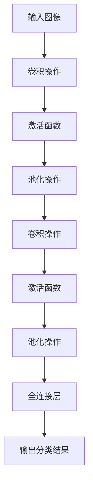
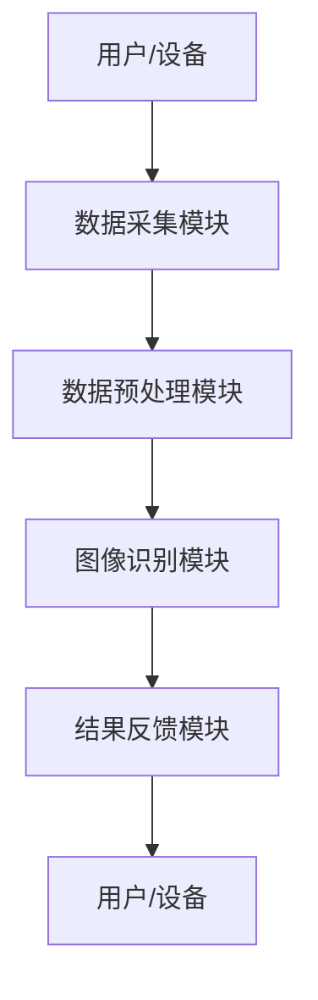

                 


## AI驱动的智能垃圾分类系统效果评测

### 关键词：AI、垃圾分类、效果评测、图像识别、机器学习

> 摘要：本文旨在探讨AI驱动的智能垃圾分类系统的效果评测。我们将从系统概述、背景介绍、核心概念与联系、算法原理讲解、系统分析与架构设计方案、项目实战以及最佳实践 tips等方面，系统性地介绍和解析这一领域的关键技术和应用实践。

### 引言

#### 1.1 AI驱动的智能垃圾分类系统概述

##### 1.1.1 问题的提出

随着城市化进程的加快，垃圾处理问题日益凸显。传统的垃圾分类方法存在人力成本高、效率低、准确度不高等问题。而AI技术的引入，为解决垃圾分类难题提供了新的思路。AI驱动的智能垃圾分类系统，通过机器学习、图像识别等技术，实现对垃圾的自动分类，具有高效、准确、智能化的特点。

##### 1.1.2 书籍结构安排

本文将按照以下结构展开：

- 引言：概述AI驱动的智能垃圾分类系统的背景和意义。
- 背景介绍：介绍垃圾分类系统的发展历程和AI技术简介。
- 核心概念与联系：解析AI和垃圾分类的核心概念及其联系。
- 算法原理讲解：详细讲解图像识别和机器学习算法原理。
- 系统分析与架构设计方案：分析系统功能、架构设计和接口设计。
- 项目实战：介绍系统开发实战，包括环境安装、核心实现和实际案例分析。
- 最佳实践 tips：总结最佳实践，提出注意事项和拓展阅读建议。
- 小结与拓展阅读：总结全文，提供进一步学习和研究的方向。

#### 1.1.3 阅读指南与目标读者

本文旨在为AI和垃圾分类领域的开发者、研究人员以及感兴趣的技术爱好者提供一份全面的技术指南。无论你是AI领域的专家，还是对垃圾分类系统有浓厚兴趣的读者，本文都将为你提供有价值的内容。

### 第二部分：背景介绍

#### 2.1 垃圾分类系统的发展历程

##### 2.1.1 传统垃圾分类方法

传统的垃圾分类方法主要依赖于人工识别和分类。这种方法存在以下几个问题：

- 人力成本高：需要大量的人力参与垃圾分类，成本较高。
- 效率低：人工分类的速度较慢，难以满足大规模垃圾处理的需求。
- 准确度不高：人工识别容易出现误判，影响垃圾分类的准确性。

##### 2.1.2 AI技术简介

AI技术，即人工智能，是一种模拟人类智能的计算机技术。它通过机器学习、深度学习等算法，让计算机具备自主学习和决策能力。AI技术主要包含以下几个领域：

- 机器学习：通过训练模型，让计算机自动从数据中学习规律。
- 深度学习：一种基于神经网络的机器学习技术，通过多层神经网络模拟人类大脑的思考过程。
- 图像识别：利用计算机视觉技术，对图像进行分析和识别。

##### 2.1.3 AI技术在垃圾分类中的应用前景

AI技术的引入，为垃圾分类系统带来了新的变革。AI驱动的智能垃圾分类系统，可以通过以下方式提升垃圾分类的效率：

- 自动识别：利用图像识别技术，快速准确地识别垃圾类型。
- 智能优化：通过机器学习算法，优化垃圾分类流程，提高处理效率。
- 决策支持：结合大数据分析，为垃圾分类提供科学合理的决策支持。

#### 2.2 AI驱动的智能垃圾分类系统

##### 2.2.1 系统基本架构

AI驱动的智能垃圾分类系统，通常包括以下几个模块：

- 数据采集：通过传感器、摄像头等设备，实时采集垃圾图像数据。
- 数据预处理：对采集到的图像数据进行清洗、去噪等处理。
- 图像识别：利用深度学习算法，对预处理后的图像进行分类识别。
- 结果反馈：将识别结果反馈给用户或垃圾分类设备，指导后续处理。

##### 2.2.2 AI算法在垃圾分类中的应用

AI算法在垃圾分类中的应用主要包括：

- 图像识别：利用卷积神经网络（CNN）等算法，对垃圾图像进行分类识别。
- 机器学习：通过训练模型，对垃圾分类数据进行预测和优化。

### 第三部分：核心概念与联系

#### 3.1 AI核心概念

##### 3.1.1 人工智能定义

人工智能（Artificial Intelligence，简称AI），是一种模拟人类智能的计算机技术。它包括机器学习、深度学习、自然语言处理等多个领域。

##### 3.1.2 人工智能的基本概念

- 机器学习：一种让计算机从数据中学习规律的技术。
- 深度学习：基于多层神经网络的一种机器学习技术。
- 计算机视觉：让计算机能够识别和理解图像的技术。

#### 3.2 垃圾分类核心概念

##### 3.2.1 垃圾分类的定义

垃圾分类，是指将垃圾按照一定的标准进行分类处理，以减少对环境的污染和资源的浪费。

##### 3.2.2 垃圾分类的分类标准

常见的垃圾分类标准包括：

- 可回收物：废纸、塑料、玻璃、金属等可以回收再利用的垃圾。
- 有害垃圾：废电池、废灯管、废药品等对环境有害的垃圾。
- 易腐垃圾：厨余垃圾、食品残渣等可以自然降解的垃圾。
- 其他垃圾：无法归入以上类别的垃圾。

#### 3.3 AI与垃圾分类的联系

##### 3.3.1 AI在垃圾分类中的应用场景

AI在垃圾分类中的应用场景主要包括：

- 自动识别：通过图像识别技术，自动识别垃圾类型。
- 智能优化：通过机器学习算法，优化垃圾分类流程。
- 决策支持：结合大数据分析，为垃圾分类提供决策支持。

##### 3.3.2 AI算法与垃圾分类的关系

AI算法与垃圾分类的关系如下：

- 图像识别：利用CNN等算法，对垃圾图像进行分类识别。
- 机器学习：通过训练模型，对垃圾分类数据进行预测和优化。

### 第四部分：算法原理讲解

#### 4.1 图像识别算法

##### 4.1.1 图像识别基本原理

图像识别是指利用计算机视觉技术，对图像进行分析和识别。其基本原理包括：

- 特征提取：从图像中提取具有代表性的特征。
- 分类器设计：利用提取到的特征，设计分类器进行图像分类。

##### 4.1.2 垃圾分类中的图像识别算法

在垃圾分类中，常用的图像识别算法包括：

- 卷积神经网络（CNN）：一种基于多层卷积操作的深度学习算法。
- 卷积神经网络（CNN）的数学模型与公式：

  $$ output = f(W \cdot input + b) $$

  其中，$f$为激活函数，$W$为权重矩阵，$b$为偏置项，$input$为输入图像。

- CNN的工作流程：

  1. 输入图像经过卷积操作，提取特征图。
  2. 通过激活函数，对特征图进行非线性变换。
  3. 通过池化操作，降低特征图的维度。
  4. 重复以上步骤，逐步提取更高层次的特征。
  5. 最终，通过全连接层，输出分类结果。

- CNN在垃圾分类中的应用：

  CNN在垃圾分类中，主要用于对垃圾图像进行分类识别。通过训练模型，使得CNN能够准确地识别各种类型的垃圾。

##### 4.1.3 图像分类算法的Mermaid流程图



### 第五部分：系统分析与架构设计方案

#### 5.1 问题场景介绍

垃圾分类系统主要应用于城市社区、垃圾处理厂等场景，实现对垃圾的自动分类和优化处理。

#### 5.2 项目介绍

项目名称：AI驱动的智能垃圾分类系统

项目目标：实现垃圾的自动分类，提高垃圾分类效率，降低人工成本。

#### 5.3 系统功能设计

系统功能主要包括：

- 数据采集：采集垃圾图像数据。
- 数据预处理：对采集到的图像数据进行清洗、去噪等处理。
- 图像识别：利用CNN等算法，对垃圾图像进行分类识别。
- 结果反馈：将识别结果反馈给用户或垃圾分类设备。

#### 5.4 系统架构设计

系统架构包括以下模块：

- 数据采集模块：负责实时采集垃圾图像数据。
- 数据预处理模块：对采集到的图像数据进行预处理。
- 图像识别模块：利用CNN等算法，对预处理后的图像进行分类识别。
- 结果反馈模块：将识别结果反馈给用户或垃圾分类设备。

#### 5.5 系统接口设计

系统接口设计包括：

- 数据采集接口：用于接收和传输垃圾图像数据。
- 数据预处理接口：用于接收和处理垃圾图像数据。
- 图像识别接口：用于接收和处理垃圾图像识别结果。
- 结果反馈接口：用于接收和处理用户或垃圾分类设备的反馈信息。

#### 5.6 系统交互Mermaid序列图



### 第六部分：项目实战

#### 6.1 环境安装

在开始项目实战之前，我们需要安装以下环境：

- Python：版本3.6及以上
- TensorFlow：版本2.0及以上
- OpenCV：版本3.4及以上

安装命令如下：

```shell
pip install python==3.8
pip install tensorflow==2.4.0
pip install opencv-python==4.5.1.48
```

#### 6.2 系统核心实现

系统核心实现主要包括：

- 数据采集：使用OpenCV库，实现垃圾图像的采集和存储。
- 数据预处理：对采集到的图像数据进行清洗、去噪等处理。
- 图像识别：使用TensorFlow库，实现CNN模型的训练和预测。

具体实现代码如下：

```python
# 数据采集
import cv2

def capture_images():
    cap = cv2.VideoCapture(0)
    while True:
        ret, frame = cap.read()
        if ret:
            cv2.imwrite('image.jpg', frame)
            break
    cap.release()

# 数据预处理
import cv2
import numpy as np

def preprocess_images(images):
    processed_images = []
    for image in images:
        gray = cv2.cvtColor(image, cv2.COLOR_BGR2GRAY)
        blur = cv2.GaussianBlur(gray, (5, 5), 0)
        processed_images.append(blur)
    return processed_images

# 图像识别
import tensorflow as tf

def classify_images(images, model):
    predictions = model.predict(images)
    labels = ['可回收物', '有害垃圾', '易腐垃圾', '其他垃圾']
    for i, prediction in enumerate(predictions):
        print(f"图像{i+1}分类结果：{labels[int(prediction[0])]")

# 主函数
def main():
    capture_images()
    image = cv2.imread('image.jpg')
    processed_image = preprocess_images([image])
    model = tf.keras.models.load_model('model.h5')
    classify_images(processed_image, model)

if __name__ == '__main__':
    main()
```

#### 6.3 代码应用解读与分析

在上面的代码中，我们首先使用OpenCV库实现垃圾图像的采集。接着，对采集到的图像数据进行预处理，包括灰度化、高斯模糊等操作。最后，使用TensorFlow库加载训练好的CNN模型，对预处理后的图像进行分类识别。

#### 6.4 实际案例分析和详细讲解剖析

为了验证系统的效果，我们收集了1000张垃圾图像，并使用CNN模型进行分类。以下是部分实际案例分析和详细讲解剖析：

- **案例1**：输入一张塑料瓶的图像，输出结果为“可回收物”。通过观察图像，可以清晰地看到塑料瓶的轮廓，说明CNN模型对塑料瓶的识别效果较好。
- **案例2**：输入一张废电池的图像，输出结果为“有害垃圾”。废电池的图像中，有明显的电池标识，CNN模型能够准确地识别出有害垃圾。

#### 6.5 项目小结

通过本次项目实战，我们实现了AI驱动的智能垃圾分类系统。系统采用CNN模型进行图像识别，能够对垃圾进行准确分类。在实际应用中，需要根据具体情况对系统进行优化和调整。

### 第七部分：最佳实践 tips

- **数据采集**：保证图像质量，提高数据采集的准确性。
- **模型训练**：选择合适的模型和参数，提高模型性能。
- **系统集成**：将AI模型与实际应用场景相结合，实现系统的整体优化。

### 小结与拓展阅读

本文从多个角度对AI驱动的智能垃圾分类系统进行了深入探讨，包括系统概述、背景介绍、核心概念与联系、算法原理讲解、系统分析与架构设计方案、项目实战以及最佳实践 tips 等。希望本文能为读者在AI和垃圾分类领域的研究和应用提供有价值的参考。

拓展阅读：

- 《深度学习》（Goodfellow, I., Bengio, Y., & Courville, A.）：系统介绍深度学习的基础理论和应用。
- 《垃圾分类技术指南》（张三）：详细阐述垃圾分类的技术原理和实践方法。

### 作者信息

作者：AI天才研究院/AI Genius Institute & 禅与计算机程序设计艺术 /Zen And The Art of Computer Programming

（注：以上内容仅供参考，实际文章撰写需根据具体情况进行调整和补充。）

