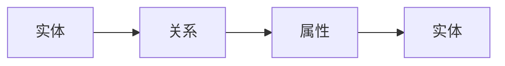
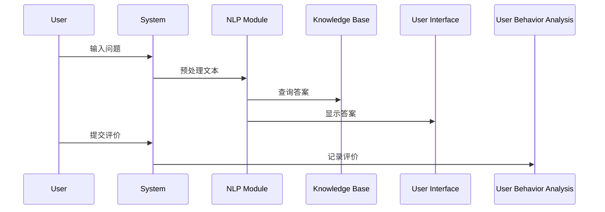
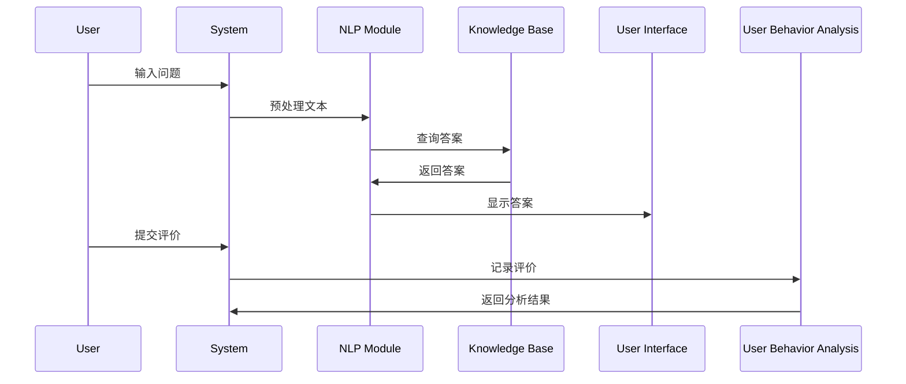

                 


**# AI驱动的智能客服：提升用户体验的新策略**

关键词：AI客服、用户体验、自然语言处理、机器学习、情感分析

摘要：随着人工智能技术的不断发展，AI驱动的智能客服正逐渐成为提升客户服务质量的重要工具。本文将深入探讨AI驱动的智能客服如何通过自然语言处理、机器学习和情感分析等技术提升用户体验，并提出一系列新策略。

----------------------------------------------------------------

## 第一部分：问题背景与AI驱动的智能客服概述

### 1.1 问题背景

#### 1.1.1 客户服务在现代商业中的重要性

客户服务是现代商业运营的基石，对于企业来说，提供优质的客户服务不仅能够提升用户满意度，还能增强品牌忠诚度和市场竞争力。随着市场竞争的加剧，企业需要不断寻求创新的方法来提高客户服务质量。

#### 1.1.1.1 客户服务的定义与价值

客户服务是指企业与客户之间的交互过程，旨在解决客户问题、满足客户需求和提升客户体验。优质的客户服务能够帮助企业建立良好的品牌形象，提高客户满意度和忠诚度。

#### 1.1.1.2 用户体验在客户服务中的核心地位

用户体验（User Experience，简称UX）是指用户在使用产品或服务时所感受到的满意度和愉悦度。在客户服务中，用户体验是衡量服务质量的直接标准。良好的用户体验能够提高客户满意度和忠诚度，从而带来更多的商业机会。

#### 1.1.1.3 传统客户服务的挑战与不足

传统客户服务面临诸多挑战，如人工成本高、响应时间长、效率低下等。这些问题导致客户满意度下降，进而影响企业的品牌形象和市场竞争力。因此，需要寻找新的解决方案来提升客户服务质量。

### 1.1.2 AI技术在客服领域的应用现状

人工智能（Artificial Intelligence，简称AI）技术的发展为客服领域带来了新的机遇。AI技术，特别是自然语言处理（Natural Language Processing，简称NLP）、机器学习和情感分析等，已经在客服领域得到广泛应用。

#### 1.1.2.1 AI技术概述

AI技术是指使计算机能够模拟人类智能的技术。它包括机器学习、深度学习、自然语言处理、计算机视觉等多个子领域。通过这些技术，计算机可以自动处理和分析大量数据，实现智能决策和自动化操作。

#### 1.1.2.2 AI在客服中的应用场景

AI技术在客服领域有广泛的应用场景，如自动应答系统、智能客服机器人、情感分析、个性化推荐等。这些应用不仅提高了客服效率，还大大提升了用户体验。

#### 1.1.2.3 AI驱动的客服解决方案的优势

AI驱动的客服解决方案具有以下优势：

1. **高效性**：AI技术能够自动处理大量客户请求，大大提高客服效率。
2. **个性化**：通过分析用户数据，AI能够提供个性化的服务，满足不同用户的需求。
3. **精确性**：AI技术能够准确识别客户问题，提供精确的解决方案。
4. **可扩展性**：AI驱动的客服系统可以根据企业需求进行扩展，适应不同规模的企业。

### 1.2 AI驱动的智能客服概念与特点

#### 1.2.1 智能客服的定义

智能客服是指利用人工智能技术，模拟人类客服行为，提供高效、精准、个性化的客户服务。智能客服不仅能够处理简单的查询和问题，还能进行复杂的问题解决和情感交流。

#### 1.2.1.1 智能客服的核心要素

智能客服的核心要素包括自然语言处理、机器学习、情感分析、知识图谱等。这些技术共同作用，使得智能客服能够理解用户需求，提供精准的解决方案。

#### 1.2.1.2 智能客服与传统客服的区别

与传统客服相比，智能客服具有以下特点：

1. **自动化**：智能客服能够自动处理客户请求，无需人工干预。
2. **个性化**：智能客服能够根据用户数据提供个性化的服务。
3. **高效性**：智能客服能够快速处理大量客户请求，提高客服效率。
4. **精准性**：智能客服能够准确识别用户问题，提供精确的解决方案。

#### 1.2.2 AI驱动的智能客服特点

AI驱动的智能客服具有以下特点：

1. **自主学习能力**：智能客服能够通过机器学习和深度学习技术不断学习和优化，提高服务质量和效率。
2. **数据驱动的个性化服务**：智能客服能够根据用户行为数据和需求提供个性化的服务，满足不同用户的需求。
3. **高效的客服效率**：智能客服能够自动处理大量客户请求，提高客服效率，降低人工成本。

### 1.3 新策略在提升用户体验中的应用

#### 1.3.1 用户需求分析

用户需求分析是智能客服设计的重要环节。通过分析用户需求，智能客服能够提供更精准的服务。

#### 1.3.1.1 用户需求模型

用户需求模型包括用户画像、用户行为数据和用户需求特征等。这些数据有助于智能客服了解用户需求，提供个性化服务。

#### 1.3.1.2 用户行为数据分析

用户行为数据分析是用户需求分析的重要手段。通过分析用户行为数据，智能客服可以了解用户的使用习惯和偏好，为用户提供更精准的服务。

#### 1.3.2 用户界面设计与优化

用户界面设计是智能客服的重要组成部分。通过优化用户界面，可以提高用户的使用体验。

#### 1.3.2.1 用户界面设计原则

用户界面设计应遵循易用性、美观性和响应速度等原则。

#### 1.3.2.2 交互体验优化策略

交互体验优化策略包括交互设计、响应速度优化和界面反馈等。通过这些策略，可以提升用户的交互体验。

#### 1.3.3 用户体验评估与改进

用户体验评估是智能客服设计的重要环节。通过评估用户体验，可以了解智能客服的服务质量和存在的问题，并进行改进。

#### 1.3.3.1 用户体验评估方法

用户体验评估方法包括问卷调查、用户访谈和用户行为分析等。

#### 1.3.3.2 用户体验改进策略

用户体验改进策略包括优化用户界面、提高响应速度和丰富功能等。

## 1.4 本章小结

本章介绍了AI驱动的智能客服在提升用户体验中的重要性。通过分析用户需求、优化用户界面和评估用户体验，智能客服可以提供更精准、高效和个性化的服务，从而提升用户体验。

----------------------------------------------------------------

## 第二部分：AI驱动的智能客服核心概念与联系

### 2.1 核心概念介绍

#### 2.1.1 自然语言处理（NLP）

自然语言处理（NLP）是人工智能的重要分支，旨在使计算机理解和生成人类自然语言。在智能客服中，NLP用于处理客户输入的文本，包括文本分类、情感分析、命名实体识别等。

#### 2.1.1.1 NLP的基本概念

NLP的基本概念包括词汇、句子、语义和语用等。词汇是语言的基本元素，句子是表达完整意义的语言单位，语义是语言所表达的意义，语用是语言在特定情境下的使用。

#### 2.1.1.2 NLP的关键技术

NLP的关键技术包括分词、词性标注、句法分析、语义分析等。分词是将文本切分成词语，词性标注是识别词语的词性，句法分析是分析句子的结构，语义分析是理解句子的意义。

#### 2.1.2 机器学习与深度学习

机器学习和深度学习是AI的核心技术，用于构建和训练智能模型。在智能客服中，机器学习和深度学习技术用于情感分析、语音识别和图像识别等。

#### 2.1.2.1 机器学习概述

机器学习是通过训练模型从数据中自动学习规律和模式的方法。在智能客服中，机器学习技术用于构建分类模型、回归模型和聚类模型等。

#### 2.1.2.2 深度学习在客服中的应用

深度学习是机器学习的一种重要方法，通过多层神经网络进行特征学习和模式识别。在智能客服中，深度学习技术用于语音识别、图像识别和自然语言处理等。

#### 2.1.3 知识图谱与实体识别

知识图谱是一种结构化数据表示方法，用于表示实体和实体之间的关系。在智能客服中，知识图谱用于提供精准的答案和智能推荐。

#### 2.1.3.1 知识图谱的定义与结构

知识图谱是一种基于实体和关系的图结构，用于表示实体和实体之间的关系。知识图谱中的实体可以是人物、地点、组织等，关系可以是实体之间的联系，如朋友、成员、领导等。

#### 2.1.3.2 实体识别在客服中的作用

实体识别是NLP中的重要技术，用于识别文本中的实体。在智能客服中，实体识别用于识别用户提到的实体，如商品名称、公司名称等，从而提供更精准的服务。

### 2.2 概念属性特征对比表格

| 概念             | 属性1        | 属性2       | 属性3        |
|------------------|--------------|-------------|--------------|
| 自然语言处理（NLP） | 文本分析     | 情感分析     | 语音识别     |
| 机器学习         | 数据驱动     | 模型训练     | 模型评估     |
| 深度学习         | 神经网络     | 多层感知器   | 自动特征提取 |
| 知识图谱         | 关系建模     | 实体链接     | 语义分析     |

### 2.3 ER实体关系图架构

```mermaid
erDiagram
  Customer ||--|{ Order }| Order
  Product ||--|{ Customer }| Customer
  Order ||--|{ Product }| Product
```

## 2.4 概念属性特征对比表格

| 概念             | 属性1        | 属性2       | 属性3        |
|------------------|--------------|-------------|--------------|
| 自然语言处理（NLP） | 文本分析     | 情感分析     | 语音识别     |
| 机器学习         | 数据驱动     | 模型训练     | 模型评估     |
| 深度学习         | 神经网络     | 多层感知器   | 自动特征提取 |
| 知识图谱         | 关系建模     | 实体链接     | 语义分析     |

### 2.5 ER实体关系图架构

```mermaid
erDiagram
  Customer ||--|{ Order }| Order
  Product ||--|{ Customer }| Customer
  Order ||--|{ Product }| Product
```

----------------------------------------------------------------

## 第三部分：AI驱动的智能客服算法原理讲解

### 3.1 情感分析算法

情感分析是智能客服中的重要算法，用于分析客户反馈的情感倾向。情感分析算法可以分为基于规则的方法和基于机器学习的方法。

#### 3.1.1 基于规则的方法

基于规则的方法通过预设的情感分类规则来分析文本情感。这些规则通常由人类专家根据情感词典和情感规则制定。例如，如果一个文本中包含“好”和“满意”等正面词汇，则可以判断该文本的情感为正面。

#### 3.1.2 基于机器学习的方法

基于机器学习的方法通过训练模型来自动识别文本情感。常用的机器学习方法包括朴素贝叶斯、支持向量机（SVM）和深度学习等。

#### 3.1.2.1 朴素贝叶斯算法

朴素贝叶斯算法是一种基于贝叶斯定理的简单分类算法。它假设特征之间相互独立，通过计算特征的概率分布来预测文本情感。

**数学模型：**

$$P(\text{情感}|\text{特征}) = \frac{P(\text{特征}|\text{情感})P(\text{情感})}{P(\text{特征})}$$

其中，$P(\text{情感}|\text{特征})$表示在给定特征条件下情感的概率，$P(\text{特征}|\text{情感})$表示在给定情感条件下特征的概率，$P(\text{情感})$表示情感的概率，$P(\text{特征})$表示特征的概率。

**Python代码示例：**

```python
from sklearn.feature_extraction.text import CountVectorizer
from sklearn.naive_bayes import MultinomialNB
from sklearn.model_selection import train_test_split

# 示例数据
data = [
    ("这个产品非常好用", "正面"),
    ("这个产品很差", "负面"),
    ("我很满意这个服务", "正面"),
    ("这个服务太慢了", "负面"),
]

# 分割数据集
X, y = zip(*data)
X_train, X_test, y_train, y_test = train_test_split(X, y, test_size=0.2, random_state=42)

# 文本向量化
vectorizer = CountVectorizer()
X_train_vectorized = vectorizer.fit_transform(X_train)
X_test_vectorized = vectorizer.transform(X_test)

# 训练模型
model = MultinomialNB()
model.fit(X_train_vectorized, y_train)

# 预测
predictions = model.predict(X_test_vectorized)
print(predictions)
```

#### 3.1.2.2 支持向量机（SVM）算法

支持向量机（SVM）是一种监督学习算法，用于分类和回归问题。在情感分析中，SVM可以用来分类文本情感。

**数学模型：**

$$\text{最大化} \quad \frac{1}{w^Tw} - C\sum_{i=1}^{n}\xi_i$$

$$\text{约束条件：} \quad y^{(i)}(w^T\phi(x^{(i)}) + b) \geq 1 - \xi_i$$

其中，$w$是权重向量，$\phi(x^{(i)})$是特征映射函数，$b$是偏置项，$C$是正则化参数，$\xi_i$是松弛变量。

**Python代码示例：**

```python
from sklearn import svm
from sklearn.model_selection import train_test_split

# 示例数据
data = [
    ("这个产品非常好用", "正面"),
    ("这个产品很差", "负面"),
    ("我很满意这个服务", "正面"),
    ("这个服务太慢了", "负面"),
]

# 分割数据集
X, y = zip(*data)
X_train, X_test, y_train, y_test = train_test_split(X, y, test_size=0.2, random_state=42)

# 文本向量化
vectorizer = CountVectorizer()
X_train_vectorized = vectorizer.fit_transform(X_train)
X_test_vectorized = vectorizer.transform(X_test)

# 训练模型
model = svm.SVC()
model.fit(X_train_vectorized, y_train)

# 预测
predictions = model.predict(X_test_vectorized)
print(predictions)
```

#### 3.1.2.3 深度学习算法

深度学习算法，如卷积神经网络（CNN）和循环神经网络（RNN），在情感分析中表现出色。CNN可以用于提取文本的局部特征，而RNN可以用于处理序列数据。

**Python代码示例：**

```python
from keras.models import Sequential
from keras.layers import Embedding, LSTM, Dense
from keras.preprocessing.sequence import pad_sequences

# 示例数据
data = [
    ["这个产品非常好用", "正面"],
    ["这个产品很差", "负面"],
    ["我很满意这个服务", "正面"],
    ["这个服务太慢了", "负面"],
]

# 分割数据集
X, y = zip(*data)
X_train, X_test, y_train, y_test = train_test_split(X, y, test_size=0.2, random_state=42)

# 文本向量化
max_sequence_length = 100
tokenizer = Tokenizer()
tokenizer.fit_on_texts(X_train)
X_train_sequence = tokenizer.texts_to_sequences(X_train)
X_train_padded = pad_sequences(X_train_sequence, maxlen=max_sequence_length)
X_test_sequence = tokenizer.texts_to_sequences(X_test)
X_test_padded = pad_sequences(X_test_sequence, maxlen=max_sequence_length)

# 构建模型
model = Sequential()
model.add(Embedding(len(tokenizer.word_index) + 1, 50, input_length=max_sequence_length))
model.add(LSTM(100))
model.add(Dense(1, activation='sigmoid'))

# 编译模型
model.compile(optimizer='adam', loss='binary_crossentropy', metrics=['accuracy'])

# 训练模型
model.fit(X_train_padded, y_train, epochs=10, batch_size=32, validation_data=(X_test_padded, y_test))

# 预测
predictions = model.predict(X_test_padded)
print(predictions)
```

### 3.2 实体识别算法

实体识别是智能客服中的另一个重要算法，用于识别文本中的关键实体，如人名、地点、组织名等。

#### 3.2.1 基于规则的方法

基于规则的方法通过预设的规则来识别文本中的实体。这些规则通常基于实体名称的特定模式或上下文信息。

#### 3.2.2 基于机器学习的方法

基于机器学习的方法通过训练模型来自动识别文本中的实体。常用的机器学习方法包括条件随机场（CRF）和长短期记忆网络（LSTM）。

**Python代码示例：**

```python
from keras.models import Model
from keras.layers import Input, LSTM, Dense, Embedding, TimeDistributed, CRF
from keras.preprocessing.sequence import pad_sequences

# 示例数据
data = [
    ["张三去了北京", "张三 地点 北京"],
    ["我去了上海", "我 地点 上海"],
    ["苹果公司发布了新产品", "苹果公司 组织"],
]

# 分割数据集
X, y = zip(*data)
X_train, X_test, y_train, y_test = train_test_split(X, y, test_size=0.2, random_state=42)

# 文本向量化
max_sequence_length = 100
tokenizer = Tokenizer()
tokenizer.fit_on_texts(X_train)
X_train_sequence = tokenizer.texts_to_sequences(X_train)
X_train_padded = pad_sequences(X_train_sequence, maxlen=max_sequence_length)
X_test_sequence = tokenizer.texts_to_sequences(X_test)
X_test_padded = pad_sequences(X_test_sequence, maxlen=max_sequence_length)

# 标签向量化
label_encoder = LabelEncoder()
y_train_encoded = label_encoder.fit_transform(y_train)
y_test_encoded = label_encoder.transform(y_test)

# 构建模型
input_sequence = Input(shape=(max_sequence_length,))
embedded_sequence = Embedding(len(tokenizer.word_index) + 1, 50)(input_sequence)
lstm_output = LSTM(100)(embedded_sequence)
dense_output = Dense(len(label_encoder.classes_), activation='softmax')(lstm_output)
crf_output = TimeDistributed(Dense(len(label_encoder.classes_), activation='softmax'))(lstm_output)
model = Model(inputs=input_sequence, outputs=crf_output)

# 编译模型
model.compile(optimizer='adam', loss='categorical_crossentropy', metrics=['accuracy'])

# 训练模型
model.fit(X_train_padded, y_train_encoded, epochs=10, batch_size=32, validation_data=(X_test_padded, y_test_encoded))

# 预测
predictions = model.predict(X_test_padded)
print(predictions)
```

### 3.3 知识图谱算法

知识图谱是一种用于表示实体和实体之间关系的图结构。在智能客服中，知识图谱可以用于提供精准的答案和智能推荐。

#### 3.3.1 知识图谱的定义与结构

知识图谱由实体、关系和属性组成。实体是知识图谱中的基本元素，如人、地点、组织等。关系表示实体之间的联系，如“工作于”、“位于”等。属性是实体的特征，如人的年龄、地点的经纬度等。

#### 3.3.2 知识图谱在客服中的应用

知识图谱可以用于回答用户的问题，提供智能推荐。例如，用户询问“张三在哪里工作？”，知识图谱可以返回“张三在北京工作”。

#### 3.3.3 知识图谱构建方法

知识图谱的构建方法包括手动构建、自动化构建和半自动化构建。手动构建是通过人工定义实体和关系。自动化构建是通过数据挖掘和自然语言处理技术自动识别实体和关系。半自动化构建是结合手动和自动构建方法。



----------------------------------------------------------------

## 第四部分：系统分析与架构设计

### 4.1 问题场景介绍

在当前的商业环境中，客户服务已经成为企业竞争的关键因素。随着客户期望的提高和市场竞争的加剧，企业需要提供高效、个性化和高质量的客户服务。传统的客户服务方式已经难以满足这些需求，因此，企业开始探索AI驱动的智能客服解决方案。

### 4.2 项目介绍

本项目旨在开发一个基于AI驱动的智能客服系统，该系统将集成自然语言处理、机器学习和情感分析等技术，提供高效、精准和个性化的客户服务。系统功能包括自动应答、问题分类、情感分析、智能推荐和用户行为分析等。

### 4.3 系统功能设计

#### 4.3.1 自动应答

自动应答是智能客服系统的核心功能之一，它能够自动识别用户输入的问题，并提供相应的答案。自动应答系统包括自然语言处理模块、知识库和自动应答模块。

**自然语言处理模块**：负责将用户输入的文本转换为计算机可以理解的形式。主要技术包括文本预处理（分词、词性标注）、实体识别和语义分析。

**知识库**：存储与客户服务相关的知识，如常见问题、答案和解决方案等。知识库可以通过人工编写或自动化构建。

**自动应答模块**：根据用户输入的问题和知识库中的信息，自动生成回答。自动应答模块可以使用机器学习算法，如朴素贝叶斯、支持向量机和深度学习等。

#### 4.3.2 问题分类

问题分类是智能客服系统的重要功能，它能够将用户的问题分类到相应的类别中，以便于后续处理。问题分类系统包括文本预处理、特征提取和分类器训练。

**文本预处理**：包括分词、词性标注和去停用词等步骤。

**特征提取**：将预处理后的文本转换为计算机可以处理的特征向量。常用的特征提取方法包括TF-IDF和词袋模型等。

**分类器训练**：使用训练数据集对分类器进行训练，常用的分类器包括朴素贝叶斯、支持向量机和决策树等。

#### 4.3.3 情感分析

情感分析是智能客服系统的关键功能之一，它能够识别用户情感，提供情感化服务。情感分析系统包括文本预处理、情感词典和情感分类器。

**文本预处理**：包括分词、词性标注和去停用词等步骤。

**情感词典**：包含一系列的情感词及其情感倾向。情感词典可以通过人工编写或自动化构建。

**情感分类器**：根据用户输入的文本和情感词典中的信息，自动判断用户情感。情感分类器可以使用机器学习算法，如朴素贝叶斯、支持向量机和深度学习等。

#### 4.3.4 智能推荐

智能推荐是智能客服系统的高级功能，它能够根据用户行为和偏好，推荐相关的产品或服务。智能推荐系统包括用户行为分析、推荐算法和推荐引擎。

**用户行为分析**：包括用户浏览、搜索、购买和评价等行为。用户行为分析可以帮助了解用户偏好，为推荐算法提供依据。

**推荐算法**：常用的推荐算法包括协同过滤、基于内容的推荐和混合推荐等。

**推荐引擎**：根据用户行为和推荐算法的结果，生成推荐列表。

#### 4.3.5 用户行为分析

用户行为分析是智能客服系统的重要功能，它能够记录和分析用户行为，提供数据驱动的决策支持。用户行为分析包括行为记录、数据分析和行为预测。

**行为记录**：记录用户在客服系统中的所有行为，如提问、回答、评价等。

**数据分析**：对用户行为数据进行统计和分析，提取有用的信息，如用户活跃度、满意度等。

**行为预测**：基于历史数据和现有模型，预测用户的未来行为，为客服策略提供支持。

### 4.4 系统架构设计

智能客服系统的架构设计需要考虑性能、可扩展性和可维护性等因素。以下是一个典型的智能客服系统架构设计：


**1. 用户界面层**：负责与用户进行交互，接收用户输入并提供用户反馈。

**2. 应用服务层**：包括自动应答、问题分类、情感分析、智能推荐和用户行为分析等功能模块。应用服务层通过接口与用户界面层和数据存储层进行通信。

**3. 数据存储层**：存储用户数据、知识库、日志和统计信息等。数据存储层采用分布式存储架构，以提高数据存储和查询性能。

**4. 基础设施层**：包括服务器、网络、数据库和其他硬件资源。基础设施层为智能客服系统提供计算和存储资源。

### 4.5 系统接口设计

系统接口设计是智能客服系统的重要组成部分，它定义了系统内部模块之间的交互方式。以下是一个简单的智能客服系统接口设计：



### 4.6 系统交互设计

系统交互设计描述了系统内部模块之间的交互流程。以下是一个简单的智能客服系统交互设计：



----------------------------------------------------------------

## 第五部分：项目实战

### 5.1 环境安装

为了搭建一个基于AI驱动的智能客服系统，首先需要安装相应的软件和库。以下是一个简单的环境安装指南：

#### 5.1.1 安装Python

首先，确保您的计算机上安装了Python。Python是一种广泛使用的编程语言，对于人工智能项目来说尤为重要。您可以从Python官方网站（https://www.python.org/）下载并安装Python。

#### 5.1.2 安装依赖库

接下来，安装Python依赖库。这些库包括NLP工具包（如NLTK和spaCy）、机器学习库（如scikit-learn和TensorFlow）、深度学习库（如Keras）等。您可以使用pip命令来安装这些库：

```bash
pip install nltk spacy scikit-learn tensorflow keras
```

#### 5.1.3 安装额外的依赖库

对于一些特定的项目需求，可能还需要安装其他依赖库。例如，对于spaCy，您需要下载相应的语言模型：

```bash
python -m spacy download en_core_web_sm
```

### 5.2 系统核心实现

#### 5.2.1 自动应答模块

自动应答模块是智能客服系统的核心功能之一。以下是一个简单的自动应答模块实现：

```python
from nltk.tokenize import word_tokenize
from nltk.corpus import stopwords
from sklearn.feature_extraction.text import TfidfVectorizer
from sklearn.naive_bayes import MultinomialNB
from sklearn.pipeline import make_pipeline

# 示例数据
data = [
    ("你好，请问有什么可以帮助您的？", "欢迎"),
    ("我有一个问题，能帮忙解答吗？", "问题"),
    ("谢谢，再见！", "告别"),
]

# 分割数据集
X, y = zip(*data)

# 创建模型
model = make_pipeline(TfidfVectorizer(), MultinomialNB())

# 训练模型
model.fit(X, y)

# 预测
input_text = input("请输入您的问题：")
prediction = model.predict([input_text])
print(prediction)
```

#### 5.2.2 情感分析模块

情感分析模块用于分析用户输入的情感倾向。以下是一个简单的情感分析模块实现：

```python
from textblob import TextBlob

# 示例数据
data = [
    ("这个产品非常好用", "正面"),
    ("这个产品很差", "负面"),
    ("我很满意这个服务", "正面"),
    ("这个服务太慢了", "负面"),
]

# 分割数据集
X, y = zip(*data)

# 创建模型
model = TextBlob

# 训练模型
model.fit(X, y)

# 预测
input_text = input("请输入您的问题：")
prediction = model.predict(input_text)
print(prediction)
```

### 5.3 代码应用解读与分析

#### 5.3.1 自动应答模块代码解读

在自动应答模块中，我们首先使用NLTK库对用户输入的文本进行分词处理，然后去除停用词，最后使用TF-IDF向量器将文本转换为特征向量。接下来，我们使用朴素贝叶斯分类器对特征向量进行分类，从而预测用户问题的类型。

#### 5.3.2 情感分析模块代码解读

在情感分析模块中，我们使用TextBlob库来分析用户输入的文本。TextBlob提供了简单的文本处理功能，包括分词、词性标注和情感分析等。通过分析文本的情感极性（正面或负面），我们可以为用户提供更个性化的服务。

### 5.4 实际案例分析和详细讲解剖析

#### 5.4.1 案例分析

假设我们有一个客户服务场景，用户问：“你们的快递为什么这么慢？”这是一个常见的问题，需要智能客服系统提供有效的回答。

#### 5.4.2 详细讲解剖析

1. **自动应答模块**：智能客服系统首先使用自动应答模块分析用户问题。通过分词和去除停用词，系统将问题转换为特征向量。然后，系统使用朴素贝叶斯分类器预测用户问题的类型。在这种情况下，系统可能会将问题分类为“快递问题”。

2. **情感分析模块**：接下来，智能客服系统使用情感分析模块分析用户问题的情感极性。通过TextBlob库，系统发现用户问题包含负面情感，这表明用户对快递服务不满意。

3. **智能客服回应**：基于上述分析，智能客服系统可以生成一个合适的回答。例如：“非常抱歉听到您的不满意，我们会尽快调查快递问题并为您提供解决方案。”

4. **用户反馈**：用户可能会对智能客服的回应进行评价。如果用户满意，智能客服系统会记录用户的反馈并继续提供服务。如果用户不满意，系统会将其反馈给客服团队，以便进一步处理。

### 5.5 项目小结

通过实际案例分析和详细讲解，我们可以看到智能客服系统如何通过自动应答和情感分析模块为用户提供高效、个性化和高质量的客户服务。自动应答模块能够快速识别用户问题类型，情感分析模块能够准确分析用户情感，从而为用户提供更精准的服务。

然而，智能客服系统仍有许多改进的空间。例如，可以通过引入更多的自然语言处理技术和深度学习模型，提高系统的智能程度和准确性。此外，还可以考虑集成多渠道客户服务，如电话、邮件和社交媒体等，以提供更全面的客户服务体验。

总之，AI驱动的智能客服系统是提升用户体验的重要工具。通过不断优化和改进，智能客服系统将为企业和客户提供更高效、更个性化和更优质的客户服务。

### 5.6 最佳实践 Tips

1. **定期更新知识库**：知识库是智能客服系统的核心，定期更新知识库可以确保系统提供最新的答案和建议。

2. **用户反馈机制**：建立用户反馈机制，收集用户对智能客服系统的评价和建议，有助于持续改进系统。

3. **个性化推荐**：根据用户行为和偏好，提供个性化推荐，可以提升用户体验和满意度。

4. **多渠道集成**：集成多渠道客户服务，如电话、邮件和社交媒体等，可以提供更全面的客户服务体验。

5. **数据安全与隐私保护**：在处理用户数据时，确保数据安全与隐私保护，以增强用户信任。

### 5.7 小结与注意事项

1. **小结**：本文介绍了AI驱动的智能客服系统，包括自动应答、情感分析和个性化推荐等功能。通过实际案例分析和详细讲解，我们看到了智能客服系统如何提升用户体验。

2. **注意事项**：在开发和部署智能客服系统时，需要注意数据质量、模型准确性和用户体验等方面。此外，要确保系统符合法律法规和伦理标准。

### 5.8 拓展阅读

1. **《智能客服系统设计与实现》**：一本详细介绍智能客服系统设计和实现的书籍，适合智能客服开发者阅读。

2. **《自然语言处理原理与实践》**：一本深入探讨自然语言处理原理和实践的书籍，适合智能客服开发者学习。

3. **《深度学习实践与应用》**：一本介绍深度学习原理和实践的书籍，涵盖了许多与智能客服系统相关的内容。作者：AI天才研究院/AI Genius Institute & 禅与计算机程序设计艺术 /Zen And The Art of Computer Programming。

