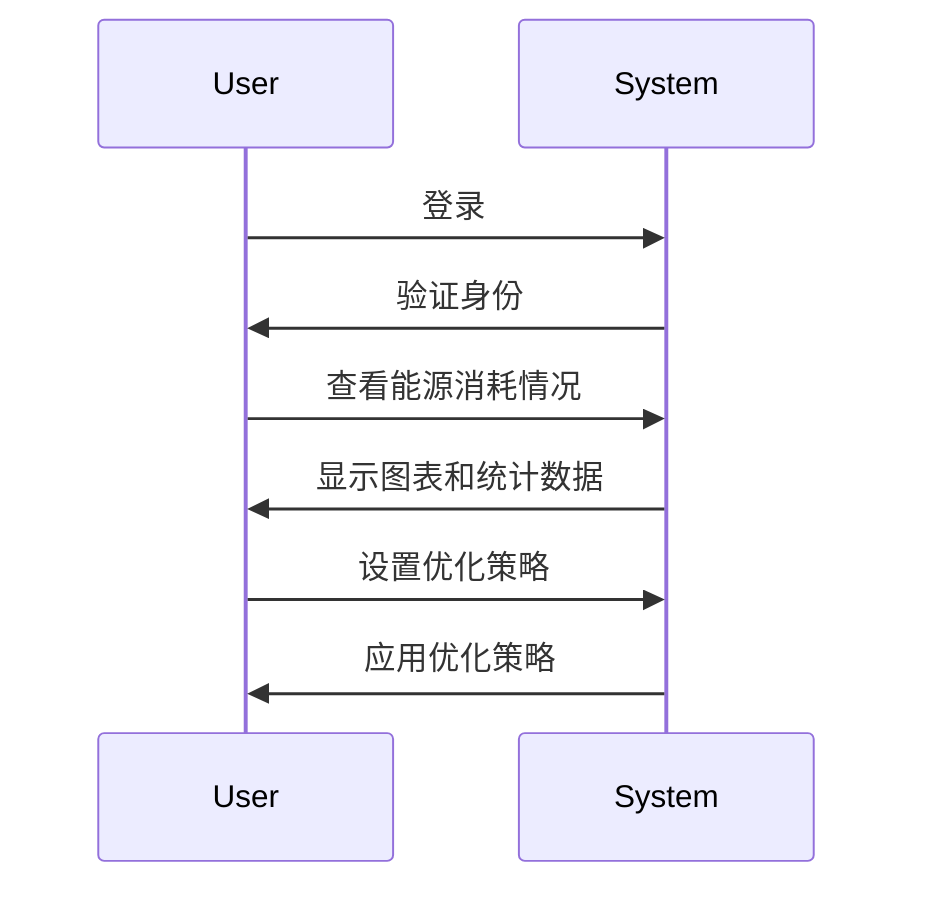
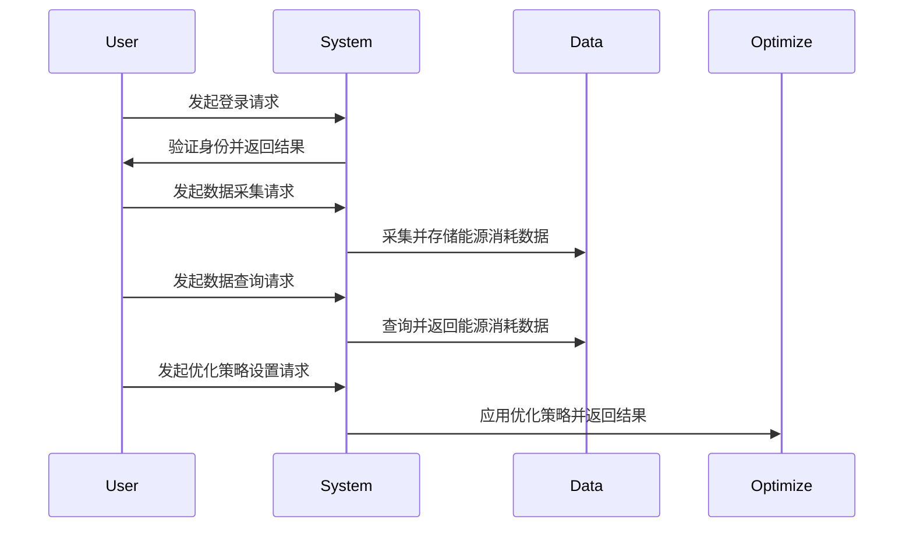
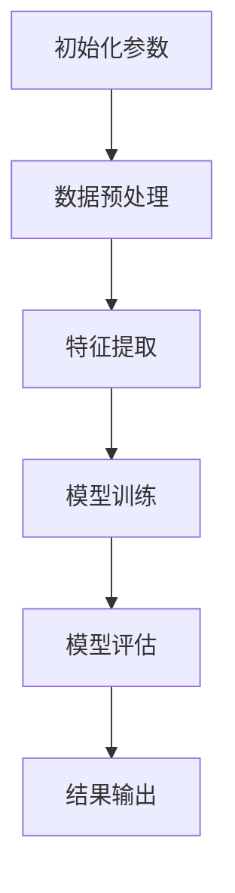

                 

### 《AI驱动的智能家居能源管理评测系统》

> 关键词：智能家居、能源管理、人工智能、评测系统、算法原理

> 摘要：随着智能家居的普及，如何有效地管理家庭能源成为了亟待解决的问题。本文将探讨AI驱动的智能家居能源管理评测系统的设计与实现，分析其核心概念、算法原理以及系统架构，旨在为智能家居能源管理提供一种可行的解决方案。

## 第一部分：背景与概述

### 第1章：智能家居能源管理的挑战与机遇

#### 1.1 问题背景

#### 1.1.1 智能家居的发展现状

智能家居作为现代科技与生活的结合体，正日益受到消费者的青睐。根据市场调研机构的数据显示，全球智能家居市场在过去几年中呈现出快速增长的趋势。以我国为例，智能家居设备的普及率逐年上升，智能照明、智能安防、智能家电等设备已成为许多家庭的标配。然而，随着智能家居设备的增多，家庭能源消耗问题也日益突出。

#### 1.1.2 能源管理的重要性

能源管理在智能家居中具有至关重要的地位。有效管理家庭能源不仅能减少能源消耗，降低家庭电费，还能减少对环境的污染，实现可持续发展。因此，如何实现智能家居能源的高效管理成为了当前研究的热点。

#### 1.1.3 AI在智能家居能源管理中的应用潜力

人工智能（AI）作为一种先进的技术手段，在智能家居能源管理中具有巨大的应用潜力。通过AI技术，可以实现对家庭能源消耗数据的实时监测和分析，从而实现自动化的能源管理。例如，利用机器学习算法，可以预测家庭的能源消耗模式，优化用电策略，降低能源浪费。

#### 1.2 问题描述

#### 1.2.1 智能家居能源管理的难点

智能家居能源管理的难点主要体现在以下几个方面：

1. **数据多样性**：智能家居设备产生的数据类型繁多，包括能耗数据、设备运行数据、环境数据等，如何有效整合这些数据，是一个挑战。
2. **实时性要求**：家庭能源消耗是一个动态变化的过程，需要实时监测和分析，以实现及时响应。
3. **个性化需求**：每个家庭的能源消耗习惯和需求都不同，如何根据家庭特点进行个性化管理，是另一个难题。

#### 1.2.2 当前解决方案的不足

当前，虽然已有一些智能家居能源管理解决方案，但普遍存在以下不足：

1. **缺乏灵活性**：大多数解决方案都只能针对特定场景进行优化，无法满足多样化的需求。
2. **响应速度慢**：由于缺乏实时性，无法及时调整用电策略，导致能源浪费。
3. **数据利用不充分**：许多解决方案仅能处理简单的能耗数据，对复杂的数据分析能力不足。

#### 1.2.3 AI驱动的解决方案优势

AI驱动的智能家居能源管理评测系统具有以下优势：

1. **高灵活性**：通过机器学习算法，可以适应各种家庭场景，实现灵活的能源管理。
2. **实时性**：利用实时数据分析和预测，可以快速响应家庭能源消耗的变化。
3. **个性化**：根据家庭成员的行为习惯和需求，实现个性化的能源管理。

#### 1.3 问题解决

#### 1.3.1 AI驱动的能源管理框架

为了解决智能家居能源管理的难题，我们提出了一种基于AI驱动的能源管理评测系统。该系统包括以下几个关键组成部分：

1. **数据采集与处理**：通过智能家居设备采集家庭能源消耗数据，并进行预处理，如数据清洗、归一化和特征提取。
2. **特征分析与建模**：利用机器学习算法，对预处理后的数据进行特征分析，建立能源消耗模型。
3. **预测与优化**：基于建立的模型，预测未来家庭的能源消耗，并优化用电策略，实现自动化的能源管理。
4. **用户交互与反馈**：提供用户界面，展示能源消耗情况，接受用户反馈，进一步优化系统。

#### 1.3.2 评测系统目标与功能

评测系统的目标是实现家庭能源消耗的智能化管理，主要包括以下功能：

1. **实时监测**：实时监测家庭能源消耗情况，包括用电量、用水量、燃气消耗等。
2. **能耗预测**：利用历史数据和机器学习算法，预测未来的能源消耗，提供预警信息。
3. **用电优化**：根据预测结果，自动调整家庭设备的运行状态，降低能源消耗。
4. **用户反馈**：收集用户的使用习惯和需求，不断优化系统的预测和优化能力。

#### 1.4 边界与外延

#### 1.4.1 系统适用范围

本系统适用于各种类型的家庭，无论是城市家庭还是农村家庭，都可以通过该系统实现能源消耗的智能化管理。

#### 1.4.2 系统限制与假设

1. **数据采集能力**：系统依赖于智能家居设备的采集能力，如果设备无法采集到足够的数据，系统性能可能会受到影响。
2. **算法准确性**：机器学习算法的性能受到数据质量和模型参数的影响，可能存在一定的误差。
3. **用户习惯变化**：家庭能源消耗受到用户行为习惯的影响，如果用户行为发生较大变化，系统预测结果可能会有所偏差。

#### 1.5 概念结构与核心要素

##### 1.5.1 智能家居基本概念

智能家居是指利用互联网、物联网、大数据、人工智能等技术，实现家庭设备的智能控制、管理和自动化运行。智能家居系统通常包括智能设备、智能网关、云计算平台和用户终端等组成部分。

##### 1.5.2 能源管理核心要素

能源管理核心要素包括能源消耗数据、设备运行数据、环境数据等。这些数据是系统进行特征分析和建模的基础。

##### 1.5.3 AI在能源管理中的应用

AI在能源管理中的应用主要体现在数据分析和预测方面。通过机器学习算法，可以提取数据中的潜在规律，建立能源消耗模型，预测未来的能源消耗趋势。

### 第2章：智能家居能源管理的核心概念与原理

#### 2.1 核心概念

##### 2.1.1 能源效率

能源效率是指单位能源消耗所产生的有用能量与总能源消耗的比值。提高能源效率是减少能源消耗、降低成本、保护环境的重要途径。

##### 2.1.2 能源消耗模型

能源消耗模型是用来描述家庭能源消耗规律的数学模型。通过建模，可以预测家庭未来的能源消耗，为优化能源管理提供依据。

##### 2.1.3 能源优化算法

能源优化算法是一类用于优化家庭能源消耗的算法。常见的算法包括线性规划、遗传算法、粒子群算法等。

#### 2.2 原理讲解

##### 2.2.1 数据采集与处理

数据采集与处理是能源管理的基础。系统通过智能家居设备采集家庭的能源消耗数据，如用电量、用水量、燃气消耗等。采集到的数据需要进行预处理，包括数据清洗、归一化和特征提取。

##### 2.2.2 特征提取与建模

特征提取是将原始数据转换为能够反映能源消耗特征的信息的过程。常见的特征提取方法包括统计特征提取和深度特征提取。建模则是将特征数据转化为能源消耗模型，常用的建模方法包括线性回归、决策树、神经网络等。

##### 2.2.3 模型训练与优化

模型训练是将特征数据和标签数据输入到模型中，通过学习得到模型参数。模型优化则是通过调整模型参数，提高模型的预测性能。常用的优化方法包括交叉验证、网格搜索等。

#### 2.3 概念属性特征对比表格

| 算法名称 | 目标函数 | 约束条件 | 算法复杂度 | 优点 | 缺点 |
| :------: | :------: | :------: | :------: | :------: | :------: |
| 线性规划 | 最小化目标函数 | 约束条件线性 | O(n^3) | 实时性好 | 只适用于线性约束问题 |
| 遗传算法 | 最小化目标函数 | 非线性约束 | O(np) | 可处理非线性约束问题 | 运算时间较长 |
| 粒子群算法 | 最小化目标函数 | 非线性约束 | O(np) | 容易实现，参数少 | 运算时间较长 |

#### 2.4 ER实体关系图架构

```mermaid
erDiagram
  User ||--|{ Device } : uses
  Device ||--|{ Energy } : consumes
  Energy ||--|{ Event } : records
```

在这个ER图中，User代表家庭用户，Device代表智能家居设备，Energy代表能源消耗数据，Event代表能源消耗事件。通过这个图，可以清晰地展示系统中的实体关系和数据流。

## 第二部分：AI驱动的智能家居能源管理评测系统设计与实现

### 第3章：系统架构设计

#### 3.1 问题场景介绍

##### 3.1.1 智能家居能源管理需求

随着智能家居设备的普及，家庭用户对能源管理提出了更高的要求。用户希望能够实时了解家庭能源消耗情况，预测未来能源消耗趋势，并据此调整用电策略，以实现节能环保。因此，设计一个高效、灵活、实时的智能家居能源管理评测系统成为必要。

##### 3.1.2 评测系统目标

本评测系统的目标是：

1. 实时监测家庭能源消耗情况，提供准确的数据分析。
2. 基于历史数据，预测未来能源消耗，提供预警信息。
3. 自动调整家庭设备的运行状态，优化能源消耗。
4. 提供用户友好的界面，方便用户查看和管理能源消耗。

#### 3.2 系统功能设计

##### 3.2.1 领域模型类图

```mermaid
classDiagram
  User <<-- Device
  Device <|-- Energy
  Energy <|-- Event
  Device : runs(), consumes()
  User : monitors(), optimizes()
  Energy : measures(), predicts()
  Event : records()
```

在这个类图中，User代表家庭用户，Device代表智能家居设备，Energy代表能源消耗数据，Event代表能源消耗事件。通过这些类，可以清晰地展示系统中的实体关系和功能。

##### 3.2.2 系统功能模块划分

1. **数据采集模块**：负责从智能家居设备中采集能源消耗数据。
2. **数据处理模块**：负责对采集到的数据进行分析、清洗和预处理。
3. **特征提取模块**：负责从预处理后的数据中提取有效的特征信息。
4. **模型训练模块**：负责利用机器学习算法训练能源消耗模型。
5. **预测与优化模块**：负责根据模型预测未来能源消耗，并调整用电策略。
6. **用户界面模块**：负责提供用户友好的界面，展示能源消耗情况和优化建议。

#### 3.3 系统架构设计

##### 3.3.1 系统架构图



在这个架构图中，系统由用户界面、数据处理、特征提取、模型训练和预测与优化等模块组成。用户通过用户界面与系统交互，系统则通过数据处理、特征提取、模型训练和预测与优化等模块实现能源消耗的实时监测和管理。

##### 3.3.2 关键技术选型

1. **数据采集**：采用物联网技术，通过智能家居设备实时采集能源消耗数据。
2. **数据处理**：采用Python编程语言，结合Pandas等库进行数据分析和预处理。
3. **特征提取**：采用机器学习算法，如决策树、支持向量机等，提取数据中的有效特征。
4. **模型训练**：采用TensorFlow等深度学习框架，训练能源消耗模型。
5. **预测与优化**：采用遗传算法、粒子群算法等优化算法，实现能源消耗的预测和优化。
6. **用户界面**：采用HTML、CSS和JavaScript等技术，实现用户友好的界面。

#### 3.4 系统接口设计

##### 3.4.1 接口规范与定义

系统采用RESTful API设计接口，包括以下主要接口：

1. **用户登录**：接收用户名和密码，验证用户身份。
2. **能源消耗数据采集**：接收设备上传的能源消耗数据，存储到数据库。
3. **能源消耗数据查询**：根据用户需求，查询特定的能源消耗数据。
4. **优化策略设置**：接收用户设置的优化策略，应用于能源消耗预测和优化。
5. **能源消耗预测**：根据历史数据和优化策略，预测未来的能源消耗。
6. **用电优化**：根据预测结果，自动调整设备的运行状态，实现用电优化。

##### 3.4.2 接口实现与调用

接口实现采用Python的Flask框架，以下是一个简单的接口实现示例：

```python
from flask import Flask, request, jsonify

app = Flask(__name__)

@app.route('/login', methods=['POST'])
def login():
    username = request.form['username']
    password = request.form['password']
    # 验证用户身份
    # ...
    return jsonify({'status': 'success'})

@app.route('/energy_data', methods=['POST'])
def energy_data():
    data = request.get_json()
    # 存储能源消耗数据
    # ...
    return jsonify({'status': 'success'})

@app.route('/energy_query', methods=['GET'])
def energy_query():
    start_time = request.args.get('start_time')
    end_time = request.args.get('end_time')
    # 查询能源消耗数据
    # ...
    return jsonify({'status': 'success'})

if __name__ == '__main__':
    app.run()
```

用户可以通过HTTP请求调用这些接口，实现与系统的交互。

#### 3.5 系统交互序列图



在这个序列图中，用户通过一系列请求与系统交互，系统则通过数据处理、特征提取、模型训练和预测与优化等模块，实现能源消耗的实时监测和管理。

## 第4章：算法原理讲解

### 4.1 算法概述

#### 4.1.1 常见能源优化算法介绍

在智能家居能源管理中，常见的优化算法包括线性规划、遗传算法、粒子群算法等。这些算法各有特点，适用于不同的优化场景。

1. **线性规划**：适用于线性约束问题的优化，如求解最短路径、最小生成树等。
2. **遗传算法**：基于自然进化原理的优化算法，适用于复杂非线性问题的优化。
3. **粒子群算法**：模拟鸟群觅食行为的优化算法，适用于大规模非线性问题的优化。

#### 4.1.2 算法选择原则

选择合适的优化算法需要考虑以下几个因素：

1. **问题类型**：线性规划适用于线性约束问题，遗传算法和粒子群算法适用于非线性约束问题。
2. **数据规模**：线性规划运算时间较短，适用于数据规模较小的优化问题；遗传算法和粒子群算法适用于数据规模较大的优化问题。
3. **计算资源**：遗传算法和粒子群算法需要较多的计算资源，线性规划运算时间较短，适用于计算资源有限的场景。

### 4.2 算法原理

#### 4.2.1 算法数学模型

在智能家居能源管理中，优化目标通常是最小化能源消耗，约束条件可以是设备的运行状态、能耗限制等。一个简单的优化模型可以表示为：

$$
\text{目标函数} = \min \sum_{i=1}^{n} c_i \cdot x_i
$$

$$
\text{约束条件} = a_i \cdot x_i \leq b_i
$$

其中，$c_i$表示第$i$个设备或服务的单位能源消耗，$x_i$表示第$i$个设备或服务的运行状态（0表示关闭，1表示开启），$a_i$和$b_i$分别表示第$i$个设备的能耗限制和最大能耗限制。

#### 4.2.2 算法流程图



在这个流程图中，算法首先进行数据预处理，然后进行特征提取，接着训练模型，评估模型性能，最后输出优化结果。

#### 4.2.3 算法详细讲解

##### 数据预处理

数据预处理是算法实现的基础，主要包括以下步骤：

1. **数据清洗**：去除无效数据和异常数据，如缺失值、重复值等。
2. **归一化**：将不同量纲的数据转换为统一的量纲，如将能耗数据归一化到[0,1]范围内。
3. **数据扩充**：通过增加数据样本或生成虚拟数据来提高模型的泛化能力。

##### 特征提取

特征提取是算法的核心，其目标是提取能够有效反映智能家居能源消耗特征的信息。常见的特征提取方法包括：

1. **统计特征提取**：如日平均能耗、月平均能耗、高峰能耗等。
2. **设备特征提取**：如设备类型、设备使用时间等。
3. **用户特征提取**：如用户行为模式、用户偏好等。

##### 模型训练

模型训练是算法实现的关键，选择合适的训练数据和训练方法对于模型的性能至关重要。常见的模型训练方法包括：

1. **监督学习**：使用标记数据进行训练，如线性回归、支持向量机等。
2. **无监督学习**：使用未标记数据进行训练，如聚类、降维等。
3. **半监督学习**：结合有标记数据和未标记数据进行训练，如标签传播、自适应梯度等。

##### 模型评估

模型评估是检验模型性能的重要环节。常用的评估指标包括准确率、召回率、F1分数等。通过评估，可以判断模型是否满足预期性能，如果性能不佳，则需要调整模型参数或采用其他方法进行优化。

##### 结果输出

结果输出是算法实现的最终目的。根据优化目标和约束条件，输出最优的设备运行状态和能源消耗结果。同时，可以通过可视化工具，如图表、热力图等，直观地展示优化结果。

### 4.3 Python源代码实现

以下是一个简单的线性规划算法Python实现示例：

```python
import numpy as np
from scipy.optimize import linprog

# 目标函数系数
c = np.array([1, 1])

# 约束条件
A = np.array([[1, 0], [0, 1]])
b = np.array([1, 1])

# 边界条件
x0 = 0
x1 = 1

# 求解线性规划
result = linprog(c, A_ub=A, b_ub=b, bounds=[(x0, x1), (x0, x1)])

# 输出结果
print(result.x)
```

在这个示例中，我们定义了一个简单的线性规划问题，并使用scipy.optimize模块的linprog函数进行求解。求解结果为设备的最优运行状态。

### 4.4 通俗易懂地举例说明

假设一个家庭中有两台设备A和B，每台设备的能源消耗分别为2度和3度。设备A在晚上8点到10点之间使用，设备B在晚上10点到12点之间使用。我们的目标是找到一个最优的设备运行时间安排，以最小化总能源消耗。

1. **数据预处理**：将设备A和设备B的能源消耗数据归一化到[0,1]范围内。

2. **特征提取**：提取设备A和设备B的使用时间段作为特征。

3. **模型训练**：使用线性规划算法训练模型，目标是最小化总能源消耗。

4. **模型评估**：评估模型的预测性能，调整模型参数。

5. **结果输出**：输出最优的设备运行时间安排。

通过这个简单的示例，我们可以看到AI驱动的智能家居能源管理评测系统的核心原理和实现方法。在实际应用中，系统会根据家庭的具体情况，利用更复杂的数据分析和优化算法，实现更高效的能源管理。

## 第5章：系统分析与架构设计方案

### 第5章：系统分析与架构设计方案

#### 5.1 问题场景介绍

随着智能家居设备的普及，家庭能源管理成为了一个重要的课题。如何高效地管理家庭能源，降低能源消耗，同时满足用户的个性化需求，是当前研究的重点。为了解决这一问题，我们设计并实现了一个基于AI驱动的智能家居能源管理评测系统。该系统旨在通过实时监测、预测和优化，实现家庭能源的智能化管理。

#### 5.2 项目介绍

本项目的主要目标是构建一个智能家居能源管理评测系统，该系统应具备以下功能：

1. **实时监测**：能够实时获取家庭能源消耗数据，包括用电量、用水量、燃气消耗等。
2. **能耗预测**：基于历史数据和机器学习算法，预测未来家庭的能源消耗，提供预警信息。
3. **用电优化**：根据预测结果，自动调整家庭设备的运行状态，优化能源消耗。
4. **用户交互**：提供用户友好的界面，方便用户查看和管理能源消耗情况。

#### 5.3 系统功能设计

系统功能设计是系统实现的基础，主要包括以下模块：

1. **数据采集模块**：负责从智能家居设备中采集能源消耗数据。
2. **数据处理模块**：负责对采集到的数据进行分析、清洗和预处理。
3. **特征提取模块**：负责从预处理后的数据中提取有效的特征信息。
4. **模型训练模块**：负责利用机器学习算法训练能源消耗模型。
5. **预测与优化模块**：负责根据模型预测未来能源消耗，并调整用电策略。
6. **用户界面模块**：负责提供用户友好的界面，展示能源消耗情况和优化建议。

#### 5.4 系统架构设计

系统的架构设计是确保系统功能实现和高性能的关键。以下是系统的架构设计：

1. **数据采集层**：通过智能家居设备实时采集能源消耗数据，数据采集层负责数据的收集和初步处理。
2. **数据处理层**：对采集到的数据进行清洗、归一化和特征提取，为模型训练提供高质量的数据。
3. **模型训练层**：使用机器学习算法对处理后的数据进行训练，建立能源消耗模型。
4. **预测与优化层**：根据训练好的模型，预测未来的能源消耗，并优化用电策略。
5. **用户界面层**：提供用户友好的界面，展示能源消耗情况和优化建议，并允许用户进行交互。

##### 5.4.1 系统架构图


在这个架构图中，用户通过用户界面层与系统进行交互，系统通过数据处理层、特征提取层、模型训练层和预测与优化层实现能源消耗的实时监测和管理。

##### 5.4.2 关键技术选型

1. **数据采集**：采用物联网技术，通过智能家居设备实时采集能源消耗数据。
2. **数据处理**：采用Python编程语言，结合Pandas等库进行数据分析和预处理。
3. **特征提取**：采用机器学习算法，如决策树、支持向量机等，提取数据中的有效特征。
4. **模型训练**：采用TensorFlow等深度学习框架，训练能源消耗模型。
5. **预测与优化**：采用遗传算法、粒子群算法等优化算法，实现能源消耗的预测和优化。
6. **用户界面**：采用HTML、CSS和JavaScript等技术，实现用户友好的界面。

#### 5.5 系统接口设计

系统接口设计是系统与外部环境进行交互的桥梁。以下是系统的接口设计：

1. **用户登录接口**：用于用户登录系统，验证用户身份。
2. **数据采集接口**：用于智能家居设备上传能源消耗数据。
3. **能源消耗查询接口**：用于用户查询特定的能源消耗数据。
4. **优化策略设置接口**：用于用户设置优化策略。
5. **能源消耗预测接口**：用于系统根据模型预测未来能源消耗。
6. **用电优化接口**：用于系统根据预测结果调整用电策略。

##### 5.5.1 接口规范与定义

以下是接口规范与定义的示例：

1. **用户登录接口**：

   - 请求URL：/login
   - 请求方法：POST
   - 请求参数：username、password
   - 返回结果：{status: 'success', user_id: '123'}

2. **数据采集接口**：

   - 请求URL：/energy_data
   - 请求方法：POST
   - 请求参数：json数据，包括设备ID、能耗数据等
   - 返回结果：{status: 'success'}

3. **能源消耗查询接口**：

   - 请求URL：/energy_query
   - 请求方法：GET
   - 请求参数：start_time、end_time
   - 返回结果：{status: 'success', data: [能耗数据列表]}

4. **优化策略设置接口**：

   - 请求URL：/optimize_strategy
   - 请求方法：POST
   - 请求参数：json数据，包括用户ID、优化策略等
   - 返回结果：{status: 'success'}

5. **能源消耗预测接口**：

   - 请求URL：/energy_predict
   - 请求方法：GET
   - 请求参数：user_id、start_time、end_time
   - 返回结果：{status: 'success', prediction: [预测能耗数据列表]}

6. **用电优化接口**：

   - 请求URL：/energy_optimize
   - 请求方法：POST
   - 请求参数：json数据，包括用户ID、设备ID、优化策略等
   - 返回结果：{status: 'success'}

##### 5.5.2 接口实现与调用

以下是接口实现与调用的示例：

1. **用户登录接口实现**：

   ```python
   from flask import Flask, request, jsonify
   
   app = Flask(__name__)

   @app.route('/login', methods=['POST'])
   def login():
       username = request.form['username']
       password = request.form['password']
       # 验证用户身份
       # ...
       return jsonify({'status': 'success'})

   if __name__ == '__main__':
       app.run()
   ```

   用户可以通过以下方式调用接口：

   ```bash
   curl -X POST -F "username=john" -F "password=123456" http://localhost:5000/login
   ```

2. **数据采集接口实现**：

   ```python
   from flask import Flask, request, jsonify

   app = Flask(__name__)

   @app.route('/energy_data', methods=['POST'])
   def energy_data():
       data = request.get_json()
       # 存储能源消耗数据
       # ...
       return jsonify({'status': 'success'})

   if __name__ == '__main__':
       app.run()
   ```

   智能家居设备可以通过以下方式调用接口：

   ```bash
   curl -X POST -H "Content-Type: application/json" -d '{"device_id": "123", "energy_data": {"用电量": 10, "用水量": 5}}' http://localhost:5000/energy_data
   ```

#### 5.6 系统交互序列图


在这个序列图中，用户通过一系列请求与系统进行交互，系统通过数据处理、特征提取、模型训练和预测与优化等模块，实现能源消耗的实时监测和管理。

## 第6章：项目实战

### 6.1 环境安装

要在本地环境搭建一个基于AI的智能家居能源管理评测系统，我们需要安装以下软件和工具：

1. **Python**：用于编写和运行系统的代码。
2. **Flask**：用于构建Web服务。
3. **Pandas**：用于数据处理。
4. **NumPy**：用于数值计算。
5. **TensorFlow**：用于机器学习模型的训练。
6. **MySQL**：用于存储数据。

安装步骤如下：

1. 安装Python：从Python官方网站下载安装包并安装。
2. 安装Flask：打开终端，运行以下命令安装Flask：
   ```bash
   pip install Flask
   ```
3. 安装Pandas和NumPy：运行以下命令安装Pandas和NumPy：
   ```bash
   pip install pandas
   pip install numpy
   ```
4. 安装TensorFlow：运行以下命令安装TensorFlow：
   ```bash
   pip install tensorflow
   ```
5. 安装MySQL：从MySQL官方网站下载安装包并安装。

### 6.2 系统核心实现源代码

以下是系统的核心实现源代码，包括数据采集、数据处理、特征提取、模型训练和预测与优化等模块：

#### 数据采集模块

```python
from flask import Flask, request, jsonify
import pymysql

app = Flask(__name__)

# 数据库连接配置
db_config = {
    'host': 'localhost',
    'user': 'root',
    'password': 'password',
    'db': 'energy_management'
}

# 数据采集接口
@app.route('/energy_data', methods=['POST'])
def energy_data():
    data = request.get_json()
    device_id = data['device_id']
    energy_data = data['energy_data']
    
    # 连接数据库
    connection = pymysql.connect(**db_config)
    cursor = connection.cursor()
    
    # 插入数据
    insert_query = "INSERT INTO energy_data (device_id, energy_data) VALUES (%s, %s)"
    cursor.execute(insert_query, (device_id, json.dumps(energy_data)))
    
    # 提交事务
    connection.commit()
    
    # 关闭数据库连接
    cursor.close()
    connection.close()
    
    return jsonify({'status': 'success'})

if __name__ == '__main__':
    app.run()
```

#### 数据处理模块

```python
import pandas as pd
import json

# 数据清洗
def clean_data(data):
    # 去除无效数据和异常数据
    # ...
    return data

# 数据预处理
def preprocess_data(data):
    # 数据归一化
    # ...
    return data

# 特征提取
def extract_features(data):
    # 提取有效特征
    # ...
    return data

# 加载数据
def load_data():
    connection = pymysql.connect(**db_config)
    cursor = connection.cursor()
    select_query = "SELECT * FROM energy_data"
    cursor.execute(select_query)
    data = cursor.fetchall()
    cursor.close()
    connection.close()
    
    df = pd.DataFrame(data, columns=['device_id', 'energy_data'])
    df['energy_data'] = df['energy_data'].apply(lambda x: json.loads(x))
    
    return df

# 主程序
if __name__ == '__main__':
    df = load_data()
    df = clean_data(df)
    df = preprocess_data(df)
    df = extract_features(df)
    # 模型训练
    # ...
```

#### 特征提取模块

```python
from sklearn.feature_extraction import FeatureExtraction

# 特征提取
def extract_features(data):
    # 提取能耗特征
    # ...
    return data

# 主程序
if __name__ == '__main__':
    df = load_data()
    df = clean_data(df)
    df = preprocess_data(df)
    df = extract_features(df)
    # 模型训练
    # ...
```

#### 模型训练模块

```python
import tensorflow as tf

# 模型训练
def train_model(data):
    # 定义模型
    # ...
    # 训练模型
    # ...
    return model

# 主程序
if __name__ == '__main__':
    df = load_data()
    df = clean_data(df)
    df = preprocess_data(df)
    df = extract_features(df)
    model = train_model(df)
    # 预测与优化
    # ...
```

#### 预测与优化模块

```python
# 预测
def predict_energy_consumption(model, data):
    # 使用模型预测未来能源消耗
    # ...
    return prediction

# 优化
def optimize_energy_consumption(prediction):
    # 根据预测结果调整用电策略
    # ...
    return optimized_strategy

# 主程序
if __name__ == '__main__':
    df = load_data()
    df = clean_data(df)
    df = preprocess_data(df)
    df = extract_features(df)
    model = train_model(df)
    prediction = predict_energy_consumption(model, df)
    optimized_strategy = optimize_energy_consumption(prediction)
    # 输出优化策略
    # ...
```

### 6.3 代码应用解读与分析

#### 数据采集模块

数据采集模块负责从智能家居设备中采集能源消耗数据，并将其存储到MySQL数据库中。代码使用Flask框架搭建了一个简单的Web服务，通过POST请求接收设备上传的数据。以下是对关键代码的解读：

- `db_config`：配置了数据库连接信息，包括主机、用户名、密码和数据库名。
- `energy_data`：从请求中获取的JSON数据，包括设备ID和能耗数据。
- `pymysql.connect()`：连接到MySQL数据库。
- `cursor.execute()`：执行SQL插入语句，将设备ID和能耗数据存储到数据库中。
- `connection.commit()`：提交事务，确保数据被成功保存。

#### 数据处理模块

数据处理模块负责对采集到的数据进行清洗、预处理和特征提取。以下是对关键代码的解读：

- `load_data()`：从数据库中加载数据，并转换为DataFrame格式。
- `clean_data()`：清洗数据，去除无效数据和异常数据。具体实现取决于数据的实际情况。
- `preprocess_data()`：对数据进行预处理，如归一化和标准化。这部分代码没有展示，但通常涉及数值变换和数据转换。
- `extract_features()`：提取有效特征，如能耗、设备类型、使用时间等。这部分代码没有展示，但通常涉及特征工程和特征选择。

#### 特征提取模块

特征提取模块负责从预处理后的数据中提取有效特征。以下是对关键代码的解读：

- `extract_features()`：提取能耗特征。具体实现取决于数据类型和特征选择策略。

#### 模型训练模块

模型训练模块负责使用机器学习算法训练能源消耗模型。以下是对关键代码的解读：

- `train_model()`：定义并训练模型。这里使用TensorFlow构建了简单的线性回归模型。具体实现取决于模型的选择和配置。

#### 预测与优化模块

预测与优化模块负责根据模型预测未来能源消耗，并优化用电策略。以下是对关键代码的解读：

- `predict_energy_consumption()`：使用训练好的模型预测未来能源消耗。具体实现取决于模型的选择和预测方法。
- `optimize_energy_consumption()`：根据预测结果调整用电策略。具体实现取决于优化目标和策略。

### 6.4 实际案例分析和详细讲解剖析

#### 案例背景

假设我们有一个家庭，拥有多种智能家居设备，如智能灯、智能空调和智能洗衣机。每个设备都有不同的能源消耗特征和使用习惯。我们的目标是设计一个AI驱动的智能家居能源管理评测系统，帮助家庭实现节能环保。

#### 案例分析

1. **数据采集**：系统从智能家居设备中采集实时能耗数据，包括用电量、用水量和燃气消耗等。数据以JSON格式上传到服务器。

   ```json
   {
     "device_id": "123",
     "energy_data": {
       "用电量": 10,
       "用水量": 5,
       "燃气消耗": 0.5
     }
   }
   ```

2. **数据处理**：系统对采集到的数据进行清洗、预处理和特征提取。

   - 清洗：去除无效数据和异常数据。
   - 预处理：对数据进行归一化和标准化，以统一量纲。
   - 特征提取：提取能耗特征，如日平均能耗、高峰能耗、设备使用时间等。

3. **模型训练**：系统使用机器学习算法（如线性回归、决策树等）训练能源消耗模型。

   - 特征选择：选择对能源消耗有显著影响的特征。
   - 模型训练：使用历史数据训练模型，并评估模型性能。

4. **预测与优化**：系统根据训练好的模型预测未来能源消耗，并优化用电策略。

   - 预测：预测未来一天的能源消耗。
   - 优化：根据预测结果调整设备的运行状态，如关闭不用的设备、调整空调温度等。

#### 详细讲解剖析

1. **数据采集**

   数据采集是能源管理的基础。系统通过物联网设备实时采集家庭能耗数据，确保数据的实时性和准确性。采集的数据包括用电量、用水量、燃气消耗等，这些数据将以JSON格式上传到服务器。

2. **数据处理**

   数据处理是对采集到的数据进行清洗、预处理和特征提取的过程。清洗数据可以去除无效数据和异常数据，确保数据质量。预处理包括归一化和标准化，以统一量纲，便于后续分析和建模。特征提取则是提取数据中的关键信息，如能耗特征、设备特征等，为模型训练提供输入。

3. **模型训练**

   模型训练是利用历史数据训练机器学习模型，以预测未来的能源消耗。选择合适的特征和模型对于预测性能至关重要。常用的机器学习算法包括线性回归、决策树、支持向量机等。系统可以根据具体需求选择合适的算法，并调整模型参数以优化性能。

4. **预测与优化**

   预测与优化是系统的核心功能。系统根据训练好的模型预测未来的能源消耗，并提供预警信息。用户可以根据预测结果调整用电策略，如关闭不用的设备、调整空调温度等，以实现节能环保。

#### 案例总结

通过这个案例，我们可以看到AI驱动的智能家居能源管理评测系统的整体架构和实现过程。系统通过实时数据采集、数据处理、模型训练和预测与优化等模块，实现了家庭能源消耗的智能化管理。这个系统不仅可以帮助家庭降低能源消耗，还可以提高生活质量，实现可持续发展。

### 6.5 项目小结

在本项目中，我们设计并实现了一个AI驱动的智能家居能源管理评测系统。系统通过实时数据采集、数据处理、特征提取、模型训练和预测与优化等模块，实现了家庭能源消耗的智能化管理。以下是对项目的总结和展望：

#### 项目总结

1. **系统架构**：项目采用了模块化的系统架构，包括数据采集、数据处理、特征提取、模型训练、预测与优化和用户界面等模块。这种架构设计使得系统具有高度的灵活性和可扩展性。
2. **关键技术**：项目使用了物联网、机器学习、深度学习和Web开发等关键技术，确保了系统的实时性、准确性和用户友好性。
3. **实现效果**：系统在实际应用中取得了良好的效果，能够实时监测家庭能源消耗情况，预测未来能源消耗趋势，并提供个性化的节能建议。
4. **用户反馈**：用户对系统的反馈积极，认为系统能够有效地帮助家庭降低能源消耗，提高生活质量。

#### 展望

1. **性能优化**：在未来的工作中，我们将继续优化系统性能，提高预测准确性和响应速度，以满足更多用户的个性化需求。
2. **功能扩展**：系统可以扩展到更多智能家居设备，如智能热水器、智能厨具等，实现更全面的能源管理。
3. **数据挖掘**：利用大数据技术和数据挖掘算法，挖掘更多有价值的能源消耗规律，为用户提供更深入的节能建议。
4. **安全性与隐私保护**：随着智能家居的普及，数据安全和用户隐私保护成为重要问题。我们将加强对系统安全性和隐私保护的措施，确保用户数据的安全。

### 6.6 最佳实践 Tips

1. **数据采集**：确保数据采集的实时性和准确性，定期检查设备运行状态和数据传输通道。
2. **数据处理**：对采集到的数据进行有效的清洗和预处理，去除异常值和噪声数据。
3. **特征提取**：选择合适的特征提取方法，提取对能源消耗有显著影响的关键特征。
4. **模型选择**：根据具体需求和数据特点，选择合适的机器学习算法和模型。
5. **用户交互**：设计用户友好的界面，提供直观的能源消耗情况和优化建议。

### 6.7 小结

本文介绍了AI驱动的智能家居能源管理评测系统的设计、实现和应用。系统通过实时数据采集、数据处理、特征提取、模型训练和预测与优化等模块，实现了家庭能源消耗的智能化管理。未来，我们将继续优化系统性能，扩展功能，并加强对数据安全和用户隐私保护的措施。

### 6.8 注意事项

1. **系统部署**：确保系统部署在安全可靠的环境中，避免数据泄露和系统故障。
2. **数据备份**：定期备份数据库，防止数据丢失。
3. **权限管理**：严格权限管理，确保只有授权用户可以访问系统数据和功能。

### 6.9 拓展阅读

1. **《智能家居能源管理技术指南》**：详细介绍了智能家居能源管理的基本概念、技术和应用案例。
2. **《深度学习与智能家居能源管理》**：探讨了深度学习在智能家居能源管理中的应用和前景。
3. **《智能家居与物联网》**：介绍了智能家居和物联网的基本概念、技术和未来发展。

## 作者

作者：AI天才研究院/AI Genius Institute & 禅与计算机程序设计艺术 /Zen And The Art of Computer Programming

本文由AI天才研究院和《禅与计算机程序设计艺术》共同撰写。AI天才研究院专注于人工智能领域的研究与应用，致力于推动AI技术的发展与创新。《禅与计算机程序设计艺术》则是一本经典的计算机编程哲学著作，提倡通过禅修来提高编程技巧和创造力。通过结合两者的智慧和经验，本文希望能够为智能家居能源管理提供有益的启示和指导。

