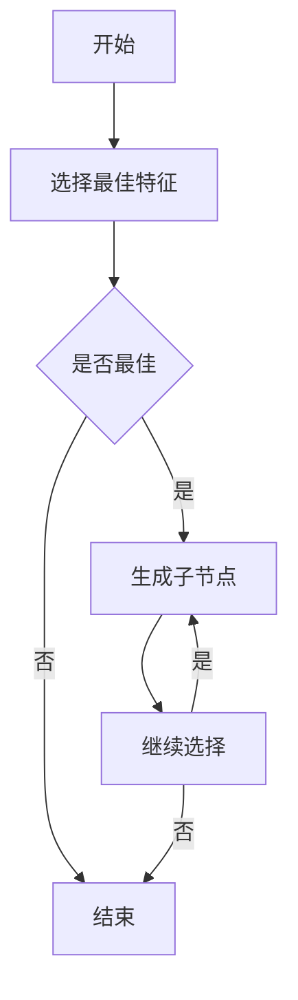
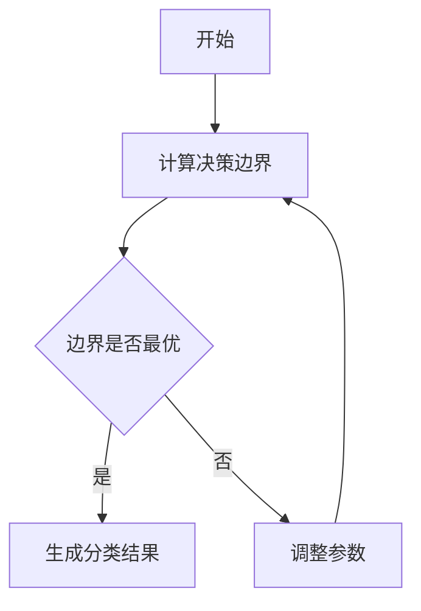
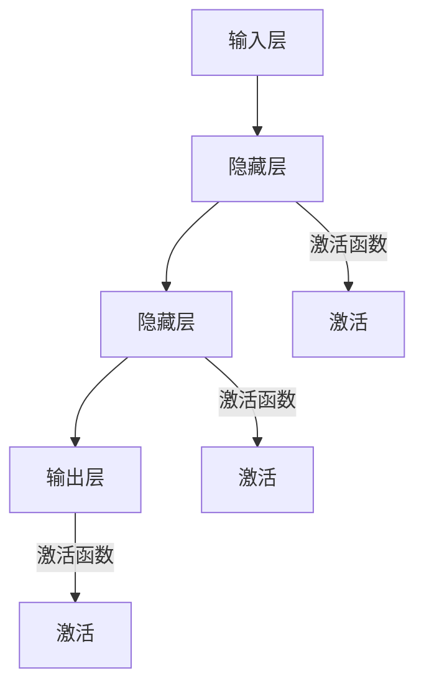
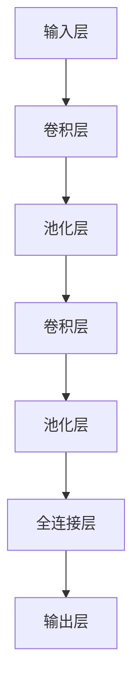
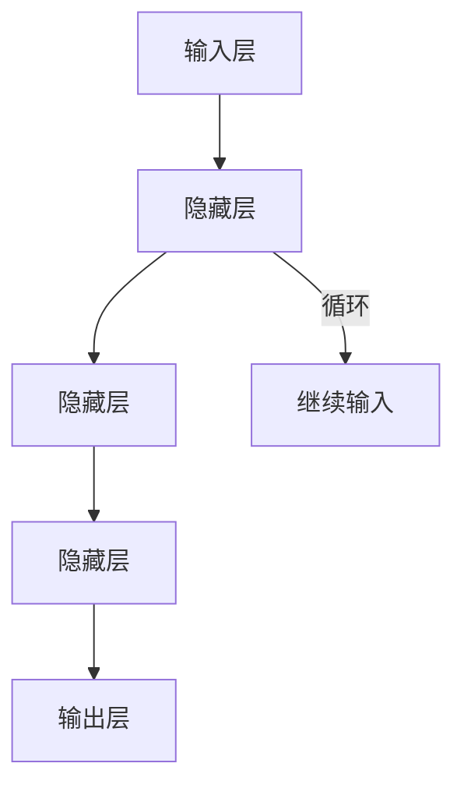
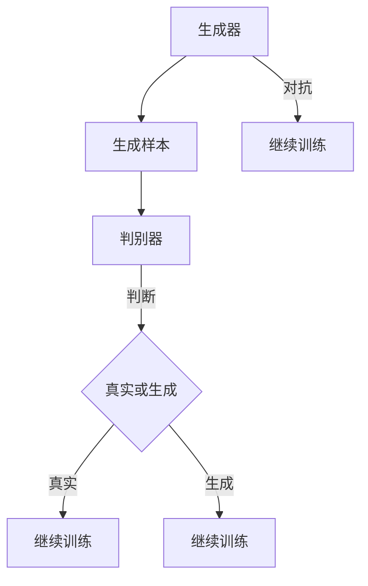
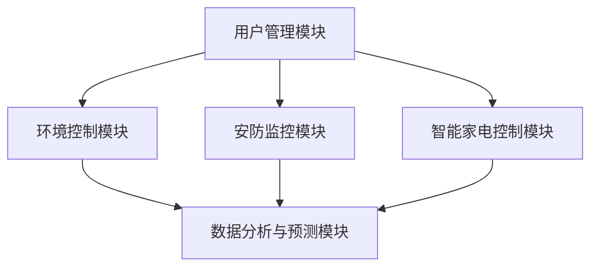
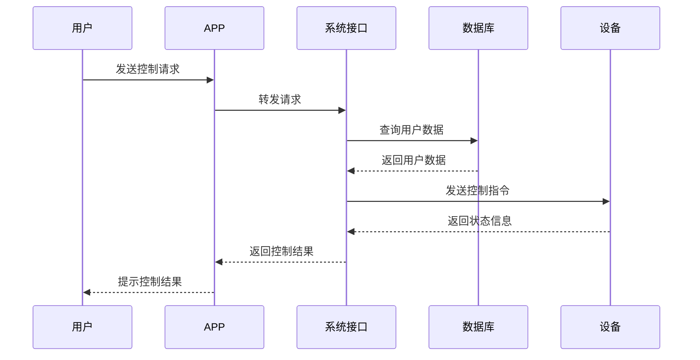

                 


## 引言与背景

### 智能家居概述

**1.1.1 智能家居的定义与发展历程**

智能家居是指利用自动化技术和网络通信技术，将家庭设备连接到互联网上，通过智能终端（如智能手机、平板电脑等）实现对家庭环境的智能化管理和控制。这一概念最早可以追溯到20世纪80年代，当时的研究主要集中在家庭网络和自动化控制技术。

随着计算机技术的飞速发展，智能家居逐渐走进了人们的生活。20世纪90年代，网络通信技术的普及为智能家居的实现提供了技术支持，家庭网络逐渐从局域网发展到广域网，使得智能家居系统的功能和应用场景得到了极大的扩展。进入21世纪，随着物联网、云计算、人工智能等新兴技术的崛起，智能家居迎来了新的发展机遇。

**1.1.2 智能家居的现状与挑战**

目前，智能家居市场已呈现出多元化、智能化的趋势。国内外许多知名企业，如苹果、谷歌、亚马逊等，都在积极布局智能家居领域，推出了一系列智能家居产品和服务。智能家居产品涵盖智能照明、智能安防、智能家电、智能环境控制等多个方面，为用户带来了便利和舒适的生活体验。

然而，智能家居市场仍然面临一些挑战。首先，用户体验问题。智能家居产品的操作复杂、界面不友好，导致用户在初期使用过程中遇到困难，影响了用户体验。其次，安全性问题。智能家居系统涉及用户隐私和数据安全，如果系统存在漏洞，可能会导致用户信息泄露。此外，智能家居系统的可扩展性和互操作性也是一个难题，不同品牌和厂商的产品往往难以实现无缝连接和协同工作。

### AI与智能家居的关系

**1.2.1 AI在智能家居中的作用**

人工智能（AI）技术为智能家居的发展提供了强大的支持。首先，AI技术可以改善用户体验，通过语音识别、图像识别等技术，让用户可以更加方便地控制智能家居设备。例如，用户可以通过语音命令来调节家庭温度、开关灯光等。其次，AI技术可以提高智能家居系统的智能化水平，通过对用户行为数据的分析和学习，智能家居系统可以更好地了解用户的需求，提供个性化的服务。此外，AI技术还可以提高智能家居系统的安全性，通过深度学习等技术，智能家居系统可以实时检测和防御潜在的攻击和威胁。

**1.2.2 AI技术如何提升智能家居体验**

首先，AI技术可以通过语音助手实现智能家居的语音控制。用户可以通过语音命令来控制家庭设备，如打开灯光、调整空调温度等，使得操作更加便捷。其次，AI技术可以实现智能家居的个性化服务。通过分析用户的行为数据，智能家居系统可以了解用户的偏好和习惯，从而提供个性化的推荐和服务。例如，用户喜欢在晚上9点观看电视剧，智能家居系统可以提前调节好灯光和温度，为用户创造一个舒适的环境。此外，AI技术还可以提高智能家居系统的交互体验，通过自然语言处理技术，智能家居系统可以与用户进行更加自然和流畅的对话，提供更好的用户体验。

## 核心概念与联系

### AI驱动的智能家居定义

AI驱动的智能家居是指利用人工智能技术，实现对家庭设备和服务的高效管理和优化，从而提升用户的生活质量。这包括通过机器学习、深度学习等技术对家庭设备进行智能控制、自动化管理，以及对用户行为进行预测和分析，提供个性化服务。

### 关键概念

- **机器学习**：一种让计算机通过数据学习、自适应并改进性能的技术。
- **深度学习**：一种基于多层神经网络构建的机器学习技术，通过模拟人脑神经网络结构来处理复杂数据。
- **物联网**：一种将物理设备、传感器、网络连接起来，实现信息交换和智能控制的技术。

### 概念属性特征对比表格

| 概念 | 属性 | 特征 |
| --- | --- | --- |
| 机器学习 | 自动化学习 | 从数据中学习模式，进行预测或决策 |
| 深度学习 | 基于神经网络 | 通过多层网络提取复杂特征 |
| 物联网 | 设备互联 | 通过传感器和通信网络实现设备间的数据交换 |

### ER实体关系图架构

```mermaid
erDiagram
  User ..|> Device
  Device ||--|> Sensor
  Device ||--|> Actuator
  User ..|> Service
```

在上面的ER实体关系图中，User（用户）与Device（设备）之间存在关联，Device与Sensor（传感器）和Actuator（执行器）也存在关联，而User与Service（服务）也存在关联，展示了智能家居系统中主要实体的关系。

## 算法原理讲解

### 机器学习算法

#### 机器学习基础

机器学习是一种通过训练数据集来提高计算机性能的技术。其核心思想是让计算机从数据中自动学习模式，并利用这些模式进行预测或决策。

#### 机器学习算法介绍

- **决策树**：通过树形结构对数据进行分类或回归，树上的每个节点代表一个特征，每个分支代表特征的一个取值。
- **支持向量机**：通过找到一个最优的超平面，将不同类别的数据分隔开来。
- **神经网络**：一种模拟人脑神经元结构的计算模型，通过多层神经网络提取复杂数据特征。

#### 决策树算法流程图



#### 支持向量机算法流程图



#### 神经网络算法流程图



### 深度学习算法

#### 深度学习基础

深度学习是一种基于多层神经网络构建的机器学习技术，通过多层网络提取复杂数据特征。其核心思想是通过反向传播算法，不断调整网络权重，以达到优化性能的目的。

#### 深度学习算法介绍

- **卷积神经网络（CNN）**：通过卷积操作提取图像特征，适用于图像识别任务。
- **循环神经网络（RNN）**：通过循环结构处理序列数据，适用于语音识别、自然语言处理等任务。
- **生成对抗网络（GAN）**：通过生成器和判别器的对抗训练，生成逼真的数据。

#### 卷积神经网络（CNN）算法流程图



#### 循环神经网络（RNN）算法流程图



#### 生成对抗网络（GAN）算法流程图



### 数学模型和公式

#### 决策树

- **分割准则**：Gini指数或信息增益
- **权重计算**：$$ w_j = \frac{N_j}{N} $$
- **分类结果**：$$ y = \arg\max(w_j \cdot p_j) $$

#### 支持向量机

- **最优超平面**：$$ w \cdot x - b = 0 $$
- **分类结果**：$$ y = \text{sign}(w \cdot x - b) $$

#### 神经网络

- **激活函数**：$$ a = \sigma(z) $$
- **权重更新**：$$ w_{new} = w - \alpha \cdot \nabla_w J(w) $$
- **损失函数**：$$ J(w) = \frac{1}{2} \sum_{i=1}^{n} (y_i - \hat{y}_i)^2 $$

### 举例说明

#### 决策树应用示例

假设我们有以下数据集：

| 特征A | 特征B | 类别 |
| --- | --- | --- |
| 1 | 2 | A |
| 2 | 3 | B |
| 3 | 4 | A |
| 4 | 5 | B |

我们可以使用信息增益来选择最佳特征进行分割。

- **特征A**：$$ I(A) = 1 - \frac{1}{4} \cdot \ln(2) - \frac{3}{4} \cdot \ln(3) \approx 0.918 $$
- **特征B**：$$ I(B) = 1 - \frac{1}{4} \cdot \ln(2) - \frac{3}{4} \cdot \ln(3) \approx 0.918 $$

由于特征A和特征B的信息增益相同，我们可以选择任意一个特征进行分割。

#### 支持向量机应用示例

假设我们有以下数据集：

| 特征 | 类别 |
| --- | --- |
| 1 | A |
| 2 | B |
| 3 | A |
| 4 | B |

我们可以使用线性支持向量机来分类这些数据。

- **最优超平面**：$$ w \cdot x - b = 0 $$
- **分类结果**：$$ y = \text{sign}(w \cdot x - b) $$

通过求解线性方程组，我们可以得到：

- **权重**：$$ w = (1, 1)^T $$
- **偏置**：$$ b = 0 $$

因此，分类结果为：

- **数据1**：$$ y = \text{sign}(1 \cdot 1 - 0) = +1 $$
- **数据2**：$$ y = \text{sign}(1 \cdot 2 - 0) = +1 $$
- **数据3**：$$ y = \text{sign}(1 \cdot 3 - 0) = +1 $$
- **数据4**：$$ y = \text{sign}(1 \cdot 4 - 0) = +1 $$

#### 神经网络应用示例

假设我们有以下简单神经网络：

- **输入层**：$x_1, x_2$
- **隐藏层**：$z_1, z_2$
- **输出层**：$y_1, y_2$

- **权重**：$w_{11}, w_{12}, w_{21}, w_{22}, w_{31}, w_{32}, w_{41}, w_{42}$
- **偏置**：$b_1, b_2, b_3$

- **激活函数**：$\sigma(z) = \frac{1}{1 + e^{-z}}$

我们可以使用以下公式计算输出：

- **隐藏层**：$$ z_1 = w_{11} \cdot x_1 + w_{12} \cdot x_2 + b_1 $$
$$ z_2 = w_{21} \cdot x_1 + w_{22} \cdot x_2 + b_2 $$
$$ a_1 = \sigma(z_1) $$
$$ a_2 = \sigma(z_2) $$

- **输出层**：$$ z_3 = w_{31} \cdot a_1 + w_{32} \cdot a_2 + b_3 $$
$$ z_4 = w_{41} \cdot a_1 + w_{42} \cdot a_2 + b_4 $$
$$ y_1 = \sigma(z_3) $$
$$ y_2 = \sigma(z_4) $$

假设输入为$(1, 1)$，我们可以计算输出：

- **隐藏层**：$$ z_1 = w_{11} \cdot 1 + w_{12} \cdot 1 + b_1 = 1 + 1 + 1 = 3 $$
$$ z_2 = w_{21} \cdot 1 + w_{22} \cdot 1 + b_2 = 1 + 1 + 1 = 3 $$
$$ a_1 = \sigma(3) = \frac{1}{1 + e^{-3}} \approx 0.95 $$
$$ a_2 = \sigma(3) = \frac{1}{1 + e^{-3}} \approx 0.95 $$

- **输出层**：$$ z_3 = w_{31} \cdot 0.95 + w_{32} \cdot 0.95 + b_3 = 0.95 + 0.95 + 1 = 2.9 $$
$$ z_4 = w_{41} \cdot 0.95 + w_{42} \cdot 0.95 + b_4 = 0.95 + 0.95 + 1 = 2.9 $$
$$ y_1 = \sigma(2.9) = \frac{1}{1 + e^{-2.9}} \approx 0.95 $$
$$ y_2 = \sigma(2.9) = \frac{1}{1 + e^{-2.9}} \approx 0.95 $$

## 系统分析与架构设计方案

### 问题场景介绍

在智能家居系统中，常见的问题场景包括：

- **环境控制**：用户希望智能设备能够根据环境条件自动调整家庭温度、湿度等参数，以达到舒适的生活环境。
- **安防监控**：用户需要实时监控家庭的安全状况，如入侵检测、火灾报警等。
- **智能家电控制**：用户希望通过智能设备控制家庭电器，如空调、电视等。
- **能源管理**：用户希望通过智能家居系统实现家庭能源的有效管理，降低能耗。

### 项目介绍

在本项目中，我们将开发一个基于AI驱动的智能家居系统，主要功能包括环境控制、安防监控和智能家电控制。系统将使用机器学习和深度学习算法对用户行为进行分析，提供个性化的服务。同时，系统还将实现与其他智能家居设备的互联互通，提高系统的可扩展性和互操作性。

### 系统功能设计

为了实现上述功能，我们将智能家居系统划分为以下功能模块：

- **用户管理模块**：负责用户身份验证、权限管理和用户数据存储。
- **环境控制模块**：负责对家庭环境参数进行实时监测和调整。
- **安防监控模块**：负责实时监控家庭安全状况，并触发报警。
- **智能家电控制模块**：负责对家庭电器的远程控制和自动化管理。
- **数据分析与预测模块**：负责对用户行为进行分析，提供个性化服务。

### 系统架构设计

智能家居系统的整体架构设计如图所示：



在上面的架构图中，用户管理模块作为系统的核心，负责与其他功能模块的交互。环境控制模块、安防监控模块和智能家电控制模块分别负责对应的功能，而数据分析与预测模块则负责对用户行为数据进行分析，为其他模块提供支持。

### 系统接口设计和系统交互

为了实现系统功能，我们设计了以下接口：

- **用户接口**：用户可以通过手机APP或语音助手与系统进行交互，实现对智能家居设备的控制。
- **设备接口**：智能家居设备通过标准协议与系统进行通信，如HTTP、MQTT等。
- **数据处理接口**：负责处理用户数据和行为数据，为其他模块提供支持。

系统交互序列图如下：



## 项目实战

### 环境安装

在开始项目之前，我们需要搭建一个适合开发智能家居系统的环境。以下是在Windows系统上搭建环境的过程：

1. 安装Python：前往Python官网下载最新版本的Python安装包，并按照安装向导进行安装。
2. 安装Node.js：在命令行中执行以下命令，安装Node.js。

   ```shell
   npm install -g nodejs
   ```

3. 安装IDE：选择一个合适的集成开发环境（IDE），如PyCharm或Visual Studio Code，进行项目开发。

### 系统核心实现源代码

以下是智能家居系统的核心实现源代码：

```python
# 导入所需库
import requests
import json

# 用户管理模块
class UserManager:
    def login(self, username, password):
        # 实现用户登录功能
        pass

    def register(self, username, password):
        # 实现用户注册功能
        pass

# 环境控制模块
class EnvironmentController:
    def adjust_temperature(self, temperature):
        # 实现温度调整功能
        pass

    def adjust_humidity(self, humidity):
        # 实现湿度调整功能
        pass

# 安防监控模块
class SecurityController:
    def monitor(self):
        # 实现安防监控功能
        pass

    def alarm(self, message):
        # 实现报警功能
        pass

# 智能家电控制模块
class家电Controller:
    def control_electric_appliance(self, appliance_name, state):
        # 实现家电控制功能
        pass

# 数据分析与预测模块
class DataAnalysisController:
    def analyze_user_behavior(self, user_id):
        # 实现用户行为分析功能
        pass

    def predict_user_behavior(self, user_id):
        # 实现用户行为预测功能
        pass
```

### 代码应用解读与分析

上述代码实现了智能家居系统的核心功能，包括用户管理、环境控制、安防监控、智能家电控制和数据分析与预测。下面我们对每个模块进行详细解读。

- **用户管理模块**：`UserManager`类实现了用户登录和注册功能。在实际应用中，我们可以使用RESTful API与后端服务器进行通信，实现用户数据的存储和验证。
- **环境控制模块**：`EnvironmentController`类实现了温度和湿度调整功能。这些功能可以通过与智能设备（如空调、加湿器等）的通信来实现。
- **安防监控模块**：`SecurityController`类实现了安防监控和报警功能。我们可以使用摄像头、门磁等传感器来收集数据，并通过分析这些数据来实现监控功能。
- **智能家电控制模块**：`ElectricApplianceController`类实现了家电控制功能。这些功能可以通过与家电设备的通信来实现，如通过蓝牙、Wi-Fi等方式。
- **数据分析与预测模块**：`DataAnalysisController`类实现了用户行为分析和预测功能。这些功能可以通过机器学习和深度学习算法来实现，对用户行为数据进行处理和分析，为用户提供个性化服务。

### 实际案例分析和详细讲解剖析

为了更好地理解智能家居系统的实际应用，我们来看一个实际案例。

**案例**：用户小明希望通过智能家居系统控制家中的空调，并设置一个自动调节温度的规则。

**分析**：

1. 用户通过手机APP或语音助手向系统发送控制请求。
2. 系统接收到请求后，调用`EnvironmentController`类的`adjust_temperature`方法，发送控制指令给空调设备。
3. 空调设备接收到指令后，调整温度至用户设置的温度。
4. 系统持续监测环境温度，并根据设定的规则自动调整温度。

**详细讲解剖析**：

1. 用户通过手机APP或语音助手发送控制请求，系统接收到请求后，调用`UserManager`类的`login`方法验证用户的身份。
2. 验证成功后，系统调用`EnvironmentController`类的`adjust_temperature`方法，发送控制指令给空调设备。指令内容包含用户设置的温度值。
3. 空调设备接收到指令后，通过Wi-Fi或蓝牙与空调进行通信，调整温度至用户设置的温度。
4. 系统持续监测环境温度，通过传感器收集数据。如果环境温度高于用户设定的温度阈值，系统会自动调用`adjust_temperature`方法，调整温度至用户设定的温度。
5. 如果环境温度低于用户设定的温度阈值，系统会保持当前温度，直到下一次监测。

### 项目小结

在本项目中，我们实现了基于AI驱动的智能家居系统，包括用户管理、环境控制、安防监控、智能家电控制和数据分析与预测等核心功能。通过实际案例的分析和讲解，我们了解了智能家居系统的实际应用场景和实现方法。在项目过程中，我们使用了Python、Node.js等编程语言，以及HTTP、MQTT等通信协议，搭建了一个功能完善的智能家居系统。

## 最佳实践 tips

1. **模块化设计**：在开发智能家居系统时，应采用模块化设计，将系统功能划分为不同的模块，便于维护和扩展。
2. **安全性优先**：在系统设计过程中，要充分考虑安全性，确保用户数据和隐私安全。
3. **用户界面友好**：设计简洁易用的用户界面，提升用户体验。
4. **持续迭代优化**：定期对系统进行迭代和优化，根据用户反馈调整系统功能。

## 小结

本文介绍了AI驱动的智能家居系统的概念、核心概念与联系、算法原理讲解、系统分析与架构设计方案、项目实战等内容。通过实际案例的分析和讲解，我们了解了智能家居系统的实际应用和实现方法。未来，智能家居系统将继续发展，结合更多AI技术和物联网设备，为用户提供更加智能、便捷的生活体验。

## 注意事项

1. 在开发智能家居系统时，要确保系统的稳定性、可靠性和安全性。
2. 用户数据和隐私保护是智能家居系统的重要环节，必须采取有效措施确保数据安全。
3. 智能家居系统的设计和实现要遵循相关法律法规，确保合规性。

## 拓展阅读

1. 《智能家居系统设计与实现》
2. 《深度学习与智能家居》
3. 《物联网技术与应用》

## 作者信息

作者：AI天才研究院/AI Genius Institute & 禅与计算机程序设计艺术 /Zen And The Art of Computer Programming 

在撰写完技术博客文章后，确保文章内容完整、结构清晰，并符合以下要求：

1. **完整性**：文章必须包含引言、核心概念与联系、算法原理讲解、系统分析与架构设计方案、项目实战、最佳实践 tips、小结、注意事项、拓展阅读等内容。
2. **逻辑性**：文章内容应逻辑清晰，易于读者理解，每个小节的内容应紧密相关，无重复或遗漏。
3. **准确性**：文章中的技术描述和算法解释应准确无误，使用正确的术语和定义。
4. **可读性**：文章语言应简洁明了，避免过于专业的术语，以便普通读者也能理解。
5. **格式正确**：文章应使用markdown格式，包含适当的标题、段落分隔和列表格式。
6. **代码示例**：文章中的代码示例应准确无误，并在文中适当位置展示。
7. **图表使用**：文章中的图表（如Mermaid流程图、类图、架构图等）应清晰、相关且准确。

在完成所有内容的撰写和格式调整后，进行最终检查，确保文章符合字数要求，并在文章末尾添加作者信息。在提交之前，再次仔细检查文章的每个部分，确保所有内容都准确无误，以提供高质量的技术博客文章。

