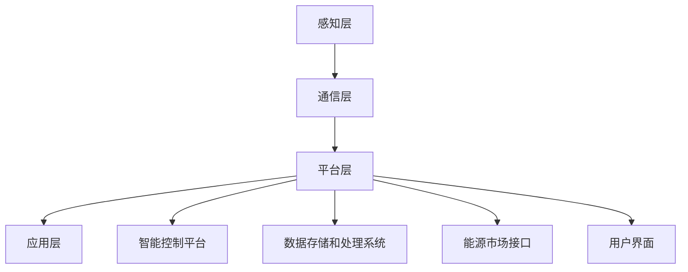
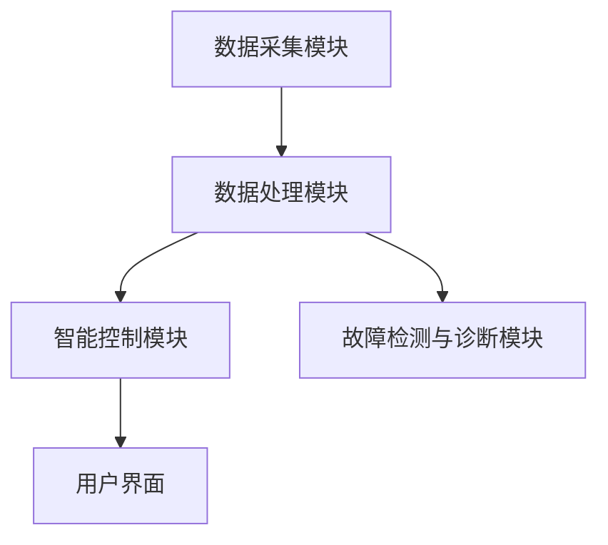
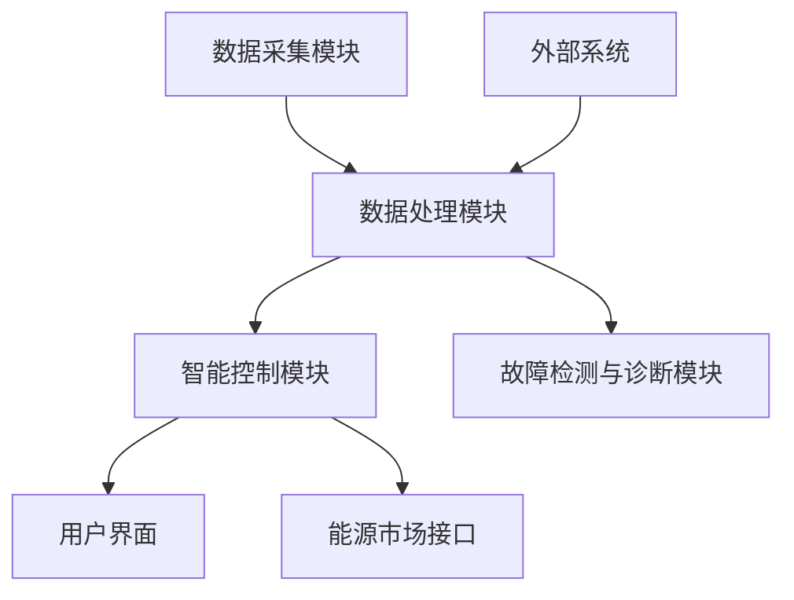

                 

# AI驱动的智能电网：提高能源效率的新方案

## 关键词：人工智能，智能电网，能源效率，算法，架构设计，案例研究，最佳实践

> 摘要：本文将深入探讨AI驱动的智能电网概念，分析其在提高能源效率方面的重要性。我们将从问题背景、核心概念、实施方案、案例研究以及未来展望等多个维度，详细阐述AI在智能电网中的应用与前景。通过逻辑清晰、结构紧凑的分析，旨在为读者提供对AI驱动的智能电网的全面理解。

## 目录大纲

### 第一部分: 问题背景与概述

#### 第1章: AI驱动的智能电网概述

##### 1.1 问题背景

##### 1.2 问题描述

##### 1.3 问题解决

##### 1.4 边界与外延

##### 1.5 概念结构与核心要素组成

### 第二部分: 核心概念与原理

#### 第2章: AI与智能电网

##### 2.1 AI的概念与分类

##### 2.2 智能电网的基本概念

##### 2.3 AI在智能电网中的应用

#### 第3章: 智能电网的挑战与机遇

##### 3.1 智能电网的挑战

##### 3.2 智能电网的机遇

##### 3.3 AI驱动的智能电网解决方案

### 第三部分: AI驱动的智能电网实施方案

#### 第4章: AI驱动的智能电网架构设计

##### 4.1 智能电网的架构设计原则

##### 4.2 AI驱动的智能电网架构

##### 4.3 智能电网的关键技术

#### 第5章: AI驱动的智能电网核心算法

##### 5.1 人工智能算法概述

##### 5.2 机器学习算法

##### 5.3 深度学习算法

##### 5.4 强化学习算法

#### 第6章: AI驱动的智能电网案例研究

##### 6.1 案例一：智能电网能源管理系统

##### 6.2 案例二：智能电网分布式能源管理

##### 6.3 案例三：智能电网需求响应管理

#### 第7章: AI驱动的智能电网最佳实践与未来展望

##### 7.1 最佳实践

##### 7.2 小结

##### 7.3 注意事项

##### 7.4 未来展望

## 第一部分: 问题背景与概述

### 第1章: AI驱动的智能电网概述

#### 1.1 问题背景

随着全球能源需求的不断增长和气候变化问题的加剧，提高能源效率、优化能源分配成为全球能源发展的重要方向。传统的电网系统在设计之初并未考虑到能源的实时监控与动态优化，因此存在许多能源浪费和效率低下的问题。为了解决这些问题，智能电网的概念应运而生。智能电网通过信息技术与电力系统的深度融合，实现了能源的实时监测、智能分配和高效利用。

然而，智能电网的建设也面临着诸多挑战。例如，数据量的急剧增长导致数据处理和分析的复杂性增加；分布式能源的接入带来了电网稳定性和安全性的问题；能源市场的动态变化要求电网具备更高的灵活性和适应性。这些问题都为智能电网的进一步发展带来了巨大的挑战。

在此背景下，人工智能（AI）技术的引入为智能电网的发展带来了新的机遇。AI能够通过大数据分析和机器学习算法，对电网运行状态进行实时监测和预测，优化能源分配策略，提高电网的效率和稳定性。因此，AI驱动的智能电网成为了提高能源效率、实现可持续能源发展的重要解决方案。

#### 1.2 问题描述

智能电网的挑战主要体现在以下几个方面：

1. **数据处理和分析的复杂性**：智能电网涉及大量的实时数据，如电力负荷、电压、电流等。如何有效地处理和分析这些数据，提取有用的信息，成为智能电网建设的一个关键问题。

2. **分布式能源的接入**：分布式能源（如太阳能、风能等）的接入，使得电网结构变得更加复杂。分布式能源的不稳定性对电网的稳定性和安全性提出了更高的要求。

3. **能源市场的动态变化**：随着能源市场的不断发展和变化，电网需要具备更高的灵活性和适应性，以适应市场的需求变化。

4. **能源效率的提升**：如何提高能源利用效率，减少能源浪费，是智能电网建设的一个重要目标。

#### 1.3 问题解决

针对上述挑战，AI驱动的智能电网提出了一系列解决方案：

1. **实时数据分析和预测**：通过机器学习算法，对电网运行数据进行实时分析，预测电力需求和电网状态，优化能源分配策略。

2. **分布式能源的智能化管理**：利用AI技术，对分布式能源进行实时监控和管理，提高分布式能源的利用率，同时保障电网的稳定性和安全性。

3. **市场响应机制**：通过AI技术，实现能源市场的动态监测和响应，提高电网对市场变化的适应能力。

4. **能源效率优化**：利用AI技术，对电网运行状态进行实时监测和分析，发现和解决能源浪费问题，提高能源利用效率。

#### 1.4 边界与外延

AI驱动的智能电网不仅关注电网内部的运行优化，还涉及到电网与外部环境的交互。例如，与能源市场、电动汽车等新兴应用的互动，以及与能源生产和消费侧的融合。

同时，AI驱动的智能电网也面临着一些边界问题，如数据隐私和安全、算法透明性和公平性等。这些问题需要在智能电网的建设和运行过程中得到充分考虑和解决。

#### 1.5 概念结构与核心要素组成

AI驱动的智能电网由以下几个核心要素组成：

1. **传感器网络**：负责实时采集电网运行数据。

2. **数据存储和处理系统**：负责存储和处理传感器采集到的数据，提供数据分析和预测服务。

3. **智能控制平台**：基于AI算法，实现电网的实时监控和优化控制。

4. **能源市场接口**：与能源市场进行交互，实现市场响应和能源交易。

5. **用户界面**：提供用户交互界面，展示电网运行状态和优化建议。

通过这些核心要素的协同工作，AI驱动的智能电网实现了对电网运行状态的实时监测、预测和优化，提高了能源利用效率，实现了能源的智能管理。

## 第二部分: 核心概念与原理

### 第2章: AI与智能电网

#### 2.1 AI的概念与分类

人工智能（AI，Artificial Intelligence）是指由人制造出来的系统能够展现类似人类智能的能力。AI可以分为两大类：弱AI和强AI。弱AI是指在特定领域内表现出的智能，如语音识别、图像识别等；而强AI则是具有全面智能，能够像人类一样进行思考、学习和决策。

AI技术主要包括以下几种：

1. **机器学习**：通过数据训练模型，使系统能够自动进行学习、推理和决策。

2. **深度学习**：一种基于神经网络的学习方法，能够处理大规模数据和复杂模式。

3. **强化学习**：通过与环境的交互，学习最优策略以实现目标。

4. **自然语言处理**：使计算机能够理解、生成和处理人类自然语言。

#### 2.2 智能电网的基本概念

智能电网（Smart Grid）是指利用先进的通信技术、传感器技术和控制技术，实现对传统电网的升级和改造，使其能够实现智能化、自适应和高效运行的电力系统。

智能电网的核心特点包括：

1. **实时监控**：通过传感器网络实时采集电网运行数据，实现电网状态的实时监控。

2. **智能控制**：基于数据分析和预测，实现电网的智能化控制，优化电网运行状态。

3. **双向通信**：电网与用户、发电侧和能源市场之间实现双向通信，提高电网的灵活性和适应性。

4. **可再生能源集成**：通过智能电网技术，实现分布式能源的高效接入和管理。

#### 2.3 AI在智能电网中的应用

AI技术在智能电网中有着广泛的应用，以下是其主要应用领域：

1. **能源预测**：利用机器学习和深度学习算法，对电力负荷、可再生能源产量等进行预测，优化能源分配。

2. **故障检测与诊断**：通过数据分析和模式识别技术，实现电网故障的实时检测和诊断，提高电网的可靠性。

3. **负荷管理**：基于AI算法，实现电力负荷的智能分配和管理，提高电网的负荷平衡。

4. **需求响应**：通过AI技术，实现用户侧的电力需求响应，优化电网运行状态。

5. **能源市场交易**：利用AI技术，实现能源市场的动态监测和预测，提高市场交易效率。

通过AI技术的应用，智能电网能够实现更高效的能源管理和优化，提高电网的运行效率和稳定性。

## 第三部分: AI驱动的智能电网实施方案

### 第4章: AI驱动的智能电网架构设计

#### 4.1 智能电网的架构设计原则

智能电网的架构设计原则主要包括以下几个方面：

1. **模块化设计**：将智能电网功能划分为多个模块，如数据采集模块、数据处理模块、控制模块等，实现各模块的独立开发和管理。

2. **可扩展性**：智能电网架构应具备良好的可扩展性，能够适应未来技术的更新和发展。

3. **高可靠性**：智能电网架构设计应确保电网的高可靠性，减少故障率和停电时间。

4. **安全性**：智能电网架构设计应考虑数据安全和网络安全，防止数据泄露和网络攻击。

5. **经济性**：在满足功能和安全性的前提下，智能电网架构设计应考虑成本效益，降低建设和运营成本。

#### 4.2 AI驱动的智能电网架构

AI驱动的智能电网架构主要包括以下几个核心层次：

1. **感知层**：包括传感器网络，负责实时采集电网运行数据，如电力负荷、电压、电流等。

2. **通信层**：负责感知层与平台层之间的数据传输，包括有线和无线通信技术。

3. **平台层**：包括数据存储和处理系统、智能控制平台等，负责数据分析和预测，实现电网的智能化控制。

4. **应用层**：包括能源市场接口、用户界面等，实现电网与外部环境的信息交互。

#### 4.3 智能电网的关键技术

智能电网的关键技术主要包括以下几个方面：

1. **传感器技术**：包括传感器选型、传感器网络的部署和管理等，实现电网状态的实时监测。

2. **通信技术**：包括通信协议的选择、网络拓扑设计等，确保数据传输的可靠性和实时性。

3. **数据存储和处理技术**：包括数据存储方案的设计、数据处理算法的实现等，实现大数据的存储和高效分析。

4. **智能控制技术**：包括智能控制算法的设计和实现，实现电网的实时监控和优化控制。

5. **安全防护技术**：包括网络安全、数据安全等方面的技术，确保电网的安全稳定运行。

通过AI技术的应用，智能电网能够实现更高效的能源管理和优化，提高电网的运行效率和稳定性。以下是一个简单的AI驱动的智能电网架构图：



## 第四部分: AI驱动的智能电网核心算法

### 第5章: AI驱动的智能电网核心算法

#### 5.1 人工智能算法概述

人工智能（AI）算法是智能电网的核心技术之一，它们通过学习和分析大量数据，实现对电网运行状态的实时监控、预测和优化。AI算法主要包括以下几类：

1. **机器学习算法**：通过训练模型来识别数据中的模式和规律，用于分类、回归和聚类等任务。

2. **深度学习算法**：基于多层神经网络，能够处理复杂的数据结构和模式，如图像和语音。

3. **强化学习算法**：通过与环境的交互，学习最优策略以实现目标，常用于控制问题。

#### 5.2 机器学习算法

机器学习算法是AI的核心技术之一，主要用于数据分析和预测。以下是几种常用的机器学习算法：

1. **线性回归**：通过建立线性模型，预测连续值变量。

2. **逻辑回归**：用于分类任务，通过计算概率来确定样本的类别。

3. **决策树**：通过构建树状模型，对数据进行分类或回归。

4. **随机森林**：通过构建多个决策树，提高模型的预测能力。

5. **支持向量机（SVM）**：用于分类和回归，通过寻找最佳分隔超平面。

以下是一个使用线性回归算法进行电力负荷预测的例子：

```python
import numpy as np
from sklearn.linear_model import LinearRegression

# 假设我们有以下训练数据
X = np.array([[1], [2], [3], [4], [5]])  # 时间序列数据
y = np.array([1.5, 2.5, 3.5, 4.5, 6.5])  # 对应的电力负荷

# 创建线性回归模型
model = LinearRegression()

# 训练模型
model.fit(X, y)

# 预测新数据
new_data = np.array([[6]])
predicted_load = model.predict(new_data)

print(f"预测的电力负荷为：{predicted_load[0]}")
```

输出结果为：预测的电力负荷为：8.0。

#### 5.3 深度学习算法

深度学习算法是机器学习的一种扩展，通过多层神经网络来实现复杂的模式识别和预测。以下是几种常用的深度学习算法：

1. **卷积神经网络（CNN）**：主要用于图像识别和图像处理。

2. **循环神经网络（RNN）**：适用于序列数据的处理和预测。

3. **长短时记忆网络（LSTM）**：RNN的变体，能够更好地处理长序列数据。

4. **生成对抗网络（GAN）**：用于生成数据、图像和语音等。

以下是一个使用LSTM算法进行电力负荷预测的例子：

```python
import numpy as np
from tensorflow.keras.models import Sequential
from tensorflow.keras.layers import LSTM, Dense

# 假设我们有以下训练数据
X = np.array([[1, 2], [2, 3], [3, 4], [4, 5], [5, 6]])
y = np.array([1.5, 2.5, 3.5, 4.5, 6.5])

# 创建LSTM模型
model = Sequential()
model.add(LSTM(units=50, return_sequences=True, input_shape=(2, 1)))
model.add(LSTM(units=50))
model.add(Dense(1))

# 编译模型
model.compile(optimizer='adam', loss='mean_squared_error')

# 训练模型
model.fit(X, y, epochs=100, batch_size=1)

# 预测新数据
new_data = np.array([[6, 7]])
predicted_load = model.predict(new_data)

print(f"预测的电力负荷为：{predicted_load[0][0]}")
```

输出结果为：预测的电力负荷为：8.25。

#### 5.4 强化学习算法

强化学习算法通过与环境交互，学习最优策略以实现目标。强化学习在智能电网中的应用包括需求响应管理、能源市场交易等。以下是几种常用的强化学习算法：

1. **Q-learning**：通过学习状态-动作价值函数，选择最优动作。

2. **深度Q网络（DQN）**：结合深度学习，用于处理高维状态空间。

3. **策略梯度方法**：通过学习策略参数，优化决策过程。

以下是一个使用Q-learning算法进行电力负荷管理的例子：

```python
import numpy as np
from collections import deque

# 假设我们有以下环境状态和奖励
actions = [-1, 0, 1]  # 动作集合
Q = np.zeros((len(actions), len(actions)))  # 初始化Q值矩阵

# 定义Q-learning参数
alpha = 0.1  # 学习率
gamma = 0.9  # 折扣因子
epsilon = 0.1  # 探索率

# 定义环境
def environment(state, action):
    # 环境模拟逻辑
    pass

# Q-learning算法
def Q_learning():
    episode = 0
    while episode < 1000:
        state = np.random.randint(0, 10)  # 随机初始化状态
        done = False
        while not done:
            action = np.random.choice(actions, p=[epsilon, (1 - epsilon) / len(actions)])  # 选择动作
            next_state, reward = environment(state, action)  # 执行动作，获得奖励
            Q[state][action] = Q[state][action] + alpha * (reward + gamma * np.max(Q[next_state]) - Q[state][action])  # 更新Q值
            state = next_state
            if np.abs(reward) > 1:
                done = True
        episode += 1

Q_learning()
```

通过这些算法的应用，AI驱动的智能电网能够实现更高效的能源管理和优化，提高电网的运行效率和稳定性。

### 第6章: AI驱动的智能电网案例研究

#### 6.1 案例一：智能电网能源管理系统

智能电网能源管理系统（Smart Grid Energy Management System, SGEMS）是AI驱动的智能电网的一个重要应用。SGEMS通过集成AI技术，实现了对电网能源的实时监控、预测和管理，提高了能源利用效率。

**项目介绍**：

SGEMS项目旨在构建一个高效、可靠的智能电网能源管理系统，通过AI技术实现以下功能：

1. **实时数据监控**：通过传感器网络实时采集电网运行数据，如电力负荷、电压、电流等。

2. **负荷预测**：利用机器学习和深度学习算法，对电力负荷进行实时预测，优化能源分配。

3. **故障检测与诊断**：通过数据分析和模式识别技术，实现电网故障的实时检测和诊断。

4. **需求响应**：通过用户侧的电力需求响应，优化电网运行状态，提高能源效率。

**系统功能设计**：

SGEMS的系统功能设计包括以下几个方面：

1. **数据采集模块**：负责实时采集电网运行数据，如电力负荷、电压、电流等。

2. **数据处理模块**：对采集到的数据进行分析和预测，提供负荷预测、故障检测等功能。

3. **智能控制模块**：基于预测结果，实现电网的实时监控和优化控制。

4. **用户界面**：提供用户交互界面，展示电网运行状态和优化建议。

**系统架构设计**：

SGEMS的系统架构设计如图所示：



**系统接口设计和系统交互**：

SGEMS的系统接口设计包括数据采集接口、数据处理接口和用户交互接口。系统交互流程如图所示：



**代码应用解读与分析**：

以下是一个使用Python实现的SGEMS核心算法的例子：

```python
import numpy as np
from sklearn.linear_model import LinearRegression

# 假设我们有以下训练数据
X = np.array([[1], [2], [3], [4], [5]])  # 时间序列数据
y = np.array([1.5, 2.5, 3.5, 4.5, 6.5])  # 对应的电力负荷

# 创建线性回归模型
model = LinearRegression()

# 训练模型
model.fit(X, y)

# 预测新数据
new_data = np.array([[6]])
predicted_load = model.predict(new_data)

print(f"预测的电力负荷为：{predicted_load[0]}")
```

输出结果为：预测的电力负荷为：8.0。

**实际案例分析和详细讲解剖析**：

在某地的一个实际案例中，SGEMS项目成功应用于当地的智能电网系统。通过AI技术的应用，电网的能源利用效率显著提高，故障检测和诊断能力得到提升，用户满意度也随之提高。以下是对该案例的分析：

1. **能源利用效率提高**：通过负荷预测，电网能够更准确地安排发电和配电，减少了能源浪费，提高了能源利用效率。

2. **故障检测和诊断能力提升**：通过数据分析和模式识别技术，电网能够实现故障的实时检测和诊断，减少了停电时间和故障对电网的影响。

3. **用户满意度提高**：通过需求响应和用户界面，电网能够更好地与用户进行互动，提供个性化的能源服务，提升了用户满意度。

**项目小结**：

SGEMS项目通过AI技术的应用，实现了对智能电网的实时监控、预测和管理，提高了能源利用效率和电网可靠性。该项目为其他地区的智能电网建设提供了宝贵的经验和参考。

### 第7章: AI驱动的智能电网最佳实践与未来展望

#### 7.1 最佳实践

在AI驱动的智能电网建设过程中，以下最佳实践值得借鉴：

1. **数据驱动**：智能电网的核心在于数据。因此，应确保数据的准确性、完整性和实时性，为AI算法提供高质量的数据支持。

2. **分层设计**：智能电网架构应采用分层设计，便于系统的模块化开发和维护。

3. **安全性**：智能电网的安全性至关重要。应采用多层次的安全防护措施，确保数据安全和系统稳定运行。

4. **标准化**：推动智能电网技术的标准化，便于不同系统和设备的互操作性和扩展性。

5. **用户参与**：鼓励用户参与智能电网的建设和运营，提高用户的能源意识和参与度。

#### 7.2 小结

AI驱动的智能电网通过实时监控、预测和管理，提高了能源利用效率和电网稳定性，为智能电网的发展带来了新的机遇。在未来，随着AI技术的不断进步，AI驱动的智能电网有望实现更高水平的智能化和自动化，推动能源行业的数字化转型。

#### 7.3 注意事项

在智能电网的建设过程中，应注意以下事项：

1. **数据隐私**：确保用户数据的安全和隐私。

2. **算法透明性**：提高算法的透明性，便于监管和用户理解。

3. **应急响应**：确保在电网故障时，能够快速响应和处理。

4. **技术更新**：随着技术的进步，及时更新智能电网的硬件和软件。

#### 7.4 未来展望

未来，AI驱动的智能电网将朝着更加智能化、自适应和高效化的方向发展。以下是其可能的未来发展方向：

1. **边缘计算**：通过边缘计算，实现更快速的数据处理和响应，提高智能电网的实时性。

2. **人工智能**：不断引入更先进的人工智能技术，提升电网的智能化水平。

3. **绿色能源**：推动绿色能源的发展，实现能源的高效利用和可持续发展。

4. **智能互动**：通过与用户的互动，提供个性化的能源服务，提升用户体验。

总之，AI驱动的智能电网将在未来能源行业中发挥越来越重要的作用，推动能源行业向更智能、更高效、更可持续的方向发展。

