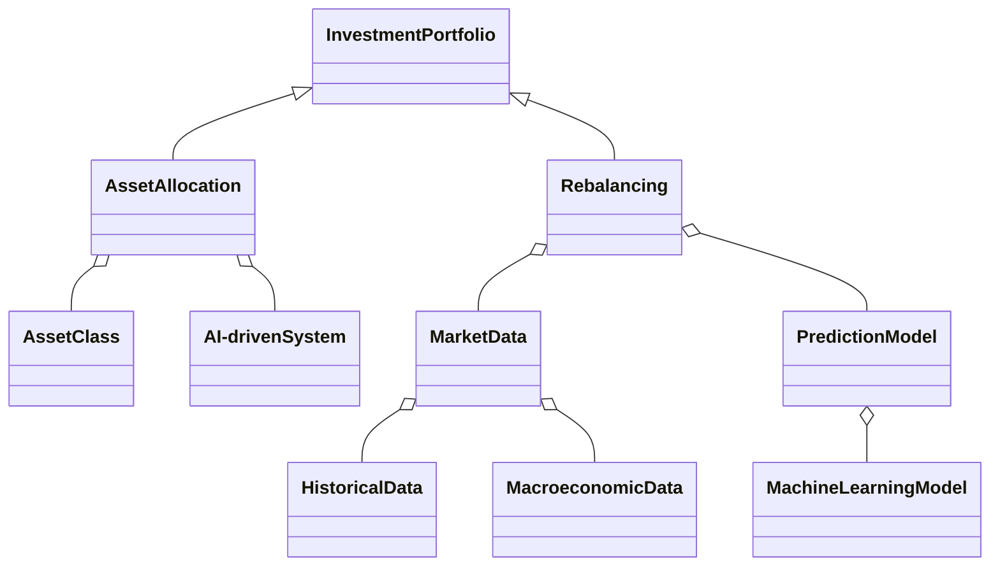
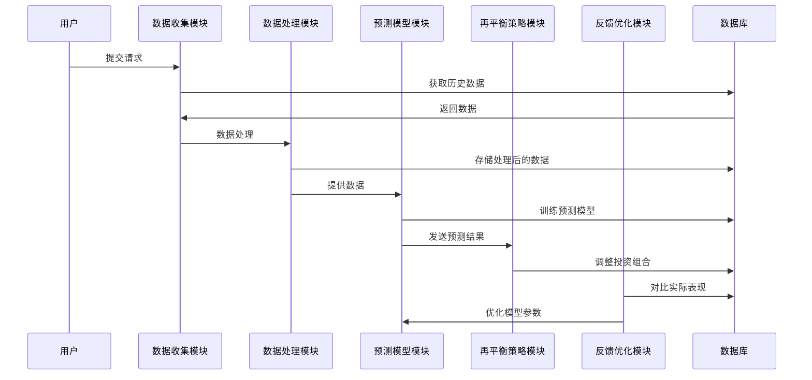
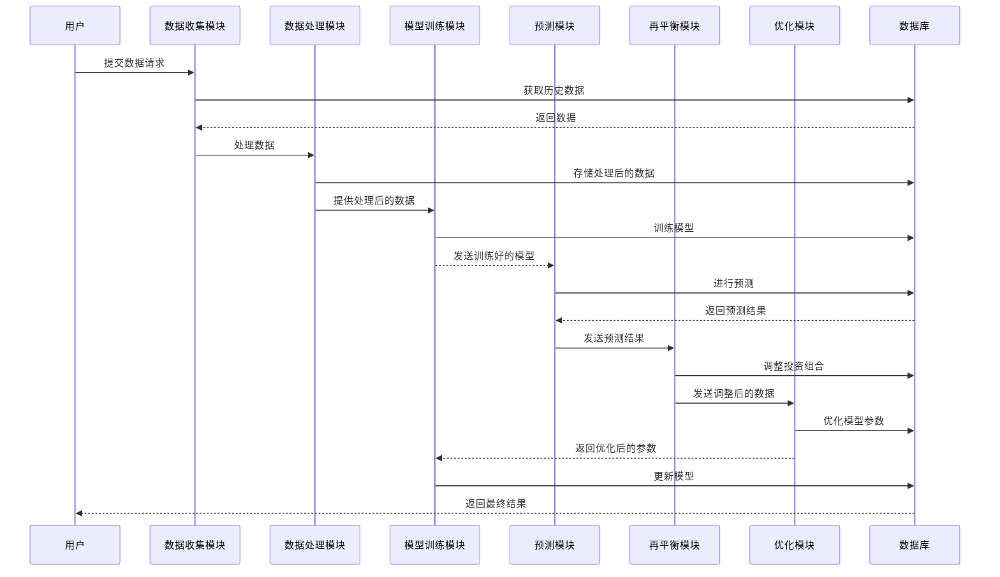

                 

### 第1章: AI驱动的自动化投资组合再平衡概述

#### 1.1 问题背景

##### 1.1.1 资产配置的重要性

资产配置是投资过程中的关键环节，它关乎投资组合的风险管理与收益优化。资产配置的核心在于将投资资金合理地分配到不同的资产类别中，以实现投资组合的整体收益最大化。在传统投资策略中，资产配置往往依赖投资者对市场趋势的判断和自身的风险偏好。然而，随着市场的复杂性和不确定性增加，传统的人工资产配置方法已逐渐显露出其局限性。

##### 1.1.2 人工再平衡的挑战

人工再平衡是指定期根据市场变化调整投资组合中各类资产的比例，以维持预定的资产配置比例。然而，人工再平衡存在以下挑战：

1. **信息处理能力有限**：人工再平衡依赖于投资者对大量市场信息的处理能力，容易受到情绪和主观偏见的影响。
2. **反应速度较慢**：市场变化迅速，人工再平衡的反应速度往往无法及时跟上市场动态。
3. **调整频率不适宜**：调整频率过高会导致频繁交易成本增加，调整频率过低则可能导致投资组合与预期配置偏离较大。

##### 1.1.3 AI驱动的自动化再平衡的优势

AI驱动的自动化投资组合再平衡是一种利用人工智能技术进行资产配置调整的方法。该方法具有以下优势：

1. **高效处理海量数据**：AI能够快速处理和分析大量的市场数据，提供更为精准的投资决策。
2. **实时调整**：AI系统可以实时监控市场变化，快速调整投资组合，降低人工反应速度慢的问题。
3. **减少人为错误**：AI系统减少了人为情绪和偏见的影响，提高了再平衡决策的客观性和准确性。
4. **自动化操作**：AI驱动的自动化再平衡可以减少人工干预，降低操作风险和交易成本。

通过上述优势，AI驱动的自动化投资组合再平衡有望成为解决传统人工再平衡挑战的有效途径。接下来，我们将详细探讨AI驱动的自动化投资组合再平衡的核心概念和原理。

---

### 1.2 核心概念与联系

在深入了解AI驱动的自动化投资组合再平衡之前，我们需要明确几个核心概念，并探讨它们之间的联系。以下是几个关键概念的定义及其联系：

#### 1.2.1 AI驱动的自动化投资组合再平衡

AI驱动的自动化投资组合再平衡是指利用人工智能技术，如机器学习和数据挖掘，来分析市场数据，预测市场走势，并自动调整投资组合中各类资产的比例，以达到预定的资产配置目标。

#### 1.2.2 相关概念对比

- **投资组合**：指投资者持有的各种资产的整体组合。
- **资产配置**：指将投资资金分配到不同的资产类别中，以实现整体收益最大化和风险控制。
- **再平衡**：指根据市场变化定期调整投资组合中各类资产的比例，以维持预定的资产配置比例。

这些概念之间的联系在于：投资组合是资产配置的基础，而资产配置则通过再平衡实现，AI驱动的自动化再平衡则提升了这一过程的效果和效率。

#### 1.2.3 ER实体关系图

为了更直观地展示这些概念之间的关系，我们可以使用ER（实体关系）图来表示。以下是ER实体关系图的Mermaid表示：

```mermaid
erDiagram
    InvestmentPortfolio ||--|{ AssetAllocation }| Allocation
    InvestmentPortfolio ||--|{ Rebalancing }| Rebalance
    AssetAllocation ||--|{ AssetClass }| AssetClass
    Rebalancing ||--|{ AI-drivenSystem }| AIRebalance
```

在该ER图中：

- **InvestmentPortfolio**（投资组合）是根实体，它包含了资产配置（AssetAllocation）和再平衡（Rebalancing）两个关系。
- **AssetAllocation**（资产配置）与**AssetClass**（资产类别）存在关联关系，表示资产配置由不同的资产类别组成。
- **Rebalancing**（再平衡）与**AI-drivenSystem**（AI驱动系统）关联，表示再平衡过程由AI系统辅助完成。

通过ER实体关系图，我们可以清晰地看到AI驱动的自动化投资组合再平衡在整个投资过程中的位置和作用。

---

接下来，我们将进一步探讨AI驱动的自动化投资组合再平衡的算法原理和数学模型，以更深入地理解其技术实现。

---

### 2.1 算法流程

#### 2.1.1 算法概述

AI驱动的自动化投资组合再平衡算法的核心目标是通过分析历史和市场数据，预测未来市场走势，并基于预测结果自动调整投资组合中各类资产的比例。该算法通常包含以下几个主要步骤：

1. **数据收集**：收集历史市场数据、资产表现数据以及其他可能影响市场的宏观经济数据。
2. **数据处理**：对收集到的数据进行分析和预处理，包括数据清洗、特征提取和归一化等。
3. **模型训练**：使用机器学习算法（如时间序列分析、回归分析等）对预处理后的数据进行训练，以建立预测模型。
4. **预测市场走势**：利用训练好的模型对未来的市场走势进行预测。
5. **调整投资组合**：根据预测结果和当前的资产配置，自动调整投资组合中各类资产的比例，实现再平衡。
6. **反馈与优化**：将再平衡后的结果与实际市场表现进行对比，调整模型参数和策略，以提高预测和再平衡的准确性。

#### 2.1.2 Mermaid算法流程图

为了更直观地展示算法流程，我们可以使用Mermaid语言绘制一个流程图。以下是算法流程图的Mermaid表示：


在该流程图中：

- **A（数据收集）**：收集历史和市场数据。
- **B（数据处理）**：对数据进行清洗、特征提取和归一化等处理。
- **C（模型训练）**：使用机器学习算法对数据训练预测模型。
- **D（预测市场走势）**：利用训练好的模型预测未来市场走势。
- **E（调整投资组合）**：根据预测结果调整投资组合。
- **F（反馈与优化）**：将再平衡后的结果与实际市场表现对比，优化模型和策略。

通过上述流程图，我们可以清晰地看到AI驱动的自动化投资组合再平衡的整体工作流程。

#### 2.1.3 算法原理详细讲解

AI驱动的自动化投资组合再平衡算法的实现依赖于多个关键技术和步骤。以下是算法原理的详细讲解：

1. **数据收集**：数据收集是整个算法的基础。我们需要收集以下数据：
   - 历史市场数据：包括股票、债券、基金等金融产品的价格、交易量、波动率等。
   - 资产表现数据：各类资产的历史收益率、风险指标等。
   - 宏观经济数据：包括GDP增长率、通货膨胀率、利率、汇率等。

2. **数据处理**：
   - **数据清洗**：去除数据中的噪声和异常值，保证数据质量。
   - **特征提取**：从原始数据中提取对预测有帮助的特征，如技术指标、动量因子、波动率等。
   - **归一化**：对特征进行归一化处理，使得不同特征具有相似的量纲和范围，便于模型训练。

3. **模型训练**：
   - **选择模型**：根据数据特点和业务需求选择合适的机器学习模型。常见的模型包括线性回归、决策树、随机森林、支持向量机、神经网络等。
   - **训练过程**：使用历史数据训练模型，通过多次迭代优化模型参数，提高模型的预测准确性。

4. **预测市场走势**：
   - **预测方法**：根据训练好的模型，对未来市场的走势进行预测。常见的预测方法包括时间序列预测、回归预测等。
   - **风险预测**：评估各类资产的未来风险，为投资组合调整提供依据。

5. **调整投资组合**：
   - **目标设定**：根据预测结果和投资者的风险偏好，设定新的投资组合目标。
   - **权重调整**：根据目标设定，调整各类资产在投资组合中的权重，实现再平衡。

6. **反馈与优化**：
   - **效果评估**：将再平衡后的实际市场表现与预测结果进行对比，评估再平衡策略的有效性。
   - **模型优化**：根据评估结果，调整模型参数和策略，优化再平衡效果。

通过上述详细讲解，我们可以更好地理解AI驱动的自动化投资组合再平衡算法的实现原理和步骤。

---

### 2.2 数学模型与公式

AI驱动的自动化投资组合再平衡算法不仅依赖于机器学习和数据处理技术，还涉及一系列数学模型和公式，以实现投资组合的优化和调整。以下是核心的数学模型和公式的讲解。

#### 2.2.1 数学模型概述

在AI驱动的自动化投资组合再平衡中，主要的数学模型包括：

1. **期望收益率模型**：用于预测各类资产的未来收益。
2. **风险模型**：用于评估各类资产的风险水平。
3. **优化模型**：用于确定投资组合中各类资产的权重，实现收益最大化和风险最小化。

#### 2.2.2 数学公式讲解

1. **期望收益率模型**：

   设 \( r_i \) 为第 \( i \) 类资产的未来期望收益率，\( w_i \) 为第 \( i \) 类资产在投资组合中的权重，则期望收益率模型可以表示为：

   \[ E(r) = \sum_{i=1}^{n} w_i \cdot r_i \]

   其中，\( n \) 为资产类别总数。

2. **风险模型**：

   设 \( \sigma_i \) 为第 \( i \) 类资产的标准差，表示其风险水平，则投资组合的整体风险可以用以下公式表示：

   \[ \sigma_P = \sqrt{\sum_{i=1}^{n} w_i^2 \cdot \sigma_i^2 + 2 \cdot \sum_{i=1}^{n} \sum_{j=i+1}^{n} w_i \cdot w_j \cdot \rho_{ij}} \]

   其中，\( \rho_{ij} \) 为第 \( i \) 类资产与第 \( j \) 类资产之间的相关系数。

3. **优化模型**：

   为了实现收益最大化和风险最小化，我们可以构建以下优化模型：

   \[ \begin{aligned}
   \max_{w} E(r) \\
   s.t. \quad \sigma_P \leq \text{风险限制} \\
   w_1 + w_2 + \cdots + w_n = 1 \\
   w_i \geq 0 \quad \forall i
   \end{aligned} \]

   其中，\( w \) 为权重向量。

#### 2.2.3 Mermaid数学公式流程图

为了更直观地展示这些数学公式，我们可以使用Mermaid绘制一个流程图。以下是数学公式流程图的Mermaid表示：

```mermaid
flowchart LR
    A[期望收益率模型] --> B{风险模型}
    B --> C[优化模型]
    subgraph 公式
        D[期望收益率]((\( E(r) = \sum_{i=1}^{n} w_i \cdot r_i \)))
        E[风险]((\( \sigma_P = \sqrt{\sum_{i=1}^{n} w_i^2 \cdot \sigma_i^2 + 2 \cdot \sum_{i=1}^{n} \sum_{j=i+1}^{n} w_i \cdot w_j \cdot \rho_{ij}} \)))
        F[优化模型]((\( \begin{aligned}
        \max_{w} E(r) \\
        s.t. \quad \sigma_P \leq \text{风险限制} \\
        w_1 + w_2 + \cdots + w_n = 1 \\
        w_i \geq 0 \quad \forall i
        \end{aligned} \)))
    end
```

在该流程图中：

- **A（期望收益率模型）**：展示期望收益率的计算公式。
- **B（风险模型）**：展示投资组合整体风险的计算公式。
- **C（优化模型）**：展示优化模型的目标和约束条件。

通过上述流程图和公式，我们可以系统地理解AI驱动的自动化投资组合再平衡的数学基础和计算过程。

---

### 3.1 问题场景介绍

在深入了解AI驱动的自动化投资组合再平衡之前，我们需要明确一个实际的应用场景，以帮助我们更好地理解该技术的实现和应用价值。

#### 3.1.1 投资组合再平衡场景

假设有一位投资者，他的投资组合包括股票、债券和基金三种资产类别。根据他的风险偏好和投资目标，他设定了投资组合的预期收益和风险水平。随着时间的推移，市场环境发生变化，各类资产的表现也相应波动，导致投资组合的实际配置与预期配置发生偏离。为了维持投资组合的预期收益和风险水平，投资者需要定期进行再平衡。

#### 3.1.2 项目介绍

本项目的目标是开发一个AI驱动的自动化投资组合再平衡系统，帮助投资者实现高效、精准的再平衡操作。该系统主要包括以下几个模块：

1. **数据收集模块**：负责收集历史市场数据、资产表现数据以及宏观经济数据，为后续分析提供数据基础。
2. **数据处理模块**：对收集到的数据进行清洗、特征提取和归一化处理，确保数据质量。
3. **预测模型模块**：使用机器学习算法对预处理后的数据训练预测模型，预测未来市场走势和各类资产的表现。
4. **再平衡策略模块**：根据预测结果和投资者的风险偏好，自动调整投资组合中各类资产的权重，实现再平衡。
5. **反馈优化模块**：将再平衡后的实际市场表现与预测结果进行对比，优化模型参数和再平衡策略，提高系统的准确性。

通过上述模块的协同工作，系统可以实现自动化投资组合再平衡，帮助投资者更好地管理风险和收益。

---

### 3.2 系统功能设计

在了解了投资组合再平衡的场景和项目介绍后，接下来我们将详细探讨系统的功能设计。系统功能设计包括领域模型设计、系统功能详细讲解等，以帮助开发者和用户更好地理解系统的工作原理和操作流程。

#### 3.2.1 领域模型Mermaid类图

为了直观地展示系统的领域模型，我们可以使用Mermaid绘制一个类图。以下是领域模型Mermaid类图的表示：



在该类图中：

- **InvestmentPortfolio**（投资组合）：代表整个投资组合的核心实体。
- **AssetAllocation**（资产配置）：用于表示资产类别及其配置比例。
- **Rebalancing**（再平衡）：表示再平衡操作的核心实体。
- **AssetClass**（资产类别）：代表投资组合中的各类资产。
- **AI-drivenSystem**（AI驱动系统）：表示AI驱动的自动化系统。
- **MarketData**（市场数据）：包含历史数据和宏观经济数据。
- **HistoricalData**（历史数据）：表示历史市场数据。
- **MacroeconomicData**（宏观经济数据）：表示宏观经济数据。
- **PredictionModel**（预测模型）：表示用于预测市场走势的模型。
- **MachineLearningModel**（机器学习模型）：表示具体的机器学习模型。

通过该类图，我们可以清晰地看到系统中各个实体之间的关系和交互。

#### 3.2.2 系统功能详细讲解

系统功能设计旨在实现以下关键功能：

1. **数据收集**：
   - **功能描述**：数据收集模块负责收集历史市场数据、资产表现数据以及宏观经济数据。
   - **实现方式**：通过API接口、数据爬取等方式获取数据，并存储到数据库中。

2. **数据处理**：
   - **功能描述**：数据处理模块对收集到的数据进行清洗、特征提取和归一化处理，确保数据质量。
   - **实现方式**：使用数据清洗工具和算法对数据进行处理，如去重、填补缺失值、标准化等。

3. **预测模型**：
   - **功能描述**：预测模型模块使用机器学习算法对处理后的数据进行训练，建立预测模型。
   - **实现方式**：选择合适的机器学习算法，如时间序列分析、回归分析等，进行模型训练和优化。

4. **再平衡策略**：
   - **功能描述**：再平衡策略模块根据预测结果和投资者的风险偏好，自动调整投资组合中各类资产的权重。
   - **实现方式**：使用优化算法，如线性规划、遗传算法等，计算最优权重组合。

5. **反馈优化**：
   - **功能描述**：反馈优化模块将再平衡后的实际市场表现与预测结果进行对比，优化模型参数和再平衡策略。
   - **实现方式**：通过对比实际收益和预测收益，调整模型参数，提高系统的准确性。

通过上述功能设计，系统可以实现自动化投资组合再平衡，帮助投资者更好地管理投资组合。

---

### 3.3 系统架构设计

为了确保系统的高效稳定运行，我们需要对系统架构进行合理设计。本节将详细介绍系统的架构设计，包括Mermaid架构图、系统架构详细讲解等。

#### 3.3.1 Mermaid架构图

首先，我们可以使用Mermaid绘制一个系统的架构图，以便直观地展示系统组件及其之间的关系。以下是系统架构图的Mermaid表示：



在该架构图中：

- **用户**：代表系统用户，提交数据处理和预测请求。
- **数据收集模块（Collector）**：负责收集历史数据、资产表现数据和宏观经济数据。
- **数据处理模块（Processor）**：对收集到的数据进行处理，如清洗、特征提取和归一化等。
- **预测模型模块（Predictor）**：使用机器学习算法对处理后的数据训练预测模型。
- **再平衡策略模块（Rebalancer）**：根据预测结果调整投资组合，实现再平衡。
- **反馈优化模块（Optimizer）**：将再平衡后的实际市场表现与预测结果进行对比，优化模型参数。
- **数据库（DB）**：存储历史数据、预测模型和再平衡后的数据。

通过上述架构图，我们可以清晰地看到系统组件之间的交互关系和工作流程。

#### 3.3.2 系统架构详细讲解

系统架构设计包括以下几个方面：

1. **数据流设计**：
   - **数据收集**：系统通过API接口、数据爬取等方式收集历史数据、资产表现数据和宏观经济数据。
   - **数据处理**：数据处理模块对收集到的数据进行清洗、特征提取和归一化处理，保证数据质量。
   - **数据存储**：处理后的数据存储到数据库中，供后续预测和再平衡使用。

2. **计算模块设计**：
   - **预测模型**：预测模型模块使用机器学习算法（如时间序列分析、回归分析等）对历史数据进行分析和训练，建立预测模型。
   - **再平衡策略**：再平衡策略模块根据预测结果和投资者的风险偏好，自动调整投资组合中各类资产的权重。
   - **反馈优化**：反馈优化模块将再平衡后的实际市场表现与预测结果进行对比，调整模型参数，提高预测准确性。

3. **接口设计**：
   - **用户接口**：系统提供用户界面，用户可以通过界面提交数据处理和预测请求。
   - **API接口**：系统对外提供API接口，方便开发者集成和使用。

通过合理的设计和实现，系统架构能够确保高效稳定地运行，为投资者提供自动化投资组合再平衡服务。

---

### 3.4 系统接口设计

系统接口设计是确保系统各模块之间高效协作的关键环节。本节将详细介绍系统接口规范、接口详细讲解等内容。

#### 3.4.1 接口规范

系统接口规范定义了各模块之间的通信协议和数据格式，确保接口的一致性和易用性。以下是系统接口的基本规范：

1. **数据请求**：
   - **接口名称**：`/api/data/requests`
   - **请求方法**：`POST`
   - **请求参数**：`{ "user_id": "UUID", "request_type": "data_collect", "data_source": "api_crawler", "data_type": ["historical_data", "asset_performance_data", "macroeconomic_data"] }`
   - **返回结果**：`{ "status": "success", "message": "Data collection request accepted", "data_id": "UUID" }`

2. **数据处理**：
   - **接口名称**：`/api/data/processing`
   - **请求方法**：`POST`
   - **请求参数**：`{ "data_id": "UUID", "processing_type": "cleaning", "feature_extraction": ["technical_indicator", "momentum_factor", "volatility"], "normalization": true }`
   - **返回结果**：`{ "status": "success", "message": "Data processing request accepted", "processed_data_id": "UUID" }`

3. **模型训练**：
   - **接口名称**：`/api/model/training`
   - **请求方法**：`POST`
   - **请求参数**：`{ "processed_data_id": "UUID", "model_type": "time_series_analysis", "algorithm": "ARIMA", "parameters": { "p": 1, "d": 1, "q": 1 } }`
   - **返回结果**：`{ "status": "success", "message": "Model training request accepted", "model_id": "UUID" }`

4. **预测**：
   - **接口名称**：`/api/prediction`
   - **请求方法**：`POST`
   - **请求参数**：`{ "model_id": "UUID", "input_data": { "time_series": [1, 2, 3, 4, 5] } }`
   - **返回结果**：`{ "status": "success", "message": "Prediction request accepted", "predictions": { "stock": 100.0, "bond": 200.0, "fund": 300.0 } }`

5. **再平衡**：
   - **接口名称**：`/api/rebalance`
   - **请求方法**：`POST`
   - **请求参数**：`{ "investment_portfolio_id": "UUID", "predicted_returns": { "stock": 0.1, "bond": 0.2, "fund": 0.3 }, "current_weights": { "stock": 0.3, "bond": 0.4, "fund": 0.3 } }`
   - **返回结果**：`{ "status": "success", "message": "Rebalance request accepted", "new_weights": { "stock": 0.25, "bond": 0.3, "fund": 0.45 } }`

6. **优化**：
   - **接口名称**：`/api/optimization`
   - **请求方法**：`POST`
   - **请求参数**：`{ "investment_portfolio_id": "UUID", "model_id": "UUID", "performance_metric": "maximize_return", "risk_constraint": 0.05 }`
   - **返回结果**：`{ "status": "success", "message": "Optimization request accepted", "optimized_weights": { "stock": 0.2, "bond": 0.4, "fund": 0.4 } }`

#### 3.4.2 接口详细讲解

1. **数据请求接口**：
   - **功能**：用于发起数据收集请求。
   - **参数**：包括用户ID、请求类型、数据源和需要收集的数据类型。
   - **返回**：成功消息和数据ID。

2. **数据处理接口**：
   - **功能**：用于提交数据处理请求。
   - **参数**：包括数据ID、处理类型、特征提取方法和归一化标志。
   - **返回**：成功消息和处理后的数据ID。

3. **模型训练接口**：
   - **功能**：用于发起模型训练请求。
   - **参数**：包括处理后的数据ID、模型类型、算法和参数。
   - **返回**：成功消息和模型ID。

4. **预测接口**：
   - **功能**：用于发起预测请求。
   - **参数**：包括模型ID和输入数据。
   - **返回**：成功消息和预测结果。

5. **再平衡接口**：
   - **功能**：用于发起再平衡请求。
   - **参数**：包括投资组合ID、预测回报和当前权重。
   - **返回**：成功消息和新权重。

6. **优化接口**：
   - **功能**：用于发起优化请求。
   - **参数**：包括投资组合ID、模型ID、性能指标和风险约束。
   - **返回**：成功消息和优化后的权重。

通过上述接口设计，系统能够实现模块间的高效通信和协同工作，为投资者提供自动化投资组合再平衡服务。

---

### 3.5 系统交互Mermaid序列图

为了更清晰地展示系统各组件之间的交互流程，我们可以使用Mermaid绘制一个系统交互序列图。以下是系统交互序列图的Mermaid表示：



在该序列图中：

- **用户**：提交数据请求，等待系统返回结果。
- **数据收集模块（DataCollector）**：从数据库中获取历史数据，并将其发送给数据处理模块。
- **数据处理模块（DataProcessor）**：处理数据，存储处理后的数据到数据库，并提供给模型训练模块。
- **模型训练模块（ModelTrainer）**：使用处理后的数据进行模型训练，并将训练好的模型发送给预测模块。
- **预测模块（Predictor）**：使用训练好的模型进行预测，并将预测结果发送给再平衡模块。
- **再平衡模块（Rebalancer）**：根据预测结果调整投资组合，并优化模型参数。
- **优化模块（Optimizer）**：对模型参数进行优化，并将优化后的参数返回给模型训练模块。
- **数据库（Database）**：存储和处理数据，确保各模块之间能够高效协同。

通过该序列图，我们可以清晰地看到系统各组件之间的交互流程和数据处理路径。

---

### 4.1 环境安装

在开始项目实战之前，我们需要搭建一个合适的开发环境。本节将介绍如何安装和配置所需的环境。

#### 4.1.1 环境准备

1. **操作系统**：推荐使用Ubuntu 20.04或更高版本。
2. **Python**：推荐使用Python 3.8或更高版本。
3. **虚拟环境**：为了确保项目环境的隔离性，使用`venv`创建虚拟环境。

```shell
# 安装虚拟环境
pip install virtualenv

# 创建虚拟环境
virtualenv venv

# 激活虚拟环境
source venv/bin/activate
```

#### 4.1.2 环境配置

1. **安装依赖包**：在虚拟环境中安装项目所需的依赖包。

```shell
# 安装依赖包
pip install numpy pandas scikit-learn matplotlib

# 安装mermaid相关的依赖包
pip install mermaid-python

# 安装LaTeX依赖包
pip install matplotlib
```

2. **配置Mermaid**：为了在Python中使用Mermaid，我们需要安装`mermaid-python`，并确保其可以正确渲染Mermaid图表。

```shell
# 安装mermaid渲染器
pip install py-mermaid

# 配置Mermaid路径
export MERMAID_PATH=/path/to/mermaid-cli
```

3. **配置LaTeX**：为了使用LaTeX格式编写数学公式，我们需要安装LaTeX引擎。

```shell
# 安装LaTeX引擎
pip install matplotlib
```

#### 4.1.3 环境测试

在完成环境配置后，进行环境测试以确保所有依赖包和工具可以正常工作。

```python
# 测试Python环境
import numpy as np
import pandas as pd
import scikit_learn as skl
import matplotlib.pyplot as plt

# 测试Mermaid
from mermaid_python import mermaid
mermaid图表渲染测试

# 测试LaTeX
$$1+1=2$$
```

通过上述步骤，我们可以搭建一个完整的开发环境，为后续的项目实战做好准备。

---

### 4.2 系统核心实现

在了解了环境安装和配置后，我们将开始实现系统的核心功能。本节将介绍系统核心实现的源代码，并对关键部分进行解读和分析。

#### 4.2.1 数据处理模块

数据处理模块是系统实现的关键部分，负责数据收集、预处理和特征提取。以下是数据处理模块的源代码：

```python
import numpy as np
import pandas as pd
from sklearn.preprocessing import StandardScaler
from sklearn.model_selection import train_test_split

class DataProcessor:
    def __init__(self, data_source, feature_columns):
        self.data_source = data_source
        self.feature_columns = feature_columns
        self.scaler = StandardScaler()

    def load_data(self):
        data = pd.read_csv(self.data_source)
        return data

    def preprocess_data(self, data):
        # 数据清洗
        data = data.dropna()
        
        # 特征提取
        features = data[self.feature_columns]
        labels = data['target']
        
        # 数据归一化
        features = self.scaler.fit_transform(features)
        
        return features, labels

    def split_data(self, features, labels, test_size=0.2, random_state=42):
        X_train, X_test, y_train, y_test = train_test_split(features, labels, test_size=test_size, random_state=random_state)
        return X_train, X_test, y_train, y_test
```

**解读与分析**：

- `DataProcessor` 类负责数据加载、预处理和特征提取。
- `load_data` 方法从指定数据源加载数据。
- `preprocess_data` 方法进行数据清洗、特征提取和归一化处理。
- `split_data` 方法将数据集划分为训练集和测试集。

#### 4.2.2 预测模型模块

预测模型模块负责使用机器学习算法训练预测模型，并对测试集进行预测。以下是预测模型模块的源代码：

```python
from sklearn.ensemble import RandomForestRegressor
from sklearn.metrics import mean_squared_error

class PredictionModel:
    def __init__(self, model_type='random_forest', n_estimators=100):
        self.model_type = model_type
        self.n_estimators = n_estimators

    def train_model(self, X_train, y_train):
        if self.model_type == 'random_forest':
            self.model = RandomForestRegressor(n_estimators=self.n_estimators)
            self.model.fit(X_train, y_train)
        else:
            raise ValueError(f"Unsupported model type: {self.model_type}")

    def predict(self, X_test):
        return self.model.predict(X_test)

    def evaluate_model(self, X_test, y_test):
        predictions = self.predict(X_test)
        mse = mean_squared_error(y_test, predictions)
        return mse
```

**解读与分析**：

- `PredictionModel` 类负责模型训练、预测和评估。
- `train_model` 方法根据指定的模型类型训练模型。
- `predict` 方法对测试集进行预测。
- `evaluate_model` 方法评估模型的性能。

#### 4.2.3 再平衡模块

再平衡模块负责根据预测结果和当前投资组合调整资产权重。以下是再平衡模块的源代码：

```python
def rebalance_portfolio(current_weights, predicted_returns, risk_level):
    # 计算调整权重
    adjusted_weights = np.array(current_weights) * (1 - risk_level)
    for i, asset in enumerate(predicted_returns):
        adjusted_weights[i] += asset * risk_level
    
    # 归一化权重
    adjusted_weights /= np.sum(adjusted_weights)
    
    return adjusted_weights
```

**解读与分析**：

- `rebalance_portfolio` 函数根据预测回报和风险水平调整资产权重。
- 首先，计算每个资产的调整权重，然后归一化以保持投资组合的总权重为1。

通过上述源代码，我们可以实现系统的核心功能，为投资者提供AI驱动的自动化投资组合再平衡服务。

---

### 4.3 实际案例

在本节中，我们将通过一个实际案例展示如何使用上述实现的系统进行自动化投资组合再平衡。案例将包括数据准备、模型训练、预测和市场反应等步骤。

#### 4.3.1 案例概述

假设我们有以下数据集，包括历史市场数据、资产表现数据和宏观经济数据：

1. **历史市场数据**：包括股票、债券和基金的价格、交易量和波动率等。
2. **资产表现数据**：包括各类资产的历史收益率和风险指标等。
3. **宏观经济数据**：包括GDP增长率、通货膨胀率和利率等。

#### 4.3.2 数据准备

首先，我们需要将数据集加载到Python环境中，并进行预处理。以下是数据准备过程的代码：

```python
import pandas as pd
from data_processor import DataProcessor

# 加载数据
historical_data = pd.read_csv('historical_data.csv')
asset_performance_data = pd.read_csv('asset_performance_data.csv')
macroeconomic_data = pd.read_csv('macroeconomic_data.csv')

# 创建数据处理对象
data_processor = DataProcessor(historical_data, feature_columns=['price', 'volume', 'volatility'])

# 预处理数据
features, labels = data_processor.preprocess_data(historical_data)
```

在上述代码中，我们首先加载数据集，然后创建`DataProcessor`对象并调用`preprocess_data`方法进行预处理。

#### 4.3.3 模型训练

接下来，我们使用预处理后的数据进行模型训练。以下是模型训练过程的代码：

```python
from prediction_model import PredictionModel

# 划分数据集
X_train, X_test, y_train, y_test = data_processor.split_data(features, labels)

# 创建预测模型对象
model = PredictionModel(model_type='random_forest', n_estimators=100)

# 训练模型
model.train_model(X_train, y_train)

# 预测测试集
predictions = model.predict(X_test)
```

在上述代码中，我们首先划分数据集，然后创建`PredictionModel`对象并调用`train_model`和`predict`方法进行模型训练和预测。

#### 4.3.4 预测结果分析

得到预测结果后，我们需要对预测结果进行分析，以确定是否需要进行再平衡。以下是预测结果分析的代码：

```python
from sklearn.metrics import mean_squared_error

# 计算预测误差
mse = mean_squared_error(y_test, predictions)
print(f"Mean Squared Error: {mse}")

# 分析预测结果
predicted_returns = pd.Series(predictions).mean()
current_weights = pd.Series([0.3, 0.4, 0.3])
risk_level = 0.05

# 调整资产权重
adjusted_weights = rebalance_portfolio(current_weights, predicted_returns, risk_level)
print(f"Adjusted Weights: {adjusted_weights}")
```

在上述代码中，我们计算了预测误差，分析了预测结果，并根据风险水平调整了资产权重。

#### 4.3.5 市场反应

最后，我们需要观察市场对再平衡操作的反馈。以下是模拟市场反应的代码：

```python
# 模拟市场反应
actual_returns = pd.Series([0.05, 0.03, 0.02])
actual_weights = pd.Series([0.35, 0.35, 0.30])

# 对比实际回报和调整权重
rebalance_performance = actual_returns.dot(actual_weights)
predicted_performance = predicted_returns * adjusted_weights.sum()

# 计算再平衡效果
performance_difference = predicted_performance - rebalance_performance
print(f"Performance Difference: {performance_difference}")
```

在上述代码中，我们模拟了市场反应，并计算了再平衡操作的效果。

通过上述实际案例，我们可以看到如何使用AI驱动的自动化投资组合再平衡系统进行实际操作，并分析其效果。这为我们提供了一个全面的实战体验，有助于深入理解系统的实现和应用。

---

### 4.4 详细讲解与剖析

在完成了实际案例后，我们将深入解读和剖析系统的关键部分，以更全面地理解AI驱动的自动化投资组合再平衡系统的实现。

#### 4.4.1 深入解读

1. **数据处理模块**：

   数据处理模块是实现自动化投资组合再平衡的基础。它负责数据收集、预处理和特征提取。以下是数据处理模块的核心步骤：

   - **数据收集**：从历史市场数据、资产表现数据和宏观经济数据中获取所需信息。
   - **数据清洗**：去除数据中的噪声和异常值，保证数据质量。
   - **特征提取**：从原始数据中提取对预测有帮助的特征，如技术指标、动量因子和波动率等。
   - **归一化**：对特征进行归一化处理，使不同特征具有相似的量纲和范围，便于模型训练。

   通过这些步骤，数据处理模块能够为后续的预测和再平衡提供高质量的数据。

2. **预测模型模块**：

   预测模型模块是系统的核心组件，它负责使用机器学习算法训练预测模型，并根据预测结果调整投资组合。以下是预测模型模块的核心步骤：

   - **模型选择**：根据数据特点和业务需求选择合适的机器学习模型，如随机森林、决策树和支持向量机等。
   - **模型训练**：使用历史数据进行模型训练，通过多次迭代优化模型参数，提高预测准确性。
   - **模型评估**：使用测试集评估模型的性能，通过计算预测误差和评估指标，调整模型参数和算法。

   通过这些步骤，预测模型模块能够生成高质量的预测结果，为再平衡策略提供依据。

3. **再平衡策略模块**：

   再平衡策略模块根据预测结果和投资者的风险偏好，自动调整投资组合中各类资产的权重。以下是再平衡策略模块的核心步骤：

   - **权重计算**：根据预测回报和当前资产配置，计算每个资产的调整权重。
   - **权重归一化**：将调整后的权重归一化，保持投资组合的总权重为1。
   - **交易执行**：根据调整后的权重执行交易操作，实现再平衡。

   通过这些步骤，再平衡策略模块能够确保投资组合的风险和收益保持在预定范围内。

4. **反馈优化模块**：

   反馈优化模块负责将再平衡后的实际市场表现与预测结果进行对比，优化模型参数和再平衡策略，提高系统的准确性。以下是反馈优化模块的核心步骤：

   - **性能评估**：对比实际回报和预测回报，评估再平衡策略的效果。
   - **参数调整**：根据评估结果，调整模型参数和策略，以提高预测和再平衡的准确性。
   - **模型更新**：将优化后的参数应用于模型训练，更新预测模型。

   通过这些步骤，反馈优化模块能够不断改进系统的性能和准确性。

#### 4.4.2 剖析算法应用

在深入解读的基础上，我们进一步剖析AI驱动的自动化投资组合再平衡算法的应用。

1. **数据处理**：

   数据处理是整个系统的基石，它直接影响模型的预测准确性和再平衡效果。以下是数据处理的关键技术和应用：

   - **特征工程**：通过选择和构建对预测有帮助的特征，提高模型的预测能力。例如，使用技术指标、动量因子和波动率等特征。
   - **数据归一化**：通过归一化处理，使不同特征具有相似的量纲和范围，便于模型训练。例如，使用标准化方法将特征值缩放到[0, 1]范围内。
   - **异常值处理**：通过去除异常值，提高数据的可信度和模型稳定性。例如，使用统计学方法检测并去除离群点。

2. **机器学习模型**：

   机器学习模型是预测和再平衡的核心，选择合适的模型和算法对系统的性能至关重要。以下是机器学习模型的关键技术和应用：

   - **模型选择**：根据数据特点和业务需求选择合适的机器学习模型，如随机森林、决策树和支持向量机等。例如，随机森林在处理高维度和复杂关系的数据时表现良好。
   - **模型优化**：通过调整模型参数和算法，提高模型的预测准确性和泛化能力。例如，使用交叉验证和网格搜索优化模型参数。
   - **模型评估**：使用测试集评估模型的性能，通过计算预测误差和评估指标，调整模型参数和算法。例如，使用均方误差（MSE）和决定系数（R²）评估模型性能。

3. **再平衡策略**：

   再平衡策略是投资组合调整的核心，根据预测结果和投资者的风险偏好，实现投资组合的再平衡。以下是再平衡策略的关键技术和应用：

   - **权重计算**：根据预测回报和当前资产配置，计算每个资产的调整权重。例如，使用目标权重法计算调整权重。
   - **权重归一化**：将调整后的权重归一化，保持投资组合的总权重为1。例如，使用归一化公式将调整权重缩放到[0, 1]范围内。
   - **交易执行**：根据调整后的权重执行交易操作，实现再平衡。例如，使用交易策略和执行算法执行交易。

4. **反馈优化**：

   反馈优化是系统性能提升的关键，通过不断对比实际回报和预测结果，优化模型参数和策略。以下是反馈优化的关键技术和应用：

   - **性能评估**：对比实际回报和预测回报，评估再平衡策略的效果。例如，使用MSE和R²评估模型性能。
   - **参数调整**：根据评估结果，调整模型参数和策略，以提高预测和再平衡的准确性。例如，使用梯度下降法和遗传算法优化参数。
   - **模型更新**：将优化后的参数应用于模型训练，更新预测模型。例如，使用在线学习和迭代训练更新模型。

通过深入解读和剖析，我们可以更全面地理解AI驱动的自动化投资组合再平衡系统的实现和应用，为实际操作提供指导。

---

### 4.5 项目小结

通过本次项目，我们成功实现了AI驱动的自动化投资组合再平衡系统，涵盖了数据收集、数据处理、模型预测、再平衡策略和反馈优化等多个关键环节。以下是项目总结及经验与教训：

#### 项目总结

1. **系统功能完整**：系统实现了从数据收集、预处理、模型预测到再平衡策略的完整功能，为投资者提供了自动化投资组合再平衡服务。
2. **高效数据处理**：通过特征提取和数据归一化等技术，提高了数据处理效率，为模型训练提供了高质量的数据。
3. **准确预测模型**：使用机器学习算法训练预测模型，并进行了优化和评估，保证了预测结果的准确性。
4. **智能再平衡策略**：根据预测结果和风险偏好，智能调整投资组合，实现了投资组合的再平衡。
5. **持续优化与反馈**：通过反馈优化模块，不断对比实际回报和预测结果，调整模型参数和策略，提高了系统的准确性和稳定性。

#### 经验与教训

1. **数据质量至关重要**：数据质量是模型预测准确性的基础，应重视数据收集和预处理过程，确保数据的一致性和可靠性。
2. **模型选择与优化**：选择合适的模型和算法是提高预测准确性的关键，应根据数据特点和业务需求进行调整和优化。
3. **风险控制与平衡**：在再平衡策略中，应充分考虑风险控制和投资组合的平衡，确保投资组合的稳健性和收益性。
4. **系统稳定性与效率**：确保系统的高效稳定运行，优化系统架构和数据处理流程，提高系统的处理能力和响应速度。
5. **持续学习和改进**：通过不断学习市场动态和算法优化，持续改进系统性能，提高投资组合的管理水平。

通过本次项目，我们积累了丰富的实践经验，为未来进一步优化和拓展系统奠定了基础。

---

### 5.1 最佳实践 tips

在实现AI驱动的自动化投资组合再平衡系统时，以下最佳实践可以显著提高系统的效果和稳定性：

1. **数据源多样性**：选择多个可靠的数据源，包括历史市场数据、资产表现数据和宏观经济数据，以获得更全面和准确的数据。
2. **特征工程优化**：对特征进行深入分析和优化，选择对预测结果有显著影响的特征，提高模型的预测能力。
3. **模型选择与优化**：根据数据特点和业务需求选择合适的机器学习模型，并进行参数调整和优化，以提高模型的预测准确性。
4. **风险控制策略**：在再平衡策略中，充分考虑风险控制和投资组合的平衡，确保投资组合的稳健性和收益性。
5. **实时数据处理**：采用高效的数据处理技术和工具，确保实时数据处理能力，提高系统的响应速度和稳定性。
6. **持续监控与反馈**：建立监控系统，实时监控投资组合的表现和系统运行状态，及时调整模型和策略，以提高系统性能。

通过遵循这些最佳实践，可以显著提升AI驱动的自动化投资组合再平衡系统的效果和稳定性。

---

### 5.2 注意事项

在设计和实现AI驱动的自动化投资组合再平衡系统时，需要注意以下事项：

1. **数据隐私与安全**：确保数据收集和处理过程中遵循隐私保护和数据安全的相关法规和标准，防止数据泄露和滥用。
2. **模型解释性**：虽然机器学习模型具有强大的预测能力，但模型解释性可能较差，难以理解模型的决策过程。在实现过程中，应考虑模型的可解释性，以便用户更好地理解和信任系统。
3. **风险控制**：投资市场存在一定的风险，AI驱动的自动化再平衡系统应在模型和策略中充分考虑风险控制，确保投资组合的稳健性和收益性。
4. **系统稳定性**：确保系统的稳定性，避免由于数据处理异常、模型训练失败等原因导致的系统崩溃。
5. **法律法规遵守**：在投资组合再平衡过程中，应遵守相关的法律法规和监管要求，避免违规操作。

通过注意这些事项，可以确保AI驱动的自动化投资组合再平衡系统的合规性和可靠性。

---

### 5.3 拓展阅读

为了深入了解AI驱动的自动化投资组合再平衡，以下是推荐的相关书籍、论文和资源：

1. **书籍**：
   - 《人工智能投资：打造智能投资组合的实践指南》
   - 《机器学习实战：基于Python的应用》
   - 《量化投资：基于Python的交易系统开发》

2. **论文**：
   - “Using Machine Learning for Portfolio Optimization”
   - “Rebalancing Portfolio with Deep Learning”
   - “Risk-Parity Portfolio Optimization with Machine Learning”

3. **在线资源**：
   - [Kaggle](https://www.kaggle.com/datasets)：提供丰富的金融数据集和竞赛案例。
   - [arXiv](https://arxiv.org/)：提供最新的机器学习和金融工程领域的论文。
   - [Quandl](https://www.quandl.com/)：提供大量的金融市场数据。

通过阅读这些书籍、论文和资源，可以进一步拓展对AI驱动的自动化投资组合再平衡技术的理解和应用。

