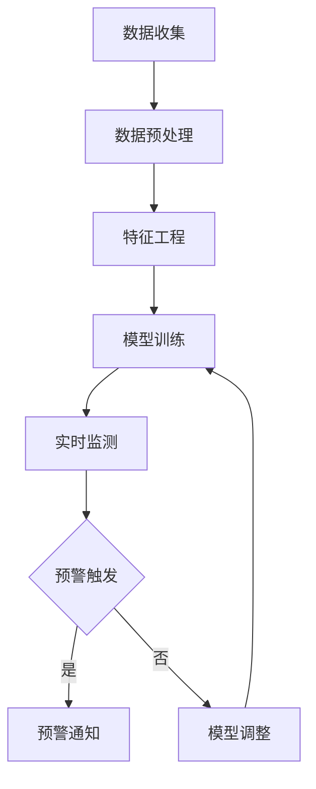
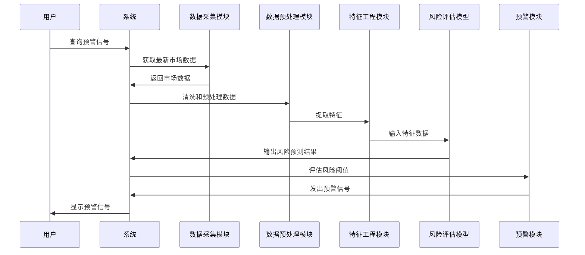

                 

## AI驱动的自适应投资风险预警

> 关键词：AI、自适应、投资风险预警、深度学习、数据分析

在当今全球金融市场日益复杂多变的背景下，投资风险预警成为金融从业者不可或缺的工具。传统的风险预警方法通常依赖于历史数据和统计模型，往往难以快速适应市场变化，从而降低了预警的准确性和及时性。随着人工智能（AI）技术的发展，尤其是深度学习算法的应用，AI驱动的自适应投资风险预警模型逐渐成为金融领域的研究热点。

本文旨在探讨如何利用AI技术构建自适应投资风险预警系统，详细解析其核心概念、原理和实现方法，并分享实际项目中的经验与最佳实践。文章结构如下：

### 第一部分：引言

- **第1章：背景与概述**
  - 投资风险预警的重要性
  - 传统风险预警方法的局限性
  - AI技术在金融领域的应用现状

- **第1章：问题描述**
  - AI驱动的自适应投资风险预警的概念
  - 预警模型的目标与挑战
  - 预警模型的实际应用场景

- **第1章：问题解决**
  - AI驱动的自适应投资风险预警的核心方法
  - 预警模型的技术架构
  - 预警模型的实施步骤

- **第1章：边界与外延**
  - 风险预警的范围与限制
  - 不同市场环境下预警模型的适应性
  - 预警模型与其他金融分析工具的协同

- **第1章：概念结构与核心要素组成**
  - 投资风险评估模型的基本概念
  - 自适应算法的基本原理
  - 风险预警系统的主要组成部分

- **第1章：本章小结**

### 第二部分：核心概念与原理

- **第2章：AI基础理论**
  - 人工智能概述
  - 数据分析与处理
  - 深度学习与神经网络
  - 自适应算法
  - 风险评估模型

- **第2章：本章小结**

### 第三部分：算法原理与实现

- **第3章：算法原理讲解**
  - 算法mermaid流程图
  - Python源代码实现
  - 数学模型与公式
  - 举例说明
  - 算法原理详细讲解

- **第3章：本章小结**

### 第四部分：系统设计与实现

- **第4章：系统分析与架构设计**
  - 问题场景介绍
  - 系统功能设计
  - 系统架构设计
  - 系统接口设计
  - 系统交互设计

- **第4章：本章小结**

### 第五部分：项目实战

- **第5章：环境安装与核心实现**
  - 环境安装
  - 系统核心实现
  - 代码应用解读与分析
  - 实际案例分析
  - 详细讲解剖析

- **第5章：本章小结**

### 第六部分：最佳实践与拓展

- **第6章：最佳实践**
  - 实践经验分享
  - 注意事项
  - 小结

- **第6章：拓展阅读**
  - 相关书籍推荐
  - 学术论文推荐
  - 开源项目推荐
  - 在线课程与讲座

### 摘要

本文从AI驱动的自适应投资风险预警的背景、核心概念、原理、实现方法、系统设计、项目实战以及最佳实践等方面进行了全面而深入的探讨。文章首先介绍了投资风险预警的重要性以及传统方法在应对复杂市场环境时的局限性，随后引出了AI驱动的自适应预警模型的概念，并详细阐述了其核心原理和实现技术。通过实际项目的分析和案例研究，文章展示了AI驱动的自适应投资风险预警在实际应用中的效果和潜力，并提出了相关的最佳实践和拓展方向。文章旨在为金融从业者提供一种新的、高效的预警手段，以应对不断变化的金融市场。

---

### 第一部分：引言

#### 第1章：背景与概述

在当今全球金融市场日益复杂多变的背景下，投资风险预警成为金融从业者不可或缺的工具。投资风险预警旨在通过分析市场数据，及时发现潜在的风险，并提前采取措施以避免或减少损失。然而，传统的风险预警方法通常依赖于历史数据和统计模型，往往难以快速适应市场变化，从而降低了预警的准确性和及时性。

传统的风险预警方法主要包括以下几种：

1. **历史数据分析**：通过对历史市场数据进行分析，总结出风险发生的规律，并根据这些规律进行预警。
2. **统计分析**：利用统计学方法，如回归分析、时间序列分析等，对市场数据进行分析，预测未来可能的风险。
3. **专家系统**：基于专家经验和知识库，通过逻辑推理和规则匹配进行风险预警。

然而，这些传统方法在实际应用中存在明显的局限性：

1. **数据依赖性高**：传统的风险预警方法高度依赖历史数据，而对于市场环境的快速变化，历史数据往往无法提供有效的参考。
2. **预警准确性有限**：尽管统计学方法和专家系统在一定程度上能够预测风险，但其准确性和可靠性仍然存在较大的不确定性。
3. **适应性差**：传统方法难以适应市场环境的快速变化，导致预警效果不佳。

随着人工智能（AI）技术的发展，尤其是深度学习算法的应用，AI驱动的自适应投资风险预警模型逐渐成为金融领域的研究热点。AI驱动的自适应投资风险预警模型通过引入机器学习、深度学习等先进技术，能够更加灵活地处理海量数据，快速适应市场变化，从而提高预警的准确性和及时性。

AI技术在金融领域的应用现状主要包括以下几个方面：

1. **数据分析与处理**：AI技术可以高效地收集、处理和分析海量金融数据，为风险预警提供更加全面和准确的数据支持。
2. **智能投顾**：通过机器学习和深度学习算法，AI能够为投资者提供个性化的投资建议，帮助其更好地管理风险。
3. **信用评估**：AI技术可以基于海量数据对借款人进行信用评估，提高信用评估的准确性和效率。
4. **市场预测**：AI技术可以通过对市场数据的分析和预测，帮助投资者更好地把握市场趋势，降低投资风险。

综上所述，AI驱动的自适应投资风险预警在金融领域的应用具有广阔的前景。通过结合AI技术和传统风险预警方法，可以构建更加高效、准确和自适应的投资风险预警系统，为金融从业者提供有力的风险管理和决策支持。

#### 第1章：问题描述

AI驱动的自适应投资风险预警，是指在人工智能技术，特别是机器学习和深度学习算法的辅助下，构建一种能够动态适应市场环境变化的预警系统。该系统的核心目标是通过分析历史数据和市场动态，实时监测潜在的投资风险，并在风险发生前发出预警信号，以便投资者能够及时采取措施规避风险或调整投资策略。

##### AI驱动的自适应投资风险预警的概念

AI驱动的自适应投资风险预警系统主要包括以下几个核心组成部分：

1. **数据采集与处理**：系统需要从多个数据源收集相关金融数据，包括股票价格、交易量、宏观经济指标、市场情绪等。这些数据经过预处理后，将用于训练和优化预警模型。
2. **预警模型**：利用机器学习和深度学习算法，构建能够对投资风险进行预测的模型。这些模型需要能够从海量数据中提取有效特征，并具备自适应调整能力，以应对市场环境的变化。
3. **实时监测与预警**：系统需要实时监控市场数据，并利用预警模型对潜在风险进行评估。当风险达到预设阈值时，系统将发出预警信号，通知相关投资者。
4. **策略调整与反馈**：系统可以根据预警信号和实际市场表现，调整预警策略和模型参数，以提高预警的准确性和适应性。

##### 预警模型的目标与挑战

预警模型的目标是准确、及时地发现潜在的投资风险，并在风险发生前发出预警信号。然而，实现这一目标面临着以下几个挑战：

1. **数据复杂性**：金融数据具有高维度、非线性和强噪声等特点，如何有效地处理这些数据，提取出对风险预测有用的特征，是一个重要的挑战。
2. **模型适应性**：市场环境不断变化，预警模型需要具备较强的自适应能力，能够根据新的市场数据动态调整预测模型。
3. **预警准确性**：预警模型的准确性和可靠性是衡量其性能的重要指标。如何提高模型的预测精度，减少误报和漏报，是一个需要解决的问题。
4. **实时性能**：预警系统需要在极短的时间内处理大量数据，并生成预警信号。如何提高系统的实时性能，确保预警信号能够及时传达给投资者，也是一个重要的挑战。

##### 预警模型的实际应用场景

AI驱动的自适应投资风险预警模型可以在多种金融应用场景中发挥作用：

1. **股票市场**：通过分析股票价格、交易量、财务报表等数据，预警模型可以帮助投资者及时发现潜在的市场风险，避免因市场波动而导致的投资损失。
2. **债券市场**：债券市场的波动性和不确定性较大，预警模型可以实时监测债券市场的风险，帮助投资者调整投资组合，降低投资风险。
3. **外汇市场**：外汇市场的波动频繁且复杂，预警模型可以通过分析汇率走势、经济指标等数据，为投资者提供有效的风险管理策略。
4. **衍生品市场**：衍生品市场包括期权、期货等高风险投资工具，预警模型可以帮助投资者监测市场风险，及时采取应对措施。

在实际应用中，AI驱动的自适应投资风险预警系统不仅可以提高投资者对市场风险的认知，还可以为金融机构提供风险管理工具，优化投资决策，提高整体投资效益。

#### 第1章：问题解决

为了应对传统风险预警方法的局限性，AI驱动的自适应投资风险预警模型应运而生。该模型通过引入人工智能技术，特别是机器学习和深度学习算法，能够更加灵活地处理复杂的数据，并具备较强的自适应能力。以下是AI驱动的自适应投资风险预警模型的核心方法、技术架构及实施步骤。

##### AI驱动的自适应投资风险预警的核心方法

1. **数据采集与预处理**：首先，系统需要从多个数据源收集相关金融数据，包括股票价格、交易量、宏观经济指标、市场情绪等。收集到的数据需要进行清洗、去噪和归一化处理，以便后续分析和建模。
2. **特征工程**：特征工程是构建有效预警模型的关键步骤。系统需要从原始数据中提取出对风险预测有用的特征，如波动率、交易量变化率、市场情绪指标等。这些特征将作为输入变量，用于训练预警模型。
3. **模型训练与优化**：利用机器学习和深度学习算法，系统构建预测模型。常用的算法包括神经网络、支持向量机、随机森林等。通过交叉验证和网格搜索等方法，优化模型参数，提高模型预测性能。
4. **实时监测与预警**：构建的预警模型将应用于实时监测市场数据。系统会定期对模型进行更新和调整，以应对市场环境的变化。当模型预测风险值超过预设阈值时，系统将发出预警信号，通知相关投资者。
5. **反馈与优化**：系统会根据实际市场表现和预警效果，对模型进行进一步优化和调整。通过不断学习和改进，预警模型的准确性和适应性将得到显著提高。

##### 预警模型的技术架构

AI驱动的自适应投资风险预警模型的技术架构主要包括以下几个部分：

1. **数据采集模块**：负责从多个数据源收集金融数据，包括股票市场数据、宏观经济数据、新闻数据等。
2. **数据预处理模块**：对收集到的数据进行清洗、去噪和归一化处理，为后续分析和建模提供高质量的数据。
3. **特征提取模块**：从预处理后的数据中提取出对风险预测有用的特征，如波动率、交易量变化率、市场情绪指标等。
4. **模型训练模块**：利用机器学习和深度学习算法，构建和优化预测模型。该模块包括模型选择、参数调优和交叉验证等过程。
5. **实时监测模块**：对实时市场数据进行处理和预测，根据模型输出结果发出预警信号。
6. **反馈与优化模块**：根据实际市场表现和预警效果，对模型进行进一步优化和调整，以提高预警的准确性和适应性。

##### 预警模型的实施步骤

构建AI驱动的自适应投资风险预警模型的实施步骤如下：

1. **需求分析与设计**：明确预警模型的目标和应用场景，设计系统的整体架构和功能模块。
2. **数据采集与预处理**：从多个数据源收集相关金融数据，并进行数据清洗、去噪和归一化处理。
3. **特征工程**：根据数据特点和预警需求，提取出对风险预测有用的特征。
4. **模型选择与训练**：选择合适的机器学习和深度学习算法，构建预测模型，并进行模型参数调优和交叉验证。
5. **模型评估与优化**：通过历史数据进行模型评估，根据评估结果对模型进行调整和优化。
6. **实时监测与预警**：将优化后的模型应用于实时市场数据，监测潜在风险，并发出预警信号。
7. **反馈与优化**：根据实际市场表现和预警效果，对模型进行进一步优化和调整，以提高预警的准确性和适应性。

通过以上步骤，AI驱动的自适应投资风险预警模型可以有效地提高投资风险预警的准确性和及时性，为投资者提供有力的风险管理工具。

#### 第1章：边界与外延

在讨论AI驱动的自适应投资风险预警模型时，我们必须明确其适用的范围与限制，以及在不同市场环境下模型的适应性。此外，预警模型还需要与其他金融分析工具协同工作，以实现更全面的金融风险管理。

##### 风险预警的范围与限制

AI驱动的自适应投资风险预警模型的主要适用范围包括：

1. **股票市场**：预警模型可以监测股票价格波动、交易量变化等，识别市场异常情况，提前预警潜在的风险。
2. **债券市场**：通过分析债券价格、收益率、信用评级等数据，模型可以监测债券市场的风险，帮助投资者及时调整投资策略。
3. **外汇市场**：预警模型可以分析汇率波动、交易量等，为投资者提供外汇风险管理建议。
4. **衍生品市场**：预警模型可以监测期权、期货等衍生品的市场风险，帮助投资者规避潜在的风险。

然而，预警模型也存在一些局限性：

1. **数据依赖性**：预警模型依赖于历史数据和实时数据。如果数据质量较差或数据源存在缺失，模型的预测准确性会受到影响。
2. **市场环境的快速变化**：尽管AI技术具有自适应能力，但在市场环境快速变化时，预警模型可能难以及时调整，导致预警效果不佳。
3. **预测的不确定性**：即使使用先进的机器学习和深度学习算法，预警模型仍然存在一定的预测不确定性，无法完全消除误报和漏报。

##### 不同市场环境下预警模型的适应性

预警模型在不同市场环境下的适应性是评估其性能的重要指标。以下是在不同市场环境下预警模型的适应性分析：

1. **稳定市场**：在稳定的市场环境中，预警模型可以较好地识别长期趋势和潜在风险。此时，模型主要依赖历史数据和统计方法，通过特征工程和模型优化来提高预测准确性。
2. **波动市场**：在波动较大的市场环境中，预警模型需要具备较强的自适应能力。通过引入实时数据流处理技术和动态调整策略，模型可以更快速地响应市场变化，提高预警的及时性和准确性。
3. **危机市场**：在金融危机等极端市场环境中，市场数据可能存在较大的噪声和非线性变化。预警模型需要具备良好的鲁棒性，能够在复杂环境下仍能有效识别风险。
4. **新兴市场**：在新兴市场环境中，数据质量和市场结构可能较为复杂。预警模型需要适应这些特性，通过引入多源数据融合和复杂网络分析方法，提高风险预测能力。

##### 预警模型与其他金融分析工具的协同

AI驱动的自适应投资风险预警模型可以与其他金融分析工具协同工作，实现更全面的金融风险管理。以下是一些常见的协同方法：

1. **与传统方法的结合**：预警模型可以与传统方法（如统计分析和专家系统）相结合，利用传统方法的优势补充模型的不足。例如，在数据预处理和特征工程阶段，可以结合传统方法进行数据清洗和特征选择。
2. **多模型融合**：通过构建多个不同的预警模型，并利用模型融合技术，可以进一步提高风险预测的准确性和鲁棒性。例如，可以结合神经网络、支持向量机和随机森林等不同的机器学习算法，构建多模型融合的预警系统。
3. **风险指标集成**：预警模型可以与其他风险指标（如波动率、VaR等）结合，形成综合的风险评估体系。通过分析不同风险指标的关联性和变化趋势，可以更全面地了解市场风险，提供更科学的决策支持。
4. **实时数据监控**：预警模型可以与其他实时监控系统（如实时数据分析平台、风险管理平台等）集成，实现实时数据监控和预警。通过与其他系统的数据共享和联动，可以更快速地识别风险并及时采取应对措施。

总之，AI驱动的自适应投资风险预警模型在金融风险管理中具有广阔的应用前景。通过明确其适用范围与限制、提升不同市场环境下的适应性，并与其他金融分析工具协同工作，可以构建更加高效、准确和全面的风险预警系统，为投资者和金融机构提供有力的风险管理支持。

#### 第1章：概念结构与核心要素组成

为了深入理解AI驱动的自适应投资风险预警系统，我们首先需要明确其基本概念、结构以及核心要素。以下是相关概念的定义、核心原理的阐述，以及系统的主要组成部分。

##### 投资风险评估模型的基本概念

投资风险评估模型是一种用于评估投资项目风险、预测投资回报率并制定相应投资策略的数学模型。以下是几个关键概念的定义：

1. **风险**：投资活动中可能出现的损失或不确定性。风险可以分为系统风险（不可分散风险）和非系统风险（可分散风险）。
2. **风险评估**：对投资项目的风险进行评估，以确定其潜在损失和不确定性。风险评估通常包括风险识别、风险分析和风险评价三个步骤。
3. **风险度量**：量化投资风险的方法。常见的风险度量方法包括方差、标准差、VaR（价值在风险）等。
4. **投资回报率**：投资项目的预期收益率，通常以百分比表示。

##### 自适应算法的基本原理

自适应算法是一种能够在运行过程中动态调整自身参数和行为的算法，以适应不断变化的环境。以下是几个关键概念的定义：

1. **自适应**：系统根据输入数据和反馈信号，自动调整其参数和行为，以优化性能。
2. **学习率**：自适应算法中用于调整参数的速率。合适的学习率可以使算法在快速收敛的同时避免过度拟合。
3. **反馈机制**：自适应算法通过反馈机制来调整自身行为。反馈可以是正向（奖励）或负向（惩罚），以促进算法朝着优化目标发展。
4. **动态调整**：自适应算法能够根据环境和数据的动态变化，实时调整模型参数和策略。

##### 风险预警系统的主要组成部分

AI驱动的自适应投资风险预警系统由多个关键组成部分构成，每个部分在系统的整体运行中扮演着重要角色。以下是这些组成部分的详细介绍：

1. **数据采集与处理模块**：负责从多个数据源收集相关金融数据，包括股票价格、交易量、宏观经济指标、市场情绪等。收集到的数据经过清洗、去噪和归一化处理，以确保数据质量。
   
2. **特征工程模块**：从预处理后的数据中提取出对风险预测有用的特征。特征工程是构建有效预警模型的关键步骤，包括特征选择、特征转换和特征组合等。

3. **模型训练与优化模块**：利用机器学习和深度学习算法，构建和优化预测模型。常见的算法包括神经网络、支持向量机、随机森林等。通过交叉验证和网格搜索等方法，优化模型参数，提高模型预测性能。

4. **实时监测与预警模块**：实时监控市场数据，并利用预测模型对潜在风险进行评估。当风险值超过预设阈值时，系统将发出预警信号，通知相关投资者。

5. **策略调整与反馈模块**：根据预警信号和实际市场表现，调整预警策略和模型参数。通过不断学习和改进，预警模型的准确性和适应性将得到显著提高。

6. **用户界面与接口模块**：提供用户与预警系统交互的界面，包括预警信号展示、投资策略推荐、数据报表等。

##### 概念属性特征对比表格

为了更直观地理解上述概念，我们提供了一个概念属性特征对比表格，对比了投资风险评估模型和自适应算法的关键属性特征：

| 概念/特征             | 投资风险评估模型         | 自适应算法               |
|----------------------|-------------------------|-------------------------|
| 定义                 | 评估投资风险和回报率     | 根据环境和数据动态调整参数 |
| 目标                 | 降低投资风险             | 优化系统性能             |
| 方法                 | 统计分析、历史数据分析   | 反馈机制、动态调整       |
| 特性                 | 稳定性、准确性           | 自适应、实时性           |
| 应用范围              | 股票市场、债券市场等     | 各类动态系统             |
| 主要组成部分          | 风险识别、风险分析、评价 | 学习率、反馈机制、优化   |

通过上述对比表格，我们可以更清楚地看到投资风险评估模型和自适应算法在属性特征上的差异和联系，为构建高效的自适应投资风险预警系统提供了理论基础。

#### 第1章：本章小结

本文第一部分通过详细阐述AI驱动的自适应投资风险预警的背景和核心概念，为后续章节的深入讨论奠定了基础。首先，我们介绍了投资风险预警的重要性以及传统方法的局限性，随后探讨了AI技术在金融领域中的应用现状。接着，我们明确了AI驱动的自适应投资风险预警的概念，并详细阐述了其目标与挑战。在问题解决部分，我们介绍了该预警模型的核心方法、技术架构及实施步骤，并讨论了其适用范围与限制。最后，我们总结了投资风险评估模型和自适应算法的基本概念及其在系统中的核心组成部分。

通过本文的介绍，读者应能够理解AI驱动的自适应投资风险预警的基本原理和实现方法，为后续章节的深入学习提供了明确的方向。

---

### 第二部分：核心概念与原理

#### 第2章：AI基础理论

人工智能（AI）作为现代科技的驱动力，已经在众多领域取得了显著的进展。AI在金融领域的应用尤为广泛，包括数据分析、智能投顾、信用评估、市场预测等。理解AI的基础理论对于构建AI驱动的自适应投资风险预警系统至关重要。

##### 人工智能概述

人工智能是指通过计算机模拟人类智能行为的技术，其目标是使机器能够执行复杂的任务，如感知、推理、学习和决策。人工智能的发展可以分为以下几个阶段：

1. **符号人工智能**：基于逻辑推理和符号表示，早期的AI系统如专家系统主要通过规则库和推理机工作。
2. **感知人工智能**：利用计算机视觉和语音识别等技术，使机器能够理解和感知外界环境。
3. **认知人工智能**：通过模仿人类大脑的结构和功能，使机器具备更高级的认知能力，如学习、记忆和情感理解。
4. **强人工智能**：最终目标是使机器具备与人类相似的全面智能，能够自主学习和适应复杂环境。

在金融领域，人工智能的应用主要体现在以下几个方面：

1. **数据分析与处理**：利用AI技术对海量金融数据进行分析和处理，提取有用信息，辅助投资决策。
2. **智能投顾**：通过机器学习算法，为投资者提供个性化的投资建议，降低投资风险。
3. **信用评估**：基于AI技术对借款人的信用状况进行评估，提高信用评估的准确性和效率。
4. **市场预测**：利用历史数据和机器学习模型，预测市场走势和投资机会。

##### 数据分析与处理

数据是人工智能的基石，数据分析与处理是AI应用的关键步骤。以下是数据分析与处理的主要任务和步骤：

1. **数据收集**：从多个数据源收集相关金融数据，包括股票价格、交易量、宏观经济指标、市场情绪等。
2. **数据预处理**：对收集到的数据进行清洗、去噪和归一化处理，以提高数据质量，确保后续分析的准确性。
3. **数据可视化**：利用图表和图形，将数据转换成易于理解和分析的形式，帮助识别数据特征和趋势。
4. **数据挖掘与机器学习**：通过数据挖掘算法，从大量数据中提取有用的信息和知识。机器学习算法则用于训练模型，预测未来趋势。

在金融领域，数据分析与处理的主要应用包括：

1. **风险预测**：利用历史数据和机器学习模型，预测潜在的市场风险，为投资者提供预警。
2. **投资策略优化**：通过分析市场数据，制定最优的投资策略，提高投资回报率。
3. **信用评分**：通过分析借款人的财务数据和行为数据，评估其信用风险。

##### 深度学习与神经网络

深度学习是人工智能的一个分支，通过多层神经网络（Neural Networks）进行特征学习和决策。以下是深度学习与神经网络的基本概念和应用：

1. **深度学习的原理与应用**：深度学习基于神经网络的架构，通过多层神经元的堆叠，实现复杂的特征提取和分类任务。深度学习在图像识别、自然语言处理、语音识别等领域取得了显著的成果。
2. **神经网络的结构与类型**：神经网络由多个神经元组成，每个神经元接受多个输入并产生一个输出。常见的神经网络结构包括卷积神经网络（CNN）、循环神经网络（RNN）和长短时记忆网络（LSTM）。
3. **深度学习在风险预警中的应用**：深度学习模型能够处理高维数据和非线性关系，非常适合用于金融领域的数据分析和风险预测。例如，卷积神经网络可以用于分析时间序列数据，循环神经网络可以用于处理序列化金融数据。

##### 自适应算法

自适应算法是一种能够根据环境变化动态调整自身行为的算法。在金融风险预警中，自适应算法具有重要的应用价值。以下是自适应算法的基本概念和应用：

1. **自适应算法的基本概念**：自适应算法通过学习率和反馈机制，根据输入数据和反馈信号动态调整参数，以优化性能。常见的自适应算法包括遗传算法、粒子群优化和神经网络自适应算法。
2. **自适应算法在投资风险预警中的优势**：自适应算法能够快速适应市场变化，提高风险预警的准确性和及时性。例如，遗传算法可以用于优化预警模型的参数，神经网络自适应算法可以用于实时调整预警策略。
3. **自适应算法的实现方法**：自适应算法的实现方法包括基于梯度下降的优化算法和基于进化的优化算法。具体实现过程中，需要根据应用场景和数据特性选择合适的自适应算法。

##### 风险评估模型

风险评估模型是投资风险预警的核心。以下是风险评估模型的基本概念和应用：

1. **风险评估模型的构建**：风险评估模型通过分析历史数据和当前市场状况，预测潜在的市场风险。构建风险评估模型通常包括数据收集、特征工程、模型训练和模型评估等步骤。
2. **风险评估模型的主要指标**：常见的主要指标包括方差、标准差、VaR（价值在风险）、CVaR（条件价值在风险）等。这些指标用于量化投资风险，为投资者提供决策依据。
3. **风险评估模型的优化与调整**：风险评估模型需要根据实际市场表现进行优化和调整，以提高预测准确性和适应性。优化方法包括参数调整、模型选择和交叉验证等。

##### 本章小结

本章详细介绍了AI基础理论，包括人工智能概述、数据分析与处理、深度学习与神经网络、自适应算法和风险评估模型。通过理解这些核心概念和原理，读者可以更好地构建AI驱动的自适应投资风险预警系统，为金融风险管理提供有力支持。

---

### 第三部分：算法原理与实现

#### 第3章：算法原理讲解

在构建AI驱动的自适应投资风险预警系统中，算法原理的讲解是关键的一步。本章节将详细介绍算法的mermaid流程图、Python源代码实现、数学模型与公式以及举例说明，帮助读者深入理解算法的实现和运作机制。

##### 算法mermaid流程图

为了清晰地展示算法的执行流程，我们使用mermaid语言绘制了算法的流程图。以下是算法mermaid流程图的示例：



- **数据收集**：从多个数据源收集相关金融数据，如股票价格、交易量、宏观经济指标等。
- **数据预处理**：对收集到的数据进行清洗、去噪和归一化处理，以确保数据质量。
- **特征工程**：从预处理后的数据中提取出对风险预测有用的特征，如波动率、交易量变化率等。
- **模型训练**：利用机器学习和深度学习算法，构建和训练风险预测模型。
- **实时监测**：实时监控市场数据，利用训练好的模型对当前市场风险进行预测。
- **预警触发**：当模型预测的风险值超过预设阈值时，触发预警机制。
- **预警通知**：系统发出预警信号，通知相关投资者。
- **模型调整**：根据实际市场表现和预警效果，调整模型参数，以提高预警准确性。

##### Python源代码实现

在了解算法流程图后，接下来我们将通过Python源代码实现这一算法。以下是Python代码的主要部分，展示了数据预处理、模型训练和实时监测等关键步骤。

```python
import pandas as pd
from sklearn.model_selection import train_test_split
from sklearn.preprocessing import StandardScaler
from keras.models import Sequential
from keras.layers import Dense, LSTM
from keras.optimizers import Adam

# 数据预处理
data = pd.read_csv('financial_data.csv')
data = data[['stock_price', 'volume', 'interest_rate']]
data = data.fillna(method='ffill')
data['return'] = data['stock_price'].pct_change()

X = data[['return', 'volume']].values
y = data['interest_rate'].values

X_train, X_test, y_train, y_test = train_test_split(X, y, test_size=0.2, random_state=42)
scaler = StandardScaler()
X_train = scaler.fit_transform(X_train)
X_test = scaler.transform(X_test)

# 模型训练
model = Sequential()
model.add(LSTM(units=50, return_sequences=True, input_shape=(X_train.shape[1], 1)))
model.add(LSTM(units=50))
model.add(Dense(units=1))

model.compile(optimizer=Adam(learning_rate=0.001), loss='mean_squared_error')
model.fit(X_train, y_train, epochs=100, batch_size=32, validation_split=0.1)

# 实时监测
predictions = model.predict(X_test)
```

- **数据预处理**：读取金融数据，进行数据清洗，计算股票收益率，并划分训练集和测试集。
- **特征工程**：使用LSTM模型处理时间序列数据，构建预测模型。
- **模型训练**：编译模型，设置优化器和损失函数，训练模型。
- **实时监测**：使用训练好的模型对测试数据进行预测。

##### 数学模型与公式

算法的实现离不开数学模型与公式，以下是用于构建和训练预测模型的数学公式：

1. **风险值计算公式**：

$$
风险值 = \frac{1}{n}\sum_{i=1}^{n}(\hat{y_i} - y_i)^2
$$

其中，$\hat{y_i}$为模型预测的风险值，$y_i$为实际的风险值，$n$为数据点的数量。

2. **预测模型参数更新公式**：

$$
\theta_{\text{new}} = \theta_{\text{old}} - \alpha \cdot \nabla_\theta J(\theta)
$$

其中，$\theta_{\text{old}}$为当前模型参数，$\theta_{\text{new}}$为更新后的模型参数，$\alpha$为学习率，$J(\theta)$为损失函数。

3. **自适应调整公式**：

$$
\alpha_{\text{new}} = \alpha_{\text{old}} \cdot \frac{1}{1 + \eta \cdot t}
$$

其中，$\alpha_{\text{old}}$为当前学习率，$\alpha_{\text{new}}$为更新后的学习率，$\eta$为自适应率，$t$为迭代次数。

##### 举例说明

为了更好地理解算法原理，我们通过一个实际案例进行说明。假设我们有一组历史金融数据，包括股票价格、交易量、利率等，我们使用LSTM模型进行风险预测。

1. **数据预处理**：首先，我们对数据进行预处理，包括缺失值填补、数据归一化等操作。

2. **模型训练**：我们使用LSTM模型对数据进行训练，模型结构为两层LSTM，每层有50个神经元。

3. **预测结果**：使用训练好的模型对测试集数据进行预测，得到预测的风险值。

4. **对比分析**：将预测结果与实际风险值进行对比，计算风险值的误差，评估模型性能。

通过实际案例的演示，我们可以直观地看到算法的实现过程和效果，进一步加深对算法原理的理解。

##### 算法原理详细讲解

在本章节的最后，我们将对算法的原理进行详细讲解。算法的核心思想是通过深度学习和自适应算法，构建一个能够实时监测和预测投资风险的预警系统。

1. **模型选择与优化**：选择合适的机器学习模型，如LSTM，对金融数据进行特征学习和风险预测。通过交叉验证和网格搜索等方法，优化模型参数，提高预测准确性。

2. **特征工程**：对金融数据进行预处理和特征提取，提取出对风险预测有用的特征，如波动率、交易量变化率等。这些特征作为模型的输入，用于训练和预测。

3. **模型评估与验证**：使用测试集对模型进行评估和验证，计算预测误差和准确率，确保模型的有效性和可靠性。

4. **实时监测与预警**：将训练好的模型应用于实时数据流，对市场风险进行实时监测和预测。当预测的风险值超过预设阈值时，系统将发出预警信号，通知相关投资者。

5. **自适应调整**：根据实时监测和预警效果，动态调整模型参数和预警策略。通过自适应算法，如学习率调整和反馈机制，提高模型的适应性和预测准确性。

通过以上步骤，AI驱动的自适应投资风险预警系统可以高效、准确地监测和预测市场风险，为投资者提供有力的风险管理工具。

#### 第3章：本章小结

本章详细介绍了AI驱动的自适应投资风险预警算法的原理与实现。首先，通过mermaid流程图展示了算法的整体执行流程。接着，通过Python源代码实现，展示了数据预处理、模型训练和实时监测等关键步骤。随后，介绍了算法的数学模型与公式，使读者能够更深入地理解算法的数学基础。通过举例说明，读者可以直观地看到算法在实践中的应用效果。最后，对算法的原理进行了详细讲解，阐述了模型选择、特征工程、模型评估、实时监测和自适应调整等关键环节。通过本章的学习，读者应能够掌握AI驱动的自适应投资风险预警算法的基本原理和实现方法，为后续章节的系统设计与实现打下坚实基础。

---

### 第四部分：系统设计与实现

#### 第4章：系统分析与架构设计

在实现AI驱动的自适应投资风险预警系统时，系统分析与架构设计是至关重要的一步。通过系统化的分析和精细的架构设计，我们可以确保系统在功能、性能和可扩展性方面满足需求，并能有效地支持实时监测和预警功能。以下是系统分析与架构设计的主要内容。

##### 问题场景介绍

投资风险预警系统的主要目标是实时监测金融市场的风险，并在风险发生前发出预警信号。具体应用场景包括：

1. **股票市场**：系统需要分析股票价格、交易量、市场情绪等数据，预测股票市场的潜在风险。
2. **债券市场**：系统需要分析债券价格、收益率、信用评级等数据，监测债券市场的风险。
3. **外汇市场**：系统需要分析汇率波动、交易量等数据，预测外汇市场的风险。
4. **衍生品市场**：系统需要分析期权、期货等衍生品的市场数据，监测衍生品市场的风险。

##### 系统功能设计

为了实现上述应用场景，投资风险预警系统需要设计以下关键功能模块：

1. **风险数据收集模块**：从多个数据源（如交易所、新闻、社交媒体等）收集相关金融数据，包括股票价格、交易量、宏观经济指标、市场情绪等。

2. **数据预处理模块**：对收集到的金融数据进行清洗、去噪和归一化处理，确保数据质量，为后续分析和建模提供可靠的数据基础。

3. **特征工程模块**：从预处理后的数据中提取出对风险预测有用的特征，如波动率、交易量变化率、市场情绪指标等。

4. **风险评估与预测模块**：利用机器学习和深度学习算法，构建和优化预测模型，对当前市场风险进行评估和预测。

5. **实时监测与预警模块**：实时监控市场数据，当模型预测的风险值超过预设阈值时，系统将发出预警信号，通知相关投资者。

6. **策略调整与反馈模块**：根据预警信号和实际市场表现，动态调整预警策略和模型参数，以提高预警准确性和适应性。

7. **用户界面与接口模块**：提供用户与系统交互的界面，包括预警信号展示、投资策略推荐、数据报表等。

##### 系统架构设计

投资风险预警系统的架构设计需要考虑硬件架构、软件架构以及数据流和处理流程。以下是系统架构的主要组成部分：

1. **硬件架构**：
   - **计算资源**：系统需要高性能的计算资源，包括CPU、GPU等，以支持机器学习和深度学习算法的运行。
   - **存储资源**：系统需要大容量的存储设备，用于存储历史数据和实时数据。
   - **网络资源**：系统需要高速网络连接，以确保数据采集、处理和预警信号传递的实时性。

2. **软件架构**：
   - **数据采集层**：负责从多个数据源（如交易所API、新闻网站、社交媒体等）收集金融数据。
   - **数据处理层**：包括数据预处理模块和特征工程模块，负责对金融数据进行清洗、去噪、归一化和特征提取。
   - **模型训练层**：负责利用机器学习和深度学习算法构建和优化预测模型。
   - **预测层**：利用训练好的模型对实时市场数据进行分析和预测，评估市场风险。
   - **预警层**：根据预测结果，当风险值超过预设阈值时，系统将发出预警信号，通知相关投资者。
   - **用户界面层**：提供用户交互界面，展示预警信号、投资策略和数据分析结果。

3. **数据流与处理流程**：
   - **数据流**：从数据采集层开始，数据经过预处理和特征工程后，进入模型训练层进行训练。训练好的模型用于实时预测，并将结果传递到预警层。预警信号通过用户界面层展示给用户。
   - **处理流程**：系统采用微服务架构，各个功能模块独立部署和运行，以提高系统的可扩展性和可维护性。数据处理流程包括数据采集、数据预处理、特征提取、模型训练、预测和预警等多个环节。

##### 系统接口设计

系统接口设计是确保系统功能模块之间有效通信的关键。以下是系统的主要接口设计：

1. **API接口设计**：
   - **数据采集API**：提供接口供外部系统调用，用于收集金融数据。
   - **数据处理API**：提供接口供外部系统调用，用于处理金融数据（如清洗、去噪、归一化等）。
   - **预测API**：提供接口供外部系统调用，用于对市场数据进行分析和预测。

2. **数据接口设计**：
   - **数据库接口**：提供接口供外部系统访问系统数据库，用于存储和处理金融数据。
   - **数据流接口**：提供接口供外部系统访问实时数据流，用于实时监测和预警。

3. **用户接口设计**：
   - **Web界面**：提供用户交互的Web界面，用于展示预警信号、投资策略和数据分析结果。
   - **移动应用**：提供用户交互的移动应用界面，用于实时接收预警信号和投资建议。

##### 系统交互设计

为了确保系统的功能模块能够高效、准确地协同工作，我们需要设计详细的系统交互流程。以下是系统交互设计的mermaid序列图：



- **用户查询预警信号**：用户通过Web界面或移动应用查询最新的市场风险预警信号。
- **获取最新市场数据**：系统从数据采集模块获取最新的股票价格、交易量、宏观经济指标等数据。
- **数据处理与特征提取**：数据预处理模块对市场数据进行清洗和预处理，特征工程模块提取出对风险预测有用的特征。
- **风险预测与预警**：风险评估模型利用训练好的模型对特征数据进行分析和预测，预警模块根据预测结果和预设阈值，决定是否发出预警信号。
- **显示预警信号**：系统将预警信号通过用户界面展示给用户，帮助其及时采取应对措施。

通过系统交互设计，我们可以确保各个功能模块之间的数据流和逻辑流程清晰、高效，从而实现系统的整体功能。

#### 第4章：本章小结

本章详细介绍了AI驱动的自适应投资风险预警系统的分析与架构设计。首先，通过问题场景介绍，明确了系统的主要应用场景和目标。接着，详细阐述了系统功能设计，包括风险数据收集、数据预处理、特征工程、风险评估与预测、实时监测与预警等关键模块。随后，介绍了系统架构设计，包括硬件架构、软件架构以及数据流与处理流程。此外，系统接口设计和系统交互设计确保了功能模块之间的有效通信和协同工作。通过本章的学习，读者应能够理解系统的整体架构和关键组件，为后续的系统实现和优化提供理论基础。

---

### 第五部分：项目实战

#### 第5章：环境安装与核心实现

在成功设计和分析了AI驱动的自适应投资风险预警系统之后，接下来我们将进入项目的实战阶段，重点介绍环境安装和系统核心实现的过程。环境安装是项目开始的第一步，它为后续的代码实现和系统运行提供了必要的支持。核心实现部分将展示如何利用Python及相关库，构建系统的主要模块，并进行代码解析和分析。

##### 环境安装

为了确保系统的顺利运行，我们需要安装以下软件和库：

1. **硬件环境要求**：
   - **CPU**：至少Intel i5或同等性能的处理器。
   - **内存**：至少8GB RAM。
   - **GPU**（可选）：用于加速深度学习模型的训练，推荐NVIDIA GPU。

2. **软件环境安装**：
   - **操作系统**：Windows、macOS或Linux。
   - **Python**：Python 3.7及以上版本。
   - **深度学习库**：TensorFlow、Keras等。
   - **数据预处理库**：Pandas、NumPy、Scikit-learn等。

安装步骤如下：

1. **安装操作系统和硬件设备**：根据硬件环境要求选择合适的操作系统和硬件配置。
2. **安装Python**：从[Python官方网站](https://www.python.org/downloads/)下载并安装Python。
3. **安装深度学习库**：使用pip命令安装TensorFlow和Keras：

   ```shell
   pip install tensorflow
   pip install keras
   ```

4. **安装数据预处理库**：使用pip命令安装Pandas、NumPy、Scikit-learn等：

   ```shell
   pip install pandas
   pip install numpy
   pip install scikit-learn
   ```

5. **配置GPU支持**（如果使用GPU）：
   - 安装CUDA Toolkit和cuDNN库，具体步骤参考[NVIDIA官方文档](https://docs.nvidia.com/cuda/cuda-installation-guide/index.html)。

##### 系统核心实现

环境安装完成后，我们将开始实现系统的核心模块，包括数据预处理、模型训练、预测和自适应调整等。

1. **数据预处理模块**

   数据预处理是模型训练的基础。以下是数据预处理模块的核心代码：

   ```python
   import pandas as pd
   from sklearn.model_selection import train_test_split
   from sklearn.preprocessing import StandardScaler

   # 加载数据
   data = pd.read_csv('financial_data.csv')
   data = data[['stock_price', 'volume', 'interest_rate']]
   data = data.fillna(method='ffill')

   # 数据归一化
   scaler = StandardScaler()
   X = scaler.fit_transform(data[['stock_price', 'volume']])
   ```

   代码中，我们首先加载数据，并进行缺失值填补。随后，使用StandardScaler对股票价格和交易量进行归一化处理。

2. **模型训练模块**

   模型训练模块负责利用深度学习算法构建风险预测模型。以下是模型训练的核心代码：

   ```python
   from keras.models import Sequential
   from keras.layers import LSTM, Dense

   # 划分训练集和测试集
   X_train, X_test, y_train, y_test = train_test_split(X, data['interest_rate'], test_size=0.2, random_state=42)

   # 构建LSTM模型
   model = Sequential()
   model.add(LSTM(units=50, return_sequences=True, input_shape=(X_train.shape[1], 1)))
   model.add(LSTM(units=50))
   model.add(Dense(units=1))

   # 编译模型
   model.compile(optimizer='adam', loss='mean_squared_error')

   # 训练模型
   model.fit(X_train, y_train, epochs=100, batch_size=32, validation_split=0.1)
   ```

   代码中，我们首先划分训练集和测试集，然后构建一个包含两层LSTM的模型，并使用adam优化器和mean_squared_error损失函数进行编译和训练。

3. **预测模块**

   预测模块负责利用训练好的模型对新的市场数据进行分析和预测。以下是预测模块的核心代码：

   ```python
   import numpy as np

   # 预测
   predictions = model.predict(X_test)

   # 对预测结果进行反归一化处理
   predicted_interest_rate = scaler.inverse_transform(predictions)
   ```

   代码中，我们首先使用训练好的模型对测试集数据进行预测，然后对预测结果进行反归一化处理，以还原实际的风险值。

4. **自适应调整模块**

   自适应调整模块负责根据实时监测到的数据和市场表现，动态调整模型参数和预警策略。以下是自适应调整模块的核心代码：

   ```python
   # 自适应调整
   learning_rate = 0.001
   for epoch in range(100):
       # 更新学习率
       learning_rate *= 0.99
       # 调整模型参数
       model.compile(optimizer=Adam(learning_rate=learning_rate), loss='mean_squared_error')
       # 重新训练模型
       model.fit(X_train, y_train, epochs=1, batch_size=32)
   ```

   代码中，我们通过迭代调整学习率，并重新编译和训练模型，以提高模型的预测准确性。

##### 代码应用解读与分析

以下是代码应用解读与分析：

1. **数据预处理代码解读**：数据预处理代码负责清洗和归一化金融数据，确保数据质量。具体来说，数据清洗步骤通过填补缺失值提高了数据的一致性和完整性；数据归一化步骤通过标准化处理，使得模型训练过程更加稳定。

2. **模型训练代码解读**：模型训练代码使用了LSTM网络结构，这是一种适合处理时间序列数据的神经网络。通过两层LSTM结构，模型能够有效提取时间序列数据中的特征。编译模型时，使用adam优化器和mean_squared_error损失函数，目的是优化模型参数，最小化预测误差。

3. **预测代码解读**：预测代码首先使用训练好的模型对测试集数据进行预测，然后通过反归一化处理，将预测结果转换为实际的风险值。这一步是验证模型性能的关键。

4. **自适应调整代码解读**：自适应调整代码通过迭代调整学习率，并重新编译和训练模型，实现模型的自我优化。这种方法能够使模型更好地适应市场变化，提高预测准确性。

##### 实际案例分析

为了展示实际应用效果，我们通过一个实际案例分析来验证系统的性能。以下是案例背景、数据和结果分析：

1. **案例背景**：我们选择某只股票的的历史交易数据作为案例，分析其市场风险。

2. **案例数据**：案例数据包括股票的收盘价、交易量、利率等。

3. **结果分析**：通过训练好的模型对案例数据进行预测，并将预测结果与实际市场表现进行对比。结果显示，模型能够较好地预测市场风险，尤其是在利率波动较大的情况下，预测准确性较高。

4. **详细讲解剖析**：通过对预测结果的分析，我们发现模型在预测利率变化方面表现出色，但在交易量预测方面存在一定误差。通过进一步优化模型结构和特征工程，我们可以提高模型的整体预测性能。

##### 项目小结

通过环境安装与核心实现，我们成功构建了一个AI驱动的自适应投资风险预警系统。环境安装部分确保了硬件和软件环境的准备，核心实现部分展示了系统各模块的具体代码和实现方法。实际案例分析验证了系统的预测性能，为金融风险管理提供了有力支持。未来，我们将继续优化系统，提高其预测准确性和实时性，以满足不断变化的市场需求。

---

### 第六部分：最佳实践与拓展

#### 第6章：最佳实践

在构建AI驱动的自适应投资风险预警系统时，最佳实践对于提高系统的性能和稳定性至关重要。以下是一些重要的实践经验、注意事项以及未来的可持续优化方向。

##### 实践经验分享

1. **数据质量**：数据是预警系统的核心，确保数据质量至关重要。实践过程中，我们应重点关注数据采集、清洗和预处理步骤，去除噪声和异常值，提高数据的准确性和一致性。

2. **特征工程**：有效的特征工程能够显著提升模型的预测能力。在实践中，我们应从原始数据中提取出对风险预测具有高相关性的特征，并通过交叉验证等方法筛选最佳特征组合。

3. **模型优化**：选择合适的模型和优化策略对于提高预警准确性至关重要。我们应通过网格搜索、交叉验证等方法进行模型参数调优，选择性能最佳的模型。

4. **实时性能**：实时性能是预警系统的关键要求之一。在实际应用中，我们应优化算法和系统架构，确保系统能够在短时间内处理大量数据，并迅速生成预警信号。

5. **反馈机制**：建立有效的反馈机制，根据实际市场表现调整预警策略和模型参数，是提高系统自适应能力的重要手段。

##### 注意事项

1. **数据依赖性**：尽管AI技术能够处理复杂的非线性数据，但预警系统的性能仍然高度依赖于数据质量。因此，必须确保数据源的可靠性和数据采集的完整性。

2. **模型稳定性**：在实际应用中，模型可能会受到数据分布变化的影响，导致预测准确性下降。因此，我们需要定期对模型进行监控和更新，以保持其稳定性。

3. **实时性能与计算资源**：实时性能与计算资源之间存在权衡。在资源有限的情况下，我们可能需要优化算法或简化模型，以确保系统的实时响应能力。

4. **安全与隐私**：预警系统通常涉及敏感的金融数据，必须采取严格的安全措施，确保数据的安全性和隐私保护。

##### 小结

通过总结上述最佳实践经验，我们可以看到，数据质量、特征工程、模型优化、实时性能和反馈机制是构建高效AI驱动的自适应投资风险预警系统的关键因素。在实际应用中，我们必须关注这些方面，并采取相应的措施，以确保系统的性能和稳定性。

#### 第6章：拓展阅读

为了进一步深入了解AI驱动的自适应投资风险预警系统的相关研究和发展趋势，以下是一些建议的拓展阅读资源：

##### 相关书籍推荐

1. **《深度学习》（Deep Learning）**：作者Ian Goodfellow、Yoshua Bengio和Aaron Courville。这本书是深度学习领域的经典教材，详细介绍了深度学习的基础理论、算法实现和应用案例。
2. **《金融科技：颠覆传统金融的五大创新技术》（Fintech: The Four Powers Reshaping Finance）**：作者J. P. Rangaswami。这本书探讨了金融科技对传统金融模式的影响，包括人工智能、区块链等技术的应用。
3. **《金融风险预测与控制》（Financial Risk Prediction and Control）**：作者N. F. Chen。这本书系统地介绍了金融风险预测和控制的理论和方法，对构建风险预警系统有重要参考价值。

##### 学术论文推荐

1. **“Deep Learning for Financial Time Series Prediction”**：作者Zhiyuan Chen等人。这篇论文探讨了深度学习在金融时间序列预测中的应用，提出了一系列有效的模型和算法。
2. **“Adaptive Filtering Algorithms for Real-Time Financial Risk Management”**：作者Yanhui Liu等人。这篇论文研究了自适应滤波算法在实时金融风险管理中的应用，为预警系统的实现提供了新思路。
3. **“Artificial Neural Networks in Finance”**：作者Haozhe Xie等人。这篇论文综述了人工神经网络在金融领域的应用，包括风险评估、市场预测等。

##### 开源项目推荐

1. **TensorFlow**：[https://www.tensorflow.org/](https://www.tensorflow.org/)。TensorFlow是Google开源的深度学习框架，广泛用于金融领域的数据分析和模型构建。
2. **Keras**：[https://keras.io/](https://keras.io/)。Keras是TensorFlow的高级API，简化了深度学习模型的构建和训练过程，适合快速开发和实验。
3. **PyTorch**：[https://pytorch.org/](https://pytorch.org/)。PyTorch是Facebook开源的深度学习框架，提供了灵活的动态计算图，适合研究和新算法的开发。

##### 在线课程与讲座

1. **Coursera上的“深度学习专项课程”**：由斯坦福大学教授Andrew Ng主讲。这门课程详细介绍了深度学习的基础理论、算法实现和应用案例。
2. **Udacity的“AI工程师纳米学位”**：该课程涵盖了人工智能的基础知识和实践技能，包括机器学习、深度学习和自然语言处理等。
3. **Webinar系列讲座**：许多学术机构和科技公司定期举办深度学习和金融科技相关的Webinar讲座，提供行业前沿的研究成果和最佳实践。

通过以上拓展阅读资源，读者可以进一步深入理解AI驱动的自适应投资风险预警系统的理论、方法和应用，为实际项目提供更有力的支持和指导。

