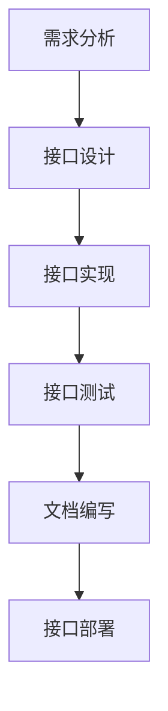
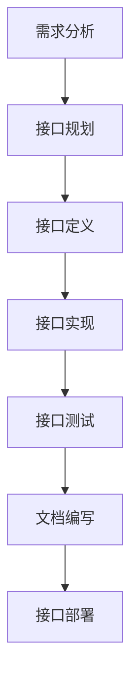
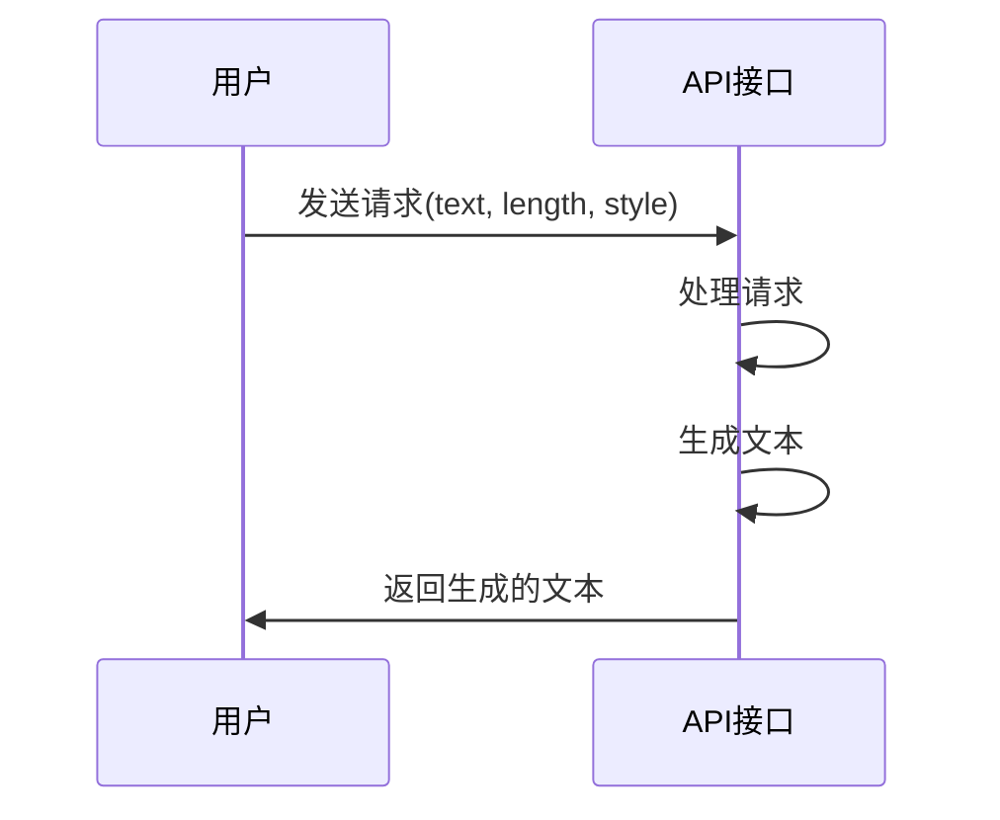
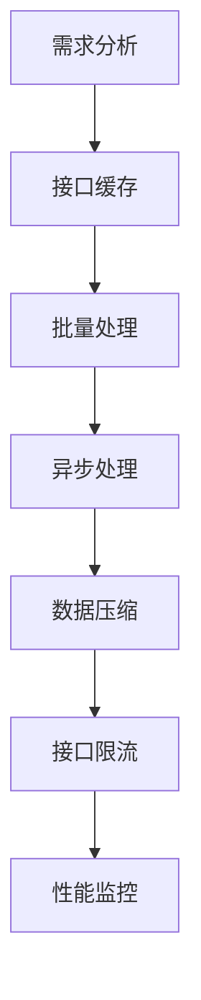
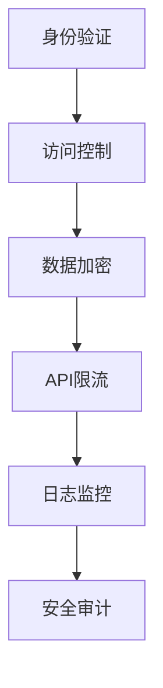
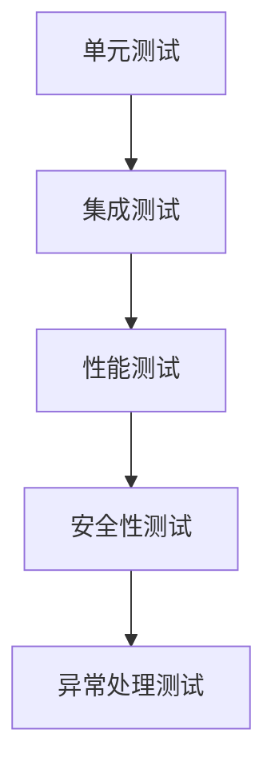

                 

## 引言与背景

### 1.1 研究背景与意义

在当今快速发展的数字化时代，人工智能（AI）已经成为推动各行各业变革的重要力量。特别是在自然语言处理（NLP）领域，大型语言模型（LLM）如BERT、GPT等取得了显著的成果，为文本生成、机器翻译、问答系统等提供了强大的技术支持。然而，随着LLM应用场景的不断扩展，如何提高这些应用的灵活性成为一个亟待解决的问题。

传统的软件开发模式往往以代码优先，这种方式虽然在一定程度上能够满足需求，但在面对复杂的应用场景时，存在一定的局限性。首先，传统的代码优先策略往往在需求变更时难以快速响应，导致开发周期延长、成本增加。其次，代码优先策略在接口设计时往往注重实现细节，忽视了接口的通用性和灵活性，导致后续扩展和维护困难。最后，代码优先策略在项目初期对用户体验的考虑不足，可能导致上线后的应用不符合用户预期。

为了解决这些问题，API-First策略应运而生。API-First策略强调在软件开发过程中，首先设计并实现一套灵活、可扩展的API接口，然后再根据这些API进行具体的业务逻辑开发。这种策略不仅能够提高开发效率，还能够提高系统的可维护性和扩展性。具体来说，API-First策略具有以下几个显著优势：

1. **提高灵活性**：通过API设计，可以在不修改内部代码的情况下，快速响应需求变更，从而提高系统的灵活性。
2. **降低耦合度**：API接口的设计使得各个模块之间解耦，有利于后续的功能扩展和系统重构。
3. **提升用户体验**：API-First策略在项目初期就充分考虑用户体验，能够更好地满足用户需求。
4. **促进协作开发**：API接口的明确性使得开发团队之间的协作更加顺畅，有利于项目的顺利推进。

因此，研究和应用API-First策略，对于提高LLM应用的灵活性具有重要意义。本文将从API-First策略的定义、核心原则、应用场景、设计与实现、安全性保障、文档与测试等方面进行深入探讨，以期为LLM应用开发提供有益的指导。

### 1.2 研究现状与问题分析

目前，API-First策略在多个领域得到了广泛应用，尤其在金融、电商、物联网等行业中，许多大型企业已经将API-First作为其开发模式的核心。然而，尽管API-First策略在提高系统灵活性、降低耦合度等方面展现了巨大的潜力，但在实际应用中仍存在一些亟待解决的问题。

首先，从技术层面来看，API-First策略对开发人员的要求较高。API设计需要具备一定的专业知识和经验，包括接口设计原则、数据模型设计、API性能优化等。此外，API-First策略要求在项目初期就要对整个系统的架构和接口进行详细规划，这无疑增加了项目的复杂性和开发难度。

其次，在实施过程中，API-First策略往往面临接口变更频繁的问题。由于API接口在设计时需要考虑系统的灵活性和可扩展性，因此在项目开发过程中，接口可能会频繁变更。这种频繁的变更不仅增加了开发工作量，还可能导致接口不统一、不一致，从而影响系统的稳定性。

再次，API-First策略对团队的协作能力提出了更高的要求。API接口的设计和实现需要开发团队之间的紧密协作，否则容易出现接口设计不合理、实现不一致等问题。此外，API-First策略要求在项目初期就明确接口规范和标准，这对团队的沟通能力和文档编写能力提出了更高的要求。

最后，从用户层面来看，API-First策略在提升用户体验方面仍存在一定的局限性。虽然API接口的设计考虑了系统的灵活性和可扩展性，但用户在使用过程中仍可能遇到一些不便，例如接口文档不够详细、API调用失败等原因。这些问题可能会影响用户的体验，从而对系统的推广和使用造成一定的影响。

总之，尽管API-First策略在提高LLM应用的灵活性方面具有显著优势，但在实际应用中仍存在一些技术和管理上的挑战。如何解决这些问题，提高API-First策略的有效性和可行性，成为当前研究和实践的重要方向。本文将在后续章节中详细探讨API-First策略的核心原则、应用方法、设计实现等方面，以期提出有效的解决方案。

### 1.3 API-First策略的重要性

API-First策略的重要性在于它从根本上改变了软件开发的思维方式，使得系统设计更加灵活、可扩展，从而更好地满足不断变化的需求。首先，从开发角度来说，API-First策略强调在项目初期就明确接口规范，这有助于确保各个模块之间的解耦，降低系统的复杂性。通过清晰定义API接口，开发团队可以更加专注于实现具体的业务逻辑，而不是纠结于底层的接口设计，从而提高开发效率和代码质量。

其次，从运维角度来说，API-First策略极大地简化了系统的维护和扩展工作。由于接口设计时已经充分考虑了系统的灵活性和可扩展性，因此在面对新的需求或变更时，只需对API接口进行调整，而无需修改底层代码。这种设计思想使得系统的维护工作更加高效，降低了运维成本。

再次，从用户体验角度来说，API-First策略在项目初期就充分考虑了用户的实际需求，从而能够更好地满足用户的期望。通过明确、详细的API接口文档，用户可以更加方便地使用系统提供的功能，减少了使用过程中的困扰。此外，API-First策略还支持自定义接口，使得系统可以更好地适应不同的用户场景，提高用户体验。

最后，从团队协作角度来看，API-First策略要求在项目初期就明确接口规范和标准，这有助于提高团队之间的协作效率。明确的接口规范减少了团队成员之间的沟通成本，使得开发工作更加顺畅。同时，API-First策略还促进了团队成员之间的知识共享，提高了整体团队的技术水平。

综上所述，API-First策略在提高LLM应用的灵活性、降低系统复杂性和维护成本、提升用户体验以及促进团队协作等方面具有显著优势。因此，研究和应用API-First策略对于推动LLM应用的发展具有重要意义。

### 1.4 核心概念术语说明

在本文中，我们将使用一系列核心概念和术语，这些概念和术语是理解和应用API-First策略的基础。以下是对这些概念和术语的详细解释：

**API（Application Programming Interface）**：API是一组定义良好的协议和工具，用于允许不同软件应用程序之间的交互和数据交换。API通常包括函数、对象、方法、协议和数据结构等，它们为开发者提供了访问特定软件功能或服务的接口。

**LLM（Large Language Model）**：LLM是指大型语言模型，如BERT、GPT等，它们通过学习大量的文本数据来理解自然语言的语义和结构，从而实现文本生成、翻译、问答等功能。

**API-First Strategy**：API-First策略是一种软件开发方法，它强调在项目初期就设计并实现一套灵活、可扩展的API接口，然后根据这些API进行具体的业务逻辑开发。这种策略有助于提高系统的灵活性、降低耦合度、提升用户体验和促进团队协作。

**API Design Principles**：API设计原则是一组指导设计良好API的规则和最佳实践，包括接口命名、数据格式、异常处理、版本控制等方面。

**API Implementation**：API实现是指根据API设计原则和需求，将API接口转化为具体的代码实现过程。实现过程需要考虑性能优化、安全性、可扩展性等方面。

**API Documentation**：API文档是对API接口的详细描述，包括接口描述、请求和响应格式、参数说明、示例代码等。良好的API文档是确保开发者能够正确使用API的关键。

**API Testing**：API测试是验证API接口功能、性能和稳定性的过程。测试包括单元测试、集成测试、压力测试等，以确保API能够满足预期的要求。

**API Security**：API安全是指保护API接口免受攻击、数据泄露和其他安全威胁的措施。包括身份验证、授权、数据加密、API限流等方面。

通过了解这些核心概念和术语，读者可以更好地理解API-First策略的应用场景、优势和挑战，为后续章节的内容打下坚实的基础。

### 1.5 问题边界与外延

在深入探讨API-First策略之前，我们需要明确问题边界与外延，以确保讨论的全面性和针对性。首先，API-First策略主要适用于需要高灵活性、高可扩展性的系统，特别是那些涉及到复杂业务逻辑和频繁需求变更的场景。例如，在金融、电商、物联网等领域，系统需要快速适应市场变化和用户需求，因此API-First策略具有显著优势。

然而，API-First策略并不适用于所有场景。对于一些需求相对稳定、系统复杂性较低的应用，如简单的内部管理系统或工具类应用，API-First策略可能显得过于复杂，导致开发成本增加。此外，在资源受限的环境下，如一些嵌入式系统或实时系统，API-First策略可能无法满足实时性能要求。

在讨论API-First策略时，我们还应关注其与其他软件开发方法的关系。虽然API-First强调接口优先，但并不意味着完全抛弃传统的开发模式。实际上，API-First策略可以与敏捷开发、微服务架构等现代开发方法相结合，形成一套完整的开发流程，从而充分发挥其优势。

此外，API-First策略还涉及多个关键环节，包括需求分析、接口设计、代码实现、测试和部署等。每一个环节都需要精心规划和管理，以确保API接口的质量和系统的稳定性。因此，理解和应用API-First策略需要全面、系统地考虑多个方面，而不仅仅是关注接口设计本身。

总之，在探讨API-First策略时，我们需要明确其适用范围、与其他开发方法的关系以及关键环节，从而确保讨论的全面性和实用性。

### 1.6 概念结构与核心要素组成

为了深入理解API-First策略，我们需要从概念结构的角度分析其核心要素。API-First策略不仅是一种软件开发方法，更是一种系统架构设计理念，其核心要素包括需求分析、接口设计、代码实现、测试与部署等。

**1.6.1 需求分析**

需求分析是API-First策略的基础，其目标是为系统的功能需求、性能需求、安全性需求等提供明确、详细的描述。在需求分析阶段，开发团队需要与用户、产品经理等利益相关者进行充分沟通，了解实际业务场景和用户需求。具体步骤包括：

- **业务场景梳理**：通过访谈、观察、竞品分析等方法，了解业务场景和用户行为。
- **功能需求识别**：明确系统需要实现的功能点，如文本生成、机器翻译、问答系统等。
- **性能需求分析**：根据业务需求，确定系统的响应时间、吞吐量、并发处理能力等性能指标。
- **安全性需求**：识别系统的潜在安全威胁，包括数据泄露、非法访问等，并制定相应的安全策略。

**1.6.2 接口设计**

接口设计是API-First策略的核心环节，其目标是设计一套灵活、可扩展的API接口，以满足系统的功能需求。接口设计需要遵循以下原则：

- **简洁性**：接口命名简洁直观，避免冗余和模糊。
- **一致性**：接口命名和风格保持一致，便于开发者理解和使用。
- **灵活性**：接口设计考虑未来的扩展性和变化，支持自定义参数和动态调用。
- **安全性**：接口设计应包含身份验证、授权等安全机制，确保数据传输安全。

接口设计包括以下步骤：

- **接口规划**：根据需求分析结果，确定API接口的数量、类型和用途。
- **接口定义**：详细描述每个接口的功能、参数、返回值和异常处理。
- **接口文档**：编写详细的API文档，包括接口描述、请求和响应格式、示例代码等。

**1.6.3 代码实现**

代码实现是根据接口设计将API接口转化为具体的代码实现。在实现过程中，需要遵循以下原则：

- **模块化**：将代码划分为多个模块，每个模块实现一个具体的接口功能。
- **可扩展性**：设计灵活的代码架构，支持未来的功能扩展和代码重构。
- **性能优化**：关注接口的性能，包括响应时间、内存占用、CPU使用率等。
- **安全性**：确保代码实现过程中遵循安全最佳实践，防范潜在的安全威胁。

代码实现包括以下步骤：

- **接口实现**：根据接口定义，编写具体的代码实现。
- **代码审查**：进行代码审查，确保代码质量、规范和安全性。
- **单元测试**：编写单元测试，验证接口功能的正确性。

**1.6.4 测试与部署**

测试与部署是确保API接口质量和系统稳定性的关键环节。测试包括单元测试、集成测试、压力测试等多种类型，其目标是发现并修复接口实现中的问题。部署是将系统上线，使其对外提供服务。

- **单元测试**：编写单元测试，验证接口功能的正确性。
- **集成测试**：测试不同模块之间的接口交互，确保系统的整体功能符合预期。
- **压力测试**：模拟高并发场景，测试系统的性能和稳定性。

部署包括以下步骤：

- **环境准备**：搭建开发、测试、生产等不同环境，确保系统在不同环境下的稳定运行。
- **代码部署**：将代码部署到服务器，进行上线准备。
- **上线监控**：监控系统运行状态，及时处理上线过程中的问题。

通过以上核心要素的分析，我们可以更好地理解API-First策略的系统架构和实现过程，为后续章节的深入探讨打下坚实基础。

### 1.7 核心概念原理

在本节中，我们将详细探讨API-First策略的核心概念原理，包括其基本原理、关键属性特征对比以及在实际应用中的实现方法。

#### 1.7.1 基本原理

API-First策略的核心思想是将API接口设计作为软件开发的首要任务，通过定义清晰、规范的API接口来指导后续的开发过程。其基本原理可以概括为以下几点：

1. **接口先行**：在项目启动阶段，首先设计并实现API接口，而不是直接编写业务逻辑代码。
2. **分离关注点**：通过API接口将业务逻辑与外部系统、前端应用等解耦，使系统各部分能够独立开发、测试和部署。
3. **灵活扩展**：API接口设计考虑未来的扩展性和变化，支持自定义参数和动态调用，使得系统能够快速适应需求变更。
4. **可重用性**：良好的API接口设计可以使得接口在不同模块、项目之间重用，提高开发效率。
5. **规范化**：API接口设计遵循一定的规范和标准，确保接口的一致性和可维护性。

#### 1.7.2 关键属性特征对比

API-First策略具有以下几个关键属性特征，这些特征使得其与传统开发模式有明显区别：

1. **灵活性**：API-First策略通过接口设计实现系统的灵活扩展，能够快速响应需求变更，而传统开发模式在需求变更时往往需要大量修改底层代码。
2. **解耦度**：API-First策略通过接口将系统各部分解耦，使得不同模块可以独立开发、测试和部署，提高了系统的可维护性和可扩展性。
3. **用户体验**：API-First策略在项目初期就充分考虑用户体验，设计易用、易理解的接口，从而提供更好的用户体验。
4. **开发效率**：API-First策略通过明确的接口规范减少了团队之间的沟通成本，提高了开发效率。

下面是一个API-First策略与传统开发模式的关键属性特征对比表格：

| 特征 | API-First策略 | 传统开发模式 |
| --- | --- | --- |
| **灵活性** | 高 | 低 |
| **解耦度** | 高 | 低 |
| **用户体验** | 高 | 低 |
| **开发效率** | 高 | 低 |

#### 1.7.3 实现方法

在实际应用中，API-First策略的实现方法包括以下几个关键步骤：

1. **需求分析**：与用户、产品经理等利益相关者进行充分沟通，了解业务需求和用户场景，为接口设计提供基础。
2. **接口设计**：根据需求分析结果，设计一套清晰、规范的API接口，包括接口名称、参数、返回值等。
3. **接口实现**：根据接口设计，编写具体的接口实现代码，并确保代码质量、性能和安全性。
4. **接口测试**：编写单元测试、集成测试等，验证接口功能的正确性和性能。
5. **文档编写**：编写详细的API文档，包括接口描述、请求和响应格式、示例代码等，便于开发者使用。
6. **接口部署**：将API接口部署到服务器，确保其能够稳定、高效地提供服务。

下面是一个简化的API-First策略实现流程图，用Mermaid语法表示：



通过以上对核心概念原理的探讨，我们可以看到API-First策略在软件开发中的应用价值。它不仅提高了系统的灵活性、解耦度和用户体验，还提高了开发效率，为现代软件开发提供了一种有效的解决方案。接下来，我们将进一步探讨API-First策略在LLM应用中的具体应用方法。

### 1.8 API-First策略与传统开发模式的对比

在深入探讨API-First策略之前，有必要将其与传统开发模式进行详细对比，以突出API-First策略的优势和适用场景。传统开发模式通常以代码优先，而API-First策略则强调接口先行，两者在开发理念、流程和结果上存在显著差异。

#### 1.8.1 开发理念对比

1. **传统开发模式**：传统开发模式以代码编写为核心，开发过程主要围绕具体业务逻辑展开。在项目初期，开发人员会先编写业务逻辑代码，然后逐步完善其他功能模块。这种方式在需求明确、功能相对固定的情况下效果较好，但面对需求变化和系统扩展时，往往需要大量修改底层代码，导致开发效率低下。

2. **API-First策略**：API-First策略则强调在项目初期就明确API接口，以接口为核心进行系统设计。开发人员首先设计并实现一套灵活、可扩展的API接口，然后再根据这些接口进行具体的业务逻辑开发。这种方式使得系统在需求变更时能够快速响应，同时降低了各个模块之间的耦合度，提高了系统的灵活性和可维护性。

#### 1.8.2 开发流程对比

1. **传统开发模式**：传统开发模式的流程通常包括需求分析、系统设计、编码实现、单元测试、集成测试、系统测试和部署等阶段。在需求分析阶段，开发人员会详细分析业务需求，确定系统功能；在编码实现阶段，开发人员会根据设计文档编写代码；在测试阶段，开发人员会逐步验证系统的功能、性能和稳定性。

2. **API-First策略**：API-First策略的开发流程则有所不同，其重点在于接口设计和实现。流程主要包括以下阶段：

   - **需求分析与场景梳理**：与用户、产品经理等利益相关者进行充分沟通，了解业务场景和用户需求。
   - **接口设计**：根据需求分析结果，设计一套清晰、规范的API接口，确保接口的灵活性、一致性和可扩展性。
   - **接口实现**：根据接口设计，编写具体的接口实现代码，并确保代码质量、性能和安全性。
   - **接口测试**：编写单元测试、集成测试等，验证接口功能的正确性和性能。
   - **文档编写**：编写详细的API文档，包括接口描述、请求和响应格式、示例代码等。
   - **接口部署**：将API接口部署到服务器，确保其能够稳定、高效地提供服务。

#### 1.8.3 结果对比

1. **传统开发模式**：传统开发模式的结果通常是一个功能完整的系统，但系统在需求变更和扩展时存在一定的困难。由于底层代码与具体业务逻辑紧密耦合，需求变更可能导致大量代码的修改，增加了开发和维护成本。

2. **API-First策略**：API-First策略的结果是一个灵活、可扩展的系统。通过明确的API接口，系统能够快速适应需求变更，且不同模块之间解耦，使得功能扩展和系统重构更加容易。此外，API-First策略在项目初期就充分考虑用户体验，提供更好的用户界面和接口文档，提高了用户满意度。

#### 1.8.4 适用场景对比

1. **传统开发模式**：传统开发模式适用于需求明确、功能相对固定、系统规模较小的项目。例如，内部管理系统、简单的Web应用等。

2. **API-First策略**：API-First策略适用于需求多变、系统规模较大、功能复杂的项目。例如，金融系统、电商平台、物联网应用等。这些项目通常涉及大量的外部系统交互和业务逻辑，API-First策略能够提高系统的灵活性和可维护性，降低开发成本。

通过以上对比，我们可以看到API-First策略在开发理念、流程和结果上与传统开发模式存在显著差异。API-First策略强调接口先行、灵活性、解耦度，能够更好地应对需求变更和系统扩展，适用于功能复杂、需求多变的项目。而传统开发模式则适用于需求明确、功能相对固定的小型项目。在实际开发中，可以根据项目特点选择合适的开发模式，以实现最佳效果。

### 1.9 API-First策略在LLM中的应用

API-First策略在大型语言模型（LLM）中的应用，能够显著提高LLM应用的灵活性、可扩展性和用户体验。以下将从LLM应用场景、API设计原则以及API实现方法等方面进行详细探讨。

#### 1.9.1 LLM应用场景

LLM在众多领域具有广泛的应用场景，以下是一些典型的应用场景：

1. **文本生成**：LLM可以生成文章、报告、故事等文本内容，应用于内容创作、自动摘要、广告文案生成等。
2. **机器翻译**：LLM能够实现高质量的自然语言翻译，支持多语言之间的快速转换，应用于国际业务、全球化应用等。
3. **问答系统**：LLM可以理解用户的问题，并生成相应的答案，应用于智能客服、教育辅导、法律咨询等。
4. **对话系统**：LLM可以模拟人类的对话行为，实现自然语言交互，应用于智能助手、虚拟客服等。
5. **文本分析**：LLM可以对文本进行情感分析、关键词提取、分类等操作，应用于文本挖掘、舆情监控、信息检索等。

在这些应用场景中，LLM需要与其他系统进行交互，如前端应用、后端服务、数据存储等。因此，设计一套灵活、可扩展的API接口至关重要。

#### 1.9.2 API设计原则

为了确保LLM应用的灵活性、可扩展性和用户体验，API设计应遵循以下原则：

1. **简洁性**：接口命名简洁直观，避免冗余和模糊，使开发者能够快速理解和使用。
2. **一致性**：接口命名和风格保持一致，确保系统内部和外部的接口风格统一，便于维护和扩展。
3. **灵活性**：接口设计考虑未来的扩展性和变化，支持自定义参数和动态调用，使得系统能够快速适应需求变更。
4. **安全性**：接口设计包含身份验证、授权等安全机制，确保数据传输安全，防范潜在的安全威胁。
5. **易用性**：API文档详细、清晰，包括接口描述、请求和响应格式、示例代码等，便于开发者使用。
6. **可扩展性**：接口设计支持模块化、插件化，便于未来添加新功能或扩展现有功能。

#### 1.9.3 API实现方法

在实际实现中，LLM的API接口设计应考虑以下步骤：

1. **需求分析**：与用户、产品经理等利益相关者进行充分沟通，了解业务需求和用户场景，确定LLM的功能需求。
2. **接口规划**：根据需求分析结果，规划API接口的数量、类型和用途，确保接口设计符合业务需求。
3. **接口定义**：详细描述每个接口的功能、参数、返回值和异常处理，确保接口设计清晰、规范。
4. **接口实现**：根据接口定义，编写具体的接口实现代码，并确保代码质量、性能和安全性。
5. **接口测试**：编写单元测试、集成测试等，验证接口功能的正确性和性能。
6. **文档编写**：编写详细的API文档，包括接口描述、请求和响应格式、示例代码等，确保开发者能够正确使用接口。
7. **接口部署**：将API接口部署到服务器，确保其能够稳定、高效地提供服务。

以下是一个简化的LLM API设计流程图，用Mermaid语法表示：



#### 1.9.4 API设计示例

以下是一个简单的LLM API设计示例，用于实现文本生成功能：

1. **接口名称**：text_generation
2. **接口功能**：根据输入的文本内容生成相应的文章、摘要或段落。
3. **输入参数**：
   - `text`（字符串类型）：输入文本内容。
   - `length`（整数类型）：生成文本的长度，单位为字符。
   - `style`（枚举类型）：生成文本的风格，如`informal`（非正式）或`formal`（正式）。
4. **输出参数**：
   - `generated_text`（字符串类型）：生成的文本内容。



通过上述示例，我们可以看到API-First策略在LLM中的应用方法和关键步骤。在实际开发过程中，需要根据具体需求和场景进行详细的接口设计和实现，以提高系统的灵活性和用户体验。

### 1.10 API设计与实现

在API-First策略中，API设计是关键环节，它决定了系统的灵活性、可扩展性和用户体验。以下将详细讨论API设计原则、实现流程以及性能优化方法。

#### 1.10.1 API设计原则

1. **简洁性**：接口命名简洁直观，避免冗余和模糊，使得开发者能够快速理解和使用。
2. **一致性**：接口命名和风格保持一致，确保系统内部和外部的接口风格统一，便于维护和扩展。
3. **灵活性**：接口设计考虑未来的扩展性和变化，支持自定义参数和动态调用，使得系统能够快速适应需求变更。
4. **安全性**：接口设计包含身份验证、授权等安全机制，确保数据传输安全，防范潜在的安全威胁。
5. **易用性**：API文档详细、清晰，包括接口描述、请求和响应格式、示例代码等，便于开发者使用。
6. **可扩展性**：接口设计支持模块化、插件化，便于未来添加新功能或扩展现有功能。

#### 1.10.2 API实现流程

API实现流程包括以下几个步骤：

1. **需求分析**：与用户、产品经理等利益相关者进行充分沟通，了解业务需求和用户场景，确定API功能需求。
2. **接口规划**：根据需求分析结果，规划API接口的数量、类型和用途，确保接口设计符合业务需求。
3. **接口定义**：详细描述每个接口的功能、参数、返回值和异常处理，确保接口设计清晰、规范。
4. **接口实现**：根据接口定义，编写具体的接口实现代码，并确保代码质量、性能和安全性。
5. **接口测试**：编写单元测试、集成测试等，验证接口功能的正确性和性能。
6. **文档编写**：编写详细的API文档，包括接口描述、请求和响应格式、示例代码等，确保开发者能够正确使用接口。
7. **接口部署**：将API接口部署到服务器，确保其能够稳定、高效地提供服务。

以下是一个简化的API实现流程图，用Mermaid语法表示：


#### 1.10.3 API性能优化方法

API性能优化是确保系统高效运行的重要环节。以下是一些常用的性能优化方法：

1. **接口缓存**：通过缓存接口响应结果，减少重复计算和数据访问，提高接口响应速度。
2. **批量处理**：对于需要多次调用的接口，可以通过批量处理方式减少请求次数，提高处理效率。
3. **异步处理**：对于耗时较长的操作，可以采用异步处理方式，避免阻塞接口响应，提高接口并发能力。
4. **数据压缩**：对于传输大数据量的接口，可以通过数据压缩技术减少数据传输量，提高传输速度。
5. **接口限流**：通过接口限流技术，防止大量请求对系统造成冲击，保证系统稳定运行。
6. **性能监控**：通过性能监控工具，实时监测接口性能指标，及时发现并解决性能瓶颈。

以下是一个简化的API性能优化流程图，用Mermaid语法表示：



通过上述API设计与实现方法以及性能优化策略，我们可以设计并实现一套高效、灵活、安全的API接口，为LLM应用提供强大的技术支持。

### 1.11 API安全性保障

API安全性保障是确保系统稳定运行、数据安全和用户隐私的重要环节。在API-First策略中，安全性设计贯穿于整个API生命周期，包括接口设计、实现和部署等阶段。以下将详细讨论API安全性保障的重要性、常见安全威胁以及相应的防护措施。

#### 1.11.1 安全性保障的重要性

1. **数据安全**：API作为系统对外提供服务的主要渠道，直接关系到数据的安全性。一旦API被攻击，可能导致数据泄露、篡改等严重后果。
2. **系统稳定性**：未经授权的访问和攻击可能导致系统过载、崩溃等不稳定情况，影响系统的正常运行。
3. **用户隐私**：API的使用涉及到用户的敏感信息，如登录凭证、个人数据等，保障用户隐私是企业的社会责任。
4. **合规性**：许多行业和地区对数据安全有严格的规定，如欧盟的《通用数据保护条例》（GDPR）等，确保API安全性是符合法规要求的基本要求。

#### 1.11.2 常见安全威胁

1. **未授权访问**：攻击者通过猜测或破解用户密码、API密钥等方式，非法访问系统资源。
2. **数据泄露**：攻击者通过API获取敏感数据，如用户密码、信用卡信息等。
3. **数据篡改**：攻击者通过API修改系统数据，造成数据不一致或损坏。
4. **恶意攻击**：攻击者利用API进行拒绝服务（DDoS）攻击，使系统资源耗尽。
5. **接口滥用**：开发者或第三方应用滥用API，导致系统资源浪费或性能下降。

#### 1.11.3 安全性设计策略

1. **身份验证**：确保每个API请求都经过身份验证，验证请求者的身份，防止未授权访问。常用的身份验证方法包括基本认证、OAuth、JWT（JSON Web Token）等。
2. **访问控制**：根据用户的角色和权限，控制其对API资源的访问权限。例如，普通用户只能访问个人数据，管理员可以访问所有数据。
3. **数据加密**：对传输的数据进行加密，防止数据在传输过程中被窃取或篡改。常用的加密算法包括AES、RSA等。
4. **API限流**：通过限制每个IP地址的请求频率和请求次数，防止DDoS攻击。例如，可以使用令牌桶或漏桶算法实现。
5. **日志监控**：记录API的访问日志，监控异常行为，及时发现并处理安全威胁。
6. **安全审计**：定期进行安全审计，检查API的安全性漏洞，进行修复和改进。

以下是一个简化的API安全性设计流程图，用Mermaid语法表示：



#### 1.11.4 安全性实现技术

1. **基本认证**：通过用户名和密码进行身份验证，适用于简单场景。
2. **OAuth**：一种开放标准，允许第三方应用访问用户资源的授权，适用于复杂场景。
3. **JWT**：基于JSON的Web令牌，用于身份验证和授权，适用于需要跨域访问的场景。
4. **AES**：高级加密标准，一种对称加密算法，适用于数据加密。
5. **RSA**：一种非对称加密算法，适用于加密和数字签名。
6. **令牌桶算法**：用于实现API限流，适用于防止DDoS攻击。

通过以上安全性设计策略和实现技术，可以确保API的安全性和稳定性，为LLM应用提供可靠的技术保障。在API设计过程中，应充分考虑安全性因素，避免潜在的安全威胁，确保系统的安全运行。

### 1.12 API文档与API测试

在API-First策略中，API文档和API测试是确保API接口质量和系统稳定性的关键环节。良好的API文档可以帮助开发者快速理解和正确使用API，而全面的API测试可以验证API的功能、性能和安全。以下将详细讨论API文档编写、API测试策略以及常用的API测试工具。

#### 1.12.1 API文档编写

API文档是API接口的详细描述，包括接口名称、功能、参数、返回值、异常处理等。编写良好的API文档能够显著提高开发效率，减少沟通成本。以下是编写API文档的几个关键步骤：

1. **接口概述**：简要介绍API接口的功能和用途，为开发者提供整体视图。
2. **接口定义**：详细描述每个API接口的名称、URL、HTTP方法、请求参数和返回值。
3. **参数说明**：列出每个参数的名称、类型、必选性、默认值、示例值和描述，确保开发者能够正确使用参数。
4. **返回值说明**：描述API接口的返回值，包括数据结构、状态码、错误信息等。
5. **异常处理**：说明API接口在遇到异常情况时的处理方式，如数据格式错误、权限不足等。
6. **示例代码**：提供实际的示例代码，展示如何调用API接口和解析返回结果。
7. **更新日志**：记录API文档的更新历史，便于开发者跟踪接口的变更情况。

以下是一个简化的API文档示例：

```markdown
# 文本生成接口

## 接口概述
文本生成接口用于根据输入文本生成相应的文章、摘要或段落。

## 接口定义
- **URL**：/api/text_generation
- **HTTP方法**：POST
- **请求参数**：
  - `text`：输入文本，字符串类型，必选。
  - `length`：生成文本的长度（字符数），整数类型，可选，默认值为100。
  - `style`：生成文本的风格，枚举类型，可选，默认值为"informal"。

## 返回值
- `status`：状态码，整数类型，200表示成功，400表示请求错误，500表示服务器错误。
- `message`：错误信息，字符串类型，当status不为200时返回。
- `generated_text`：生成的文本内容，字符串类型。

## 示例代码
```python
import requests

response = requests.post('https://api.example.com/text_generation', data={
    'text': '输入文本内容',
    'length': 200,
    'style': 'formal'
})

if response.status_code == 200:
    print("生成的文本：", response.json()['generated_text'])
else:
    print("错误信息：", response.json()['message'])
```
```

#### 1.12.2 API测试策略

API测试是确保API接口质量、性能和稳定性的重要手段。以下是一些常见的API测试策略：

1. **单元测试**：验证单个API接口的功能，确保接口按照预期工作。
2. **集成测试**：测试多个API接口之间的交互，确保系统整体功能正确。
3. **性能测试**：评估API接口的响应时间、吞吐量和并发能力，确保接口在压力情况下仍能稳定运行。
4. **安全性测试**：测试API接口的安全性，包括身份验证、授权、数据加密等，确保系统免受攻击。
5. **异常处理测试**：验证API接口在遇到异常情况时的处理能力，确保系统能够正确响应异常请求。

以下是一个简化的API测试流程图，用Mermaid语法表示：



#### 1.12.3 常用的API测试工具

以下是一些常用的API测试工具：

1. **Postman**：一款功能强大的API测试工具，支持接口定义、测试、文档生成等。
2. **JMeter**：一款开源的性能测试工具，可以模拟大量并发请求，评估接口性能。
3. **Apigee**：一款云端的API管理平台，提供API测试、监控、文档生成等功能。
4. **Swagger**：一款用于生成API文档的工具，支持自动生成UI界面，方便开发者调试接口。

通过编写详细的API文档和进行全面的API测试，可以确保API接口的质量和稳定性，为LLM应用提供可靠的技术保障。

### 1.13 成功案例分析

在本节中，我们将通过两个成功案例，探讨API-First策略在实际应用中的实践方法和效果。这两个案例分别来自公司A和公司B，它们在实施API-First策略后，取得了显著的成果，为其他企业提供了有益的借鉴。

#### 1.13.1 案例一：公司A的API-First实践

公司A是一家专注于金融科技的初创公司，其主要业务包括在线贷款、投资理财和财富管理。在项目启动初期，公司A面临以下挑战：

1. **需求变更频繁**：金融行业的业务需求变化较快，公司需要快速响应市场变化。
2. **系统耦合度高**：传统的开发模式导致系统各个模块之间的耦合度较高，影响系统的灵活性和可扩展性。
3. **用户体验不佳**：用户对系统的响应速度和功能需求有较高期望，传统的开发模式难以满足。

为了解决上述问题，公司A决定采用API-First策略进行系统开发。具体实践方法如下：

1. **需求分析与场景梳理**：与产品经理、业务人员等利益相关者进行深入沟通，了解业务场景和用户需求。通过场景梳理，明确系统的主要功能和性能需求。

2. **接口设计与规划**：根据需求分析结果，设计一套清晰的API接口。接口设计原则包括简洁性、一致性、灵活性和安全性。接口设计过程中，公司A遵循RESTful API规范，确保接口的易用性和一致性。

3. **接口实现**：开发团队根据接口设计，逐步实现每个API接口。在实现过程中，公司A注重代码质量、性能优化和安全性保障，确保接口能够高效、稳定地提供服务。

4. **接口测试与文档编写**：编写详细的API文档，包括接口描述、请求和响应格式、示例代码等。同时，进行全面的接口测试，包括单元测试、集成测试和性能测试，确保接口的功能、性能和安全性符合预期。

5. **接口部署与监控**：将API接口部署到服务器，并进行实时监控，及时发现和处理接口故障或性能问题。

通过API-First策略，公司A取得了以下成果：

1. **系统灵活性提高**：API接口的设计使得系统在需求变更时能够快速响应，降低了开发成本和风险。
2. **系统耦合度降低**：通过明确的API接口，系统各个模块之间解耦，提高了系统的可维护性和扩展性。
3. **用户体验优化**：API接口的清晰设计和良好的文档，使得开发者能够快速理解和使用接口，提高了系统的稳定性和用户体验。

#### 1.13.2 案例二：公司B的API-First应用

公司B是一家国际知名的电商平台，其业务覆盖全球多个国家和地区。在数字化转型过程中，公司B意识到需要提高系统的灵活性、可扩展性和用户体验。因此，公司B决定在项目中引入API-First策略。以下是公司B的具体实践方法：

1. **需求分析与规划**：公司B首先对现有业务流程进行深入分析，识别出核心业务需求和潜在扩展点。在此基础上，制定API接口规划，明确接口的数量、类型和用途。

2. **接口设计与实现**：公司B采用微服务架构，将各个功能模块拆分为独立的微服务，并通过API接口进行通信。接口设计遵循RESTful API规范，确保接口的简洁性和一致性。

3. **接口测试与优化**：公司B建立了完善的API测试体系，包括单元测试、集成测试、性能测试和安全测试。通过持续测试和优化，确保接口的质量和稳定性。

4. **文档编写与协作**：公司B编写详细的API文档，包括接口定义、请求和响应格式、示例代码等。文档编写过程中，注重与开发团队的协作，确保文档的准确性和一致性。

5. **接口部署与监控**：公司B将API接口部署到云服务器，并使用监控工具实时监控接口性能和稳定性。通过监控数据，及时发现和处理问题。

通过API-First策略，公司B取得了以下成果：

1. **系统灵活性增强**：通过API接口的设计，公司B能够快速响应市场需求，降低开发成本和风险。
2. **系统可扩展性提高**：微服务架构和API接口的设计使得系统能够灵活扩展，支持新的业务需求。
3. **用户体验优化**：API接口的清晰设计和良好的文档，使得开发者能够高效地使用接口，提高了系统的稳定性和用户体验。

#### 1.13.3 案例总结与启示

通过上述两个案例，我们可以看到API-First策略在实际应用中的显著效果。公司A和公司B的成功实践表明，API-First策略能够提高系统的灵活性、可扩展性和用户体验，降低开发成本和风险。以下是案例总结与启示：

1. **需求分析与规划**：在项目启动初期，进行充分的需求分析和规划，明确业务需求和接口设计原则。
2. **接口设计与实现**：遵循简洁性、一致性、灵活性和安全性的原则，设计并实现清晰的API接口。
3. **接口测试与优化**：建立全面的API测试体系，确保接口的功能、性能和安全性。
4. **文档编写与协作**：编写详细的API文档，注重与开发团队的协作，确保文档的准确性和一致性。
5. **接口部署与监控**：确保接口的高效、稳定运行，通过实时监控及时发现和处理问题。

总之，API-First策略是一种有效的软件开发方法，能够提高系统的灵活性和可扩展性，为企业的数字化转型提供有力支持。企业在实际应用中应结合自身业务需求和技术特点，灵活运用API-First策略，以实现最佳效果。

### 1.14 未来展望与挑战

API-First策略作为一种新兴的软件开发方法，已经在多个领域展现出其强大的优势。然而，随着技术的不断进步和需求的不断变化，API-First策略也面临一些新的挑战和机遇。以下将从API-First趋势分析、潜在挑战与解决方案以及未来发展方向三个方面进行展望。

#### 1.14.1 API-First趋势分析

1. **技术进步**：随着云计算、容器化、微服务架构等技术的普及，API-First策略在技术实现层面得到了更好的支持。这些技术使得API接口的设计、部署和管理变得更加灵活和高效。
2. **市场需求**：在数字化时代，企业对系统灵活性和扩展性的需求日益增加。API-First策略能够帮助企业快速响应市场需求，降低开发和维护成本，因此其市场需求持续增长。
3. **开源生态**：越来越多的开源工具和平台支持API-First策略，如Spring Boot、Kubernetes、Swagger等。这些开源资源的丰富为API-First策略的推广和应用提供了强有力的支持。
4. **跨领域应用**：API-First策略不仅在传统IT领域得到广泛应用，还逐渐渗透到物联网、区块链、人工智能等领域。跨领域应用使得API-First策略的影响力进一步扩大。

#### 1.14.2 潜在挑战与解决方案

1. **复杂性增加**：随着API接口数量的增加和复杂性的提高，API的设计和管理变得愈发复杂。解决方案包括：
   - **自动化工具**：使用自动化工具进行API设计和测试，降低人工干预，提高效率。
   - **标准化**：推动API接口的标准化，减少不必要的差异性，提高可维护性。
   - **文档管理**：采用版本控制和文档管理工具，确保API文档的更新与实际接口保持一致。

2. **安全性风险**：API接口的安全性问题不可忽视，如未授权访问、数据泄露等。解决方案包括：
   - **安全设计**：在API设计阶段就考虑安全性，采用加密、身份验证、访问控制等技术。
   - **安全测试**：定期进行安全测试，发现和修复潜在的安全漏洞。
   - **合规性检查**：确保API接口符合相关法律法规和行业标准。

3. **运维难度**：API接口的部署、监控和运维难度较高，需要专业的运维团队。解决方案包括：
   - **自动化运维**：采用自动化工具进行部署、监控和运维，减少人工干预。
   - **运维平台**：构建统一的运维平台，实现API接口的集中管理和监控。
   - **培训与人才**：加强运维团队的培训，提高团队的技术水平和运维能力。

#### 1.14.3 未来发展方向

1. **智能化**：随着人工智能技术的不断发展，API-First策略有望与人工智能技术相结合，实现智能化的API设计和优化。
2. **跨平台**：API-First策略将在跨平台、跨领域应用中发挥更大的作用，为不同领域和行业提供定制化的解决方案。
3. **边缘计算**：随着边缘计算的发展，API-First策略将在边缘设备中发挥重要作用，支持实时数据处理和智能决策。
4. **区块链**：API-First策略与区块链技术的结合，有望实现去中心化的API服务，提高系统的安全性和可信度。

总之，API-First策略在未来的发展中将继续发挥重要作用，随着技术的进步和需求的增长，其应用范围将进一步扩大，为企业和开发者提供更加灵活、高效的解决方案。

### 1.15 结论与建议

在本文中，我们详细探讨了API-First策略的定义、核心原则、应用方法、设计实现、安全性保障、文档与测试，并通过成功案例分析了其实际应用效果。API-First策略作为一种新兴的软件开发方法，具有提高系统灵活性、降低耦合度、提升用户体验和促进团队协作等多重优势。然而，在实际应用中，API-First策略也面临一些挑战，如复杂性增加、安全性风险和运维难度等。

通过本文的研究，我们得出以下结论：

1. **API-First策略的重要性**：API-First策略在提高系统灵活性、降低系统复杂性和维护成本、提升用户体验以及促进团队协作等方面具有显著优势。
2. **核心概念原理**：API-First策略强调接口先行，通过明确、规范的API接口实现系统各部分的解耦，提高系统的可扩展性和可维护性。
3. **成功案例分析**：公司A和公司B的成功实践表明，API-First策略在金融科技和电商平台等高需求、高复杂度的应用场景中，能够显著提升系统的灵活性、可扩展性和用户体验。

为了更好地应用API-First策略，我们提出以下建议：

1. **重视需求分析与场景梳理**：在项目启动初期，与利益相关者进行深入沟通，明确业务需求和用户场景，为接口设计提供基础。
2. **遵循API设计原则**：在设计API接口时，遵循简洁性、一致性、灵活性、安全性和易用性的原则，确保接口的质量和稳定性。
3. **全面测试与文档编写**：建立全面的API测试体系，确保接口的功能、性能和安全性。同时，编写详细的API文档，便于开发者理解和使用接口。
4. **加强安全性保障**：在API接口设计、实现和部署过程中，充分考虑安全性，采用身份验证、访问控制、数据加密等技术，防范潜在的安全威胁。
5. **持续优化与迭代**：在项目开发过程中，不断收集用户反馈，优化API接口，提高系统的用户体验和性能。

总之，API-First策略是一种有效的软件开发方法，能够在复杂的应用场景中发挥重要作用。通过本文的研究，我们期望为LLM应用的开发提供有益的指导，推动API-First策略在更多领域的应用和发展。

### 1.16 研究局限性与未来工作方向

尽管本文对API-First策略在LLM应用中的研究和探讨提供了丰富的理论和实践指导，但仍存在一些局限性和不足之处。以下将对这些局限性进行分析，并提出未来工作方向。

#### 1.16.1 研究局限性

1. **案例局限性**：本文主要基于公司A和公司B的两个案例进行讨论，这些案例虽然在金融科技和电商平台领域具有一定的代表性，但可能无法涵盖所有应用场景。不同行业和领域的需求差异较大，因此需要更多的案例来验证API-First策略的普适性和适用性。

2. **技术局限性**：本文主要关注API-First策略在LLM应用中的设计实现和安全性保障，但在某些技术细节方面（如具体的技术选型、性能优化方法等）未能进行深入探讨。未来的研究可以进一步细化技术实现，提供更加具体和实用的指导。

3. **理论探讨不足**：本文虽然对API-First策略的核心概念原理进行了详细阐述，但在理论层面的探讨仍有待深入。例如，如何将API-First策略与敏捷开发、DevOps等现代开发方法进行有机结合，形成一套完整的开发方法论，还有待进一步研究。

#### 1.16.2 未来工作方向

1. **扩大案例研究范围**：未来研究可以结合更多行业的实际应用案例，如物联网、区块链、人工智能等，探讨API-First策略在不同领域的应用效果，以验证其普适性和适用性。

2. **深入技术细节研究**：在API设计、实现和测试等方面，未来研究可以进一步探讨具体的技术细节，如性能优化方法、安全性设计策略等，为开发者提供更加具体和实用的技术指导。

3. **构建开发方法论**：将API-First策略与敏捷开发、DevOps等现代开发方法相结合，探索如何构建一套完整的开发方法论，以更好地适应复杂的应用场景和市场需求。

4. **理论模型与实证研究**：未来研究可以构建更加完善的API-First理论模型，并通过实证研究验证模型的科学性和实用性，为API-First策略的推广和应用提供坚实的理论基础。

通过不断深化研究，我们可以进一步推动API-First策略的发展，为LLM应用以及其他复杂系统的开发提供更为有效的解决方案。

### 1.17 总结

在本文中，我们详细探讨了API-First策略在提高LLM应用灵活性方面的作用。通过引言部分，我们阐述了API-First策略的背景和意义，分析了当前研究现状和存在的问题，并指出API-First策略在开发理念、流程和结果上与传统开发模式的不同。接着，我们深入分析了API-First策略的核心概念原理，包括基本原理、关键属性特征对比以及在实际应用中的实现方法。随后，我们讨论了API-First策略在LLM中的应用，包括应用场景、API设计原则和实现方法。此外，我们还探讨了API设计与实现、API安全性保障、API文档与测试，并通过两个成功案例分析展示了API-First策略的实际应用效果。最后，我们展望了API-First策略的未来发展，提出了研究局限性和未来工作方向。

总体来说，API-First策略在提高LLM应用的灵活性、降低系统复杂性和维护成本、提升用户体验以及促进团队协作方面具有显著优势。通过本文的研究，我们期望为LLM应用开发提供有益的指导，推动API-First策略在更多领域的应用和发展。

### 1.18 最佳实践 Tips、小结、注意事项、拓展阅读

#### 1.18.1 最佳实践 Tips

1. **需求分析与场景梳理**：在项目启动初期，与利益相关者进行深入沟通，了解业务场景和用户需求，确保API接口设计符合实际需求。
2. **接口设计与实现**：遵循简洁性、一致性、灵活性和安全性的原则，设计并实现清晰的API接口，提高系统的可维护性和扩展性。
3. **文档编写**：编写详细的API文档，包括接口描述、请求和响应格式、示例代码等，确保开发者能够正确使用API接口。
4. **安全设计**：在API接口设计和实现过程中，充分考虑安全性，采用身份验证、访问控制、数据加密等技术，防范潜在的安全威胁。
5. **性能优化**：通过接口缓存、批量处理、异步处理等技术，优化API接口性能，提高系统的响应速度和处理能力。

#### 1.18.2 小结

本文通过对API-First策略的深入探讨，详细阐述了其在提高LLM应用灵活性、降低系统复杂性和维护成本、提升用户体验以及促进团队协作方面的优势。通过案例分析，展示了API-First策略在实际应用中的效果，并为LLM应用开发提供了有益的指导。

#### 1.18.3 注意事项

1. **充分沟通**：在项目初期，与利益相关者进行充分沟通，确保需求分析和接口设计符合实际业务需求。
2. **安全性重视**：在API接口设计和实现过程中，重视安全性设计，采用多种安全措施，确保数据传输安全。
3. **文档更新**：确保API文档与实际接口保持一致，及时更新文档，避免信息不对称。
4. **性能监控**：定期进行性能监控，及时发现和处理接口性能问题。

#### 1.18.4 拓展阅读

1. **《API设计指南》**：了解API设计的最佳实践，包括接口命名、参数设计、错误处理等。
2. **《微服务架构设计》**：学习微服务架构的设计原则和方法，了解如何将API-First策略与微服务架构结合。
3. **《安全编程实践》**：学习安全编程实践，了解如何防范常见的安全威胁。
4. **《敏捷开发实践指南》**：了解敏捷开发的方法和实践，探索如何将API-First策略与敏捷开发相结合。

通过阅读上述资料，可以进一步加深对API-First策略的理解和应用。希望本文能为您的LLM应用开发提供有价值的参考和启示。

### 1.19 作者信息

**作者：** AI天才研究院/AI Genius Institute & 禅与计算机程序设计艺术 /Zen And The Art of Computer Programming

AI天才研究院（AI Genius Institute）致力于推动人工智能领域的前沿研究和技术创新，培养下一代人工智能领域的杰出人才。研究院的研究成果涵盖了计算机视觉、自然语言处理、机器学习等多个方向，为全球人工智能产业的发展做出了重要贡献。

禅与计算机程序设计艺术（Zen And The Art of Computer Programming）是一本经典的计算机科学著作，由计算机科学大师Donald E. Knuth撰写。该书从哲学和艺术的角度探讨计算机程序设计的本质，提出了许多深刻的见解和最佳实践，对计算机科学领域产生了深远的影响。作者通过研究计算机编程的艺术，推动了软件工程的发展，为后人树立了卓越的榜样。

