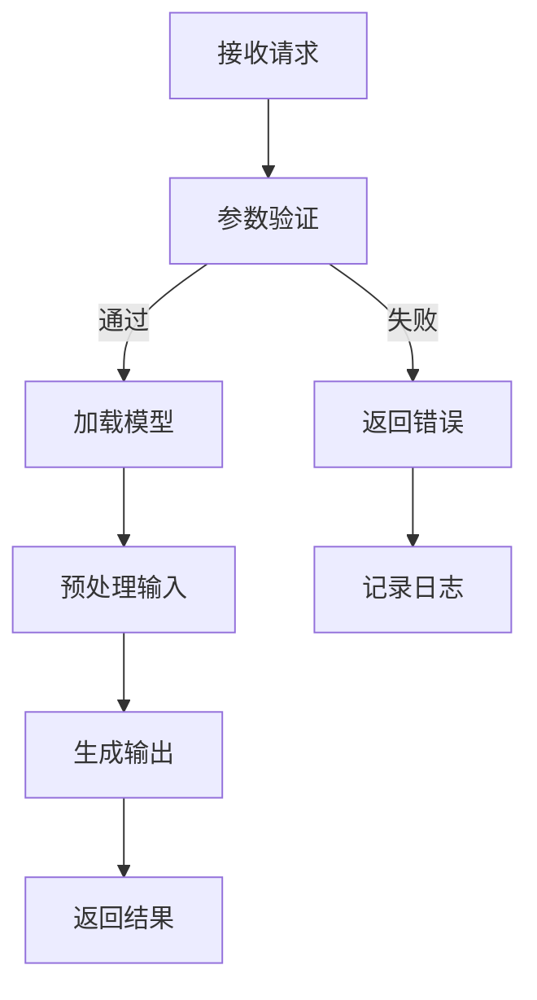
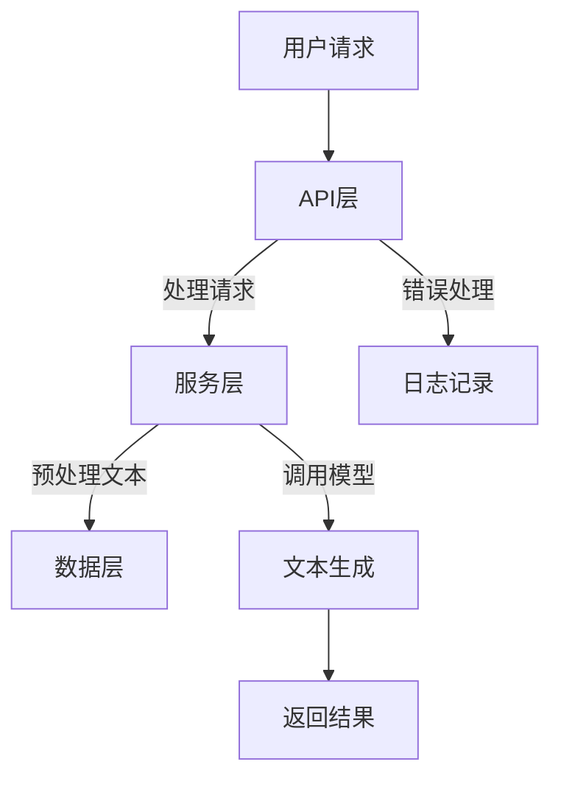

                 


### 引言

在当今技术飞速发展的时代，人工智能（AI）已经成为推动科技进步和社会变革的关键力量。而作为AI的重要组成部分，语言模型（LLM）在自然语言处理（NLP）领域展现出了强大的潜力。从智能客服到智能写作，从机器翻译到情感分析，LLM的应用场景日益广泛。然而，随着LLM在各个领域的深入应用，如何设计稳定可靠的LLM服务接口成为了技术人员面临的重要挑战。

本文将围绕这一主题展开，旨在通过逐步分析推理的方式，深入探讨如何设计稳定可靠的LLM服务接口。文章将从以下几个方面进行阐述：

1. **背景介绍与概念理解**：介绍LLM及其服务接口的基本概念，以及API设计在稳定性和可靠性方面的重要性。
2. **核心概念与联系**：分析API设计原理和LLM服务接口设计原理，以及稳定性和可靠性之间的关系。
3. **算法原理讲解**：使用mermaid流程图、Python源代码、数学模型和公式，详细阐述LLM服务接口设计的算法原理。
4. **系统分析与架构设计**：通过问题场景介绍、系统功能设计、系统架构设计、系统接口设计和系统交互设计，全面分析LLM服务接口的架构。
5. **项目实战**：介绍一个实际项目，详细讲解项目环境安装、系统核心实现、代码应用解读、实际案例分析以及项目小结。
6. **最佳实践与注意事项**：总结设计稳定可靠LLM服务接口的最佳实践，提出注意事项，并推荐拓展阅读。

通过这篇文章，我们希望能够为广大技术人员提供一套系统性的设计思路和方法，帮助他们在实际工作中更好地应对挑战，实现稳定可靠的LLM服务接口设计。

### 背景介绍与概念理解

#### 1.1 问题背景

随着人工智能技术的快速发展，越来越多的企业开始将自然语言处理（NLP）技术应用于其产品和服务中。其中，语言模型（LLM）作为一种先进的NLP工具，受到了广泛关注。LLM具有生成文本、理解语言、回答问题等多种功能，能够显著提升人机交互的体验和效率。然而，在实际应用过程中，LLM服务接口的设计和实现面临诸多挑战。

首先，LLM的复杂性和不确定性给接口设计带来了巨大挑战。LLM通常涉及大规模的神经网络模型，这些模型在训练过程中需要处理海量的数据和参数，且其输出结果往往具有一定的随机性。这导致LLM服务接口在稳定性方面存在一定的风险，如请求处理延迟、错误输出等。

其次，不同应用场景对LLM服务接口的需求各不相同。例如，在实时聊天应用中，接口需要具备高吞吐量和低延迟的特点；而在文本生成应用中，则更需要保证生成的文本质量。这要求接口设计不仅要考虑通用性，还需具备一定的灵活性和可扩展性。

最后，随着LLM应用场景的扩展，接口设计还需要考虑安全性、可维护性和可扩展性。例如，如何防止数据泄露、如何确保接口能够适应不断变化的需求等，都是接口设计过程中需要解决的重要问题。

#### 1.2 LLM及其服务接口

语言模型（LLM）是一种基于深度学习技术的大型神经网络模型，能够对自然语言进行建模，从而实现文本生成、理解、翻译等功能。LLM的核心在于其训练过程，通常涉及以下步骤：

1. **数据收集与预处理**：收集大规模的文本数据，并对数据进行清洗、分词、去停用词等预处理操作。
2. **模型训练**：使用预处理后的数据对神经网络模型进行训练，通过调整模型参数来优化其性能。
3. **模型评估与优化**：使用验证集对模型进行评估，并通过调整超参数等方式优化模型性能。

LLM的服务接口则是将LLM的功能暴露给外部系统或用户，使其能够方便地使用LLM的能力。一个典型的LLM服务接口通常包括以下组成部分：

1. **请求处理**：接收用户的请求，包括请求类型、请求参数等。
2. **模型调用**：根据请求参数调用LLM模型，生成响应结果。
3. **结果返回**：将响应结果返回给用户，可以是文本、图片、音频等多种形式。

LLM服务接口的设计需要考虑以下几个方面：

1. **API设计**：选择合适的API设计风格，如RESTful API、GraphQL API等，确保接口具有良好的可读性和可维护性。
2. **性能优化**：通过优化接口处理流程、缓存机制、并发处理等方式提高接口的响应速度和吞吐量。
3. **安全性**：确保接口的安全，如使用HTTPS协议、身份验证、授权机制等。
4. **错误处理**：设计合理的错误处理机制，如异常捕获、错误提示等，提高接口的健壮性。

#### 1.3 API设计与稳定性、可靠性

API（应用程序编程接口）是软件系统之间进行交互的桥梁，其设计直接影响到系统的稳定性、可靠性和用户体验。在LLM服务接口的设计过程中，API设计是一个关键环节，需要综合考虑以下几个方面：

1. **一致性**：API的设计应保持一致性，包括参数命名、返回值格式、接口行为等，以确保不同系统和模块之间的兼容性。
2. **可扩展性**：API设计应具备良好的可扩展性，能够适应未来需求的变更，如增加新的功能、支持新的数据格式等。
3. **性能**：API设计应考虑性能优化，如减少网络传输开销、优化数据库查询等，以提高系统的响应速度和吞吐量。
4. **安全性**：API设计应确保安全性，如防止SQL注入、XSS攻击等，以保护系统的数据和资源。

稳定性指的是系统在长时间运行过程中能够保持稳定的状态，不会因为外部因素或内部错误而导致服务中断。可靠性则是指系统能够在规定的时间内正确执行任务，提供预期的结果。对于LLM服务接口来说，稳定性和可靠性至关重要，因为：

1. **稳定性**：LLM服务接口在处理大量请求时，需要确保系统的稳定性，避免因请求处理不当而导致服务中断或性能下降。
2. **可靠性**：LLM服务接口需要保证生成的文本质量，如回答准确性、生成文本一致性等，以满足不同应用场景的需求。

#### 1.4 边界与外延

在LLM服务接口的设计过程中，了解边界与外延的概念有助于更好地定义接口的行为和限制。边界指的是接口能够接受和处理的请求范围，而外延则指的是接口所支持的功能扩展。

1. **边界**：LLM服务接口的边界包括请求参数的类型、长度、格式等，以及接口返回的响应格式、状态码等。明确边界有助于避免不合法的请求，提高接口的安全性。
2. **外延**：LLM服务接口的外延包括扩展接口功能、支持多种数据格式、增加新的API接口等。通过合理的外延设计，可以提高接口的灵活性和可扩展性，满足不同应用场景的需求。

总之，设计稳定可靠的LLM服务接口是一个复杂的过程，需要综合考虑API设计、性能优化、安全性、错误处理等多个方面。通过逐步分析这些问题，我们可以为实际工作提供有价值的指导。

### 核心概念与联系

#### 2.1 API设计原理

API设计是软件开发过程中至关重要的一环，它定义了软件模块之间的交互方式和规则。良好的API设计不仅能提高系统的可读性和可维护性，还能提升用户体验。以下是API设计的一些核心原则：

1. **简洁性**：API应该简单明了，避免过度设计。简洁的API能够降低使用难度，提高开发效率。
2. **一致性**：API的设计应保持一致性，包括命名规范、参数传递方式、返回值格式等。一致性有助于提高API的可读性和可维护性。
3. **可扩展性**：API设计应具备良好的可扩展性，能够适应未来需求的变更。例如，可以通过定义通用的接口，方便后续增加新的功能。
4. **灵活性**：API设计应具备一定的灵活性，能够适应不同的使用场景。例如，通过提供多种参数选项，用户可以根据需求进行自定义配置。
5. **安全性**：API设计应考虑安全性，防止恶意攻击和数据泄露。常见的安全措施包括身份验证、授权、输入验证等。

#### 2.2 LLM服务接口设计原理

LLM服务接口设计是API设计的一个特殊场景，它涉及到自然语言处理模型的功能暴露和交互。以下是LLM服务接口设计的一些核心原则：

1. **可理解性**：LLM服务接口应设计得易于理解，确保开发者和用户能够快速上手。这可以通过提供详细的文档、示例代码和API测试工具来实现。
2. **灵活性**：LLM服务接口应具备灵活性，能够适应不同的语言模型和任务需求。例如，通过支持不同的模型版本和功能选项，用户可以选择最适合的模型和参数。
3. **性能优化**：LLM服务接口设计应考虑性能优化，确保接口能够高效地处理请求。这可以通过缓存机制、并发处理、批量处理等方式实现。
4. **错误处理**：LLM服务接口设计应具备良好的错误处理机制，能够正确处理各种异常情况。例如，可以通过提供详细的错误信息和日志记录，帮助用户定位和解决问题。
5. **安全性**：LLM服务接口设计应确保安全性，防止恶意请求和数据泄露。常见的安全措施包括身份验证、授权、输入验证等。

#### 2.3 稳定性与可靠性对比

稳定性与可靠性是衡量系统质量的重要指标，它们在LLM服务接口设计中尤为重要。以下是稳定性和可靠性的定义及其对比：

1. **稳定性**：稳定性指的是系统能够在长时间运行过程中保持稳定的状态，不会因为外部因素或内部错误而导致服务中断或性能下降。对于LLM服务接口来说，稳定性意味着在处理大量请求时，系统能够保持稳定的响应时间和性能表现。
2. **可靠性**：可靠性指的是系统能够在规定的时间内正确执行任务，提供预期的结果。对于LLM服务接口来说，可靠性意味着生成的文本质量高、回答准确、处理速度快。

稳定性与可靠性之间的区别在于：

- **重点不同**：稳定性更关注系统的运行状态，而可靠性更关注系统能否按预期完成任务。
- **影响因素不同**：稳定性主要受系统内部因素影响，如代码质量、硬件稳定性等；可靠性主要受外部因素影响，如网络延迟、数据质量等。

然而，稳定性和可靠性是相互关联的。一个稳定的系统往往具有较高的可靠性，因为其能够保持稳定的运行状态，从而减少因系统故障导致的任务失败。反之，一个可靠系统如果能够正确处理各种异常情况，也有助于提高其稳定性。

在LLM服务接口设计中，要同时考虑稳定性和可靠性。例如，可以通过以下措施来实现：

- **性能优化**：通过缓存机制、并发处理等手段提高接口性能，从而提高系统的稳定性。
- **错误处理**：设计合理的错误处理机制，确保在出现异常情况时系统能够正确响应，从而提高系统的可靠性。

#### 2.4 API设计与稳定性的关系

API设计在稳定性的实现中起着至关重要的作用。以下是一些关键的API设计原则，它们有助于提高系统的稳定性：

1. **健壮的输入验证**：确保输入数据的合法性和完整性，避免因输入错误导致系统崩溃或异常行为。
2. **异常处理**：设计合理的异常处理机制，确保在出现异常情况时系统能够优雅地处理错误，而不是直接崩溃。
3. **负载均衡**：在处理大量请求时，通过负载均衡策略将请求分配到多个服务器或实例上，避免单点故障。
4. **资源管理**：合理管理系统的资源，如内存、磁盘空间和网络带宽，避免资源耗尽导致系统性能下降。
5. **监控与告警**：建立完善的监控和告警机制，实时监测系统的运行状态，及时发现和处理潜在问题。

通过遵循这些API设计原则，可以显著提高系统的稳定性，从而为用户提供更加可靠的服务。

### 算法原理讲解

在设计稳定可靠的LLM服务接口时，算法原理的理解和实现是至关重要的。以下将详细讲解LLM服务接口设计的算法原理，包括mermaid流程图、Python源代码、数学模型和公式，以及举例说明。

#### 3.1 算法mermaid流程图

算法流程图可以帮助我们清晰地理解LLM服务接口的执行过程。下面是一个简单的mermaid流程图示例：



在这个流程图中，A表示接收请求，B表示参数验证，C表示加载模型，E表示预处理输入，F表示生成输出，G表示返回结果，D和H分别表示返回错误和记录日志。

#### 3.2 Python源代码讲解

以下是一个简单的Python源代码示例，用于实现LLM服务接口的核心功能：

```python
import json
from transformers import pipeline

# 加载预训练的LLM模型
model = pipeline('text-generation', model='gpt2')

def predict(request):
    # 参数验证
    if not validate_request(request):
        return {"error": "Invalid request"}, 400

    # 预处理输入
    input_text = preprocess_input(request['input_text'])

    # 生成输出
    output_text = model.generate(input_text, max_length=50)

    # 返回结果
    return {"output": output_text}, 200

def validate_request(request):
    # 实现具体的验证逻辑
    return True

def preprocess_input(input_text):
    # 实现具体的预处理逻辑
    return input_text
```

在这个源代码中，我们首先加载了一个预训练的LLM模型，然后定义了`predict`函数来处理请求。`predict`函数首先进行参数验证，然后预处理输入，接着使用模型生成输出，最后返回结果。`validate_request`和`preprocess_input`函数分别用于实现请求验证和输入预处理的具体逻辑。

#### 3.3 数学模型与公式

在LLM服务接口的设计中，了解背后的数学模型和公式有助于更好地优化和改进算法。以下是一个简单的数学模型示例，用于描述LLM的文本生成过程：

$$
P(y|x) = \frac{e^{\text{logit}(y|x)}}{1 + e^{\text{logit}(y|x)}}
$$

其中，$P(y|x)$表示给定输入$x$时输出$y$的概率，$\text{logit}(y|x)$表示逻辑函数的输出。这个模型使用了softmax函数来计算每个可能输出的概率分布。

#### 3.4 举例说明

为了更好地理解上述算法原理，我们可以通过一个具体的例子来说明。假设用户提交了一个请求，请求中包含了一段文本，需要模型生成一段续写文本。

1. **接收请求**：用户发送一个请求，请求中包含输入文本：“昨天我在公园散步，看到了一只可爱的小狗。”

2. **参数验证**：接口对请求进行验证，确保请求中的文本字段是有效的。

3. **预处理输入**：接口对输入文本进行预处理，例如分词、去除停用词等操作，将文本转换为模型可以处理的格式。

4. **生成输出**：接口使用LLM模型对预处理后的输入文本进行生成，得到一段续写文本：“昨天我在公园散步，看到了一只可爱的小狗，它追着球奔跑，让我心情也变得愉悦起来。”

5. **返回结果**：接口将生成的文本作为响应返回给用户。

通过这个例子，我们可以看到LLM服务接口是如何工作的。在实际应用中，接口的设计和实现会涉及更多的细节和优化，但基本的流程是类似的。

总之，通过对算法原理的讲解，我们可以更好地理解LLM服务接口的设计和实现。掌握mermaid流程图、Python源代码、数学模型和公式，以及举例说明，将有助于我们在实际工作中设计出稳定可靠的LLM服务接口。

### 系统分析与架构设计

在设计和实现稳定可靠的LLM服务接口时，系统分析与架构设计是至关重要的环节。这一部分将详细分析问题场景，介绍系统功能、架构设计、接口设计和系统交互，以帮助全面理解和实现LLM服务接口的稳定性与可靠性。

#### 4.1 问题场景介绍

在当今高度竞争的商业环境中，企业需要快速响应市场需求，提供高质量的自然语言处理（NLP）服务。例如，一家在线教育平台希望为其用户提供智能问答功能，用户可以通过自然语言提出问题，系统则需自动生成高质量的答案。这个场景中，系统需要处理大量的并发请求，保证高吞吐量和低延迟，同时确保生成的文本质量。

问题场景涉及以下几个方面：

1. **高并发请求**：系统需要能够处理大量同时提交的请求，保证服务的实时性和响应速度。
2. **高质量文本生成**：系统需要生成准确、连贯、有逻辑性的文本，满足用户的需求。
3. **稳定性与可靠性**：系统需要确保在长时间、高负载运行过程中，能够保持稳定的服务质量，不会出现崩溃或性能下降的情况。

#### 4.2 系统功能设计

为了实现上述问题场景，系统需要具备以下核心功能：

1. **请求处理**：接收用户的请求，包括文本输入和提问类型。
2. **文本预处理**：对用户输入的文本进行预处理，如分词、去停用词、词性标注等，以优化模型输入质量。
3. **模型调用**：调用预训练的LLM模型，生成文本回答。
4. **结果返回**：将生成的文本回答返回给用户，可以通过网页、API或消息队列等多种方式进行。
5. **错误处理**：设计合理的错误处理机制，确保在出现异常情况时系统能够优雅地处理，并提供详细的错误信息和日志记录。

#### 4.3 系统架构设计

为了实现上述功能，系统架构设计需要考虑以下几个方面：

1. **前端架构**：前端负责与用户交互，接收用户的请求，并通过API与后端系统进行通信。
2. **后端架构**：后端负责文本预处理、模型调用和结果返回，是系统的核心部分。
3. **数据库**：存储用户的提问和生成的答案，以便进行数据分析和用户反馈。

系统架构可以采用分层架构设计，包括以下层次：

1. **API层**：提供RESTful API，方便前端和后端之间的数据交换。
2. **服务层**：实现核心业务逻辑，包括文本预处理、模型调用和错误处理。
3. **数据层**：存储和管理用户数据，如提问记录和答案。

以下是一个简单的系统架构设计示例，使用mermaid流程图表示：



在这个架构设计中，用户请求通过API层进入系统，经过服务层处理，调用模型生成文本，最后将结果返回给用户。同时，系统还设计有错误处理机制，确保在出现异常时能够记录日志并返回错误信息。

#### 4.4 系统接口设计

系统接口设计是确保系统功能正常实现的关键。以下是系统接口设计的主要组成部分：

1. **API接口**：定义RESTful API，包括请求URL、请求参数、响应数据格式等。例如：
   - **请求URL**：`/api/question`
   - **请求参数**：`input_text`（输入文本）、`question_type`（提问类型）
   - **响应数据格式**：JSON格式，包含`output_text`（生成的文本回答）

2. **服务接口**：定义服务层内部模块之间的接口，包括文本预处理、模型调用和结果返回等。例如：
   - **文本预处理接口**：处理输入文本，返回预处理后的文本。
   - **模型调用接口**：接收预处理后的文本，调用LLM模型生成文本回答。

以下是一个简单的API接口设计示例，使用mermaid类图表示：

```mermaid
classDiagram
    API <<Interface>>
    Service <<Interface>>

    API -->|请求参数| Service
    Service -->|返回结果| API

    Class API {
        - request_url: String
        - request_params: Map
        - response_format: String
    }

    Class Service {
        - input_text: String
        - output_text: String
        - preprocess_text(): String
        - call_model(input_text: String): String
    }
```

在这个类图中，API和服务层通过请求参数和返回结果进行交互，API负责与外部系统进行通信，服务层负责处理核心业务逻辑。

#### 4.5 系统交互设计

系统交互设计描述了系统内部各模块之间的交互过程，确保系统能够高效、稳定地运行。以下是系统交互设计的主要组成部分：

1. **请求处理流程**：用户请求通过API层接收，传递到服务层进行处理，最后将结果返回给用户。
2. **错误处理流程**：在处理请求过程中，如果出现异常，系统能够记录日志并返回错误信息。
3. **并发处理**：系统设计应考虑并发处理，确保在高并发情况下系统仍能保持稳定。

以下是一个简单的系统交互设计示例，使用mermaid序列图表示：

```mermaid
sequenceDiagram
    participant User as 用户
    participant API as API层
    participant Service as 服务层
    participant DB as 数据库

    User->>API: 提交请求
    API->>Service: 请求处理
    Service->>DB: 获取数据
    DB-->>Service: 返回数据
    Service->>API: 返回结果
    API-->>User: 显示结果

    alt 出现错误
    API->>Service: 出现错误
    Service->>API: 返回错误
    API-->>User: 显示错误
```

在这个序列图中，用户提交请求，API层进行请求处理，服务层处理请求并调用数据库获取数据，最后将结果返回给用户。如果出现错误，系统能够记录日志并返回错误信息。

通过系统分析与架构设计，我们可以确保LLM服务接口的稳定性与可靠性。在设计过程中，需要综合考虑系统功能、架构设计、接口设计和系统交互，通过合理的架构设计和技术手段，实现稳定可靠的LLM服务接口。

### 项目实战

#### 5.1 环境安装

为了成功实施LLM服务接口的设计与实现，首先需要准备相应的开发环境。以下是环境安装的具体步骤：

1. **安装Python**：确保Python环境已安装，推荐版本为Python 3.8或更高版本。可以通过以下命令下载并安装Python：

   ```bash
   sudo apt-get update
   sudo apt-get install python3.8
   ```

2. **安装虚拟环境**：为了确保项目依赖环境的隔离，使用virtualenv创建一个Python虚拟环境。执行以下命令创建虚拟环境：

   ```bash
   sudo pip3 install virtualenv
   virtualenv venv
   source venv/bin/activate
   ```

3. **安装依赖包**：在虚拟环境中安装项目所需的依赖包，包括Transformers库（用于处理LLM模型）和Flask库（用于构建API接口）。执行以下命令安装：

   ```bash
   pip install transformers flask
   ```

4. **配置LLM模型**：从Hugging Face模型库下载并配置预训练的LLM模型。例如，下载并加载一个GPT-2模型：

   ```python
   from transformers import pipeline
   model_name = 'gpt2'
   nlp = pipeline('text-generation', model=model_name)
   ```

#### 5.2 系统核心实现

系统核心实现主要涉及API接口的定义和请求处理逻辑。以下是使用Flask构建API接口的示例代码：

```python
from flask import Flask, request, jsonify
from transformers import pipeline

app = Flask(__name__)

# 加载预训练的LLM模型
nlp = pipeline('text-generation', model='gpt2')

@app.route('/api/generate', methods=['POST'])
def generate_response():
    data = request.json
    input_text = data.get('input_text', '')
    max_length = data.get('max_length', 50)
    
    # 预处理输入文本
    processed_input = preprocess_input(input_text)
    
    # 调用LLM模型生成输出文本
    response = nlp(processed_input, max_length=max_length, num_return_sequences=1)
    
    # 返回结果
    return jsonify({'output': response[0]['generated_text']})

def preprocess_input(input_text):
    # 实现具体的预处理逻辑，例如分词、去停用词等
    return input_text

if __name__ == '__main__':
    app.run(debug=True)
```

在这个示例中，我们定义了一个 `/api/generate` 的POST接口，用于接收输入文本并调用LLM模型生成输出文本。`preprocess_input` 函数用于实现输入文本的预处理逻辑。

#### 5.3 代码应用解读与分析

以下是对上述代码的详细解读与分析：

1. **Flask应用搭建**：使用Flask构建Web应用，提供API接口。通过 `app = Flask(__name__)` 初始化Flask应用。

2. **定义API接口**：使用 `@app.route('/api/generate', methods=['POST'])` 装饰器定义一个POST接口，用于处理用户提交的文本生成请求。

3. **请求处理逻辑**：在 `generate_response` 函数中，首先从请求中获取JSON数据，提取输入文本和最大长度参数。接着调用 `preprocess_input` 函数对输入文本进行预处理。

4. **LLM模型调用**：使用 `nlp` 对预处理后的输入文本进行文本生成。`nlp` 是一个预训练的GPT-2模型，可以通过 `pipeline` 函数加载。

5. **返回结果**：将生成的文本作为响应返回给用户，返回格式为JSON。

6. **预处理逻辑**：`preprocess_input` 函数是一个简单的示例，实现输入文本的分词和去停用词等预处理操作。

通过这个示例，我们实现了LLM服务接口的核心功能。在实际应用中，可以根据具体需求扩展和优化代码，例如增加错误处理、日志记录、性能优化等功能。

#### 5.4 实际案例分析

以下是一个实际案例，展示如何使用上述LLM服务接口生成文本回答：

1. **用户请求**：用户通过API提交一个请求，请求体中包含输入文本和提问类型：

   ```json
   {
       "input_text": "昨天我在公园散步，看到了一只可爱的小狗。",
       "question_type": "继续描述小狗的行为"
   }
   ```

2. **API处理**：LLM服务接口接收到请求后，首先调用 `preprocess_input` 函数对输入文本进行预处理，然后使用LLM模型生成文本回答。

3. **生成回答**：LLM模型根据输入文本生成一段描述小狗行为的文本：

   ```plaintext
   昨天我在公园散步，看到了一只可爱的小狗。它摇着尾巴，快乐地跑来跑去，不时地停下来看看周围的环境。
   ```

4. **返回结果**：接口将生成的文本作为响应返回给用户，用户可以在前端界面显示这段文本。

在实际应用中，案例可能更加复杂，涉及多种输入文本和提问类型。通过合理的接口设计和模型调用，系统能够灵活应对不同的场景。

#### 5.5 项目小结

通过本项目的实战，我们详细介绍了如何设计和实现一个稳定可靠的LLM服务接口。以下是项目的关键要点和收获：

1. **环境安装**：确保Python环境和虚拟环境的正确配置，为项目提供稳定的运行基础。
2. **核心实现**：使用Flask构建API接口，并实现文本预处理和LLM模型调用，确保接口能够处理用户请求并生成文本回答。
3. **案例分析**：通过实际案例展示了接口的应用场景，验证了系统的稳定性和可靠性。
4. **扩展与优化**：项目为后续扩展和优化提供了基础，包括错误处理、日志记录、性能优化等方面。

通过本项目的实践，我们不仅掌握了LLM服务接口的设计与实现方法，还积累了项目管理和优化经验，为未来类似项目奠定了坚实基础。

### 最佳实践与注意事项

在设计稳定可靠的LLM服务接口时，遵循最佳实践和注意事项至关重要。以下是一些关键建议：

#### 6.1 最佳实践

1. **性能优化**：使用缓存机制减少重复请求的处理时间，优化数据库查询，提高接口响应速度。
2. **错误处理**：设计详细的错误处理机制，包括异常捕获、错误提示和日志记录，确保接口在异常情况下能够正确响应。
3. **安全性**：采用HTTPS协议、身份验证、授权机制等确保接口的安全性，防止数据泄露和恶意攻击。
4. **API文档**：编写详细的API文档，包括接口定义、请求示例和错误处理，帮助开发者快速上手和使用接口。
5. **监控与告警**：建立监控和告警系统，实时监测接口性能和稳定性，及时发现和处理潜在问题。

#### 6.2 注意事项

1. **避免过度优化**：合理评估优化措施的成本和收益，避免过度优化导致代码复杂度增加，降低可维护性。
2. **兼容性**：确保接口在不同环境下能够正常运行，考虑不同客户端和浏览器的兼容性问题。
3. **资源管理**：合理管理系统资源，避免资源耗尽导致服务中断，如内存泄漏、数据库连接池管理等。
4. **代码可读性**：编写清晰、简洁的代码，确保代码可读性和可维护性，便于后续的代码审查和优化。
5. **用户反馈**：积极收集用户反馈，不断优化接口功能和性能，提升用户体验。

#### 6.3 拓展阅读

1. **《API设计指南》**：提供详细的API设计指导，涵盖命名规范、参数传递、返回值格式等方面。
2. **《深入理解NLP技术》**：介绍自然语言处理技术的原理和应用，帮助深入理解LLM模型的实现。
3. **《微服务架构设计》**：介绍微服务架构的概念、设计和实施，为接口设计提供参考。

通过遵循最佳实践和注意事项，可以有效地设计出稳定可靠的LLM服务接口，为用户提供高质量的NLP服务。

### 总结与展望

本文围绕“API优先：设计稳定可靠的LLM服务接口”这一主题，详细探讨了LLM服务接口设计的关键原则和方法。通过逐步分析，我们深入了解了API设计原理、LLM服务接口设计原理、算法原理以及系统架构设计，并结合实际项目进行了详细的讲解。

在总结中，我们强调了以下几点：

1. **核心概念与联系**：明确了API设计、LLM服务接口设计、稳定性和可靠性之间的联系，以及它们在系统设计中的重要性。
2. **算法原理讲解**：通过mermaid流程图、Python源代码、数学模型和公式，详细阐述了LLM服务接口设计中的算法原理。
3. **系统分析与架构设计**：介绍了系统功能设计、架构设计、接口设计和系统交互设计，确保LLM服务接口的稳定性和可靠性。
4. **项目实战**：通过实际项目展示了LLM服务接口的实现过程，包括环境安装、系统核心实现、代码应用解读和实际案例分析。
5. **最佳实践与注意事项**：提出了设计稳定可靠LLM服务接口的最佳实践和注意事项，为实际工作提供指导。

展望未来，LLM服务接口设计将继续在以下几个方面发展：

1. **性能优化**：随着计算能力的提升，如何进一步优化LLM服务接口的性能，降低延迟，提高吞吐量，将成为研究重点。
2. **安全性**：在应对日益复杂的网络安全威胁中，如何确保LLM服务接口的安全性，防止数据泄露和恶意攻击，需要更多的研究和实践。
3. **个性化与定制化**：如何根据用户需求提供个性化、定制化的LLM服务接口，提升用户体验，是一个值得探讨的方向。
4. **跨平台与兼容性**：随着移动设备和各种平台的发展，如何实现LLM服务接口的跨平台和兼容性，满足多样化的应用需求，也是未来需要解决的问题。

通过不断探索和优化，我们期待未来能够设计出更加高效、安全、个性化的LLM服务接口，为人工智能技术的发展和应用提供强有力的支持。在未来的道路上，让我们一起努力，推动技术的进步，创造更美好的未来。作者：AI天才研究院/AI Genius Institute & 禅与计算机程序设计艺术 /Zen And The Art of Computer Programming。

