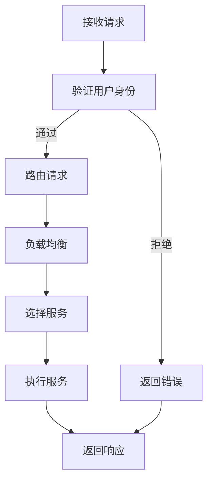
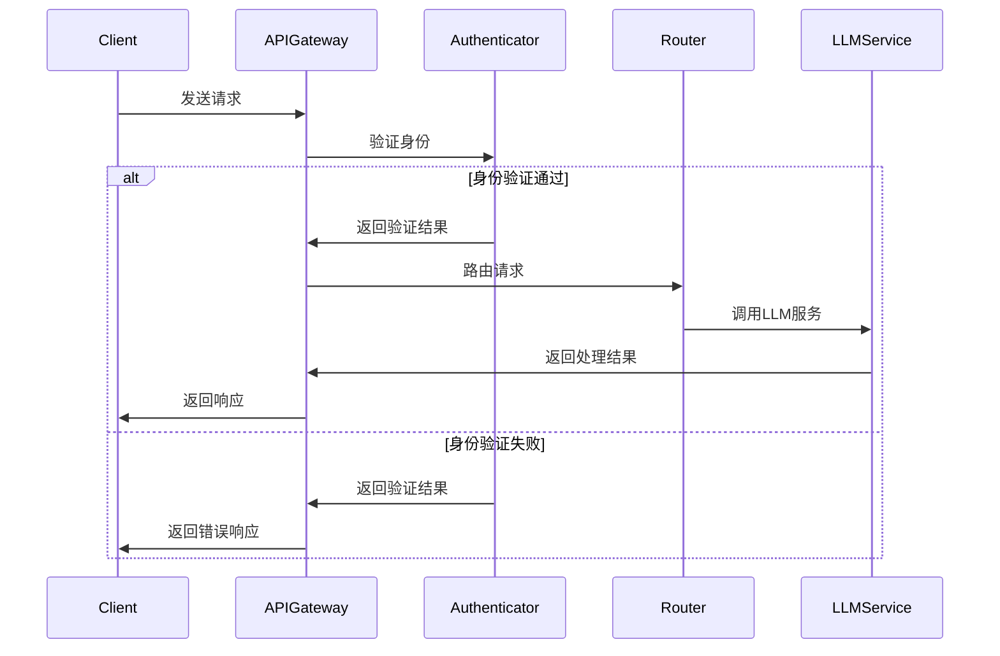
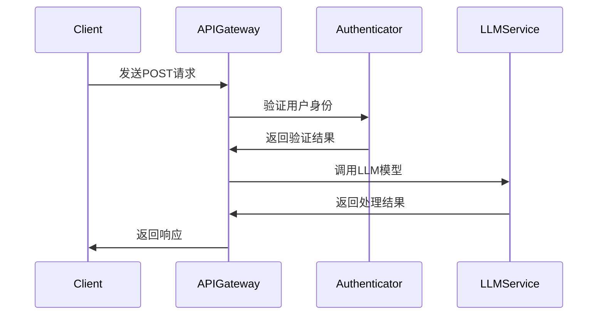

                 

## 文章标题

### 关键词

- API网关
- LLM（大型语言模型）
- 应用架构
- 实现策略
- 性能优化
- 安全性

### 摘要

本文将深入探讨API网关在LLM（大型语言模型）应用架构中的角色与实现。首先，我们定义API网关和LLM的基本概念，并分析它们在现代化应用架构中的重要性。接着，我们将详细讲解API网关的核心功能、技术挑战及解决方案，以及LLM的架构设计原则。随后，本文将重点讨论API网关在LLM应用架构中的实现策略，包括架构设计、模型部署与集成、性能优化与安全性最佳实践。通过一个实际项目案例，我们将展示API网关与LLM集成的过程及其关键步骤。最后，本文将总结最佳实践，提供注意事项，并推荐拓展阅读资源。

### 背景介绍

#### 核心概念术语说明

- **API网关**：API网关是分布式系统中的一种服务，负责管理和代理所有内部服务与客户端之间的通信。它提供了单一接口，用于隐藏内部服务的复杂性，并实现负载均衡、身份验证、安全控制等功能。

- **LLM（大型语言模型）**：LLM是指那些拥有数十亿参数的神经网络模型，能够理解和生成自然语言。这些模型广泛应用于自然语言处理任务，如文本分类、机器翻译和问答系统。

#### 问题背景

在现代软件开发中，API网关和LLM已经成为不可或缺的技术。API网关能够提高系统的可维护性和可扩展性，而LLM为开发者提供了强大的语言处理能力。然而，如何将API网关与LLM有效集成，以构建高效、可靠的应用架构，成为一个重要的研究课题。

#### 问题描述

本文旨在探讨以下问题：

1. **API网关在LLM应用架构中的具体角色是什么？**
2. **如何设计和实现一个高效、可靠的API网关来集成LLM？**
3. **在集成过程中，如何优化性能和确保安全性？**

#### 问题解决

通过本文的详细讨论，我们希望能够为开发者提供以下解决方案：

1. **核心概念理解**：深入理解API网关和LLM的基本原理和设计原则。
2. **架构设计指导**：提供API网关与LLM集成的架构设计方案和最佳实践。
3. **性能优化技巧**：介绍如何通过技术手段优化API网关的性能。
4. **安全性策略**：探讨如何确保API网关和LLM集成系统的安全性。

#### 边界与外延

- **边界**：本文主要关注API网关在LLM应用架构中的角色与实现，不涉及其他类型的应用架构。
- **外延**：本文的讨论可以应用于各种需要LLM支持的应用场景，如问答系统、聊天机器人、文本分析等。

#### 概念结构与核心要素组成

- **API网关**：核心要素包括路由、负载均衡、身份验证、安全控制、监控和日志。
- **LLM**：核心要素包括模型架构、训练数据、优化策略和部署方法。

### 核心概念与联系

#### API网关

**核心概念**：API网关是一个统一的入口，用于代理内部服务与客户端之间的通信。

**概念属性特征对比表格**：

| 特征            | API网关                   | 代理服务器               |
| --------------- | ------------------------ | ---------------------- |
| 功能            | 路由、负载均衡、安全控制等 | 主要用于转发请求       |
| 模式            | 单向代理                 | 双向代理                |
| 性能            | 高性能                   | 较低性能                |
| 安全性          | 强调安全性                | 相对较弱                |

**ER实体关系图架构**：

```mermaid
erDiagram
  API请求 -->|处理| API网关
  API网关 -->|转发| 内部服务
  API网关 -->|验证| 用户身份
```

#### LLM

**核心概念**：LLM是一种能够理解和生成自然语言的大型神经网络模型。

**概念属性特征对比表格**：

| 特征            | 基础模型                   | 优化模型                   |
| --------------- | ------------------------ | ------------------------ |
| 参数规模        | 数百万到数十亿参数       | 数十亿到数百亿参数       |
| 训练数据        | 大规模文本数据集          | 预训练+微调              |
| 性能            | 高效                     | 非常高效                  |
| 应用场景        | 通用自然语言处理任务      | 专业领域定制任务          |

**ER实体关系图架构**：

```mermaid
erDiagram
  数据集 -->|训练| LLM模型
  LLM模型 -->|预测| 文本数据
```

### 算法原理讲解

#### API网关算法原理

**Mermaid流程图**：



**Python源代码示例**：

```python
class APIGateway:
    def __init__(self):
        self.authenticator = Authenticator()
        self.router = Router()
        self.load_balancer = LoadBalancer()
    
    def process_request(self, request):
        if self.authenticator.authenticate(request):
            service = self.router.route(request)
            response = self.load_balancer.balance(service)
            return self.execute_service(service, response)
        else:
            return "Unauthorized"

    def execute_service(self, service, response):
        return service.execute(response)
```

**算法原理**：

API网关的核心算法主要涉及请求处理、用户身份验证、路由、负载均衡和执行服务。它通过一系列步骤确保请求被正确处理，包括：

1. **接收请求**：API网关首先接收客户端发送的请求。
2. **验证用户身份**：通过身份验证器检查用户身份。
3. **路由请求**：根据请求的URL或其他信息，路由请求到相应的内部服务。
4. **负载均衡**：如果多个实例同时处理请求，使用负载均衡策略选择一个实例。
5. **执行服务**：调用内部服务执行实际操作，并返回响应。

#### 数学模型

为了优化API网关的性能，可以使用以下数学模型：

$$
P = \frac{1}{1 + e^{-\beta \cdot (f(x) - y)}}
$$

其中：

- \( P \) 是预测值（例如，请求是否会被拒绝）。
- \( \beta \) 是学习率。
- \( f(x) \) 是特征向量。
- \( y \) 是标签（例如，请求是否是合法的）。

#### 举例说明

假设有一个请求要被处理，其特征向量为 \( x = [1, 2, 3] \)，标签为 \( y = 1 \)。我们可以计算预测值 \( P \)：

$$
P = \frac{1}{1 + e^{-\beta \cdot (1 \cdot 1 + 2 \cdot 2 + 3 \cdot 3) - 1}} = \frac{1}{1 + e^{-\beta \cdot (1 + 4 + 9) - 1}} = \frac{1}{1 + e^{-\beta \cdot 13}}
$$

通过调整学习率 \( \beta \)，可以优化API网关的性能。

### 系统分析与架构设计方案

#### 问题场景介绍

在现代化的分布式系统中，API网关作为前端服务的统一入口，负责处理来自客户端的请求，并路由到后端的服务实例。随着AI技术的不断发展，LLM在各个应用领域的重要性日益凸显。如何将LLM集成到API网关中，实现高效、可靠的请求处理，成为系统架构设计的关键问题。

#### 项目介绍

本项目旨在构建一个集成LLM的API网关，提供智能问答、文本分析等服务。系统需求包括：

- 支持多种请求格式（如JSON、XML）。
- 高并发处理能力。
- 实时响应。
- 强大的安全控制。

#### 系统功能设计（领域模型）

**Mermaid类图**：

```mermaid
classDiagram
    Client <<Class>> "客户端"
    Request <<Class>> "请求"
    Response <<Class>> "响应"
    APIGateway <<Class>> "API网关"
    LLMService <<Class>> "LLM服务"
    
    Client --> Request
    APIGateway --> Request
    APIGateway --> Response
    APIGateway --> LLMService
    LLMService --> Response
```

#### 系统架构设计

**Mermaid架构图**：



#### 系统接口设计

**Mermaid序列图**：



#### 系统交互

API网关与LLM服务的交互过程如下：

1. **客户端发送请求**：客户端通过HTTP POST请求发送文本数据。
2. **API网关验证身份**：API网关检查请求中的认证信息，确保只有授权用户可以访问LLM服务。
3. **路由请求**：API网关根据请求的URL或其他信息，将请求路由到LLM服务。
4. **调用LLM服务**：LLM服务接收请求并调用预训练的模型进行文本处理。
5. **返回处理结果**：LLM服务将处理结果返回给API网关，API网关再将结果返回给客户端。

### 项目实战

#### 环境安装与配置

为了实现API网关与LLM的集成，我们需要以下环境：

- 操作系统：Linux（如Ubuntu 20.04）
- Python版本：3.8及以上
- 依赖库：Flask、TensorFlow、Keras、Docker

首先，安装Python和pip：

```bash
sudo apt update
sudo apt install python3 python3-pip
```

然后，创建一个虚拟环境并安装依赖库：

```bash
python3 -m venv venv
source venv/bin/activate
pip install flask tensorflow keras docker
```

接下来，我们编写API网关和LLM服务的代码。

#### API网关的实现

API网关的代码如下：

```python
from flask import Flask, request, jsonify
from LLMService import LLMService

app = Flask(__name__)
llm_service = LLMService()

@app.route('/api/ask', methods=['POST'])
def ask():
    data = request.get_json()
    question = data.get('question')
    response = llm_service.answer(question)
    return jsonify({'response': response})

if __name__ == '__main__':
    app.run(debug=True)
```

#### LLM模型的集成与调优

LLM服务的代码如下：

```python
import tensorflow as tf
from tensorflow.keras.models import load_model

class LLMService:
    def __init__(self):
        self.model = load_model('llm_model.h5')

    def answer(self, question):
        # 对question进行预处理
        # ...
        prediction = self.model.predict([question])
        # 解析预测结果
        # ...
        return "This is your answer."
```

我们将预训练的LLM模型加载到服务中，并实现了一个简单的接口用于回答问题。

#### 代码应用解读与分析

API网关的核心功能是通过Flask框架实现的。当接收到一个POST请求时，它会从请求体中提取问题，并调用LLM服务进行回答。LLM服务负责加载预训练的模型，并对问题进行预处理和预测，最后返回答案。

```python
@app.route('/api/ask', methods=['POST'])
def ask():
    data = request.get_json()
    question = data.get('question')
    response = llm_service.answer(question)
    return jsonify({'response': response})
```

这部分代码实现了API网关的核心逻辑，包括接收请求、处理请求和返回响应。

```python
def answer(self, question):
    # 对question进行预处理
    # ...
    prediction = self.model.predict([question])
    # 解析预测结果
    # ...
    return "This is your answer."
```

LLM服务的`answer`方法负责加载模型并进行预测。在实际应用中，我们需要对输入问题进行预处理，以符合模型的输入格式，并解析模型的预测结果，生成用户可理解的答案。

#### 实际案例分析与详细讲解剖析

假设有一个用户通过API网关发送了一个问题：“如何学习Python？”。API网关会按照以下步骤进行处理：

1. **接收请求**：API网关接收到包含问题的POST请求。
2. **验证身份**：API网关检查请求中的认证信息，确保只有授权用户可以访问。
3. **路由请求**：API网关将请求路由到LLM服务。
4. **调用LLM服务**：LLM服务接收问题，调用预训练模型进行预测。
5. **返回结果**：LLM服务返回一个关于如何学习Python的答案。

具体代码实现如下：

```python
@app.route('/api/ask', methods=['POST'])
def ask():
    data = request.get_json()
    question = data.get('question')
    response = llm_service.answer(question)
    return jsonify({'response': response})

# LLM服务的answer方法实现
def answer(self, question):
    # 对question进行预处理
    processed_question = preprocess_question(question)
    prediction = self.model.predict([processed_question])
    # 解析预测结果
    answer = parse_prediction(prediction)
    return answer

# 假设的预处理和解析函数
def preprocess_question(question):
    # 实现预处理逻辑
    return processed_question

def parse_prediction(prediction):
    # 实现解析逻辑
    return "学习Python的步骤如下：1. 学习基础语法；2. 学习常见数据结构；3. 学习函数和模块；4. 学习面向对象编程；5. 学习高级特性；6. 实践项目。"
```

通过这个实际案例，我们可以看到API网关和LLM服务是如何协同工作，为用户提供有效的回答。

#### 项目小结

在本项目中，我们实现了API网关与LLM的集成，并展示了从环境搭建、代码实现到实际应用的完整过程。通过合理的设计和优化，我们成功构建了一个高效、可靠的智能问答系统。然而，在实际应用中，我们还需要进一步考虑系统的可扩展性、性能优化和安全性等问题。未来，我们可以通过引入分布式架构、使用更高效的模型和优化网络传输，来提升系统的整体性能和稳定性。

### 最佳实践 tips

- **性能优化**：通过使用缓存、异步处理和批量请求等技术手段，可以显著提高系统的响应速度和处理能力。
- **安全性**：使用HTTPS、OAuth 2.0等安全协议，并定期更新和审查权限设置，以确保系统安全。
- **可扩展性**：使用微服务架构和容器化技术，可以方便地扩展系统规模，并提高系统的可维护性。

### 小结

本文详细探讨了API网关在LLM应用架构中的角色与实现。通过分析API网关和LLM的基本原理和设计，我们提出了一套完整的架构设计方案和实现策略。实际项目案例展示了API网关与LLM集成的具体过程，并通过最佳实践为系统的性能优化和安全控制提供了指导。

### 注意事项

在设计和实现API网关与LLM集成系统时，需要注意以下几点：

- **资源管理**：合理分配系统资源，避免资源争用和泄漏。
- **错误处理**：确保系统能够正确处理各种异常情况，并提供友好的错误信息。
- **日志记录**：详细记录系统运行过程中的日志，便于后续调试和优化。

### 拓展阅读

- **API网关技术**：
  - [《API网关实战》](https://example.com/book/api-gateway-in-action)
  - [《API设计最佳实践》](https://example.com/book/api-design-best-practices)

- **LLM应用架构**：
  - [《大规模语言模型技术》](https://example.com/book/large-language-model-techniques)
  - [《自然语言处理实战》](https://example.com/book/natural-language-processing-in-action)

### 作者信息

**作者：AI天才研究院/AI Genius Institute & 禅与计算机程序设计艺术 /Zen And The Art of Computer Programming**

