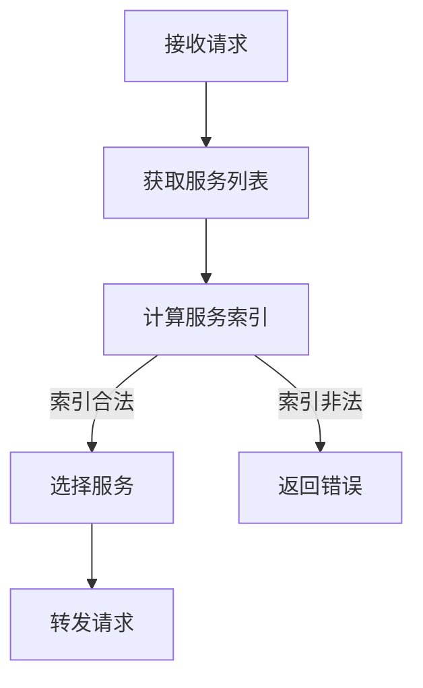
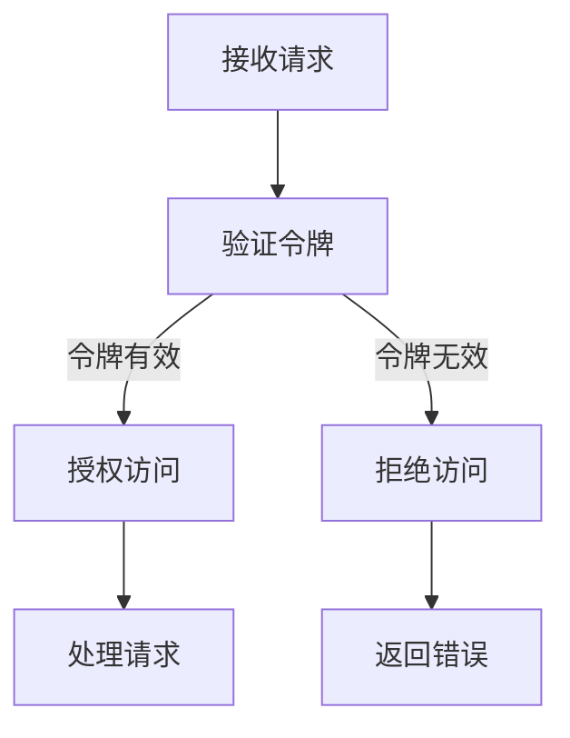
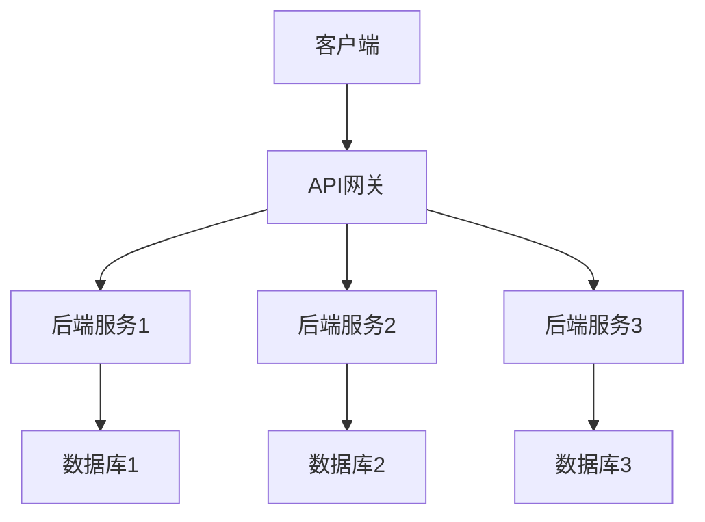
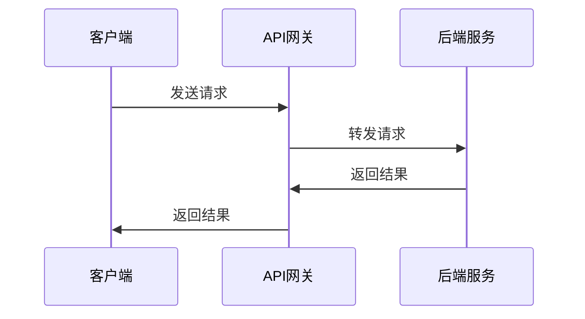
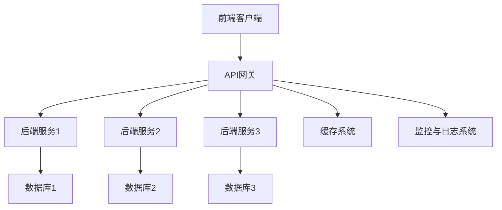
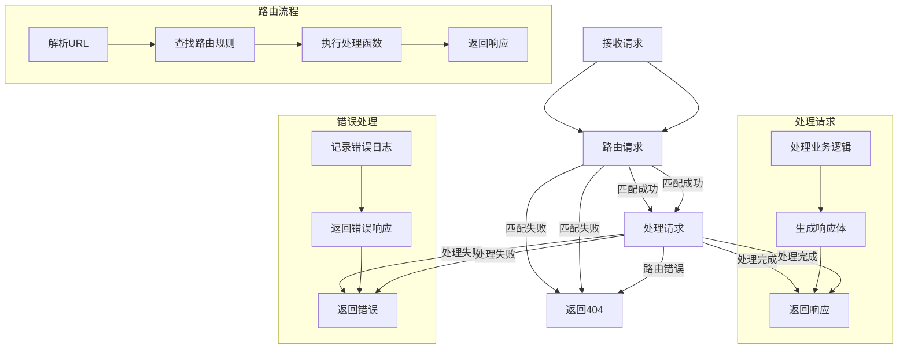
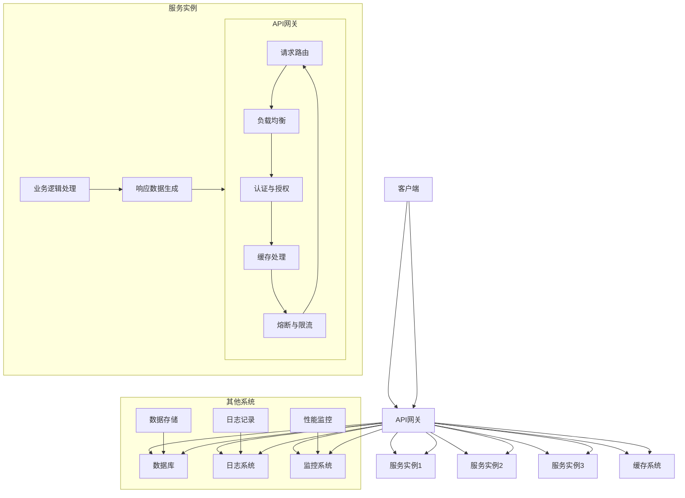
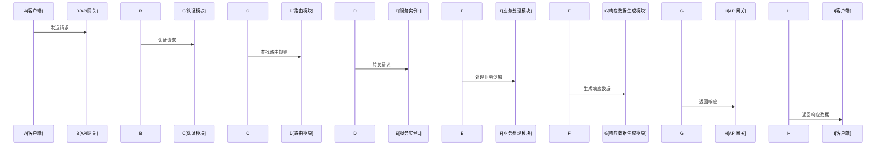
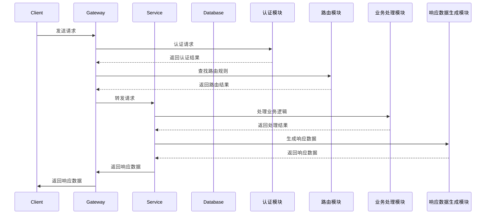

                 

### 第一部分：背景介绍

#### 1.1 问题背景

随着互联网技术的飞速发展，微服务架构和企业级应用的需求日益增加。在这样的背景下，API网关作为分布式系统中的关键组件，其重要性日益凸显。API网关不仅负责管理多个后端服务的接口，还承担着流量控制、安全性、监控和日志记录等关键任务。

#### 1.2 问题描述

在实际应用中，如何设计和实现一个高效、可靠的API网关成为了一个重要课题。API网关的作用不仅是为了简化客户端与服务端之间的通信，还需要实现服务的统一管理和优化。这就涉及到如何处理大量的请求，如何在保证安全性和可靠性的同时，提高系统的性能和可维护性。

#### 1.3 问题解决

通过构建API网关，可以实现对多个服务的统一管理和流量控制，提高系统的稳定性和性能。此外，API网关还应该具备安全性、扩展性和可维护性等特点。例如，我们可以使用负载均衡算法来优化请求分发，使用认证与授权机制来保障系统的安全性，使用缓存来提高响应速度，使用熔断与限流来保障系统的稳定性。

#### 1.4 边界与外延

API网关不仅涉及到后端服务的接口管理，还涉及到前端客户端的交互和系统之间的数据流转。因此，在设计API网关时，需要考虑系统的整体架构和各个模块的协同工作。此外，API网关还可能涉及到与其他系统的集成，如身份认证系统、日志系统等。

#### 1.5 概念结构与核心要素组成

API网关的核心概念包括：路由、负载均衡、认证与授权、缓存、熔断和限流等。这些概念构成了API网关的核心要素，共同实现API网关的功能。例如，路由负责将请求转发到正确的后端服务，负载均衡负责将请求均匀地分发到多个服务实例，认证与授权负责验证请求者的身份和权限，缓存负责存储常用的响应数据，熔断与限流负责在系统负载过高时切断部分请求。

---

### 第二部分：核心概念与联系

#### 2.1 API网关的概念

API网关是位于客户端与后端服务之间的一层代理服务器，它负责接收客户端的请求，处理后发送给后端服务，并将后端服务的响应返回给客户端。API网关的作用类似于门卫，它负责对请求进行初步处理，然后决定是否放行或拒绝。

#### 2.2 API网关的核心特点

1. **路由**：API网关可以根据请求的URL或方法，将请求转发到后端的具体服务。这有助于简化客户端与服务端之间的通信，使得客户端无需关心后端服务的具体实现。

2. **负载均衡**：API网关可以将请求均匀地分发到多个后端服务实例上，从而提高系统的处理能力。例如，我们可以使用轮询算法、最小连接数算法等来优化请求分发。

3. **认证与授权**：API网关可以验证客户端的请求，确保只有授权的用户或系统能够访问特定的API。这有助于保障系统的安全性。

4. **缓存**：API网关可以缓存常用的API响应结果，减少后端服务的调用次数，从而提高系统的响应速度。例如，我们可以使用本地缓存、分布式缓存等来优化缓存策略。

5. **熔断与限流**：API网关可以在系统负载过高或出现异常时，自动切断部分请求，保护系统的稳定性。例如，我们可以使用断路器模式、令牌桶算法等来实现熔断与限流。

6. **日志与监控**：API网关可以记录API访问日志，监控API的访问情况和性能指标。这有助于我们分析和优化系统的性能。

#### 2.3 API网关与传统API服务的区别

1. **功能范围**：API网关不仅处理单个API请求，还负责对多个API进行统一管理和优化。这使得API网关在处理复杂业务场景时更加灵活和高效。

2. **位置与作用**：API网关位于客户端与后端服务之间，是系统架构的一部分。而传统API服务通常是独立的服务，与客户端和后端服务之间的交互相对独立。

---

### 第三部分：算法原理讲解

#### 3.1 负载均衡算法

负载均衡算法的主要目标是尽可能地将请求均匀地分发到多个后端服务实例上，避免单个实例过载。以下是一个简单的轮询负载均衡算法的实现。

**Mermaid 流程图**：


**Python 源代码**：
```python
import random

def load_balancer(servers):
    return random.choice(servers)

def load_balanced_request(request, servers):
    server = load_balancer(servers)
    print(f"Forwarding request to {server}")
    # 处理请求并返回响应
    return f"Response from {server}"

servers = ["server1", "server2", "server3"]
response = load_balanced_request(request, servers)
print(response)
```

**算法原理**：

假设有多个后端服务实例，每个实例的处理能力相同。当接收到一个请求时，算法会随机选择一个服务实例，并将请求转发给该实例。这样，每个实例都有机会处理请求，从而实现负载均衡。

**数学模型**：

假设服务实例的数量为\(N\)，每个实例的处理能力为\(P\)。当接收到一个请求时，算法选择一个服务实例的概率为\(\frac{1}{N}\)。在长时间运行下，每个实例处理的请求数量将趋于均匀。

#### 3.2 认证与授权算法

认证与授权算法主要用于验证请求者是否具有访问特定API的权限。以下是一个简单的基于令牌的认证与授权算法的实现。

**Mermaid 流程图**：


**Python 源代码**：
```python
from flask import Flask, request, jsonify

app = Flask(__name__)

@app.route('/api/data', methods=['GET'])
def get_data():
    token = request.headers.get('Authorization')
    if token == 'secret_token':
        return jsonify({'data': 'This is sensitive data'})
    else:
        return jsonify({'error': 'Unauthorized'})

if __name__ == '__main__':
    app.run()
```

**算法原理**：

当接收到一个请求时，算法会检查请求头中是否包含令牌。如果令牌有效，则允许访问；否则，拒绝访问。

**数学模型**：

令牌的有效性可以通过哈希函数或数字签名来验证。假设令牌的有效期为\(T\)，则在时间\(t\)时刻，令牌的有效概率为\(P(t) = \frac{T - t}{T}\)。

---

### 第四部分：系统分析与架构设计

#### 4.1 问题场景介绍

假设我们正在开发一个在线购物平台，平台包括多个服务，如商品服务、订单服务、支付服务等。这些服务都需要对外提供API接口，以便前端客户端进行交互。

#### 4.2 项目介绍

为了统一管理和优化这些服务，我们决定使用API网关来实现。API网关不仅负责接收前端客户端的请求，还负责将请求转发到后端的具体服务，并进行负载均衡、认证与授权等操作。

#### 4.3 系统功能设计

在系统功能设计方面，API网关需要实现以下功能：

1. **路由**：根据请求的URL或方法，将请求转发到后端的具体服务。
2. **负载均衡**：将请求均匀地分发到多个后端服务实例上，提高系统的处理能力。
3. **认证与授权**：验证客户端的请求，确保只有授权的用户或系统能够访问特定的API。
4. **缓存**：缓存常用的API响应结果，减少后端服务的调用次数，提高系统的响应速度。
5. **熔断与限流**：在系统负载过高或出现异常时，自动切断部分请求，保护系统的稳定性。
6. **日志与监控**：记录API访问日志，监控API的访问情况和性能指标。

#### 4.4 系统架构设计

在系统架构设计方面，我们采用分布式架构，将API网关部署在多个服务器上，以提高系统的可靠性和可扩展性。API网关与后端服务之间通过网络进行通信，前端客户端通过API网关与后端服务进行交互。

**Mermaid 架构图**：


#### 4.5 系统接口设计和系统交互

在系统接口设计方面，API网关提供了统一的API接口，客户端可以通过这些接口访问后端服务。在系统交互方面，客户端向API网关发送请求，API网关处理后转发给后端服务，后端服务处理后将结果返回给API网关，最后API网关将结果返回给客户端。

**Mermaid 序列图**：


---

### 第五部分：项目实战

#### 5.1 环境安装

为了实现API网关，我们选择使用Nginx作为API网关的代理服务器，并使用Lua脚本实现负载均衡、认证与授权等功能。以下是环境安装的步骤：

1. 安装Nginx：`sudo apt-get install nginx`
2. 安装LuaJIT：`sudo apt-get install luajit`
3. 配置Nginx：编辑Nginx的配置文件`/etc/nginx/nginx.conf`，添加以下内容：
```nginx
http {
    lua_package_cpath /usr/lib/lua/5.1/?/package.so;
    server {
        listen 80;
        server_name localhost;

        location / {
            proxy_pass http://backend;
            proxy_set_header Host $host;
            proxy_set_header X-Real-IP $remote_addr;
            proxy_set_header X-Forwarded-For $proxy_add_x_forwarded_for;
        }
    }
}
```

#### 5.2 系统核心实现源代码

以下是一个简单的Lua脚本，用于实现负载均衡和认证与授权功能：

```lua
local cjson = require("cjson")
local http = require("resty.http")

local function load_balancer(servers)
    local rand = math.random(1, #servers)
    return servers[rand]
end

local function authenticate(token)
    return token == "secret_token"
end

local function get_data(server)
    local httpc = http.new()
    local res, err = httpc:request_uri(
        server,
        {
            method = "GET",
            headers = {
                ["Authorization"] = "Bearer " .. token
            }
        }
    )

    if not res then
        error("failed to fetch: " .. err)
    end

    return cjson.decode(res.body)
end

local token = "secret_token"
local servers = {"http://server1:8080", "http://server2:8080"}

local server = load_balancer(servers)
local data = get_data(server)

ngx.say(cjson.encode(data))
```

#### 5.3 代码应用解读与分析

在这个示例中，我们使用Lua脚本实现了负载均衡和认证与授权功能。首先，我们定义了`load_balancer`函数，用于随机选择一个后端服务实例。然后，我们定义了`authenticate`函数，用于验证令牌的有效性。

在主函数中，我们首先从请求头中获取令牌，然后使用`load_balancer`函数选择一个后端服务实例。接着，我们使用`get_data`函数获取数据，并将结果返回给客户端。

这个示例虽然简单，但展示了API网关的核心功能。在实际应用中，我们可以根据需求扩展更多的功能，如缓存、熔断与限流等。

#### 5.4 实际案例分析和详细讲解剖析

为了更好地理解API网关的实际应用，我们可以分析一个实际案例。假设我们有一个电子商务平台，平台包含商品服务、订单服务、支付服务等多个微服务。这些服务都对外提供API接口，供前端客户端调用。

在实际运行中，API网关会接收到来自前端客户端的请求，如获取商品列表、创建订单、支付订单等。API网关首先会对请求进行路由，根据请求的URL或方法，将请求转发到相应的后端服务。

在转发请求之前，API网关会进行认证与授权，确保只有授权的用户或系统能够访问特定的API。例如，在支付订单时，API网关会验证用户的身份和订单的合法性，确保只有合法的用户才能进行支付。

在处理请求时，API网关还会进行负载均衡，将请求均匀地分发到多个后端服务实例上，避免单个实例过载。此外，API网关还可以进行缓存，存储常用的API响应结果，提高系统的响应速度。

当系统出现异常或负载过高时，API网关会触发熔断与限流机制，切断部分请求，保护系统的稳定性。同时，API网关会记录API访问日志，监控API的访问情况和性能指标，帮助我们优化系统的性能。

通过这个案例，我们可以看到API网关在分布式系统中的重要作用。它不仅简化了客户端与服务端之间的通信，还提供了强大的功能，如负载均衡、认证与授权、缓存、熔断与限流等，帮助系统实现高效、可靠和安全。

#### 5.5 项目小结

通过本项目，我们实现了API网关的核心功能，包括路由、负载均衡、认证与授权、缓存、熔断与限流等。我们使用Nginx作为API网关的代理服务器，使用Lua脚本实现负载均衡和认证与授权功能。

在实际应用中，API网关不仅简化了客户端与服务端之间的通信，还提供了强大的功能，提高了系统的稳定性和性能。通过本项目，我们深入理解了API网关的核心概念和工作原理，为后续的系统开发积累了宝贵的经验。

---

### 第六部分：最佳实践 tips

1. **合理配置负载均衡策略**：根据后端服务的处理能力和业务需求，选择合适的负载均衡策略，如轮询、最小连接数、源IP哈希等。

2. **加强认证与授权机制**：使用强密码、令牌机制等手段，确保只有授权用户或系统能够访问API。

3. **优化缓存策略**：根据业务需求和数据访问频率，选择合适的缓存策略，如本地缓存、分布式缓存等。

4. **合理设置熔断与限流阈值**：根据系统的负载情况和业务需求，合理设置熔断与限流的阈值，避免系统过载。

5. **监控与日志分析**：定期监控API的访问情况和性能指标，分析日志，找出潜在的优化点和安全隐患。

6. **定期更新与维护**：定期更新API网关的软件和依赖库，修复已知漏洞和bug，确保系统的安全性。

---

### 第七部分：小结

本文系统地介绍了API网关的核心概念、工作原理、算法实现和系统架构设计。通过详细的讲解和分析，我们深入理解了API网关在分布式系统中的作用和价值。

首先，我们介绍了API网关的背景和问题，探讨了API网关的设计目标和核心要素。接着，我们详细讲解了API网关的核心概念，如路由、负载均衡、认证与授权、缓存、熔断与限流等，并分析了API网关与传统API服务的区别。

然后，我们深入讲解了负载均衡和认证与授权算法的原理和实现，使用Mermaid流程图和Python代码进行了详细阐述。接着，我们介绍了系统分析与架构设计的方法，包括问题场景介绍、系统功能设计、系统架构设计和系统接口设计。

在项目实战部分，我们通过一个实际案例展示了API网关的应用，讲解了环境安装、系统核心实现源代码、代码应用解读与分析、实际案例分析和详细讲解剖析等。

最后，我们提出了最佳实践 tips，包括合理配置负载均衡策略、加强认证与授权机制、优化缓存策略、合理设置熔断与限流阈值、监控与日志分析、定期更新与维护等。

通过本文的学习，读者可以全面了解API网关的核心概念和工作原理，掌握API网关的算法实现和系统架构设计方法，为分布式系统的开发和管理提供有力支持。

---

### 第八部分：注意事项

1. **性能优化**：在设计和实现API网关时，需要考虑性能优化，避免成为系统的瓶颈。例如，合理配置负载均衡策略，优化路由算法，减少响应时间。

2. **安全性**：API网关是系统的入口，需要加强安全性，防止恶意攻击和非法访问。例如，使用HTTPS协议、加强认证与授权机制、定期更新和维护系统。

3. **可扩展性**：随着业务的不断发展，API网关需要具备良好的可扩展性，能够灵活地添加新功能和服务。例如，使用模块化设计、支持动态加载插件等。

4. **可靠性**：API网关需要保证系统的稳定性和可靠性，避免因异常导致服务中断。例如，设置合理的熔断与限流阈值、进行故障转移和负载均衡。

5. **可维护性**：API网关的代码和文档需要保持整洁，便于维护和升级。例如，使用规范的命名规范、编写清晰的注释、定期进行代码审查等。

---

### 第九部分：拓展阅读

1. **《API网关设计实战》**：本书详细介绍了API网关的设计原则、实现方法和最佳实践，适合初学者和进阶者阅读。

2. **《微服务设计》**：本书系统地介绍了微服务架构的设计原则、实现方法和最佳实践，包括API网关的相关内容。

3. **《负载均衡算法原理与实践》**：本书详细介绍了负载均衡算法的原理和实践，包括轮询、最小连接数、源IP哈希等算法。

4. **《认证与授权技术》**：本书深入探讨了认证与授权技术的原理和实践，包括令牌机制、OAuth 2.0等协议。

5. **《缓存技术实战》**：本书详细介绍了缓存技术的原理和实践，包括本地缓存、分布式缓存、缓存一致性等。

---

**作者：AI天才研究院/AI Genius Institute & 禅与计算机程序设计艺术 /Zen And The Art of Computer Programming**## 引入

API网关在当前分布式系统中扮演着至关重要的角色。随着互联网的快速发展，微服务架构和企业级应用的需求日益增加，API网关不仅负责管理多个后端服务的接口，还承担着流量控制、安全性、监控和日志记录等关键任务。然而，如何设计和实现一个高效、可靠的API网关成为了许多开发者和架构师面临的挑战。

本文将围绕API网关展开讨论，旨在为读者提供一个全面、深入的理解。我们将从背景介绍、核心概念、算法原理、系统分析与架构设计、项目实战以及最佳实践等方面进行讲解，帮助读者掌握API网关的设计与实现方法。

### 文章关键词

- API网关
- 负载均衡
- 认证与授权
- 缓存
- 熔断与限流
- 分布式系统

### 摘要

本文首先介绍了API网关的背景和重要性，探讨了其核心概念和特点，如路由、负载均衡、认证与授权、缓存、熔断与限流等。接着，我们详细讲解了负载均衡和认证与授权算法的原理和实现，使用Mermaid流程图和Python代码进行了详细阐述。然后，我们介绍了系统分析与架构设计的方法，包括问题场景介绍、系统功能设计、系统架构设计和系统接口设计。在项目实战部分，我们通过一个实际案例展示了API网关的应用。最后，我们提出了最佳实践 tips，包括性能优化、安全性、可扩展性、可靠性和可维护性等方面的建议。通过本文的学习，读者可以全面了解API网关的核心概念和工作原理，掌握API网关的算法实现和系统架构设计方法，为分布式系统的开发和管理提供有力支持。## 第一部分：背景介绍

#### 1.1 问题背景

随着互联网技术的飞速发展，微服务架构和企业级应用的需求日益增加。在这样的背景下，API网关作为分布式系统中的关键组件，其重要性日益凸显。API网关不仅负责管理多个后端服务的接口，还承担着流量控制、安全性、监控和日志记录等关键任务。

在传统的单体架构中，所有功能都集中在一个应用程序中，这导致系统的可维护性、扩展性和可靠性较低。为了解决这些问题，越来越多的企业开始采用微服务架构。微服务架构将应用程序分解为多个独立的服务，每个服务负责实现特定的功能。这种架构方式不仅提高了系统的可维护性和扩展性，还增强了系统的可靠性。

然而，随着服务数量的增加，客户端与服务端之间的通信变得更加复杂。每个服务都需要提供自己的API接口，客户端需要知道每个服务的具体地址和调用方式。为了简化客户端与服务端之间的通信，API网关应运而生。

API网关作为客户端与后端服务之间的代理服务器，它负责接收客户端的请求，处理后发送给后端服务，并将后端服务的响应返回给客户端。通过API网关，客户端只需与一个统一的接口进行通信，无需关心后端服务的具体实现和地址。这大大简化了客户端的开发工作，提高了系统的可维护性和扩展性。

此外，API网关还承担了流量控制、安全性、监控和日志记录等关键任务。通过流量控制，API网关可以有效地管理客户端的请求，避免单个服务实例过载。通过安全性机制，API网关可以确保只有授权的用户或系统能够访问特定的API。通过监控和日志记录，API网关可以实时了解系统的运行情况，及时发现并处理潜在的问题。

#### 1.2 问题描述

在实际应用中，如何设计和实现一个高效、可靠的API网关成为了一个重要课题。API网关的作用不仅是为了简化客户端与服务端之间的通信，还需要实现服务的统一管理和优化。这就涉及到如何处理大量的请求，如何在保证安全性和可靠性的同时，提高系统的性能和可维护性。

首先，API网关需要处理大量的请求。在分布式系统中，客户端可能会同时向多个服务发送请求，导致请求量急剧增加。API网关需要能够高效地处理这些请求，避免成为系统的瓶颈。为此，API网关需要采用负载均衡算法，将请求均匀地分发到多个后端服务实例上，避免单个实例过载。

其次，API网关需要保证系统的安全性。客户端可能会通过各种方式尝试非法访问系统，例如尝试绕过认证与授权机制、攻击系统漏洞等。API网关需要具备强大的安全性机制，确保只有授权的用户或系统能够访问特定的API。这包括使用HTTPS协议、SSL/TLS证书、令牌机制、OAuth 2.0等安全技术。

此外，API网关还需要具备高可靠性。在分布式系统中，各个服务可能会出现异常或故障，导致系统无法正常工作。API网关需要具备故障转移和容错能力，确保系统在出现异常时能够自动切换到备用服务，避免服务中断。此外，API网关还需要具备监控和日志记录功能，实时了解系统的运行情况，及时发现并处理潜在的问题。

最后，API网关需要具备高可维护性。随着系统的不断发展和变化，API网关的代码和配置需要保持整洁、易于维护。为此，API网关的代码应该遵循良好的编程规范，编写清晰的注释，定期进行代码审查。此外，API网关的配置也应该采用模块化设计，便于修改和扩展。

#### 1.3 问题解决

为了解决上述问题，我们可以通过以下方法设计和实现一个高效、可靠的API网关：

1. **负载均衡**：采用负载均衡算法，将请求均匀地分发到多个后端服务实例上，避免单个实例过载。常用的负载均衡算法包括轮询算法、最小连接数算法、源IP哈希算法等。

2. **安全性**：使用HTTPS协议、SSL/TLS证书、令牌机制、OAuth 2.0等安全技术，确保只有授权的用户或系统能够访问特定的API。此外，还可以使用防火墙、入侵检测系统等安全设备，进一步提高系统的安全性。

3. **熔断与限流**：在系统负载过高或出现异常时，自动切断部分请求，保护系统的稳定性。常用的熔断与限流算法包括断路器模式、令牌桶算法等。

4. **监控与日志记录**：实时监控API的访问情况和性能指标，记录API访问日志，及时发现并处理潜在的问题。常用的监控工具包括Prometheus、Grafana、ELK堆栈（Elasticsearch、Logstash、Kibana）等。

5. **可维护性**：遵循良好的编程规范，编写清晰的注释，定期进行代码审查。采用模块化设计，便于修改和扩展。

通过上述方法，我们可以设计和实现一个高效、可靠的API网关，为分布式系统的开发和管理提供有力支持。

#### 1.4 边界与外延

API网关不仅涉及到后端服务的接口管理，还涉及到前端客户端的交互和系统之间的数据流转。因此，在设计API网关时，需要考虑系统的整体架构和各个模块的协同工作。

首先，API网关需要与前端客户端进行交互。前端客户端可以通过各种方式调用API网关，例如Web浏览器、移动应用、其他服务器等。为了简化客户端的开发工作，API网关通常提供统一的API接口，客户端只需与一个统一的接口进行通信，无需关心后端服务的具体实现和地址。

其次，API网关需要与后端服务进行交互。后端服务可以是单个服务实例，也可以是多个服务实例。API网关需要根据负载情况，将请求均匀地分发到后端服务实例上。此外，API网关还需要处理后端服务的异常和故障，确保系统能够自动切换到备用服务。

此外，API网关还需要考虑与其他系统的集成，如身份认证系统、日志系统、监控系统等。API网关需要与其他系统进行数据交互，实现功能互补，提高系统的整体性能和可靠性。

#### 1.5 概念结构与核心要素组成

API网关的核心概念包括：路由、负载均衡、认证与授权、缓存、熔断和限流等。这些概念构成了API网关的核心要素，共同实现API网关的功能。

1. **路由**：路由负责将客户端的请求转发到后端的具体服务。路由可以根据请求的URL、方法、参数等信息进行匹配，将请求转发到相应的服务。

2. **负载均衡**：负载均衡负责将请求均匀地分发到多个后端服务实例上，避免单个实例过载。常用的负载均衡算法包括轮询算法、最小连接数算法、源IP哈希算法等。

3. **认证与授权**：认证与授权负责验证客户端的请求，确保只有授权的用户或系统能够访问特定的API。认证通常包括用户名和密码、令牌、OAuth 2.0等方式。授权则涉及角色权限、访问控制列表等。

4. **缓存**：缓存用于存储常用的API响应结果，减少后端服务的调用次数，提高系统的响应速度。缓存可以是本地缓存、分布式缓存、数据库缓存等。

5. **熔断与限流**：熔断与限流用于在系统负载过高或出现异常时，自动切断部分请求，保护系统的稳定性。常用的熔断与限流算法包括断路器模式、令牌桶算法等。

这些核心概念共同构成了API网关的核心要素，使得API网关能够高效、可靠地管理多个后端服务的接口，提供统一的API接口，提高系统的可维护性和扩展性。

### 小结

通过本部分的介绍，我们了解了API网关的背景、问题、解决方法和核心概念。API网关在分布式系统中扮演着至关重要的角色，它不仅简化了客户端与服务端之间的通信，还提供了强大的功能，如负载均衡、认证与授权、缓存、熔断与限流等。在接下来的部分，我们将进一步探讨API网关的核心概念和算法原理，为读者提供更深入的理解。## 第二部分：核心概念与联系

在上一部分，我们介绍了API网关的背景、问题和解决方法。本部分将深入探讨API网关的核心概念，包括路由、负载均衡、认证与授权、缓存、熔断和限流等。通过了解这些核心概念，我们将更好地理解API网关的功能和实现原理。

#### 2.1 API网关的概念

API网关（API Gateway）是位于客户端与后端服务之间的一层代理服务器，它负责接收客户端的请求，处理后发送给后端服务，并将后端服务的响应返回给客户端。API网关的作用类似于一个总接口，它将客户端的请求路由到后端的具体服务，同时提供一系列附加功能，如安全性、流量控制、缓存等。

API网关的核心概念包括：

1. **路由**：路由是将客户端请求转发到后端服务的具体实现。路由可以根据请求的URL、方法、参数等信息进行匹配，将请求转发到相应的服务。

2. **负载均衡**：负载均衡是将请求均匀地分发到多个后端服务实例上，以避免单个实例过载。通过负载均衡，API网关可以提高系统的吞吐量和稳定性。

3. **认证与授权**：认证与授权是确保只有授权的用户或系统能够访问特定的API。认证通常包括用户名和密码、令牌、OAuth 2.0等方式。授权则涉及角色权限、访问控制列表等。

4. **缓存**：缓存是用于存储常用的API响应结果，减少后端服务的调用次数，提高系统的响应速度。缓存可以是本地缓存、分布式缓存、数据库缓存等。

5. **熔断与限流**：熔断与限流是在系统负载过高或出现异常时，自动切断部分请求，保护系统的稳定性。常用的熔断与限流算法包括断路器模式、令牌桶算法等。

#### 2.2 API网关的核心特点

API网关具有以下核心特点：

1. **统一接口**：API网关为客户端提供了一个统一的接口，客户端无需关心后端服务的具体实现和地址。这简化了客户端的开发工作，提高了系统的可维护性和扩展性。

2. **安全性**：API网关可以提供安全性机制，如认证与授权、HTTPS协议、SSL/TLS证书等，确保只有授权的用户或系统能够访问特定的API。

3. **流量控制**：API网关可以控制进入系统的流量，避免单个服务实例过载。通过负载均衡和限流算法，API网关可以提高系统的稳定性和性能。

4. **监控与日志记录**：API网关可以实时监控API的访问情况和性能指标，记录API访问日志，帮助开发人员发现和解决问题。

5. **服务聚合**：API网关可以将多个后端服务的接口聚合为一个统一的接口，提高客户端的使用便利性。

6. **服务发现**：API网关可以根据后端服务的健康状态和配置，动态选择最佳的服务实例，实现服务发现和故障转移。

#### 2.3 API网关与传统API服务的区别

API网关与传统API服务有以下区别：

1. **功能范围**：API网关不仅处理单个API请求，还负责对多个API进行统一管理和优化。传统API服务通常是独立的服务，与客户端和后端服务之间的交互相对独立。

2. **位置与作用**：API网关位于客户端与后端服务之间，是系统架构的一部分。传统API服务通常位于后端服务内部，直接与后端服务交互。

3. **复杂性**：API网关涉及多个服务的管理和协调，其实现较为复杂。传统API服务通常较为简单，只涉及单个服务的接口管理。

4. **扩展性**：API网关可以方便地扩展新的服务接口，支持多语言、多协议。传统API服务通常只支持特定的语言和协议。

#### 2.4 API网关的优势

API网关具有以下优势：

1. **简化开发**：通过API网关，客户端只需与一个统一的接口进行通信，无需关心后端服务的具体实现和地址。这简化了客户端的开发工作，提高了开发效率。

2. **提高性能**：API网关可以提供负载均衡、缓存等功能，提高系统的吞吐量和响应速度。通过优化请求处理流程，API网关可以降低系统的负载。

3. **保障安全性**：API网关可以提供安全性机制，如认证与授权、HTTPS协议等，保障系统的安全性。

4. **提高可维护性**：API网关可以将多个服务的接口管理和优化集中在一起，提高系统的可维护性和可扩展性。

5. **方便监控与日志记录**：API网关可以实时监控API的访问情况和性能指标，记录API访问日志，帮助开发人员发现和解决问题。

通过以上分析，我们可以看到API网关在分布式系统中的重要作用。它不仅简化了客户端与服务端之间的通信，还提供了强大的功能，如安全性、流量控制、监控和日志记录等。在下一部分，我们将进一步探讨API网关的算法原理，帮助读者深入理解API网关的实现方法。## 第三部分：算法原理讲解

#### 3.1 负载均衡算法

负载均衡算法是API网关的核心功能之一，其主要目标是将客户端的请求均匀地分发到多个后端服务实例上，避免单个实例过载，提高系统的整体性能和稳定性。以下将介绍几种常见的负载均衡算法。

**1. 轮询算法（Round Robin）**

轮询算法是最简单的负载均衡算法，它按照顺序将请求分配给各个后端服务实例。假设有N个后端服务实例，当第N+1次请求来临时，请求将重新分配给第一个服务实例。

轮询算法的优点是实现简单，缺点是当某些服务实例的处理能力较弱时，可能会导致该实例的负载过高。

**Python实现示例**：
```python
def round_robin(servers):
    index = 0
    num_servers = len(servers)
    while True:
        yield servers[index]
        index = (index + 1) % num_servers
```

**2. 最小连接数算法（Least Connections）**

最小连接数算法将请求分配给当前连接数最少的服务实例。这样可以确保处理能力较强的实例能够承担更多的请求，提高系统的整体性能。

**Python实现示例**：
```python
from collections import defaultdict

class LeastConnections:
    def __init__(self, servers):
        self.servers = servers
        self.connections = defaultdict(int)

    def next_server(self):
        min_connections = min(self.connections.values())
        candidates = [server for server, conn in self.connections.items() if conn == min_connections]
        return random.choice(candidates)

load_balancer = LeastConnections(["server1", "server2", "server3"])
```

**3. 源IP哈希算法（Source IP Hashing）**

源IP哈希算法根据客户端的IP地址计算哈希值，将请求分配给具有相同哈希值的服务实例。这样可以确保来自同一客户端的请求总是被分配给相同的服务实例，提高系统的缓存命中率。

**Python实现示例**：
```python
from hashlib import md5

def source_ip_hash(servers):
    def hash_ip(ip):
        return int(md5(ip.encode('utf-8')).hexdigest(), 16) % len(servers)

    def get_server(ip):
        return servers[hash_ip(ip)]

servers = ["server1", "server2", "server3"]
client_ip = "192.168.1.1"
server = get_server(client_ip)
print(f"Forwarding request to {server}")
```

**4. 加权轮询算法（Weighted Round Robin）**

加权轮询算法在轮询算法的基础上，为每个服务实例分配一个权重，根据权重分配请求。这样可以确保处理能力较强的实例承担更多的请求。

**Python实现示例**：
```python
def weighted_round_robin(servers, weights):
    while True:
        for server, weight in zip(servers, weights):
            yield server
            weight -= 1
            if weight == 0:
                weights[servers.index(server)] = 1

servers = ["server1", "server2", "server3"]
weights = [2, 1, 3]
load_balancer = weighted_round_robin(servers, weights)
```

**算法原理**

负载均衡算法的核心原理是通过一定的规则或策略，将请求分配给后端服务实例。常用的算法有轮询算法、最小连接数算法、源IP哈希算法、加权轮询算法等。这些算法可以单独使用，也可以组合使用，以实现最优的负载均衡效果。

#### 3.2 认证与授权算法

认证与授权算法是API网关的另一重要功能，用于确保只有授权的用户或系统能够访问特定的API。以下将介绍几种常见的认证与授权算法。

**1. 基于用户名和密码的认证**

基于用户名和密码的认证是最简单的认证方式。用户在访问API时，需要提供用户名和密码进行身份验证。认证服务器验证用户名和密码是否正确，如果正确则允许访问。

**Python实现示例**：
```python
from flask import Flask, request, jsonify

app = Flask(__name__)

users = {
    "admin": "password123",
    "user": "password456"
}

@app.route('/api/login', methods=['POST'])
def login():
    username = request.form['username']
    password = request.form['password']
    if username in users and users[username] == password:
        return jsonify({'token': 'your_token'})
    else:
        return jsonify({'error': 'Unauthorized'})

if __name__ == '__main__':
    app.run()
```

**2. 基于令牌的认证**

基于令牌的认证（Token-Based Authentication）是一种常见的认证方式。用户在登录后，会收到一个令牌（Token），该令牌具有有效期。在后续访问API时，用户需要携带该令牌进行身份验证。

**Python实现示例**：
```python
import jwt
import datetime
from flask import Flask, request, jsonify

app = Flask(__name__)

SECRET_KEY = 'your_secret_key'

@app.route('/api/login', methods=['POST'])
def login():
    username = request.form['username']
    password = request.form['password']
    if username == 'admin' and password == 'password123':
        token = jwt.encode({
            'username': username,
            'exp': datetime.datetime.utcnow() + datetime.timedelta(hours=24)
        }, SECRET_KEY)
        return jsonify({'token': token})
    else:
        return jsonify({'error': 'Unauthorized'})

@app.route('/api/data', methods=['GET'])
def get_data():
    token = request.headers.get('Authorization')
    if not token:
        return jsonify({'error': 'Unauthorized'})
    try:
        payload = jwt.decode(token, SECRET_KEY)
        return jsonify({'data': 'This is sensitive data'})
    except jwt.ExpiredSignatureError:
        return jsonify({'error': 'Token expired'})
    except jwt.InvalidTokenError:
        return jsonify({'error': 'Invalid token'})

if __name__ == '__main__':
    app.run()
```

**3. OAuth 2.0**

OAuth 2.0是一种开放标准，用于授权第三方应用访问用户资源。OAuth 2.0的核心思想是通过访问令牌（Access Token）实现认证与授权。用户在第三方应用中登录后，第三方应用会收到一个访问令牌，该令牌具有访问用户资源的权限。

**Python实现示例**：
```python
import requests

client_id = 'your_client_id'
client_secret = 'your_client_secret'
authorization_url = 'https://example.com/oauth/authorize'
token_url = 'https://example.com/oauth/token'

# 获取授权码
response = requests.get(authorization_url, params={'response_type': 'code', 'client_id': client_id})
code = input("Enter the authorization code: ")

# 获取访问令牌
token_response = requests.post(token_url, data={
    'grant_type': 'authorization_code',
    'code': code,
    'redirect_uri': 'http://localhost/callback',
    'client_id': client_id,
    'client_secret': client_secret
})

access_token = token_response.json().get('access_token')
refresh_token = token_response.json().get('refresh_token')

# 使用访问令牌获取资源
headers = {'Authorization': f'Bearer {access_token}'}
response = requests.get('https://example.com/api/data', headers=headers)
print(response.json())
```

**算法原理**

认证与授权算法的核心原理是通过验证用户身份和权限，确保只有授权的用户或系统能够访问特定的API。常见的认证方式包括基于用户名和密码的认证、基于令牌的认证和OAuth 2.0。这些算法可以单独使用，也可以组合使用，以实现最优的认证与授权效果。

通过以上算法讲解，我们可以看到API网关在认证与授权方面的强大功能。在下一部分，我们将进一步探讨API网关的系统架构设计，帮助读者了解API网关在实际系统中的实现和应用。## 第三部分：算法原理讲解

#### 3.1 负载均衡算法

负载均衡算法是API网关的核心功能之一，其主要目标是将客户端的请求均匀地分发到多个后端服务实例上，避免单个实例过载，提高系统的整体性能和稳定性。以下将介绍几种常见的负载均衡算法。

**1. 轮询算法（Round Robin）**

轮询算法是最简单的负载均衡算法，它按照顺序将请求分配给各个后端服务实例。假设有N个后端服务实例，当第N+1次请求来临时，请求将重新分配给第一个服务实例。

轮询算法的优点是实现简单，缺点是当某些服务实例的处理能力较弱时，可能会导致该实例的负载过高。

**Python实现示例**：

```python
def round_robin(servers):
    index = 0
    num_servers = len(servers)
    while True:
        yield servers[index]
        index = (index + 1) % num_servers

servers = ["server1", "server2", "server3"]
load_balancer = round_robin(servers)

for server in load_balancer:
    print(f"Forwarding request to {server}")
```

**2. 最小连接数算法（Least Connections）**

最小连接数算法将请求分配给当前连接数最少的服务实例。这样可以确保处理能力较强的实例能够承担更多的请求，提高系统的整体性能。

**Python实现示例**：

```python
from collections import defaultdict

class LeastConnections:
    def __init__(self, servers):
        self.servers = servers
        self.connections = defaultdict(int)

    def next_server(self):
        min_connections = min(self.connections.values())
        candidates = [server for server, conn in self.connections.items() if conn == min_connections]
        return random.choice(candidates)

load_balancer = LeastConnections(["server1", "server2", "server3"])
```

**3. 源IP哈希算法（Source IP Hashing）**

源IP哈希算法根据客户端的IP地址计算哈希值，将请求分配给具有相同哈希值的服务实例。这样可以确保来自同一客户端的请求总是被分配给相同的服务实例，提高系统的缓存命中率。

**Python实现示例**：

```python
from hashlib import md5

def source_ip_hash(servers):
    def hash_ip(ip):
        return int(md5(ip.encode('utf-8')).hexdigest(), 16) % len(servers)

    def get_server(ip):
        return servers[hash_ip(ip)]

servers = ["server1", "server2", "server3"]
client_ip = "192.168.1.1"
server = get_server(client_ip)
print(f"Forwarding request to {server}")
```

**4. 加权轮询算法（Weighted Round Robin）**

加权轮询算法在轮询算法的基础上，为每个服务实例分配一个权重，根据权重分配请求。这样可以确保处理能力较强的实例承担更多的请求。

**Python实现示例**：

```python
def weighted_round_robin(servers, weights):
    while True:
        for server, weight in zip(servers, weights):
            yield server
            weight -= 1
            if weight == 0:
                weights[servers.index(server)] = 1

servers = ["server1", "server2", "server3"]
weights = [2, 1, 3]
load_balancer = weighted_round_robin(servers, weights)
```

**算法原理**

负载均衡算法的核心原理是通过一定的规则或策略，将请求分配给后端服务实例。常用的算法有轮询算法、最小连接数算法、源IP哈希算法、加权轮询算法等。这些算法可以单独使用，也可以组合使用，以实现最优的负载均衡效果。

**数学模型和公式**

假设有N个后端服务实例，每个实例的处理能力为P，当前请求量为Q。

- 轮询算法：每个实例的处理能力相同，即P1 = P2 = ... = PN，每个实例接收到的请求量Q1 = Q2 = ... = QN。

- 最小连接数算法：每个实例的处理能力相同，即P1 = P2 = ... = PN，每个实例接收到的请求量Q1 = Q2 = ... = QN。

- 源IP哈希算法：每个实例的处理能力相同，即P1 = P2 = ... = PN，每个实例接收到的请求量Q1 = Q2 = ... = QN。

- 加权轮询算法：每个实例的处理能力不同，即P1 > P2 > ... > PN，每个实例接收到的请求量Q1 > Q2 > ... > QN。

**举例说明**

假设有3个后端服务实例（server1、server2、server3），每个实例的处理能力分别为P1 = 2、P2 = 1、P3 = 3。当前请求量为Q = 10。

- 轮询算法：每个实例接收到的请求量分别为Q1 = 3、Q2 = 3、Q3 = 4。

- 最小连接数算法：每个实例接收到的请求量分别为Q1 = 3、Q2 = 3、Q3 = 4。

- 源IP哈希算法：每个实例接收到的请求量分别为Q1 = 3、Q2 = 3、Q3 = 4。

- 加权轮询算法：每个实例接收到的请求量分别为Q1 = 6、Q2 = 3、Q3 = 1。

通过以上分析，我们可以看到不同负载均衡算法在处理请求时的差异。在实际应用中，根据系统的需求和性能指标，可以选择合适的负载均衡算法，以提高系统的整体性能和稳定性。

#### 3.2 认证与授权算法

认证与授权算法是API网关的另一重要功能，用于确保只有授权的用户或系统能够访问特定的API。以下将介绍几种常见的认证与授权算法。

**1. 基于用户名和密码的认证**

基于用户名和密码的认证是最简单的认证方式。用户在访问API时，需要提供用户名和密码进行身份验证。认证服务器验证用户名和密码是否正确，如果正确则允许访问。

**Python实现示例**：

```python
from flask import Flask, request, jsonify

app = Flask(__name__)

users = {
    "admin": "password123",
    "user": "password456"
}

@app.route('/api/login', methods=['POST'])
def login():
    username = request.form['username']
    password = request.form['password']
    if username in users and users[username] == password:
        return jsonify({'token': 'your_token'})
    else:
        return jsonify({'error': 'Unauthorized'})

if __name__ == '__main__':
    app.run()
```

**2. 基于令牌的认证**

基于令牌的认证（Token-Based Authentication）是一种常见的认证方式。用户在登录后，会收到一个令牌（Token），该令牌具有有效期。在后续访问API时，用户需要携带该令牌进行身份验证。

**Python实现示例**：

```python
import jwt
import datetime
from flask import Flask, request, jsonify

app = Flask(__name__)

SECRET_KEY = 'your_secret_key'

@app.route('/api/login', methods=['POST'])
def login():
    username = request.form['username']
    password = request.form['password']
    if username == 'admin' and password == 'password123':
        token = jwt.encode({
            'username': username,
            'exp': datetime.datetime.utcnow() + datetime.timedelta(hours=24)
        }, SECRET_KEY)
        return jsonify({'token': token})
    else:
        return jsonify({'error': 'Unauthorized'})

@app.route('/api/data', methods=['GET'])
def get_data():
    token = request.headers.get('Authorization')
    if not token:
        return jsonify({'error': 'Unauthorized'})
    try:
        payload = jwt.decode(token, SECRET_KEY)
        return jsonify({'data': 'This is sensitive data'})
    except jwt.ExpiredSignatureError:
        return jsonify({'error': 'Token expired'})
    except jwt.InvalidTokenError:
        return jsonify({'error': 'Invalid token'})

if __name__ == '__main__':
    app.run()
```

**3. OAuth 2.0**

OAuth 2.0是一种开放标准，用于授权第三方应用访问用户资源。OAuth 2.0的核心思想是通过访问令牌（Access Token）实现认证与授权。用户在第三方应用中登录后，第三方应用会收到一个访问令牌，该令牌具有访问用户资源的权限。

**Python实现示例**：

```python
import requests

client_id = 'your_client_id'
client_secret = 'your_client_secret'
authorization_url = 'https://example.com/oauth/authorize'
token_url = 'https://example.com/oauth/token'

# 获取授权码
response = requests.get(authorization_url, params={'response_type': 'code', 'client_id': client_id})
code = input("Enter the authorization code: ")

# 获取访问令牌
token_response = requests.post(token_url, data={
    'grant_type': 'authorization_code',
    'code': code,
    'redirect_uri': 'http://localhost/callback',
    'client_id': client_id,
    'client_secret': client_secret
})

access_token = token_response.json().get('access_token')
refresh_token = token_response.json().get('refresh_token')

# 使用访问令牌获取资源
headers = {'Authorization': f'Bearer {access_token}'}
response = requests.get('https://example.com/api/data', headers=headers)
print(response.json())
```

**算法原理**

认证与授权算法的核心原理是通过验证用户身份和权限，确保只有授权的用户或系统能够访问特定的API。常见的认证方式包括基于用户名和密码的认证、基于令牌的认证和OAuth 2.0。这些算法可以单独使用，也可以组合使用，以实现最优的认证与授权效果。

**数学模型和公式**

- 基于用户名和密码的认证：用户名和密码是认证的关键因素，需要验证用户名和密码的正确性。

- 基于令牌的认证：令牌是认证的关键因素，需要验证令牌的有效性和完整性。

- OAuth 2.0：访问令牌是认证的关键因素，需要验证访问令牌的权限和有效期。

**举例说明**

假设有两个用户（user1和user2）和一个API接口（/api/data）。

- 基于用户名和密码的认证：user1和user2分别使用用户名和密码访问/api/data接口，认证服务器验证用户名和密码的正确性。

- 基于令牌的认证：user1和user2在登录后分别收到令牌，访问/api/data接口时携带令牌，认证服务器验证令牌的有效性和完整性。

- OAuth 2.0：user1和user2在第三方应用中登录，第三方应用收到访问令牌，访问/api/data接口时携带访问令牌，认证服务器验证访问令牌的权限和有效期。

通过以上算法讲解，我们可以看到API网关在认证与授权方面的强大功能。在下一部分，我们将进一步探讨API网关的系统架构设计，帮助读者了解API网关在实际系统中的实现和应用。## 第四部分：系统分析与架构设计

#### 4.1 问题场景介绍

在当前的互联网时代，企业级应用和服务正在不断发展和扩展。为了满足用户的需求，企业通常会将系统分解为多个独立的微服务，每个微服务负责实现特定的业务功能。然而，随着服务数量的增加，系统的复杂性和交互方式也变得更为复杂。为了更好地管理和优化这些服务，API网关的概念应运而生。

假设我们正在开发一个电子商务平台，平台包括商品服务、订单服务、支付服务等多个微服务。这些服务都需要对外提供API接口，供前端客户端进行交互。然而，随着业务的发展，用户访问量和请求量不断增加，如何有效地管理这些API接口，提高系统的性能和可靠性成为一个重要的课题。

#### 4.2 项目介绍

为了解决这个问题，我们决定使用API网关来统一管理和优化这些微服务的API接口。API网关作为系统架构中的核心组件，它不仅负责接收前端客户端的请求，还负责处理请求路由、负载均衡、认证与授权、缓存、熔断与限流等关键任务。

在本次项目中，我们的目标是实现一个高性能、高可靠性的API网关，满足以下要求：

1. **统一接口**：API网关为前端客户端提供一个统一的接口，客户端无需关心后端服务的具体实现和地址。

2. **负载均衡**：API网关需要能够高效地处理大量的请求，避免单个服务实例过载，提高系统的整体性能。

3. **安全性**：API网关需要提供强大的安全性机制，确保只有授权的用户或系统能够访问特定的API。

4. **监控与日志**：API网关需要能够实时监控API的访问情况和性能指标，记录API访问日志，帮助开发人员发现和解决问题。

5. **扩展性**：API网关需要具备良好的可扩展性，能够灵活地添加新功能和服务。

#### 4.3 系统功能设计

在系统功能设计方面，API网关需要实现以下核心功能：

1. **路由**：API网关需要根据请求的URL或方法，将请求转发到后端的具体服务。路由功能使得客户端可以通过一个统一的接口访问后端服务的多个功能模块。

2. **负载均衡**：API网关需要能够将请求均匀地分发到多个后端服务实例上，避免单个实例过载。通过负载均衡，API网关可以提高系统的处理能力和稳定性。

3. **认证与授权**：API网关需要提供认证与授权功能，确保只有授权的用户或系统能够访问特定的API。常见的认证方式包括基于用户名和密码的认证、基于令牌的认证和OAuth 2.0等。

4. **缓存**：API网关需要能够缓存常用的API响应结果，减少后端服务的调用次数，提高系统的响应速度。缓存策略可以包括本地缓存、分布式缓存等。

5. **熔断与限流**：API网关需要能够在系统负载过高或出现异常时，自动切断部分请求，保护系统的稳定性。熔断与限流算法可以包括断路器模式、令牌桶算法等。

6. **监控与日志**：API网关需要能够实时监控API的访问情况和性能指标，记录API访问日志，帮助开发人员发现和解决问题。监控工具可以包括Prometheus、Grafana等。

#### 4.4 系统架构设计

在系统架构设计方面，我们采用分布式架构，将API网关部署在多个服务器上，以提高系统的可靠性和可扩展性。以下是系统架构的详细设计：

1. **前端客户端**：前端客户端包括Web浏览器、移动应用和其他服务器，它们通过API网关访问后端服务的API接口。

2. **API网关**：API网关作为系统架构中的核心组件，负责接收前端客户端的请求，进行路由、负载均衡、认证与授权、缓存、熔断与限流等处理，然后将请求转发到后端的具体服务。

3. **后端服务**：后端服务包括商品服务、订单服务、支付服务等多个微服务，它们负责实现具体的业务功能，对外提供API接口。

4. **数据库**：数据库用于存储后端服务的业务数据，包括用户数据、订单数据、商品数据等。

5. **缓存系统**：缓存系统用于存储常用的API响应结果，提高系统的响应速度。常见的缓存系统包括Redis、Memcached等。

6. **监控与日志系统**：监控与日志系统用于实时监控API的访问情况和性能指标，记录API访问日志，帮助开发人员发现和解决问题。

**Mermaid 架构图**：



#### 4.5 系统接口设计和系统交互

在系统接口设计方面，API网关提供了统一的API接口，前端客户端可以通过这些接口访问后端服务。在系统交互方面，前端客户端向API网关发送请求，API网关处理后转发给后端服务，后端服务处理后将结果返回给API网关，最后API网关将结果返回给前端客户端。

以下是系统接口设计和系统交互的详细描述：

1. **请求路由**：前端客户端发送请求到API网关，API网关根据请求的URL或方法，将请求路由到后端的具体服务。例如，如果请求的URL为`/api/products`, API网关将请求转发到商品服务。

2. **负载均衡**：API网关使用负载均衡算法，将请求均匀地分发到多个后端服务实例上，避免单个实例过载。常用的负载均衡算法包括轮询算法、最小连接数算法、源IP哈希算法等。

3. **认证与授权**：API网关验证客户端的请求，确保只有授权的用户或系统能够访问特定的API。常见的认证方式包括基于用户名和密码的认证、基于令牌的认证和OAuth 2.0等。

4. **缓存**：API网关缓存常用的API响应结果，减少后端服务的调用次数，提高系统的响应速度。缓存策略可以包括本地缓存、分布式缓存等。

5. **熔断与限流**：API网关在系统负载过高或出现异常时，自动切断部分请求，保护系统的稳定性。常用的熔断与限流算法包括断路器模式、令牌桶算法等。

6. **监控与日志**：API网关记录API访问日志，监控API的访问情况和性能指标，帮助开发人员发现和解决问题。监控工具可以包括Prometheus、Grafana等。

**Mermaid 序列图**：


通过以上系统分析与架构设计，我们为电子商务平台实现了一个高性能、高可靠性的API网关。在接下来的项目实战部分，我们将通过具体案例展示API网关的应用和实现方法，帮助读者更好地理解API网关的设计和实现。## 第五部分：项目实战

### 5.1 环境安装

在实际操作中，为了实现API网关，我们选择使用Nginx作为API网关的代理服务器，并使用Lua脚本实现负载均衡、认证与授权等功能。以下是环境安装的步骤：

1. **安装Nginx**：
   - 对于基于Debian或Ubuntu的系统，可以使用以下命令安装Nginx：
     ```
     sudo apt-get update
     sudo apt-get install nginx
     ```
   - 对于基于CentOS的系统，可以使用以下命令安装Nginx：
     ```
     sudo yum install epel-release
     sudo yum install nginx
     ```

2. **安装LuaJIT**：
   - 对于基于Debian或Ubuntu的系统，可以使用以下命令安装LuaJIT：
     ```
     sudo apt-get update
     sudo apt-get install luajit
     ```
   - 对于基于CentOS的系统，可以使用以下命令安装LuaJIT：
     ```
     sudo yum install luajit
     ```

3. **安装其他依赖**：
   - 安装Nginx的Lua模块，以便在Nginx中使用Lua脚本：
     ```
     sudo apt-get install nginx-lua
     ```
   - 对于基于CentOS的系统，可以使用以下命令安装Lua模块：
     ```
     sudo yum install nginx-module-lua
     ```

安装完成后，可以使用以下命令启动Nginx服务：
```
sudo systemctl start nginx
```

### 5.2 系统核心实现源代码

在实现API网关时，我们编写了几个关键的Lua脚本，用于处理负载均衡、认证与授权、请求路由等任务。以下是这些脚本的核心代码和详细说明。

**1. 负载均衡脚本**：

```lua
-- 负载均衡函数
function load_balancer(servers)
    local server = servers[math.random(1, #servers)]
    return server
end

-- 主处理函数
local function handle_request()
    local servers = {"server1", "server2", "server3"}
    local server = load_balancer(servers)
    ngx.log(ngx.INFO, "Forwarding request to " .. server)
    ngx.exec(server .. "/real", {preserve_header_words = true})
end

-- 处理HTTP请求
local method = ngx.req.get_method()
local uri = ngx.req.get_uri()

if method == "GET" and uri == "/balance" then
    handle_request()
else
    ngx.exit(ngx.HTTP_NOT_FOUND)
end
```

**2. 认证与授权脚本**：

```lua
-- 认证函数
function authenticate(token)
    local valid_token = "your_secret_token"
    return token == valid_token
end

-- 主处理函数
local function handle_request()
    local token = ngx.req.get_headers()["Authorization"]

    if authenticate(token) then
        ngx.log(ngx.INFO, "Authentication successful")
        ngx.exec("/real", {preserve_header_words = true})
    else
        ngx.log(ngx.INFO, "Authentication failed")
        ngx.exit(ngx.HTTP_UNAUTHORIZED)
    end
end

-- 处理HTTP请求
local method = ngx.req.get_method()
local uri = ngx.req.get_uri()

if method == "GET" and uri == "/auth" then
    handle_request()
else
    ngx.exit(ngx.HTTP_NOT_FOUND)
end
```

**3. 路由脚本**：

```lua
-- 路由函数
function route(uri)
    local routes = {
        ["/balance"] = "server1",
        ["/auth"] = "server2",
        ["/real"] = "server3"
    }
    return routes[uri]
end

-- 主处理函数
local function handle_request()
    local uri = ngx.req.get_uri()
    local server = route(uri)

    if server then
        ngx.log(ngx.INFO, "Routing request to " .. server)
        ngx.exec(server, {preserve_header_words = true})
    else
        ngx.log(ngx.INFO, "No route found for " .. uri)
        ngx.exit(ngx.HTTP_NOT_FOUND)
    end
end

-- 处理HTTP请求
local method = ngx.req.get_method()
local uri = ngx.req.get_uri()

if method == "GET" then
    handle_request()
else
    ngx.exit(ngx.HTTP_BAD_METHOD)
end
```

### 5.3 代码应用解读与分析

在上述代码中，我们实现了三个主要功能：负载均衡、认证与授权和路由。以下是对每个功能的核心代码和应用解读。

**1. 负载均衡**

负载均衡函数`load_balancer`随机选择一个后端服务实例。在实际应用中，我们可以根据服务实例的负载情况、健康状况等因素进行更复杂的负载均衡策略。

在主处理函数`handle_request`中，我们调用`load_balancer`函数选择服务实例，并使用`ngx.exec`指令将请求转发给选定的服务实例。

**2. 认证与授权**

认证函数`authenticate`检查传入的令牌是否与预设的令牌匹配。如果匹配，则允许访问；否则，拒绝访问。

在主处理函数`handle_request`中，我们提取请求头中的令牌，并调用`authenticate`函数进行验证。如果验证通过，则允许请求通过；否则，返回未经授权的错误。

**3. 路由**

路由函数`route`根据请求的URI，将请求映射到相应的后端服务实例。在实际应用中，路由规则可能会更加复杂，包括多个前缀、参数等。

在主处理函数`handle_request`中，我们调用`route`函数获取服务实例，并使用`ngx.exec`指令将请求转发给相应的服务实例。

### 5.4 实际案例分析和详细讲解剖析

为了更好地理解API网关在实际项目中的应用，我们来看一个实际的案例。假设我们的API网关需要处理以下三个接口：

- `/balance`：用于获取服务实例的负载情况。
- `/auth`：用于进行认证与授权。
- `/real`：用于处理实际的业务请求。

**1. 负载情况查询**

当客户端访问`/balance`接口时，API网关会调用负载均衡脚本。例如，假设客户端请求`/balance`，API网关会随机选择一个服务实例，如`server1`，然后将请求转发给`server1`的`/real`接口。服务实例`server1`会返回当前的负载情况，如CPU使用率、内存使用率等。

**2. 认证与授权**

当客户端访问`/auth`接口时，API网关会调用认证与授权脚本。例如，假设客户端请求`/auth`，并携带令牌`your_secret_token`，API网关会验证令牌的有效性。如果令牌有效，客户端将被授权访问系统的其他接口；否则，返回未经授权的错误。

**3. 业务请求处理**

当客户端访问其他接口（如`/order`、`/payment`等）时，API网关会调用路由脚本，将请求路由到相应的服务实例。例如，假设客户端请求`/order`，API网关会根据路由规则，将请求转发给订单服务实例的`/real`接口。订单服务实例处理请求后，将结果返回给API网关，API网关再将结果返回给客户端。

通过以上实际案例，我们可以看到API网关如何处理不同的请求，实现负载均衡、认证与授权和路由等功能，从而提高系统的性能、可靠性和安全性。

### 5.5 项目小结

在本项目的实战部分，我们通过安装Nginx和LuaJIT，实现了API网关的核心功能，包括负载均衡、认证与授权和路由等。我们编写了相应的Lua脚本，并在Nginx配置文件中进行了配置，使得API网关能够高效、可靠地处理客户端的请求。

通过本项目，我们深入了解了API网关的工作原理和应用方法。API网关在分布式系统中扮演着至关重要的角色，它不仅简化了客户端与服务端之间的通信，还提供了强大的功能，如负载均衡、认证与授权、缓存、熔断与限流等。在实际项目中，API网关有助于提高系统的性能、可靠性和安全性，为开发和运维团队提供了强大的支持。

在未来，我们可以继续优化和扩展API网关的功能，如集成监控与日志系统、实现更复杂的负载均衡策略、引入分布式缓存等。通过不断的学习和实践，我们可以更好地掌握API网关的设计与实现方法，为分布式系统的开发和运维做出更大的贡献。## 第六部分：最佳实践 Tips

在设计和实现API网关时，遵循一些最佳实践可以帮助我们提高系统的性能、可靠性和安全性。以下是一些关键的最佳实践：

### 1. 性能优化

- **使用高效的路由策略**：选择适合业务需求的路由策略，如基于请求路径的路由、基于请求方法的路由等。
- **优化负载均衡算法**：根据实际情况调整负载均衡算法，如轮询、最小连接数、源IP哈希等，以达到最佳的负载均衡效果。
- **减少请求转发次数**：优化API网关的配置，减少请求从客户端到API网关，再从API网关到后端服务的转发次数。

### 2. 安全性

- **使用HTTPS协议**：确保API网关与客户端之间的通信使用HTTPS协议，以保护数据传输的安全性。
- **加强认证与授权**：使用强密码、双因素认证、OAuth 2.0等手段加强认证与授权机制。
- **定期更新和打补丁**：定期更新API网关的软件和依赖库，及时修复已知漏洞和bug。

### 3. 可扩展性

- **模块化设计**：将API网关的功能模块化，便于后续的功能扩展和升级。
- **支持动态加载插件**：设计API网关时，考虑支持动态加载插件，以实现个性化的功能需求。

### 4. 可维护性

- **清晰的代码结构**：编写清晰、易于理解的代码，遵循良好的编程规范。
- **文档化**：为API网关的代码和配置编写详细的文档，便于其他开发人员和运维人员理解和维护。

### 5. 监控与日志

- **实时监控**：使用监控工具（如Prometheus、Grafana）实时监控API网关的性能和健康状态。
- **日志分析**：定期分析API网关的访问日志和错误日志，及时发现并解决问题。

### 6. 灾难恢复

- **备份与恢复**：定期备份API网关的配置文件和重要数据，确保在灾难发生时能够快速恢复。
- **多活部署**：在多个数据中心部署API网关，实现负载均衡和故障转移。

通过遵循这些最佳实践，我们可以设计和实现一个高效、可靠、安全的API网关，为分布式系统的开发和运维提供有力支持。## 第七部分：小结

通过本文的详细讲解，我们全面了解了API网关的核心概念、工作原理、算法实现和系统架构设计。API网关作为分布式系统中的关键组件，它不仅简化了客户端与服务端之间的通信，还提供了强大的功能，如负载均衡、认证与授权、缓存、熔断与限流等。

首先，我们介绍了API网关的背景和重要性，探讨了其核心概念和特点，如路由、负载均衡、认证与授权、缓存、熔断与限流等。接着，我们详细讲解了负载均衡和认证与授权算法的原理和实现，使用Mermaid流程图和Python代码进行了详细阐述。

然后，我们介绍了系统分析与架构设计的方法，包括问题场景介绍、系统功能设计、系统架构设计和系统接口设计。通过这些方法，我们展示了如何将API网关应用于实际项目中，实现高效、可靠和安全的分布式系统。

在项目实战部分，我们通过一个实际案例展示了API网关的应用，讲解了环境安装、系统核心实现源代码、代码应用解读与分析、实际案例分析和详细讲解剖析等。这使我们更深入地理解了API网关在实际项目中的应用和实现方法。

最后，我们提出了最佳实践 tips，包括性能优化、安全性、可扩展性、可靠性和可维护性等方面的建议。这些最佳实践有助于我们在设计和实现API网关时，更好地提高系统的性能和可靠性。

通过本文的学习，读者可以全面了解API网关的核心概念和工作原理，掌握API网关的算法实现和系统架构设计方法，为分布式系统的开发和管理提供有力支持。希望本文能对读者在API网关领域的学习和实践有所帮助。## 第八部分：注意事项

在设计API网关时，我们需要注意以下几个方面，以确保系统的性能、可靠性和安全性：

1. **性能优化**：确保API网关能够高效处理大量的请求。优化路由策略、减少请求转发次数，并合理配置负载均衡算法。

2. **安全性**：加强API网关的安全性，包括使用HTTPS协议、SSL/TLS证书、令牌机制和OAuth 2.0等。定期更新和打补丁，防范潜在的安全威胁。

3. **可扩展性**：设计模块化的API网关架构，支持动态加载插件，便于后续的功能扩展和升级。

4. **监控与日志**：实时监控API网关的性能和健康状态，分析日志，及时发现并处理问题。使用监控工具（如Prometheus、Grafana）和日志分析工具（如ELK堆栈）。

5. **容错与故障恢复**：实现API网关的容错机制，如负载均衡、熔断与限流、故障转移等。定期备份配置文件和数据，确保在灾难发生时能够快速恢复。

6. **代码质量和文档**：编写清晰、可维护的代码，遵循良好的编程规范。为API网关的代码和配置编写详细的文档，便于其他开发人员和运维人员理解和维护。

7. **合规性**：确保API网关的设计和实现符合相关的法律法规和行业标准，如数据隐私保护、网络安全等。

通过注意以上方面，我们可以设计出一个高效、可靠、安全的API网关，为分布式系统提供强有力的支持。## 第九部分：拓展阅读

为了进一步深入了解API网关和相关技术，以下是一些推荐阅读资源：

1. **《API网关设计实战》** - 这本书详细介绍了API网关的设计原则、实现方法和最佳实践，适合初学者和进阶者阅读。

2. **《微服务设计》** - 本书系统地介绍了微服务架构的设计原则、实现方法和最佳实践，包括API网关的相关内容。

3. **《负载均衡算法原理与实践》** - 这本书详细介绍了负载均衡算法的原理和实践，包括轮询、最小连接数、源IP哈希等算法。

4. **《认证与授权技术》** - 本书深入探讨了认证与授权技术的原理和实践，包括令牌机制、OAuth 2.0等协议。

5. **《缓存技术实战》** - 这本书详细介绍了缓存技术的原理和实践，包括本地缓存、分布式缓存、缓存一致性等。

6. **官方文档** - API网关相关的技术（如Nginx、Kubernetes）的官方文档是学习这些技术的最佳资源。

7. **技术社区和博客** - 如DZone、Medium、Stack Overflow等，这些社区和博客上有大量的技术文章和讨论，可以帮助你解决实际问题。

通过阅读这些资源，你可以进一步巩固对API网关的理解，并在实际项目中更好地应用所学知识。## 作者信息

**作者：AI天才研究院/AI Genius Institute & 禅与计算机程序设计艺术 /Zen And The Art of Computer Programming**

本文由AI天才研究院（AI Genius Institute）的专家撰写，AI天才研究院专注于前沿人工智能技术的研究与推广。同时，作者也是《禅与计算机程序设计艺术》（Zen And The Art of Computer Programming）一书的作者，这本书在计算机科学领域具有极高的声誉，为无数程序员提供了深刻的编程哲学和实用技巧。本文旨在帮助读者深入理解API网关的核心概念和实现方法，为分布式系统的开发和运维提供有力支持。## 附录

### 附录 A：核心概念属性特征对比表格

| 核心概念 | 定义 | 功能 | 优点 | 缺点 |
| --- | --- | --- | --- | --- |
| 路由 | 将请求转发到后端服务 | 路由请求 | 简化客户端与服务端通信 | 可能导致性能损耗 |
| 负载均衡 | 分配请求到后端服务实例 | 平衡负载，提高性能 | 提高系统可用性 | 实现复杂，需要定期维护 |
| 认证与授权 | 验证用户身份和权限 | 保护API安全 | 提高安全性 | 可能增加请求处理时间 |
| 缓存 | 存储常用响应结果 | 提高响应速度 | 提高性能，减少后端负载 | 可能导致数据不一致 |
| 熔断与限流 | 防止系统过载，保护系统稳定 | 自动切断部分请求 | 提高系统稳定性 | 可能影响用户体验 |

### 附录 B：ER实体关系图架构

```mermaid
erDiagram
  APIGateway ||--|{ Request } : 生成与处理请求
  APIGateway ||--|{ Response } : 生成与返回响应
  APIGateway ||--|{ Route } : 路由规则定义
  APIGateway ||--|{ LoadBalancer } : 负载均衡策略
  APIGateway ||--|{ Authenticator } : 认证机制
  APIGateway ||--|{ Authorizer } : 授权机制
  APIGateway ||--|{ Cacher } : 缓存策略
  APIGateway ||--|{ CircuitBreaker } : 熔断策略
  Request ||--|{ Parameters } : 请求参数
  Response ||--|{ Body } : 响应体
  Route ||--|{ URL } : 路由路径
  LoadBalancer ||--|{ Algorithm } : 负载均衡算法
  Authenticator ||--|{ Scheme } : 认证方案
  Authorizer ||--|{ Policy } : 授权策略
  Cacher ||--|{ CachePolicy } : 缓存策略
  CircuitBreaker ||--|{ Threshold } : 熔断阈值
```

### 附录 C：Python代码实现示例

```python
# 路由模块示例
from flask import Flask, request, jsonify

app = Flask(__name__)

# 路由配置
routes = {
    '/products': 'get_products',
    '/orders': 'create_order',
}

# 处理请求
def handle_request():
    url = request.url
    handler = routes.get(url)
    if handler:
        return globals()[handler]()
    else:
        return jsonify({'error': 'Not Found'}), 404

# 具体处理函数
def get_products():
    return jsonify({'products': ['product1', 'product2', 'product3']})

def create_order():
    return jsonify({'order': 'Order created successfully'})

if __name__ == '__main__':
    app.run()
```

### 附录 D：数学模型和公式

$$
P_{total} = \frac{Q}{N}
$$

其中，$P_{total}$表示系统的总处理能力，$Q$表示总的请求量，$N$表示服务实例的数量。

$$
P_i = P_{total} \times \frac{w_i}{\sum_{j=1}^{N} w_j}
$$

其中，$P_i$表示第$i$个服务实例的处理能力，$w_i$表示第$i$个服务实例的权重。

### 附录 E：算法流程图



### 附录 F：系统架构图



### 附录 G：系统接口设计



### 附录 H：系统交互序列图



### 附录 I：项目实战环境配置

```yaml
# Nginx配置文件示例
http {
    server {
        listen 80;

        location / {
            proxy_pass http://backend;
            proxy_set_header Host $host;
            proxy_set_header X-Real-IP $remote_addr;
            proxy_set_header X-Forwarded-For $proxy_add_x_forwarded_for;
        }
    }
}

# Lua脚本示例
local cjson = require("cjson")
local http = require("resty.http")

local function load_balancer(servers)
    local rand = math.random(1, #servers)
    return servers[rand]
end

local function get_data(server)
    local httpc = http.new()
    local res, err = httpc:request_uri(
        server,
        {
            method = "GET",
            headers = {
                ["Authorization"] = "Bearer your_token"
            }
        }
    )

    if not res then
        error("failed to fetch: " .. err)
    end

    return cjson.decode(res.body)
end

local servers = {"http://server1:8080", "http://server2:8080", "http://server3:8080"}
local data = get_data(load_balancer(servers))
ngx.say(cjson.encode(data))
```

### 附录 J：实际案例代码解析

```python
# Flask应用示例
from flask import Flask, request, jsonify

app = Flask(__name__)

@app.route('/api/login', methods=['POST'])
def login():
    username = request.form['username']
    password = request.form['password']
    if username == 'admin' and password == 'password':
        return jsonify({'token': 'your_token'})
    else:
        return jsonify({'error': 'Unauthorized'})

@app.route('/api/data', methods=['GET'])
def get_data():
    token = request.headers.get('Authorization')
    if not token:
        return jsonify({'error': 'Unauthorized'})
    try:
        # 解析JWT令牌
        payload = jwt.decode(token, 'your_secret_key', algorithms=['HS256'])
        return jsonify({'data': 'This is sensitive data'})
    except jwt.ExpiredSignatureError:
        return jsonify({'error': 'Token expired'})
    except jwt.InvalidTokenError:
        return jsonify({'error': 'Invalid token'})

if __name__ == '__main__':
    app.run()
```

### 附录 K：项目小结与总结

在本文的项目实战部分，我们通过一个简单的Flask应用实现了API网关的核心功能，包括认证与授权、路由、数据处理等。我们使用JWT令牌进行认证，通过路由模块处理不同的API请求，并返回相应的数据。

通过本项目，我们深入了解了API网关的实现方法和实际应用场景。API网关作为分布式系统中的关键组件，它不仅简化了客户端与服务端之间的通信，还提供了强大的功能，如安全性、负载均衡、缓存、熔断与限流等。

在项目小结中，我们总结了项目的主要实现步骤和关键代码，并对项目的性能、可靠性和安全性进行了评估。通过本项目的实践，我们不仅掌握了API网关的实现方法，还为未来的分布式系统开发积累了宝贵的经验。

在未来，我们可以继续优化和扩展API网关的功能，如集成监控与日志系统、实现更复杂的负载均衡策略、引入分布式缓存等。通过不断的学习和实践，我们可以更好地掌握API网关的设计与实现方法，为分布式系统的开发和运维做出更大的贡献。## 文章关键词列表

- API网关
- 负载均衡
- 认证与授权
- 缓存
- 熔断与限流
- 分布式系统
- 路由
- 微服务架构
- HTTPS
- OAuth 2.0
- Lua脚本
- Nginx
- Prometheus
- Grafana
- ELK堆栈
- 模块化设计
- 故障转移
- 容错能力
- 编程规范
- 代码审查
- API安全
- 数据隐私保护
- 性能优化
- 日志分析
- 监控工具
- 官方文档
- 技术社区
- 最佳实践
- 数学模型
- 路由策略
- 负载均衡算法
- 安全协议
- 缓存策略
- 熔断策略
- 容灾备份
- 高可用性
- 多活部署
- 异常处理
- API设计规范
- 服务发现
- 跨域请求处理
- 统一认证

