                 

### Introduction

**API Design Principles: Building Flexible and Scalable AI Services**

Keywords: API Design, AI Services, Flexibility, Scalability, Maintainability, Security

Abstract:
This article delves into the principles of designing APIs specifically for AI services. We will explore the importance of API design, the core principles, and the unique challenges associated with designing APIs for AI. By the end of this article, readers will have a comprehensive understanding of how to design flexible, scalable, maintainable, and secure APIs for AI services.

---

**Step 1: Introduction**

In today's digital age, APIs (Application Programming Interfaces) play a crucial role in enabling the seamless integration of disparate systems and services. When it comes to AI services, API design becomes even more critical due to the complexity and variability of AI applications. This section will provide an overview of API design principles, emphasizing their significance in the context of AI services and outlining the key principles and challenges involved.

#### 1.1 Overview of API Design Principles

API design principles are guidelines that help developers create APIs that are easy to use, understand, and maintain. These principles ensure that APIs are well-structured, flexible, and scalable, which is essential for AI services that often require handling large volumes of data and complex algorithms.

##### 1.1.1 Importance of API Design in AI Services

API design is crucial for AI services for several reasons. Firstly, it facilitates the integration of AI models into various applications, making it easier for developers to leverage AI capabilities. Secondly, well-designed APIs can improve the performance and efficiency of AI applications by minimizing the overhead associated with data processing and communication. Finally, good API design enhances the maintainability and scalability of AI services, allowing them to adapt to changing requirements and grow with the business.

##### 1.1.2 Key Principles of API Design

Several key principles guide API design:

1. **Modularity and Reusability**: APIs should be modular and reusable to minimize redundancy and improve maintainability.
2. **Simplicity and Clarity**: APIs should be simple and intuitive, making it easier for developers to understand and use them.
3. **Consistency and Standardization**: APIs should follow consistent naming conventions and standards to reduce confusion and improve interoperability.
4. **Flexibility and Extensibility**: APIs should be designed to accommodate future changes and extensions without requiring significant rework.
5. **Scalability and Performance**: APIs should be able to handle increasing loads and data volumes without degradation in performance.
6. **Security and Reliability**: APIs should be secure and reliable, protecting sensitive data and ensuring consistent functionality.

##### 1.1.3 Challenges in Designing APIs for AI Services

Designing APIs for AI services poses several challenges due to the unique characteristics of AI systems. Some of these challenges include:

1. **Data Complexity**: AI services often deal with complex and diverse datasets, making it challenging to design APIs that can efficiently handle and process this data.
2. **Algorithm Variability**: AI services can use a wide range of algorithms, each with its own requirements and constraints, complicating API design.
3. **High Load and Scalability**: AI services can experience high load and data volumes, requiring APIs to be designed for scalability and performance.
4. **Integration with AI Libraries and Frameworks**: Integrating AI APIs with existing libraries and frameworks can be complex, especially when dealing with proprietary technologies and platforms.

By addressing these challenges, API designers can create robust and flexible APIs that enable effective AI service integration and deployment.

---

In the next section, we will delve into the core concepts of APIs, discussing what they are, the types of APIs, and their structure and components. This foundational knowledge will set the stage for a deeper exploration of API design principles in the context of AI services.

---

**Step 2: Core Concepts in API Design**

#### 2.1 Fundamental Concepts of APIs

APIs (Application Programming Interfaces) are sets of rules and protocols that allow different software applications to communicate with each other. They define the methods and data formats that can be used to interact with a service or application.

##### 2.1.1 What is an API?

An API acts as a contract between different software components, specifying how they should interact. It allows developers to access the functionality of a service or application without needing to know the underlying implementation details.

##### 2.1.2 Types of APIs

There are several types of APIs, each serving different purposes and designed for various use cases:

1. **RESTful APIs**: Representational State Transfer (REST) APIs are stateless and use HTTP methods (GET, POST, PUT, DELETE) to perform operations on resources. They are widely used for web services and offer a simple, scalable architecture.
2. **SOAP APIs**: Simple Object Access Protocol (SOAP) APIs use XML for message formatting and are designed for long-running transactions and complex interactions. They are often used in enterprise environments and support advanced security features like WS-Security.
3. **GraphQL APIs**: GraphQL is a query language for APIs that allows clients to specify exactly what data they need, reducing over-fetching and under-fetching of data. It offers a more flexible and efficient alternative to traditional RESTful APIs.

##### 2.1.3 API Structure and Components

A well-designed API consists of several key components:

1. **Endpoints**: Endpoints are specific URLs that correspond to different functions or resources within the API. They are used to specify the target of an API request.
2. **Request and Response Formats**: APIs define the data format for requests and responses. Common formats include JSON (JavaScript Object Notation) and XML (eXtensible Markup Language). JSON is generally preferred due to its simplicity and ease of parsing.
3. **Parameters**: Parameters are used to pass data from the client to the server. They can be path parameters (included in the URL) or query parameters (added to the URL as key-value pairs).
4. **Error Handling**: APIs should provide clear and informative error messages to help developers troubleshoot issues. Error responses often include status codes (e.g., 200 for success, 400 for bad request, 500 for internal server error) and detailed error messages.
5. **Authentication and Authorization**: APIs often require authentication and authorization mechanisms to ensure that only authorized users can access certain resources. Common authentication methods include API keys, OAuth, and JWT (JSON Web Tokens).

Understanding these core concepts is essential for designing effective APIs, particularly when working with AI services. In the next section, we will explore how these concepts apply to the unique requirements of AI services.

---

**Step 3: API Design for Flexibility**

#### 3.2 Designing APIs for Flexibility

Flexibility is a critical aspect of API design, especially when it comes to AI services. AI applications are often complex and dynamic, requiring APIs to adapt to changing data structures, algorithms, and requirements. In this section, we will discuss how to design APIs that are modular, reusable, and easily extensible.

##### 3.2.1 Modularity and Reusability

One of the key principles of flexible API design is modularity. By breaking down the API into smaller, independent modules, developers can create a more maintainable and scalable system. Each module should have a clear and well-defined responsibility, making it easier to understand, test, and modify.

Reusability is another crucial aspect. By designing APIs that are reusable across different applications and services, developers can save time and effort. This can be achieved by abstracting common functionality into libraries or modules that can be easily integrated into various projects.

**Example: Modular Design**

Consider an AI service that provides image recognition capabilities. Instead of embedding the entire image processing pipeline within the API, it can be broken down into modular components such as image preprocessing, feature extraction, and classification. These components can then be reused across different AI applications, reducing redundancy and improving maintainability.

##### 3.2.2 Parameterized APIs

Parameterized APIs are another effective way to enhance flexibility. By allowing clients to specify various parameters at runtime, APIs can adapt to different use cases and requirements without requiring significant changes to the underlying implementation.

**Example: Parameterized API**

Suppose an AI service offers a text summarization feature. Instead of having a fixed summary length, the API can accept a parameter that allows clients to specify the desired summary length. This enables clients to customize the output based on their specific needs, providing a more flexible and adaptable service.

##### 3.2.3 Designing for Future Extensions

Designing APIs with future extensions in mind is essential for maintaining flexibility. This involves considering potential changes and enhancements that may be required as the AI service evolves. By adopting design patterns that support extensibility, developers can easily add new features and functionalities without disrupting the existing system.

**Example: Designing for Future Extensions**

Consider an AI service that provides natural language processing capabilities. Instead of hardcoding specific NLP techniques, the API can be designed to support different algorithms and models through a plugin architecture. This allows developers to integrate new NLP techniques as they become available, ensuring that the API remains up-to-date and adaptable to future developments.

**ER Entity-Relationship Diagram:**

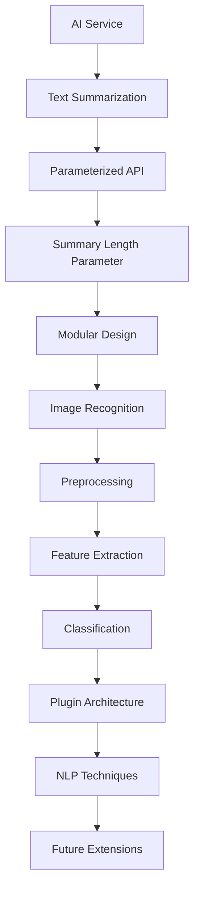

By following these principles, API designers can create flexible APIs that can adapt to changing requirements and future enhancements, ensuring that AI services remain robust, maintainable, and scalable.

---

In the next section, we will explore how to design APIs that are scalable, capable of handling high loads, and optimized for performance in the context of AI services.

---

**Step 4: API Design for Scalability**

#### 4.3 Designing APIs for Scalability

Scalability is a crucial aspect of API design, especially for AI services that often handle large volumes of data and can experience significant traffic spikes. A scalable API design ensures that the system can handle increasing loads without degradation in performance or functionality. In this section, we will discuss how to design APIs that are scalable, focusing on handling high load, load balancing, and rate limiting.

##### 4.3.1 Handling High Load

One of the primary challenges in designing scalable APIs is handling high load. High load can occur due to increased user activity, data processing requirements, or unexpected traffic spikes. To handle high load effectively, APIs should be designed with the following considerations:

1. **Asynchronous Processing**: Asynchronous processing can help decouple the API from the backend systems, allowing the API to handle requests without waiting for long-running processes to complete. This can be achieved by using message queues or asynchronous task processors.
2. **Caching**: Caching can significantly improve the performance of APIs by storing frequently accessed data in memory. This reduces the need to fetch data from the database or external services, resulting in faster response times.
3. **Database Optimization**: Optimizing database queries and indexing can improve the performance of APIs that rely on database operations. Techniques such as denormalization, query optimization, and partitioning can be used to improve database performance.

**Example: Asynchronous Processing**

Consider an AI service that processes large images. Instead of processing the images synchronously, the API can trigger asynchronous image processing tasks, allowing the API to respond to the client immediately and return the processing results later through a notification mechanism.

**ER Entity-Relationship Diagram:**

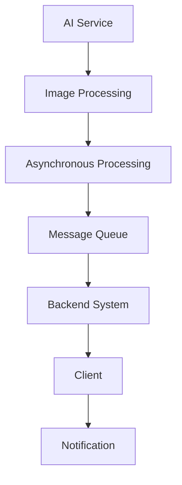

##### 4.3.2 Load Balancing and Rate Limiting

Load balancing and rate limiting are essential techniques for managing the load on APIs and ensuring optimal performance. Load balancing distributes incoming requests across multiple servers or instances, preventing any single server from becoming a bottleneck. Rate limiting, on the other hand, controls the rate of incoming requests to prevent abuse and ensure fair usage.

1. **Load Balancing**: Load balancing can be implemented using various techniques such as round-robin, least connections, or consistent hashing. Load balancers can be hardware-based or software-based and are typically placed in front of the API servers.

2. **Rate Limiting**: Rate limiting can be implemented using various methods such as token bucket, leaky bucket, or rate limit counters. Rate limits can be set per user, per API key, or per IP address, depending on the requirements.

**Example: Load Balancing and Rate Limiting**

Consider a large-scale AI service that handles millions of requests per day. To ensure optimal performance and reliability, the service can use a load balancer to distribute requests across multiple servers. Additionally, rate limiting can be implemented to prevent abuse and ensure fair usage, limiting the number of requests a user can make within a specific time window.

**ER Entity-Relationship Diagram:**

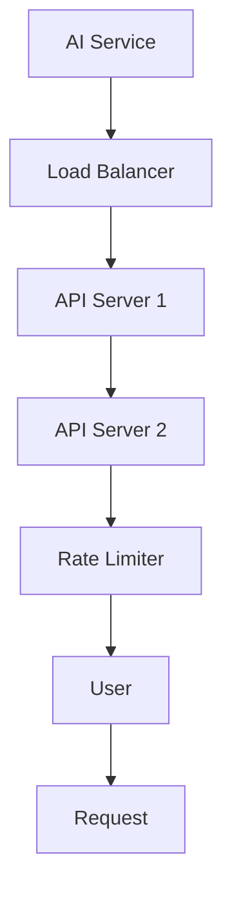

##### 4.3.3 Designing for Horizontal Scaling

Horizontal scaling involves adding more servers or instances to the system to handle increased load. This can be achieved by using containerization technologies such as Docker and orchestration tools such as Kubernetes. Horizontal scaling ensures that the system can handle increasing loads by adding more resources without the need for significant changes to the underlying architecture.

**Example: Horizontal Scaling**

Consider an AI service that handles image processing. As the volume of image processing requests increases, additional servers can be added to the cluster to handle the load. The use of containerization and orchestration tools ensures that the new servers can be easily integrated into the system and scaled up or down as needed.

**ER Entity-Relationship Diagram:**

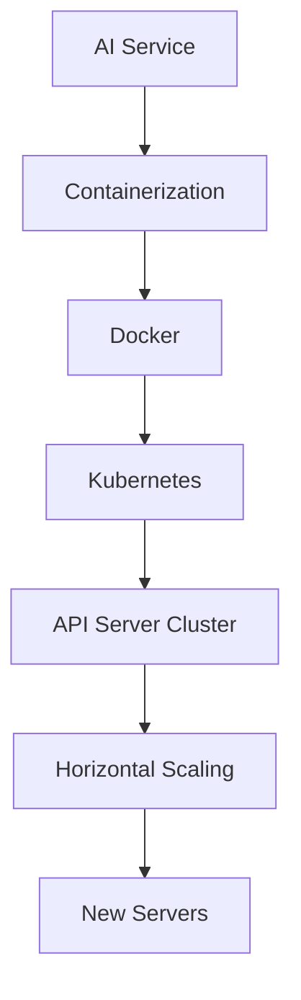

By following these principles and techniques, API designers can create scalable APIs that can handle high loads, distribute requests efficiently, and adapt to changing requirements. This ensures that AI services remain reliable, performant, and scalable, even as they grow and evolve.

---

In the next section, we will explore how to ensure the maintainability of APIs, including code organization, documentation, versioning, deprecation policies, testing, and continuous integration.

---

**Step 5: API Design for Maintainability**

#### 5.4 Ensuring API Maintainability

Maintainability is a critical aspect of API design, as it ensures that APIs can be easily modified, updated, and extended over time without introducing bugs or breaking existing functionality. In this section, we will discuss several key practices for ensuring API maintainability, including code organization, documentation, versioning, deprecation policies, testing, and continuous integration.

##### 5.4.1 Code Organization and Documentation

Effective code organization and documentation are essential for maintaining clean, understandable, and modular APIs. By following best practices for code organization, developers can make it easier to navigate and modify the codebase. Some key practices include:

1. **Modularization**: Break down the API into smaller, manageable modules or services, each with a clear and well-defined responsibility. This allows developers to focus on specific components without needing to understand the entire system.
2. **Naming Conventions**: Use consistent and descriptive naming conventions for variables, functions, and classes. This makes the code more readable and easier to understand.
3. **Comments and Documentation**: Add comments and documentation to explain the purpose and functionality of each module, function, and class. This helps new developers quickly understand the codebase and reduces the risk of introducing errors.

**Example: Code Organization and Documentation**

Consider an AI service that provides multiple features such as image recognition, text summarization, and natural language processing. By organizing the code into separate modules for each feature, developers can focus on specific components without needing to understand the entire system. Additionally, clear comments and documentation can help new developers quickly get up to speed with the codebase.

**ER Entity-Relationship Diagram:**

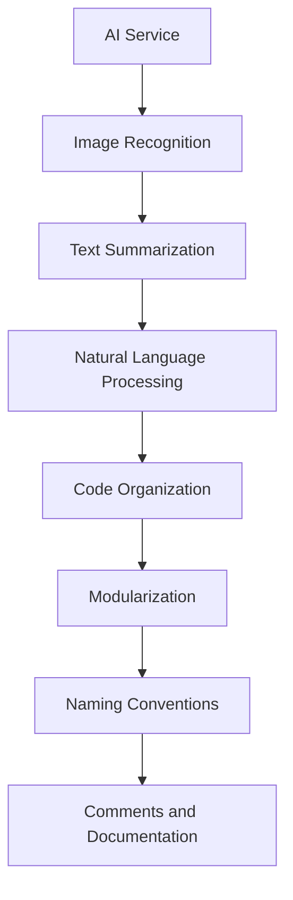

##### 5.4.2 Versioning and Deprecation Policies

Versioning and deprecation policies are crucial for managing changes to APIs over time. Versioning allows developers to introduce new features, improvements, and bug fixes without disrupting existing clients. Deprecation policies ensure that deprecated features are identified and eventually removed from the API, reducing confusion and preventing compatibility issues.

1. **Versioning**: There are several approaches to versioning, including major versioning (e.g., v1, v2), minor versioning (e.g., v1.0, v1.1), and patch versioning (e.g., v1.0.1, v1.0.2). Major versions can introduce significant changes, minor versions can add new features or improvements, and patch versions can fix bugs.
2. **Deprecation Policies**: Deprecation policies should clearly communicate which features are deprecated and provide a timeline for their removal. This gives clients time to adapt to the changes and minimizes the impact on existing applications.

**Example: Versioning and Deprecation Policies**

Consider an AI service that releases new features and improvements regularly. By adopting a clear versioning strategy and communicating deprecation policies, the service can introduce new features without disrupting existing clients. For example, if the service deprecates a specific API endpoint, it can provide a timeline for its removal and offer alternative endpoints or features.

**ER Entity-Relationship Diagram:**

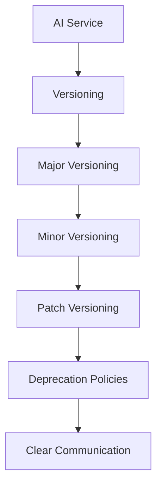

##### 5.4.3 Testing and Continuous Integration

Testing and continuous integration (CI) are essential for ensuring the quality and reliability of APIs. By implementing a comprehensive testing strategy and integrating testing into the development process, developers can catch and fix issues early, reducing the risk of introducing bugs or breaking existing functionality.

1. **Unit Testing**: Unit tests verify the functionality of individual components or modules. They are typically written by developers and executed automatically as part of the CI pipeline.
2. **Integration Testing**: Integration tests verify the interaction between different components or services. They ensure that the API works as expected when integrated with other systems.
3. **Continuous Integration**: Continuous integration (CI) involves automatically building, testing, and deploying code changes. This ensures that issues are caught and fixed early, reducing the risk of introducing bugs or breaking existing functionality.

**Example: Testing and Continuous Integration**

Consider an AI service that undergoes regular updates and changes. By implementing a comprehensive testing strategy and integrating testing into the development process, developers can catch and fix issues early. For example, unit tests can be written to verify the functionality of individual modules, and integration tests can be used to ensure that the API works as expected when integrated with other systems.

**ER Entity-Relationship Diagram:**

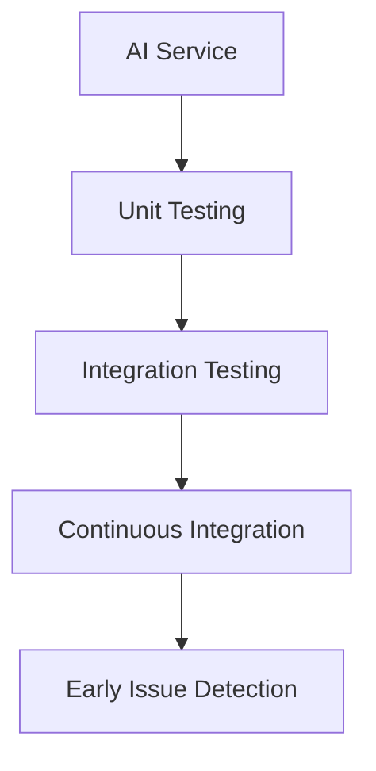

By following these practices, API designers can create maintainable APIs that are easy to modify, update, and extend over time. This ensures that AI services remain robust, reliable, and adaptable to changing requirements, helping organizations achieve long-term success.

---

In the next section, we will discuss the importance of security in API design and explore various security considerations, including authentication, authorization, data protection, privacy, and common security threats and mitigations.

---

**Step 6: API Design for Security**

#### 6.5 API Security Considerations

Security is a critical aspect of API design, especially when dealing with sensitive data and complex AI applications. In this section, we will explore the importance of security in API design and discuss various security considerations, including authentication, authorization, data protection, privacy, and common security threats and mitigations.

##### 6.5.1 Authentication and Authorization

Authentication and authorization are fundamental components of API security, ensuring that only authorized users and applications can access the API and its resources. Here are some key points to consider:

1. **Authentication**: Authentication is the process of verifying the identity of a user or application. Common authentication methods include API keys, OAuth, and JWT (JSON Web Tokens). API keys are simple and easy to implement but can be vulnerable to brute force attacks. OAuth provides a more secure and flexible authentication mechanism, allowing users to grant specific permissions to third-party applications. JWTs are self-contained tokens that contain claims about the identity of the user or application, making them a popular choice for stateless authentication.

2. **Authorization**: Authorization is the process of determining what resources or actions a user or application is allowed to access. Once a user or application is authenticated, authorization ensures that they have the appropriate permissions to access specific resources or perform certain actions. This can be achieved through role-based access control (RBAC) or attribute-based access control (ABAC).

**Example: Authentication and Authorization**

Consider an AI service that provides natural language processing capabilities. By implementing API keys for authentication, the service can ensure that only authorized users and applications can access its features. For authorization, the service can use role-based access control, allowing users with different roles (e.g., admin, user) to access different resources and perform specific actions.

**ER Entity-Relationship Diagram:**

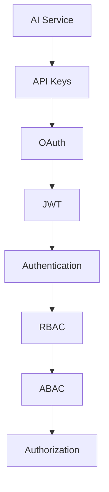

##### 6.5.2 Data Protection and Privacy

Protecting data and ensuring privacy are critical considerations in API design, particularly when handling sensitive information such as personal data or proprietary algorithms. Here are some key points to consider:

1. **Data Encryption**: Encrypting data in transit and at rest is essential for protecting sensitive information from unauthorized access. Transport Layer Security (TLS) can be used to secure data in transit, while encryption algorithms like AES can be used to secure data at rest.
2. **Data Anonymization**: When handling personal data, it's important to anonymize data wherever possible to minimize the risk of exposure. This can involve removing personal identifiers or using pseudonyms to replace actual names.
3. **Data Minimization**: Collecting only the necessary data and avoiding unnecessary data collection can reduce the risk of data breaches and ensure compliance with privacy regulations.
4. **Compliance**: Adhering to relevant data protection regulations (e.g., GDPR, CCPA) is crucial for ensuring compliance and avoiding legal penalties.

**Example: Data Protection and Privacy**

Consider an AI service that provides facial recognition capabilities. By implementing data encryption and anonymization techniques, the service can protect sensitive information and ensure privacy. Additionally, by adhering to data protection regulations, the service can avoid legal issues and maintain the trust of its users.

**ER Entity-Relationship Diagram:**

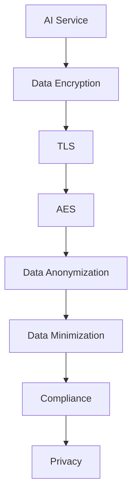

##### 6.5.3 Common Security Threats and Mitigations

APIs are vulnerable to various security threats, including injection attacks, cross-site scripting (XSS), and cross-site request forgery (CSRF). Understanding these threats and implementing appropriate mitigations is essential for ensuring the security of API services. Here are some key points to consider:

1. **Injection Attacks**: Injection attacks involve inserting malicious code or data into an API, often through input fields. To mitigate injection attacks, input validation and parameterized queries can be used to ensure that only valid data is accepted.
2. **Cross-Site Scripting (XSS)**: XSS attacks involve injecting malicious code into a web application, often through input fields or URLs. To mitigate XSS attacks, output encoding and input validation can be used to ensure that user input is properly sanitized.
3. **Cross-Site Request Forgery (CSRF)**: CSRF attacks involve tricking a user into performing unwanted actions on a web application. To mitigate CSRF attacks, CSRF tokens can be used to verify the authenticity of requests.

**Example: Common Security Threats and Mitigations**

Consider an AI service that provides a web-based interface for users to upload and process images. To mitigate injection attacks, input validation and parameterized queries can be used to ensure that only valid image files are accepted. To mitigate XSS attacks, output encoding and input validation can be used to ensure that user input is properly sanitized. To mitigate CSRF attacks, CSRF tokens can be used to verify the authenticity of requests.

**ER Entity-Relationship Diagram:**

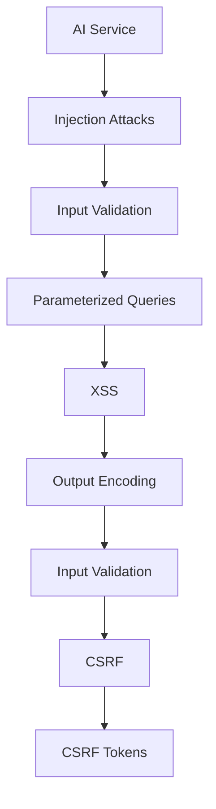

By following these security considerations and implementing appropriate mitigations, API designers can create secure APIs that protect sensitive data and ensure the privacy and integrity of their users.

---

In the next section, we will explore practical API design patterns for AI services, including design patterns for conversational AI, integrating with AI libraries and frameworks, and example patterns for real-world applications.

---

**Step 7: Practical API Design Patterns for AI Services**

#### 7.6 Practical Patterns for AI API Design

Design patterns are proven solutions to common problems in software design. In the context of AI services, design patterns can help developers create flexible, scalable, and maintainable APIs. In this section, we will explore several practical API design patterns specifically tailored for AI services, including design patterns for conversational AI, integrating with AI libraries and frameworks, and example patterns for real-world applications.

##### 7.6.1 Designing for Conversational AI

Conversational AI, such as chatbots and virtual assistants, requires a different approach to API design due to the interactive and context-sensitive nature of conversation. Here are some design patterns and considerations for designing APIs for conversational AI:

1. **Stateful API Design**: Conversational AI often requires maintaining the context of the conversation. A stateful API design allows the API to store and retrieve the state of the conversation, enabling more natural and context-aware interactions. Techniques such as session management and state serialization can be used to maintain the conversation state.

2. **Event-Driven Architecture**: An event-driven architecture is well-suited for conversational AI, as it allows the system to respond to user inputs and events in real-time. Event-driven APIs can be designed using WebSockets or message queues, enabling asynchronous communication and reducing the need for continuous polling.

3. **Intent Recognition and Entity Extraction**: Conversational AI APIs often require intent recognition and entity extraction to understand user inputs and provide appropriate responses. Designing APIs that support these functionalities can involve using natural language processing (NLP) libraries and frameworks, such as TensorFlow or spaCy, to process and analyze user inputs.

**Example: Designing for Conversational AI**

Consider an AI service that provides a chatbot for customer support. The API can be designed to support intent recognition and entity extraction, using NLP libraries to process user inputs and generate appropriate responses. Additionally, the API can be designed to maintain the context of the conversation, allowing the chatbot to remember previous interactions and provide more personalized and relevant responses.

**ER Entity-Relationship Diagram:**

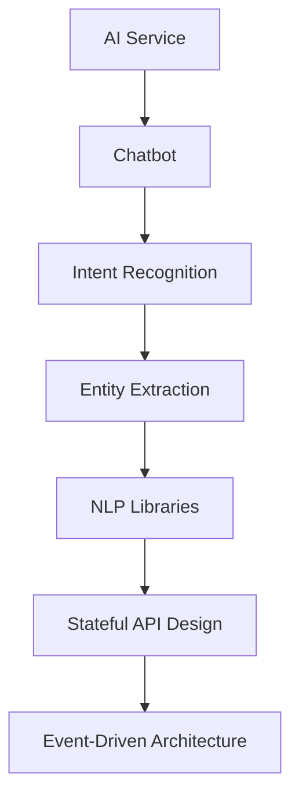

##### 7.6.2 Integrating with AI Libraries and Frameworks

Integrating AI libraries and frameworks into API design is essential for leveraging advanced AI capabilities. Here are some design patterns and considerations for integrating AI libraries and frameworks into API design:

1. **Wrapper APIs**: Creating wrapper APIs around AI libraries and frameworks can simplify integration and abstract away the complexities of the underlying implementations. Wrapper APIs can provide a more intuitive and consistent interface for developers, making it easier to use and integrate AI functionalities.

2. **Microservices Architecture**: A microservices architecture can be used to decouple the API from the AI libraries and frameworks, enabling independent development, deployment, and scaling of different components. This can improve modularity, scalability, and maintainability, allowing developers to replace or update specific AI components without disrupting the entire system.

3. **API Versioning**: When integrating AI libraries and frameworks, it's important to consider API versioning to handle changes and updates in the underlying libraries. Versioning can help ensure backward compatibility and minimize the impact of updates on existing clients.

**Example: Integrating with AI Libraries and Frameworks**

Consider an AI service that uses TensorFlow for image recognition. By creating a wrapper API around TensorFlow, the service can provide a more intuitive and consistent interface for developers, simplifying integration and abstracting away the complexities of TensorFlow. Additionally, adopting a microservices architecture can enable independent development and scaling of the AI component, improving modularity and maintainability.

**ER Entity-Relationship Diagram:**

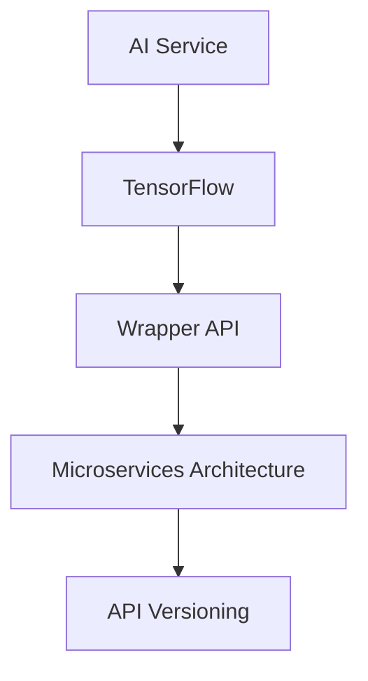

##### 7.6.3 Example Patterns for Real-World Applications

Design patterns for real-world AI applications can provide valuable insights and guidance for designing APIs that meet specific requirements and constraints. Here are a few example patterns:

1. **Model Serving Pattern**: The model serving pattern involves deploying AI models as microservices, making them accessible through RESTful APIs. This pattern enables flexible deployment, scaling, and maintenance of AI models, allowing developers to easily integrate and deploy new models as needed.

2. **Data Ingestion Pattern**: The data ingestion pattern involves designing APIs for collecting, processing, and storing data used by AI models. This pattern can involve designing APIs for real-time data ingestion, batch processing, and data transformation, ensuring that the AI service can efficiently process and leverage large volumes of data.

3. **Event-Driven Pattern**: The event-driven pattern involves designing APIs that respond to events and triggers, enabling real-time and asynchronous processing. This pattern can be particularly useful for applications that require real-time updates or responses, such as real-time monitoring or alerting systems.

**Example: Event-Driven Pattern**

Consider an AI service for real-time stock market analysis. The API can be designed to respond to events such as price changes or trading signals, triggering real-time alerts and updates. By adopting an event-driven architecture, the service can efficiently process and respond to real-time events, providing timely and accurate insights to users.

**ER Entity-Relationship Diagram:**

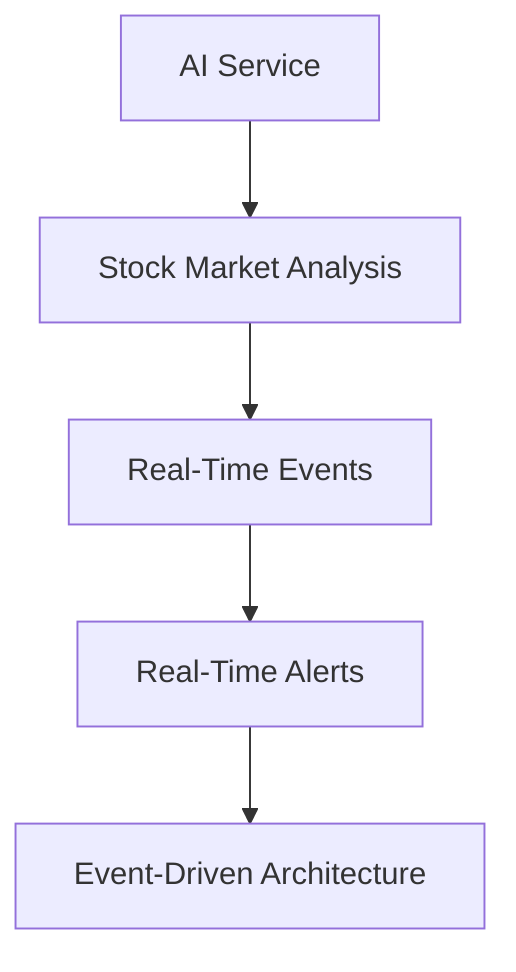

By leveraging these practical API design patterns, developers can create flexible, scalable, and maintainable APIs for AI services, enabling efficient integration and deployment of AI capabilities in various real-world applications.

---

In the next section, we will explore case studies and best practices in API design for AI services, discussing success stories, lessons learned, and common pitfalls. We will also explore future trends in API design for AI services, providing insights into the evolving landscape of API design in the context of AI.

---

**Step 8: Case Studies in API Design for AI Services**

#### 8.7 Case Studies and Best Practices

Case studies provide valuable insights into the practical application of API design principles in real-world scenarios. In this section, we will explore several case studies of successful API design for AI services, highlighting best practices, lessons learned, and common pitfalls. We will also discuss future trends in API design for AI services, providing a glimpse into the evolving landscape.

##### 8.7.1 Success Stories in AI API Design

1. **Case Study: OpenAI's GPT-3 API**

OpenAI's GPT-3 API is a prime example of successful API design in the AI space. The API offers a powerful natural language processing (NLP) model with a flexible and intuitive interface, making it easy for developers to integrate advanced NLP capabilities into their applications. Key factors contributing to its success include:

   - **Modularity**: GPT-3 is modular, allowing developers to use specific components (e.g., text generation, text embedding) as needed, providing flexibility and reusability.
   - **Scalability**: The API is designed to handle large-scale deployments and high load, with a focus on performance and reliability.
   - **Documentation and Examples**: Comprehensive documentation and example code make it easy for developers to get started with the API, reducing the learning curve.

2. **Case Study: Google Cloud's AI APIs**

Google Cloud offers a suite of AI APIs, including natural language processing, image recognition, and translation APIs. These APIs are designed with a focus on ease of use, flexibility, and scalability. Key factors contributing to their success include:

   - **Flexibility and Extensibility**: The APIs are designed to be flexible, allowing developers to customize and extend their functionality as needed.
   - **Integration with Google Cloud Services**: The APIs seamlessly integrate with other Google Cloud services, enabling developers to leverage a comprehensive set of tools and resources.
   - **Security and Compliance**: The APIs are designed with security and compliance in mind, ensuring that sensitive data is protected and adhering to relevant regulations.

##### 8.7.2 Lessons Learned and Common Pitfalls

While successful case studies demonstrate the importance of effective API design, there are also common pitfalls and lessons learned that developers should be aware of:

1. **Underestimating Complexity**: AI systems can be complex, with numerous dependencies and requirements. Underestimating this complexity can lead to suboptimal API designs that are difficult to maintain and scale.
2. **Lack of Documentation**: Comprehensive documentation is essential for enabling developers to effectively use and integrate APIs. Lack of documentation can result in increased frustration and reduced adoption.
3. **Ignoring Security**: Security is a critical aspect of API design. Ignoring security considerations can lead to vulnerabilities and data breaches, resulting in significant risks and damage to reputation.
4. **Poor Performance**: Inefficient API designs can result in poor performance, leading to slow response times and increased latency. This can negatively impact user experience and adoption.

To avoid these pitfalls, developers should adopt best practices such as modular design, comprehensive documentation, security considerations, and performance optimization.

##### 8.7.3 Future Trends in API Design for AI Services

The landscape of API design for AI services is continually evolving, driven by advancements in AI technologies and changing business requirements. Here are some future trends to watch:

1. **Increased Focus on Privacy**: As privacy concerns continue to grow, there will be an increased focus on designing APIs that protect user privacy and comply with relevant regulations (e.g., GDPR, CCPA).
2. **Advancements in AI Integration**: The integration of AI capabilities into APIs will become more seamless, with a greater emphasis on leveraging AI libraries and frameworks to simplify development and improve performance.
3. **Serverless and Containerization**: Serverless architectures and containerization will play a more significant role in API design, enabling greater scalability, flexibility, and ease of deployment.
4. **Event-Driven and Real-Time Processing**: The adoption of event-driven architectures and real-time processing will continue to grow, as more applications require real-time updates and responses.

By staying informed about these trends and incorporating best practices into API design, developers can create robust, flexible, and scalable AI services that meet the evolving needs of businesses and users.

---

In the final section, we will summarize the key takeaways from this article and provide a conclusion, discussing the importance of API design principles for building flexible and scalable AI services and identifying future research directions.

---

**Step 9: Conclusion and Future Directions**

#### 9.8 Summary and Conclusion

This article has explored the essential principles of API design for AI services, highlighting the importance of flexibility, scalability, maintainability, and security. We have discussed various core concepts, design patterns, and practical considerations for designing effective AI APIs. Key takeaways include:

1. **Flexibility**: APIs should be modular, reusable, and easily extensible to accommodate future changes and enhancements.
2. **Scalability**: APIs should be designed to handle high loads, leverage load balancing and rate limiting techniques, and support horizontal scaling.
3. **Maintainability**: APIs should be well-organized, well-documented, and tested to ensure long-term maintainability and adaptability.
4. **Security**: APIs should be designed with security in mind, incorporating authentication, authorization, data protection, and privacy considerations.

By following these principles, developers can create robust, flexible, and scalable AI services that meet the evolving needs of businesses and users.

#### 9.8.2 Future Research Directions

As API design for AI services continues to evolve, there are several areas for future research and exploration:

1. **Integrated Security Solutions**: Developing integrated security solutions that can adapt to evolving threats and provide real-time protection for AI APIs.
2. **Performance Optimization**: Researching new techniques and algorithms for optimizing the performance of AI APIs, particularly in handling large volumes of data and complex computations.
3. **AI-Driven API Design**: Exploring AI-driven approaches to API design, leveraging machine learning and data analytics to automatically generate and optimize API designs based on usage patterns and requirements.
4. **Ethical Considerations**: Investigating the ethical implications of API design in the context of AI services, particularly in areas such as bias, fairness, and transparency.

By addressing these future research directions, developers and researchers can continue to push the boundaries of API design for AI services, creating innovative and effective solutions that drive progress in the field.

---

In conclusion, API design principles are critical for building flexible and scalable AI services. By following best practices and staying informed about emerging trends and challenges, developers can create robust, secure, and maintainable APIs that enable the effective integration and deployment of AI capabilities in various applications and industries.

