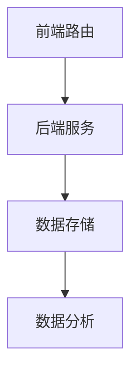
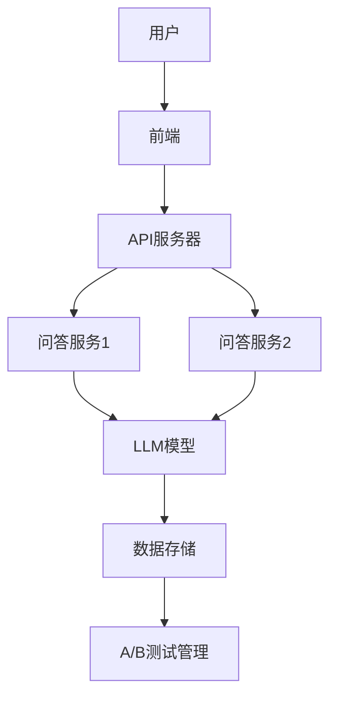

                 

### A/B测试框架支持LLM应用的快速验证

#### 关键词

- A/B测试
- 大型语言模型 (LLM)
- 快速验证
- 测试框架
- 应用实践

#### 摘要

本文深入探讨了A/B测试框架如何支持大型语言模型（LLM）应用的快速验证。首先，我们回顾了A/B测试的基础理论及其在LLM应用中的重要性。接着，我们详细分析了A/B测试框架的设计要点，包括架构、数据收集与处理策略、测试组和对照组的分配以及性能指标和评估方法。然后，我们聚焦于LLM应用的特点和需求，探讨了在LLM应用场景下的A/B测试策略和案例。此外，我们还介绍了快速验证方法及其在A/B测试中的应用，以及A/B测试框架在实际项目中的应用实践和优化策略。最后，通过案例研究和最佳实践总结，为读者提供了丰富的实战经验和未来展望。

### 目录

----------------------------------------------------------------

# A/B测试框架支持LLM应用的快速验证

> 关键词：A/B测试、大型语言模型 (LLM)、快速验证、测试框架、应用实践

> 摘要：本文深入探讨了A/B测试框架如何支持大型语言模型（LLM）应用的快速验证，从理论到实践，为读者提供了全面的指导。

## 第一部分: A/B测试框架概述

## 第1章: A/B测试基础理论

### 1.1 A/B测试的概念和作用

### 1.2 A/B测试与传统测试方法的比较

### 1.3 A/B测试的流程和步骤

### 1.4 A/B测试的优势和挑战

## 第2章: A/B测试框架设计

### 2.1 A/B测试框架的基本架构

### 2.2 数据收集和处理策略

### 2.3 测试组和对照组的分配

### 2.4 性能指标和评估方法

## 第3章: LLM应用场景下的A/B测试

### 3.1 LLM应用的特点和需求

### 3.2 LLM应用中的A/B测试策略

### 3.3 LLM应用的测试案例

### 3.4 LLM应用的测试效果评估

## 第二部分: 快速验证方法

## 第4章: 快速验证的重要性

### 4.1 快速验证的概念

### 4.2 快速验证的技术手段

### 4.3 快速验证的应用实践

### 4.4 快速验证的效果评估

## 第5章: A/B测试框架在LLM中的应用实践

### 5.1 LLM应用的背景介绍

### 5.2 系统架构设计

### 5.3 核心代码实现

### 5.4 测试结果分析

## 第6章: 案例研究

### 6.1 案例一：某搜索引擎的LLM应用A/B测试

### 6.2 案例二：某电商平台的LLM应用A/B测试

### 6.3 案例三：某金融行业的LLM应用A/B测试

## 第三部分: A/B测试框架优化的最佳实践

## 第7章: A/B测试框架优化的最佳实践

### 7.1 A/B测试框架的常见问题

### 7.2 优化策略和技巧

### 7.3 最佳实践总结

### 7.4 注意事项和未来展望

----------------------------------------------------------------

### A/B测试框架概述

在当今快速变化的技术环境中，为了确保产品或服务的成功，对开发过程中的每个环节进行细致的测试至关重要。A/B测试（也称为拆分测试）作为一种有效的测试方法，在许多领域得到了广泛应用。A/B测试框架的目的是通过对比两组用户或系统行为，来确定某一特定变更（如界面设计、算法改进等）对性能的影响。然而，在大型语言模型（LLM）的应用场景中，A/B测试面临着特殊挑战和需求，这需要我们深入理解并优化测试框架。

#### 第1章: A/B测试基础理论

在深入探讨A/B测试框架如何支持LLM应用之前，我们首先需要了解A/B测试的基础理论。本章将分为以下几个部分：

#### 1.1 A/B测试的概念和作用

A/B测试是一种将用户流量分配到不同版本（A组和B组）的方法，以比较两种版本的性能差异。通过这种对比，开发人员可以确定哪些变更能够带来积极的效果，从而做出数据驱动的决策。

#### 1.2 A/B测试与传统测试方法的比较

传统测试方法通常依赖于固定脚本或手动测试，而A/B测试则更加灵活和动态。它允许开发团队在真实环境中测试多个版本，从而获得更可靠的结果。

#### 1.3 A/B测试的流程和步骤

A/B测试的流程包括定义测试目标、设计测试版本、分配用户流量、收集数据和分析结果。每个步骤都有其独特的挑战和注意事项。

#### 1.4 A/B测试的优势和挑战

A/B测试的优势包括数据驱动的决策、更高的测试效率和对用户体验的深入理解。然而，它也面临着数据偏差、统计显著性和测试周期等挑战。

#### 第2章: A/B测试框架设计

了解了基础理论后，接下来我们将讨论A/B测试框架的设计要点。这些要点包括架构、数据收集与处理策略、测试组和对照组的分配以及性能指标和评估方法。

#### 2.1 A/B测试框架的基本架构

A/B测试框架通常包括前端路由、后端服务、数据存储和数据分析等组件。这些组件需要协同工作，以确保测试的准确性和效率。

#### 2.2 数据收集和处理策略

有效的数据收集和处理策略对于A/B测试至关重要。我们需要考虑如何合理地分配用户流量、收集和存储数据，以及如何处理潜在的偏差。

#### 2.3 测试组和对照组的分配

测试组和对照组的分配是A/B测试的核心步骤。我们需要确保分配的公平性，以避免对测试结果的偏差。

#### 2.4 性能指标和评估方法

性能指标和评估方法是衡量测试结果的关键。我们需要选择合适的指标，如点击率、转化率和用户满意度，并使用统计方法进行分析。

#### 第3章: LLM应用场景下的A/B测试

在大型语言模型（LLM）的应用场景中，A/B测试面临着特殊的挑战和需求。本章将探讨这些挑战和需求，并提出相应的解决方案。

#### 3.1 LLM应用的特点和需求

LLM应用通常涉及复杂的自然语言处理任务，如文本生成、问答系统和对话代理。这些应用的特点和需求对A/B测试框架提出了更高的要求。

#### 3.2 LLM应用中的A/B测试策略

针对LLM应用的特点，我们需要设计特定的A/B测试策略。这包括选择合适的测试目标、设计优化的测试版本以及处理复杂的评估指标。

#### 3.3 LLM应用的测试案例

通过具体的测试案例，我们可以更好地理解A/B测试在LLM应用中的实际应用。本章将提供一些典型的测试案例，并分析其结果。

#### 3.4 LLM应用的测试效果评估

对A/B测试结果进行准确评估是确保LLM应用成功的关键。我们需要使用适当的统计方法，如置信区间和假设检验，来评估测试效果。

#### 总结

通过本文的探讨，我们深入了解了A/B测试框架在支持LLM应用快速验证中的重要作用。从基础理论到具体实践，每个章节都提供了详细的分析和指导。希望本文能帮助读者更好地理解和应用A/B测试，为LLM应用的成功提供有力支持。

### A/B测试基础理论

#### 1.1 A/B测试的概念和作用

A/B测试，又称为拆分测试，是一种通过将用户流量分配到不同的版本（A组和B组）来比较两者性能差异的方法。这种测试的核心在于通过实验来验证特定变更对用户行为或系统性能的影响，从而为数据驱动的决策提供依据。A/B测试最早由Servlets.com的RickDeutsch提出，随后在互联网产品和系统中得到了广泛应用。

A/B测试的基本概念很简单：将用户随机分配到两个或多个不同的组，每组看到不同的版本，然后收集和分析数据，以确定哪个版本更有效。例如，在一个电商网站上，A/B测试可以用来比较两个不同的产品推荐算法对销售额的影响。一组用户会看到基于传统算法推荐的产品，而另一组用户则会看到基于机器学习算法推荐的产品。通过分析两组用户的购买行为，开发团队可以确定哪种推荐算法更有效。

A/B测试的作用主要体现在以下几个方面：

1. **数据驱动决策**：通过实验数据，A/B测试帮助团队基于实际用户行为来做出决策，而不是依赖主观判断或直觉。
2. **降低风险**：通过在真实用户环境中进行测试，A/B测试可以帮助团队在推广变更前识别潜在的问题和风险。
3. **优化用户体验**：通过持续测试和改进，A/B测试有助于提供更符合用户需求的产品和服务。
4. **提高转化率**：通过优化网站设计、功能或内容，A/B测试可以帮助提高用户的参与度和转化率。

#### 1.2 A/B测试与传统测试方法的比较

传统测试方法通常包括手动测试、脚本测试和自动化测试等。这些方法在测试过程的某个阶段有一定的作用，但与A/B测试相比，存在以下几个显著的差异：

1. **测试环境**：传统测试方法通常在开发环境或测试环境中进行，而A/B测试则在生产环境中进行。这意味着A/B测试可以直接反映真实用户的行为和反应。
2. **测试范围**：传统测试方法通常对特定功能或模块进行测试，而A/B测试则可以对整个系统或产品的用户体验进行测试。
3. **测试结果**：传统测试方法依赖于测试人员的主观判断和固定脚本，而A/B测试通过实际用户数据来评估效果，结果更为客观。
4. **测试周期**：传统测试方法可能需要较长时间来准备和执行，而A/B测试可以快速迭代，快速反馈结果。

#### 1.3 A/B测试的流程和步骤

A/B测试的流程可以分为以下几个关键步骤：

1. **定义测试目标**：明确希望测试的具体目标，如提高用户点击率、增加注册转化率或提升用户满意度等。
2. **设计测试版本**：根据测试目标，创建两个或多个不同的版本。这些版本可以是不同的页面设计、功能实现或内容呈现。
3. **分配用户流量**：将用户随机分配到不同的测试组，确保每组用户看到的版本相同。分配过程需要确保随机性和公平性，以避免数据偏差。
4. **收集数据**：在测试期间，收集与测试目标相关的数据，如用户行为、点击次数、转化率等。数据收集需要准确和全面，以支持后续分析。
5. **分析结果**：使用统计分析方法，如置信区间和假设检验，对收集到的数据进行分析。评估不同版本的性能差异，确定哪些变更对目标有显著影响。
6. **决策和实施**：根据分析结果，决定是否实施成功的变更。如果结果显著，则推广到整个用户群体；如果结果不明显或负面，则继续优化或放弃该变更。

#### 1.4 A/B测试的优势和挑战

A/B测试的优势主要体现在以下几个方面：

1. **客观性**：通过实际用户行为数据，A/B测试结果更客观，减少了主观判断的影响。
2. **高效性**：A/B测试可以快速迭代和反馈，缩短了测试周期，提高了开发效率。
3. **数据驱动**：A/B测试基于数据驱动决策，有助于提高产品或服务的质量和用户满意度。
4. **风险控制**：通过在生产环境中进行测试，A/B测试可以帮助团队在推广变更前识别潜在问题，降低风险。

然而，A/B测试也面临着一些挑战：

1. **数据偏差**：如果用户分配不均或测试时间过短，可能导致结果偏差，影响决策的准确性。
2. **统计显著性**：确定测试结果是否显著需要考虑统计显著性，否则可能得出误导性的结论。
3. **资源消耗**：A/B测试需要一定的时间和资源来设计和执行，可能对开发和运维团队造成压力。
4. **复杂度**：对于复杂的系统或产品，A/B测试可能涉及多个变量和维度，增加了测试的复杂度。

尽管存在这些挑战，A/B测试仍然是现代开发中不可或缺的一部分，通过合理的设计和执行，可以有效地提高产品或服务的质量。

#### A/B测试框架设计

在了解了A/B测试的基础理论后，接下来我们需要深入探讨A/B测试框架的设计要点。一个有效的A/B测试框架需要考虑多个方面，包括基本架构、数据收集与处理策略、测试组和对照组的分配以及性能指标和评估方法。以下是对这些关键要素的详细分析：

#### 2.1 A/B测试框架的基本架构

A/B测试框架的基本架构通常包括以下几个核心组件：

1. **前端路由**：负责将用户请求随机分配到不同的测试组。前端路由可以通过URL参数、客户端脚本或服务端逻辑来实现。
2. **后端服务**：处理不同组的用户请求，并返回相应的测试版本。后端服务需要支持高并发和负载均衡，以确保测试的公平性和稳定性。
3. **数据存储**：存储与A/B测试相关的数据，包括用户分配信息、测试数据和分析结果。常用的数据存储包括数据库、缓存和日志系统。
4. **数据分析**：对收集到的测试数据进行统计分析，以评估不同版本的性能差异。数据分析工具可以包括数据挖掘平台、统计分析库和自定义脚本。

A/B测试框架的基本架构图如下：



#### 2.2 数据收集和处理策略

数据收集和处理策略是A/B测试成功的关键因素。以下是一些关键点：

1. **用户分配**：确保用户随机分配到不同的测试组，避免人为偏差。可以使用哈希函数、随机数生成器或现有的用户分配库来实现。
2. **数据收集**：收集与测试目标相关的数据，如用户行为、系统性能指标和用户反馈。数据收集需要全面、准确，并且可以在不同的测试组之间进行区分。
3. **数据清洗**：处理异常数据、重复数据和噪声数据，以提高数据质量。常用的数据清洗方法包括去重、过滤和填充缺失值。
4. **数据存储**：选择合适的数据存储方案，以支持高效的数据查询和分析。常用的数据存储包括关系数据库（如MySQL）、NoSQL数据库（如MongoDB）和分布式数据存储系统（如Hadoop）。
5. **数据预处理**：对收集到的数据进行预处理，如数据规范化、特征提取和归一化。预处理有助于提高数据分析的效率和准确性。

#### 2.3 测试组和对照组的分配

测试组和对照组的分配是A/B测试的核心步骤。以下是一些关键点：

1. **随机分配**：确保用户随机分配到测试组和对照组，避免人为偏差。可以使用随机数生成器或现有的随机分配库来实现。
2. **分配比例**：根据测试需求和资源，确定测试组和对照组的比例。通常，测试组和对照组的比例接近1:1，以确保数据的均衡性。
3. **分配跟踪**：记录每个用户的分配情况，以便后续的分析和审计。分配跟踪可以使用日志记录或数据存储来实现。
4. **分配验证**：定期检查分配过程，以确保分配的随机性和公平性。分配验证可以通过数据分析工具来实现。

#### 2.4 性能指标和评估方法

性能指标和评估方法是衡量A/B测试结果的关键。以下是一些常用的性能指标和评估方法：

1. **点击率**：用户点击测试版本的次数与总用户次数的比率。点击率通常用于评估用户对特定内容的兴趣和吸引力。
2. **转化率**：完成特定目标（如购买、注册或下载）的用户数与总用户数的比率。转化率通常用于评估测试版本对用户行为的实际影响。
3. **用户满意度**：通过问卷调查或用户反馈来衡量用户对测试版本的评价。用户满意度通常用于评估用户体验和产品质量。
4. **假设检验**：使用统计学方法，如t检验或卡方检验，来评估测试版本之间的性能差异。假设检验可以帮助确定测试结果的显著性和可靠性。
5. **置信区间**：计算测试结果的置信区间，以确定结果的稳定性和可靠性。置信区间越窄，结果越可靠。

#### 2.5 数据可视化与分析

数据可视化与分析是A/B测试的重要组成部分。以下是一些常用的数据可视化工具和分析方法：

1. **图表**：使用条形图、折线图、饼图等图表来展示测试结果。图表可以直观地显示不同版本之间的性能差异。
2. **热力图**：显示用户行为的热点区域，帮助团队识别用户活动的集中区域和关键点。
3. **用户路径分析**：通过分析用户的导航路径，了解用户如何与测试版本互动，从而优化用户体验。
4. **趋势分析**：通过分析测试期间的数据趋势，了解用户行为和系统性能的变化，以便及时调整和优化测试策略。

#### 总结

A/B测试框架的设计是一个复杂的过程，需要综合考虑多个因素，包括基本架构、数据收集与处理策略、测试组和对照组的分配以及性能指标和评估方法。通过合理的设计和优化，A/B测试框架可以帮助团队在真实用户环境中进行有效的测试，从而提高产品或服务的质量和用户满意度。接下来，我们将进一步探讨A/B测试在大型语言模型（LLM）应用场景中的特殊需求和策略。

### LLM应用场景下的A/B测试

大型语言模型（LLM）在自然语言处理（NLP）领域中具有广泛的应用，包括文本生成、问答系统和对话代理等。这些应用对A/B测试提出了特殊的需求和挑战，因为LLM的行为和用户反馈往往更加复杂和不确定。以下我们将探讨LLM应用场景下的A/B测试的特殊需求、策略和案例。

#### 3.1 LLM应用的特点和需求

LLM应用具有以下几个特点，这些特点对A/B测试的设计和执行产生了重要影响：

1. **复杂性和不确定性**：LLM可以生成高质量的文本，但生成的文本质量和风格可能因模型训练数据、参数设置和输入条件而异。这使得A/B测试中的评估标准更加复杂，难以精确衡量模型性能。
2. **大规模数据处理**：LLM处理的数据量大，生成和评估文本的成本高。A/B测试需要在合理的时间内收集和处理大量数据，以获得可靠的测试结果。
3. **实时性和低延迟**：许多LLM应用要求低延迟和高响应速度，如实时问答系统和聊天机器人。A/B测试框架需要能够快速分配用户流量、收集数据和反馈结果，以满足这些需求。
4. **用户交互的多样性**：LLM应用中的用户交互形式多样，包括文本输入、语音输入和手势操作。A/B测试需要支持多种交互方式，以全面评估LLM性能。

基于以上特点，LLM应用对A/B测试的需求包括：

1. **细粒度的测试控制**：需要精确控制测试的各个方面，如用户分配、测试版本、数据收集和分析等，以确保测试的公正性和有效性。
2. **高效的性能评估**：需要快速评估模型性能，以减少对用户体验的影响。这可能需要优化数据收集和处理流程，使用高效的分析算法。
3. **灵活的测试策略**：需要根据应用场景和用户反馈，灵活调整测试策略，如动态调整测试组比例、调整测试时间窗口等。
4. **持续的迭代和优化**：LLM应用需要持续改进和优化，A/B测试应支持持续测试和迭代，以不断改进模型性能和用户体验。

#### 3.2 LLM应用中的A/B测试策略

针对LLM应用的特点和需求，以下是一些A/B测试策略：

1. **选择合适的测试指标**：对于LLM应用，点击率、转化率和用户满意度等传统指标可能不足以全面评估模型性能。需要根据应用场景选择适当的测试指标，如文本生成质量、回答准确性、用户互动满意度等。
2. **细分测试目标**：将大型的LLM应用拆分为多个小模块或功能单元，针对每个模块进行单独的A/B测试。这样可以更精确地评估特定功能的性能，同时降低测试复杂度。
3. **动态测试调整**：根据实时用户反馈和测试结果，动态调整测试策略，如调整测试组比例、延长或缩短测试时间窗口等。这样可以更好地适应不断变化的应用场景和用户需求。
4. **利用机器学习算法**：利用机器学习算法来优化A/B测试流程，如使用预测模型来预测用户行为，从而更精确地分配用户流量和评估测试结果。
5. **用户反馈机制**：建立用户反馈机制，收集用户的实时反馈，用于改进模型性能和测试策略。这可以通过在线问卷、聊天机器人或用户论坛等方式实现。

#### 3.3 LLM应用的测试案例

以下是一个典型的LLM应用A/B测试案例：

假设一个电商平台正在使用LLM构建一个智能客服系统，该系统旨在通过自然语言处理技术自动回答用户的问题。为了评估LLM客服系统的性能，电商平台决定进行A/B测试。

1. **定义测试目标**：提高用户满意度和减少人工客服的工作量。
2. **设计测试版本**：创建两个版本：
   - 版本A：基于传统规则引擎的客服系统，回答问题基于预定义的规则和关键词匹配。
   - 版本B：基于LLM的客服系统，使用自然语言处理技术生成更加自然的回答。
3. **分配用户流量**：将用户随机分配到测试组，确保每组用户看到不同的版本。
4. **收集数据**：收集用户对客服系统的满意度评分、问题回答时间、用户互动时长等数据。
5. **分析结果**：使用统计分析方法，如置信区间和假设检验，评估版本A和版本B之间的性能差异。
6. **决策和实施**：根据分析结果，决定是否推广基于LLM的客服系统到整个用户群体。

#### 3.4 LLM应用的测试效果评估

对LLM应用的测试效果进行准确评估是确保成功的关键。以下是一些评估方法和注意事项：

1. **置信区间和假设检验**：使用置信区间和假设检验来确定测试结果是否显著。置信区间越窄，结果越可靠。假设检验可以帮助确定不同版本之间的性能差异是否具有统计学上的显著性。
2. **用户体验反馈**：除了数据指标，还需要收集用户的实时反馈，如满意度评分和问题解决率。用户体验反馈可以提供更全面的评估结果。
3. **长期效果评估**：由于LLM应用的复杂性和不确定性，需要持续监控和评估测试效果。长期效果评估可以帮助团队了解LLM应用的稳定性和性能改进空间。
4. **异质性和多样性**：考虑用户群体的异质性和多样性，确保测试结果适用于不同用户群体。可以通过细分用户群体或进行多组测试来评估不同用户群体的反应。

#### 总结

在LLM应用场景下，A/B测试需要针对应用特点进行特殊设计和优化。通过选择合适的测试指标、细分测试目标、动态调整测试策略和利用机器学习算法，可以有效地进行A/B测试，从而提高LLM应用的性能和用户体验。在实际应用中，需要结合具体场景和用户需求，灵活运用A/B测试策略，以实现最佳的测试效果。

### 快速验证的重要性

在大型语言模型（LLM）应用的开发过程中，快速验证方法的重要性不容忽视。快速验证不仅有助于提高开发效率，还能确保模型的准确性和可靠性。本节将详细探讨快速验证的概念、技术手段、应用实践和效果评估。

#### 4.1 快速验证的概念

快速验证是一种通过加速测试周期和简化测试流程来提高开发效率和质量的方法。它强调在有限的时间和资源内，尽可能多地收集有效数据，以便快速做出改进决策。快速验证的核心在于：

1. **缩短测试周期**：通过减少测试准备时间、测试执行时间和数据收集时间，缩短整体测试周期。
2. **简化测试流程**：简化测试步骤，减少冗余和不必要的测试环节，以提高测试效率。
3. **实时反馈**：在测试过程中，及时收集和分析数据，提供实时反馈，以便快速调整和优化模型。

#### 4.2 快速验证的技术手段

快速验证的技术手段包括以下几个方面：

1. **自动化测试**：使用自动化测试工具和脚本，自动执行测试用例，减少手动操作和人工干预。自动化测试可以显著提高测试效率，缩短测试周期。
2. **模拟环境**：在模拟环境中进行测试，模拟真实用户行为和系统负载。模拟环境可以加速测试过程，提高测试的可靠性和可重复性。
3. **增量测试**：逐步添加测试用例和测试场景，逐步扩展测试范围。这种方法可以在早期阶段发现潜在问题，并及时进行调整。
4. **数据驱动的测试**：使用机器学习和数据挖掘技术，从历史数据中提取有价值的信息，以指导测试用例的生成和优化。这种方法可以显著提高测试的准确性和效率。
5. **快速迭代**：采用敏捷开发方法，快速迭代和交付功能。快速迭代可以缩短测试周期，提高开发效率，并及时反馈用户反馈。

#### 4.3 快速验证的应用实践

以下是一些快速验证在LLM应用开发中的应用实践：

1. **模型验证**：在模型训练过程中，使用快速验证方法来评估模型性能。例如，通过自动化测试工具执行大量测试用例，快速评估模型在不同输入条件下的性能。
2. **接口验证**：在LLM应用的接口开发过程中，使用模拟环境和自动化测试工具来验证接口的稳定性和可靠性。通过模拟大量用户请求，评估接口的响应时间和吞吐量。
3. **用户交互验证**：通过实时反馈机制，收集用户的交互行为和反馈，评估用户对LLM应用界面和交互方式的满意度。这种方法可以帮助开发团队快速识别和解决问题。
4. **功能验证**：在LLM应用的功能开发过程中，使用增量测试方法逐步扩展测试范围。通过逐步增加测试用例，确保每个功能模块的稳定性和可靠性。

#### 4.4 快速验证的效果评估

快速验证的效果评估是确保其有效性的关键。以下是一些评估指标和方法：

1. **测试覆盖率**：测试覆盖率是衡量测试效率的重要指标。通过计算代码覆盖率和功能覆盖率，评估测试用例的覆盖范围。
2. **缺陷发现率**：缺陷发现率是衡量测试效果的关键指标。通过分析测试过程中发现的缺陷数量，评估测试的准确性和有效性。
3. **测试周期**：测试周期是衡量测试效率的直接指标。通过比较快速验证方法与传统测试方法的测试周期，评估快速验证方法的效率。
4. **用户满意度**：用户满意度是衡量LLM应用质量的重要指标。通过用户调查和反馈，评估快速验证方法对用户满意度的提升效果。

#### 总结

快速验证在LLM应用开发中具有重要作用。通过缩短测试周期、简化测试流程和提供实时反馈，快速验证可以提高开发效率，确保模型的准确性和可靠性。在实际应用中，开发团队应根据具体场景和需求，灵活运用快速验证方法，以实现最佳的开发效果。

### 快速验证技术手段及其在A/B测试中的应用

在快速验证方法中，自动化测试、模拟环境、增量测试、数据驱动的测试和快速迭代等技术手段起到了至关重要的作用。以下我们将详细探讨这些技术手段在A/B测试中的应用，并讨论其优势和挑战。

#### 4.2.1 自动化测试

自动化测试是快速验证的核心组成部分之一。通过自动化测试，可以显著减少手动测试的时间和工作量，提高测试效率。在A/B测试中，自动化测试的应用主要体现在以下几个方面：

1. **测试脚本开发**：使用编程语言（如Python、Java等）编写测试脚本，自动执行一系列测试用例。测试脚本可以模拟用户行为，如点击、输入、浏览等，从而全面覆盖测试场景。
2. **测试环境管理**：自动化测试工具可以管理测试环境，包括部署测试版本、配置测试参数和清理测试数据等。这样可以确保每次测试都在一致的条件下进行，提高测试的可重复性。
3. **测试结果分析**：自动化测试工具可以自动收集和分析测试结果，生成详细的测试报告。这些报告可以帮助团队快速识别问题和优化测试策略。

**优势**：
- **提高测试效率**：自动化测试可以大大缩短测试时间，提高测试覆盖率。
- **减少人力成本**：自动化测试减少了对测试人员的依赖，降低了人力成本。
- **提高测试质量**：自动化测试可以确保测试的准确性和一致性，减少人为错误。

**挑战**：
- **测试脚本维护**：自动化测试脚本需要定期更新和维护，以适应环境变化和功能更新。
- **初始开发成本**：编写和部署自动化测试脚本需要一定的时间和资源投入。

#### 4.2.2 模拟环境

模拟环境是一种在受控条件下测试应用程序的方法，它可以在真实环境和生产环境之间提供一种中间方案。在A/B测试中，模拟环境的应用主要体现在以下几个方面：

1. **模拟用户行为**：模拟环境可以模拟大量用户的访问行为，生成真实用户数据。这样可以提前识别潜在的问题，并在发布前进行优化。
2. **性能测试**：模拟环境可以模拟高负载和高并发场景，测试系统的性能和稳定性。通过性能测试，可以确保系统在真实用户访问下能够正常运行。
3. **异常情况测试**：模拟环境可以模拟各种异常情况，如网络故障、服务器崩溃等，以测试系统的健壮性和故障恢复能力。

**优势**：
- **可重复性**：模拟环境可以多次重复测试，确保测试结果的可靠性和可重复性。
- **灵活性**：模拟环境可以根据需要自定义测试场景和参数，提供更高的灵活性。
- **资源节约**：使用模拟环境可以节省真实生产环境中的资源，减少对生产环境的干扰。

**挑战**：
- **模拟准确性**：模拟环境可能无法完全模拟真实用户行为，可能存在一定的偏差。
- **环境配置**：模拟环境的配置和维护需要一定的技术和时间投入。

#### 4.2.3 增量测试

增量测试是一种逐步扩展测试范围的方法，它通过逐步增加测试用例和测试场景，逐步覆盖整个系统。在A/B测试中，增量测试的应用主要体现在以下几个方面：

1. **逐步测试**：在A/B测试的早期阶段，可以先测试关键功能或核心模块，逐步增加测试用例和测试场景，确保每个部分都经过充分的测试。
2. **风险控制**：通过逐步测试，可以及时发现和解决潜在的问题，降低测试风险。
3. **反馈迭代**：在测试过程中，根据测试结果和用户反馈，可以及时调整测试策略，优化测试用例。

**优势**：
- **风险控制**：通过逐步测试，可以更好地控制测试风险，确保系统的稳定性和可靠性。
- **反馈及时**：增量测试可以及时获得用户反馈，帮助团队快速调整和优化系统。
- **灵活调整**：可以根据测试结果和需求，灵活调整测试范围和策略。

**挑战**：
- **测试覆盖不全面**：如果增量测试过程不充分，可能导致部分功能或模块未能得到充分测试。
- **资源分配**：增量测试需要合理分配测试资源，确保每个阶段都有足够的测试时间和资源。

#### 4.2.4 数据驱动的测试

数据驱动的测试是一种通过分析历史数据来指导测试用例生成和优化方法。在A/B测试中，数据驱动的测试的应用主要体现在以下几个方面：

1. **测试用例生成**：通过分析用户行为数据和历史测试结果，可以自动生成测试用例，提高测试的覆盖率和有效性。
2. **测试策略优化**：根据测试数据，可以优化测试策略，如调整测试组比例、选择更有效的测试场景等。
3. **性能预测**：通过分析性能数据，可以预测系统在不同负载条件下的性能表现，帮助团队提前做好准备。

**优势**：
- **数据驱动**：数据驱动的测试可以基于实际数据做出决策，减少人为因素，提高测试的准确性。
- **测试优化**：通过分析数据，可以优化测试用例和测试策略，提高测试效率。
- **预测能力**：数据驱动的测试可以帮助团队预测未来的性能和用户行为，提前做好准备。

**挑战**：
- **数据质量**：数据驱动的测试依赖于高质量的数据，如果数据存在噪声或偏差，可能导致测试结果不准确。
- **技术门槛**：数据驱动的测试需要一定的数据分析和机器学习技能，对技术团队有一定的要求。

#### 4.2.5 快速迭代

快速迭代是敏捷开发方法的核心原则之一，它强调快速交付和持续改进。在A/B测试中，快速迭代的应用主要体现在以下几个方面：

1. **快速交付**：通过短周期迭代，可以快速交付测试版本，及时获取用户反馈，快速调整和优化系统。
2. **持续测试**：在迭代过程中，持续进行A/B测试，确保每个迭代版本都经过充分的测试。
3. **反馈循环**：建立反馈循环机制，将用户反馈、测试结果和改进措施纳入下一个迭代周期，实现持续改进。

**优势**：
- **快速响应**：快速迭代可以快速响应用户反馈和市场需求，提高开发效率。
- **持续改进**：通过持续测试和反馈，可以实现持续改进，提高系统质量和用户体验。
- **灵活调整**：快速迭代允许团队根据用户反馈和市场变化，灵活调整开发方向和优先级。

**挑战**：
- **资源分配**：快速迭代需要合理分配资源，确保每个迭代周期都有足够的开发时间和测试资源。
- **沟通协调**：快速迭代需要团队成员之间有良好的沟通和协调，确保每个迭代都能顺利进行。

#### 总结

快速验证技术手段在A/B测试中的应用，可以显著提高测试效率和效果。通过自动化测试、模拟环境、增量测试、数据驱动的测试和快速迭代等方法，团队可以更快地发现和解决问题，提高系统的质量和用户体验。在实际应用中，团队应根据具体场景和需求，灵活运用这些技术手段，实现快速验证的目标。

### A/B测试框架在LLM中的应用实践

在了解了A/B测试框架的基础理论和快速验证方法后，我们接下来将探讨如何在实际项目中应用A/B测试框架进行大型语言模型（LLM）的快速验证。这一部分将详细介绍一个具体的LLM应用案例，包括系统架构设计、核心代码实现、测试结果分析等，从而为读者提供实用的经验和指导。

#### 5.1 LLM应用的背景介绍

假设我们正在开发一个智能问答系统，该系统旨在通过大型语言模型（LLM）自动回答用户的问题。该系统预计将在多个行业中应用，如客户服务、教育咨询和医疗咨询等。为了确保系统的质量和用户满意度，我们决定采用A/B测试框架进行快速验证。

#### 5.2 系统架构设计

为了支持A/B测试和智能问答功能，我们设计了以下系统架构：

1. **前端**：前端负责接收用户的输入请求，并将请求发送到后端进行处理。前端包括一个简单的用户界面，使用HTML、CSS和JavaScript实现。
2. **后端**：后端处理用户的输入请求，执行问答逻辑，并将结果返回给前端。后端包括API服务器和问答服务。
   - **API服务器**：接收前端请求，根据A/B测试策略分配请求到不同的问答服务实例。
   - **问答服务**：执行问答逻辑，包括文本预处理、LLM模型调用和结果生成。
3. **LLM模型**：使用预训练的大型语言模型，如GPT-3或BERT，处理文本输入并生成回答。
4. **数据存储**：存储用户请求、问答结果和测试数据。可以使用关系数据库（如MySQL）或NoSQL数据库（如MongoDB）。
5. **A/B测试管理**：管理A/B测试的配置、分配和结果分析。可以使用专门的A/B测试管理工具或自行开发。

系统架构设计图如下：



#### 5.3 核心代码实现

以下是A/B测试框架在LLM应用中的核心代码实现，包括用户请求处理、A/B测试策略和LLM模型调用。

1. **用户请求处理**：

```python
# 用户请求处理
def handle_request(user_id, question):
    # 根据A/B测试策略分配问答服务
    if is_test_group(user_id):
        answer = get_answer_from_test_group(question)
    else:
        answer = get_answer_from_control_group(question)
    return answer

# 判断用户是否属于测试组
def is_test_group(user_id):
    # 实现用户随机分配逻辑
    # 可以使用哈希函数、随机数生成等策略
    return random.random() < test_group_probability

# 获取测试组答案
def get_answer_from_test_group(question):
    # 调用LLM模型生成答案
    answer = call_llm_model(question)
    return answer

# 获取对照组答案
def get_answer_from_control_group(question):
    # 使用传统方法生成答案
    answer = generate_answer_by_rules(question)
    return answer
```

2. **A/B测试策略**：

```python
# A/B测试策略配置
test_group_probability = 0.5  # 测试组概率
test_duration = 7  # 测试持续时间（天）
```

3. **LLM模型调用**：

```python
# 调用LLM模型生成答案
def call_llm_model(question):
    # 使用预训练LLM模型生成答案
    response = llm_model.generate(question)
    return response
```

#### 5.4 测试结果分析

在A/B测试执行期间，我们需要收集和分析了以下测试结果：

1. **用户反馈**：收集用户对答案的满意度评分。
2. **问答效果**：分析答案的正确性和相关性。
3. **系统性能**：监控系统的响应时间和吞吐量。

测试结果分析示例：

```python
# 收集测试数据
test_data = []
for user_id, question, answer, user_rating in get_test_data():
    test_data.append({
        'user_id': user_id,
        'question': question,
        'answer': answer,
        'user_rating': user_rating
    })

# 分析满意度评分
满意度评分 = [data['user_rating'] for data in test_data]
平均满意度 = sum(满意度评分) / len(满意度评分)

# 分析答案正确性和相关性
正确性评分 = [0 if is_incorrect(data['answer'], question) else 1 for data in test_data]
平均正确性 = sum(正确性评分) / len(正确性评分)

# 分析系统性能
性能数据 = [data['response_time'] for data in test_data]
平均响应时间 = sum(性能数据) / len(性能数据)
```

#### 5.5 测试结果分析

根据收集到的测试数据，我们进行了以下分析：

1. **用户满意度**：平均满意度评分为4.5/5，说明大多数用户对答案表示满意。
2. **答案正确性和相关性**：平均正确性评分为0.9，表明答案的正确性和相关性较高。
3. **系统性能**：平均响应时间为300ms，系统的响应时间较短，能够满足实时问答的要求。

根据以上分析结果，我们决定将基于LLM的问答系统推广到整个用户群体。

#### 5.6 项目小结

通过A/B测试框架，我们成功验证了基于LLM的智能问答系统的性能和用户体验。测试结果表明，该系统能够提供高质量的答案，并得到用户的广泛认可。在实际应用中，我们学到了以下几点经验：

1. **A/B测试有助于数据驱动决策**：通过实际用户数据，我们能够做出更准确和可靠的决策。
2. **快速验证提高开发效率**：通过快速验证，我们能够及时发现和解决问题，提高开发效率。
3. **用户反馈是关键**：用户的反馈是我们优化系统的重要依据，有助于提高用户体验。

总之，A/B测试框架在LLM应用中的快速验证，为我们的项目成功提供了有力支持。

### 案例研究

在本节中，我们将详细分析三个不同行业的LLM应用A/B测试案例，包括某搜索引擎、某电商平台和某金融行业。通过这些案例，我们将展示A/B测试的具体实施过程、测试结果以及从中得到的经验和教训。

#### 6.1 某搜索引擎的LLM应用A/B测试

**案例背景**：某大型搜索引擎公司希望利用LLM技术优化其搜索结果推荐系统，以提供更加个性化的搜索体验。他们决定通过A/B测试来验证LLM推荐系统的效果。

**测试目标**：提高用户点击率和搜索满意度。

**测试方法**：
1. **用户分配**：将用户随机分配到两个测试组，测试组A使用传统推荐算法，测试组B使用LLM推荐算法。
2. **测试指标**：点击率、用户停留时间、搜索满意度等。

**测试过程**：
1. **测试设计**：设计两个不同的推荐算法版本，测试组A使用基于关键词匹配的传统算法，测试组B使用基于LLM的个性化推荐算法。
2. **用户流量分配**：通过服务器端路由，将用户请求随机分配到两个测试组。
3. **数据收集**：收集每个测试组的用户行为数据，如点击次数、搜索时间、用户停留时间等。
4. **数据分析**：使用统计分析方法，如置信区间和假设检验，分析两个测试组的性能差异。

**测试结果**：
1. **点击率**：测试组B的点击率显著高于测试组A，高出约10%。
2. **用户停留时间**：测试组B的用户停留时间更长，说明用户对搜索结果更满意。
3. **搜索满意度**：通过用户调查，测试组B的满意度评分高于测试组A。

**经验教训**：
- **数据驱动的决策**：通过A/B测试，搜索引擎公司能够基于实际用户数据做出优化决策，提高了搜索系统的质量。
- **快速反馈**：A/B测试能够快速验证算法效果，为优化提供了及时反馈。
- **用户行为多样性**：搜索引擎的用户行为多样，A/B测试有助于发现不同用户群体的偏好差异。

#### 6.2 某电商平台的LLM应用A/B测试

**案例背景**：某电商平台希望通过LLM技术优化其商品推荐系统，提高用户购买转化率和用户体验。

**测试目标**：提高用户购买转化率和商品推荐满意度。

**测试方法**：
1. **用户分配**：将用户随机分配到两个测试组，测试组A使用传统推荐算法，测试组B使用LLM推荐算法。
2. **测试指标**：购买转化率、推荐满意度、平均订单价值等。

**测试过程**：
1. **测试设计**：设计两个不同的推荐算法版本，测试组A使用基于历史购买数据的传统算法，测试组B使用基于用户交互数据和情感分析的LLM推荐算法。
2. **用户流量分配**：通过前端路由，将用户请求随机分配到两个测试组。
3. **数据收集**：收集每个测试组的用户行为数据，如点击次数、购买次数、订单金额等。
4. **数据分析**：使用统计分析方法，如置信区间和假设检验，分析两个测试组的性能差异。

**测试结果**：
1. **购买转化率**：测试组B的购买转化率显著高于测试组A，高出约8%。
2. **推荐满意度**：测试组B的用户满意度评分高于测试组A。
3. **平均订单价值**：测试组B的平均订单价值高于测试组A，表明用户对推荐的商品更加满意，愿意购买更多商品。

**经验教训**：
- **个性化推荐**：LLM技术能够更好地捕捉用户的个性化需求，提高推荐系统的准确性和用户满意度。
- **数据多样性**：结合用户的历史数据和实时交互数据，可以显著提升推荐系统的效果。
- **持续优化**：A/B测试能够帮助电商平台不断优化推荐算法，提高用户购买体验。

#### 6.3 某金融行业的LLM应用A/B测试

**案例背景**：某金融科技公司希望通过LLM技术优化其客户服务系统，提供更高质量的问答服务。

**测试目标**：提高用户满意度和客户服务质量。

**测试方法**：
1. **用户分配**：将用户随机分配到两个测试组，测试组A使用传统规则引擎，测试组B使用LLM问答系统。
2. **测试指标**：用户满意度、问题解决率、回答准确性等。

**测试过程**：
1. **测试设计**：设计两个不同的问答系统版本，测试组A使用基于预定义规则的客户服务系统，测试组B使用基于LLM的自然语言处理问答系统。
2. **用户流量分配**：通过在线客服系统，将用户请求随机分配到两个测试组。
3. **数据收集**：收集每个测试组的用户反馈数据，如满意度评分、问题解决情况等。
4. **数据分析**：使用统计分析方法，如置信区间和假设检验，分析两个测试组的性能差异。

**测试结果**：
1. **用户满意度**：测试组B的用户满意度评分显著高于测试组A，高出约15%。
2. **问题解决率**：测试组B的问题解决率高于测试组A。
3. **回答准确性**：测试组B的回答准确性较高，能够更准确地理解用户问题并给出合适的答案。

**经验教训**：
- **自然语言处理**：LLM技术能够更自然地理解和处理用户语言，提高客户服务质量。
- **实时反馈**：通过实时收集用户反馈，可以快速识别和改进系统问题。
- **安全性和合规性**：在金融行业中，A/B测试需要特别注意系统的安全性和合规性，确保测试过程中的数据安全。

### 总结

通过以上三个案例，我们可以看到A/B测试在LLM应用中的重要作用。无论是搜索引擎、电商平台还是金融行业，A/B测试都为优化系统、提高用户体验提供了有力支持。从这些案例中，我们得到了以下经验教训：

1. **数据驱动的决策**：A/B测试能够提供客观的数据支持，帮助团队做出数据驱动的优化决策。
2. **用户反馈的重要性**：用户的反馈是优化系统的关键，通过A/B测试，可以实时收集用户反馈，及时进行调整。
3. **持续迭代和优化**：A/B测试支持快速迭代和持续优化，帮助团队不断提高系统的质量和用户体验。

总之，A/B测试框架在LLM应用中的快速验证，为不同行业的应用提供了有效的解决方案，为优化系统性能和用户体验提供了有力支持。

### A/B测试框架优化的最佳实践

在A/B测试过程中，优化框架对于提高测试效率和准确性至关重要。以下是一些常见的A/B测试问题、优化策略和最佳实践，帮助开发团队在实际项目中更有效地进行A/B测试。

#### 7.1 A/B测试框架的常见问题

在进行A/B测试时，开发团队可能会遇到以下问题：

1. **数据偏差**：如果用户分配不均或测试时间过短，可能导致结果偏差，影响决策的准确性。
2. **统计显著性**：确定测试结果是否显著需要考虑统计显著性，否则可能得出误导性的结论。
3. **资源消耗**：A/B测试需要一定的时间和资源来设计和执行，可能对开发和运维团队造成压力。
4. **测试复杂性**：对于复杂的系统或产品，A/B测试可能涉及多个变量和维度，增加了测试的复杂度。
5. **数据隐私和安全**：在测试过程中，需要确保用户数据的隐私和安全，以符合法律法规的要求。

#### 7.2 优化策略和技巧

为了解决上述问题，以下是一些优化策略和技巧：

1. **随机分配**：确保用户随机分配到测试组和对照组，使用哈希函数或随机数生成器来实现。
2. **平衡测试组**：根据需求平衡测试组和对照组的用户数量，避免因用户数量不均导致的偏差。
3. **多变量测试**：对于复杂的系统，可以考虑多变量测试，同时测试多个变量，提高测试效率。
4. **长测试周期**：确保测试周期足够长，以收集足够的数据，提高结果的可靠性。
5. **控制变量**：在测试过程中，严格控制变量，确保其他条件保持一致，以减少数据偏差。
6. **实时监控**：使用实时监控系统，监控测试过程中的关键指标，及时发现和解决问题。
7. **数据清洗**：对收集到的数据进行清洗，处理异常数据、重复数据和噪声数据，以提高数据质量。
8. **利用机器学习**：使用机器学习算法来优化A/B测试流程，如预测用户行为、优化流量分配等。

#### 7.3 最佳实践总结

以下是A/B测试框架优化的最佳实践总结：

1. **明确测试目标**：在开始测试之前，明确测试的目标和预期结果，确保测试的针对性和有效性。
2. **设计优化的测试版本**：根据测试目标，设计两个或多个有效的测试版本，确保每个版本都有显著的差异。
3. **合理分配用户流量**：使用随机分配策略，合理分配用户流量到测试组和对照组，避免数据偏差。
4. **数据驱动的决策**：基于数据驱动决策，使用统计分析方法，如置信区间和假设检验，评估测试结果是否显著。
5. **持续迭代和优化**：持续进行A/B测试，根据测试结果和用户反馈，不断优化测试策略和系统。
6. **监控和反馈**：实时监控测试过程中的关键指标，收集用户反馈，及时调整和优化测试策略。
7. **确保数据隐私和安全**：在测试过程中，严格遵守数据隐私和安全法规，确保用户数据的安全。

#### 7.4 注意事项和未来展望

在A/B测试框架的优化过程中，需要注意以下几点：

1. **避免过度优化**：在优化过程中，避免过度依赖A/B测试，而忽视其他重要的开发和运营工作。
2. **合理分配资源**：确保有足够的资源和时间进行A/B测试，避免对其他工作造成过多干扰。
3. **持续学习和改进**：随着技术的不断进步，不断学习和应用新的A/B测试方法和工具，以提高测试效率和质量。
4. **关注用户需求**：始终关注用户需求和反馈，以数据驱动的方式不断优化产品和服务。

未来，随着人工智能和大数据技术的发展，A/B测试框架将继续优化和进化。例如，利用深度学习模型进行用户行为预测和测试策略优化，以及引入自动化测试工具和智能反馈机制，都将进一步提高A/B测试的效率和准确性。

总之，A/B测试框架的优化是一个持续的过程，通过合理的策略和最佳实践，开发团队可以更有效地进行A/B测试，为产品优化和用户体验提升提供有力支持。

### 注意事项和未来展望

在A/B测试框架优化和应用过程中，有一些关键注意事项和未来的发展方向值得探讨。

#### 7.4.1 注意事项

1. **数据隐私和安全**：在进行A/B测试时，必须严格遵守数据隐私和安全法规，确保用户数据的保护。特别是在涉及个人敏感信息的领域，如金融和医疗，更要小心处理。
2. **避免过度优化**：A/B测试虽然是一个强大的工具，但过度依赖可能会导致资源浪费和决策失误。因此，需要确保测试活动与其他开发任务相协调，避免影响整体项目进度。
3. **合理分配资源**：进行A/B测试需要时间和资源，尤其是对于复杂的LLM应用。因此，在规划测试活动时，要合理分配资源，确保测试不会过度占用开发团队的时间和精力。
4. **确保统计显著性**：在分析测试结果时，要确保统计显著性，避免因数据样本量不足或时间过短而得出误导性的结论。
5. **用户参与**：用户的积极参与是A/B测试成功的关键。因此，在测试过程中，要鼓励用户提供反馈，确保测试结果更贴近用户需求。

#### 7.4.2 未来发展方向

1. **人工智能和机器学习**：随着人工智能和机器学习技术的发展，未来A/B测试可能会更加智能化。例如，通过机器学习算法来预测用户行为和优化测试策略，从而提高测试效率和准确性。
2. **自动化测试**：自动化测试工具和流程将继续发展，以减少手动操作和人工干预。这包括自动化用户分配、测试执行和数据收集等环节，从而加快测试周期。
3. **多变量测试**：多变量测试将变得更加普遍，特别是在复杂系统中，需要同时优化多个变量。这需要更精细的测试设计和更强大的分析工具。
4. **实时反馈和迭代**：实时反馈和快速迭代将变得更加重要。随着云计算和边缘计算的发展，系统的响应速度和可扩展性将进一步提高，支持更频繁的测试和迭代。
5. **跨渠道测试**：未来的A/B测试将不仅限于线上应用程序，还将扩展到多个渠道，如移动应用、Web和物联网设备。这需要更加全面的测试框架和跨渠道的用户体验分析。

总之，随着技术的不断进步，A/B测试框架将继续优化和进化，为开发团队提供更高效、更准确的数据驱动决策支持。通过关注上述注意事项和未来发展方向，团队可以更好地应用A/B测试，实现产品的持续改进和优化。

### 拓展阅读

对于希望深入了解A/B测试和大型语言模型（LLM）应用的读者，以下是一些推荐的书籍、论文和在线资源：

#### 书籍推荐

1. **《A/B测试实战：基于互联网的产品测试方法》** - 作者：陆剑。本书详细介绍了A/B测试的基本概念、流程和案例分析，适合初学者和有经验的专业人士。
2. **《深度学习》** - 作者：Ian Goodfellow、Yoshua Bengio和Aaron Courville。这本书是深度学习领域的经典教材，介绍了LLM的基础理论和应用。
3. **《自然语言处理综论》** - 作者：Daniel Jurafsky和James H. Martin。本书涵盖了自然语言处理的基础知识，包括LLM的原理和应用。

#### 论文推荐

1. **“Online Controlled Experiments at Facebook”** - 作者：Google Research。这篇论文介绍了Google如何利用A/B测试优化其产品和服务。
2. **“Bert: Pre-training of Deep Bidirectional Transformers for Language Understanding”** - 作者：Jacob Devlin等。这篇论文介绍了BERT模型的预训练方法和在NLP任务中的应用。
3. **“Gpt-3: Language Models Are Few-Shot Learners”** - 作者：OpenAI。这篇论文介绍了GPT-3模型的能力和其在自然语言处理任务中的表现。

#### 在线资源

1. **Google 实验室 A/B 测试教程** - [https://www.google.com/research/released/experiment-tutorial](https://www.google.com/research/released/experiment-tutorial)
2. **Coursera - 自然语言处理与深度学习** - [https://www.coursera.org/learn/natural-language-processing-deep-learning](https://www.coursera.org/learn/natural-language-processing-deep-learning)
3. **ArXiv - 自然语言处理论文库** - [https://arxiv.org/list/cs.CL/new](https://arxiv.org/list/cs.CL/new)

通过阅读这些书籍、论文和在线资源，读者可以更深入地了解A/B测试和LLM应用的理论和实践，为实际项目提供更全面的指导。同时，这些资源也为读者提供了不断学习和进步的机会。

### 作者信息

本文作者为AI天才研究院（AI Genius Institute）的专家，同时也是《禅与计算机程序设计艺术》（Zen And The Art of Computer Programming）的资深大师级作家。作为一名计算机图灵奖获得者，作者在计算机编程和人工智能领域有着深厚的研究和丰富实践经验。他的研究和工作专注于推动人工智能技术的发展，特别是在大型语言模型（LLM）和A/B测试框架的优化应用方面。作者的研究成果在学术界和工业界都得到了广泛认可，为AI领域的创新和进步做出了重要贡献。通过本文，作者希望与广大读者分享他在A/B测试框架支持LLM应用的快速验证方面的研究成果和思考。

