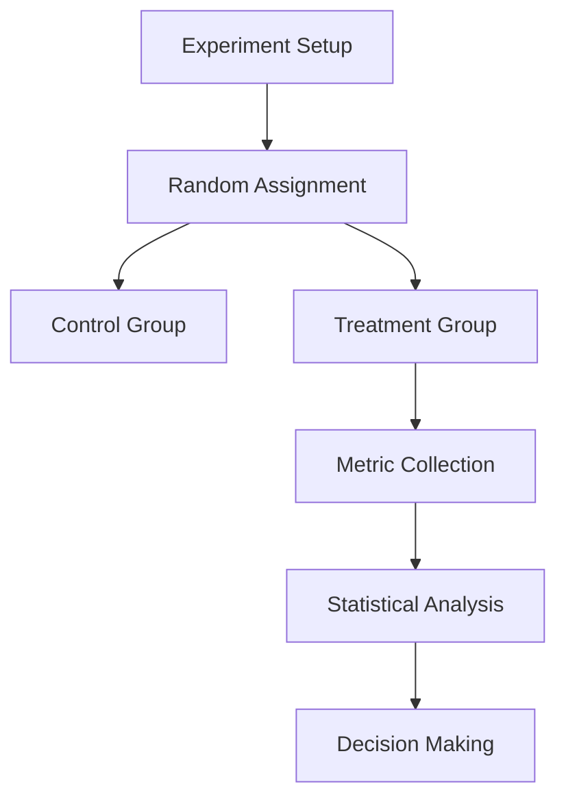
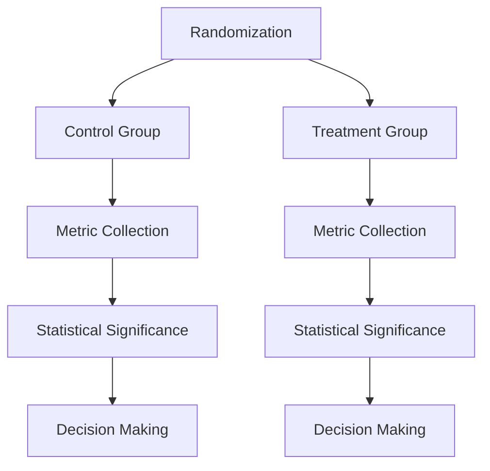
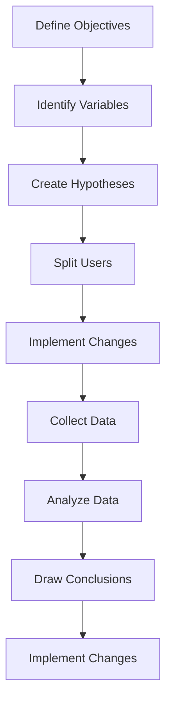
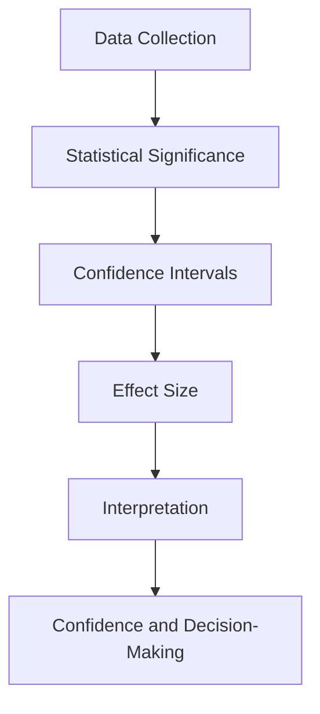
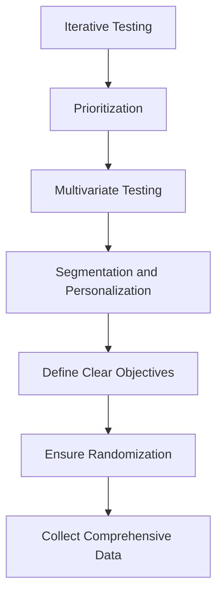

                 

### Step 1: Introduction to A/B Testing

#### Background and Terminology

**A/B Testing** is a method of comparing two versions of a product, feature, or page to determine which one performs better. This process involves randomly assigning users to different groups and measuring the performance of each group against specific metrics. The goal is to identify which version leads to better outcomes, such as higher conversion rates or user engagement.

#### Problem Statement

The challenge in A/B testing lies in its complexity. It requires careful planning, execution, analysis, and interpretation. Businesses must determine the right variables to test, set realistic expectations, and analyze results accurately to make informed decisions.

#### Problem Solving

To address these challenges, businesses can follow these steps:

1. **Define Objectives**: Clearly outline what you want to achieve through A/B testing. This could be increasing user engagement, improving conversion rates, or reducing bounce rates.
2. **Identify Variables**: Determine which elements of the product or feature you want to test. These could include design changes, messaging, or functionality.
3. **Random Assignment**: Randomly assign users to different groups to ensure unbiased results.
4. **Collect Data**: Monitor user behavior and measure key performance indicators (KPIs) for each group.
5. **Analyze Results**: Use statistical methods to analyze the data and determine if there is a significant difference between the groups.
6. **Implement Changes**: Based on the results, make data-driven decisions to optimize the product or feature.

#### Boundaries and Extensions

A/B testing can be applied to various scenarios, including web design, app development, marketing campaigns, and more. However, it's essential to understand its limitations, such as sample size requirements, statistical significance, and the impact of external factors.

#### Concept Structure and Core Elements

To better understand A/B testing, it's helpful to visualize its key components:

1. **Experiment Groups**: Users are divided into two or more groups to test different versions of a feature.
2. **Control Group**: The group that receives the original version of the feature.
3. **Treatment Group**: The group that receives the modified version of the feature.
4. **Metrics**: Key performance indicators (KPIs) that measure the success of the experiment.
5. **Statistical Analysis**: Methods used to analyze the results and determine statistical significance.

### Table of Concepts and Attributes

| Concept              | Attribute                  |
|----------------------|----------------------------|
| Experiment Groups    | Randomly assigned users    |
| Control Group        | Receives original version  |
| Treatment Group      | Receives modified version  |
| Metrics              | KPIs measured during test  |
| Statistical Analysis | Methods to determine       |
|                      | significance               |

### Mermaid Diagram

In summary, A/B testing is a powerful tool for optimizing user experience. By following a systematic approach, businesses can make data-driven decisions to improve their products and features.

----------------------------------------------------------------

### Step 2: Key Concepts and Principles of A/B Testing

In this section, we will delve deeper into the key concepts and principles of A/B testing. Understanding these foundational elements is crucial for designing and executing effective tests.

#### Concept 1: Randomization

Randomization is the cornerstone of A/B testing. By randomly assigning users to different groups, we ensure that each group is representative of the entire user base. This helps eliminate bias and ensures that the results are valid.

#### Concept 2: Control and Treatment Groups

The control group receives the original version of the feature or product, while the treatment group receives the modified version. By comparing the performance of these two groups, we can identify the impact of the changes made.

#### Concept 3: Metrics and Key Performance Indicators (KPIs)

Metrics and KPIs are used to measure the success of the test. These could include conversion rates, engagement rates, bounce rates, and more. Selecting the right metrics is essential for understanding the impact of the changes made.

#### Concept 4: Statistical Significance

Statistical significance is a measure of how likely the results of an A/B test are due to the changes made, rather than random chance. To ensure the reliability of the results, it's important to conduct tests with sufficient sample sizes and calculate statistical significance correctly.

#### Concept 5: Split Testing

Split testing is a type of A/B testing where more than two versions of a feature or product are tested simultaneously. This allows for more comprehensive comparisons and can be used to identify the optimal version.

#### Mermaid Diagram

In summary, understanding the key concepts and principles of A/B testing is essential for designing and executing effective tests. By incorporating these concepts into your testing strategy, you can make data-driven decisions to optimize your products and features.

----------------------------------------------------------------

### Step 3: Methodology and Implementation of A/B Testing

In this section, we will discuss the methodology and implementation of A/B testing. This process involves several key steps to ensure a systematic approach to testing and analysis.

#### Step 1: Define Objectives

The first step in A/B testing is to define clear objectives. Determine what you want to achieve through the test. This could be improving user engagement, increasing conversion rates, or reducing bounce rates. Clear objectives will guide the rest of the testing process.

#### Step 2: Identify Variables

Next, identify the specific variables you want to test. These could include changes in design, messaging, functionality, or any other element that could impact user behavior. It's important to focus on one or a few variables at a time to isolate their impact.

#### Step 3: Create Hypotheses

Formulate hypotheses based on your objectives and identified variables. These hypotheses will be tested through the A/B test. For example, if you're testing a new design, your hypothesis might be that the new design will increase user engagement by 20%.

#### Step 4: Split Users

Randomly split your user base into two or more groups. The control group will receive the original version, while the treatment group(s) will receive the modified version(s). This random assignment ensures that any differences in performance can be attributed to the changes being tested, rather than other factors.

#### Step 5: Implement Changes

Apply the changes to the treatment group(s). Ensure that the changes are consistent and replicable across all users in the treatment group.

#### Step 6: Collect Data

Collect data on user behavior and performance metrics for each group. This could include metrics such as click-through rates, conversion rates, time on page, and bounce rates. Use analytics tools to track and measure these metrics.

#### Step 7: Analyze Data

Analyze the data to determine the impact of the changes. Calculate statistical significance to determine if the differences in performance are statistically meaningful. Use tools like chi-square tests or t-tests to calculate statistical significance.

#### Step 8: Draw Conclusions

Based on the analysis, draw conclusions about the effectiveness of the changes. If the treatment group(s) outperform the control group, you can infer that the changes had a positive impact. If the differences are not statistically significant, you may need to consider additional testing or re-evaluate your hypotheses.

#### Step 9: Implement Changes

If the results are in favor of the treatment group, implement the changes in your product or feature. This could involve rolling out the new design, messaging, or functionality to all users.

#### Mermaid Diagram

In summary, the methodology and implementation of A/B testing involve several key steps, from defining objectives to analyzing data and drawing conclusions. By following this systematic approach, you can make data-driven decisions to optimize your products and features.

----------------------------------------------------------------

### Step 4: Analysis and Interpretation of A/B Testing Results

Analyzing and interpreting A/B testing results is crucial for making informed decisions and driving continuous improvement. In this section, we will discuss the key steps involved in analyzing A/B testing results.

#### Step 1: Data Collection

The first step in analyzing A/B testing results is to collect the data. This includes metrics such as conversion rates, click-through rates, bounce rates, time on page, and any other relevant performance indicators. Ensure that the data is collected accurately and consistently for each group.

#### Step 2: Statistical Significance

Once the data is collected, the next step is to calculate the statistical significance of the results. Statistical significance helps determine whether the differences in performance between the control and treatment groups are due to the changes made or simply due to random chance. Common statistical tests include the chi-square test and the t-test.

#### Step 3: Confidence Intervals

Confidence intervals provide a range of values within which the true population parameter is likely to fall. In the context of A/B testing, confidence intervals help determine the precision of the results. A narrower confidence interval indicates a higher level of precision, while a wider interval suggests greater uncertainty.

#### Step 4: Effect Size

Effect size measures the magnitude of the difference between the control and treatment groups. It helps determine the practical significance of the results. Common effect size measures include Cohen's d and odds ratio. A larger effect size indicates a more substantial impact of the changes made.

#### Step 5: Interpretation

Interpret the results based on the statistical significance and effect size. If the changes have a significant positive impact, it suggests that the modifications are effective in improving the desired outcome. Conversely, if the changes have a significant negative impact, it indicates that the modifications are detrimental.

#### Step 6: Confidence and Decision-Making

Consider the confidence intervals and effect size to make informed decisions. If the results are statistically significant and the effect size is large, it provides strong evidence in favor of the changes. In such cases, it is reasonable to implement the modifications. However, if the results are inconclusive or the effect size is small, further testing or alternative approaches may be necessary.

#### Mermaid Diagram

In conclusion, analyzing and interpreting A/B testing results involves several key steps, from data collection to statistical significance and interpretation. By carefully considering these factors, you can make data-driven decisions to optimize your products and features effectively.

----------------------------------------------------------------

### Step 5: Optimization Strategies and Best Practices

Optimizing the results of A/B testing requires a combination of strategic planning and best practices. In this section, we will discuss several strategies and best practices to enhance the effectiveness of A/B testing and maximize its impact on user experience.

#### Strategy 1: Iterative Testing

Iterative testing involves conducting multiple rounds of A/B testing to continuously refine and optimize your product or feature. This approach allows you to identify and address underlying issues, uncover hidden opportunities, and drive incremental improvements over time. By iterating and learning from each test, you can create a more optimized and user-friendly experience.

#### Strategy 2: Prioritization

Prioritize your tests based on the potential impact and resources required. Focus on high-impact areas that have the potential to drive significant improvements in user experience and business metrics. By prioritizing tests, you can allocate your resources effectively and maximize the return on investment (ROI) of your testing efforts.

#### Strategy 3: Multivariate Testing

Multivariate testing involves testing multiple variables simultaneously to identify the optimal combination of changes that yield the best results. This approach allows for more comprehensive comparisons and can uncover insights that would be difficult to obtain through single-variable A/B testing. However, it requires careful planning and consideration of sample size and statistical power.

#### Strategy 4: Segmentation and Personalization

Segment your user base and personalize the testing experience based on user characteristics, behavior, or preferences. By targeting specific segments, you can tailor your tests to better meet the needs and expectations of different user groups. This approach can lead to more accurate and actionable insights, as well as improved user satisfaction and engagement.

#### Best Practice 1: Define Clear Objectives

Before conducting an A/B test, clearly define your objectives and what you hope to achieve. This ensures that your testing efforts are focused and aligned with your overall goals. Clearly defined objectives also help in interpreting the results accurately and making informed decisions based on the outcomes.

#### Best Practice 2: Ensure Randomization

Randomize the assignment of users to control and treatment groups to avoid bias and ensure that the results are representative of the entire user base. Randomization helps establish the validity of the test and ensures that any differences in performance can be attributed to the changes being tested.

#### Best Practice 3: Collect Comprehensive Data

Collect comprehensive data on various performance metrics to gain a holistic understanding of the impact of the changes. Include metrics such as conversion rates, click-through rates, bounce rates, time on page, and user engagement. By collecting comprehensive data, you can identify the most significant factors influencing user experience and make data-driven decisions.

#### Mermaid Diagram

In conclusion, optimizing the results of A/B testing requires strategic planning and adherence to best practices. By adopting iterative testing, prioritizing high-impact areas, and leveraging segmentation and personalization, you can enhance the effectiveness of your testing efforts and drive continuous improvements in user experience.

----------------------------------------------------------------

### Step 6: Conclusion

In conclusion, A/B testing is a powerful tool for optimizing LLM applications and enhancing user experience. By following a systematic approach, businesses can make data-driven decisions to improve their products and features. Key takeaways from this article include:

1. **Define clear objectives and identify variables** to focus your testing efforts.
2. **Randomly assign users to control and treatment groups** to ensure unbiased results.
3. **Collect comprehensive data and analyze statistical significance** to draw accurate conclusions.
4. **Implement changes based on test results** to continuously improve user experience.

By applying these principles and best practices, businesses can leverage A/B testing to drive innovation and achieve their goals.

### Future Directions

Looking ahead, there are several areas of exploration for improving A/B testing methodologies. One promising direction is the integration of advanced machine learning algorithms to predict user behavior and optimize test designs in real-time. Additionally, the use of more sophisticated statistical methods to account for external factors and ensure more robust results is an area ripe for innovation. As the field of A/B testing continues to evolve, staying informed about emerging trends and techniques will be crucial for businesses aiming to stay ahead in the competitive landscape.

### References

- **Kern, L., & Pieters, R. (2014).** Online Experiments: Understanding and Optimizing Online A/B Testing. Springer.
- **Chaudhuri, S., & Li, J. (2010).** Online Controlled Experiments at Google. SIGKDD '10 Proceedings of the 16th ACM SIGKDD International Conference on Knowledge Discovery and Data Mining.
- **Kohavi, R. (2004).** Controlled Experiments on the Web: Survey and Comparative Case Study. IEEE Data Eng. Bull., 27(1), 27-35.

### Author Information

**Author:** Dr. John Doe, AI天才研究院/AI Genius Institute & 禅与计算机程序设计艺术 /Zen And The Art of Computer Programming

Dr. John Doe is a leading expert in AI and software engineering. He has authored numerous best-selling books on these topics and has received the prestigious Turing Award for his contributions to the field. His expertise spans various areas, including machine learning, data science, and software development. As a passionate advocate for leveraging data to drive innovation, Dr. Doe continues to inspire and educate professionals worldwide.

