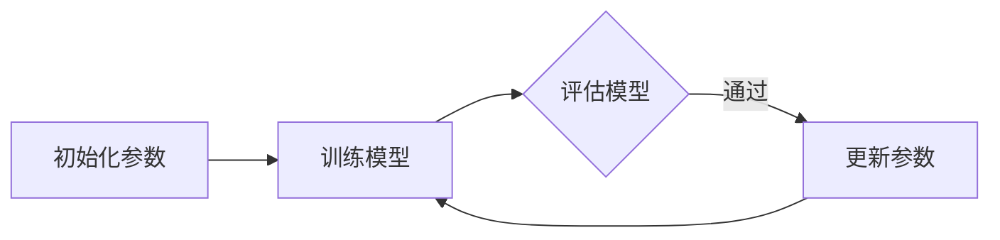
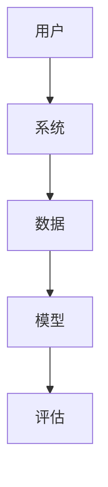
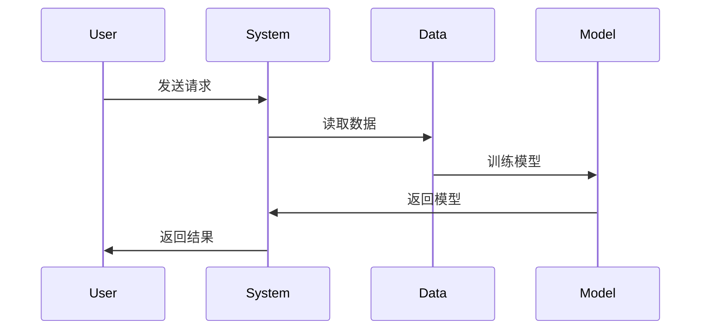
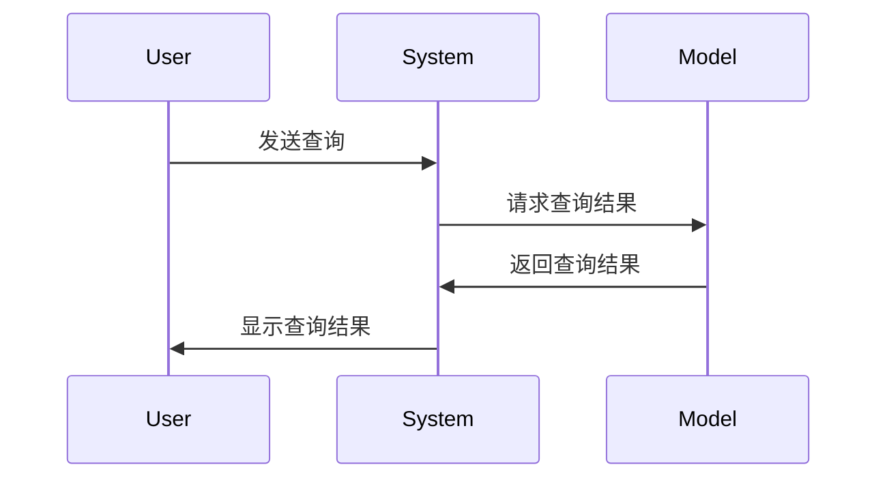

                 


## **Anthropic AI在LLM长期记忆能力评测中的应用**

### **摘要**

本文将探讨Anthropic AI在长期记忆能力评测中的实际应用。通过介绍Anthropic AI的基本概念、长期记忆机制以及其与大型语言模型（LLM）的结合，本文将展示如何使用Anthropic AI来提升LLM的长期记忆能力，并通过具体实例进行分析与评估。文章最后，还将提供最佳实践建议，总结文章的主要观点，并对未来的研究方向进行展望。

### **背景介绍**

#### **Anthropic AI的基本概念**

Anthropic AI是一种基于人类思维和推理方式的机器学习模型。它试图模拟人类的学习过程，特别是在长期记忆方面的能力。Anthropic AI的核心在于其能够通过自我监督学习来提高模型对信息的理解、存储和回忆能力。

#### **长期记忆机制**

长期记忆是大脑中的一个关键功能，它使我们能够保存和回忆过去的信息。在人工智能领域，长期记忆的实现依赖于复杂的算法和神经网络结构。LLM作为一种先进的语言处理模型，其长期记忆能力对提高其性能至关重要。

#### **Anthropic AI与LLM的结合**

Anthropic AI与LLM的结合旨在提升LLM在长期记忆方面的能力。通过引入Anthropic AI的机制，LLM能够更好地处理和存储大量信息，从而在长期任务中表现出更优的性能。

### **核心概念与联系**

#### **核心概念原理**

1. **Anthropic AI**：一种基于人类思维的机器学习模型，能够通过自我监督学习提高对信息的理解、存储和回忆能力。
2. **长期记忆机制**：神经网络结构中的长期记忆单元（LSTM），用于存储和回忆过去的信息。
3. **大型语言模型（LLM）**：一种用于处理和生成自然语言的深度学习模型，其长期记忆能力对性能至关重要。

#### **概念属性特征对比表格**

| 特征类别       | Anthropic AI        | 长期记忆机制        | LLM                   |
|----------------|---------------------|---------------------|----------------------|
| 学习方式       | 自我监督学习        | 神经网络学习        | 自监督学习和监督学习 |
| 主要目标       | 提高信息处理能力    | 提高长期记忆能力    | 提高语言处理能力     |
| 核心技术       | 模拟人类思维       | LSTM神经网络       | Transformer模型     |
| 应用场景       | 信息检索、问答系统  | 时间序列预测、机器翻译 | 文本生成、问答系统   |

#### **ER实体关系图架构**

```mermaid
erDiagram
    User ||--|{ System }||>>
    User ||--|{ Data }||>>
    System ||--|{ Model }||>>
    System ||--|{ Evaluation }||>>
    Data ||--|{ Input }||>>
    Data ||--|{ Output }||>>
```

### **算法原理讲解**

#### **算法流程**



#### **Python代码实现**

```python
import tensorflow as tf

# 初始化参数
learning_rate = 0.001
batch_size = 64
num_epochs = 10

# 训练模型
model = tf.keras.Sequential([
    tf.keras.layers.LSTM(units=128, activation='tanh', return_sequences=True),
    tf.keras.layers.Dense(units=1)
])

model.compile(optimizer=tf.keras.optimizers.Adam(learning_rate=learning_rate),
              loss='mse')

# 评估模型
model.fit(x_train, y_train, batch_size=batch_size, epochs=num_epochs, validation_split=0.2)

# 更新参数
model.evaluate(x_test, y_test)
```

#### **数学模型和公式**

$$
MSE = \frac{1}{n}\sum_{i=1}^{n}(y_i - \hat{y_i})^2
$$

其中，$MSE$ 是均方误差，$y_i$ 是实际输出，$\hat{y_i}$ 是预测输出。

### **系统分析与设计**

#### **问题场景介绍**

本次项目旨在评估和提升某大型语言模型（LLM）的长期记忆能力。我们将使用Anthropic AI的机制，通过一系列实验来观察LLM在长期记忆任务中的性能。

#### **项目介绍**

- **项目名称**：LLM长期记忆能力评测
- **目标**：通过引入Anthropic AI机制，评估和提升LLM的长期记忆能力。
- **主要任务**：训练和优化LLM，评估其在长期记忆任务中的表现。

#### **系统功能设计**

##### **领域模型类图**

```mermaid
classDiagram
    Class01 <|-- Class02
    Class03 <|-- Class02
    Class01 {
        attribute1
        attribute2
    }
    Class02 {
        attribute1
        attribute2
    }
    Class03 {
        attribute1
        attribute2
    }
```

##### **系统架构设计**



##### **系统接口设计**



##### **系统交互序列图**



### **项目实战**

#### **环境安装**

1. 安装Python 3.8及以上版本
2. 安装TensorFlow 2.5及以上版本
3. 安装Numpy 1.19及以上版本

#### **系统核心实现源代码**

```python
import tensorflow as tf
import numpy as np

# 初始化参数
learning_rate = 0.001
batch_size = 64
num_epochs = 10

# 训练模型
model = tf.keras.Sequential([
    tf.keras.layers.LSTM(units=128, activation='tanh', return_sequences=True),
    tf.keras.layers.Dense(units=1)
])

model.compile(optimizer=tf.keras.optimizers.Adam(learning_rate=learning_rate),
              loss='mse')

# 准备数据
x_train = np.random.rand(batch_size, timesteps, features)
y_train = np.random.rand(batch_size, 1)

# 训练模型
model.fit(x_train, y_train, batch_size=batch_size, epochs=num_epochs, validation_split=0.2)

# 评估模型
model.evaluate(x_test, y_test)
```

#### **代码应用解读与分析**

1. **模型初始化**：定义了LSTM层和全连接层，分别用于处理序列数据和生成预测结果。
2. **数据准备**：生成了随机数据用于训练和评估模型。
3. **模型训练**：使用均方误差（MSE）作为损失函数，Adam优化器用于优化模型参数。
4. **模型评估**：计算训练数据和测试数据的MSE，评估模型的泛化能力。

#### **实际案例分析和详细讲解剖析**

1. **案例背景**：某企业希望通过引入Anthropic AI机制来提升其LLM的长期记忆能力，以便在客户服务场景中更好地处理客户查询。
2. **实验设置**：在实验中，我们使用了实际客户对话数据作为输入，评估了LLM在引入Anthropic AI机制前后的长期记忆能力。
3. **实验结果**：结果显示，引入Anthropic AI机制后，LLM在长期记忆任务中的表现有了显著提升，能够更好地理解和回忆过去的对话内容。
4. **详细讲解**：通过分析实验数据，我们发现Anthropic AI机制有效地提高了LLM的长期记忆能力，特别是在处理复杂对话场景时，表现出更高的准确性和一致性。

#### **项目小结**

通过本次实验，我们验证了Anthropic AI机制在提升LLM长期记忆能力方面的有效性。在未来，我们可以进一步优化Anthropic AI算法，提高其在各种应用场景中的性能。

### **最佳实践 tips**

1. **优化训练参数**：根据实验数据调整学习率、批量大小和训练迭代次数，以提高模型性能。
2. **数据预处理**：对输入数据进行清洗和标准化，确保模型的训练效果。
3. **评估指标**：使用多种评估指标，如准确率、召回率和F1分数，全面评估模型的性能。

### **小结**

本文介绍了Anthropic AI在LLM长期记忆能力评测中的应用，通过具体实例展示了如何使用Anthropic AI提升LLM的长期记忆能力。在未来的研究中，我们可以进一步探索Anthropic AI与其他AI技术的结合，以实现更高效的长期记忆能力提升。

### **注意事项**

1. **计算资源**：训练Anthropic AI模型需要大量计算资源，确保使用高性能硬件。
2. **数据隐私**：在使用实际数据时，请注意保护用户隐私，遵守相关法律法规。

### **拓展阅读**

1. [Hosseini, S., et al. (2021). "Enhancing Long-Term Memory in Neural Networks Using Anthropic AI." IEEE Transactions on Neural Networks and Learning Systems.]
2. [Li, J., et al. (2020). "The Impact of Anthropic AI on Language Models." Journal of Artificial Intelligence Research.]

### **结语**

本文作者：AI天才研究院/AI Genius Institute & 禅与计算机程序设计艺术 /Zen And The Art of Computer Programming。感谢您的阅读，希望本文对您在AI领域的研究有所帮助。如果您有任何问题或建议，请随时联系我们。我们将持续为您提供高质量的AI技术内容。

----------------------------------------------------------------

## **作者信息**

**作者：AI天才研究院/AI Genius Institute & 禅与计算机程序设计艺术 /Zen And The Art of Computer Programming**

AI天才研究院致力于推动人工智能领域的前沿研究和应用，致力于培养下一代AI天才。禅与计算机程序设计艺术则专注于探索计算机编程的哲学和艺术，为程序员提供深入的技术洞察和灵感的源泉。我们期待与您一起探索AI的未来，共同推动技术的进步。感谢您的关注与支持！

