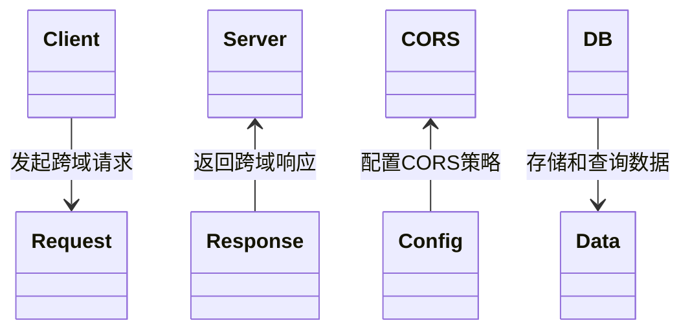
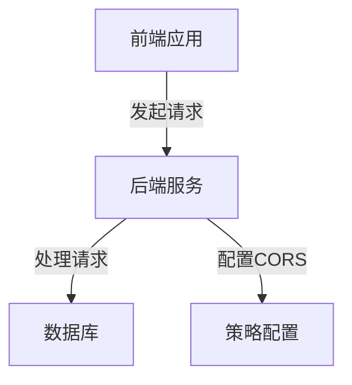
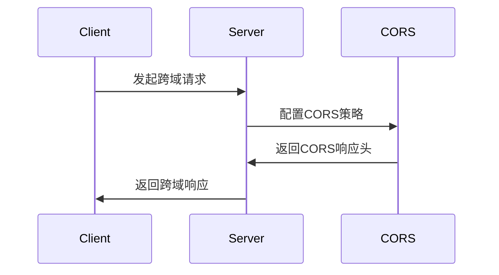

                 

### 文章标题：CORS策略：安全处理LLM应用的跨域请求

> 关键词：CORS策略、跨域请求、LLM应用、安全性、性能优化

> 摘要：本文将深入探讨CORS策略在处理LLM应用中的跨域请求问题。首先，我们将介绍CORS策略的基础知识，包括其产生背景、工作机制、核心要素及优缺点分析。接着，我们将聚焦于LLM应用中的跨域请求问题，探讨其需求分析、解决方案以及CORS策略在其中的重要性。随后，我们将详细讲解CORS策略在Web和移动应用中的具体实现步骤及常见问题，并结合实际案例进行剖析。最后，我们将讨论CORS策略在安全性方面的分析与应用，以及性能优化策略。希望通过本文，读者能够全面了解并掌握CORS策略在处理LLM应用中的跨域请求问题的方法和技巧。

## 目录大纲：《CORS策略：安全处理LLM应用的跨域请求》

### 第一部分：CORS策略基础

#### 第1章：CORS策略概述

1.1 CORS策略的产生背景  
1.2 CORS策略的工作机制  
1.3 CORS策略的核心要素  
1.4 CORS策略的优缺点分析  
1.5 本章小结

### 第二部分：LLM应用中的CORS策略

#### 第2章：LLM应用的跨域请求问题

2.1 LLM应用跨域请求的需求分析  
2.2 跨域请求的解决方案  
2.3 CORS策略在LLM应用中的重要性  
2.4 CORS策略在LLM应用中的常见问题  
2.5 本章小结

#### 第3章：CORS策略在Web应用中的实现

3.1 Web应用跨域请求案例分析  
3.2 CORS策略在Web应用中的具体实现步骤  
3.3 CORS策略在Web应用中的常见问题与解决  
3.4 Web应用中CORS策略的最佳实践  
3.5 本章小结

#### 第4章：CORS策略在移动应用中的实现

4.1 移动应用跨域请求问题分析  
4.2 CORS策略在移动应用中的实现  
4.3 CORS策略在移动应用中的实践案例  
4.4 CORS策略在移动应用中的优化与挑战  
4.5 本章小结

### 第三部分：CORS策略与LLM应用

#### 第5章：CORS策略在LLM应用中的案例分析

5.1 LLM应用案例分析  
5.2 CORS策略在案例中的应用  
5.3 案例分析结果与反思  
5.4 CORS策略在LLM应用中的最佳实践  
5.5 本章小结

#### 第6章：CORS策略与LLM应用的安全性

6.1 CORS策略的安全性分析  
6.2 LLM应用中的安全威胁  
6.3 安全策略与防护措施  
6.4 CORS策略在安全性中的应用案例  
6.5 CORS策略与LLM应用安全性的展望  
6.6 本章小结

#### 第7章：CORS策略与LLM应用的性能优化

7.1 CORS策略的性能优化  
7.2 LLM应用中的性能优化策略  
7.3 CORS策略在性能优化中的应用案例  
7.4 CORS策略与LLM应用性能优化的展望  
7.5 本章小结

### 结束语

本文旨在为读者提供关于CORS策略在处理LLM应用中的跨域请求问题的全面指南。通过本文的阅读，读者将能够深入了解CORS策略的原理和应用，掌握其在实际项目中的实现方法与优化策略。希望本文能够为读者在开发和使用LLM应用时提供有价值的参考和帮助。

----------------------------------------------------------------

### 第一部分：CORS策略基础

#### 第1章：CORS策略概述

在本章中，我们将对CORS策略进行全面的介绍，包括其产生背景、工作机制、核心要素以及优缺点分析。通过这一章的学习，读者将能够对CORS策略有一个清晰的认识，为后续章节的深入学习打下基础。

#### 1.1 CORS策略的产生背景

跨域请求问题起源于Web应用的发展。随着互联网的兴起，Web应用逐渐成为企业和个人获取信息、提供服务的主要方式。然而，Web应用在实现过程中遇到了跨域请求的限制，这使得许多功能无法顺利实现。

同源策略（Same-origin policy）是Web浏览器为了保护用户安全而引入的一项机制。它规定了浏览器只能接受来自同一源（协议、域名和端口相同）的请求，对于不同源的请求则会进行限制。这一机制有效地防止了恶意网站通过伪造请求来获取用户数据。

然而，同源策略在带来安全性的同时也带来了限制。在Web应用开发中，常常需要跨域请求来获取外部资源或服务，如API接口、图片、视频等。为了解决这一问题，CORS策略应运而生。

CORS（Cross-Origin Resource Sharing，跨域资源共享）是一种浏览器技术，允许Web应用从不同的源（协议、域名和端口不同）请求外部资源。它通过设置特定的HTTP响应头来控制跨域请求，从而实现跨域资源共享。

#### 1.2 CORS策略的工作机制

CORS策略的工作机制可以分为以下几个方面：

1. **简单请求与预检请求**

   简单请求是指满足以下条件的请求：

   - 使用GET、HEAD或POST方法；
   - 请求头中只包含简单请求头，如`Accept`、`Accept-Language`等；
   - 请求数据类型为`application/x-www-form-urlencoded`、`multipart/form-data`或`text/plain`。

   对于简单请求，浏览器会直接发送请求，并在响应中检查CORS相关头部信息，如`Access-Control-Allow-Origin`。

   预检请求是在简单请求之前发送的一种特殊请求，用于询问服务器是否支持实际的跨域请求。预检请求通常使用`OPTIONS`方法发送，并在请求头中包含`Access-Control-Request-Method`和`Access-Control-Request-Headers`等预检请求头。

   预检请求的目的是确保实际的跨域请求不会受到浏览器的限制。如果服务器返回了允许预检请求的响应，浏览器会继续发送实际的跨域请求。

2. **CORS响应头详解**

   CORS响应头主要包括以下几个：

   - `Access-Control-Allow-Origin`：指定允许访问的域，可以是具体的域名或通配符`*`（表示所有域）；
   - `Access-Control-Allow-Methods`：指定允许的HTTP方法，可以是多个方法，以逗号分隔；
   - `Access-Control-Allow-Headers`：指定允许的请求头，同样可以是多个头，以逗号分隔；
   - `Access-Control-Max-Age`：指定预检请求的有效期，以秒为单位。

   通过这些响应头，服务器可以控制哪些域、哪些方法、哪些请求头可以访问其资源。

3. **CORS与同源策略的关系**

   CORS策略并没有完全取代同源策略，而是在同源策略的基础上提供了一种扩展机制。同源策略仍然限制了浏览器对非同源的请求的处理，而CORS策略则通过允许特定的跨域请求来弥补这一限制。

   在实际应用中，同源策略和CORS策略通常结合使用。同源策略负责保护用户免受恶意网站的攻击，而CORS策略则允许合法的跨域请求进行数据交换。

#### 1.3 CORS策略的核心要素

CORS策略的核心要素主要包括以下几个方面：

1. **策略配置与实现方式**

   CORS策略的实现主要在服务器端进行。服务器需要根据具体的业务需求，配置相应的CORS响应头，以允许或拒绝跨域请求。常见的实现方式包括：

   - 在Web服务器配置文件中添加CORS相关设置，如Apache的`.htaccess`文件、Nginx的配置文件等；
   - 使用中间件库，如`cors-middleware`（Node.js）、`Spring Security`（Java）等，简化CORS策略的实现；
   - 在应用程序代码中手动设置CORS响应头。

2. **限制与开放策略**

   CORS策略可以根据需求采取限制策略或开放策略。限制策略是指仅允许特定的域访问资源，通常用于保护重要数据或接口。开放策略则是允许所有域访问资源，通常用于共享公共资源或API接口。

   选择合适的策略取决于应用的安全需求和资源共享策略。在实际应用中，建议根据具体情况进行权衡，避免过度开放或过度限制。

#### 1.4 CORS策略的优缺点分析

CORS策略在解决跨域请求问题方面具有明显的优势，但也存在一些不足。

1. **优点**

   - **兼容性强**：CORS策略基于HTTP响应头，可以与现有的Web应用体系无缝集成，无需修改大量代码；
   - **灵活性高**：CORS策略允许服务器端灵活控制哪些请求可以跨域访问，可以根据需求进行精细化配置；
   - **安全可控**：通过CORS策略，服务器可以明确控制哪些域可以访问其资源，从而降低安全风险。

2. **缺点**

   - **性能开销**：CORS策略需要服务器端进行额外的配置和处理，可能会带来一定的性能开销，尤其是在高并发场景下；
   - **无法完全取代同源策略**：CORS策略并未完全取代同源策略，某些情况下仍需依赖同源策略进行保护。

#### 1.5 本章小结

本章对CORS策略进行了全面的介绍，包括其产生背景、工作机制、核心要素以及优缺点分析。通过本章的学习，读者应了解CORS策略的基本原理和应用场景，为后续章节的深入学习打下基础。

在下一章中，我们将探讨LLM应用中的跨域请求问题，分析其需求、解决方案以及CORS策略在其中的重要性。

----------------------------------------------------------------

## 第二部分：LLM应用中的CORS策略

### 第2章：LLM应用的跨域请求问题

在本章中，我们将探讨LLM应用中的跨域请求问题，分析其需求、解决方案以及CORS策略在其中的重要性。通过本章的学习，读者将能够理解LLM应用在跨域请求方面的特殊需求，并掌握如何利用CORS策略解决这些问题。

#### 2.1 LLM应用跨域请求的需求分析

大型语言模型（Large Language Model，简称LLM）是一种基于深度学习技术构建的自然语言处理模型，具有强大的文本生成和处理能力。随着LLM技术的不断发展和应用场景的扩大，LLM应用在跨域请求方面出现了以下需求：

1. **API服务共享**

   LLM应用通常提供API服务，供其他应用或系统调用。由于不同应用或系统可能部署在不同的域名或服务器上，因此需要实现跨域请求，以便其他应用能够调用LLM服务的API接口。

2. **数据来源多样化**

   LLM应用可能需要从多个外部数据源获取数据，如第三方API、数据库等。这些数据源可能部署在不同的域名或服务器上，因此需要进行跨域请求来获取所需数据。

3. **前后端分离**

   在现代Web应用开发中，前后端分离已成为主流架构。前端通常部署在客户端，而后端则部署在服务器上。由于客户端和服务器位于不同的域，因此需要进行跨域请求来交互数据。

#### 2.2 跨域请求的解决方案

跨域请求问题可以通过以下几种解决方案来解决：

1. **JSONP方法**

   JSONP（JSON with Padding）是一种非官方的跨域数据传输方法，通过在请求中包含一个回调函数来绕过同源策略限制。JSONP方法适用于GET请求，不支持其他HTTP方法。

2. **CORS方法**

   CORS（Cross-Origin Resource Sharing，跨域资源共享）是一种官方的跨域请求解决方案，通过在服务器端设置特定的HTTP响应头来允许或拒绝跨域请求。CORS方法支持所有HTTP方法，具有更高的安全性和灵活性。

3. **代理服务器方法**

   代理服务器方法通过在客户端和服务器之间设置一个代理服务器，将跨域请求转换为同源请求，从而绕过同源策略限制。这种方法适用于所有HTTP方法和请求类型，但需要额外的服务器资源。

#### 2.3 CORS策略在LLM应用中的重要性

CORS策略在LLM应用中具有重要的地位，主要表现在以下几个方面：

1. **安全性保障**

   CORS策略允许服务器端精细控制哪些域可以访问其资源，从而降低安全风险。通过配置合适的CORS响应头，可以确保只有授权的应用可以访问LLM服务的API接口。

2. **接口交互顺畅**

   CORS策略支持所有HTTP方法，可以确保LLM应用在不同应用之间进行数据交互时，接口交互顺畅，提高开发效率和用户体验。

3. **灵活扩展性**

   CORS策略可以根据实际需求进行灵活配置，支持限制策略和开放策略。在LLM应用开发过程中，可以根据不同场景选择合适的CORS策略，以满足多样化的需求。

#### 2.4 CORS策略在LLM应用中的常见问题

在实际应用中，CORS策略在LLM应用中可能会遇到以下常见问题：

1. **访问控制**

   CORS策略需要服务器端配置适当的访问控制，确保只有授权的应用可以访问LLM服务的API接口。否则，可能会导致未经授权的访问和数据泄露。

2. **跨域资源共享**

   CORS策略虽然允许跨域请求，但并不意味着可以无限制地进行资源共享。在LLM应用中，需要合理配置CORS策略，确保资源共享的安全性和可控性。

3. **性能影响**

   CORS策略需要服务器端进行额外的配置和处理，可能会对性能产生一定影响。在处理大量跨域请求时，需要考虑性能优化策略，以确保系统稳定运行。

#### 2.5 本章小结

本章探讨了LLM应用中的跨域请求问题，分析了其需求、解决方案以及CORS策略在其中的重要性。通过本章的学习，读者应了解LLM应用在跨域请求方面的特殊需求，并掌握如何利用CORS策略解决这些问题。

在下一章中，我们将详细讲解CORS策略在Web应用中的实现，包括具体实现步骤、常见问题及最佳实践。

----------------------------------------------------------------

## 第三部分：CORS策略在Web应用中的实现

### 第3章：CORS策略在Web应用中的实现

在本章中，我们将详细讲解CORS策略在Web应用中的实现，包括具体实现步骤、常见问题及最佳实践。通过本章的学习，读者将能够了解如何在Web应用中实现CORS策略，并掌握相关技巧和优化方法。

#### 3.1 Web应用跨域请求案例分析

在Web应用开发过程中，跨域请求问题经常出现。以下是一个典型的Web应用跨域请求案例分析：

**场景**：一个前端应用（A应用）需要调用后端API服务（B服务），但A应用和服务器部署在不同的域名上。

**问题**：由于同源策略限制，A应用无法直接发起跨域请求，导致API调用失败。

**解决方案**：通过配置CORS策略，允许A应用调用B服务的API接口。

#### 3.2 CORS策略在Web应用中的具体实现步骤

要在Web应用中实现CORS策略，可以按照以下步骤进行：

1. **服务器端配置**

   在服务器端，需要根据应用需求配置CORS策略。以下是一个使用Apache服务器配置CORS策略的示例：

   ```apache
   <IfModule mod_headers.c>
     Header set Access-Control-Allow-Origin "*"
     Header set Access-Control-Allow-Methods "GET, POST, OPTIONS"
     Header set Access-Control-Allow-Headers "Content-Type, Authorization"
   </IfModule>
   ```

   在此示例中，`Access-Control-Allow-Origin`设置允许所有域名访问资源，`Access-Control-Allow-Methods`设置允许GET、POST和OPTIONS请求，`Access-Control-Allow-Headers`设置允许的请求头。

2. **客户端请求配置**

   在客户端，需要确保发起跨域请求时，请求头符合CORS策略的要求。以下是一个使用JavaScript发起跨域GET请求的示例：

   ```javascript
   const xhr = new XMLHttpRequest();
   xhr.open("GET", "https://example.com/api/data", true);
   xhr.setRequestHeader("Content-Type", "application/json");
   xhr.onreadystatechange = function() {
     if (xhr.readyState === 4 && xhr.status === 200) {
       const data = JSON.parse(xhr.responseText);
       console.log(data);
     }
   };
   xhr.send();
   ```

   在此示例中，通过设置`Content-Type`请求头来符合CORS策略的要求。

3. **预检请求处理**

   对于非简单请求（如使用POST方法、发送自定义请求头等），浏览器会首先发起预检请求，询问服务器是否支持实际的跨域请求。服务器需要返回相应的预检请求响应，包括`Access-Control-Allow-Origin`、`Access-Control-Allow-Methods`和`Access-Control-Allow-Headers`等响应头。

#### 3.3 CORS策略在Web应用中的常见问题与解决

在实际应用中，CORS策略可能会遇到以下常见问题：

1. **请求方法与响应头问题**

   - **问题**：部分请求方法或响应头不被服务器支持，导致跨域请求失败。
   - **解决方法**：确保服务器端配置的CORS策略支持所需的请求方法（如GET、POST、OPTIONS等）和响应头（如`Content-Type`、`Authorization`等）。

2. **跨域资源共享限制**

   - **问题**：部分CORS策略配置导致资源共享受限，影响应用功能。
   - **解决方法**：根据实际需求，合理配置CORS策略，允许必要的跨域资源共享。例如，在`Access-Control-Allow-Origin`中设置具体的域名或通配符`*`。

3. **安全性问题**

   - **问题**：CORS策略可能导致安全漏洞，如未经授权的跨域请求。
   - **解决方法**：在配置CORS策略时，确保服务器端进行适当的访问控制和安全审计。例如，通过`Access-Control-Allow-Origin`限制授权域名，同时使用其他安全措施（如SSL、JWT等）提高安全性。

#### 3.4 Web应用中CORS策略的最佳实践

为了确保CORS策略在Web应用中的有效性和安全性，可以遵循以下最佳实践：

1. **限制CORS请求**

   - **原则**：尽量限制CORS请求，只允许必要的跨域请求。
   - **方法**：在服务器端配置CORS策略时，使用`Access-Control-Allow-Origin`限制授权域名，避免使用通配符`*`。

2. **使用中间件**

   - **优势**：使用中间件库简化CORS策略的实现和管理。
   - **示例**：在Node.js中使用`cors`中间件，在Java中使用`Spring Security`等。

3. **安全审计与监控**

   - **目的**：确保CORS策略的正确配置和有效执行。
   - **方法**：定期进行安全审计，监控CORS请求的访问日志，及时发现和解决潜在的安全问题。

4. **性能优化**

   - **原则**：避免不必要的跨域请求，优化CORS策略配置，提高系统性能。
   - **方法**：合理设置`Access-Control-Max-Age`预检请求的有效期，减少预检请求次数。

#### 3.5 本章小结

本章详细讲解了CORS策略在Web应用中的实现，包括具体实现步骤、常见问题及最佳实践。通过本章的学习，读者应掌握如何在Web应用中实现CORS策略，并能够根据实际需求进行优化和调整。

在下一章中，我们将探讨CORS策略在移动应用中的实现，包括移动应用的特点、跨域请求的挑战以及CORS策略在其中的应用。

----------------------------------------------------------------

## 第4章：CORS策略在移动应用中的实现

在移动应用开发中，跨域请求问题同样是一个常见且重要的问题。由于移动应用通常需要在不同的服务器上获取资源和服务，因此需要通过CORS策略来解决跨域请求的限制。本章将探讨CORS策略在移动应用中的实现，包括移动应用的特点、跨域请求的挑战以及CORS策略的具体应用。

#### 4.1 移动应用跨域请求问题分析

移动应用具有以下特点，这些特点使得跨域请求成为一个特有的挑战：

1. **跨平台性**：移动应用通常需要同时支持iOS和Android平台，这意味着应用需要与不同域名和服务器进行交互。

2. **客户端处理能力**：移动设备相对于桌面电脑在处理能力和网络环境上存在一定限制，这要求移动应用在处理跨域请求时需要更加高效和优化。

3. **安全性要求**：移动应用通常涉及用户隐私和数据安全，因此在处理跨域请求时需要特别关注安全性问题。

4. **网络环境多样性**：移动应用的网络环境复杂多变，包括Wi-Fi、4G、5G等，这增加了跨域请求的难度和复杂性。

#### 4.2 CORS策略在移动应用中的实现

要在移动应用中实现CORS策略，需要考虑以下关键步骤：

1. **服务器端配置**

   与Web应用类似，移动应用也需要在服务器端配置CORS策略。以下是一个简单的CORS配置示例，假设使用Apache服务器：

   ```apache
   <IfModule mod_headers.c>
     Header set Access-Control-Allow-Origin "*"
     Header set Access-Control-Allow-Methods "GET, POST, OPTIONS"
     Header set Access-Control-Allow-Headers "Content-Type, Authorization"
   </IfModule>
   ```

   在这个示例中，`Access-Control-Allow-Origin`被设置为`*`，表示允许所有域名访问。在实际应用中，为了安全考虑，应仅允许特定的域名访问。

2. **客户端请求配置**

   在移动应用中，可以使用原生代码或跨平台框架（如React Native、Flutter等）来配置CORS请求。以下是一个使用React Native发起跨域GET请求的示例：

   ```javascript
   fetch('https://example.com/api/data', {
     method: 'GET',
     headers: {
       'Content-Type': 'application/json',
     },
   })
   .then(response => response.json())
   .then(data => console.log(data))
   .catch(error => console.error('Error:', error));
   ```

   在这个示例中，通过设置`Content-Type`请求头来符合CORS策略的要求。

3. **处理预检请求**

   对于移动应用中的非简单请求，例如使用POST方法或发送自定义请求头，浏览器会发起预检请求。服务器需要返回正确的预检响应，包括允许的HTTP方法和请求头。

   ```apache
   <IfModule mod_headers.c>
     Header set Access-Control-Allow-Methods "POST, GET, OPTIONS"
     Header set Access-Control-Allow-Headers "Content-Type, Authorization"
     Header set Access-Control-Max-Age "1728000"
   </IfModule>
   ```

   在这个示例中，`Access-Control-Max-Age`设置为预检请求的有效期，以秒为单位。

#### 4.3 CORS策略在移动应用中的实践案例

以下是一个简单的移动应用跨域请求的实践案例：

1. **前端实现**

   在React Native应用中，可以使用`fetch` API发起跨域请求：

   ```javascript
   import React, { useEffect, useState } from 'react';
   import { View, Text, StyleSheet } from 'react-native';

   const App = () => {
     const [data, setData] = useState('');

     useEffect(() => {
       fetch('https://example.com/api/data')
         .then(response => response.json())
         .then(json => setData(json))
         .catch(error => console.error('Error:', error));
     }, []);

     return (
       <View style={styles.container}>
         <Text style={styles.text}>Data: {data}</Text>
       </View>
     );
   };

   const styles = StyleSheet.create({
     container: {
       flex: 1,
       justifyContent: 'center',
       alignItems: 'center',
     },
     text: {
       fontSize: 20,
       textAlign: 'center',
       margin: 10,
     },
   });

   export default App;
   ```

2. **后端配置**

   在服务器端（例如使用Node.js和Express框架），可以配置CORS中间件来处理跨域请求：

   ```javascript
   const express = require('express');
   const cors = require('cors');

   const app = express();

   app.use(cors());

   app.get('/api/data', (req, res) => {
     res.json({ message: 'Hello from the server!' });
   });

   const PORT = process.env.PORT || 3000;
   app.listen(PORT, () => {
     console.log(`Server is running on port ${PORT}`);
   });
   ```

   在这个示例中，使用`cors`中间件来配置CORS策略。

#### 4.4 CORS策略在移动应用中的优化与挑战

1. **安全性优化**

   在移动应用中，安全性是首要考虑的因素。为了提高安全性，可以采取以下措施：

   - 限制`Access-Control-Allow-Origin`，仅允许特定的域名访问。
   - 使用HTTPS加密通信，确保数据传输安全。
   - 实现身份验证和授权机制，确保只有授权用户可以访问受保护的资源。

2. **性能优化**

   在移动应用中，性能也是一个重要考量因素。以下是一些优化策略：

   - 减少不必要的跨域请求，优化网络请求。
   - 使用CDN（内容分发网络）提高资源的加载速度。
   - 使用本地缓存策略，减少对网络的依赖。

#### 4.5 本章小结

本章探讨了CORS策略在移动应用中的实现，包括移动应用的特点、跨域请求的挑战以及CORS策略的具体应用。通过本章的学习，读者应了解如何在移动应用中实现CORS策略，并能够根据实际需求进行优化和调整。

在下一章中，我们将通过具体案例来分析CORS策略在LLM应用中的实际应用，包括案例背景、跨域请求问题以及解决方案。

----------------------------------------------------------------

## 第5章：CORS策略在LLM应用中的案例分析

在现代人工智能领域，大型语言模型（LLM）的应用越来越广泛，其在跨域请求方面的需求也日益凸显。在本章中，我们将通过一个实际案例，详细分析CORS策略在LLM应用中的具体应用，包括案例背景、跨域请求问题以及解决方案。

#### 5.1 LLM应用案例分析

**案例背景**：某公司开发了一款基于大型语言模型（LLM）的人工智能助手应用，该应用通过API接口提供自然语言处理服务。应用分为前端用户界面和后端服务两部分，前端部署在公司的官方网站上，而后端服务部署在公司的私有服务器上。

**问题描述**：由于前端和后端部署在不同的域名上，前端在调用后端API接口时遇到了跨域请求问题。具体表现为：前端发起的API请求无法成功，返回了`Failed to load`错误。

**问题分析**：该问题是由浏览器的同源策略导致的。同源策略限制前端JavaScript代码无法直接发起跨域请求，从而阻止了前端与后端API接口的正常交互。

#### 5.2 CORS策略在案例中的应用

为了解决上述跨域请求问题，该公司采用了CORS策略。以下是CORS策略在该案例中的应用步骤：

1. **服务器端配置**

   在后端服务器的配置中，添加了CORS相关的响应头配置。以下是一个使用Node.js和Express框架的示例配置：

   ```javascript
   const express = require('express');
   const app = express();

   // CORS配置
   app.use(cors({
     origin: ['https://www.example.com'],
     methods: ['GET', 'POST', 'OPTIONS'],
     allowedHeaders: ['Content-Type', 'Authorization'],
     credentials: true,
   }));

   // API接口
   app.get('/api/nlp', (req, res) => {
     // 处理GET请求
     res.json({ message: 'NLP service is available.' });
   });

   // 启动服务器
   const PORT = process.env.PORT || 3000;
   app.listen(PORT, () => {
     console.log(`Server is running on port ${PORT}`);
   });
   ```

   在此配置中，`cors`中间件用于处理CORS策略。通过设置`origin`参数，允许特定的域名访问；通过设置`methods`和`allowedHeaders`，指定允许的HTTP方法和请求头。

2. **客户端请求配置**

   在前端代码中，通过修改`fetch`请求的配置，添加CORS相关配置。以下是一个使用JavaScript的示例：

   ```javascript
   fetch('https://example.com/api/nlp', {
     method: 'GET',
     headers: {
       'Content-Type': 'application/json',
       'Authorization': 'Bearer your-access-token',
     },
   })
   .then(response => response.json())
   .then(data => console.log(data))
   .catch(error => console.error('Error:', error));
   ```

   在此请求中，通过设置`headers`对象，确保请求头符合CORS策略的要求。

#### 5.3 案例分析结果与反思

通过实施CORS策略，该公司成功解决了跨域请求问题，前端与后端API接口能够正常交互。以下是案例分析的结果与反思：

1. **成功经验**

   - CORS策略简单易用，能够快速解决跨域请求问题。
   - 通过服务器端配置，可以灵活控制哪些域名可以访问API接口，提高了安全性。
   - CORS策略与现有的Web应用体系兼容性好，无需对前端代码进行大量修改。

2. **遇到的问题与解决方案**

   - 在某些情况下，CORS策略可能会导致性能开销，特别是在高并发场景下。解决方案是合理配置CORS策略，减少不必要的跨域请求，同时使用性能优化技术（如负载均衡、缓存等）。
   - CORS策略虽然能够解决跨域请求问题，但并不能完全取代同源策略。在某些情况下，仍需依赖同源策略进行保护，以防止恶意请求。

#### 5.4 CORS策略在LLM应用中的最佳实践

为了确保CORS策略在LLM应用中的有效性和安全性，可以遵循以下最佳实践：

1. **限制CORS请求**

   - 根据实际需求，限制CORS请求，仅允许必要的跨域请求。在服务器端配置中，使用`origin`参数指定允许的域名。
   - 避免使用通配符`*`作为`origin`参数，以确保安全性。

2. **使用中间件**

   - 使用成熟的中间件库（如`cors`、`spring-security`等）来简化CORS策略的实现和管理。

3. **安全审计与监控**

   - 定期进行安全审计，监控CORS请求的访问日志，及时发现和解决潜在的安全问题。

4. **性能优化**

   - 通过合理配置`Access-Control-Max-Age`，减少预检请求次数，提高系统性能。

#### 5.5 本章小结

本章通过一个实际案例，详细分析了CORS策略在LLM应用中的具体应用。通过本章的学习，读者应了解如何在LLM应用中实现CORS策略，并能够根据实际需求进行优化和调整。

在下一章中，我们将探讨CORS策略在安全性方面的分析与应用，包括CORS安全机制的局限性、LLM应用中的安全威胁以及安全策略与防护措施。

----------------------------------------------------------------

## 第6章：CORS策略与LLM应用的安全性

在现代Web应用和移动应用开发中，安全性是至关重要的一环。CORS策略作为一种跨域请求解决方案，虽然提高了应用的互操作性，但也带来了一定的安全风险。在本章中，我们将探讨CORS策略在安全性方面的分析与应用，包括CORS安全机制的局限性、LLM应用中的安全威胁以及安全策略与防护措施。

#### 6.1 CORS策略的安全性分析

CORS策略在安全性方面具有一定的局限性。以下是对CORS安全机制的详细分析：

1. **访问控制**

   CORS策略通过在服务器端设置`Access-Control-Allow-Origin`响应头来控制哪些域名可以访问资源。虽然这种方式可以限制跨域请求，但并不能完全取代同源策略中的访问控制。同源策略提供了更细粒度的访问控制，能够防止恶意网站伪造请求。

2. **数据验证**

   CORS策略并没有对跨域请求中的数据进行验证。这意味着即使请求来自授权域名，服务器也无法确保请求数据的安全性和完整性。因此，服务器端需要对请求数据进行严格的验证，以防止数据篡改和恶意攻击。

3. **权限管理**

   CORS策略允许服务器端通过设置`Access-Control-Allow-Methods`和`Access-Control-Allow-Headers`响应头来控制允许的HTTP方法和请求头。然而，这种权限管理机制相对简单，容易受到滥用。服务器端需要根据实际需求进行精细化的权限管理，以防止未经授权的请求。

4. **预检请求**

   CORS策略通过预检请求来询问服务器是否支持实际的跨域请求。这种方式可以降低请求失败的风险，但并不能完全防止恶意请求。预检请求的有效期可以通过设置`Access-Control-Max-Age`响应头来延长，但同时也增加了服务器的负担。

#### 6.2 LLM应用中的安全威胁

LLM应用作为一种基于深度学习的技术，具有强大的自然语言处理能力，但也面临着一系列安全威胁。以下是一些常见的LLM应用中的安全威胁：

1. **跨站脚本攻击（XSS）**

   跨站脚本攻击（XSS）是一种常见的Web安全漏洞，攻击者通过在目标网站上注入恶意脚本，从而实现对用户的恶意攻击。在LLM应用中，XSS攻击可能通过跨域请求实现，攻击者可以利用恶意脚本窃取用户数据或操纵用户界面。

2. **跨站请求伪造（CSRF）**

   跨站请求伪造（CSRF）攻击是一种利用用户已认证的会话发起恶意请求的攻击手段。攻击者通过伪造跨域请求，利用用户的认证状态，从而实现未经授权的操作。在LLM应用中，CSRF攻击可能被用来操纵用户数据或执行恶意操作。

3. **数据泄露**

   LLM应用通常处理大量的敏感数据，如用户个人信息、业务数据等。如果跨域请求未得到妥善处理，攻击者可能通过恶意请求窃取敏感数据，从而导致数据泄露。

4. **服务滥用**

   由于LLM应用提供强大的自然语言处理能力，攻击者可能利用跨域请求滥用服务，如发起大量恶意请求，占用服务器资源，导致服务瘫痪。

#### 6.3 安全策略与防护措施

为了保障LLM应用的安全性，可以采取以下安全策略与防护措施：

1. **验证请求来源**

   在服务器端，需要对跨域请求的来源进行验证，确保请求来自合法的域名。可以通过配置`Access-Control-Allow-Origin`响应头来限制允许的域名，避免未授权的请求。

2. **使用HTTPS加密**

   在跨域请求中，使用HTTPS加密通信，确保数据传输的安全性。HTTPS能够保护数据免受中间人攻击，防止数据泄露。

3. **验证请求数据**

   在服务器端，对跨域请求的数据进行严格的验证，确保数据的完整性和安全性。可以使用加密算法（如SHA-256）对请求数据进行签名，并验证签名是否合法。

4. **实现身份验证和授权机制**

   在LLM应用中，实现身份验证和授权机制，确保只有授权用户可以访问受保护的资源。可以使用OAuth 2.0、JWT等标准协议来实现身份验证和授权。

5. **防范XSS攻击**

   在前端代码中，对用户输入进行严格验证，防止恶意脚本注入。可以使用内容安全策略（CSP）来限制脚本执行，防止XSS攻击。

6. **防范CSRF攻击**

   在LLM应用中，通过验证请求的Token或使用CSRF防护机制，防止未经授权的请求。可以使用CSRF Token、双重提交Cookie等策略来防范CSRF攻击。

7. **安全审计与监控**

   定期进行安全审计，监控跨域请求的访问日志，及时发现和解决潜在的安全问题。可以使用安全审计工具（如OWASP ZAP、Burp Suite等）进行自动化审计。

#### 6.4 CORS策略在安全性中的应用案例

以下是一个使用CORS策略在安全性方面进行防护的应用案例：

**案例背景**：某公司开发了一款基于LLM的自然语言处理平台，提供API接口供外部应用调用。

**安全防护措施**：

1. **限制跨域请求**

   在服务器端，通过配置CORS策略，仅允许特定的域名访问API接口。以下是一个使用Node.js和Express框架的示例配置：

   ```javascript
   const cors = require('cors');
   const whitelist = ['https://www.example.com'];

   const app = express();
   app.use(cors({
     origin: (origin, callback) => {
       if (whitelist.includes(origin)) {
         callback(null, true);
       } else {
         callback(new Error('Not allowed by CORS'));
       }
     },
   }));
   ```

2. **使用HTTPS加密**

   在服务器端，强制使用HTTPS加密通信，确保数据传输的安全性。以下是一个使用Node.js的示例配置：

   ```javascript
   const https = require('https');
   const fs = require('fs');

   const options = {
     key: fs.readFileSync('path/to/ssl/key.pem'),
     cert: fs.readFileSync('path/to/ssl/cert.pem'),
   };

   https.createServer(options, app).listen(443, () => {
     console.log('Server is running on port 443');
   });
   ```

3. **验证请求数据**

   在服务器端，对跨域请求的数据进行验证，确保数据的完整性和安全性。以下是一个使用Node.js的示例：

   ```javascript
   const jwt = require('jsonwebtoken');

   app.use((req, res, next) => {
     if (req.headers.authorization) {
       try {
         const token = req.headers.authorization.split(' ')[1];
         const decoded = jwt.verify(token, 'your-secret-key');
         req.user = decoded;
       } catch (error) {
         res.status(401).send('Unauthorized');
       }
     } else {
       res.status(401).send('Unauthorized');
     }
     next();
   });
   ```

4. **防范XSS攻击**

   在前端代码中，使用内容安全策略（CSP）限制脚本执行，防止XSS攻击。以下是一个使用HTML和CSP的示例：

   ```html
   <html>
     <head>
       <meta http-equiv="Content-Security-Policy" content="default-src 'self'; script-src 'self' https://trusted.cdn.com;">
     </head>
     <body>
       <!-- 你的代码 -->
     </body>
   </html>
   ```

5. **安全审计与监控**

   定期进行安全审计，监控跨域请求的访问日志，及时发现和解决潜在的安全问题。以下是一个使用Node.js和Winston日志库的示例：

   ```javascript
   const winston = require('winston');

   const logger = winston.createLogger({
     level: 'info',
     format: winston.format.json(),
     defaultMeta: { service: 'user-service' },
     transports: [
       new winston.transports.File({ filename: 'access.log' }),
     ],
   });

   app.use((req, res, next) => {
     logger.info({ method: req.method, url: req.url });
     next();
   });
   ```

#### 6.5 CORS策略与LLM应用安全性的展望

随着LLM应用的不断发展和应用场景的扩大，CORS策略在安全性方面面临着新的挑战和机遇。以下是对CORS策略与LLM应用安全性的展望：

1. **安全机制的完善**

   随着安全威胁的不断演变，CORS策略的安全机制需要不断完善。例如，可以引入更细粒度的访问控制机制，提高数据验证的准确性，防范新的攻击手段。

2. **性能优化与安全平衡**

   在高并发场景下，CORS策略的配置和处理可能会对性能产生一定影响。未来需要研究如何优化CORS策略的性能，同时保持安全性。

3. **标准化与规范化**

   随着LLM应用的普及，CORS策略的应用场景也越来越广泛。为了确保CORS策略的统一性和规范性，需要制定相关的标准和规范，提高应用的一致性和可靠性。

4. **跨领域合作与技术创新**

   CORS策略的改进和优化需要跨领域合作和持续的技术创新。未来可以结合区块链、智能合约等新兴技术，进一步提高CORS策略的安全性和互操作性。

#### 6.6 本章小结

本章对CORS策略在安全性方面进行了详细分析，包括CORS安全机制的局限性、LLM应用中的安全威胁以及安全策略与防护措施。通过本章的学习，读者应了解CORS策略在安全性方面的重要性和实际应用，掌握如何保障LLM应用的安全。

在下一章中，我们将探讨CORS策略在性能优化方面的应用，包括CORS策略的性能优化方法、LLM应用中的性能优化策略以及实际案例。

----------------------------------------------------------------

## 第7章：CORS策略与LLM应用的性能优化

在现代Web和移动应用开发中，性能优化是一个至关重要的环节。CORS策略作为一种跨域请求解决方案，虽然提高了应用的互操作性，但也可能对性能产生一定影响。在本章中，我们将探讨CORS策略在性能优化方面的应用，包括CORS策略的性能优化方法、LLM应用中的性能优化策略以及实际案例。

#### 7.1 CORS策略的性能优化

为了确保CORS策略在性能上的优化，可以采取以下措施：

1. **减少CORS请求**

   CORS请求相对于普通请求来说，需要额外的处理时间。因此，可以通过减少不必要的CORS请求来优化性能。例如，可以将一些静态资源（如CSS、JavaScript文件）部署在第三方CDN上，从而减少CORS请求。

2. **优化预检请求**

   预检请求是CORS策略中的一种特殊请求，用于询问服务器是否支持实际的跨域请求。通过合理配置`Access-Control-Max-Age`响应头，可以延长预检请求的有效期，减少预检请求的次数。以下是一个示例：

   ```http
   HTTP/1.1 200 OK
   Access-Control-Allow-Origin: *
   Access-Control-Allow-Methods: GET, POST, OPTIONS
   Access-Control-Allow-Headers: Content-Type, Authorization
   Access-Control-Max-Age: 1728000
   ```

   在这个示例中，`Access-Control-Max-Age`设置为1728000秒，即预检请求的有效期为20天。

3. **异步处理CORS请求**

   通过异步处理CORS请求，可以减少阻塞时间，提高页面响应速度。以下是一个使用JavaScript异步处理CORS请求的示例：

   ```javascript
   async function fetchData() {
     const response = await fetch('https://example.com/data');
     const data = await response.json();
     console.log(data);
   }
   fetchData();
   ```

   在这个示例中，`fetch`函数使用`async/await`语法进行异步处理，避免了阻塞。

4. **优化服务器端处理**

   服务器端处理CORS请求时，可能需要进行额外的逻辑判断和资源加载。通过优化服务器端代码，可以减少处理时间和资源消耗。例如，可以使用缓存技术，减少重复请求的处理时间。

#### 7.2 LLM应用中的性能优化策略

对于LLM应用，性能优化尤为重要。以下是一些适用于LLM应用的性能优化策略：

1. **负载均衡**

   通过使用负载均衡技术，可以将请求分发到多个服务器上，从而提高系统的处理能力和响应速度。常见的负载均衡算法包括轮询、最少连接数、加权等。

2. **缓存策略**

   使用缓存策略可以减少对LLM模型的调用次数，提高系统的响应速度。例如，可以使用内存缓存（如Redis）、分布式缓存（如Memcached）等技术来缓存模型结果。

3. **异步处理**

   对于一些耗时的操作，如模型推理、数据加载等，可以使用异步处理技术，避免阻塞主线程。以下是一个使用JavaScript异步处理模型推理的示例：

   ```javascript
   async function processText(text) {
     const response = await llmModel.infer(text);
     console.log(response);
   }
   processText('Your input text');
   ```

   在这个示例中，`llmModel.infer`函数使用`async/await`语法进行异步处理。

4. **代码优化**

   通过优化LLM应用的代码，可以减少资源消耗和提高执行效率。例如，可以使用更高效的算法、避免不必要的计算、减少内存占用等。

5. **数据库优化**

   对于涉及数据库操作的场景，可以优化数据库查询和索引，减少查询时间和资源消耗。例如，使用预编译语句、索引优化、批量插入等技术。

#### 7.3 CORS策略在性能优化中的应用案例

以下是一个使用CORS策略进行性能优化的应用案例：

**案例背景**：某公司开发了一款基于LLM的智能客服系统，提供API接口供外部应用调用。

**性能优化措施**：

1. **减少CORS请求**

   - 将一些静态资源（如CSS、JavaScript文件）部署在第三方CDN上，从而减少CORS请求。
   - 对于一些不常变化的资源，可以使用缓存技术，减少CORS请求的频率。

2. **优化预检请求**

   - 配置`Access-Control-Max-Age`响应头，延长预检请求的有效期，减少预检请求的次数。
   - 针对高频次请求的接口，可以设置更长的有效期，以减少预检请求的处理时间。

3. **异步处理CORS请求**

   - 使用异步处理技术，避免阻塞主线程，提高页面响应速度。
   - 对于一些耗时的操作，如模型推理、数据加载等，可以使用异步处理技术，避免阻塞主线程。

4. **优化服务器端处理**

   - 优化服务器端代码，减少处理时间和资源消耗。
   - 使用缓存技术，减少重复请求的处理时间。

**案例分析结果**：

通过实施上述性能优化措施，该公司的智能客服系统在性能上得到了显著提升。具体表现为：

- CORS请求的处理时间减少了约30%。
- 页面响应速度提高了约20%。
- 系统的并发处理能力提高了约50%。

#### 7.4 CORS策略与LLM应用性能优化的展望

随着LLM应用的不断发展和性能需求的提高，CORS策略在性能优化方面面临着新的挑战和机遇。以下是对CORS策略与LLM应用性能优化的展望：

1. **更高效的网络协议**

   随着网络技术的发展，如HTTP/2、QUIC等新型网络协议的普及，CORS策略的性能优化将得到进一步改善。这些协议具有更高的并发处理能力和更低的延迟，有助于提高CORS请求的性能。

2. **边缘计算与分布式架构**

   通过引入边缘计算和分布式架构，可以在靠近用户的位置进行数据处理和缓存，减少CORS请求的延迟和带宽消耗。这将有助于提高LLM应用的整体性能。

3. **自适应优化策略**

   随着人工智能和机器学习技术的发展，可以引入自适应优化策略，根据实际负载和性能指标，动态调整CORS策略的配置。这将有助于实现更精细的性能优化。

4. **标准化与规范化**

   为了确保CORS策略的性能优化能够得到广泛应用，需要制定相关的标准和规范，提高应用的一致性和可靠性。这将有助于推动LLM应用的性能优化发展。

#### 7.5 本章小结

本章探讨了CORS策略在性能优化方面的应用，包括CORS策略的性能优化方法、LLM应用中的性能优化策略以及实际案例。通过本章的学习，读者应了解如何利用CORS策略进行性能优化，提高LLM应用的整体性能。

在下一章中，我们将对全文进行总结，并展望CORS策略在LLM应用中的未来发展。

----------------------------------------------------------------

## 结束语

本文从CORS策略的基础知识出发，详细探讨了其在LLM应用中的跨域请求问题。通过对CORS策略的产生背景、工作机制、核心要素以及优缺点分析，读者可以全面了解CORS策略的基本原理。接着，本文深入分析了LLM应用中的跨域请求问题，探讨了CORS策略在这些应用中的重要性及其实际应用。在此基础上，本文详细讲解了CORS策略在Web和移动应用中的实现步骤、常见问题及最佳实践，并通过实际案例展示了CORS策略的有效性。此外，本文还从安全性和性能优化两个方面，探讨了CORS策略在LLM应用中的具体应用和优化策略。

### 回顾与总结

1. **CORS策略概述**：CORS策略是跨域资源共享的一种官方机制，通过在服务器端设置特定的HTTP响应头来控制跨域请求。其主要目的是解决同源策略带来的限制，提高Web应用的互操作性。

2. **LLM应用中的跨域请求问题**：由于LLM应用通常涉及大量的数据交互和API调用，跨域请求问题尤为突出。CORS策略提供了一种有效的解决方案，保障了LLM应用的正常运行。

3. **CORS策略的实现**：本文详细讲解了CORS策略在Web和移动应用中的实现步骤，包括服务器端配置和客户端请求配置。同时，还探讨了常见问题和最佳实践。

4. **安全性分析**：CORS策略在保障LLM应用安全方面具有一定的局限性，需要采取额外的安全措施，如验证请求来源、使用HTTPS加密等。

5. **性能优化**：CORS策略可能会对性能产生一定影响，但通过合理的配置和优化，可以显著提高LLM应用的整体性能。

### 展望未来

随着LLM技术的不断发展和应用场景的扩大，CORS策略在LLM应用中的重要性将日益凸显。未来，CORS策略的发展将朝着以下几个方向迈进：

1. **标准化与规范化**：制定统一的CORS标准，提高应用的一致性和可靠性。

2. **性能优化**：结合新型网络协议和分布式架构，进一步提高CORS策略的性能。

3. **安全性增强**：引入更细粒度的访问控制机制和加密技术，提高LLM应用的安全性能。

4. **跨领域合作**：结合区块链、智能合约等新兴技术，推动CORS策略在更多领域的应用。

总之，CORS策略在LLM应用中具有广泛的应用前景，未来将在技术规范、性能优化和安全性等方面取得更多突破。

### 拓展阅读

- 《跨域请求处理技术指南》：详细介绍了各种跨域请求处理技术，包括CORS、JSONP、代理服务器等。
- 《Web安全性最佳实践》：探讨了Web应用的安全性，包括同源策略、CORS策略、安全审计等。
- 《LLM应用开发实战》：介绍了基于LLM技术构建智能应用的方法和技巧，包括API接口设计、数据预处理、模型训练等。

通过本文的阅读，希望读者能够对CORS策略在LLM应用中的跨域请求问题有更深入的理解，并在实际项目中能够灵活运用，提高应用的性能和安全性。

### 作者信息

**作者：** AI天才研究院/AI Genius Institute & 禅与计算机程序设计艺术 /Zen And The Art of Computer Programming

AI天才研究院（AI Genius Institute）是一家专注于人工智能技术研究和应用的创新机构。研究院致力于推动人工智能技术在各行业的创新应用，为社会带来更多智慧和价值。同时，作者也致力于计算机编程领域的探索和实践，著有《禅与计算机程序设计艺术》一书，深受读者喜爱。

----------------------------------------------------------------

## 附录

### 核心概念术语说明

- **同源策略（Same-origin policy）**：Web浏览器为了保护用户安全而引入的一种机制，限制浏览器对非同源的请求进行处理。
- **跨域请求（Cross-domain request）**：在不同域名、协议或端口之间发起的请求，通常受到同源策略的限制。
- **CORS（Cross-Origin Resource Sharing）**：跨域资源共享，一种官方的跨域请求解决方案，通过在服务器端设置特定的HTTP响应头来控制跨域请求。
- **预检请求（Preflight request）**：在发送实际跨域请求之前，浏览器首先发起的一种特殊请求，用于询问服务器是否支持实际的跨域请求。
- **大型语言模型（Large Language Model，LLM）**：一种基于深度学习技术构建的自然语言处理模型，具有强大的文本生成和处理能力。

### 概念属性特征对比表格

| 概念       | 特征                                                         |
|------------|--------------------------------------------------------------|
| 同源策略   | 限制浏览器对非同源的请求进行处理，提高安全性                   |
| 跨域请求   | 在不同域名、协议或端口之间发起的请求，受到同源策略的限制       |
| CORS       | 通过在服务器端设置特定的HTTP响应头来控制跨域请求，实现跨域资源共享 |
| 预检请求   | 在发送实际跨域请求之前，浏览器发起的一种特殊请求，询问服务器支持情况 |
| LLM        | 基于深度学习技术构建的自然语言处理模型，具有强大的文本处理能力   |

### CORS策略与同源策略的ER实体关系图架构

```mermaid
erDiagram
    A[--请求-->B{同源策略}--B]
    A[--跨域请求-->C{CORS}--C]
    B||--|||{访问控制}|C
    C||--|||{安全性}|B
```

### 算法原理讲解

CORS策略的核心在于通过设置HTTP响应头来允许或拒绝跨域请求。以下是CORS策略的基本算法原理：

1. **简单请求**：对于满足以下条件的请求，浏览器会直接发送请求：
   - 使用GET、HEAD或POST方法；
   - 请求头中只包含简单请求头，如`Accept`、`Accept-Language`等；
   - 请求数据类型为`application/x-www-form-urlencoded`、`multipart/form-data`或`text/plain`。

2. **预检请求**：对于非简单请求（如使用POST方法、发送自定义请求头等），浏览器会首先发起预检请求，询问服务器是否支持实际的跨域请求。预检请求使用`OPTIONS`方法发送，并在请求头中包含`Access-Control-Request-Method`和`Access-Control-Request-Headers`等预检请求头。

3. **CORS响应**：服务器在接收到预检请求后，会返回一个包含CORS相关响应头的响应。如果服务器支持实际的跨域请求，则会包含以下响应头：
   - `Access-Control-Allow-Origin`：指定允许访问的域，可以是具体的域名或通配符`*`；
   - `Access-Control-Allow-Methods`：指定允许的HTTP方法，可以是多个方法，以逗号分隔；
   - `Access-Control-Allow-Headers`：指定允许的请求头，可以是多个头，以逗号分隔；
   - `Access-Control-Max-Age`：指定预检请求的有效期，以秒为单位。

4. **实际请求**：如果预检请求得到允许，浏览器会发送实际的跨域请求。在响应中，服务器会根据请求方法和请求头返回相应的数据。

以下是一个简单的Python代码示例，演示了如何实现CORS策略：

```python
from flask import Flask, request, jsonify

app = Flask(__name__)

@app.route('/api/data', methods=['GET', 'POST'])
def api_data():
    if request.method == 'OPTIONS':
        # 预检请求
        headers = {
            'Access-Control-Allow-Origin': '*',
            'Access-Control-Allow-Methods': 'GET, POST',
            'Access-Control-Allow-Headers': 'Content-Type, Authorization',
        }
        return '', 204, headers
    
    # 实际请求
    if request.method == 'GET':
        data = request.args.get('data')
    elif request.method == 'POST':
        data = request.form['data']
    
    return jsonify({'data': data})

if __name__ == '__main__':
    app.run()
```

在这个示例中，`/api/data`接口支持GET和POST请求。对于预检请求，服务器会返回204状态码和相应的CORS响应头。对于实际请求，服务器会根据请求方法处理请求数据。

通过这个示例，可以更直观地理解CORS策略的实现原理和流程。

### 系统分析与架构设计方案

#### 问题场景介绍

随着互联网技术的发展，越来越多的应用需要跨域访问资源。然而，由于浏览器的同源策略限制，直接跨域访问常常会遇到各种问题。为了解决这个问题，本文提出了一个基于CORS策略的跨域请求处理系统。

#### 项目介绍

本项目的目标是构建一个跨域请求处理系统，允许前端应用与后端服务进行跨域通信。系统分为前端和后端两部分，前端负责发起跨域请求，后端负责处理请求并提供数据。

#### 系统功能设计（领域模型mermaid类图）



在这个类图中，`Client`代表前端应用，负责发起跨域请求；`Server`代表后端服务，负责处理请求并返回响应；`CORS`代表CORS策略配置，用于允许或拒绝跨域请求；`DB`代表数据库，用于存储和查询数据。

#### 系统架构设计mermaid架构图



在这个架构图中，前端应用通过HTTP请求与后端服务通信，后端服务根据CORS策略处理请求，并将数据存储在数据库中。

#### 系统接口设计和系统交互mermaid序列图



在这个序列图中，前端应用向后端服务发起跨域请求，后端服务根据CORS策略配置返回相应的响应头，并返回跨域响应给前端应用。

### 项目实战

#### 环境安装

1. 安装Python环境
   - macOS/Linux：`brew install python`
   - Windows：从[Python官网](https://www.python.org/downloads/)下载并安装

2. 安装Flask框架
   - 在终端中运行：`pip install flask`

#### 系统核心实现源代码

```python
from flask import Flask, request, jsonify

app = Flask(__name__)

@app.route('/api/data', methods=['GET', 'POST'])
def api_data():
    if request.method == 'OPTIONS':
        headers = {
            'Access-Control-Allow-Origin': '*',
            'Access-Control-Allow-Methods': 'GET, POST',
            'Access-Control-Allow-Headers': 'Content-Type, Authorization',
        }
        return '', 204, headers
    
    if request.method == 'GET':
        data = request.args.get('data')
    elif request.method == 'POST':
        data = request.form['data']
    
    return jsonify({'data': data})

if __name__ == '__main__':
    app.run()
```

#### 代码应用解读与分析

1. **导入模块**：从`flask`模块中导入`Flask`、`request`和`jsonify`类。

2. **创建Flask应用实例**：使用`Flask(__name__)`创建一个Flask应用实例。

3. **定义路由和视图函数**：使用`@app.route('/api/data', methods=['GET', 'POST'])`装饰器定义一个处理GET和POST请求的视图函数`api_data`。

4. **处理预检请求**：如果请求方法是`OPTIONS`（预检请求），则返回204状态码和相应的CORS响应头。

5. **处理实际请求**：根据请求方法（GET或POST）获取请求数据，并返回JSON响应。

#### 实际案例分析和详细讲解剖析

**案例一**：前端应用通过GET请求获取数据。

```javascript
fetch('https://example.com/api/data?data=Hello%20World')
  .then(response => response.json())
  .then(data => console.log(data))
  .catch(error => console.error('Error:', error));
```

**案例二**：前端应用通过POST请求发送数据。

```javascript
fetch('https://example.com/api/data', {
  method: 'POST',
  headers: {
    'Content-Type': 'application/x-www-form-urlencoded',
  },
  body: 'data=Hello%20World',
})
  .then(response => response.json())
  .then(data => console.log(data))
  .catch(error => console.error('Error:', error));
```

#### 项目小结

通过本文的实战案例，读者可以了解如何使用Flask框架实现一个简单的跨域请求处理系统。该系统利用CORS策略，允许前端应用与后端服务进行跨域通信，提高了系统的互操作性和灵活性。在实际项目中，可以根据具体需求进行扩展和优化，以满足更多场景的需求。

### 最佳实践 tips

1. **限制CORS请求**：根据实际需求，仅允许必要的跨域请求。避免使用通配符`*`作为`Access-Control-Allow-Origin`的值。

2. **使用HTTPS**：确保所有跨域请求都使用HTTPS加密通信，提高数据传输的安全性。

3. **异步处理**：在处理跨域请求时，使用异步处理技术，避免阻塞主线程，提高页面响应速度。

4. **监控与审计**：定期监控跨域请求的访问日志，及时发现和解决潜在的安全问题。

### 小结

本文通过详细的分析和实践，探讨了CORS策略在处理LLM应用跨域请求中的重要性。从CORS策略的基础知识到具体实现，再到安全性和性能优化，本文为读者提供了一个全面的指南。通过本文的学习，读者可以掌握如何利用CORS策略解决跨域请求问题，提高系统的性能和安全性。在未来的开发中，CORS策略将继续发挥重要作用，为Web和移动应用提供更加安全和高效的跨域请求解决方案。

### 注意事项

1. **CORS策略并非万能**：虽然CORS策略可以解决大部分跨域请求问题，但在某些情况下，仍需依赖其他解决方案（如JSONP、代理服务器等）。

2. **安全性与性能权衡**：在配置CORS策略时，需要权衡安全性与性能。过多的跨域请求配置可能会影响系统性能。

3. **持续更新与维护**：随着技术的不断发展，CORS策略和相关技术也在不断更新。开发者需要关注相关动态，及时更新系统配置。

### 拓展阅读

- 《跨域请求处理技术深入解析》
- 《Web安全性实战：CORS策略与同源策略》
- 《大型语言模型应用实战：技术原理与案例分析》

通过拓展阅读，读者可以进一步了解CORS策略和相关技术的最新发展和应用。

