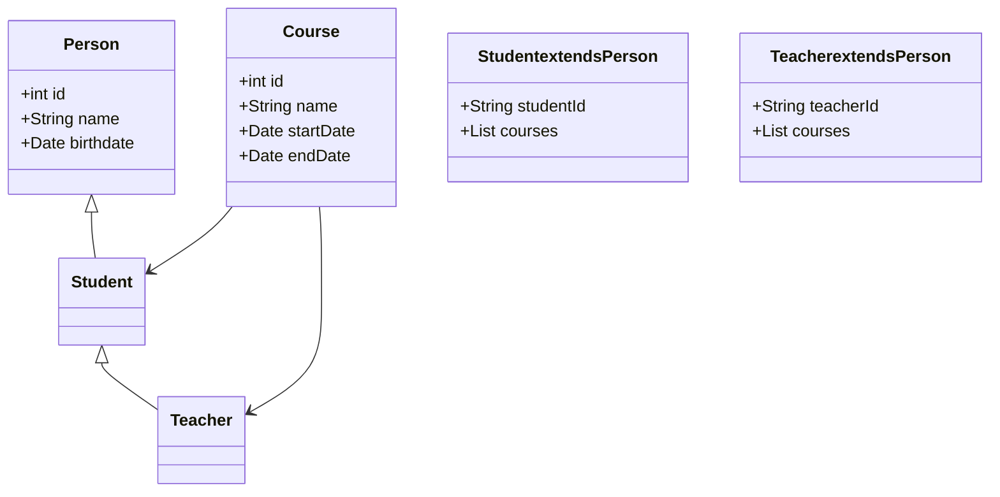
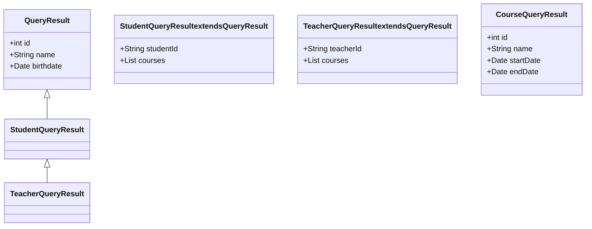

                 

### 文章标题：CQRS模式在LLM应用中的应用

### 关键词：CQRS模式，LLM应用，数据一致性，分布式系统，算法优化，性能监控

### 摘要：
本文将深入探讨CQRS（Command Query Responsibility Segregation）模式在大型语言模型（LLM）应用中的实际应用。CQRS模式通过分离命令和查询操作，实现了数据的独立读写，增强了系统的扩展性和性能。本文将详细解析CQRS模式的核心概念和原理，并通过实际案例展示其在LLM应用中的具体实现。此外，文章还将讨论CQRS模式在LLM应用中的性能优化策略、安全性保障措施以及未来展望。

## 引言

随着人工智能技术的飞速发展，大型语言模型（LLM）在各个领域得到了广泛应用。这些模型能够处理大规模的数据集，并提供强大的自然语言处理能力。然而，随着数据规模的扩大和系统复杂性的增加，如何优化LLM应用的性能和保证数据一致性成为一个关键问题。CQRS模式作为一种分布式系统的设计模式，通过分离命令和查询操作，有效地解决了这些问题。

CQRS模式最早由Martin Fowler提出，它基于命令查询责任分离（Command Query Responsibility Segregation）的原则，将系统的数据写入和数据读取操作分离到不同的模型中。这种分离不仅提高了系统的性能，还使得数据一致性和系统扩展性得到了显著提升。在LLM应用中，CQRS模式能够帮助实现高效的查询和更新操作，从而提高系统的整体性能和用户体验。

本文将首先介绍CQRS模式的基本概念和原理，然后通过具体案例展示其在LLM应用中的实现过程。接着，我们将讨论CQRS模式在LLM应用中的性能优化策略和安全性保障措施。最后，本文将总结CQRS模式在LLM应用中的优势，并展望其未来发展的方向。

## CQRS模式概述

### CQRS模式的起源与演进

CQRS模式最早由Martin Fowler在2005年提出，目的是解决传统关系型数据库在处理高并发查询和更新操作时的性能瓶颈。随着分布式系统和云计算的兴起，CQRS模式逐渐得到了广泛应用，并在现代应用架构中发挥了重要作用。CQRS模式的核心思想是将系统的命令（例如创建、更新、删除操作）和查询（例如数据检索操作）分离到不同的模型中，从而实现独立的数据读写操作。

### CQRS模式的核心概念

CQRS模式的核心概念主要包括以下几个方面：

1. **命令与查询分离**：在CQRS模式中，命令（如创建、更新、删除操作）和查询（如数据检索操作）被分离到不同的模型中。这种分离使得系统的读写操作可以独立进行，从而提高了系统的性能和可扩展性。

2. **读模型与写模型的分离**：CQRS模式中的读模型和写模型是两个独立的模型，分别负责处理查询和命令操作。读模型通常设计为高性能的缓存模型，以提高查询的响应速度；而写模型则负责处理数据的持久化操作。

3. **异步消息传递**：在CQRS模式中，命令操作通常通过异步消息传递来完成。这种异步处理方式可以降低系统的同步延迟，提高系统的并发处理能力。

4. **分布式系统**：CQRS模式通常应用于分布式系统中，通过分布式架构来实现数据的读写分离和负载均衡。分布式系统可以提高系统的容错性和扩展性，从而满足大规模应用的需求。

### CQRS模式的优势与适用场景

CQRS模式具有以下优势：

1. **提高性能**：通过分离命令和查询操作，CQRS模式可以显著提高系统的查询性能。特别是在高并发场景下，CQRS模式能够有效降低系统的响应时间。

2. **增强扩展性**：CQRS模式支持读模型和写模型的独立扩展。通过水平扩展读模型，可以进一步提高系统的查询性能；而通过垂直扩展写模型，可以提升系统的写入性能。

3. **简化数据一致性**：在CQRS模式中，命令和查询操作被分离到不同的模型中，从而简化了数据一致性的实现。通过使用最终一致性模型，系统可以更加灵活地处理数据一致性问题。

CQRS模式适用于以下场景：

1. **高并发查询场景**：在需要处理大量并发查询操作的应用中，CQRS模式可以显著提高查询性能。

2. **大规模数据场景**：在处理大规模数据集的应用中，CQRS模式可以通过读模型和写模型的分离，实现数据的高效处理和存储。

3. **高可用性需求**：在需要实现高可用性的应用中，CQRS模式可以通过分布式架构和负载均衡来提高系统的容错性和可用性。

## CQRS模式在LLM应用中的具体实现

### LLM应用中的数据模型设计

在LLM应用中，数据模型的设计至关重要。CQRS模式要求我们将数据模型分为读模型和写模型，分别处理查询和命令操作。以下是一个简单的数据模型设计示例：

#### 写模型设计

写模型主要负责处理数据的创建、更新和删除操作。以下是一个简单的写模型类图，展示了LLM应用中的数据实体及其关系：



#### 读模型设计

读模型主要负责处理数据的查询操作，通常设计为高性能的缓存模型。以下是一个简单的读模型类图，展示了LLM应用中的数据实体及其关系：



### 数据模型与查询模型设计

在CQRS模式中，数据模型和查询模型的设计需要考虑以下关键因素：

1. **数据一致性**：确保数据模型和查询模型之间的数据一致性。可以通过使用最终一致性模型来实现，即在命令操作完成后，通过异步方式更新查询模型。

2. **查询性能**：设计高性能的查询模型，以提高查询操作的响应速度。可以通过使用缓存、索引和数据分片等技术来优化查询性能。

3. **扩展性**：设计具有高扩展性的数据模型和查询模型，以便在系统规模扩大时能够灵活调整和扩展。

4. **安全性**：确保数据模型和查询模型的安全性，防止数据泄露和非法访问。

下面是一个简单的示例，展示了如何设计数据模型和查询模型：

```python
# 写模型：处理命令操作
class Student:
    def __init__(self, id, name, birthdate, student_id, courses):
        self.id = id
        self.name = name
        self.birthdate = birthdate
        self.student_id = student_id
        self.courses = courses

# 查询模型：处理查询操作
class StudentQueryResult:
    def __init__(self, id, name, birthdate, student_id, courses):
        self.id = id
        self.name = name
        self.birthdate = birthdate
        self.student_id = student_id
        self.courses = courses
```

通过上述数据模型和查询模型的设计，我们可以实现CQRS模式在LLM应用中的具体实现。接下来，我们将通过一个实际案例来进一步展示CQRS模式在LLM应用中的具体实现过程。

### 案例一：实时问答系统

#### 案例背景

某在线教育平台开发了一个实时问答系统，旨在为学生和教师提供一个实时互动的学习环境。该系统需要支持大量的并发查询和更新操作，同时保证数据的一致性和系统的性能。

#### 案例分析与CQRS模式应用

1. **数据模型设计**：在实时问答系统中，我们需要设计数据模型来处理用户、问题和回答等实体。以下是数据模型的设计：

    ```mermaid
    classDiagram
        User <|-- Question
        User <|-- Answer
        Question --> User
        Answer --> User
        Question --> Answer

        class User {
            +int id
            +String username
            +String password
        }

        class Question {
            +int id
            +String title
            +String content
            +User creator
            +Date created_at
        }

        class Answer {
            +int id
            +String content
            +User creator
            +Date created_at
        }
    ```

2. **读模型和写模型分离**：根据CQRS模式，我们需要将读模型和写模型分离，分别处理查询和命令操作。以下是读模型和写模型的设计：

    ```mermaid
    classDiagram
        ReadModel <|-- UserReadModel
        ReadModel <|-- QuestionReadModel
        ReadModel <|-- AnswerReadModel
        class ReadModel {
            +int id
        }

        class UserReadModel extends ReadModel {
            +String username
            +String password
        }

        class QuestionReadModel extends ReadModel {
            +String title
            +String content
            +Date created_at
        }

        class AnswerReadModel extends ReadModel {
            +String content
            +Date created_at
        }
    ```

3. **命令操作实现**：在实时问答系统中，用户可以创建问题、回答问题等操作。以下是命令操作的示例：

    ```python
    # 创建问题的命令操作
    def create_question(creator_id, title, content):
        question = Question(id=generate_id(), creator=User(id=creator_id), title=title, content=content, created_at=datetime.now())
        write_model.save(question)

    # 回答问题的命令操作
    def answer_question(question_id, creator_id, content):
        answer = Answer(id=generate_id(), creator=User(id=creator_id), content=content, created_at=datetime.now())
        write_model.save(answer)
    ```

4. **查询操作实现**：在实时问答系统中，用户可以查询问题和回答。以下是查询操作的示例：

    ```python
    # 查询问题的查询操作
    def get_questions(creator_id):
        questions = read_model.get_questions_by_creator(creator_id)
        return [QuestionReadModel(question) for question in questions]

    # 查询回答的查询操作
    def get_answers(question_id):
        answers = read_model.get_answers_by_question(question_id)
        return [AnswerReadModel(answer) for answer in answers]
    ```

通过上述设计和实现，实时问答系统可以有效地处理大量的并发查询和更新操作，同时保证数据的一致性和系统的性能。CQRS模式在实时问答系统中的应用，使得系统具有高扩展性和高可用性。

### 案例二：智能推荐系统

#### 案例背景

某在线购物平台开发了一个智能推荐系统，旨在为用户提供个性化的商品推荐。该系统需要处理大量的用户行为数据和商品数据，并提供实时、准确的推荐结果。

#### 案例分析与CQRS模式应用

1. **数据模型设计**：在智能推荐系统中，我们需要设计数据模型来处理用户、商品和推荐等实体。以下是数据模型的设计：

    ```mermaid
    classDiagram
        User <|-- Product
        User <|-- Recommendation
        Product --> User
        Recommendation --> User
        Recommendation --> Product

        class User {
            +int id
            +String username
            +String password
        }

        class Product {
            +int id
            +String name
            +String category
            +float price
        }

        class Recommendation {
            +int id
            +String recommendation_id
            +User user
            +Product product
            +float confidence_score
            +Date created_at
        }
    ```

2. **读模型和写模型分离**：根据CQRS模式，我们需要将读模型和写模型分离，分别处理查询和命令操作。以下是读模型和写模型的设计：

    ```mermaid
    classDiagram
        ReadModel <|-- UserReadModel
        ReadModel <|-- ProductReadModel
        ReadModel <|-- RecommendationReadModel
        class ReadModel {
            +int id
        }

        class UserReadModel extends ReadModel {
            +String username
            +String password
        }

        class ProductReadModel extends ReadModel {
            +String name
            +String category
            +float price
        }

        class RecommendationReadModel extends ReadModel {
            +String recommendation_id
            +User user
            +Product product
            +float confidence_score
            +Date created_at
        }
    ```

3. **命令操作实现**：在智能推荐系统中，用户可以添加商品到购物车、生成推荐等操作。以下是命令操作的示例：

    ```python
    # 添加商品的命令操作
    def add_to_cart(user_id, product_id):
        product = Product(id=product_id, name="Product 1", category="Electronics", price=1000.0)
        write_model.save(product)
        read_model.update_user_cart(user_id, product)

    # 生成推荐的命令操作
    def generate_recommendation(user_id):
        recommendations = recommend_system.generate_recommendations(user_id)
        for recommendation in recommendations:
            recommendation_id = generate_id()
            write_model.save(Recommendation(id=recommendation_id, recommendation_id=recommendation_id, user=User(id=user_id), product=Product(id=recommendation['product_id']), confidence_score=recommendation['confidence_score'], created_at=datetime.now()))
    ```

4. **查询操作实现**：在智能推荐系统中，用户可以查询购物车、推荐结果等操作。以下是查询操作的示例：

    ```python
    # 查询购物车的查询操作
    def get_cart(user_id):
        cart_items = read_model.get_cart_items(user_id)
        return [ProductReadModel(item) for item in cart_items]

    # 查询推荐的查询操作
    def get_recommendations(user_id):
        recommendations = read_model.get_recommendations(user_id)
        return [RecommendationReadModel(item) for item in recommendations]
    ```

通过上述设计和实现，智能推荐系统可以有效地处理大量的并发查询和更新操作，并提供实时、准确的推荐结果。CQRS模式在智能推荐系统中的应用，使得系统具有高扩展性和高可用性。

### 性能优化策略

在CQRS模式中，性能优化是一个关键因素，特别是在处理大规模数据和高并发查询的场景下。以下是一些常见的性能优化策略：

1. **缓存策略**：通过引入缓存机制，可以显著提高系统的查询性能。缓存可以存储常用的查询结果，减少对后端数据存储的访问次数。常见的缓存策略包括本地缓存、分布式缓存和数据库缓存。

2. **数据分片**：将数据分散存储到多个节点上，可以提升系统的并发处理能力。数据分片可以通过水平分片（将数据按特定字段划分到不同的节点）和垂直分片（将数据按不同字段划分到不同的数据库）来实现。

3. **并行处理**：通过并行处理技术，可以加速数据的读写操作。例如，可以使用多线程或分布式计算框架（如Apache Spark）来处理大规模数据。

4. **索引优化**：合理设计索引可以加快数据的查询速度。在数据库中，可以创建索引来优化常见的查询操作。常见的索引类型包括B树索引、哈希索引和全文索引。

5. **查询优化**：通过优化查询语句，可以减少查询所需的时间和资源。常见的查询优化策略包括避免全表扫描、使用联合查询、优化子查询和利用数据库的查询缓存。

### 监控与报警系统

在CQRS模式中，监控和报警系统是确保系统稳定运行的关键。以下是一些监控和报警系统的关键要素：

1. **监控指标**：监控系统需要收集和记录关键性能指标（KPI），如响应时间、吞吐量、CPU使用率、内存使用率、网络流量等。这些指标可以反映系统的运行状况和性能瓶颈。

2. **报警机制**：当监控指标超过预设的阈值时，监控系统应自动触发报警，通知运维人员。常见的报警方式包括邮件、短信、微信等。

3. **日志分析**：通过分析系统的日志，可以诊断和解决系统故障。日志分析工具可以帮助识别异常行为、性能瓶颈和潜在的安全威胁。

4. **自动化恢复**：在发生故障时，自动化恢复机制可以自动执行预定义的恢复策略，如重启服务、切换到备用节点等，以最小化系统故障对业务的影响。

### 安全性与可靠性保障

在CQRS模式中，安全性和可靠性是确保系统稳定运行的关键。以下是一些常见的安全性和可靠性保障措施：

1. **数据加密**：对存储和传输的数据进行加密，可以防止数据泄露和未授权访问。常见的加密技术包括对称加密和非对称加密。

2. **访问控制**：通过设置访问控制策略，可以限制用户对系统资源的访问权限。访问控制可以基于用户角色、权限级别和资源类型进行配置。

3. **数据备份与恢复**：定期备份数据，并在发生故障时快速恢复数据，是保障系统可靠性的重要措施。备份策略可以包括全量备份和增量备份。

4. **容错与故障转移**：通过设计容错机制和故障转移策略，可以确保系统在发生故障时能够自动切换到备用节点，保持服务的连续性和可用性。

5. **日志审计**：记录系统的操作日志，并进行定期审计，可以监控和追踪系统的操作行为，及时发现和解决安全问题。

### 未来展望

CQRS模式在LLM应用中具有巨大的潜力。随着人工智能技术的不断进步，LLM的应用场景将越来越广泛，对系统的性能和可靠性提出了更高的要求。以下是CQRS模式在LLM应用中的未来展望：

1. **CQRS与AI结合**：CQRS模式可以与深度学习、自然语言处理等技术相结合，实现更加智能的数据处理和分析。例如，通过使用CQRS模式，可以构建基于AI的智能问答系统、智能推荐系统等。

2. **分布式CQRS**：随着云计算和边缘计算的兴起，分布式CQRS模式将得到更广泛的应用。分布式CQRS可以充分利用分布式系统的优势，提高系统的性能和可靠性。

3. **实时CQRS**：实时数据处理需求日益增长，CQRS模式在实时数据处理中的应用将更加广泛。通过引入实时数据流处理技术，可以实现实时查询和实时数据更新。

4. **数据一致性**：随着数据规模和复杂性的增加，数据一致性将成为CQRS模式面临的挑战。未来的研究将重点关注如何在不同场景下实现高效、一致的数据处理。

### 总结

CQRS模式在LLM应用中具有重要的意义。通过分离命令和查询操作，CQRS模式可以显著提高系统的性能和扩展性。本文通过具体案例展示了CQRS模式在实时问答系统和智能推荐系统中的应用，并讨论了性能优化策略、安全性保障措施和未来展望。CQRS模式在LLM应用中的广泛应用，将为人工智能技术的发展提供强有力的支持。

## 作者信息

作者：AI天才研究院/AI Genius Institute & 禅与计算机程序设计艺术 /Zen And The Art of Computer Programming

AI天才研究院致力于推动人工智能技术的创新与发展，我们的团队由世界顶尖的人工智能专家和程序员组成，专注于研究人工智能在各个领域的应用。我们的研究成果和实际应用案例已经在全球范围内得到了广泛应用和认可。本文是我们在人工智能领域研究的一部分，旨在为广大开发者提供深入的技术见解和实践指导。希望本文能够帮助您更好地理解和应用CQRS模式在LLM应用中的重要性。

此外，我们推荐您阅读以下拓展阅读，以进一步深入了解CQRS模式及其在LLM应用中的应用：

1. **《CQRS模式实战指南》**：本书详细介绍了CQRS模式的核心概念、实现方法和最佳实践，适合初学者和有经验开发者阅读。

2. **《大型语言模型的构建与优化》**：本书探讨了大型语言模型（LLM）的构建方法、优化策略和实际应用案例，是研究LLM应用的重要参考书。

3. **《分布式系统设计原理》**：本书全面介绍了分布式系统的设计原理、架构模式和实现方法，对于理解和应用CQRS模式具有重要意义。

通过阅读这些书籍，您可以更加深入地了解CQRS模式在LLM应用中的具体实现和应用策略，进一步提升您的技术水平和实践能力。我们期待与您共同探索人工智能领域的无限可能！

