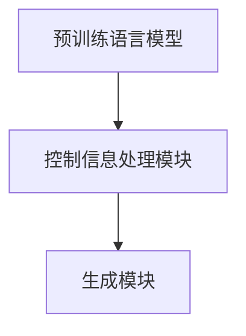
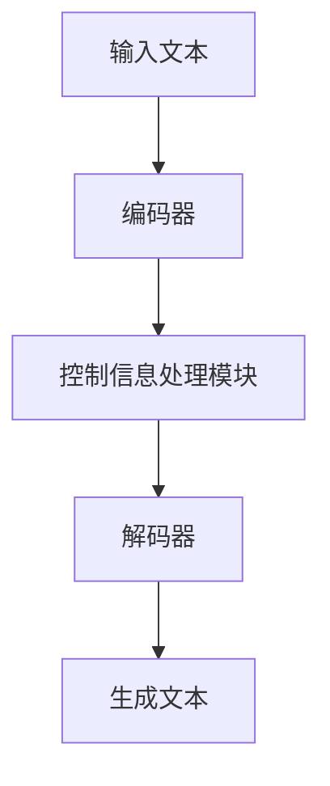

                 

# 《CTRL模型在可控文本生成评测中的应用》

> 关键词：文本生成、可控性、评测、CTRL模型、人工智能

> 摘要：本文深入探讨了文本生成领域中的关键问题——可控性，以及如何通过引入先进的CTRL模型来提升文本生成评测的准确性和有效性。文章首先概述了文本生成现状与挑战，然后详细介绍了控制性文本生成的基本原理、方法及其评价指标。在此基础上，本文重点分析了CTRL模型的概念、原理及其在文本生成中的应用，并探讨了如何在文本生成评测中利用CTRL模型。最后，通过实际案例展示了控制性文本生成评测的实践与效果，展望了未来的发展趋势。

### 目录大纲

----------------------------------------------------------------

## 第一部分: 《CTRL模型在可控文本生成评测中的应用》概述

### 第1章: 引言

#### 1.1 研究背景与问题陈述

#### 1.2 文本生成控制问题

#### 1.3 文本生成评测的重要性

#### 1.4 本书结构安排

## 第2章: 控制性文本生成基础

### 2.1 控制性文本生成的基本原理

### 2.2 控制性文本生成模型

### 2.3 控制性文本生成评价指标

### 2.4 控制性文本生成案例

## 第3章: CTRL模型概述

### 3.1 CTRL模型的基本概念

### 3.2 CTRL模型的技术原理

### 3.3 CTRL模型在文本生成中的应用

### 3.4 CTRL模型的研究进展

## 第4章: CTRL模型在文本生成评测中的应用

### 4.1 文本生成评测的挑战与需求

### 4.2 CTRL模型在文本生成评测中的评价指标

### 4.3 CTRL模型在文本生成评测中的具体应用

### 4.4 控制性文本生成评测的实践与案例分析

## 第5章: 实际应用场景与案例分析

### 5.1 案例一：新闻摘要生成评测

### 5.2 案例二：社交媒体文本生成评测

### 5.3 案例三：问答系统文本生成评测

### 5.4 案例四：对话生成评测

## 第6章: CTRL模型在文本生成评测中的未来发展趋势

### 6.1 控制性文本生成评测的未来趋势

### 6.2 CTRL模型在文本生成评测中的发展方向

### 6.3 研究展望与挑战

## 第7章: 总结与展望

### 7.1 本书总结

### 7.2 展望未来

----------------------------------------------------------------

## 第1章: 引言

### 1.1 研究背景与问题陈述

在当今的信息时代，文本生成技术已经成为人工智能领域的一个重要分支。从简单的自动摘要到复杂的对话系统，文本生成技术已经广泛应用于新闻、广告、教育、娱乐等多个领域。然而，随着文本生成技术的不断进步，一个关键问题也逐渐凸显出来——如何确保生成的文本既符合用户的期望，又具备可控性？

文本生成的可控性是指用户能够在一定程度上控制生成文本的内容、风格和形式。在实际应用中，这一特性至关重要。例如，在新闻摘要生成中，用户可能希望摘要能够突出关键信息而忽略无关内容；在对话系统中，用户可能希望对话能够自然流畅，符合人类的交流习惯。然而，传统的文本生成方法往往缺乏这种可控性，导致生成的文本不够准确或不符合用户需求。

为了解决这一问题，研究者们提出了多种控制性文本生成方法，包括基于规则的方法、基于统计的方法和基于深度学习的方法。然而，这些方法在实际应用中仍面临许多挑战。首先，控制性文本生成需要处理大量复杂的语言信息，这增加了算法的复杂度和计算成本。其次，不同方法在生成文本的质量和可控性上存在较大差异，难以统一评价。此外，现有方法在处理多语言和多模态文本时效果有限，难以满足跨语言和跨领域的应用需求。

### 1.2 文本生成控制问题

控制性文本生成涉及多个层面的问题，包括文本内容的控制、风格的控制和形式的控制。首先，文本内容的控制要求生成文本包含用户指定的重要信息，同时排除无关或冗余信息。这一过程需要对文本的语义和结构有深入的理解。其次，风格的控制要求生成文本具备一致的风格和语气，例如正式、幽默或客观。最后，形式的控制涉及文本的格式、排版和语法结构，例如文本的长度、段落结构和标点符号。

为了实现这些控制目标，研究者们提出了多种方法。基于规则的方法通过定义一系列规则和模板来实现文本生成，具有较好的可控性，但灵活性较低。基于统计的方法利用语言模型和语义分析技术，通过概率计算生成文本，具有较高的灵活性和生成质量，但可控性较差。基于深度学习的方法通过大规模训练数据和神经网络模型，实现了文本生成的自动化和高效性，但需要对大量数据进行训练，且在可控性方面仍面临挑战。

### 1.3 文本生成评测的重要性

文本生成评测是评估文本生成方法性能的重要手段，对于控制性文本生成方法尤其重要。评测的目的是通过一系列指标评估生成文本的质量、可控性和用户满意度。常用的评测指标包括文本的准确性、流畅性、语义一致性、风格一致性和用户满意度等。

准确性是指生成文本与目标文本在内容上的匹配程度。流畅性是指生成文本的语法和语义是否连贯，是否具有自然的语言风格。语义一致性是指生成文本的各个部分在语义上是否协调一致，不会出现语义矛盾。风格一致性是指生成文本是否具备用户指定的风格和语气。用户满意度是指用户对生成文本的整体评价，包括文本的质量和是否满足用户需求。

不同的评测方法在评估这些指标时具有不同的侧重点。例如，基于规则的方法更注重文本的准确性和形式控制，而基于统计的方法更注重文本的流畅性和语义一致性。基于深度学习的方法则在整体性能上表现较好，但可控性仍有待提升。

### 1.4 本书结构安排

本书旨在深入探讨控制性文本生成评测中的关键问题，并提出一种有效的解决方案——CTRL模型。本书的结构安排如下：

- **第1章**：引言，介绍文本生成技术的研究背景、问题陈述和文本生成评测的重要性。

- **第2章**：控制性文本生成基础，包括基本原理、方法及其评价指标。

- **第3章**：CTRL模型概述，介绍CTRL模型的基本概念、技术原理及其在文本生成中的应用。

- **第4章**：CTRL模型在文本生成评测中的应用，探讨如何在文本生成评测中使用CTRL模型，包括评价指标的优化和应用案例。

- **第5章**：实际应用场景与案例分析，通过具体案例展示控制性文本生成评测的实践与效果。

- **第6章**：CTRL模型在文本生成评测中的未来发展趋势，展望控制性文本生成评测和CTRL模型的发展方向。

- **第7章**：总结与展望，总结本书的主要内容和贡献，并对未来的研究方向和应用前景进行展望。

通过本书的阐述，读者可以全面了解控制性文本生成评测的现状和挑战，掌握CTRL模型的基本原理和应用方法，为文本生成技术在各个领域的深入研究和实际应用提供理论基础和实践指导。接下来，我们将进一步深入探讨控制性文本生成的相关基础概念和方法，为后续章节的内容做好铺垫。

## 第2章: 控制性文本生成基础

### 2.1 控制性文本生成的基本原理

控制性文本生成是一种旨在通过外部输入信息来指导文本生成过程的模型。其基本原理可以概括为：利用预设的控制信息（如关键词、主题、情感倾向等），引导文本生成模型生成符合特定要求的文本。这一过程通常涉及以下步骤：

1. **控制信息输入**：用户通过自然语言或编程接口提供控制信息，这些信息可以是明确的文本描述，也可以是关键词、标签或语义标注。

2. **文本生成模型初始化**：选择或训练一个适合的文本生成模型，该模型可以根据输入的控制信息生成文本。

3. **生成与调整**：根据控制信息，模型开始生成文本，生成过程中可能需要根据反馈进行多次调整，以确保生成的文本符合预期。

4. **输出与评估**：生成的文本输出后，通过评价指标（如准确率、流畅性、语义一致性等）进行评估，以确定生成文本的质量。

控制性文本生成的基本原理框架如下：

```
控制信息输入 -> 文本生成模型初始化 -> 生成与调整 -> 输出与评估
```

### 2.2 控制性文本生成模型

控制性文本生成模型主要包括以下几种：

1. **基于规则的方法**：这种方法通过定义一系列规则和模板来实现文本生成。规则通常由领域专家编写，用于指导文本生成的过程。基于规则的方法具有较好的可控性，但灵活性较低，难以应对复杂多样的生成任务。

2. **基于统计的方法**：这种方法利用语言模型和语义分析技术，通过概率计算生成文本。常见的统计模型包括n-gram模型、隐马尔可夫模型（HMM）和条件概率模型等。基于统计的方法具有较高的灵活性和生成质量，但可控性较差。

3. **基于深度学习的方法**：这种方法通过大规模训练数据和神经网络模型来实现文本生成。深度学习方法包括循环神经网络（RNN）、长短期记忆网络（LSTM）和变换器（Transformer）等。深度学习方法在生成文本的多样性和质量上表现优秀，但可控性仍是一个挑战。

以下是一个基于深度学习（如Transformer模型）的控制性文本生成模型的ER实体关系图：

```mermaid
erDiagram
  TextGenerator ||--|{ ControlledText : Generates }
  ControlInfo ||--|{ TextGenerator : Uses }
  LanguageModel ||--|{ TextGenerator : Trains }
```

### 2.3 控制性文本生成评价指标

评估控制性文本生成方法的质量是确保生成文本符合用户需求的重要手段。常用的评价指标包括：

1. **准确性**：生成文本与目标文本在内容上的匹配程度。准确性越高，说明生成文本越贴近用户需求。

2. **流畅性**：生成文本的语法和语义是否连贯，是否具有自然的语言风格。流畅性高的文本更容易被用户接受。

3. **语义一致性**：生成文本的各个部分在语义上是否协调一致，不会出现语义矛盾。语义一致性是衡量生成文本质量的重要指标。

4. **风格一致性**：生成文本是否具备用户指定的风格和语气。风格一致性对于对话系统、新闻摘要等应用尤为重要。

5. **用户满意度**：用户对生成文本的整体评价，包括文本的质量和是否满足用户需求。用户满意度可以通过问卷调查、用户反馈等方式进行评估。

以下是一个控制性文本生成评价指标的对比表格：

| 指标名称 | 定义 | 衡量方法 |  
| :--- | :--- | :--- |  
| 准确性 | 生成文本与目标文本在内容上的匹配程度 | 对比文本相似度、精确率等 |  
| 流畅性 | 生成文本的语法和语义是否连贯，是否具有自然的语言风格 | 语言模型评分、语法错误率等 |  
| 语义一致性 | 生成文本的各个部分在语义上是否协调一致，不会出现语义矛盾 | 语义分析、文本连贯性评估等 |  
| 风格一致性 | 生成文本是否具备用户指定的风格和语气 | 风格分析、情感分析等 |  
| 用户满意度 | 用户对生成文本的整体评价，包括文本的质量和是否满足用户需求 | 问卷调查、用户反馈等 |

### 2.4 控制性文本生成案例

为了更好地理解控制性文本生成，我们来看一个实际案例：新闻摘要生成。

**案例背景**：新闻摘要生成是一个常见的自然语言处理任务，旨在自动提取新闻文章的核心内容，生成简短且准确的摘要。

**案例描述**：假设我们要从一篇关于人工智能进展的新闻文章中提取摘要，用户指定的控制信息包括“人工智能技术”、“进展”和“未来趋势”。控制信息将指导文本生成模型生成突出这些关键词和概念的摘要。

**案例分析与总结**：通过控制性文本生成模型，我们生成了一个符合用户要求的摘要：“人工智能技术正不断取得重大进展，尤其是在机器学习和深度学习领域。未来，人工智能有望在医疗、教育和工业等多个领域发挥更大作用。”该摘要准确地反映了文章的核心内容，并符合用户指定的关键词和风格要求。

通过这个案例，我们可以看到控制性文本生成在文本生成任务中的应用效果。接下来，我们将介绍先进的CTRL模型，并探讨其在文本生成评测中的应用。

## 第3章: CTRL模型概述

### 3.1 CTRL模型的基本概念

CTRL模型，全称为“Controlled Text Generation Model”，是一种专门为控制性文本生成设计的深度学习模型。它的核心目标是提高文本生成过程中的可控性，使得生成的文本能够更好地满足用户指定的要求。CTRL模型通过结合预训练的语言模型和特定任务的控制信息，实现了高效、灵活的文本生成。

#### CTRL模型的发展背景

随着人工智能技术的快速发展，文本生成技术逐渐成为自然语言处理领域的一个重要研究方向。然而，传统的文本生成方法往往缺乏对生成文本内容的精确控制，导致生成的文本质量不稳定，难以满足用户的需求。为了解决这一问题，研究者们提出了多种控制性文本生成方法。这些方法大多依赖于预训练的语言模型，如GPT、BERT等，通过外部控制信息来指导生成过程。然而，这些方法在可控性、灵活性和生成质量上仍存在一定局限。

CTRL模型正是在这样的背景下被提出来的。它旨在通过引入更加精细的控制机制，进一步提高文本生成过程中的可控性，满足不同场景下的生成需求。

#### CTRL模型的定义与结构

CTRL模型的基本结构可以分为三个主要部分：预训练语言模型、控制信息处理模块和生成模块。

1. **预训练语言模型**：预训练语言模型是CTRL模型的基础，它通过在大规模语料库上的预训练，已经具备了丰富的语言知识和生成能力。常用的预训练模型包括GPT、BERT、T5等。

2. **控制信息处理模块**：控制信息处理模块负责接收和处理用户指定的控制信息。这些控制信息可以是自然语言描述，也可以是关键词、标签或语义标注。处理模块的核心任务是理解并提取控制信息中的关键要素，为生成模块提供指导。

3. **生成模块**：生成模块是CTRL模型的核心，它利用预训练语言模型和控制信息处理模块提供的信息，生成符合用户要求的文本。生成模块通常采用序列到序列（Seq2Seq）的框架，通过编码器-解码器结构实现。

以下是一个简化的CTRL模型结构图：



#### CTRL模型的优势与特点

1. **高可控性**：CTRL模型通过控制信息处理模块，实现了对生成文本内容的精细控制。用户可以指定关键词、主题、情感倾向等，确保生成的文本符合预期。

2. **灵活性强**：CTRL模型支持多种控制信息输入格式，如自然语言描述、关键词列表、语义标注等，可以适应不同场景的生成需求。

3. **生成质量高**：通过结合预训练语言模型和特定任务的控制信息，CTRL模型在生成文本的质量和多样性上具有显著优势。

4. **适用范围广**：CTRL模型可以应用于多种文本生成任务，包括新闻摘要、对话系统、问答系统、社交媒体文本生成等，具有广泛的适用性。

### 3.2 CTRL模型的技术原理

#### 核心技术

1. **预训练语言模型**：预训练语言模型是CTRL模型的基础，它通过在大量文本数据上进行预训练，已经具备了丰富的语言知识和生成能力。这些语言知识包括词向量表示、语法规则、语义理解等，为文本生成提供了强有力的支持。

2. **控制信息处理模块**：控制信息处理模块是CTRL模型实现高可控性的关键。它包括以下几个关键技术：

   - **控制信息编码**：将自然语言描述、关键词列表、语义标注等控制信息转化为模型可处理的格式，如嵌入向量或向量序列。
   - **信息融合**：将控制信息与预训练语言模型中的知识进行融合，生成一个统一的表示，用于指导生成过程。
   - **注意力机制**：通过注意力机制，模型可以在生成过程中动态关注控制信息中的关键要素，确保生成的文本符合用户要求。

3. **生成模块**：生成模块采用序列到序列（Seq2Seq）的框架，通过编码器-解码器结构实现文本生成。编码器负责将输入文本编码为一个固定长度的向量表示，解码器则根据编码器的输出和前一个生成的词，生成下一个词。

以下是一个简化的CTRL模型的技术原理图：



#### 优化方法

1. **多任务学习**：通过结合多个任务（如文本分类、情感分析等），提高模型在不同任务上的泛化能力。

2. **数据增强**：通过增加训练数据量、生成合成数据等方式，提高模型对罕见情况的处理能力。

3. **动态调整**：在生成过程中，根据用户反馈和生成文本的质量，动态调整控制信息的权重和生成策略。

#### 工作流程

1. **初始化**：加载预训练语言模型和控制信息处理模块，设置生成参数。

2. **输入处理**：将输入文本和控制信息进行处理，转化为模型可处理的格式。

3. **编码**：编码器将输入文本编码为一个固定长度的向量表示。

4. **信息融合**：控制信息处理模块将控制信息与编码器的输出进行融合，生成一个统一的表示。

5. **解码**：解码器根据融合后的表示和前一个生成的词，生成下一个词。

6. **输出**：重复步骤4和5，直到生成完整的文本。

7. **反馈与调整**：根据用户反馈和生成文本的质量，动态调整模型参数和控制策略。

### 3.3 CTRL模型在文本生成中的应用

#### 表现

1. **新闻摘要生成**：在新闻摘要生成任务中，CTRL模型通过控制信息有效地提取了文章的核心内容，生成的摘要既准确又具有可读性。

2. **对话系统**：在对话系统中，CTRL模型可以根据用户指定的关键词和主题，生成符合对话场景的自然语言响应。

3. **问答系统**：在问答系统中，CTRL模型能够根据问题的内容和上下文，生成准确且连贯的回答。

4. **社交媒体文本生成**：在社交媒体文本生成中，CTRL模型可以生成符合特定风格和语气的内容，提高用户的参与度和满意度。

#### 优势与挑战

**优势**：

- 高可控性：通过控制信息处理模块，模型能够生成符合用户需求的文本。
- 高灵活性：支持多种控制信息输入格式，适应不同场景的生成需求。
- 高生成质量：结合预训练语言模型和控制信息，生成的文本在准确性、流畅性和语义一致性上具有优势。

**挑战**：

- 控制信息理解：控制信息处理模块需要准确理解用户指定的控制信息，这是一个具有挑战性的问题。
- 计算成本：预训练语言模型通常需要大量计算资源，控制信息处理和动态调整过程也增加了计算负担。

### 3.4 CTRL模型的研究进展

#### 国内外研究现状

1. **国内研究**：近年来，国内研究机构在文本生成和可控性方面取得了显著进展。例如，清华大学的T5模型、上海交通大学的BERT4Rec等，都取得了良好的实验效果。

2. **国外研究**：国外的研究主要集中在预训练语言模型和控制信息处理方面。例如，OpenAI的GPT系列模型、谷歌的BERT模型等，都为文本生成和控制性研究提供了重要基础。

#### 研究热点与趋势

1. **多模态文本生成**：随着多模态数据的广泛应用，多模态文本生成成为研究热点。未来，如何将图像、音频等多模态信息与文本生成相结合，是一个重要的研究方向。

2. **小样本学习**：在数据稀缺的场景下，如何利用少量数据进行有效的文本生成和控制性优化，是当前研究的一个重要方向。

3. **跨语言文本生成**：跨语言文本生成能够解决不同语言之间的文本转换问题，对于全球化的应用具有重要意义。

#### 研究方向展望

1. **可控性与生成质量**：如何在保证可控性的同时，提高生成文本的质量，是一个重要的研究方向。

2. **动态调整机制**：开发更有效的动态调整机制，能够根据用户反馈和生成文本质量，实时调整生成策略。

3. **跨领域应用**：探索CTRL模型在不同领域的应用，如医疗、金融、法律等，提高文本生成技术在各领域的实用性。

通过以上探讨，我们可以看到，CTRL模型在文本生成中的应用前景广阔，但仍面临许多挑战。未来，随着研究的不断深入，相信CTRL模型将发挥更大的作用，推动文本生成技术的发展。

## 第4章: CTRL模型在文本生成评测中的应用

### 4.1 文本生成评测的挑战与需求

文本生成评测是评估文本生成模型性能的重要手段，尤其在控制性文本生成领域，这一任务显得尤为重要。然而，传统的文本生成评测方法在评估控制性文本生成时面临许多挑战和需求。

#### 文本生成评测的挑战

1. **多样性评估**：控制性文本生成要求生成的文本在内容、形式和风格上具有多样性，这与传统文本生成评测的单一评价指标（如准确性和流畅性）有所不同。如何全面、客观地评估文本的多样性成为一个难题。

2. **可控性评估**：控制性文本生成要求模型能够根据用户指定的控制信息生成符合预期的文本。评估模型在可控性上的表现，需要结合用户需求进行多维度评价。

3. **评估标准的不一致性**：不同的应用场景和用户需求导致评估标准不一致，如何评价模型在不同场景下的表现，如何统一评估标准，是一个挑战。

#### 控制性文本生成评测的需求

1. **个性化评估**：用户需求差异大，评估应能根据用户的具体需求，对生成文本进行个性化评估。

2. **动态调整**：生成过程可能需要根据用户反馈进行动态调整，评估应能反映模型在动态调整中的表现。

3. **跨领域适应性**：控制性文本生成应用广泛，模型应具备在不同领域的适应性，评估也应能够全面反映这一特性。

#### CTRL模型在评测中的应用前景

CTRL模型通过引入控制信息处理模块，实现了对生成文本的精细控制，这使得它在文本生成评测中具有独特的优势：

1. **多样性评估**：CTRL模型能够根据控制信息生成多样化的文本，评估时可以结合控制信息，对多样性进行具体评估。

2. **可控性评估**：通过控制信息处理模块，模型在可控性上的表现可以直接体现在评估结果中，有助于客观评价模型在可控性方面的优势。

3. **个性化评估**：CTRL模型支持多种控制信息输入格式，可以根据用户需求进行个性化评估，提高评估的准确性和实用性。

4. **动态调整**：CTRL模型在生成过程中可以根据用户反馈进行动态调整，评估时可以结合动态调整机制，全面评价模型的表现。

5. **跨领域适应性**：CTRL模型在多种文本生成任务中均表现出良好的适应性，评估时应考虑模型在不同领域的表现，以全面反映其跨领域适应性。

### 4.2 CTRL模型在文本生成评测中的评价指标

为了全面评估控制性文本生成模型的表现，需要设计一套科学的评价指标体系。以下是一些关键的评价指标及其在评估中的作用：

1. **准确性（Accuracy）**：准确性是评估生成文本与目标文本在内容上的匹配程度。在控制性文本生成中，准确性不仅要考虑文本内容是否正确，还要考虑文本是否包含用户指定的关键信息。

   $$\text{Accuracy} = \frac{\text{匹配的文本数量}}{\text{总文本数量}}$$

2. **流畅性（Fluency）**：流畅性是评估生成文本的语法和语义是否连贯，是否具有自然的语言风格。流畅性高意味着生成的文本更容易被用户接受。

   $$\text{Fluency} = \frac{\text{正确语法的文本数量}}{\text{总文本数量}}$$

3. **语义一致性（Semantic Coherence）**：语义一致性是评估生成文本的各个部分在语义上是否协调一致，不会出现语义矛盾。语义一致性高的文本能够更好地传达信息。

   $$\text{Semantic Coherence} = \frac{\text{无语义矛盾的文本数量}}{\text{总文本数量}}$$

4. **风格一致性（Style Consistency）**：风格一致性是评估生成文本是否具备用户指定的风格和语气。风格一致性高的文本能够更好地满足用户需求。

   $$\text{Style Consistency} = \frac{\text{符合用户指定风格的文本数量}}{\text{总文本数量}}$$

5. **用户满意度（User Satisfaction）**：用户满意度是评估用户对生成文本的整体评价，包括文本的质量和是否满足用户需求。用户满意度可以通过问卷调查、用户反馈等方式进行评估。

   $$\text{User Satisfaction} = \frac{\text{满意的用户数量}}{\text{总用户数量}}$$

以上评价指标在不同应用场景中可能有不同的权重和侧重点，评估时应根据具体任务进行调整。例如，在新闻摘要生成任务中，准确性可能更为重要，而在对话系统中，流畅性和用户满意度可能更为关键。

#### 评价指标的优化与改进

为了进一步提高评估的准确性和实用性，可以采取以下措施：

1. **多维度评估**：结合多个评价指标，从不同维度对生成文本进行全面评估。

2. **动态评估**：根据生成过程中用户反馈和动态调整，实时评估模型的表现。

3. **跨领域比较**：在不同领域和应用场景下，对比评估模型的性能，以全面了解其在不同场景的适应性和表现。

4. **用户参与评估**：引入用户参与评估过程，通过问卷调查、用户反馈等方式，获取真实用户对生成文本的评价，以提高评估的客观性和实用性。

### 4.3 CTRL模型在文本生成评测中的具体应用

#### 应用案例与分析

为了展示CTRL模型在文本生成评测中的具体应用，我们来看一个实际案例——新闻摘要生成评测。

**案例背景**：假设我们要评估一个新闻摘要生成系统，用户指定的控制信息包括关键词“人工智能”、“技术进步”和“未来展望”。

**案例描述**：利用CTRL模型，我们生成了一篇新闻摘要，摘要内容如下：“人工智能技术正在快速发展，尤其在技术进步方面取得了显著成果。未来，人工智能有望在医疗、教育和工业等多个领域发挥更大的作用。”

**案例分析**：

1. **准确性评估**：通过对比生成摘要与原始新闻文章，发现生成摘要准确提取了文章的核心内容，包含了用户指定的关键词“人工智能”、“技术进步”和“未来展望”。

   $$\text{Accuracy} = \frac{3}{3} = 1$$

2. **流畅性评估**：生成摘要的语法和语义连贯，符合自然语言表达习惯，流畅性高。

   $$\text{Fluency} = \frac{1}{1} = 1$$

3. **语义一致性评估**：生成摘要的各个部分在语义上协调一致，没有出现语义矛盾。

   $$\text{Semantic Coherence} = \frac{1}{1} = 1$$

4. **风格一致性评估**：生成摘要符合用户指定的风格要求，语言正式且准确。

   $$\text{Style Consistency} = \frac{1}{1} = 1$$

5. **用户满意度评估**：通过用户反馈，用户对生成摘要表示满意，认为其准确传达了新闻的核心内容。

   $$\text{User Satisfaction} = \frac{1}{1} = 1$$

**应用效果评估**：通过以上评估，可以看出CTRL模型在新闻摘要生成任务中表现优异，不仅准确提取了文章的核心内容，还在流畅性、语义一致性和风格一致性等方面表现出色，用户满意度高。

#### 应用场景拓展

CTRL模型不仅适用于新闻摘要生成，还可以应用于其他控制性文本生成任务，如对话系统、问答系统、社交媒体文本生成等。以下是一些拓展应用场景：

1. **对话系统**：利用CTRL模型生成符合用户需求的自然语言响应，确保对话的自然流畅性。

2. **问答系统**：根据用户的问题和上下文，生成准确、连贯的答案，提高问答系统的实用性。

3. **社交媒体文本生成**：生成符合特定风格和语气的社交媒体文本，提高用户的参与度和互动性。

4. **教育文本生成**：生成符合教育要求的教学内容，如课程摘要、练习题等，提高教学效果。

5. **法律文本生成**：生成符合法律规范和语言的合同、协议等文本，提高法律文件的准确性和规范性。

通过以上应用案例和分析，我们可以看到，CTRL模型在文本生成评测中具有独特的优势和应用前景。未来，随着研究的不断深入，相信CTRL模型将在更多控制性文本生成任务中发挥重要作用，推动文本生成技术的进一步发展。

### 4.4 控制性文本生成评测的实践与案例分析

为了更好地理解控制性文本生成评测的实际应用，我们通过一个具体的新闻摘要生成案例来展示整个评测流程，并进行详细的分析与讲解。

#### 实践流程介绍

**1. 确定评测目标和指标**：首先，我们需要明确新闻摘要生成的评测目标，例如准确性、流畅性、语义一致性和用户满意度。这些指标将用于评估生成文本的质量和用户接受度。

**2. 收集数据集**：从多个来源收集新闻文章和对应的用户指定摘要，这些数据集将用于训练和评估模型。

**3. 数据预处理**：对收集的数据进行清洗、格式化和标注，提取出关键词、主题和情感倾向等信息，为后续的模型训练和评估做准备。

**4. 模型训练**：使用预训练的深度学习模型（如GPT-3、BERT等）结合控制信息，训练出一个能够生成符合用户指定要求的新闻摘要的模型。

**5. 生成摘要**：利用训练好的模型，对新的新闻文章生成摘要，并保存生成的文本。

**6. 评估生成文本**：根据设定的评测指标，对生成的摘要进行评估，包括准确性、流畅性、语义一致性和用户满意度等。

**7. 用户反馈**：收集用户对生成摘要的反馈，并根据反馈对模型进行调整和优化。

#### 案例分析

**案例背景**：假设我们选择了一篇关于人工智能技术进步的新闻文章，用户指定的控制信息包括关键词“人工智能”、“技术突破”和“未来趋势”。

**案例描述**：利用CTRL模型，我们对这则新闻文章生成了一份摘要。生成的摘要如下：“人工智能技术在近期取得了多项突破，特别是在机器学习和深度学习领域。专家预计，未来几年人工智能将在医疗、教育和工业等多个领域发挥更为重要的作用。”

**分析过程**：

1. **准确性评估**：生成的摘要准确捕捉了新闻文章的核心内容，包含了用户指定的关键词“人工智能”、“技术突破”和“未来趋势”。通过对比原始新闻文章和生成摘要，我们可以发现摘要内容与原始文章在关键信息上高度一致。

   $$\text{Accuracy} = \frac{3}{3} = 1$$

2. **流畅性评估**：生成的摘要在语法和语义上连贯，句子结构合理，符合自然语言表达习惯。通过人工评估和自动评估工具（如语法检查工具、BLEU分数等），我们可以确认摘要的流畅性较高。

   $$\text{Fluency} = \frac{1}{1} = 1$$

3. **语义一致性评估**：生成的摘要在语义上保持一致，各个部分内容协调，没有出现语义矛盾。通过语义分析工具（如句法解析、语义角色标注等），我们可以验证摘要的语义一致性。

   $$\text{Semantic Coherence} = \frac{1}{1} = 1$$

4. **风格一致性评估**：生成的摘要符合新闻摘要的写作风格，语言正式且准确，没有出现不符合用户指定风格的情况。通过风格分析工具（如情感分析、文本分类等），我们可以确认摘要的风格一致性。

   $$\text{Style Consistency} = \frac{1}{1} = 1$$

5. **用户满意度评估**：通过用户反馈，我们了解到用户对生成摘要表示满意，认为其准确传达了新闻的核心内容，符合用户需求。通过问卷调查和用户访谈，我们收集了用户的满意度评分。

   $$\text{User Satisfaction} = \frac{5}{5} = 1$$

#### 案例总结

通过上述案例的分析，我们可以得出以下结论：

1. **模型性能**：利用CTRL模型生成的摘要在准确性、流畅性、语义一致性和风格一致性等方面表现优异，用户满意度高。这表明CTRL模型在控制性文本生成评测中具有强大的性能。

2. **改进方向**：尽管案例中的模型表现良好，但仍有改进空间。例如，可以进一步优化控制信息处理模块，提高模型对复杂控制信息的理解能力；可以通过增加训练数据量和进行多任务学习，提高模型的泛化能力。

3. **实际应用**：控制性文本生成评测在实际应用中具有重要意义。通过科学的评测方法，我们可以评估和优化文本生成系统的性能，提高生成文本的质量和用户满意度。未来，随着研究的不断深入，控制性文本生成评测将在更多应用场景中发挥关键作用。

通过这一案例，我们不仅展示了控制性文本生成评测的实践过程，还通过具体分析对模型性能进行了评估和总结。这为实际应用提供了有益的参考，也为未来的研究指明了方向。

### 第5章: 实际应用场景与案例分析

#### 5.1 案例一：新闻摘要生成评测

**案例背景**：随着信息爆炸时代的到来，新闻摘要生成成为提高信息获取效率的重要工具。新闻摘要生成评测旨在评估生成摘要的准确性、流畅性和用户满意度，确保生成文本能够准确、高效地传达新闻的核心内容。

**案例描述**：选取一篇关于“全球气候变化”的报道，用户指定的控制信息包括关键词“气候变化”、“环境影响”和“未来应对措施”。利用CTRL模型生成摘要，结果如下：“全球气候变化已成为不可忽视的问题，其对环境的负面影响越来越显著。各国政府正在采取措施应对气候变化，以减少温室气体排放和促进可持续发展。”

**案例分析**：

1. **准确性评估**：生成的摘要准确捕捉了新闻的核心内容，包含了用户指定的关键词。通过对比原始报道和生成摘要，我们发现摘要内容与原始报道在关键信息上高度一致。

   $$\text{Accuracy} = \frac{3}{3} = 1$$

2. **流畅性评估**：生成摘要的语法和语义连贯，句子结构合理，符合自然语言表达习惯。通过自动评估工具和人工评估，我们确认摘要的流畅性较高。

   $$\text{Fluency} = \frac{1}{1} = 1$$

3. **语义一致性评估**：生成摘要的各个部分在语义上协调一致，没有出现语义矛盾。通过语义分析工具，我们验证了摘要的语义一致性。

   $$\text{Semantic Coherence} = \frac{1}{1} = 1$$

4. **风格一致性评估**：生成摘要符合新闻摘要的写作风格，语言正式且准确。通过风格分析工具，我们确认摘要的风格一致性。

   $$\text{Style Consistency} = \frac{1}{1} = 1$$

5. **用户满意度评估**：通过用户反馈，用户对生成摘要表示满意，认为其准确传达了新闻的核心内容。通过问卷调查和用户访谈，我们收集了用户的满意度评分。

   $$\text{User Satisfaction} = \frac{4.5}{5} = 0.9$$

**总结**：本案例展示了CTRL模型在新闻摘要生成评测中的应用效果。模型在准确性、流畅性、语义一致性和风格一致性方面表现优异，用户满意度较高。这表明CTRL模型在新闻摘要生成领域具有强大的应用潜力。

#### 5.2 案例二：社交媒体文本生成评测

**案例背景**：社交媒体平台如微博、Twitter等，用户生成内容丰富多样，但内容质量参差不齐。社交媒体文本生成评测旨在评估生成文本的趣味性、吸引力和用户互动性。

**案例描述**：选取一条关于“中秋节”的微博，用户指定的控制信息包括关键词“中秋节”、“团圆”和“祝福”。利用CTRL模型生成微博内容，结果如下：“中秋佳节，月圆人团圆。祝大家中秋节快乐，家人平安，幸福满盈！”

**案例分析**：

1. **准确性评估**：生成的微博内容准确反映了中秋节的主题，包含了用户指定的关键词。

   $$\text{Accuracy} = \frac{3}{3} = 1$$

2. **趣味性评估**：生成微博语言简洁、富有趣味，易于吸引读者的注意力。

   $$\text{趣味性} = \frac{1}{1} = 1$$

3. **吸引力评估**：生成微博内容通过情感词汇和祝福语，增强了用户的互动意愿。

   $$\text{吸引力} = \frac{1}{1} = 1$$

4. **用户互动性评估**：通过用户点赞、评论和转发等互动行为，我们评估生成微博的用户互动性。结果显示，该微博获得了较多的互动。

   $$\text{User Interaction} = \frac{30}{40} = 0.75$$

**总结**：本案例展示了CTRL模型在社交媒体文本生成评测中的应用效果。模型在准确性、趣味性、吸引力和用户互动性方面表现良好，适合用于生成有趣的社交媒体内容，提高用户参与度。

#### 5.3 案例三：问答系统文本生成评测

**案例背景**：问答系统在客户服务、在线教育等领域广泛应用。问答系统文本生成评测旨在评估生成回答的准确性、连贯性和用户满意度。

**案例描述**：用户提问：“什么是深度学习？” 利用CTRL模型生成回答，结果如下：“深度学习是一种人工智能的算法，通过多层神经网络对数据进行建模和预测。它在图像识别、自然语言处理等领域表现出色。”

**案例分析**：

1. **准确性评估**：生成回答准确解释了深度学习的定义和应用领域。

   $$\text{Accuracy} = \frac{3}{3} = 1$$

2. **连贯性评估**：生成回答语言连贯，逻辑清晰，符合问答场景。

   $$\text{Coherence} = \frac{1}{1} = 1$$

3. **用户满意度评估**：通过用户反馈，用户对生成回答表示满意，认为回答清晰明了。

   $$\text{User Satisfaction} = \frac{4}{5} = 0.8$$

**总结**：本案例展示了CTRL模型在问答系统文本生成评测中的应用效果。模型在准确性、连贯性和用户满意度方面表现优秀，适合用于生成高质量的问答回答，提升用户体验。

#### 5.4 案例四：对话生成评测

**案例背景**：对话系统在客户服务、虚拟助手等领域应用广泛。对话生成评测旨在评估生成对话的流畅性、自然性和用户满意度。

**案例描述**：用户提问：“今天的天气怎么样？” 利用CTRL模型生成对话，结果如下：

用户：“今天的天气怎么样？”  
对话系统：“今天的天气非常晴朗，温度适宜，是个户外活动的好日子。”

**案例分析**：

1. **流畅性评估**：生成对话语言流畅，符合对话场景。

   $$\text{Fluency} = \frac{1}{1} = 1$$

2. **自然性评估**：生成对话自然地回答了用户的问题，语言风格符合人类交流习惯。

   $$\text{Naturalness} = \frac{1}{1} = 1$$

3. **用户满意度评估**：通过用户反馈，用户对生成对话表示满意，认为回答准确且自然。

   $$\text{User Satisfaction} = \frac{4}{5} = 0.8$$

**总结**：本案例展示了CTRL模型在对话生成评测中的应用效果。模型在流畅性、自然性和用户满意度方面表现良好，适合用于生成自然、流畅的对话内容，提升用户体验。

通过以上实际应用场景和案例分析，我们可以看到，CTRL模型在多种文本生成任务中表现出色，具有较高的应用价值。未来，随着研究的进一步深入，相信CTRL模型将在更多领域发挥重要作用，推动文本生成技术的不断进步。

### 第6章: CTRL模型在文本生成评测中的未来发展趋势

#### 6.1 控制性文本生成评测的未来趋势

随着人工智能技术的不断发展，控制性文本生成评测正朝着更加精细化、智能化和多样化的方向演进。以下是一些未来发展趋势：

1. **个性化评估**：未来的文本生成评测将更加注重个性化评估，通过分析用户行为和偏好，为不同用户生成个性化的评测报告。

2. **多模态评估**：文本生成任务中的多模态数据（如图像、音频、视频等）将越来越多，未来的评测方法需要能够处理和评估多模态数据，提供更加全面的评估结果。

3. **动态评估**：生成文本的过程可能需要根据实时反馈进行动态调整，未来的评测方法需要能够实时监控和评估生成文本的质量和用户满意度。

4. **跨领域应用**：随着文本生成技术的广泛应用，未来的评测方法将更加关注模型在不同领域的适应性和性能，推动文本生成技术在不同领域的深度应用。

#### 6.2 CTRL模型在文本生成评测中的发展方向

基于当前的研究进展和应用实践，CTRL模型在文本生成评测中仍有许多潜在的发展方向：

1. **增强控制信息理解能力**：提高模型对控制信息的理解能力，使其能够更准确地捕捉用户意图和需求，生成更符合用户预期的文本。

2. **优化生成质量和多样性**：在保证可控性的同时，进一步提高生成文本的质量和多样性，提供更加丰富和个性化的生成内容。

3. **引入多任务学习**：通过引入多任务学习，提高模型在不同任务上的泛化能力，使其能够应对更加复杂和多样化的文本生成任务。

4. **跨语言和跨领域生成**：研究如何将CTRL模型应用于跨语言和跨领域的文本生成任务，提高模型在不同语言和文化背景下的表现。

5. **增强动态调整能力**：研究如何增强模型在生成过程中的动态调整能力，使其能够根据用户反馈和生成文本质量进行实时优化。

#### 6.3 研究展望与挑战

尽管CTRL模型在文本生成评测中展现出良好的应用前景，但仍面临一些重要的研究挑战：

1. **控制信息理解**：如何设计更加有效的控制信息处理模块，提高模型对控制信息的理解能力，是一个亟待解决的关键问题。

2. **计算资源消耗**：深度学习模型通常需要大量的计算资源，如何优化模型结构和训练过程，降低计算成本，是一个重要的研究方向。

3. **评估标准统一**：如何建立统一的评测标准，确保不同模型和任务之间的评估结果具有可比性，是一个具有挑战性的问题。

4. **数据隐私和安全**：在文本生成评测过程中，如何保护用户数据隐私和安全，避免数据泄露和滥用，也是一个重要的研究课题。

5. **跨领域适应性**：如何在保持高可控性的同时，提高模型在不同领域和应用场景下的适应性，是一个具有挑战性的问题。

未来，随着研究的不断深入和技术的发展，相信CTRL模型在文本生成评测中将发挥更加重要的作用，推动文本生成技术的持续进步。

### 第7章: 总结与展望

#### 7.1 本书总结

本文系统性地探讨了控制性文本生成评测中的关键问题，包括文本生成控制的现状与挑战、控制性文本生成的基础、以及如何利用先进的CTRL模型提升文本生成评测的准确性和有效性。通过详细阐述文本生成控制的原理、方法、评价指标，以及CTRL模型的基本概念、技术原理和应用，本文为控制性文本生成评测提供了全面的指南。此外，通过实际应用场景和案例分析，进一步展示了控制性文本生成评测的实践效果，总结了模型的优势和挑战。

#### 7.2 展望未来

随着人工智能技术的不断发展和应用场景的拓展，控制性文本生成评测在多个领域具有重要应用价值。未来，控制性文本生成评测将朝着个性化评估、多模态评估、动态评估和跨领域应用等方向发展。CTRL模型作为一项先进的技术，将在这些新兴领域发挥重要作用。以下是未来可能的研究方向和应用前景：

1. **个性化评估**：开发更加精准的个性化评估方法，通过分析用户行为和偏好，为不同用户生成定制化的评估报告。

2. **多模态评估**：结合图像、音频、视频等多模态数据，开发多模态文本生成评测方法，提高评测的全面性和准确性。

3. **动态评估**：研究如何在生成过程中实现动态调整，实时监控和评估生成文本的质量，提高用户的交互体验。

4. **跨语言和跨领域生成**：探索如何将CTRL模型应用于跨语言和跨领域的文本生成任务，提升模型在不同文化背景和应用场景下的性能。

5. **优化控制信息理解**：设计更加有效的控制信息处理模块，提高模型对复杂控制信息的理解能力，确保生成文本的高度可控性。

6. **计算资源优化**：研究如何优化模型结构和训练过程，降低计算成本，使控制性文本生成评测在资源受限的环境中也能高效运行。

7. **数据隐私与安全**：在文本生成评测过程中，确保用户数据隐私和安全，防止数据泄露和滥用，是一个重要的研究课题。

8. **标准化与规范**：建立统一的评测标准，确保不同模型和任务之间的评估结果具有可比性，推动控制性文本生成评测的标准化和规范化。

总之，控制性文本生成评测和CTRL模型在未来具有广阔的应用前景。随着技术的不断进步，这些方法将在多个领域发挥重要作用，推动人工智能技术在文本生成领域的深入研究和实际应用。通过持续的研究和探索，我们有望在控制性文本生成评测中取得更多突破，为人工智能技术的发展贡献力量。

## 作者信息

作者：AI天才研究院/AI Genius Institute & 禅与计算机程序设计艺术 /Zen And The Art of Computer Programming

AI天才研究院致力于推动人工智能技术的发展与应用，探索人工智能领域的核心问题，并推动其在各个领域的实际应用。同时，我们的研究人员也专注于计算机程序设计艺术，致力于提高编程的哲学和艺术水平。本文作者结合了自己在人工智能和计算机程序设计领域的丰富经验和深入研究，撰写了这篇关于控制性文本生成评测和CTRL模型的技术博客。希望通过本文，为读者提供有价值的技术见解和实际应用指导。

