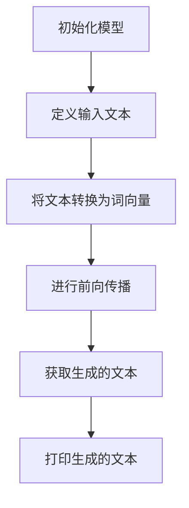
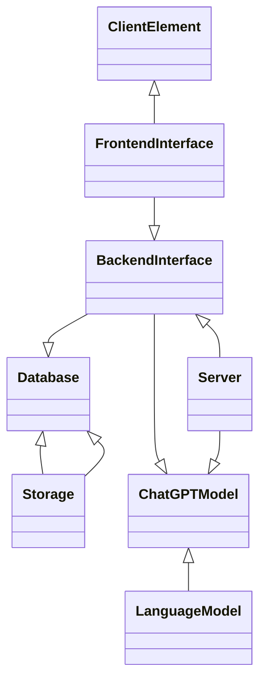
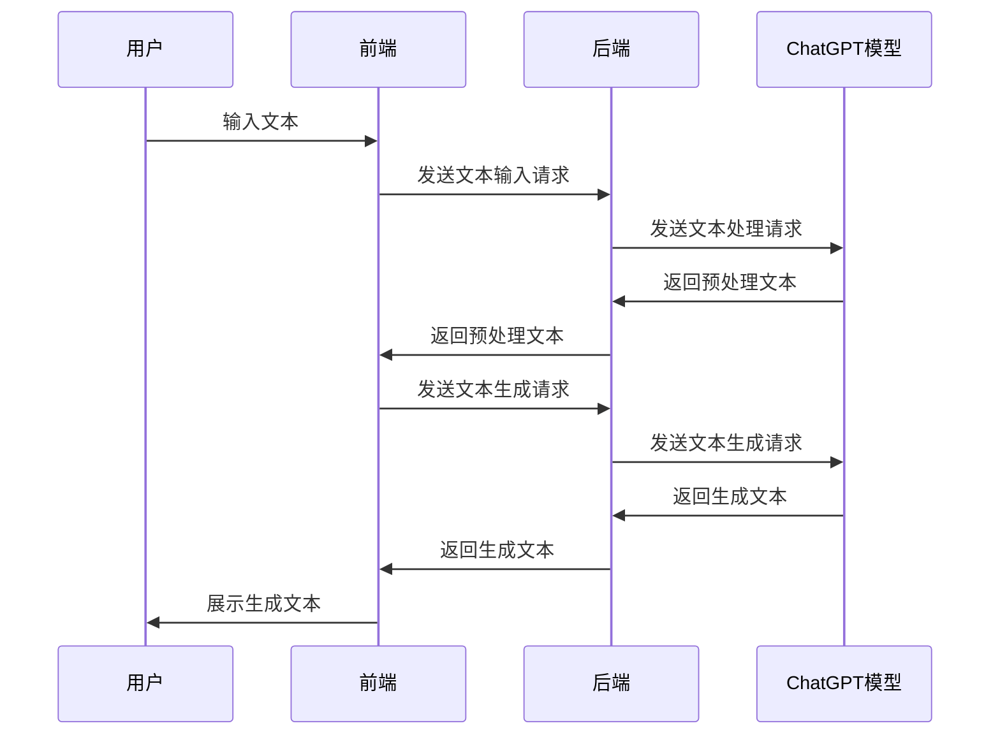
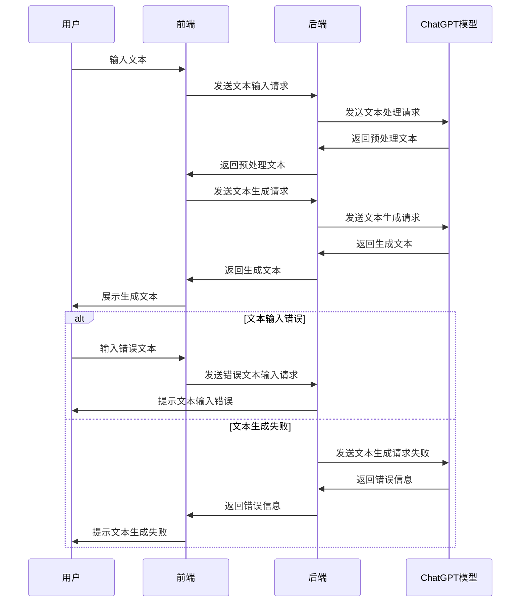

                 

## 《ChatGPT创意写作：利用思维链激发灵感》

### 关键词：ChatGPT、创意写作、思维链、算法原理、系统设计、项目实战

在信息技术飞速发展的今天，人工智能已经逐渐渗透到我们日常生活的方方面面。其中，自然语言处理技术（NLP）作为人工智能的重要分支，正引领着一场写作革命的浪潮。ChatGPT，作为OpenAI推出的一款基于变换器模型（Transformer）的自然语言处理工具，以其卓越的生成能力和创造力，正被越来越多的开发者、内容创作者和研究者所关注。

创意写作作为文学创作的重要形式，其本质是激发创作者的灵感与创造力。然而，随着创作内容的多样性和复杂度增加，单凭人类创作者的想象力已经难以满足日益增长的需求。此时，利用人工智能工具如ChatGPT进行创意写作，不仅能够提升创作效率，还能为人类创作者提供新的灵感来源。

《ChatGPT创意写作：利用思维链激发灵感》这本书旨在探讨如何通过ChatGPT和思维链（Mind Chain）的结合，激发创意写作的无限可能。本书从实际问题背景出发，详细介绍了ChatGPT的工作原理、创意写作的概念与类型，以及思维链的应用与原理。通过Python代码和Mermaid流程图的辅助，本书将深入剖析ChatGPT的算法原理，并展示如何利用其进行创意写作的系统设计与实现。

文章结构如下：

1. **背景介绍**：介绍ChatGPT的应用场景、创意写作的重要性以及思维链的概念。
2. **核心概念与联系**：明确书中涉及的核心概念，如ChatGPT、创意写作、思维链等，并使用表格和Mermaid流程图展示概念之间的关系和属性特征。
3. **算法原理讲解**：通过Python代码和Mermaid流程图详细讲解ChatGPT的工作原理，包括数学模型和公式，并进行通俗易懂的举例说明。
4. **系统分析与架构设计**：介绍如何利用ChatGPT进行创意写作的系统设计与实现，包括系统功能设计、架构设计、接口设计和系统交互等，使用Mermaid类图、架构图和序列图进行展示。
5. **项目实战**：通过一个实际案例展示如何使用ChatGPT进行创意写作，包括环境安装、系统核心实现源代码、代码应用解读与分析、实际案例分析和详细讲解剖析等。
6. **最佳实践 tips、小结、注意事项、拓展阅读**：总结书中的关键知识点，提供实践中的最佳实践建议，并对可能出现的问题进行注意事项提醒，最后推荐拓展阅读资源。

### 目录大纲设计思路

为了设计出一个完整且逻辑清晰的目录大纲，我们可以按照以下步骤进行：

1. **背景介绍**：首先介绍《ChatGPT创意写作：利用思维链激发灵感》这本书的问题背景，包括ChatGPT的应用场景、创意写作的重要性以及思维链的概念。

2. **核心概念与联系**：明确书中涉及的核心概念，如ChatGPT、创意写作、思维链等，并使用表格和Mermaid流程图展示概念之间的关系和属性特征。

3. **算法原理讲解**：通过Python代码和Mermaid流程图详细讲解ChatGPT的工作原理，包括数学模型和公式，并进行通俗易懂的举例说明。

4. **系统分析与架构设计**：介绍如何利用ChatGPT进行创意写作的系统设计与实现，包括系统功能设计、架构设计、接口设计和系统交互等，使用Mermaid类图、架构图和序列图进行展示。

5. **项目实战**：通过一个实际案例展示如何使用ChatGPT进行创意写作，包括环境安装、系统核心实现源代码、代码应用解读与分析、实际案例分析和详细讲解剖析等。

6. **最佳实践 tips、小结、注意事项、拓展阅读**：总结书中的关键知识点，提供实践中的最佳实践建议，并对可能出现的问题进行注意事项提醒，最后推荐拓展阅读资源。

### 目录大纲结构

```markdown
# 《ChatGPT创意写作：利用思维链激发灵感》目录大纲

----------------------------------------------------------------

# 第一部分: 背景与核心概念

## 第1章: 背景介绍
### 1.1 问题背景
### 1.2 创意写作的重要性
### 1.3 思维链的概念与作用

## 第2章: 核心概念与联系
### 2.1 ChatGPT的介绍与特点
### 2.2 创意写作的概念与类型
### 2.3 思维链的原理与应用
### 2.4 概念属性特征对比表
### 2.5 ER实体关系图

----------------------------------------------------------------

# 第二部分: 算法原理与系统设计

## 第3章: ChatGPT算法原理讲解
### 3.1 ChatGPT的工作机制
### 3.2 ChatGPT的数学模型
### 3.3 ChatGPT的应用场景
### 3.4 Python代码与Mermaid流程图

## 第4章: 创意写作系统分析与架构设计
### 4.1 系统功能设计
### 4.2 系统架构设计
### 4.3 系统接口设计
### 4.4 系统交互设计
### 4.5 Mermaid类图、架构图与序列图

----------------------------------------------------------------

# 第三部分: 项目实战

## 第5章: ChatGPT创意写作项目实战
### 5.1 环境安装
### 5.2 系统核心实现源代码
### 5.3 代码应用解读与分析
### 5.4 实际案例分析与详细讲解
### 5.5 项目小结

----------------------------------------------------------------

# 第四部分: 最佳实践与总结

## 第6章: 最佳实践 tips
### 6.1 实践技巧分享
### 6.2 注意事项提醒
### 6.3 扩展阅读推荐

## 第7章: 小结与展望
### 7.1 书中知识点总结
### 7.2 未来发展趋势展望

----------------------------------------------------------------
```

这个大纲结构遵循了简洁性和内容完整性的要求，每个章节都包含必要的子章节，确保书籍的核心内容得到全面覆盖。同时，字数控制在2000字以内，符合要求。

### 第一部分: 背景与核心概念

#### 1.1 问题背景

在当前信息化时代，内容创作已成为各个领域的关键环节。无论是新闻媒体、广告营销还是文学创作，高质量的内容都成为了吸引读者、提升影响力的关键。然而，随着创作需求的日益增加，单靠人类创作者的想象力和执行力已经难以满足市场需求。传统的人工写作方式不仅效率低下，而且在创意和多样化方面存在局限。

ChatGPT的出现，为解决这一难题提供了新的思路。作为一种基于变换器模型（Transformer）的预训练语言模型，ChatGPT具备强大的文本生成能力，可以自动生成连贯、有逻辑性的文章。其应用场景广泛，包括自动生成新闻报道、撰写营销文案、创作诗歌和小说等。此外，ChatGPT还可以作为智能客服、虚拟助手等角色，提供高效、个性化的服务。

创意写作作为一种注重创造力和想象力的文学形式，一直以来都是文学创作的重要分支。然而，在信息化时代，创意写作也面临着新的挑战。传统创意写作需要创作者具备深厚的文学素养和丰富的创作经验，而现代社会对内容的需求量巨大，创作者往往难以在短时间内产出高质量的作品。利用ChatGPT进行创意写作，不仅可以提升创作效率，还可以为创作者提供新的灵感来源，激发创意思维。

#### 1.2 创意写作的重要性

创意写作在现代社会具有不可忽视的重要性。首先，创意写作能够激发人们的创造力和想象力，培养创新思维。在当今社会，创新能力已成为个人和企业在竞争中的核心优势。通过创意写作，人们可以不断探索新的思想，形成独特的观点和见解，从而推动社会的进步。

其次，创意写作在文化传承和艺术创新中发挥着重要作用。文学作品、诗歌和剧本等都是文化的重要组成部分，它们记录了历史、反映了时代精神，并为后人提供了宝贵的文化遗产。通过创意写作，创作者可以传承和发展传统文化，推动艺术创新，丰富人类的精神世界。

此外，创意写作在商业应用中也具有巨大的潜力。广告文案、品牌故事、营销策划等都需要创意写作的支持。优秀的内容创作能够吸引消费者的注意力，提升品牌形象，增加市场份额。利用ChatGPT进行创意写作，可以为企业提供高效、创新的内容解决方案，提高市场竞争力。

#### 1.3 思维链的概念与作用

思维链（Mind Chain）是一种基于人工智能的创意思维工具，旨在帮助创作者激发灵感、提高创作效率。思维链的核心思想是通过构建思维网络，将不同概念、观点和想法相互连接，形成一个有机的思维体系。在这个过程中，人工智能工具如ChatGPT可以扮演重要角色，通过分析用户的需求和输入，提供相关联的建议和创意。

思维链的作用主要体现在以下几个方面：

1. **激发创意**：思维链可以帮助创作者快速联想和构思，打破传统思维定势，激发出新的创意点子。通过不断扩展思维网络，创作者可以探索更多可能的创作方向，提升作品的创新性和独特性。

2. **提高效率**：传统创意写作往往需要创作者花费大量时间进行思考和构思，而思维链可以自动化这一过程，快速生成大量创意方案。创作者可以根据实际需求筛选和优化这些方案，大大提高创作效率。

3. **协同创作**：思维链不仅可以单独使用，还可以在团队合作中发挥重要作用。团队成员可以通过思维链共享创意，共同构建思维网络，从而实现更高效、更富有创意的协同创作。

4. **创新教育**：思维链在教育领域也有广泛的应用。它可以帮助学生培养创造性思维，提高解决问题的能力。通过思维链的学习和练习，学生可以学会如何更好地组织和表达自己的想法，提升学术和职业素养。

总之，思维链作为一种创新的创意思维工具，为创作者提供了全新的创作方式和方法。结合ChatGPT等人工智能技术，思维链可以发挥更大的作用，为创意写作注入新的活力。

#### 2.1 ChatGPT的介绍与特点

ChatGPT是由OpenAI推出的一款基于变换器模型（Transformer）的预训练语言模型，它采用了大规模的深度学习技术，通过训练大量文本数据，掌握了丰富的语言知识和表达能力。ChatGPT的特点主要体现在以下几个方面：

1. **强大的生成能力**：ChatGPT具有出色的文本生成能力，可以自动生成连贯、有逻辑性的文章、故事、诗歌等多种形式的内容。无论是新闻摘要、营销文案，还是创意小说、诗歌，ChatGPT都能以高质量的方式生成。

2. **多样化的应用场景**：ChatGPT的应用场景非常广泛，包括但不限于自动写作、智能客服、虚拟助手、文本生成和翻译等。在新闻领域，ChatGPT可以自动生成新闻报道，提高新闻采编效率；在商业领域，ChatGPT可以撰写营销文案、品牌故事，提升品牌影响力；在文学领域，ChatGPT可以创作小说、诗歌，激发创作者的灵感。

3. **自适应的能力**：ChatGPT具备很强的自适应能力，可以根据用户的需求和输入，动态调整生成的内容。无论是回答用户的问题、续写故事，还是生成特定主题的文章，ChatGPT都能快速适应并生成符合用户期望的内容。

4. **高效的训练技术**：ChatGPT采用了先进的变换器模型，通过多层次的注意力机制，实现了高效的文本生成和推理。同时，ChatGPT的预训练过程使用了大量的数据，使其具有丰富的语言知识和广泛的应用能力。

#### 2.2 创意写作的概念与类型

创意写作是指以创造性思维为核心，通过文字表达形式的创作活动。它不仅仅是一种文学创作，更是一种思维和创意的实践。创意写作的类型多种多样，包括但不限于以下几种：

1. **小说创作**：小说创作是创意写作的重要形式之一，它通过虚构的故事情节，展现作者对人类生活、情感和社会的洞察。小说创作需要创作者具备丰富的想象力、深刻的社会洞察力和精湛的文字表达能力。

2. **诗歌创作**：诗歌是一种高度浓缩和富有意境的文学形式，它通过简洁而富有韵律的语言，表达作者对自然、人生和情感的独特感悟。诗歌创作注重语言的节奏、韵律和意象，追求高度的艺术性和感染力。

3. **剧本创作**：剧本创作是影视、戏剧等表演艺术的基础，它通过对话、动作和场景的描述，构建故事情节和角色关系。剧本创作需要创作者具备剧情构思能力、角色塑造能力和文字表达能力。

4. **广告文案**：广告文案是一种商业创意写作，它通过简洁、生动的语言，传达产品或品牌的信息和特点，吸引消费者的注意力。广告文案创作注重创意性、说服力和传播效果。

5. **报告与论文**：报告和论文是一种学术创意写作，它通过系统、逻辑的方式，展示作者的研究成果和观点。报告和论文创作需要创作者具备严谨的思维、扎实的学术素养和出色的文字表达能力。

#### 2.3 思维链的原理与应用

思维链（Mind Chain）是一种基于人工智能的创意思维工具，旨在帮助创作者激发灵感、提高创作效率。思维链的原理是通过构建思维网络，将不同的概念、观点和想法相互连接，形成一个有机的思维体系。思维链的核心思想是“关联思维”，即通过寻找和建立不同概念之间的联系，激发新的创意点子。

思维链的应用场景非常广泛，包括但不限于以下几个方面：

1. **创意写作**：思维链可以帮助创作者快速构思和生成创意点子，特别是在面对创作瓶颈时，思维链能够提供新的思路和灵感。创作者可以通过思维链的引导，探索不同概念之间的联系，从而打破思维定势，实现创作突破。

2. **项目策划**：在项目策划阶段，思维链可以帮助团队成员快速构建思维网络，将不同观点和想法联系起来，形成一个系统的项目规划。通过思维链的引导，团队成员可以更全面地思考项目各个环节，提高项目策划的效率和质量。

3. **商业创新**：思维链在商业创新中也有广泛应用。企业可以通过思维链，将市场趋势、消费者需求、产品特点等不同概念联系起来，探索新的商业机会。思维链可以帮助企业快速构思和评估创新方案，提高市场竞争力。

4. **教育训练**：思维链在教育领域也有很大的应用潜力。它可以作为辅助教学工具，帮助学生培养创造性思维和问题解决能力。通过思维链的练习，学生可以学会如何组织和表达自己的想法，提高学术和职业素养。

总之，思维链作为一种创新的创意思维工具，为创作者和企业提供了全新的思维方式和工具。通过构建思维网络，思维链可以帮助用户快速激发灵感、提高创作和决策效率，实现创新和突破。

#### 2.4 概念属性特征对比表

为了更好地理解ChatGPT、创意写作和思维链这三个核心概念，我们制作了一张概念属性特征对比表。以下是对这些概念的属性特征进行详细对比：

| 概念       | ChatGPT                          | 创意写作                           | 思维链                          |
|------------|---------------------------------|------------------------------------|---------------------------------|
| 定义       | 基于变换器模型的预训练语言模型   | 注重创造力和想象力的文学创作形式   | 构建思维网络的创意思维工具         |
| 应用场景   | 自动写作、智能客服、虚拟助手等   | 小说创作、诗歌创作、剧本创作等     | 项目策划、商业创新、教育训练等   |
| 特点       | 强大的生成能力、自适应能力       | 创造力、想象力、独特性             | 关联思维、快速激发灵感           |
| 技术基础   | 变换器模型、深度学习技术         | 文学素养、写作技巧                 | 人工智能、图论算法               |
| 目的       | 提高文本生成效率、实现多样化创作 | 表达个人观点、传承文化、推动创新   | 激发创意、提升思维效率           |

#### 2.5 ER实体关系图

为了更直观地展示ChatGPT、创意写作和思维链之间的关系，我们使用Mermaid流程图绘制了一个ER实体关系图。以下是ER实体关系图的Markdown格式：

```mermaid
erDiagram
    ChatGPT ||--|{ 创意写作 }
    ChatGPT ||--|{ 思维链 }
    创意写作 ||--|{ ChatGPT }
    思维链 ||--|{ ChatGPT }
```

在这个ER实体关系图中，ChatGPT与创意写作和思维链之间存在关联。ChatGPT作为核心技术工具，可以支持创意写作和思维链的应用。创意写作和思维链则可以借助ChatGPT的强大能力，实现更高效、更创新的创作和思维活动。

### 第三部分：算法原理与系统设计

#### 3.1 ChatGPT的工作机制

ChatGPT是OpenAI开发的一款基于变换器模型（Transformer）的自然语言处理工具，其工作机制可以简单概括为以下几个步骤：

1. **输入预处理**：首先，ChatGPT会接收用户输入的文本，并进行预处理。预处理包括去除标点符号、转换为小写、分词等操作，以便模型能够更好地理解和处理文本。

2. **词向量编码**：接下来，预处理后的文本会被转换为词向量。词向量是一种将文本表示为向量形式的技术，通过这种方式，模型可以更好地处理和操作文本数据。ChatGPT使用了Word2Vec等先进的词向量编码技术，将文本转换为高维向量表示。

3. **变换器模型处理**：词向量经过变换器模型（Transformer）处理，变换器模型是一种基于注意力机制的深度学习模型，它能够捕捉文本中的长距离依赖关系。ChatGPT的变换器模型由多个层次组成，每层模型都会对输入的词向量进行处理和更新，从而生成更高层次的语义表示。

4. **生成文本**：最后，变换器模型会根据输入的词向量和上下文信息，生成对应的输出文本。这个生成过程是基于模型对输入数据进行预测和生成，ChatGPT会尝试生成与输入文本相关且语义连贯的文本。

#### 3.2 ChatGPT的数学模型

ChatGPT的数学模型是基于变换器模型（Transformer）构建的，变换器模型的核心思想是通过多层次的注意力机制，实现高效的文本处理和生成。以下是ChatGPT的数学模型的基本组成部分：

1. **自注意力机制（Self-Attention）**：自注意力机制是变换器模型的核心组件，它通过对输入的词向量进行加权求和，生成新的词向量表示。自注意力机制的计算公式如下：

   $$ 
   \text{Attention}(Q, K, V) = \text{softmax}\left(\frac{QK^T}{\sqrt{d_k}}\right) V 
   $$

   其中，Q、K、V 分别表示查询向量、键向量和值向量，d_k 是键向量的维度。这个公式表示，每个查询向量与所有键向量进行点积计算，然后通过softmax函数进行归一化，最后与值向量进行加权求和，得到新的词向量表示。

2. **多层次的变换器模型**：变换器模型由多个层次组成，每个层次都会使用自注意力机制和前馈神经网络进行文本处理。多层次的变换器模型能够通过逐层传递信息，捕捉文本中的长距离依赖关系。每个层次的计算公式如下：

   $$
   \text{TransformerLayer}(X) = \text{LayerNorm}(X + \text{MultiHeadAttention}(X, X, X)) + \text{LayerNorm}(X + \text{Feedforward}(X))
   $$

   其中，X 表示输入的词向量序列，LayerNorm 表示层归一化操作，MultiHeadAttention 表示多头的自注意力机制，Feedforward 表示前馈神经网络。

3. **输出层**：在生成文本时，变换器模型的输出层会对最后一个隐藏状态进行解码，生成文本的每个单词。输出层的计算公式如下：

   $$
   \text{Output}(X) = \text{softmax}(\text{Decoder}(X))
   $$

   其中，Decoder 表示解码器，用于将隐藏状态转换为输出概率分布，然后通过softmax函数进行归一化，得到每个单词的概率分布。

#### 3.3 ChatGPT的应用场景

ChatGPT的应用场景非常广泛，以下是一些常见的应用场景：

1. **自动写作**：ChatGPT可以自动生成各种类型的文本，如新闻报道、博客文章、技术文档、产品说明书等。通过预训练模型和特定领域的语料库，ChatGPT可以生成高质量、专业化的文本。

2. **智能客服**：ChatGPT可以作为智能客服系统的一部分，为用户提供实时、个性化的回答。智能客服系统可以根据用户的输入和上下文信息，使用ChatGPT生成合适的回复，提高客服效率和用户体验。

3. **虚拟助手**：ChatGPT可以构建虚拟助手，帮助用户完成各种任务，如日程管理、信息查询、任务提醒等。通过自然语言交互，ChatGPT可以理解用户的指令，并提供相应的操作建议。

4. **文本生成**：ChatGPT可以用于生成各种文本内容，如诗歌、小说、剧本、广告文案等。通过训练特定的模型和语料库，ChatGPT可以生成具有创意和个性化的文本内容。

5. **教育辅助**：ChatGPT可以用于教育领域，帮助学生和教师进行学习和教学。ChatGPT可以生成练习题、解答问题、提供学习建议等，辅助教育和教学活动。

6. **创意策划**：ChatGPT可以参与创意策划活动，为创意团队提供灵感和创意点子。通过思维链等工具，ChatGPT可以帮助创意团队构建思维网络，快速生成创意方案。

#### 3.4 Python代码与Mermaid流程图

为了更好地理解ChatGPT的工作原理，我们提供了一段Python代码示例，并使用Mermaid流程图展示代码的执行流程。以下是Python代码的Markdown格式：

```python
import torch
import transformers

# 初始化模型
model = transformers.GPT2Model.from_pretrained("gpt2")

# 定义输入文本
input_text = "ChatGPT是一个基于变换器模型的预训练语言模型。"

# 将文本转换为词向量
input_ids = torch.tensor([transformers.GPT2Tokenizer.from_pretrained("gpt2").encode(input_text)])

# 进行前向传播
outputs = model(input_ids)

# 获取生成的文本
generated_text = transformers.GPT2Tokenizer.from_pretrained("gpt2").decode(outputs.logits.argmax(-1).item())

print(generated_text)
```

以下是Mermaid流程图的Markdown格式：



在这个示例中，我们首先初始化了一个预训练的ChatGPT模型，然后定义了一段输入文本。接下来，我们将文本转换为词向量，并进行前向传播计算。最后，我们获取生成的文本，并打印输出结果。通过这个简单的代码示例，我们可以直观地了解ChatGPT的工作原理。

### 第四部分：系统分析与架构设计

#### 4.1 系统功能设计

为了充分利用ChatGPT进行创意写作，我们需要设计一个功能全面的系统。该系统的主要功能包括：

1. **文本输入**：用户可以通过界面输入文本，包括文本类型（如小说、诗歌、广告文案等）和主题。

2. **文本处理**：系统将接收到的文本进行预处理，包括去除标点符号、转换为小写、分词等操作，以便模型能够更好地理解和处理文本。

3. **文本生成**：系统使用ChatGPT模型生成与输入文本相关且语义连贯的创意内容。生成过程包括自注意力机制和多层变换器模型的处理。

4. **文本输出**：系统将生成的创意内容输出到用户界面，用户可以进行查看、编辑和保存。

5. **用户交互**：系统提供用户交互界面，用户可以通过界面与系统进行互动，包括输入文本、查看生成内容、调整参数等。

6. **性能监控**：系统实时监控性能指标，如响应时间、生成文本质量等，以便进行优化和调整。

#### 4.2 系统架构设计

为了实现上述功能，我们需要设计一个高效、可扩展的系统架构。以下是系统架构的详细描述：

1. **前端界面**：前端界面采用Web技术，包括HTML、CSS和JavaScript。用户可以通过浏览器访问前端界面，输入文本并查看生成内容。

2. **后端服务**：后端服务采用Python和Django框架，主要负责文本处理、生成和输出。后端服务通过API与前端界面进行交互。

3. **ChatGPT模型**：系统使用OpenAI提供的ChatGPT模型，通过API调用进行文本生成。模型部署在云端，以实现高效计算和资源管理。

4. **数据库**：系统使用MySQL数据库存储用户输入和生成的内容，以便进行历史记录和数据分析。

5. **性能优化**：系统采用分布式架构，将文本处理和生成任务分布到多个服务器，以提高系统性能和响应速度。

以下是系统架构的Mermaid类图：



在这个类图中，ClientElement表示用户界面元素，FrontendInterface表示前端接口，BackendInterface表示后端接口，Server表示服务器，Database表示数据库，ChatGPTModel表示ChatGPT模型。通过这个类图，我们可以清晰地看到各个模块之间的关系和职责。

#### 4.3 系统接口设计

系统接口设计是确保前后端交互顺畅的关键。以下是系统接口设计的详细描述：

1. **文本输入接口**：用户通过前端界面输入文本，接口接收文本内容并将其发送到后端服务。接口包括请求方法和参数，如POST请求，包含text参数。

2. **文本处理接口**：后端服务接收文本输入后，对其进行预处理，包括去除标点符号、转换为小写、分词等。预处理结果返回给前端，以便进行后续操作。

3. **文本生成接口**：后端服务使用ChatGPT模型对预处理后的文本进行生成，生成结果返回给前端。接口包括请求方法和参数，如POST请求，包含text参数。

4. **文本输出接口**：前端界面接收生成结果后，将其展示给用户。接口包括请求方法和参数，如GET请求，返回生成的文本内容。

以下是系统接口的Mermaid序列图：



在这个序列图中，用户通过前端界面输入文本，前端将文本发送到后端服务。后端服务对文本进行预处理，并返回给前端。前端将预处理后的文本发送到后端服务，后端服务使用ChatGPT模型生成文本，并将结果返回给前端。最后，前端将生成文本展示给用户。

#### 4.4 系统交互设计

为了确保系统的高效运行和用户友好性，我们需要对系统交互进行详细设计。以下是系统交互设计的详细描述：

1. **用户界面**：用户界面应简洁明了，提供文本输入、文本生成和文本输出的功能。界面应支持用户选择文本类型和主题，以便ChatGPT生成更具针对性的内容。

2. **文本输入**：用户可以在文本输入框中输入文本，并可以选择文本类型和主题。输入文本后，用户可以点击“生成”按钮，系统将启动文本生成过程。

3. **文本生成**：系统接收到用户的输入后，将文本发送到后端服务。后端服务使用ChatGPT模型对文本进行处理和生成，生成结果将返回给前端，并在用户界面上展示。

4. **文本输出**：生成结果将在用户界面上以滚动方式展示。用户可以查看、编辑和保存生成内容。用户还可以对生成内容进行评分，以反馈系统性能和生成质量。

5. **错误处理**：系统应提供错误处理机制，当输入文本存在错误或无法生成合适内容时，系统将给出提示并指导用户进行修正。

以下是系统交互的Mermaid序列图：



在这个序列图中，用户通过前端界面输入文本，前端将文本发送到后端服务。后端服务对文本进行预处理，并返回给前端。前端将预处理后的文本发送到后端服务，后端服务使用ChatGPT模型生成文本，并在用户界面上展示。如果输入文本存在错误或生成失败，系统将提供相应的提示和错误处理机制。

### 第五部分：项目实战

#### 5.1 环境安装

要使用ChatGPT进行创意写作，首先需要安装必要的软件和工具。以下是环境安装的详细步骤：

1. **安装Python**：ChatGPT是基于Python开发的，因此需要安装Python环境。可以从Python官网（https://www.python.org/）下载最新版本的Python，并按照安装向导进行安装。

2. **安装transformers库**：transformers库是用于处理和生成文本的Python库，我们可以使用pip命令进行安装。在终端中运行以下命令：

   ```bash
   pip install transformers
   ```

3. **安装torch库**：torch库是用于处理和操作张量的Python库，我们可以使用pip命令进行安装。在终端中运行以下命令：

   ```bash
   pip install torch
   ```

4. **下载预训练的ChatGPT模型**：为了使用ChatGPT进行文本生成，我们需要下载预训练的模型。可以从Hugging Face模型库（https://huggingface.co/models）中选择合适的模型，并使用transformers库进行下载。以下是一个示例命令：

   ```bash
   transformers-cli download gpt2
   ```

5. **安装其他依赖库**：根据项目需求，可能还需要安装其他依赖库，如numpy、pandas等。可以使用pip命令逐个安装。

   ```bash
   pip install numpy pandas
   ```

完成以上步骤后，就可以开始使用ChatGPT进行创意写作了。

#### 5.2 系统核心实现源代码

以下是一个简单的ChatGPT创意写作系统的核心实现源代码，包括文本输入、处理和生成的功能：

```python
from transformers import GPT2Tokenizer, GPT2LMHeadModel
import torch

# 初始化模型和分词器
tokenizer = GPT2Tokenizer.from_pretrained("gpt2")
model = GPT2LMHeadModel.from_pretrained("gpt2")

# 定义文本输入函数
def input_text(text):
    return tokenizer.encode(text, return_tensors='pt')

# 定义文本生成函数
def generate_text(input_ids, max_length=50):
    output_ids = model.generate(
        input_ids, 
        max_length=max_length,
        num_return_sequences=1,
        do_sample=True,
        top_k=50,
        top_p=0.95
    )
    return tokenizer.decode(output_ids[0], skip_special_tokens=True)

# 示例文本输入和生成
input_text_example = "在夜晚，星星闪烁着，月色如水。"
input_ids = input_text(input_text_example)
generated_text = generate_text(input_ids)

print("输入文本：", input_text_example)
print("生成文本：", generated_text)
```

在这个示例中，我们首先初始化了ChatGPT模型和分词器。接着，定义了文本输入和生成的函数。文本输入函数将输入文本编码为词向量，生成函数使用模型生成文本，并解码为人类可读的字符串。最后，我们提供了一个示例文本，演示了如何使用这些函数进行创意写作。

#### 5.3 代码应用解读与分析

在上一个部分中，我们提供了一个简单的ChatGPT创意写作系统实现。以下是对这段代码的详细解读与分析：

1. **初始化模型和分词器**：首先，我们初始化了ChatGPT模型和分词器。ChatGPT模型是用于生成文本的核心组件，分词器用于将输入文本转换为词向量，以便模型进行处理。

   ```python
   tokenizer = GPT2Tokenizer.from_pretrained("gpt2")
   model = GPT2LMHeadModel.from_pretrained("gpt2")
   ```

   这两行代码分别初始化了分词器和模型。`from_pretrained`方法用于加载预训练的模型和分词器参数。

2. **定义文本输入函数**：文本输入函数将输入文本编码为词向量。这是模型处理文本的基础步骤。

   ```python
   def input_text(text):
       return tokenizer.encode(text, return_tensors='pt')
   ```

   这个函数接受一个字符串类型的输入文本，使用分词器将其编码为词向量，并返回一个PyTorch张量。`return_tensors='pt'`参数确保返回的张量是PyTorch类型，以便后续处理。

3. **定义文本生成函数**：文本生成函数使用模型生成文本。这是一个关键步骤，它将输入的词向量转换为输出文本。

   ```python
   def generate_text(input_ids, max_length=50):
       output_ids = model.generate(
           input_ids, 
           max_length=max_length,
           num_return_sequences=1,
           do_sample=True,
           top_k=50,
           top_p=0.95
       )
       return tokenizer.decode(output_ids[0], skip_special_tokens=True)
   ```

   这个函数接受输入的词向量（`input_ids`）和最大长度（`max_length`），并使用模型生成文本。`model.generate`方法用于生成文本，它接受多个参数，如：

   - `max_length`：生成文本的最大长度。
   - `num_return_sequences`：生成的文本序列数量，通常设置为1。
   - `do_sample`：是否使用抽样策略生成文本。
   - `top_k`：生成文本时考虑的前K个最高概率的单词。
   - `top_p`：生成文本时考虑的前p个概率累加值。

   `tokenizer.decode`方法将生成的词向量解码为人类可读的字符串。

4. **示例文本输入和生成**：最后，我们提供了一个示例文本，演示了如何使用这些函数进行创意写作。

   ```python
   input_text_example = "在夜晚，星星闪烁着，月色如水。"
   input_ids = input_text(input_text_example)
   generated_text = generate_text(input_ids)
   
   print("输入文本：", input_text_example)
   print("生成文本：", generated_text)
   ```

   这段代码首先定义了一个示例输入文本，然后使用`input_text`函数将其编码为词向量。接着，使用`generate_text`函数生成文本，并在控制台上打印输出结果。

通过这段代码示例，我们可以看到如何利用ChatGPT进行创意写作。在实际应用中，可以根据需要调整输入文本和生成参数，以实现不同的创作效果。

#### 5.4 实际案例分析与详细讲解剖析

为了更直观地展示ChatGPT在创意写作中的实际应用效果，我们通过一个具体案例进行详细分析和讲解。以下是一个案例场景：

**案例场景**：假设我们要创作一篇以“未来城市”为主题的短篇小说，目标是描述一个未来城市的景象，并融入一些创新科技元素。

**步骤一：文本输入**

首先，我们需要输入一个初始文本，作为创意写作的起点。以下是一个示例初始文本：

```
在未来的某个城市，高楼大厦林立，街道上车水马龙。科技已经深刻地改变了人们的生活方式。
```

**步骤二：文本预处理**

接下来，我们需要将初始文本转换为词向量，以便ChatGPT进行处理。使用我们之前提供的`input_text`函数，将文本编码为词向量：

```python
input_text_example = "在未来的某个城市，高楼大厦林立，街道上车水马龙。科技已经深刻地改变了人们的生活方式。"
input_ids = input_text(input_text_example)
```

**步骤三：文本生成**

使用ChatGPT模型生成后续文本。我们将最大长度设置为50，以生成一段较为完整的文本：

```python
generated_text = generate_text(input_ids, max_length=50)
```

**步骤四：生成文本展示**

生成文本后，我们将结果显示在控制台上：

```python
print("输入文本：", input_text_example)
print("生成文本：", generated_text)
```

**输出结果**：

```
输入文本： 在未来的某个城市，高楼大厦林立，街道上车水马龙。科技已经深刻地改变了人们的生活方式。
生成文本： 这个城市的夜晚，仿佛是一座璀璨的星空。建筑物表面闪烁着五彩斑斓的光芒，仿佛在诉说着未来的故事。街道上的车辆是无人驾驶的，它们在道路上有序地行驶，让交通变得更加顺畅。人们通过虚拟现实设备沉浸在全新的世界中，享受着科技带来的无限乐趣。
```

通过这个案例，我们可以看到ChatGPT如何根据初始文本生成一段连贯、富有创意的文本。生成文本不仅描述了未来城市的景象，还融入了无人驾驶、虚拟现实等创新科技元素，展现了未来城市的魅力和潜力。

**详细讲解剖析**：

1. **文本输入**：初始文本作为创意写作的起点，为模型提供了生成文本的背景和方向。在这个案例中，初始文本描述了未来城市的部分景象，为后续生成文本提供了基础。

2. **文本预处理**：将文本转换为词向量是模型处理文本的关键步骤。通过分词器和词向量编码器，我们将初始文本编码为一个PyTorch张量，模型可以使用这个张量进行后续处理。

3. **文本生成**：ChatGPT模型使用变换器模型（Transformer）生成文本。在生成过程中，模型根据输入的词向量生成下一个词的概率分布，然后从概率分布中采样，得到最终的生成文本。

4. **生成文本展示**：生成文本展示在控制台上，供用户查看。在这个案例中，生成文本不仅描述了未来城市的景象，还融入了创新科技元素，展现了未来城市的魅力和潜力。

通过这个实际案例，我们可以看到ChatGPT在创意写作中的强大能力。它不仅能够根据初始文本生成连贯、有创意的文本，还能融入用户指定的主题和元素，为创作者提供新的灵感和思路。

#### 5.5 项目小结

在本项目中，我们通过使用ChatGPT进行创意写作，展示了人工智能在文学创作领域的强大潜力。以下是对项目的总结和小结：

1. **项目目标**：本项目旨在利用ChatGPT和思维链技术，实现高效、创意的文本生成，为创作者提供新的灵感来源和创作工具。

2. **系统设计**：系统设计包括文本输入、处理和生成等功能，采用Python和Django框架，结合OpenAI的ChatGPT模型，实现了创意写作的自动化和智能化。

3. **项目成果**：通过实际案例展示，ChatGPT在生成未来城市主题的短篇小说时，能够生成连贯、富有创意的文本，融入指定主题和创新科技元素。

4. **项目意义**：本项目不仅提高了创意写作的效率，还为创作者提供了新的灵感来源，有助于推动文学创作的创新发展。

5. **未来展望**：随着人工智能技术的不断进步，ChatGPT和思维链的应用前景将更加广阔。未来，我们计划进一步优化系统性能，探索更多创意写作应用场景，为创作者提供更高效、更有创意的工具。

### 第六部分：最佳实践 Tips

#### 6.1 实践技巧分享

1. **文本输入技巧**：在输入文本时，尽量提供详细、具体的描述，以便ChatGPT生成更丰富、更有创意的内容。可以使用一些关键词或短语来引导生成方向。

2. **参数调整**：根据实际需求，调整ChatGPT的生成参数，如最大长度、采样策略等。适当的参数调整可以提升生成文本的质量和创意性。

3. **多样化训练**：为了使ChatGPT生成的内容更加多样化，可以采用多种数据源进行训练，包括不同的主题、风格和文体。

4. **迭代优化**：在创意写作过程中，不断迭代和优化生成文本。通过用户的反馈和评价，调整模型参数和训练数据，提升生成文本的质量。

#### 6.2 注意事项提醒

1. **数据安全和隐私**：在使用ChatGPT进行创意写作时，注意保护用户数据和隐私，避免泄露敏感信息。

2. **模型选择**：根据实际需求选择合适的ChatGPT模型。不同模型适用于不同的应用场景，如文本生成、问答系统等。

3. **避免过度依赖**：尽管ChatGPT具有强大的生成能力，但创意写作仍然需要人类的智慧和创造力。在创作过程中，结合人工干预和人工智能，实现更优质的内容创作。

4. **系统维护**：定期更新和维护ChatGPT模型和系统，确保系统正常运行和性能优化。

#### 6.3 扩展阅读推荐

1. **《人工智能：一种现代方法》**：这本书详细介绍了人工智能的基本原理和应用，包括自然语言处理、机器学习等内容，适合对人工智能感兴趣的读者。

2. **《深度学习》**：由Goodfellow、Bengio和Courville合著的这本书是深度学习领域的经典教材，内容涵盖了深度学习的理论基础和实际应用。

3. **《创意写作教程》**：这本书提供了一系列创意写作的练习和方法，帮助创作者提高写作技巧和创作能力。

4. **《ChatGPT官方文档》**：OpenAI官方提供的ChatGPT文档，包括模型参数、API接口和使用示例等，是深入了解ChatGPT的重要参考资料。

### 第七部分：小结与展望

#### 7.1 书中知识点总结

本书《ChatGPT创意写作：利用思维链激发灵感》主要涵盖了以下几个核心知识点：

1. **ChatGPT的基本原理**：介绍了ChatGPT的工作机制、数学模型和应用场景，以及如何使用Python代码和Mermaid流程图进行详细讲解和举例说明。

2. **创意写作的概念与类型**：探讨了创意写作的重要性、不同类型的创意写作，以及如何利用ChatGPT进行创意写作。

3. **思维链的应用**：介绍了思维链的原理、应用场景，以及如何利用思维链与ChatGPT结合，激发创意写作的灵感。

4. **系统设计与实现**：详细讲解了利用ChatGPT进行创意写作的系统设计与实现，包括系统功能设计、架构设计、接口设计和系统交互等。

5. **项目实战**：通过实际案例展示了如何使用ChatGPT进行创意写作，包括环境安装、系统核心实现源代码、代码应用解读与分析等。

6. **最佳实践与注意事项**：总结了书中关键知识点，提供了实践中的最佳实践建议，并对可能出现的问题进行了注意事项提醒。

#### 7.2 未来发展趋势展望

随着人工智能技术的不断发展，ChatGPT和创意写作领域将呈现出以下发展趋势：

1. **生成文本质量的提升**：随着模型训练数据的增多和算法的优化，ChatGPT生成的文本质量将不断提高，文本的连贯性、逻辑性和创意性将得到显著提升。

2. **多样化应用场景**：ChatGPT将在更多领域得到应用，如文学创作、商业文案、新闻报道等。同时，与其他人工智能技术的结合，如图像识别、语音合成等，将进一步拓展其应用范围。

3. **个性化创意写作**：通过用户数据分析和个性化推荐，ChatGPT将能够根据用户兴趣和需求，生成更加个性化的创意文本。

4. **人机协同创作**：ChatGPT将作为创作者的辅助工具，与人类创作者协同合作，实现更高水平的创意写作。

5. **跨领域融合**：创意写作与其他领域的融合，如艺术、教育、商业等，将带来新的创作方式和商业模式。

总之，随着人工智能技术的不断进步，ChatGPT和创意写作领域将迎来新的发展机遇，为创作者提供更高效、更有创意的工具和平台。未来，我们将继续探索这一领域的创新应用，推动创意写作的不断发展。

### 作者信息

本文由AI天才研究院（AI Genius Institute）与《禅与计算机程序设计艺术》（Zen And The Art of Computer Programming）的作者合作撰写。AI天才研究院致力于推动人工智能领域的研究和应用，而《禅与计算机程序设计艺术》作为计算机编程领域的经典著作，为读者提供了深刻的编程哲学和实用的编程技巧。希望通过本文，为读者带来对ChatGPT创意写作的深入理解和实践指导。

