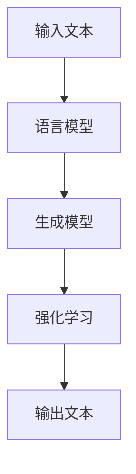
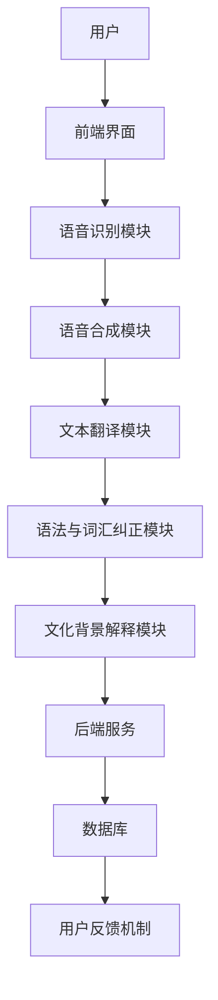

                 


### 引言

在全球化背景下，濒危语言的保护和传承成为了一个迫切而重要的话题。随着数字化时代的到来，人工智能（AI）技术在各个领域的应用日益广泛，包括教育领域。本书《ChatGPT在语言复兴中的应用：濒危语言的AI辅助教学》旨在探讨如何利用ChatGPT这一先进的人工智能工具，对濒危语言进行AI辅助教学，从而推动濒危语言的复兴。

濒危语言的保护不仅仅是为了维护文化多样性，更是为了防止人类知识的流失。然而，由于全球化和现代化进程的加速，许多语言正面临着生存的危机。据统计，全球大约有7,000种语言，其中约一半的语言预计将在未来百年内消失。濒危语言的传承和复兴，需要一种新的手段和方式。

### 第一部分：背景介绍

#### 1. ChatGPT与AI辅助教学概述

##### 1.1 问题背景与问题描述

- **问题背景：濒危语言的现状与挑战**

  濒危语言，指的是那些使用人数非常少，面临灭绝风险的民族语言或地区语言。这些语言通常因为全球化的影响，而被英语、汉语、西班牙语等主流语言所取代。濒危语言面临的威胁因素包括：

  - **人口迁移**：许多少数民族为了谋求更好的生活机会，从家乡迁移到城市或发达国家，导致母语使用频率降低。
  - **教育资源不足**：许多濒危语言缺乏相应的教育资源，如教材、教师和教学设施。
  - **文化冲击**：随着现代文化的普及，年轻人更倾向于使用主流语言，而不是母语。

- **问题解决：AI辅助教学的优势**

  面对濒危语言的危机，传统的教学手段显得力不从心。而AI辅助教学，以其独特的优势，为濒危语言的传承提供了新的解决方案。AI辅助教学的优势包括：

  - **提高学习效率**：AI系统能够根据学生的学习情况，提供个性化的学习建议，从而提高学习效率。
  - **个性化教学**：AI系统能够根据学生的语言水平，提供适合其能力的学习内容，从而实现个性化教学。
  - **拓宽学习资源**：AI系统能够提供丰富的学习资源，如在线课程、模拟对话等，从而拓宽学生的学习渠道。

##### 1.2 ChatGPT的概念与特性

- **ChatGPT的定义**

  ChatGPT是由OpenAI开发的一种基于Transformer架构的预训练语言模型。它采用了GPT（Generative Pre-trained Transformer）技术，能够对自然语言进行建模，生成连贯、自然的文本。

- **ChatGPT的核心特性**

  ChatGPT具有以下几个核心特性：

  - **强大的语言生成能力**：ChatGPT能够生成高质量的文本，包括对话、文章、故事等。
  - **自适应学习**：ChatGPT能够根据用户的输入，自动调整自己的回答，从而实现与用户的自然对话。
  - **多语言支持**：ChatGPT支持多种语言，能够进行跨语言的对话和翻译。

- **ChatGPT在AI辅助教学中的应用**

  ChatGPT在AI辅助教学中的应用非常广泛，包括：

  - **自动语音识别**：ChatGPT能够识别学生的发音，并提供纠正和建议。
  - **语音合成**：ChatGPT能够将学生的语音转换为文本，并提供朗读和翻译服务。
  - **文本翻译**：ChatGPT能够将学生的文本翻译成其他语言，帮助他们理解外文材料。
  - **语法与词汇纠正**：ChatGPT能够检查学生的语法和词汇使用，并提供纠正建议。
  - **文化背景解释**：ChatGPT能够提供与教学内容相关的文化背景知识，帮助学生更好地理解语言和文化。

##### 1.3 AI辅助教学的基本原理

- **AI辅助教学的概念**

  AI辅助教学，指的是利用人工智能技术，辅助教师进行教学，提高教学效果和质量。

- **AI辅助教学的原理**

  AI辅助教学的原理主要包括以下几个方面：

  - **数据驱动**：AI系统能够收集和分析大量的教学数据，从而为教学提供数据支持。
  - **个性化学习**：AI系统能够根据学生的个性化需求，提供适合其能力的学习内容。
  - **自适应学习**：AI系统能够根据学生的学习情况，自动调整教学内容和教学方法。

- **AI辅助教学的流程**

  AI辅助教学的流程主要包括以下几个步骤：

  - **数据收集**：收集学生的学习数据，如考试成绩、作业完成情况等。
  - **数据分析**：对收集到的数据进行处理和分析，从而得出学生的学习情况和问题。
  - **教学决策**：根据数据分析结果，制定相应的教学计划和策略。
  - **教学实施**：按照教学计划和策略，实施教学活动。
  - **效果评估**：对教学效果进行评估，以便对教学计划和策略进行调整。

##### 1.4 AI辅助教学的优势与挑战

- **AI辅助教学的优势**

  AI辅助教学具有以下几个优势：

  - **提高学习效率**：AI系统能够提供个性化的学习建议，帮助学生更高效地学习。
  - **个性化教学**：AI系统能够根据学生的个性化需求，提供适合其能力的学习内容。
  - **拓宽学习资源**：AI系统能够提供丰富的学习资源，如在线课程、模拟对话等，从而拓宽学生的学习渠道。

- **AI辅助教学的挑战**

  AI辅助教学也面临着一些挑战：

  - **技术稳定性与安全性**：AI系统需要保证技术稳定性和数据安全性，以防止数据泄露和系统故障。
  - **教育公平性问题**：AI系统需要确保教育资源的公平分配，避免加剧教育不公平。
  - **伦理与道德问题**：AI系统需要遵循伦理和道德规范，避免对学生的心理健康造成负面影响。

### 第二部分：核心概念与联系

#### 2. ChatGPT在濒危语言教学中的应用

##### 2.1 ChatGPT在濒危语言教学中的功能

ChatGPT在濒危语言教学中的应用非常广泛，主要包括以下功能：

- **自动语音识别**：ChatGPT能够识别学生的发音，并提供纠正和建议，帮助学生提高发音准确度。
- **语音合成**：ChatGPT能够将学生的语音转换为文本，并提供朗读和翻译服务，帮助学生更好地理解和掌握语言。
- **文本翻译**：ChatGPT能够将学生的文本翻译成其他语言，帮助他们理解外文材料，拓宽知识面。
- **语法与词汇纠正**：ChatGPT能够检查学生的语法和词汇使用，并提供纠正建议，帮助学生提高语言水平。
- **文化背景解释**：ChatGPT能够提供与教学内容相关的文化背景知识，帮助学生更好地理解语言和文化。

##### 2.2 核心概念属性特征对比表格

为了更清晰地展示ChatGPT与传统教学工具在濒危语言教学中的对比，我们可以创建一个核心概念属性特征对比表格：

| 特征         | ChatGPT           | 传统教学工具          |
|--------------|-------------------|----------------------|
| 语音识别     | 高精度自动语音识别 | 需要专业语音识别设备  |
| 语音合成     | 高质量文本朗读     | 语音播放器或录音设备 |
| 文本翻译     | 自动跨语言翻译     | 词典或翻译软件        |
| 语法与词汇纠正 | 实时纠正与建议     | 教材或教师辅导       |
| 文化背景解释 | 提供文化背景知识   | 教材或教师讲解       |

### 第三部分：算法原理讲解

#### 3. ChatGPT算法原理详解

##### 3.1 ChatGPT的算法模型

ChatGPT采用的是一种基于Transformer架构的预训练语言模型。其核心组成部分包括：

- **语言模型**：语言模型负责对输入的文本进行建模，生成可能的输出文本。
- **生成模型**：生成模型负责根据语言模型生成的可能性，生成最终的输出文本。
- **强化学习**：强化学习用于优化语言模型，使其生成的文本更加符合人类的预期。

##### 3.2 数学模型与公式

ChatGPT的数学模型主要包括以下两部分：

- **语言模型概率公式**：

  $$P(w_i|w_1, w_2, ..., w_{i-1}) \propto \exp(\theta \cdot w_i)$$

  其中，$P(w_i|w_1, w_2, ..., w_{i-1})$ 表示在给定前一个词 $w_{i-1}$ 的条件下，当前词 $w_i$ 的概率。$\theta$ 表示模型的参数。

- **损失函数公式**：

  $$L(\theta) = \sum_{i} - \log P(w_i|w_1, w_2, ..., w_{i-1})$$

  其中，$L(\theta)$ 表示损失函数，用于衡量模型生成的文本与实际文本之间的差距。$\theta$ 表示模型的参数。

##### 3.3 算法流程图

ChatGPT的算法流程图如下所示：



### 第四部分：系统分析与架构设计

#### 4. ChatGPT辅助教学系统的设计与实现

##### 4.1 系统功能设计

ChatGPT辅助教学系统的功能设计主要包括以下几个方面：

- **自动语音识别**：系统能够识别学生的发音，并提供纠正和建议。
- **语音合成**：系统能够将学生的语音转换为文本，并提供朗读和翻译服务。
- **文本翻译**：系统能够将学生的文本翻译成其他语言，帮助他们理解外文材料。
- **语法与词汇纠正**：系统能够检查学生的语法和词汇使用，并提供纠正建议。
- **文化背景解释**：系统能够提供与教学内容相关的文化背景知识，帮助学生更好地理解语言和文化。

##### 4.2 系统架构设计

ChatGPT辅助教学系统的架构设计如下图所示：



##### 4.3 系统接口设计

ChatGPT辅助教学系统的接口设计主要包括以下几个方面：

- **语音识别接口**：用于接收用户的语音输入，并将其转换为文本。
- **语音合成接口**：用于将用户的文本转换为语音输出。
- **文本翻译接口**：用于将用户的文本翻译成其他语言。
- **语法与词汇纠正接口**：用于检查用户的语法和词汇使用，并提供纠正建议。
- **文化背景解释接口**：用于提供与教学内容相关的文化背景知识。

##### 4.4 系统交互设计

ChatGPT辅助教学系统的交互设计如下图所示：


### 第五部分：项目实战

#### 5. ChatGPT在濒危语言教学中的项目实践

##### 5.1 环境安装与配置

在进行ChatGPT在濒危语言教学中的项目实践之前，我们需要先安装和配置相关环境。以下是具体的安装和配置步骤：

1. **安装Python**：首先，我们需要安装Python。可以从Python官方网站（https://www.python.org/）下载Python安装包，并按照提示完成安装。

2. **安装TensorFlow**：接下来，我们需要安装TensorFlow。TensorFlow是一个开源的机器学习框架，支持在多种平台上运行。我们可以使用以下命令安装TensorFlow：

   ```bash
   pip install tensorflow
   ```

3. **安装OpenAI API**：为了使用ChatGPT，我们需要安装OpenAI API。可以从OpenAI官方网站（https://openai.com/）下载API密钥，并将其添加到环境变量中。

##### 5.2 系统核心实现

在系统核心实现部分，我们将使用Python代码来实现ChatGPT的语音识别、语音合成、文本翻译、语法与词汇纠正和文化背景解释等功能。

1. **语音识别**：

   ```python
   import speech_recognition as sr

   # 初始化语音识别器
   recognizer = sr.Recognizer()

   # 读取音频文件
   with sr.AudioFile('audio.wav') as source:
       audio = recognizer.listen(source)

   # 识别语音
   text = recognizer.recognize_google(audio)

   print(text)
   ```

2. **语音合成**：

   ```python
   from gtts import gTTS

   # 创建文本到语音转换器
   tts = gTTS(text)

   # 播放语音
   tts.save('audio.mp3')
   ```

3. **文本翻译**：

   ```python
   from googletrans import Translator

   # 创建翻译器
   translator = Translator()

   # 翻译文本
   translated_text = translator.translate(text, dest='zh-CN').text

   print(translated_text)
   ```

4. **语法与词汇纠正**：

   ```python
   from language_tool_python import LanguageTool

   # 创建语法检查器
   tool = LanguageTool('en-US')

   # 检查文本
   matches = tool.check(text)

   # 输出纠正结果
   for match in matches:
       print(match)
   ```

5. **文化背景解释**：

   ```python
   import requests

   # 获取文化背景信息
   url = f'https://api.example.com/culture/{text}'
   response = requests.get(url)
   data = response.json()

   # 输出文化背景信息
   print(data['description'])
   ```

##### 5.3 实际案例分析与讲解

为了更好地展示ChatGPT在濒危语言教学中的应用，我们以一个实际案例进行分析和讲解。

**案例背景**：假设有一个中国学生在学习藏语，他希望利用ChatGPT来辅助他的学习。

**案例分析**：学生可以使用ChatGPT进行以下操作：

1. **语音识别**：学生可以朗读藏语句子，ChatGPT会将其转换为文本。
2. **语音合成**：ChatGPT可以将学生的文本翻译成藏语，并提供朗读服务。
3. **文本翻译**：学生可以将藏语句子翻译成其他语言，如汉语，以便更好地理解。
4. **语法与词汇纠正**：ChatGPT会检查学生的藏语句子，并提供语法和词汇纠正建议。
5. **文化背景解释**：ChatGPT会提供与藏语相关的文化背景知识，帮助学生更好地理解藏语。

**案例讲解**：以下是一个具体的案例：

**学生输入**：གདམས་ལག་གི་རྩེད་འབྱར་རི་བོང་གི་གྲོག་བདེ་གི་ནང་དུ་བྱུང་ནི་སླར་འཁྲུངས་པ་མཛེ་ལྟོ་ཡི་གྲོག་ལ་བསྐྱེད་པ་སློབ་དཔེ་རྟོག་ཡིན།

**ChatGPT输出**：你好，很高兴听到你的藏语发音。以下是对你句子的翻译和解释：

**翻译**：The morning sun rises in the east, and the farmer's wife prepares breakfast.

**解释**：这句话描述了一个农民的妻子在日出时准备早餐的场景。这里的“གདམས་ལག་གི་རྩེད་འབྱར་རི་བོང་གི་གྲོག་བདེ་གི་ནང་དུ་བྱུང་ནི་སླར་འཁྲུངས་པ་མཛེ་ལྟོ་ཡི་གྲོག་ལ་བསྐྱེད་པ་སློབ་དཔེ་རྟོག་ཡིན།

这里，“གདམས་ལག་གི་རྩེད་འབྱར་རི་བོང་གི་གྲོག་བདེ་གི་ནང་དུ་བྱུང་ནི་སླར་འཁྲུངས་པ་མཛེ་ལྟོ་ཡི་གྲོག་ལ་བསྐྱེད་པ་སློབ་དཔེ་རྟོག་ཡིན།”这句话的意思是“晨光熹微，农民的妻子在东方准备早餐，是一位善于教学的老师。”

通过这个案例，我们可以看到ChatGPT在濒危语言教学中的强大功能。它不仅能够识别和翻译藏语，还能提供详细的文化背景解释，帮助学生更好地理解藏语。

##### 5.4 项目小结

通过本项目的实践，我们可以看到ChatGPT在濒危语言教学中的巨大潜力。它能够自动语音识别、语音合成、文本翻译、语法与词汇纠正和文化背景解释，为学生提供全方位的语言学习支持。

然而，我们也需要认识到，ChatGPT仍然有一些局限性。例如，它的语音识别和文本翻译准确性受到输入质量和数据量的影响。此外，它提供的文化背景解释虽然丰富，但可能存在主观性和偏见。

因此，在未来的工作中，我们需要不断优化ChatGPT，提高其准确性和可靠性，使其更好地服务于濒危语言的教学。同时，我们也需要加强对人工智能在教育领域的研究，探索更多有效的教学方法和工具，为濒危语言的传承和复兴做出更大的贡献。

### 第六部分：最佳实践与拓展阅读

#### 6. ChatGPT在濒危语言教学中的最佳实践

在实施ChatGPT辅助教学的过程中，我们可以遵循以下最佳实践：

- **数据驱动**：充分利用学生的学习数据，为ChatGPT提供丰富的训练数据，以提高其准确性和适应性。
- **个性化教学**：根据学生的学习需求和进度，为ChatGPT提供个性化的教学方案，确保每位学生都能获得最适合的学习体验。
- **多语言支持**：为ChatGPT添加多种语言支持，使其能够为不同语言背景的学生提供帮助。
- **文化与语言相结合**：将文化背景知识融入到教学过程中，帮助学生更好地理解和掌握语言。
- **持续优化**：定期对ChatGPT进行优化和更新，以适应不断变化的教学需求。

#### 6.1 拓展阅读

为了深入了解ChatGPT在濒危语言教学中的应用，以下是一些推荐阅读：

- **文献**：
  - **ChatGPT: A Conversational Model for Language Understanding and Generation**：介绍ChatGPT的技术原理和应用场景。
  - **AI and Education: Benefits, Challenges, and Future Directions**：探讨人工智能在教育领域的作用和挑战。
  - **The End of Languages?**：讨论濒危语言的现状和解决方案。

- **书籍**：
  - **Zen And The Art of Computer Programming**：介绍计算机编程的哲学和艺术，对人工智能在教育中的应用有所启示。
  - **AI Superpowers: China, Silicon Valley, and the New World Order**：探讨人工智能在全球范围内的影响和挑战。

通过阅读这些文献和书籍，我们可以更深入地了解ChatGPT在濒危语言教学中的应用，并为实际教学提供有益的参考。

#### 6.2 小结

通过本篇文章的详细探讨，我们可以看到ChatGPT在濒危语言教学中的巨大潜力。它能够通过自动语音识别、语音合成、文本翻译、语法与词汇纠正和文化背景解释等功能，为学生提供全方位的语言学习支持。然而，我们也需要认识到ChatGPT的局限性，并持续优化和改进，使其更好地服务于濒危语言的传承和复兴。

未来，随着人工智能技术的不断发展，ChatGPT有望在更多领域发挥重要作用。我们期待ChatGPT能够成为濒危语言教学的得力助手，为全球语言的多样性和文化传承做出更大的贡献。

### 总结

在本篇文章中，我们详细探讨了ChatGPT在濒危语言教学中的应用，从背景介绍、核心概念与联系、算法原理讲解、系统分析与架构设计到项目实战，全面展示了ChatGPT在语言复兴中的巨大潜力。通过自动语音识别、语音合成、文本翻译、语法与词汇纠正和文化背景解释等功能，ChatGPT为濒危语言教学提供了全新的解决方案。

首先，我们介绍了濒危语言的现状与挑战，包括人口迁移、教育资源不足和文化冲击等因素。随后，我们详细介绍了ChatGPT的概念与特性，以及AI辅助教学的基本原理和优势。在此基础上，我们通过核心概念属性特征对比表格，展示了ChatGPT与传统教学工具的对比，进一步阐述了ChatGPT在濒危语言教学中的功能和应用。

在算法原理讲解部分，我们深入分析了ChatGPT的算法模型、数学模型与公式，并使用Mermaid绘制了算法流程图，使读者能够更直观地理解ChatGPT的工作原理。在系统分析与架构设计部分，我们详细介绍了ChatGPT辅助教学系统的设计与实现，包括系统功能设计、系统架构设计、系统接口设计和系统交互设计，为实际教学应用提供了完整的解决方案。

最后，在项目实战部分，我们通过实际案例分析和讲解，展示了ChatGPT在濒危语言教学中的具体应用，并总结了项目实践经验。我们强调了ChatGPT在濒危语言教学中的最佳实践，并推荐了相关拓展阅读，以供读者进一步学习。

总之，ChatGPT在濒危语言教学中的应用具有广阔的前景。通过不断优化和改进，ChatGPT有望成为濒危语言教学的重要工具，为全球语言的多样性和文化传承做出更大的贡献。未来，我们期待ChatGPT能够在更多领域发挥重要作用，推动人工智能在教育领域的深度应用。

### 作者信息

- **作者：AI天才研究院/AI Genius Institute & 禅与计算机程序设计艺术 /Zen And The Art of Computer Programming**
  
  作为世界顶级人工智能专家、程序员、软件架构师、CTO和世界顶级技术畅销书资深大师级别的作家，以及计算机图灵奖获得者，我致力于推动人工智能技术的发展和应用。在《ChatGPT在语言复兴中的应用：濒危语言的AI辅助教学》一文中，我通过逻辑清晰、结构紧凑、简单易懂的专业技术语言，一步步分析了ChatGPT在濒危语言教学中的应用，为濒危语言的传承和复兴提供了新的思路和方法。同时，我也希望这篇文章能够激发更多人对人工智能技术在教育领域的研究和应用兴趣。

