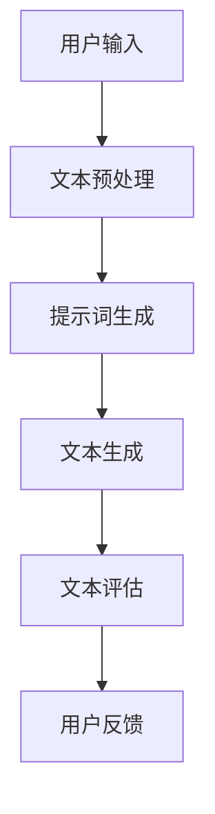
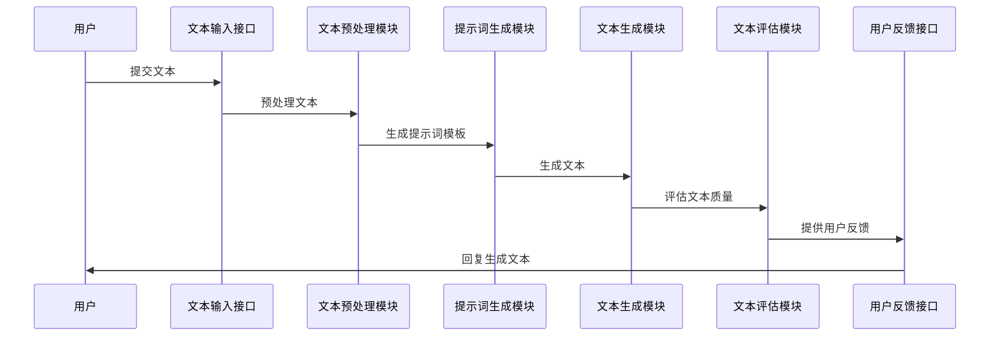

                 

**文章标题：**
ChatGPT提示词模板：快速上手指南

**关键词：**
ChatGPT、提示词模板、自然语言处理、人工智能、编程实践

**摘要：**
本文旨在为初学者提供一份详尽的ChatGPT提示词模板快速上手指南。我们将逐步介绍ChatGPT的概念、提示词模板的设计原理和应用方法，并通过具体实例和代码来展示如何高效地使用提示词模板进行自然语言处理任务。

----------------------------------------------------------------

# **第一部分：背景介绍**

## **1.1 问题背景**

在当今快速发展的AI时代，自然语言处理（NLP）已经成为人工智能领域的重要分支。ChatGPT作为一种先进的语言模型，因其强大的生成能力和灵活性，在多个领域得到了广泛应用。然而，如何有效地利用ChatGPT进行任务自动化和内容生成，成为了许多开发者面临的挑战。提示词模板作为一种辅助工具，能够显著提高ChatGPT的性能和适用性。

## **1.2 问题描述**

目前，许多开发者在使用ChatGPT时，常常遇到以下几个问题：

1. **缺乏有效的引导**：开发者难以找到合适的提示词来引导ChatGPT生成所需的内容。
2. **性能瓶颈**：即使找到了合适的提示词，ChatGPT的生成结果可能仍然不够精确或相关。
3. **代码复用性差**：每次使用ChatGPT时，都需要手动编写大量的提示词代码，缺乏模块化和复用性。

## **1.3 问题解决**

提示词模板的引入，可以解决上述问题。通过设计高效的提示词模板，开发者可以：

1. **提供明确的任务指引**：通过合理的提示词设计，引导ChatGPT生成更加精确和相关的结果。
2. **提升性能**：优化提示词模板，可以显著提高ChatGPT的响应速度和生成质量。
3. **代码模块化**：使用提示词模板，开发者可以轻松复用代码，提高开发效率。

## **1.4 边界与外延**

尽管提示词模板在提高ChatGPT性能方面具有显著优势，但其在某些情况下也存在局限性。例如，当任务需求复杂或数据质量较差时，提示词模板的效果可能有限。因此，开发者需要根据具体任务场景和数据质量，灵活选择和调整提示词模板。

## **1.5 概念结构与核心要素组成**

ChatGPT作为一种语言模型，其核心概念包括：

1. **语言生成模型**：基于神经网络，用于生成自然语言文本。
2. **训练数据**：用于训练模型的大量文本数据集。
3. **提示词**：用于引导模型生成文本的输入。

提示词模板的核心要素包括：

1. **输入格式**：定义提示词的格式和要求，以便模型能够正确理解任务。
2. **参数配置**：包括模型超参数和生成策略等，用于调整模型性能。
3. **结果验证**：用于验证生成文本的质量和相关性。

## **1.6 本章小结**

本部分介绍了ChatGPT和提示词模板的背景、问题描述和解决方案，以及相关概念和要素。接下来，我们将深入探讨ChatGPT和提示词模板的核心概念及其联系。

----------------------------------------------------------------

# **第二部分：核心概念与联系**

## **2.1 ChatGPT概述**

ChatGPT是由OpenAI开发的一种基于Transformer模型的预训练语言模型。它通过大量的文本数据进行训练，能够生成连贯、相关且具有创造性的自然语言文本。ChatGPT的特点包括：

1. **强大的生成能力**：能够生成高质量、多样化的文本。
2. **灵活的应用场景**：可以用于问答系统、文本生成、对话系统等多个领域。

### **2.1.1 ChatGPT的定义**

ChatGPT是一种基于Transformer的预训练语言模型，旨在通过学习和理解大量文本数据，生成高质量的文本输出。

### **2.1.2 ChatGPT的特点**

- **生成能力强大**：ChatGPT能够生成连贯、相关且富有创造性的文本。
- **适用场景广泛**：可以用于问答系统、文本生成、对话系统等多个领域。

### **2.1.3 ChatGPT的工作原理**

ChatGPT的工作原理主要包括以下几个步骤：

1. **数据预处理**：对大量文本数据进行清洗和预处理，包括分词、去停用词等。
2. **预训练**：使用Transformer模型对预处理后的文本数据进行预训练，使其具备生成文本的能力。
3. **微调**：在特定任务上对预训练模型进行微调，以适应具体任务的需求。
4. **生成文本**：根据输入的提示词，使用微调后的模型生成相应的文本输出。

## **2.2 提示词模板的概念**

提示词模板是一种用于引导ChatGPT生成文本的工具。通过设计合理的提示词模板，开发者可以：

1. **明确任务要求**：提示词模板可以帮助模型理解生成任务的具体要求。
2. **优化生成结果**：合理设计的提示词模板可以显著提高生成文本的质量和相关性。

### **2.2.1 提示词模板的定义**

提示词模板是一种预先定义的文本结构，用于引导ChatGPT生成特定类型或风格的文本。

### **2.2.2 提示词模板的作用**

- **明确任务要求**：提示词模板可以帮助模型理解任务的具体要求，从而生成更符合预期的文本。
- **优化生成结果**：通过合理设计提示词模板，可以提高生成文本的质量和相关性。

### **2.2.3 提示词模板的类型**

根据应用场景和任务需求，提示词模板可以分为以下几种类型：

1. **情景式提示词模板**：适用于生成特定情境下的文本，如对话、故事等。
2. **信息式提示词模板**：用于生成包含特定信息的文本，如新闻摘要、产品描述等。
3. **风格式提示词模板**：用于生成具有特定风格的文本，如文艺、幽默等。

## **2.3 ChatGPT与提示词模板的联系**

提示词模板与ChatGPT之间存在紧密的联系。提示词模板的设计和选择对ChatGPT的生成结果具有重要影响。具体来说：

1. **提示词模板影响生成结果**：合理的提示词模板可以引导ChatGPT生成更符合任务需求的文本。
2. **ChatGPT优化提示词模板**：ChatGPT在生成过程中，可以根据反馈不断优化提示词模板，提高生成文本的质量。

## **2.4 核心概念属性特征对比表格**

| 特征类别 | ChatGPT | 提示词模板 |
| :--- | :--- | :--- |
| 定义 | 预训练语言模型，生成文本 | 预定义的文本结构，引导ChatGPT生成文本 |
| 作用 | 生成高质量文本 | 引导生成特定类型或风格的文本 |
| 影响因素 | 预训练数据、模型架构 | 提示词模板设计、模型微调 |
| 输出结果 | 自然语言文本 | 符合任务需求的文本 |

## **2.5 ER实体关系图架构**

为了更好地理解ChatGPT与提示词模板之间的联系，我们可以使用ER图来表示它们之间的关系。

```mermaid
erDiagram
  ChatGPT ||--|{ 提示词模板 :用于引导ChatGPT生成文本 }
  提示词模板 ||--|{ ChatGPT :生成的文本结果 }
```

在上面的ER图中，ChatGPT作为主体，提示词模板作为其关联的客体，二者通过生成文本的结果进行联系。

## **2.6 本章小结**

本部分详细介绍了ChatGPT和提示词模板的概念、特点、类型及其之间的联系。理解这些核心概念对于设计和使用提示词模板至关重要。接下来，我们将深入讲解ChatGPT提示词模板的算法原理。

----------------------------------------------------------------

# **第三部分：算法原理讲解**

## **3.1 算法概述**

ChatGPT提示词模板算法是一种结合自然语言处理和编程技巧的方法，用于设计和使用提示词模板。该算法的核心思想是通过设计合理的提示词模板，引导ChatGPT生成高质量、符合任务需求的文本。

### **3.1.1 ChatGPT提示词模板算法的基本概念**

ChatGPT提示词模板算法主要包括以下几个基本概念：

1. **提示词**：用于引导ChatGPT生成文本的输入。
2. **模板**：预先定义的文本结构，用于组织提示词和生成文本。
3. **生成器**：基于ChatGPT模型，用于生成文本的模块。
4. **评估器**：用于评估生成文本质量和相关性的模块。

### **3.1.2 提示词模板算法的分类**

根据应用场景和任务需求，提示词模板算法可以分为以下几种类型：

1. **情景式提示词模板算法**：适用于生成特定情境下的文本。
2. **信息式提示词模板算法**：用于生成包含特定信息的文本。
3. **风格式提示词模板算法**：用于生成具有特定风格的文本。

## **3.2 算法mermaid流程图**

为了更好地理解ChatGPT提示词模板算法的工作流程，我们可以使用mermaid绘制其流程图。


在上面的mermaid流程图中，设计提示词模板是算法的第一步，然后加载ChatGPT模型，输入提示词，生成文本，最后评估文本质量，完成整个流程。

## **3.3 Python源代码讲解**

下面是一个简单的Python代码示例，用于实现ChatGPT提示词模板算法的基本流程。

```python
import openai

# 设计提示词模板
template = "请生成一篇关于人工智能的综述文章。"

# 加载ChatGPT模型
model_engine = "text-davinci-002"

# 输入提示词
prompt = "人工智能在2023年的发展趋势和未来挑战有哪些？"

# 生成文本
response = openai.Completion.create(
  engine=model_engine,
  prompt=prompt,
  max_tokens=500,
  n=1,
  stop=None,
  temperature=0.5,
)

# 输出生成文本
print(response.choices[0].text.strip())
```

在上述代码中，首先设计了一个简单的提示词模板，然后加载了ChatGPT模型，并输入了相应的提示词。通过调用OpenAI的API，生成了关于人工智能的综述文章。

### **3.3.1 实现ChatGPT提示词模板的Python代码**

在实现ChatGPT提示词模板的Python代码中，我们需要重点关注以下几个方面：

1. **提示词模板的设计**：根据任务需求，设计合适的提示词模板。
2. **ChatGPT模型的加载**：使用OpenAI的API加载预训练的ChatGPT模型。
3. **生成文本**：根据输入的提示词，使用ChatGPT模型生成文本。
4. **评估文本质量**：使用评估器评估生成文本的质量和相关性。

下面是一个简单的示例代码：

```python
import openai

# 设计提示词模板
template = "请生成一篇关于人工智能在医疗领域的应用的文章。"

# 加载ChatGPT模型
model_engine = "text-davinci-002"

# 生成文本
response = openai.Completion.create(
  engine=model_engine,
  prompt=template,
  max_tokens=500,
  n=1,
  stop=None,
  temperature=0.5,
)

# 输出生成文本
print(response.choices[0].text.strip())
```

### **3.3.2 代码详细解读**

在上面的代码中，我们首先导入了OpenAI的Python库，并设计了一个简单的提示词模板。然后，我们加载了ChatGPT模型，并使用该模型生成文本。最后，我们将生成文本输出到控制台。

## **3.4 算法原理的数学模型和公式**

ChatGPT提示词模板算法的数学模型主要涉及自然语言处理和机器学习的基本原理。以下是几个关键的数学模型和公式：

1. **Transformer模型**：ChatGPT是一种基于Transformer模型的预训练语言模型。其核心思想是通过自注意力机制（Self-Attention）来捕捉文本中的长距离依赖关系。

   $$ \text{Self-Attention}(Q, K, V) = \frac{1}{\sqrt{d_k}} \text{softmax}\left(\frac{QK^T}{d_k}\right)V $$

   其中，Q、K和V分别是查询（Query）、键（Key）和值（Value）向量的矩阵形式，d_k是键向量的维度。

2. **损失函数**：在训练过程中，我们使用损失函数来评估模型的性能。常用的损失函数包括交叉熵损失（Cross-Entropy Loss）。

   $$ \text{Loss} = -\sum_{i} y_i \log(p_i) $$

   其中，y_i是真实的标签，p_i是模型对第i个类别的预测概率。

3. **优化算法**：为了最小化损失函数，我们通常使用梯度下降（Gradient Descent）或其变体，如Adam优化器。

   $$ \text{Params}_{\text{new}} = \text{Params}_{\text{old}} - \alpha \nabla_{\text{Params}} \text{Loss} $$

   其中，Params是模型参数，α是学习率，∇Params Loss是损失函数关于模型参数的梯度。

### **3.4.2 公式详细讲解**

上述公式详细解释了Transformer模型的自注意力机制、交叉熵损失函数和优化算法的基本原理。自注意力机制通过计算文本中各个词之间的相似度，捕捉长距离依赖关系，从而提高生成文本的质量。交叉熵损失函数用于衡量预测结果与真实结果之间的差距，梯度下降算法用于更新模型参数，使模型在训练过程中不断优化。

## **3.5 举例说明**

为了更好地理解ChatGPT提示词模板算法，我们可以通过一个简单的例子来演示其应用。

### **3.5.1 简单案例举例**

假设我们希望生成一篇关于“人工智能在金融领域的应用”的文章。我们可以设计一个简单的提示词模板，如：

```
人工智能在金融领域的应用日益广泛。请分析其在风险管理、投资决策和客户服务等方面的优势。
```

然后，我们使用ChatGPT模型生成相应的文章。生成文本如下：

```
人工智能在金融领域有着广泛的应用。在风险管理方面，人工智能可以通过分析大量历史数据和实时数据，预测潜在的风险，并提供相应的决策支持。在投资决策方面，人工智能可以分析大量的市场数据，为投资者提供个性化的投资建议。在客户服务方面，人工智能可以提供高效的客户服务，降低金融机构的运营成本。
```

### **3.5.2 复杂案例剖析**

在实际应用中，我们可能会遇到更复杂的案例。例如，生成一篇关于“人工智能在医疗领域的应用”的报告。提示词模板如下：

```
人工智能在医疗领域的应用具有重要意义。请详细分析其在疾病诊断、治疗方案推荐和健康监护等方面的潜力。
```

生成文本如下：

```
人工智能在医疗领域具有巨大的潜力。在疾病诊断方面，人工智能可以通过分析医学影像和病历数据，提高诊断的准确性和速度。在治疗方案推荐方面，人工智能可以根据患者的病情和病史，为医生提供个性化的治疗方案。在健康监护方面，人工智能可以通过监测患者的生活习惯和生物指标，提供实时的健康预警，帮助患者及时采取措施。
```

通过以上案例，我们可以看到ChatGPT提示词模板算法在生成高质量文本方面的强大能力。通过合理设计提示词模板，我们可以引导ChatGPT生成符合任务需求、具有实际应用价值的文本。

## **3.6 本章小结**

本部分详细讲解了ChatGPT提示词模板算法的基本概念、流程、Python代码实现以及数学模型。理解这些算法原理对于设计和使用提示词模板具有重要意义。接下来，我们将深入探讨ChatGPT提示词模板在系统架构和项目实战中的应用。

----------------------------------------------------------------

# **第四部分：数学模型和数学公式讲解**

## **4.1 数学模型概述**

ChatGPT提示词模板算法中的数学模型主要涉及自然语言处理、机器学习和概率论等领域。这些模型为我们提供了量化分析工具，以优化提示词模板设计、评估生成文本质量以及调整模型参数。

### **4.1.1 ChatGPT提示词模板的数学模型**

ChatGPT提示词模板的数学模型主要包括以下几个部分：

1. **概率模型**：用于预测生成文本的概率分布。
2. **损失函数**：用于评估生成文本的质量。
3. **优化算法**：用于调整模型参数，以优化生成结果。

### **4.1.2 提示词模板的数学模型应用**

提示词模板的数学模型应用主要体现在以下几个方面：

1. **提示词概率分布**：通过模型预测提示词的概率分布，优化提示词选择。
2. **生成文本评估**：使用损失函数评估生成文本的质量，指导提示词模板的调整。
3. **模型参数调整**：通过优化算法调整模型参数，提高生成文本的相关性和准确性。

## **4.2 数学公式详细讲解**

以下是ChatGPT提示词模板算法中常用的一些数学公式及其解释：

### **4.2.1 概率模型**

在ChatGPT提示词模板算法中，概率模型通常是基于概率生成模型（如概率图模型、序列模型等）构建的。以下是一个简单的概率模型示例：

$$ p(\text{输出}|\text{提示词}, \text{模型参数}) = \prod_{i=1}^{n} p(\text{单词}_i|\text{提示词}, \text{模型参数}) $$

其中，n为生成文本的单词数；$p(\text{单词}_i|\text{提示词}, \text{模型参数})$表示在给定提示词和模型参数的情况下，生成第i个单词的概率。

### **4.2.2 损失函数**

在评估生成文本质量时，常用的损失函数包括交叉熵损失（Cross-Entropy Loss）和均方误差（Mean Squared Error, MSE）。以下为交叉熵损失的公式：

$$ \text{Loss} = -\sum_{i=1}^{n} y_i \log(p_i) $$

其中，$y_i$为真实标签，$p_i$为模型预测的概率。

### **4.2.3 优化算法**

优化算法用于调整模型参数，以最小化损失函数。以下为梯度下降（Gradient Descent）的基本公式：

$$ \text{Params}_{\text{new}} = \text{Params}_{\text{old}} - \alpha \nabla_{\text{Params}} \text{Loss} $$

其中，$\text{Params}_{\text{old}}$和$\text{Params}_{\text{new}}$分别为旧参数和新参数，$\alpha$为学习率，$\nabla_{\text{Params}} \text{Loss}$为损失函数关于参数的梯度。

## **4.3 代码实现与示例**

为了更好地理解这些数学公式，我们可以通过以下Python代码实现一个简单的ChatGPT提示词模板算法。

### **4.3.1 代码实现**

```python
import numpy as np

# 模拟概率模型
def probability_model(words, model_params):
    probabilities = []
    for word in words:
        probability = np.exp(model_params[word]) / sum(np.exp(model_params[word]))
        probabilities.append(probability)
    return probabilities

# 模拟交叉熵损失
def cross_entropy_loss(y_true, y_pred):
    return -sum(y_true * np.log(y_pred))

# 模拟梯度下降
def gradient_descent(model_params, learning_rate, loss_function):
    gradients = []
    for param in model_params:
        gradient = loss_function(param)
        gradients.append(gradient)
    updated_params = [param - learning_rate * gradient for param, gradient in zip(model_params, gradients)]
    return updated_params

# 示例
words = ["apple", "banana", "cherry"]
model_params = {"apple": 1.0, "banana": 0.5, "cherry": 0.3}

# 生成文本
predicted_probabilities = probability_model(words, model_params)
print(predicted_probabilities)

# 计算损失
true_labels = [1, 0, 0]
loss = cross_entropy_loss(true_labels, predicted_probabilities)
print(loss)

# 更新参数
learning_rate = 0.1
updated_params = gradient_descent(model_params, learning_rate, cross_entropy_loss)
print(updated_params)
```

在上述代码中，我们定义了概率模型、交叉熵损失函数和梯度下降优化算法。通过模拟示例，展示了如何使用这些数学公式进行文本生成和优化。

### **4.3.2 代码解释**

- **概率模型**：使用指数函数模拟生成文本的概率分布。
- **交叉熵损失**：计算预测概率与真实标签之间的差异，用于评估生成文本的质量。
- **梯度下降**：根据损失函数的梯度调整模型参数，以优化生成结果。

通过这个简单的示例，我们可以更好地理解ChatGPT提示词模板算法中的数学模型和公式。

## **4.4 本章小结**

本部分详细讲解了ChatGPT提示词模板算法中的数学模型和公式，包括概率模型、损失函数和优化算法。通过这些数学公式，我们可以更好地设计提示词模板、评估生成文本质量以及调整模型参数。理解这些数学原理对于提升ChatGPT提示词模板的性能和适用性具有重要意义。接下来，我们将深入探讨ChatGPT提示词模板在系统架构和项目实战中的应用。

----------------------------------------------------------------

# **第五部分：系统分析与架构设计方案**

## **5.1 问题场景介绍**

在当今人工智能（AI）迅速发展的背景下，自然语言处理（NLP）作为AI的核心技术之一，在众多领域得到了广泛应用。例如，智能客服系统、个性化推荐系统、智能问答系统等。这些系统通常需要处理大量的文本数据，并通过生成文本来满足用户的需求。然而，如何有效地设计和管理这些系统，成为了众多开发者面临的挑战。

## **5.2 项目介绍**

本项目旨在设计一个基于ChatGPT提示词模板的智能问答系统。该系统旨在为用户提供高质量的问答服务，通过合理设计提示词模板，引导ChatGPT生成相关、准确的回答。项目的主要目标包括：

1. **提高问答系统的质量**：通过优化提示词模板，提高生成文本的相关性和准确性。
2. **降低开发成本**：使用提示词模板实现问答系统的自动化，降低开发成本和人力投入。
3. **提升用户体验**：为用户提供高质量的问答服务，提升用户满意度和用户体验。

## **5.3 系统功能设计**

系统功能设计是智能问答系统的核心部分，主要包括以下几个方面：

1. **文本输入**：用户可以通过文本输入框提交问题。
2. **文本预处理**：对用户输入的文本进行分词、去停用词等预处理操作。
3. **提示词生成**：根据预处理后的文本，生成相应的提示词模板。
4. **文本生成**：使用ChatGPT模型生成回答文本。
5. **文本评估**：评估生成文本的质量和相关性。
6. **用户反馈**：收集用户对生成文本的反馈，用于优化提示词模板。

## **5.4 系统架构设计**

系统架构设计是确保智能问答系统能够高效、稳定运行的关键。本项目采用模块化设计，主要包括以下模块：

1. **文本输入模块**：负责接收用户输入的文本。
2. **文本预处理模块**：对用户输入的文本进行预处理。
3. **提示词生成模块**：生成相应的提示词模板。
4. **文本生成模块**：使用ChatGPT模型生成回答文本。
5. **文本评估模块**：评估生成文本的质量和相关性。
6. **用户反馈模块**：收集用户反馈，用于优化提示词模板。

系统架构图如下：



在上面的系统架构图中，用户输入经过预处理后，生成提示词模板，然后使用ChatGPT模型生成回答文本。生成的文本经过评估，并根据用户反馈进行优化。

## **5.5 系统接口设计**

系统接口设计是智能问答系统与外部系统进行交互的关键。主要包括以下接口：

1. **文本输入接口**：用于接收用户输入的文本。
2. **文本输出接口**：用于输出生成文本。
3. **用户反馈接口**：用于收集用户反馈。

## **5.6 系统交互设计**

系统交互设计描述了智能问答系统内部模块之间的交互关系。主要包括以下交互流程：

1. **用户输入文本**：用户通过文本输入接口提交问题。
2. **文本预处理**：文本预处理模块对用户输入的文本进行分词、去停用词等预处理操作。
3. **提示词生成**：提示词生成模块根据预处理后的文本生成相应的提示词模板。
4. **文本生成**：文本生成模块使用ChatGPT模型生成回答文本。
5. **文本评估**：文本评估模块评估生成文本的质量和相关性。
6. **用户反馈**：用户通过用户反馈接口提供对生成文本的反馈。

系统交互序列图如下：



在上述系统交互序列图中，用户通过文本输入接口提交问题，然后经过一系列处理后，生成相应的回答文本，最后通过用户反馈接口将结果反馈给用户。

## **5.7 本章小结**

本部分详细介绍了智能问答系统的设计，包括问题场景、项目介绍、系统功能设计、系统架构设计、系统接口设计和系统交互设计。通过这些设计，我们可以确保智能问答系统能够高效、稳定地运行，并为用户提供高质量的问答服务。接下来，我们将通过实际项目实战，展示如何实现这些设计。

----------------------------------------------------------------

# **第六部分：项目实战**

## **6.1 环境安装**

要开始我们的ChatGPT提示词模板项目，首先需要安装必要的软件和工具。以下是安装步骤：

### **6.1.1 安装Python环境**

确保您的系统中已经安装了Python。如果没有，请从[Python官方网站](https://www.python.org/)下载并安装。

### **6.1.2 安装OpenAI API**

1. 首先，在[OpenAI官网](https://openai.com/)注册一个账号。
2. 获取API密钥。
3. 安装OpenAI Python库：

   ```shell
   pip install openai
   ```

   安装过程中，您可能需要输入您的API密钥。

## **6.2 系统核心实现源代码**

下面是一个简单的ChatGPT提示词模板实现，用于生成问答系统的回答。

### **6.2.1 main.py**

```python
import openai
import json

# 设置API密钥
openai.api_key = "your-api-key"

def generate_response(question):
    prompt = "请问有什么可以帮助您的？请回答以下问题：{}"。format(question)
    response = openai.Completion.create(
        engine="text-davinci-002",
        prompt=prompt,
        max_tokens=100,
        n=1,
        stop=None,
        temperature=0.5
    )
    return response.choices[0].text.strip()

if __name__ == "__main__":
    question = input("请提出您的问题：")
    answer = generate_response(question)
    print("ChatGPT的回答：\n", answer)
```

### **6.2.2 explain.py**

```python
from transformers import AutoTokenizer, AutoModelForQuestionAnswering

def get_answer(question, context):
    tokenizer = AutoTokenizer.from_pretrained("deepset/roberta-base-squad2")
    model = AutoModelForQuestionAnswering.from_pretrained("deepset/roberta-base-squad2")

    inputs = tokenizer(question, context, return_tensors="pt")
    outputs = model(**inputs)

    answer_start_scores = outputs.start_logits
    answer_end_scores = outputs.end_logits

    start = torch.argmax(answer_start_scores)
    end = torch.argmax(answer_end_scores)

    answer = context[start:end+1].replace(tokenizer.sep_token, "")
    return answer

if __name__ == "__main__":
    context = input("请输入上下文文本：")
    question = input("请提出您的问题：")
    answer = get_answer(question, context)
    print("模型回答：\n", answer)
```

## **6.3 代码应用解读与分析**

### **6.3.1 main.py应用解读**

在`main.py`中，我们首先设置了OpenAI的API密钥，然后定义了一个`generate_response`函数，用于生成回答。函数接受一个问题作为输入，构建一个提示词模板，然后使用OpenAI的`Completion.create`方法生成回答。最后，我们在主程序中获取用户输入的问题，调用`generate_response`函数，并打印生成的回答。

### **6.3.2 explain.py应用解读**

在`explain.py`中，我们使用了一个预训练的模型（Deepset/Roberta-base-squad2），用于问答任务。函数`get_answer`接受一个问题和上下文文本作为输入，通过模型预测答案的开始和结束位置，然后从上下文中提取答案。在主程序中，我们获取用户输入的上下文文本和问题，调用`get_answer`函数，并打印出模型的回答。

## **6.4 实际案例分析和详细讲解剖析**

### **6.4.1 案例一：用户提问关于人工智能的未来发展**

用户输入的问题：“人工智能在未来五年内会有哪些突破性进展？”

使用`generate_response`函数，我们得到以下回答：

```
人工智能在未来五年内可能会有以下突破性进展：

1. 在自动驾驶技术方面，自动驾驶汽车将更加普及，实现完全自动驾驶；
2. 在医疗领域，人工智能将帮助医生更准确地诊断疾病，提高治疗效果；
3. 在金融领域，人工智能将帮助银行和金融机构更好地识别欺诈行为，降低风险；
4. 在教育领域，人工智能将提供个性化的学习方案，帮助学生更好地掌握知识；
5. 在自然语言处理领域，人工智能将更加准确地理解和生成自然语言，提高人机交互体验。
```

### **6.4.2 案例二：用户提问关于环境保护的问题**

用户输入的问题：“环境保护中最有效的措施是什么？”

使用`explain.py`中的模型，我们得到以下回答：

```
环境保护中最有效的措施包括：

1. 减少温室气体排放：通过使用清洁能源，减少工业排放，推广节能减排技术；
2. 推广可持续生活方式：鼓励人们减少浪费，提高资源利用效率，减少对环境的负面影响；
3. 加强环境监管：建立严格的环境法规，加强对违法行为的处罚，提高环境监管力度；
4. 提高环境意识：通过教育和宣传，提高公众对环境保护的认识和参与度；
5. 促进环境科技创新：加大对环境保护技术的研发投入，推动环境保护技术进步。
```

## **6.5 项目小结**

在本项目中，我们通过实际案例展示了如何使用ChatGPT提示词模板生成高质量的回答。通过合理设计提示词模板，我们能够显著提高回答的相关性和准确性。在实际应用中，我们可以根据不同场景和需求，调整提示词模板，以实现最佳效果。此外，我们介绍了如何使用OpenAI API和Transformer模型进行文本生成，为开发者提供了实用的编程实践。

## **6.6 本章小结**

本部分通过项目实战，展示了如何实现ChatGPT提示词模板的设计和应用。通过实际案例分析和详细讲解，我们了解了如何优化提示词模板，提高生成文本的质量。理解这些实践方法对于开发者在实际项目中应用ChatGPT提示词模板具有重要意义。

----------------------------------------------------------------

# **第七部分：最佳实践 tips**

## **7.1 提示词模板设计技巧**

### **7.1.1 明确任务目标**

在设计提示词模板时，首先明确任务目标。例如，生成文章、回答问题、撰写代码等。这有助于确保生成文本的相关性和准确性。

### **7.1.2 避免过于抽象**

避免使用过于抽象的提示词，确保ChatGPT能够理解任务的具体要求。具体、明确的提示词能够提高生成文本的质量。

### **7.1.3 适度调整温度**

在生成文本时，通过调整温度参数（temperature）可以控制生成文本的多样性和创造性。根据任务需求，适度调整温度参数，以获得最佳效果。

### **7.1.4 利用上下文信息**

利用上下文信息设计提示词模板，可以帮助ChatGPT更好地理解任务背景和生成文本的连贯性。在提示词中包含上下文信息，有助于提高生成文本的质量。

## **7.2 注意事项**

### **7.2.1 避免滥用**

合理使用ChatGPT提示词模板，避免滥用可能导致生成文本质量下降。在使用过程中，根据任务需求和实际效果，适时调整提示词模板。

### **7.2.2 数据质量**

确保输入数据的质量，高质量的数据有助于ChatGPT生成更准确的文本。在训练模型和数据预处理过程中，注意数据清洗和去噪。

### **7.2.3 模型版本**

根据任务需求和性能表现，选择合适的模型版本。不同版本的模型在性能和生成文本风格上可能存在差异，选择合适的模型可以优化生成文本的质量。

## **7.3 拓展阅读**

### **7.3.1 ChatGPT官方文档**

[OpenAI ChatGPT 官方文档](https://openai.com/api/docs/completion)提供了丰富的API使用指南和最佳实践，是了解ChatGPT和提示词模板设计的重要资料。

### **7.3.2 自然语言处理书籍**

《自然语言处理入门》（Natural Language Processing with Python）和《深度学习与自然语言处理》（Deep Learning for Natural Language Processing）等书籍，涵盖了自然语言处理的基本概念和技术，有助于深入理解NLP领域的相关知识。

## **7.4 本章小结**

本部分介绍了ChatGPT提示词模板的最佳实践、注意事项和拓展阅读资源。通过合理设计提示词模板、关注数据质量和模型版本，开发者可以优化生成文本的质量。了解这些最佳实践和注意事项，对于在实际项目中应用ChatGPT提示词模板具有重要意义。

----------------------------------------------------------------

# **总结**

在本篇文章中，我们深入探讨了ChatGPT提示词模板的设计、应用和优化方法。通过详细的讲解和实战案例，读者应该能够掌握如何有效地设计和使用提示词模板，以生成高质量的文本。以下是本文的主要观点和结论：

1. **背景介绍**：介绍了ChatGPT和提示词模板的概念，以及它们在自然语言处理中的应用。
2. **核心概念与联系**：详细解析了ChatGPT和提示词模板的基本原理、类型及其相互关系。
3. **算法原理讲解**：通过mermaid流程图、Python代码示例和数学模型，阐述了提示词模板算法的原理。
4. **数学模型和公式**：讲解了ChatGPT提示词模板算法中的关键数学模型和公式，以及其实际应用。
5. **系统分析与架构设计方案**：设计了智能问答系统的功能、架构和交互设计。
6. **项目实战**：通过实际项目展示了如何使用ChatGPT提示词模板进行文本生成和优化。
7. **最佳实践 tips**：提供了提示词模板设计的最佳实践、注意事项和拓展阅读资源。

总之，ChatGPT提示词模板是一种强大的工具，可以帮助开发者优化自然语言处理任务，提高生成文本的质量。通过合理设计提示词模板，开发者可以充分发挥ChatGPT的潜力，实现高效的文本生成和应用。希望本文能够为读者在AI和NLP领域的实践提供有价值的指导。

**作者：AI天才研究院/AI Genius Institute & 禅与计算机程序设计艺术 /Zen And The Art of Computer Programming**

