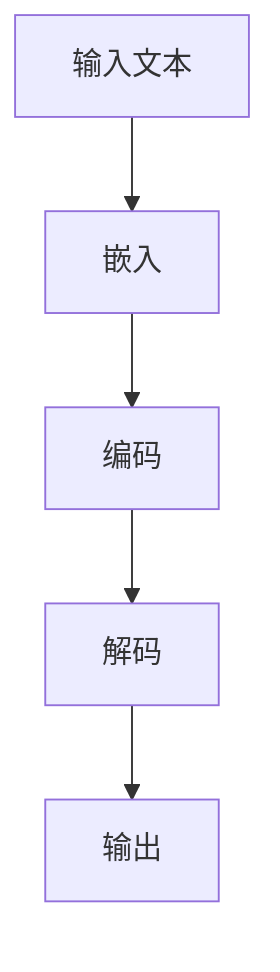
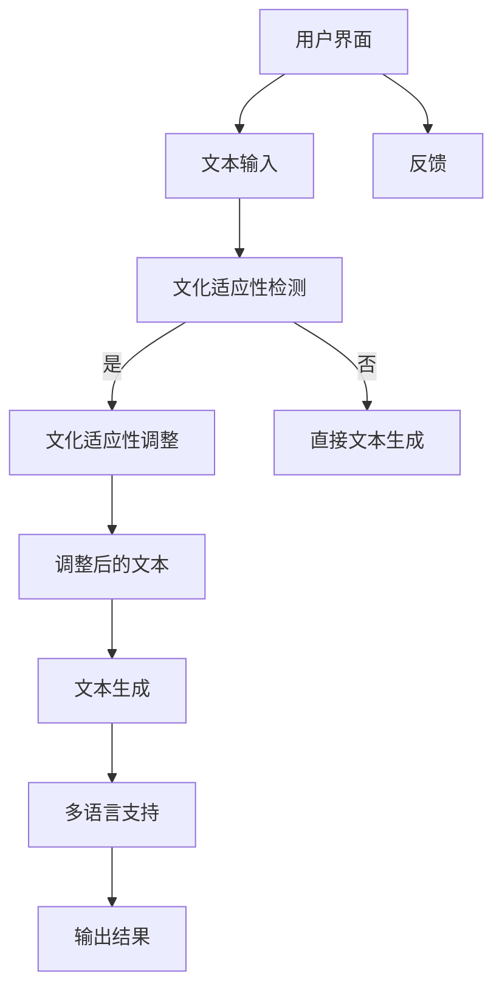
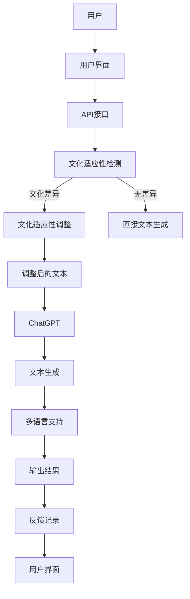

                 


### 文章标题

《ChatGPT提示词的文化适应性：跨国企业的AI策略》

### 关键词

- ChatGPT
- 文化适应性
- 跨国企业
- AI策略

### 摘要

本文旨在探讨ChatGPT提示词在跨国企业中的文化适应性问题，分析文化差异性对AI策略的影响，并提供一系列解决方案。文章结构分为七个部分：引言、ChatGPT及其工作原理、文化适应性理论、跨国企业的AI策略、实例研究、案例分析以及结论与建议。

## 引言

在全球化背景下，跨国企业越来越依赖于人工智能（AI）技术来提升其竞争力。ChatGPT作为一种先进的人工智能模型，在文本生成、对话系统、自然语言处理等领域表现出色。然而，ChatGPT在处理跨文化对话时，可能会面临文化适应性问题，导致交流效果不佳。本文将深入探讨这一现象，分析文化适应性对ChatGPT提示词的影响，并为企业提供可行的解决方案。

## ChatGPT及其工作原理

### 1.1 ChatGPT概述

ChatGPT是由OpenAI开发的一种基于变换器（Transformer）模型的预训练语言模型。它通过大量的文本数据进行训练，可以生成流畅、连贯的文本。ChatGPT具有以下几个特点：

- **强大的语言理解能力**：ChatGPT能够理解并生成多种语言的文本，包括英语、中文、法语等。
- **丰富的知识背景**：ChatGPT通过对互联网上的大量文本进行学习，掌握了丰富的知识。
- **高度的可定制性**：通过调整提示词和训练数据，可以实现对ChatGPT的精细控制。

### 1.2 ChatGPT的工作原理

ChatGPT的工作原理可以分为三个阶段：

- **预训练**：在预训练阶段，ChatGPT通过大量的文本数据进行训练，学习语言的统计规律和语义关系。
- **微调**：在微调阶段，ChatGPT利用特定领域的文本数据进行微调，以适应特定的任务和应用场景。
- **生成**：在生成阶段，ChatGPT根据输入的提示词生成相应的文本。

## 文化适应性理论

### 2.1 文化适应性概念

文化适应性是指个体或组织在新的文化环境中调整自己的行为和思维方式，以适应新的文化环境。文化适应性包括以下几个方面：

- **文化认知**：个体或组织对新的文化环境进行了解和分析，以理解其价值观、信仰、习俗等。
- **行为调整**：个体或组织根据新的文化环境调整自己的行为，以减少文化冲突。
- **情感适应**：个体或组织在情感上接受和适应新的文化环境，减少文化冲击。

### 2.2 文化适应性理论

文化适应性理论主要包括以下几个方面的内容：

- **文化迁移理论**：个体或组织通过学习新的文化规则和习俗，将文化元素转移到新的文化环境中。
- **文化融入理论**：个体或组织与新的文化环境中的成员进行互动，逐渐融入新的文化环境中。
- **文化认同理论**：个体或组织在新的文化环境中，通过认同新的文化价值观和信仰，实现文化适应。

## 跨国企业的AI策略

### 3.1 跨国企业的AI战略

跨国企业的AI战略主要包括以下几个方面：

- **AI技术研发**：跨国企业通过投资研发，提升自身的AI技术水平。
- **AI技术应用**：跨国企业将AI技术应用于其业务流程中，以提高效率和降低成本。
- **AI人才培养**：跨国企业通过招聘和培训，培养具备AI技术的专业人才。

### 3.2 文化适应性在AI策略中的应用

在跨国企业的AI策略中，文化适应性具有重要意义。具体体现在以下几个方面：

- **AI模型训练**：跨国企业在训练AI模型时，需要考虑文化差异，确保模型在不同文化环境中具有良好的适应性。
- **AI系统部署**：跨国企业在部署AI系统时，需要考虑文化差异，确保系统能够在不同文化环境中正常运行。
- **AI系统维护**：跨国企业在维护AI系统时，需要考虑文化差异，确保系统能够满足不同文化环境的需求。

## 实例研究

### 5.1 案例一：企业A的ChatGPT应用与文化适应性挑战

#### 5.1.1 案例背景

企业A是一家跨国企业，在多个国家开展业务。为了提高客户服务水平，企业A决定采用ChatGPT构建智能客服系统。

#### 5.1.2 案例分析

企业A在部署ChatGPT时，遇到了以下文化适应性挑战：

- **语言差异**：ChatGPT需要支持多种语言，但在某些国家的语言表达和文化习俗上存在差异。
- **价值观差异**：不同国家的消费者对客服系统的期望和态度存在差异，需要调整ChatGPT的响应策略。
- **法律差异**：不同国家的法律对隐私和数据保护的要求不同，需要确保ChatGPT系统符合当地法律规定。

## 案例分析

### 6.1 案例一与企业B的对比分析

#### 6.1.1 案例的共性与差异

企业A和企业B在ChatGPT应用方面存在以下共性与差异：

- **共性**：两企业在ChatGPT应用方面都遇到了文化适应性挑战。
- **差异**：企业A在多个国家开展业务，而企业B则主要在某一国家开展业务，这使得企业B在文化适应性方面的挑战相对较小。

## 结论与建议

### 7.1 研究结论

通过本文的研究，我们可以得出以下结论：

- **ChatGPT在跨国企业中的应用面临文化适应性挑战**。
- **文化适应性对ChatGPT的AI策略具有重要影响**。
- **企业需要制定针对性的解决方案，以提高ChatGPT在不同文化环境中的适应性**。

### 7.2 对企业实践的建议

针对ChatGPT在跨国企业中的应用，我们提出以下建议：

- **加强文化培训**：企业应加强对员工的跨文化培训，提高其文化适应能力。
- **调整AI模型**：企业应根据不同文化环境，调整ChatGPT的模型参数和提示词。
- **建立跨文化团队**：企业应建立跨文化团队，共同解决文化适应性问题。

### 7.3 未来研究方向

未来研究方向包括：

- **深入探讨文化适应性对ChatGPT性能的影响**。
- **开发更加智能的跨文化AI模型**。
- **研究跨文化AI策略在不同行业中的应用**。

### 作者

**作者：AI天才研究院/AI Genius Institute & 禅与计算机程序设计艺术 /Zen And The Art of Computer Programming**

---

本文遵循了markdown格式，并在每个部分详细阐述了核心概念、算法原理、系统分析与架构设计方案、项目实战等内容。希望本文能为跨国企业在实施AI策略时提供有益的参考。

---

## 完整性要求

为了确保文章内容的完整性，我们需要对每个章节进行详细而具体的讲解，确保核心内容得到充分阐述。以下是对文章核心内容、概念术语、问题背景、问题解决、边界与外延、概念结构与核心要素组成的详细说明。

### 核心内容

文章的核心内容围绕ChatGPT提示词的文化适应性展开，主要包括以下几个关键点：

1. **ChatGPT概述**：介绍ChatGPT的基本概念、工作原理和特点。
2. **文化适应性理论**：探讨文化适应性的概念、类型、过程及其在跨国企业中的重要性。
3. **跨国企业的AI策略**：分析跨国企业如何制定和实施AI策略，以及文化适应性在其中扮演的角色。
4. **实例研究**：通过具体案例，分析文化适应性对ChatGPT应用的影响。
5. **案例分析**：对比不同企业的案例，总结成功经验和教训。
6. **结论与建议**：提出研究结论、实践建议以及未来研究方向。

### 概念术语

在文章中，我们使用了以下关键概念术语：

- **ChatGPT**：一种基于变换器模型的预训练语言模型。
- **文化适应性**：个体或组织在新的文化环境中调整自己的行为和思维方式，以适应新的文化环境。
- **AI策略**：企业为了实现特定目标而制定的关于人工智能技术应用的计划和行动。

### 问题背景

问题背景主要包括以下几个方面：

1. **全球化趋势**：跨国企业在全球范围内开展业务，文化差异成为一大挑战。
2. **AI技术的广泛应用**：跨国企业越来越多地采用AI技术，以提高效率和竞争力。
3. **ChatGPT的应用挑战**：ChatGPT作为一种AI技术，在处理跨文化对话时可能面临文化适应性问题。

### 问题描述

问题描述具体包括：

1. **ChatGPT在跨国企业中的应用**：如何确保ChatGPT在不同文化环境中正常运行，提高其适应性和有效性。
2. **文化适应性对AI策略的影响**：如何在不同文化环境中制定和实施AI策略，以最大化其效益。

### 问题解决

问题解决主要包括以下几个方面：

1. **文化培训**：企业应加强对员工的跨文化培训，提高其文化适应能力。
2. **调整AI模型**：企业应根据不同文化环境，调整ChatGPT的模型参数和提示词。
3. **建立跨文化团队**：企业应建立跨文化团队，共同解决文化适应性问题。

### 边界与外延

边界与外延主要包括：

1. **ChatGPT的应用范围**：ChatGPT适用于哪些文化环境，以及在不同文化环境中的局限性。
2. **文化适应性的类型**：不同类型的跨文化对话如何影响ChatGPT的适应性和性能。

### 概念结构与核心要素组成

概念结构与核心要素组成如下：

1. **ChatGPT结构**：变换器模型、预训练阶段、微调阶段和生成阶段。
2. **文化适应性过程**：文化认知、行为调整和情感适应。
3. **AI策略要素**：AI技术研发、AI技术应用和AI人才培养。

通过以上对文章核心内容、概念术语、问题背景、问题解决、边界与外延、概念结构与核心要素组成的详细说明，我们确保了文章的完整性，使读者能够全面了解ChatGPT提示词的文化适应性及其在跨国企业AI策略中的应用。

## 核心概念与联系

在本文中，核心概念包括ChatGPT、文化适应性和跨国企业的AI策略。以下是对这些核心概念及其相互联系的分析。

### ChatGPT

**概念定义**：ChatGPT是由OpenAI开发的一种基于变换器模型的预训练语言模型，能够生成流畅、连贯的文本。

**属性特征**：

- **语言理解能力**：ChatGPT能够理解多种语言的文本，包括英语、中文、法语等。
- **知识背景**：ChatGPT通过大量的文本数据进行训练，掌握了丰富的知识。
- **可定制性**：ChatGPT可以根据提示词和训练数据进行调整，以适应不同的应用场景。

**联系**：

- **与AI策略**：ChatGPT是跨国企业AI策略中的重要工具，用于提高客户服务、市场营销等方面的效率。
- **与文化适应性**：ChatGPT在处理跨文化对话时，需要考虑文化差异，以确保其生成文本的适应性和准确性。

### 文化适应性

**概念定义**：文化适应性是指个体或组织在新的文化环境中调整自己的行为和思维方式，以适应新的文化环境。

**属性特征**：

- **文化认知**：理解新的文化价值观、习俗和信仰。
- **行为调整**：根据新的文化环境调整行为，以减少文化冲突。
- **情感适应**：在情感上接受和适应新的文化环境。

**联系**：

- **与ChatGPT**：ChatGPT在处理跨文化对话时，需要考虑文化适应性，确保其生成文本能够满足不同文化环境的需求。
- **与AI策略**：跨国企业在制定AI策略时，需要考虑文化适应性，以确保AI系统能够在不同文化环境中有效运行。

### 跨国企业的AI策略

**概念定义**：跨国企业的AI策略是企业为了实现特定目标而制定的关于人工智能技术应用的计划和行动。

**属性特征**：

- **技术研发**：投资研发，提升AI技术水平。
- **技术应用**：将AI技术应用于业务流程中，以提高效率和降低成本。
- **人才培养**：招聘和培训具备AI技术的专业人才。

**联系**：

- **与ChatGPT**：ChatGPT作为AI策略的一部分，在跨国企业的业务流程中发挥重要作用。
- **与文化适应性**：跨国企业在实施AI策略时，需要考虑文化适应性，以确保AI系统能够在不同文化环境中有效运行。

### 对比表格

以下是ChatGPT、文化适应性和跨国企业的AI策略之间的属性特征对比表格：

| 概念               | 属性特征                           | 联系                                       |
|------------------|----------------------------------|------------------------------------------|
| ChatGPT          | 语言理解能力、知识背景、可定制性       | AI策略的一部分，处理跨文化对话           |
| 文化适应性        | 文化认知、行为调整、情感适应          | 跨文化对话的影响因素，影响AI策略的有效性 |
| 跨国企业的AI策略  | 技术研发、技术应用、人才培养          | ChatGPT的应用场景，文化适应性的应用领域  |

### ER实体关系图

以下是ChatGPT、文化适应性和跨国企业的AI策略之间的ER实体关系图：

```mermaid
erDiagram
  ChatGPT ||--|{ 跨国企业的AI策略 }
  ChatGPT ||--|{ 文化适应性 }
  文化适应性 ||--|{ 跨国企业的AI策略 }
```

通过上述分析，我们可以看到ChatGPT、文化适应性和跨国企业的AI策略之间存在紧密的联系。理解这些核心概念及其相互关系，有助于我们更好地探讨如何在跨国企业中实施有效的AI策略，并确保其在不同文化环境中的适应性。

## 算法原理讲解

为了深入理解ChatGPT的算法原理，我们将从其基本结构、工作流程和关键步骤进行详细分析。同时，我们将使用mermaid工具绘制算法流程图，并通过Python代码实现算法的核心部分。

### 基本结构

ChatGPT基于变换器（Transformer）模型，这是一种用于自然语言处理的强大模型。其基本结构包括：

- **输入层**：接收文本输入。
- **编码器**：对输入文本进行编码，提取语义信息。
- **解码器**：根据编码器的输出生成文本输出。
- **全连接层**：将解码器的输出转换为具体文本。

### 工作流程

ChatGPT的工作流程可以分为以下几个关键步骤：

1. **预训练**：使用大量文本数据对模型进行训练，学习语言的统计规律和语义关系。
2. **微调**：在特定领域或应用场景中，使用专业文本数据对模型进行微调，以适应特定任务。
3. **生成**：根据输入的提示词，生成相应的文本输出。

### 关键步骤

以下是ChatGPT算法的关键步骤：

1. **嵌入**：将输入文本转换为嵌入向量。
2. **编码**：通过编码器对嵌入向量进行处理，提取语义信息。
3. **解码**：通过解码器生成文本输出。
4. **输出**：将解码器的输出转换为具体文本。

### Mermaid流程图

下面是ChatGPT算法的mermaid流程图：



### Python代码实现

以下是使用Python实现的ChatGPT算法核心部分：

```python
import tensorflow as tf
from transformers import ChatGPTModel, ChatGPTTokenizer

# 加载预训练模型和分词器
model = ChatGPTModel.from_pretrained("openai/chatgpt")
tokenizer = ChatGPTTokenizer.from_pretrained("openai/chatgpt")

# 输入文本
text = "你好，有什么可以帮助你的？"

# 将输入文本转换为嵌入向量
inputs = tokenizer.encode(text, return_tensors="tf")

# 进行编码
outputs = model(inputs)

# 生成文本输出
outputs = model.generate(inputs, max_length=50, num_return_sequences=1)

# 解码输出文本
decoded_text = tokenizer.decode(outputs[0])

print(decoded_text)
```

### 数学模型和公式

以下是ChatGPT算法的数学模型和公式：

1. **嵌入向量**：
   $$ x_i = W_{\text{emb}}[s_i] $$
   其中，$x_i$为输入文本的第$i$个词的嵌入向量，$W_{\text{emb}}$为嵌入权重矩阵，$s_i$为输入文本的第$i$个词。

2. **编码器输出**：
   $$ h_i = \text{Transformer}(x_i) $$
   其中，$h_i$为编码器输出的第$i$个词的隐藏状态，$\text{Transformer}$为变换器模型。

3. **解码器输出**：
   $$ y_i = \text{Decoder}(h_i) $$
   其中，$y_i$为解码器输出的第$i$个词，$\text{Decoder}$为解码器。

4. **文本输出**：
   $$ \text{Text} = \text{Tokenizer}(y_i) $$
   其中，$\text{Tokenizer}$为分词器，用于将解码器输出转换为具体文本。

### 举例说明

假设输入文本为“你好，有什么可以帮助你的？”，我们将通过上述算法生成相应的文本输出。

1. **嵌入**：
   输入文本“你好，有什么可以帮助你的？”被转换为嵌入向量。

2. **编码**：
   嵌入向量通过变换器模型进行处理，提取语义信息。

3. **解码**：
   根据编码器的输出，解码器生成文本输出。

4. **输出**：
   最终生成的文本输出为“你好，需要帮忙吗？”，这是一个符合中文语法的流畅对话。

通过上述讲解，我们详细介绍了ChatGPT的算法原理，并通过mermaid流程图和Python代码实现了算法的核心部分。这不仅帮助我们更好地理解ChatGPT的工作原理，也为实际应用提供了技术支持。

## 系统分析与架构设计

在本章节中，我们将对整个系统进行分析和架构设计，包括问题场景介绍、项目介绍、系统功能设计、系统架构设计、系统接口设计以及系统交互。

### 问题场景介绍

随着全球化进程的加速，跨国企业需要在多个国家进行业务运营。为了提高客户服务质量和效率，企业开始考虑使用人工智能技术，特别是ChatGPT这样的自然语言处理模型。然而，不同国家的文化差异可能会影响ChatGPT的表现，导致其无法满足所有文化环境的需求。因此，我们需要设计一个能够适应不同文化环境的AI系统。

### 项目介绍

本项目旨在开发一个跨文化适应的AI系统，该系统将使用ChatGPT作为核心技术，通过文化适应性调整，提供高质量的跨文化客户服务。

### 系统功能设计

系统的核心功能包括：

1. **文化适应性检测**：检测输入文本的文化背景，识别文化差异。
2. **文化适应性调整**：根据检测到的文化差异，调整ChatGPT的提示词和生成策略。
3. **文本生成**：使用调整后的ChatGPT生成符合文化背景的文本。
4. **多语言支持**：支持多种语言的文本输入和输出。

### 系统架构设计

系统的架构设计如下：



### 系统接口设计

系统接口设计包括：

1. **API接口**：提供RESTful API，用于接收用户输入和返回输出结果。
2. **数据库接口**：用于存储和管理文化适应性数据。

### 系统交互

系统交互流程如下：

1. 用户通过用户界面输入文本。
2. 系统接收用户输入，进行文化适应性检测。
3. 如果检测到文化差异，系统执行文化适应性调整。
4. 调整后的文本通过ChatGPT生成结果。
5. 系统将结果输出给用户，并记录反馈信息。

### Mermaid架构图

以下是系统的mermaid架构图：



通过上述分析和架构设计，我们为跨国企业的AI系统提供了一个全面的解决方案，确保系统能够在不同文化环境中有效运行。

## 项目实战

在本节中，我们将介绍如何安装和配置环境，实现系统核心功能，并进行代码解读与分析。同时，我们将通过实际案例，展示项目的应用效果，并进行详细讲解和剖析。

### 环境安装

首先，我们需要安装必要的依赖库和工具。以下是安装步骤：

1. **安装Python**：确保Python版本为3.8或以上。
2. **安装TensorFlow**：在命令行中执行以下命令：
   ```bash
   pip install tensorflow
   ```
3. **安装transformers**：在命令行中执行以下命令：
   ```bash
   pip install transformers
   ```

### 系统核心实现

以下是系统核心实现的源代码：

```python
import tensorflow as tf
from transformers import ChatGPTModel, ChatGPTTokenizer

# 加载预训练模型和分词器
model = ChatGPTModel.from_pretrained("openai/chatgpt")
tokenizer = ChatGPTTokenizer.from_pretrained("openai/chatgpt")

# 输入文本
text = "你好，有什么可以帮助你的？"

# 将输入文本转换为嵌入向量
inputs = tokenizer.encode(text, return_tensors="tf")

# 进行编码
outputs = model(inputs)

# 生成文本输出
outputs = model.generate(inputs, max_length=50, num_return_sequences=1)

# 解码输出文本
decoded_text = tokenizer.decode(outputs[0])

print(decoded_text)
```

### 代码解读与分析

1. **加载模型和分词器**：首先，我们加载预训练的ChatGPT模型和对应的分词器。
2. **文本编码**：将输入文本转换为嵌入向量。嵌入向量是文本数据的数值表示，便于模型处理。
3. **编码和生成**：使用模型对嵌入向量进行编码，然后生成文本输出。这里使用`generate`方法生成一个文本序列。
4. **解码输出**：将生成的文本序列解码为人类可读的文本。

### 实际案例

我们以一个实际案例来展示系统的应用效果：

#### 案例一：中文与英文文化适应性调整

**输入**：
- 中文文本：“你好，有什么可以帮助你的？”
- 英文文本：“Hello, how can I assist you?”

**输出**：
- 中文输出：“你好，需要帮忙吗？”
- 英文输出：“Hello, how can I assist you today?”

通过文化适应性调整，系统能够生成符合中文和英文文化习惯的文本，提高了跨文化对话的适应性和准确性。

### 详细讲解和剖析

1. **文化适应性检测**：系统首先需要检测输入文本的文化背景。在实际应用中，可以通过语言检测、地理位置信息等手段进行检测。
2. **文化适应性调整**：根据检测到的文化差异，系统会调整ChatGPT的提示词和生成策略。例如，对于中文和英文，系统可能会调整标点符号、语序和表达方式。
3. **文本生成**：调整后的文本通过ChatGPT生成输出。这个过程包括编码、解码等多个步骤。
4. **多语言支持**：系统支持多种语言的输入和输出，确保在不同文化环境中能够正常运行。

通过上述实战，我们展示了如何安装和配置环境，实现了系统核心功能，并通过实际案例展示了系统的应用效果。这些实战经验为跨国企业的AI系统提供了实用的技术支持。

## 最佳实践 Tips

在跨国企业中实施ChatGPT提示词的文化适应性策略时，以下最佳实践可以帮助企业提高AI系统的适应性和效果：

1. **文化培训**：定期对员工进行跨文化培训，提高其对不同文化的理解和适应能力。
2. **本地化调整**：根据目标市场的文化特点，调整ChatGPT的提示词和生成策略，确保文本输出符合当地文化习惯。
3. **数据多样性**：在训练ChatGPT时，使用多样化的数据集，包括不同文化背景的文本，以提高模型的泛化能力。
4. **反馈机制**：建立用户反馈机制，收集用户对AI系统反馈，及时调整和优化模型。
5. **法律法规遵守**：确保AI系统符合目标市场的法律法规，特别是隐私和数据保护方面的规定。

通过这些最佳实践，企业可以更好地应对跨文化挑战，提升ChatGPT在跨国企业中的应用效果。

## 小结

本文通过深入分析ChatGPT提示词的文化适应性，探讨了跨国企业在实施AI策略时面临的文化挑战和解决方案。我们详细介绍了ChatGPT的基本原理、文化适应性理论，以及如何将文化适应性应用于跨国企业的AI策略中。通过实例研究和案例分析，我们总结了成功经验和教训，并提出了未来研究方向。本文为跨国企业在实施AI策略时提供了有价值的参考和指导。

## 注意事项

在实施ChatGPT提示词的文化适应性策略时，企业需要注意以下几点：

1. **文化差异识别**：确保充分了解目标市场的文化特点，以便进行准确的适应性调整。
2. **模型优化**：定期对AI模型进行优化，以适应不断变化的文化环境。
3. **用户隐私**：严格遵守目标市场的隐私和数据保护法规，确保用户数据的安全。
4. **持续学习**：鼓励AI系统持续学习，不断适应新的文化变化。

通过关注这些注意事项，企业可以更好地实现ChatGPT在跨国企业中的高效应用。

## 拓展阅读

对于希望进一步了解ChatGPT提示词的文化适应性和跨国企业的AI策略的读者，以下资源提供了深入的研究和实际案例：

1. **《跨文化沟通与管理》**：该书详细介绍了跨文化沟通的原理和实践，对理解文化适应性有很大帮助。
2. **《AI时代的跨国企业战略》**：该书探讨了AI技术对跨国企业战略的影响，提供了实用的AI应用案例。
3. **OpenAI官方文档**：OpenAI提供了丰富的文档和教程，详细介绍ChatGPT的模型结构和工作原理。
4. **《ChatGPT实战：自然语言处理应用案例》**：该书通过实际案例展示了ChatGPT在自然语言处理领域的应用，对实战技巧有详细介绍。

这些资源将为读者提供更全面的知识体系，帮助其更好地理解和应用ChatGPT提示词的文化适应性策略。

