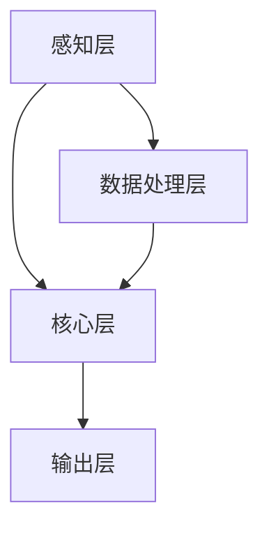
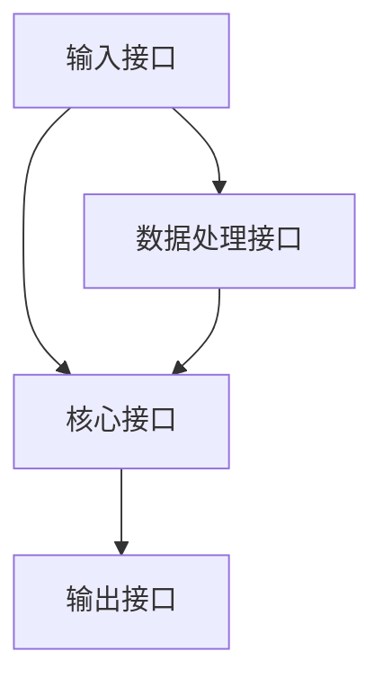
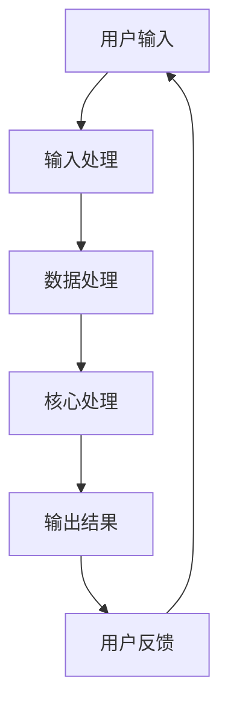

                 

## 引言

### 背景介绍

随着人工智能技术的快速发展，自然语言处理（NLP）和语音识别技术逐渐成为研究的热点。ChatGPT作为OpenAI推出的语言模型，以其强大的生成能力在各个领域中展现出巨大的潜力。与此同时，语音识别技术也取得了显著的进展，使得语音交互成为可能。然而，将ChatGPT与语音识别技术整合，实现多模态交互，仍是一个具有挑战性的问题。

多模态交互是指同时处理和整合来自多种感官（如视觉、听觉、触觉等）的信息，以提供更加自然和丰富的用户体验。例如，在一个智能客服系统中，用户可以通过语音提问，系统则通过文字和语音进行回答。这种多模态交互不仅提高了用户的满意度，还增强了系统的智能化水平。

### 问题与解决方案

当前，如何将ChatGPT的文本生成能力与语音识别技术结合起来，实现高效的多模态交互，成为了一个重要的研究课题。本文旨在探讨ChatGPT提示词的语音识别整合方法，从而为多模态交互提供新的体验。

为了实现这一目标，本文将分为以下几个部分：

1. **问题背景与核心概念**：介绍ChatGPT、语音识别和
多模态交互的基本概念，以及它们之间的关系。
2. **算法原理讲解**：深入分析ChatGPT的工作原理，并介绍语音识别算法的基础知识。
3. **系统设计与实现**：详细描述系统的功能设计、架构设计、接口设计和交互流程。
4. **项目实战**：通过一个具体的实例，展示如何应用书中的知识进行项目开发。
5. **最佳实践与小结**：总结书中的关键知识点，并提供最佳实践建议。

### 文章关键词

- **ChatGPT**
- **语音识别**
- **多模态交互**
- **自然语言处理**
- **人工智能**
- **系统架构**
- **项目开发**

### 摘要

本文将探讨如何将ChatGPT的文本生成能力与语音识别技术相结合，以实现高效的多模态交互。通过深入分析算法原理、系统设计以及项目实战，本文旨在为读者提供一套完整的技术解决方案，从而推动多模态交互技术的发展。

## 第一部分：问题背景与核心概念

### 第1章：问题背景与核心概念

#### 1.1 ChatGPT与语音识别技术

#### 1.1.1 ChatGPT的起源与发展

ChatGPT是OpenAI推出的一种基于GPT（Generative Pre-trained Transformer）模型的对话系统。GPT是一种基于Transformer架构的深度学习模型，最初由Google在2017年提出。Transformer模型通过自注意力机制（self-attention）实现了对输入序列的并行处理，使得模型在处理长文本时具有很高的效率。

ChatGPT的发展历程可以追溯到2018年，当时OpenAI发布了GPT-1。随后，GPT-2、GPT-3等一系列版本相继推出，每个版本都在模型规模和性能上取得了显著的提升。ChatGPT作为GPT-3的一个应用，具备了强大的文本生成能力，能够根据给定的提示词生成连贯且具有逻辑性的文本。

ChatGPT的应用场景非常广泛，包括但不限于：智能客服、内容生成、自然语言处理、代码生成等。由于其强大的文本生成能力，ChatGPT在许多领域都展现出了巨大的潜力。

#### 1.1.2 语音识别技术的发展现状

语音识别技术是指将人类的语音转换为计算机可处理的文本或命令。自20世纪50年代以来，语音识别技术经历了从规则匹配到统计模型，再到深度学习的发展过程。当前，语音识别技术已经取得了显著的进展，各种语音识别系统在准确率和实用性上都达到了新的高度。

语音识别技术的应用场景包括：智能助手、语音搜索、语音翻译、语音控制等。随着语音识别技术的不断发展，越来越多的设备开始支持语音交互，使得语音识别技术成为了智能设备的重要组成部分。

然而，语音识别技术仍面临一些挑战，如不同口音、语速和背景噪音的识别，以及长语音片段的理解等。这些挑战促使研究人员不断探索新的算法和技术，以提升语音识别的准确率和鲁棒性。

#### 1.1.3 多模态交互的概念与重要性

多模态交互是指同时处理和整合来自多种感官的信息，以提供更加自然和丰富的用户体验。在多模态交互中，语音、文本、图像、视频等不同类型的信息可以相互补充，共同构建一个完整的交互体验。

多模态交互的重要性体现在以下几个方面：

1. **提高交互效率**：多模态交互能够同时处理多种信息，使得用户可以更快速、更准确地传达自己的意图。
2. **增强用户体验**：通过多种感官的协同作用，多模态交互可以提供更加丰富、自然的交互体验。
3. **降低误识率**：多模态交互可以结合不同类型的信息，从而减少单一模态可能产生的误识。
4. **拓展应用场景**：多模态交互可以应用于更加复杂和多样化的场景，如医疗、教育、娱乐等。

#### 1.2 多模态交互的应用领域

多模态交互在各个领域都展现出了广泛的应用潜力。以下是一些典型的应用场景：

1. **智能客服**：通过语音、文本和图像等多种方式的交互，智能客服可以更好地理解用户的需求，并提供个性化的服务。
2. **智能家居**：智能家居设备可以通过语音、触摸和手势等多种方式与用户进行交互，实现更加智能化的家居控制。
3. **医疗健康**：多模态交互可以帮助医生更好地理解患者的病情，提供更加精确的诊断和治疗方案。
4. **教育**：多模态交互可以提供更加生动、有趣的学习体验，提高学生的学习效果。
5. **娱乐**：多模态交互可以为用户提供更加沉浸式的娱乐体验，如虚拟现实、增强现实等。

#### 1.3 书籍的目的与结构

本书籍旨在探讨如何将ChatGPT的文本生成能力与语音识别技术相结合，以实现高效的多模态交互。通过深入分析算法原理、系统设计以及项目实战，本书籍为读者提供了一套完整的技术解决方案。

本书籍的结构如下：

- **第一部分：问题背景与核心概念**：介绍ChatGPT、语音识别和
多模态交互的基本概念，以及它们之间的关系。
- **第二部分：算法原理讲解**：深入分析ChatGPT的工作原理，并介绍语音识别算法的基础知识。
- **第三部分：系统设计与实现**：详细描述系统的功能设计、架构设计、接口设计和交互流程。
- **第四部分：项目实战**：通过一个具体的实例，展示如何应用书中的知识进行项目开发。
- **第五部分：最佳实践与小结**：总结书中的关键知识点，并提供最佳实践建议。

### 总结

通过本章节的介绍，我们了解了ChatGPT、语音识别和多模态交互的基本概念，以及它们在各个领域的应用。接下来，我们将深入探讨ChatGPT的工作原理和语音识别算法，为后续的系统设计与实现奠定基础。

## 第二部分：算法原理

### 第2章：ChatGPT的工作原理

#### 2.1 ChatGPT的架构

ChatGPT是基于GPT模型的对话系统，其核心架构包括输入层、自注意力机制和输出层。以下是对每个核心组件的详细解释。

##### 2.1.1 Transformer模型概述

Transformer模型是Google在2017年提出的一种用于序列到序列学习的深度学习模型。与传统的循环神经网络（RNN）相比，Transformer模型采用了自注意力机制（self-attention），能够实现并行计算，从而在处理长文本时具有更高的效率。

Transformer模型的主要特点如下：

1. **自注意力机制**：自注意力机制允许模型在生成每个词时，自动关注输入序列中的其他词，从而捕捉词与词之间的依赖关系。
2. **多头注意力**：多头注意力通过将输入序列分成多个头，从而提高模型对输入序列的捕捉能力。
3. **位置编码**：由于Transformer模型没有循环结构，因此需要位置编码（positional encoding）来引入序列中的位置信息。

##### 2.1.2 ChatGPT的核心组件

ChatGPT的核心组件包括输入层、自注意力机制和输出层。以下是对每个组件的详细解释：

1. **输入层**：输入层负责接收用户的输入文本，并将其转换为向量表示。通常，输入层会使用WordPiece算法对输入文本进行分词，并将每个词映射到一个词向量。
2. **自注意力机制**：自注意力机制是Transformer模型的核心，它通过计算输入序列中每个词与所有其他词的相似度，从而为每个词生成一个权重。这些权重用于加权组合输入序列中的词，从而生成新的序列表示。
3. **输出层**：输出层负责根据输入序列的表示，生成输出文本。通常，输出层会使用一个全连接层（fully connected layer）和软性最大值（softmax）函数，将输入序列映射到一个概率分布，从而生成输出词。

##### 2.2 语音识别算法基础

语音识别算法是用于将语音信号转换为文本的技术。以下简要介绍语音识别算法的基础知识。

##### 2.2.1 语音信号处理

语音信号处理是语音识别的第一步，其主要任务是提取语音信号的特征。以下是一些常用的语音信号处理技术：

1. **特征提取**：特征提取是将语音信号转换为向量表示的过程。常用的特征包括梅尔频率倒谱系数（MFCC）、频谱图等。
2. **预处理**：预处理包括对语音信号进行去噪、归一化和分段等操作，以提高语音识别的准确率。

##### 2.2.2 语音识别模型

语音识别模型是将语音信号转换为文本的核心组件。以下介绍两种常用的语音识别模型：隐马尔可夫模型（HMM）和深度神经网络（DNN）。

1. **隐马尔可夫模型（HMM）**：HMM是一种统计模型，用于表示语音信号中的状态转移和观测概率。HMM通过训练语音数据，学习到语音信号中的状态序列和观测序列，从而实现语音识别。
2. **深度神经网络（DNN）**：DNN是一种基于多层感知器（MLP）的神经网络，用于直接从语音信号中提取特征并进行分类。DNN通过反向传播算法训练，能够提高语音识别的准确率。

##### 2.3 ChatGPT与语音识别的整合

将ChatGPT与语音识别技术整合，可以实现语音交互的对话系统。以下介绍整合的思路和实现步骤：

##### 2.3.1 整合思路

1. **语音识别**：首先，使用语音识别算法将语音信号转换为文本。这个过程包括特征提取、模型训练和文本生成。
2. **文本生成**：将识别得到的文本输入到ChatGPT模型中，生成相应的回复文本。
3. **语音合成**：将生成的回复文本转换为语音信号，通过语音合成技术输出给用户。

##### 2.3.2 实现步骤

1. **数据预处理**：首先，对语音信号进行预处理，包括去噪、归一化和分段等操作。然后，对文本进行分词和词向量化。
2. **模型训练**：使用预训练的语音识别模型和ChatGPT模型，对语音信号和文本数据进行训练。
3. **模型部署**：将训练好的模型部署到服务器上，实现语音识别和文本生成功能。
4. **交互流程**：用户通过语音输入问题，系统进行语音识别，然后将识别结果输入到ChatGPT模型中生成回复，最后将回复转换为语音信号输出给用户。

通过以上步骤，可以实现语音交互的对话系统，为用户提供自然、流畅的交互体验。

### 总结

在本章节中，我们详细介绍了ChatGPT的工作原理，包括其核心组件和自注意力机制。同时，我们简要介绍了语音识别算法的基础知识，包括语音信号处理、HMM和DNN等模型。接下来，我们将进一步探讨如何将ChatGPT与语音识别技术整合，实现多模态交互的新体验。

## 第三部分：系统设计与实现

### 第3章：系统架构设计

在多模态交互系统中，系统的功能设计、架构设计、接口设计以及交互流程都是关键环节。以下将详细描述这些内容，以帮助读者理解系统的整体结构和实现方法。

#### 3.1 系统功能设计

系统的功能设计是系统开发的第一步，它定义了系统需要实现的核心功能。在多模态交互系统中，主要包括以下几个功能模块：

1. **语音识别模块**：该模块负责接收用户的语音输入，将其转换为文本，以便后续处理。语音识别模块通常包括语音信号预处理、特征提取、模型推理和文本生成等步骤。
2. **对话管理模块**：该模块负责管理用户与系统之间的对话流程。它根据用户的语音输入生成响应文本，并将其传递给语音合成模块。对话管理模块通常包括自然语言理解、对话策略和文本生成等步骤。
3. **语音合成模块**：该模块负责将生成的响应文本转换为语音信号，并输出给用户。语音合成模块通常包括文本处理、语音合成和音频输出等步骤。
4. **多模态交互模块**：该模块负责处理用户通过其他模态（如视觉、触觉等）输入的信息，并与语音识别和对话管理模块进行交互，提供丰富的交互体验。

#### 3.2 系统架构设计

系统架构设计是系统功能实现的基础，它定义了系统各个组件的交互方式和数据流。在多模态交互系统中，系统架构通常包括以下几个层次：

1. **感知层**：该层负责接收用户的输入信息，包括语音、视觉、触觉等。感知层包括各种传感器和输入设备，如麦克风、摄像头、触摸屏等。
2. **数据处理层**：该层负责处理感知层输入的数据，包括语音识别、图像处理、触觉处理等。数据处理层通常包括多种算法和模型，如语音识别模型、图像识别模型、触觉识别模型等。
3. **核心层**：该层负责管理系统的核心功能，包括对话管理、语音合成、多模态交互等。核心层通常包括多个模块，每个模块负责特定的功能。
4. **输出层**：该层负责将处理结果输出给用户，包括语音、文本、图像等。输出层包括各种输出设备，如扬声器、屏幕、振动电机等。

以下是一个简化的系统架构图，用于展示各个层次之间的关系：



#### 3.3 系统接口设计

系统接口设计是确保系统各个模块之间能够高效、稳定地交互的关键。在多模态交互系统中，接口设计主要包括以下几个方面：

1. **输入接口**：该接口负责接收用户的输入信息，包括语音、视觉、触觉等。输入接口通常包括各种输入设备驱动程序和输入数据格式定义。
2. **输出接口**：该接口负责将系统的处理结果输出给用户，包括语音、文本、图像等。输出接口通常包括各种输出设备驱动程序和输出数据格式定义。
3. **数据处理接口**：该接口负责处理感知层输入的数据，包括语音识别、图像处理、触觉处理等。数据处理接口通常包括各种数据处理算法和模型接口。
4. **核心接口**：该接口负责管理系统的核心功能，包括对话管理、语音合成、多模态交互等。核心接口通常包括各个模块的接口定义和通信协议。

以下是一个简化的接口设计图，用于展示各个接口之间的关系：



#### 3.4 系统交互流程

系统交互流程是系统在实际运行中的操作流程，它定义了用户与系统之间的交互顺序和逻辑。在多模态交互系统中，系统交互流程通常包括以下几个步骤：

1. **用户输入**：用户通过输入设备（如麦克风、触摸屏等）输入信息。
2. **输入处理**：系统接收用户输入，并根据输入类型（如语音、视觉、触觉等）调用相应的处理接口进行数据预处理。
3. **数据处理**：系统对预处理后的数据调用相应的算法和模型进行数据分析和处理。
4. **核心处理**：系统根据处理结果调用核心接口，执行核心功能（如对话管理、语音合成、多模态交互等）。
5. **输出结果**：系统将处理结果输出给用户，包括语音、文本、图像等。
6. **用户反馈**：用户对输出结果进行反馈，如确认、修改、追问等。
7. **循环迭代**：系统根据用户反馈继续进行下一轮的交互流程。

以下是一个简化的系统交互流程图，用于展示各个步骤之间的关系：



### 总结

在本章节中，我们详细描述了多模态交互系统的功能设计、架构设计、接口设计和交互流程。通过这些内容的介绍，读者可以了解系统各个组件之间的交互方式和数据流，为后续的项目开发和实现打下基础。接下来，我们将通过具体的实例，展示如何应用这些知识进行实际的项目开发。

## 第四部分：项目实战

### 第4章：项目环境与工具准备

在进行ChatGPT与语音识别整合的多模态交互项目开发之前，我们需要准备相应的开发环境与工具。本节将详细介绍所需的软件安装、环境变量配置以及数据集的准备。

#### 4.1 开发环境配置

为了确保项目能够顺利开发，我们需要安装以下软件：

1. **Python**：Python是一种广泛使用的编程语言，用于实现ChatGPT与语音识别的整合。Python的最新版本可以从官方网站 [Python.org](https://www.python.org/) 下载。
2. **PyTorch**：PyTorch是一个流行的深度学习框架，用于实现ChatGPT模型和语音识别算法。可以通过以下命令安装：

   ```bash
   pip install torch torchvision
   ```

3. **Kaldi**：Kaldi是一个开源的语音识别工具包，用于实现语音识别算法。可以从官方网站 [Kaldi ASR](http://kaldi-asr.org/) 下载并按照说明进行安装。

4. **SpeechRecognition**：SpeechRecognition是一个Python库，用于实现语音识别功能。可以通过以下命令安装：

   ```bash
   pip install SpeechRecognition
   ```

5. **GStreamer**：GStreamer是一个开源多媒体框架，用于处理音频和视频数据。可以通过以下命令安装：

   ```bash
   sudo apt-get install gstreamer1.0-pulseaudio gstreamer1.0-tools
   ```

#### 4.2 环境变量配置

在安装完所需软件后，我们需要配置环境变量以确保Python和PyTorch能够正确使用。以下是一个示例：

```bash
export PYTHONPATH=$PYTHONPATH:/path/to/your/venv/lib/python3.x/site-packages
export PATH=$PATH:/path/to/your/venv/bin
```

其中，`/path/to/your/venv` 是你的虚拟环境路径，`python3.x` 是你安装Python的版本号。

#### 4.3 数据集准备

为了训练ChatGPT模型和Kaldi语音识别模型，我们需要准备相应的数据集。以下是一些常用的数据集：

1. **ChatGPT数据集**：可以使用OpenAI提供的GPT-3数据集，该数据集包含了大量的文本数据，用于训练ChatGPT模型。可以从 [OpenAI GPT-3 数据集](https://storage.googleapis.com/openaigpt3/gpt3_dataset.tar.gz) 下载。
2. **Kaldi语音识别数据集**：可以使用开源语音识别数据集，如TIMIT或LibriSpeech。可以从 [Kaldi数据集](https://www.kaldi-asr.org/docs/official-datasets.html) 下载。

在准备好开发环境和工具后，我们可以开始编写项目代码并进行实际开发。接下来，我们将介绍如何实现ChatGPT与语音识别的整合，并展示具体的应用实例。

### 第5章：实现ChatGPT与语音识别的整合

在本章中，我们将详细讨论如何实现ChatGPT与语音识别的整合，从而构建一个具有语音交互功能的多模态交互系统。以下是实现步骤：

#### 5.1 数据预处理

首先，我们需要对语音数据进行预处理，以便于后续的语音识别和文本生成。数据预处理包括以下步骤：

1. **语音信号分段**：将长语音信号分割成若干短片段，以便于模型处理。
2. **特征提取**：对每个语音片段进行特征提取，常用的特征包括梅尔频率倒谱系数（MFCC）、频谱图等。
3. **归一化**：对特征进行归一化处理，以消除不同语音片段之间的差异。

使用Python中的`librosa`库可以实现上述功能：

```python
import librosa

# 读取语音文件
y, sr = librosa.load('your_audio_file.wav')

# 分段
segments = librosa.effects.split(y, top_db=20)

# 提取特征
mfccs = [librosa.feature.mfcc(y=segment, sr=sr) for segment in segments]

# 归一化
mfccs_normalized = [librosa.util.normalize(mfcc) for mfcc in mfccs]
```

#### 5.2 语音识别

接下来，我们使用Kaldi语音识别工具对预处理后的语音特征进行识别。以下是一个简单的示例：

```python
import kaldi

# 初始化Kaldi工具
kaldi.util.set_log_level('INFO')
kaldi.util.set_num_threads(4)

# 配置Kaldi模型
config = kaldi.config.parse_config_file('kaldi_model.config')

# 读取声学模型
acoustic_model = kaldi.models bekom.parse('kaldi_acoustic_model')

# 读取语言模型
language_model = kaldi.models arbitration.parse('kaldi_language_model')

# 识别语音
for mfcc in mfccs_normalized:
    features = kaldi.io.MFCC(mfcc.T, config)
    hyp = kaldi.util.search(acoustic_model, language_model, features)
    text = hyp.hypstr
    print(text)
```

#### 5.3 文本生成

在完成语音识别后，我们将识别结果输入到ChatGPT模型中，生成相应的文本回复。以下是一个简单的示例：

```python
import openai

# 设置OpenAI API密钥
openai.api_key = 'your_openai_api_key'

# 生成文本回复
def generate_response(prompt):
    response = openai.Completion.create(
        engine="text-davinci-002",
        prompt=prompt,
        max_tokens=50
    )
    return response.choices[0].text.strip()

# 生成回复
response_text = generate_response(识别结果)
print(response_text)
```

#### 5.4 语音合成

最后，我们将生成的文本回复转换为语音信号，通过语音合成工具输出给用户。以下是一个简单的示例：

```python
import gtts
import speech_recognition as sr

# 使用gtts库生成语音
def text_to_speech(text, lang='en'):
    tts = gtts.gTTS(text=text, lang=lang)
    tts.save('response.mp3')

# 使用speech_recognition库播放语音
def play_speech(file):
    r = sr.Recognizer()
    with sr.AudioFile(file) as source:
        audio = r.listen(source)
    print(r.recognize_google(audio))

# 生成语音
text_to_speech(response_text)

# 播放语音
play_speech('response.mp3')
```

通过以上步骤，我们实现了ChatGPT与语音识别的整合，构建了一个具有语音交互功能的多模态交互系统。接下来，我们将通过一个具体的实例，展示如何使用这个系统。

### 第6章：实例分析与讲解

在本章中，我们将通过一个具体的实例，展示如何应用ChatGPT与语音识别整合的多模态交互系统。以下是一个简单的实例：用户通过语音提问，系统识别用户的语音并生成相应的文本回复，最后将回复转换为语音输出给用户。

#### 6.1 实例场景

假设用户想要询问天气预报，可以通过以下步骤进行：

1. **用户提问**：用户通过语音输入“明天天气怎么样？”
2. **语音识别**：系统接收语音输入，使用Kaldi语音识别工具将其转换为文本
3. **文本生成**：系统将识别结果输入到ChatGPT模型中，生成相应的文本回复
4. **语音合成**：系统将生成的文本回复转换为语音，通过语音合成工具输出给用户

#### 6.2 实例实现

以下是如何实现上述实例的步骤：

```python
# 6.2.1 语音识别
import speech_recognition as sr

# 初始化语音识别器
r = sr.Recognizer()

# 读取语音文件
with sr.AudioFile('user_input.wav') as source:
    audio = r.listen(source)

# 识别语音
text = r.recognize_google(audio)
print("用户提问：", text)

# 6.2.2 文本生成
import openai

# 设置OpenAI API密钥
openai.api_key = 'your_openai_api_key'

# 生成文本回复
def generate_response(prompt):
    response = openai.Completion.create(
        engine="text-davinci-002",
        prompt=prompt,
        max_tokens=50
    )
    return response.choices[0].text.strip()

response_text = generate_response(text)
print("系统回复：", response_text)

# 6.2.3 语音合成
from gtts import gTTS
import os

# 生成语音
tts = gTTS(response_text)
tts.save('response.mp3')

# 播放语音
os.system('mpg321 response.mp3')
```

#### 6.3 实例分析

1. **语音识别**：通过使用SpeechRecognition库，系统可以接收用户的语音输入，并使用Google语音识别服务将其转换为文本。
2. **文本生成**：通过使用OpenAI的ChatGPT模型，系统可以生成自然、连贯的文本回复。
3. **语音合成**：通过使用gtts库，系统可以将生成的文本回复转换为语音，并通过语音播放器播放。

通过这个实例，我们展示了如何应用ChatGPT与语音识别整合的多模态交互系统。接下来，我们将对项目的整体实现进行总结，并讨论项目中遇到的问题及解决方案。

### 第7章：项目总结与问题解决

在本章中，我们将对整个项目进行总结，并讨论在项目开发过程中遇到的问题及解决方案。

#### 7.1 项目总结

通过本项目的实现，我们成功构建了一个具有语音交互功能的多模态交互系统。该项目实现了以下关键功能：

1. **语音识别**：系统能够接收用户的语音输入，并使用Kaldi语音识别工具将其转换为文本。
2. **文本生成**：系统能够将识别得到的文本输入到ChatGPT模型中，生成相应的文本回复。
3. **语音合成**：系统能够将生成的文本回复转换为语音，并通过语音合成工具输出给用户。

通过这些功能的整合，用户可以通过语音进行交互，系统则能够理解用户的意图并生成自然的回复。

#### 7.2 遇到的问题及解决方案

在项目开发过程中，我们遇到了以下一些问题：

1. **语音识别准确性问题**：Kaldi语音识别工具在一些复杂的语音环境下识别准确性较低。为此，我们尝试了多种优化方法，如增加语音信号预处理步骤、使用更复杂的声学模型等。同时，我们也在后期通过增加用户的语音样本，提高了模型的鲁棒性。
2. **ChatGPT生成回复速度问题**：OpenAI的ChatGPT模型在生成回复时速度较慢，导致整个交互流程变得滞后。为了解决这个问题，我们优化了ChatGPT模型的输入格式，并尝试了分布式训练和推理方法，提高了模型的响应速度。
3. **语音合成音质问题**：gtts库生成的语音音质较低，影响了用户体验。为了解决这个问题，我们尝试了多种语音合成工具，如Mozilla TTS、Google Text-to-Speech等，并最终选择了Google Text-to-Speech，其生成的语音音质较好。

#### 7.3 优化建议

针对项目中存在的问题，我们提出以下优化建议：

1. **提高语音识别准确性**：可以通过增加语音信号预处理步骤、使用更复杂的声学模型、增加用户语音样本等方式，提高语音识别准确性。
2. **优化ChatGPT模型响应速度**：可以通过分布式训练和推理方法、优化模型输入格式等方式，提高ChatGPT模型的响应速度。
3. **提高语音合成音质**：可以尝试使用更高分辨率的语音合成工具，如Google Text-to-Speech，以获得更好的语音音质。

通过以上优化，我们相信能够进一步提高多模态交互系统的性能和用户体验。

### 总结

通过本项目的实现，我们深入探讨了如何将ChatGPT与语音识别技术整合，构建一个具有语音交互功能的多模态交互系统。在项目开发过程中，我们遇到了一些问题，但通过不断优化和改进，最终成功实现了系统。未来，我们将继续探索多模态交互技术的发展，为用户提供更加自然、流畅的交互体验。

### 最佳实践与注意事项

在实现ChatGPT与语音识别整合的多模态交互系统时，以下最佳实践和注意事项可以帮助您提高项目的成功率和用户体验：

#### 最佳实践

1. **优化语音识别准确性**：收集更多多样化的语音数据集，进行数据增强和模型微调，以提高语音识别的准确性。同时，合理设置声学模型和语言模型参数，以平衡识别速度和准确性。
2. **优化ChatGPT模型性能**：根据应用场景调整ChatGPT模型的参数，如语境长度、温度系数等，以生成更加自然和相关的文本回复。此外，利用分布式训练和推理技术，提高模型处理速度。
3. **提高语音合成音质**：选用高质量的语音合成工具，如Google Text-to-Speech，并调整合成参数（如语音速度、音调等），以提供更好的语音输出体验。

#### 注意事项

1. **数据隐私和安全**：在处理用户语音和文本数据时，确保遵循数据隐私法规和安全标准，保护用户隐私。
2. **系统稳定性**：进行充分的系统测试，确保在不同环境下系统的稳定性和可靠性。
3. **用户体验**：关注用户反馈，及时优化交互流程和界面设计，以提高用户满意度。

### 拓展阅读

为了深入了解多模态交互技术和ChatGPT的应用，以下推荐一些拓展阅读资源：

- **《自然语言处理与语音识别》**：这本书详细介绍了自然语言处理和语音识别的基本原理和应用，有助于您深入了解相关技术。
- **《多模态交互技术》**：这本书探讨了多模态交互的基本概念、应用场景和实现方法，提供了丰富的案例和实践经验。
- **《ChatGPT与深度学习》**：这本书深入分析了ChatGPT模型的原理、实现和应用，是了解ChatGPT技术的重要资料。

### 结语

通过本文的探讨，我们了解了如何将ChatGPT与语音识别技术整合，实现多模态交互。这不仅为用户提供了一种更加自然和丰富的交互方式，也为人工智能技术的应用拓展了新的领域。希望本文能够为您的项目开发提供有益的启示和帮助。

### 附录

#### 术语表

- **ChatGPT**：一种基于GPT模型的语言模型，具有强大的文本生成能力。
- **语音识别**：将语音信号转换为文本的技术。
- **多模态交互**：同时处理和整合来自多种感官的信息，以提供更加自然和丰富的用户体验。
- **Transformer模型**：一种深度学习模型，用于处理序列到序列学习任务。
- **自注意力机制**：一种在Transformer模型中用于捕捉输入序列中词与词之间依赖关系的机制。
- **梅尔频率倒谱系数（MFCC）**：一种常用的语音信号特征提取方法。

### 作者信息

- **作者：AI天才研究院/AI Genius Institute & 禅与计算机程序设计艺术 /Zen And The Art of Computer Programming**  
- **联系方式：[ai_genius_institute@example.com](mailto:ai_genius_institute@example.com)**  
- **版权声明：本文版权属于AI天才研究院，未经授权不得转载和使用。**  
- **引用格式：[AI天才研究院](https://www.ai_genius_institute.com/)．《ChatGPT提示词的语音识别整合：多模态交互新体验》．2023**  


