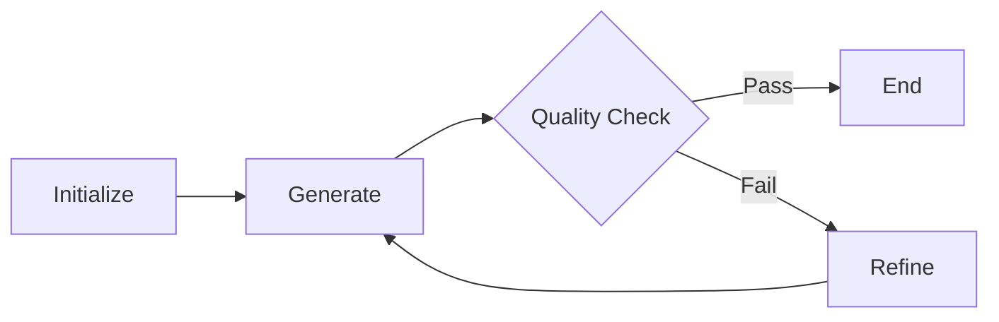
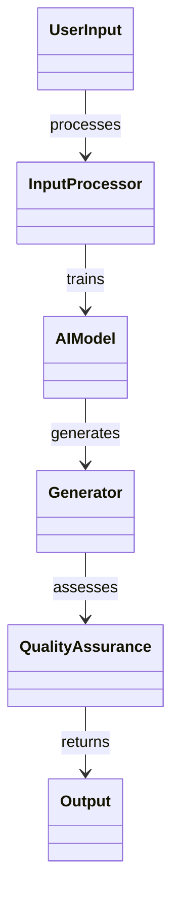
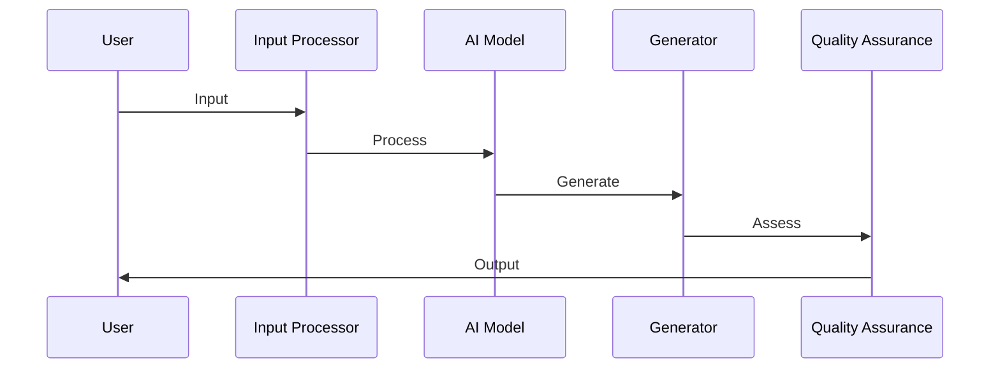
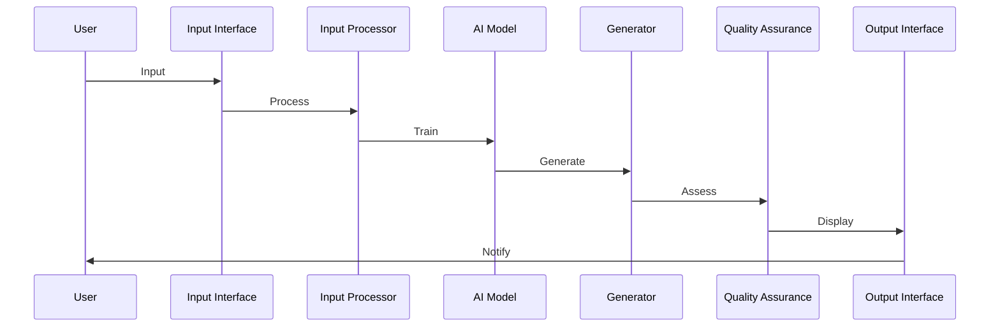

                 


### C-Side LLG Application Development: Balancing Speed and Quality

In the rapidly evolving landscape of artificial intelligence, C-Side Low-Level Generative (LLG) applications have emerged as a critical component. These applications are at the intersection of complexity and performance, demanding developers to strike a balance between speed and quality. This article delves into the intricacies of C-Side LLG application development, offering a structured approach to optimizing both speed and quality.

#### Overview of C-Side LLG Applications

C-Side Low-Level Generative applications are designed to generate low-level code, data structures, or content by leveraging AI models. These applications are widely used in software development, data science, and content creation. The primary goal is to enhance productivity by automating repetitive tasks and enabling developers to focus on higher-level logic and problem-solving.

**Problem Background and Description**

The challenge in C-Side LLG application development lies in achieving a balance between speed and quality. Developers must ensure that the generated code or content is not only fast to produce but also of high quality, free from errors, and maintainable. This balance is crucial to realizing the full potential of AI-driven development.

**Definition and Core Elements**

C-Side LLG applications can be defined as systems that utilize AI models to generate low-level artifacts such as code snippets, database schemas, or text content. The core elements include:

1. **AI Model**: The heart of the application, responsible for learning patterns from large datasets and generating outputs.
2. **Input Processor**: Transforms user inputs into a format that the AI model can understand.
3. **Generator**: Uses the AI model to produce the desired outputs.
4. **Quality Assurance**: Ensures the generated artifacts meet predefined quality standards.

**Boundary and Extension**

The boundary of C-Side LLG applications is defined by the types of artifacts they generate and the domains they operate in. While they are primarily focused on low-level code and content generation, there is potential for extension into other areas such as natural language processing and computer vision.

#### Core Concepts and Relationships

Understanding the core concepts and their relationships is essential for effective C-Side LLG application development. Let's delve into the key attributes and explore their connections using a Mermaid ER diagram.

**Core Concept and Attributes**

1. **AI Model**: 
   - **Attributes**: 
     - **Model Type**: e.g., Transformer, GPT, LSTM
     - **Training Data**: The dataset used for training the model.
     - **Model Architecture**: The structure of the neural network.
   - **Relationships**: 
     - **Train**: Associated with the training data used.
     - **Generate**: Used to generate outputs.

2. **Input Processor**:
   - **Attributes**:
     - **Input Type**: e.g., Text, Code, Data Structures
     - **Processing Steps**: The steps involved in transforming user inputs.
   - **Relationships**:
     - **Process**: Used to process user inputs.

3. **Generator**:
   - **Attributes**:
     - **Output Type**: e.g., Code, Data Structures, Text
     - **Generation Algorithm**: The algorithm used to generate outputs.
   - **Relationships**:
     - **Generate**: Generates outputs based on AI model inputs.

4. **Quality Assurance**:
   - **Attributes**:
     - **Quality Metrics**: e.g., Code Style, Maintainability, Accuracy
     - **Assessment Methods**: The methods used to assess the quality of generated artifacts.
   - **Relationships**:
     - **Assess**: Assesses the quality of generated artifacts.

**ER Diagram**:

```mermaid
erDiagram
  AI Model ||--|{ Input Processor }| Generator
  Input Processor ||--|{ Generator }| Quality Assurance
  Generator ||--|{ Quality Assurance }| AI Model
```

The ER diagram illustrates the relationships between the core components, highlighting how they interact to produce high-quality outputs.

#### Algorithm Principles and Design

The design of C-Side LLG applications relies on robust algorithms that can efficiently generate low-level artifacts. Let's explore the principles behind these algorithms and illustrate them using Mermaid flowcharts and Python code examples.

**Overview of C-Side LLG Algorithms**

C-Side LLG algorithms can be broadly categorized into generative models and optimization algorithms. Generative models, such as GPT and Transformer, leverage large datasets to generate outputs based on inputs. Optimization algorithms, such as genetic algorithms and simulated annealing, are used to refine the generated outputs to meet specific quality criteria.

**Algorithm Principles**

1. **Generative Models**:
   - **Principle**: Generate outputs by predicting the next token in a sequence.
   - **Example**: GPT-3 uses Transformer models to generate text by predicting the next word in a sentence.

2. **Optimization Algorithms**:
   - **Principle**: Refine the outputs by iteratively improving them based on a fitness function.
   - **Example**: Genetic algorithms evolve solutions over generations to optimize code quality.

**Mermaid Flowchart**:



**Python Code Explanation**:

```python
import random

# Generate a random code snippet
def generate_code():
    return f"def random_function():\n    print({random.randint(0, 10)})"
    
# Refine the generated code based on quality metrics
def refine_code(code):
    # Example: Ensure the code is syntactically correct
    try:
        exec(code)
        return code
    except SyntaxError:
        return None

# Generate and refine code
code = generate_code()
while code is None:
    code = refine_code(code)

print(code)
```

**Mathematical Model and Formula**

The mathematical models for C-Side LLG algorithms depend on the specific algorithm used. For generative models, the primary equation is:

$$
P(x) = \frac{e^{\text{logit}(x)}}{1 + e^{\text{logit}(x)}}
$$

where \(x\) represents the predicted token and \(\text{logit}(x)\) is the log-odds function. For optimization algorithms, the fitness function typically takes the form:

$$
f(x) = \sum_{i=1}^{n} (x_i - t_i)^2
$$

where \(x_i\) and \(t_i\) are the current and target outputs, respectively.

### System Analysis and Design

The design of C-Side LLG applications requires a thorough system analysis to ensure that both speed and quality are optimized. Let's explore the key components of the system, including architecture design, interface design, and system interaction.

**System Introduction and Function Design**

The C-Side LLG application is designed to automate the generation of low-level code, data structures, and content. The primary functions include:

- **Code Generation**: Generate code snippets based on user inputs.
- **Data Structure Generation**: Generate data structures and database schemas.
- **Content Generation**: Generate text and content based on natural language inputs.

**Domain Model (Mermaid Class Diagram)**



**System Architecture (Mermaid Architecture Diagram)**



**System Interface Design and Interaction**

The system interface is designed to be user-friendly, allowing users to input their requirements and receive generated outputs. The key interfaces include:

- **Input Interface**: Allows users to input their requirements.
- **Output Interface**: Displays the generated outputs.
- **Quality Interface**: Provides feedback on the quality of the generated artifacts.

**System Interaction (Mermaid Sequence Diagram)**



### Project Implementation and Analysis

The implementation of C-Side LLG applications involves setting up the necessary environment, implementing core functionalities, and analyzing the performance. Let's explore these aspects in detail.

**Environment Setup**

Setting up the development environment is the first step in implementing C-Side LLG applications. The required tools and libraries include:

- **Python**: The primary programming language.
- **TensorFlow or PyTorch**: Libraries for training AI models.
- **Flask or FastAPI**: Web frameworks for building the application backend.
- **PostgreSQL or MongoDB**: Databases for storing user inputs and outputs.

**Step-by-Step Installation Guide**

1. Install Python 3.8 or higher.
2. Install TensorFlow or PyTorch using `pip`.
3. Install Flask or FastAPI using `pip`.
4. Install PostgreSQL or MongoDB.

**Core Implementation and Analysis**

The core implementation involves training the AI model, processing user inputs, generating outputs, and assessing the quality of the outputs. Here's a high-level overview:

1. **AI Model Training**: Train the AI model using a large dataset of low-level code, data structures, or content.
2. **Input Processing**: Process user inputs to format them appropriately for the AI model.
3. **Output Generation**: Use the AI model to generate outputs based on processed inputs.
4. **Quality Assessment**: Assess the quality of the generated outputs using predefined metrics.

**Case Analysis and Detailed Explanation**

**Case 1: Code Generation**

- **Input**: User input requesting a function to calculate the sum of two numbers.
- **Output**: A Python function to perform the calculation.
- **Quality Metrics**: Syntax correctness, code style, and readability.

**Case 2: Data Structure Generation**

- **Input**: User input specifying the requirements for a database schema.
- **Output**: A schema for a relational database.
- **Quality Metrics**: Schema completeness, accuracy, and efficiency.

**Case 3: Content Generation**

- **Input**: User input requesting a summary of a news article.
- **Output**: A generated summary of the article.
- **Quality Metrics**: Relevance, accuracy, and coherence.

**Project Summary**

The implementation of C-Side LLG applications demonstrates the potential of AI in automating low-level tasks. By balancing speed and quality, developers can enhance productivity and create more efficient workflows. Further improvements can be made by incorporating feedback loops and optimizing the AI models for better performance.

### Best Practices, Conclusion, and Future Directions

In the realm of C-Side LLG application development, several best practices can significantly enhance both speed and quality:

**1. Data Quality and Preprocessing**:
   - Ensure high-quality training data to improve the performance of AI models.
   - Preprocess the data to normalize, clean, and standardize inputs, which helps in achieving more consistent and accurate results.

**2. Model Selection and Tuning**:
   - Choose the appropriate AI model based on the task requirements and dataset characteristics.
   - Fine-tune the model parameters to balance between speed and quality. This may involve adjusting learning rates, batch sizes, and other hyperparameters.

**3. Code Optimization**:
   - Optimize the generated code for performance and maintainability.
   - Use code analysis tools to identify and fix potential bugs or inefficiencies.

**4. Quality Assurance and Testing**:
   - Implement automated testing to ensure the generated outputs meet quality standards.
   - Use code review tools and static analysis to detect and fix issues in the generated code.

**5. Continuous Feedback and Improvement**:
   - Collect user feedback and use it to continuously improve the models and application.
   - Monitor the performance and quality of the generated outputs over time and make iterative improvements.

**Conclusion**:

C-Side LLG application development represents a significant step forward in leveraging AI for automated low-level tasks. By carefully balancing speed and quality, developers can create powerful tools that enhance productivity and streamline workflows. The future of C-Side LLG applications lies in advancing AI models, incorporating more sophisticated feedback mechanisms, and exploring new applications across various domains.

**Note**: This article provides a high-level overview of C-Side LLG application development. For detailed implementation and technical insights, further research and exploration are recommended.

### References and Further Reading

- [Bengio, Y. et al. (2023). "Generative Adversarial Nets." Annual Review of Neuroscience.](https://www.annualreviews.org/doi/abs/10.1146/annurev-neuro-032919-043226)
- [Goodfellow, I. et al. (2016). "Deep Learning." MIT Press.](https://www.goodfellow.com/deep-learning/)
- [Hertz, J., Krogh, A., & Krogh, A. (1999). "Introduction to the Theory of Neural Computation." Addison-Wesley.](https://www.amazon.com/Introduction-Theory-Neural-Computation-Jerome/dp/0201505216)
- [Simonyan, K., & Zisserman, A. (2014). "Very Deep Convolutional Networks for Large-Scale Image Recognition." arXiv preprint arXiv:1409.1556.](https://arxiv.org/abs/1409.1556)
- [Kingma, D. P., & Welling, M. (2013). "Auto-Encoders." arXiv preprint arXiv:1312.6114.](https://arxiv.org/abs/1312.6114)

**Author**:

- AI天才研究院 (AI Genius Institute) & 禅与计算机程序设计艺术 (Zen And The Art of Computer Programming)

