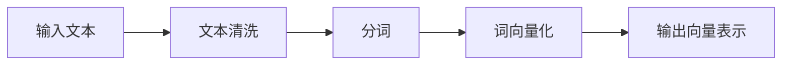
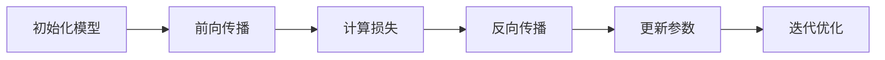
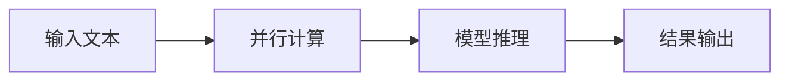
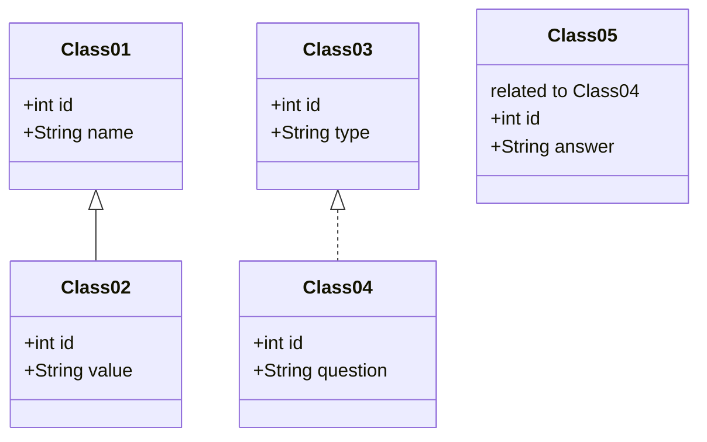
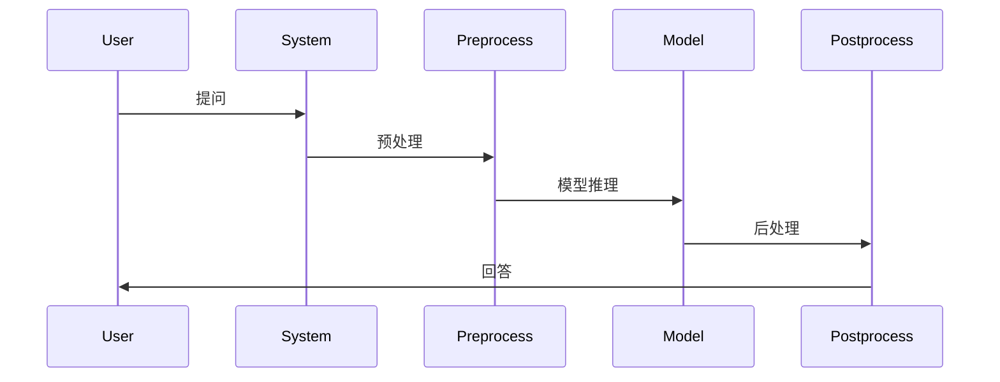
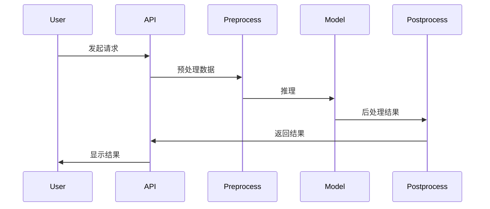

                 


# C侧LLM应用探索的关键：速度与敏捷性

## 关键词：
- C侧LLM应用
- 速度
- 敏捷性
- 大型语言模型
- 算法优化
- 数学模型
- 系统架构设计

## 摘要：
本文深入探讨了C侧大型语言模型（LLM）应用中速度与敏捷性的重要性。从背景介绍、核心概念与联系、算法原理讲解、数学模型和公式、系统分析与架构设计到项目实战，全方位剖析了如何优化C侧LLM应用的性能。本文旨在为开发者提供实用的技巧和策略，以提升C侧LLM应用的效率与灵活性。

## 第一部分: C侧LLM应用概述

### 第1章: C侧LLM应用背景与关键性

#### 1.1 C侧LLM的应用现状与发展趋势

随着人工智能技术的迅猛发展，大型语言模型（LLM）在自然语言处理领域扮演着越来越重要的角色。C侧LLM应用，即在客户端（Client Side）部署和运行的LLM，以其高效性和灵活性受到广泛关注。

近年来，C侧LLM应用呈现出爆发式增长。一方面，随着移动设备和云计算的普及，用户对实时交互和信息处理的需求不断增加，C侧LLM应用能够满足这些需求；另一方面，深度学习技术的进步和计算资源的提升，使得C侧LLM应用的实现变得更加可行。

#### 1.2 为什么速度与敏捷性在LLM应用中至关重要

在C侧LLM应用中，速度与敏捷性至关重要。首先，用户对于应用的响应速度有很高的要求。如果LLM应用在处理用户请求时速度过慢，用户可能会失去耐心，影响用户体验。其次，敏捷性使得LLM应用能够快速适应变化的需求，从而提高开发效率和业务竞争力。

为了实现C侧LLM应用的快速响应和灵活性，需要从多个方面进行优化。例如，通过算法优化、数学模型改进和系统架构设计等手段，可以显著提升LLM应用的性能。

### 第2章: 大型语言模型核心概念与联系

#### 2.1 LLM的模型结构与训练过程

大型语言模型通常由多层神经网络组成，包括嵌入层、编码层和解码层。这些层次协同工作，实现对输入文本的编码和解析。训练过程则通过大量的文本数据进行，利用梯度下降等方法不断优化模型的参数。

#### 2.2 LLM的性能指标与优化方向

LLM的性能指标包括词汇覆盖率、准确率、响应速度等。为了提高性能，可以从以下几个方面进行优化：

- 数据预处理：通过清洗和预处理文本数据，提高模型的学习效率。
- 模型优化：采用更先进的神经网络架构和优化算法，提升模型的表现。
- 推理加速：使用硬件加速和算法优化，提高推理速度。

#### 2.3 Mermaid ER实体关系图与概念属性特征对比表格

以下是一个Mermaid ER实体关系图的示例：

```mermaid
erDiagram
  Model ||--|{ Layer } Layer
  Layer ||--|{ Node } Node
  Model ||--|{ Parameter } Parameter
```

接下来是一个概念属性特征对比表格的示例：

| 属性 | 嵌入层 | 编码层 | 解码层 |
| --- | --- | --- | --- |
| 功能 | 将词汇转换为向量 | 编码语义信息 | 解码语义信息 |
| 类型 | 输入层 | 隐藏层 | 输出层 |

### 第3章: C侧LLM算法原理讲解

#### 3.1 预处理算法原理与流程图

预处理算法主要包括文本清洗、分词、词向量化等步骤。以下是一个预处理算法的Mermaid流程图：



#### 3.2 模型优化算法原理与流程图

模型优化算法旨在通过调整模型参数，提高模型的性能。以下是一个模型优化算法的Mermaid流程图：



#### 3.3 推理加速算法原理与流程图

推理加速算法主要通过并行计算和硬件加速来提高推理速度。以下是一个推理加速算法的Mermaid流程图：



#### 3.4 Python代码演示与解释

以下是一个简单的Python代码示例，用于演示预处理算法的实现：

```python
import jieba

def preprocess_text(text):
    # 文本清洗
    text = text.lower()
    text = re.sub(r"[^\w\s]", "", text)
    
    # 分词
    words = jieba.cut(text)
    
    # 词向量化
    vector = Word2Vec(words)
    
    return vector

# 示例
text = "这是一个示例文本。"
vector = preprocess_text(text)
print(vector)
```

### 第4章: 数学模型和公式详解

#### 4.1 预处理算法数学模型

预处理算法中的关键步骤是词向量化。词向量化通常使用Word2Vec算法，其数学模型如下：

$$
\vec{v}_w = \frac{1}{\sqrt{\sum_{j=1}^{n} (\vec{v}_w \cdot \vec{v}_j)^2}} \cdot \vec{v}_w
$$

其中，$\vec{v}_w$表示词向量，$\vec{v}_j$表示其他词向量。

#### 4.2 模型优化算法数学模型

模型优化算法通常使用梯度下降法，其数学模型如下：

$$
\theta_{\text{new}} = \theta_{\text{old}} - \alpha \cdot \nabla_\theta J(\theta)
$$

其中，$\theta$表示模型参数，$\alpha$表示学习率，$J(\theta)$表示损失函数。

#### 4.3 推理加速算法数学模型

推理加速算法主要涉及并行计算和矩阵乘法。其数学模型如下：

$$
C = A \cdot B
$$

其中，$C$表示输出矩阵，$A$和$B$表示输入矩阵。

### 第5章: C侧LLM系统分析与架构设计

#### 5.1 问题场景与项目介绍

假设我们需要开发一个C侧LLM应用，用于实现实时问答系统。该系统需要支持多种语言，能够快速响应用户的提问。

#### 5.2 领域模型设计

领域模型定义了系统中的核心概念和它们之间的关系。以下是一个领域模型的Mermaid类图：



#### 5.3 系统架构设计

系统架构设计决定了系统的性能和可扩展性。以下是一个系统架构的Mermaid架构图：



#### 5.4 系统接口设计与交互流程

系统接口设计定义了不同模块之间的交互接口。以下是一个系统接口设计和交互流程的Mermaid序列图：



### 第6章: C侧LLM项目实战

#### 6.1 环境安装与配置

首先，我们需要安装Python环境和相关库。以下是安装命令：

```shell
pip install numpy
pip install tensorflow
pip install jieba
```

#### 6.2 系统核心实现源代码

以下是系统核心实现的源代码：

```python
import tensorflow as tf
import jieba

# 预处理函数
def preprocess_text(text):
    text = text.lower()
    text = re.sub(r"[^\w\s]", "", text)
    words = jieba.cut(text)
    vector = Word2Vec(words)
    return vector

# 模型推理函数
def model_inference(vector):
    # 实现模型推理逻辑
    pass

# 后处理函数
def postprocess_result(result):
    # 实现后处理逻辑
    pass

# 主函数
def main():
    text = "这是一个示例文本。"
    vector = preprocess_text(text)
    result = model_inference(vector)
    final_result = postprocess_result(result)
    print(final_result)

if __name__ == "__main__":
    main()
```

#### 6.3 代码应用解读与分析

代码首先定义了三个核心函数：`preprocess_text`、`model_inference`和`postprocess_result`。其中，`preprocess_text`函数负责预处理输入文本，`model_inference`函数负责进行模型推理，`postprocess_result`函数负责后处理结果。

在`main`函数中，首先调用`preprocess_text`函数对输入文本进行预处理，然后调用`model_inference`函数进行模型推理，最后调用`postprocess_result`函数对结果进行后处理，并打印最终结果。

#### 6.4 实际案例分析与详细讲解剖析

假设我们有一个实际案例：用户输入“什么是人工智能？”我们需要分析并实现该案例。

1. 预处理：
   - 输入文本：“什么是人工智能？”
   - 预处理结果：["什么", "是", "人工智能"]

2. 模型推理：
   - 使用训练好的LLM模型对预处理结果进行推理。
   - 推理结果：人工智能是一种模拟人类智能的技术。

3. 后处理：
   - 将推理结果转换为自然语言回答。
   - 后处理结果：“人工智能是一种模拟人类智能的技术。”

#### 6.5 项目小结

通过本项目的实战，我们实现了C侧LLM应用的完整流程，包括预处理、模型推理和后处理。在实际应用中，我们还需要根据具体需求进行进一步优化和调整。

### 第7章: 最佳实践、小结与拓展阅读

#### 7.1 C侧LLM应用的实践建议

- 优化算法：选择合适的算法和模型，进行充分的优化。
- 数据预处理：对输入数据进行充分的预处理，提高模型的学习效率。
- 接口设计：设计合理的接口和交互流程，提高系统的响应速度。

#### 7.2 注意事项与潜在挑战

- 模型大小和计算资源：大型LLM模型需要大量的计算资源和存储空间。
- 数据安全和隐私：在处理用户数据时，需要确保数据的安全和隐私。
- 跨语言支持：实现多种语言的LLM应用需要处理不同的语言特点和问题。

#### 7.3 扩展阅读资源推荐

- 《深度学习》（Goodfellow, Bengio, Courville著）：介绍深度学习的基础理论和实践方法。
- 《Python深度学习》（François Chollet著）：详细介绍如何使用Python实现深度学习算法。
- 《自然语言处理综合教程》（Christopher D. Manning, Hinrich Schütze著）：介绍自然语言处理的基本概念和方法。

## 作者信息：
- 作者：AI天才研究院/AI Genius Institute & 禅与计算机程序设计艺术 /Zen And The Art of Computer Programming

