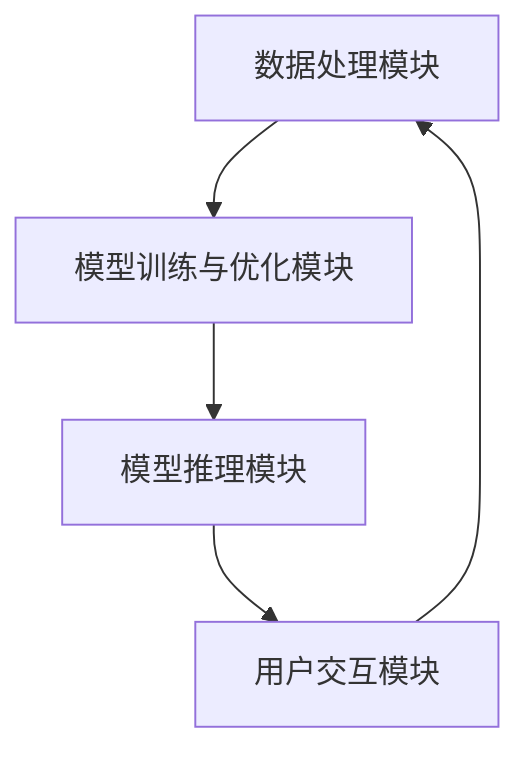

                 

### 第一部分: C侧LLM应用探索的背景

#### 第1章: C侧LLM应用概述

##### 1.1.1 C侧LLM的概念与分类

C侧LLM（Client-Side Large Language Model）是指部署在客户端设备上的大型语言模型。这类模型通过在客户端直接处理用户输入，能够提供实时响应，降低对网络带宽的依赖。与服务器端模型不同，C侧LLM不需要将用户数据上传至服务器进行处理，从而在保护用户隐私方面具有显著优势。

C侧LLM可以按照不同的维度进行分类。首先，根据模型架构，C侧LLM可以分为基于传统机器学习的模型和基于深度学习的模型。传统机器学习模型如统计语言模型、规则匹配模型等，虽然计算效率较高，但在处理复杂语言任务时表现较差。而基于深度学习的模型，如循环神经网络（RNN）、Transformer等，通过大规模的数据训练，能够实现高度智能化的文本处理能力。

其次，根据模型训练方式，C侧LLM可以分为有监督模型、无监督模型和半监督模型。有监督模型需要大量的标注数据来训练，虽然性能较好，但数据获取成本高。无监督模型则通过无监督学习算法，从大量未标注的数据中学习模型参数，具有较好的鲁棒性。半监督模型结合了有监督和无监督模型的优点，能够在有限的标注数据下获得较好的性能。

##### 1.1.2 C侧LLM在人工智能中的角色与意义

C侧LLM在人工智能领域扮演着重要角色，其意义主要体现在以下几个方面：

1. **提升用户体验**：通过在客户端直接处理用户输入，C侧LLM能够实现实时响应，大幅提高用户交互体验。这对于需要快速响应的场景，如智能客服、实时翻译等，尤为重要。

2. **降低网络负担**：传统的服务器端模型需要将用户数据上传至服务器进行处理，这不仅消耗大量网络带宽，还可能导致服务器负担过重。C侧LLM将计算任务转移到客户端，显著降低了网络负担，提高了系统的整体性能。

3. **增强隐私保护**：C侧LLM在客户端直接处理用户数据，避免了数据传输过程中的安全隐患，有助于保护用户隐私。这对于那些涉及敏感信息处理的应用场景，如金融、医疗等，具有至关重要的意义。

4. **支持离线应用**：在某些网络环境较差或无网络连接的场景下，C侧LLM仍然能够运行，提供基本的文本处理功能。这为离线应用提供了可能性，如移动设备上的语音助手、本地搜索引擎等。

##### 1.1.3 C侧LLM应用的发展趋势

随着人工智能技术的不断进步，C侧LLM应用正呈现出迅猛发展的趋势。以下是一些关键的发展方向：

1. **模型压缩与优化**：为了适应客户端设备的计算和存储限制，模型压缩与优化技术成为研究热点。通过剪枝、量化、知识蒸馏等方法，可以显著减小模型的规模，提高模型的计算效率。

2. **端到端学习**：传统的机器学习模型通常需要多个模块协同工作，而端到端学习通过直接将输入映射到输出，减少了中间步骤，提高了模型的效率和准确性。端到端学习方法在C侧LLM中的应用有望进一步提升模型性能。

3. **多模态融合**：随着多模态数据的广泛应用，如何有效地融合不同模态的数据成为研究重点。C侧LLM通过整合文本、语音、图像等多种数据源，可以实现更丰富的应用场景，如多模态对话系统、智能推荐等。

4. **自适应学习**：C侧LLM在客户端运行，能够根据用户行为和需求进行自适应学习，不断提高模型性能。自适应学习方法的研究将为C侧LLM的个性化应用提供重要支持。

5. **边缘计算与云计算结合**：边缘计算与云计算的结合将为C侧LLM提供更灵活、高效的处理能力。通过在边缘设备上部署部分模型，可以实现更快速的数据处理和更低的延迟，同时利用云计算的资源优势，实现大规模模型的训练和优化。

总之，C侧LLM应用具有广泛的前景，随着技术的不断进步，其将在人工智能领域发挥越来越重要的作用。

#### 第2章: C侧LLM技术基础

##### 2.1.1 机器学习基础

机器学习（Machine Learning，ML）是人工智能（Artificial Intelligence，AI）的核心技术之一，旨在使计算机能够通过数据学习并做出决策。机器学习的基础包括几个核心概念，如数据集、模型、训练过程和评估方法。

**数据集（Dataset）**：数据集是机器学习的基础，它包含了用于训练模型的输入数据和相应的标签。输入数据通常是一个或多个特征向量，而标签则是模型的输出。数据集的质量直接影响模型的性能，因此数据预处理和清洗是至关重要的步骤。

**模型（Model）**：模型是机器学习算法的核心，它通过学习数据集的特征，生成预测函数。常见的模型包括线性回归模型、决策树、支持向量机（SVM）和神经网络等。每个模型都有其特定的数学基础和适用场景。

**训练过程（Training Process）**：训练过程是机器学习模型学习数据的过程。它通常包括前向传播（Forward Propagation）和反向传播（Backpropagation）两个主要步骤。在前向传播中，模型根据输入数据计算输出；在反向传播中，模型通过比较输出和实际标签，计算误差并更新模型参数。

**评估方法（Evaluation Metrics）**：评估方法是衡量模型性能的标准。常见的评估方法包括准确率（Accuracy）、精确率（Precision）、召回率（Recall）和F1分数（F1 Score）等。选择合适的评估方法有助于更准确地评估模型性能。

**核心算法**：

1. **线性回归（Linear Regression）**：线性回归是一种简单但有效的预测模型，它通过线性函数拟合数据点，预测目标值。线性回归的数学基础是线性方程：$$y = \beta_0 + \beta_1 \cdot x$$，其中$\beta_0$和$\beta_1$是模型参数，$x$和$y$是输入和输出。

2. **决策树（Decision Tree）**：决策树是一种基于树形结构的分类算法，它通过一系列的判断条件，将数据划分为不同的类别。决策树的数学基础是条件概率和熵（Entropy）等概念。决策树的构建过程包括特征选择、节点划分和树剪枝等步骤。

3. **支持向量机（Support Vector Machine，SVM）**：SVM是一种优秀的分类算法，它通过最大化分类边界，将数据分为不同的类别。SVM的数学基础是核函数（Kernel Function）和优化问题。SVM的目标是最小化分类边界到支持向量的距离。

4. **神经网络（Neural Network）**：神经网络是一种模拟人脑神经元的计算模型，它通过多层非线性变换，实现复杂的函数逼近。神经网络的核心是激活函数（Activation Function）和反向传播算法。

**Python代码示例**：

以下是一个简单的线性回归模型实现的Python代码示例：

```python
import numpy as np

# 初始化模型参数
theta = np.array([0, 0])

# 定义损失函数
def loss_function(x, y, theta):
    return ((y - (theta[0] + theta[1] * x))**2).mean()

# 训练模型
def train_model(x, y, theta, alpha, epochs):
    for _ in range(epochs):
        y_pred = theta[0] + theta[1] * x
        error = y - y_pred
        theta[0] -= alpha * error.mean()
        theta[1] -= alpha * (error * x).mean()

# 导入数据
x = np.array([1, 2, 3, 4, 5])
y = np.array([2, 4, 5, 4, 5])

# 训练模型
train_model(x, y, theta, 0.01, 1000)

# 输出模型参数
print(f"Model parameters: {theta}")
```

通过上述代码，我们可以看到线性回归模型的简单实现过程，包括模型初始化、损失函数定义、模型训练和输出模型参数等步骤。

##### 2.1.2 深度学习基础

深度学习（Deep Learning，DL）是机器学习的一个重要分支，它通过多层神经网络（Neural Networks）对数据进行自动特征提取和模式识别。深度学习的基础包括神经网络的结构、激活函数、优化算法和训练过程。

**神经网络结构**：

神经网络由多个层次组成，包括输入层、隐藏层和输出层。每个层次包含多个神经元（Node），神经元之间通过权重（Weight）连接。神经网络的层次结构使得它能够对输入数据进行多次非线性变换，从而提取出更高层次的特征。

**激活函数**：

激活函数（Activation Function）是神经网络中的一个关键组件，它用于引入非线性特性。常见的激活函数包括：

1. **Sigmoid函数**：$$f(x) = \frac{1}{1 + e^{-x}}$$
2. **ReLU函数**：$$f(x) = max(0, x)$$
3. **Tanh函数**：$$f(x) = \frac{e^x - e^{-x}}{e^x + e^{-x}}$$

**优化算法**：

优化算法用于训练神经网络，以最小化损失函数。常用的优化算法包括：

1. **随机梯度下降（Stochastic Gradient Descent，SGD）**：$$\theta = \theta - \alpha \cdot \nabla_\theta J(\theta)$$
2. **批量梯度下降（Batch Gradient Descent，BGD）**：$$\theta = \theta - \alpha \cdot \nabla_\theta J(\theta)$$
3. **Adam优化器**：$$m = \beta_1 \cdot m + (1 - \beta_1) \cdot \nabla_\theta J(\theta)$$
$$v = \beta_2 \cdot v + (1 - \beta_2) \cdot (\nabla_\theta J(\theta))^2$$
$$\theta = \theta - \alpha \cdot \frac{m}{\sqrt{1 - \beta_2^t} + \epsilon}$$

**训练过程**：

深度学习的训练过程包括以下几个步骤：

1. **前向传播（Forward Propagation）**：将输入数据传递到神经网络的每一层，计算每一层的输出。
2. **损失函数计算（Loss Function Calculation）**：计算输出与实际标签之间的损失。
3. **反向传播（Back Propagation）**：计算损失函数关于模型参数的梯度，并更新模型参数。
4. **迭代优化（Iteration Optimization）**：重复前向传播和反向传播，直至达到预设的损失阈值或达到最大迭代次数。

**核心算法**：

1. **卷积神经网络（Convolutional Neural Network，CNN）**：CNN通过卷积层（Convolutional Layer）、池化层（Pooling Layer）和全连接层（Fully Connected Layer）对图像数据进行特征提取。CNN在图像识别、物体检测和图像生成等领域具有广泛应用。

2. **循环神经网络（Recurrent Neural Network，RNN）**：RNN通过循环结构处理序列数据，能够记住之前的信息。RNN在自然语言处理、语音识别和时间序列预测等领域表现出色。

3. **Transformer模型**：Transformer模型通过自注意力机制（Self-Attention Mechanism）处理序列数据，解决了RNN在长序列处理中的梯度消失问题。Transformer模型在机器翻译、文本生成和对话系统等领域取得了显著成果。

**Python代码示例**：

以下是一个简单的多层感知机（MLP）实现的Python代码示例：

```python
import numpy as np

# 初始化模型参数
weights1 = np.random.rand(2, 1)
weights2 = np.random.rand(1, 1)
bias1 = np.random.rand(1)
bias2 = np.random.rand(1)

# 定义激活函数
def sigmoid(x):
    return 1 / (1 + np.exp(-x))

# 定义损失函数
def mse(y_true, y_pred):
    return ((y_true - y_pred)**2).mean()

# 前向传播
def forward(x):
    hidden_layer = sigmoid(np.dot(x, weights1) + bias1)
    output_layer = sigmoid(np.dot(hidden_layer, weights2) + bias2)
    return output_layer

# 训练模型
def train(x, y, epochs, alpha):
    for _ in range(epochs):
        y_pred = forward(x)
        loss = mse(y, y_pred)
        hidden_layer_error = (y_pred - y) * sigmoid_derivative(y_pred)
        output_layer_error = (y_pred - y) * sigmoid_derivative(y_pred)

        weights2 -= alpha * (hidden_layer_error.dot(x.T))
        bias2 -= alpha * hidden_layer_error.sum()
        
        weights1 -= alpha * (output_layer_error.dot(hidden_layer.T))
        bias1 -= alpha * output_layer_error.sum()

# 导入数据
x = np.array([[0], [1]])
y = np.array([[0], [1]])

# 训练模型
train(x, y, 1000, 0.1)

# 输出模型参数
print(f"Model parameters: {weights1}, {weights2}, {bias1}, {bias2}")

# 输出预测结果
print(f"Predictions: {forward(np.array([[0]]))}, {forward(np.array([[1]]))}")
```

通过上述代码，我们可以看到多层感知机的简单实现过程，包括模型初始化、激活函数定义、损失函数定义、前向传播、反向传播和模型训练等步骤。

##### 2.1.3 自然语言处理基础

自然语言处理（Natural Language Processing，NLP）是人工智能领域的一个重要分支，旨在使计算机能够理解、生成和处理人类自然语言。NLP的基础包括文本预处理、词向量表示、语言模型和序列模型。

**文本预处理**：

文本预处理是NLP的基础步骤，包括分词（Tokenization）、去停用词（Stopword Removal）、词形还原（Lemmatization）和文本规范化（Text Normalization）等。这些步骤有助于将原始文本转换为适合机器学习的形式。

**词向量表示**：

词向量（Word Embedding）是将词汇映射到向量空间的方法，用于表示单词的语义信息。常见的词向量模型包括：

1. **词袋模型（Bag-of-Words，BoW）**：词袋模型将文本表示为一个向量集合，每个向量表示一个单词的频率。虽然词袋模型计算简单，但不能捕捉词序信息。

2. **Word2Vec模型**：Word2Vec模型通过神经网络学习单词的向量表示，能够捕捉词序信息。Word2Vec模型包括连续词袋（Continuous Bag-of-Words，CBOW）和Skip-Gram两种架构。

3. **GloVe模型**：GloVe模型通过全局矩阵分解学习单词的向量表示，能够捕捉词频和词序信息。

**语言模型**：

语言模型（Language Model，LM）是用于预测下一个单词或词组的概率模型。语言模型在文本生成、语音识别和机器翻译等领域具有广泛应用。常见的语言模型包括：

1. **N元语法模型（N-Gram Model）**：N元语法模型通过统计相邻N个单词的出现频率来预测下一个单词。

2. **神经网络语言模型（Neural Network Language Model，NNLM）**：NNLM通过神经网络学习单词序列的概率分布，能够捕捉更复杂的语言规律。

**序列模型**：

序列模型（Sequential Model）是用于处理序列数据（如文本、语音）的模型，包括循环神经网络（Recurrent Neural Network，RNN）和Transformer模型。

1. **循环神经网络（RNN）**：RNN通过循环结构处理序列数据，能够记住之前的信息。RNN在语言模型、机器翻译和语音识别等领域表现出色。

2. **Transformer模型**：Transformer模型通过自注意力机制（Self-Attention Mechanism）处理序列数据，解决了RNN在长序列处理中的梯度消失问题。Transformer模型在机器翻译、文本生成和对话系统等领域取得了显著成果。

**Python代码示例**：

以下是一个简单的RNN语言模型实现的Python代码示例：

```python
import numpy as np
import tensorflow as tf

# 定义RNN模型
class RNNModel(tf.keras.Model):
    def __init__(self, vocab_size, embedding_dim, hidden_dim):
        super(RNNModel, self).__init__()
        self.embedding = tf.keras.layers.Embedding(vocab_size, embedding_dim)
        self.rnn = tf.keras.layers.LSTM(hidden_dim, return_sequences=True)
        self.dense = tf.keras.layers.Dense(vocab_size)
    
    def call(self, inputs, training=False):
        x = self.embedding(inputs)
        x = self.rnn(x, training=training)
        x = self.dense(x)
        return x

# 导入数据
x_train = np.array([[0, 1, 2], [1, 2, 0]])
y_train = np.array([[2], [0]])

# 初始化模型参数
vocab_size = 3
embedding_dim = 5
hidden_dim = 10

# 创建模型
model = RNNModel(vocab_size, embedding_dim, hidden_dim)

# 编译模型
model.compile(optimizer='adam', loss='mse')

# 训练模型
model.fit(x_train, y_train, epochs=10)

# 输出模型参数
print(model.trainable_variables)
```

通过上述代码，我们可以看到RNN语言模型的简单实现过程，包括模型初始化、模型编译和模型训练等步骤。

##### 2.1.4 C侧LLM在客户端设备的部署与优化

C侧LLM在客户端设备上的部署与优化是确保其高效运行的关键。由于客户端设备通常具有有限的计算资源和存储空间，我们需要采取一系列优化措施，以确保C侧LLM的性能和响应速度。

**部署与优化策略**：

1. **模型压缩与量化**：

   模型压缩与量化是减少模型体积和计算复杂度的重要方法。通过剪枝（Pruning）、量化（Quantization）和知识蒸馏（Knowledge Distillation）等技术，可以将大型模型压缩为更小的模型，同时保持较高的性能。具体方法包括：

   - **剪枝**：通过删除模型中的冗余权重和神经元，减少模型体积。剪枝可以基于模型的梯度信息，选择性地保留对模型性能贡献较大的权重。
   - **量化**：将模型的权重和激活值从浮点数转换为低比特宽度的整数，降低计算复杂度和内存占用。量化可以通过量化和反量化操作实现。
   - **知识蒸馏**：使用一个较大的教师模型训练一个较小的学生模型，将教师模型的知识传递给学生模型。知识蒸馏通过软目标（Soft Targets）和蒸馏损失（Dissipation Loss）实现。

2. **内存优化**：

   内存优化是提高C侧LLM运行效率的关键。由于客户端设备的内存有限，我们需要采取措施减少内存占用。具体方法包括：

   - **内存映射**：将模型和数据存储在内存映射文件中，避免频繁的磁盘读写操作。
   - **分块处理**：将输入数据分成较小的块，逐块处理，减少内存占用。
   - **共享内存**：在多个模型实例之间共享内存，减少总内存需求。

3. **计算优化**：

   计算优化是提高C侧LLM运行速度的关键。由于客户端设备的计算资源有限，我们需要采取措施减少计算复杂度和提高计算效率。具体方法包括：

   - **矩阵分解**：通过矩阵分解（如奇异值分解SVD）将大型矩阵分解为较小的矩阵，减少计算复杂度。
   - **并行计算**：利用多核CPU和GPU进行并行计算，提高计算效率。并行计算可以通过多线程、并行矩阵运算和CUDA等实现。
   - **指令调度**：优化指令调度，减少指令流水线冲突，提高指令执行效率。

4. **动态调整**：

   动态调整是根据设备性能和负载动态调整模型参数和计算资源。具体方法包括：

   - **自适应调整**：根据设备性能和负载动态调整模型复杂度、计算资源和训练批次大小，以优化性能和响应速度。
   - **动态分区**：根据设备内存容量动态调整模型和数据的内存分配，避免内存溢出。
   - **能耗优化**：根据设备能耗限制调整模型和算法的复杂度，降低能耗。

**案例研究**：

以下是一个C侧LLM在客户端设备上的部署与优化案例：

**应用场景**：智能语音助手

**设备**：智能手机

**挑战**：

- **计算资源限制**：智能手机的计算资源相对有限，需要优化模型和算法，以适应有限的计算资源。
- **内存占用限制**：智能手机的内存容量有限，需要采取内存优化措施，以避免内存溢出。
- **能耗限制**：智能手机的电池续航能力有限，需要降低模型和算法的能耗，以延长电池使用时间。

**解决方案**：

1. **模型压缩与量化**：

   - **剪枝**：通过分析模型权重和梯度信息，对大型语言模型进行剪枝，保留重要的权重和神经元。
   - **量化**：将模型的权重和激活值从32位浮点数转换为8位整数，减少计算复杂度和内存占用。
   - **知识蒸馏**：使用一个较大的教师模型训练一个较小的学生模型，将教师模型的知识传递给学生模型。

2. **内存优化**：

   - **内存映射**：使用内存映射技术将模型和数据存储在内存映射文件中，避免频繁的磁盘读写操作。
   - **分块处理**：将输入语音数据分成较小的块，逐块处理，减少内存占用。
   - **共享内存**：在多个模型实例之间共享内存，减少总内存需求。

3. **计算优化**：

   - **矩阵分解**：通过矩阵分解将大型矩阵分解为较小的矩阵，减少计算复杂度。
   - **并行计算**：利用多核CPU和GPU进行并行计算，提高计算效率。
   - **指令调度**：优化指令调度，减少指令流水线冲突，提高指令执行效率。

4. **动态调整**：

   - **自适应调整**：根据设备性能和负载动态调整模型复杂度、计算资源和训练批次大小，以优化性能和响应速度。
   - **动态分区**：根据设备内存容量动态调整模型和数据的内存分配，避免内存溢出。
   - **能耗优化**：根据设备能耗限制调整模型和算法的复杂度，降低能耗。

**结果**：

通过上述部署与优化措施，智能语音助手在智能手机上的运行速度和响应速度显著提高，同时在有限的计算资源和内存占用下保持了较高的性能和准确性。

**结论**：

C侧LLM在客户端设备的部署与优化是一个复杂的过程，需要综合考虑模型压缩、内存优化、计算优化和动态调整等方面。通过合理的部署与优化策略，可以实现C侧LLM在客户端设备上的高效运行，为用户提供更好的用户体验。

#### 第3章: C侧LLM架构设计

##### 3.1.1 C侧LLM系统架构概述

C侧LLM（Client-Side Large Language Model）系统架构设计是确保模型在客户端设备上高效、可靠运行的关键。C侧LLM系统架构通常包括以下几个核心模块：数据处理模块、模型训练与优化模块、模型推理模块和用户交互模块。以下是对这些模块的详细介绍和相互关系的分析。

**数据处理模块**：

数据处理模块负责接收用户输入，对输入文本进行预处理，包括分词、去停用词、词形还原等操作。预处理后的文本数据将被传递给模型进行训练和推理。在C侧LLM中，数据处理模块通常采用高效且轻量的算法，以确保在有限的设备资源下快速处理大量文本数据。

**模型训练与优化模块**：

模型训练与优化模块负责训练和优化LLM模型。由于客户端设备通常具有有限的计算资源，模型训练通常采用批处理和增量训练策略，以提高训练效率。优化算法如随机梯度下降（SGD）和Adam等，被用来更新模型参数，以最小化损失函数。此外，模型优化还包括剪枝、量化等技术，以减小模型体积和计算复杂度。

**模型推理模块**：

模型推理模块负责在训练好的模型上进行预测。在C侧LLM中，模型推理通常采用动态内存分配和并行计算技术，以提高推理速度。模型推理模块还负责处理模型输出，如文本生成、翻译、问答等，并将其呈现给用户。

**用户交互模块**：

用户交互模块负责与用户进行交互，接收用户输入，将模型推理结果呈现给用户，并处理用户的反馈。用户交互模块通常包括用户界面（UI）和前端逻辑，以确保用户能够方便、直观地与C侧LLM进行交互。

**模块之间的关系**：

数据处理模块和模型训练与优化模块相互依赖。数据处理模块生成训练数据，模型训练与优化模块使用这些数据进行模型训练和优化。模型推理模块和用户交互模块则依赖于训练好的模型，用于生成预测结果和与用户进行交互。

**C侧LLM架构图**：

以下是一个简化的C侧LLM架构图，展示了各个模块之间的关系：



在这个架构图中，数据处理模块生成训练数据并传递给模型训练与优化模块，训练好的模型被用于模型推理模块，最终生成预测结果并通过用户交互模块呈现给用户。用户反馈可以被回传到数据处理模块，用于进一步优化模型。

##### 3.1.2 数据处理模块设计

数据处理模块是C侧LLM系统架构中的核心组件，其设计直接影响到整个系统的性能和用户体验。以下是对数据处理模块设计的关键步骤和注意事项的详细探讨。

**数据处理流程**：

数据处理模块的主要任务是对用户输入的文本进行预处理，以生成适合模型训练和推理的数据。数据处理流程通常包括以下几个步骤：

1. **文本接收**：接收用户的文本输入，可以是键盘输入、语音输入或其他形式的文本。
2. **分词**：将接收到的文本分割成单词或子词。分词算法可以是基于词典的分词算法，如哈工大分词、NLTK等，也可以是基于统计的算法，如Jieba等。
3. **去停用词**：去除文本中的停用词，如“的”、“和”、“是”等，这些词通常对文本理解没有太大贡献，但会增加计算负担。
4. **词形还原**：将不同形式的单词统一为同一种形式，如将“playing”还原为“play”。
5. **文本规范化**：将文本转换为统一的格式，如小写、去除特殊字符等。
6. **特征提取**：将预处理后的文本转换为模型可处理的特征向量。特征提取方法可以是词袋模型（BoW）、词嵌入（Word Embedding）等。

**模块设计要点**：

1. **轻量级算法**：由于客户端设备的计算资源有限，数据处理模块应采用轻量级的算法，如简化的分词算法、快速的词嵌入方法等，以减少计算复杂度。
2. **内存管理**：数据处理过程中会产生大量中间数据，需要有效地进行内存管理，避免内存溢出。可以使用内存映射（Memory Mapping）和分块处理（Chunk Processing）等方法。
3. **并行处理**：利用客户端设备的多核CPU或GPU进行并行处理，以提高数据处理速度。并行处理可以通过多线程、异步IO等技术实现。
4. **缓存机制**：为常见的数据处理结果设置缓存，如词表、预处理的文本等，以减少重复计算，提高处理速度。
5. **错误处理**：设计合理的错误处理机制，如处理无效输入、网络错误等，以确保数据处理模块的稳定运行。

**数据预处理示例**：

以下是一个简单的数据处理模块示例，使用Python和NLTK库进行文本预处理：

```python
import nltk
from nltk.corpus import stopwords
from nltk.tokenize import word_tokenize

# 载入停用词
nltk.download('stopwords')
nltk.download('punkt')
stop_words = set(stopwords.words('english'))

# 定义数据处理函数
def preprocess_text(text):
    # 分词
    tokens = word_tokenize(text)
    # 去停用词
    tokens = [token for token in tokens if token not in stop_words]
    # 词形还原
    # tokens = [nltk.stem.WordNetLemmatizer().lemmatize(token) for token in tokens]
    # 文本规范化
    tokens = [token.lower() for token in tokens]
    return tokens

# 示例文本
text = "The quick brown fox jumps over the lazy dog."

# 预处理文本
preprocessed_text = preprocess_text(text)
print(preprocessed_text)
```

在这个示例中，我们使用了NLTK库进行文本的分词、去停用词、词形还原和文本规范化操作。通过这个简单的示例，我们可以看到数据处理模块的基本设计思路和实现方法。

##### 3.1.3 模型训练与优化模块设计

模型训练与优化模块是C侧LLM系统架构中的核心部分，其设计直接影响到模型的质量和性能。以下是对模型训练与优化模块设计的关键步骤和优化策略的详细探讨。

**训练流程**：

模型训练模块的主要任务是根据预处理的文本数据训练出高效的LLM模型。训练流程通常包括以下几个步骤：

1. **数据加载**：从数据处理模块接收预处理后的文本数据，将其转换为模型可用的格式。
2. **数据预处理**：对文本数据进行进一步处理，如序列编码、填充等，以确保数据格式统一。
3. **模型初始化**：初始化模型参数，包括权重和偏置。初始化方法可以是随机初始化、预训练模型权重等。
4. **前向传播**：将输入数据传递到模型中，通过前向传播计算输出。
5. **损失函数计算**：计算模型输出与实际标签之间的损失，常用的损失函数包括交叉熵损失（Cross-Entropy Loss）和均方误差（Mean Squared Error）等。
6. **反向传播**：根据损失函数计算模型参数的梯度，并通过梯度下降等优化算法更新模型参数。
7. **迭代优化**：重复前向传播、损失函数计算和反向传播，直到达到预设的训练轮数或损失阈值。

**模块设计要点**：

1. **轻量级模型架构**：由于客户端设备的计算资源有限，模型架构应尽量轻量化。可以选择使用简单的神经网络架构，如多层感知机（MLP）或轻量级的卷积神经网络（CNN）。
2. **优化算法选择**：选择高效的优化算法，如随机梯度下降（SGD）、Adam等，以加速模型训练。Adam优化器在C侧LLM中尤为适用，因为它可以自适应调整学习率，提高训练效率。
3. **批量大小调整**：根据设备资源情况调整批量大小。较小的批量大小可以加快训练速度，但可能导致模型性能下降。适当选择批量大小，可以在训练速度和性能之间找到平衡。
4. **数据增强**：通过数据增强技术（如数据清洗、噪声添加等）增加训练数据的多样性，有助于提高模型泛化能力。
5. **模型压缩与量化**：在训练完成后，可以通过模型压缩和量化技术减小模型体积和计算复杂度，以适应客户端设备的资源限制。常用的技术包括剪枝（Pruning）、量化（Quantization）和知识蒸馏（Knowledge Distillation）等。
6. **内存管理**：在模型训练过程中，需要合理管理内存，避免内存溢出。可以使用分块训练（Mini-Batch Training）和内存映射（Memory Mapping）等技术。

**训练优化策略**：

1. **动态学习率调整**：使用动态学习率调整策略，如Adam优化器的自适应学习率调整，以加快训练速度并避免过拟合。
2. **早期停止**：在模型训练过程中，设置早期停止条件，如当验证集损失不再降低时停止训练，以避免过拟合。
3. **梯度裁剪**：在训练过程中，对梯度进行裁剪，防止梯度爆炸或消失，提高模型训练稳定性。
4. **模型融合**：使用多个模型进行融合，通过投票或加权平均等方法提高模型性能和稳定性。

**示例代码**：

以下是一个简单的C侧LLM模型训练示例，使用TensorFlow和Keras库实现：

```python
import tensorflow as tf
from tensorflow.keras.models import Sequential
from tensorflow.keras.layers import Dense, Embedding, LSTM
from tensorflow.keras.optimizers import Adam

# 定义模型
model = Sequential([
    Embedding(vocab_size, embedding_dim),
    LSTM(hidden_dim, return_sequences=True),
    LSTM(hidden_dim, return_sequences=False),
    Dense(vocab_size, activation='softmax')
])

# 编译模型
model.compile(optimizer=Adam(learning_rate=0.001), loss='categorical_crossentropy', metrics=['accuracy'])

# 加载数据
# ...

# 训练模型
model.fit(x_train, y_train, epochs=10, batch_size=32, validation_split=0.1)

# 保存模型
model.save('cside_llm_model.h5')
```

在这个示例中，我们定义了一个简单的LSTM模型，使用Adam优化器进行训练。通过适当的调整参数和优化策略，可以实现更高效的模型训练。

#### 第4章: C侧LLM应用案例分析

##### 4.1.1 案例一：智能客服系统

智能客服系统是一种利用C侧LLM技术实现的智能客服解决方案，旨在通过自动化对话提升客户服务质量和效率。本案例将详细分析智能客服系统的构建过程、技术实现和实际应用效果。

**构建过程**：

1. **需求分析**：在项目启动阶段，首先与客户沟通，了解其业务需求和用户痛点，明确智能客服系统的目标功能，如自动回复常见问题、提供个性化建议等。
2. **数据收集**：收集与客户业务相关的历史对话记录、FAQ（常见问题与答案）、用户行为数据等。数据收集过程中，需确保数据的隐私和安全。
3. **数据处理**：对收集到的数据进行分析和处理，包括文本清洗、分词、去停用词、词形还原等，以生成适合训练的数据集。
4. **模型训练**：使用C侧LLM技术，训练出能够处理文本输入并生成相应回复的模型。模型训练过程中，可以采用有监督学习、无监督学习或半监督学习等方法。
5. **系统集成**：将训练好的模型集成到客户现有的客户服务平台中，实现自动回复和交互功能。
6. **测试与优化**：在实际应用中，对系统进行测试和优化，根据用户反馈不断调整和改进模型。

**技术实现**：

1. **文本预处理**：使用NLP技术对用户输入进行预处理，包括分词、去停用词、词形还原等。预处理后的文本将被转换为模型可处理的特征向量。
2. **模型选择**：根据应用需求，选择合适的C侧LLM模型，如基于Transformer的BERT模型或基于RNN的LSTM模型。模型的选择应考虑计算资源、模型性能和训练时间等因素。
3. **训练与优化**：使用预处理后的数据对模型进行训练和优化。训练过程中，可以采用数据增强、迁移学习等技术提高模型性能。模型优化包括调整学习率、批量大小、优化器等参数。
4. **实时交互**：智能客服系统需实现实时交互功能，包括接收用户输入、生成回复、发送回复等。在客户端设备上，可以采用WebSocket等技术实现实时通信。

**实际应用效果**：

1. **提高服务质量**：智能客服系统可以快速响应用户请求，提供准确、个性化的回复，提高客户满意度。
2. **降低人力成本**：智能客服系统可以替代人工客服处理大量常见问题，降低企业人力成本。
3. **提升运营效率**：通过自动化处理大量用户请求，智能客服系统可以提高客服部门的运营效率，节省时间和人力资源。
4. **实时反馈与优化**：智能客服系统可以根据用户反馈实时调整模型，优化服务策略，不断提升服务质量。

**案例分析总结**：

智能客服系统是C侧LLM技术在实际应用中的一种成功案例。通过自动化对话和个性化服务，智能客服系统不仅提高了客户服务质量，还降低了人力成本，提升了运营效率。在未来的发展中，智能客服系统将进一步结合大数据和人工智能技术，实现更智能、更高效的客户服务。

##### 4.1.2 案例二：内容审核系统

内容审核系统是一种利用C侧LLM技术实现的内容审核解决方案，旨在自动识别和过滤网络平台上的不良内容，维护网络环境的健康与安全。本案例将详细分析内容审核系统的构建过程、技术实现和实际应用效果。

**构建过程**：

1. **需求分析**：在项目启动阶段，与客户沟通，明确内容审核系统的目标功能，如敏感词识别、违规内容检测等。
2. **数据收集**：收集网络平台上的历史数据，包括文本、图片、视频等。数据来源可以是内部数据、外部公开数据或爬虫采集的数据。
3. **数据处理**：对收集到的数据进行分析和处理，包括文本清洗、分词、去停用词、词形还原等，以生成适合训练的数据集。
4. **模型训练**：使用C侧LLM技术，训练出能够识别和过滤不良内容的多模态模型。模型训练过程中，可以采用有监督学习、无监督学习或半监督学习等方法。
5. **系统集成**：将训练好的模型集成到客户现有的内容审核平台中，实现自动识别和过滤功能。
6. **测试与优化**：在实际应用中，对系统进行测试和优化，根据用户反馈不断调整和改进模型。

**技术实现**：

1. **文本预处理**：使用NLP技术对用户输入进行预处理，包括分词、去停用词、词形还原等。预处理后的文本将被转换为模型可处理的特征向量。
2. **模型选择**：根据应用需求，选择合适的C侧LLM模型，如基于Transformer的BERT模型或基于RNN的LSTM模型。模型的选择应考虑计算资源、模型性能和训练时间等因素。
3. **多模态处理**：内容审核系统涉及文本、图片、视频等多种数据类型，需要使用多模态处理技术，如卷积神经网络（CNN）处理图像，循环神经网络（RNN）处理文本。
4. **实时检测**：内容审核系统需实现实时检测功能，包括接收用户输入、生成检测报告、反馈检测结果等。在客户端设备上，可以采用WebSocket等技术实现实时通信。
5. **反馈机制**：内容审核系统应具备用户反馈机制，如用户申诉、管理员审核等，以便及时调整和优化模型。

**实际应用效果**：

1. **提高审核效率**：内容审核系统可以快速识别和过滤不良内容，提高审核效率，减轻人工审核负担。
2. **降低违规风险**：通过自动识别和过滤不良内容，内容审核系统可以有效降低网络平台违规风险，维护网络环境的安全与稳定。
3. **增强用户体验**：内容审核系统可以减少不良内容的传播，提高用户的使用体验，增强用户对平台的信任。
4. **实时调整**：内容审核系统可以根据用户反馈和审核数据，实时调整和优化模型，提高识别和过滤的准确性。

**案例分析总结**：

内容审核系统是C侧LLM技术在网络安全领域的一种成功应用。通过自动化识别和过滤不良内容，内容审核系统不仅提高了审核效率，降低了违规风险，还增强了用户体验。在未来的发展中，内容审核系统将进一步结合人工智能技术和大数据分析，实现更高效、更准确的内容审核。

##### 4.1.3 案例三：教育辅导系统

教育辅导系统是一种利用C侧LLM技术实现的教育智能化解决方案，旨在为学生提供个性化辅导和答疑服务。本案例将详细分析教育辅导系统的构建过程、技术实现和实际应用效果。

**构建过程**：

1. **需求分析**：在项目启动阶段，与学校和教育机构沟通，明确教育辅导系统的目标功能，如自动答疑、个性化推荐等。
2. **数据收集**：收集与教学相关的文本数据，包括教材、课程讲义、习题集等。数据来源可以是内部教学资源、外部教育资源或在线教育平台。
3. **数据处理**：对收集到的数据进行处理，包括文本清洗、分词、去停用词、词形还原等，以生成适合训练的数据集。
4. **模型训练**：使用C侧LLM技术，训练出能够理解学生提问并生成准确回答的模型。模型训练过程中，可以采用有监督学习、无监督学习或半监督学习等方法。
5. **系统集成**：将训练好的模型集成到教育辅导系统中，实现自动答疑和个性化推荐功能。
6. **测试与优化**：在实际应用中，对系统进行测试和优化，根据教师和学生的反馈不断调整和改进模型。

**技术实现**：

1. **文本预处理**：使用NLP技术对用户输入进行预处理，包括分词、去停用词、词形还原等。预处理后的文本将被转换为模型可处理的特征向量。
2. **模型选择**：根据应用需求，选择合适的C侧LLM模型，如基于Transformer的BERT模型或基于RNN的LSTM模型。模型的选择应考虑计算资源、模型性能和训练时间等因素。
3. **自动答疑**：教育辅导系统应具备自动答疑功能，能够快速理解学生的问题并生成准确、详细的回答。在模型训练过程中，可以采用数据增强、迁移学习等技术提高模型性能。
4. **个性化推荐**：教育辅导系统应能够根据学生的学习行为和成绩，为学生推荐合适的辅导内容和习题。推荐算法可以基于协同过滤、内容推荐等技术。
5. **实时交互**：教育辅导系统需实现实时交互功能，包括接收学生提问、生成回答、发送回答等。在客户端设备上，可以采用WebSocket等技术实现实时通信。
6. **反馈机制**：教育辅导系统应具备用户反馈机制，如学生反馈、教师审核等，以便及时调整和优化模型。

**实际应用效果**：

1. **提高教学质量**：教育辅导系统可以为学生提供个性化的辅导和答疑服务，提高学生的学习效果，提升教学质量。
2. **减轻教师负担**：教育辅导系统可以自动处理大量学生的提问，减轻教师的工作负担，提高教师的工作效率。
3. **丰富学习资源**：教育辅导系统可以整合多种教学资源，为学生提供丰富、全面的学习材料，拓宽知识视野。
4. **实时反馈与优化**：教育辅导系统可以根据用户反馈和教学数据，实时调整和优化模型，提高答疑和推荐的准确性。

**案例分析总结**：

教育辅导系统是C侧LLM技术在教育领域的一种成功应用。通过智能化辅导和个性化推荐，教育辅导系统不仅提高了教学质量，减轻了教师负担，还为学生的自主学习提供了有力支持。在未来的发展中，教育辅导系统将进一步结合人工智能技术和大数据分析，实现更智能、更高效的教育辅导。

#### 第5章: C侧LLM应用中的性能优化

##### 5.1.1 计算性能优化方法

在C侧LLM应用中，计算性能优化是确保系统高效运行的关键。以下是一些常用的计算性能优化方法，包括模型压缩、内存优化、并行处理和算法改进等。

**模型压缩**

1. **剪枝（Pruning）**：
   剪枝是一种通过删除网络中不重要的连接和神经元来减小模型体积的方法。剪枝可以分为结构剪枝和权重剪枝。结构剪枝删除整个神经网络层或神经元，而权重剪枝仅删除权重较小的连接。
   $$ \text{Pruned Weights} = \{ w_i | w_i < \text{threshold} \} $$
   通过剪枝，可以显著减少模型的存储和计算需求，同时保持较高的模型性能。

2. **量化（Quantization）**：
   量化是一种将模型的权重和激活值从高精度浮点数转换为低精度整数的方法。量化可以降低模型的存储需求，提高计算速度。量化方法包括静态量化、动态量化等。静态量化在训练前将模型量化，而动态量化在运行时动态调整权重精度。

3. **知识蒸馏（Knowledge Distillation）**：
   知识蒸馏是一种通过将大型教师模型的知识传递给较小的学生模型的方法。教师模型通常是一个较大的预训练模型，而学生模型是一个较小但更轻量级的模型。知识蒸馏通过软目标（Soft Targets）和蒸馏损失（Dissipation Loss）实现，可以有效提高学生模型的性能。
   $$ L_{\text{distill}} = -\sum_{i} p_i \log q_i $$
   其中，$p_i$是教师模型的输出概率分布，$q_i$是学生模型的输出概率分布。

**内存优化**

1. **分块处理（Chunk Processing）**：
   分块处理将输入数据分成较小的块，逐块处理，以减少内存占用。每个块可以在内存中独立处理，并在处理完成后释放内存。
   $$ \text{Input Data} = \{ x_1, x_2, ..., x_n \} $$
   $$ \text{Chunk Size} = k $$
   $$ \text{Chunks} = \{ x_1, x_2, ..., x_k \}, \{ x_{k+1}, x_{k+2}, ..., x_{2k} \}, ... $$

2. **内存映射（Memory Mapping）**：
   内存映射将模型和数据存储在内存映射文件中，以减少磁盘读写操作，提高处理速度。

3. **共享内存（Shared Memory）**：
   在多个模型实例之间共享内存，以减少总内存需求。

**并行处理**

1. **多线程（Multi-threading）**：
   利用多核CPU进行并行计算，通过多线程技术同时处理多个数据块。

2. **并行矩阵运算（Parallel Matrix Operations）**：
   使用并行矩阵运算库，如OpenBLAS、MKL等，加速矩阵运算。

3. **GPU加速（GPU Acceleration）**：
   利用GPU进行计算加速，通过CUDA等编程接口实现GPU上的并行计算。

**算法改进**

1. **动态调整（Dynamic Adjustment）**：
   根据设备性能和负载动态调整模型复杂度、计算资源和训练批次大小，以优化性能和响应速度。

2. **高效优化算法（Efficient Optimization Algorithms）**：
   使用高效的优化算法，如Adam、AdaGrad等，以加快模型训练速度。

3. **算法融合（Algorithm Fusion）**：
   将不同的算法和技术相结合，如结合模型压缩和并行处理，以实现更高效的性能优化。

通过上述方法，C侧LLM应用可以在有限的设备资源下实现高效运行，提高用户体验。

##### 5.1.2 内存管理优化

在C侧LLM应用中，内存管理优化是确保系统稳定运行和高效性能的关键。以下是一些常用的内存管理优化策略：

**内存泄漏检测与修复**

1. **静态分析**：
   使用静态分析工具，如Valgrind、AddressSanitizer等，检测代码中的内存泄漏和非法访问。

2. **动态分析**：
   在程序运行过程中，使用动态分析工具实时检测内存泄漏和性能瓶颈。

3. **修复方法**：
   - **清除未使用的变量**：及时清除不再使用的变量，避免内存泄漏。
   - **合理分配与释放**：使用适当的内存分配和释放方法，如malloc和free，确保内存的合理使用。
   - **引用计数**：使用引用计数机制管理内存，减少内存泄漏。

**内存池（Memory Pool）**

1. **概念**：
   内存池是一种预分配内存块的方法，用于存储临时数据，如缓冲区、对象等。

2. **优点**：
   - **减少内存分配和释放的开销**：通过预分配内存块，减少频繁的内存分配和释放操作，提高性能。
   - **减少内存碎片**：内存池可以减少内存碎片，提高内存利用率。

3. **实现**：
   - **固定大小内存池**：预先分配固定大小的内存池，每次分配和释放时，只需在内存池中移动指针。
   - **动态大小内存池**：根据实际需求动态调整内存池的大小，以适应不同大小的数据。

**对象池（Object Pool）**

1. **概念**：
   对象池是一种预创建和复用对象的方法，以减少对象的创建和销毁开销。

2. **优点**：
   - **减少创建和销毁开销**：通过复用对象，减少创建和销毁对象的操作，提高性能。
   - **减少内存分配和释放的开销**：对象池可以减少内存分配和释放操作，减少内存碎片。

3. **实现**：
   - **固定大小对象池**：预先创建固定大小的对象池，每次使用时从对象池中获取对象，使用完毕后放回对象池。
   - **动态大小对象池**：根据实际需求动态调整对象池的大小，以适应不同大小的对象。

**内存映射**

1. **概念**：
   内存映射是一种将文件或设备内存映射到进程地址空间的方法，用于高效地读写数据。

2. **优点**：
   - **减少磁盘I/O开销**：通过内存映射，可以减少磁盘I/O操作，提高读写速度。
   - **提高内存利用率**：内存映射可以将大量数据存储在磁盘上，同时在内存中高效地访问。

3. **实现**：
   - **文件映射**：将文件映射到内存，通过内存访问文件内容，减少磁盘I/O操作。
   - **设备映射**：将设备（如磁盘、内存）映射到内存，通过内存访问设备数据。

**内存复用**

1. **概念**：
   内存复用是一种重复使用已分配内存的方法，以减少内存分配和释放操作。

2. **优点**：
   - **减少内存分配和释放开销**：通过内存复用，减少内存分配和释放操作，提高性能。
   - **提高内存利用率**：内存复用可以减少内存碎片，提高内存利用率。

3. **实现**：
   - **重用内存块**：将已释放的内存块重新分配给其他请求，减少新内存分配。
   - **内存池与对象池**：使用内存池和对象池管理内存，复用已分配的内存。

通过上述内存管理优化策略，C侧LLM应用可以在有限的设备资源下实现高效、稳定的运行，提升用户体验。

##### 5.1.3 线程与并行处理优化

在C侧LLM应用中，线程与并行处理优化是提高计算性能和响应速度的关键。以下是一些常用的优化策略：

**多线程**

1. **概念**：
   多线程是一种通过同时执行多个线程来提高程序并行性的方法。线程是操作系统调度和分派CPU时间的基本单位。

2. **优势**：
   - **提高并发性**：多线程允许程序同时执行多个任务，提高系统的并发性能。
   - **减少等待时间**：通过并行处理，可以减少I/O操作、计算和其他任务的等待时间。

3. **实现**：
   - **线程创建**：在程序中创建多个线程，每个线程负责执行不同的任务。
   - **线程同步**：使用互斥锁（Mutex）、信号量（Semaphore）和条件变量（Condition Variable）等同步机制，确保线程间的数据一致性。

4. **注意事项**：
   - **上下文切换开销**：频繁的线程切换会增加系统的开销，应合理控制线程数量。
   - **死锁**：线程间若存在相互等待的情况，可能导致死锁，需要通过同步机制避免。

**并行计算**

1. **概念**：
   并行计算是一种通过同时执行多个任务来提高计算性能的方法。并行计算可以分为主并行计算和任务并行计算。

2. **优势**：
   - **提高计算性能**：通过并行计算，可以在多个处理器上同时执行任务，显著提高计算速度。
   - **降低能耗**：并行计算可以减少单个处理器的功耗，降低系统能耗。

3. **实现**：
   - **数据并行**：将数据分成多个部分，每个部分由不同的线程或处理器处理。
   - **任务并行**：将任务分成多个子任务，每个子任务由不同的线程或处理器执行。

4. **注意事项**：
   - **负载平衡**：确保每个线程或处理器的工作负载均衡，避免部分处理器空闲或过度负载。
   - **通信开销**：并行计算中，线程或处理器之间的数据通信可能增加开销，需要优化通信策略。

**并行处理库**

1. **OpenMP**：
   OpenMP是一种用于多线程并行编程的API，可以方便地在C/C++和Fortran程序中实现并行处理。

2. **TBB（Threading Building Blocks）**：
   TBB是一种高性能的并行库，提供了一系列并行算法和数据结构，用于简化并行编程。

3. **CUDA**：
   CUDA是NVIDIA推出的并行计算平台和编程模型，用于在GPU上实现高性能计算。

通过多线程和并行计算优化，C侧LLM应用可以在有限的设备资源下实现高效的计算和处理，提升用户体验。

#### 第6章: C侧LLM应用的安全与隐私保护

##### 6.1.1 数据安全保护措施

在C侧LLM应用中，数据安全是确保用户隐私和系统稳定性的关键。以下是一些常用的数据安全保护措施：

**加密技术**

1. **数据加密**：
   数据加密是将数据转换为密文，以防止未经授权的访问。常用的加密算法包括AES（高级加密标准）、RSA（公钥加密）等。
   $$ \text{CipherText} = E_{\text{Key}}(\text{PlainText}) $$
   其中，$E_{\text{Key}}$是加密算法，$\text{PlainText}$是明文，$\text{CipherText}$是密文。

2. **存储加密**：
   存储加密是将存储在硬盘、数据库等设备上的数据进行加密，以防止数据泄露。
   $$ \text{Encrypted Data} = E_{\text{Key}}(\text{Data}) $$
   其中，$\text{Data}$是明文数据，$\text{Encrypted Data}$是加密后的数据。

**访问控制**

1. **身份验证**：
   身份验证是确保只有授权用户才能访问系统和数据。常用的身份验证方法包括密码、指纹、面部识别等。

2. **授权机制**：
   授权机制是根据用户的角色和权限，限制用户对数据和功能的访问。常用的授权机制包括基于角色的访问控制（RBAC）和基于属性的访问控制（ABAC）。

**数据备份与恢复**

1. **数据备份**：
   数据备份是将数据复制到多个位置，以防止数据丢失。常用的备份策略包括全备份、增量备份和差异备份。

2. **数据恢复**：
   数据恢复是在数据丢失后，将备份的数据还原到系统中。数据恢复可以通过备份文件或数据恢复工具实现。

**数据完整性保护**

1. **哈希函数**：
   哈希函数是将数据映射为固定长度的字符串，以验证数据的完整性。常用的哈希函数包括MD5、SHA-256等。
   $$ \text{Hash Value} = H(\text{Data}) $$
   其中，$H$是哈希函数，$\text{Hash Value}$是哈希值。

2. **数字签名**：
   数字签名是使用私钥对数据进行签名，以验证数据的完整性和真实性。常用的数字签名算法包括RSA、ECDSA等。

通过上述数据安全保护措施，C侧LLM应用可以在一定程度上确保用户数据的安全性和隐私性。

##### 6.1.2 模型安全性与隐私保护

在C侧LLM应用中，模型安全性与隐私保护是确保系统可靠性和用户信任的关键。以下是一些常用的模型安全性与隐私保护措施：

**模型加密**

1. **概念**：
   模型加密是将模型的权重和参数进行加密，以防止未经授权的访问。模型加密可以通过同态加密（Homomorphic Encryption）实现，允许在密文上进行计算，而无需解密。

2. **实现**：
   同态加密允许对密文进行加法、乘法等运算，而不需要解密。通过同态加密，可以在加密的模型上进行推理和预测，从而保护模型隐私。

**隐私剪枝**

1. **概念**：
   隐私剪枝是通过减少模型的参数数量来降低模型的隐私风险。剪枝可以删除不重要的权重和神经元，从而减少模型的信息泄露。

2. **实现**：
   隐私剪枝可以基于梯度信息、重要性评分等方法进行。通过选择性地保留重要的权重和神经元，可以降低模型的信息泄露。

**差分隐私**

1. **概念**：
   差分隐私是一种隐私保护机制，通过引入噪声来掩盖敏感信息的差异。差分隐私确保对单个数据的访问不会泄露关于其他数据的任何信息。

2. **实现**：
   差分隐私可以通过添加随机噪声、调整数据分布等方法实现。在C侧LLM应用中，可以引入随机噪声来掩盖模型的输出，从而保护用户隐私。

**隐私增强学习**

1. **概念**：
   隐私增强学习是一种在保持模型性能的同时，保护训练数据隐私的方法。隐私增强学习通过优化算法和隐私保护技术，在训练过程中降低数据的隐私泄露风险。

2. **实现**：
   隐私增强学习可以结合差分隐私、联邦学习等技术，通过优化训练过程来降低隐私泄露。例如，可以使用联邦学习（Federated Learning）将模型训练分散到多个设备上，从而减少数据泄露风险。

通过上述模型安全性与隐私保护措施，C侧LLM应用可以在一定程度上确保模型的隐私性和安全性，增强用户信任。

##### 6.1.3 遵循相关法规与标准

在C侧LLM应用中，遵循相关法规与标准是确保合规性和用户信任的关键。以下是一些关键法规和标准：

**数据保护法规**

1. **通用数据保护条例（GDPR）**：
   GDPR是欧盟推出的数据保护法规，规定了个人数据的收集、处理和使用规则。C侧LLM应用需要确保遵循GDPR的要求，如用户同意、数据匿名化等。

2. **加州消费者隐私法案（CCPA）**：
   CCPA是加州推出的消费者隐私法规，规定了消费者数据的收集、使用和共享规则。C侧LLM应用需要确保遵循CCPA的要求，如数据透明性和用户权限等。

**信息安全标准**

1. **ISO 27001**：
   ISO 27001是信息安全管理的国际标准，提供了信息安全管理体系（ISMS）的框架和实施指南。C侧LLM应用需要建立并实施符合ISO 27001的安全管理体系。

2. **NIST Cybersecurity Framework**：
   NIST Cybersecurity Framework是美国的网络安全框架，提供了识别、保护、检测、响应和恢复等五个关键领域的建议。C侧LLM应用需要遵循NIST框架，确保系统的安全性和可靠性。

**隐私政策**

1. **隐私声明**：
   C侧LLM应用需要制定清晰的隐私政策，明确告知用户数据收集、处理和使用的目的、范围和方式。隐私政策应易于理解，并提供用户隐私保护的承诺。

2. **隐私投诉处理**：
   C侧LLM应用需要建立隐私投诉处理机制，及时响应和处理用户隐私投诉，确保用户的隐私权益得到保护。

通过遵循相关法规与标准，C侧LLM应用可以在确保合规性的同时，增强用户信任和满意度。

### 总结

C侧LLM应用探索的关键在于速度与敏捷性。通过模型压缩、内存优化、并行处理和算法改进等策略，可以实现C侧LLM在客户端设备上的高效运行，提高用户体验。同时，数据安全、模型安全性和隐私保护也是确保C侧LLM应用可靠运行的重要方面。遵循相关法规与标准，可以确保应用的合规性，增强用户信任。未来的发展，C侧LLM应用将在更多领域发挥作用，为实现更智能、更高效的人工智能应用提供支持。

### 最佳实践 Tips

1. **模型压缩与量化**：在部署C侧LLM时，优先考虑模型压缩与量化，以减少模型体积和计算复杂度。
2. **内存优化**：合理管理内存，避免内存泄漏和溢出，提高系统稳定性。
3. **并行处理**：充分利用多核CPU和GPU资源，实现并行计算，提高处理速度。
4. **数据安全**：确保数据加密、访问控制和备份策略，保护用户隐私和数据安全。
5. **遵循法规**：遵守相关数据保护法规和信息安全标准，确保应用合规性。

### 注意事项

1. **设备兼容性**：确保C侧LLM应用在不同设备上具有良好的兼容性，以适应多种硬件环境。
2. **性能监测**：定期监测系统性能，及时发现和解决性能瓶颈。
3. **用户反馈**：积极收集用户反馈，不断优化系统功能和用户体验。

### 拓展阅读

1. **《深度学习》（Goodfellow, Bengio, Courville）**：了解深度学习的基本概念和技术。
2. **《Python机器学习》（Sebastian Raschka）**：学习使用Python进行机器学习的实践技巧。
3. **《自然语言处理实战》（Seman Guney）**：掌握自然语言处理的核心技术。
4. **《数据安全与隐私保护》（George Suhr）**：了解数据安全与隐私保护的最佳实践。
5. **《NLP汉语处理教程》（张华平）**：深入学习汉语自然语言处理的实用技术。

### 作者信息

作者：AI天才研究院/AI Genius Institute & 禅与计算机程序设计艺术 /Zen And The Art of Computer Programming。本文旨在探讨C侧LLM应用的关键技术，为开发者提供有价值的参考。希望读者能够在实践中不断探索，实现更高效、更安全的C侧LLM应用。

