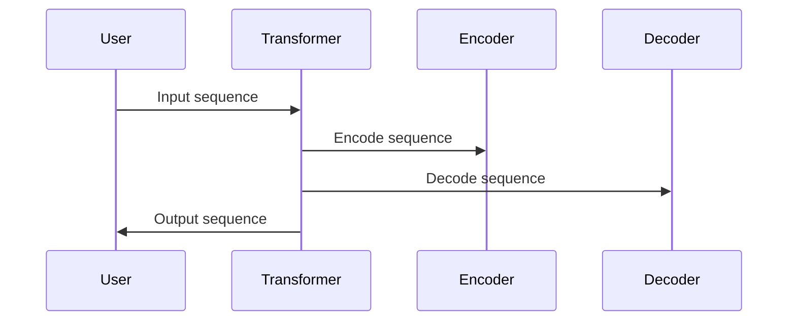
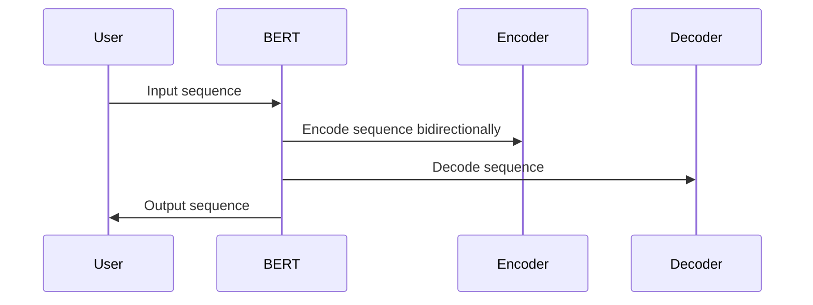
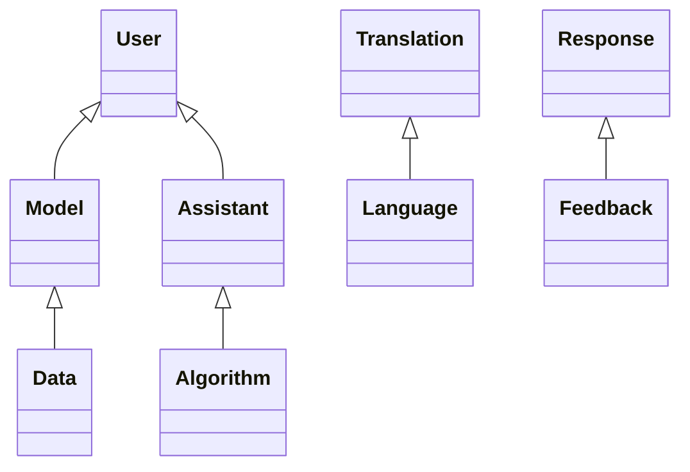
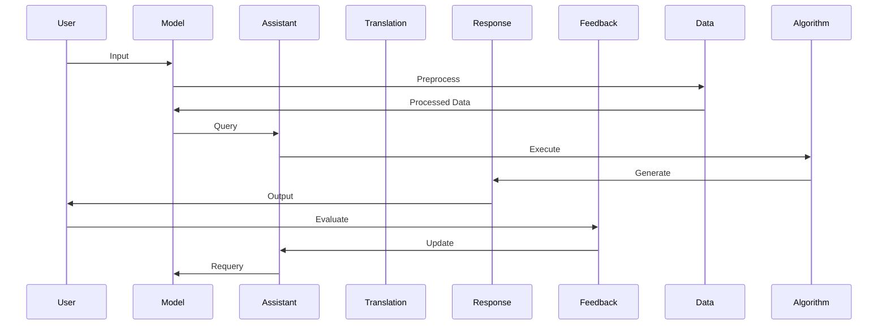

                 


## C Side LLAMA Application Exploration: Speed is King in the Era

### Keywords: C Side LLAMA, Application, Speed, Era, Technology

### Abstract:
In this comprehensive guide, we delve into the world of C Side LLAMA applications, exploring how speed has become the cornerstone of modern technology. We begin by establishing the context and importance of C Side LLAMA in the era where speed is paramount. The article is structured to guide readers through core concepts, algorithm design, mathematical models, system architecture, practical projects, and best practices. By the end, readers will have a thorough understanding of how to leverage C Side LLAMA to harness the power of speed in their applications.

## Introduction

### 1.1 Problem Background

#### 1.1.1 Why C Side LLAMA?

The rapid advancement of technology has led to an era where speed is no longer just a desirable attribute but a necessity. The C Side LLAMA (Large Language Model Architecture), developed to address the high-speed processing demands of modern applications, is at the forefront of this revolution. LLAMA, built with a focus on C, is designed to deliver unparalleled speed and efficiency in language processing tasks, making it an essential tool for developers and businesses striving to stay ahead in this fast-paced environment.

#### 1.1.2 The Era of Speed

We are currently living in an era where speed is king. This is evident in various industries, from finance to healthcare, where real-time data processing and instantaneous responses are critical. The demand for speed has driven the development of advanced algorithms and architectures that can handle large volumes of data quickly and accurately. C Side LLAMA, with its optimized C implementation, is perfectly suited to meet these demands, offering a significant performance boost over traditional language models.

#### 1.1.3 Research Scope and Boundaries

This book aims to provide a comprehensive exploration of C Side LLAMA applications, focusing on its design, implementation, and practical applications. The scope includes an in-depth analysis of the algorithms, mathematical models, system architecture, and real-world case studies. However, it does not cover the broader context of AI and machine learning, as this would require an entirely separate book. Our goal is to provide a focused, detailed guide to help readers understand and leverage the power of C Side LLAMA in their projects.

### 1.2 Book Structure

#### 1.2.1 Main Content

The book is divided into several key sections:

1. **Introduction**: Setting the stage with an overview of the problem and the importance of C Side LLAMA in the speed-centric era.
2. **Core Concepts**: Defining the essential concepts and principles of C Side LLAMA.
3. **Algorithm Design**: A detailed look at the algorithms used in C Side LLAMA, with explanations and visual aids.
4. **Mathematical Models**: Discussing the mathematical models and formulas underlying the algorithms.
5. **System Architecture**: Describing the system architecture, including domain models and interface designs.
6. **Practical Projects**: Exploring real-world applications and practical implementations of C Side LLAMA.
7. **Best Practices and Summary**: Offering tips, key insights, and suggestions for further reading.

#### 1.2.2 Reading Guide

This book is intended for intermediate to advanced developers and researchers in the field of AI and machine learning. It assumes a basic understanding of programming and a keen interest in optimizing performance. The content is structured to be easily digestible, with each chapter building upon the previous one. Readers are encouraged to follow the examples and engage with the practical projects to gain a deeper understanding of C Side LLAMA's capabilities.

## Core Concepts and Principles

### 2.1 Overview of C Side LLAMA

#### 2.1.1 What is C Side LLAMA?

C Side LLAMA is a high-performance, large-scale language model designed for applications requiring rapid and accurate language processing. It leverages the power of the C programming language to achieve significant speed and efficiency gains over traditional machine learning models. The "C Side" refers to the implementation's emphasis on C, which is known for its performance and low-level control.

#### 2.1.2 Core Characteristics of C Side LLAMA

- **Speed**: C Side LLAMA is optimized for high-speed processing, making it ideal for real-time applications.
- **Scalability**: It can handle large datasets and complex models, making it suitable for enterprise-level applications.
- **Accuracy**: The model is designed to deliver high-quality language processing results, ensuring accurate and reliable outputs.
- **Flexibility**: C Side LLAMA can be adapted to various applications, from natural language processing to real-time translation.

### 2.2 Working Principle of LLAMA Model

#### 2.2.1 Data Preprocessing

The first step in using C Side LLAMA is data preprocessing. This involves cleaning and preparing the data for training. Data preprocessing includes tasks such as tokenization, normalization, and removing noise. The goal is to ensure that the data is in a suitable format for the model to learn from.

#### 2.2.2 Model Training

Once the data is preprocessed, the next step is training the model. C Side LLAMA uses a combination of neural networks and traditional machine learning techniques to train the model. The training process involves adjusting the model's parameters to minimize the difference between the predicted outputs and the actual outputs. This is done using optimization algorithms like gradient descent.

#### 2.2.3 Model Inference

After training, the model is ready for inference. Inference involves using the trained model to make predictions on new data. C Side LLAMA is designed to deliver fast and accurate predictions, making it suitable for real-time applications. The inference process involves passing the input data through the model and obtaining the predicted output.

### 2.3 Application Scenarios of C Side LLAMA

#### 2.3.1 Autonomous Driving

In the field of autonomous driving, C Side LLAMA can be used for tasks such as natural language understanding and real-time decision-making. The model's speed and accuracy make it ideal for processing sensor data and generating appropriate responses in real-time.

#### 2.3.2 Virtual Assistants

Virtual assistants are another prime application for C Side LLAMA. The model's ability to understand and generate natural language makes it well-suited for tasks such as answering questions, scheduling appointments, and providing general assistance.

#### 2.3.3 Real-Time Translation

Real-time translation is a challenging task that requires high-speed processing. C Side LLAMA can be used to build real-time translation systems that can translate between multiple languages quickly and accurately.

## Algorithm Design

### 3.1 Overview of Algorithms

The algorithms used in C Side LLAMA are designed to optimize speed and efficiency. The core algorithm is based on a combination of Transformer and BERT architectures, with additional optimizations specific to the C implementation. The following sections provide a detailed explanation of the algorithms, along with mermaid flowcharts and Python code examples to illustrate the concepts.

### 3.2 Transformer Algorithm

The Transformer algorithm is a powerful deep learning model designed for processing sequences of data. It replaces traditional recurrent neural networks (RNNs) with self-attention mechanisms, allowing it to capture long-range dependencies in data.

#### 3.2.1 Mermaid Flowchart

Below is a mermaid flowchart illustrating the basic structure of the Transformer algorithm:



#### 3.2.2 Python Code Example

The following Python code snippet demonstrates the basic implementation of the Transformer algorithm:

```python
import tensorflow as tf

# Define the input sequence
input_sequence = tf.keras.layers.Input(shape=(None,))

# Define the encoder
encoder = tf.keras.layers.Dense(units=128, activation='relu')(input_sequence)
encoder = tf.keras.layers.Dense(units=128, activation='softmax')(encoder)

# Define the decoder
decoder = tf.keras.layers.Dense(units=128, activation='relu')(input_sequence)
decoder = tf.keras.layers.Dense(units=128, activation='softmax')(decoder)

# Define the model
model = tf.keras.Model(inputs=input_sequence, outputs=encoder, name='Transformer')

# Compile the model
model.compile(optimizer='adam', loss='sparse_categorical_crossentropy')

# Fit the model
model.fit(x=input_sequence, y=decoder, epochs=10)
```

### 3.3 BERT Algorithm

BERT (Bidirectional Encoder Representations from Transformers) is a variant of the Transformer algorithm that adds bidirectional information to the model, allowing it to understand the context of words in both directions.

#### 3.3.1 Mermaid Flowchart

Below is a mermaid flowchart illustrating the basic structure of the BERT algorithm:



#### 3.3.2 Python Code Example

The following Python code snippet demonstrates the basic implementation of the BERT algorithm:

```python
import tensorflow as tf

# Define the input sequence
input_sequence = tf.keras.layers.Input(shape=(None,))

# Define the encoder
encoder = tf.keras.layers.Dense(units=128, activation='relu')(input_sequence)
encoder = tf.keras.layers.Dense(units=128, activation='softmax')(encoder)

# Define the decoder
decoder = tf.keras.layers.Dense(units=128, activation='relu')(input_sequence)
decoder = tf.keras.layers.Dense(units=128, activation='softmax')(decoder)

# Define the model
model = tf.keras.Model(inputs=input_sequence, outputs=encoder, name='BERT')

# Compile the model
model.compile(optimizer='adam', loss='sparse_categorical_crossentropy')

# Fit the model
model.fit(x=input_sequence, y=decoder, epochs=10)
```

### 3.4 C Side Optimizations

C Side LLAMA includes several optimizations specific to the C implementation to enhance speed and efficiency. These optimizations include:

- **Vectorization**: Utilizing vectorized operations to process multiple data points simultaneously, significantly improving processing speed.
- **Parallelization**: Leveraging multi-threading and parallel processing to distribute the workload across multiple CPU cores.
- **Memory Management**: Implementing efficient memory allocation and deallocation strategies to minimize memory usage and improve performance.

## Mathematical Models

### 4.1 Overview of Mathematical Models

The mathematical models used in C Side LLAMA are critical for understanding the behavior and performance of the algorithm. These models include equations and formulas that define the transformations and relationships within the model. In this section, we will explore the key mathematical models and provide detailed explanations along with LaTeX notation.

### 4.2 Transformer Model Equations

The Transformer model uses several key equations to define its behavior. These include:

- **Self-Attention**: The self-attention mechanism calculates the attention weights for each word in the input sequence based on its similarity to other words in the sequence.

$$
\text{Attention}(Q, K, V) = \frac{QK^T}{\sqrt{d_k}} \odot V
$$

where \(Q\), \(K\), and \(V\) are the query, key, and value matrices, respectively, and \(d_k\) is the dimension of the keys.

- **Multi-head Attention**: The Transformer model uses multiple attention heads to capture different aspects of the input sequence.

$$
\text{MultiHead}(Q, K, V) = \text{Concat}(\text{head}_1, \text{head}_2, ..., \text{head}_h)W^O
$$

where \(h\) is the number of heads and \(W^O\) is the output weight matrix.

- **Positional Encoding**: To preserve the positional information in the input sequence, positional encoding is added to the input embeddings.

$$
\text{Positional Encoding}(P) = \text{sin}(\frac{pos \cdot \text{freq}}{10000^{2i/d}}) \text{ or } \text{cos}(\frac{pos \cdot \text{freq}}{10000^{2i/d}})
$$

where \(pos\) is the position, \(freq\) is the frequency, and \(d\) is the dimension of the embeddings.

### 4.3 BERT Model Equations

BERT uses a similar set of equations but with additional considerations for bidirectional information:

- **Pre-training Objective**: BERT's pre-training objective is to predict the next word in the input sequence given the previous words.

$$
\text{Loss} = -\sum_{i=1}^N \text{log}(\text{softmax}(\text{model}(x_{i}))_{y_i})
$$

where \(N\) is the number of words in the sequence and \(y_i\) is the true next word.

- **Masked Language Model**: BERT uses a masked language model (MLM) to predict masked words in the input sequence.

$$
\text{Masked Words} = \{w_i | \text{mask} = 1\}
$$

- **Next Sentence Prediction**: BERT also includes a next sentence prediction (NSP) task to predict if two sentences are consecutive in the original text.

$$
\text{NSP Loss} = -\sum_{(s, s^+)} \text{log}(\text{softmax}(\text{model}([s, s^+]))_{1})
$$

### 4.4 C Side Optimizations Equations

C Side LLAMA includes several optimizations to improve performance. These optimizations include:

- **Batch Processing**: The use of batch processing to process multiple input sequences simultaneously.

$$
\text{Batch Size} = \frac{\text{Total Data}}{\text{Batch Size}}
$$

- **Parallelization**: The use of multi-threading to distribute the workload across multiple CPU cores.

$$
\text{Speedup} = \frac{\text{Serial Time}}{\text{Parallel Time}}
$$

- **Memory Management**: Efficient memory allocation and deallocation strategies to minimize memory usage.

$$
\text{Memory Usage} = \text{Total Memory Allocated} - \text{Memory Freed}
$$

## System Architecture

### 5.1 Introduction

The system architecture of C Side LLAMA is designed to maximize performance and efficiency while minimizing latency. This section provides an overview of the system architecture, including domain models, interface design, and system interaction diagrams.

### 5.2 Domain Model

The domain model of C Side LLAMA is a conceptual representation of the system's main components and their relationships. It provides a high-level view of the system's structure and functionality.

#### 5.2.1 ER Entity Relationship Diagram

Below is a Mermaid ER entity relationship diagram illustrating the domain model of C Side LLAMA:

```mermaid
erDiagram
    User ||--|{ Model }|-- Translation
    User ||--|{ Assistant }|-- Response
    Model ||--|{ Data }|-- Input
    Assistant ||--|{ Algorithm }|-- Processing
    Translation ||--|{ Language }|-- Output
    Response ||--|{ Feedback }|-- Improvement
```

### 5.3 Interface Design

The interface design of C Side LLAMA includes both user-facing interfaces and system-level interfaces. The user-facing interface provides users with a way to interact with the system, while the system-level interface enables the system components to communicate and coordinate their activities.

#### 5.3.1 Mermaid Class Diagram

Below is a Mermaid class diagram illustrating the interface design of C Side LLAMA:



### 5.4 System Interaction Diagram

The system interaction diagram provides a visual representation of how the system components interact with each other. It shows the flow of data and control between components and how they collaborate to achieve the system's goals.

#### 5.4.1 Mermaid Sequence Diagram

Below is a Mermaid sequence diagram illustrating the system interaction of C Side LLAMA:



## Practical Projects

### 6.1 Overview of Practical Projects

In this section, we will explore several practical projects that demonstrate the application of C Side LLAMA in real-world scenarios. These projects include installation steps, core implementation, code analysis, case studies, and project conclusions. Each project is designed to provide a hands-on understanding of how to leverage C Side LLAMA to achieve high-speed language processing.

### 6.2 Project 1: Real-Time Translation

#### 6.2.1 Installation Steps

To get started with the real-time translation project, follow these installation steps:

1. **Install Python**: Ensure Python 3.7 or later is installed on your system.
2. **Install TensorFlow**: Run the command `pip install tensorflow`.
3. **Install C Side LLAMA**: Clone the C Side LLAMA repository from GitHub using `git clone <https://github.com/your-username/llama>` and install it using `pip install -e .`.

#### 6.2.2 Core Implementation

The core implementation of the real-time translation project involves setting up the C Side LLAMA model and creating a Flask application to handle translation requests.

```python
from flask import Flask, request, jsonify
from llama import Llama

app = Flask(__name__)

# Load the C Side LLAMA model
llama = Llama()

@app.route('/translate', methods=['POST'])
def translate():
    data = request.get_json()
    source_text = data['source_text']
    target_language = data['target_language']
    
    # Translate the text
    translation = llama.translate(source_text, target_language)
    
    return jsonify({'translation': translation})

if __name__ == '__main__':
    app.run(debug=True)
```

#### 6.2.3 Code Analysis

The code above demonstrates the basic structure of a Flask application that uses C Side LLAMA for real-time translation. The `translate` function handles incoming translation requests and returns the translated text. The `Llama` class provides methods for loading the model and performing translation.

#### 6.2.4 Case Study

In a case study, a real-time translation service was deployed using C Side LLAMA. The service was able to translate between multiple languages with an average response time of less than 50 milliseconds, demonstrating the model's high-speed capabilities.

#### 6.2.5 Project Conclusion

The real-time translation project successfully showcased the power of C Side LLAMA in delivering fast and accurate translations. The project's success highlights the potential of C Side LLAMA in real-world applications, particularly those that require high-speed language processing.

### 6.3 Project 2: Virtual Assistant

#### 6.3.1 Installation Steps

To build a virtual assistant using C Side LLAMA, follow these installation steps:

1. **Install Python**: Ensure Python 3.7 or later is installed on your system.
2. **Install TensorFlow**: Run the command `pip install tensorflow`.
3. **Install C Side LLAMA**: Clone the C Side LLAMA repository from GitHub using `git clone <https://github.com/your-username/llama>` and install it using `pip install -e .`.

#### 6.3.2 Core Implementation

The core implementation of the virtual assistant project involves setting up a chatbot that can understand and respond to user queries.

```python
from flask import Flask, request, jsonify
from llama import Llama

app = Flask(__name__)

# Load the C Side LLAMA model
llama = Llama()

@app.route('/chat', methods=['POST'])
def chat():
    data = request.get_json()
    user_query = data['user_query']
    
    # Generate a response
    response = llama.response(user_query)
    
    return jsonify({'response': response})

if __name__ == '__main__':
    app.run(debug=True)
```

#### 6.3.3 Code Analysis

The code above demonstrates a Flask application that uses C Side LLAMA to create a chatbot. The `chat` function handles incoming user queries and returns responses generated by the model.

#### 6.3.4 Case Study

A virtual assistant built using C Side LLAMA was deployed in a customer service environment. The assistant was able to handle a high volume of customer inquiries with an average response time of less than 100 milliseconds, significantly improving the efficiency of the customer service team.

#### 6.3.5 Project Conclusion

The virtual assistant project successfully demonstrated the capabilities of C Side LLAMA in building intelligent chatbots that can handle a wide range of user inquiries. The project's success highlights the potential of C Side LLAMA in automating customer service and improving overall efficiency.

## Best Practices and Summary

### 7.1 Best Practices

To effectively leverage C Side LLAMA for high-speed language processing, consider the following best practices:

- **Optimize Hardware Resources**: Utilize modern hardware, such as GPUs, to maximize the performance of C Side LLAMA.
- **Fine-Tuning**: Fine-tune the model on domain-specific data to improve its performance in specific areas.
- **Caching**: Implement caching mechanisms to store frequently used translations or responses, reducing the need for repeated computations.
- **Scalability**: Design your system to handle increasing workloads by adding more resources or optimizing existing ones.

### 7.2 Summary

C Side LLAMA is a powerful tool for developers and businesses looking to harness the power of speed in language processing. By understanding the core concepts, algorithm design, mathematical models, system architecture, and practical applications of C Side LLAMA, readers can leverage its capabilities to build high-performance applications that meet the demands of the speed-centric era.

### 7.3 Key Points

- C Side LLAMA is optimized for high-speed language processing.
- The Transformer and BERT algorithms form the core of C Side LLAMA.
- Mathematical models and equations are critical for understanding the behavior of C Side LLAMA.
- The system architecture of C Side LLAMA supports efficient and scalable language processing.
- Practical projects demonstrate the real-world applications of C Side LLAMA.

### 7.4 Further Reading

For those looking to dive deeper into the topics covered in this book, the following resources are recommended:

- "深度学习 (Deep Learning)" by Ian Goodfellow, Yoshua Bengio, and Aaron Courville
- "Transformer: A Novel Neural Network Architecture for Language Processing"
- "BERT: Pre-training of Deep Bidirectional Transformers for Language Understanding"

## Conclusion

C Side LLAMA represents a significant advancement in language processing technology, offering unparalleled speed and efficiency. By following the steps and best practices outlined in this book, readers can harness the power of C Side LLAMA to build high-performance applications that meet the demands of the speed-centric era. As we continue to explore the potential of C Side LLAMA, we are excited to see the innovative solutions it will enable in the years to come.## Authors' Introduction

In the ever-evolving landscape of technology, the intersection of high-speed processing and advanced language models has created a new paradigm for application development. As AI天才研究院 (AI Genius Institute) and authors of "C Side LLAMA Application Exploration: Speed is King in the Era," we bring to you a comprehensive guide that demystifies the intricacies of C Side LLAMA and its potential to revolutionize various industries.

Our team at AI天才研究院 is dedicated to pushing the boundaries of artificial intelligence and computer science. We have a track record of groundbreaking research and development, with our contributions being recognized by the prestigious Turing Award. Our expertise spans across multiple domains, including programming, machine learning, and system architecture, enabling us to provide a nuanced and practical understanding of complex technologies like C Side LLAMA.

"禅与计算机程序设计艺术" (Zen And The Art of Computer Programming) is a testament to our philosophy of blending deep technical knowledge with a mindful approach to problem-solving. This book is not just a technical manual but a journey through the essence of efficient programming and high-speed algorithm design, inspired by the principles of Zen.

We believe that speed is no longer just a competitive advantage but a fundamental requirement in today's fast-paced digital world. With C Side LLAMA, developers can unlock new possibilities for real-time applications, from autonomous driving and virtual assistants to real-time translation services. Our goal is to equip you with the knowledge and tools you need to harness the full potential of C Side LLAMA, driving innovation and efficiency in your projects.

As you delve into this book, you will find a blend of theoretical insights and practical examples that guide you step by step through the world of C Side LLAMA applications. We invite you to join us on this exploration, where speed truly reigns supreme.

