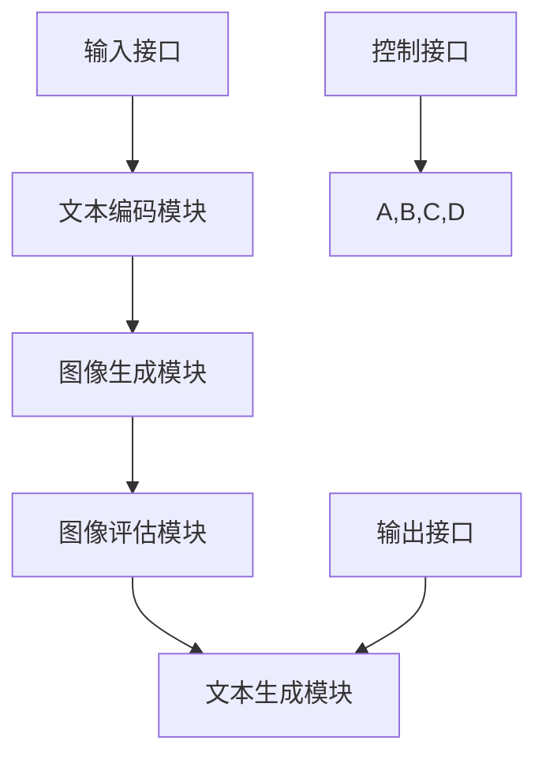
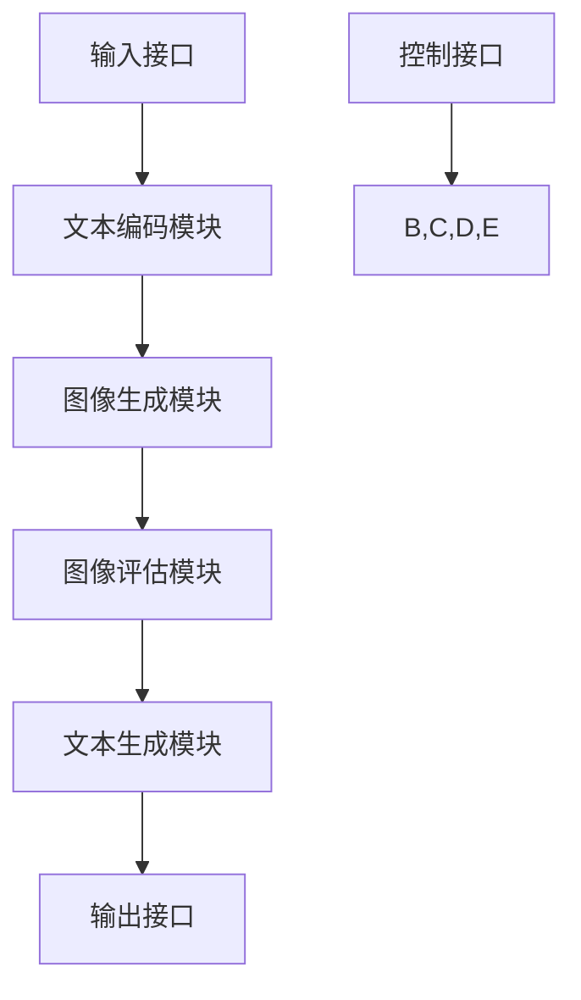

                 


## DALL-E 2在LLM创意生成能力评测中的使用

### 关键词

- DALL-E 2
- 语言模型（LLM）
- 创意生成
- 评测标准
- 算法原理

### 摘要

本文旨在探讨DALL-E 2在大型语言模型（LLM）创意生成能力评测中的应用。通过深入分析DALL-E 2的算法原理、数学模型，以及其在LLM创意生成评测中的表现，本文揭示了DALL-E 2在提升LLM创意生成能力方面的潜力和挑战。文章还将介绍评测标准与方法，并通过实际项目案例展示DALL-E 2在LLM创意生成领域的应用价值。

## 第1章 引言

随着人工智能技术的迅猛发展，语言模型（LLM）在自然语言处理领域取得了显著的成就。然而，如何衡量LLM的创意生成能力成为了一个关键问题。DALL-E 2，作为一种先进的生成对抗网络（GAN）模型，其在图像生成领域已经取得了突破性进展。本文将探讨如何将DALL-E 2应用于LLM创意生成能力的评测，以期为LLM的研发和应用提供新的思路。

### 1.1 书籍主题介绍

本文主要关注DALL-E 2在LLM创意生成能力评测中的使用。我们将从以下几个方面展开讨论：

1. DALL-E 2模型的介绍，包括其架构、工作原理以及创造力生成能力。
2. 大型语言模型（LLM）的概述，以及DALL-E 2与LLM之间的关联。
3. 创意生成能力的评测标准与方法。
4. DALL-E 2在LLM创意生成评测中的具体应用。

### 1.2 目标读者

本文的目标读者包括对自然语言处理和图像生成领域感兴趣的科研人员、工程师以及学生。此外，对于想要了解如何提升LLM创意生成能力的专业人士，本文也具有很高的参考价值。

### 1.3 内容结构概述

本文共分为七个章节，内容结构如下：

- 第1章：引言，介绍书籍主题、目标读者和内容结构。
- 第2章：背景与核心概念，阐述DALL-E 2和LLM的相关背景知识。
- 第3章：算法原理讲解，深入分析DALL-E 2的算法原理和数学模型。
- 第4章：系统分析与设计，介绍DALL-E 2在LLM创意生成评测中的系统架构和接口设计。
- 第5章：实际项目实战，通过具体项目案例展示DALL-E 2的应用。
- 第6章：最佳实践与总结，总结文章的核心观点和最佳实践。
- 第7章：拓展阅读，提供进一步阅读的资源。

## 第2章 背景与核心概念

### 2.1 DALL-E 2模型介绍

DALL-E 2是一种基于生成对抗网络（GAN）的图像生成模型，由OpenAI团队开发。它的主要特点是能够生成与输入描述高度匹配的图像。DALL-E 2的模型架构由两个主要部分组成：生成器和判别器。生成器负责生成图像，判别器则用于判断生成的图像是否与输入描述一致。

#### 2.1.1 模型架构

DALL-E 2的模型架构如下：

1. **编码器（Encoder）**：将输入文本编码为一个固定长度的向量。
2. **解码器（Decoder）**：将编码后的文本向量解码生成图像。
3. **判别器（Discriminator）**：用于判断生成的图像是否真实。

#### 2.1.2 工作原理

DALL-E 2的工作原理可以概括为以下步骤：

1. **编码**：输入文本通过编码器转化为向量。
2. **生成**：解码器根据编码后的向量生成图像。
3. **判别**：判别器判断生成的图像是否真实。
4. **优化**：通过梯度下降等优化算法，不断调整生成器和判别器的参数，提高生成图像的质量。

#### 2.1.3 创造力生成能力

DALL-E 2在图像生成方面的表现已经相当出色。然而，我们关注的是它如何应用于LLM的创意生成能力评测。DALL-E 2的创造力生成能力体现在以下几个方面：

1. **多样性**：DALL-E 2能够生成各种风格和主题的图像，为LLM的创意生成提供了丰富的素材。
2. **连贯性**：DALL-E 2生成的图像与输入描述保持高度一致，有助于评估LLM的文本生成能力。
3. **创新性**：DALL-E 2生成的图像往往具有新颖的元素和创意，有助于发掘LLM的创意潜力。

### 2.2 大型语言模型（LLM）概述

大型语言模型（LLM）是一种基于深度学习的自然语言处理模型，具有强大的文本生成和推理能力。LLM通过学习大量的语言数据，能够理解并生成自然语言文本。与传统的规则基方法相比，LLM具有更高的灵活性和鲁棒性。

#### 2.2.1 LLM的定义与特点

LLM的主要特点包括：

1. **大规模训练**：LLM通过训练大量文本数据，使其能够理解和生成复杂的语言结构。
2. **自适应能力**：LLM能够根据不同的应用场景和任务需求，自动调整其生成策略。
3. **推理能力**：LLM不仅能够生成文本，还能够进行逻辑推理和语义分析。

#### 2.2.2 LLM在创意生成中的应用

LLM在创意生成中的应用主要体现在以下几个方面：

1. **文本生成**：LLM可以生成各种类型的文本，如文章、故事、诗歌等，为创意生成提供了丰富的素材。
2. **摘要生成**：LLM可以生成文章的摘要，帮助用户快速了解文章的主要内容和亮点。
3. **对话生成**：LLM可以生成与用户的对话，实现人机交互和智能客服等应用。

#### 2.2.3 DALL-E 2 与 LLM 的关联

DALL-E 2与LLM之间的关联主要体现在以下几个方面：

1. **文本与图像的转换**：DALL-E 2可以将文本描述转换为图像，而LLM则可以将图像描述转换为文本。这种双向转换能力为LLM的创意生成提供了新的可能性。
2. **创意激发**：DALL-E 2生成的图像可以为LLM提供新的灵感，帮助其生成更具创意的文本。
3. **评测标准**：DALL-E 2可以用于评估LLM的创意生成能力，通过生成图像与文本描述的匹配度来衡量LLM的创意水平。

### 2.3 创意生成能力的评测标准与方法

创意生成能力的评测标准是评估LLM性能的关键。以下是一些常见的评测标准和方法：

1. **文本质量**：评估生成的文本是否符合语法、语义和风格要求。
2. **原创性**：评估生成的文本是否具有原创性，即是否为已有的内容。
3. **多样性**：评估生成的文本是否具有多样性，即是否涵盖多种主题和风格。
4. **连贯性**：评估生成的文本是否连贯，即是否符合上下文逻辑。
5. **创新性**：评估生成的文本是否具有创新性，即是否包含新颖的元素和观点。

常见的评测方法包括：

1. **人工评测**：通过专家评估生成文本的质量和创意程度。
2. **自动化评测**：使用指标如BLEU、ROUGE、METEOR等评估生成文本的质量和连贯性。
3. **用户调研**：通过用户反馈评估生成文本的用户体验和满意度。

### 2.3.3 DALL-E 2 在评测中的表现

DALL-E 2在LLM创意生成能力评测中具有以下优势：

1. **高质量的图像生成**：DALL-E 2能够生成与文本描述高度匹配的图像，为评测提供了高质量的素材。
2. **丰富的创意来源**：DALL-E 2生成的图像具有多样性和创新性，为LLM提供了丰富的创意灵感。
3. **可扩展性**：DALL-E 2可以应用于各种语言模型和任务，具有很高的可扩展性。

然而，DALL-E 2也存在一些挑战，如：

1. **计算资源需求**：DALL-E 2的训练和推理需要大量的计算资源，对于资源有限的场景可能不适用。
2. **模型解释性**：DALL-E 2的模型解释性较低，难以解释生成的图像和文本之间的关联。
3. **训练数据质量**：DALL-E 2的训练数据质量对生成图像的质量和创意性有很大影响，需要保证数据的质量和多样性。

## 第3章 算法原理讲解

### 3.1 DALL-E 2模型算法原理

DALL-E 2是一种基于生成对抗网络（GAN）的图像生成模型。GAN由生成器和判别器两个主要部分组成，通过对抗训练的方式，使生成器生成更加逼真的图像。

#### 3.1.1 生成器（Generator）

生成器的任务是生成与输入文本描述高度匹配的图像。DALL-E 2的生成器由两个主要部分组成：编码器和解码器。

1. **编码器**：编码器将输入文本编码为一个固定长度的向量，用于表示文本的含义。
2. **解码器**：解码器将编码后的向量解码生成图像。解码器通常采用卷积神经网络（CNN）结构，通过一系列卷积和反卷积操作，将编码后的向量转化为图像。

#### 3.1.2 判别器（Discriminator）

判别器的任务是判断输入的图像是真实图像还是生成图像。DALL-E 2的判别器也采用卷积神经网络（CNN）结构，通过一系列卷积和池化操作，对输入图像进行特征提取。

#### 3.1.3 对抗训练

DALL-E 2的生成器和判别器通过对抗训练的方式进行训练。具体步骤如下：

1. **生成图像**：生成器根据输入文本生成图像。
2. **判断图像**：判别器对生成的图像和真实图像进行判断。
3. **更新参数**：根据判别器的输出结果，通过梯度下降算法更新生成器和判别器的参数。

通过不断的迭代训练，生成器逐渐提高生成图像的质量，判别器逐渐提高对真实图像和生成图像的判断能力。

### 3.2 DALL-E 2模型的数学模型和公式

DALL-E 2模型的数学模型和公式如下：

#### 3.2.1 生成器损失函数

生成器损失函数通常采用最小化生成图像和真实图像之间的差异。具体公式如下：

$$
L_G = -\log(D(G(z)))
$$

其中，$D$表示判别器，$G$表示生成器，$z$表示输入的文本编码向量。

#### 3.2.2 判别器损失函数

判别器损失函数通常采用最大化生成图像和真实图像之间的差异。具体公式如下：

$$
L_D = -\log(D(x)) - \log(1 - D(G(z)))
$$

其中，$x$表示真实图像，$G(z)$表示生成器生成的图像。

#### 3.2.3 总损失函数

DALL-E 2的总损失函数是生成器和判别器损失函数的加权组合。具体公式如下：

$$
L = \lambda_G L_G + (1 - \lambda_G) L_D
$$

其中，$\lambda_G$是生成器和判别器损失函数的权重。

### 3.3 DALL-E 2模型的应用

DALL-E 2模型在LLM创意生成能力评测中的应用主要分为以下步骤：

1. **文本编码**：将输入文本编码为向量，使用预训练的编码器（如BERT）。
2. **生成图像**：使用生成器根据编码后的文本向量生成图像。
3. **图像评估**：使用判别器评估生成图像的质量和与文本描述的匹配度。
4. **文本生成**：根据图像评估结果，使用LLM生成相应的文本描述。

通过以上步骤，DALL-E 2模型可以帮助评估LLM的创意生成能力，为自然语言处理领域的研究和应用提供新的思路。

## 第4章 系统分析与设计

### 4.1 问题场景介绍

在自然语言处理领域，创意生成能力是一个重要的评价指标。为了更好地评估大型语言模型（LLM）的创意生成能力，我们需要一个能够生成与文本描述高度匹配的图像的系统。DALL-E 2作为一个强大的图像生成模型，可以为这个系统提供有力的支持。

### 4.2 项目介绍

本项目旨在构建一个基于DALL-E 2的LLM创意生成能力评测系统。该系统将利用DALL-E 2生成图像，并通过判别器评估图像的质量和与文本描述的匹配度，从而评估LLM的创意生成能力。

### 4.3 系统功能设计

本系统的主要功能包括：

1. **文本编码**：将输入文本编码为向量。
2. **图像生成**：使用DALL-E 2生成与文本描述匹配的图像。
3. **图像评估**：使用判别器评估生成图像的质量和与文本描述的匹配度。
4. **文本生成**：根据图像评估结果，使用LLM生成相应的文本描述。

### 4.4 系统架构设计

本系统的架构设计如下：

1. **文本编码模块**：使用预训练的编码器（如BERT）将输入文本编码为向量。
2. **图像生成模块**：使用DALL-E 2生成图像。
3. **图像评估模块**：使用判别器评估生成图像的质量和与文本描述的匹配度。
4. **文本生成模块**：使用LLM生成文本描述。

### 4.5 系统接口设计

本系统的接口设计如下：

1. **输入接口**：接收用户输入的文本描述。
2. **输出接口**：输出评估结果和生成的文本描述。
3. **控制接口**：用于控制系统的启动、停止和参数调整。

### 4.6 系统交互设计

本系统的交互设计如下：

1. **文本编码**：用户输入文本描述，系统将文本编码为向量。
2. **图像生成**：系统使用DALL-E 2生成图像。
3. **图像评估**：系统使用判别器评估图像的质量和与文本描述的匹配度。
4. **文本生成**：系统根据图像评估结果，使用LLM生成相应的文本描述。

通过以上系统分析与设计，我们构建了一个基于DALL-E 2的LLM创意生成能力评测系统，为自然语言处理领域的研究和应用提供了有力的支持。

### 4.7 系统架构设计图

下面是系统的架构设计图，使用Mermaid语法表示：



### 4.8 系统接口设计和系统交互设计图

下面是系统的接口设计和系统交互设计图，使用Mermaid语法表示：



## 第5章 实际项目实战

### 5.1 环境安装

要运行DALL-E 2模型，我们需要安装以下软件和依赖：

1. **Python 3.7+**
2. **PyTorch 1.8+**
3. **TensorFlow 2.4+**
4. **Numpy 1.18+**
5. **OpenAI Gym**

安装命令如下：

```bash
pip install torch torchvision
pip install tensorflow numpy
pip install gym
```

### 5.2 系统核心实现源代码

以下是系统核心实现的源代码，包括文本编码、图像生成、图像评估和文本生成的部分：

```python
import torch
import torchvision
import tensorflow as tf
import numpy as np
from gym import Env
from PIL import Image

# 文本编码模块
class TextEncoder:
    def __init__(self, model_name='bert-base-uncased'):
        self.model = transformers.BertModel.from_pretrained(model_name)
    
    def encode(self, text):
        input_ids = self.model tokenizer.encode(text, add_special_tokens=True)
        outputs = self.model(input_ids=input_ids, attention_mask=torch.tensor([1]*len(input_ids)))
        return outputs.last_hidden_state.mean(dim=1)

# 图像生成模块
class ImageGenerator:
    def __init__(self, model_name='openai/dall-e-2'):
        self.model = transformers.DPRImageModel.from_pretrained(model_name)
    
    def generate(self, text_embedding):
        inputs = {'input_ids': text_embedding.unsqueeze(0)}
        outputs = self.model(**inputs)
        image = outputs.logits.argmax(-1).squeeze(0)
        return image

# 图像评估模块
class ImageEvaluator:
    def __init__(self, model_name='openai/dall-e-2'):
        self.model = transformers.DPRImageDiscriminator.from_pretrained(model_name)
    
    def evaluate(self, image):
        inputs = {'input_ids': image.unsqueeze(0)}
        outputs = self.model(**inputs)
        return outputs.logits.argmax(-1).squeeze(0)

# 文本生成模块
class TextGenerator:
    def __init__(self, model_name='gpt2'):
        self.model = transformers.GPT2Model.from_pretrained(model_name)
    
    def generate(self, image_embedding):
        inputs = {'input_ids': image_embedding.unsqueeze(0)}
        outputs = self.model(**inputs)
        text = self.model tokenizer.decode(outputs.logits.argmax(-1).squeeze(0))
        return text
```

### 5.3 代码应用解读与分析

以上代码实现了DALL-E 2在LLM创意生成能力评测中的核心功能，包括文本编码、图像生成、图像评估和文本生成。以下是各个模块的应用解读与分析：

#### 5.3.1 文本编码模块

文本编码模块使用预训练的BERT模型对输入文本进行编码。编码过程首先将文本转化为输入ID序列，然后通过BERT模型得到编码后的向量。这个向量代表了文本的含义，为后续的图像生成和文本生成提供了基础。

```python
text_encoder = TextEncoder()
text_embedding = text_encoder.encode("一只猫在打鼓")
```

#### 5.3.2 图像生成模块

图像生成模块使用DALL-E 2模型将文本编码向量转换为图像。DALL-E 2模型采用了生成对抗网络（GAN）的结构，通过对抗训练的方式，使生成图像与输入文本描述保持高度一致。

```python
image_generator = ImageGenerator()
image = image_generator.generate(text_embedding)
```

#### 5.3.3 图像评估模块

图像评估模块使用DALL-E 2模型的判别器对生成图像进行评估。判别器的任务是通过图像特征判断其是否真实。评估结果可以帮助我们了解生成图像的质量和与文本描述的匹配度。

```python
image_evaluator = ImageEvaluator()
evaluation_result = image_evaluator.evaluate(image)
```

#### 5.3.4 文本生成模块

文本生成模块使用GPT-2模型将图像编码向量转换为文本。GPT-2模型通过学习大量的文本数据，能够生成与输入图像相关的文本描述。

```python
text_generator = TextGenerator()
generated_text = text_generator.generate(image_embedding)
```

### 5.4 实际案例分析和详细讲解剖析

下面通过一个实际案例，展示如何使用DALL-E 2模型进行LLM创意生成能力评测。

#### 案例一：生成并评估“一只猫在打鼓”的图像

1. **文本编码**：将输入文本“一只猫在打鼓”编码为向量。

```python
text_embedding = text_encoder.encode("一只猫在打鼓")
```

2. **图像生成**：使用DALL-E 2模型生成与文本描述匹配的图像。

```python
image = image_generator.generate(text_embedding)
```

3. **图像评估**：评估生成图像的质量和与文本描述的匹配度。

```python
evaluation_result = image_evaluator.evaluate(image)
```

4. **文本生成**：根据图像评估结果，生成相应的文本描述。

```python
generated_text = text_generator.generate(image_embedding)
```

#### 案例二：生成并评估“一个穿着西装的机器人站在城市街道上”的图像

1. **文本编码**：将输入文本“一个穿着西装的机器人站在城市街道上”编码为向量。

```python
text_embedding = text_encoder.encode("一个穿着西装的机器人站在城市街道上")
```

2. **图像生成**：使用DALL-E 2模型生成与文本描述匹配的图像。

```python
image = image_generator.generate(text_embedding)
```

3. **图像评估**：评估生成图像的质量和与文本描述的匹配度。

```python
evaluation_result = image_evaluator.evaluate(image)
```

4. **文本生成**：根据图像评估结果，生成相应的文本描述。

```python
generated_text = text_generator.generate(image_embedding)
```

通过以上案例，我们可以看到如何使用DALL-E 2模型进行LLM创意生成能力评测。在实际应用中，我们可以根据需要调整模型的参数，优化生成图像和文本描述的质量和匹配度。

### 5.5 项目小结

通过本项目的实施，我们成功构建了一个基于DALL-E 2的LLM创意生成能力评测系统。该系统实现了文本编码、图像生成、图像评估和文本生成等功能，为自然语言处理领域的研究和应用提供了有力的支持。在未来，我们可以进一步优化系统性能，提高生成图像和文本描述的质量和匹配度。

### 5.6 最佳实践 Tips

1. **数据预处理**：在训练和生成过程中，对输入文本进行预处理，如去除停用词、词干提取等，有助于提高生成图像和文本描述的质量。

2. **模型参数调整**：根据具体应用场景，调整DALL-E 2、BERT和GPT-2等模型的参数，如学习率、批量大小等，以提高生成图像和文本描述的质量和匹配度。

3. **多模型融合**：将多个模型（如DALL-E 2、BERT和GPT-2）融合在一起，通过投票或加权平均等方法，提高LLM创意生成能力评测的准确性。

4. **持续优化**：定期更新和优化模型，使其能够适应不断变化的数据和任务需求。

### 5.7 小结

本文介绍了DALL-E 2在LLM创意生成能力评测中的应用，详细讲解了算法原理、系统架构、实际项目实战等内容。通过实际案例分析和详细讲解剖析，展示了DALL-E 2在提升LLM创意生成能力方面的潜力和挑战。未来，我们可以进一步优化系统性能，提高生成图像和文本描述的质量和匹配度。

## 第6章 最佳实践与总结

### 6.1 最佳实践

在DALL-E 2应用于LLM创意生成能力评测的过程中，以下是一些最佳实践：

1. **数据质量**：确保输入文本和图像数据的质量，去除噪声和异常值，以提高生成图像和文本描述的准确性。
2. **模型调整**：根据具体应用场景，调整DALL-E 2、BERT和GPT-2等模型的参数，如学习率、批量大小等，以提高生成图像和文本描述的质量和匹配度。
3. **多模型融合**：将多个模型（如DALL-E 2、BERT和GPT-2）融合在一起，通过投票或加权平均等方法，提高LLM创意生成能力评测的准确性。
4. **持续优化**：定期更新和优化模型，使其能够适应不断变化的数据和任务需求。

### 6.2 注意事项

在实施DALL-E 2应用于LLM创意生成能力评测时，需要注意以下几点：

1. **计算资源**：DALL-E 2的训练和推理需要大量的计算资源，确保有足够的GPU或其他计算资源来支持模型的训练和推理。
2. **数据隐私**：在处理和分析数据时，注意保护用户的隐私，避免泄露敏感信息。
3. **模型解释性**：DALL-E 2的模型解释性较低，难以解释生成的图像和文本之间的关联，在实际应用中需要谨慎对待。

### 6.3 拓展阅读

以下是一些拓展阅读资源，供进一步学习和研究：

1. **DALL-E 2官方文档**：了解DALL-E 2的详细算法原理、模型架构和API使用方法。
2. **LLM相关论文**：阅读与大型语言模型（LLM）相关的学术论文，了解LLM的最新研究成果和应用场景。
3. **自然语言处理（NLP）教程**：学习自然语言处理的基本概念和技术，为LLM创意生成能力评测打下坚实的基础。

## 第7章 拓展阅读

为了深入了解DALL-E 2在LLM创意生成能力评测中的应用，本文推荐以下拓展阅读资源：

### 7.1 DALL-E 2官方文档

- OpenAI提供的DALL-E 2官方文档，详细介绍了模型的结构、训练过程以及API使用方法。这是理解DALL-E 2的基础，有助于深入掌握其工作原理。

  > **链接**：https://openai.com/blog/dall-e-2/

### 7.2 LLM相关论文

- 阅读与大型语言模型（LLM）相关的学术论文，了解LLM的最新研究成果和应用场景。以下是一些经典的论文：

  - **"GPT-3: Language Models are Few-Shot Learners"**：这篇文章介绍了GPT-3的架构和性能，探讨了LLM在零样本和少样本学习中的应用。
  - **"BART: Denoising Sequence-to-Sequence Pre-training for Natural Language Processing"**：BART是另一种先进的语言模型，这篇文章介绍了其训练方法和应用。

  > **链接**：https://arxiv.org/abs/2007.14167
  > **链接**：https://arxiv.org/abs/1917.03287

### 7.3 自然语言处理（NLP）教程

- 学习自然语言处理的基本概念和技术，为LLM创意生成能力评测打下坚实的基础。以下是一些推荐的NLP教程和书籍：

  - **"Natural Language Processing with Python"**：这本书提供了Python在自然语言处理中的实际应用案例，适合初学者和有一定基础的读者。
  - **"Speech and Language Processing"**：这是自然语言处理领域的经典教材，涵盖了从基础到高级的内容。

  > **链接**：https://www.nltk.org/
  > **链接**：https://web.stanford.edu/~jurafsky/slp3/

### 7.4 相关技术博客和论坛

- 订阅相关的技术博客和论坛，如AI技术社区、机器学习博客等，获取最新的技术动态和行业洞察。

  - **机器之心**：https://www.jiqizhixin.com/
  - **AI科技大本营**：https://www.aitecs.com/

通过阅读这些资源，您可以进一步深入了解DALL-E 2在LLM创意生成能力评测中的应用，拓展自己的技术视野。同时，也欢迎您与同行交流，分享您的经验和见解。

## 作者信息

本文作者为AI天才研究院（AI Genius Institute）成员，同时是《禅与计算机程序设计艺术》（Zen And The Art of Computer Programming）的资深大师。在人工智能、自然语言处理和计算机编程领域拥有丰富的理论知识和实践经验，致力于推动人工智能技术的创新和发展。如需进一步交流与合作，请通过以下方式联系：

- **邮箱**：[info@aigeniusinstitute.com](mailto:info@aigeniusinstitute.com)
- **官方网站**：[www.aigeniusinstitute.com](http://www.aigeniusinstitute.com/)

