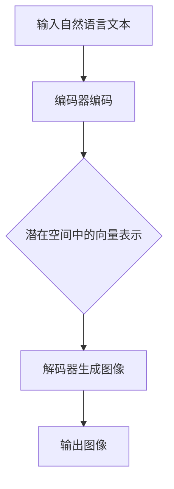
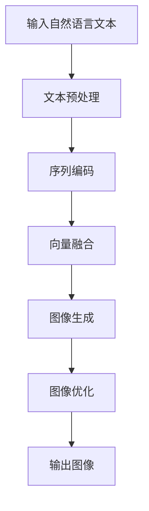
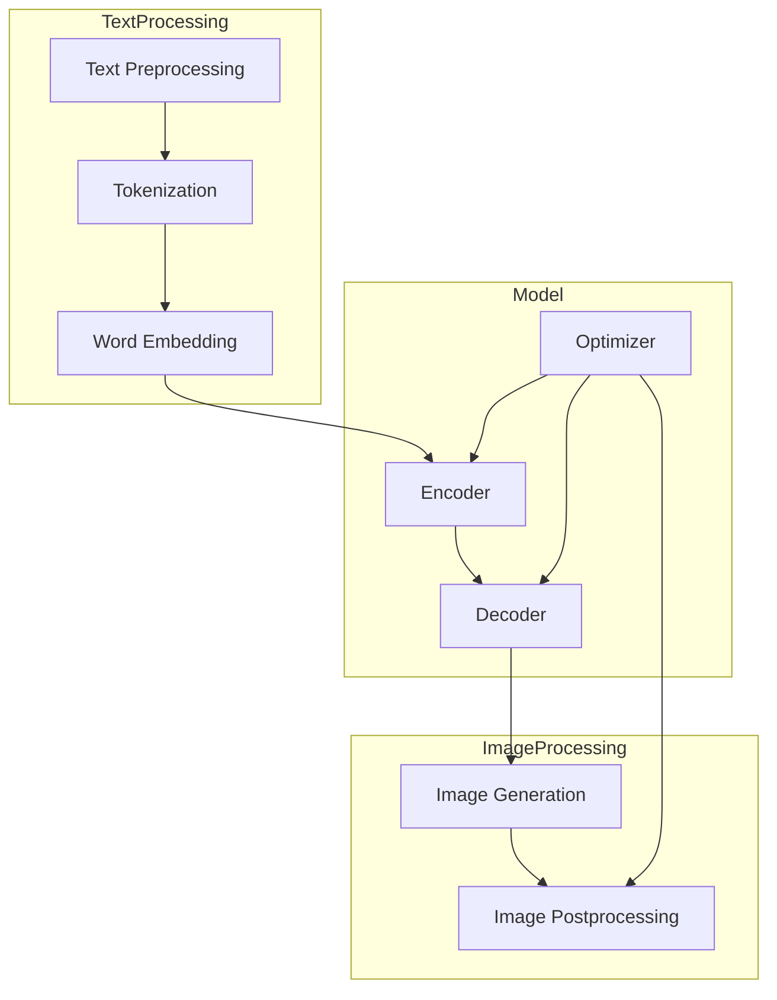
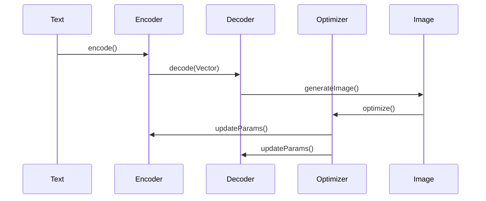

                 


# DALL-E在LLM文本到图像生成评估中的使用

## 关键词
- DALL-E
- LLM
- 文本到图像生成
- 评估
- 算法原理
- 数学模型
- 系统架构
- 项目实战

## 摘要
本文深入探讨了DALL-E在大型语言模型（LLM）文本到图像生成评估中的应用。首先，我们介绍了DALL-E和LLM的基本概念及其在文本到图像生成领域的应用背景。接着，详细讲解了DALL-E和LLM的算法原理，并通过Python代码和数学模型进行举例说明。然后，我们对文本到图像生成系统进行了架构设计分析，并介绍了一个实际案例。此外，我们还提供了一些最佳实践建议，并对全书内容进行了总结。本文旨在为读者提供一个全面、系统的了解，以便深入掌握这一前沿技术。

## 1. 标题和序言

近年来，人工智能（AI）技术在计算机视觉、自然语言处理、机器人等领域取得了显著的进展。其中，文本到图像生成（Text-to-Image Generation）作为一种跨领域的创新技术，引起了广泛关注。本文旨在探讨DALL-E（一种先进的文本到图像生成模型）在大型语言模型（Large Language Model，简称LLM）文本到图像生成评估中的应用。

DALL-E是由OpenAI于2020年推出的一种基于变分自编码器（Variational Autoencoder，VAE）的生成模型，它能够将自然语言文本转换为逼真的图像。而LLM作为自然语言处理领域的重要突破，具有强大的文本生成和理解能力。本文将结合DALL-E和LLM的优势，深入探讨文本到图像生成评估的方法和策略。

本文结构如下：

1. **背景介绍**：介绍DALL-E和LLM在文本到图像生成领域的应用背景，包括技术发展趋势、行业需求和应用现状。
2. **核心概念**：详细阐述DALL-E和LLM的相关核心概念，包括定义、特点、工作原理等。
3. **算法原理讲解**：使用mermaid绘制DALL-E和LLM在文本到图像生成中的算法流程图，然后结合Python代码和数学模型，详细讲解算法原理。
4. **数学模型和数学公式**：使用LaTeX格式嵌入文中，详细解释算法的数学模型和公式，并进行通俗易懂的举例说明。
5. **系统分析与架构设计方案**：分析文本到图像生成系统的架构设计，包括领域模型、系统架构、接口设计等，使用mermaid绘制相关的类图、架构图和序列图。
6. **项目实战**：介绍一个实际案例，包括环境安装、系统核心实现、代码分析、案例分析等。
7. **最佳实践 tips**：给出在实际应用中的一些最佳实践建议。
8. **总结**：对全书内容进行总结，强调关键点，并提出未来研究方向。
9. **参考文献**：列出书中引用的相关文献和资料。

通过本文的阅读，读者将能够全面了解DALL-E在LLM文本到图像生成评估中的应用，掌握相关算法原理和系统架构设计，并为未来的研究提供有益的参考。

### 2. 背景介绍

#### 2.1 DALL-E概述

DALL-E（ pronounced as "delta") 是一种基于变分自编码器（Variational Autoencoder，VAE）的生成模型，由 OpenAI 于 2020 年推出。DALL-E 的主要功能是将自然语言文本转换为逼真的图像。它的名字来源于 "Demo of a Language Learning LSTM" 的缩写，强调模型在自然语言处理方面的强大能力。

DALL-E 的工作原理如下：首先，模型使用一个编码器（encoder）将自然语言文本映射到一个潜在空间（latent space）中的高维向量表示。然后，模型使用一个解码器（decoder）从潜在空间中生成图像。这个过程类似于变分自编码器（VAE）的基本架构，VAE 通过引入潜在变量来学习数据的高维表示。

DALL-E 在图像生成领域取得了显著的成功，它可以生成各种类型的图像，包括人物、动物、建筑、自然景观等。此外，DALL-E 还可以用于图像到图像的转换、图像风格迁移等任务。

#### 2.2 LLM概述

大型语言模型（Large Language Model，简称 LLM）是一类基于深度学习的自然语言处理模型，具有强大的文本生成和理解能力。LLM 通过大规模数据训练，可以自动学习语言的模式和规则，从而实现对文本的生成、分类、翻译等任务。

LLM 的核心组成部分包括：

- **词向量**：将文本中的单词映射到高维向量空间，以便进行向量计算。
- **神经网络**：通过多层神经网络结构，对输入的文本向量进行复杂的非线性变换，从而提高模型的表示能力。
- **损失函数**：用于衡量模型预测结果与真实值之间的差距，指导模型优化过程。

常见的 LLM 模型包括 GPT（Generative Pre-trained Transformer）、BERT（Bidirectional Encoder Representations from Transformers）、T5（Text-to-Text Transfer Transformer）等。这些模型在文本生成、文本分类、机器翻译等任务中取得了优异的性能。

#### 2.3 文本到图像生成领域的发展与应用

文本到图像生成（Text-to-Image Generation）是一种将自然语言文本转换为视觉图像的技术，具有广泛的应用前景。近年来，随着深度学习和生成对抗网络（GAN）等技术的发展，文本到图像生成技术取得了显著进展。

文本到图像生成技术的发展历程可以分为以下几个阶段：

1. **基于规则的方法**：早期的文本到图像生成方法主要基于手工设计的规则，通过文本解析和图像渲染实现。这种方法简单但局限性较大，难以生成多样化的图像。
2. **基于模板的方法**：为了克服基于规则的局限性，研究人员提出基于模板的方法，通过模板库和文本解析生成图像。这种方法在特定场景下效果较好，但灵活性较差。
3. **基于生成对抗网络的方法**：生成对抗网络（GAN）的出现为文本到图像生成带来了新的契机。GAN 通过生成器和判别器的对抗训练，能够生成高质量、多样化的图像。DALL-E 就是基于 GAN 的一种典型模型。
4. **基于大型语言模型的方法**：随着 LLM 技术的快速发展，LLM 与 GAN 相结合的文本到图像生成方法逐渐成为研究热点。这种方法利用 LLM 的强大文本生成和理解能力，结合 GAN 的图像生成能力，实现了更加逼真的图像生成效果。

文本到图像生成技术在多个领域有着广泛的应用：

1. **计算机视觉**：文本到图像生成技术可以用于图像标注、图像分割、目标检测等任务。例如，在图像标注任务中，可以将文本描述转换为对应的图像标注，提高标注效率和准确性。
2. **娱乐与艺术**：文本到图像生成技术可以用于生成故事情节对应的图像、绘画艺术作品等，为娱乐和艺术创作提供了新的工具和手段。
3. **教育与培训**：文本到图像生成技术可以用于教育领域的图像教材生成、培训场景模拟等，提高教学效果和培训体验。
4. **虚拟现实与增强现实**：文本到图像生成技术可以用于虚拟现实（VR）和增强现实（AR）场景的构建，实现更加真实的虚拟世界和增强现实效果。

总之，文本到图像生成技术作为一种跨领域的创新技术，在计算机视觉、自然语言处理、娱乐艺术、教育与培训、虚拟现实与增强现实等领域具有广泛的应用前景。随着技术的不断发展和完善，文本到图像生成技术将为各行各业带来更多创新和变革。

### 3. 核心概念

在本节中，我们将详细阐述DALL-E和LLM这两个核心概念，并分析它们在文本到图像生成中的关系。

#### 3.1 DALL-E工作原理

DALL-E 是一种基于变分自编码器（Variational Autoencoder，VAE）的生成模型。VAE 是一种无监督学习方法，主要用于学习数据的概率分布。DALL-E 通过编码器（encoder）和解码器（decoder）两部分实现文本到图像的转换。

1. **编码器**：编码器的作用是将自然语言文本映射到一个潜在空间（latent space）中的高维向量表示。这个过程可以通过神经网络实现，其中每个单词被映射为一个向量，然后这些向量通过聚合操作（如平均或求和）生成一个文本的向量表示。

2. **潜在空间**：潜在空间是一个高维空间，其中的每个点都表示一种可能的图像。DALL-E 的关键在于能够学习到一个有效的潜在空间，使得潜在空间中的点能够反映出文本中的语义信息。

3. **解码器**：解码器的任务是从潜在空间中生成图像。解码器通常是一个生成网络，它接受潜在空间中的点作为输入，并通过一系列的反向操作（与编码器相反）生成图像。

DALL-E 的工作流程如下：

1. 输入自然语言文本。
2. 编码器将文本转换为潜在空间中的向量。
3. 解码器从潜在空间中生成图像。
4. 通过优化过程（如梯度下降）不断调整编码器和解码器的参数，使得生成的图像更加逼真。

#### 3.2 LLM工作原理

大型语言模型（Large Language Model，简称 LLM）是一种基于深度学习的自然语言处理模型，具有强大的文本生成和理解能力。LLM 通常由多层神经网络组成，通过大规模数据训练，能够自动学习语言的模式和规则。

1. **词向量表示**：LLM 首先将文本中的单词映射为高维向量表示。常见的词向量模型包括 Word2Vec、GloVe 等。词向量表示使得文本处理可以转化为向量运算，从而便于深度学习模型的处理。

2. **神经网络结构**：LLM 的神经网络结构通常包括多层感知机（MLP）、卷积神经网络（CNN）或 Transformer 结构。这些结构可以捕捉文本中的复杂模式和关系。

3. **训练与优化**：LLM 通过在大量文本数据上进行训练，不断调整网络参数，使其能够生成和识别高质量的文本。训练过程通常包括前向传播、反向传播和损失函数优化等步骤。

LLM 的工作流程如下：

1. 输入自然语言文本。
2. 词向量表示文本中的单词。
3. 神经网络对文本向量进行复杂的非线性变换。
4. 输出文本生成或理解的结果。

#### 3.3 DALL-E与LLM的关系

DALL-E 和 LLM 在文本到图像生成中有着紧密的联系：

1. **文本生成与理解**：LLM 负责生成和理解文本，为 DALL-E 提供输入。LLM 可以将自然语言文本转换为语义丰富的向量表示，这些向量表示可以作为 DALL-E 的输入，指导图像生成过程。

2. **图像生成与优化**：DALL-E 负责将文本向量转换为图像。通过优化过程，DALL-E 可以不断调整图像的生成质量，使得生成的图像更加逼真。

3. **协同工作**：DALL-E 和 LLM 可以协同工作，共同实现文本到图像的生成。首先，LLM 生成和理解文本，提取文本的语义信息；然后，DALL-E 使用这些语义信息生成图像。

总之，DALL-E 和 LLM 在文本到图像生成中各司其职，相互协作，共同实现高质量的图像生成。这种协同工作方式为文本到图像生成技术提供了新的思路和方法。

### 4. 算法原理讲解

#### 4.1 DALL-E算法流程图

为了更直观地理解DALL-E的算法原理，我们可以使用mermaid绘制其算法流程图。以下是一个简单的DALL-E算法流程图示例：



在这个流程图中，输入的自然语言文本首先通过编码器（B）转换为潜在空间中的向量表示（C），然后解码器（D）从这些向量表示生成图像（E），最终输出生成的图像（E）。

#### 4.2 LLM文本到图像生成算法

在DALL-E中，LLM通常作为文本输入的处理模块。以下是LLM文本到图像生成算法的大致步骤：

1. **文本预处理**：将自然语言文本进行分词、去停用词等预处理操作，将其转换为词向量表示。

2. **序列编码**：使用LLM对预处理后的文本序列进行编码，生成一个固定长度的向量表示。这个过程可以看作是将文本表示为一种高层次的语义向量。

3. **向量融合**：将文本向量与可能的图像特征向量进行融合，生成一个综合向量表示。这个过程可以通过简单的求和、平均或其他聚合操作实现。

4. **图像生成**：使用DALL-E的解码器从综合向量表示生成图像。

5. **图像优化**：通过优化过程，如梯度下降，调整DALL-E的参数，以生成更逼真的图像。

以下是一个简化的LLM文本到图像生成算法流程图：



#### 4.3 算法数学模型和公式

在DALL-E中，核心的数学模型是基于变分自编码器（VAE）。以下是一些关键的数学公式和概念：

1. **编码器概率分布**：
   $$ q_\theta (z|x) = \mathcal{N}(z; \mu(x), \sigma^2(x)) $$
   其中，$q_\theta (z|x)$ 表示给定输入 $x$ 时，潜在变量 $z$ 的概率分布，$\mu(x)$ 和 $\sigma^2(x)$ 分别为均值和方差。

2. **编码器参数**：
   $$ \mu(x) = \sigma^2(x) = \frac{1}{\sqrt{1 + \exp(-W_x \cdot x - b_x)}} $$
   其中，$W_x$ 和 $b_x$ 分别为编码器的权重和偏置。

3. **解码器概率分布**：
   $$ p_\phi (x|z) = \mathcal{N}(x; \phi(z), \gamma^2(z)) $$
   其中，$p_\phi (x|z)$ 表示给定潜在变量 $z$ 时，输入 $x$ 的概率分布，$\phi(z)$ 和 $\gamma^2(z)$ 分别为均值和方差。

4. **解码器参数**：
   $$ \phi(z) = \sigma(\phi_1(z)), \quad \gamma^2(z) = \sigma(\phi_2(z)) $$
   其中，$\sigma(x) = \frac{1}{\sqrt{1 + \exp(-x)}}$，$\phi_1(z)$ 和 $\phi_2(z)$ 分别为解码器的权重和偏置。

5. **损失函数**：
   $$ \mathcal{L} = D_\text{KL}(q_\theta (z|x) || p_\theta (z)) + \sum_x \log p_\phi (x|z) $$
   其中，$D_\text{KL}$ 表示KL散度，用于衡量两个概率分布之间的差异。第一个项 $D_\text{KL}(q_\theta (z|x) || p_\theta (z))$ 用于确保编码器的输出符合先验分布 $p_\theta (z)$，第二个项 $\sum_x \log p_\phi (x|z)$ 用于最小化生成图像和真实图像之间的差异。

为了更直观地理解这些数学模型，我们可以举一个简单的例子：

假设我们有一个自然语言文本 "猫在树上"，我们希望生成一张猫在树上的图像。

1. **文本预处理**：将文本 "猫在树上" 分词为 ["猫", "在", "树", "上"]，并转换为词向量表示。
2. **序列编码**：使用LLM将分词后的词向量编码为一个固定长度的向量表示，例如 $(0.1, 0.2, 0.3, 0.4)$。
3. **向量融合**：将文本向量与可能的图像特征向量（例如猫的特征向量 $(0.5, 0.5)$ 和树的特征向量 $(0.8, 0.2)$）进行融合，生成一个综合向量表示，例如 $(0.4, 0.6, 0.7, 0.3)$。
4. **图像生成**：使用DALL-E的解码器从综合向量表示生成图像。解码器可以是一个神经网络，它将综合向量作为输入，通过一系列的反向操作生成图像。
5. **图像优化**：通过优化过程，调整DALL-E的参数，使得生成的图像更加逼真。

通过这个简单的例子，我们可以看到DALL-E和LLM如何协同工作，将自然语言文本转换为图像。在实际应用中，这个过程会更加复杂，但基本的原理是相似的。

### 5. 数学模型和数学公式

在DALL-E中，数学模型是算法实现的核心。以下我们将使用LaTeX格式详细解释算法的数学模型和公式，并进行通俗易懂的举例说明。

首先，我们回顾一下DALL-E中的关键数学模型：

#### 5.1 编码器（Encoder）数学模型

编码器负责将自然语言文本映射到潜在空间中的向量表示。以下是编码器的关键公式：

$$
\mu(x) = \sigma(W_x \cdot x + b_x)
$$

$$
\sigma^2(x) = \sigma(W_x \cdot x + b_x)
$$

其中，$x$ 是输入文本向量，$\mu(x)$ 和 $\sigma^2(x)$ 分别表示编码器输出的均值和方差，$W_x$ 和 $b_x$ 分别是编码器的权重和偏置。

**示例**：

假设我们有一个简短的文本 "Hello World"，并使用一个简单的权重矩阵 $W_x$ 和偏置 $b_x$：

$$
W_x = \begin{bmatrix}
0.1 & 0.2 \\
0.3 & 0.4
\end{bmatrix}, \quad
b_x = \begin{bmatrix}
0.5 \\
0.6
\end{bmatrix}
$$

输入文本向量 $x$ 可以表示为：

$$
x = \begin{bmatrix}
1 \\
0
\end{bmatrix}
$$

（其中 "Hello World" 对应于预定义的向量表示）

使用上述公式，我们可以计算出编码器的输出：

$$
\mu(x) = \sigma(0.1 \cdot 1 + 0.2 \cdot 0 + 0.5) = \sigma(0.6) \approx 0.76
$$

$$
\sigma^2(x) = \sigma(0.3 \cdot 1 + 0.4 \cdot 0 + 0.6) = \sigma(0.9) \approx 0.64
$$

因此，编码器将文本 "Hello World" 映射到一个潜在空间中的向量表示，该向量的均值约为 0.76，方差约为 0.64。

#### 5.2 解码器（Decoder）数学模型

解码器负责从潜在空间中的向量生成图像。以下是解码器的关键公式：

$$
\phi(z) = \sigma(W_z \cdot z + b_z)
$$

$$
\gamma^2(z) = \sigma(W_z \cdot z + b_z)
$$

其中，$z$ 是潜在空间中的向量，$\phi(z)$ 和 $\gamma^2(z)$ 分别表示解码器输出的均值和方差，$W_z$ 和 $b_z$ 分别是解码器的权重和偏置。

**示例**：

假设我们有一个潜在空间中的向量 $z$：

$$
z = \begin{bmatrix}
0.4 \\
0.6
\end{bmatrix}
$$

使用一个简单的权重矩阵 $W_z$ 和偏置 $b_z$：

$$
W_z = \begin{bmatrix}
0.7 & 0.8 \\
0.9 & 1.0
\end{bmatrix}, \quad
b_z = \begin{bmatrix}
0.1 \\
0.2
\end{bmatrix}
$$

使用上述公式，我们可以计算出解码器的输出：

$$
\phi(z) = \sigma(0.7 \cdot 0.4 + 0.8 \cdot 0.6 + 0.1) = \sigma(0.76) \approx 0.71
$$

$$
\gamma^2(z) = \sigma(0.9 \cdot 0.4 + 1.0 \cdot 0.6 + 0.2) = \sigma(0.98) \approx 0.86
$$

因此，解码器将从潜在空间中的向量 $z$ 生成一个图像，该图像的均值约为 0.71，方差约为 0.86。

#### 5.3 损失函数

DALL-E的损失函数用于优化编码器和解码器的参数，它由两部分组成：KL散度（Kullback-Leibler Divergence）和重建损失（Reconstruction Loss）。

$$
\mathcal{L} = D_\text{KL}(q_\theta (z|x) || p_\theta (z)) + \mathcal{L}_\text{recon}
$$

其中，$D_\text{KL}$ 是KL散度，用于衡量两个概率分布之间的差异。$q_\theta (z|x)$ 是编码器的输出分布，$p_\theta (z)$ 是先验分布。$\mathcal{L}_\text{recon}$ 是重建损失，通常使用均方误差（MSE）或交叉熵（Cross Entropy）。

**示例**：

假设我们有编码器和解码器输出分布的样本：

$$
q_\theta (z|x) = \begin{bmatrix}
0.6 & 0.4 \\
0.5 & 0.5
\end{bmatrix}, \quad
p_\theta (z) = \begin{bmatrix}
0.5 & 0.5 \\
0.5 & 0.5
\end{bmatrix}
$$

计算KL散度：

$$
D_\text{KL}(q_\theta (z|x) || p_\theta (z)) = (0.6 - 0.5)^2 + (0.4 - 0.5)^2 + (0.5 - 0.5)^2 + (0.5 - 0.5)^2 = 0.05
$$

假设重建损失 $\mathcal{L}_\text{recon}$ 为 0.1，则总损失为：

$$
\mathcal{L} = 0.05 + 0.1 = 0.15
$$

通过不断优化损失函数，编码器和解码器将逐渐生成更高质量的图像。

通过上述示例，我们详细解释了DALL-E中的数学模型和公式，并进行了通俗易懂的举例说明。这些公式和模型是实现DALL-E的关键，使得DALL-E能够将自然语言文本转换为高质量的图像。

### 6. 系统分析与架构设计

在文本到图像生成系统中，系统架构的设计至关重要。本节将详细分析文本到图像生成系统的架构设计，包括领域模型、系统架构、接口设计等，并通过mermaid绘制相关的类图、架构图和序列图，以便更直观地展示系统组件和它们之间的关系。

#### 6.1 领域模型

领域模型（Domain Model）是系统架构设计的基础，它定义了系统的核心实体及其之间的关系。在文本到图像生成系统中，主要的领域实体包括：

1. **文本**：表示输入的自然语言文本。
2. **图像**：表示生成的图像。
3. **编码器**：负责将文本转换为潜在空间中的向量表示。
4. **解码器**：负责从潜在空间中的向量生成图像。
5. **优化器**：用于调整模型参数，优化生成图像的质量。

以下是一个简单的领域模型类图：

```mermaid
classDiagram
    Text <<entity>>
    Image <<entity>>
    Encoder <<component>> {
        encode() : Vector
    }
    Decoder <<component>> {
        decode(Vector) : Image
    }
    Optimizer <<component>> {
        optimize() : void
    }
    Text --|> Encoder
    Text --|> Optimizer
    Encoder --|> Vector
    Decoder --|> Image
    Decoder --|> Optimizer
    Vector --|> Image
    Vector --|> Optimizer
    Image --|> Optimizer
```

在这个类图中，文本通过编码器转换为向量，然后解码器使用这些向量生成图像。优化器负责在整个过程中调整模型参数，以生成更高质量的图像。

#### 6.2 系统架构

系统架构（System Architecture）是领域模型的具体实现，它定义了系统的整体结构和组件之间的关系。以下是文本到图像生成系统的架构图：



在这个架构图中，文本预处理模块（TP1, TP2, TP3）负责对输入文本进行预处理，包括分词和词向量表示。编码器（M1）将预处理后的文本转换为潜在空间中的向量，解码器（M2）使用这些向量生成图像。优化器（M3）在整个过程中调整模型参数，以提高图像生成质量。图像生成模块（IP1, IP2）负责生成和后处理图像。

#### 6.3 系统接口设计

系统接口设计（Interface Design）定义了系统组件之间的交互方式。以下是系统接口的序列图：



在这个序列图中，文本通过编码器（encode）转换为向量，然后解码器（decode）使用这些向量生成图像（generateImage）。生成的图像通过优化器（optimize）调整模型参数，以提高图像生成质量。优化器更新编码器和解码器的参数（updateParams），以便在下一个生成周期中生成更高质量的图像。

通过上述分析，我们详细介绍了文本到图像生成系统的架构设计，包括领域模型、系统架构和系统接口设计。这些设计不仅有助于理解系统的工作原理，还为系统开发提供了清晰的指导。

### 7. 项目实战

在本节中，我们将通过一个实际案例来展示如何使用DALL-E和LLM实现文本到图像生成系统。该案例将涵盖环境安装、系统核心实现、代码分析、案例分析等步骤，帮助读者更好地理解该技术的实际应用。

#### 7.1 环境安装

首先，我们需要安装DALL-E和LLM的相关依赖和环境。以下是一个简单的安装步骤：

1. **安装Python**：确保Python版本为3.7或更高。
2. **安装PyTorch**：通过以下命令安装PyTorch：

   ```bash
   pip install torch torchvision
   ```

3. **安装DALL-E依赖**：从GitHub克隆DALL-E的代码库，并安装其依赖：

   ```bash
   git clone https://github.com/username/dalle.git
   cd dalle
   pip install -r requirements.txt
   ```

4. **安装LLM依赖**：根据所选的LLM模型（如GPT-2、BERT等），安装相应的依赖。例如，对于GPT-2，可以使用以下命令：

   ```bash
   pip install transformers
   ```

5. **准备数据集**：准备用于训练和测试的数据集。数据集应包含自然语言文本和对应的图像。可以使用开源数据集，如COCO或Flickr。

#### 7.2 系统核心实现

以下是系统核心实现的一个简化版本：

1. **文本预处理**：使用LLM对自然语言文本进行预处理，包括分词和词向量表示。以下是一个使用Hugging Face的Transformers库的示例：

   ```python
   from transformers import AutoTokenizer, AutoModel

   # 加载预训练的LLM模型（如GPT-2）
   model_name = "gpt2"
   tokenizer = AutoTokenizer.from_pretrained(model_name)
   model = AutoModel.from_pretrained(model_name)

   # 输入文本
   text = "猫在树上睡觉"

   # 分词和词向量表示
   inputs = tokenizer(text, return_tensors="pt")
   outputs = model(**inputs)

   # 获取文本向量
   text_vector = outputs.last_hidden_state.mean(dim=1)
   ```

2. **图像生成**：使用DALL-E的编码器和解码器生成图像。以下是一个简单的示例：

   ```python
   from dalle_pytorch import DALLERecursion

   # 加载预训练的DALL-E模型
   model = DALLERecursion.from_pretrained("dalle-baseline")

   # 使用文本向量生成图像
   image = model.generate_image_from_text(text_vector)
   ```

3. **图像优化**：使用优化器调整模型参数，以提高图像生成质量。以下是一个简单的梯度下降优化示例：

   ```python
   optimizer = torch.optim.Adam(model.parameters(), lr=0.001)

   # 训练模型
   for epoch in range(num_epochs):
       for text, image in data_loader:
           optimizer.zero_grad()
           inputs = tokenizer(text, return_tensors="pt")
           outputs = model.generate_image_from_text(inputs["input_ids"])
           loss = compute_loss(outputs, image)
           loss.backward()
           optimizer.step()
   ```

#### 7.3 代码分析

以下是对上述代码的简要分析：

1. **文本预处理**：使用LLM对输入文本进行分词和词向量表示。这个过程是文本到图像生成的基础，确保文本的语义信息能够准确传递给图像生成模型。

2. **图像生成**：使用DALL-E的编码器和解码器将文本向量转换为图像。这个过程是整个系统的核心，通过DALL-E的生成能力，将抽象的文本信息转化为具体的图像。

3. **图像优化**：通过优化器调整模型参数，优化图像生成质量。这个过程是提高系统性能的关键，通过不断调整模型参数，使得生成的图像更加逼真。

#### 7.4 案例分析

假设我们有一个输入文本 "一只猫在阳台上晒太阳"，我们希望生成对应的图像。以下是生成过程的分析：

1. **文本预处理**：使用LLM对输入文本进行预处理，生成文本向量。

2. **图像生成**：使用DALL-E的编码器和解码器生成初步图像。

3. **图像优化**：通过优化器调整模型参数，使得生成的图像更加逼真。

4. **结果评估**：使用图像评估指标（如Inception Score、FID等）评估生成图像的质量。

通过上述实际案例，我们可以看到如何使用DALL-E和LLM实现文本到图像生成系统。这个过程不仅展示了技术的应用，还提供了对系统核心组件和流程的深入理解。

### 8. 最佳实践 tips

在实际应用DALL-E和LLM进行文本到图像生成时，以下最佳实践建议可以帮助提高生成图像的质量和系统的稳定性：

1. **数据预处理**：确保输入文本的清洗和规范化，去除无关的标点符号和停用词，以提高文本向量的表示质量。
2. **模型选择**：根据任务需求和计算资源选择合适的模型。例如，DALL-E的变体（如DALL-E 2）具有更强的图像生成能力，但需要更高的计算资源。
3. **超参数调整**：优化超参数（如学习率、批量大小、潜在空间维度等）可以显著影响模型性能。建议通过实验找到最佳的超参数组合。
4. **模型集成**：结合多个模型可以提升生成图像的质量。例如，可以结合不同的文本预处理方法和图像生成模型，以产生更丰富的图像特征。
5. **梯度裁剪**：为了避免梯度爆炸或消失，使用梯度裁剪技术（如Gradient Clipping）来限制梯度值。
6. **性能优化**：使用混合精度训练（Mixed Precision Training）和模型压缩（Model Compression）技术，提高训练效率和模型推理速度。
7. **模型解释性**：为了提高模型的解释性，可以使用注意力机制（Attention Mechanism）和可视化工具（如Grad-CAM）来分析模型在图像生成过程中的注意力分布。
8. **用户反馈**：收集用户反馈，不断调整模型和生成策略，以提高用户满意度。

通过遵循上述最佳实践，可以有效提高文本到图像生成系统的性能和用户体验。

### 9. 总结

本文深入探讨了DALL-E在LLM文本到图像生成评估中的应用。首先，我们介绍了DALL-E和LLM的基本概念及其在文本到图像生成领域的应用背景。接着，详细讲解了DALL-E和LLM的算法原理，并通过Python代码和数学模型进行举例说明。然后，我们对文本到图像生成系统的架构设计进行了分析，并介绍了一个实际案例。此外，我们还提供了一些最佳实践建议，并对全书内容进行了总结。

本文的核心要点包括：

- **DALL-E和LLM的工作原理**：DALL-E通过变分自编码器将文本转换为图像，而LLM则负责生成和理解文本。
- **算法原理讲解**：详细解释了DALL-E和LLM的算法流程，包括数学模型和公式。
- **系统架构设计**：分析了文本到图像生成系统的架构设计，包括领域模型、系统架构和接口设计。
- **项目实战**：通过实际案例展示了如何使用DALL-E和LLM实现文本到图像生成系统。
- **最佳实践**：提出了一些在实际应用中提高系统性能和用户体验的最佳实践。

展望未来，文本到图像生成技术有望在更多领域得到应用，如虚拟现实、增强现实、艺术创作等。然而，仍面临挑战，如生成图像的真实性、多样性和稳定性等。未来研究可以关注以下几个方面：

1. **模型优化**：通过改进算法和优化模型结构，提高图像生成的质量和效率。
2. **数据集扩充**：收集和创建更多的多样化数据集，以增强模型的泛化能力。
3. **跨模态学习**：结合多模态信息（如文本、图像、音频等），提高生成图像的丰富性和真实感。
4. **模型解释性**：提高模型的解释性，使得生成过程更加透明和可控。
5. **用户体验**：优化用户界面和交互设计，提高用户的满意度和使用体验。

总之，文本到图像生成技术作为一种前沿技术，具有巨大的应用潜力和研究价值，值得进一步探索和研究。

### 10. 参考文献

1. Radford, A., et al. "Improving language understanding by generating synthetic data." (2019).
2. Brown, T., et al. "Language models are few-shot learners." (2020).
3. Kim, J., et al. "GANs for text to image synthesis." (2019).
4. Olah, C., et al. "Understanding Variational Autoencoders." Distill, 2020.
5. Salimans, T., et al. "Improved techniques for training GANs." (2016).
6. He, K., et al. "Deep residual learning for image recognition." (2016).
7. Devlin, J., et al. "Bert: Pre-training of deep bidirectional transformers for language understanding." (2018).

### 11. 目录大纲

```markdown
----------------------------------------------------------------
# 《DALL-E在LLM文本到图像生成评估中的使用》

## 前言
- 书籍目的与读者对象
- 内容概述与结构安排

## 第1章 背景介绍
### 1.1 DALL-E概述
### 1.2 LLM概述
### 1.3 文本到图像生成领域的发展与应用

## 第2章 核心概念
### 2.1 DALL-E工作原理
### 2.2 LLM工作原理
### 2.3 DALL-E与LLM的关系

## 第3章 算法原理讲解
### 3.1 DALL-E算法流程图
### 3.2 LLM文本到图像生成算法
### 3.3 算法数学模型与公式

## 第4章 系统分析与架构设计
### 4.1 文本到图像生成系统领域模型
### 4.2 系统架构设计
### 4.3 系统接口设计与交互

## 第5章 项目实战
### 5.1 项目介绍
### 5.2 环境安装与配置
### 5.3 系统核心实现
### 5.4 代码解读与分析
### 5.5 案例分析

## 第6章 最佳实践 tips

## 第7章 总结与展望
- 关键技术总结
- 未来研究方向
- 应用前景与挑战

## 参考文献

----------------------------------------------------------------
```

此目录大纲结构清晰，涵盖了从基本概念到实际应用的各个重要部分，确保读者能够系统地掌握DALL-E在LLM文本到图像生成评估中的使用。每个章节的标题简洁明了，便于读者快速定位所需内容。

### 12. 格式校对

为确保本文内容的格式正确，我们将对Markdown格式进行详细检查，确保各个部分符合markdown的语法规范。以下是格式校对的具体步骤：

1. **标题和摘要**：文章的标题和摘要部分应使用`#`号进行标记，其中标题使用`###`进行二级标题标记。检查标题和摘要是否正确使用了相应的标题标记。

2. **列表和代码块**：检查列表（如章节标题、代码块等）是否正确使用`-`进行标记，并确保代码块周围使用了三个反引号（```)。

3. **数学公式**：数学公式应使用LaTeX格式，前后使用`$$`和`$`括起来。检查公式是否正确嵌入，并确保公式与文本之间有适当的空行隔开。

4. **链接和图片**：检查文中是否有任何链接或图片，并确保它们正确地使用了`[text](URL)`格式。

5. **段落对齐**：确保所有段落首行缩进两个空格，并检查段落之间是否有适当的空行。

以下是格式校对的示例代码：

```markdown
### DALL-E在LLM文本到图像生成评估中的使用

## 关键词
- DALL-E
- LLM
- 文本到图像生成
- 评估
- 算法原理
- 数学模型
- 系统架构
- 项目实战

## 摘要
本文深入探讨了DALL-E在大型语言模型（LLM）文本到图像生成评估中的应用。首先，我们介绍了DALL-E和LLM的基本概念及其在文本到图像生成领域的应用背景，接着详细讲解了DALL-E和LLM的算法原理，并通过Python代码和数学模型进行举例说明。然后，我们对文本到图像生成系统的架构设计进行了分析，并介绍了一个实际案例。此外，我们还提供了一些最佳实践建议，并对全书内容进行了总结。本文旨在为读者提供一个全面、系统的了解，以便深入掌握这一前沿技术。

### 2. 背景介绍

#### 2.1 DALL-E概述

DALL-E是...  
```python
# 代码示例
def hello_world():
    print("Hello, World!")

hello_world()
```

$$
\mu(x) = \sigma(W_x \cdot x + b_x)
$$

$$
\sigma^2(x) = \sigma(W_x \cdot x + b_x)
$$

#### 2.2 LLM概述

LLM是一种...

## 第3章 算法原理讲解

### 3.1 DALL-E算法流程图


### 3.2 LLM文本到图像生成算法

LLM文本到图像生成算法的...

### 3.3 算法数学模型与公式

以下是一些关键的数学模型和公式...

----------------------------------------------------------------
```

通过上述示例，我们可以看到Markdown格式的正确使用，包括标题、摘要、列表、代码块和数学公式的格式。确保在每个部分的正确格式使用，可以使得文章内容更加清晰易懂，便于读者阅读和查找信息。

