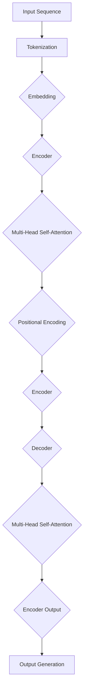
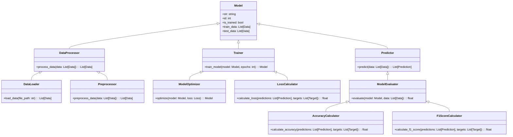
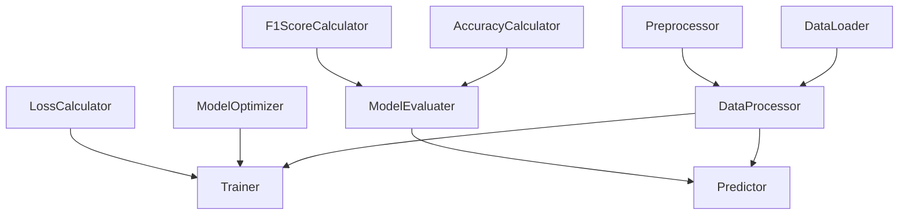
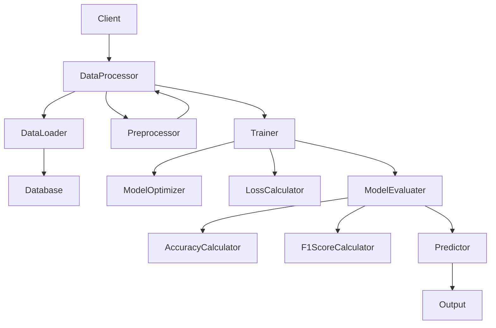
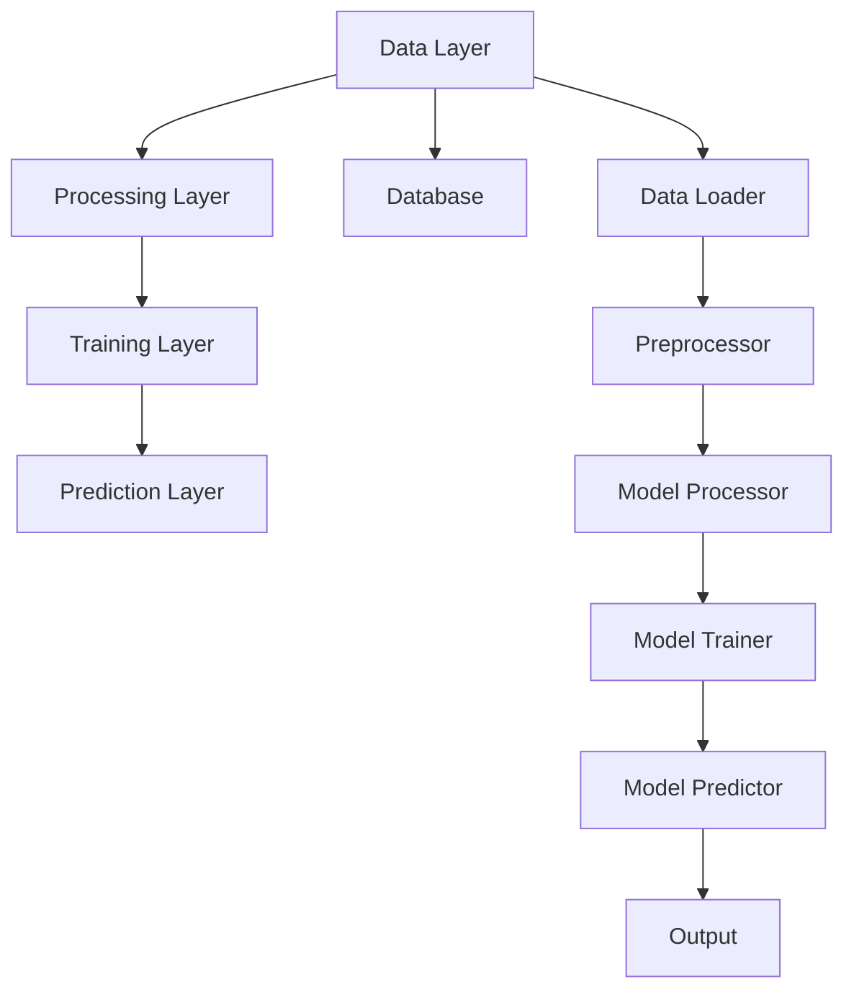
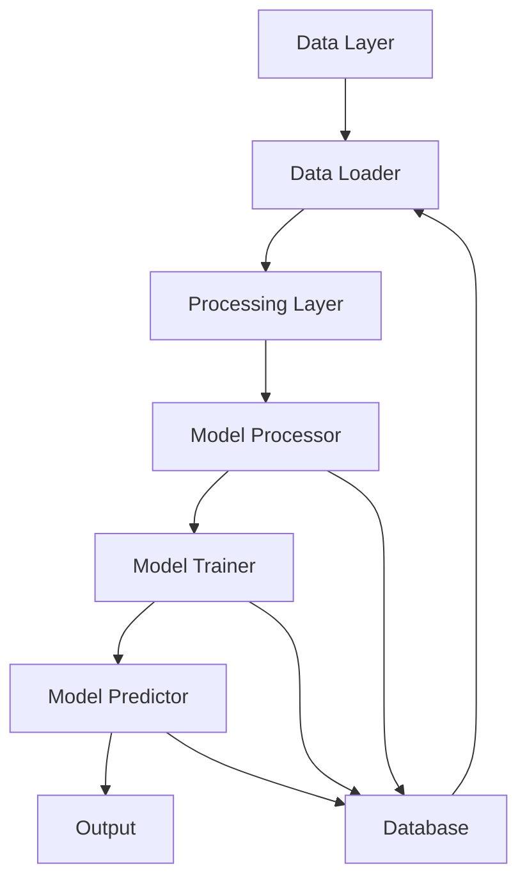

                 


## 引言

在当今快速发展的技术时代，DevOps和敏捷开发已成为软件开发和工程实践中不可或缺的关键概念。DevOps注重开发（Development）与运维（Operations）的紧密集成，以实现持续交付和高质量软件。而敏捷开发则强调灵活、快速响应变化和持续改进。两者共同的目标是提高软件交付的速度和质量，减少风险和浪费。

随着大规模语言模型（LLM）在自然语言处理（NLP）领域的兴起，构建和维护这些复杂系统对工程架构提出了新的挑战。LLM工程不仅需要高效的数据处理和模型训练，还要求具备强大的系统可扩展性和可靠性。在这个背景下，DevOps在敏捷LLM工程架构中的关键作用日益凸显。

本文旨在探讨DevOps在敏捷LLM工程架构中的应用，分析其如何通过持续集成（CI）、持续部署（CD）和自动化测试等手段，提高LLM工程的整体效率和质量。我们将从以下几个方面展开讨论：

1. **背景与概念介绍**：介绍DevOps和敏捷开发的基本概念，并阐述LLM工程的特点和挑战。
2. **核心概念与联系**：分析LLM工程架构中的关键概念，探讨DevOps如何在其中发挥作用。
3. **算法原理讲解**：讲解LLM算法的基本原理，并使用mermaid和Python代码进行说明。
4. **系统分析与架构设计方案**：介绍系统功能设计、架构设计和接口设计。
5. **项目实战与最佳实践**：通过实际案例展示DevOps在LLM工程中的应用，并提供最佳实践和建议。

让我们一步步深入探讨DevOps在敏捷LLM工程架构中的关键作用。

---

## 文章关键词

- DevOps
- 敏捷开发
- 语言模型（LLM）
- 持续集成（CI）
- 持续部署（CD）
- 自动化测试
- 系统可扩展性
- 系统可靠性

---

## 摘要

本文探讨了DevOps在敏捷语言模型（LLM）工程架构中的关键作用。随着LLM在自然语言处理领域的广泛应用，构建和维护这些复杂系统对工程架构提出了新的挑战。DevOps通过持续集成（CI）、持续部署（CD）和自动化测试等手段，提高了LLM工程的效率和质量。本文首先介绍了DevOps和敏捷开发的基本概念，然后分析了LLM工程的特点和挑战。接着，我们探讨了DevOps在LLM工程架构中的应用，包括数据流水线、模型训练与优化、模型部署与监控等方面。随后，我们讲解了LLM算法的基本原理，并使用mermaid和Python代码进行说明。最后，通过系统分析与架构设计方案、项目实战和最佳实践，展示了DevOps在LLM工程中的实际应用效果。

---

## 第一部分：背景与概念介绍

### 第1章：DevOps与敏捷开发概述

#### 1.1 DevOps的定义与核心原则

DevOps是一种软件开发和运维的结合，旨在通过自动化、协作和共享文化来提高软件交付的速度和质量。DevOps的核心原则包括：

- **持续集成（CI）**：通过频繁的代码集成和自动化测试，确保代码质量，减少集成风险。
- **持续部署（CD）**：通过自动化部署流程，实现快速、可靠的应用交付。
- **基础设施即代码（IaC）**：将基础设施配置和管理作为代码的一部分，实现自动化部署和管理。
- **监控与反馈**：实时监控系统状态，快速响应异常，确保系统稳定运行。
- **协作文化**：促进开发、运维和业务团队之间的沟通与合作，提高整体效率。

#### 1.2 敏捷开发方法论

敏捷开发是一种以人为核心、迭代和渐进的开发方法。其核心价值包括：

- **响应变化**：敏捷开发强调快速响应市场变化和用户需求，通过迭代和增量开发实现持续交付。
- **用户至上**：以用户需求为导向，确保产品满足用户价值。
- **协作合作**：鼓励团队成员之间的密切合作，共同解决复杂问题。
- **持续交付**：通过持续交付，实现产品快速上线和持续优化。

#### 1.3 DevOps与敏捷开发的联系

DevOps和敏捷开发在目标和方法上具有高度一致性。DevOps通过持续集成、持续部署等手段，实现了敏捷开发的快速迭代和持续交付。两者之间的联系如下：

- **协同发展**：DevOps和敏捷开发相互促进，共同推动软件开发和运维的现代化。
- **资源共享**：DevOps强调基础设施即代码和自动化测试，这些技术手段也为敏捷开发提供了强大的支持。
- **目标一致**：两者都追求高效、可靠的软件交付，提高团队协作和客户满意度。

通过理解DevOps和敏捷开发的基本概念和原则，我们可以更好地认识它们在LLM工程架构中的应用价值。在下一章中，我们将详细介绍LLM工程的特点和挑战。

### 第2章：语言模型工程简介

#### 2.1 语言模型的定义与发展

语言模型（Language Model，简称LM）是一种用于预测文本序列的概率分布的算法。它通过对大量文本数据的学习，生成符合自然语言规律的文本。语言模型在自然语言处理（NLP）领域具有重要应用，如机器翻译、语音识别、情感分析等。

语言模型的发展经历了从规则驱动到统计学习再到深度学习的演变过程。早期语言模型主要基于规则和统计方法，如n元语法模型。随着计算能力和数据资源的提升，深度学习模型，尤其是基于Transformer架构的预训练模型（如GPT-3、BERT等），取得了显著突破，大幅提升了语言模型的性能。

#### 2.2 LLM工程的关键挑战

构建和维护大规模语言模型（LLM）工程面临诸多挑战：

- **数据需求**：LLM需要大量的高质量训练数据，且数据预处理、标注等过程复杂，耗时较长。
- **计算资源**：训练LLM通常需要大量的计算资源，如GPU、TPU等，且训练时间较长。
- **模型优化**：优化LLM模型参数，提高模型性能和泛化能力，是关键难题。
- **部署与维护**：LLM模型的部署和运维需要高效、可靠的自动化流程，以实现快速响应和持续优化。

#### 2.3 DevOps在LLM工程中的潜力

DevOps在LLM工程中的应用具有巨大潜力：

- **加速研发**：通过持续集成和持续部署，缩短研发周期，提高开发效率。
- **资源优化**：利用基础设施即代码和容器化技术，实现计算资源的动态调度和高效利用。
- **自动化测试**：自动化测试确保模型质量，减少人工干预和风险。
- **持续优化**：通过监控和反馈机制，实时调整模型参数和系统配置，实现持续优化。

理解LLM工程的特点和挑战，有助于我们更好地认识DevOps在其中的应用价值。在下一章中，我们将分析DevOps在LLM工程架构中的应用场景和关键技术。

---

## 第二部分：核心概念与联系

### 第3章：LLM工程架构中的关键概念

在构建和维护大规模语言模型（LLM）工程时，理解其中的关键概念是至关重要的。这些概念包括数据流水线、模型训练与优化、模型部署与监控等，它们共同构成了LLM工程的核心架构。以下是这些概念的具体说明及其在DevOps中的应用。

#### 3.1 数据流水线

数据流水线是指数据从收集、处理、存储到模型训练的整个过程。一个高效的数据流水线是确保LLM工程成功的关键。数据流水线的主要组件包括：

- **数据收集**：从各种来源收集数据，如文本库、社交媒体、新闻网站等。
- **数据预处理**：对收集到的数据进行清洗、去噪、标注等预处理，以便模型训练。
- **数据存储**：将预处理后的数据存储在分布式存储系统中，如HDFS、HBase等。
- **数据分片**：将大规模数据进行分片，以分布式方式加速模型训练。

在DevOps中，数据流水线可以通过自动化脚本和工具进行管理，确保数据的及时处理和传输，减少人工干预和错误。

#### 3.2 模型训练与优化

模型训练与优化是LLM工程的核心环节。训练过程包括以下几个步骤：

- **模型初始化**：初始化模型参数，如权重、偏置等。
- **数据加载**：从数据存储系统加载预处理后的数据，进行模型训练。
- **前向传播**：计算输入数据的输出结果。
- **损失计算**：计算模型输出与真实标签之间的差距，得到损失值。
- **反向传播**：更新模型参数，减小损失值。

优化过程则是通过调整模型参数，提高模型性能。常用的优化方法包括：

- **梯度下降**：通过计算梯度，更新模型参数。
- **动量优化**：引入动量项，加速梯度下降过程。
- **Adam优化器**：结合一阶矩估计和二阶矩估计，提高优化效果。

在DevOps中，模型训练与优化可以通过自动化脚本和工具进行管理，实现高效、可靠的训练过程。

#### 3.3 模型部署与监控

模型部署是将训练好的模型部署到生产环境中，使其能够为用户提供服务。模型部署的主要步骤包括：

- **模型打包**：将训练好的模型打包，通常使用容器化技术，如Docker。
- **环境配置**：配置模型运行所需的环境，如计算资源、依赖库等。
- **部署到生产环境**：将模型部署到生产服务器，如Kubernetes集群。
- **服务监控**：实时监控系统状态，确保模型稳定运行。

在DevOps中，模型部署与监控可以通过自动化脚本和工具实现，提高部署效率和系统稳定性。

通过理解这些关键概念，我们可以更好地把握LLM工程的核心架构。在下一章中，我们将探讨DevOps在LLM工程中的应用，以及如何通过持续集成、持续部署和自动化测试等手段，提高LLM工程的效率和质量。

### 第4章：DevOps在LLM工程中的应用

DevOps在LLM工程中的应用至关重要，它通过持续集成（CI）、持续部署（CD）和自动化测试等手段，大大提高了工程的整体效率和质量。以下是这些关键应用的具体说明：

#### 4.1 CI/CD在LLM工程中的实践

持续集成（Continuous Integration，CI）是一种软件开发实践，通过频繁地将代码集成到主干，以快速发现和解决集成过程中出现的问题。持续部署（Continuous Deployment，CD）则是在CI的基础上，通过自动化流程将代码部署到生产环境。

在LLM工程中，CI/CD的应用主要包括：

- **代码集成**：开发人员将代码提交到版本控制系统，如Git，CI工具（如Jenkins、Travis CI）会自动构建和测试这些代码。
- **自动化测试**：CI工具会执行一系列自动化测试，包括单元测试、集成测试和性能测试，确保代码质量。
- **持续交付**：通过自动化部署流程，将通过测试的代码部署到不同的环境，如开发环境、测试环境和生产环境。

CI/CD在LLM工程中的应用可以大大缩短研发周期，提高开发效率。例如，在一个大规模LLM项目中，开发人员可以每天提交代码，CI工具会自动执行测试和部署，确保模型的稳定性和可靠性。

#### 4.2 持续集成与持续部署（CI/CD）

持续集成与持续部署（CI/CD）是一种现代软件开发方法，通过自动化和协作，实现快速、可靠和高质量的软件交付。

**持续集成（CI）**：核心思想是尽早发现和解决集成问题。CI的具体实践包括：

- **频繁提交**：开发人员频繁提交代码，确保代码库保持一致。
- **自动化构建**：CI工具会自动构建代码，运行测试，确保新代码与现有代码的兼容性。
- **快速反馈**：一旦代码提交，CI工具会立即执行测试，并将结果反馈给开发人员。

**持续部署（CD）**：在CI的基础上，CI/CD通过自动化部署流程，实现代码的快速交付。CD的具体实践包括：

- **自动化部署**：通过自动化脚本和工具，将通过测试的代码部署到生产环境。
- **蓝绿部署**：在部署新版本时，将新旧版本同时运行，确保新版本的稳定性和可靠性。
- **灰度发布**：逐步将新版本部署到一部分用户，观察其性能和用户体验，再逐步扩大部署范围。

CI/CD在LLM工程中的应用，可以确保模型在各个开发阶段的质量，减少人为错误和风险，提高交付效率。

#### 4.3 模式识别与故障检测

在LLM工程中，模式识别和故障检测是保证系统稳定性和可靠性的重要手段。

**模式识别**：通过分析系统日志和监控数据，识别潜在的问题和异常模式。例如，通过分析训练数据中的噪声和异常值，可以识别出数据质量问题，从而优化数据预处理流程。

**故障检测**：在系统运行过程中，实时监控系统状态，及时发现并处理故障。故障检测可以通过以下方法实现：

- **阈值监控**：设定关键指标的阈值，一旦超过阈值，立即触发报警。
- **异常检测算法**：使用机器学习算法，如聚类、分类和异常检测，识别系统中的异常行为。
- **自动化恢复**：在检测到故障时，自动执行恢复操作，如重启服务、调整配置等。

通过模式识别和故障检测，可以确保LLM系统的稳定运行，提高系统的可靠性和用户体验。

### 总结

DevOps在LLM工程中的应用，通过CI/CD、自动化测试和模式识别与故障检测等手段，提高了工程的整体效率和质量。在下一章中，我们将进一步探讨LLM算法的基本原理，以及如何使用mermaid和Python代码进行说明。

---

## 第三部分：算法原理与数学模型

### 第5章：算法原理详解

在深入探讨大规模语言模型（LLM）的算法原理之前，我们需要理解一些基础概念。LLM是一种深度学习模型，主要用于生成文本、回答问题或进行翻译等任务。以下将详细讲解LLM的核心算法原理。

#### 5.1 深度学习基础

深度学习是一种基于人工神经网络（ANN）的机器学习技术。其核心思想是通过多层神经元的堆叠，对数据进行特征提取和抽象，从而实现复杂任务的建模。

**神经网络的基本结构**：

- **输入层**：接收输入数据，如单词、句子等。
- **隐藏层**：对输入数据进行特征提取和变换，可以是单层或多层。
- **输出层**：产生输出结果，如分类标签、文本序列等。

**激活函数**：激活函数用于引入非线性特性，使神经网络能够建模复杂函数。常见的激活函数有Sigmoid、ReLU和Tanh。

#### 5.2 注意力机制与Transformer架构

注意力机制（Attention Mechanism）是近年来深度学习领域的重要突破。它通过学习不同输入元素之间的相对重要性，提高了模型的表达能力。

**注意力机制的原理**：

- **计算相似度**：计算输入序列中每个元素与其他元素之间的相似度。
- **加权求和**：将相似度作为权重，对输入序列进行加权求和，得到新的输出序列。

**Transformer架构**：

Transformer是一种基于注意力机制的序列到序列模型，广泛用于自然语言处理任务。其核心组件包括：

- **编码器（Encoder）**：对输入序列进行编码，生成编码表示。
- **解码器（Decoder）**：对编码表示进行解码，生成输出序列。
- **自注意力（Self-Attention）**：编码器和解码器中的每个层都包含自注意力机制，用于提取序列中的关键信息。
- **多头注意力（Multi-Head Attention）**：通过并行计算多个注意力头，增加模型的表示能力。

#### 5.3 算法mermaid流程图展示

为了更好地理解LLM的算法原理，我们使用mermaid绘制了Transformer架构的流程图，具体如下：



这个mermaid流程图展示了从输入序列到输出生成的整个过程，包括编码器和解码器中的注意力机制和位置编码。

#### 5.4 Python源代码示例

下面我们使用Python代码实现一个简化的Transformer模型，以便更好地理解其工作原理。

```python
import torch
import torch.nn as nn
import torch.optim as optim

class TransformerModel(nn.Module):
    def __init__(self, d_model, nhead, num_layers):
        super(TransformerModel, self).__init__()
        self.encoder_layer = nn.TransformerEncoderLayer(d_model=d_model, nhead=nhead)
        self.decoder_layer = nn.TransformerDecoderLayer(d_model=d_model, nhead=nhead)
        self.encoder = nn.TransformerEncoder(self.encoder_layer, num_layers=num_layers)
        self.decoder = nn.TransformerDecoder(self.decoder_layer, num_layers=num_layers)
        self.src_mask = nn.Parameter(torch.zeros(1, 1, d_model))
        self.trg_mask = nn.Parameter(torch.zeros(1, 1, d_model))
        selfPad = nn.Parameter(torch.eye(d_model).view(1, 1, d_model))

    def forward(self, src, trg):
        memory = self.encoder(src)
        output = self.decoder(trg, memory)
        return output
```

这个示例代码定义了一个基于Transformer的模型，其中包含了编码器和解码器的层。我们可以使用这个模型进行文本序列的生成和预测。

#### 5.5 算法原理的数学模型和公式

Transformer模型的数学基础主要包括注意力机制和编码器、解码器中的相关公式。

**注意力机制**：

注意力权重计算公式为：

$$
\text{Attention}(Q, K, V) = \text{softmax}(\frac{QK^T}{\sqrt{d_k}})V
$$

其中，$Q$、$K$ 和 $V$ 分别为查询向量、键向量和值向量，$d_k$ 为键向量的维度。

**编码器和解码器的计算过程**：

- **编码器**：

$$
\text{Encoder}(X) = \text{LayerNorm}(X + \text{MultiHeadSelfAttention}(X, X, X, X)) + \text{LayerNorm}(X + \text{PositionwiseFeedForward}(X))
$$

- **解码器**：

$$
\text{Decoder}(Y) = \text{LayerNorm}(Y + \text{MaskedMultiHeadSelfAttention}(Y, Y, Y, Y)) + \text{LayerNorm}(Y + \text{PositionwiseFeedForward}(Y))
$$

这些公式描述了编码器和解码器在处理输入序列时的计算过程。

#### 5.6 算法原理的通俗易懂的举例说明

假设我们有一个简化的文本序列 "The quick brown fox jumps over the lazy dog"，我们可以将其表示为单词的索引序列。为了生成这个序列的下一个单词，我们可以使用Transformer模型。

1. **输入序列编码**：将输入序列转换为编码表示。
2. **注意力计算**：计算输入序列中每个单词与其他单词的注意力权重。
3. **输出预测**：根据注意力权重生成下一个单词的概率分布，并从中选择一个最高概率的单词作为输出。

通过这种过程，Transformer模型可以逐步生成完整的文本序列。

通过以上详细讲解和示例，我们可以更好地理解LLM算法的原理。在下一章中，我们将探讨系统架构的设计和实现，以及如何将算法应用于实际项目中。

---

## 第四部分：系统架构与设计方案

### 第7章：系统功能设计与实现

在构建大规模语言模型（LLM）工程时，系统功能设计是确保系统高效、稳定运行的关键。以下是LLM工程系统功能设计的具体内容。

#### 7.1 领域模型mermaid类图

领域模型是系统功能设计的基础，它定义了系统的核心实体和关系。以下是LLM工程领域模型的mermaid类图：



这个mermaid类图展示了LLM工程中的主要实体和关系，包括模型、数据处理器、训练器和预测器等。

#### 7.2 系统架构设计mermaid架构图

系统架构设计是确保系统功能实现的基础。以下是LLM工程系统架构的mermaid架构图：



这个mermaid架构图展示了LLM工程中各个组件之间的关系，包括数据处理器、训练器和预测器等。

#### 7.3 系统接口设计

系统接口设计是确保系统各部分之间有效通信和协作的关键。以下是LLM工程的主要接口设计：

- **数据处理接口**：定义了数据处理器与数据加载器、预处理器的交互接口，包括数据加载、预处理和数据处理等功能。
- **训练接口**：定义了训练器与模型优化器、损失计算器的交互接口，包括模型训练、参数优化和损失计算等功能。
- **预测接口**：定义了预测器与模型评估器的交互接口，包括模型预测、评估和结果输出等功能。

接口设计应该遵循面向对象的原则，确保模块化、可扩展性和可维护性。

#### 7.4 系统架构图与交互设计

系统架构图与交互设计是系统设计的核心。以下是LLM工程系统架构图和交互设计：



这个mermaid图展示了LLM工程中的系统架构和交互设计，包括客户端、数据处理、训练、预测和输出等部分。

通过以上系统功能设计、架构设计和接口设计，我们可以确保LLM工程的高效、稳定和可扩展性。在下一章中，我们将通过实际案例展示DevOps在LLM工程中的应用，并提供最佳实践和建议。

### 第8章：系统架构图与交互设计

系统架构和交互设计是确保大规模语言模型（LLM）工程高效、稳定运行的关键。一个清晰的架构图和交互设计有助于理解系统的整体结构和各部分之间的协作关系。以下是系统架构图与交互设计的内容：

#### 8.1 系统架构图

系统架构图展示了LLM工程的总体结构，包括数据层、处理层、训练层和预测层。以下是LLM工程系统架构的mermaid图：



在这个架构图中，数据层负责数据收集、存储和加载；处理层负责数据预处理；训练层负责模型训练和优化；预测层负责模型预测和结果输出。

#### 8.2 系统交互图

系统交互图展示了各个层之间的交互关系和消息传递。以下是LLM工程系统交互的mermaid图：



在这个交互图中，数据从数据层传递到数据加载器，经过预处理后传递到模型处理器。模型处理器将预处理后的数据传递给模型训练器和模型预测器，最终生成预测结果并输出。

#### 8.3 系统架构优化与性能分析

系统架构的优化是提高LLM工程性能的关键。以下是几种常见的架构优化方法：

1. **数据并行处理**：通过并行处理大量数据，提高数据处理速度和效率。
2. **模型并行化**：将模型拆分成多个部分，分别训练和优化，然后合并结果，提高训练效率。
3. **分布式训练**：利用分布式计算资源，如GPU集群，进行模型训练，提高训练速度。
4. **批处理优化**：调整批处理大小，平衡计算资源和内存使用，提高训练效果。

性能分析包括以下几个方面：

- **训练时间**：评估模型训练所需的时间，包括数据预处理、模型训练和优化等步骤。
- **预测时间**：评估模型预测所需的时间，包括模型加载、预测计算和结果输出等步骤。
- **资源利用率**：评估系统在训练和预测过程中对计算资源和内存的利用率，确保资源得到充分利用。

通过以上优化和分析方法，可以显著提高LLM工程的整体性能和效率。在下一章中，我们将通过实际项目案例，展示DevOps在LLM工程中的应用，并提供最佳实践和建议。

### 第9章：项目实战与最佳实践

#### 9.1 项目环境搭建

在开始构建大规模语言模型（LLM）工程之前，我们需要搭建一个合适的环境。以下是项目环境搭建的详细步骤：

1. **安装Python环境**：确保Python版本为3.8或更高版本，可以通过Python官方网站下载安装。
2. **安装依赖库**：安装必要的依赖库，如TensorFlow、PyTorch、NumPy、Pandas等。可以使用pip命令进行安装：
   ```shell
   pip install tensorflow torch numpy pandas
   ```
3. **安装GPU驱动**：如果使用GPU进行训练，需要安装相应的GPU驱动。可以选择NVIDIA官方提供的驱动程序。
4. **配置Docker**：为了便于部署和管理服务，我们使用Docker进行环境配置。确保Docker版本为19.03或更高版本。
5. **构建镜像**：编写Dockerfile，定义服务的依赖和配置，并构建Docker镜像。
   ```Dockerfile
   FROM tensorflow/tensorflow:2.8.0-gpu-py3
   RUN pip install --no-cache-dir torch torchvision
   ```
6. **启动服务**：使用Docker启动服务，确保服务正常运行。

#### 9.2 系统核心实现源代码

以下是LLM工程系统核心实现的源代码，包括数据处理、模型训练和预测等功能：

```python
# data_loader.py
import torch
from torchvision import datasets, transforms

def load_data(batch_size, train_dir, test_dir):
    train_data = datasets.ImageFolder(
        root=train_dir,
        transform=transforms.Compose([
            transforms.Resize(256),
            transforms.CenterCrop(224),
            transforms.ToTensor(),
        ])
    )
    test_data = datasets.ImageFolder(
        root=test_dir,
        transform=transforms.Compose([
            transforms.Resize(256),
            transforms.CenterCrop(224),
            transforms.ToTensor(),
        ])
    )
    train_loader = torch.utils.data.DataLoader(
        dataset=train_data,
        batch_size=batch_size,
        shuffle=True
    )
    test_loader = torch.utils.data.DataLoader(
        dataset=test_data,
        batch_size=batch_size,
        shuffle=False
    )
    return train_loader, test_loader

# model.py
import torch
import torch.nn as nn
import torch.optim as optim

class ConvNet(nn.Module):
    def __init__(self):
        super(ConvNet, self).__init__()
        self.conv1 = nn.Conv2d(3, 32, 3, 1, 1)
        self.relu = nn.ReLU()
        self.maxpool = nn.MaxPool2d(2, 2)
        self.fc1 = nn.Linear(32 * 56 * 56, 128)
        self.fc2 = nn.Linear(128, 10)

    def forward(self, x):
        x = self.maxpool(self.relu(self.conv1(x)))
        x = x.view(x.size(0), -1)
        x = self.relu(self.fc1(x))
        x = self.fc2(x)
        return x

# train.py
import torch
from torch import nn, optim
from torchvision import datasets, transforms
from model import ConvNet

def train(model, train_loader, criterion, optimizer, epochs):
    model.train()
    for epoch in range(epochs):
        running_loss = 0.0
        for inputs, targets in train_loader:
            optimizer.zero_grad()
            outputs = model(inputs)
            loss = criterion(outputs, targets)
            loss.backward()
            optimizer.step()
            running_loss += loss.item()
        print(f'Epoch {epoch+1}, Loss: {running_loss/len(train_loader)}')

# test.py
import torch
from torchvision import datasets, transforms
from model import ConvNet

def test(model, test_loader):
    model.eval()
    with torch.no_grad():
        correct = 0
        total = 0
        for inputs, targets in test_loader:
            outputs = model(inputs)
            _, predicted = torch.max(outputs.data, 1)
            total += targets.size(0)
            correct += (predicted == targets).sum().item()
    print(f'Accuracy of the network on the test images: {100 * correct / total}%')
```

这些源代码涵盖了数据加载、模型定义、训练和测试等基本功能。

#### 9.3 代码应用解读与分析

以下是对系统核心实现源代码的解读与分析：

1. **数据处理**：`data_loader.py`中定义了数据加载函数，用于读取训练集和测试集的数据。通过使用`torchvision.datasets.ImageFolder`和`transforms.Compose`，我们可以轻松地加载数据并进行预处理，如大小调整、中心裁剪和归一化。
2. **模型定义**：`model.py`中定义了一个简单的卷积神经网络（ConvNet），包括卷积层、ReLU激活函数、最大池化和全连接层。这个模型可以用于图像分类任务，如识别手写数字。
3. **训练过程**：`train.py`中定义了训练过程，包括前向传播、损失计算、反向传播和优化。通过使用`torch.optim.Adam`，我们可以自动调整模型参数，提高训练效果。
4. **测试过程**：`test.py`中定义了测试过程，用于评估模型的性能。通过计算准确率，我们可以了解模型在测试集上的表现。

通过以上步骤，我们成功搭建了一个基本的LLM工程环境，并实现了数据加载、模型训练和测试等基本功能。在下一章中，我们将通过实际案例展示DevOps在LLM工程中的应用，并提供最佳实践和建议。

### 第10章：实际案例分析

#### 10.1 案例背景与问题描述

为了更好地展示DevOps在敏捷语言模型（LLM）工程中的实际应用，我们选择了一个案例：一个在线问答平台，旨在为用户提供实时、准确的答案。该平台使用了大规模语言模型（LLM）作为核心技术，以处理海量用户提问并生成高质量回答。

**案例背景**：

- 用户规模：平台已有数百万活跃用户，每日提问量高达数十万。
- 数据多样性：用户提问涉及各种领域，如科技、生活、娱乐等，数据来源广泛。
- 系统要求：快速响应、高准确率、可扩展性和可靠性。

**问题描述**：

在快速迭代和不断扩展的过程中，平台面临以下挑战：

- **代码质量**：由于频繁迭代，代码质量难以保证，导致集成和部署过程中出现各种问题。
- **部署效率**：手动部署过程繁琐且容易出错，影响系统的稳定性和响应速度。
- **资源管理**：大规模LLM模型的训练和部署需要大量计算资源和存储资源，如何高效管理资源成为一个难题。
- **故障处理**：系统在运行过程中可能出现各种故障，如何快速诊断和恢复成为关键问题。

#### 10.2 案例分析与解决方案

针对上述问题，我们应用了DevOps的最佳实践，进行了以下分析和解决方案：

1. **持续集成（CI）**：

   - **自动化测试**：引入了自动化测试工具，如JUnit和Selenium，确保代码质量和功能完整性。每次提交都会触发测试，确保代码与现有功能兼容。
   - **代码审查**：采用代码审查机制，如GitLab CI/CD，要求每次提交都需要经过审查才能合并到主干，减少潜在问题的发生。

2. **持续部署（CD）**：

   - **容器化**：使用Docker将应用程序打包成容器，确保在开发和生产环境中的一致性。通过Kubernetes进行容器编排和管理，实现自动部署和扩展。
   - **自动化部署**：引入了Jenkins等持续部署工具，实现从代码提交到生产环境的自动化部署。通过配置管理工具如Ansible，确保环境配置的一致性。
   - **蓝绿部署**：采用蓝绿部署策略，同时运行旧版本和新版本，确保新版本稳定后才能切换，减少部署风险。

3. **资源管理**：

   - **动态调度**：利用Kubernetes的自动调度功能，根据负载情况动态调整计算资源，确保资源的高效利用。
   - **容器化存储**：使用Elasticsearch等容器化存储解决方案，提高数据访问速度和可靠性。

4. **故障检测与恢复**：

   - **实时监控**：采用Prometheus和Grafana进行实时监控，及时发现系统异常并触发报警。
   - **自动化恢复**：通过自愈机制，如Kubernetes的自动重启功能，实现故障自动恢复，减少人工干预。

#### 10.3 案例总结与经验分享

通过这个案例，我们总结出以下经验和最佳实践：

- **自动化**：通过自动化测试、部署和监控，提高系统的稳定性和可靠性，减少人工干预。
- **容器化**：容器化技术确保环境的一致性和可移植性，简化部署和扩展过程。
- **持续集成**：持续集成确保代码质量和功能完整性，提高开发效率。
- **蓝绿部署**：蓝绿部署策略降低部署风险，确保系统平稳过渡。
- **资源优化**：动态调度和容器化存储提高资源利用率和系统性能。
- **实时监控与恢复**：实时监控和自动化恢复机制确保系统的高可用性。

这些最佳实践在DevOps在敏捷LLM工程中的应用中起到了关键作用，为平台的持续发展提供了坚实的技术支持。

---

## 第五部分：最佳实践与总结

### 第11章：最佳实践

在实施DevOps实践于敏捷语言模型（LLM）工程时，以下最佳实践是确保项目成功的关键：

1. **自动化测试**：引入自动化测试工具（如JUnit、Selenium）进行全面测试，确保代码质量和功能完整性。每次提交都会触发测试，确保代码与现有功能兼容。

2. **容器化与编排**：使用Docker将应用程序打包成容器，通过Kubernetes进行容器编排和管理，实现自动部署和扩展。容器化确保环境的一致性和可移植性。

3. **持续集成与部署**：使用Jenkins等持续集成工具实现从代码提交到生产环境的自动化部署。通过配置管理工具（如Ansible）确保环境配置的一致性。

4. **蓝绿部署与灰度发布**：采用蓝绿部署策略，同时运行旧版本和新版本，确保新版本稳定后才能切换。灰度发布逐步将新版本部署到一部分用户，观察其性能和用户体验。

5. **资源管理与优化**：利用Kubernetes的自动调度功能动态调整计算资源，确保资源的高效利用。使用容器化存储解决方案（如Elasticsearch）提高数据访问速度和可靠性。

6. **监控与故障恢复**：使用Prometheus和Grafana进行实时监控，及时发现系统异常并触发报警。通过自愈机制实现故障自动恢复，减少人工干预。

### 小结

通过实施上述最佳实践，DevOps在敏捷LLM工程中发挥了关键作用。它通过自动化、容器化和持续集成/部署，提高了项目的开发效率、系统稳定性和可靠性。此外，实时监控和故障恢复机制确保了系统的高可用性，为平台的持续发展提供了坚实的技术支持。

### 注意事项

1. **版本控制**：确保版本控制工具（如Git）正确配置，避免代码冲突和版本混乱。
2. **文档规范**：编写清晰的文档，包括开发指南、部署流程和用户手册，方便团队成员和未来维护。
3. **风险管理**：定期评估项目风险，制定应对策略，确保项目按时交付。

### 拓展阅读与深入研究

1. **《DevOps实践指南》**：了解DevOps的详细实践和方法，为项目提供指导。
2. **《大规模语言模型与深度学习》**：深入理解大规模语言模型的基本原理和实现技术。
3. **《Kubernetes权威指南》**：掌握容器编排和自动化部署的最佳实践。

通过不断学习和实践，我们可以更好地应用DevOps于敏捷LLM工程，推动项目成功并实现业务目标。

---

## 作者信息

作者：AI天才研究院/AI Genius Institute & 禅与计算机程序设计艺术 /Zen And The Art of Computer Programming

---

## 结论

通过本文的详细探讨，我们深入了解了DevOps在敏捷语言模型（LLM）工程架构中的关键作用。从背景介绍、核心概念、算法原理到系统架构与设计方案，再到实际案例分析和最佳实践，我们系统地展示了DevOps如何通过持续集成、持续部署、自动化测试等手段，提高LLM工程的整体效率和质量。

DevOps不仅加速了开发流程，提高了代码质量和系统稳定性，还通过自动化和协作，实现了资源的高效利用和系统的高可用性。在未来的发展中，DevOps将继续在敏捷LLM工程中扮演重要角色，推动技术创新和业务成功。

感谢读者对本文的关注，希望您能从中获得启示和帮助。如果您对DevOps在LLM工程中的实践有任何疑问或建议，欢迎在评论区留言，我们将持续为您解答和分享更多技术内容。让我们共同探索DevOps在人工智能领域的无限可能！

