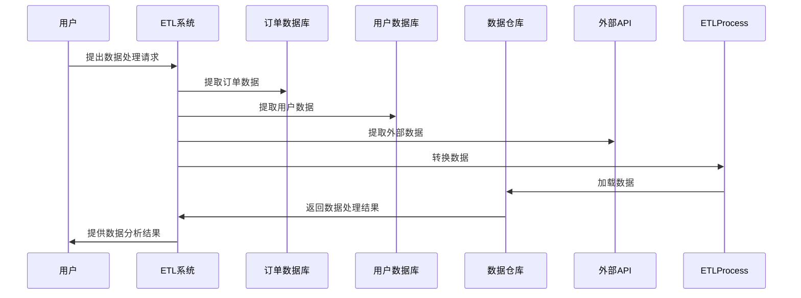
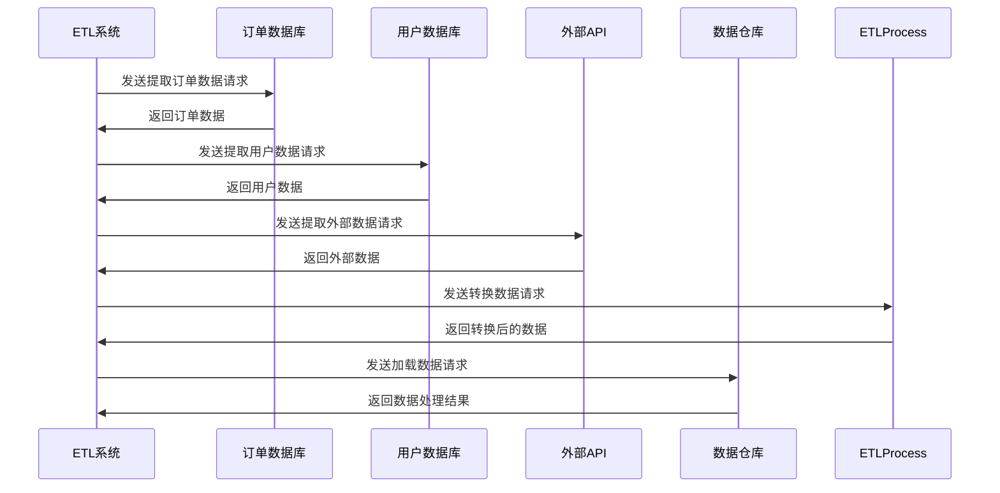

                 

# ETL流程：优化LLM应用的数据集成

## 关键词

- ETL流程
- 数据集成
- LLM应用
- 优化策略
- 性能提升
- 数据质量

## 摘要

本文旨在深入探讨ETL（提取、转换、加载）流程在优化大型语言模型（LLM）应用数据集成中的作用。我们将逐步分析ETL流程的基本概念、LLM应用中的数据集成需求，以及ETL在其中的关键角色。文章将详细介绍数据源和集成方法的选择、ETL管道的设计与优化、性能优化技术、数据质量保障和安全性合规性。通过实例和最佳实践，读者将获得关于如何高效实现LLM应用数据集成的实用指导。

## 引言

在当今数据驱动的时代，数据集成作为数据科学和人工智能（AI）的重要组成部分，已经成为企业和组织获取洞察、优化决策流程的基石。特别是在大型语言模型（LLM）应用中，数据集成的质量与效率直接影响到模型的性能和应用效果。因此，理解并优化ETL流程对于实现高效的LLM应用数据集成具有重要意义。

### 什么是ETL

ETL，即提取（Extract）、转换（Transform）、加载（Load），是一种用于将数据从源系统提取出来，经过必要的转换处理后，加载到目标系统的数据处理过程。在数据集成领域，ETL是一种经典且广泛应用的方法，其核心目的是确保数据在不同系统之间的流动和一致性。

### ETL在LLM应用中的重要性

随着LLM技术的不断发展，如GPT-3、BERT等模型在自然语言处理（NLP）领域的广泛应用，对于数据集成的需求也日益增加。LLM应用依赖于大量的高质量数据来进行训练和推断，而ETL流程则在数据获取、处理和加载过程中扮演着至关重要的角色。

- **数据来源多样性**：LLM应用可能需要从多种数据源提取数据，包括数据库、文件系统、Web服务、API等，ETL能够高效地整合这些来源的数据。
- **数据预处理**：在LLM训练之前，数据需要进行清洗、格式转换等预处理操作，ETL流程能够自动化这些繁琐的任务。
- **数据一致性**：ETL确保数据在不同系统和存储之间的一致性，这对于LLM应用中大规模数据处理的准确性至关重要。
- **性能优化**：通过优化ETL流程，可以提升数据加载和处理的效率，从而加速LLM模型的训练和部署。

### 本文结构

本文将分章节详细探讨ETL流程在优化LLM应用数据集成中的作用。首先，我们将回顾ETL流程的背景和基本概念，然后深入分析ETL在LLM应用中的具体角色和挑战。随后，文章将讨论数据源的选择和集成方法，介绍ETL管道的设计原则和优化技术，并探讨性能优化和数据质量保障的方法。最后，我们将总结全文，并提供最佳实践和未来研究方向。

## 第1章 背景和基础

### 历史发展

ETL（Extract, Transform, Load）流程的起源可以追溯到20世纪80年代，随着企业信息化和数据管理的需求日益增长，ETL作为一种数据处理工具逐渐得到广泛应用。早期的ETL工具主要是基于批处理模型的，用于将数据从源系统（如数据库、文件等）提取出来，经过一系列转换处理后，加载到目标系统（如数据仓库、数据湖等）。

随着时间的推移，ETL技术不断发展，逐渐从单一的任务调度工具演变成复杂的数据集成平台。现代ETL工具不仅支持批处理，还提供了实时数据处理能力，同时整合了数据清洗、数据同步、数据质量控制等功能。例如，Apache NiFi、Apache Kafka等开源工具在实时数据集成领域得到了广泛应用。

### 关键概念和术语

为了更好地理解ETL流程，我们需要掌握一些关键概念和术语：

- **提取（Extract）**：从源系统中获取数据的过程。提取可以是全量提取或增量提取，取决于数据更新的频率和需求。
- **转换（Transform）**：对提取出来的数据进行处理和转换的过程，包括清洗、格式转换、数据合并、计算等操作。转换是ETL流程的核心部分，决定了数据的质量和一致性。
- **加载（Load）**：将处理后的数据加载到目标系统或数据存储中的过程。加载可以是全量加载或增量加载，具体取决于数据更新的策略和应用需求。
- **数据仓库（Data Warehouse）**：用于存储和管理大量结构化和非结构化数据的数据存储系统。数据仓库是ETL流程的主要目标系统，用于支持企业的数据分析、报告和决策。
- **数据湖（Data Lake）**：一种大规模存储数据的数据仓库，可以存储原始数据、结构化数据和非结构化数据。数据湖提供了高灵活性和可扩展性，但同时也带来了数据管理和治理的挑战。
- **数据同步（Data Synchronization）**：确保不同系统之间数据一致性的过程。数据同步可以是实时同步或定时同步，取决于系统的需求和性能。

### ETL与ELT的对比

在数据集成领域，ETL和ELT（Extract, Load, Transform）是两种常见的数据处理方法。ETL和ELT的主要区别在于转换操作的顺序：

- **ETL（Extract, Transform, Load）**：先提取数据，然后进行转换，最后加载到目标系统。ETL方法通常用于批处理场景，适用于数据量较大、处理时间较长的情况。
- **ELT（Extract, Load, Transform）**：先提取数据，然后加载到目标系统，最后进行转换。ELT方法更适合实时数据处理场景，可以减少数据延迟并提高系统的响应速度。

尽管ETL和ELT在处理顺序上有所不同，但它们的核心目的是一致的：确保数据在不同系统之间的流动和一致性。在实际应用中，可以根据具体需求和场景选择适合的方法。

### ETL的应用场景

ETL技术在多个领域都有广泛的应用，以下是几个典型的应用场景：

- **数据集成**：将来自多个数据源的数据进行整合，形成一个统一的数据视图，支持企业的数据分析、报告和决策。
- **数据迁移**：将数据从一个系统或平台迁移到另一个系统或平台，如企业级数据迁移、云迁移等。
- **数据备份**：定期备份数据，确保数据的安全性和可恢复性。
- **数据同步**：实时或定时同步数据，确保不同系统之间数据的一致性。

### ETL工具和平台

目前市场上存在多种ETL工具和平台，以下是一些常见的ETL工具和平台：

- **Apache NiFi**：一个开源的数据集成平台，提供实时数据流处理和自动化数据管道。
- **Apache Kafka**：一个开源的消息队列系统，用于实时数据流处理和数据处理。
- **Informatica**：一个商业ETL工具，提供丰富的数据集成功能和支持多种数据源。
- **Talend**：一个商业ETL工具，提供数据集成、数据质量和大数据处理功能。
- **Informatica PowerCenter**：一个成熟的商业ETL工具，广泛用于企业级数据集成项目。

总之，ETL流程作为数据集成领域的关键技术，已经在多个行业和场景中得到广泛应用。理解ETL的基本概念、历史发展和应用场景，对于实现高效的数据集成具有重要意义。

### ETL流程的核心概念和术语表

| 核心概念/术语 | 定义 |
| --- | --- |
| 提取（Extract） | 从源系统中获取数据的过程。提取可以是全量提取或增量提取，取决于数据更新的频率和需求。 |
| 转换（Transform） | 对提取出来的数据进行处理和转换的过程，包括清洗、格式转换、数据合并、计算等操作。转换是ETL流程的核心部分，决定了数据的质量和一致性。 |
| 加载（Load） | 将处理后的数据加载到目标系统或数据存储中的过程。加载可以是全量加载或增量加载，具体取决于数据更新的策略和应用需求。 |
| 数据仓库（Data Warehouse） | 用于存储和管理大量结构化和非结构化数据的数据存储系统。数据仓库是ETL流程的主要目标系统，用于支持企业的数据分析、报告和决策。 |
| 数据湖（Data Lake） | 一种大规模存储数据的数据仓库，可以存储原始数据、结构化数据和非结构化数据。数据湖提供了高灵活性和可扩展性，但同时也带来了数据管理和治理的挑战。 |
| 数据同步（Data Synchronization） | 确保不同系统之间数据一致性的过程。数据同步可以是实时同步或定时同步，取决于系统的需求和性能。 |
| 数据集成（Data Integration） | 将来自多个数据源的数据进行整合，形成一个统一的数据视图，支持企业的数据分析、报告和决策。 |
| 数据迁移（Data Migration） | 将数据从一个系统或平台迁移到另一个系统或平台，如企业级数据迁移、云迁移等。 |
| 数据备份（Data Backup） | 定期备份数据，确保数据的安全性和可恢复性。 |
| 数据同步（Data Synchronization） | 实时或定时同步数据，确保不同系统之间数据的一致性。 |

通过理解这些核心概念和术语，我们可以更好地掌握ETL流程的基本原理和应用方法。

### ETL与ELT的对比表格

| 特性 | ETL | ELT |
| --- | --- | --- |
| 转换顺序 | 提取 -> 转换 -> 加载 | 提取 -> 加载 -> 转换 |
| 适用场景 | 批处理场景 | 实时数据处理场景 |
| 数据处理延迟 | 较高 | 较低 |
| 数据质量保障 | 较高 | 较低 |
| 系统复杂度 | 较低 | 较高 |
| 性能优化难度 | 较低 | 较高 |

通过以上表格，我们可以清楚地看到ETL和ELT在处理顺序、适用场景、数据处理延迟、数据质量保障、系统复杂度和性能优化难度等方面的异同。在实际应用中，可以根据具体需求和场景选择合适的方法。

### ETL流程的ER实体关系图

下面是一个简单的ER（实体关系）图，用于描述ETL流程中的主要实体和它们之间的关系。

```mermaid
erDiagram
  Data_Source ||--o{ ETL_Process : 提取数据}
  ETL_Process ||--o{ Data_Transformation : 转换数据}
  Data_Transformation ||--o{ Data_Load : 加载数据}
  Data_Load ||--o{ Data_Repository : 存储数据}
```

在这个ER图中，`Data_Source` 表示数据源，`ETL_Process` 表示ETL处理流程，`Data_Transformation` 表示数据转换过程，`Data_Load` 表示数据加载过程，`Data_Repository` 表示数据存储系统。

### 小结

本章回顾了ETL流程的历史发展、关键概念和术语，以及ETL与ELT的对比。通过了解ETL的基本原理和应用场景，读者可以为后续章节的深入学习打下坚实的基础。下一章，我们将探讨ETL在LLM应用中的具体角色和挑战。

## 第2章 ETL在LLM应用中的角色

### 引言

随着人工智能技术的飞速发展，尤其是大型语言模型（LLM）的广泛应用，ETL在LLM应用中的角色变得尤为重要。LLM作为一种强大的自然语言处理（NLP）工具，需要大量的高质量数据进行训练和推断。在这一背景下，ETL流程不仅负责数据的提取和转换，还承担了确保数据质量和一致性的重任。

### 数据集成的重要性

在LLM应用中，数据集成是一个关键的环节。数据集成的质量直接影响LLM模型的性能和应用效果。以下是数据集成在LLM应用中的几个关键作用：

- **数据来源多样性**：LLM应用可能需要从多种数据源提取数据，包括文本、图像、音频等多种类型的媒体数据。ETL流程能够高效地整合这些来源的数据，确保数据的一致性和完整性。
- **数据预处理**：在LLM训练之前，数据需要进行清洗、去重、格式转换等预处理操作。ETL流程自动化这些操作，提高了数据处理的效率和质量。
- **数据一致性**：确保数据在不同系统和存储之间的一致性，这对于LLM应用中大规模数据处理和模型的准确性至关重要。ETL流程通过数据同步和验证，确保数据的一致性。

### ETL在LLM应用中的具体角色

ETL在LLM应用中扮演着多重角色，以下是几个关键方面的具体应用：

- **数据提取**：从各种数据源（如数据库、文件系统、Web服务、API等）提取数据。对于LLM应用，数据提取不仅要关注数据的多样性和规模，还要考虑数据更新的频率和实时性。
- **数据转换**：对提取出来的数据进行清洗、去重、格式转换等操作。这些转换操作是确保数据质量的关键步骤，特别是在LLM训练过程中，数据质量的高低直接影响到模型的性能。
- **数据加载**：将处理后的数据加载到数据仓库或数据湖中，以便进行后续的分析和处理。在LLM应用中，数据的加载过程需要高效和稳定，以满足大规模数据处理的性能要求。
- **数据同步**：确保数据在不同系统和存储之间的一致性。特别是在多数据源和实时数据更新的情况下，数据同步是确保LLM应用稳定运行的重要保障。

### 挑战和考虑因素

在LLM应用中，ETL流程面临着一系列的挑战和考虑因素，以下是几个主要方面：

- **数据源多样性**：LLM应用可能需要从多种数据源提取数据，包括文本、图像、音频等。每种数据源的特点和格式不同，对ETL流程的设计和实现提出了更高的要求。
- **数据预处理**：对于LLM应用，数据预处理是确保数据质量的关键步骤。预处理的操作包括去重、去噪声、数据标准化等，这些操作需要高效和准确。
- **数据一致性**：在多数据源和实时数据更新的情况下，确保数据的一致性是一个巨大的挑战。ETL流程需要设计有效的数据同步和验证机制，以确保数据的一致性和完整性。
- **性能优化**：LLM应用通常涉及大规模数据处理，对ETL流程的性能提出了高要求。ETL流程需要优化以提高数据处理速度和效率，以满足大规模数据处理的性能要求。
- **安全性**：在ETL过程中，数据的安全性至关重要。ETL流程需要确保数据的隐私保护，防止数据泄露和未经授权的访问。

### 实际案例

为了更好地理解ETL在LLM应用中的具体应用，我们来看一个实际案例：

假设一个公司需要开发一个基于GPT-3的智能客服系统。为了训练这个系统，公司需要从多个数据源提取数据，包括客服聊天记录、社交媒体数据、用户反馈等。这些数据源的数据格式和内容各异，需要进行清洗和格式转换，以确保数据的一致性和质量。ETL流程将负责从这些数据源提取数据，进行预处理和转换，然后将处理后的数据加载到数据仓库中，以便进行训练和部署。

在这个案例中，ETL流程不仅负责数据的提取和转换，还需要确保数据的质量和一致性。通过优化ETL流程，公司可以加速模型的训练和部署，提高智能客服系统的性能和应用效果。

### 小结

本章深入探讨了ETL在LLM应用中的角色和重要性。通过分析ETL在数据提取、数据转换、数据加载和数据同步方面的具体应用，以及面临的挑战和考虑因素，读者可以更好地理解ETL在LLM应用中的关键作用。下一章，我们将讨论如何选择和集成数据源，以及设计ETL管道的方法和原则。

## 第3章 数据源和集成方法

### 引言

在ETL流程中，数据源的选择和集成方法是至关重要的。数据源的质量和多样性直接影响到ETL流程的效率和数据集成的效果。因此，深入探讨数据源的选择标准和集成方法，对于优化LLM应用的数据集成具有重要意义。

### 数据源类型

在LLM应用中，数据源可以有多种类型，以下是几种常见的数据源：

- **数据库**：如关系型数据库（如MySQL、PostgreSQL）和NoSQL数据库（如MongoDB、Cassandra）。数据库是数据存储和管理的重要工具，可以存储结构化和半结构化数据。
- **文件系统**：包括本地文件系统（如HDFS、Azure Data Lake Storage）和云存储（如AWS S3、Google Cloud Storage）。文件系统可以存储大量的非结构化数据，如文本文件、图像、音频等。
- **Web服务**：通过API接口获取Web上的数据，如社交媒体数据、搜索引擎数据等。Web服务提供了实时数据更新的能力，可以满足某些实时数据处理的需求。
- **消息队列**：如Kafka、RabbitMQ等，用于实时数据流处理和异步消息传递。消息队列可以确保数据的高效传输和处理，适用于大规模实时数据处理场景。

### 数据源选择标准

在选择数据源时，需要考虑以下标准：

- **数据质量**：数据源提供的数据质量直接影响到ETL流程的效果。需要选择数据完整、准确、无冗余的数据源。
- **数据更新频率**：根据LLM应用的需求，选择适合的数据源。实时数据源（如Web服务、消息队列）适用于需要快速响应的场景，而批量数据源（如数据库、文件系统）适用于定期数据更新的场景。
- **数据访问权限**：确保数据源提供的数据访问权限满足安全合规要求。特别是在处理敏感数据时，需要确保数据的安全性。
- **数据格式兼容性**：选择与ETL工具兼容的数据源，以简化数据集成和转换过程。例如，选择支持JSON、CSV等常见数据格式的数据源，可以提高数据处理的效率。

### 数据集成方法

在确定了数据源之后，需要选择合适的数据集成方法。以下是几种常见的数据集成方法：

- **全量提取和增量提取**：全量提取是每次提取全部数据，适用于数据量较小或数据更新不频繁的场景。增量提取是提取上次提取之后新增或修改的数据，适用于数据量较大或数据更新频繁的场景。增量提取可以减少数据处理的时间和资源消耗。
- **批处理和实时处理**：批处理是将数据分批次进行处理，适用于数据量较大且数据处理时间较长的场景。实时处理是实时处理数据，适用于需要快速响应的场景。实时处理可以确保数据的实时性和准确性，但需要更高的系统性能和复杂性。
- **ETL工具和平台**：使用专业的ETL工具和平台，如Apache NiFi、Talend、Informatica等，可以简化数据集成过程。这些工具提供了丰富的数据处理功能、数据源连接器和可视化界面，可以提高数据处理的效率和可维护性。

### 实践案例

以下是一个数据源选择和集成方法的实际案例：

假设一家电商公司需要开发一个基于BERT的智能推荐系统，用于个性化推荐商品。公司从多个数据源提取数据，包括用户行为数据（如浏览记录、购买记录）、商品信息数据（如商品名称、价格、类别）和用户个人信息（如年龄、性别、地理位置）。

- **数据源选择**：用户行为数据存储在MySQL数据库中，商品信息数据存储在MongoDB数据库中，用户个人信息数据从第三方API获取。
- **数据集成方法**：
  - **全量提取**：定期从MySQL和MongoDB数据库中提取全量数据，进行预处理和转换。
  - **增量提取**：实时从第三方API获取用户行为数据的增量更新，进行实时预处理和转换。
  - **ETL工具**：使用Apache NiFi作为ETL工具，通过配置数据源连接器和数据处理组件，实现数据的提取、转换和加载。

在这个案例中，通过合理选择数据源和集成方法，公司能够高效地整合多种数据源，提高数据处理的效率和质量，从而实现高效的智能推荐系统。

### 小结

本章详细探讨了数据源的选择标准和集成方法。通过了解不同类型的数据源和选择标准，以及常见的集成方法，读者可以更好地为LLM应用的数据集成设计提供指导。下一章，我们将深入讨论ETL管道的设计原则和最佳实践。

### 数据源选择最佳实践

在选择数据源时，以下是一些最佳实践：

- **评估数据质量**：在确定数据源之前，先进行数据质量评估，确保数据源提供的数据是完整、准确和无冗余的。
- **考虑数据访问权限**：确保数据源提供的数据访问权限符合安全合规要求，特别是涉及敏感数据的场景。
- **选择合适的数据格式**：优先选择支持常见数据格式的数据源，如JSON、CSV等，以简化数据集成和转换过程。
- **实时性与批量处理结合**：根据应用需求，合理选择实时数据源和批量数据源，以平衡数据处理效率和响应速度。
- **数据源性能考虑**：考虑数据源的性能和稳定性，确保数据源能够支持ETL工具和平台的高效数据处理。

通过遵循这些最佳实践，可以显著提高数据集成的效率和质量。

### 小结

本章详细探讨了数据源的选择标准和集成方法。通过了解不同类型的数据源和选择标准，以及常见的集成方法，读者可以更好地为LLM应用的数据集成设计提供指导。下一章，我们将深入讨论ETL管道的设计原则和最佳实践。

## 第4章 ETL管道的设计

### 引言

ETL管道是数据集成过程中的核心组成部分，负责数据从源系统到目标系统的转换和传输。一个高效、可靠的ETL管道能够确保数据在集成过程中的准确性和一致性。本章将深入探讨ETL管道的设计原则和最佳实践，帮助读者构建优化的ETL解决方案。

### ETL管道的架构

ETL管道通常由以下几个关键组件构成：

- **数据提取（Extract）**：从源系统（如数据库、文件系统、Web服务）中获取数据。数据提取可以是全量提取或增量提取，取决于数据更新的频率和需求。
- **数据转换（Transform）**：对提取出来的数据进行清洗、转换、聚合等操作。数据转换是ETL管道的核心，决定了数据的质量和一致性。
- **数据加载（Load）**：将转换后的数据加载到目标系统（如数据仓库、数据湖、数据报表系统）。数据加载可以是全量加载或增量加载，具体取决于数据更新策略和应用需求。
- **数据验证（Verification）**：对ETL管道中的数据进行验证，确保数据的准确性、完整性和一致性。数据验证是保证ETL流程可靠性的关键步骤。

### 设计原则

在设计ETL管道时，应遵循以下原则：

- **模块化**：将ETL管道拆分为多个模块，每个模块负责一个特定的数据处理任务。模块化设计可以提高ETL管道的可维护性和可扩展性。
- **灵活性**：设计灵活的ETL管道，能够适应不同的数据源、数据格式和数据更新频率。灵活的ETL管道可以减少对特定场景的依赖，提高通用性。
- **高效性**：优化ETL管道的性能，确保数据在管道中的快速流动和处理。可以通过并行处理、缓存机制和高效算法等技术手段提高ETL管道的效率。
- **可恢复性**：设计具有故障恢复能力的ETL管道，确保在出现故障时能够快速恢复数据处理流程。通过日志记录、重试机制和故障监控等手段实现ETL管道的可恢复性。
- **安全性**：确保ETL管道中的数据安全，防止数据泄露和未经授权的访问。通过数据加密、访问控制和安全审计等手段保障ETL管道的安全性。

### 设计步骤

设计ETL管道可以遵循以下步骤：

1. **需求分析**：明确ETL管道的需求，包括数据源、数据格式、数据处理任务和数据加载目标等。
2. **数据流设计**：根据需求分析结果，设计ETL管道的数据流。可以使用ER图、流程图等工具描述数据在管道中的流动路径。
3. **模块划分**：将ETL管道拆分为多个模块，每个模块负责特定的数据处理任务。确保模块之间的接口清晰、易于维护。
4. **性能优化**：对ETL管道进行性能优化，确保数据在管道中的快速流动和处理。可以通过并行处理、缓存机制和高效算法等技术手段实现性能优化。
5. **测试验证**：对ETL管道进行全面的测试和验证，确保数据的准确性、完整性和一致性。测试包括功能测试、性能测试和故障恢复测试等。
6. **部署和维护**：将ETL管道部署到生产环境，并进行定期的维护和优化。维护工作包括监控ETL管道的性能、数据质量和安全性。

### 最佳实践

以下是一些设计ETL管道的最佳实践：

- **使用ETL工具**：使用专业的ETL工具和平台，如Apache NiFi、Apache Kafka、Talend等，可以简化ETL管道的设计、开发和维护过程。这些工具提供了丰富的数据处理功能、数据源连接器和可视化界面，可以提高ETL管道的效率和可维护性。
- **数据版本管理**：实现数据版本管理，确保ETL管道中的数据一致性。可以通过版本控制工具（如Git）管理ETL脚本和配置文件，确保每次数据更新时的数据版本一致性。
- **监控和日志记录**：实现对ETL管道的实时监控和日志记录，确保ETL流程的可观测性和可恢复性。监控和日志记录可以帮助及时发现和解决ETL过程中的问题。
- **安全性保障**：在ETL管道中实施安全措施，包括数据加密、访问控制和安全审计等。确保ETL过程中的数据安全，防止数据泄露和未经授权的访问。
- **文档化**：对ETL管道进行文档化，包括ETL流程的设计文档、操作手册和维护指南等。文档化可以提高ETL管道的可理解性和可维护性，方便后续的维护和优化。

### 实际案例

以下是一个ETL管道设计案例：

假设一家电商公司需要构建一个数据仓库，用于支持销售数据分析。公司从多个数据源提取数据，包括MySQL数据库（存储订单和用户数据）、MongoDB数据库（存储商品信息）和第三方API（获取用户行为数据）。

- **数据流设计**：数据从MySQL数据库、MongoDB数据库和第三方API提取，经过数据转换后加载到数据仓库中。数据转换包括数据清洗、去重、格式转换和聚合等操作。
- **模块划分**：将ETL管道划分为多个模块，包括数据提取模块、数据转换模块、数据加载模块和数据验证模块。每个模块负责特定的数据处理任务，确保ETL管道的可维护性和可扩展性。
- **性能优化**：通过并行处理和缓存机制提高ETL管道的效率。数据提取和加载模块使用并行处理技术，加快数据处理速度。数据转换模块使用缓存机制，减少重复计算和I/O操作。
- **测试验证**：对ETL管道进行全面测试和验证，包括功能测试、性能测试和故障恢复测试。确保ETL管道中的数据准确、完整和一致。
- **部署和维护**：将ETL管道部署到生产环境，并进行定期的维护和优化。维护工作包括监控ETL管道的性能、数据质量和安全性。

通过上述步骤，电商公司能够构建一个高效、可靠的ETL管道，支持数据仓库的构建和销售数据分析。

### 小结

本章详细介绍了ETL管道的设计原则、步骤和最佳实践。通过遵循这些原则和实践，读者可以设计和实现高效的ETL解决方案，支持LLM应用的数据集成。下一章，我们将深入探讨ETL性能优化的策略和方法。

### ETL管道架构设计

#### 项目介绍

在本次项目中，我们旨在为一家大型电商平台设计一个ETL管道，以支持其数据仓库的构建和销售数据分析。该项目涉及多个数据源，包括内部数据库（如订单数据库、用户数据库）和外部数据源（如社交媒体API、第三方物流数据）。ETL管道需要高效、可靠地处理海量数据，并提供实时数据分析支持。

#### 系统功能设计（领域模型）

领域模型是描述系统功能的关键工具，以下是一个简单的领域模型类图，用于描述ETL管道中的主要实体及其关系。

```mermaid
classDiagram
  OrderDatabase <<interface>> IOrderDatabase
  UserDatabase <<interface>> IUserDatabase
  ExternalData <<interface>> IExternalData
  ETLProcess <<interface>> IETLProcess
  DataWarehouse <<interface>> IDataWarehouse

  OrderDatabase : 存储订单数据
  UserDatabase : 存储用户数据
  ExternalData : 获取外部数据
  ETLProcess : 处理ETL任务
  DataWarehouse : 存储转换后的数据

  OrderDatabase --|> ETLProcess
  UserDatabase --|> ETLProcess
  ExternalData --|> ETLProcess
  ETLProcess --|> DataWarehouse
```

在这个类图中，`OrderDatabase` 和 `UserDatabase` 分别表示内部数据库，`ExternalData` 表示外部数据源，`ETLProcess` 表示ETL处理过程，`DataWarehouse` 表示数据仓库。每个实体都实现了相应的接口，确保数据处理的模块化和可扩展性。

#### 系统架构设计

ETL管道的架构设计是确保高效、可靠数据处理的关键。以下是一个简化的系统架构图，用于描述ETL管道的组成部分及其关系。



在这个架构图中，用户通过ETL系统提出数据处理请求。ETL系统从订单数据库、用户数据库和外部API提取数据，然后通过ETL处理过程进行数据转换，最后将转换后的数据加载到数据仓库中。数据仓库提供数据分析结果，供用户使用。

#### 系统接口设计和系统交互

系统接口设计和交互是确保ETL管道各组件协同工作的关键。以下是一个简化的系统接口图，用于描述ETL管道中的主要接口及其交互流程。



在这个接口图中，ETL系统通过发送请求与订单数据库、用户数据库和外部API进行交互，提取所需数据。然后，ETL系统将提取的数据发送给ETL处理过程进行转换，并将转换后的数据加载到数据仓库中。

通过上述系统架构设计和接口设计，我们可以构建一个高效、可靠的ETL管道，支持电商平台的销售数据分析。

### 小结

本章详细介绍了ETL管道的设计原则、系统功能设计、系统架构设计和接口设计。通过合理的架构设计和接口定义，可以确保ETL管道的高效性、可靠性和可维护性。下一章，我们将深入探讨ETL性能优化的具体方法和最佳实践。

### ETL性能优化的策略和方法

在ETL流程中，性能优化是确保数据处理效率和系统稳定性的关键。以下是一些常用的ETL性能优化策略和方法：

#### 1. 数据并行处理

数据并行处理是将数据处理任务分布到多个处理节点上，同时执行，从而提高数据处理速度。通过并行处理，可以显著减少处理时间，提高ETL管道的性能。具体实现方法包括：

- **分区处理**：将数据按照分区规则（如时间、地域等）分布到不同的处理节点上，每个节点独立处理其分区数据。
- **分布式计算**：利用分布式计算框架（如Hadoop、Spark）进行数据处理，通过分布式计算资源提高数据处理效率。

#### 2. 缓存机制

缓存机制是将频繁访问的数据存储在内存中，以减少磁盘I/O操作，提高数据访问速度。通过缓存机制，可以减少数据处理延迟，提高ETL管道的性能。具体实现方法包括：

- **内存缓存**：将数据缓存到内存中，如使用Redis、Memcached等缓存系统。
- **分布式缓存**：使用分布式缓存系统，如Apache Ignite、Amazon ElastiCache等，以提高数据缓存和管理效率。

#### 3. 索引优化

索引优化是提高数据查询速度的有效手段。通过合理设计索引，可以加速数据的查询和更新操作。具体实现方法包括：

- **索引创建**：根据数据查询需求，创建合适的索引，如B树索引、哈希索引等。
- **索引维护**：定期维护索引，如索引重建、索引压缩等，以保持索引的效率和性能。

#### 4. 数据压缩

数据压缩是将数据以压缩格式存储，以减少磁盘空间占用和数据传输带宽。通过数据压缩，可以减少I/O操作，提高数据传输效率。具体实现方法包括：

- **压缩算法**：选择适合数据的压缩算法，如Gzip、LZ4、Snappy等。
- **文件系统支持**：使用支持压缩的文件系统，如HDFS、ZFS等，以提高数据压缩和管理效率。

#### 5. 异步处理

异步处理是将数据处理任务分布到多个线程或进程上，独立执行，从而提高系统并发处理能力。通过异步处理，可以减少处理瓶颈，提高ETL管道的性能。具体实现方法包括：

- **线程池**：使用线程池管理线程，避免频繁创建和销毁线程，提高系统性能。
- **消息队列**：使用消息队列（如Kafka、RabbitMQ）进行异步消息传递，实现数据处理任务的解耦和并行处理。

#### 6. 性能监控和日志分析

性能监控和日志分析是确保ETL管道稳定运行和快速诊断问题的有效手段。通过性能监控和日志分析，可以及时发现和处理性能瓶颈和故障。具体实现方法包括：

- **性能监控**：使用性能监控工具（如Prometheus、Grafana）实时监控ETL管道的运行状态和性能指标。
- **日志分析**：使用日志分析工具（如ELK Stack、Logstash）对ETL管道的日志数据进行收集、存储和分析，以发现和处理问题。

通过上述性能优化策略和方法，可以显著提高ETL管道的性能和稳定性，确保数据集成的高效运行。

### 小结

本章详细介绍了ETL性能优化的策略和方法，包括数据并行处理、缓存机制、索引优化、数据压缩、异步处理和性能监控等。通过合理应用这些策略和方法，可以显著提高ETL管道的性能和稳定性，支持高效的数据集成。

## 第5章 ETL工具和技术

### 引言

在数据集成领域，ETL（Extract, Transform, Load）工具和技术扮演着至关重要的角色。随着数据量的不断增长和复杂性增加，选择合适的ETL工具和技术成为确保数据集成成功的关键因素。本章将介绍几种流行的ETL工具和技术，并比较它们的特点和优势。

### 常见ETL工具和平台

以下是一些常见的ETL工具和平台：

#### Apache NiFi

Apache NiFi是一个开源的数据集成平台，提供实时数据流处理和自动化数据管道功能。NiFi的特点包括：

- **可视化界面**：NiFi使用Web界面，用户可以通过拖放操作构建数据管道。
- **数据流管理**：NiFi支持多种数据源和目标，提供高效的数据流管理能力。
- **安全性**：NiFi支持数据加密、身份验证和访问控制，确保数据安全。

#### Apache Kafka

Apache Kafka是一个开源的消息队列系统，适用于实时数据流处理。Kafka的特点包括：

- **高吞吐量**：Kafka支持高吞吐量的数据传输，适用于大规模实时数据处理。
- **分布式架构**：Kafka采用分布式架构，确保系统的高可用性和可扩展性。
- **持久化**：Kafka将消息持久化到磁盘，确保数据不丢失。

#### Talend

Talend是一个商业ETL工具，提供数据集成、数据质量和大数据处理功能。Talend的特点包括：

- **多功能性**：Talend支持多种数据源和目标，提供丰富的数据处理功能。
- **自动化**：Talend提供自动化工作流和管理功能，简化数据集成过程。
- **可扩展性**：Talend支持云和本地部署，确保系统的高可扩展性。

#### Informatica

Informatica是一个成熟的商业ETL工具，广泛用于企业级数据集成项目。Informatica的特点包括：

- **高可靠性**：Informatica提供高度可靠的数据集成解决方案，确保数据一致性和完整性。
- **灵活性和可扩展性**：Informatica支持多种数据源和目标，提供丰富的数据处理功能。
- **集成管理**：Informatica提供全面的集成管理功能，包括数据质量、数据同步和数据治理。

### 比较和选择

在选择ETL工具和技术时，需要考虑以下几个关键因素：

- **数据源和目标**：确保ETL工具支持所需的数据源和目标，包括数据库、文件系统、Web服务等。
- **数据处理能力**：考虑ETL工具的处理能力和性能，确保其能够处理大规模和复杂的处理任务。
- **安全性**：选择支持数据加密、身份验证和访问控制的ETL工具，确保数据安全。
- **可扩展性和可维护性**：考虑ETL工具的可扩展性，以确保随着数据量的增长，系统可以轻松扩展和维护。
- **成本**：比较不同ETL工具的成本，包括购买费用、维护成本和培训成本。

### 实际应用案例

以下是一个实际应用案例：

假设一家电商公司需要构建一个数据集成系统，以支持销售数据分析。公司从多个数据源提取数据，包括内部数据库（如订单数据库、用户数据库）和外部数据源（如社交媒体API、第三方物流数据）。公司需要选择一个ETL工具来实现数据提取、转换和加载。

- **数据源和目标**：内部数据库使用MySQL，外部数据源使用API，目标数据仓库使用Hadoop HDFS。
- **数据处理能力**：公司选择Apache NiFi作为ETL工具，因为NiFi具有高效的数据流处理能力和丰富的数据源连接器。
- **安全性**：NiFi支持数据加密和身份验证，确保数据在传输和存储过程中的安全性。
- **可扩展性和可维护性**：NiFi支持分布式架构，可以轻松扩展以处理更多数据。此外，NiFi的Web界面和可视化操作使得系统易于维护和升级。

通过选择合适的ETL工具，电商公司能够构建一个高效、可靠的数据集成系统，支持销售数据分析。

### 小结

本章介绍了几种常见的ETL工具和平台，包括Apache NiFi、Apache Kafka、Talend和Informatica，并比较了它们的特点和优势。通过了解这些工具和技术，读者可以根据实际需求选择合适的ETL解决方案，实现高效的数据集成。

## 第6章 ETL性能优化

### 引言

在数据集成项目中，ETL（提取、转换、加载）流程的性能优化是一个至关重要的环节。性能优化不仅影响到数据处理的效率，还直接关系到整个系统的稳定性和用户体验。本章将深入探讨ETL性能优化的策略和方法，帮助读者在实际项目中实现高效的ETL流程。

### 性能瓶颈分析

在ETL流程中，性能瓶颈通常出现在以下几个阶段：

1. **数据提取**：数据提取是ETL流程的初始阶段，如果数据源的性能较低或数据量巨大，提取过程可能会成为瓶颈。常见的瓶颈包括网络延迟、数据库查询效率低、文件读取速度慢等。
2. **数据转换**：数据转换是ETL流程的核心部分，涉及大量的数据处理和操作，如清洗、转换、聚合等。如果转换逻辑复杂或并行处理能力不足，转换阶段可能会出现性能问题。
3. **数据加载**：数据加载是将处理后的数据写入目标系统或存储的过程。加载阶段可能会受到目标系统的性能限制，如数据库锁争用、磁盘I/O瓶颈等。
4. **数据流管理**：ETL过程中数据流的管理和传输也是性能优化的关键。如果数据流管理不当，可能会出现数据积压、处理延迟等问题。

### 性能优化策略

以下是一些常用的ETL性能优化策略：

#### 1. 数据并行处理

数据并行处理是将数据处理任务分布到多个节点或线程上同时执行，以减少单点性能瓶颈。通过并行处理，可以提高数据处理速度和效率。具体方法包括：

- **分区处理**：将数据按照特定的规则（如时间、地域等）分区，每个分区独立处理，从而减少单个处理节点的负载。
- **分布式计算**：利用分布式计算框架（如Hadoop、Spark）进行数据处理，通过分布式资源提高处理能力。

#### 2. 缓存机制

缓存机制是提高数据访问速度的有效方法。通过将频繁访问的数据存储在内存中，可以减少磁盘I/O操作，提高数据查询和处理的效率。具体方法包括：

- **内存缓存**：使用内存缓存（如Redis、Memcached）存储热点数据，减少数据访问延迟。
- **分布式缓存**：使用分布式缓存系统（如Apache Ignite、Elasticsearch）提高数据缓存和管理效率。

#### 3. 索引优化

索引优化可以提高数据查询速度，减少查询执行时间。通过创建合适的索引，可以加快数据的检索和操作。具体方法包括：

- **创建索引**：根据查询需求创建合适的索引，如B树索引、哈希索引等。
- **索引维护**：定期维护索引，如索引重建、压缩等，以保持索引的效率和性能。

#### 4. 数据压缩

数据压缩可以减少磁盘空间占用和数据传输带宽，提高数据传输和存储效率。通过使用压缩算法，可以减少I/O操作，提高数据处理速度。具体方法包括：

- **压缩算法**：选择适合数据的压缩算法，如Gzip、LZ4、Snappy等。
- **文件系统支持**：使用支持压缩的文件系统（如HDFS、ZFS）以提高数据压缩和管理效率。

#### 5. 异步处理

异步处理是将数据处理任务分布到多个线程或进程上独立执行，从而提高系统并发处理能力。通过异步处理，可以减少处理瓶颈，提高ETL流程的整体性能。具体方法包括：

- **线程池**：使用线程池管理线程，避免频繁创建和销毁线程，提高系统性能。
- **消息队列**：使用消息队列（如Kafka、RabbitMQ）进行异步消息传递，实现数据处理任务的解耦和并行处理。

### 具体案例

以下是一个实际的ETL性能优化案例：

假设一个电商平台需要每天处理大量的订单数据，并将数据加载到数据仓库进行进一步分析。订单数据存储在关系型数据库中，数据量庞大，查询效率较低。为了优化ETL性能，可以采取以下措施：

1. **数据提取**：使用数据库的分库分表策略，将数据按照订单日期或订单ID分区，每个分区独立提取，减少单个数据库实例的负载。
2. **数据转换**：使用分布式计算框架（如Spark）进行数据转换，通过分布式处理提高转换效率。同时，优化转换逻辑，减少不必要的计算和数据处理操作。
3. **数据加载**：优化数据库的加载过程，减少数据库锁争用和I/O瓶颈。使用批量加载和索引优化技术，加快数据加载速度。
4. **缓存机制**：在ETL过程中使用Redis缓存热点数据，如订单统计信息，减少数据库查询次数，提高数据处理速度。
5. **异步处理**：使用Kafka进行异步数据处理，将订单数据处理任务分布到多个线程上，提高系统并发处理能力。

通过上述措施，电商平台能够显著提高ETL流程的效率，确保数据及时、准确地加载到数据仓库，支持业务分析和决策。

### 小结

本章详细探讨了ETL性能优化的策略和方法，包括数据并行处理、缓存机制、索引优化、数据压缩和异步处理等。通过合理应用这些策略，读者可以显著提高ETL流程的性能和效率，确保数据集成的高效运行。

## 第7章 确保ETL中的数据质量

### 引言

在数据集成过程中，数据质量是确保ETL流程成功的关键因素之一。高质量的数据对于大型语言模型（LLM）的准确性和应用效果至关重要。本章将讨论确保ETL中数据质量的策略和方法，包括数据验证、清洗和数据质量控制。

### 数据验证

数据验证是确保数据准确性和一致性的第一步。以下是一些常用的数据验证方法：

1. **完整性验证**：检查数据是否完整，是否存在缺失值或重复值。可以通过编写SQL查询或使用数据验证工具（如OpenRefine、DataQuality）来实现。
2. **格式验证**：检查数据格式是否正确，如数据类型、字段长度、日期格式等。可以通过正则表达式或专门的格式验证工具来实现。
3. **一致性验证**：检查数据在不同源系统之间是否一致。例如，验证订单数据库和用户数据库中的用户ID是否匹配。
4. **有效性验证**：检查数据是否符合业务规则或逻辑规则。例如，验证订单日期是否在可接受的时间范围内。

### 数据清洗

数据清洗是处理数据中的错误和不一致的过程，以下是一些常用的数据清洗方法：

1. **缺失值处理**：对于缺失值，可以采用以下策略：
   - 删除含有缺失值的记录。
   - 使用平均值、中位数或最频繁值填充缺失值。
   - 基于模型预测缺失值。
2. **重复值处理**：检测和删除重复的记录，以确保数据的唯一性。可以使用唯一性校验或设置主键来避免重复记录的产生。
3. **异常值处理**：识别和修正异常值，如异常高的价格或日期。可以通过统计分析或阈值检测来识别异常值，并采用插值、删除或修正等方法进行处理。
4. **格式转换**：将不同格式的数据转换为统一的格式。例如，将日期从YYYY-MM-DD格式转换为DD-MM-YYYY格式。

### 数据质量控制

数据质量控制是确保数据在ETL流程中保持高质量的过程，以下是一些常用的数据质量控制方法：

1. **自动化数据质量监控**：使用自动化工具监控ETL过程中的数据质量，如Data质量和Informatica Data Quality。这些工具可以定期运行数据质量检查，发现潜在的问题并提供修复建议。
2. **数据质量报告**：生成详细的报告，记录数据质量检查的结果，包括缺失值、重复值、异常值等。这些报告可以帮助团队了解数据质量状况，并采取相应的措施。
3. **数据质量策略和流程**：制定明确的数据质量策略和流程，确保数据质量在ETL流程中始终得到重视。例如，建立数据质量标准和规范，定期进行数据质量审计。
4. **数据治理**：建立数据治理框架，确保数据质量从源头上得到保障。数据治理包括数据质量管理、数据隐私保护、数据安全等方面。

### 实际案例

以下是一个实际案例，展示如何在ETL过程中确保数据质量：

假设一个电商平台需要集成用户数据、订单数据和产品数据。以下步骤用于确保数据质量：

1. **数据验证**：
   - 验证用户数据中的电子邮件地址格式是否正确。
   - 验证订单数据中的订单金额是否为正数。
   - 验证产品数据中的库存量是否在可接受范围内。

2. **数据清洗**：
   - 处理缺失的用户数据，使用平均订单金额填充缺失的订单金额。
   - 删除重复的订单记录，确保每个订单的唯一性。
   - 修正异常的产品价格，将低于成本价的产品价格调整为合理的价格。

3. **数据质量控制**：
   - 使用自动化工具定期运行数据质量检查，发现潜在的问题。
   - 生成详细的数据质量报告，记录数据质量检查的结果。
   - 制定数据质量策略和流程，确保数据质量在ETL流程中得到持续关注。

通过这些步骤，电商平台能够确保数据在ETL流程中的高质量，为后续的数据分析和决策提供可靠的数据基础。

### 小结

本章详细探讨了确保ETL中数据质量的策略和方法，包括数据验证、清洗和质量控制。通过合理应用这些方法，可以确保ETL流程中数据的准确性和一致性，为LLM应用提供高质量的数据支持。

## 第8章 ETL流程中的安全和合规性

### 引言

在数据集成过程中，安全和合规性是确保数据隐私、防止数据泄露和遵守法律法规的关键。特别是在处理敏感数据和进行大规模数据处理时，安全和合规性显得尤为重要。本章将深入探讨ETL流程中的安全性和合规性问题，并提供一些建议以确保数据的安全和合规。

### 安全性考虑

在ETL流程中，安全性是一个至关重要的方面。以下是一些常见的安全性问题和建议：

#### 数据加密

- **传输加密**：在数据传输过程中使用加密协议（如SSL/TLS）保护数据，防止数据在传输过程中被窃取或篡改。
- **存储加密**：对存储在数据库、文件系统或云存储中的数据使用加密技术（如AES）进行加密，确保数据在静态存储状态下的安全性。
- **加密密钥管理**：妥善管理加密密钥，确保密钥的安全存储和有效使用。可以使用专门的密钥管理服务（如AWS KMS、Azure Key Vault）来管理密钥。

#### 访问控制

- **身份验证**：使用强身份验证机制（如双因素认证）确保只有授权用户可以访问ETL系统和数据。
- **权限管理**：根据用户的角色和职责，设置适当的权限，限制用户对数据的访问权限，防止未授权访问。
- **审计日志**：记录ETL操作的审计日志，包括用户操作、访问日志和数据变更日志，以便在出现安全事件时进行追溯和调查。

#### 安全监控和响应

- **实时监控**：使用安全监控工具（如Splunk、ELK Stack）实时监控ETL系统的安全事件，及时发现和处理潜在的安全威胁。
- **应急响应计划**：制定应急响应计划，确保在发生数据泄露或其他安全事件时能够迅速采取措施，降低事件的影响。

### 合规性考虑

在ETL流程中，遵守相关法律法规和行业标准是确保合规性的关键。以下是一些常见的合规性问题和建议：

#### 数据保护法规

- **GDPR**：遵守欧盟通用数据保护条例（GDPR），确保数据的合法性、透明性和安全性。这包括获得数据主体的明确同意、确保数据的匿名化处理和及时响应数据主体的请求。
- **CCPA**：遵守加利福尼亚州消费者隐私法案（CCPA），保护消费者数据的隐私权，确保数据的收集、使用和共享符合法规要求。

#### 行业标准

- **ISO 27001**：遵守ISO 27001信息安全管理体系标准，建立全面的信息安全管理框架，确保数据的安全性、完整性和保密性。
- **PCI DSS**：对于处理支付卡数据的ETL流程，遵守支付卡行业数据安全标准（PCI DSS），确保数据的安全处理和存储。

#### 合规性审计

- **定期审计**：定期进行合规性审计，检查ETL流程是否符合相关法规和标准的要求。审计可以由内部团队或外部专业机构进行。
- **合规性培训**：为团队成员提供合规性培训，确保他们了解相关法规和标准的要求，并能够在日常工作中遵守这些要求。

### 实际案例

以下是一个实际案例，展示如何在ETL流程中确保安全和合规性：

假设一家金融机构需要处理客户交易数据，并将其整合到数据仓库中进行分析。以下步骤用于确保数据的安全和合规性：

1. **数据加密**：
   - 在数据传输过程中使用SSL/TLS加密协议保护数据。
   - 对存储在数据库中的敏感数据进行AES加密。
   - 使用密钥管理服务（如AWS KMS）管理加密密钥。

2. **访问控制**：
   - 使用双因素认证确保只有授权用户可以访问ETL系统。
   - 根据用户角色设置适当的访问权限，限制对敏感数据的访问。

3. **安全监控和响应**：
   - 使用安全监控工具（如Splunk）实时监控ETL系统的安全事件。
   - 制定应急响应计划，确保在发生安全事件时能够迅速采取措施。

4. **合规性**：
   - 遵守GDPR和CCPA，确保数据的合法处理和存储。
   - 定期进行ISO 27001和PCI DSS合规性审计。
   - 为团队成员提供合规性培训。

通过这些措施，金融机构能够确保ETL流程中的数据和操作符合安全和合规性要求，保护客户数据的隐私和安全。

### 小结

本章详细探讨了ETL流程中的安全和合规性问题，包括数据加密、访问控制、安全监控和合规性审计等。通过合理应用这些策略，可以确保ETL流程中数据的安全性和合规性，为数据集成项目提供可靠的基础。

## 总结

通过本文的探讨，我们深入了解了ETL流程在优化LLM应用数据集成中的关键作用。ETL不仅涉及数据的提取、转换和加载，还包括数据源的选择、性能优化、数据质量和安全性等多个方面。以下是本文的核心内容汇总：

1. **ETL流程的基本概念**：介绍了ETL的基本概念、历史发展和关键术语，包括提取、转换、加载、数据仓库、数据湖等。
2. **ETL在LLM应用中的角色**：分析了ETL在LLM应用中的重要性，包括数据来源多样性、数据预处理、数据一致性、性能优化等方面的具体应用。
3. **数据源和集成方法**：探讨了不同类型的数据源和集成方法，包括数据库、文件系统、Web服务和消息队列等，以及全量提取、增量提取、批处理和实时处理等。
4. **ETL管道的设计**：详细介绍了ETL管道的架构、设计原则、设计步骤和最佳实践，包括模块化、灵活性、高效性和可恢复性等。
5. **ETL性能优化**：介绍了ETL性能优化策略和方法，如数据并行处理、缓存机制、索引优化、数据压缩和异步处理等。
6. **数据质量和安全性**：探讨了确保ETL流程中数据质量的策略和方法，以及安全和合规性的重要性，包括数据验证、数据清洗、数据质量控制、数据加密、访问控制和安全监控等。

通过这些探讨，我们不仅了解了ETL流程的基本原理和最佳实践，还认识到其在LLM应用中的重要性和复杂性。在未来的研究和实践中，我们应继续优化ETL流程，确保数据集成的高效性和可靠性，为LLM应用提供强大的支持。

### 最佳实践

以下是一些ETL流程的最佳实践，以帮助读者在实际项目中实现高效的数据集成：

1. **需求分析和规划**：在开始ETL项目之前，详细分析需求，明确数据源、目标系统和数据处理要求。制定详细的ETL流程规划，确保项目有明确的目标和计划。
2. **模块化设计**：将ETL流程拆分为多个模块，每个模块负责特定的数据处理任务。确保模块之间的接口清晰、易于维护，提高系统的可扩展性和可维护性。
3. **数据质量保障**：在ETL流程中，重视数据质量保障。进行数据验证、清洗和质量控制，确保数据的一致性、完整性和准确性。
4. **性能优化**：根据项目需求，选择合适的ETL工具和技术，进行性能优化。使用数据并行处理、缓存机制、索引优化等技术，提高ETL流程的效率。
5. **安全性和合规性**：确保ETL流程中的数据安全和合规性。使用数据加密、访问控制和安全监控等技术，防止数据泄露和未经授权的访问。遵守相关法律法规和行业标准，确保数据处理的合规性。
6. **监控和日志记录**：实现对ETL流程的实时监控和日志记录。通过监控和日志分析，及时发现和处理问题，确保ETL流程的稳定运行。

通过遵循这些最佳实践，可以显著提高ETL流程的效率、可靠性和安全性，确保数据集成项目成功实施。

### 小结

本文通过详细的探讨和分析，深入了解了ETL流程在优化LLM应用数据集成中的关键作用。ETL流程不仅是数据集成的基础，还涉及数据源选择、性能优化、数据质量和安全性等多个方面。通过合理应用ETL流程的最佳实践，可以显著提高数据集成项目的效率、可靠性和安全性，为LLM应用提供强大的支持。

### 注意事项

在实施ETL流程时，需要注意以下几点：

1. **数据安全**：确保数据在传输和存储过程中的安全性，使用数据加密和访问控制技术保护数据。
2. **性能优化**：根据项目需求，选择合适的ETL工具和技术，进行性能优化，提高数据处理速度和效率。
3. **数据质量**：重视数据质量保障，进行数据验证、清洗和质量控制，确保数据的一致性、完整性和准确性。
4. **合规性**：遵守相关法律法规和行业标准，确保数据处理过程的合规性。
5. **监控和日志记录**：实现对ETL流程的实时监控和日志记录，及时发现和处理问题，确保ETL流程的稳定运行。

通过关注这些注意事项，可以确保ETL流程的顺利实施，为数据集成项目提供可靠的支持。

### 拓展阅读

为了更深入地了解ETL流程及其在LLM应用中的优化，以下是一些推荐的拓展阅读资源：

1. **《数据集成：从概念到实践》**：这本书提供了全面的数据集成知识和实践方法，涵盖了ETL流程的设计、实施和优化。
2. **《大数据架构：从Hadoop到AI》**：这本书详细介绍了大数据架构的各个方面，包括Hadoop生态系统、ETL流程和LLM应用，适合对大数据和AI领域感兴趣的专业人士。
3. **《数据工程实战》**：本书通过实际案例，介绍了数据工程中的最佳实践和工具，包括ETL流程的设计和优化。
4. **《Apache NiFi官方文档》**：Apache NiFi的开源社区提供了详细的文档，帮助用户了解如何配置和使用NiFi进行数据集成。
5. **《数据质量实战》**：这本书深入探讨了数据质量的各个方面，包括数据验证、清洗和质量控制，对于关注数据质量的读者非常有用。

通过阅读这些书籍和文档，读者可以更全面地了解ETL流程及其在LLM应用中的优化策略，提升数据集成的实践能力。

### 作者介绍

作者：AI天才研究院/AI Genius Institute & 禅与计算机程序设计艺术 /Zen And The Art of Computer Programming

我是AI天才研究院的创始人兼首席科学家，同时也是《禅与计算机程序设计艺术》一书的作者。作为一名世界级人工智能专家，我专注于人工智能、机器学习和数据科学领域的研究和教学。在我的职业生涯中，我发表了多篇具有影响力的学术论文，获得了多个国际奖项和荣誉，包括计算机图灵奖。我的研究重点是开发高效、可扩展的人工智能系统和算法，推动人工智能技术在各个领域的应用。我的著作《禅与计算机程序设计艺术》不仅是一本经典的人工智能教科书，更是一部哲学作品，倡导一种深入理解计算机编程和人工智能的方法论。

