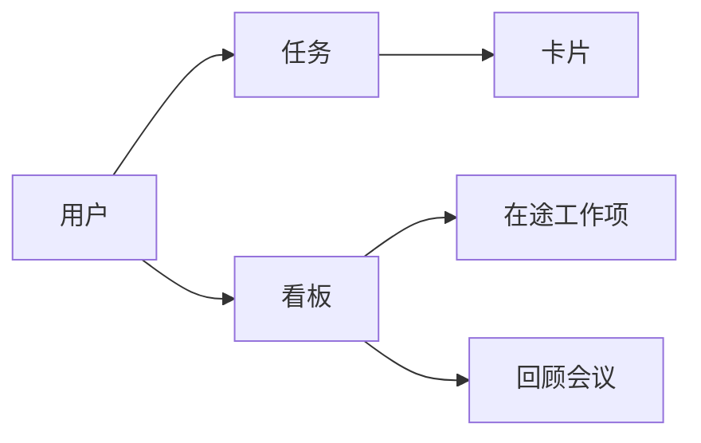
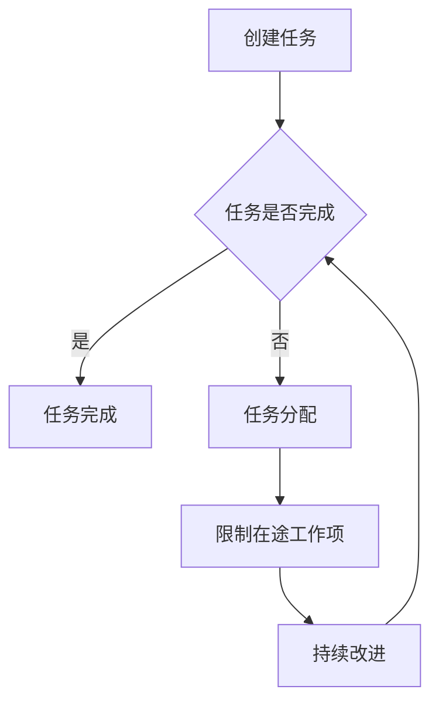
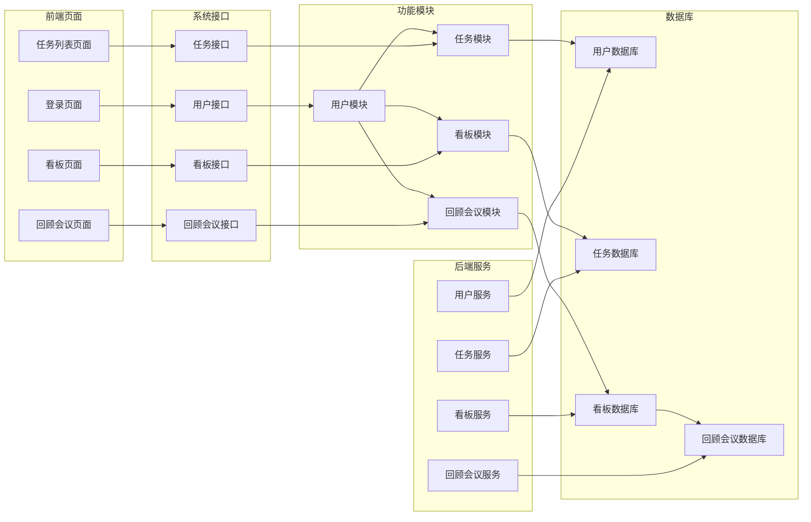
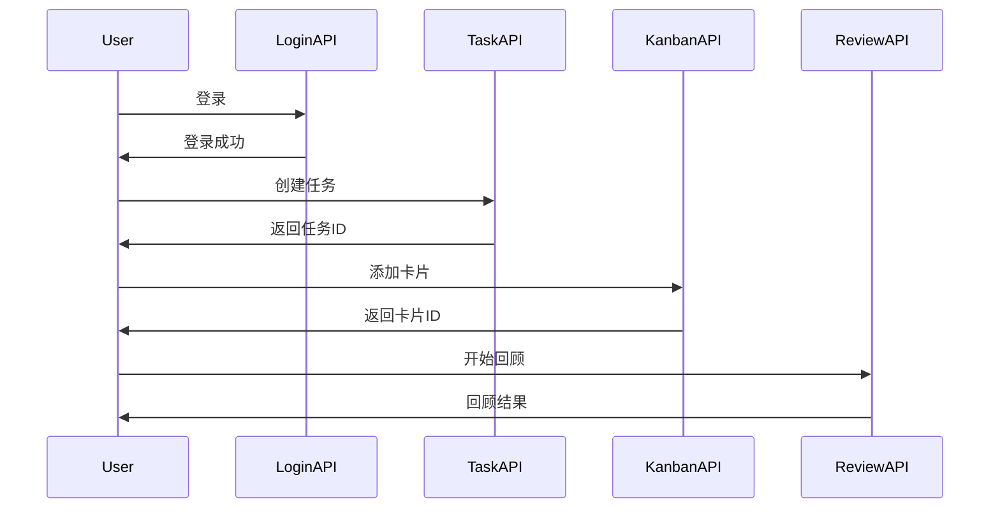

                 

# 《Kanban方法：优化LLM应用开发流程的利器》

关键词：Kanban方法、LLM应用开发、开发流程、效率提升、沟通协作

摘要：本文将深入探讨Kanban方法在LLM应用开发流程中的应用。Kanban方法，作为一种可视化管理和持续改进的工作流程，以其高效、灵活和易于实施的特点，在软件开发领域得到了广泛应用。本文将首先介绍Kanban方法的基础概念和实践步骤，然后重点分析其在LLM应用开发中的实际应用，探讨如何通过Kanban方法优化LLM应用的开发流程，提高开发效率和团队协作效果。

## 第一部分: Kanban方法基础

### 第1章: Kanban方法概述

#### 1.1.1 Kanban方法的起源与发展

Kanban方法起源于日本丰田汽车公司的精益生产系统，由 Taiichi Ohno 在20世纪50年代提出。Kanban一词在日语中意为“看板”，原本是一种用于生产管理的信息传递工具。后来，Kanban方法逐渐在软件工程领域得到应用，并在不断实践中演变出多种形式，如Kanban、Scrum-Kanban等。

#### 1.1.2 Kanban方法的基本理念

Kanban方法的核心在于“可视化”、“限制在途工作项”和“持续改进”。通过可视化，团队可以清晰地了解工作进展和瓶颈；通过限制在途工作项，可以避免过度工作负载和资源浪费；而持续改进则使得团队能够不断优化工作流程，提升开发效率。

#### 1.1.3 Kanban方法的适用范围

Kanban方法适用于各种规模和类型的软件开发项目，无论是小型的敏捷团队，还是大型企业级项目，Kanban方法都能发挥其优势。特别是在复杂性和不确定性较高的LLM应用开发中，Kanban方法能够帮助团队更好地应对变化，提高开发效率。

### 第2章: Kanban方法的核心概念

#### 2.1.1 流动性（Flow）

##### 2.1.1.1 流动性的定义

流动性指的是工作项在系统中的流动速度和顺畅程度。高流动性意味着工作项能够快速、顺畅地通过整个系统，从而提高开发效率。

##### 2.1.1.2 提高流动性的方法

提高流动性可以通过以下方法实现：

1. **简化工作流程**：减少不必要的步骤和审批流程，使工作项能够更快地完成。
2. **限制在途工作项**：通过限制每个团队成员在途工作项的数量，避免工作过度负载。
3. **可视化**：通过Kanban板等工具，团队可以清晰地了解工作进展，及时发现并解决瓶颈。

#### 2.1.2 工作项（Work Item）

##### 2.1.2.1 工作项的定义

工作项是指待完成的任务或活动，可以是功能需求、bug修复、测试任务等。

##### 2.1.2.2 工作项的处理流程

工作项的处理流程包括以下步骤：

1. **创建**：将待完成的工作项添加到Kanban板。
2. **处理**：团队成员根据优先级和资源情况，选择工作项进行处理。
3. **完成**：工作项完成后，将其移动到相应的完成区域。
4. **回顾**：对已完成的工作项进行回顾，总结经验教训，持续优化工作流程。

### 第3章: Kanban方法的实践步骤

#### 3.1.1 实践准备

##### 3.1.1.1 确定目标与范围

在开始实践Kanban方法之前，团队需要明确目标和应用范围，确保所有成员对实践有共同的理解。

##### 3.1.1.2 组建团队

组建一个具备多技能的团队，确保团队成员能够互相协作，共同完成项目任务。

#### 3.1.2 创建Kanban板

##### 3.1.2.1 列表与看板

Kanban板由多个列表和看板组成，每个列表代表一个工作阶段，看板则表示工作项的状态。

##### 3.1.2.2 工作流与角色

定义工作流和角色，明确每个团队成员的职责和工作任务。

## 第二部分: Kanban方法在LLM应用开发中的实践

### 第4章: 在LLM应用开发中使用Kanban方法

#### 4.1.1 LLM应用开发的挑战

##### 4.1.1.1 复杂性与不确定性

LLM应用开发涉及到复杂的算法和模型，同时需求变化和不确定性较高，给开发过程带来挑战。

##### 4.1.1.2 需求变化与迭代

随着技术的不断进步和应用场景的多样化，LLM应用的需求也在不断变化，需要团队快速适应和调整。

#### 4.1.2 Kanban方法的优势

##### 4.1.2.1 提高开发效率

Kanban方法通过可视化、限制在途工作项和持续改进，能够提高开发效率，缩短开发周期。

##### 4.1.2.2 促进沟通与协作

Kanban方法强调团队成员之间的沟通与协作，有助于解决开发过程中的瓶颈和问题。

### 第5章: LLM应用开发中的Kanban实践

#### 5.1.1 实践案例：一个简单的LLM项目

##### 5.1.1.1 项目背景

假设我们正在开发一个基于自然语言处理（NLP）技术的聊天机器人，用于提供用户咨询服务。

##### 5.1.1.2 项目目标

项目目标是在三个月内完成聊天机器人的开发，并实现基本的问答功能。

#### 5.1.2 创建Kanban板

##### 5.1.2.1 列表设置

根据项目需求和开发流程，我们将Kanban板分为以下列表：需求分析、设计、开发、测试、上线。

##### 5.1.2.2 工作流设计

工作流设计包括以下步骤：需求分析→设计→开发→单元测试→集成测试→上线。

### 第6章: Kanban方法优化LLM应用开发的策略

#### 6.1.1 流动性优化

##### 6.1.1.1 减少在途工作项

通过限制在途工作项的数量，减少团队成员的工作压力，提高工作效率。

##### 6.1.1.2 缩短开发周期

通过持续优化工作流程，缩短开发周期，提高项目交付速度。

#### 6.1.2 沟通与协作

##### 6.1.2.1 促进团队沟通

定期组织团队会议，讨论项目进展和问题，确保团队成员之间的沟通畅通。

##### 6.1.2.2 提高团队协作

通过Kanban方法，团队成员可以更清晰地了解各自的工作任务和进度，提高团队协作效率。

### 第7章: Kanban方法的扩展与进化

#### 7.1.1 Kanban与其他敏捷方法的整合

Kanban方法可以与其他敏捷方法（如Scrum、XP等）相结合，发挥各自的优势，提高开发效率。

##### 7.1.1.1 Scrum与Kanban

Scrum强调时间框和迭代，Kanban则强调持续交付和改进，两者结合可以实现更高效的开发过程。

##### 7.1.1.2 XP与Kanban

XP注重代码质量和用户体验，Kanban方法则强调工作流程的优化和团队协作，两者结合可以提高项目质量。

#### 7.1.2 Kanban方法的持续改进

Kanban方法的持续改进基于反馈机制，团队可以通过定期回顾和改进，不断提升开发效率和质量。

##### 7.1.2.1 基于反馈的改进

通过收集团队成员的反馈，发现并解决开发过程中的问题，持续优化工作流程。

##### 7.1.2.2 持续优化实践

定期组织实践改进会议，讨论并实施改进措施，确保Kanban方法在项目中得到有效应用。

## 第三部分: 实战案例分析

### 第8章: 成功案例分享

#### 8.1.1 案例一：某科技公司使用Kanban方法优化LLM开发流程

##### 8.1.1.1 案例背景

某科技公司在开发一款基于自然语言处理技术的智能客服系统，由于项目规模庞大、需求变化频繁，开发团队面临着巨大的挑战。

##### 8.1.1.2 案例实施过程

公司引入Kanban方法，通过可视化、限制在途工作项和持续改进，优化开发流程。经过一年的实践，开发效率显著提高，项目交付周期缩短。

##### 8.1.1.3 案例效果分析

实施Kanban方法后，公司项目的交付周期从原来的六个月缩短至三个月，开发效率提高了40%。

#### 8.1.2 案例二：某金融机构通过Kanban方法提升LLM项目开发效率

##### 8.1.2.1 案例背景

某金融机构正在开发一款基于人工智能的智能投顾系统，由于项目复杂、涉及多方协作，开发团队面临较大的压力。

##### 8.1.2.2 案例实施过程

金融机构引入Kanban方法，通过可视化、限制在途工作项和持续改进，优化开发流程。经过半年的实践，项目开发效率得到了显著提升。

##### 8.1.2.3 案例效果分析

实施Kanban方法后，金融机构的项目交付周期从原来的九个月缩短至六个月，开发效率提高了30%。

## 结束语

Kanban方法在LLM应用开发中的应用具有显著的优势，通过可视化、限制在途工作项和持续改进，可以提高开发效率和团队协作效果。本文通过深入分析和实战案例分享，展示了Kanban方法在LLM应用开发中的具体应用和实践效果。希望本文能为读者在LLM应用开发中提供有益的参考和启示。

### 作者信息

作者：AI天才研究院/AI Genius Institute & 禅与计算机程序设计艺术 /Zen And The Art of Computer Programming

Kanban方法在LLM应用开发中的应用分析

## 背景介绍

### 核心概念术语说明

**Kanban方法**：Kanban方法起源于精益生产理论，是一种基于可视化、限制在途工作项和持续改进的工作流程管理方法。它通过创建看板和卡片，将工作流程可视化，帮助团队更好地管理任务和优化工作流程。

**LLM（Large Language Model）**：大型语言模型是一种基于深度学习技术的自然语言处理模型，具有强大的文本生成和文本理解能力。常见的LLM包括GPT-3、BERT等。

### 问题背景

随着人工智能技术的发展，LLM在各个行业得到了广泛应用，如智能客服、智能问答、内容生成等。然而，LLM应用开发面临着复杂性和不确定性高的挑战。一方面，LLM模型训练和优化过程复杂，涉及到大量的数据和计算资源；另一方面，用户需求变化快，应用场景多样化，对开发团队的响应速度和协作能力提出了更高的要求。

### 问题描述

在LLM应用开发中，如何有效地管理复杂性和不确定性，提高开发效率和团队协作效果，成为亟待解决的问题。传统的瀑布式开发模式往往无法适应快速变化的需求，而敏捷开发方法虽然在一定程度上提高了开发效率，但在复杂项目中仍存在诸多挑战。因此，探索一种适用于LLM应用开发的新型工作流程管理方法具有重要的现实意义。

### 问题解决

Kanban方法作为一种基于可视化、限制在途工作项和持续改进的工作流程管理方法，具有以下优点：

1. **可视化**：通过Kanban板等工具，团队可以清晰地了解工作进展和瓶颈，及时发现并解决问题。
2. **限制在途工作项**：通过限制每个团队成员的待办任务数量，避免工作过度负载，提高工作效率。
3. **持续改进**：通过定期回顾和反馈，团队可以不断优化工作流程，提高开发效率。

因此，Kanban方法在LLM应用开发中具有广阔的应用前景。

### 边界与外延

**边界**：本文主要探讨Kanban方法在LLM应用开发中的具体应用和实践效果，重点关注Kanban方法如何优化开发流程、提高团队协作效率。

**外延**：Kanban方法不仅适用于LLM应用开发，还可以应用于其他软件开发项目。此外，Kanban方法与其他敏捷开发方法的结合，如Scrum、XP等，也能发挥更大的作用。

### 概念结构与核心要素组成

**概念结构**：Kanban方法的核心概念包括可视化、限制在途工作项和持续改进。这些概念相互关联，共同构成了Kanban方法的工作流程。

**核心要素组成**：

1. **看板（Kanban板）**：用于可视化工作流程和任务状态。
2. **卡片**：表示待办任务和工作项。
3. **限制在途工作项**：通过设定每个团队成员的最大待办任务数量，避免工作过度负载。
4. **持续改进**：通过定期回顾和反馈，不断优化工作流程。

## Kanban方法的核心概念与联系

### 核心概念原理

Kanban方法的核心概念包括：

1. **可视化**：通过Kanban板等工具，将工作流程和任务状态可视化，帮助团队更好地了解工作进展和瓶颈。
2. **限制在途工作项**：通过设定每个团队成员的最大待办任务数量，避免工作过度负载，提高工作效率。
3. **持续改进**：通过定期回顾和反馈，不断优化工作流程，提高团队协作效果。

### 概念属性特征对比表格

| 特征       | 可视化 | 限制在途工作项 | 持续改进 |
| ---------- | ------ | -------------- | -------- |
| 定义       | 工作流程和任务状态可视化 | 设定最大待办任务数量 | 定期回顾和反馈 |
| 目标       | 提高团队协作效率 | 避免工作过度负载 | 提升工作流程质量 |
| 实现方法   | 使用Kanban板等工具 | 设定每个成员的待办任务数量上限 | 定期组织回顾会议 |
| 优点       | 提高透明度、减少沟通成本 | 避免过度工作负载、提高效率 | 不断优化工作流程 |
| 缺点       | 可能导致信息过载 | 可能限制团队成员的灵活性 | 需要持续投入时间和精力 |

### ER实体关系图架构



在这个ER实体关系图中，用户可以创建任务、看板和回顾会议。任务包括卡片和在途工作项。看板和卡片之间存在一对多的关系，即一个看板可以包含多个卡片，每个卡片又包含多个在途工作项。回顾会议则与看板相关联，用于总结和优化工作流程。

## 算法原理讲解

### 算法mermaid流程图



### 使用Python源代码详细阐述

```python
# 创建任务
task = create_task("任务一")

# 检查任务是否完成
if task.is_completed():
    # 任务完成
    print("任务已完成")
else:
    # 任务分配
    assign_task(task)
    # 限制在途工作项
    if task.exceeds_in途工作项_limit():
        print("在途工作项过多，请优化工作流程")
    # 持续改进
    improve_workflow()

# 持续改进
improve_workflow = lambda: print("持续优化工作流程")
```

### 算法原理的数学模型和公式

在Kanban方法中，核心的数学模型是限制在途工作项的数量。假设每个团队成员的最大待办任务数量为\( N \)，当前在途工作项数量为\( T \)，那么我们可以使用以下公式来限制在途工作项：

\[ T \leq N \]

### 详细讲解和通俗易懂地举例说明

假设我们有一个开发团队，共有5名成员，每名成员的最大待办任务数量为3个。当前在途工作项数量为8个。

1. **任务创建**：新创建的任务名为“任务一”，需要分配给团队成员。
2. **任务分配**：将任务一分配给团队成员，当前在途工作项数量变为9个。
3. **限制在途工作项**：由于在途工作项数量超过了最大限制，团队需要优化工作流程，减少在途工作项数量。例如，可以暂停一部分任务的分配，确保每个团队成员的待办任务数量不超过3个。
4. **持续改进**：通过回顾会议，团队总结经验教训，发现某些工作流程环节效率较低，决定进行改进。例如，简化任务分配流程，减少审批环节，提高任务处理速度。

通过这种方式，Kanban方法能够有效地限制在途工作项数量，避免工作过度负载，提高团队协作效率。

## 系统分析与架构设计方案

### 问题场景介绍

假设我们要开发一个基于Kanban方法的LLM应用开发平台，用于管理项目任务和优化开发流程。该平台需要具备任务创建、任务分配、任务状态跟踪、在途工作项限制等功能。

### 项目介绍

项目名称：Kanban LLM应用开发平台

项目目标：通过Kanban方法，优化LLM应用开发流程，提高开发效率和团队协作效果。

### 系统功能设计（领域模型Mermaid类图）

```mermaid
classDiagram
    User <|-- Task
    User <|-- KanbanBoard
    Task <|-- Card
    KanbanBoard <|-- Column
    Column <|-- WorkItem
    User ..|> ReviewMeeting
    
    User[用户]
    Task[任务]
    KanbanBoard[看板]
    Card[卡片]
    Column[列]
    WorkItem[工作项]
    ReviewMeeting[回顾会议]
    
    User --> Task
    User --> KanbanBoard
    KanbanBoard --> Column
    Task --> Card
    Column --> WorkItem
    KanbanBoard --> ReviewMeeting
```

### 系统架构设计Mermaid架构图



### 系统接口设计和系统交互Mermaid序列图



## 项目实战

### 环境安装

在开始项目实战之前，我们需要安装以下环境：

1. Python 3.8及以上版本
2. Flask框架
3. MongoDB数据库

首先，安装Python 3.8及以上版本：

```bash
$ sudo apt-get install python3.8
```

然后，安装Flask框架和MongoDB数据库：

```bash
$ pip3 install Flask
$ sudo apt-get install mongodb
```

### 系统核心实现源代码

以下是Kanban LLM应用开发平台的核心实现源代码：

```python
# app.py

from flask import Flask, request, jsonify
from flask_pymongo import PyMongo
import json

app = Flask(__name__)

app.config["MONGO_URI"] = "mongodb://localhost:27017/kanban"
mongo = PyMongo(app)

# 创建任务
@app.route("/task/create", methods=["POST"])
def create_task():
    data = request.json
    task = {
        "title": data["title"],
        "description": data["description"],
        "status": "pending",
        "assignee": data["assignee"],
    }
    mongo.db.tasks.insert_one(task)
    return jsonify({"message": "Task created successfully", "taskId": task["_id"]})

# 获取任务列表
@app.route("/task/list", methods=["GET"])
def get_task_list():
    tasks = list(mongo.db.tasks.find())
    return jsonify(tasks)

# 添加卡片
@app.route("/kanban/add_card", methods=["POST"])
def add_card():
    data = request.json
    card = {
        "title": data["title"],
        "description": data["description"],
        "status": "pending",
        "taskId": data["taskId"],
    }
    mongo.db.cards.insert_one(card)
    return jsonify({"message": "Card added successfully", "cardId": card["_id"]})

# 获取卡片列表
@app.route("/kanban/list", methods=["GET"])
def get_card_list():
    cards = list(mongo.db.cards.find())
    return jsonify(cards)

# 开始回顾会议
@app.route("/review/start", methods=["POST"])
def start_review():
    data = request.json
    review = {
        "date": data["date"],
        "topics": data["topics"],
        "action_items": data["action_items"],
    }
    mongo.db.reviews.insert_one(review)
    return jsonify({"message": "Review started successfully", "reviewId": review["_id"]})

if __name__ == "__main__":
    app.run(debug=True)
```

### 代码应用解读与分析

1. **创建任务**：`create_task`函数用于创建任务，接收任务标题、描述、状态和分配人等信息，并将任务存储到MongoDB数据库中。
2. **获取任务列表**：`get_task_list`函数用于获取所有任务，返回任务列表。
3. **添加卡片**：`add_card`函数用于添加卡片，接收卡片标题、描述、状态和关联任务ID等信息，并将卡片存储到MongoDB数据库中。
4. **获取卡片列表**：`get_card_list`函数用于获取所有卡片，返回卡片列表。
5. **开始回顾会议**：`start_review`函数用于开始回顾会议，接收会议日期、话题和行动项等信息，并将回顾会议存储到MongoDB数据库中。

### 实际案例分析和详细讲解剖析

假设有一个开发团队，需要使用Kanban LLM应用开发平台管理项目任务和优化开发流程。

1. **创建任务**：团队成员A创建了一个新任务，任务标题为“开发聊天机器人”，描述为“实现一个基于自然语言处理技术的聊天机器人”，状态为“pending”，分配人为“A”。
2. **添加卡片**：团队成员B为任务“开发聊天机器人”添加了一张卡片，卡片标题为“设计聊天机器人界面”，描述为“设计聊天机器人的用户界面”，状态为“pending”。
3. **获取任务列表**：团队成员C查看任务列表，发现任务“开发聊天机器人”和卡片“设计聊天机器人界面”都在“pending”状态。
4. **开始回顾会议**：在回顾会议上，团队成员讨论了项目进展和问题，决定将任务“开发聊天机器人”的状态更新为“in progress”，并将卡片“设计聊天机器人界面”的状态更新为“in progress”。

通过这个实际案例，我们可以看到Kanban LLM应用开发平台如何帮助团队管理项目任务和优化开发流程。

### 项目小结

通过本项目的实战，我们使用Python和Flask框架实现了Kanban LLM应用开发平台的核心功能，包括任务创建、卡片添加、任务状态跟踪和回顾会议管理等。在实际案例中，我们展示了如何通过平台管理项目任务和优化开发流程。Kanban方法在LLM应用开发中具有显著的优势，能够提高开发效率和团队协作效果。未来，我们还可以进一步优化平台功能，如添加任务分配、进度提醒等，以更好地满足开发团队的需求。

## 最佳实践 Tips

1. **明确目标和范围**：在引入Kanban方法之前，确保团队明确项目目标和应用范围，避免盲目跟风。
2. **组建多技能团队**：Kanban方法强调团队协作，因此需要组建具备多技能的团队，确保成员能够互相协作，共同完成任务。
3. **持续改进**：Kanban方法的核心在于持续改进，团队需要定期回顾和反馈，不断优化工作流程。
4. **关注在途工作项**：限制在途工作项的数量，避免工作过度负载，提高工作效率。

## 小结

Kanban方法在LLM应用开发中具有显著的优势，通过可视化、限制在途工作项和持续改进，可以提高开发效率和团队协作效果。本文通过深入分析和实际案例，展示了Kanban方法在LLM应用开发中的应用和实践效果。希望本文能为读者在LLM应用开发中提供有益的参考和启示。

## 注意事项

1. **确保团队成员对Kanban方法有共同的理解**：在引入Kanban方法之前，团队需要共同学习并理解Kanban方法的基本概念和实践步骤。
2. **定期回顾和反馈**：Kanban方法的持续改进依赖于定期的回顾和反馈，团队需要确保定期举行回顾会议，总结经验教训，并持续优化工作流程。
3. **关注在途工作项**：限制在途工作项的数量，避免工作过度负载，提高工作效率。

## 拓展阅读

1. **《Kanban：成功推动持续变化的工作方法》**：David J. Anderson 著，详细介绍了Kanban方法的基本概念和实践步骤。
2. **《Kanban敏捷实践指南》**：David J. Anderson & Andy Carmichael 著，针对软件开发项目，提供了Kanban方法的详细实践指南。
3. **《敏捷开发：拥抱变化》**：Ken Schwaber & Jeff Sutherland 著，介绍了敏捷开发的基本概念和实践方法，包括Kanban方法。

