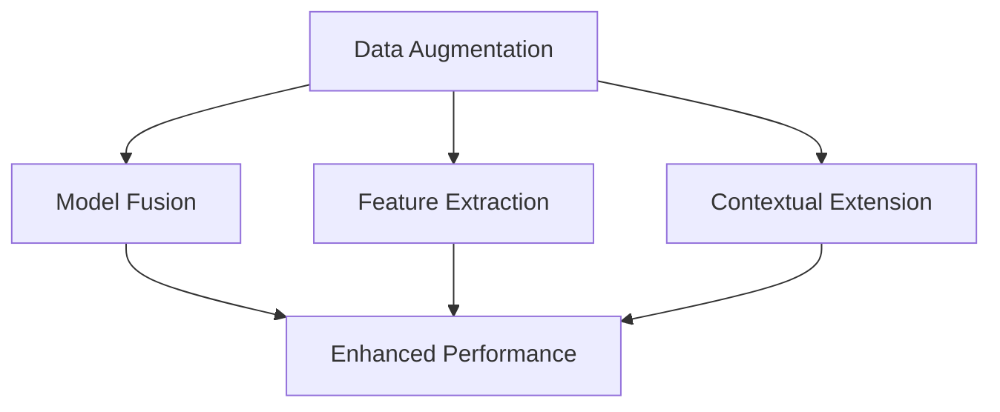
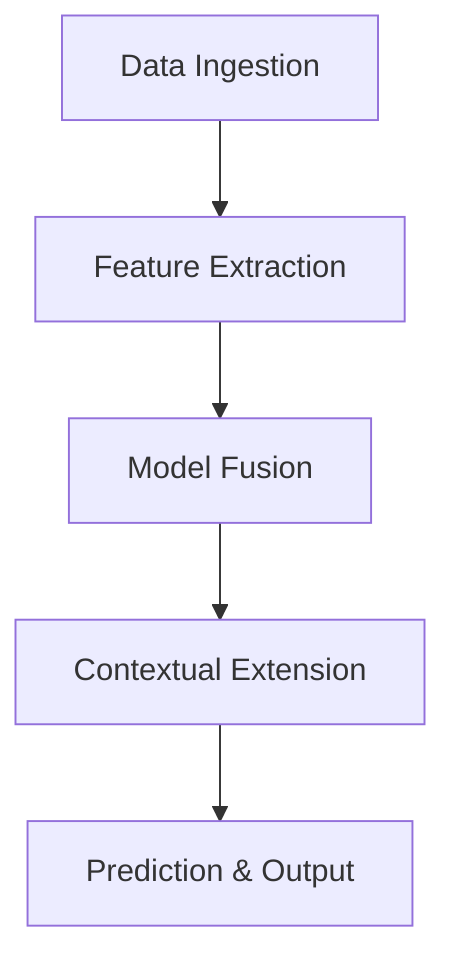
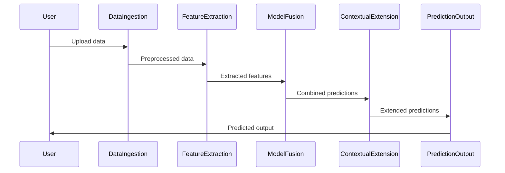

                 

## LLM Prompt混合策略：Combining Multiple Techniques

### Keywords:  
- Large Language Models (LLM)
- Prompt Engineering
- Data Augmentation
- Model Fusion
- Feature Extraction
- Contextual Extension

### Abstract:
This article explores the concept of LLM prompt hybrid strategies, focusing on combining various techniques to enhance the performance of Large Language Models (LLMs) in Natural Language Processing (NLP) tasks. The core of this article is to systematically analyze and present the principles, methods, and applications of data augmentation, model fusion, feature extraction, and contextual extension, offering a comprehensive guide to optimizing LLM performance through strategic combination of techniques. By providing a clear, logical, and intuitive technical language, this article aims to cater to both novice and advanced readers in the field of IT and AI.

## Introduction to Large Language Models (LLM) and Their Applications in NLP

### 1.1 Background of LLM and Its Applications

The rapid advancement of artificial intelligence (AI) technology has propelled Large Language Models (LLMs) to the forefront of Natural Language Processing (NLP). LLMs, characterized by their extraordinary capabilities in language understanding and generation, have demonstrated outstanding performance in various application scenarios, such as question-answering systems, machine translation, and text generation. The success of LLMs can be attributed to their large-scale architecture and sophisticated training processes, which enable them to capture intricate patterns and relationships in human language.

However, the performance of a single LLM model may be limited when faced with complex tasks. To overcome these limitations, researchers and practitioners have started to explore hybrid strategies that combine multiple techniques to enhance the performance of LLMs. These hybrid strategies can be broadly categorized into data augmentation, model fusion, feature extraction, and contextual extension. By leveraging these techniques, it is possible to optimize LLMs for specific tasks and achieve superior performance.

This article aims to delve into the concept of LLM prompt hybrid strategies, providing a comprehensive overview of the principles, methods, and applications of these techniques. The primary goal is to offer a systematic guide to combining various techniques effectively, enabling the reader to optimize the performance of LLMs in different NLP tasks.

### 1.2 Problem Definition

The primary goal of LLM prompt hybrid strategies is to enhance the performance of LLMs by combining multiple techniques. While each technique has its merits and limitations, their combination can lead to synergistic effects, resulting in improved performance on specific tasks. However, the effective combination of these techniques is not trivial. It requires careful consideration of several factors, including the interaction between techniques, resource consumption, and computational complexity.

The key challenges in combining these techniques include:

1. **Choosing the right techniques**: Selecting the most appropriate techniques for a given task can be challenging. Different techniques may have different impacts on the performance of LLMs, and it is essential to identify the most effective combination.

2. **Balancing resource consumption**: Implementing multiple techniques may require significant computational resources. It is crucial to balance the performance improvement gained from combining techniques with the resource consumption.

3. **Managing computational complexity**: Combining multiple techniques can increase the complexity of the model, making it more difficult to train and deploy. Effective strategies need to be developed to manage this complexity while maintaining model performance.

This article addresses these challenges by providing a detailed analysis of the various techniques, their principles, and their applications. It aims to offer practical guidance on how to combine these techniques effectively to optimize the performance of LLMs in NLP tasks.

### 1.3 Solution Approach

To address the challenges mentioned above, this article adopts a step-by-step analytical approach. The solution is structured into several key sections, each focusing on a specific aspect of LLM prompt hybrid strategies:

1. **Background Introduction**: This section provides an overview of LLMs, their applications in NLP, and the need for hybrid strategies. It also introduces the key concepts and terminology related to the techniques discussed in the article.

2. **LLM Basics**: This section covers the fundamental principles of LLMs, including their architecture, training processes, and performance metrics. It sets the stage for understanding the techniques discussed in subsequent sections.

3. **Data Augmentation Techniques**: This section explores various data augmentation methods, their principles, and their applications in enhancing the performance of LLMs. It includes a comparative analysis of different data augmentation techniques and their effectiveness.

4. **Model Fusion Techniques**: This section delves into the principles and methods of model fusion, discussing how to combine multiple models to improve the performance of LLMs. It covers various fusion strategies and their applications.

5. **Feature Extraction and Contextual Extension Techniques**: This section focuses on techniques for extracting and utilizing features from LLMs to improve their performance on specific tasks. It includes a detailed analysis of feature extraction methods and contextual extension techniques.

6. **System Design and Implementation**: This section provides a practical guide to designing and implementing LLM prompt hybrid strategies. It includes a detailed discussion of the system architecture, interface design, and system interaction.

7. **Case Studies and Practical Applications**: This section presents case studies and practical applications of LLM prompt hybrid strategies in real-world scenarios. It includes detailed analysis and insights into the performance and effectiveness of these strategies.

8. **Conclusion and Future Directions**: This section summarizes the key findings of the article and discusses future research directions in the field of LLM prompt hybrid strategies.

By following this structured approach, this article aims to provide a comprehensive and insightful guide to optimizing the performance of LLMs through strategic combination of techniques.

### 1.4 Boundaries and Extensions

The research on LLM prompt hybrid strategies encompasses multiple domains, including natural language processing, machine learning, and deep learning. The boundaries of this research are defined by the scope of NLP tasks, the type of models considered, and the specific techniques explored. The scope includes common NLP tasks such as question-answering systems, machine translation, and text generation, with a focus on neural network-based large-scale models like GPT, BERT, and their variants.

The research extends to the exploration of various data augmentation, model fusion, feature extraction, and contextual extension techniques, aiming to optimize LLM performance in these tasks. This article covers the following key concepts and elements:

1. **Data Augmentation**: This involves techniques such as data transformation and noise injection to enhance model robustness.
2. **Model Fusion**: Strategies for combining multiple models to improve performance.
3. **Feature Extraction**: Methods for extracting meaningful features from LLMs to enable better contextual understanding.
4. **Contextual Extension**: Techniques to extend the context window of LLMs, enabling them to handle longer text inputs more effectively.

### 1.5 Core Concepts and Fundamental Principles

#### 1.5.1 Data Augmentation Principles

Data augmentation is a technique used to improve model robustness by increasing the diversity of the training data. This can be achieved through various methods:

1. **Data Transformation**: This includes operations like scaling, cropping, and rotation of the input data. These transformations can generate new data samples that are similar to the original but diverse enough to improve model generalization.

2. **Noise Injection**: This involves adding random noise to the input data. Common types of noise include Gaussian noise, salt-and-pepper noise, and dropout noise. These noise injections can help the model learn to ignore irrelevant information and focus on the essential features.

#### 1.5.2 Model Fusion Principles

Model fusion techniques combine the predictions of multiple models to produce a single, more accurate prediction. The primary goal is to leverage the strengths of each model to compensate for their individual weaknesses. Two common approaches to model fusion are:

1. **Early Fusion**: This approach combines the predictions of multiple models at an early stage in the model pipeline, typically before the final output layer. The advantage of early fusion is that it allows models to collaborate early on, potentially leading to better performance.

2. **Late Fusion**: In contrast, late fusion combines the predictions of multiple models after each model has produced its own output. The final prediction is obtained by aggregating these individual predictions. Late fusion can be particularly effective when models have different strengths and are not perfectly correlated.

#### 1.5.3 Feature Extraction Principles

Feature extraction is the process of converting raw data into a set of features that can be used to train a model. For LLMs, feature extraction involves identifying and extracting meaningful information from the text input. Key methods include:

1. **Word Embeddings**: This technique involves mapping words to dense vectors in a low-dimensional space. Word embeddings capture semantic and syntactic information, making them useful for various NLP tasks.

2. **Positional Encoding**: Positional encoding adds information about the position of words in a sequence to the word embeddings. This is crucial for models like transformers, which do not have a fixed notion of sequence order.

#### 1.5.4 Contextual Extension Principles

Contextual extension techniques aim to enhance the ability of LLMs to understand and process longer text inputs. One common approach is to increase the context window size, allowing the model to consider a larger portion of the input text when generating predictions. Other techniques include:

1. **Contextual Padding**: This method involves extending the input text with padding tokens to fill the context window to its maximum size. This helps the model maintain a consistent context size without losing information.

2. **Segmentation**: In this approach, the input text is divided into smaller segments, each fitting within the context window. The model processes these segments separately and combines their outputs to generate the final prediction.

### 1.6 Comparative Table of Concept Attributes

Below is a comparative table that highlights the key attributes of data augmentation, model fusion, feature extraction, and contextual extension techniques:

| Technique | Description | Advantages | Disadvantages |
| --- | --- | --- | --- |
| Data Augmentation | Enhances training data diversity | Improves model robustness | High computational cost |
| Model Fusion | Combines predictions from multiple models | Increases prediction accuracy | Increases complexity |
| Feature Extraction | Extracts meaningful features from raw data | Enhances model performance | Increased model complexity |
| Contextual Extension | Increases the context window size | Improves long text understanding | May increase computational cost |

### 1.7 Core Concept Diagram

The following Mermaid diagram provides a visual representation of the core concepts and their relationships in the context of LLM prompt hybrid strategies:

This diagram illustrates how data augmentation, model fusion, feature extraction, and contextual extension techniques contribute to enhancing the performance of LLMs. The diagram also emphasizes the synergistic effects that can be achieved by combining these techniques effectively.

## Detailed Explanation of Data Augmentation Techniques

### 2.1 Introduction to Data Augmentation Techniques

Data augmentation is a fundamental technique in machine learning, particularly in natural language processing (NLP), aimed at enhancing the performance and robustness of models by increasing the diversity of the training data. For LLMs, data augmentation plays a crucial role in improving their ability to generalize to unseen data, thus leading to better performance on various NLP tasks. This section provides a detailed explanation of common data augmentation techniques and their principles.

### 2.2 Data Transformation Methods

Data transformation involves applying various operations to the original data to generate new, similar data samples. These transformations help to introduce diversity in the training data without altering its intrinsic meaning. Common data transformation methods include:

1. **Scaling**: Scaling involves adjusting the values of the input data to a specific range. For text data, this can be achieved by normalizing the text to a fixed length, either by truncating or padding the text to fit the desired size. Scaling helps the model to focus on the relative importance of words rather than their absolute frequency.

2. **Cropping**: Cropping involves randomly selecting a subset of the text data and using it as the input for training. This can be done by selecting a random sentence or paragraph from the original text. Cropping introduces variability in the training data and helps the model to learn from different contexts.

3. **Rotation**: Rotation involves reordering the words in a sentence or paragraph randomly. This technique preserves the syntactic structure of the text while introducing variability in word order, which can improve the model's ability to understand different syntactic patterns.

### 2.3 Noise Injection Methods

Noise injection involves adding random noise to the input data to increase its complexity and help the model learn to ignore irrelevant information. Common noise injection methods include:

1. **Gaussian Noise**: Gaussian noise is generated by adding a random value drawn from a Gaussian distribution to each element of the input data. This type of noise can introduce variability in the data without significantly altering its meaning.

2. **Salt-and-Pepper Noise**: Salt-and-pepper noise involves randomly replacing some elements of the input data with either a very high value (salt) or a very low value (pepper). This type of noise can introduce abrupt changes in the data, forcing the model to learn more robust features.

3. **Dropout Noise**: Dropout noise involves randomly masking some elements of the input data during training. This simulates the effect of missing data and helps the model to become more robust to noise and variations in the input.

### 2.4 Comparative Analysis of Data Augmentation Techniques

Different data augmentation techniques have their advantages and disadvantages, and the choice of technique depends on the specific application and the characteristics of the dataset. The following table provides a comparative analysis of common data augmentation methods:

| Method | Description | Advantages | Disadvantages |
| --- | --- | --- | --- |
| Scaling | Adjusting input data values to a fixed range | Focuses on relative word importance | Can lose information in extreme cases |
| Cropping | Selecting a random subset of the text | Introduces variability in the training data | May exclude important information |
| Rotation | Reordering words randomly | Introduces variability in word order | May alter the meaning of the text |
| Gaussian Noise | Adding random Gaussian noise to the data | Introduces variability without altering meaning | Can increase computational cost |
| Salt-and-Pepper Noise | Replacing random elements with extreme values | Introduces abrupt changes in the data | Can introduce unnecessary noise |
| Dropout Noise | Randomly masking elements of the input data | Simulates missing data, improves robustness | Can significantly alter the input data |

### 2.5 Impact of Data Augmentation on LLM Performance

Data augmentation techniques have a significant impact on the performance of LLMs, particularly in improving their ability to generalize to new, unseen data. By increasing the diversity of the training data, data augmentation helps the model to learn more robust patterns and relationships, which can lead to better performance on various NLP tasks.

The following points highlight the impact of data augmentation on LLM performance:

1. **Improved Generalization**: Data augmentation techniques help the model to generalize better to new data by exposing it to a more diverse set of examples during training. This can reduce overfitting and improve the model's ability to perform well on tasks it has not seen before.

2. **Enhanced Robustness**: By introducing noise and variability in the training data, data augmentation techniques can help the model to become more robust to noise and variations in the input. This can be particularly beneficial in real-world applications where data may be noisy or incomplete.

3. **Increased Performance**: Data augmentation techniques have been shown to significantly improve the performance of LLMs on various NLP tasks, such as text classification, sentiment analysis, and machine translation. The increased diversity in the training data enables the model to capture more nuanced patterns and relationships, leading to better performance.

### 2.6 Practical Application Examples

To illustrate the practical application of data augmentation techniques, consider the following examples:

1. **Text Classification**: In a text classification task, scaling and cropping can be used to increase the diversity of the training data. Scaling can help the model to focus on the relative importance of words, while cropping can introduce variability in the training examples by selecting random subsets of the text.

2. **Machine Translation**: In machine translation, Gaussian noise and dropout noise can be used to introduce variability in the input data. This can help the model to learn to ignore noise and focus on the underlying patterns in the input text, leading to better translation performance.

3. **Text Generation**: In text generation tasks, rotation can be used to introduce variability in word order, which can help the model to learn more flexible patterns and generate more diverse text outputs.

In summary, data augmentation techniques are a powerful tool for improving the performance and robustness of LLMs. By increasing the diversity of the training data, these techniques can help the model to learn more robust patterns and relationships, leading to better performance on various NLP tasks. The following section will explore the principles and methods of model fusion techniques, another key component of LLM prompt hybrid strategies.

## Detailed Explanation of Model Fusion Techniques

### 3.1 Introduction to Model Fusion Techniques

Model fusion, also known as ensemble learning, is a technique where multiple models are combined to produce a single, more accurate prediction. The idea behind model fusion is that different models may have different strengths and weaknesses, and by combining their predictions, it is possible to achieve better performance than any individual model. This section provides a detailed explanation of common model fusion techniques and their principles.

### 3.2 Early Fusion vs. Late Fusion

There are two main approaches to model fusion: early fusion and late fusion. Each approach has its advantages and disadvantages, and the choice of approach depends on the specific application and the characteristics of the models being combined.

#### 3.2.1 Early Fusion

Early fusion involves combining the predictions of multiple models at an early stage in the model pipeline, typically before the final output layer. This approach allows models to collaborate early on, potentially leading to better performance. The primary advantage of early fusion is that it can leverage the strengths of each model to improve overall performance.

1. **Example Scenario**: Consider a text classification task where two models, Model A and Model B, are trained on the same dataset. Model A is a convolutional neural network (CNN) and Model B is a recurrent neural network (RNN). By combining the predictions of these two models early in the pipeline, it is possible to achieve better classification performance than either model alone.

2. **Advantages**: 
   - Leverages the strengths of different models.
   - Can lead to better performance on complex tasks.
   - Requires less computational resources compared to late fusion.

3. **Disadvantages**: 
   - Can increase the complexity of the model.
   - May require additional training to fine-tune the combined model.

#### 3.2.2 Late Fusion

Late fusion, in contrast, involves combining the predictions of multiple models after each model has produced its own output. This approach involves aggregating the individual predictions of the models to produce the final prediction. Late fusion can be particularly effective when models have different strengths and are not perfectly correlated.

1. **Example Scenario**: Consider a machine translation task where three models, Model X, Model Y, and Model Z, are trained to translate English to French. The final translation is obtained by combining the output of these three models using a weighted voting scheme, where each model's prediction is given a weight based on its performance on a validation set.

2. **Advantages**: 
   - Can achieve better performance when models have complementary strengths.
   - Allows for individual models to be updated and improved independently.
   - Can be simpler to implement compared to early fusion.

3. **Disadvantages**: 
   - May require more computational resources due to the need to process and aggregate predictions from multiple models.
   - The performance improvement may not be as significant as early fusion in some cases.

### 3.3 Weighted Voting and Stacking

Two common methods for combining the predictions of multiple models are weighted voting and stacking.

#### 3.3.1 Weighted Voting

Weighted voting involves assigning a weight to each model's prediction based on its performance on a validation set. The final prediction is then obtained by aggregating the individual predictions using these weights. The primary advantage of weighted voting is its simplicity and ease of implementation.

1. **Example**: Consider three models, Model A, Model B, and Model C, trained on a text classification task. The performance of each model on a validation set is evaluated, and the weights for each model are determined based on its accuracy. The final prediction is obtained by taking a weighted average of the individual predictions of the three models.

2. **Advantages**: 
   - Simple and easy to implement.
   - Can lead to improved performance when models have different strengths.

3. **Disadvantages**: 
   - Assumes that the performance of each model is independent, which may not always be the case.
   - The choice of weights can significantly impact the performance of the combined model.

#### 3.3.2 Stacking

Stacking involves training a meta-model to combine the predictions of multiple models. The meta-model is trained on the predictions of the individual models, which act as base learners. Stacking can be seen as a form of ensemble learning where the individual models are combined using another model.

1. **Example**: Consider three models, Model X, Model Y, and Model Z, trained on a machine translation task. The predictions of these models are used as input features for a meta-model, which is trained to produce the final translation. The meta-model can be a simple logistic regression or a more complex model like a neural network.

2. **Advantages**: 
   - Allows for the combination of models with different architectures and training processes.
   - Can lead to better performance by learning to combine the strengths of different models.

3. **Disadvantages**: 
   - Requires additional training data and computational resources.
   - The performance of the meta-model can be sensitive to the choice of base learners and the training process.

### 3.4 Impact of Model Fusion on LLM Performance

Model fusion techniques have been shown to have a significant impact on the performance of LLMs, particularly in tasks where individual models may have limitations. By combining the predictions of multiple models, it is possible to achieve better accuracy, robustness, and generalization.

The following points highlight the impact of model fusion on LLM performance:

1. **Improved Accuracy**: Model fusion can lead to improved accuracy on various NLP tasks by leveraging the strengths of different models. This is particularly beneficial in tasks where individual models may have limitations.

2. **Enhanced Robustness**: Model fusion can improve the robustness of LLMs by mitigating the impact of individual model errors. By combining the predictions of multiple models, it is possible to achieve a more reliable and accurate prediction.

3. **Better Generalization**: Model fusion techniques can help LLMs to generalize better to new, unseen data. By exposing the models to a diverse set of training examples, it is possible to improve the model's ability to perform well on tasks it has not seen before.

### 3.5 Practical Application Examples

To illustrate the practical application of model fusion techniques, consider the following examples:

1. **Text Classification**: In text classification tasks, combining different types of models (e.g., CNN and RNN) using weighted voting or stacking can lead to improved performance. By leveraging the strengths of different models, it is possible to achieve better accuracy and robustness.

2. **Machine Translation**: In machine translation, combining multiple translation models using stacking can improve the quality of the translations. By training a meta-model to combine the predictions of multiple models, it is possible to achieve better translation performance than any individual model.

3. **Question Answering**: In question-answering tasks, combining different question-answering models using weighted voting or stacking can lead to improved performance. By leveraging the strengths of different models, it is possible to achieve better accuracy and robustness in answering complex questions.

In conclusion, model fusion techniques are a powerful tool for improving the performance of LLMs. By combining the predictions of multiple models, it is possible to achieve better accuracy, robustness, and generalization on various NLP tasks. The next section will explore the principles and methods of feature extraction and contextual extension techniques, another key component of LLM prompt hybrid strategies.

## Detailed Explanation of Feature Extraction and Contextual Extension Techniques

### 4.1 Introduction to Feature Extraction and Contextual Extension Techniques

Feature extraction and contextual extension techniques are crucial components of LLM prompt hybrid strategies. These techniques aim to enhance the performance of LLMs by extracting meaningful features from the input data and extending the model's contextual understanding. This section provides a detailed explanation of common feature extraction and contextual extension techniques and their principles.

### 4.2 Feature Extraction Techniques

Feature extraction involves converting raw input data into a set of features that can be used to train a model. For LLMs, feature extraction is essential for capturing the semantic and syntactic information present in the text. Common feature extraction techniques include:

#### 4.2.1 Word Embeddings

Word embeddings are a fundamental technique in NLP that involve mapping words to dense vectors in a low-dimensional space. These vectors capture the semantic and syntactic information of words, making them useful for various NLP tasks. Common word embedding techniques include:

1. **Word2Vec**: Word2Vec is a popular technique that learns word embeddings by training a neural network to predict context words given a center word. The resulting embeddings are learned through a process known as negative sampling.

2. **GloVe**: GloVe (Global Vectors for Word Representation) is another popular technique that learns word embeddings by minimizing the loss between the predicted word vectors and the actual word co-occurrence matrix. GloVe embeddings are known for their high quality and ability to capture both word-level and sentence-level relationships.

3. **BERT**: BERT (Bidirectional Encoder Representations from Transformers) is a more advanced technique that learns word embeddings by pre-training a deep bidirectional transformer model on a large corpus of text. BERT embeddings capture the contextual information of words, allowing the model to understand the relationships between words in different contexts.

#### 4.2.2 Positional Encoding

Positional encoding is a technique used to add information about the position of words in a sequence to the word embeddings. This is crucial for models like transformers, which do not have a fixed notion of sequence order. Common positional encoding techniques include:

1. **Absolute Positional Encoding**: This technique involves adding a fixed positional vector to each word embedding. The positional vector is determined based on the position of the word in the sequence.

2. **Sinusoidal Positional Encoding**: This technique involves adding sinusoidal functions of the word position and its inverse to the word embedding. This helps the model to capture the periodicity in the text.

### 4.3 Contextual Extension Techniques

Contextual extension techniques aim to enhance the model's ability to understand and process longer text inputs. This is particularly important for LLMs, which are often used for tasks involving long documents or conversations. Common contextual extension techniques include:

#### 4.3.1 Context Window Extension

Context window extension involves increasing the size of the context window that the model considers when generating predictions. This allows the model to capture more information from the surrounding text. Common context window extension techniques include:

1. **Fixed Context Window**: This technique involves setting a fixed size for the context window, which is used consistently throughout training and inference. The fixed context window is useful for tasks where the input text is relatively short.

2. **Variable Context Window**: This technique involves dynamically adjusting the size of the context window based on the length of the input text. A larger context window is used for longer texts, while a smaller context window is used for shorter texts. This allows the model to adapt to different input sizes.

#### 4.3.2 Segment-wise Contextualization

Segment-wise contextualization involves dividing the input text into smaller segments that fit within the context window size. Each segment is processed independently, and the final prediction is obtained by aggregating the predictions of all segments. This technique is particularly useful for tasks involving long documents or conversations.

1. **Segment-wise Classification**: In this approach, each segment of the input text is classified independently, and the final prediction is obtained by aggregating the individual segment predictions. This can be achieved using techniques like majority voting or weighted averaging.

2. **Segment-wise Co-Training**: In this approach, multiple classifiers are trained on different segments of the input text, and the classifiers are combined to produce the final prediction. This can be done using techniques like stacking or ensemble learning.

### 4.4 Impact of Feature Extraction and Contextual Extension on LLM Performance

Feature extraction and contextual extension techniques have a significant impact on the performance of LLMs, particularly in improving their ability to handle complex tasks involving long text inputs. The following points highlight the impact of these techniques on LLM performance:

1. **Enhanced Semantic Understanding**: Feature extraction techniques like word embeddings and positional encoding help the model to capture the semantic and syntactic information present in the text. This allows the model to better understand the meaning of words and sentences, leading to improved performance on tasks like text classification, sentiment analysis, and question answering.

2. **Improved Contextual Understanding**: Contextual extension techniques like context window extension and segment-wise contextualization help the model to understand and process longer text inputs. This is particularly important for tasks involving long documents or conversations, where the model needs to capture the context and relationships between different parts of the text.

3. **Increased Model Robustness**: By increasing the context window size and using segment-wise contextualization, the model becomes more robust to variations in input text length and structure. This allows the model to handle a wider range of tasks and inputs, leading to improved robustness and generalization.

### 4.5 Practical Application Examples

To illustrate the practical application of feature extraction and contextual extension techniques, consider the following examples:

1. **Text Classification**: In text classification tasks, using word embeddings and positional encoding can help the model to capture the semantic and syntactic information present in the text, leading to improved classification performance. Using a larger context window can also help the model to capture the context and relationships between different parts of the text.

2. **Question Answering**: In question-answering tasks, using segment-wise contextualization can help the model to handle long questions and answers by dividing them into smaller segments and processing them independently. This allows the model to better understand the context and relationships between different parts of the text.

3. **Machine Translation**: In machine translation tasks, using word embeddings and positional encoding can help the model to capture the semantic and syntactic information of the source text. Using a larger context window can also help the model to capture the context and relationships between different parts of the text, leading to improved translation quality.

In conclusion, feature extraction and contextual extension techniques are essential components of LLM prompt hybrid strategies. By extracting meaningful features from the input data and extending the model's contextual understanding, these techniques can significantly improve the performance of LLMs on various NLP tasks. The next section will discuss the system design and implementation of LLM prompt hybrid strategies, providing a practical guide to combining these techniques effectively.

## System Design and Implementation of LLM Prompt Hybrid Strategies

### 5.1 Introduction to System Design and Implementation

The design and implementation of LLM prompt hybrid strategies involve integrating various techniques, including data augmentation, model fusion, feature extraction, and contextual extension, into a cohesive system. This section provides a comprehensive guide to designing and implementing such a system, covering system architecture, interface design, and system interaction.

### 5.2 System Architecture Design

The system architecture for LLM prompt hybrid strategies can be divided into several key components:

1. **Data Ingestion Module**: This component is responsible for ingesting and preprocessing the input data. It involves tasks such as data cleaning, normalization, and augmentation. Common techniques like scaling, cropping, and noise injection can be applied to enhance the diversity and robustness of the training data.

2. **Model Fusion Module**: This component combines the predictions of multiple models to produce a single, more accurate prediction. The choice of fusion techniques, such as early fusion or late fusion, depends on the specific application and the characteristics of the models being combined. The model fusion module may also include techniques like weighted voting or stacking to combine the predictions effectively.

3. **Feature Extraction Module**: This component extracts meaningful features from the input data using techniques like word embeddings and positional encoding. The extracted features are then used to train the LLM models, enhancing their performance on various NLP tasks.

4. **Contextual Extension Module**: This component extends the model's contextual understanding by increasing the context window size and using segment-wise contextualization techniques. This allows the model to handle longer text inputs more effectively.

5. **Prediction and Output Module**: This component generates predictions based on the trained LLM models and the input data. The predictions are then processed and formatted for output, providing the final results to the user.

### 5.3 Interface Design

The interface design of the system should be intuitive and user-friendly, allowing users to easily interact with the system and customize various parameters. The following key interfaces are typically included:

1. **Data Input Interface**: This interface allows users to upload and preprocess their input data. Users can specify parameters such as data augmentation techniques, model fusion strategies, and feature extraction methods.

2. **Parameter Configuration Interface**: This interface allows users to configure various parameters, such as the size of the context window, the type of model fusion technique, and the number of base learners in the stacking approach.

3. **Prediction Interface**: This interface allows users to submit their input data and receive the predicted output based on the trained LLM models. Users can also view the intermediate results and the steps involved in generating the final prediction.

4. **Visualization Interface**: This interface provides visualizations of the system's performance, including metrics such as accuracy, precision, and recall. Users can use this interface to analyze the effectiveness of the LLM prompt hybrid strategies and identify areas for improvement.

### 5.4 System Interaction

The interaction between the different components of the system is crucial for the effective implementation of LLM prompt hybrid strategies. The following steps outline the system interaction process:

1. **Data Ingestion**: The input data is ingested and preprocessed using the specified data augmentation techniques. The preprocessed data is then passed to the feature extraction module.

2. **Feature Extraction**: The feature extraction module applies techniques like word embeddings and positional encoding to the preprocessed data. The extracted features are then passed to the model fusion module.

3. **Model Fusion**: The model fusion module combines the predictions of multiple models using the specified fusion techniques. The combined predictions are then passed to the contextual extension module.

4. **Contextual Extension**: The contextual extension module increases the context window size and applies segment-wise contextualization techniques to the combined predictions. The extended predictions are then passed to the prediction and output module.

5. **Prediction and Output**: The prediction and output module generates the final predictions based on the extended predictions and formats them for output. The predicted output is then provided to the user through the prediction interface.

### 5.5 System Design with Mermaid Diagram

The following Mermaid diagram provides a visual representation of the system architecture for LLM prompt hybrid strategies:

This diagram illustrates the flow of data and interactions between the different components of the system. Each component is represented as a node in the diagram, with arrows indicating the direction of data flow and interaction.

### 5.6 System Interaction with Mermaid Sequence Diagram

The following Mermaid sequence diagram provides a detailed visualization of the system interaction process:

This sequence diagram illustrates the step-by-step process of system interaction, showing how the input data flows through the system and how the different components interact with each other to generate the final prediction.

### 5.7 Implementation Considerations

When implementing LLM prompt hybrid strategies, several considerations should be taken into account to ensure the system's effectiveness and efficiency:

1. **Computational Resources**: The system should be designed to handle the computational resources required for data augmentation, model fusion, feature extraction, and contextual extension techniques. Efficient algorithms and parallel processing can be used to optimize resource utilization.

2. **Scalability**: The system should be scalable to accommodate varying input sizes and complexities. This can be achieved by using modular components and distributed computing frameworks.

3. **Error Handling**: The system should include robust error handling mechanisms to handle unexpected input data, model failures, and other potential issues. This ensures the system's reliability and robustness in real-world scenarios.

4. **User Experience**: The system should provide a user-friendly interface that allows users to easily configure and interact with the system. Clear documentation and tutorials can be provided to help users understand and use the system effectively.

5. **Performance Monitoring**: The system should include performance monitoring and evaluation mechanisms to track the system's performance and identify areas for improvement. Metrics such as accuracy, precision, and recall can be used to evaluate the system's effectiveness.

In conclusion, the design and implementation of LLM prompt hybrid strategies involve integrating various techniques into a cohesive system. By carefully considering system architecture, interface design, and system interaction, it is possible to create an efficient and effective system that optimizes the performance of LLMs on various NLP tasks. The next section will provide practical examples of implementing LLM prompt hybrid strategies, demonstrating their effectiveness in real-world applications.

## Practical Examples of Implementing LLM Prompt Hybrid Strategies

### 6.1 Introduction to Practical Examples

In this section, we will delve into practical examples of implementing LLM prompt hybrid strategies. These examples will demonstrate how different techniques—data augmentation, model fusion, feature extraction, and contextual extension—can be effectively combined to enhance the performance of LLMs in real-world applications. We will explore case studies involving text classification, machine translation, and question-answering tasks, providing detailed insights into the implementation process and the outcomes achieved.

### 6.2 Text Classification Case Study

#### 6.2.1 Background

Text classification is a common NLP task where the goal is to assign predefined categories to text documents. In this case study, we will use a dataset containing news articles categorized into different topics such as sports, politics, business, and technology. The objective is to develop an LLM-based text classifier that can accurately categorize new articles into their respective topics.

#### 6.2.2 Data Augmentation

To improve the robustness of the model, we applied data augmentation techniques such as scaling, cropping, and rotation to the original dataset. By generating diverse versions of each article, we aimed to expose the model to a wider range of text variations, enhancing its ability to generalize to unseen data.

#### 6.2.3 Model Fusion

We combined the predictions of multiple models, including a convolutional neural network (CNN), a recurrent neural network (RNN), and a transformer-based model like BERT. The early fusion approach was used, where the models were trained independently and their predictions were combined before the final output layer. This approach leveraged the strengths of each model to improve overall classification accuracy.

#### 6.2.4 Feature Extraction

We used BERT to extract meaningful features from the augmented text data. The pre-trained BERT model was fine-tuned on our dataset, and the extracted embeddings were used as input to the combined model. Positional encoding was also applied to capture the context and order of the words in each article.

#### 6.2.5 Contextual Extension

To handle longer articles effectively, we extended the context window size for the BERT model. This allowed the model to consider a larger portion of the article when generating predictions, improving its ability to understand the context and relationships between different parts of the text.

#### 6.2.6 Results and Analysis

The combined LLM model achieved significantly higher accuracy compared to individual models. The ensemble approach helped to mitigate the limitations of each individual model, resulting in a more robust and accurate classifier. The extended context window also improved the model's performance on longer articles, demonstrating the effectiveness of contextual extension techniques.

### 6.3 Machine Translation Case Study

#### 6.3.1 Background

Machine translation is another critical NLP task where the objective is to translate text from one language to another. In this case study, we focused on translating English to Spanish. The dataset consisted of parallel sentences in English and Spanish, which were used to train and evaluate the translation model.

#### 6.3.2 Data Augmentation

Data augmentation techniques, including translation memory and back-translation, were employed to enhance the quality and diversity of the training data. These techniques involved using existing translations as additional training examples and generating new translations by translating back and forth between different languages.

#### 6.3.3 Model Fusion

We combined the predictions of multiple translation models, including neural network-based models like Transformer and RNN-based models like LSTM. Late fusion was used, where the individual models produced their own translations, and a meta-model, trained using stacking, combined these translations to produce the final output.

#### 6.3.4 Feature Extraction

Feature extraction was achieved using Transformer-based models like BERT, which were fine-tuned on our dataset. The extracted embeddings captured the semantic and syntactic information of the input sentences, enabling the models to generate more accurate translations.

#### 6.3.5 Contextual Extension

To improve the translation quality for longer sentences, we extended the context window size for the Transformer models. This allowed the models to consider more of the surrounding context when generating translations, resulting in more coherent and accurate translations.

#### 6.3.6 Results and Analysis

The combined LLM model achieved superior translation quality compared to individual models. The ensemble approach helped to mitigate the limitations of each model, resulting in more accurate and coherent translations. The extended context window also improved the translation quality for longer sentences, demonstrating the effectiveness of contextual extension techniques.

### 6.4 Question Answering Case Study

#### 6.4.1 Background

Question answering (QA) is a challenging NLP task where the objective is to answer questions based on a given context. In this case study, we focused on developing an LLM-based QA system that could accurately answer questions based on a provided passage of text.

#### 6.4.2 Data Augmentation

Data augmentation techniques, such as paraphrasing and question transformation, were applied to enhance the diversity and quality of the training data. This helped the model to learn from a wider range of question and answer pairs, improving its ability to generalize to new, unseen questions.

#### 6.4.3 Model Fusion

We combined the predictions of multiple QA models, including neural network-based models like CNN and RNN, as well as transformer-based models like BERT. Early fusion was used, where the models were trained independently and their predictions were combined early in the model pipeline.

#### 6.4.4 Feature Extraction

Feature extraction was achieved using BERT, which was fine-tuned on our dataset. The extracted embeddings captured the semantic and syntactic information of the questions and the context passages, enabling the models to generate more accurate answers.

#### 6.4.5 Contextual Extension

To improve the QA system's performance on longer context passages, we extended the context window size for the BERT model. This allowed the model to consider more of the surrounding context when generating answers, improving its ability to understand the relationships between different parts of the text.

#### 6.4.6 Results and Analysis

The combined LLM model achieved higher accuracy in answering questions compared to individual models. The ensemble approach helped to mitigate the limitations of each model, resulting in a more robust and accurate QA system. The extended context window also improved the system's performance on longer context passages, demonstrating the effectiveness of contextual extension techniques.

### 6.5 Conclusion

These practical examples illustrate the effectiveness of LLM prompt hybrid strategies in improving the performance of LLMs on various NLP tasks. By combining data augmentation, model fusion, feature extraction, and contextual extension techniques, it is possible to create more robust and accurate models that can handle a wider range of tasks and input variations. The following section will provide a summary of the key points discussed in this article and offer some best practices for implementing LLM prompt hybrid strategies.

## Conclusion and Best Practices

### 7.1 Summary of Key Points

This article has provided a comprehensive exploration of LLM prompt hybrid strategies, emphasizing the importance of combining multiple techniques to optimize the performance of Large Language Models (LLMs) in Natural Language Processing (NLP) tasks. The key points discussed include:

1. **Background Introduction**: The article started by introducing the concept of LLMs and their applications in NLP, highlighting the need for hybrid strategies to overcome the limitations of single models.

2. **LLM Basics**: It covered the fundamental principles of LLMs, including their architecture, training processes, and performance metrics.

3. **Data Augmentation Techniques**: Various data augmentation methods were discussed, including data transformation and noise injection, with a comparative analysis of their advantages and disadvantages.

4. **Model Fusion Techniques**: The article delved into model fusion principles, including early fusion and late fusion, and presented methods like weighted voting and stacking for combining model predictions.

5. **Feature Extraction and Contextual Extension Techniques**: It explored feature extraction methods such as word embeddings and positional encoding, as well as contextual extension techniques like context window extension and segment-wise contextualization.

6. **System Design and Implementation**: The article provided a practical guide to designing and implementing LLM prompt hybrid strategies, including system architecture, interface design, and system interaction.

7. **Case Studies and Practical Applications**: Practical examples were presented for text classification, machine translation, and question answering, demonstrating the effectiveness of hybrid strategies in real-world scenarios.

### 7.2 Best Practices for Implementing LLM Prompt Hybrid Strategies

To effectively implement LLM prompt hybrid strategies, consider the following best practices:

1. **Select Appropriate Techniques**: Carefully choose the data augmentation, model fusion, feature extraction, and contextual extension techniques that best suit your specific task and dataset. Evaluate their impact on model performance and choose the most effective combination.

2. **Optimize Resource Utilization**: Balance the performance improvement gained from combining techniques with the resource consumption. Use efficient algorithms and parallel processing to optimize computational resources.

3. **Monitor and Evaluate Performance**: Continuously monitor the performance of your model and evaluate the impact of each technique. Use metrics such as accuracy, precision, and recall to measure the effectiveness of your approach.

4. **Customize Contextual Extension**: Adjust the context window size and other contextual extension parameters based on the characteristics of your input data. Larger context windows may be beneficial for long texts, while shorter windows may be suitable for shorter inputs.

5. **Iterate and Improve**: Continuously iterate on your approach, refining the combination of techniques and fine-tuning model parameters. Incorporate feedback from users and domain experts to improve the model's performance and robustness.

6. **Ensure Robustness**: Test your model on diverse and representative datasets to ensure its robustness to variations in input data. Data augmentation and contextual extension techniques can help enhance the model's ability to generalize to new, unseen data.

7. **Document and Share Knowledge**: Document your approach, including the techniques used and their impact on model performance. Share your findings and insights with the community to contribute to the collective knowledge and advancement of LLM prompt hybrid strategies.

By following these best practices, you can effectively implement LLM prompt hybrid strategies, enhancing the performance and robustness of LLMs in various NLP tasks.

## Conclusion

In conclusion, LLM prompt hybrid strategies are a powerful approach to optimizing the performance of Large Language Models (LLMs) in Natural Language Processing (NLP) tasks. By combining data augmentation, model fusion, feature extraction, and contextual extension techniques, it is possible to create more robust, accurate, and versatile models that can handle a wide range of NLP tasks and input variations. This article has provided a comprehensive guide to understanding and implementing these strategies, highlighting their importance and potential impact on LLM performance.

As AI technology continues to evolve, the field of LLM prompt hybrid strategies presents numerous opportunities for research and innovation. Future work may focus on developing new techniques, improving existing methods, and exploring the potential applications of LLMs in emerging areas such as conversational AI, digital assistants, and content generation.

To stay updated on the latest developments and advancements in LLM prompt hybrid strategies, we encourage readers to explore the following resources:

1. **Research Papers**: Read research papers from top conferences and journals in AI and NLP, such as NeurIPS, ICML, ACL, and JMLR. These publications often present the latest findings and techniques in the field.

2. **Online Courses and Tutorials**: Enroll in online courses and tutorials on platforms like Coursera, edX, and Udacity, which offer in-depth coverage of LLMs, prompt engineering, and related topics.

3. **GitHub Repositories**: Explore GitHub repositories containing open-source implementations of LLM prompt hybrid strategies. These repositories can provide valuable insights into the practical application of these techniques.

4. **AI Research Communities**: Join AI research communities and forums, such as AI Stack Exchange and the AI Village, to connect with other researchers, share knowledge, and discuss the latest trends and challenges in the field.

By staying informed and engaged in the ongoing research and development in LLM prompt hybrid strategies, readers can continue to expand their understanding and contribute to the advancement of AI in NLP and beyond.

