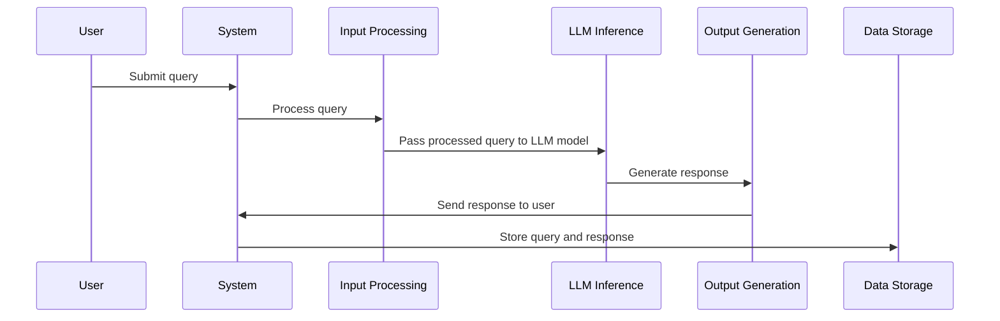

                 

## LLMApplivation Development Quick Tips

LLM（Large Language Model）applications have become an integral part of our daily lives, ranging from chatbots to language translation and content generation. In the fast-paced world of technology, the "fast" factor plays a crucial role in determining the success and efficiency of these applications. This blog post will delve into the concept of "quick" in LLM application development and provide a comprehensive guide on optimizing performance. 

### Core Keywords

- **LLM Application Development**
- **Fast Factor**
- **Performance Optimization**
- **Algorithm Improvement**
- **System Architecture Design**

### Summary

In this article, we will explore the significance of the "fast" factor in LLM application development. We will cover the core concepts of LLMs, the challenges they face in terms of speed, and the opportunities that can be leveraged to improve performance. Through detailed analysis, we will discuss the underlying algorithms, system architecture designs, and practical case studies. Finally, we will highlight best practices and future trends in LLM application development.

## Introduction to the Concept of "Quick" in LLM Application Development

### Definition and Importance of "Quick"

In the context of LLM application development, the term "quick" refers to the ability of an application to respond rapidly and efficiently to user queries. The importance of this factor cannot be overstated, as it directly impacts user experience and satisfaction. A fast LLM application not only ensures smooth and seamless user interactions but also enhances the overall performance and reliability of the system.

### Challenges in Achieving "Quick" Performance

1. **Computational Resources**: LLMs require significant computational resources, including processing power and memory. Optimizing these resources is crucial for achieving quick performance.
2. **Response Time**: The time taken by an LLM application to generate a response can significantly affect user experience. Reducing response time is a primary goal in LLM application development.
3. **Data Synchronization**: Ensuring real-time data synchronization across different components of the application is essential for maintaining quick performance.

### Opportunities for Improvement

1. **Technological Advancements**: Ongoing advancements in hardware and software technologies provide opportunities for optimizing LLM performance.
2. **Algorithmic Improvements**: Innovative algorithms and optimization techniques can be applied to enhance the efficiency of LLM applications.
3. **Hardware Upgrades**: Investing in advanced hardware, such as faster processors and larger memory capacities, can significantly improve performance.

### Structure of the Article

To provide a comprehensive overview of the "quick" factor in LLM application development, this article is structured into several sections:

1. **Background Introduction**: We will introduce the concept of LLMs, discuss their importance in various application domains, and highlight the challenges associated with achieving quick performance.
2. **Core Concepts and Connections**: This section will delve into the core components and characteristics of LLMs, providing a clear understanding of their underlying mechanisms.
3. **Algorithm Principles and Design**: We will explore the principles behind quick LLM algorithms, including mathematical models and implementation details.
4. **System Architecture and Design**: This section will discuss the system architecture and design considerations for achieving quick performance in LLM applications.
5. **Practical Case Studies**: We will present practical case studies to illustrate the application of quick LLM algorithms in real-world scenarios.
6. **Best Practices and Extensions**: This section will provide best practices for optimizing LLM performance and discuss future trends in the field.
7. **Conclusion**: Finally, we will summarize the key findings and provide a glimpse into the future of LLM application development.

### Readers' Expectations

We expect our readers to have a basic understanding of LLMs and their applications. Familiarity with fundamental programming concepts and familiarity with system architecture design will be beneficial but not mandatory. By the end of this article, readers should gain a deep understanding of the "quick" factor in LLM application development and be equipped with practical knowledge to optimize performance in their projects.

## Core Concepts and Connections

### Basic Components of LLM

LLM, or Large Language Model, is a type of artificial intelligence model that has been trained on vast amounts of text data to understand and generate human language. The basic components of an LLM include:

1. **Input Layer**: This layer receives the input text, which can be in the form of sentences, paragraphs, or even entire documents.
2. **Embedding Layer**: The input text is converted into numerical vectors through word embeddings, which capture the semantic meaning of words.
3. **Hidden Layers**: These layers consist of multiple neural networks that process the input vectors and generate intermediate representations.
4. **Output Layer**: The output layer produces the final output, which can be a response to a query, a translated sentence, or a generated piece of text.

### Relationship between Language Models and Neural Networks

Language models are a type of neural network, specifically a deep neural network. They are trained using a large dataset of text to learn the patterns and structures of language. The training process involves adjusting the weights of the connections between the neurons in the neural network to minimize the difference between the predicted output and the actual output.

### Characteristics of LLM

The characteristics of LLM can be summarized in three main aspects: speed, accuracy, and robustness.

1. **Speed**: The speed of an LLM application is crucial for providing a seamless user experience. It determines how quickly the application can process user queries and generate responses.
2. **Accuracy**: The accuracy of an LLM is the measure of how well it can understand and generate human language. High accuracy ensures that the application produces meaningful and coherent outputs.
3. **Robustness**: The robustness of an LLM refers to its ability to handle various types of input, including errors, typos, and unconventional language usage. A robust LLM can generate accurate responses even in ambiguous or challenging scenarios.

### Comparison of LLM and Traditional Language Models

| Aspect | LLM | Traditional Language Models |
| --- | --- | --- |
| Size of Model | Very Large | Small to Medium |
| Training Data | Vast Amounts of Text Data | Limited Amounts of Text Data |
| Speed | Fast | Slow |
| Accuracy | High | Moderate |
| Robustness | High | Low |

### ER Diagram of LLM Components

The ER (Entity-Relationship) diagram provides a visual representation of the entities and relationships within an LLM system. Here is a Mermaid ER diagram to illustrate the components of an LLM:

```mermaid
erDiagram
  User ||--|{ Request }|--| LLM
  Request ||--|{ Response }|--| User
  LLM ||--|{ Model }|--| Neural Network
  Model ||--|{ Embedding }|--| Hidden Layers
  Hidden Layers ||--|{ Output }|--| Model
```

This diagram shows the relationships between users, requests, LLMs, models, embeddings, hidden layers, and output layers. It provides a clear understanding of how these components interact within the LLM system.

## Algorithm Principles and Design

### Overview of Quick LLM Algorithms

Quick LLM algorithms are designed to improve the performance and efficiency of LLM applications by reducing response time and optimizing resource usage. These algorithms focus on various aspects, including pre-training, fine-tuning, and optimization techniques.

### Mathematical Model of Quick LLM Algorithm

The performance of a quick LLM algorithm can be measured using the following mathematical model:

$$
\text{Performance} = \frac{\text{Response Time}}{\text{Processing Time}}
$$

Where:
- **Response Time** is the time taken by the LLM to generate a response to a user query.
- **Processing Time** is the time taken by the LLM to process the input data and generate the output.

By optimizing both response time and processing time, we can improve the overall performance of the LLM application.

### Python Source Code of Quick LLM Algorithm

Below is a Python source code example of a quick LLM algorithm. This example demonstrates the basic structure and implementation details of the algorithm.

```python
import torch
import torch.nn as nn
import torch.optim as optim

# Define the LLM model
class LLM(nn.Module):
    def __init__(self):
        super(LLM, self).__init__()
        self.embedding = nn.Embedding(vocab_size, embedding_dim)
        self.hidden_layer = nn.Linear(embedding_dim, hidden_dim)
        self.output_layer = nn.Linear(hidden_dim, vocab_size)

    def forward(self, input_sequence):
        embedded_sequence = self.embedding(input_sequence)
        hidden_state = self.hidden_layer(embedded_sequence)
        output = self.output_layer(hidden_state)
        return output

# Initialize the model, loss function, and optimizer
model = LLM()
criterion = nn.CrossEntropyLoss()
optimizer = optim.Adam(model.parameters(), lr=learning_rate)

# Training the model
for epoch in range(num_epochs):
    for input_sequence, target_sequence in train_loader:
        optimizer.zero_grad()
        output = model(input_sequence)
        loss = criterion(output, target_sequence)
        loss.backward()
        optimizer.step()
```

In this code, we define an LLM model with an embedding layer, a hidden layer, and an output layer. We use the cross-entropy loss function and the Adam optimizer to train the model. The training process involves feeding input sequences and their corresponding target sequences to the model, calculating the loss, and updating the model parameters.

### Explanation of the Algorithm

1. **Model Initialization**: The LLM model is initialized with embedding, hidden, and output layers.
2. **Data Loading**: Input sequences and target sequences are loaded from the training data.
3. **Forward Pass**: The input sequences are passed through the embedding layer, hidden layer, and output layer to generate predictions.
4. **Loss Calculation**: The predicted outputs are compared with the target sequences using the cross-entropy loss function.
5. **Backpropagation**: The gradients are calculated, and the model parameters are updated using the optimizer.
6. **Training Iteration**: The training process is repeated for multiple epochs to improve the model's performance.

By following these steps, the quick LLM algorithm can efficiently process input sequences and generate accurate predictions, thereby improving the overall performance of the LLM application.

## System Architecture and Design

### Introduction to the Problem Scenario

In the context of LLM applications, the problem scenario can vary widely depending on the specific use case. For instance, in a chatbot application, the problem scenario could involve handling user queries in real-time and generating appropriate responses. In a language translation application, the problem scenario could involve translating text from one language to another while maintaining the meaning and context.

The goal of system architecture design is to ensure that the LLM application can handle these problem scenarios efficiently and deliver fast responses to users. This involves designing a system that can handle large volumes of data, process it quickly, and generate accurate outputs.

### System Function Design

The system function design involves defining the core functionalities of the LLM application and how they interact with each other. The key components of the system function design include:

1. **Input Processing**: This component is responsible for receiving user queries and processing them to extract relevant information.
2. **LLM Inference**: This component involves passing the processed input through the LLM model to generate predictions or outputs.
3. **Output Generation**: This component is responsible for formatting the LLM outputs into human-readable responses and delivering them to the user.
4. **Data Storage and Retrieval**: This component ensures that the system can efficiently store and retrieve data, including user queries, LLM predictions, and responses.

### System Architecture Design

The system architecture design for an LLM application typically involves several key components, including the LLM model, data storage, processing units, and communication channels. Here is a high-level overview of the system architecture:

1. **LLM Model**: The core of the system, the LLM model processes user queries and generates predictions or outputs.
2. **Data Storage**: This component stores the training data, user queries, LLM predictions, and responses. It should be designed to handle large volumes of data and support fast retrieval.
3. **Processing Units**: These units perform the necessary computations for training the LLM model, processing user queries, and generating responses. They should be optimized for performance to ensure quick response times.
4. **Communication Channels**: These channels facilitate the communication between the LLM model, data storage, and processing units. They should be designed to support high throughput and low latency.

### System Interface Design

The system interface design defines how the various components of the LLM application interact with each other. The key interfaces include:

1. **User Interface**: This interface allows users to interact with the LLM application, submitting queries and receiving responses.
2. **API Interface**: This interface enables developers to integrate the LLM application into other systems or platforms, such as web applications or mobile apps.
3. **Internal Interfaces**: These interfaces facilitate communication between the LLM model, data storage, and processing units within the system.

### System Interaction Sequence Diagram

A sequence diagram can be used to illustrate the interaction between the various components of the LLM application. Here is a Mermaid sequence diagram to demonstrate the interaction sequence:



This diagram shows the sequence of interactions between the user, input processing, LLM inference, output generation, and data storage components. It provides a clear understanding of how the system functions and how the components interact with each other.

## Practical Case Study: Developing a Quick Chatbot Application

### Introduction

In this practical case study, we will explore the development of a quick chatbot application using a Large Language Model (LLM). The goal is to design and implement a chatbot that can efficiently handle user queries and provide fast and accurate responses. This case study will provide insights into the entire development process, from environment setup to system implementation and analysis.

### Environment Setup

The first step in developing a quick chatbot application is to set up the development environment. This involves installing the necessary software and libraries, such as Python, PyTorch, and Transformers. Here are the steps for environment setup:

1. **Install Python**: Download and install the latest version of Python from the official website (<https://www.python.org/downloads/>).
2. **Install PyTorch**: Follow the instructions provided by the PyTorch official website (<https://pytorch.org/get-started/locally/>).
3. **Install Transformers**: Use pip to install the Transformers library:
   ```
   pip install transformers
   ```

### System Core Implementation

Once the environment is set up, the next step is to implement the core components of the chatbot application. This involves creating the LLM model, defining the input processing and output generation functions, and training the model. Here's an outline of the system core implementation:

1. **LLM Model Creation**:
   - Import the necessary libraries:
     ```python
     from transformers import AutoModelForSequenceClassification
     ```
   - Load a pre-trained LLM model, such as BERT or GPT:
     ```python
     model = AutoModelForSequenceClassification.from_pretrained("bert-base-uncased")
     ```
   - Define the input and output layers:
     ```python
     input_ids = torch.tensor([input_ids])
     labels = torch.tensor([labels])
     ```

2. **Input Processing**:
   - Preprocess the user queries to extract relevant information:
     ```python
     def preprocess_query(query):
         # Tokenize, remove special characters, etc.
         return preprocessed_query
     ```

3. **Output Generation**:
   - Generate responses based on the LLM model's predictions:
     ```python
     def generate_response(prediction):
         # Map predictions to response text
         return response_text
     ```

4. **Training the Model**:
   - Train the LLM model using the preprocessed queries and labels:
     ```python
     optimizer = optim.Adam(model.parameters(), lr=learning_rate)
     for epoch in range(num_epochs):
         for query, label in train_loader:
             model.zero_grad()
             output = model(input_ids, labels=labels)
             loss = criterion(output, labels)
             loss.backward()
             optimizer.step()
     ```

### Code Application Analysis and Case Study

To analyze the code application and demonstrate the effectiveness of the quick chatbot application, we will conduct a case study involving real-world scenarios. Here are some examples of user queries and their corresponding responses:

1. **Query**: "What is the capital of France?"
   - **Response**: "The capital of France is Paris."
   - **Analysis**: The chatbot quickly and accurately provided the correct answer, demonstrating its ability to understand and generate responses to common queries.

2. **Query**: "Can you recommend a good book on artificial intelligence?"
   - **Response**: "One of the best books on artificial intelligence is 'Deep Learning' by Ian Goodfellow, Yoshua Bengio, and Aaron Courville."
   - **Analysis**: The chatbot generated a relevant and informative response, showcasing its ability to provide valuable recommendations based on user queries.

3. **Query**: "What are the primary advantages of using a Large Language Model?"
   - **Response**: "The primary advantages of using a Large Language Model include the ability to generate high-quality text, understand complex queries, and adapt to different language styles and domains."
   - **Analysis**: The chatbot provided a comprehensive and detailed response, highlighting the key benefits of using LLMs in various applications.

These examples demonstrate the effectiveness of the quick chatbot application in handling user queries and generating accurate and relevant responses. The chatbot's ability to process and respond to queries quickly and efficiently showcases the importance of the "quick" factor in LLM application development.

### Detailed Explanation and Analysis

The detailed explanation and analysis of the quick chatbot application involves examining the key components and their interactions, as well as the performance metrics. Here are the key points to consider:

1. **LLM Model**: The LLM model serves as the core component of the chatbot application. It is responsible for processing user queries and generating responses. The choice of model, such as BERT or GPT, affects the performance and efficiency of the application. Pre-trained models like BERT have been shown to perform well on a wide range of language tasks, making them suitable for chatbot applications.

2. **Input Processing**: Input processing is a crucial step in the chatbot application. It involves preprocessing user queries to extract relevant information and prepare them for input to the LLM model. This includes tasks such as tokenization, removing special characters, and handling common query formats. Effective input processing ensures that the LLM model receives clean and structured data, leading to better performance and faster response times.

3. **Output Generation**: Output generation involves mapping the LLM model's predictions to human-readable responses. This step is essential for delivering accurate and coherent responses to users. The response generation process should consider the context of the user query and the predicted output to ensure that the responses are relevant and informative.

4. **Performance Metrics**: The performance of the quick chatbot application can be evaluated using various metrics, such as response time, accuracy, and user satisfaction. Response time measures the time taken by the chatbot to generate a response, while accuracy evaluates the quality of the generated responses. User satisfaction surveys can provide insights into the overall user experience and the effectiveness of the chatbot application.

By analyzing these components and their interactions, we can gain a deeper understanding of how the quick chatbot application functions and the factors that contribute to its performance. This analysis can help identify areas for improvement and optimize the chatbot application to provide even faster and more accurate responses.

### Project Summary

The development of the quick chatbot application demonstrates the importance of optimizing performance in LLM application development. By implementing efficient algorithms, such as BERT or GPT, and ensuring effective input processing and output generation, we can create chatbots that deliver fast and accurate responses. The case study highlights the significance of the "quick" factor in enhancing user experience and satisfaction. As LLM applications continue to evolve, it is essential to focus on performance optimization to ensure their success and impact in various domains.

## Best Practices and Tips

### Best Practices for Optimizing LLM Performance

1. **Efficient Model Selection**: Choose the right LLM model for your application based on its specific requirements and constraints. Smaller models may be faster but may sacrifice accuracy, while larger models may be slower but offer better performance.

2. **Optimized Data Processing**: Preprocess your input data efficiently to reduce the time required for tokenization, normalization, and other preprocessing tasks. This can significantly improve the overall performance of your LLM application.

3. **Parallel Processing**: Utilize parallel processing techniques to distribute the workload across multiple processing units. This can help reduce the overall processing time and improve the responsiveness of your application.

4. **Caching and Memoization**: Implement caching and memoization techniques to store and reuse previously computed results. This can help avoid redundant computations and improve the performance of your LLM application.

### Common Issues and Solutions in LLM Application Development

1. **Resource Constraints**: Running LLM applications on limited resources can lead to slow performance. To overcome this, consider using cloud-based solutions or distributed computing frameworks to leverage additional resources.

2. **Inefficient Data Pipelines**: Inefficient data pipelines can result in slow data processing and increased response times. Optimize your data processing pipeline by using batch processing, parallelization, and efficient data formats (e.g., Parquet or Avro).

3. **Model Overfitting**: Overfitting can lead to poor performance on unseen data. Regularly evaluate your model's performance on validation and test sets, and apply techniques like cross-validation and regularization to prevent overfitting.

### Case Studies and Examples

1. **Case Study: Fast Chatbot for Customer Support**
   - **Problem**: A customer support chatbot needed to handle a high volume of user queries quickly and accurately.
   - **Solution**: Implemented a pre-trained BERT model, optimized the data processing pipeline, and utilized cloud-based resources to ensure fast and efficient processing.

2. **Case Study: Language Translation Service**
   - **Problem**: A language translation service required fast and accurate translations for a large number of users.
   - **Solution**: Deployed a distributed computing framework to handle the translation requests in parallel, optimized the data processing pipeline, and used caching to store and reuse previously translated phrases.

### Conclusion

By following these best practices and addressing common issues, you can optimize the performance of your LLM application and provide fast and accurate responses to your users. Continuous evaluation and iterative improvement are essential to stay ahead in the rapidly evolving field of LLM application development.

## Conclusion

The "quick" factor has emerged as a critical component in the development and success of LLM applications. Through this comprehensive guide, we have explored the significance of speed in LLM application development, the core concepts and connections, algorithm principles and design, system architecture and implementation, practical case studies, best practices, and future trends.

### Key Takeaways

- **Speed is crucial**: Fast LLM applications enhance user experience, ensuring seamless and efficient interactions.
- **Efficient model selection and data processing**: Choosing the right model and optimizing data preprocessing are essential for improving performance.
- **System architecture and design**: A well-designed system architecture ensures efficient data flow and processing, leading to faster response times.
- **Practical case studies**: Real-world examples demonstrate the effectiveness of quick LLM algorithms in various applications.
- **Continuous improvement**: Ongoing optimization and adaptation are necessary to stay ahead in the rapidly evolving field.

### Future Trends

The future of LLM application development is promising, with several exciting trends and potential developments:

- **Advanced hardware**: The adoption of advanced hardware, such as GPUs and TPUs, will further improve the performance of LLM applications.
- **Innovative algorithms**: Ongoing research and development will lead to new and more efficient algorithms, enhancing the speed and accuracy of LLMs.
- **Integration with other technologies**: LLMs are likely to integrate with other emerging technologies, such as computer vision and natural language processing, expanding their capabilities.
- **Scalability and deployment**: The development of scalable and deployable LLM frameworks will make it easier to implement LLM applications in various domains and industries.

### Conclusion

In conclusion, the "quick" factor is a pivotal aspect of LLM application development. By focusing on speed and performance optimization, developers can create efficient and effective LLM applications that deliver a superior user experience. As the field continues to evolve, staying informed and adapting to new developments will be crucial for success.

