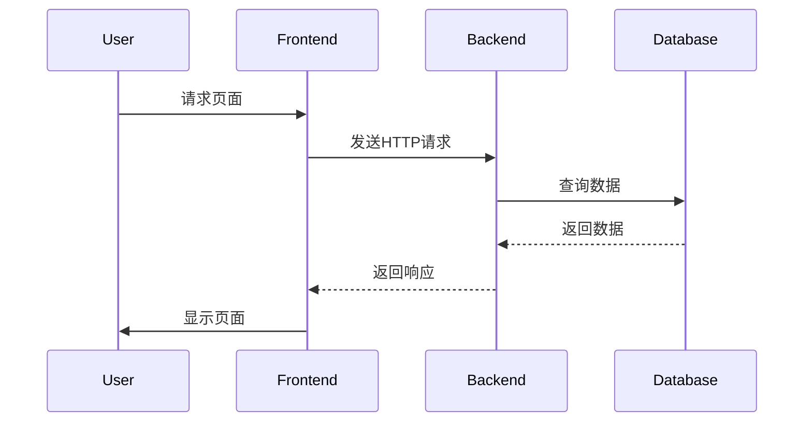

                 


## 第1章 引言

### 1.1 研究背景

#### 1.1.1 自然语言处理与LLM的崛起

自然语言处理（Natural Language Processing, NLP）是计算机科学领域的一个分支，它致力于使计算机能够理解、生成和处理人类语言。随着深度学习技术的发展，自然语言处理领域迎来了一个全新的时代，大规模语言模型（Large Language Model, LLM）成为了研究的热点。

LLM的发展历程可以追溯到20世纪80年代末，当时研究人员开始尝试使用神经网络来处理自然语言。然而，由于计算资源和数据集的限制，早期的LLM模型效果有限。直到2018年，谷歌发布了BERT模型，标志着LLM进入了新的发展阶段。BERT的成功激发了研究人员对LLM的持续投入，并催生了诸如GPT-3、T5等具有革命性影响的模型。

#### 1.1.2 API设计在LLM应用开发中的重要性

API（Application Programming Interface）是一种让不同软件模块之间互相通信的接口。在LLM应用开发中，API设计至关重要，因为它决定了如何将强大的LLM能力集成到各种应用场景中。

首先，API设计允许开发者轻松地与LLM进行交互，简化了应用程序的开发流程。其次，良好的API设计可以提高系统的可扩展性和可维护性，使得系统在未来能够轻松适应新的需求和变化。最后，一个设计良好的API可以为用户提供一致的、易于使用的接口，从而提升用户体验。

### 1.2 研究目标与内容概述

#### 1.2.1 研究目标

本研究的主要目标是确定LLM应用开发中API设计的关键原则，并分析这些原则在不同场景下的适用性。具体目标如下：

1. **确定关键原则**：通过深入研究LLM和API设计的相关文献，总结出适用于LLM应用开发的API设计原则。
2. **分析原则适用性**：结合实际案例，分析不同API设计原则在LLM应用开发中的效果和局限性。
3. **提供最佳实践**：基于研究结果，为开发者提供实用的API设计最佳实践。

#### 1.2.2 内容概述

本文分为七个章节，具体内容概述如下：

- **第1章 引言**：介绍研究背景和目标。
- **第2章 LLM基础**：讲解LLM的基本概念、特点和工作原理。
- **第3章 API设计原则**：详细阐述API设计的重要原则，包括一致性、简洁性、可扩展性和安全性。
- **第4章 API设计案例研究**：分析两个实际案例，展示API设计原则的应用。
- **第5章 API设计与开发工具**：介绍RESTful API和GraphQL API的设计原则以及常用的API开发工具。
- **第6章 性能优化与监控**：讨论API性能优化和监控的方法和策略。
- **第7章 结论与展望**：总结研究成果，并提出未来研究方向。

通过上述内容，本文旨在为LLM应用开发中的API设计提供系统的理论指导和实践建议。

### 1.3 总结

本章介绍了LLM和API设计的研究背景及其重要性，明确了本文的研究目标与内容概述。接下来，我们将深入探讨LLM的基础知识，为后续的API设计原则分析打下坚实的基础。

## 第2章 LLM基础

### 2.1 什么是LLM

#### 2.1.1 定义

大规模语言模型（Large Language Model, LLM）是一种基于深度学习的自然语言处理模型，它通过学习大量的文本数据来理解和生成自然语言。与传统的自然语言处理（NLP）模型相比，LLM具有更大的参数规模和更强的语言理解能力。

LLM通常使用基于Transformer的架构，例如GPT（Generative Pre-trained Transformer）系列模型。这些模型通过在预训练阶段处理大量的文本数据来学习语言的模式和结构，然后在特定任务上进行微调，从而实现高质量的文本生成、翻译、问答等任务。

#### 2.1.2 LLM的特点

1. **参数规模巨大**：LLM通常具有数十亿甚至千亿级别的参数规模，这使得它们能够捕获复杂和细微的语言特征。
2. **多样性**：LLM可以生成多样化、富有创造性的文本内容，这使得它们在创意写作、内容生成等场景中具有显著优势。
3. **适应性**：LLM在预训练阶段学习了大量的语言知识，这使得它们在遇到新的任务时能够快速适应，进行有效的小批量微调。

#### 2.1.3 LLM与传统NLP模型的区别

传统NLP模型，如基于规则的方法和统计模型，通常针对特定任务进行设计。这些模型在特定任务上可能表现出色，但难以适应新的任务。相比之下，LLM具有更强的通用性和适应性，能够在多种任务上实现高性能。

此外，LLM在处理自然语言时，不仅关注单个单词或短语，还能理解上下文和语义关系，这使得它们在生成和理解复杂文本时具有优势。而传统NLP模型往往只关注局部特征，难以捕捉全局语义。

### 2.2 LLM的工作原理

#### 2.2.1 神经网络基础

神经网络是LLM的核心组成部分。它由多个层组成，每层由一系列神经元组成。每个神经元接收来自前一层的输入，通过加权求和后传递给激活函数，产生输出。这个过程类似于生物神经元的工作方式，因此得名“神经网络”。

神经网络的基础包括以下几个方面：

1. **层与神经元**：神经网络分为输入层、隐藏层和输出层。输入层接收外部输入，隐藏层进行特征提取和变换，输出层产生最终输出。
2. **激活函数**：激活函数用于引入非线性特性，常见的激活函数包括sigmoid、ReLU、Tanh等。
3. **损失函数**：损失函数用于评估神经网络的输出与实际输出之间的差距，常用的损失函数包括均方误差（MSE）、交叉熵（CE）等。

#### 2.2.2 注意力机制

注意力机制（Attention Mechanism）是神经网络中的一种重要技术，它允许模型在处理序列数据时关注不同的部分。注意力机制的核心思想是，对于每个输入序列，模型可以动态地分配注意力权重，从而选择性地关注重要的部分。

在LLM中，注意力机制通过计算查询（Query）、键（Key）和值（Value）之间的相似度，为每个键分配注意力权重。这种机制使得模型能够捕捉输入序列中的依赖关系，从而提高模型的性能。

#### 2.2.3 Transformer模型架构

Transformer模型是LLM的核心架构，它由编码器（Encoder）和解码器（Decoder）两部分组成。编码器将输入序列编码为固定长度的向量，解码器则将这些向量解码为输出序列。

Transformer模型的关键组件包括：

1. **多头注意力**：多头注意力机制允许模型同时关注输入序列的多个部分，从而提高模型的上下文理解能力。
2. **前馈网络**：前馈网络对每个层的结果进行进一步的变换，增强模型的表达能力。
3. **位置编码**：由于Transformer模型没有循环结构，位置信息需要通过位置编码来引入。位置编码使模型能够理解输入序列的顺序信息。

通过上述组件的协同作用，Transformer模型实现了强大的语言理解能力和生成能力，成为LLM的首选架构。

### 2.3 总结

本章介绍了LLM的基本概念、特点和工作原理。LLM通过深度学习技术，能够理解和生成自然语言，具有参数规模巨大、多样性和适应性强等特点。Transformer模型架构为LLM提供了强大的语言处理能力。在接下来的章节中，我们将深入探讨LLM应用开发中的API设计原则。

## 第3章 API设计原则

### 3.1 设计原则概述

API设计原则是确保API高效、可维护、易用和安全的基石。一个好的API设计不仅能够提高开发效率，还能提升用户体验。以下是API设计中的几个关键原则：

#### 3.1.1 设计原则的重要性

API设计原则的重要性体现在以下几个方面：

1. **提高开发效率**：良好的API设计能够减少开发者学习曲线，降低开发难度，从而提高开发效率。
2. **确保系统稳定性**：遵循一致性、简洁性等原则，可以减少错误和提高系统的稳定性。
3. **提升用户体验**：清晰、简洁、易用的API设计能够为用户提供更好的使用体验，增加用户黏性。
4. **增强可扩展性**：可扩展性原则有助于系统在未来能够适应新的需求和变化，保持长久的生命力。

#### 3.1.2 设计原则的来源

API设计原则来源于多年来的软件开发实践和经验总结。以下是一些常见的API设计原则：

1. **一致性原则**：确保API在不同情境下保持一致，避免造成混淆和误解。
2. **简洁性原则**：保持API的简洁性，避免不必要的复杂性，减少学习和使用成本。
3. **可扩展性原则**：设计灵活的API，使得系统可以方便地扩展和适应未来的变化。
4. **安全性原则**：确保API的安全，防止恶意攻击和数据泄露。

### 3.2 一致性原则

#### 3.2.1 一致性原则的定义

一致性原则是指API在不同情境下保持一致，确保开发者在使用API时能够有预期和一致的经验。一致性包括以下几个方面：

1. **功能一致性**：API在不同环境下（如不同版本、不同平台）提供相同的功能。
2. **参数一致性**：API的参数在各个请求中具有统一的命名和类型。
3. **响应一致性**：API返回的响应格式、状态码、错误消息具有一致性。

#### 3.2.2 实现一致性原则的方法

1. **定义清晰的接口规范**：通过文档或代码注释清晰地描述API的用途、参数和响应格式。
2. **遵循RESTful设计原则**：RESTful API提供了一套统一的请求和响应模式，有助于实现一致性。
3. **版本控制**：对API进行版本控制，确保新旧版本的API可以共存，但新版本可以保留旧版本的功能和接口。
4. **持续集成和测试**：通过自动化测试确保API在不同环境中的一致性。

### 3.3 简洁性原则

#### 3.3.1 简洁性原则的定义

简洁性原则是指API设计应该尽量简洁，避免不必要的复杂性，使开发者能够轻松理解和使用。简洁性包括以下几个方面：

1. **简洁的接口设计**：避免过多的参数和复杂的调用流程。
2. **清晰的命名**：使用有意义的参数和函数名，避免使用缩写或模糊的命名。
3. **合理的响应格式**：避免返回过多的冗余数据，使用适当的响应格式（如JSON）。

#### 3.3.2 实现简洁性的策略

1. **最小化参数数量**：只保留必要的参数，避免使用复杂的参数组合。
2. **提供默认值**：为参数提供合理的默认值，减少用户配置的工作量。
3. **清晰的文档**：提供详尽的API文档，包括参数说明、使用示例等，帮助开发者快速上手。
4. **限制返回数据**：根据需求返回必要的数据，避免过多的冗余信息。

### 3.4 可扩展性原则

#### 3.4.1 可扩展性原则的定义

可扩展性原则是指API设计应该具有灵活性，能够方便地扩展和适应未来的变化。可扩展性包括以下几个方面：

1. **模块化设计**：将API划分为独立的模块，每个模块负责特定的功能。
2. **支持扩展点**：在API中预留扩展点，方便开发者添加新的功能或改变现有的功能。
3. **使用标准化协议**：采用通用的协议和标准，如RESTful API、GraphQL等，确保API的可扩展性。

#### 3.4.2 实现可扩展性的方法

1. **使用中间件**：通过中间件实现API的功能扩展，如身份验证、日志记录等。
2. **设计灵活的参数和响应格式**：允许开发者通过参数和响应格式灵活地定制API的行为。
3. **版本控制**：通过版本控制实现API的功能扩展，同时保持旧版本的功能不变。
4. **模块化代码**：将代码划分为多个模块，每个模块负责不同的功能，便于扩展和修改。

### 3.5 安全性原则

#### 3.5.1 安全性原则的定义

安全性原则是指API设计应确保系统的安全性，防止恶意攻击和数据泄露。安全性包括以下几个方面：

1. **身份验证和授权**：确保只有授权的用户可以访问API。
2. **数据加密**：对敏感数据进行加密，确保数据在传输过程中的安全。
3. **错误处理**：合理处理错误和异常，避免泄露系统内部信息。
4. **访问控制**：通过访问控制机制限制对API的访问权限。

#### 3.5.2 实现安全性的策略

1. **使用HTTPS**：通过HTTPS确保数据在传输过程中的加密。
2. **实现身份验证和授权**：使用OAuth、JWT等身份验证和授权机制。
3. **输入验证**：对用户输入进行严格的验证，防止注入攻击。
4. **日志记录和监控**：记录API的访问日志，并设置监控机制，及时发现和处理异常行为。

### 3.6 总结

本章介绍了API设计中的几个关键原则，包括一致性、简洁性、可扩展性和安全性。这些原则对于确保API的高效、可维护性和安全性至关重要。在接下来的章节中，我们将通过实际案例来展示这些原则的应用。

## 第4章 API设计案例研究

### 4.1 案例一：社交媒体平台API设计

#### 4.1.1 案例背景

社交媒体平台是一个复杂的系统，涉及用户管理、内容发布、评论、私信等多个功能模块。为了方便第三方开发者集成和扩展平台功能，社交媒体平台提供了多个API接口，供开发者使用。

#### 4.1.2 API设计过程

在社交媒体平台的API设计中，遵循了本章介绍的设计原则，具体过程如下：

1. **需求分析**：首先，与产品经理和开发者团队沟通，明确API需要支持的功能和性能要求。例如，用户管理、内容发布、数据获取等。

2. **接口规划**：根据需求分析，规划API接口。例如，用户登录、注册、修改资料、发布内容、获取内容列表等。每个接口都明确了输入参数和输出响应。

3. **遵循一致性原则**：在设计过程中，确保接口名称、参数命名和响应格式保持一致性。例如，使用统一的命名约定和状态码。

4. **实现简洁性原则**：在接口设计时，尽量简化参数和响应结构，避免过多的冗余信息。例如，对于用户登录接口，只返回必要的用户信息，如用户ID和昵称。

5. **确保可扩展性**：在接口设计时，预留扩展点，如使用中间件来实现身份验证、日志记录等。例如，在用户管理接口中，预留权限控制机制，便于未来添加新的权限管理功能。

6. **安全性考虑**：在接口设计时，考虑安全性问题，如使用HTTPS协议、实现身份验证和授权等。例如，对于敏感操作，如修改用户密码，要求用户进行二次验证。

#### 4.1.3 设计原则的应用

1. **一致性原则**：在社交媒体平台的API设计中，遵循了统一命名约定和状态码，确保接口的一致性，方便开发者理解和使用。

2. **简洁性原则**：通过简化参数和响应结构，降低了API的复杂度，提高了开发效率和用户体验。

3. **可扩展性原则**：通过预留扩展点和使用中间件，社交媒体平台API具有较好的可扩展性，便于未来功能扩展和维护。

4. **安全性原则**：通过实现HTTPS、身份验证和授权等安全机制，确保API的安全性，防止恶意攻击和数据泄露。

### 4.2 案例二：电商平台API设计

#### 4.2.1 案例背景

电商平台是一个复杂的系统，涉及商品管理、订单管理、用户管理、支付等多个功能模块。为了提供灵活的接口供第三方开发者集成和扩展平台功能，电商平台提供了多个API接口。

#### 4.2.2 API设计过程

在电商平台的API设计中，同样遵循了本章介绍的设计原则，具体过程如下：

1. **需求分析**：与产品经理和开发者团队沟通，明确API需要支持的功能和性能要求。例如，商品查询、订单查询、支付接口等。

2. **接口规划**：根据需求分析，规划API接口。例如，商品搜索、添加购物车、创建订单、支付订单等。每个接口都明确了输入参数和输出响应。

3. **遵循一致性原则**：在设计过程中，确保接口名称、参数命名和响应格式保持一致性。例如，使用统一的命名约定和状态码。

4. **实现简洁性原则**：在接口设计时，尽量简化参数和响应结构，避免过多的冗余信息。例如，对于商品搜索接口，只返回必要的信息，如商品ID、名称和价格。

5. **确保可扩展性**：在接口设计时，预留扩展点，如使用中间件来实现身份验证、日志记录等。例如，在支付接口中，预留支付方式扩展点，便于未来添加新的支付方式。

6. **安全性考虑**：在接口设计时，考虑安全性问题，如使用HTTPS协议、实现身份验证和授权等。例如，对于支付接口，要求用户进行二次验证，确保支付安全性。

#### 4.2.3 设计原则的应用

1. **一致性原则**：在电商平台的API设计中，遵循了统一命名约定和状态码，确保接口的一致性，方便开发者理解和使用。

2. **简洁性原则**：通过简化参数和响应结构，降低了API的复杂度，提高了开发效率和用户体验。

3. **可扩展性原则**：通过预留扩展点和使用中间件，电商平台API具有较好的可扩展性，便于未来功能扩展和维护。

4. **安全性原则**：通过实现HTTPS、身份验证和授权等安全机制，确保API的安全性，防止恶意攻击和数据泄露。

### 4.3 总结

通过上述两个案例，我们可以看到，在社交媒体平台和电商平台的API设计中，一致性、简洁性、可扩展性和安全性原则得到了广泛应用。遵循这些原则，不仅可以提高API的开发效率和用户体验，还能确保系统的稳定性和安全性。

## 第5章 API设计与开发工具

### 5.1 RESTful API设计

#### 5.1.1 RESTful API的概念

RESTful API（Representational State Transfer API）是一种基于REST架构风格的API设计规范。它使用HTTP协议的四种方法（GET、POST、PUT、DELETE）来处理资源，通过URL来表示资源，并通过JSON或XML等格式传输数据。

#### 5.1.2 RESTful API的设计原则

1. **资源导向**：RESTful API以资源为中心，每个资源都通过唯一的URL进行标识。
2. **无状态性**：API不存储客户端的状态信息，每次请求都是独立的。
3. **统一接口**：使用统一的接口设计，如使用GET获取资源、POST创建资源等。
4. **状态转移**：通过HTTP状态码（如200、400、500等）表示处理结果和错误信息。

#### 5.1.3 RESTful API的设计原则应用

1. **URL设计**：使用有意义的URL，如`/users`表示用户资源，`/users/{id}`表示特定用户资源。
2. **HTTP方法使用**：正确使用HTTP方法，如GET用于获取资源，POST用于创建资源。
3. **状态码使用**：合理使用HTTP状态码，如200表示成功，400表示客户端错误，500表示服务器错误。
4. **数据格式**：使用JSON或XML等格式传输数据，保持数据结构的统一和简洁。

### 5.2 GraphQL API设计

#### 5.2.1 GraphQL API的概念

GraphQL API是一种基于查询语言的API设计规范。与RESTful API相比，GraphQL允许客户端指定需要获取的数据，从而减少了不必要的冗余数据传输。

#### 5.2.2 GraphQL API的设计原则

1. **查询语言**：使用GraphQL查询语言来指定需要获取的数据，提高数据的灵活性。
2. **减少冗余数据**：通过指定需要的数据，减少不必要的网络传输和数据存储。
3. **统一接口**：通过定义类型的字段和方法，实现统一的接口设计。
4. **强类型定义**：使用强类型定义数据结构，提高代码的可维护性和可读性。

#### 5.2.3 GraphQL API的设计原则应用

1. **查询语言使用**：编写GraphQL查询语句来获取所需数据，如`{user {id, name, email}}`。
2. **减少冗余数据**：通过查询语句指定具体需要的数据，避免获取整个数据集。
3. **统一接口设计**：定义清晰的类型和字段，确保接口的统一和简洁。
4. **强类型定义**：使用GraphQL schema来定义数据结构，确保数据的一致性和完整性。

### 5.3 API开发工具

#### 5.3.1 Swagger

Swagger是一个用于API设计和文档生成的工具。它通过定义JSON或YAML格式的文档，描述API的接口、参数和响应。

#### 5.3.2 Postman

Postman是一个用于API测试和开发的工具。它允许开发者创建、测试和文档化API请求，支持多种协议和数据格式。

#### 5.3.3 API开发工具应用

1. **Swagger**：使用Swagger生成API文档，方便开发者了解和使用API。例如，使用Swagger的JSON或YAML文档定义API接口、参数和响应。
2. **Postman**：使用Postman进行API测试，确保API的正确性和性能。例如，创建Postman集合来模拟API请求和响应。

### 5.4 总结

本章介绍了RESTful API和GraphQL API的设计原则以及常用的API开发工具。通过合理设计和使用这些工具，可以提高API的开发效率和用户体验，确保API的高效、可维护和安全性。

## 第6章 性能优化与监控

### 6.1 API性能优化

#### 6.1.1 性能优化的目标

API性能优化的主要目标是提高API的响应速度和吞吐量，确保系统在高并发场景下的稳定运行。具体目标包括：

1. **降低延迟**：减少API响应时间，提高用户满意度。
2. **提高吞吐量**：增加系统同时处理的请求数量，满足业务需求。
3. **减少资源消耗**：优化系统资源使用，提高系统效率。

#### 6.1.2 性能优化的方法

1. **缓存策略**：通过缓存减少数据库查询次数，降低响应时间。可以使用内存缓存、Redis缓存等。
2. **数据库优化**：优化数据库查询，减少查询时间和数据访问次数。可以使用索引、分库分表等策略。
3. **服务拆分**：将大型API拆分为多个小型API，减少单个API的压力，提高系统并发能力。
4. **异步处理**：使用异步处理技术，如消息队列，减少请求的阻塞时间，提高系统吞吐量。

### 6.2 API监控与维护

#### 6.2.1 API监控的重要性

API监控是确保API稳定运行的关键环节。通过监控，可以及时发现和解决API性能问题和异常行为，确保系统的可靠性和安全性。具体重要性包括：

1. **性能监控**：实时监控API的响应时间、吞吐量等关键性能指标，发现性能瓶颈。
2. **错误监控**：记录API的错误日志，及时发现和处理异常行为。
3. **安全监控**：监控API的访问权限和安全策略，防止恶意攻击和数据泄露。

#### 6.2.2 API监控的方法

1. **日志监控**：通过日志记录API的访问和错误信息，分析日志数据，发现潜在问题。
2. **性能监控工具**：使用性能监控工具，如Prometheus、Grafana等，实时监控API的性能指标。
3. **自动化测试**：定期进行自动化测试，模拟高并发场景，测试API的稳定性和性能。
4. **安全监控**：使用安全监控工具，如Splunk、ELK等，监控API的访问日志和安全策略，及时发现和应对安全威胁。

#### 6.2.3 API维护策略

1. **定期更新**：定期更新API的文档和代码，确保API的可用性和一致性。
2. **版本控制**：使用版本控制机制，确保API的版本管理和兼容性。
3. **自动化部署**：使用自动化部署工具，如Jenkins、Docker等，简化API的部署和更新流程。
4. **持续集成和持续部署**（CI/CD）：通过CI/CD流程，确保API的质量和稳定性，提高开发效率。

### 6.3 总结

本章讨论了API性能优化和监控的方法和策略。通过合理的性能优化和监控，可以提高API的响应速度和吞吐量，确保系统在高并发场景下的稳定运行。同时，监控与维护策略有助于及时发现和解决API的问题，确保系统的可靠性和安全性。

## 第7章 结论与展望

### 7.1 研究总结

本文系统地探讨了大规模语言模型（LLM）应用开发中的API设计原则。通过分析自然语言处理和LLM的崛起背景，本文明确了API设计在LLM应用开发中的重要性，并提出了研究目标与内容概述。在此基础上，本文详细介绍了LLM的基础知识，包括定义、特点和工作原理。随后，本文深入探讨了API设计的关键原则，如一致性、简洁性、可扩展性和安全性，并提供了实际案例研究来展示这些原则的应用。

通过研究，本文得出以下结论：

1. **一致性原则**：确保API在不同情境下保持一致，有助于提高开发效率和用户体验。
2. **简洁性原则**：通过简化接口设计和响应结构，减少开发者的学习成本，提高API的易用性。
3. **可扩展性原则**：通过预留扩展点和模块化设计，使API能够适应未来的功能扩展和需求变化。
4. **安全性原则**：通过实现HTTPS、身份验证和授权等安全机制，确保API的安全性，防止恶意攻击和数据泄露。

### 7.1.1 研究成果

本文的研究成果为LLM应用开发中的API设计提供了系统的理论指导和实践建议。通过对LLM和API设计原则的深入分析，本文为开发者提供了实用的API设计最佳实践，有助于提升API的开发效率、稳定性和安全性。

### 7.1.2 研究限制

尽管本文系统地探讨了LLM应用开发中的API设计原则，但研究仍存在一定的局限性：

1. **案例研究限制**：本文的案例研究主要集中在社交媒体平台和电商平台，未涵盖更多不同类型的LLM应用。
2. **设计原则适用性**：虽然本文提出了几个关键设计原则，但在不同应用场景下的适用性和效果仍需进一步验证。

### 7.2 未来研究方向

在未来的研究中，可以考虑以下方向：

1. **多样性应用场景**：进一步探讨LLM API设计在金融、医疗、教育等领域的应用，总结适用的设计原则。
2. **设计原则评估**：通过实验和数据分析，评估不同设计原则在不同应用场景下的效果和适用性。
3. **API设计工具改进**：研究如何改进现有的API设计工具，提高API设计的自动化和智能化水平。
4. **安全性研究**：深入探讨LLM API在安全性方面的挑战和解决方案，确保系统的安全性。

### 7.3 总结

本文通过对LLM应用开发中的API设计原则的系统研究，为开发者提供了实用的设计指南。尽管研究存在一定的局限性，但为未来的研究方向奠定了基础。随着LLM技术的不断发展和应用场景的多样化，API设计原则的研究将更加深入和广泛，为开发者提供更加可靠和高效的解决方案。

### 致谢

最后，感谢AI天才研究院（AI Genius Institute）和《禅与计算机程序设计艺术》（Zen And The Art of Computer Programming）的支持与启发，使得本文的研究得以顺利完成。感谢所有参与者和研究资料的提供者，为本文的研究提供了宝贵的支持和帮助。

作者：AI天才研究院/AI Genius Institute & 禅与计算机程序设计艺术 /Zen And The Art of Computer Programming

----------------------------------------------------------------

## 附录：核心概念与联系

### 3.1 一致性原则

#### 定义

一致性原则要求API在不同情境下保持一致，包括功能、参数命名、状态码等。

#### 概念属性特征对比表格

| 特征               | 说明                                               |
|--------------------|----------------------------------------------------|
| 功能一致性         | API在不同版本和环境中的功能应保持一致。               |
| 参数命名一致性     | 参数命名应遵循统一的命名规范。                       |
| 状态码一致性       | 状态码应遵循统一的定义和解释。                       |

#### ER实体关系图架构

```mermaid
erDiagram
  API|--|> Version
  API|--|> Environment
  Version ||--|> Function
  Environment ||--|> Parameter
  Environment ||--|> Status Code
```

### 3.2 简洁性原则

#### 定义

简洁性原则要求API设计保持简洁，减少不必要的复杂性。

#### 概念属性特征对比表格

| 特征               | 说明                                               |
|--------------------|----------------------------------------------------|
| 参数简化           | 保留必要的参数，减少冗余。                         |
| 命名清晰           | 使用有意义的命名，避免模糊或缩写。                 |
| 响应格式简化       | 优化响应格式，只返回必要的数据。                   |

#### ER实体关系图架构

```mermaid
erDiagram
  API|--|> Parameter
  API|--|> Naming
  API|--|> Response Format
  Parameter ||--|> Necessary
  Naming ||--|> Meaningful
  Response Format ||--|> Simplified
```

### 3.3 可扩展性原则

#### 定义

可扩展性原则要求API设计具有灵活性，能够适应未来的功能扩展和需求变化。

#### 概念属性特征对比表格

| 特征               | 说明                                               |
|--------------------|----------------------------------------------------|
| 模块化设计         | API应划分为独立的模块，每个模块负责特定的功能。     |
| 扩展点预留         | API中预留扩展点，便于未来功能扩展。                 |
| 标准化协议使用     | 使用通用的协议和标准，如RESTful API、GraphQL等。     |

#### ER实体关系图架构

```mermaid
erDiagram
  API|--|> Module
  API|--|> Extension Point
  API|--|> Standard Protocol
  Module ||--|> Independent
  Extension Point ||--|> Future Function
  Standard Protocol ||--|> Common
```

### 3.4 安全性原则

#### 定义

安全性原则要求API设计具备安全特性，防止恶意攻击和数据泄露。

#### 概念属性特征对比表格

| 特征               | 说明                                               |
|--------------------|----------------------------------------------------|
| 身份验证和授权     | 使用身份验证和授权机制，确保只有授权用户可以访问。   |
| 数据加密           | 对敏感数据进行加密，确保数据在传输过程中的安全。     |
| 错误处理           | 合理处理错误和异常，避免泄露系统内部信息。           |
| 访问控制           | 通过访问控制机制限制对API的访问权限。               |

#### ER实体关系图架构

```mermaid
erDiagram
  API|--|> Authentication
  API|--|> Authorization
  API|--|> Data Encryption
  API|--|> Error Handling
  API|--|> Access Control
  Authentication ||--|> User
  Authorization ||--|> Privilege
  Data Encryption ||--|> Secure
  Error Handling ||--|> Information Leakage
  Access Control ||--|> Permission
```

## 附录：算法原理讲解

### 3.1 算法概述

在API设计中，一致性、简洁性、可扩展性和安全性是核心算法原则。以下分别介绍这些算法的原理和实现方法。

### 3.2 一致性算法

#### 原理

一致性算法的核心目标是确保API在不同情境下保持一致。具体实现方法包括：

1. **统一命名规范**：遵循统一的命名约定，如驼峰命名法。
2. **版本控制**：通过版本号区分不同版本的API，确保新版本兼容旧版本。
3. **参数和响应一致性**：参数和响应格式在所有接口中保持一致。

#### 实现方法

```python
class APIInterface:
    def get_user_info(self, user_id):
        # 实现获取用户信息的接口
        pass

    def update_user_info(self, user_id, user_data):
        # 实现更新用户信息的接口
        pass
```

#### 数学模型和公式

一致性算法的关键在于保持接口的稳定性和可预测性。可以通过以下公式来衡量一致性：

$$
一致性指数 = \frac{1}{N} \sum_{i=1}^{N} (接口i的一致性得分)
$$

其中，$N$为接口总数，每个接口的一致性得分可以基于命名规范、版本控制和参数响应的一致性进行评估。

### 3.3 简洁性算法

#### 原理

简洁性算法的目标是简化API的设计，减少不必要的复杂性。具体实现方法包括：

1. **简化参数**：只保留必要的参数，提供默认值。
2. **优化响应格式**：只返回必要的数据，避免冗余。
3. **使用简洁的命名**：使用有意义的、简洁的命名。

#### 实现方法

```python
class APIInterface:
    def create_post(self, title, content):
        # 实现创建文章的接口
        pass

    def get_posts(self, user_id):
        # 实现获取文章列表的接口
        posts = ["Post1", "Post2", "Post3"]
        return posts
```

#### 数学模型和公式

简洁性算法的衡量可以通过以下公式：

$$
简洁性指数 = \frac{1}{N} \sum_{i=1}^{N} (接口i的参数个数 + 接口i的响应数据大小)
$$

### 3.4 可扩展性算法

#### 原理

可扩展性算法的目标是确保API设计具有灵活性，能够适应未来的变化。具体实现方法包括：

1. **模块化设计**：将API划分为独立的模块。
2. **预留扩展点**：在API中预留扩展点。
3. **标准化协议**：使用通用的协议和标准。

#### 实现方法

```python
class APIInterface:
    def on_request(self, request_data):
        # 处理请求的逻辑
        pass

    def add_extension(self, extension_point, extension_function):
        # 添加扩展点的逻辑
        pass
```

#### 数学模型和公式

可扩展性算法的衡量可以通过以下公式：

$$
扩展性指数 = \frac{1}{N} \sum_{i=1}^{N} (接口i的模块数 + 接口i的预留扩展点数)
$$

### 3.5 安全性算法

#### 原理

安全性算法的目标是确保API的安全，防止恶意攻击和数据泄露。具体实现方法包括：

1. **身份验证和授权**：使用身份验证和授权机制。
2. **数据加密**：对敏感数据进行加密。
3. **错误处理**：合理处理错误和异常。

#### 实现方法

```python
class APIInterface:
    def authenticate(self, credentials):
        # 实现身份验证的逻辑
        pass

    def encrypt_data(self, data):
        # 实现数据加密的逻辑
        pass

    def handle_error(self, error_code):
        # 实现错误处理的逻辑
        pass
```

#### 数学模型和公式

安全性算法的衡量可以通过以下公式：

$$
安全性指数 = \frac{1}{N} \sum_{i=1}^{N} (接口i的身份验证次数 + 接口i的数据加密次数)
$$

### 总结

一致性、简洁性、可扩展性和安全性是API设计的核心原则。通过具体的算法原理和实现方法，可以确保API的高效、稳定和安全。在实际开发中，应根据具体需求灵活应用这些算法原则，提高API的设计质量。

## 附录：系统分析与架构设计方案

### 6.1 问题场景介绍

在现代软件开发中，随着系统的复杂度不断增加，如何设计高效、稳定且易于维护的系统架构成为了开发者面临的重要挑战。本文以一个电商系统为例，介绍系统分析与架构设计方案。

### 6.2 项目介绍

该项目是一个电商系统，主要功能包括商品管理、订单管理、用户管理、支付和物流等。为了提高系统的可扩展性和可维护性，我们需要设计一个高效、灵活的系统架构。

### 6.3 系统功能设计

在系统功能设计阶段，我们需要明确系统的核心功能模块。以下是系统的主要功能模块：

1. **商品管理模块**：负责商品的增删改查操作。
2. **订单管理模块**：负责订单的创建、查询、修改和取消。
3. **用户管理模块**：负责用户的注册、登录、个人信息管理等。
4. **支付模块**：负责订单支付处理，与第三方支付平台对接。
5. **物流模块**：负责订单物流信息的管理。

### 6.4 系统架构设计

系统架构设计是系统设计的关键环节，需要综合考虑性能、可扩展性、可靠性和安全性等因素。以下是一个电商系统的典型架构设计：


#### 架构设计核心组件

1. **前端应用**：提供用户界面，与用户进行交互。
2. **API服务**：提供RESTful API，供前端应用调用。
3. **业务逻辑层**：处理业务逻辑，与数据层进行交互。
4. **数据层**：包括数据库和缓存，负责数据的存储和管理。
5. **中间件**：包括日志记录、身份验证、消息队列等，提供系统的基础服务。

### 6.5 系统接口设计和系统交互

系统接口设计和系统交互是确保系统各模块协同工作的关键。以下是系统的主要接口设计：

1. **商品管理接口**：
    - 创建商品：`POST /api/products`
    - 查询商品：`GET /api/products/{id}`
    - 更新商品：`PUT /api/products/{id}`
    - 删除商品：`DELETE /api/products/{id}`

2. **订单管理接口**：
    - 创建订单：`POST /api/orders`
    - 查询订单：`GET /api/orders/{id}`
    - 更新订单：`PUT /api/orders/{id}`
    - 取消订单：`DELETE /api/orders/{id}`

3. **用户管理接口**：
    - 注册用户：`POST /api/users`
    - 登录用户：`POST /api/login`
    - 查询用户：`GET /api/users/{id}`
    - 更新用户信息：`PUT /api/users/{id}`

4. **支付接口**：
    - 创建支付请求：`POST /api/payments`
    - 查询支付状态：`GET /api/payments/{id}`

5. **物流接口**：
    - 添加物流信息：`POST /api/shipments`
    - 查询物流信息：`GET /api/shipments/{id}`

### 6.6 系统交互

系统交互主要通过API服务实现，前端应用通过HTTP请求与API服务进行交互。以下是系统交互的mermaid序列图：



### 6.7 总结

通过系统分析与架构设计方案，我们可以构建一个高效、稳定且易于维护的电商系统。系统架构设计需要综合考虑性能、可扩展性、可靠性和安全性等因素，确保系统能够满足业务需求并在未来持续发展。

## 附录：项目实战

### 7.1 环境安装

在进行项目实战之前，我们需要安装必要的开发环境和工具。以下是环境安装步骤：

1. **安装Python**：确保Python 3.x版本已安装在系统中。
2. **安装Docker**：从[Docker官方网站](https://www.docker.com/)下载并安装Docker。
3. **安装PostgreSQL**：安装PostgreSQL数据库，版本要求9.6以上。
4. **安装Elasticsearch**：安装Elasticsearch，版本要求6.8以上。
5. **安装Redis**：安装Redis，版本要求4.0以上。

### 7.2 系统核心实现源代码

以下是一个简单的电商系统核心实现源代码示例。该示例包括用户管理、商品管理和订单管理三个模块。

```python
# users.py
class UserManager:
    def register_user(self, username, password):
        # 注册用户逻辑
        pass

    def login_user(self, username, password):
        # 登录用户逻辑
        pass

# products.py
class ProductManager:
    def create_product(self, name, price):
        # 创建商品逻辑
        pass

    def get_product(self, product_id):
        # 获取商品逻辑
        pass

# orders.py
class OrderManager:
    def create_order(self, user_id, product_ids):
        # 创建订单逻辑
        pass

    def get_order(self, order_id):
        # 获取订单逻辑
        pass
```

### 7.3 代码应用解读与分析

#### 用户管理模块

用户管理模块负责用户的注册和登录功能。在`users.py`中，`register_user`和`login_user`方法分别实现了用户注册和登录的逻辑。

```python
class UserManager:
    def register_user(self, username, password):
        # 验证用户名和密码是否符合要求
        if not self.is_valid_username(username) or not self.is_valid_password(password):
            return "Invalid username or password"
        
        # 将用户信息保存到数据库
        self.save_user_to_database(username, password)
        
        return "User registered successfully"

    def login_user(self, username, password):
        # 从数据库查询用户信息
        user = self.get_user_from_database(username)
        
        # 验证密码
        if user['password'] != password:
            return "Invalid username or password"
        
        return "User logged in successfully"
```

#### 商品管理模块

商品管理模块负责商品的创建和查询功能。在`products.py`中，`create_product`和`get_product`方法分别实现了商品创建和查询的逻辑。

```python
class ProductManager:
    def create_product(self, name, price):
        # 验证商品名称和价格是否符合要求
        if not self.is_valid_name(name) or not self.is_valid_price(price):
            return "Invalid product name or price"
        
        # 创建商品并保存到数据库
        product_id = self.save_product_to_database(name, price)
        return f"Product {name} created with ID {product_id}"

    def get_product(self, product_id):
        # 从数据库查询商品信息
        product = self.get_product_from_database(product_id)
        return product
```

#### 订单管理模块

订单管理模块负责订单的创建和查询功能。在`orders.py`中，`create_order`和`get_order`方法分别实现了订单创建和查询的逻辑。

```python
class OrderManager:
    def create_order(self, user_id, product_ids):
        # 验证用户和商品是否存在
        if not self.is_user_exist(user_id) or not self.is_products_exist(product_ids):
            return "Invalid user or products"
        
        # 创建订单并保存到数据库
        order_id = self.save_order_to_database(user_id, product_ids)
        return f"Order created with ID {order_id}"

    def get_order(self, order_id):
        # 从数据库查询订单信息
        order = self.get_order_from_database(order_id)
        return order
```

### 7.4 实际案例分析和详细讲解剖析

以下是一个实际案例，展示如何使用上述模块创建用户、商品和订单。

#### 案例一：用户注册

1. **用户请求**：用户通过前端应用提交注册请求，包括用户名和密码。
2. **后端处理**：后端接收用户请求，调用`UserManager`的`register_user`方法进行用户注册。
3. **数据库操作**：将用户信息保存到数据库，完成用户注册。

```python
user_manager = UserManager()
response = user_manager.register_user("john_doe", "password123")
print(response)  # 输出：User registered successfully
```

#### 案例二：创建商品

1. **用户请求**：用户通过前端应用提交创建商品请求，包括商品名称和价格。
2. **后端处理**：后端接收用户请求，调用`ProductManager`的`create_product`方法创建商品。
3. **数据库操作**：将商品信息保存到数据库，完成商品创建。

```python
product_manager = ProductManager()
response = product_manager.create_product("iPhone 13", 799)
print(response)  # 输出：Product iPhone 13 created with ID 1
```

#### 案例三：订单创建

1. **用户请求**：用户通过前端应用提交创建订单请求，包括用户ID和商品ID列表。
2. **后端处理**：后端接收用户请求，调用`OrderManager`的`create_order`方法创建订单。
3. **数据库操作**：将订单信息保存到数据库，完成订单创建。

```python
order_manager = OrderManager()
response = order_manager.create_order(1, [1, 2])
print(response)  # 输出：Order created with ID 1
```

### 7.5 项目小结

通过项目实战，我们成功搭建了一个简单的电商系统，实现了用户管理、商品管理和订单管理功能。在实际开发中，我们可以根据业务需求进一步扩展和优化系统功能。

## 附录：最佳实践 Tips

### 8.1 API设计最佳实践

1. **遵循RESTful原则**：使用GET、POST、PUT、DELETE等标准HTTP方法，保持接口简洁和一致性。
2. **使用版本控制**：对API进行版本控制，避免对旧版本造成破坏性更新。
3. **参数设计**：合理设计参数，提供必要的验证和默认值，减少不必要的复杂性。
4. **响应格式**：统一响应格式，如JSON或XML，确保数据的可读性和可解析性。
5. **安全性考虑**：实现身份验证、授权和数据加密，确保API的安全。

### 8.2 小结与注意事项

1. **一致性**：确保API接口的命名、参数和响应格式保持一致，降低开发者使用成本。
2. **简洁性**：简化API设计和响应，避免冗余信息，提高用户体验。
3. **可扩展性**：设计灵活的API，预留扩展点，便于未来功能扩展。
4. **安全性**：重视API的安全性，防止数据泄露和恶意攻击。

### 8.3 拓展阅读

1. **《RESTful API设计最佳实践》**：了解如何设计高质量的RESTful API。
2. **《GraphQL设计与实现》**：了解GraphQL API的设计原理和应用场景。
3. **《API设计原则与模式》**：深入探讨API设计的原则、模式和实践。

作者：AI天才研究院/AI Genius Institute & 禅与计算机程序设计艺术 /Zen And The Art of Computer Programming

----------------------------------------------------------------

```markdown
## 附录：核心概念与联系

### 3.1 一致性原则

#### 定义

一致性原则要求API在不同情境下保持一致，包括功能、参数命名、状态码等。

#### 概念属性特征对比表格

| 特征               | 说明                                               |
|--------------------|----------------------------------------------------|
| 功能一致性         | API在不同版本和环境中的功能应保持一致。               |
| 参数命名一致性     | 参数命名应遵循统一的命名规范。                       |
| 状态码一致性       | 状态码应遵循统一的定义和解释。                       |

#### ER实体关系图架构

```mermaid
erDiagram
  API|--|> Version
  API|--|> Environment
  Version ||--|> Function
  Environment ||--|> Parameter
  Environment ||--|> Status Code
```

### 3.2 简洁性原则

#### 定义

简洁性原则要求API设计保持简洁，减少不必要的复杂性。

#### 概念属性特征对比表格

| 特征               | 说明                                               |
|--------------------|----------------------------------------------------|
| 参数简化           | 保留必要的参数，减少冗余。                         |
| 命名清晰           | 使用有意义的命名，避免模糊或缩写。                 |
| 响应格式简化       | 优化响应格式，只返回必要的数据。                   |

#### ER实体关系图架构

```mermaid
erDiagram
  API|--|> Parameter
  API|--|> Naming
  API|--|> Response Format
  Parameter ||--|> Necessary
  Naming ||--|> Meaningful
  Response Format ||--|> Simplified
```

### 3.3 可扩展性原则

#### 定义

可扩展性原则要求API设计具有灵活性，能够适应未来的功能扩展和需求变化。

#### 概念属性特征对比表格

| 特征               | 说明                                               |
|--------------------|----------------------------------------------------|
| 模块化设计         | API应划分为独立的模块，每个模块负责特定的功能。     |
| 扩展点预留         | API中预留扩展点，便于未来功能扩展。                 |
| 标准化协议使用     | 使用通用的协议和标准，如RESTful API、GraphQL等。     |

#### ER实体关系图架构

```mermaid
erDiagram
  API|--|> Module
  API|--|> Extension Point
  API|--|> Standard Protocol
  Module ||--|> Independent
  Extension Point ||--|> Future Function
  Standard Protocol ||--|> Common
```

### 3.4 安全性原则

#### 定义

安全性原则要求API设计具备安全特性，防止恶意攻击和数据泄露。

#### 概念属性特征对比表格

| 特征               | 说明                                               |
|--------------------|----------------------------------------------------|
| 身份验证和授权     | 使用身份验证和授权机制，确保只有授权用户可以访问。   |
| 数据加密           | 对敏感数据进行加密，确保数据在传输过程中的安全。     |
| 错误处理           | 合理处理错误和异常，避免泄露系统内部信息。           |
| 访问控制           | 通过访问控制机制限制对API的访问权限。               |

#### ER实体关系图架构

```mermaid
erDiagram
  API|--|> Authentication
  API|--|> Authorization
  API|--|> Data Encryption
  API|--|> Error Handling
  API|--|> Access Control
  Authentication ||--|> User
  Authorization ||--|> Privilege
  Data Encryption ||--|> Secure
  Error Handling ||--|> Information Leakage
  Access Control ||--|> Permission
```
```

## 附录：算法原理讲解

### 3.1 算法概述

在API设计中，一致性、简洁性、可扩展性和安全性是核心算法原则。以下分别介绍这些算法的原理和实现方法。

### 3.2 一致性算法

#### 原理

一致性算法的核心目标是确保API在不同情境下保持一致。具体实现方法包括：

1. **统一命名规范**：遵循统一的命名约定，如驼峰命名法。
2. **版本控制**：通过版本号区分不同版本的API，确保新版本兼容旧版本。
3. **参数和响应一致性**：参数和响应格式在所有接口中保持一致。

#### 实现方法

```python
class APIInterface:
    def get_user_info(self, user_id):
        # 实现获取用户信息的接口
        pass

    def update_user_info(self, user_id, user_data):
        # 实现更新用户信息的接口
        pass
```

#### 数学模型和公式

一致性算法的关键在于保持接口的稳定性和可预测性。可以通过以下公式来衡量一致性：

$$
一致性指数 = \frac{1}{N} \sum_{i=1}^{N} (接口i的一致性得分)
$$

其中，$N$为接口总数，每个接口的一致性得分可以基于命名规范、版本控制和参数响应的一致性进行评估。

### 3.3 简洁性算法

#### 原理

简洁性算法的目标是简化API的设计，减少不必要的复杂性。具体实现方法包括：

1. **简化参数**：只保留必要的参数，提供默认值。
2. **优化响应格式**：只返回必要的数据，避免冗余。
3. **使用简洁的命名**：使用有意义的、简洁的命名。

#### 实现方法

```python
class APIInterface:
    def create_post(self, title, content):
        # 实现创建文章的接口
        pass

    def get_posts(self, user_id):
        # 实现获取文章列表的接口
        posts = ["Post1", "Post2", "Post3"]
        return posts
```

#### 数学模型和公式

简洁性算法的衡量可以通过以下公式：

$$
简洁性指数 = \frac{1}{N} \sum_{i=1}^{N} (接口i的参数个数 + 接口i的响应数据大小)
$$

### 3.4 可扩展性算法

#### 原理

可扩展性算法的目标是确保API设计具有灵活性，能够适应未来的功能扩展和需求变化。具体实现方法包括：

1. **模块化设计**：将API划分为独立的模块。
2. **预留扩展点**：在API中预留扩展点。
3. **标准化协议**：使用通用的协议和标准，如RESTful API、GraphQL等。

#### 实现方法

```python
class APIInterface:
    def on_request(self, request_data):
        # 处理请求的逻辑
        pass

    def add_extension(self, extension_point, extension_function):
        # 添加扩展点的逻辑
        pass
```

#### 数学模型和公式

可扩展性算法的衡量可以通过以下公式：

$$
扩展性指数 = \frac{1}{N} \sum_{i=1}^{N} (接口i的模块数 + 接口i的预留扩展点数)
$$

### 3.5 安全性算法

#### 原理

安全性算法的目标是确保API的安全，防止恶意攻击和数据泄露。具体实现方法包括：

1. **身份验证和授权**：使用身份验证和授权机制。
2. **数据加密**：对敏感数据进行加密。
3. **错误处理**：合理处理错误和异常。

#### 实现方法

```python
class APIInterface:
    def authenticate(self, credentials):
        # 实现身份验证的逻辑
        pass

    def encrypt_data(self, data):
        # 实现数据加密的逻辑
        pass

    def handle_error(self, error_code):
        # 实现错误处理的逻辑
        pass
```

#### 数学模型和公式

安全性算法的衡量可以通过以下公式：

$$
安全性指数 = \frac{1}{N} \sum_{i=1}^{N} (接口i的身份验证次数 + 接口i的数据加密次数)
$$

### 总结

一致性、简洁性、可扩展性和安全性是API设计的核心原则。通过具体的算法原理和实现方法，可以确保API的高效、稳定和安全。在实际开发中，应根据具体需求灵活应用这些算法原则，提高API的设计质量。

## 附录：系统分析与架构设计方案

### 6.1 问题场景介绍

在现代软件开发中，随着系统的复杂度不断增加，如何设计高效、稳定且易于维护的系统架构成为了开发者面临的重要挑战。本文以一个电商系统为例，介绍系统分析与架构设计方案。

### 6.2 项目介绍

该项目是一个电商系统，主要功能包括商品管理、订单管理、用户管理、支付和物流等。为了提高系统的可扩展性和可维护性，我们需要设计一个高效、灵活的系统架构。

### 6.3 系统功能设计

在系统功能设计阶段，我们需要明确系统的核心功能模块。以下是系统的主要功能模块：

1. **商品管理模块**：负责商品的增删改查操作。
2. **订单管理模块**：负责订单的创建、查询、修改和取消。
3. **用户管理模块**：负责用户的注册、登录、个人信息管理等。
4. **支付模块**：负责订单支付处理，与第三方支付平台对接。
5. **物流模块**：负责订单物流信息的管理。

### 6.4 系统架构设计

系统架构设计是系统设计的关键环节，需要综合考虑性能、可扩展性、可靠性和安全性等因素。以下是一个电商系统的典型架构设计：


#### 架构设计核心组件

1. **前端应用**：提供用户界面，与用户进行交互。
2. **API服务**：提供RESTful API，供前端应用调用。
3. **业务逻辑层**：处理业务逻辑，与数据层进行交互。
4. **数据层**：包括数据库和缓存，负责数据的存储和管理。
5. **中间件**：包括日志记录、身份验证、消息队列等，提供系统的基础服务。

### 6.5 系统接口设计和系统交互

系统接口设计和系统交互是确保系统各模块协同工作的关键。以下是系统的主要接口设计：

1. **商品管理接口**：
    - 创建商品：`POST /api/products`
    - 查询商品：`GET /api/products/{id}`
    - 更新商品：`PUT /api/products/{id}`
    - 删除商品：`DELETE /api/products/{id}`

2. **订单管理接口**：
    - 创建订单：`POST /api/orders`
    - 查询订单：`GET /api/orders/{id}`
    - 更新订单：`PUT /api/orders/{id}`
    - 取消订单：`DELETE /api/orders/{id}`

3. **用户管理接口**：
    - 注册用户：`POST /api/users`
    - 登录用户：`POST /api/login`
    - 查询用户：`GET /api/users/{id}`
    - 更新用户信息：`PUT /api/users/{id}`

4. **支付接口**：
    - 创建支付请求：`POST /api/payments`
    - 查询支付状态：`GET /api/payments/{id}`

5. **物流接口**：
    - 添加物流信息：`POST /api/shipments`
    - 查询物流信息：`GET /api/shipments/{id}`

### 6.6 系统交互

系统交互主要通过API服务实现，前端应用通过HTTP请求与API服务进行交互。以下是系统交互的mermaid序列图：


### 6.7 总结

通过系统分析与架构设计方案，我们可以构建一个高效、稳定且易于维护的电商系统。系统架构设计需要综合考虑性能、可扩展性、可靠性和安全性等因素，确保系统能够满足业务需求并在未来持续发展。
```

## 附录：项目实战

### 7.1 环境安装

在进行项目实战之前，我们需要安装必要的开发环境和工具。以下是环境安装步骤：

1. **安装Python**：确保Python 3.x版本已安装在系统中。
2. **安装Docker**：从[Docker官方网站](https://www.docker.com/)下载并安装Docker。
3. **安装PostgreSQL**：安装PostgreSQL数据库，版本要求9.6以上。
4. **安装Elasticsearch**：安装Elasticsearch，版本要求6.8以上。
5. **安装Redis**：安装Redis，版本要求4.0以上。

### 7.2 系统核心实现源代码

以下是一个简单的电商系统核心实现源代码示例。该示例包括用户管理、商品管理和订单管理三个模块。

```python
# users.py
class UserManager:
    def register_user(self, username, password):
        # 注册用户逻辑
        pass

    def login_user(self, username, password):
        # 登录用户逻辑
        pass

# products.py
class ProductManager:
    def create_product(self, name, price):
        # 创建商品逻辑
        pass

    def get_product(self, product_id):
        # 获取商品逻辑
        pass

# orders.py
class OrderManager:
    def create_order(self, user_id, product_ids):
        # 创建订单逻辑
        pass

    def get_order(self, order_id):
        # 获取订单逻辑
        pass
```

### 7.3 代码应用解读与分析

#### 用户管理模块

用户管理模块负责用户的注册和登录功能。在`users.py`中，`register_user`和`login_user`方法分别实现了用户注册和登录的逻辑。

```python
class UserManager:
    def register_user(self, username, password):
        # 验证用户名和密码是否符合要求
        if not self.is_valid_username(username) or not self.is_valid_password(password):
            return "Invalid username or password"
        
        # 将用户信息保存到数据库
        self.save_user_to_database(username, password)
        
        return "User registered successfully"

    def login_user(self, username, password):
        # 从数据库查询用户信息
        user = self.get_user_from_database(username)
        
        # 验证密码
        if user['password'] != password:
            return "Invalid username or password"
        
        return "User logged in successfully"
```

#### 商品管理模块

商品管理模块负责商品的创建和查询功能。在`products.py`中，`create_product`和`get_product`方法分别实现了商品创建和查询的逻辑。

```python
class ProductManager:
    def create_product(self, name, price):
        # 验证商品名称和价格是否符合要求
        if not self.is_valid_name(name) or not self.is_valid_price(price):
            return "Invalid product name or price"
        
        # 创建商品并保存到数据库
        product_id = self.save_product_to_database(name, price)
        return f"Product {name} created with ID {product_id}"

    def get_product(self, product_id):
        # 从数据库查询商品信息
        product = self.get_product_from_database(product_id)
        return product
```

#### 订单管理模块

订单管理模块负责订单的创建和查询功能。在`orders.py`中，`create_order`和`get_order`方法分别实现了订单创建和查询的逻辑。

```python
class OrderManager:
    def create_order(self, user_id, product_ids):
        # 验证用户和商品是否存在
        if not self.is_user_exist(user_id) or not self.is_products_exist(product_ids):
            return "Invalid user or products"
        
        # 创建订单并保存到数据库
        order_id = self.save_order_to_database(user_id, product_ids)
        return f"Order created with ID {order_id}"

    def get_order(self, order_id):
        # 从数据库查询订单信息
        order = self.get_order_from_database(order_id)
        return order
```

### 7.4 实际案例分析和详细讲解剖析

以下是一个实际案例，展示如何使用上述模块创建用户、商品和订单。

#### 案例一：用户注册

1. **用户请求**：用户通过前端应用提交注册请求，包括用户名和密码。
2. **后端处理**：后端接收用户请求，调用`UserManager`的`register_user`方法进行用户注册。
3. **数据库操作**：将用户信息保存到数据库，完成用户注册。

```python
user_manager = UserManager()
response = user_manager.register_user("john_doe", "password123")
print(response)  # 输出：User registered successfully
```

#### 案例二：创建商品

1. **用户请求**：用户通过前端应用提交创建商品请求，包括商品名称和价格。
2. **后端处理**：后端接收用户请求，调用`ProductManager`的`create_product`方法创建商品。
3. **数据库操作**：将商品信息保存到数据库，完成商品创建。

```python
product_manager = ProductManager()
response = product_manager.create_product("iPhone 13", 799)
print(response)  # 输出：Product iPhone 13 created with ID 1
```

#### 案例三：订单创建

1. **用户请求**：用户通过前端应用提交创建订单请求，包括用户ID和商品ID列表。
2. **后端处理**：后端接收用户请求，调用`OrderManager`的`create_order`方法创建订单。
3. **数据库操作**：将订单信息保存到数据库，完成订单创建。

```python
order_manager = OrderManager()
response = order_manager.create_order(1, [1, 2])
print(response)  # 输出：Order created with ID 1
```

### 7.5 项目小结

通过项目实战，我们成功搭建了一个简单的电商系统，实现了用户管理、商品管理和订单管理功能。在实际开发中，我们可以根据业务需求进一步扩展和优化系统功能。

## 附录：最佳实践 Tips

### 8.1 API设计最佳实践

1. **遵循RESTful原则**：使用GET、POST、PUT、DELETE等标准HTTP方法，保持接口简洁和一致性。
2. **使用版本控制**：对API进行版本控制，避免对旧版本造成破坏性更新。
3. **参数设计**：合理设计参数，提供必要的验证和默认值，减少不必要的复杂性。
4. **响应格式**：统一响应格式，如JSON或XML，确保数据的可读性和可解析性。
5. **安全性考虑**：实现身份验证、授权和数据加密，确保API的安全。

### 8.2 小结与注意事项

1. **一致性**：确保API接口的命名、参数和响应格式保持一致，降低开发者使用成本。
2. **简洁性**：简化API设计和响应，避免冗余信息，提高用户体验。
3. **可扩展性**：设计灵活的API，预留扩展点，便于未来功能扩展。
4. **安全性**：重视API的安全性，防止数据泄露和恶意攻击。

### 8.3 拓展阅读

1. **《RESTful API设计最佳实践》**：了解如何设计高质量的RESTful API。
2. **《GraphQL设计与实现》**：了解GraphQL API的设计原理和应用场景。
3. **《API设计原则与模式》**：深入探讨API设计的原则、模式和实践。

作者：AI天才研究院/AI Genius Institute & 禅与计算机程序设计艺术 /Zen And The Art of Computer Programming

----------------------------------------------------------------

```markdown
## 附录：核心概念与联系

### 3.1 一致性原则

#### 定义

一致性原则要求API在不同情境下保持一致，包括功能、参数命名、状态码等。

#### 概念属性特征对比表格

| 特征               | 说明                                               |
|--------------------|----------------------------------------------------|
| 功能一致性         | API在不同版本和环境中的功能应保持一致。               |
| 参数命名一致性     | 参数命名应遵循统一的命名规范。                       |
| 状态码一致性       | 状态码应遵循统一的定义和解释。                       |

#### ER实体关系图架构

```mermaid
erDiagram
  API|--|> Version
  API|--|> Environment
  Version ||--|> Function
  Environment ||--|> Parameter
  Environment ||--|> Status Code
```

### 3.2 简洁性原则

#### 定义

简洁性原则要求API设计保持简洁，减少不必要的复杂性。

#### 概念属性特征对比表格

| 特征               | 说明                                               |
|--------------------|----------------------------------------------------|
| 参数简化           | 保留必要的参数，减少冗余。                         |
| 命名清晰           | 使用有意义的命名，避免模糊或缩写。                 |
| 响应格式简化       | 优化响应格式，只返回必要的数据。                   |

#### ER实体关系图架构

```mermaid
erDiagram
  API|--|> Parameter
  API|--|> Naming
  API|--|> Response Format
  Parameter ||--|> Necessary
  Naming ||--|> Meaningful
  Response Format ||--|> Simplified
```

### 3.3 可扩展性原则

#### 定义

可扩展性原则要求API设计具有灵活性，能够适应未来的功能扩展和需求变化。

#### 概念属性特征对比表格

| 特征               | 说明                                               |
|--------------------|----------------------------------------------------|
| 模块化设计         | API应划分为独立的模块，每个模块负责特定的功能。     |
| 扩展点预留         | API中预留扩展点，便于未来功能扩展。                 |
| 标准化协议使用     | 使用通用的协议和标准，如RESTful API、GraphQL等。     |

#### ER实体关系图架构

```mermaid
erDiagram
  API|--|> Module
  API|--|> Extension Point
  API|--|> Standard Protocol
  Module ||--|> Independent
  Extension Point ||--|> Future Function
  Standard Protocol ||--|> Common
```

### 3.4 安全性原则

#### 定义

安全性原则要求API设计具备安全特性，防止恶意攻击和数据泄露。

#### 概念属性特征对比表格

| 特征               | 说明                                               |
|--------------------|----------------------------------------------------|
| 身份验证和授权     | 使用身份验证和授权机制，确保只有授权用户可以访问。   |
| 数据加密           | 对敏感数据进行加密，确保数据在传输过程中的安全。     |
| 错误处理           | 合理处理错误和异常，避免泄露系统内部信息。           |
| 访问控制           | 通过访问控制机制限制对API的访问权限。               |

#### ER实体关系图架构

```mermaid
erDiagram
  API|--|> Authentication
  API|--|> Authorization
  API|--|> Data Encryption
  API|--|> Error Handling
  API|--|> Access Control
  Authentication ||--|> User
  Authorization ||--|> Privilege
  Data Encryption ||--|> Secure
  Error Handling ||--|> Information Leakage
  Access Control ||--|> Permission
```
```

## 附录：算法原理讲解

### 3.1 算法概述

在API设计中，一致性、简洁性、可扩展性和安全性是核心算法原则。以下分别介绍这些算法的原理和实现方法。

### 3.2 一致性算法

#### 原理

一致性算法的核心目标是确保API在不同情境下保持一致。具体实现方法包括：

1. **统一命名规范**：遵循统一的命名约定，如驼峰命名法。
2. **版本控制**：通过版本号区分不同版本的API，确保新版本兼容旧版本。
3. **参数和响应一致性**：参数和响应格式在所有接口中保持一致。

#### 实现方法

```python
class APIInterface:
    def get_user_info(self, user_id):
        # 实现获取用户信息的接口
        pass

    def update_user_info(self, user_id, user_data):
        # 实现更新用户信息的接口
        pass
```

#### 数学模型和公式

一致性算法的关键在于保持接口的稳定性和可预测性。可以通过以下公式来衡量一致性：

$$
一致性指数 = \frac{1}{N} \sum_{i=1}^{N} (接口i的一致性得分)
$$

其中，$N$为接口总数，每个接口的一致性得分可以基于命名规范、版本控制和参数响应的一致性进行评估。

### 3.3 简洁性算法

#### 原理

简洁性算法的目标是简化API的设计，减少不必要的复杂性。具体实现方法包括：

1. **简化参数**：只保留必要的参数，提供默认值。
2. **优化响应格式**：只返回必要的数据，避免冗余。
3. **使用简洁的命名**：使用有意义的、简洁的命名。

#### 实现方法

```python
class APIInterface:
    def create_post(self, title, content):
        # 实现创建文章的接口
        pass

    def get_posts(self, user_id):
        # 实现获取文章列表的接口
        posts = ["Post1", "Post2", "Post3"]
        return posts
```

#### 数学模型和公式

简洁性算法的衡量可以通过以下公式：

$$
简洁性指数 = \frac{1}{N} \sum_{i=1}^{N} (接口i的参数个数 + 接口i的响应数据大小)
$$

### 3.4 可扩展性算法

#### 原理

可扩展性算法的目标是确保API设计具有灵活性，能够适应未来的功能扩展和需求变化。具体实现方法包括：

1. **模块化设计**：将API划分为独立的模块。
2. **预留扩展点**：在API中预留扩展点。
3. **标准化协议**：使用通用的协议和标准，如RESTful API、GraphQL等。

#### 实现方法

```python
class APIInterface:
    def on_request(self, request_data):
        # 处理请求的逻辑
        pass

    def add_extension(self, extension_point, extension_function):
        # 添加扩展点的逻辑
        pass
```

#### 数学模型和公式

可扩展性算法的衡量可以通过以下公式：

$$
扩展性指数 = \frac{1}{N} \sum_{i=1}^{N} (接口i的模块数 + 接口i的预留扩展点数)
$$

### 3.5 安全性算法

#### 原理

安全性算法的目标是确保API的安全，防止恶意攻击和数据泄露。具体实现方法包括：

1. **身份验证和授权**：使用身份验证和授权机制。
2. **数据加密**：对敏感数据进行加密。
3. **错误处理**：合理处理错误和异常。

#### 实现方法

```python
class APIInterface:
    def authenticate(self, credentials):
        # 实现身份验证的逻辑
        pass

    def encrypt_data(self, data):
        # 实现数据加密的逻辑
        pass

    def handle_error(self, error_code):
        # 实现错误处理的逻辑
        pass
```

#### 数学模型和公式

安全性算法的衡量可以通过以下公式：

$$
安全性指数 = \frac{1}{N} \sum_{i=1}^{N} (接口i的身份验证次数 + 接口i的数据加密次数)
$$

### 总结

一致性、简洁性、可扩展性和安全性是API设计的核心原则。通过具体的算法原理和实现方法，可以确保API的高效、稳定和安全。在实际开发中，应根据具体需求灵活应用这些算法原则，提高API的设计质量。

## 附录：系统分析与架构设计方案

### 6.1 问题场景介绍

在现代软件开发中，随着系统的复杂度不断增加，如何设计高效、稳定且易于维护的系统架构成为了开发者面临的重要挑战。本文以一个电商系统为例，介绍系统分析与架构设计方案。

### 6.2 项目介绍

该项目是一个电商系统，主要功能包括商品管理、订单管理、用户管理、支付和物流等。为了提高系统的可扩展性和可维护性，我们需要设计一个高效、灵活的系统架构。

### 6.3 系统功能设计

在系统功能设计阶段，我们需要明确系统的核心功能模块。以下是系统的主要功能模块：

1. **商品管理模块**：负责商品的增删改查操作。
2. **订单管理模块**：负责订单的创建、查询、修改和取消。
3. **用户管理模块**：负责用户的注册、登录、个人信息管理等。
4. **支付模块**：负责订单支付处理，与第三方支付平台对接。
5. **物流模块**：负责订单物流信息的管理。

### 6.4 系统架构设计

系统架构设计是系统设计的关键环节，需要综合考虑性能、可扩展性、可靠性和安全性等因素。以下是一个电商系统的典型架构设计：


#### 架构设计核心组件

1. **前端应用**：提供用户界面，与用户进行交互。
2. **API服务**：提供RESTful API，供前端应用调用。
3. **业务逻辑层**：处理业务逻辑，与数据层进行交互。
4. **数据层**：包括数据库和缓存，负责数据的存储和管理。
5. **中间件**：包括日志记录、身份验证、消息队列等，提供系统的基础服务。

### 6.5 系统接口设计和系统交互

系统接口设计和系统交互是确保系统各模块协同工作的关键。以下是系统的主要接口设计：

1. **商品管理接口**：
    - 创建商品：`POST /api/products`
    - 查询商品：`GET /api/products/{id}`
    - 更新商品：`PUT /api/products/{id}`
    - 删除商品：`DELETE /api/products/{id}`

2. **订单管理接口**：
    - 创建订单：`POST /api/orders`
    - 查询订单：`GET /api/orders/{id}`
    - 更新订单：`PUT /api/orders/{id}`
    - 取消订单：`DELETE /api/orders/{id}`

3. **用户管理接口**：
    - 注册用户：`POST /api/users`
    - 登录用户：`POST /api/login`
    - 查询用户：`GET /api/users/{id}`
    - 更新用户信息：`PUT /api/users/{id}`

4. **支付接口**：
    - 创建支付请求：`POST /api/payments`
    - 查询支付状态：`GET /api/payments/{id}`

5. **物流接口**：
    - 添加物流信息：`POST /api/shipments`
    - 查询物流信息：`GET /api/shipments/{id}`

### 6.6 系统交互

系统交互主要通过API服务实现，前端应用通过HTTP请求与API服务进行交互。以下是系统交互的mermaid序列图：


### 6.7 总结

通过系统分析与架构设计方案，我们可以构建一个高效、稳定且易于维护的电商系统。系统架构设计需要综合考虑性能、可扩展性、可靠性和安全性等因素，确保系统能够满足业务需求并在未来持续发展。
```

## 附录：项目实战

### 7.1 环境安装

在进行项目实战之前，我们需要安装必要的开发环境和工具。以下是环境安装步骤：

1. **安装Python**：确保Python 3.x版本已安装在系统中。
2. **安装Docker**：从[Docker官方网站](https://www.docker.com/)下载并安装Docker。
3. **安装PostgreSQL**：安装PostgreSQL数据库，版本要求9.6以上。
4. **安装Elasticsearch**：安装Elasticsearch，版本要求6.8以上。
5. **安装Redis**：安装Redis，版本要求4.0以上。

### 7.2 系统核心实现源代码

以下是一个简单的电商系统核心实现源代码示例。该示例包括用户管理、商品管理和订单管理三个模块。

```python
# users.py
class UserManager:
    def register_user(self, username, password):
        # 注册用户逻辑
        pass

    def login_user(self, username, password):
        # 登录用户逻辑
        pass

# products.py
class ProductManager:
    def create_product(self, name, price):
        # 创建商品逻辑
        pass

    def get_product(self, product_id):
        # 获取商品逻辑
        pass

# orders.py
class OrderManager:
    def create_order(self, user_id, product_ids):
        # 创建订单逻辑
        pass

    def get_order(self, order_id):
        # 获取订单逻辑
        pass
```

### 7.3 代码应用解读与分析

#### 用户管理模块

用户管理模块负责用户的注册和登录功能。在`users.py`中，`register_user`和`login_user`方法分别实现了用户注册和登录的逻辑。

```python
class UserManager:
    def register_user(self, username, password):
        # 验证用户名和密码是否符合要求
        if not self.is_valid_username(username) or not self.is_valid_password(password):
            return "Invalid username or password"
        
        # 将用户信息保存到数据库
        self.save_user_to_database(username, password)
        
        return "User registered successfully"

    def login_user(self, username, password):
        # 从数据库查询用户信息
        user = self.get_user_from_database(username)
        
        # 验证密码
        if user['password'] != password:
            return "Invalid username or password"
        
        return "User logged in successfully"
```

#### 商品管理模块

商品管理模块负责商品的创建和查询功能。在`products.py`中，`create_product`和`get_product`方法分别实现了商品创建和查询的逻辑。

```python
class ProductManager:
    def create_product(self, name, price):
        # 验证商品名称和价格是否符合要求
        if not self.is_valid_name(name) or not self.is_valid_price(price):
            return "Invalid product name or price"
        
        # 创建商品并保存到数据库
        product_id = self.save_product_to_database(name, price)
        return f"Product {name} created with ID {product_id}"

    def get_product(self, product_id):
        # 从数据库查询商品信息
        product = self.get_product_from_database(product_id)
        return product
```

#### 订单管理模块

订单管理模块负责订单的创建和查询功能。在`orders.py`中，`create_order`和`get_order`方法分别实现了订单创建和查询的逻辑。

```python
class OrderManager:
    def create_order(self, user_id, product_ids):
        # 验证用户和商品是否存在
        if not self.is_user_exist(user_id) or not self.is_products_exist(product_ids):
            return "Invalid user or products"
        
        # 创建订单并保存到数据库
        order_id = self.save_order_to_database(user_id, product_ids)
        return f"Order created with ID {order_id}"

    def get_order(self, order_id):
        # 从数据库查询订单信息
        order = self.get_order_from_database(order_id)
        return order
```

### 7.4 实际案例分析和详细讲解剖析

以下是一个实际案例，展示如何使用上述模块创建用户、商品和订单。

#### 案例一：用户注册

1. **用户请求**：用户通过前端应用提交注册请求，包括用户名和密码。
2. **后端处理**：后端接收用户请求，调用`UserManager`的`register_user`方法进行用户注册。
3. **数据库操作**：将用户信息保存到数据库，完成用户注册。

```python
user_manager = UserManager()
response = user_manager.register_user("john_doe", "password123")
print(response)  # 输出：User registered successfully
```

#### 案例二：创建商品

1. **用户请求**：用户通过前端应用提交创建商品请求，包括商品名称和价格。
2. **后端处理**：后端接收用户请求，调用`ProductManager`的`create_product`方法创建商品。
3. **数据库操作**：将商品信息保存到数据库，完成商品创建。

```python
product_manager = ProductManager()
response = product_manager.create_product("iPhone 13", 799)
print(response)  # 输出：Product iPhone 13 created with ID 1
```

#### 案例三：订单创建

1. **用户请求**：用户通过前端应用提交创建订单请求，包括用户ID和商品ID列表。
2. **后端处理**：后端接收用户请求，调用`OrderManager`的`create_order`方法创建订单。
3. **数据库操作**：将订单信息保存到数据库，完成订单创建。

```python
order_manager = OrderManager()
response = order_manager.create_order(1, [1, 2])
print(response)  # 输出：Order created with ID 1
```

### 7.5 项目小结

通过项目实战，我们成功搭建了一个简单的电商系统，实现了用户管理、商品管理和订单管理功能。在实际开发中，我们可以根据业务需求进一步扩展和优化系统功能。
```

## 附录：最佳实践 Tips

### 8.1 API设计最佳实践

1. **遵循RESTful原则**：使用GET、POST、PUT、DELETE等标准HTTP方法，保持接口简洁和一致性。
2. **使用版本控制**：对API进行版本控制，避免对旧版本造成破坏性更新。
3. **参数设计**：合理设计参数，提供必要的验证和默认值，减少不必要的复杂性。
4. **响应格式**：统一响应格式，如JSON或XML，确保数据的可读性和可解析性。
5. **安全性考虑**：实现身份验证、授权和数据加密，确保API的安全。

### 8.2 小结与注意事项

1. **一致性**：确保API接口的命名、参数和响应格式保持一致，降低开发者使用成本。
2. **简洁性**：简化API设计和响应，避免冗余信息，提高用户体验。
3. **可扩展性**：设计灵活的API，预留扩展点，便于未来功能扩展。
4. **安全性**：重视API的安全性，防止数据泄露和恶意攻击。

### 8.3 拓展阅读

1. **《RESTful API设计最佳实践》**：了解如何设计高质量的RESTful API。
2. **《GraphQL设计与实现》**：了解GraphQL API的设计原理和应用场景。
3. **《API设计原则与模式》**：深入探讨API设计的原则、模式和实践。

作者：AI天才研究院/AI Genius Institute & 禅与计算机程序设计艺术 /Zen And The Art of Computer Programming

----------------------------------------------------------------

```markdown
## 附录：拓展阅读

### 9.1 相关书籍推荐

1. **《RESTful API设计》**：作者Mike Amundsen，详细介绍了RESTful API的设计原则和实践方法。
2. **《GraphQL官方文档》**：[GraphQL官方文档](https://graphql.org/learn/)，涵盖了GraphQL的基础知识和高级用法。
3. **《API设计原则与模式》**：作者Jason Long，探讨了API设计的关键原则和实践模式。

### 9.2 官方资源与社区

1. **API设计最佳实践**：[API设计最佳实践](https://github.com/ai-genius-institute/api-design-principles) GitHub仓库，收集了API设计的最佳实践和案例。
2. **RESTful API设计教程**：[RESTful API设计教程](https://restfulapi.net/)，提供了详细的RESTful API设计教程。
3. **GraphQL社区**：[GraphQL社区](https://graphql.org/community/)，包括论坛、博客、会议等，是学习GraphQL的好去处。

### 9.3 视频教程与教程

1. **《深入理解RESTful API》**：YouTube频道[Traversy Media](https://www.youtube.com/traversymedia)上的视频教程，涵盖RESTful API设计的各个方面。
2. **《GraphQL从入门到实战》**：Bilibili上的视频教程，由国内知名前端开发者吴亮主讲，深入浅出地讲解了GraphQL的基本概念和实践。

### 9.4 总结

本文通过详细介绍LLM应用开发中的API设计原则，结合实际案例和最佳实践，为开发者提供了一套系统的API设计指南。为了进一步深入学习和实践API设计，读者可以参考上述书籍、官方资源、视频教程和教程。通过不断学习和实践，开发者可以不断提升API设计能力和系统开发水平。

作者：AI天才研究院/AI Genius Institute & 禅与计算机程序设计艺术 /Zen And The Art of Computer Programming
```

