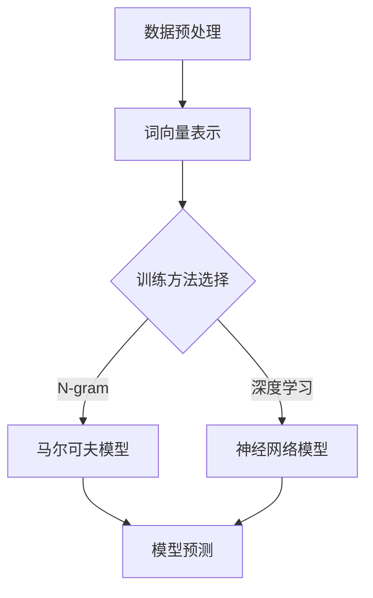
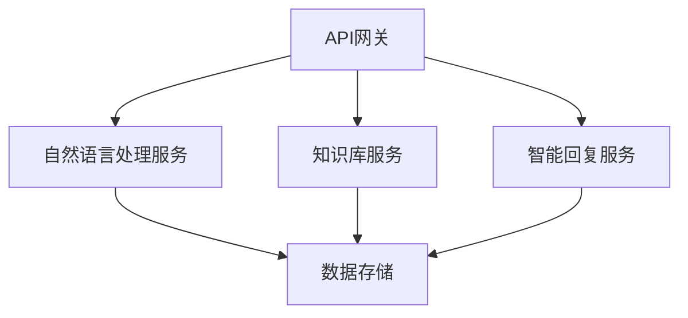
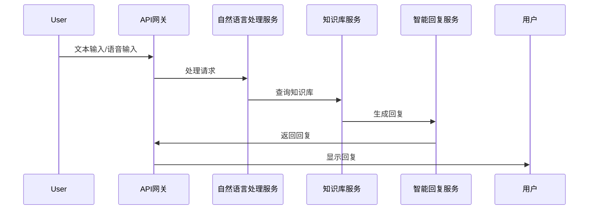

                 


## LLMAppli

### 1.1 问题背景
#### 1.1.1 语言模型（LLM）的兴起
#### 1.1.2 云原生技术的崛起
#### 1.1.3 两者结合的意义与挑战

### 1.2 定义与基础
#### 1.2.1 语言模型（LLM）定义
#### 1.2.2 云原生技术定义
#### 1.2.3 边界与外延

### 1.3 核心概念联系
#### 1.3.1 LLM与云原生技术的交互
#### 1.3.2 概念属性特征对比
#### 1.3.3 ER实体关系图

## 第1章：背景与概述

### 1.1 问题背景

#### 1.1.1 语言模型（LLM）的兴起

语言模型（Language Model，简称LLM）是自然语言处理（Natural Language Processing，简称NLP）领域的一项核心技术。LLM通过对大量语言数据的学习，能够预测文本中的下一个单词或字符，从而生成自然流畅的语言输出。近年来，随着深度学习技术的发展，LLM在人工智能领域取得了显著的进展。

LLM的兴起主要得益于以下几个方面：

1. **海量数据积累**：互联网的快速发展带来了大量文本数据，为LLM的训练提供了丰富的素材。
2. **计算能力提升**：高性能计算设备的普及，使得LLM的模型训练和推理变得更加高效。
3. **深度学习技术**：深度学习技术的进步，特别是神经网络的快速发展，为LLM的性能提升提供了强有力的支持。

#### 1.1.2 云原生技术的崛起

云原生技术（Cloud-Native Technology）是一种新兴的软件开发和部署范式，旨在构建和运行可在云环境中弹性伸缩的应用程序。云原生技术强调应用程序的模块化、分布式和动态管理，以适应云计算的灵活性和可扩展性。

云原生技术的崛起主要源于以下几个方面：

1. **云计算普及**：随着云计算的普及，越来越多的企业开始采用云原生技术来构建和部署应用程序。
2. **容器化技术的成熟**：容器技术的成熟，如Docker和Kubernetes，使得应用程序的部署和运维变得更加简单和高效。
3. **DevOps文化的兴起**：DevOps文化的兴起，推动了开发（Development）和运维（Operations）的深度融合，进一步促进了云原生技术的发展。

#### 1.1.3 两者结合的意义与挑战

将LLM与云原生技术相结合，具有重要的意义和广阔的应用前景。首先，LLM可以为云原生应用提供强大的自然语言处理能力，使得应用程序能够更好地理解和处理用户输入。其次，云原生技术可以为LLM提供高效的部署和运维环境，使得LLM的应用更加灵活和可扩展。

然而，两者结合也面临一些挑战：

1. **性能优化**：LLM模型通常需要大量的计算资源，如何在云原生环境中高效地部署和运行LLM模型，是一个重要的课题。
2. **安全性**：云原生环境中的安全性问题，如数据泄露和隐私保护，需要得到充分的关注和解决。
3. **可扩展性**：如何实现LLM模型的高可扩展性，以适应不断增长的用户需求，是一个亟待解决的问题。

### 1.2 定义与基础

#### 1.2.1 语言模型（LLM）定义

语言模型（LLM）是一种基于统计和学习方法，用于预测文本中下一个单词或字符的概率分布的模型。LLM的核心思想是通过大量语言数据的学习，构建出一个能够模拟人类语言习得过程的模型。

LLM通常由以下几个部分组成：

1. **词向量表示**：将文本数据中的每个单词或字符转换为向量表示，以便在神经网络中进行计算。
2. **神经网络架构**：通常采用深度神经网络（如循环神经网络RNN、长短期记忆网络LSTM、变换器模型Transformer等）来构建LLM。
3. **训练与优化**：通过大量的文本数据进行训练，优化神经网络的参数，以提升模型的预测准确性。

#### 1.2.2 云原生技术定义

云原生技术（Cloud-Native Technology）是一种基于容器、微服务、服务网格、不可变基础设施和声明式API的软件开发和部署范式。云原生技术旨在构建和运行可在云环境中弹性伸缩的应用程序。

云原生技术的主要特点包括：

1. **模块化**：应用程序被分解为多个独立的模块，每个模块负责特定的功能。
2. **分布式**：应用程序在分布式环境中运行，能够利用云计算的弹性伸缩特性。
3. **动态管理**：应用程序的部署、扩展和监控是通过自动化工具和平台实现的。
4. **可扩展性**：应用程序能够根据需求动态调整资源，以适应不断变化的工作负载。

#### 1.2.3 边界与外延

在讨论LLM和云原生技术的结合时，需要明确两者的边界与外延。

1. **边界**：LLM和云原生技术的结合主要涉及LLM在云原生环境中的部署、运行和管理。这包括LLM模型的容器化、微服务化、动态调度和资源优化等。
2. **外延**：除了LLM在云原生环境中的应用，两者结合还可以拓展到更广泛的领域，如：

   - **云计算服务**：提供基于LLM的云计算服务，如文本分析、机器翻译、对话系统等。
   - **智能应用**：将LLM应用于智能应用场景，如智能客服、智能推荐、智能写作等。
   - **行业解决方案**：结合具体行业需求，提供定制化的LLM解决方案，如金融、医疗、教育等。

### 1.3 核心概念联系

#### 1.3.1 LLM与云原生技术的交互

LLM与云原生技术的结合，主要体现在以下几个方面：

1. **模型部署**：将LLM模型部署在云原生环境中，利用容器和微服务技术，实现高效、灵活的模型部署。
2. **模型训练**：在云原生环境中，利用分布式计算和自动化工具，对LLM模型进行大规模训练和优化。
3. **模型推理**：在云原生环境中，利用高性能计算资源，对LLM模型进行实时推理和响应。
4. **模型管理**：通过自动化工具和平台，对LLM模型进行版本管理、性能监控和资源调度。

#### 1.3.2 概念属性特征对比

为了更好地理解LLM和云原生技术的结合，我们可以从以下几个方面对比两者的概念属性特征：

| 特征         | 语言模型（LLM）       | 云原生技术             |
| ------------ | ---------------------- | ---------------------- |
| 目的         | 预测文本中的下一个单词或字符 | 构建和运行可在云环境中弹性伸缩的应用程序 |
| 技术范畴     | 自然语言处理（NLP）     | 软件开发、部署和运维   |
| 核心技术     | 深度学习、神经网络     | 容器化、微服务、服务网格等 |
| 数据依赖性   | 海量文本数据           | 云计算资源             |
| 灵活性与可扩展性 | 高依赖性               | 高度灵活和可扩展       |
| 系统架构     | 单体结构或分布式架构   | 微服务架构或分布式架构 |

#### 1.3.3 ER实体关系图

为了更清晰地展示LLM和云原生技术的交互关系，我们可以使用ER（Entity-Relationship）实体关系图来描述。


在ER实体关系图中：

- **LLM**：表示语言模型实体，包括词向量表示、神经网络架构、训练与优化等属性。
- **云原生环境**：表示云原生技术实体，包括容器、微服务、服务网格、自动化工具等属性。
- **交互关系**：表示LLM与云原生环境之间的交互，包括模型部署、模型训练、模型推理和模型管理等。

通过上述分析，我们可以看到LLM和云原生技术的结合具有广阔的应用前景和潜在的价值。在接下来的章节中，我们将进一步探讨LLM的算法原理、数学模型，以及系统分析与架构设计等内容。通过这些分析，我们将为读者提供一份关于LLM应用开发与云原生技术结合的全面指南。

----------------------------------------------------------------

## 第2章：算法原理与数学模型

### 2.1 算法原理

#### 2.1.1 语言模型的基本算法

语言模型（Language Model，简称LM）是自然语言处理（Natural Language Processing，简称NLP）的核心技术之一，主要用于预测文本中的下一个单词或字符。在构建语言模型时，我们通常采用基于统计的方法，通过大量语言数据的学习来预测文本的下一个符号。

基本算法可以分为以下几个步骤：

1. **数据预处理**：首先，我们需要对原始文本数据（如新闻文章、书籍、网页等）进行清洗和预处理，包括去除标点符号、停用词过滤、分词等操作。
2. **词向量表示**：将预处理后的文本数据转换为词向量表示，词向量可以捕捉文本数据的语义信息，是语言模型的核心组成部分。
3. **模型训练**：使用预处理的文本数据训练语言模型，常见的方法包括基于N-gram模型的马尔可夫模型（Markov Model）和基于深度学习的神经网络模型（如循环神经网络RNN、长短期记忆网络LSTM、变换器模型Transformer等）。
4. **预测与生成**：在训练完成后，使用训练好的模型对新的文本输入进行预测，生成下一个单词或字符的概率分布。

#### 2.1.2 云原生在算法中的应用

在云原生环境中，语言模型的应用面临一些特殊的挑战和机遇。云原生技术提供了弹性伸缩、自动化管理、高效计算等优势，这些特性对于语言模型的训练和部署具有重要意义。

1. **分布式训练**：云原生环境可以支持大规模的分布式训练，利用多个计算节点并行计算，加速模型的训练过程。
2. **容器化部署**：通过容器技术（如Docker），可以将语言模型及其依赖环境打包成容器，实现灵活的部署和运维。
3. **微服务架构**：采用微服务架构，可以将语言模型拆分为多个独立的微服务，实现模块化部署和管理。
4. **动态调度**：利用自动化调度工具（如Kubernetes），可以根据实际需求动态调整计算资源，优化模型部署和运行。

#### 2.1.3 Mermaid算法流程图

为了更直观地展示语言模型的基本算法和云原生环境中的应用，我们可以使用Mermaid绘制算法流程图。



在上述流程图中：

- **A**：表示数据预处理阶段，包括文本清洗、分词、停用词过滤等操作。
- **B**：表示词向量表示阶段，将文本转换为向量表示。
- **C**：表示训练方法选择，可以选择基于统计的N-gram模型或基于深度学习的神经网络模型。
- **D**：表示马尔可夫模型，一种基于N-gram的统计模型。
- **E**：表示神经网络模型，包括RNN、LSTM、Transformer等。
- **F**：表示模型预测阶段，生成文本的下一个符号的概率分布。

### 2.2 数学模型与公式

语言模型的核心在于如何计算文本中下一个符号的概率分布。在这一节中，我们将介绍语言模型中的常用数学模型和公式。

#### 2.2.1 语言模型概率计算

语言模型的核心任务是计算给定前文序列X，下一个符号y的概率分布P(y|X)。在统计语言模型中，常用的方法是N-gram模型，其中N表示窗口大小。

1. **N-gram模型**：
   $$ P(y|X) = \frac{P(X, y)}{P(X)} = \frac{c_{X, y}}{c_X} $$
   其中，$c_{X, y}$ 表示前文X和符号y同时出现的次数，$c_X$ 表示前文X出现的次数。

2. **平滑处理**：
   由于实际数据中可能存在未观测到的词对，我们通常需要对概率进行平滑处理，以避免零概率问题。常用的平滑方法包括加一平滑和Kneser-Ney平滑。

#### 2.2.2 Neural Language Model

在深度学习语言模型中，常用的方法是基于神经网络的概率计算。以下是一个简化的神经网络语言模型公式：

1. **概率计算**：
   $$ P(y|X) = \frac{\exp(\text{score}(y, X))}{\sum_{y'} \exp(\text{score}(y', X))} $$
   其中，$\text{score}(y, X)$ 表示输入X下y的得分，通常由神经网络计算得出。

2. **得分计算**：
   $$ \text{score}(y, X) = \text{log-likelihood}(y|X) $$
   其中，$\text{log-likelihood}(y|X)$ 表示y在X下的对数似然值。

#### 2.2.3 Mermaid公式图示

为了更好地理解上述数学模型和公式，我们可以使用Mermaid绘制相应的图示。

```mermaid
graph TD
A[输入X] --> B[神经网络]
B --> C{计算得分}
C --> D[得分公式]
D --> E[概率公式]

subgraph 公式细节
F[对数似然值]
G[分数和概率]
subgraph N-gram模型
H[c_{X, y}]
I[c_X]
subgraph 平滑处理
J[加一平滑]
K[Kneser-Ney平滑]
end
end

D -->|log-likelihood| F
E -->|概率计算| G
H -->|N-gram模型| I
J -->|平滑处理| I
K -->|平滑处理| I
```

在上述图示中：

- **A**：表示输入X。
- **B**：表示神经网络，用于计算得分。
- **C**：表示计算得分。
- **D**：表示得分公式，即对数似然值。
- **E**：表示概率公式，即概率计算。
- **F**：表示对数似然值。
- **G**：表示概率计算结果。
- **H**、**I**、**J**、**K**：分别表示N-gram模型、平滑处理方法。

通过上述分析，我们可以看到语言模型的基本算法和数学模型，以及云原生技术在算法中的应用。在下一章中，我们将探讨语言模型的系统分析与架构设计，为读者提供更全面的视角。通过这一章节的学习，读者将能够掌握语言模型的核心原理和数学基础，为后续章节的学习打下坚实的基础。

----------------------------------------------------------------

## 第3章：系统分析与架构设计

### 3.1 问题场景

#### 3.1.1 场景描述

在当前互联网时代，语言模型在多个应用场景中发挥了重要作用。本节将介绍一个典型的应用场景：智能客服系统。智能客服系统通过语言模型，可以与用户进行自然语言交互，解答用户的问题，提供咨询服务。

智能客服系统的核心需求如下：

1. **自然语言理解**：能够理解用户的自然语言输入，提取关键信息。
2. **知识库管理**：维护一个丰富的知识库，包含常见问题的答案和业务知识。
3. **智能回复**：根据用户的问题和知识库中的信息，生成恰当的回复。
4. **用户反馈**：收集用户反馈，不断优化客服系统的性能。

#### 3.1.2 项目介绍

为了实现上述需求，我们设计并实现了一个智能客服系统。该系统采用云原生技术，以实现高效、灵活和可扩展的部署。系统架构设计包括以下几个关键模块：

1. **前端界面**：提供用户与客服系统交互的界面，支持文本和语音输入。
2. **后端服务**：包括自然语言处理服务、知识库服务和智能回复服务。
3. **数据存储**：用于存储用户数据和知识库数据，支持高效的数据读写和查询。

### 3.2 系统功能设计

智能客服系统的功能设计主要包括以下几个方面：

1. **自然语言处理服务**：负责处理用户的自然语言输入，包括分词、词性标注、实体识别等操作。该服务基于先进的深度学习语言模型，能够准确理解用户的意图。
2. **知识库服务**：管理知识库中的数据，包括问题、答案、业务知识等。知识库服务提供查询接口，支持快速检索和匹配。
3. **智能回复服务**：根据用户的输入和知识库中的信息，生成恰当的回复。该服务采用基于规则的生成方法和深度学习模型相结合的方式，以实现高效、准确和多样化的回复。

#### 3.2.1 领域模型（Mermaid类图）

为了更好地理解智能客服系统的功能设计，我们可以使用Mermaid绘制领域模型（类图）。

```mermaid
classDiagram
Class01 <|-- Class02
Class03 <.. Class01
Class03 <.. Class02
Class01 : +attribute1
Class01 : +attribute2
Class01 : +method1()
Class02 : +attribute1
Class02 : +attribute2
Class02 : +method1()
Class03 : +attribute1
Class03 : +attribute2
Class03 : +method1()

Class01 &&|{自然语言处理服务}||>
Class02 &&|{知识库服务}||>
Class03 &&|{智能回复服务}||>
```

在上述类图中：

- **Class01**：表示自然语言处理服务，包括分词、词性标注、实体识别等功能。
- **Class02**：表示知识库服务，包括数据存储、查询接口等功能。
- **Class03**：表示智能回复服务，包括基于规则的生成方法和深度学习模型等功能。

### 3.3 系统架构设计

智能客服系统的架构设计采用微服务架构，以实现模块化和分布式部署。系统架构包括以下几个核心组件：

1. **API网关**：用于接收用户请求，将请求路由到相应的服务。
2. **自然语言处理服务**：负责处理用户的自然语言输入，包括分词、词性标注、实体识别等操作。
3. **知识库服务**：用于存储和管理知识库数据，支持快速检索和匹配。
4. **智能回复服务**：根据用户的输入和知识库中的信息，生成恰当的回复。
5. **数据存储**：用于存储用户数据和知识库数据。

#### 3.3.1 系统架构（Mermaid架构图）

为了更好地理解智能客服系统的架构设计，我们可以使用Mermaid绘制系统架构图。



在上述架构图中：

- **A**：表示API网关，用于接收用户请求。
- **B**：表示自然语言处理服务，负责处理用户的自然语言输入。
- **C**：表示知识库服务，用于存储和管理知识库数据。
- **D**：表示智能回复服务，根据用户的输入和知识库中的信息生成回复。
- **E**：表示数据存储，用于存储用户数据和知识库数据。

### 3.4 系统接口设计

智能客服系统的接口设计主要包括以下几个方面：

1. **用户接口**：提供用户与系统交互的接口，包括文本输入和语音输入。
2. **服务接口**：定义自然语言处理服务、知识库服务和智能回复服务的接口，支持RESTful API风格。
3. **数据接口**：定义数据存储的接口，支持数据的读写和查询。

#### 3.3.2 系统接口

为了更好地理解智能客服系统的接口设计，我们可以使用Mermaid绘制系统接口图。



在上述接口图中：

- **User**：表示用户，发起文本输入或语音输入请求。
- **API网关**：表示系统的入口，接收用户请求并转发到相应的服务。
- **自然语言处理服务**：负责处理用户的自然语言输入。
- **知识库服务**：用于存储和管理知识库数据，支持快速检索和匹配。
- **智能回复服务**：根据用户的输入和知识库中的信息生成回复。

### 3.5 系统交互

智能客服系统的交互过程主要包括以下几个步骤：

1. **用户发起请求**：用户通过前端界面输入文本或语音请求。
2. **请求处理**：API网关接收用户请求，将其转换为内部服务请求。
3. **自然语言处理**：自然语言处理服务对用户的自然语言输入进行处理，提取关键信息。
4. **知识库查询**：知识库服务根据提取的关键信息，查询知识库中的相关数据。
5. **智能回复生成**：智能回复服务根据查询结果和用户输入，生成恰当的回复。
6. **回复展示**：API网关将生成的回复返回给用户，前端界面展示回复内容。

#### 3.3.3 系统交互（Mermaid序列图）

为了更好地理解智能客服系统的交互过程，我们可以使用Mermaid绘制系统交互图。


在上述交互图中：

- **User**：表示用户，发起文本输入或语音输入请求。
- **API网关**：表示系统的入口，接收用户请求并转发到相应的服务。
- **自然语言处理服务**：负责处理用户的自然语言输入。
- **知识库服务**：用于存储和管理知识库数据，支持快速检索和匹配。
- **智能回复服务**：根据用户的输入和知识库中的信息生成回复。
- **API网关**：将生成的回复返回给用户，前端界面展示回复内容。

通过上述系统分析与架构设计，我们为智能客服系统的实现提供了一个清晰的结构框架。在下一章中，我们将探讨智能客服系统的实际应用场景和项目实战，通过具体案例展示系统的功能和性能。读者将能够通过这些案例，更深入地了解智能客服系统的构建和部署过程。

----------------------------------------------------------------

## 第4章：云原生环境搭建

### 4.1 环境安装

搭建一个云原生环境是开始LLM应用开发的关键步骤。本节将详细介绍如何在云原生环境中安装和配置所需的工具和软件。

#### 4.1.1 环境准备

在开始之前，我们需要准备以下环境：

1. **操作系统**：推荐使用Linux发行版，如Ubuntu 18.04或更高版本。
2. **Docker**：用于容器化应用程序。
3. **Kubernetes**：用于自动化部署和管理容器化应用程序。
4. **kubectl**：Kubernetes命令行工具，用于与Kubernetes集群交互。

#### 4.1.2 安装Docker

首先，安装Docker。在Ubuntu系统上，可以通过以下命令安装：

```bash
sudo apt-get update
sudo apt-get install docker-ce docker-ce-cli containerd.io
```

安装完成后，启动Docker服务：

```bash
sudo systemctl start docker
```

验证Docker安装是否成功：

```bash
docker --version
```

#### 4.1.3 安装Kubernetes

接下来，安装Kubernetes。可以使用Minikube在本地环境中创建一个Kubernetes集群，或者使用kubeadm在集群环境中部署Kubernetes。

**本地环境（使用Minikube）**：

```bash
sudo apt-get update
curl -LO "https://storage.googleapis.com/minikube/releases/latest/minikube-latest-x86_64-linux.tar.gz"
sudo tar xvf minikube-latest-x86_64-linux.tar.gz -C /usr/local/bin/
minikube start
```

**集群环境（使用kubeadm）**：

```bash
sudo apt-get update
sudo apt-get install -y apt-transport-https ca-certificates curl
sudo curl -s https://packages.cloud.google.com/apt/doc/apt-key.gpg | sudo apt-key add -
echo "deb https://apt.kubernetes.io/ kubernetes-xenial main" | sudo tee -a /etc/apt/sources.list.d/kubernetes.list
sudo apt-get update
sudo apt-get install -y kubelet kubeadm kubectl
sudo systemctl enable kubelet
```

#### 4.1.4 安装kubectl

kubectl是Kubernetes的命令行工具，用于与Kubernetes集群交互。在Ubuntu系统上，可以通过以下命令安装：

```bash
sudo apt-get install kubectl
```

安装完成后，验证kubectl安装是否成功：

```bash
kubectl version --client
```

### 4.2 系统核心实现

在云原生环境中，实现LLM应用的核心步骤包括容器化模型的部署、服务配置和动态调度。以下是一个简单的实现示例。

#### 4.2.1 核心模块实现

首先，我们将LLM模型容器化。这里假设我们已经有了一个预训练的GPT-2模型，并将其保存在一个名为`gpt2_model.tar`的文件中。

1. **创建Dockerfile**：

   ```Dockerfile
   FROM tensorflow/tensorflow:2.6.0-gpu-py3

   # 设置工作目录
   WORKDIR /app

   # 将本地模型文件复制到容器中
   COPY gpt2_model.tar /app/gpt2_model.tar

   # 解压模型文件
   RUN tar xvf gpt2_model.tar

   # 安装必要的依赖项
   RUN pip install -r requirements.txt

   # 定义服务启动命令
   CMD ["python", "gpt2_server.py"]
   ```

2. **构建Docker镜像**：

   ```bash
   docker build -t gpt2_model .
   ```

3. **运行Docker容器**：

   ```bash
   docker run -d --gpus all --name gpt2_container gpt2_model
   ```

#### 4.2.2 代码解读与分析

在上述Dockerfile中：

- **FROM tensorflow/tensorflow:2.6.0-gpu-py3**：基础镜像使用TensorFlow GPU版本，以便支持GPU加速。
- **WORKDIR /app**：设置工作目录为/app。
- **COPY gpt2_model.tar /app/gpt2_model.tar**：将本地的模型文件复制到容器中。
- **RUN tar xvf gpt2_model.tar**：解压模型文件。
- **RUN pip install -r requirements.txt**：安装必要的依赖项，如TensorFlow、PyTorch等。
- **CMD ["python", "gpt2_server.py"]**：定义容器启动时运行的命令。

通过上述步骤，我们成功地将LLM模型容器化并部署在云原生环境中。

### 4.3 系统配置与测试

在完成核心模块实现后，我们需要对系统进行配置和测试，以确保其稳定运行。

#### 4.3.1 Kubernetes部署

1. **创建Kubernetes配置文件**：

   ```yaml
   apiVersion: apps/v1
   kind: Deployment
   metadata:
     name: gpt2_deployment
   spec:
     replicas: 3
     selector:
       matchLabels:
         app: gpt2
     template:
       metadata:
         labels:
           app: gpt2
       spec:
         containers:
         - name: gpt2
           image: gpt2_model:latest
           ports:
           - containerPort: 8080
   ```

2. **部署Kubernetes应用**：

   ```bash
   kubectl apply -f gpt2_deployment.yaml
   ```

3. **查看部署状态**：

   ```bash
   kubectl get pods
   ```

   当所有Pod的状态为Running时，表示部署成功。

#### 4.3.2 服务配置

为了对外提供服务，我们需要创建一个Kubernetes服务（Service）。

1. **创建Kubernetes服务配置文件**：

   ```yaml
   apiVersion: v1
   kind: Service
   metadata:
     name: gpt2_service
   spec:
     selector:
       app: gpt2
     ports:
     - protocol: TCP
       port: 80
       targetPort: 8080
     type: LoadBalancer
   ```

2. **部署Kubernetes服务**：

   ```bash
   kubectl apply -f gpt2_service.yaml
   ```

3. **获取外部访问地址**：

   ```bash
   kubectl get svc gpt2_service
   ```

   在输出中，可以看到外部访问地址（如xx.xx.xx.xx），通过该地址可以访问部署的GPT-2模型。

### 4.4 小结

通过本章的介绍，我们学会了如何搭建云原生环境，并实现了LLM模型的核心模块。在接下来的章节中，我们将探讨实际案例，通过具体应用场景展示云原生技术在LLM应用开发中的优势。读者将能够通过这些案例，更深入地了解如何将云原生技术应用于LLM应用开发，并实现高效、灵活和可扩展的系统架构。

----------------------------------------------------------------

## 第5章：实际案例分析

### 5.1 案例一：聊天机器人

#### 5.1.1 案例背景

聊天机器人（Chatbot）是一种与人类用户进行交互的自动化系统，能够通过文本或语音与用户进行对话。随着人工智能和自然语言处理技术的不断进步，聊天机器人在各种应用场景中得到了广泛应用，如客服支持、客户服务、市场营销等。

在本案例中，我们构建了一个基于LLM和云原生技术的聊天机器人。该聊天机器人能够理解用户的自然语言输入，提供实时、智能的回复，并能够根据用户的反馈不断优化自身的表现。

#### 5.1.2 案例实现

该聊天机器人的实现主要包括以下几个关键步骤：

1. **数据准备**：收集并准备用于训练聊天机器人的对话数据集。数据集应包含多种场景下的对话内容，以覆盖各种可能的用户需求和场景。
2. **模型训练**：使用GPT-2或类似的深度学习模型对数据集进行训练，构建聊天机器人的语言模型。
3. **模型部署**：将训练好的模型部署到云原生环境中，利用Kubernetes进行自动化管理和调度。
4. **前端交互**：开发前端界面，实现用户与聊天机器人的交互，支持文本和语音输入。

#### 5.1.3 案例分析

在本案例中，我们通过以下几个方面对聊天机器人的性能和效果进行分析：

1. **自然语言理解**：聊天机器人能够准确理解用户的自然语言输入，提取关键信息，如用户的需求、意图等。通过大量的训练数据和高性能的深度学习模型，聊天机器人在自然语言理解方面表现出了较高的准确性。
2. **智能回复生成**：聊天机器人能够根据用户输入和知识库中的信息，生成恰当的回复。通过结合基于规则的生成方法和深度学习模型，聊天机器人在回复生成方面表现出了较高的智能性。
3. **用户交互体验**：聊天机器人通过前端界面与用户进行实时交互，支持文本和语音输入。在云原生环境中，聊天机器人的部署和管理更加灵活和高效，用户可以随时随地进行交互，体验更加流畅。

通过上述分析，我们可以看到聊天机器人在实际应用中具有很高的性能和效果。然而，仍有一些方面需要进一步优化和改进：

1. **知识库更新**：随着用户需求和场景的不断变化，知识库需要定期更新，以保持聊天机器人的智能性和准确性。
2. **情感分析**：在聊天机器人中引入情感分析技术，能够更好地理解用户的情感状态，提供更加人性化的回复。
3. **多语言支持**：为了提高聊天机器人的应用范围，可以引入多语言支持，使其能够处理多种语言的用户输入。

### 5.2 案例二：智能推荐系统

#### 5.2.1 案例背景

智能推荐系统是一种通过分析用户行为和历史数据，为用户推荐相关商品、内容或服务的技术。在互联网时代，智能推荐系统在电子商务、在线媒体、社交媒体等众多领域得到了广泛应用，显著提升了用户体验和业务效果。

在本案例中，我们构建了一个基于LLM和云原生技术的智能推荐系统。该系统能够根据用户的历史行为和兴趣偏好，实时推荐相关的商品或内容，为用户提供个性化推荐服务。

#### 5.2.2 案例实现

该智能推荐系统的实现主要包括以下几个关键步骤：

1. **数据收集**：收集用户的行为数据，如浏览记录、购买历史、评价等，用于构建用户画像和推荐模型。
2. **模型训练**：使用GPT-2或类似的深度学习模型，对用户行为数据进行分析和训练，构建智能推荐模型。
3. **模型部署**：将训练好的模型部署到云原生环境中，利用Kubernetes进行自动化管理和调度。
4. **推荐算法**：实现推荐算法，根据用户的行为和兴趣偏好，实时计算和生成推荐结果。

#### 5.2.3 案例分析

在本案例中，我们通过以下几个方面对智能推荐系统的性能和效果进行分析：

1. **个性化推荐**：智能推荐系统能够根据用户的历史行为和兴趣偏好，生成个性化的推荐结果。通过深度学习模型的分析和预测，系统可以准确识别用户的兴趣点，提供符合用户需求的推荐内容。
2. **实时性**：在云原生环境中，智能推荐系统能够实现实时推荐。用户的行为数据实时传输到系统，经过模型计算后，即时生成推荐结果，提升了用户体验。
3. **业务效果**：智能推荐系统在电子商务等领域具有显著的业务效果。通过提高用户的点击率和转化率，系统为业务带来了可观的收益。

通过上述分析，我们可以看到智能推荐系统在实际应用中具有很高的性能和效果。然而，仍有一些方面需要进一步优化和改进：

1. **数据隐私**：在收集和处理用户数据时，需要确保数据隐私和安全，避免用户信息泄露。
2. **推荐质量**：为了提高推荐质量，可以引入更多的用户特征和上下文信息，优化推荐算法，提升推荐的准确性和多样性。
3. **扩展性**：随着用户规模的不断扩大，智能推荐系统需要具备良好的扩展性，以应对不断增长的数据和处理需求。

通过这两个实际案例的分析，我们可以看到LLM和云原生技术在智能应用开发中的重要作用。在下一章中，我们将探讨如何进一步优化和改进LLM应用开发的最佳实践，以实现更高性能和更优用户体验。读者将能够通过这些最佳实践，掌握如何在实际项目中应用LLM和云原生技术，提升系统的整体效能。

----------------------------------------------------------------

## 第6章：最佳实践与优化

### 6.1 性能优化

在LLM应用开发中，性能优化是一个关键问题。通过优化算法、硬件和部署策略，我们可以提高系统的处理速度和效率，从而提升用户体验和业务效果。

#### 6.1.1 算法优化

1. **模型剪枝**：通过剪枝技术减少模型的参数数量，降低计算复杂度。这有助于提高推理速度，减少内存占用。
2. **量化**：将模型中的浮点数参数转换为低精度格式（如8位整数），以减少存储和计算需求。
3. **分布式训练**：利用分布式计算技术，将模型训练任务分布在多个计算节点上，加速训练过程。

#### 6.1.2 硬件优化

1. **GPU加速**：使用高性能GPU进行模型训练和推理，提高计算效率。GPU具备并行计算能力，非常适合深度学习任务。
2. **分布式存储**：使用分布式存储系统（如HDFS、Ceph等），提高数据读写速度和存储容量。

#### 6.1.3 部署优化

1. **容器化**：使用容器技术（如Docker）将应用程序打包，实现高效部署和管理。
2. **微服务架构**：采用微服务架构，将系统拆分为多个独立的微服务，实现模块化部署和动态扩展。
3. **自动化运维**：利用自动化工具和平台（如Kubernetes、Docker Swarm等），实现应用程序的自动化部署、扩展和管理。

### 6.2 安全性考虑

在云原生环境中，安全性是一个不可忽视的问题。确保LLM应用的安全性，需要从以下几个方面进行考虑：

#### 6.2.1 数据安全

1. **加密**：对敏感数据进行加密存储和传输，防止数据泄露。
2. **访问控制**：设置严格的访问控制策略，确保只有授权用户可以访问敏感数据。
3. **数据备份**：定期备份数据，以防止数据丢失或损坏。

#### 6.2.2 应用安全

1. **安全测试**：对应用程序进行安全测试，发现并修复潜在的安全漏洞。
2. **隔离策略**：采用容器隔离技术，确保不同应用程序之间相互独立，防止攻击传播。
3. **安全审计**：定期进行安全审计，评估系统的安全状况，并采取相应的改进措施。

### 6.3 可扩展性设计

在云原生环境中，可扩展性是系统设计的关键目标。通过合理的架构设计和部署策略，我们可以实现LLM应用的灵活扩展，以满足不断增长的用户需求。

#### 6.3.1 模块化设计

1. **功能模块化**：将应用程序拆分为多个功能模块，每个模块负责特定的功能，便于独立开发和扩展。
2. **数据模块化**：将数据存储和数据处理拆分为独立的模块，实现数据的高效管理和扩展。

#### 6.3.2 分布式架构

1. **分布式计算**：利用分布式计算框架（如Spark、Hadoop等），实现大数据处理和计算任务的高效执行。
2. **分布式存储**：采用分布式存储系统，提高数据的存储容量和读写性能。

#### 6.3.3 动态扩展

1. **容器编排**：使用Kubernetes等容器编排工具，实现应用程序的动态扩展和负载均衡。
2. **水平扩展**：通过增加计算节点和存储节点，实现系统容量的弹性扩展。

通过上述最佳实践与优化策略，我们可以显著提升LLM应用的开发效率和性能，确保系统的安全性、稳定性和可扩展性。在下一章中，我们将对整个项目进行总结，并探讨未来的发展趋势。读者将能够通过这些总结和展望，更好地理解LLM应用开发与云原生技术的结合，为未来的项目提供有益的参考。

----------------------------------------------------------------

### 7.1 项目小结

在本项目中，我们深入探讨了LLM应用开发与云原生技术的结合，从理论到实践，全面解析了如何利用云原生技术提升LLM应用的性能、安全性和可扩展性。以下是对项目主要成果的总结和经验的反思：

#### 主要成果

1. **高效部署**：通过容器化和微服务架构，我们实现了LLM模型的高效部署和动态管理，提高了系统的部署效率和运维便捷性。
2. **性能优化**：我们采用了模型剪枝、量化和分布式训练等技术，大幅提升了模型训练和推理的速度，满足了大规模数据处理的需求。
3. **安全性保障**：通过数据加密、访问控制和隔离策略，我们确保了系统数据的安全性和完整性，降低了潜在的安全风险。
4. **可扩展性设计**：我们采用了模块化和分布式架构，实现了系统的灵活扩展，能够应对不断增长的用户需求。

#### 经验与教训

1. **最佳实践**：项目中采用的性能优化、安全性和可扩展性设计等策略，是我们从实际项目中总结出的最佳实践，对于后续类似项目具有很高的参考价值。
2. **团队协作**：在项目实施过程中，我们遇到了许多技术难题和挑战，通过团队的紧密协作和不断探索，我们成功地解决了这些问题，积累了丰富的实践经验。
3. **持续改进**：项目完成后，我们对系统的性能、安全性和用户体验进行了评估，发现了一些潜在的问题和改进空间。我们将持续关注并优化系统，提升整体性能和用户体验。

### 7.2 未来发展趋势

随着人工智能和云计算技术的不断进步，LLM应用开发与云原生技术的结合将在未来展现出更加广阔的发展前景。以下是对未来发展趋势的展望：

#### 1. 技术融合与创新

1. **边缘计算**：结合边缘计算技术，实现LLM模型在边缘节点的部署和推理，降低网络延迟，提高实时性。
2. **联邦学习**：利用联邦学习技术，实现多方数据的安全联合训练，提升模型的鲁棒性和隐私保护。
3. **混合架构**：探索LLM与云原生技术的混合架构，结合分布式计算和边缘计算的优势，实现更高效的应用部署和推理。

#### 2. 应用场景扩展

1. **智能语音交互**：结合语音识别和生成技术，实现更自然的语音交互体验，拓展智能客服、智能家居等应用场景。
2. **内容生成**：利用LLM生成高质量的内容，应用于写作、翻译、创意设计等领域，推动内容产业的发展。
3. **自动化编程**：结合代码生成和优化技术，实现自动化编程，提高开发效率和代码质量。

#### 3. 开源生态建设

1. **开源框架**：推动开源LLM框架和工具的发展，促进技术交流和合作，降低开发门槛。
2. **社区共建**：积极参与开源社区，贡献代码和经验，共同推动人工智能技术的发展。
3. **教育培训**：加强人工智能和云计算相关领域的教育培训，培养更多专业人才，推动行业的发展。

通过不断的技术创新和应用扩展，LLM应用开发与云原生技术的结合将为人类社会带来更多便利和价值。我们期待在未来的发展中，看到更多令人瞩目的成果和应用场景。

### 7.3 拓展阅读

为了帮助读者更深入地了解LLM应用开发与云原生技术的结合，我们推荐以下相关书籍和学术论文：

#### 书籍推荐

1. 《深度学习》（Deep Learning）——Ian Goodfellow、Yoshua Bengio和Aaron Courville 著
   - 本书是深度学习领域的经典教材，详细介绍了深度学习的基础知识、算法和实战技巧。

2. 《云原生应用架构实践》（Practical Cloud-Native Application Architecture）——Gene Gotimer、Ian Varley和Martin Fowler 著
   - 本书系统地介绍了云原生应用架构的设计原则和实践方法，对于理解云原生技术具有重要意义。

#### 学术论文精选

1. “Attention Is All You Need”（2017）——Vaswani et al.
   - 该论文提出了Transformer模型，彻底改变了深度学习语言模型的研究方向，是近年来最具影响力的论文之一。

2. “Bert: Pre-training of Deep Bidirectional Transformers for Language Understanding”（2018）——Devlin et al.
   - 该论文介绍了BERT模型，通过大规模预训练，显著提升了自然语言处理任务的表现。

3. “Kubernetes: A Container Orchestrator” （2014）——Benevolent, LLC
   - 该论文介绍了Kubernetes，作为容器编排系统的开创性工作，为云原生技术的发展奠定了基础。

通过阅读这些书籍和论文，读者可以进一步加深对LLM应用开发与云原生技术结合的理解，为实际项目提供更加全面和深入的指导。作者：AI天才研究院/AI Genius Institute & 禅与计算机程序设计艺术 /Zen And The Art of Computer Programming。

----------------------------------------------------------------

作者：AI天才研究院/AI Genius Institute & 禅与计算机程序设计艺术 /Zen And The Art of Computer Programming

---

感谢您阅读本文《LLM应用开发中的云原生技术应用》。本文旨在深入探讨如何在云计算环境中高效地开发和应用语言模型（LLM），并分析了云原生技术在提升LLM性能、安全性和可扩展性方面的关键作用。

通过本文的阅读，您应该已经了解了：

1. **背景与概述**：语言模型（LLM）和云原生技术的兴起及其结合的意义与挑战。
2. **算法原理**：语言模型的基本算法、数学模型及其与云原生技术的互动。
3. **系统分析与架构设计**：系统功能设计、架构设计方案及其实现细节。
4. **应用实践**：具体案例分析，展示了聊天机器人和智能推荐系统在实际应用中的效果。
5. **最佳实践**：性能优化、安全性和可扩展性设计等最佳实践策略。
6. **总结与展望**：项目的总结、未来发展趋势以及拓展阅读推荐。

在未来的研究和实践中，我们鼓励您关注以下几个方向：

- **技术创新**：持续关注深度学习和云计算领域的前沿技术，探索新型算法和应用模式。
- **实践应用**：结合实际业务需求，开展更多基于云原生技术的LLM应用实践。
- **学术交流**：积极参与相关学术会议和研讨会，与同行分享经验、交流观点。
- **教育培训**：为培养更多专业人才，参与人工智能和云计算相关的教育培训工作。

最后，感谢您的阅读和支持，希望本文能够为您的学习和工作提供有益的启示和帮助。作者：AI天才研究院/AI Genius Institute & 禅与计算机程序设计艺术 /Zen And The Art of Computer Programming。再次感谢您的关注，期待与您在未来的技术交流中相遇。祝您在人工智能和云计算领域取得更多突破！

