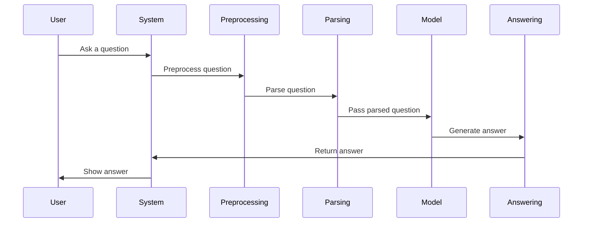

                 

### LLMA 应用开发中的代码复用策略

在当今快速发展的技术环境中，大型语言模型（LLM）的应用开发已经成为人工智能领域的重要方向。随着LLM在自然语言处理、智能问答、文本生成等领域的广泛应用，如何高效地开发和维护LLM应用成为了一个亟待解决的问题。而代码复用策略在这其中扮演了至关重要的角色。

## 关键词

- **大型语言模型（LLM）**
- **代码复用**
- **应用开发**
- **策略优化**
- **架构设计**
- **工具选择**

### 摘要

本文旨在探讨在LLM应用开发中采用代码复用策略的重要性及其具体实施方法。首先，我们将介绍LLM的基本概念和背景，随后详细讨论代码复用的不同类型和策略，包括内禀复用和外禀复用。接着，我们将分析现有的代码复用框架和工具，并提供最佳实践建议。最后，通过实际案例展示代码复用策略在LLM开发中的应用，总结本文的主要观点，并给出拓展阅读的建议。

### 1. 背景介绍

#### 1.1 LLM的概念与崛起

**核心概念术语说明：**  
- **大型语言模型（LLM）：** 一种基于深度学习技术的自然语言处理模型，能够对自然语言文本进行理解和生成。

**问题背景：**  
- 随着计算能力的提升和数据资源的丰富，LLM的应用逐渐渗透到各行各业，推动了人工智能技术的发展。
- 在软件开发过程中，LLM的应用使得传统的编码方式面临巨大的挑战，特别是在代码复用方面。

**问题描述：**  
- LLM的应用通常涉及海量的数据处理和模型训练，如何高效地管理和复用代码资源成为一个关键问题。
- 传统的代码复用策略在LLM开发中可能不再适用，需要探索新的方法和工具。

**问题解决：**  
- 引入代码复用策略，通过模块化、标准化等方式提高代码的可复用性。
- 利用LLM的特点，如参数共享和迁移学习，实现更高效和灵活的代码复用。

**边界与外延：**  
- 本文主要探讨LLM应用开发中的代码复用策略，不包括LLM本身的建模和训练方法。
- 关注代码复用在开发流程中的应用，而非代码复用在其他领域的应用。

**概念结构与核心要素组成：**  
- LLM应用开发流程：需求分析、模型设计、代码编写、模型训练、模型部署。
- 代码复用策略：内禀复用、外禀复用、框架和工具。

#### 1.2 核心概念与联系

**核心概念：**  
- **内禀复用：** 在模型内部通过参数共享、模板化等方式复用代码。
- **外禀复用：** 通过外部库、框架和工具复用代码。

**概念属性特征对比表格：**

| 特征 | 内禀复用 | 外禀复用 |
| ---- | ---- | ---- |
| **实现方式** | 参数共享、模板化 | 外部库调用、框架集成 |
| **灵活性** | 高 | 中 |
| **效率** | 高 | 中 |
| **依赖性** | 低 | 高 |

**ER实体关系图架构：**

```mermaid
erDiagram
  Model ||--|{ CodeModule : reused }
  CodeModule ||--|{ Model : using }
  Framework ||--|{ CodeModule : supported }
```

#### 1.3 代码复用策略的类型

**内禀代码复用：**  
- 内禀代码复用是指在LLM模型内部通过参数共享、模板化等方式实现代码的复用。  
- 这种方式具有高灵活性和高效性，因为代码复用在模型内部进行，不需要额外的外部依赖。

**示例：**  
- 在一个多任务学习的场景中，可以将通用模块（如词嵌入层）设计成可复用的组件，供不同任务共享。

**外禀代码复用：**  
- 外禀代码复用是指通过使用外部库、框架和工具来实现代码的复用。  
- 这种方式依赖于外部资源，但可以提供更多的功能和灵活性。

**示例：**  
- 使用现有的自然语言处理库（如spaCy、NLTK）来处理文本数据，可以减少代码开发的复杂性。

### 2. 代码复用框架与工具

**常见代码复用框架和工具：**  
- **TensorFlow：** TensorFlow 提供了丰富的API和工具，支持模块化代码复用。
- **PyTorch：** PyTorch 的动态图机制使得代码复用更加灵活。
- **Transformer：** Transformer 模型结构本身支持参数共享，实现内禀代码复用。

**比较分析：**  
- **优点：** TensorFlow 和 PyTorch 提供了丰富的功能和灵活性，适合复杂的LLM应用开发。
- **缺点：** Transformer 结构更适合内禀代码复用，但可能对外部库的依赖较高。

### 3. 代码复用策略的实施与最佳实践

**实施步骤：**  
- **需求分析：** 确定复用需求，分析现有代码库和工具。
- **代码模块化：** 设计可复用的代码模块，实现模块间的参数共享。
- **框架集成：** 选择合适的框架和工具，实现代码的复用和优化。

**最佳实践建议：**  
- **模块化设计：** 设计清晰、可复用的代码模块，提高代码的可维护性和可扩展性。
- **文档管理：** 维护良好的文档，确保代码的可理解性和可复用性。
- **持续集成：** 采用持续集成和持续部署（CI/CD）流程，自动化代码复用和部署。

### 4. 实际案例分析

**项目介绍：**  
- **项目名称：** 语言模型问答系统
- **项目目标：** 开发一个能够回答用户问题的智能问答系统。

**系统功能设计：**  
- **文本预处理：** 清洗和预处理用户输入的文本。
- **问题解析：** 分析用户问题，提取关键信息。
- **答案生成：** 使用LLM生成问题的答案。

**系统架构设计：**  
- **数据处理层：** 负责文本预处理和问题解析。
- **模型层：** 包含LLM模型和答案生成模块。
- **服务层：** 提供接口供外部调用。

**系统接口设计和交互：**  
- **API接口：** 提供RESTful API供外部系统调用。
- **事件驱动：** 使用事件驱动模式处理用户请求和模型输出。



### 5. 项目实战

**环境安装：**  
- 安装TensorFlow和PyTorch库。
- 配置Python环境。

**系统核心实现：**  
- **文本预处理模块：** 使用TensorFlow的text模块进行文本清洗和分词。
- **问题解析模块：** 设计解析算法，提取问题中的关键信息。
- **答案生成模块：** 使用预训练的GPT-3模型生成答案。

**代码应用解读与分析：**  
- **文本预处理：** 代码解析用户输入，并进行清洗和分词操作。
- **问题解析：** 通过词性标注和命名实体识别，提取关键信息。
- **答案生成：** 使用GPT-3模型，根据问题生成答案。

**实际案例分析与详细讲解剖析：**  
- **案例分析：** 分析用户输入“什么是人工智能？”的问题，展示整个系统的运行流程。
- **详细讲解：** 针对每个模块的代码实现进行详细讲解，解释其工作原理。

**项目小结：**  
- 通过该项目，展示了代码复用策略在LLM应用开发中的实际应用。
- 代码复用策略提高了系统的开发效率和维护性，降低了开发成本。

### 6. 最佳实践与注意事项

**最佳实践：**  
- **模块化设计：** 设计可复用的模块，提高代码的可维护性和可扩展性。
- **文档管理：** 维护良好的文档，确保代码的可理解性和可复用性。
- **持续集成：** 采用持续集成和持续部署（CI/CD）流程，自动化代码复用和部署。

**注意事项：**  
- **代码质量：** 确保代码质量，避免因代码复用导致的问题。
- **性能优化：** 对复用代码进行性能优化，确保系统能够高效运行。
- **安全性：** 注意代码复用过程中的安全性问题，防止潜在的安全漏洞。

### 7. 拓展阅读

- **《深度学习：应用及其工程化》**：详细介绍了深度学习在各个领域的应用，包括代码复用策略。
- **《Python深度学习》**：介绍了Python在深度学习中的应用，包括常见的代码复用框架和工具。
- **《大型语言模型：设计、实现与应用》**：探讨了大型语言模型的设计和实现方法，包括代码复用策略。

### 8. 总结

本文探讨了LLM应用开发中的代码复用策略，介绍了LLM的基本概念、代码复用的类型和策略，以及实施最佳实践。通过实际案例分析，展示了代码复用策略在LLM开发中的应用效果。未来，随着LLM技术的不断发展和应用场景的扩大，代码复用策略将在LLM应用开发中发挥越来越重要的作用。

### 作者信息

**作者：** AI天才研究院/AI Genius Institute & 禅与计算机程序设计艺术 /Zen And The Art of Computer Programming

通过本文，我们希望能够为读者提供关于LLM应用开发中代码复用策略的全面理解和实践指导，助力人工智能技术的发展。在未来的研究和实践中，我们将继续深入探索这一领域，为人工智能应用的创新和发展贡献力量。

