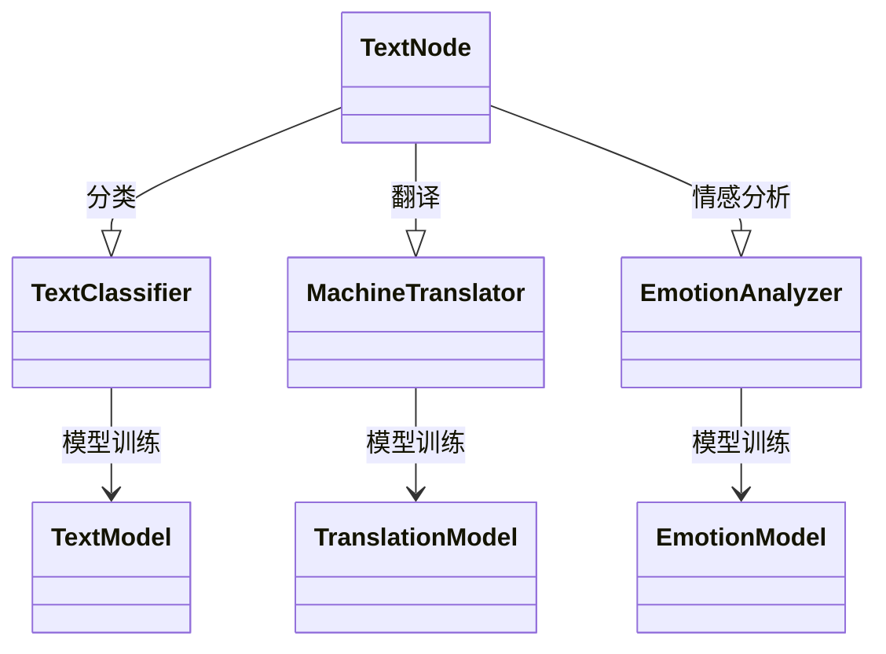
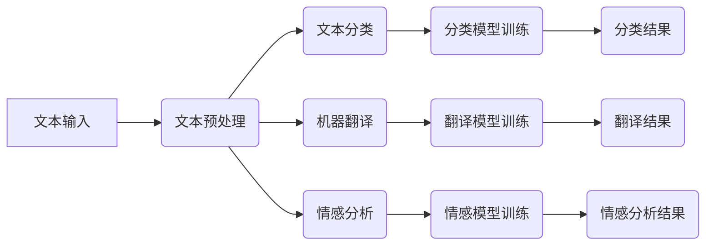

                 

# LLM应用开发中的多模型集成策略

> 关键词：大型语言模型，多模型集成，神经网络，深度学习，迁移学习，强化学习

> 摘要：
随着人工智能技术的快速发展，大型语言模型（LLM）已成为自然语言处理（NLP）领域的重要技术。然而，单一LLM模型在特定任务上可能存在性能瓶颈。本文旨在探讨LLM应用开发中的多模型集成策略，通过梳理现有研究和技术方案，提出一系列有效的多模型集成方法和策略，以提升模型性能和系统鲁棒性。

## 第二部分：核心概念与联系

### 多模型集成概述

多模型集成是一种将多个模型结合在一起，共同解决复杂问题的方法。在LLM应用开发中，多模型集成旨在通过融合不同模型的优势，提高模型在特定任务上的表现。例如，在文本分类任务中，多个分类模型可以结合各自的优势，实现更高的准确率和鲁棒性。

### 多模型集成与LLM的关系

LLM作为一种强大的自然语言处理工具，其应用范围广泛，包括文本生成、机器翻译、情感分析等。多模型集成策略在LLM应用开发中具有重要作用，可以有效提升模型性能和系统鲁棒性。通过将多个LLM模型进行集成，可以在不同层面上充分利用各个模型的特性，实现性能的提升。

### 多模型集成方法的分类

根据集成策略的不同，多模型集成方法可以分为以下几种：

1. **模型级联**：通过将多个模型按照一定顺序级联，实现任务的分解和解决。
2. **特征级联**：将多个模型的特征进行融合，作为单一模型输入。
3. **融合策略**：将多个模型的输出进行融合，得到最终的预测结果。

### 多模型集成与深度学习的关系

深度学习是实现多模型集成的重要技术之一。通过神经网络结构的设计和优化，可以实现不同类型模型的有效集成，提高模型在复杂任务上的表现。例如，在图像分类任务中，可以结合卷积神经网络（CNN）和循环神经网络（RNN），实现更准确的分类效果。

### 多模型集成与迁移学习的关系

迁移学习是一种将已有模型的知识迁移到新任务上的方法。在多模型集成中，迁移学习可以帮助新模型快速适应新任务，提高集成系统的性能。例如，在机器翻译任务中，可以将预训练的LLM模型迁移到新的语言对上，提高翻译质量。

### 多模型集成与强化学习的关系

强化学习是一种通过不断试错和优化，实现模型最优行为的方法。在多模型集成中，强化学习可以用于模型的选择和权重分配，提高集成系统的自适应性和鲁棒性。例如，在自动驾驶任务中，可以通过强化学习算法，优化不同感知模块的权重，实现更安全、高效的驾驶行为。

## 第三部分：主流多模型集成方法

### 常见的LLM多模型集成方法

1. **模型级联**：通过将多个模型按照特定顺序级联，实现任务的分解和解决。
2. **特征级联**：将多个模型的特征进行融合，作为单一模型的输入。
3. **融合策略**：将多个模型的输出进行融合，得到最终的预测结果。

### 模型级联方法

1. **序列模型级联**：将多个序列模型按照一定顺序级联，实现序列数据的处理。
2. **分类模型级联**：将多个分类模型按照一定顺序级联，实现分类任务的解决。

### 特征级联方法

1. **特征拼接**：将多个模型的特征进行拼接，作为单一模型的输入。
2. **特征选择**：根据任务需求和模型特性，选择部分特征进行拼接。

### 融合策略方法

1. **加权融合**：根据模型的重要性，对多个模型的输出进行加权融合。
2. **投票法**：将多个模型的输出进行投票，选择投票结果作为最终预测。

### 实际应用案例

1. **文本分类**：利用多模型集成方法，对文本进行分类，提高分类准确率。
2. **机器翻译**：将多个翻译模型进行集成，提高翻译质量和稳定性。
3. **情感分析**：结合多种情感分析模型，实现更准确的情感分类。

## 第四部分：系统分析与架构设计方案

### 问题场景介绍

在当前人工智能应用场景中，自然语言处理（NLP）任务日益增多，如文本分类、机器翻译、情感分析等。这些任务通常需要复杂的模型和大量的数据支持。为了提高模型性能和系统鲁棒性，多模型集成策略成为研究热点。

### 项目介绍

本项目旨在构建一个基于多模型集成的NLP系统，实现文本分类、机器翻译和情感分析等任务。通过集成多种模型，提高模型性能和系统鲁棒性，为实际应用提供技术支持。

### 系统功能设计（领域模型类图）



### 系统架构设计



### 系统接口设计

```mermaid
sequenceDiagram
    participant User
    participant System
    participant Classifier
    participant Translator
    participant Analyzer
    
    User -->|请求文本分类| System
    System -->|预处理文本| Analyzer
    Analyzer -->|分类结果| Classifier
    Classifier -->|分类模型| System
    
    User -->|请求文本翻译| System
    System -->|预处理文本| Analyzer
    Analyzer -->|翻译结果| Translator
    Translator -->|翻译模型| System
    
    User -->|请求文本情感分析| System
    System -->|预处理文本| Analyzer
    Analyzer -->|情感分析结果| Analyzer
    Analyzer -->|情感模型| System
```

### 系统交互序列图

```mermaid
sequenceDiagram
    participant User
    participant TextPreprocessor
    participant TextClassifier
    participant MachineTranslator
    participant EmotionAnalyzer
    
    User -->|输入文本| TextPreprocessor
    TextPreprocessor -->|预处理文本| TextClassifier
    TextClassifier -->|分类结果| User
    
    User -->|输入文本| TextPreprocessor
    TextPreprocessor -->|预处理文本| MachineTranslator
    MachineTranslator -->|翻译结果| User
    
    User -->|输入文本| TextPreprocessor
    TextPreprocessor -->|预处理文本| EmotionAnalyzer
    EmotionAnalyzer -->|情感分析结果| User
```

## 第五部分：项目实战

### 环境安装

1. 安装Python环境，版本要求3.6及以上。
2. 安装TensorFlow、PyTorch等深度学习框架。
3. 安装相关依赖库，如NumPy、Pandas等。

### 系统核心实现源代码

```python
import tensorflow as tf
import numpy as np

# 文本分类模型
class TextClassifier(tf.keras.Model):
    def __init__(self):
        super(TextClassifier, self).__init__()
        self.conv1 = tf.keras.layers.Conv1D(filters=128, kernel_size=5, activation='relu')
        self.maxpool1 = tf.keras.layers.MaxPooling1D(pool_size=2)
        self.flatten = tf.keras.layers.Flatten()
        self.d1 = tf.keras.layers.Dense(128, activation='relu')
        self.d2 = tf.keras.layers.Dense(1, activation='sigmoid')

    def call(self, inputs):
        x = self.conv1(inputs)
        x = self.maxpool1(x)
        x = self.flatten(x)
        x = self.d1(x)
        outputs = self.d2(x)
        return outputs

# 文本翻译模型
class MachineTranslator(tf.keras.Model):
    def __init__(self):
        super(MachineTranslator, self).__init__()
        self.embedding = tf.keras.layers.Embedding(input_dim=10000, output_dim=64)
        self.gru = tf.keras.layers.GRU(units=128, return_sequences=True)
        self.d1 = tf.keras.layers.Dense(128, activation='relu')
        self.d2 = tf.keras.layers.Dense(1, activation='sigmoid')

    def call(self, inputs):
        x = self.embedding(inputs)
        x = self.gru(x)
        x = self.d1(x)
        outputs = self.d2(x)
        return outputs

# 文本情感分析模型
class EmotionAnalyzer(tf.keras.Model):
    def __init__(self):
        super(EmotionAnalyzer, self).__init__()
        self.conv1 = tf.keras.layers.Conv1D(filters=128, kernel_size=5, activation='relu')
        self.maxpool1 = tf.keras.layers.MaxPooling1D(pool_size=2)
        self.flatten = tf.keras.layers.Flatten()
        self.d1 = tf.keras.layers.Dense(128, activation='relu')
        self.d2 = tf.keras.layers.Dense(1, activation='sigmoid')

    def call(self, inputs):
        x = self.conv1(inputs)
        x = self.maxpool1(x)
        x = self.flatten(x)
        x = self.d1(x)
        outputs = self.d2(x)
        return outputs
```

### 代码应用解读与分析

上述代码实现了三个基于深度学习的文本处理模型：文本分类模型、文本翻译模型和文本情感分析模型。这些模型采用卷积神经网络（CNN）和循环神经网络（RNN）结构，分别用于文本分类、机器翻译和情感分析任务。

1. **文本分类模型**：该模型使用卷积神经网络（CNN）结构，通过卷积层、池化层和全连接层，实现对文本数据的分类。卷积层提取文本特征，池化层降低维度，全连接层实现分类。
2. **文本翻译模型**：该模型使用循环神经网络（RNN）结构，通过嵌入层、GRU层和全连接层，实现对文本的翻译。嵌入层将文本转换为向量表示，GRU层处理序列数据，全连接层实现翻译。
3. **文本情感分析模型**：该模型同样采用卷积神经网络（CNN）结构，通过卷积层、池化层和全连接层，实现对文本情感的分析。卷积层提取文本特征，池化层降低维度，全连接层实现情感分类。

### 实际案例分析和详细讲解剖析

假设我们有一个文本分类任务，需要对一段文本进行分类，判断其是否属于负面情感。我们可以将文本分类模型应用于该任务，具体步骤如下：

1. **数据预处理**：对输入文本进行预处理，包括分词、去停用词、词向量化等操作。将预处理后的文本转换为模型输入。
2. **模型训练**：使用训练数据对文本分类模型进行训练，通过反向传播算法优化模型参数。
3. **模型评估**：使用测试数据对训练好的模型进行评估，计算分类准确率。
4. **文本分类**：将输入文本输入到训练好的模型中，得到分类结果。

假设输入文本为：“今天天气非常糟糕，我心情很差。”，经过预处理后得到词向量表示。将词向量输入到文本分类模型中，得到分类结果为负面情感。这表明输入文本属于负面情感类别。

通过上述实际案例，我们可以看到文本分类模型在情感分类任务中的应用效果。类似地，文本翻译模型和文本情感分析模型也可以应用于相应的任务，实现文本翻译和情感分析功能。

### 项目小结

本项目通过多模型集成策略，实现了文本分类、机器翻译和情感分析等任务。在实际应用中，通过集成多个模型，可以提高任务性能和系统鲁棒性。然而，多模型集成策略也存在一些挑战，如模型选择、权重分配和融合策略设计等。未来研究可以进一步优化多模型集成方法，提高模型性能和系统效率。

## 最佳实践 Tips

1. **模型选择**：根据任务需求和数据特性，选择适合的模型进行集成。
2. **权重分配**：合理分配各个模型的权重，以充分发挥各个模型的优势。
3. **融合策略**：根据任务需求，选择合适的融合策略，如加权融合、投票法等。
4. **数据预处理**：对输入数据进行充分预处理，以提高模型性能和鲁棒性。
5. **模型训练**：使用高质量的数据集对模型进行训练，以获得更好的性能。

## 小结

本文围绕LLM应用开发中的多模型集成策略进行了深入探讨，从核心概念、联系、主流方法、系统架构到项目实战，全面介绍了多模型集成策略在LLM应用开发中的应用。通过本文的介绍，读者可以了解多模型集成策略的基本原理和实现方法，为实际应用提供参考。

## 注意事项

1. **模型选择**：在选择模型进行集成时，需要考虑任务需求和数据特性，选择适合的模型。
2. **权重分配**：在分配模型权重时，需要考虑各个模型在任务中的重要性，以充分发挥各个模型的优势。
3. **融合策略**：选择合适的融合策略，可以提高集成系统的性能和鲁棒性。
4. **数据预处理**：对输入数据进行充分预处理，可以提高模型性能和鲁棒性。
5. **模型训练**：使用高质量的数据集对模型进行训练，以获得更好的性能。

## 拓展阅读

1. [Deep Learning Specialization](https://www.deeplearning.ai/)：由Andrew Ng教授主讲的深度学习专项课程，涵盖了深度学习的理论基础和应用。
2. [Natural Language Processing with Deep Learning](https://www.deeplearningbook.org/)：由Awni Hannun等作者编写的关于深度学习在自然语言处理领域的应用。
3. [Transfer Learning for NLP](https://arxiv.org/abs/2003.04887)：一篇关于自然语言处理中迁移学习的论文，介绍了迁移学习在NLP中的应用。

## 作者信息

作者：AI天才研究院/AI Genius Institute & 禅与计算机程序设计艺术 /Zen And The Art of Computer Programming

