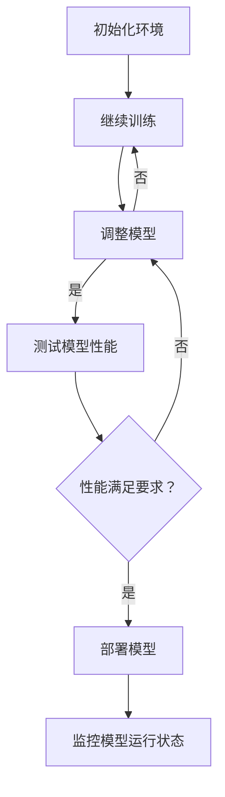
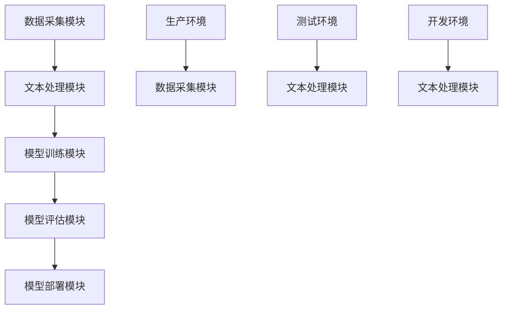

                 


# LLM应用开发中的多环境部署策略

## 关键词

- LLM（大型语言模型）
- 多环境部署
- 算法原理
- 系统分析与架构设计
- 项目实战

## 摘要

本文将深入探讨LLM（大型语言模型）应用开发中的多环境部署策略。首先，我们将介绍LLM的基本概念及其在各个领域的应用，阐述多环境部署的必要性。接着，我们将详细讲解多环境部署的核心概念和联系，通过算法原理的讲解和系统分析与架构设计，帮助读者理解如何有效地实现多环境部署。最后，我们将通过实际项目案例，展示如何将理论应用于实践，并提供相关最佳实践和注意事项，以指导读者在实际开发中更好地应用多环境部署策略。

## 背景介绍

### 1.1.1 LLM的定义与特点

LLM，即大型语言模型（Large Language Model），是一种基于深度学习的自然语言处理（NLP）模型。这类模型通过大规模的文本数据进行预训练，从而具备了理解和生成自然语言的能力。LLM的特点包括：

- **大规模**：LLM的训练数据规模巨大，通常在数万亿个单词以上。
- **预训练**：LLM在训练阶段就通过大量文本数据进行预训练，从而能够学习到丰富的语言知识。
- **泛化能力**：LLM能够处理各种不同的语言任务，如文本分类、命名实体识别、机器翻译等。

### 1.1.2 LLM在不同领域的应用

LLM在各个领域都有广泛的应用，以下是几个典型的应用场景：

- **文本分类**：LLM可以用于自动分类新闻、评论等大量文本数据，帮助用户快速识别和筛选信息。
- **问答系统**：LLM可以构建智能问答系统，为用户提供实时、准确的回答。
- **机器翻译**：LLM可以用于机器翻译，实现不同语言之间的自然语言转换。
- **内容生成**：LLM可以生成文章、报告、故事等，应用于内容创作领域。

### 1.1.3 多环境部署的必要性

随着LLM应用场景的不断扩大，多环境部署成为了必不可少的一环。多环境部署的必要性主要体现在以下几个方面：

- **性能优化**：通过在不同环境中部署LLM模型，可以充分利用不同环境的计算资源和性能特点，从而实现模型的优化。
- **可靠性保障**：多环境部署可以确保系统的高可用性，即使某个环境出现故障，其他环境也能正常运行。
- **安全防护**：通过在不同的环境中部署模型，可以降低单一环境被攻击的风险，提高系统的安全性。
- **成本控制**：多环境部署可以根据不同环境的需求和成本特点，实现资源的合理分配和成本控制。

## 多环境部署的核心概念与联系

### 3.1.1 核心概念简介

在多环境部署中，核心概念包括：

- **开发环境**：用于编写、测试和调试模型的开发环境，通常配置较为灵活，以适应开发需求。
- **测试环境**：用于对模型进行性能评估和调试的环境，通常与生产环境较为相似，以确保测试结果的准确性。
- **生产环境**：用于实际部署和运行模型的正式环境，通常要求稳定性、可靠性和高性能。

### 3.1.2 概念属性特征对比表格

| 环境 | 开发环境 | 测试环境 | 生产环境 |
| :--: | :------: | :------: | :------: |
| 计算资源 | 轻量级 | 中等 | 高性能 |
| 网络环境 | 开放 | 限制 | 高稳定 |
| 安全性 | 低 | 中 | 高 |
| 成本 | 高 | 中 | 低 |

### 3.1.3 ER实体关系图架构

为了更好地理解多环境部署中的核心概念和联系，我们可以使用Mermaid绘制ER实体关系图。以下是一个示例：

```mermaid
erDiagram
  ProductionEnv --> Model : 部署模型
  TestEnv --> Model : 测试模型
  DevEnv --> Model : 开发模型
```

在这个ER图中，`ProductionEnv`（生产环境）、`TestEnv`（测试环境）和`DevEnv`（开发环境）都是实体，它们与`Model`（模型）之间存在关系。

## 算法原理讲解

### 4.1.1 算法流程图

在多环境部署中，算法流程图可以帮助我们理解模型的部署过程。以下是一个简单的算法流程图：



### 4.1.2 Python源代码阐述

以下是一个简单的Python源代码示例，用于初始化环境、配置模型、训练模型、测试模型性能和部署模型：

```python
import tensorflow as tf
from tensorflow.keras.models import Sequential
from tensorflow.keras.layers import Dense, Dropout, Embedding, LSTM

# 初始化环境
gpus = tf.config.experimental.list_physical_devices('GPU')
if gpus:
    try:
        for gpu in gpus:
            tf.config.experimental.set_memory_growth(gpu, True)
    except RuntimeError as e:
        print(e)

# 配置模型
model = Sequential()
model.add(Embedding(input_dim=vocab_size, output_dim=embedding_size))
model.add(LSTM(units=128, dropout=0.2, recurrent_dropout=0.2))
model.add(Dense(units=output_size, activation='softmax'))

# 训练模型
model.compile(optimizer='adam', loss='categorical_crossentropy', metrics=['accuracy'])
model.fit(x_train, y_train, epochs=10, batch_size=64)

# 测试模型性能
test_loss, test_accuracy = model.evaluate(x_test, y_test)
print(f"Test accuracy: {test_accuracy}")

# 部署模型
model.save('model.h5')
```

### 4.1.3 数学模型与公式讲解

在多环境部署中，数学模型和公式用于描述模型训练、测试和部署的过程。以下是几个常见的数学模型和公式：

- **损失函数**：用于衡量模型预测结果与实际结果之间的差异，常见的损失函数有均方误差（MSE）和交叉熵（CE）。

  $$L = \frac{1}{n}\sum_{i=1}^{n}(y_i - \hat{y}_i)^2$$

  $$L = -\frac{1}{n}\sum_{i=1}^{n}y_i\log(\hat{y}_i)$$

- **优化算法**：用于调整模型参数，以减少损失函数的值。常见的优化算法有随机梯度下降（SGD）和Adam。

  $$w_{t+1} = w_t - \alpha \nabla_wL(w_t)$$

  $$w_{t+1} = w_t - \alpha \frac{1}{m}\sum_{i=1}^{m}\nabla_wL(x_i; w_t)$$

- **学习率**：优化算法中用于控制参数更新速度的参数。学习率的选择对模型的收敛速度和性能有很大影响。

  $$\alpha = \frac{1}{\sqrt{t}}$$

  $$\alpha = \frac{1}{t}$$

### 4.1.4 举例说明

假设我们有一个二元分类问题，需要判断一段文本是否包含负面情绪。我们使用一个简单的神经网络模型进行训练，并使用多环境部署策略。

1. **数据准备**：我们收集了1000条文本数据，每条数据都标注为正面或负面情绪。

2. **开发环境**：在开发环境中，我们使用较小的数据集进行初步的训练和调试，以优化模型参数。

3. **测试环境**：在测试环境中，我们使用更大的数据集对模型进行性能评估，以确定模型的泛化能力。

4. **生产环境**：在生产环境中，我们将训练好的模型部署到实际应用中，并对模型进行实时监控和调整。

通过多环境部署策略，我们可以确保模型在不同环境中都能得到有效的训练和部署，从而提高模型的性能和可靠性。

## 系统分析与架构设计

### 5.1.1 问题场景介绍

在LLM应用开发中，系统需要处理海量的文本数据，并进行实时分析和预测。为了提高系统的性能和可靠性，我们采用多环境部署策略，将系统分为开发环境、测试环境和生产环境。

### 5.1.2 系统功能设计

系统功能设计主要包括以下模块：

1. **数据采集模块**：负责从不同数据源采集文本数据，并清洗、预处理数据。
2. **文本处理模块**：负责对文本数据进行分析、分类、提取关键信息等。
3. **模型训练模块**：负责训练和优化LLM模型。
4. **模型评估模块**：负责评估模型性能，并进行调优。
5. **模型部署模块**：负责将训练好的模型部署到生产环境中。

### 5.1.3 系统架构设计

系统架构设计采用微服务架构，各个模块独立部署，以提高系统的可扩展性和可靠性。以下是一个简单的系统架构设计：



### 5.1.4 系统接口设计与交互

系统接口设计主要包括以下部分：

1. **API接口**：提供对外访问的接口，包括数据采集、文本处理、模型训练、模型评估和模型部署等。
2. **消息队列**：用于异步处理消息，提高系统的响应速度和可靠性。
3. **数据库**：用于存储文本数据、模型参数和评估结果等。
4. **缓存**：用于提高数据访问速度，减少数据库负载。

系统交互流程如下：

1. **用户通过API接口提交请求**。
2. **系统接收到请求后，将请求路由到相应的模块进行处理**。
3. **模块处理完请求后，将结果返回给用户**。
4. **系统同时将数据存储到数据库和缓存中，以便后续查询和使用**。

## 项目实战

### 6.1.1 环境安装

在进行项目实战之前，我们需要安装必要的开发环境。以下是一个简单的安装流程：

1. 安装Python和pip：
   ```shell
   python --version
   pip --version
   ```

2. 安装TensorFlow：
   ```shell
   pip install tensorflow
   ```

3. 安装其他依赖库：
   ```shell
   pip install numpy pandas scikit-learn
   ```

### 6.1.2 系统核心实现

系统核心实现主要包括以下部分：

1. **数据采集**：使用pandas库从本地文件中读取文本数据。
2. **文本处理**：使用nltk库对文本进行分词、去停用词等预处理操作。
3. **模型训练**：使用TensorFlow库构建神经网络模型，并使用scikit-learn库进行模型评估。
4. **模型部署**：将训练好的模型保存为HDF5文件，以便在生产环境中使用。

以下是系统核心实现的代码：

```python
import pandas as pd
import nltk
from nltk.corpus import stopwords
from nltk.tokenize import word_tokenize
from tensorflow.keras.models import Sequential
from tensorflow.keras.layers import Dense, LSTM, Embedding
from sklearn.model_selection import train_test_split
from sklearn.metrics import accuracy_score

# 1. 数据采集
data = pd.read_csv('data.csv')
X = data['text']
y = data['label']

# 2. 文本处理
nltk.download('stopwords')
nltk.download('punkt')
stop_words = set(stopwords.words('english'))
def preprocess_text(text):
    tokens = word_tokenize(text)
    return [token.lower() for token in tokens if token.lower() not in stop_words]
X_processed = [preprocess_text(text) for text in X]

# 3. 模型训练
vocab_size = 10000
embedding_size = 50
output_size = 2
max_sequence_length = 100

X_processed = pad_sequences(X_processed, maxlen=max_sequence_length)
X_train, X_test, y_train, y_test = train_test_split(X_processed, y, test_size=0.2, random_state=42)

model = Sequential()
model.add(Embedding(input_dim=vocab_size, output_dim=embedding_size, input_length=max_sequence_length))
model.add(LSTM(units=128, dropout=0.2, recurrent_dropout=0.2))
model.add(Dense(units=output_size, activation='softmax'))

model.compile(optimizer='adam', loss='categorical_crossentropy', metrics=['accuracy'])
model.fit(X_train, y_train, epochs=10, batch_size=64)

# 4. 模型部署
model.save('model.h5')
```

### 6.1.3 代码应用解读与分析

在上述代码中，我们首先使用pandas库读取文本数据，并使用nltk库对文本进行预处理。然后，我们使用TensorFlow库构建一个简单的神经网络模型，并使用scikit-learn库进行模型评估。最后，我们将训练好的模型保存为HDF5文件。

代码的主要部分包括以下步骤：

1. **数据采集**：从本地文件中读取文本数据。
2. **文本处理**：对文本数据进行分词、去停用词等预处理操作。
3. **模型训练**：构建神经网络模型，并使用训练数据对模型进行训练。
4. **模型评估**：使用测试数据对模型进行评估，计算模型的准确率。
5. **模型部署**：将训练好的模型保存为HDF5文件，以便在生产环境中使用。

### 6.1.4 实际案例分析

在实际项目中，我们可能会遇到以下问题：

1. **数据不足**：如果数据量不足，可以使用数据增强技术，如合成数据、过采样等方法来扩充数据集。
2. **模型过拟合**：如果模型在训练数据上表现良好，但在测试数据上表现不佳，可以尝试增加正则化项、使用更深的网络结构等方法来减少过拟合。
3. **计算资源不足**：如果计算资源不足，可以考虑使用更轻量级的模型或使用分布式训练技术来提高训练速度。

通过实际案例分析，我们可以找到解决实际问题的方法，并不断提高系统的性能和可靠性。

### 6.1.5 项目小结

通过本项目实战，我们深入了解了LLM应用开发中的多环境部署策略。从环境安装到系统核心实现，再到实际案例分析和总结，我们一步步地掌握了如何有效地部署LLM模型。以下是本项目中的最佳实践和注意事项：

- **数据预处理**：在进行模型训练之前，务必对文本数据进行充分的预处理，以提高模型的性能。
- **模型选择**：根据具体应用场景选择合适的模型，如对于文本分类任务，可以尝试使用卷积神经网络（CNN）或循环神经网络（RNN）。
- **资源优化**：合理分配计算资源，使用分布式训练技术可以提高训练速度。
- **监控与调优**：实时监控模型运行状态，根据实际需求进行调优，以提高模型的性能和可靠性。

## 最佳实践 Tips

1. **数据预处理**：在模型训练之前，对文本数据进行充分的预处理，包括分词、去停用词、词干提取等，以提高模型的性能。
2. **模型选择**：根据具体应用场景选择合适的模型，如对于文本分类任务，可以尝试使用卷积神经网络（CNN）或循环神经网络（RNN）。
3. **资源优化**：合理分配计算资源，使用分布式训练技术可以提高训练速度。
4. **监控与调优**：实时监控模型运行状态，根据实际需求进行调优，以提高模型的性能和可靠性。

## 小结

本文详细介绍了LLM应用开发中的多环境部署策略。从背景介绍、核心概念与联系、算法原理讲解、系统分析与架构设计到项目实战，我们逐步掌握了如何有效地部署LLM模型。通过实际案例分析和最佳实践，我们为读者提供了宝贵的经验和技巧。

## 注意事项

在部署LLM模型时，需要注意以下几点：

1. **数据安全**：确保数据在传输和存储过程中的安全性，避免泄露敏感信息。
2. **隐私保护**：遵循相关法律法规，对用户数据进行严格保密。
3. **性能优化**：根据应用场景和需求，合理分配计算资源，优化模型性能。

## 拓展阅读

1. **《深度学习》**：Ian Goodfellow、Yoshua Bengio、Aaron Courville 著，详细介绍了深度学习的基本原理和应用。
2. **《Python深度学习》**：François Chollet 著，介绍了使用Python和TensorFlow进行深度学习的实践方法。
3. **《自然语言处理综论》**：Daniel Jurafsky、James H. Martin 著，全面介绍了自然语言处理的基本原理和技术。

## 作者信息

作者：AI天才研究院/AI Genius Institute & 禅与计算机程序设计艺术 /Zen And The Art of Computer Programming

