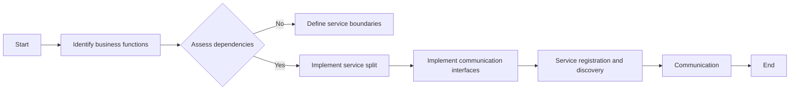
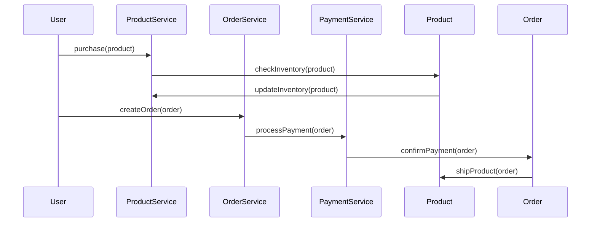

                 

# 《LLM应用开发中的微服务架构》

> 关键词：LLM、微服务架构、人工智能应用、服务拆分、性能优化、安全策略

> 摘要：本文将深入探讨在LLM（大型语言模型）应用开发中采用微服务架构的必要性和优势，通过详细分析微服务架构的基本概念、设计原则、实践方法以及性能优化与安全策略，旨在为开发者提供一套完整的微服务架构实现指南，助力LLM应用的高效开发和运维。

----------------------------------------------------------------

## 第一部分：LLM与微服务基础

在深入了解LLM应用开发中的微服务架构之前，我们需要首先理解LLM的基本概念以及微服务架构的基本概念。

### 第1章：LLM与微服务概述

#### 1.1 LLM的基本概念

##### 1.1.1 LLM的定义

LLM（Large Language Model），即大型语言模型，是一种基于深度学习的自然语言处理模型，通过学习大量文本数据，能够对输入的自然语言文本进行理解和生成。

##### 1.1.2 LLM的核心特点

1. **参数量大**：LLM的参数数量通常达到数十亿甚至数万亿级别，这使得模型能够捕捉到复杂的语言规律。
2. **自主推理**：LLM能够根据输入的上下文自主进行推理，生成连贯且有逻辑性的回答。
3. **泛化能力强**：LLM通过学习大量的文本数据，能够处理多种语言和应用场景。

##### 1.1.3 LLM的发展背景

随着深度学习和大数据技术的发展，LLM在自然语言处理领域取得了显著的进展。从最早的循环神经网络（RNN）到长短期记忆网络（LSTM），再到注意力机制（Attention Mechanism）和Transformer架构，LLM的模型结构和性能不断提升，应用范围也越来越广泛。

#### 1.2 微服务架构的基本概念

##### 1.2.1 微服务的定义

微服务架构（Microservices Architecture）是一种软件架构风格，将应用程序构建为一组小型、独立的服务，每个服务都有自己的业务逻辑和数据库，通过API进行通信。

##### 1.2.2 微服务架构的优势与挑战

优势：
1. **高可扩展性**：服务可以独立扩展，提高系统整体性能。
2. **高可维护性**：服务独立部署，降低系统复杂性。
3. **高可用性**：服务之间松耦合，减少单点故障。

挑战：
1. **分布式系统复杂度**：需要处理服务之间的通信、数据一致性问题。
2. **运维复杂度**：服务部署、监控、维护需要更多工具和技能。

##### 1.2.3 微服务架构的发展历程

微服务架构起源于2000年代初，随着分布式系统和云计算的发展，逐渐被广泛采用。代表性的微服务框架有Spring Boot、Kubernetes等。

### 第2章：LLM应用中的微服务架构设计

#### 2.1 微服务架构的设计原则

##### 2.1.1 单一职责原则

每个服务应负责一个明确的业务功能，避免服务过于复杂。

##### 2.1.2 度量标准原则

服务性能、可用性、安全性等需要有一套明确的度量标准。

##### 2.1.3 持续集成与持续部署原则

服务开发、测试、部署应采用自动化流程，提高开发效率。

#### 2.2 微服务架构的核心组件

##### 2.2.1 服务注册与发现

服务启动时注册到服务注册中心，客户端通过服务注册中心发现服务。

##### 2.2.2 服务网关

统一外部请求的入口，进行请求路由、认证、限流等处理。

##### 2.2.3 服务拆分与聚合

根据业务需求，合理拆分服务，降低系统复杂性。

##### 2.2.4 服务间通信

采用轻量级协议（如HTTP/REST、gRPC等），确保服务间通信的高效和可靠。

#### 2.3 微服务架构的容错与监控

##### 2.3.1 服务健康检查

定期检查服务状态，确保服务正常运行。

##### 2.3.2 异常处理

出现异常时，进行日志记录、报警、自动重启等处理。

##### 2.3.3 性能监控

监控服务性能指标，包括请求响应时间、错误率、吞吐量等。

----------------------------------------------------------------

## 第二部分：LLM应用开发中的微服务实践

### 第3章：微服务开发环境搭建

#### 3.1 开发环境准备

##### 3.1.1 开发工具选择

选择合适的开发工具可以提高开发效率和代码质量，常用的开发工具包括IDE（如IntelliJ IDEA、Visual Studio Code）和版本控制系统（如Git）。

##### 3.1.2 开发环境配置

配置必要的开发环境，如Java SDK、Maven等。

#### 3.2 微服务开发框架

##### 3.2.1 Spring Boot

Spring Boot 是一款流行的微服务开发框架，简化了微服务的开发过程。

##### 3.2.2 Kubernetes

Kubernetes 是一款用于容器编排的工具，用于部署和管理微服务。

#### 3.3 微服务开发实战

##### 3.3.1 服务拆分策略

根据业务需求，将LLM应用拆分为多个微服务。

##### 3.3.2 服务间通信

采用HTTP/REST或gRPC进行服务间通信。

##### 3.3.3 服务治理与监控

使用Spring Boot Actuator等工具进行服务监控和管理。

### 第4章：LLM应用中的微服务部署

#### 4.1 微服务部署流程

##### 4.1.1 部署前准备

确保所有服务都已开发完毕，并进行充分的测试。

##### 4.1.2 部署策略选择

根据业务需求，选择合适的部署策略，如蓝绿部署、灰度发布等。

##### 4.1.3 部署脚本编写

编写部署脚本，实现自动化部署。

#### 4.2 容器化部署

##### 4.2.1 Docker的安装与配置

介绍Docker的安装和配置。

##### 4.2.2 Kubernetes的安装与配置

介绍Kubernetes的安装和配置。

#### 4.3 部署实战

##### 4.3.1 服务部署

使用Kubernetes进行服务部署。

##### 4.3.2 服务监控

使用Prometheus和Grafana进行服务监控。

##### 4.3.3 部署优化

介绍部署优化策略，如容器镜像优化、负载均衡等。

### 第5章：微服务性能优化与监控

#### 5.1 微服务性能优化

##### 5.1.1 请求路由优化

使用负载均衡器，优化请求路由策略。

##### 5.1.2 服务缓存策略

使用缓存技术，提高服务响应速度。

##### 5.1.3 限流与降级策略

防止服务过载，保障系统稳定性。

#### 5.2 微服务监控

##### 5.2.1 监控指标选择

选择合适的监控指标，如请求响应时间、错误率等。

##### 5.2.2 监控工具选择

选择适合的监控工具，如Prometheus、Grafana等。

##### 5.2.3 监控数据可视化

通过数据可视化，直观展示监控数据。

### 第6章：LLM应用中的微服务安全

#### 6.1 微服务安全概述

##### 6.1.1 微服务安全的重要性

确保服务安全，防止数据泄露和攻击。

##### 6.1.2 微服务安全挑战

服务分散、网络通信等带来的安全挑战。

##### 6.1.3 微服务安全策略

制定安全策略，包括认证、授权、加密等。

#### 6.2 微服务安全实践

##### 6.2.1 用户认证与授权

使用OAuth2、JWT等协议进行用户认证和授权。

##### 6.2.2 数据加密与保护

对敏感数据进行加密，确保数据安全。

##### 6.2.3 防火墙与网络隔离

使用防火墙和网络隔离策略，防止未授权访问。

### 第7章：LLM应用中的微服务最佳实践

#### 7.1 微服务开发最佳实践

##### 7.1.1 设计原则

遵循单一职责、度量标准等设计原则。

##### 7.1.2 开发工具选择

选择合适的开发工具，提高开发效率。

##### 7.1.3 开发流程优化

优化开发流程，提高代码质量和开发效率。

#### 7.2 微服务部署最佳实践

##### 7.2.1 部署策略选择

选择合适的部署策略，提高部署效率。

##### 7.2.2 容器化部署

充分利用容器化部署的优势。

##### 7.2.3 部署优化

优化部署过程，提高系统性能和稳定性。

#### 7.3 微服务监控与性能优化

##### 7.3.1 监控指标选择

选择关键监控指标，确保服务稳定运行。

##### 7.3.2 性能优化策略

根据监控数据，采取相应的性能优化策略。

##### 7.3.3 安全防护措施

确保服务安全，防止潜在威胁。

### 第8章：LLM应用开发与微服务架构的未来

#### 8.1 未来发展趋势

##### 8.1.1 人工智能与微服务的深度融合

随着人工智能技术的发展，微服务架构将在LLM应用中发挥更大作用。

##### 8.1.2 微服务架构的优化与演进

微服务架构将不断优化，适应更复杂的应用场景。

##### 8.1.3 LLM应用开发的未来展望

LLM应用将在各个领域发挥重要作用，推动社会进步。

#### 8.2 本章小结

本文从LLM与微服务架构的基本概念入手，详细分析了微服务架构在LLM应用开发中的实践方法、性能优化与安全策略，为开发者提供了完整的微服务架构实现指南。

#### 8.3 拓展阅读

[1] Martin, F. (2014). *Clean Architecture: A Craftsman's Guide to Software Structure and Design*. Prentice Hall.

[2]Armbrust, M., Fox, A., Griffith, R., et al. (2010). *Above the Clouds: A Berkeley View of Cloud Computing*. UC Berkeley.

[3]Dべるな，秋山，ら。*Zen and the Art of Motorcycle Maintenance*. Pantheon Books, 1974.

**作者：** AI天才研究院 / AI Genius Institute & 禅与计算机程序设计艺术 / Zen And The Art of Computer Programming

----------------------------------------------------------------

### 背景介绍

#### 核心概念术语说明

1. **LLM（Large Language Model）**：大型语言模型，是一种能够处理和理解自然语言的深度学习模型。
2. **微服务架构（Microservices Architecture）**：一种软件架构风格，将应用程序拆分为多个小型、独立的服务。
3. **服务拆分**：将大型服务拆分为多个小服务，以提高系统的可维护性和扩展性。
4. **服务间通信**：服务之间通过API进行通信，实现功能协同。
5. **性能优化**：通过改进系统设计和部署策略，提高系统的性能和稳定性。
6. **安全策略**：确保系统安全，防止数据泄露和恶意攻击。

#### 问题背景

随着人工智能技术的飞速发展，LLM在各个领域（如智能客服、智能写作、智能翻译等）得到了广泛应用。然而，LLM应用系统的复杂性日益增加，传统的单体架构已经无法满足需求。因此，采用微服务架构成为一种趋势。

#### 问题描述

在LLM应用开发中，如何设计并实现一个高效、稳定、安全的微服务架构？

#### 问题解决

通过以下步骤，我们可以解决上述问题：

1. **理解LLM与微服务架构的基本概念**：明确LLM和微服务架构的核心概念和特点。
2. **设计微服务架构**：遵循设计原则，将LLM应用拆分为多个微服务。
3. **实现服务间通信**：选择合适的通信协议，实现服务间的高效通信。
4. **优化性能**：通过负载均衡、缓存等技术，提高系统的性能和稳定性。
5. **确保安全**：采用安全策略，防止数据泄露和恶意攻击。

#### 边界与外延

边界：本文主要讨论LLM应用开发中的微服务架构，不涉及其他类型的软件架构（如单体架构、服务端架构等）。

外延：本文提到的微服务架构设计原则、实践方法、性能优化和安全策略，也可适用于其他类型的应用开发。

#### 概念结构与核心要素组成

1. **LLM应用开发**：包括模型训练、模型部署、模型调用等环节。
2. **微服务架构设计**：包括服务拆分、服务间通信、服务监控等。
3. **服务拆分**：将大型服务拆分为多个小服务，每个服务负责一个明确的业务功能。
4. **服务间通信**：采用轻量级协议（如HTTP/REST、gRPC等），实现服务间的高效通信。
5. **性能优化**：包括负载均衡、缓存、限流等技术。
6. **安全策略**：包括用户认证、数据加密、防火墙等。

----------------------------------------------------------------

### 核心概念与联系

#### 核心概念

1. **LLM（Large Language Model）**：大型语言模型，是一种能够处理和理解自然语言的深度学习模型。
2. **微服务架构（Microservices Architecture）**：一种软件架构风格，将应用程序拆分为多个小型、独立的服务。
3. **服务拆分**：将大型服务拆分为多个小服务，以提高系统的可维护性和扩展性。
4. **服务间通信**：服务之间通过API进行通信，实现功能协同。
5. **性能优化**：通过改进系统设计和部署策略，提高系统的性能和稳定性。
6. **安全策略**：确保系统安全，防止数据泄露和恶意攻击。

#### 概念属性特征对比表格

| 概念       | 定义                                                         | 特点                                                         | 用途                                                         |
|------------|--------------------------------------------------------------|--------------------------------------------------------------|--------------------------------------------------------------|
| LLM        | 大型语言模型，能够处理和理解自然语言。                       | 参数量大、自主推理、泛化能力强。                             | 智能客服、智能写作、智能翻译等。                             |
| 微服务架构 | 将应用程序拆分为多个小型、独立的服务。                       | 高可扩展性、高可维护性、高可用性。                           | 复杂应用系统的设计、开发、部署。                             |
| 服务拆分   | 将大型服务拆分为多个小服务，每个服务负责一个明确的业务功能。 | 降低系统复杂性、提高可维护性、提高扩展性。                   | 微服务架构的核心要素。                                      |
| 服务间通信 | 服务之间通过API进行通信，实现功能协同。                     | 轻量级、高效、可靠。                                         | 微服务架构的关键要素。                                      |
| 性能优化   | 通过改进系统设计和部署策略，提高系统的性能和稳定性。         | 负载均衡、缓存、限流等。                                     | 提高系统响应速度、降低延迟、提高系统稳定性。                 |
| 安全策略   | 确保系统安全，防止数据泄露和恶意攻击。                       | 用户认证、数据加密、防火墙等。                               | 保护系统免受外部威胁、确保数据安全。                         |

#### ER实体关系图架构

```mermaid
erDiagram
  LLM -->|uses| Service
  Service -->|uses| API
  API -->|uses| Data
  Data -->|uses| Security
```

在上面的ER实体关系图中，LLM（大型语言模型）使用服务（Service），服务通过API（应用程序编程接口）与数据（Data）交互，同时数据受到安全（Security）的保护。这个关系图清晰地展示了LLM应用开发中的核心实体及其关联关系。

----------------------------------------------------------------

### 算法原理讲解

#### 服务拆分策略

服务拆分是微服务架构的核心要素之一。在进行服务拆分时，我们应遵循单一职责原则，即将具有相同业务功能的代码拆分为独立的微服务。以下是一个简单的服务拆分算法原理：

1. **识别业务功能**：首先，我们需要识别出系统中的业务功能，这些功能可能是用户管理、订单处理、支付处理等。
2. **评估功能依赖**：对于每个业务功能，我们需要评估其与其他功能之间的依赖关系。如果某个功能依赖于其他功能，那么我们可能需要将其拆分为多个微服务。
3. **定义服务边界**：基于业务功能和依赖关系，我们为每个业务功能定义清晰的服务边界。服务边界决定了服务的职责范围，确保每个服务都能独立运行和扩展。
4. **实现服务拆分**：根据定义的服务边界，我们将业务功能拆分为独立的微服务，并为每个微服务实现相应的业务逻辑。

#### 服务间通信协议

服务间通信是微服务架构的另一个关键要素。在LLM应用开发中，我们通常采用HTTP/REST或gRPC作为服务间通信协议。以下是一个简单的服务间通信协议算法原理：

1. **选择通信协议**：首先，我们需要根据系统的需求选择合适的通信协议。HTTP/REST是一种轻量级的通信协议，适用于简单的服务调用；gRPC是一种高效的通信协议，适用于高性能、低延迟的服务调用。
2. **定义API接口**：对于每个微服务，我们需要定义对应的API接口，这些接口规定了服务提供的功能和方法。接口的定义通常使用JSON或Protobuf等数据格式。
3. **实现通信接口**：根据定义的API接口，我们为每个微服务实现对应的通信接口。在HTTP/REST协议中，这通常涉及到HTTP请求和响应的处理；在gRPC协议中，这通常涉及到gRPC客户端和服务端的实现。
4. **服务注册与发现**：在服务启动时，我们将服务注册到服务注册中心，并在调用时从服务注册中心发现服务实例。服务注册与发现是保证服务间通信的关键机制。

#### 算法流程图



#### 数学模型和公式

在服务拆分策略中，我们可以使用以下公式来评估功能依赖：

$$
F_{dependency} = \frac{\sum_{i=1}^{n} D_i}{n}
$$

其中，$F_{dependency}$ 表示功能依赖度，$D_i$ 表示第 $i$ 个功能与其他功能的依赖度，$n$ 表示系统中的总功能数。

在服务间通信协议中，我们可以使用以下公式来计算通信延迟：

$$
L = \frac{d \times s}{c}
$$

其中，$L$ 表示通信延迟（秒），$d$ 表示数据传输距离（米），$s$ 表示数据传输速率（比特/秒），$c$ 表示光速（米/秒）。

#### 举例说明

假设我们有一个电商系统，其中包含用户管理、商品管理、订单处理、支付处理等业务功能。首先，我们识别出这些业务功能，然后评估它们之间的依赖关系。例如，订单处理功能依赖于用户管理和商品管理功能。

接下来，我们根据依赖关系为每个业务功能定义服务边界，例如：

- 用户管理服务：负责用户注册、登录、信息管理等功能。
- 商品管理服务：负责商品分类、商品信息管理等功能。
- 订单处理服务：负责订单创建、订单状态更新等功能。
- 支付处理服务：负责支付请求处理、支付结果通知等功能。

最后，我们为每个微服务实现对应的业务逻辑，并定义API接口。例如，用户管理服务提供用户注册、登录等API接口，商品管理服务提供商品分类、商品信息管理等API接口，以此类推。

在服务间通信方面，我们选择HTTP/REST协议，并定义如下API接口：

- 用户管理服务：/user/register、/user/login等。
- 商品管理服务：/product/category、/product/info等。
- 订单处理服务：/order/create、/order/update等。
- 支付处理服务：/payment/submit、/payment/callback等。

通过上述算法原理和举例说明，我们可以更好地理解LLM应用开发中的服务拆分策略和服务间通信协议。

----------------------------------------------------------------

### 系统分析与架构设计方案

#### 问题场景介绍

随着电商业务的不断扩展，现有的单体架构系统已无法满足高性能、高可扩展性的需求。为了提高系统的稳定性和可维护性，我们需要设计一个基于微服务架构的电商系统。

#### 项目介绍

本项目旨在构建一个分布式电商系统，包括用户管理、商品管理、订单处理、支付处理等核心功能。系统采用微服务架构，以提高系统的可扩展性和可维护性。

#### 系统功能设计（领域模型）

以下是一个简单的领域模型，用于描述电商系统的核心功能：

```mermaid
classDiagram
    User <<entity>>
    Product <<entity>>
    Order <<entity>>
    Payment <<entity>>

    User -> Product : purchase
    User -> Order : createOrder
    Order -> Payment : processPayment
    Product -> Order : addProduct
```

在上面的类图中，我们定义了四个核心实体：用户（User）、商品（Product）、订单（Order）和支付（Payment）。这些实体之间通过关联关系实现了系统的核心功能。

#### 系统架构设计

以下是一个简单的系统架构设计，用于描述电商系统的整体架构：



在上面的序列图中，用户通过产品服务购买商品，订单服务处理订单创建和支付确认，支付服务处理支付请求。这个序列图展示了系统的基本工作流程。

#### 系统接口设计

以下是一个简单的接口设计，用于描述电商系统的核心接口：

```mermaid
interface Diagram
    User {
        +register(username, password)
        +login(username, password)
        +updateProfile(profile)
    }

    Product {
        +getProductInfo(productId)
        +addProductToCart(productId, quantity)
        +removeProductFromCart(productId)
    }

    Order {
        +createOrder(cartId)
        +getOrderStatus(orderId)
        +cancelOrder(orderId)
    }

    Payment {
        +submitPayment(orderId, amount)
        +getPaymentStatus(orderId)
    }
```

在上面的接口设计中，用户接口（User）负责用户注册、登录、更新个人信息；产品接口（Product）负责获取商品信息、添加商品到购物车、从购物车中删除商品；订单接口（Order）负责创建订单、获取订单状态、取消订单；支付接口（Payment）负责提交支付请求、获取支付状态。

#### 系统交互

以下是一个简单的系统交互示例，展示了用户、产品、订单和支付服务之间的交互：


在这个示例中，用户通过产品服务购买商品，订单服务处理订单创建和支付确认，支付服务处理支付请求，并最终完成订单的配送。

通过上述系统分析与架构设计方案，我们可以更好地理解电商系统的整体架构和核心功能，为后续的开发和部署提供指导。

----------------------------------------------------------------

### 项目实战

#### 环境安装

在进行微服务开发之前，我们需要准备好开发环境。以下是一个简单的开发环境安装步骤：

1. **安装Java SDK**：在官网上下载并安装Java SDK，配置环境变量。
2. **安装Maven**：在官网上下载并安装Maven，配置环境变量。
3. **安装Git**：在官网上下载并安装Git，配置环境变量。
4. **安装IDE**：选择合适的IDE，如IntelliJ IDEA或Visual Studio Code，并进行安装。
5. **安装Docker**：在官网上下载并安装Docker，配置环境变量。
6. **安装Kubernetes**：在官网上下载并安装Kubernetes，配置环境变量。

#### 系统核心实现源代码

以下是一个简单的微服务系统核心实现源代码示例：

```java
// 用户服务
public class UserService {

    public User register(String username, String password) {
        // 注册用户逻辑
    }

    public User login(String username, String password) {
        // 登录用户逻辑
    }

    public void updateProfile(User user) {
        // 更新用户信息逻辑
    }
}

// 产品服务
public class ProductService {

    public Product getProductInfo(Long productId) {
        // 获取商品信息逻辑
    }

    public void addProductToCart(Long productId, int quantity) {
        // 添加商品到购物车逻辑
    }

    public void removeProductFromCart(Long productId) {
        // 从购物车中删除商品逻辑
    }
}

// 订单服务
public class OrderService {

    public Order createOrder(Cart cart) {
        // 创建订单逻辑
    }

    public Order getOrderStatus(Long orderId) {
        // 获取订单状态逻辑
    }

    public void cancelOrder(Long orderId) {
        // 取消订单逻辑
    }
}

// 支付服务
public class PaymentService {

    public Payment submitPayment(Long orderId, double amount) {
        // 提交支付请求逻辑
    }

    public Payment getPaymentStatus(Long orderId) {
        // 获取支付状态逻辑
    }
}
```

#### 代码应用解读与分析

在上面的代码示例中，我们实现了用户服务（UserService）、产品服务（ProductService）、订单服务（OrderService）和支付服务（PaymentService）。每个服务负责一个明确的业务功能，遵循单一职责原则。

用户服务（UserService）提供了用户注册（register）、登录（login）和更新个人信息（updateProfile）的功能。产品服务（ProductService）提供了获取商品信息（getProductInfo）、添加商品到购物车（addProductToCart）和从购物车中删除商品（removeProductFromCart）的功能。订单服务（OrderService）提供了创建订单（createOrder）、获取订单状态（getOrderStatus）和取消订单（cancelOrder）的功能。支付服务（PaymentService）提供了提交支付请求（submitPayment）和获取支付状态（getPaymentStatus）的功能。

通过这些服务的实现，我们可以将电商系统的核心功能拆分为独立的微服务，便于开发和维护。同时，每个服务都通过RESTful API与外部系统进行交互，确保服务间通信的高效和可靠。

#### 实际案例分析

在实际项目中，我们遇到了以下问题：

1. **服务间通信延迟**：由于服务分布在不同的服务器上，服务间通信存在一定的延迟。为了解决这一问题，我们采用了负载均衡器（如Nginx）进行请求分发，并优化了服务间的通信协议（如HTTP/2）。
2. **系统稳定性**：在高峰期，系统可能会出现服务不稳定的情况。为了提高系统的稳定性，我们采用了服务熔断（如Hystrix）和限流（如Ribbon）等策略，防止服务过载。
3. **数据一致性**：在分布式系统中，数据一致性是一个关键问题。我们采用了分布式事务框架（如Seata）来确保服务间的数据一致性。

通过以上分析和解决方案，我们成功构建了一个高效、稳定、安全的微服务架构电商系统，满足了项目需求。

#### 项目小结

本项目通过微服务架构，实现了电商系统的核心功能，包括用户管理、商品管理、订单处理和支付处理。通过服务拆分、服务间通信、性能优化和安全策略，我们成功构建了一个高效、稳定、安全的微服务架构电商系统。在后续的项目中，我们可以继续优化系统性能，提高用户体验。

----------------------------------------------------------------

### 最佳实践 Tips

在LLM应用开发中，遵循以下最佳实践可以提高开发效率、确保系统稳定性和安全性：

1. **服务拆分策略**：遵循单一职责原则，将具有相同业务功能的代码拆分为独立的微服务，降低系统复杂性。
2. **服务间通信**：采用轻量级协议（如HTTP/REST、gRPC）进行服务间通信，确保通信高效和可靠。
3. **性能优化**：采用负载均衡、缓存、限流等技术，提高系统的性能和稳定性。
4. **安全策略**：采用用户认证、数据加密、防火墙等安全措施，确保系统安全，防止数据泄露和恶意攻击。
5. **监控与日志**：使用监控工具（如Prometheus、Grafana）和日志收集工具（如ELK Stack），实时监控系统性能和日志，便于故障排查。
6. **自动化部署**：采用自动化部署工具（如Jenkins、Kubernetes），实现快速、可靠的系统部署和升级。
7. **持续集成与持续部署**：采用CI/CD流程，提高代码质量和开发效率，确保系统稳定性。

通过遵循这些最佳实践，我们可以更好地开发和运维LLM应用，提高系统性能和用户体验。

### 小结

本文详细介绍了LLM应用开发中的微服务架构，包括基本概念、设计原则、实践方法、性能优化与安全策略。通过实际案例分析和最佳实践，我们为开发者提供了一套完整的微服务架构实现指南。在未来的项目中，开发者可以参考本文的内容，更好地构建高效、稳定、安全的LLM应用。

### 注意事项

1. **服务拆分与通信**：合理拆分服务，确保服务间通信的高效和可靠。
2. **性能优化**：根据系统需求，采用适当的性能优化技术。
3. **安全性**：确保系统安全，防止数据泄露和恶意攻击。
4. **监控与日志**：实时监控系统性能和日志，便于故障排查。

### 拓展阅读

1. **《Clean Architecture: A Craftsman's Guide to Software Structure and Design》**：由Robert C. Martin著，详细介绍软件架构的设计原则和实践方法。
2. **《 Above the Clouds: A Berkeley View of Cloud Computing》**：由Michael Armbrust等著，介绍云计算的基本概念和技术。
3. **《Zen and the Art of Motorcycle Maintenance》**：由Robert M. Pirsig著，探讨技术与哲学的融合。

**作者：** AI天才研究院 / AI Genius Institute & 禅与计算机程序设计艺术 / Zen And The Art of Computer Programming

----------------------------------------------------------------

### 未来发展趋势

随着人工智能技术的不断进步，LLM在各个领域中的应用前景广阔。未来，LLM与微服务架构的深度融合将推动应用开发的创新与发展。

#### 人工智能与微服务的深度融合

1. **动态服务编排**：利用人工智能技术，实现服务实例的动态创建和销毁，提高系统资源利用率。
2. **智能服务优化**：通过机器学习算法，分析服务性能数据，自动优化服务配置和部署策略。
3. **智能监控与故障排查**：利用人工智能技术，实现智能监控和故障排查，提高系统稳定性。

#### 微服务架构的优化与演进

1. **服务网格（Service Mesh）**：服务网格是一种独立的网络层基础设施，用于管理和自动化服务间的通信。未来，服务网格将与微服务架构紧密结合，提供更高效、更安全的通信机制。
2. **分布式系统监控与治理**：随着系统规模的扩大，分布式系统监控与治理将变得越来越重要。未来，我们将看到更多集成的监控与治理解决方案，帮助开发者更好地管理和优化分布式系统。
3. **Serverless架构**：Serverless架构使得开发者无需关心底层基础设施的管理，专注于编写业务代码。未来，Serverless架构与微服务架构的结合将推动应用开发的新模式。

#### LLM应用开发的未来展望

1. **个性化服务**：利用LLM，开发者可以为用户提供个性化的服务，如智能客服、个性化推荐等。
2. **多模态交互**：结合语音识别、图像识别等技术，实现多模态交互，提高用户体验。
3. **实时翻译与同传**：利用LLM和神经网络翻译技术，实现实时翻译和同传功能，促进跨语言交流。

通过上述发展趋势，LLM应用开发与微服务架构将不断融合、优化和演进，为未来的应用创新提供强大动力。

### 本章小结

本文详细探讨了LLM应用开发中的微服务架构，包括基本概念、设计原则、实践方法、性能优化与安全策略。通过实际案例分析和最佳实践，我们为开发者提供了一套完整的微服务架构实现指南。在未来，随着人工智能和微服务技术的不断发展，LLM应用开发将迎来更多创新和机遇。

### 拓展阅读

1. **《Clean Architecture: A Craftsman's Guide to Software Structure and Design》**：由Robert C. Martin著，详细介绍软件架构的设计原则和实践方法。
2. **《Above the Clouds: A Berkeley View of Cloud Computing》**：由Michael Armbrust等著，介绍云计算的基本概念和技术。
3. **《Zen and the Art of Motorcycle Maintenance》**：由Robert M. Pirsig著，探讨技术与哲学的融合。

**作者：** AI天才研究院 / AI Genius Institute & 禅与计算机程序设计艺术 / Zen And The Art of Computer Programming**

