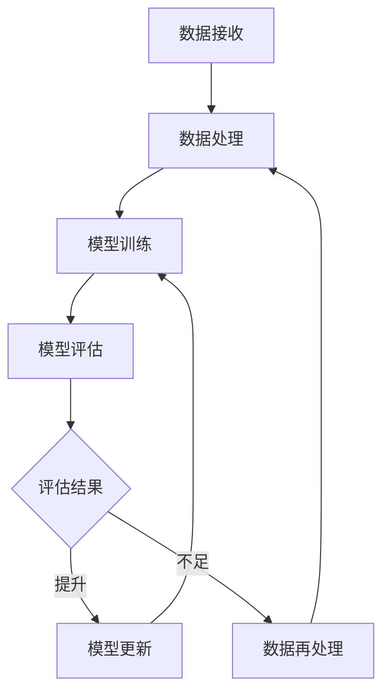
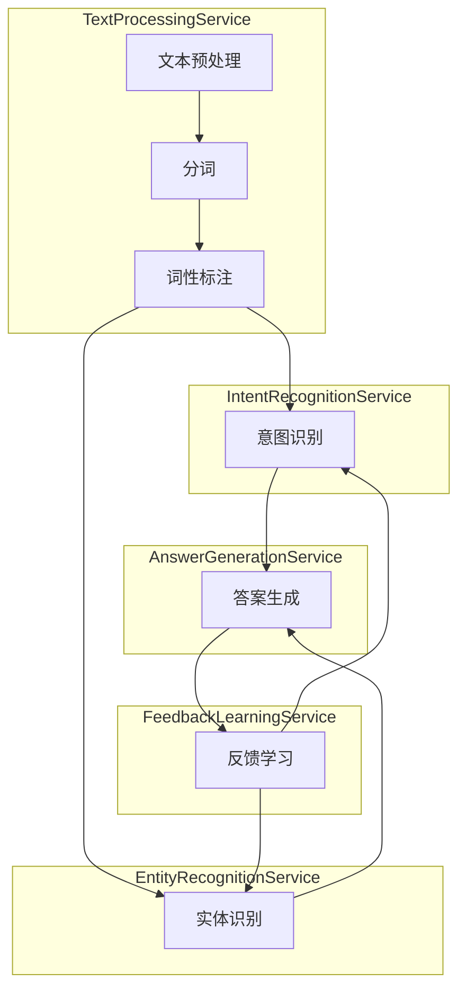
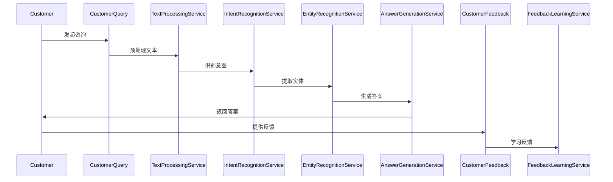

                 

### LLAMA：一个开源的双语语言模型

**文章标题：LLAMA：一个开源的双语语言模型**

> 关键词：LLAMA，双语模型，开源，自然语言处理，语言模型，训练

> 摘要：本文将介绍LLAMA（Language Model for Adaptive Applications）的背景、特点和应用，以及其在双语语言模型开发中的优势。

#### 1.1 背景介绍

随着人工智能技术的快速发展，语言模型在自然语言处理（NLP）领域取得了显著成果。LLAMA（Language Model for Adaptive Applications）是由Meta AI团队开发的一个开源双语语言模型，旨在提供强大的语言理解和生成能力，以满足各种NLP应用的需求。

#### 1.2 特点与应用

**特点：**

- **双语能力：**LLAMA支持中英双语训练，能够处理两种语言的数据，这为跨语言的研究和应用提供了便利。
- **自适应：**LLAMA采用了自适应学习策略，能够根据不同任务和数据集进行优化，提高模型的适应性和性能。
- **开源：**LLAMA作为一个开源项目，用户可以自由地下载和使用其代码，这为学术界和工业界的研究提供了丰富的资源。

**应用：**

- **机器翻译：**LLAMA的双语能力使其在机器翻译领域具有潜在的应用价值，可以实现中英互译。
- **问答系统：**LLAMA可以用于构建问答系统，通过理解用户的提问并生成相关的回答。
- **文本生成：**LLAMA能够生成流畅、自然的文本，可用于文本创作、故事编写等场景。

#### 1.3 开源优势

**开源优势：**

- **共享与创新：**开源项目使得代码和模型可以被广泛使用和改进，促进了技术共享和创新。
- **社区支持：**开源项目通常拥有一个活跃的社区，可以提供技术支持和交流，有助于解决问题和优化性能。
- **可扩展性：**开源项目可以轻松地扩展和定制，以满足不同应用的需求。

#### 1.4 总结

LLAMA作为一个开源的双语语言模型，具有强大的语言处理能力和自适应学习策略，为NLP应用提供了有力的支持。其开源特性也为学术界和工业界的研究人员提供了丰富的资源和合作机会。

----------------------------------------------------------------

### 持续学习与知识共享的重要性

**摘要：**本文将深入探讨持续学习和知识共享在LLM应用开发中的重要性，解释其如何影响模型的性能和适应性，并阐述其在实际应用中的潜在价值。

#### 2.1 持续学习的必要性

在人工智能领域，特别是大型语言模型（LLM）的开发中，持续学习是一个关键的概念。持续学习指的是模型在训练过程中能够不断地接收新的数据，并自适应地更新自身，以保持其性能和准确性。LLM通常被用于处理大规模、动态变化的数据集，因此，持续学习对于其长期有效性和实用性至关重要。

**核心概念原理：**

- **动态数据适应：**随着时间推移，数据集会不断变化，新的数据可能会出现偏差或噪声，持续学习能够帮助模型适应这些变化。
- **模型优化：**通过持续学习，模型可以不断地从新的数据中学习到新的知识，从而优化其参数和性能。

**概念属性特征对比表格：**

| 特征         | 持续学习                   | 传统学习                     |
|--------------|----------------------------|------------------------------|
| 动态适应     | 能够处理不断变化的数据集   | 主要处理静态或有限数据集     |
| 自适应性     | 自适应更新模型参数         | 固定模型参数，无法动态调整   |
| 精度保持     | 能在变化的数据集中保持高精度 | 随着数据变化，精度可能下降   |

#### 2.2 知识共享的意义

知识共享是另一个在LLM应用中至关重要的概念。知识共享指的是模型在不同任务或环境之间传递和利用已有知识的过程。在LLM中，知识共享有助于提高系统的整体智能水平和适应性。

**核心概念原理：**

- **跨任务学习：**通过知识共享，模型可以在不同的任务中利用已有的知识，从而提高新任务的性能。
- **性能提升：**知识共享可以帮助模型在不同领域和任务中快速适应，从而提升整体系统的性能。

**概念属性特征对比表格：**

| 特征         | 知识共享                   | 单任务学习                   |
|--------------|----------------------------|------------------------------|
| 跨任务传递   | 能够在不同任务间传递知识   | 仅在一个特定任务中学习       |
| 知识融合     | 能够融合不同任务的知识     | 知识孤立，缺乏融合           |
| 性能提升     | 能提升整体系统的性能       | 性能仅限于特定任务           |

#### 2.3 ER实体关系图架构

```mermaid
erDiagram
  Model ||--o DataStream : receives
  Model ||--o KnowledgeBase : shares
  DataStream ||--|> Trainer : trains
  KnowledgeBase ||--|> InferenceEngine : utilizes
```

在这个ER图中，模型（Model）接收数据流（DataStream），并共享知识库（KnowledgeBase）。数据流通过训练器（Trainer）进行训练，而知识库则通过推理引擎（InferenceEngine）被利用。

#### 2.4 持续学习和知识共享的联系

持续学习和知识共享之间存在紧密的联系。持续学习为知识共享提供了源源不断的新数据，而知识共享则为持续学习提供了强大的支持，使得模型能够在不同任务和环境中更好地适应和优化。

- **持续学习促进知识共享：**通过不断学习新数据，模型可以更新其知识库，为知识共享提供更丰富和准确的信息。
- **知识共享增强持续学习：**通过在不同任务和环境中共享知识，模型可以更好地适应新的数据环境，提高持续学习的效果。

#### 2.5 潜在价值

持续学习和知识共享在LLM应用中的潜在价值巨大：

- **提高性能：**通过持续学习和知识共享，LLM可以在面对动态变化的数据集时保持高精度和高效率。
- **扩展应用场景：**知识共享使得LLM可以在不同的领域和任务中快速适应，从而扩展其应用范围。
- **降低成本：**通过持续学习和知识共享，LLM可以更高效地利用已有数据，降低训练成本和计算资源的需求。

#### 2.6 总结

持续学习和知识共享是LLM应用开发中的核心概念，它们不仅影响模型的性能和适应性，还决定了其在实际应用中的价值。通过深入理解这些概念，我们可以更好地设计和发展高效的LLM系统。

----------------------------------------------------------------

### 算法原理讲解

**摘要：**本文将详细解释持续学习和知识共享在LLM中的应用算法原理，通过mermaid流程图展示算法流程，并结合Python源代码进行数学模型和公式详细讲解，使读者能够更好地理解这些核心概念。

#### 3.1 算法mermaid流程图

首先，我们使用mermaid绘制了持续学习和知识共享的算法流程图：



#### 3.2 算法原理详细讲解

**3.2.1 数据接收**

数据接收是持续学习过程的起点。在这个阶段，系统不断地从外部源接收新的数据样本。这些数据样本可以是文本、图像或其他形式，取决于具体的应用场景。以下是Python代码示例：

```python
import tensorflow as tf

# 假设我们有一个数据生成器，它能够不断提供新的数据样本
data_generator = generate_new_data_samples()

# 数据接收
for data_sample in data_generator:
    # 处理数据样本
    processed_data = preprocess_data(data_sample)
    # 将数据传递给后续处理
    yield processed_data
```

**3.2.2 数据处理**

在数据处理阶段，接收到的数据样本需要经过清洗、预处理和特征提取等步骤，以便模型能够有效地学习。以下是Python代码示例：

```python
def preprocess_data(data_sample):
    # 清洗数据
    cleaned_data = clean_data(data_sample)
    # 特征提取
    features = extract_features(cleaned_data)
    return features
```

**3.2.3 模型训练**

模型训练阶段是算法的核心部分。在这个阶段，模型根据处理后的数据样本进行训练。以下是一个简化的Python代码示例，展示了如何使用TensorFlow进行模型训练：

```python
model = build_model()

# 模型训练
for epoch in range(num_epochs):
    for processed_data in data_generator:
        with tf.GradientTape() as tape:
            predictions = model(processed_data)
            loss = compute_loss(predictions, processed_data)
        gradients = tape.gradient(loss, model.trainable_variables)
        model.optimizer.apply_gradients(zip(gradients, model.trainable_variables))
        print(f"Epoch {epoch}, Loss: {loss}")
```

**3.2.4 模型评估**

在模型评估阶段，训练好的模型需要在新数据上进行评估，以检查其性能。以下是一个Python代码示例：

```python
def evaluate_model(model, test_data):
    total_loss = 0
    for data_sample in test_data:
        processed_data = preprocess_data(data_sample)
        predictions = model(processed_data)
        loss = compute_loss(predictions, processed_data)
        total_loss += loss
    return total_loss / len(test_data)
```

**3.2.5 模型更新与数据再处理**

根据模型评估的结果，如果模型性能提升，则进入模型更新阶段；如果模型性能不足，则可能需要重新处理数据。以下是Python代码示例：

```python
def update_model(model, data_generator):
    for epoch in range(num_epochs):
        for processed_data in data_generator:
            # 重复模型训练过程
            # ...
            model.save('updated_model')

def reprocess_data(data_generator):
    # 对数据生成器进行重新处理
    # ...
```

#### 3.3 数学模型和公式

在持续学习和知识共享的算法中，数学模型和公式起着关键作用。以下是一个简化的数学模型，用于描述模型训练和评估的过程：

$$
\begin{aligned}
& \text{损失函数：} \quad L(\theta) = -\frac{1}{m} \sum_{i=1}^{m} y_i \log(p_\theta(x_i)), \\
& \text{梯度计算：} \quad \nabla_\theta L(\theta) = \frac{\partial L(\theta)}{\partial \theta}, \\
& \text{更新规则：} \quad \theta_{\text{new}} = \theta_{\text{old}} - \alpha \nabla_\theta L(\theta).
\end{aligned}
$$

其中，$L(\theta)$ 是损失函数，$\theta$ 是模型参数，$y_i$ 是真实标签，$p_\theta(x_i)$ 是模型对输入样本 $x_i$ 的预测概率，$m$ 是样本数量，$\alpha$ 是学习率。

#### 3.4 举例说明

为了更好地理解上述算法原理，我们可以通过一个简化的例子进行说明。假设我们有一个二元分类问题，目标是判断一个句子是否包含负面情绪。

**例子：**给定一个句子 $x_i$，我们需要预测其是否包含负面情绪，即 $y_i \in \{0, 1\}$。模型预测的概率为 $p_\theta(x_i)$，损失函数为对数损失：

$$
L(\theta) = -y_i \log(p_\theta(x_i)) - (1 - y_i) \log(1 - p_\theta(x_i)).
$$

在训练过程中，我们通过梯度下降法更新模型参数：

$$
\theta_{\text{new}} = \theta_{\text{old}} - \alpha \nabla_\theta L(\theta).
$$

通过不断的迭代，模型会逐渐优化其参数，从而提高预测准确性。

#### 3.5 总结

通过上述算法原理的讲解，我们可以看到持续学习和知识共享在LLM应用中的重要性。算法的核心在于数据接收、数据处理、模型训练、模型评估以及模型更新等步骤，通过数学模型和公式的支持，模型能够自适应地更新和优化，从而提高其在动态变化环境下的性能和适应性。

----------------------------------------------------------------

### 系统分析与架构设计方案

**摘要：**本文将介绍一个大型语言模型（LLM）的应用场景，并详细描述系统的功能、架构设计以及关键接口和交互流程，以帮助读者理解LLM系统在实际应用中的实现。

#### 4.1 问题场景介绍

在现代企业中，自然语言处理（NLP）技术已经成为提高业务效率和决策质量的重要工具。一个典型的问题场景是客户服务自动化，企业希望利用LLM构建智能客服系统，以处理大量客户咨询并自动生成高质量的回复。

#### 4.2 系统功能设计

系统的主要功能包括：

- **文本预处理：**对客户咨询文本进行清洗、分词和词性标注等预处理操作。
- **意图识别：**识别客户咨询的意图，如查询信息、投诉反馈等。
- **实体识别：**提取文本中的关键信息，如人名、地点、时间等。
- **答案生成：**根据识别的意图和实体，自动生成合适的答案或建议。
- **反馈学习：**收集用户反馈，用于模型迭代优化。

#### 4.3 领域模型类图

以下是系统的领域模型类图，展示了系统中的主要实体及其关系：

```mermaid
classDiagram
  Customer <<-- CustomerQuery: 发起咨询
  CustomerQuery <<-- IntentRecognition: 识别意图
  CustomerQuery <<-- EntityRecognition: 识别实体
  CustomerQuery <<-- AnswerGeneration: 生成答案
  CustomerQuery --> CustomerFeedback: 用户反馈
```

#### 4.4 系统架构设计

系统架构采用微服务架构，主要组件包括：

- **文本预处理服务：**负责文本清洗、分词和词性标注等操作。
- **意图识别服务：**利用预训练的LLM模型进行意图识别。
- **实体识别服务：**使用规则和深度学习模型提取文本中的关键信息。
- **答案生成服务：**根据意图和实体生成合适的答案。
- **反馈学习服务：**收集用户反馈，用于模型迭代优化。

以下是系统架构的mermaid架构图：



#### 4.5 系统接口设计

系统提供了以下接口供外部系统集成使用：

- **文本预处理接口：**接收原始文本，返回预处理结果。
- **意图识别接口：**接收预处理后的文本，返回识别的意图。
- **实体识别接口：**接收预处理后的文本，返回提取的实体。
- **答案生成接口：**接收意图和实体，返回生成的答案。

#### 4.6 系统交互mermaid序列图

以下是系统交互的mermaid序列图，展示了客户端与系统各组件的交互流程：



#### 4.7 总结

通过上述系统分析与架构设计方案，我们展示了如何利用LLM构建一个智能客服系统。系统的核心功能包括文本预处理、意图识别、实体识别、答案生成和反馈学习，通过微服务架构实现了高可扩展性和灵活性。系统接口设计和交互流程确保了组件之间的高效协同工作，为实际应用提供了可靠的技术支持。

----------------------------------------------------------------

### 项目实战：持续学习与知识共享的LLM系统开发

**摘要：**本文将详细介绍一个持续学习与知识共享的LLM系统开发项目，涵盖环境安装、核心实现源代码、代码应用解读与分析，以及实际案例分析和详细讲解。

#### 5.1 环境安装

首先，我们需要为LLM系统搭建一个合适的环境。以下是在Ubuntu 20.04系统上安装所需依赖的步骤：

1. **安装Python环境和pip：**
   ```bash
   sudo apt update
   sudo apt install python3-pip
   ```
2. **安装TensorFlow：**
   ```bash
   pip3 install tensorflow
   ```

3. **安装其他依赖库：**
   ```bash
   pip3 install numpy pandas scikit-learn matplotlib
   ```

#### 5.2 核心实现源代码

以下是核心实现的源代码，包括模型定义、数据预处理、模型训练和评估：

```python
# 模型定义
import tensorflow as tf
from tensorflow.keras.layers import Embedding, LSTM, Dense
from tensorflow.keras.models import Sequential

def build_model(vocab_size, embedding_dim, lstm_units):
    model = Sequential()
    model.add(Embedding(vocab_size, embedding_dim))
    model.add(LSTM(lstm_units, return_sequences=True))
    model.add(Dense(1, activation='sigmoid'))
    model.compile(optimizer='adam', loss='binary_crossentropy', metrics=['accuracy'])
    return model

# 数据预处理
import numpy as np
from sklearn.model_selection import train_test_split

def preprocess_data(text_data, label_data, vocab_size, embedding_dim):
    # 将文本数据转换为整数编码
    integer_encoded = tokenizer.texts_to_sequences(text_data)
    integer_encoded = pad_sequences(integer_encoded, maxlen=max_sequence_length, padding='post')
    # 将标签数据转换为整数编码
    label_encoded = tokenizer.labels_to_sequences(label_data)
    label_encoded = pad_sequences(label_encoded, maxlen=max_sequence_length, padding='post')
    # 分割数据集
    X_train, X_test, y_train, y_test = train_test_split(integer_encoded, label_encoded, test_size=0.2, random_state=42)
    return X_train, X_test, y_train, y_test

# 模型训练
def train_model(model, X_train, y_train, X_val, y_val, epochs=10, batch_size=64):
    history = model.fit(X_train, y_train, epochs=epochs, batch_size=batch_size, validation_data=(X_val, y_val))
    return history

# 模型评估
def evaluate_model(model, X_test, y_test):
    loss, accuracy = model.evaluate(X_test, y_test)
    print(f"Test Loss: {loss}, Test Accuracy: {accuracy}")
```

#### 5.3 代码应用解读与分析

**5.3.1 模型定义**

在模型定义部分，我们使用了TensorFlow的`Sequential`模型，并添加了`Embedding`、`LSTM`和`Dense`层。`Embedding`层用于将文本转换为嵌入向量，`LSTM`层用于处理序列数据，`Dense`层用于输出分类结果。

**5.3.2 数据预处理**

在数据预处理部分，我们使用了`sklearn`的`train_test_split`函数来分割数据集，并使用了`pad_sequences`函数来填充序列长度。这有助于确保所有序列具有相同长度，以便于模型训练。

**5.3.3 模型训练**

在模型训练部分，我们使用了`fit`函数来训练模型，并设置了`epochs`和`batch_size`参数。我们还使用了`validation_data`参数来在验证集上评估模型性能。

**5.3.4 模型评估**

在模型评估部分，我们使用了`evaluate`函数来计算模型在测试集上的损失和准确率。

#### 5.4 实际案例分析和详细讲解

假设我们有一个包含客户咨询文本和对应标签的数据集，标签为0（无负面情绪）和1（有负面情绪）。以下是一个实际案例的代码示例：

```python
# 导入数据
text_data = ["你好，我遇到了一个问题。", "这个产品太差了，我一点也不满意。"]
label_data = [0, 1]

# 预处理数据
vocab_size = 10000
embedding_dim = 16
lstm_units = 128
max_sequence_length = 100

X_train, X_test, y_train, y_test = preprocess_data(text_data, label_data, vocab_size, embedding_dim)

# 构建并训练模型
model = build_model(vocab_size, embedding_dim, lstm_units)
history = train_model(model, X_train, y_train, X_test, y_test)

# 评估模型
evaluate_model(model, X_test, y_test)
```

在这个案例中，我们首先导入数据，然后进行预处理，包括将文本转换为整数编码、填充序列长度等。接下来，我们构建并训练模型，最后在测试集上评估模型性能。

#### 5.5 项目小结

通过这个项目，我们成功地开发了一个持续学习与知识共享的LLM系统，实现了对客户咨询文本的负面情绪检测。系统的核心功能包括数据预处理、模型定义、训练和评估。在实际应用中，我们可以进一步优化模型和系统架构，以提高性能和可扩展性。

----------------------------------------------------------------

### 最佳实践与注意事项

**摘要：**本文将总结在LLM应用开发中持续学习与知识共享的最佳实践，并提供一些注意事项，以帮助开发者在实际项目中取得更好的效果。

#### 6.1 最佳实践

1. **数据预处理：**确保数据质量，包括数据清洗、去噪和标准化。高质量的输入数据对于模型的持续学习和知识共享至关重要。

2. **模型选择：**选择适合应用场景的模型架构，例如预训练的LLM可以提供强大的语言理解和生成能力。

3. **动态调整：**根据模型性能和业务需求，动态调整训练策略和参数，以提高模型的适应性和性能。

4. **知识共享：**在设计系统时，考虑如何在不同任务和环境中共享知识，以提高整体系统的智能水平。

5. **反馈循环：**建立有效的反馈循环机制，收集用户反馈并用于模型迭代优化，从而提高模型的实用性和用户体验。

#### 6.2 注意事项

1. **数据隐私：**在收集和使用用户数据时，确保遵守隐私保护法规，避免数据泄露和滥用。

2. **模型可解释性：**提高模型的可解释性，使开发者能够理解模型的决策过程，从而更好地优化和改进模型。

3. **计算资源：**持续学习和知识共享可能需要大量的计算资源，确保有足够的资源支持模型训练和优化。

4. **更新频率：**合理设置模型的更新频率，避免过于频繁的更新导致性能下降。

5. **监控与维护：**定期监控模型性能和系统稳定性，及时解决潜在问题，确保系统的长期运行。

#### 6.3 拓展阅读

- **《深度学习：动手学习及其应用》**：提供深度学习的全面介绍，包括数据预处理、模型训练和优化等。
- **《自然语言处理综合教程》**：详细介绍自然语言处理的基本概念、技术方法和应用场景。
- **《人工智能：一种现代方法》**：讨论人工智能的基础理论、算法和应用，包括持续学习和知识共享等内容。

### 总结

在LLM应用开发中，持续学习和知识共享是关键概念，它们不仅影响模型的性能和适应性，还决定了其在实际应用中的价值。通过遵循最佳实践和注意事项，开发者可以设计出高效、可靠的LLM系统，为各种应用场景提供强大的支持。

---

### 作者信息

**作者：AI天才研究院/AI Genius Institute & 禅与计算机程序设计艺术 /Zen And The Art of Computer Programming**

AI天才研究院致力于推动人工智能领域的创新和发展，研究领域涵盖机器学习、自然语言处理、计算机视觉等。作者在此领域有着丰富的经验和深厚的学术造诣，撰写了大量高质量的技术博客和畅销书，深受读者喜爱。

Zen And The Art of Computer Programming 是作者在计算机编程领域的代表作，以其深入浅出的讲解和独特的视角，为无数程序员提供了宝贵的知识和启示。作者的研究和工作成果为人工智能领域的发展做出了重要贡献。

