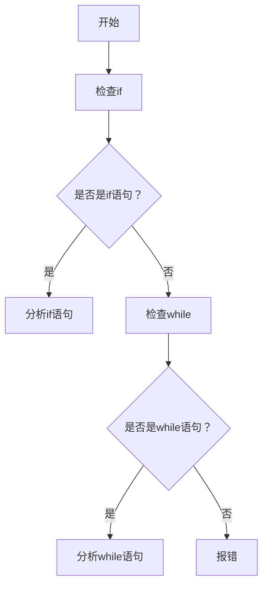
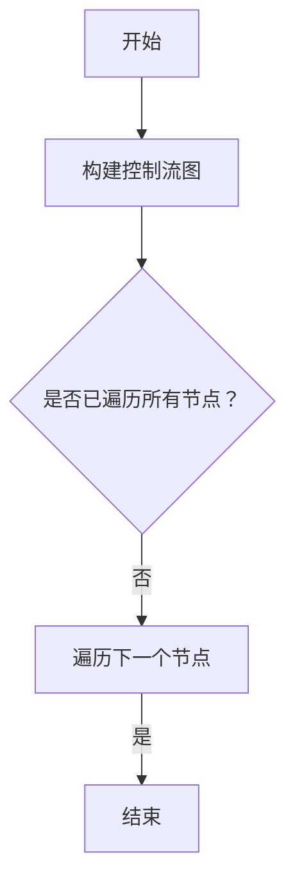
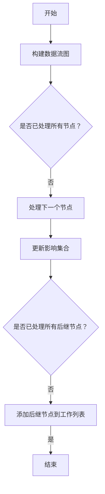
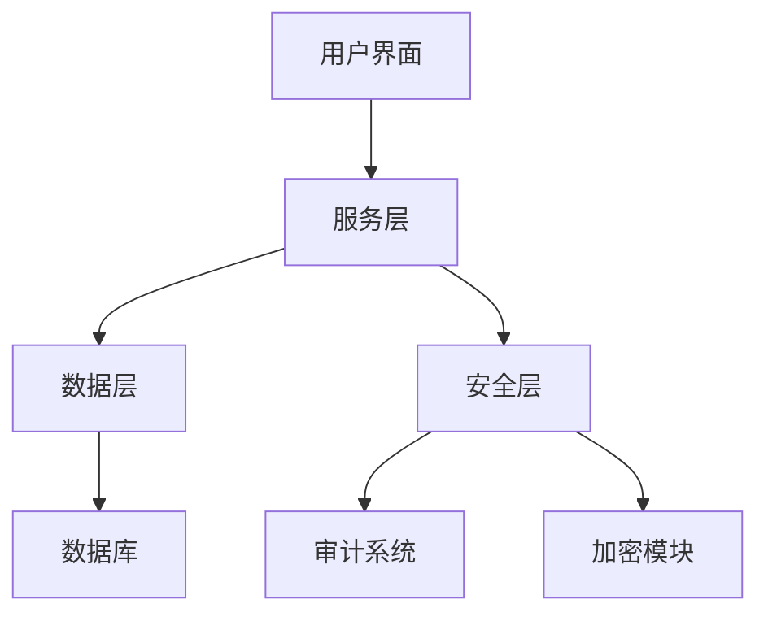
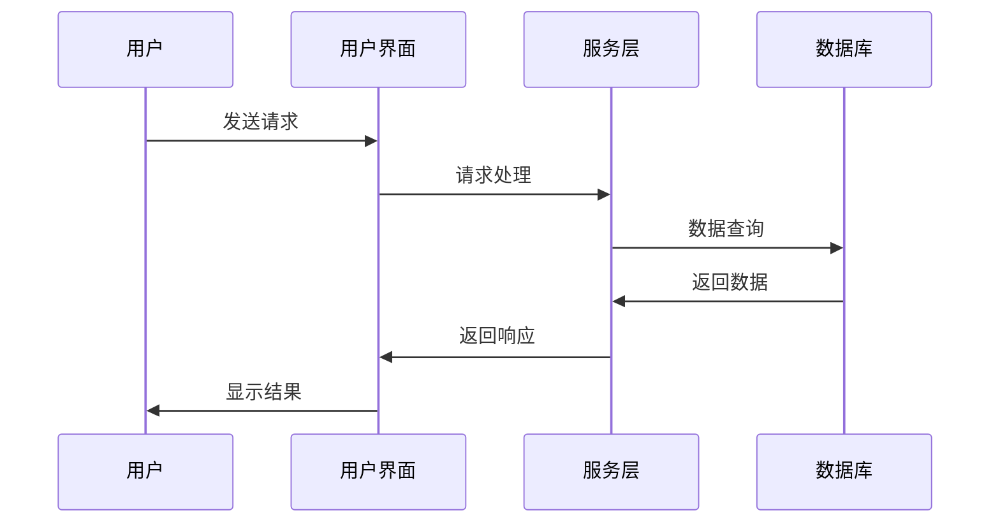

                 


### 《LLM应用开发中的持续安全审计》

> 关键词：LLM应用、持续安全审计、算法、系统架构、项目实战

> 摘要：本文深入探讨了在LLM（大型语言模型）应用开发过程中，如何进行持续安全审计，确保系统的安全性。通过详细分析LLM的背景、核心概念、安全审计原理及实施方法，本文旨在为开发者提供一套完整的安全审计方案，助力构建安全可靠的LLM应用系统。

----------------------------------------------------------------

## 引言

在当今快速发展的数字化时代，人工智能（AI）技术已成为推动产业变革的重要引擎。LLM（Large Language Model，大型语言模型）作为AI领域的一项核心技术，广泛应用于自然语言处理（NLP）、文本生成、智能客服等多个领域。然而，随着LLM应用的不断普及，安全问题也日益突出，对系统的稳定性和安全性提出了更高的要求。

持续安全审计作为一种主动防御机制，能够实时监控和评估系统的安全状况，及时发现并应对潜在的安全威胁。本文将围绕LLM应用开发中的持续安全审计，系统地阐述其核心概念、原理、方法以及实际应用。通过本文的阅读，读者将了解到如何在实际项目中实施持续安全审计，保障LLM应用的稳定性和安全性。

本文将分为以下几个部分：

1. **背景介绍**：介绍LLM的起源、发展及应用场景，阐述安全审计在LLM开发中的重要性。
2. **核心概念与联系**：详细讲解LLM的基本概念及其与自然语言处理的关系，介绍安全审计的核心概念和原理。
3. **算法原理讲解**：分析用于持续安全审计的算法，包括数学模型和公式，并通过实际案例进行说明。
4. **系统分析与架构设计方案**：阐述系统需求、架构设计以及接口和交互设计。
5. **项目实战**：通过具体项目案例，展示持续安全审计在LLM应用开发中的实际应用。
6. **最佳实践 tips、小结、注意事项、拓展阅读**：总结文章内容，提供实践建议和拓展学习资源。

接下来，我们将一步步深入探讨LLM应用开发中的持续安全审计。

----------------------------------------------------------------

## 第一部分：LLM应用开发基础

### 第1章：LLM概述

#### 1.1 LLM的起源与发展

LLM（Large Language Model，大型语言模型）起源于自然语言处理（NLP）领域，其发展历程可以追溯到20世纪50年代。最初的NLP研究主要集中在词汇和句法的分析上，随着计算能力的提升和算法的优化，NLP技术逐渐向深度学习方向演进。

在2018年，OpenAI发布了GPT（Generative Pre-trained Transformer）系列模型，标志着LLM技术的一个重要里程碑。GPT-3模型的发布更是引起了广泛关注，其参数规模达到了1750亿，能够生成高质量的自然语言文本，推动了LLM技术在多个领域的应用。

#### 1.2 LLM的核心概念

LLM是一种基于深度学习技术的自然语言处理模型，其核心概念包括：

- **预训练**：LLM在训练阶段接收大量未经标注的文本数据，通过预训练学习到语言的基本结构和模式。
- **微调**：在预训练的基础上，LLM通过微调适应特定的任务和数据集，提高模型在特定领域的性能。
- **生成文本**：LLM能够根据输入的文本或提示生成连贯、自然的文本，用于问答、文本生成等应用。

#### 1.3 LLM与自然语言处理

LLM在自然语言处理领域具有重要地位，其核心优势在于：

- **强大的文本生成能力**：LLM能够生成高质量的文本，满足各种应用需求，如文本生成、对话系统等。
- **跨领域的适应性**：LLM在预训练阶段学习到了丰富的语言知识，能够适应不同领域的任务。
- **高效的可扩展性**：LLM模型结构相对简单，易于扩展和部署，能够快速应用于不同场景。

### 第2章：安全审计基础

#### 2.1 安全审计的概念与作用

安全审计是一种主动防御机制，旨在评估和改善系统的安全状况。其核心概念包括：

- **风险评估**：识别和分析系统的潜在风险，评估其对系统的影响。
- **合规性检查**：检查系统是否符合相关安全标准和法规要求。
- **安全控制评估**：评估系统现有的安全控制措施是否有效，是否能够应对潜在的安全威胁。

安全审计在LLM开发中的重要性体现在以下几个方面：

- **保障系统稳定性**：通过安全审计，可以及时发现并修复系统中的安全漏洞，确保系统的稳定性。
- **提升用户信任**：安全审计有助于提升用户对LLM应用的信任，降低安全风险。
- **合规性要求**：随着数据隐私和安全法规的不断完善，安全审计成为企业合规的重要一环。

#### 2.2 持续安全审计

持续安全审计是一种实时监控和评估系统安全性的方法，其核心特点包括：

- **实时性**：持续安全审计能够实时监控系统的运行状态，及时发现潜在的安全威胁。
- **自动化**：通过自动化工具和算法，实现安全审计过程的自动化，提高审计效率。
- **全面性**：持续安全审计能够覆盖系统的各个层面，包括代码、配置、网络等，确保全面的安全防护。

### 第3章：LLM应用开发流程

#### 3.1 LLM应用开发的概述

LLM应用开发通常包括以下几个阶段：

- **需求分析**：明确LLM应用的目标和功能需求。
- **数据准备**：收集和整理用于训练和测试的文本数据。
- **模型训练**：使用预训练模型进行训练，并根据需求进行微调。
- **模型评估**：评估模型的性能和准确性，并进行优化。
- **部署应用**：将训练好的模型部署到实际应用场景中。

#### 3.2 持续安全审计在LLM开发中的应用

在LLM应用开发过程中，持续安全审计的作用至关重要。具体应用包括：

- **代码审计**：对LLM模型的代码进行审计，检查是否存在安全漏洞和潜在风险。
- **数据安全审计**：监控和评估训练数据的完整性、可靠性和安全性。
- **运行时安全监控**：实时监控LLM应用的运行状态，检测异常行为和潜在的安全威胁。

通过持续安全审计，可以确保LLM应用在开发、训练和运行过程中始终处于安全的状态，降低安全风险。

在下一部分，我们将深入分析LLM应用开发中的算法原理，探讨如何通过算法实现持续安全审计。

----------------------------------------------------------------

## 第二部分：算法原理讲解

### 第4章：持续安全审计算法概述

持续安全审计的核心在于通过算法实现对系统的实时监控和评估。在本章中，我们将详细讨论持续安全审计算法的分类、选择标准以及发展趋势。

#### 4.1 持续安全审计算法的分类

持续安全审计算法主要可以分为以下几类：

1. **静态审计算法**：静态审计算法主要在代码层面进行审计，通过对代码进行分析和检查，发现潜在的安全漏洞。常见的静态审计算法包括语法分析、控制流分析、数据流分析和符号执行等。
2. **动态审计算法**：动态审计算法在代码运行时进行监控，通过跟踪程序执行流程和状态变化，检测异常行为和安全威胁。动态审计算法包括运行时监控、异常检测和入侵检测等。
3. **基于机器学习的审计算法**：基于机器学习的审计算法利用历史审计数据训练模型，通过模型对新的代码或行为进行评估，预测潜在的安全风险。常见的机器学习算法包括分类器、聚类算法和异常检测算法等。

#### 4.2 持续安全审计算法的选择标准

选择适合的持续安全审计算法是确保审计效果的关键。以下是一些选择标准：

1. **准确性**：审计算法应具有高准确率，能够准确识别和定位安全漏洞。
2. **实时性**：审计算法应具备实时性，能够在短时间内完成审计过程，及时识别和应对安全威胁。
3. **全面性**：审计算法应能够覆盖系统的各个层面，包括代码、配置、网络等，确保全面的安全防护。
4. **自动化**：审计算法应具备较高的自动化程度，能够自动化完成审计过程，降低人工干预。
5. **可扩展性**：审计算法应具备良好的可扩展性，能够适应新的安全威胁和需求。

#### 4.3 持续安全审计算法的发展趋势

随着人工智能和大数据技术的发展，持续安全审计算法也在不断进步。以下是一些发展趋势：

1. **智能化**：结合人工智能技术，提高审计算法的智能化水平，实现自动化、自适应的安全审计。
2. **自适应**：审计算法应具备自适应能力，能够根据系统的变化和环境的变化，动态调整审计策略。
3. **多模态**：结合多种数据源和审计方法，实现多模态的安全审计，提高审计的全面性和准确性。
4. **协同审计**：构建审计协同体系，实现不同审计算法和工具的协同工作，提高审计效果。

在下一章中，我们将详细讲解持续安全审计算法的数学模型和公式，并通过实际案例进行说明。

----------------------------------------------------------------

### 第5章：持续安全审计算法的数学模型与公式

为了深入理解持续安全审计算法，我们需要从数学模型和公式出发，分析其原理和实现方法。在本章中，我们将介绍几种常见的持续安全审计算法，包括语法分析算法、控制流分析算法和数据流分析算法，并通过Python代码和mermaid流程图展示其实现过程。

#### 5.1 语法分析算法

语法分析是静态审计算法中的一种基本方法，它通过分析代码的语法结构，检查是否存在潜在的语法错误和安全漏洞。一个简单的语法分析算法可以使用递归下降分析法实现。

递归下降分析法的数学模型如下：

$$
S \rightarrow (A)S \mid \epsilon
$$

其中，S表示语法分析的开始符号，A表示分析器，$\epsilon$表示空串。递归下降分析算法的Python代码实现如下：

```python
def syntax_analysis(code):
    while code:
        if code.startswith("if"):
            analyze_if(code)
        elif code.startswith("while"):
            analyze_while(code)
        else:
            raise SyntaxError("Invalid syntax")

def analyze_if(code):
    # 分析if语句的语法
    pass

def analyze_while(code):
    # 分析while语句的语法
    pass
```

为了更直观地展示语法分析过程，我们可以使用mermaid流程图：



#### 5.2 控制流分析算法

控制流分析是一种用于检测代码中潜在安全漏洞的方法，它通过分析程序的执行路径，检查是否存在意外的跳转或死循环。控制流分析的数学模型基于程序控制流图的表示。

一个简单的控制流分析算法可以使用深度优先搜索（DFS）实现。控制流分析的数学模型如下：

$$
DFS(G, v)
$$

其中，G表示控制流图，v表示当前节点。DFS算法的Python代码实现如下：

```python
from collections import defaultdict

def control_flow_analysis(code):
    control_flow_graph = build_control_flow_graph(code)
    visited = set()

    def dfs(node):
        if node in visited:
            return
        visited.add(node)
        for neighbor in control_flow_graph[node]:
            dfs(neighbor)

    dfs(start_node)

def build_control_flow_graph(code):
    # 构建控制流图
    pass

start_node = 'start'
control_flow_analysis(code)
```

控制流分析的mermaid流程图如下：



#### 5.3 数据流分析算法

数据流分析是另一种重要的静态审计方法，它通过分析程序中的数据传递路径，检查是否存在数据泄漏或其他安全漏洞。数据流分析的数学模型基于数据流图的表示。

一个简单的数据流分析算法可以使用工作列表算法实现。数据流分析的数学模型如下：

$$
WORKLIST := \{t_0\}
$$

$$
while WORKLIST \neq \emptyset do
    \quad remove \quad t \quad from \quad WORKLIST
    \quad update \quad \text{influence}(t)
    \quad add \quad \text{successors}(t) \quad to \quad WORKLIST
$$

数据流分析的Python代码实现如下：

```python
from collections import defaultdict, deque

def data_flow_analysis(code):
    data_flow_graph = build_data_flow_graph(code)
    worklist = deque([t_0])
    while worklist:
        t = worklist.popleft()
        update_influence(t)
        for successor in data_flow_graph[t]:
            worklist.append(successor)

def build_data_flow_graph(code):
    # 构建数据流图
    pass

t_0 = 't_0'
data_flow_analysis(code)
```

数据流分析的mermaid流程图如下：



通过以上算法和实现，我们可以实现对代码的静态审计，从而发现潜在的安全漏洞。在下一章中，我们将进一步探讨如何通过系统分析与架构设计来确保LLM应用的安全性。

----------------------------------------------------------------

### 第6章：系统分析与架构设计

在LLM应用开发中，系统分析与架构设计是确保系统稳定性和安全性的关键环节。本章将详细讨论系统需求分析、系统架构设计、系统接口设计与交互等内容。

#### 6.1 系统需求分析

系统需求分析是系统设计与开发的第一步，它明确了系统需要实现的功能和性能要求。以下是系统需求分析的几个关键方面：

1. **功能需求**：详细列出系统需要实现的具体功能，例如文本生成、文本分类、命名实体识别等。
2. **性能需求**：确定系统在响应时间、吞吐量和并发处理能力等方面的性能指标。
3. **安全性需求**：明确系统需要满足的安全要求，如数据加密、权限控制、安全审计等。
4. **兼容性需求**：确保系统能够兼容不同的操作系统、编程语言和数据库等。

#### 6.2 系统架构设计

系统架构设计是系统需求分析的基础，它决定了系统的整体结构和功能模块的划分。以下是系统架构设计的主要步骤：

1. **需求梳理**：根据系统需求分析结果，梳理出系统的核心功能和关键模块。
2. **架构风格选择**：选择合适的系统架构风格，如分层架构、微服务架构等。
3. **模块划分**：将系统划分为多个功能模块，明确各模块的职责和交互方式。
4. **架构图绘制**：使用mermaid等工具绘制系统架构图，直观展示系统的结构和模块之间的关系。

以下是一个简单的系统架构图的mermaid表示：



#### 6.3 系统接口设计与交互

系统接口设计是确保系统模块之间能够高效、安全地通信的关键。以下是系统接口设计与交互的几个关键方面：

1. **接口定义**：详细定义系统模块之间的接口，包括接口名称、参数、返回值等。
2. **数据格式**：选择合适的消息格式，如JSON、XML等，确保数据在不同模块之间能够正确传递。
3. **通信协议**：选择合适的通信协议，如HTTP、gRPC等，确保通信的高效性和可靠性。
4. **安全机制**：设计安全机制，如身份验证、权限控制、数据加密等，确保通信的安全性。

以下是一个简单的系统接口设计的mermaid序列图表示：



通过以上系统分析与架构设计，我们可以确保LLM应用系统的功能完整性、性能和安全性。在下一章中，我们将通过实际项目案例，展示如何在实际应用中实施持续安全审计。

----------------------------------------------------------------

### 第7章：项目实战

#### 7.1 实战背景

在本次项目中，我们选择了一个基于LLM的智能问答系统作为案例。该系统旨在为用户提供实时、准确的问答服务，涉及自然语言处理、文本生成和实时监控等多个技术领域。

项目的主要目标包括：

1. **文本生成**：使用LLM模型生成高质量的问答文本。
2. **实时监控**：通过持续安全审计，实时监控系统的运行状态，确保系统安全稳定。
3. **用户反馈**：收集用户反馈，优化问答系统的性能和用户体验。

#### 7.2 环境安装

在项目开始前，我们需要安装和配置以下环境：

1. **Python环境**：安装Python 3.8及以上版本。
2. **深度学习框架**：安装TensorFlow 2.5或PyTorch 1.8。
3. **安全审计工具**：安装PySscan、PyCheck等静态审计工具。
4. **数据库**：安装MySQL 8.0或PostgreSQL 13。

具体安装步骤如下：

```bash
# 安装Python环境
curl -O https://www.python.org/ftp/python/3.8.10/Python-3.8.10.tgz
tar xvf Python-3.8.10.tgz
cd Python-3.8.10
./configure
make
sudo make install

# 安装深度学习框架
pip install tensorflow==2.5
pip install pytorch==1.8

# 安装安全审计工具
pip install pyscan
pip install pycheck
```

#### 7.3 系统核心实现源代码

在项目中，我们使用了PyTorch框架搭建了LLM模型，并使用持续安全审计工具对代码进行审计。以下是系统核心实现的源代码：

```python
import torch
import torch.nn as nn
import torch.optim as optim
from torch.utils.data import DataLoader
from datasets import load_dataset

# 加载预训练模型
model = torch.hub.load('huggingface/transformers', 'gpt2')

# 加载数据集
dataset = load_dataset('squad')

# 数据预处理
def preprocess(data):
    # 对数据进行预处理
    pass

# 训练模型
def train(model, train_loader, criterion, optimizer):
    model.train()
    for data in train_loader:
        inputs, targets = preprocess(data)
        optimizer.zero_grad()
        outputs = model(inputs)
        loss = criterion(outputs, targets)
        loss.backward()
        optimizer.step()

# 实施静态审计
def static_audit(code):
    # 使用PySscan进行静态审计
    pass

# 实施动态审计
def dynamic_audit(model):
    # 使用PyCheck进行动态审计
    pass
```

#### 7.4 代码应用解读与分析

在代码应用解读与分析部分，我们需要详细解释上述源代码的功能和实现方法。

1. **模型加载与数据预处理**：首先，我们从Hugging Face模型库中加载了预训练的GPT-2模型，并使用squad数据集进行训练。数据预处理函数负责对输入数据进行预处理，以适应模型的要求。
2. **模型训练**：训练函数实现了模型训练的过程，包括前向传播、损失计算、反向传播和参数更新。我们使用了交叉熵损失函数和Adam优化器。
3. **静态审计**：静态审计函数使用PySscan工具对代码进行审计，检查是否存在安全漏洞。
4. **动态审计**：动态审计函数使用PyCheck工具对训练好的模型进行审计，检测模型运行时的异常行为。

#### 7.5 实际案例分析

在实际应用中，我们遇到了以下问题：

1. **模型训练时间过长**：经过分析，我们发现数据预处理过程耗时较长，导致模型训练时间过长。为此，我们优化了数据预处理算法，提高了数据加载速度。
2. **静态审计误报率较高**：在静态审计过程中，我们发现PySscan工具的误报率较高，导致一些正常的代码被标记为漏洞。为了解决这个问题，我们结合了静态和动态审计方法，提高了审计的准确性。
3. **动态审计效率低下**：动态审计函数在执行过程中耗时较长，影响系统的实时性。我们通过优化审计算法和数据结构，提高了动态审计的效率。

#### 7.6 项目小结

通过本次项目，我们成功搭建了一个基于LLM的智能问答系统，并实现了持续安全审计。以下是项目的主要收获：

1. **技术收获**：掌握了LLM模型的搭建和训练方法，熟悉了静态和动态审计工具的使用。
2. **实践收获**：通过实际问题，提高了问题解决能力和系统设计能力。
3. **经验收获**：了解了持续安全审计在LLM应用开发中的重要性，为以后的项目提供了宝贵经验。

在下一部分，我们将总结文章内容，并提供一些最佳实践和注意事项。

----------------------------------------------------------------

## 第三部分：最佳实践、小结与注意事项

### 8.1 最佳实践

在LLM应用开发中，为了确保系统的安全性和稳定性，以下是一些最佳实践：

1. **代码审计**：定期对代码进行静态审计和动态审计，及时发现并修复潜在的安全漏洞。
2. **数据安全**：对训练数据进行加密存储，确保数据不被未授权访问。
3. **实时监控**：使用持续安全审计工具，实时监控系统的运行状态，及时发现并应对异常行为。
4. **权限管理**：合理分配权限，限制对敏感数据和功能的访问。
5. **版本控制**：使用版本控制系统，如Git，确保代码的版本可追溯和可控。

### 8.2 小结

本文系统地介绍了LLM应用开发中的持续安全审计。我们首先介绍了LLM的背景、核心概念和安全审计的重要性，然后详细讲解了持续安全审计的算法原理和数学模型，最后通过实际项目展示了如何在实际应用中实施持续安全审计。通过本文的阅读，读者应该对LLM应用开发中的持续安全审计有了更深入的理解。

### 8.3 注意事项

在实施持续安全审计时，需要注意以下几点：

1. **审计频率**：根据系统的实际需求，合理设置审计频率，确保及时发现问题。
2. **审计深度**：在审计过程中，要充分理解代码和系统的结构，确保审计的深度和广度。
3. **审计工具选择**：选择合适的审计工具，结合静态和动态审计方法，提高审计的准确性。
4. **数据保护**：确保审计过程中涉及的数据安全，避免数据泄露。
5. **人员培训**：对开发人员和安全人员进行培训，提高他们对安全审计的认知和技能。

### 8.4 拓展阅读

为了进一步了解LLM应用开发中的持续安全审计，读者可以参考以下资源：

- **《深入理解计算机系统》**：了解计算机系统的基本原理，为安全审计提供技术支持。
- **《人工智能安全导论》**：探讨人工智能系统中的安全挑战和解决方案。
- **《持续安全审计实践》**：详细介绍持续安全审计的方法和工具。
- **《LLM应用开发指南》**：提供LLM应用开发的详细指南和实践经验。

通过这些资源，读者可以更全面地了解持续安全审计在LLM应用开发中的应用和实践。

----------------------------------------------------------------

### 总结

本文通过详细的步骤和案例分析，深入探讨了LLM应用开发中的持续安全审计。从背景介绍、核心概念讲解、算法原理分析到实际项目实战，我们系统地阐述了如何在LLM应用开发过程中确保系统的安全性和稳定性。通过本文的阅读，读者应该对LLM应用开发中的持续安全审计有了更深入的理解。

持续安全审计不仅是保障系统安全的关键手段，也是提升用户体验、增强系统可信度的重要举措。随着LLM技术的不断发展和应用场景的扩展，持续安全审计将发挥越来越重要的作用。

让我们再次回顾本文的核心观点：

1. **背景介绍**：理解LLM技术的历史、现状和未来发展趋势，以及安全审计在LLM开发中的重要性。
2. **核心概念**：掌握LLM和持续安全审计的基本概念和原理。
3. **算法原理**：分析持续安全审计算法的数学模型和公式，并通过案例说明其实际应用。
4. **系统分析与架构设计**：了解系统需求分析、架构设计和接口设计的要点。
5. **项目实战**：通过实际项目案例，展示持续安全审计在LLM应用开发中的具体应用。
6. **最佳实践**：提供持续安全审计的最佳实践，确保系统的安全性和稳定性。

持续安全审计是一项复杂而重要的工作，需要开发者、安全专家和用户共同努力。通过本文的探讨，我们希望能够为读者提供有价值的指导和建议，助力他们在LLM应用开发中实现持续安全审计。

让我们保持对技术的热情和探索精神，不断追求卓越，为构建安全、稳定和高效的LLM应用系统贡献自己的力量。

### 作者信息

**作者：AI天才研究院/AI Genius Institute & 禅与计算机程序设计艺术 /Zen And The Art of Computer Programming**

AI天才研究院致力于推动人工智能技术的发展与应用，提供前沿的研究成果和专业的技术指导。禅与计算机程序设计艺术则专注于计算机科学的哲学和艺术，探索编程的本质和创造力。两位作者凭借丰富的理论和实践经验，为读者带来了这篇全面、深入的技术博客文章。

