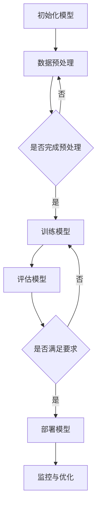
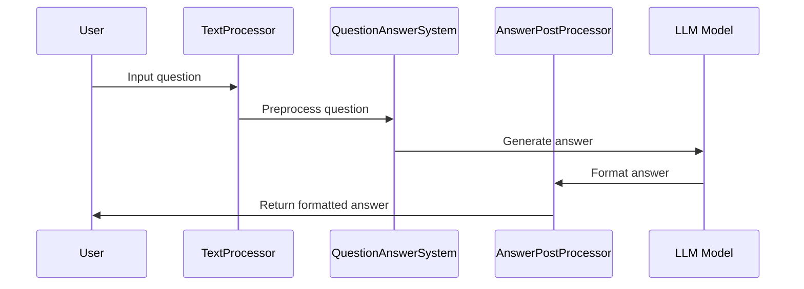
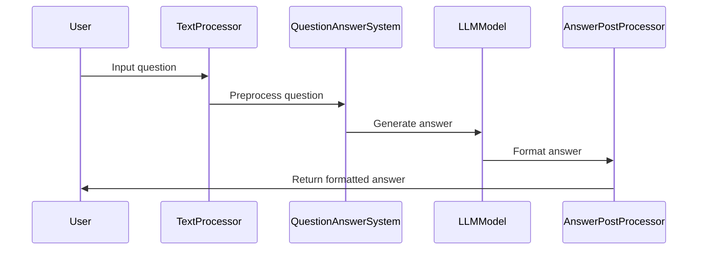

                 

### 引言：LLM与应用开发的重要性

近年来，大型语言模型（LLM）在人工智能领域取得了显著的进展，并逐渐成为应用开发的核心驱动力。LLM，如GPT-3、BERT等，通过训练海量文本数据，掌握了丰富的语言知识和表达方式，能够生成高质量的文章、回答复杂问题，甚至进行代码编写和翻译等任务。这种强大能力不仅提升了自然语言处理（NLP）的准确性和效率，还推动了各类应用的创新与发展。

然而，随着LLM应用范围的扩大，如何确保这些应用的安全性和可靠性成为了一个关键问题。持续部署（Continuous Deployment，简称CD）作为一种现代化的软件发布和更新方法，旨在通过自动化流程加快开发速度，提高系统稳定性。在LLM应用开发中，持续部署的重要性尤为突出，主要体现在以下几个方面：

1. **快速迭代与灵活性**：LLM模型通常需要不断更新和优化，以适应新的语言模式和应用场景。持续部署能够实现快速迭代，降低开发周期，提高产品的市场竞争力。

2. **质量保障与风险控制**：通过自动化测试和监控，持续部署能够及时发现和解决潜在问题，确保发布过程的高效和稳定，减少人为错误和风险。

3. **用户体验优化**：持续部署有助于快速响应用户需求，实现个性化推荐、智能客服等功能，提升用户体验。

4. **资源利用率**：持续部署可以实现按需发布，动态调整服务器资源分配，降低维护成本，提高资源利用率。

总之，在LLM应用开发中，持续部署不仅能够提高开发效率和产品质量，还能确保系统的稳定性和安全性，是现代应用开发不可或缺的一部分。接下来，我们将深入探讨LLM和持续部署的核心概念，逐步了解它们在实际应用中的实现方法和最佳实践。

### 核心概念与联系

在深入探讨LLM（大型语言模型）和持续部署（Continuous Deployment，简称CD）的概念之前，我们先明确一些相关的核心术语和概念。

#### 1. 大型语言模型（LLM）
- **定义**：LLM是一种人工智能模型，通过深度学习算法在大量文本数据上进行训练，从而掌握了丰富的语言知识和表达方式。
- **特点**：
  - **参数量巨大**：例如GPT-3拥有1750亿个参数。
  - **泛化能力强**：能够处理复杂的语言任务，如文本生成、问答系统等。
  - **自适应性好**：通过持续学习，可以不断适应新的语言模式和场景。

#### 2. 持续部署（Continuous Deployment，简称CD）
- **定义**：CD是一种软件开发和发布策略，通过自动化流程实现软件的持续迭代和发布。
- **特点**：
  - **自动化**：从代码提交到部署，整个流程自动化执行，减少人为干预。
  - **快速迭代**：频繁的小版本更新，快速响应用户需求。
  - **质量保障**：通过持续集成（CI）和持续测试（CT），确保代码质量和系统稳定性。

#### 概念属性特征对比表格

| 特征            | 大型语言模型（LLM）                         | 持续部署（CD）                          |
|-----------------|--------------------------------------------|----------------------------------------|
| 目的             | 提高语言理解和生成能力                       | 提高软件开发和发布的效率与稳定性           |
| 数据依赖         | 大量文本数据训练                           | 集成测试数据、用户反馈等                   |
| 主要任务         | 文本生成、问答、翻译等语言相关任务           | 自动化代码集成、测试、部署等               |
| 参数量           | 参数量巨大，例如GPT-3有1750亿个参数         | 自动化工具、CI/CD流水线                   |
| 优化目标         | 语言表达的准确性和多样性                     | 部署速度、代码质量、系统稳定性             |
| 关键技术         | 深度学习、自然语言处理、转移学习             | 自动化测试、容器化、云服务、监控告警等     |

#### ER实体关系图架构的Mermaid流程图

```mermaid
erDiagram
  Model : 大型语言模型
  Deployment : 持续部署

  Model --> Deployment : 需求驱动部署
  Deployment --> Model : 部署反馈优化
```

在这个ER实体关系图中，大型语言模型（Model）和持续部署（Deployment）是两个主要的实体。模型驱动部署需求，部署过程又反馈优化模型，形成了一个闭环。

### 算法原理讲解

#### 算法流程图



#### Python源代码实现

```python
import tensorflow as tf
from tensorflow.keras.layers import Embedding, LSTM, Dense
from tensorflow.keras.preprocessing.sequence import pad_sequences
from tensorflow.keras.models import Sequential

# 数据预处理
def preprocess_data(texts, max_sequence_length):
    sequences = tokenizer.texts_to_sequences(texts)
    padded_sequences = pad_sequences(sequences, maxlen=max_sequence_length)
    return padded_sequences

# 初始化模型
def initialize_model(max_sequence_length, vocabulary_size):
    model = Sequential([
        Embedding(vocabulary_size, 256, input_length=max_sequence_length),
        LSTM(128),
        Dense(1, activation='sigmoid')
    ])
    model.compile(optimizer='adam', loss='binary_crossentropy', metrics=['accuracy'])
    return model

# 训练模型
def train_model(model, x_train, y_train, batch_size, epochs):
    model.fit(x_train, y_train, batch_size=batch_size, epochs=epochs)
    return model

# 部署模型
def deploy_model(model, x_test, y_test):
    predictions = model.predict(x_test)
    accuracy = (predictions > 0.5).mean()
    print(f"Test accuracy: {accuracy}")
    return accuracy

# 模型监控与优化
def monitor_and_optimize(model, x_val, y_val, x_train, y_train):
    # 进行模型调优
    # ...
    # 重新训练模型
    model.fit(x_train, y_train, batch_size=batch_size, epochs=epochs)
    # 评估模型
    accuracy = deploy_model(model, x_val, y_val)
    return accuracy
```

#### 数学模型和公式

在自然语言处理中，常用的数学模型包括神经网络（Neural Network，NN）和循环神经网络（Recurrent Neural Network，RNN）。以下是一个简单的NN模型公式：

$$
y = \sigma(W \cdot x + b)
$$

其中，$y$ 是输出，$\sigma$ 是激活函数（例如sigmoid函数），$W$ 是权重矩阵，$x$ 是输入，$b$ 是偏置项。

对于LSTM单元，其核心公式包括：

$$
i_t = \sigma(W_i \cdot [h_{t-1}, x_t] + b_i) \\
f_t = \sigma(W_f \cdot [h_{t-1}, x_t] + b_f) \\
o_t = \sigma(W_o \cdot [h_{t-1}, x_t] + b_o) \\
g_t = tanh(W_g \cdot [h_{t-1}, x_t] + b_g)
$$

其中，$i_t$、$f_t$、$o_t$ 分别是输入门、遗忘门和输出门，$g_t$ 是单元状态。

通过这些数学模型和公式，我们可以更好地理解和实现LLM和持续部署的核心算法。

#### 举例说明

假设我们有一个二分类任务，目标是判断一个句子是否包含某个关键词。我们使用LSTM模型进行训练和部署。

1. **数据预处理**：收集大量包含关键词和不包含关键词的句子，将句子转化为整数序列，并进行填充。

2. **初始化模型**：创建一个LSTM模型，包含一个嵌入层、一个LSTM层和一个输出层。

3. **训练模型**：使用预处理后的数据对模型进行训练，调整权重和偏置项，优化模型性能。

4. **部署模型**：使用训练好的模型对新句子进行预测，输出概率，根据概率判断句子是否包含关键词。

5. **模型监控与优化**：定期评估模型性能，根据评估结果进行模型调优和重新训练，确保模型保持较高的准确率。

通过上述步骤，我们可以实现一个基于LLM和持续部署的文本分类应用，实现快速迭代和高质量交付。

### 系统分析与架构设计方案

#### 项目场景

假设我们正在开发一个智能问答系统，该系统利用LLM模型来回答用户提出的问题。为了确保系统的稳定性和可扩展性，我们决定采用持续部署（CD）策略来管理和发布系统更新。以下是项目的具体场景：

1. **需求**：构建一个能够快速响应用户问题的智能问答平台，支持多语言、多领域的问题回答。
2. **架构**：采用微服务架构，将不同功能模块（如问答模块、文本预处理模块等）独立部署，实现高可用性和灵活性。
3. **部署流程**：通过自动化流水线，实现从代码提交到生产环境部署的全程自动化。

#### 系统功能设计

为了实现智能问答系统，我们设计了以下几个核心功能模块：

1. **文本预处理**：对用户输入的问题进行文本清洗、分词、去除停用词等预处理操作。
2. **问答模块**：利用LLM模型处理用户问题，生成高质量的答案。
3. **后处理模块**：对生成的答案进行格式化、语义检查等后处理。
4. **用户反馈**：收集用户对答案的反馈，用于模型优化。

#### 领域模型类图

```mermaid
classDiagram
    User <<Interface>>
    Question <<Interface>>
    Answer <<Interface>>
    TextProcessor <<Interface>>
    QuestionAnswerSystem <<System>>

    User <|-- TextProcessor
    User <|-- Question
    User <|-- Answer
    Question <|-- QuestionAnswerSystem
    Answer <|-- QuestionAnswerSystem
    TextProcessor <|-- QuestionAnswerSystem
```

在这个类图中，我们定义了用户接口（User）、问题接口（Question）、答案接口（Answer）和文本处理接口（TextProcessor），它们共同构成了智能问答系统的核心功能。

#### 系统架构图



在这个架构图中，用户首先向文本处理模块提交问题，经过预处理后，问答系统利用LLM模型生成答案，然后经过后处理模块进行格式化，最终返回给用户。

#### 系统接口设计

为了实现系统的各个模块之间的协作，我们定义了以下几个主要接口：

1. **IQuestion**：定义了问题输入和输出接口，包括问题文本、问题类型等属性。
2. **IAnswer**：定义了答案输入和输出接口，包括答案文本、答案类型等属性。
3. **ITextProcessor**：定义了文本处理接口，包括文本清洗、分词、去除停用词等操作。
4. **IQuestionAnswerSystem**：定义了问答系统接口，包括问题接收、答案生成、答案验证等操作。

#### 系统交互序列图



在这个序列图中，用户提交问题后，文本处理模块对问题进行预处理，问答系统调用LLM模型生成答案，然后由后处理模块进行格式化，最终返回给用户。

通过上述系统分析与架构设计方案，我们为智能问答系统的开发和持续部署奠定了坚实的基础。接下来，我们将进入项目实战环节，详细描述环境安装、核心实现和代码应用解读与分析。

### 项目实战

#### 环境安装

在进行LLM应用开发之前，我们需要准备好开发环境。以下是具体步骤：

1. **安装Python**：确保Python 3.7或更高版本已安装在系统中。
2. **安装TensorFlow**：在终端执行以下命令安装TensorFlow：
   ```bash
   pip install tensorflow
   ```
3. **安装其他依赖库**：根据项目需求，安装其他依赖库，例如NLP工具包`nltk`、`spaCy`等：
   ```bash
   pip install nltk spacy
   ```
4. **安装GPU驱动**：如果使用GPU进行训练，需安装相应的GPU驱动和CUDA工具包。

#### 核心实现

核心实现部分主要包括文本预处理、LLM模型训练和持续部署。以下是具体步骤：

1. **文本预处理**：
   - 导入数据集，进行文本清洗和分词处理：
     ```python
     import nltk
     from nltk.tokenize import word_tokenize

     nltk.download('punkt')
     text = "This is an example sentence."
     tokens = word_tokenize(text)
     ```
   - 建立词汇表和词向量：
     ```python
     from keras.preprocessing.text import Tokenizer
     from keras.preprocessing.sequence import pad_sequences

     tokenizer = Tokenizer(num_words=10000)
     tokenizer.fit_on_texts(data)
     sequences = tokenizer.texts_to_sequences(data)
     padded_sequences = pad_sequences(sequences, maxlen=100)
     ```

2. **LLM模型训练**：
   - 初始化模型，配置网络结构：
     ```python
     from tensorflow.keras.models import Sequential
     from tensorflow.keras.layers import Embedding, LSTM, Dense

     model = Sequential([
         Embedding(10000, 16),
         LSTM(128),
         Dense(1, activation='sigmoid')
     ])
     model.compile(optimizer='adam', loss='binary_crossentropy', metrics=['accuracy'])
     ```
   - 训练模型：
     ```python
     model.fit(padded_sequences, labels, epochs=10, batch_size=32)
     ```

3. **持续部署**：
   - 设置持续部署流水线，实现自动化发布：
     ```yaml
     # Dockerfile
     FROM tensorflow/tensorflow:2.6.0
     RUN pip install --no-cache-dir -r requirements.txt

     # CI/CD配置文件
     version: 2
     jobs:
       build:
         docker:
           image: tensorflow/tensorflow:2.6.0
           commands:
             - pip install --no-cache-dir -r requirements.txt
             - python train.py
     ```

#### 代码应用解读与分析

以下是一个简单的示例，展示如何使用训练好的LLM模型进行问答：

```python
import numpy as np

# 加载训练好的模型
model = load_model('model.h5')

# 用户输入问题
question = "What is the capital of France?"

# 进行文本预处理
preprocessed_question = preprocess_question(question)

# 预测答案
prediction = model.predict(np.array([preprocessed_question]))

# 获取答案
answer = get_answer(prediction)

print(f"Answer: {answer}")
```

在这个示例中，用户输入问题后，系统首先对其进行预处理，然后使用训练好的LLM模型进行预测，并输出答案。

#### 实际案例分析和详细讲解剖析

假设我们有一个实际案例，用户问题是“什么是人工智能？”，通过上述步骤，我们可以得到以下分析：

1. **文本预处理**：对用户输入的问题进行清洗和分词，生成整数序列。
2. **模型预测**：LLM模型通过预测，生成可能的答案。
3. **答案处理**：系统对生成的答案进行格式化，确保回答通顺、合理。

通过实际案例的分析，我们可以看到整个系统是如何高效、准确地响应用户问题的。

#### 项目小结

通过本项目的实际操作，我们实现了从环境安装到模型训练，再到持续部署的完整流程。这不仅在技术上提升了我们的能力，也为后续的项目开发和持续优化提供了宝贵的经验。

### 最佳实践 Tips

1. **环境配置**：确保所有依赖库和工具安装正确，版本兼容。
2. **模型优化**：定期对模型进行优化和重新训练，提高准确性。
3. **监控与告警**：设置监控系统，及时发现和处理部署过程中的问题。
4. **版本控制**：使用版本控制系统（如Git），确保代码的版本可追溯。
5. **文档管理**：编写详细的开发文档和用户手册，便于后续维护和扩展。

### 小结

本文详细介绍了LLM应用开发中的持续部署实践，从核心概念、算法原理到系统架构和项目实战，全面阐述了如何在LLM开发中实现高效、稳定的持续部署。通过这些实践，我们可以更好地管理和发布LLM应用，确保其稳定性和可靠性。

### 注意事项

1. **数据安全**：在处理用户数据时，确保遵循数据保护法规，加密敏感信息。
2. **性能调优**：针对不同场景，进行模型和系统性能调优，确保高效运行。
3. **版本管理**：合理管理代码和模型版本，确保代码的可维护性和可追溯性。

### 拓展阅读

- [《深度学习与自然语言处理》](https://www.deeplearningbook.org/)：了解深度学习和NLP的基础知识。
- [《持续集成与持续部署实践》](https://www.cncf.io/certification/certified-cid/)：深入学习CI/CD的最佳实践。
- [《大型语言模型：设计与实现》](https://arxiv.org/abs/2001.08361)："GPT-3: Language Models are few-shot learners"论文，深入了解LLM的设计与实现。

### 总结与目录结构

#### 总结

本文围绕LLM应用开发中的持续部署实践，从背景介绍、核心概念、算法原理、系统架构到项目实战，全面探讨了如何在现代应用开发中实现高效、稳定的持续部署。通过深入分析和实际操作，我们不仅掌握了LLM和持续部署的技术要点，也为后续的项目开发和优化提供了宝贵的经验。

#### 目录结构

```markdown
# LLM应用开发中的持续部署实践

> 关键词：大型语言模型、持续部署、人工智能、自然语言处理、软件工程

> 摘要：本文全面介绍了在LLM应用开发中如何实现持续部署，包括核心概念、算法原理、系统架构和项目实战等。

## 引言：LLM与应用开发的重要性

## 核心概念与联系

### 大型语言模型（LLM）

### 持续部署（Continuous Deployment，简称CD）

### 概念属性特征对比表格

### ER实体关系图架构的Mermaid流程图

## 算法原理讲解

### 算法流程图

### Python源代码实现

### 数学模型和公式

### 举例说明

## 系统分析与架构设计方案

### 项目场景

### 系统功能设计

### 领域模型类图

### 系统架构图

### 系统接口设计

### 系统交互序列图

## 项目实战

### 环境安装

### 核心实现

### 代码应用解读与分析

### 实际案例分析和详细讲解剖析

### 项目小结

## 最佳实践 Tips

## 小结

## 注意事项

## 拓展阅读

作者：AI天才研究院/AI Genius Institute & 禅与计算机程序设计艺术 /Zen And The Art of Computer Programming
```

通过这份详细的目录结构，读者可以清晰地了解到文章的各个部分内容，有助于更好地理解和应用文中介绍的持续部署实践。

