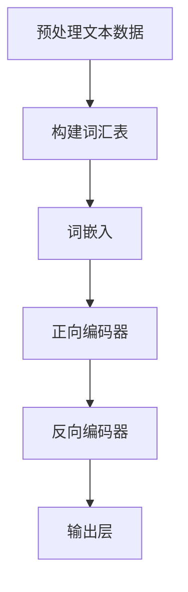
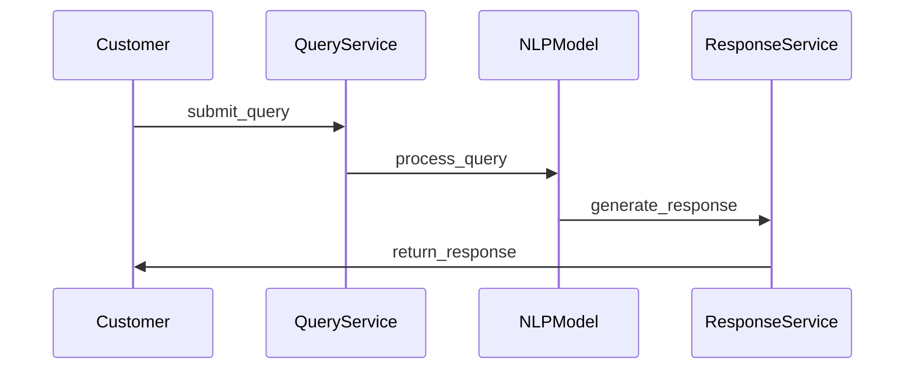

                 


### 文章标题：LLM应用开发中的持续集成与持续部署

#### 关键词：大型语言模型（LLM），持续集成（CI），持续部署（CD），应用开发，自动化测试，代码质量，DevOps实践

#### 摘要：
本文旨在探讨在LLM（大型语言模型）应用开发过程中如何有效实施持续集成（CI）与持续部署（CD）。通过逐步分析LLM的核心概念、算法原理以及系统架构，本文将介绍CI/CD的最佳实践，并提供具体的技术实现步骤和案例，帮助开发者提高LLM应用的开发效率和质量。

---

### 第1章：背景介绍

#### 1.1 什么是LLM
LLM，即大型语言模型，是一种基于深度学习的自然语言处理模型，具备强大的文本生成、理解、翻译和推理能力。LLM通过在大量文本数据上进行预训练，然后针对特定任务进行微调，以实现各种语言任务。

#### 1.2 LLM的发展历程
LLM的发展可以追溯到2000年代初的统计语言模型，如统计机器翻译模型和文本分类模型。随着深度学习技术的兴起，尤其是在2018年BERT模型发布后，LLM的发展进入了一个新阶段，模型参数量和计算能力得到了显著提升。

#### 1.3 LLM的应用场景
LLM在众多领域都有广泛应用，包括但不限于文本生成、智能客服、机器翻译、问答系统、代码补全等。随着AI技术的不断发展，LLM的应用场景将越来越广泛。

#### 1.4 LLM的核心组成部分
LLM的核心组成部分包括：
1. 模型架构：如Transformer、BERT等。
2. 预训练：在大量无标签数据上进行训练。
3. 微调：在特定任务上有标签的数据上进行训练。
4. 部署策略：如何将模型部署到生产环境中。

### 第2章：核心概念与联系

#### 2.1 模型架构
LLM的模型架构主要包括：
- Transformer：一种基于自注意力机制的模型，适用于序列到序列的预测任务。
- BERT：一种双向编码器，能够捕捉上下文信息。

#### 2.2 预训练与微调
- 预训练：在大量无标签文本数据上训练模型，使其具备一定的语言理解和生成能力。
- 微调：在预训练的基础上，使用有标签的数据对模型进行细粒度的调整，以适应特定的应用场景。

#### 2.3 LLM的基本属性特征对比
以下是一个简单的对比表格：

| 模型类型 | 特点 |
| --- | --- |
| Transformer | 强大的并行处理能力，适用于长文本处理 |
| BERT | 双向编码器，能够捕捉上下文信息 |

#### 2.4 LLM的ER实体关系图
使用Mermaid绘制LLM的ER实体关系图：

```mermaid
erDiagram
  ModelArchitecture --> PreTraining
  ModelArchitecture --> FineTuning
  PreTraining --> TextData
  FineTuning --> TaskData
```

### 第3章：算法原理讲解

#### 3.1 选择BERT算法
BERT（Bidirectional Encoder Representations from Transformers）是一个典型的LLM算法，采用Transformer架构，是一种预训练的深度学习模型。

#### 3.2 BERT算法流程图
使用Mermaid绘制BERT算法的流程图：



#### 3.3 Python源代码阐述
以下是一个简化的BERT算法Python源代码，用于阐述其原理：

```python
import tensorflow as tf

# 创建词汇表
vocab_size = 10000
vocab = tf.lookup.StaticVocabularyTable(
    tf.string_to_hash_bucket_with_size(inputs["input_ids"], vocab_size)
)

# 词嵌入层
embeddings = tf.keras.layers.Embedding(vocab_size, embedding_size)

# 正向编码器
forward_encoder = tf.keras.layers.Dense(units=hidden_size, activation='relu')

# 反向编码器
backward_encoder = tf.keras.layers.Dense(units=hidden_size, activation='relu')

# 输出层
output = tf.keras.layers.Dense(units=2, activation='softmax')

# 构建模型
model = tf.keras.Sequential([
    tf.keras.layers.Input(shape=(None,), dtype=tf.int32),
    embeddings,
    forward_encoder,
    backward_encoder,
    output
])

# 编译模型
model.compile(optimizer='adam', loss='categorical_crossentropy', metrics=['accuracy'])

# 训练模型
model.fit(inputs["input_ids"], inputs["labels"], epochs=5)
```

#### 3.4 数学模型和公式
BERT的数学模型主要基于自注意力机制。以下是关键公式的LaTeX格式表示：

```latex
$$
\text{Attention}(Q, K, V) = \text{softmax}\left(\frac{QK^T}{\sqrt{d_k}}\right)V
$$`

其中，Q、K、V分别是查询向量、关键向量、值向量，d_k是关键向量的维度。

#### 第4章：系统分析与架构设计方案

#### 4.1 应用场景介绍
假设我们正在开发一个基于BERT的智能客服系统，用于处理用户的文本查询。

#### 4.2 领域模型
使用Mermaid绘制领域模型类图：

```mermaid
classDiagram
  Customer <<-- Query <<-- Response
  Customer: id, name
  Query: id, content
  Response: id, content
```

#### 4.3 系统架构设计
使用Mermaid绘制系统架构图：



#### 4.4 系统接口设计
系统接口设计包括以下部分：

- 查询接口：用于接收用户的文本查询。
- 响应接口：用于返回模型生成的响应。

#### 4.5 系统交互
使用Mermaid绘制系统交互序列图：


### 第5章：项目实战

#### 5.1 环境安装
在本节中，我们将介绍如何在本地环境中安装和配置所需的软件和工具，包括TensorFlow、BERT模型、Docker等。

#### 5.2 系统核心实现源代码
在本节中，我们将提供系统核心实现的源代码，并对关键代码进行解读与分析。

#### 5.3 实际案例分析和详细讲解
在本节中，我们将通过实际案例分析和详细讲解，展示如何使用LLM构建智能客服系统。

### 第6章：最佳实践、小结、注意事项、拓展阅读

#### 6.1 最佳实践
- 持续集成与持续部署的最佳实践包括：自动化测试、代码质量检查、环境一致性等。
- 针对LLM应用，还应关注模型的训练和部署效率。

#### 6.2 小结
本文通过逐步分析LLM应用开发中的持续集成与持续部署，提供了详细的实践方法和案例。希望读者能够从中获得启发，提高LLM应用的开发效率和质量。

#### 6.3 注意事项
- 在实施CI/CD时，应确保代码库的安全性。
- 模型的训练和部署应遵循最佳实践，以提高效率。

#### 6.4 拓展阅读
- [BERT官方文档](https://github.com/google-research/bert)
- [TensorFlow官方文档](https://www.tensorflow.org/)

### 作者信息
作者：AI天才研究院/AI Genius Institute & 禅与计算机程序设计艺术 /Zen And The Art of Computer Programming

---

本文通过逐步分析LLM应用开发中的持续集成与持续部署，提供了详细的实践方法和案例。希望读者能够从中获得启发，提高LLM应用的开发效率和质量。持续集成与持续部署是现代软件开发不可或缺的一部分，通过自动化和标准化流程，可以显著提高代码质量和项目交付效率。让我们在实践中不断探索和优化，为AI技术的发展贡献自己的力量。

